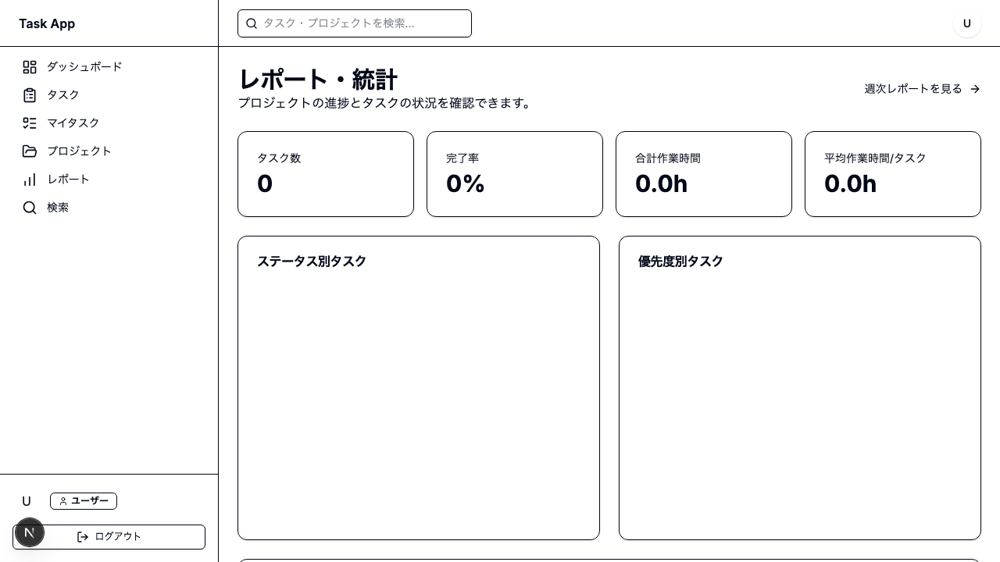
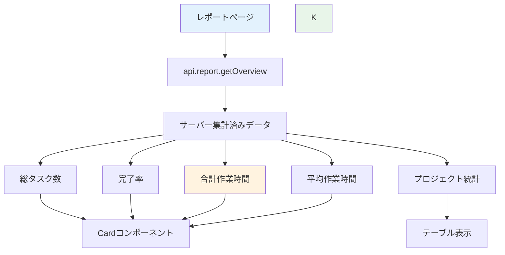

# Day 21: 統計カードを表示しよう

## 前回の振り返り

Day 20 ではキーワードや複数フィルターで
タスクを検索するページを作りました。
今日は集計データを統計カードで表示します。

---

## 今日のゴール

レポートページに統計カードを表示します。
完成版 source と同じく `api.report.getOverview`
でサーバー集計済みの概要データを受け取り、
4枚のカードで概要を表示します。

完成イメージ: 4枚の統計カードとプロジェクト統計テーブルが並んだレポートページです。



## なぜこれを作るのか？

プロジェクトの状況を一目で把握するための
ダッシュボード機能です。

> **例え話**: タスクを10個登録したとき、
> 「いくつ終わったっけ？」と1つずつ数えるのは
> 大変ですよね。統計カードがあれば完了率や
> 作業時間が一目でわかります。

### 今日のスコープ

| 区分 | 内容 |
|------|------|
| 対象ファイル | `src/app/report/page.tsx` |
| 今日作る範囲 | 統計カード4枚 + プロジェクト統計テーブル |
| 実コードとの違い | 実コードにはグラフ（Day 22）や週次リンク（Day 23）もあるが今日は扱わない |

### レポートページのデータフロー



### やること / やらないこと

| やること | やらないこと |
|---------|-------------|
| タスク総数の表示 | 専用の統計API作成 |
| 完了率の計算 | グラフ表示（Day 22） |
| 作業時間の集計 | 週次レポート（Day 23） |
| Cardコンポーネント使用 | 専用コンポーネント作成 |

### 新しく学ぶ概念

| 概念 | 読み方 | 役割 | 例え |
|------|--------|------|------|
| getOverview | ゲットオーバービュー | レポート用の集計済みAPI | 店員さんが合計済みのレシートを渡す |
| groupBy | グループバイ | サーバー側で件数を集計 | 種類ごとに仕分けして数える |
| aggregate | アグリゲート | 合計値をまとめて計算 | レジで合計金額を出す |
| toFixed | トゥフィクスト | 小数点の桁数を丸める | 小数第1位まで表示 |

## 実装ステップ一覧

| ステップ | 作業内容 | 所要時間 |
|---------|---------|---------|
| Step 1 | サーバー集計の考え方 | 3分 |
| Step 2 | import 文を書く | 3分 |
| Step 3 | ページの骨組みを作る | 5分 |
| Step 4 | データを取得する | 3分 |
| Step 5 | 統計値を計算する | 5分 |
| Step 6 | ローディング判定を追加 | 3分 |
| Step 7 | 統計カードを表示する | 5分 |
| Step 8 | プロジェクト統計テーブル | 5分 |
| Step 9 | 動作確認 | 3分 |

**合計時間**: 約35分

---

### Step 0: レポート API を有効化する（2分）

`src/server/api/root.ts` に report ルーターを追加します。

```typescript
// filepath: src/server/api/root.ts（import を追加）
import { reportRouter } from './routers/report';

// appRouter に追加
  report: reportRouter,
```

**確認ポイント**: `report: reportRouter` を追加しました。

---

### Step 1 : サーバー集計の考え方（3分）

**ゴール**: なぜ完成版 source では
専用の集計APIを使うのかを理解します。

#### 2つの集計方法の比較

| 方法 | 仕組み | メリット | デメリット |
|------|--------|---------|-----------|
| サーバー集計 | APIが計算済み値を返す | 件数が増えても正確・高速 | API設計が必要 |
| ローカル集計 | 生データから計算 | 試作は早い | 一覧APIの件数上限に引きずられやすい |

> 初期案では `api.task.getAll` と
> `api.project.getAll` をクライアントで
> 集計することもできますが、完成版 source は
> `api.report.getOverview` に統合しています。
> これは「100件を超えても統計が欠けない」
> 状態を守るためです。

#### `getOverview` が返すもの

`api.report.getOverview` は、完成版 source で
必要な集計をサーバー側でまとめて返します。
クライアントは「計算する側」ではなく
「受け取って表示する側」に集中します。

| プロパティ | 内容 |
|-----------|------|
| `totalTasks` | 対象プロジェクト全体のタスク数 |
| `completionRate` | 完了率（整数パーセント） |
| `totalTimeSpent` | 合計作業時間（分） |
| `averageTimePerTask` | 1タスクあたり平均作業時間（分） |
| `projectStats` | プロジェクト別の集計済み配列 |

```typescript
// filepath: src/app/report/page.tsx
// Step 3 以降でこの API を実際に呼び出します
api.report.getOverview.useQuery();
```

**確認ポイント**:
- 完成版 source がサーバー集計を選んだ理由を理解した
- 一覧APIと統計APIは責務を分けるべきだと理解した

---

### Step 2 : import 文を書く（3分）

**ゴール**: 必要なモジュールを読み込みます。

まず `src/app/report/page.tsx` を新規作成し、
先頭に以下の import を書きます。

**実装**:

```typescript
// filepath: src/app/report/page.tsx
'use client';

import { AppLayout }
  from '@/component/layout/app-layout';
```

**確認ポイント**:
- ファイルを新規作成した
- `'use client'` を先頭に書いた

```typescript
// filepath: src/app/report/page.tsx
// shadcn/ui のカード部品
import {
  Card, CardContent,
  CardHeader, CardTitle,
} from '@/component/ui/card';
// ローディング表示
import { PageLoadingSpinner }
  from '@/component/ui/loading-spinner';
```

**確認ポイント**:
- `Card` 関連をインポートした
- `PageLoadingSpinner` をインポートした

```typescript
// filepath: src/app/report/page.tsx
// テーブル部品（プロジェクト統計用）
import {
  Table, TableBody, TableCell,
  TableHead, TableHeader, TableRow,
} from '@/component/ui/table';
```

**確認ポイント**:
- テーブル関連の部品をインポートした

```typescript
// filepath: src/app/report/page.tsx
// APIクライアント
import { api } from '@/trpc/react';
```

**確認ポイント**:
- `api` をインポートした
- 保存してエラーが出ないこと

---

### Step 3 : ページの骨組みを作る（5分）

**ゴール**: ReportPage コンポーネントの
骨組みを作ります。サイドバーの「レポート」を
クリックして表示を確認します。

> この時点では中身はまだ空です。
> 見出しと説明文だけが表示されます。

**実装**:

```typescript
// filepath: src/app/report/page.tsx
// コンポーネント本体（骨組み）
export default function ReportPage() {
  // Step 4〜6 でここにフックを追加

  return (
    <AppLayout>
      <div className="space-y-6">
        <div>
          <h1 className="text-3xl
            font-bold tracking-tight">
            レポート・統計
          </h1>
```

**確認ポイント**:
- 関数コンポーネントを定義した
- `AppLayout` で囲んだ

```typescript
// filepath: src/app/report/page.tsx
// 骨組み続き: 説明文と閉じタグ
          <p className=
            "text-muted-foreground">
            プロジェクトの進捗とタスクの
            状況を確認できます。
          </p>
        </div>
        {/* Step 7〜8 でカード等を追加 */}
      </div>
    </AppLayout>
  );
}
```

**確認ポイント**:
- `/report` にアクセスして表示される
- 見出しと説明文が表示される

骨組み確認: 見出し「レポート・統計」と説明文だけが表示された状態です。


---

### Step 4 : データを取得する（3分）

**ゴール**: tRPC の `getOverview` で
集計済みデータをまとめて取得します。

> **配置場所**: Step 3 のコメント
> `// Step 4〜6 でここにフックを追加`
> の位置に追加します。`return` 文の**前**です。

**実装**:

```typescript
// filepath: src/app/report/page.tsx
// ReportPage 内、return 文の前に追加
const { data: overview, isLoading } =
  api.report.getOverview.useQuery();
```

> `getOverview` の中では
> `count` `aggregate` `groupBy` が使われ、
> 100件を超えるデータでもサーバー側で
> 正しい統計が作られます。

**確認ポイント**:
- 2つのAPIを同時に呼んでいる
- 保存してエラーが出ないこと

---

### Step 5 : 受け取った概要データを読む（5分）

**ゴール**: `overview` のどのプロパティを
どのカードに使うか整理します。

> **配置場所**: Step 4 の `useQuery` の
> 直後に続けて追加します。

**実装**:

```typescript
// filepath: src/app/report/page.tsx
// JSX で使う主な値
const totalTasks = overview?.totalTasks ?? 0;
const completionRate = overview?.completionRate ?? 0;
const totalTimeHours =
  ((overview?.totalTimeSpent ?? 0) / 60).toFixed(1);
const averageTimeHours =
  ((overview?.averageTimePerTask ?? 0) / 60).toFixed(1);
```

> 完成版 source では、
> `overview.totalTimeSpent` と
> `overview.averageTimePerTask` は
> 分単位で返るので、表示時だけ `/ 60` して
> `toFixed(1)` で時間表記にします。

**確認ポイント**:
- 4枚のカードが `overview` を元に表示される
- 集計計算をクライアント側で書いていない

#### 各統計値の計算ロジック

| 統計値 | 計算方法 | 使う関数 |
|--------|---------|---------|
| 総タスク数 | `overview.totalTasks` | server 集計結果 |
| 完了率 | `overview.completionRate` | server 集計結果 |
| 合計時間 | `overview.totalTimeSpent / 60` | 表示時だけ時間換算 |
| 平均時間 | `overview.averageTimePerTask / 60` | 表示時だけ時間換算 |

---

### Step 6 : ローディング判定を追加（3分）

**ゴール**: データ取得中にスピナーを
表示する early return を追加します。

> **配置場所**: Step 4〜5 の
> データ取得・値の準備の**下**、
> `return` 文の**前**に追加します。

**実装**:

```typescript
// filepath: src/app/report/page.tsx
// 値の準備の下、return 文の前に追加
if (isLoading) {
  return <PageLoadingSpinner />;
}
```

> **early return** とは、条件を満たしたら
> 本来の表示（カード等）を返さず、先に
> スピナーを返して処理を終える書き方です。

**確認ポイント**:
- ローディング中にスピナーが表示される
- `getOverview` の結果待ちだけを判定している

ローディング確認: データ読み込み中にスピナーが画面中央に表示されます。


---

### Step 7 : 統計カードを表示する（5分）

**ゴール**: 4枚のカードで統計を表示します。

> 以下の JSX は Step 3 の `return` 内、
> コメント
> `{/* Step 7〜8 でカード等を追加 */}`
> の位置に追加します。

**実装**:

```typescript
// filepath: src/app/report/page.tsx
// 統計カード: タスク数と完了率
<div className="grid grid-cols-1
  sm:grid-cols-2 lg:grid-cols-4
  gap-4">
  <Card>
    <CardContent className="pt-6">
      <p className="text-sm
        text-muted-foreground mb-1">
        タスク数</p>
      <p className="text-3xl font-bold">
        {overview?.totalTasks ?? 0}</p>
    </CardContent>
  </Card>
```

**確認ポイント**:
- グリッドの開始タグを書いた
- 1枚目のカードが表示される

```typescript
// filepath: src/app/report/page.tsx
// 統計カード: 完了率カード
  <Card>
    <CardContent className="pt-6">
      <p className="text-sm
        text-muted-foreground mb-1">
        完了率</p>
      <p className="text-3xl font-bold">
        {overview?.completionRate ?? 0}%</p>
    </CardContent>
  </Card>
```

**確認ポイント**:
- 完了率がパーセント表示される
- 保存してエラーが出ないこと

```typescript
// filepath: src/app/report/page.tsx
// 統計カード: 合計と平均の作業時間
  <Card>
    <CardContent className="pt-6">
      <p className="text-sm
        text-muted-foreground mb-1">
        合計作業時間</p>
      <p className="text-3xl font-bold">
        {((overview?.totalTimeSpent ?? 0) / 60)
          .toFixed(1)}h</p>
    </CardContent>
  </Card>
```

**確認ポイント**:
- 分を時間に変換（÷60）している
- `toFixed(1)` で小数1桁に丸めている

```typescript
// filepath: src/app/report/page.tsx
// 統計カード: 平均作業時間 + grid閉じ
  <Card>
    <CardContent className="pt-6">
      <p className="text-sm
        text-muted-foreground mb-1">
        平均作業時間/タスク</p>
      <p className="text-3xl font-bold">
        {((overview?.averageTimePerTask ?? 0) / 60)
          .toFixed(1)}h</p>
    </CardContent>
  </Card>
</div>
```

**確認ポイント**:
- 4枚のカードが表示される
- 正しい数値が表示される

カード確認: 4枚の統計カードがグリッドで並んで表示されています。


---

### Step 8 : プロジェクト統計テーブル（5分）

**ゴール**: プロジェクトごとの統計を
テーブルで表示します。

完成版 source では、プロジェクト別集計も
`overview.projectStats` に入って返ってきます。

**実装**:

```typescript
// filepath: src/app/report/page.tsx
// projectStats は server 側で集計済み
{overview?.projectStats.map((stat) => (
  <TableRow key={stat.id}>
    <TableCell className="font-medium">
      {stat.name}
    </TableCell>
    <TableCell className="text-right">
      {stat.totalTasks}
    </TableCell>
    <TableCell className="text-right">
      {stat.completedTasks}
    </TableCell>
    <TableCell className="text-right">
      {stat.progress.toFixed(1)}%
    </TableCell>
    <TableCell className="text-right">
      {stat.totalTimeHours.toFixed(1)}h
    </TableCell>
  </TableRow>
))}
```

**確認ポイント**:
- `overview.projectStats` をそのまま描画している
- クライアント側で `filter` / `reduce` を再実行していない

次に、Step 7 のカードグリッドの `</div>` の
直後にテーブルの JSX を追加します。

```typescript
// filepath: src/app/report/page.tsx
// テーブル: ヘッダー部分
<Card>
  <CardHeader>
    <CardTitle>
      プロジェクト統計</CardTitle>
  </CardHeader>
  <CardContent>
    <Table>
      <TableHeader>
        <TableRow>
          <TableHead className="w-[200px]">
            プロジェクト</TableHead>
          <TableHead className="text-right">
            タスク数</TableHead>
```

**確認ポイント**:
- `Card` の中に `Table` を配置している
- ヘッダー行を書いた

```typescript
// filepath: src/app/report/page.tsx
// テーブル: ヘッダー残りと閉じタグ
          <TableHead className="text-right">
            完了</TableHead>
          <TableHead className="text-right">
            進捗</TableHead>
          <TableHead className="text-right">
            作業時間</TableHead>
        </TableRow>
      </TableHeader>
```

**確認ポイント**:
- 5列のヘッダーが揃った
- 次のブロックで行データを追加する

```typescript
// filepath: src/app/report/page.tsx
// テーブル: 行データと閉じタグ
      <TableBody>
        {overview?.projectStats.map((stat) => (
          <TableRow key={stat.id}>
            <TableCell
              className="font-medium">
              {stat.name}</TableCell>
            <TableCell
              className="text-right">
              {stat.totalTasks}</TableCell>
            <TableCell
              className="text-right">
              {stat.completedTasks}
            </TableCell>
```

**確認ポイント**:
- `map` でプロジェクトごとに行を生成
- `key` にプロジェクトIDを指定

```typescript
// filepath: src/app/report/page.tsx
// テーブル: 残り列と全閉じタグ
            <TableCell
              className="text-right">
              {stat.progress.toFixed(1)}%</TableCell>
            <TableCell
              className="text-right">
              {stat.totalTimeHours.toFixed(1)}h
            </TableCell>
          </TableRow>
        ))}
      </TableBody>
    </Table>
  </CardContent>
</Card>
```

**確認ポイント**:
- プロジェクト統計テーブルが表示される
- 名前・タスク数・完了数・進捗・時間が並ぶ

---

### Step 9 : 動作確認（3分）

**ゴール**: 統計カードの表示を確認します。

```bash
# filepath: ターミナル（確認用）
PORT=3001 npm run dev
# http://localhost:3001/report にアクセス
```

ブラウザの DevTools を開き（`F12` キー）、
画面幅を変更してカードの並びを確認します。

1. `/report` にアクセス
2. 4枚のカードが表示される
3. 総タスク数がタスク件数と一致
4. 完了率が正しく計算されている
5. 作業時間が時間（h）で表示される
6. ブラウザ幅を変えてレスポンシブ確認

#### グリッドのブレークポイント

| 画面サイズ | クラス | 列数 |
|-----------|--------|------|
| モバイル | `grid-cols-1` | 1列 |
| タブレット | `sm:grid-cols-2` | 2列 |
| PC | `lg:grid-cols-4` | 4列 |

> Day 09 のプロジェクト一覧や
> Day 13 のタスク一覧で使った
> レスポンシブグリッドと同じパターンです。

**確認ポイント**:
- 数値がシードデータと一致する
- カードが正しくグリッド表示される
- ブラウザ幅を変えると列数が変わる

レスポンシブ確認: モバイル幅で1列、PC幅で4列にカードの並びが変わります。


---


---

### Pro パターンで書こう — 統計レイアウトの Server/Client 分離

### Before（動くけど、プロは書かない）

```typescript
// filepath: src/app/report/page.tsx（参考）
"use client";
export default function ReportPage() {
  const { data } = api.report.getOverview.useQuery();
  return (
    <AppLayout>
      <h1>レポート</h1>
      <div className="grid grid-cols-4 gap-4">
        <StatCard title="総タスク" value={data?.totalTasks ?? 0} />
        <StatCard title="完了" value={data?.completedTasks ?? 0} />
      </div>
    </AppLayout>
  );
}
```

**このコードの問題点**:

- ページ全体が Client Component。見出しやレイアウトまで JS で描画する必要がある
- SEO に不利（検索エンジンが中身を読めない可能性）

### After（プロが書くコード）

```typescript
// filepath: src/app/report/page.tsx（参考）
// page.tsx (Server Component)
export default function ReportPage() {
  return (
    <AppLayout>
      <h1>レポート</h1>
      <ReportContent />
    </AppLayout>
  );
}

// report-content.tsx ("use client")
"use client";
export function ReportContent() {
  const { data } = api.report.getOverview.useQuery();
  return (
    <div className="grid grid-cols-4 gap-4">
      <StatCard title="総タスク" value={data?.totalTasks ?? 0} />
      <StatCard title="完了" value={data?.completedTasks ?? 0} />
    </div>
  );
}
```

**このコードの強み**:

- 見出しとレイアウトはサーバーで事前描画
- Client Component はデータ取得部分だけ
- 初期表示が速く、SEO にも有利

#### 覚えておきたいエッセンス

ページコンポーネントはなるべく Server Component にして、データ取得する部分だけを "use client" の子コンポーネントに切り出します。

## 今日のまとめ

- [ ] `api.report.getOverview` の役割を理解した
- [ ] server 集計済みデータをカードに表示できた
- [ ] 4枚の統計カードを表示できた
- [ ] プロジェクト統計テーブルを表示できた
- [ ] レスポンシブグリッドを適用できた

## つまずきポイント

| エラー / 問題 | 原因 | 解決方法 |
|--------------|------|---------|
| NaN が表示される | `overview` が未取得のまま参照している | `?? 0` でフォールバック |
| 時間が分で表示 | 60で割り忘れ | `/ 60` で時間に変換 |
| カードが縦並び | グリッドクラス不足 | sm/lg ブレークポイント |

## 今日学んだ用語

| 用語 | 意味 |
|------|------|
| getOverview | レポート用の集計済みデータを返す API |
| groupBy | サーバー側で件数を分類して集計する処理 |
| toFixed(1) | 小数点以下1桁に丸める |
| aggregate | サーバー側で合計値をまとめて計算する処理 |
| early return | 条件付きで先に表示を返す手法 |

## 次回予告

Day 22 では、レポートページにグラフを追加
します。Recharts で円グラフを表示し、
タスクの分布を可視化します。
