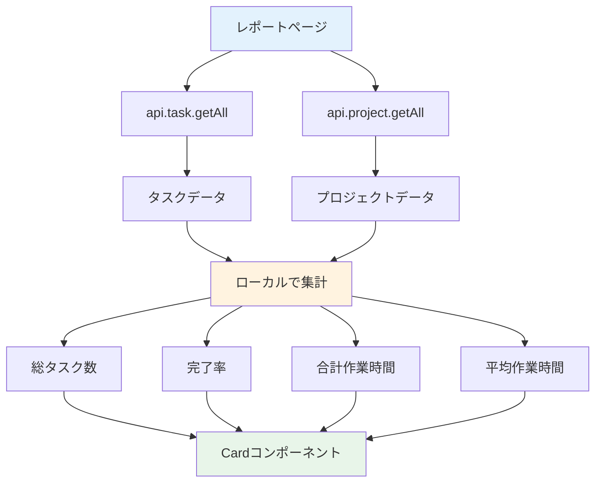

# Day 21: 統計カードを表示しよう

## 🔙 前回の振り返り

Day 20 ではキーワードや複数フィルターによるタスク検索ページを実装し、検索条件をURLパラメータに保存して共有できるようにしました。データの検索・絞り込みを学んだので、今日は集計したデータを統計カードとして表示するレポートページに取り組みます。

---

## 🎯 今日のゴール

レポートページに統計カードを表示します。
タスクとプロジェクトのデータをローカルで
集計し、4枚のカードで概要を表示します。

📸 スクリーンショット: レポートページに4枚の統計カードが並んだ完成イメージです。


## 🤔 なぜこれを作るのか？

プロジェクトの状況を一目で把握するための
ダッシュボード機能です。

> 💡 **例え話**: あなたが10個のタスクを登録
> したとき、「いくつ終わったっけ？」と1つずつ
> 数えるのは大変ですよね。統計カードがあれば
> タスク数や完了率が一目で把握できます。

### 📐 レポートページのデータフロー



### やること / やらないこと

| やること | やらないこと |
|---------|-------------|
| タスク総数の表示 | 専用の統計API作成 |
| 完了率の計算 | グラフ表示（Day 22） |
| 作業時間の集計 | 週次レポート（Day 23） |
| Cardコンポーネント使用 | 専用コンポーネント作成 |

### 🆕 新しく学ぶ概念

| 概念 | 読み方 | 役割 | 例え |
|------|--------|------|------|
| ローカル集計 | — | フロントで計算 | 自分で電卓を叩く |
| reduce | リデュース | 配列を1つの値に | 合計金額の計算 |
| toFixed | トゥフィクスト | 小数点の桁数を指定して丸める | 小数第1位まで表示 |
| useMemo | ユーズメモ | 計算結果をキャッシュ | 計算結果のメモ帳 |

## 📊 実装ステップ一覧

| ステップ | 作業内容 | 所要時間 |
|---------|---------|---------|
| Step 1 | ローカル集計の考え方 | 3分 |
| Step 2 | ページの土台を作る | 5分 |
| Step 3 | 統計値を計算する | 5分 |
| Step 4 | ローディング判定を追加 | 3分 |
| Step 5 | 統計カードを表示する | 5分 |
| Step 6 | 動作確認 | 3分 |

**合計時間**: 約24分

---

### Step 1: ローカル集計の考え方（3分）

🎯 **ゴール**: なぜ専用APIを使わず
ローカルで計算するのかを理解します。

#### 2つの集計方法の比較

| 方法 | 仕組み | メリット | デメリット |
|------|--------|---------|-----------|
| サーバー集計 | APIが計算済み値を返す | 通信量が少ない | API追加が必要 |
| ローカル集計 | 生データから計算 | APIの追加不要 | データ量が多いと重い |

> 💡 このアプリでは `api.task.getAll` と
> `api.project.getAll` のデータから
> JavaScript の `filter` と `reduce` で
> 統計値を計算します。

#### reduce の仕組み

`reduce` は配列の全要素を1つの値にまとめる
関数です。買い物リストの合計金額を電卓で
足していくイメージです。

```typescript
// filepath: src/app/report/page.tsx
// reduceの基本: 配列を1つの値にまとめる
// [100, 200, 150].reduce(
//   (acc, price) => acc + price, 0
// ) → 450（合計金額）
```

| 要素 | acc（累積値） | 処理 |
|------|-------------|------|
| 1個目 | 0 | 0 + 100 = 100 |
| 2個目 | 100 | 100 + 200 = 300 |
| 3個目 | 300 | 300 + 150 = 450 |
| 結果 | 450 | 合計金額 |

> 💡 `useMemo` は計算結果のメモ帳です。
> データが変わっていないのに毎回計算し直す
> のは無駄なので、結果をキャッシュして
> 再利用します。

✅ **確認ポイント**:
- ローカル集計の仕組みを理解した
- `reduce` の動きをイメージできた

---

### Step 2: ページの土台を作る（5分）

🎯 **ゴール**: レポートページの基本構造を
作ります。サイドバーの「レポート」をクリック
するか、`http://localhost:3000/report` に
アクセスしてください。

💻 **実装**:

```typescript
// filepath: src/app/report/page.tsx
'use client';

// レイアウト用コンポーネント
import { useMemo } from 'react';
import { AppLayout }
  from '@/component/layout/app-layout';
// shadcn/ui のカード部品
import {
  Card, CardContent,
  CardHeader, CardTitle,
} from '@/component/ui/card';
// ローディング表示
import { PageLoadingSpinner }
  from '@/component/ui/loading-spinner';
```

✅ **確認ポイント**:
- `Card` と `CardContent` をインポートした
- `PageLoadingSpinner` をインポートした

```typescript
// filepath: src/app/report/page.tsx
// タスクの状態定数とAPIクライアント
import {
  TASK_STATUS,
} from '@/lib/constant/status';
import { api } from '@/trpc/react';
```

✅ **確認ポイント**:
- `TASK_STATUS` と `api` をインポートした

```typescript
// filepath: src/app/report/page.tsx
// テーブル部品（プロジェクト統計表示用）
import {
  Table, TableBody, TableCell,
  TableHead, TableHeader, TableRow,
} from '@/component/ui/table';
```

✅ **確認ポイント**:
- テーブル関連の部品をインポートした

```typescript
// filepath: src/app/report/page.tsx
// コンポーネント本体（骨組み）
export default function ReportPage() {
  // Step 3: useQuery と useMemo をここに追加
  // Step 4: ローディング判定をここに追加

  return (
    <AppLayout>
      <div className="space-y-6">
        <div>
          <h1 className="text-3xl font-bold
            tracking-tight">
            レポート・統計
          </h1>
          <p className="text-muted-foreground">
            プロジェクトの進捗とタスクの
            状況を確認できます。
          </p>
        </div>
        {/* Step 5: 統計カードをここに追加 */}
      </div>
    </AppLayout>
  );
}
```

✅ **確認ポイント**:
- `/report` にアクセスして表示される
- 見出しと説明文が表示される

---

### Step 3: 統計値を計算する（5分）

🎯 **ゴール**: タスクデータを取得し、
統計値を JavaScript で計算します。

> ⚠️ **重要**: React のフックルールにより、
> `useQuery` や `useMemo` は必ず `return`
> 文の**前**（コンポーネントのトップレベル）
> に書きます。Step 2 のコメント
> `// Step 3: useQuery と useMemo をここに追加`
> の位置に追加してください。

💻 **実装**:

```typescript
// filepath: src/app/report/page.tsx
// ReportPage内、return文の前に追加
// タスクとプロジェクトを同時に取得
const { data: tasks,
  isLoading: tasksLoading }
  = api.task.getAll.useQuery();
const { data: projects,
  isLoading: projectsLoading }
  = api.project.getAll.useQuery();
```

✅ **確認ポイント**:
- 2つのAPIを同時に呼んでいる
- 保存してエラーが出ないこと

```typescript
// filepath: src/app/report/page.tsx
// 続けて追加: 合計作業時間（分→時間）
const totalTimeSpent = useMemo(
  () =>
    tasks?.reduce(
      (acc, task) =>
        acc + (task.timeSpentMinutes ?? 0),
      0
    ) ?? 0,
  [tasks],
);
```

✅ **確認ポイント**:
- `reduce` で全タスクの時間を合算している
- `?? 0` で null を安全に処理している

```typescript
// filepath: src/app/report/page.tsx
// 続けて追加: 平均時間と完了率
const averageTimePerTask = useMemo(
  () =>
    tasks && tasks.length > 0
      ? totalTimeSpent / tasks.length
      : 0,
  [tasks, totalTimeSpent],
);

const completionRate = useMemo(
  () =>
    tasks && tasks.length > 0
      ? ((tasks.filter(
          (t) => t.status
            === TASK_STATUS.DONE
        ).length / tasks.length) * 100
      ).toFixed(1)
      : '0',
  [tasks],
);
```

✅ **確認ポイント**:
- 3つの統計値が計算できた
- `TASK_STATUS.DONE` で完了タスクを絞り込む

> 💡 `?? 0` と `|| 0` の違い:
> `??` は `null`/`undefined` のときだけ
> 右辺を返します。`||` は `0` や空文字でも
> 右辺を返すため注意が必要です。

```typescript
// filepath: src/app/report/page.tsx
// 続けて追加: プロジェクト別統計
const projectStats = useMemo(
  () => projects?.map((project) => {
    const pts = tasks?.filter(
      (t) => t.projectId === project.id
    ) ?? [];
    const done = pts.filter(
      (t) => t.status === TASK_STATUS.DONE
    );
    const time = pts.reduce(
      (acc, t) =>
        acc + (t.timeSpentMinutes ?? 0), 0
    );
    const pct = pts.length > 0
      ? (done.length / pts.length) * 100 : 0;
    return {
      id: project.id,
      name: project.name,
      totalTasks: pts.length,
      completedTasks: done.length,
      progress: pct.toFixed(1),
      totalTimeHours: (time / 60).toFixed(1),
    };
  }), [projects, tasks]);
```

✅ **確認ポイント**:
- `projects` を `map` してプロジェクト別統計を計算した
- 保存してエラーが出ないこと

#### 各統計値の計算ロジック

| 統計値 | 計算方法 | コード |
|--------|---------|--------|
| 総タスク数 | `tasks.length` | 配列の長さ |
| 完了率 | DONE数 / 全数 × 100 | `filter + length` |
| 合計時間 | 全タスクの時間を合算 | `reduce` |
| 平均時間 | 合計時間 / タスク数 | 割り算 |

---

### Step 4: ローディング判定を追加（3分）

🎯 **ゴール**: データ取得中にスピナーを
表示する early return を追加します。

> ⚠️ **配置場所**: Step 3 の `useMemo` の
> **下**、`return` 文の**前**に追加します。
> Step 2 のコメント
> `// Step 4: ローディング判定をここに追加`
> の位置です。フックは必ず early return より
> 前に書くのが React のルールです。

💻 **実装**:

```typescript
// filepath: src/app/report/page.tsx
// useMemoの下、return文の前に追加
if (tasksLoading || projectsLoading) {
  return <PageLoadingSpinner />;
}
```

> 💡 どちらかのAPIがロード中なら
> スピナーを表示します。

✅ **確認ポイント**:
- ローディング中にスピナーが表示される
- `useMemo` より下に書いている

📸 スクリーンショット: データ読み込み中にスピナーが画面中央に表示されることを確認してください。


---

### Step 5: 統計カードを表示する（5分）

🎯 **ゴール**: 4枚のカードで統計を表示します。

> 💡 以下のJSXは `return` 文の中、
> Step 2 のコメント
> `{/* Step 5: 統計カードをここに追加 */}`
> の位置に追加します。

💻 **実装**:

```typescript
// filepath: src/app/report/page.tsx
// 統計カード: タスク数と完了率
<div className="grid grid-cols-1
  sm:grid-cols-2 lg:grid-cols-4 gap-4">
  <Card>
    <CardContent className="pt-6">
      <p className="text-sm
        text-muted-foreground mb-1">
        タスク数</p>
      <p className="text-3xl font-bold">
        {tasks?.length ?? 0}</p>
    </CardContent>
  </Card>
  <Card>
    <CardContent className="pt-6">
      <p className="text-sm
        text-muted-foreground mb-1">
        完了率</p>
      <p className="text-3xl font-bold">
        {completionRate}%</p>
    </CardContent>
  </Card>
```

✅ **確認ポイント**:
- gridの開始タグから2枚目まで書いた
- 次のブロックで残り2枚と閉じタグを追加する

```typescript
// filepath: src/app/report/page.tsx
// 統計カード: 作業時間2枚 + gridの閉じ
  <Card>
    <CardContent className="pt-6">
      <p className="text-sm
        text-muted-foreground mb-1">
        合計作業時間</p>
      <p className="text-3xl font-bold">
        {(totalTimeSpent / 60)
          .toFixed(1)}h</p>
    </CardContent>
  </Card>
  <Card>
    <CardContent className="pt-6">
      <p className="text-sm
        text-muted-foreground mb-1">
        平均作業時間/タスク</p>
      <p className="text-3xl font-bold">
        {(averageTimePerTask / 60)
          .toFixed(1)}h</p>
    </CardContent>
  </Card>
</div>
```

> 💡 専用の StatsCard コンポーネントは
> 作りません。shadcn/ui の `Card` を
> そのまま使うシンプルな構成です。

> `toFixed(1)` で小数点1桁に丸めます。
> ラベルはすべて日本語で表示します。

✅ **確認ポイント**:
- 4枚のカードが表示される
- 正しい数値が表示される

4枚のカードの下に、プロジェクト別の統計テーブルを追加します。先ほどの `</div>` の直後に続けて書きます。

```typescript
// filepath: src/app/report/page.tsx
// プロジェクト統計テーブル（ヘッダー）
<Card>
  <CardHeader>
    <CardTitle>プロジェクト統計</CardTitle>
  </CardHeader>
  <CardContent>
    <Table>
      <TableHeader>
        <TableRow>
          <TableHead className="w-[200px]">
            プロジェクト</TableHead>
          <TableHead className="text-right">
            タスク数</TableHead>
          <TableHead className="text-right">
            完了</TableHead>
          <TableHead className="text-right">
            進捗</TableHead>
          <TableHead className="text-right">
            作業時間</TableHead>
        </TableRow>
      </TableHeader>
```

✅ **確認ポイント**:
- `<Card>` から `<TableHeader>` の閉じタグまで書いた
- 次のブロックで `<TableBody>` と閉じタグを追加する

```typescript
// filepath: src/app/report/page.tsx
// 続き: 行データと閉じタグ
      <TableBody>
        {projectStats?.map((stat) => (
          <TableRow key={stat.id}>
            <TableCell className="font-medium">
              {stat.name}</TableCell>
            <TableCell className="text-right">
              {stat.totalTasks}</TableCell>
            <TableCell className="text-right">
              {stat.completedTasks}</TableCell>
            <TableCell className="text-right">
              {stat.progress}%</TableCell>
            <TableCell className="text-right">
              {stat.totalTimeHours}h</TableCell>
          </TableRow>
        ))}
      </TableBody>
    </Table>
  </CardContent>
</Card>
```

✅ **確認ポイント**:
- プロジェクト統計テーブルが表示される
- プロジェクト名・タスク数・完了数・進捗・作業時間が並ぶ

📸 スクリーンショット: 4枚の統計カードがグリッドで並んで表示されることを確認してください。


---

### Step 6: 動作確認（3分）

🎯 **ゴール**: 統計カードの表示を確認します。

```bash
# filepath: ターミナル（確認用）
npm run dev
# http://localhost:3000/report にアクセス
```

ブラウザの DevTools を開き（`F12` キー →
デバイスツールバーの切り替えボタン）、
画面幅を変更してカードの並びを確認します。

1. `/report` にアクセス
2. 4枚のカードが表示される
3. 総タスク数がタスク件数と一致
4. 完了率が正しく計算されている
5. 作業時間が時間（h）で表示される
6. ブラウザ幅を変えてレスポンシブ確認

#### グリッドのブレークポイント

| 画面サイズ | クラス | 列数 |
|-----------|--------|------|
| モバイル | `grid-cols-1` | 1列 |
| タブレット | `sm:grid-cols-2` | 2列 |
| PC | `lg:grid-cols-4` | 4列 |

> 💡 Day 09 のプロジェクト一覧や
> Day 13 のタスク一覧で使った
> レスポンシブグリッドパターンを再利用します。

✅ **確認ポイント**:
- 数値がシードデータと一致する
- カードが正しくグリッド表示される
- ブラウザ幅を変えると列数が変わる

📸 スクリーンショット: モバイル幅（1列）とPC幅（4列）でカードの並びが変わることを確認してください。


---

## 📋 今日のまとめ

- [ ] ローカル集計の仕組みを理解した
- [ ] `reduce` でデータを集計できた
- [ ] 4枚の統計カードを表示できた
- [ ] プロジェクト統計テーブルを表示できた
- [ ] レスポンシブグリッドを適用できた

## ⚠️ つまずきポイント

| エラー / 問題 | 原因 | 解決方法 |
|--------------|------|---------|
| NaN が表示される | tasks が undefined | `?? 0` でフォールバック |
| 完了率が整数になる | toFixed未使用 | `.toFixed(1)` で小数1桁 |
| 時間が分で表示 | 60で割り忘れ | `/ 60` で時間に変換 |
| カードが縦並び | グリッドクラス不足 | sm/lg ブレークポイント |

## 📝 今日学んだ用語

| 用語 | 意味 |
|------|------|
| reduce | 配列を1つの値にまとめる関数 |
| useMemo | 計算結果をキャッシュするフック |
| toFixed(1) | 小数点以下1桁に丸める |
| ローカル集計 | APIでなくフロントで計算する方法 |
| text-muted-foreground | 控えめな色のテキスト |

## 🔜 次回予告

Day 22 では、レポートページにグラフを追加
します。Recharts で円グラフを表示し、
タスクの分布を可視化します。
