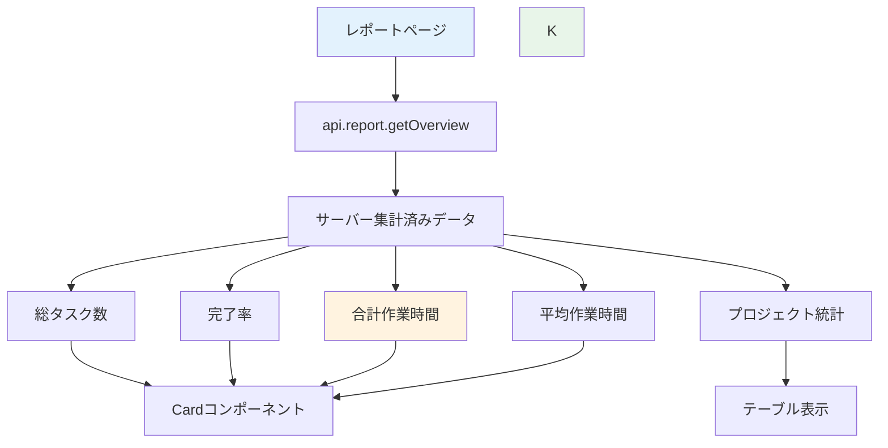

# Day 21: 統計カードを表示しよう

## 🔙 前回の振り返り

Day 20 ではキーワードや複数フィルターで
タスクを検索するページを作りました。
今日は集計データを統計カードで表示します。

---

## 🎯 今日のゴール

レポートページに統計カードを表示します。
完成版 source と同じく `api.report.getOverview`
でサーバー集計済みの概要データを受け取り、
4枚のカードで概要を表示します。

📸 完成イメージ: 4枚の統計カードとプロジェクト統計テーブルが並んだレポートページです。


## 🤔 なぜこれを作るのか？

プロジェクトの状況を一目で把握するための
ダッシュボード機能です。

> 💡 **例え話**: タスクを10個登録したとき、
> 「いくつ終わったっけ？」と1つずつ数えるのは
> 大変ですよね。統計カードがあれば完了率や
> 作業時間が一目でわかります。

### 📐 今日のスコープ

| 区分 | 内容 |
|------|------|
| 対象ファイル | `src/app/report/page.tsx` |
| 今日作る範囲 | 統計カード4枚 + プロジェクト統計テーブル |
| 実コードとの違い | 実コードにはグラフ（Day 22）や週次リンク（Day 23）もあるが今日は扱わない |

### 📐 レポートページのデータフロー



### やること / やらないこと

| やること | やらないこと |
|---------|-------------|
| タスク総数の表示 | 専用の統計API作成 |
| 完了率の計算 | グラフ表示（Day 22） |
| 作業時間の集計 | 週次レポート（Day 23） |
| Cardコンポーネント使用 | 専用コンポーネント作成 |

### 🆕 新しく学ぶ概念

| 概念 | 読み方 | 役割 | 例え |
|------|--------|------|------|
| getOverview | ゲットオーバービュー | レポート用の集計済みAPI | 店員さんが合計済みのレシートを渡す |
| groupBy | グループバイ | サーバー側で件数を集計 | 種類ごとに仕分けして数える |
| aggregate | アグリゲート | 合計値をまとめて計算 | レジで合計金額を出す |
| toFixed | トゥフィクスト | 小数点の桁数を丸める | 小数第1位まで表示 |

## 📊 実装ステップ一覧

| ステップ | 作業内容 | 所要時間 |
|---------|---------|---------|
| Step 1 | サーバー集計の考え方 | 3分 |
| Step 2 | import 文を書く | 3分 |
| Step 3 | ページの骨組みを作る | 5分 |
| Step 4 | データを取得する | 3分 |
| Step 5 | 統計値を計算する | 5分 |
| Step 6 | ローディング判定を追加 | 3分 |
| Step 7 | 統計カードを表示する | 5分 |
| Step 8 | プロジェクト統計テーブル | 5分 |
| Step 9 | 動作確認 | 3分 |

**合計時間**: 約35分

---

### Step 1 🧭: サーバー集計の考え方（3分）

🎯 **ゴール**: なぜ完成版 source では
専用の集計APIを使うのかを理解します。

#### 2つの集計方法の比較

| 方法 | 仕組み | メリット | デメリット |
|------|--------|---------|-----------|
| サーバー集計 | APIが計算済み値を返す | 件数が増えても正確・高速 | API設計が必要 |
| ローカル集計 | 生データから計算 | 試作は早い | 一覧APIの件数上限に引きずられやすい |

> 💡 初期案では `api.task.getAll` と
> `api.project.getAll` をクライアントで
> 集計することもできますが、完成版 source は
> `api.report.getOverview` に統合しています。
> これは「100件を超えても統計が欠けない」
> 状態を守るためです。

#### reduce の動き

`reduce` は配列の全要素を1つの値にまとめる
関数です。買い物リストの合計金額を電卓で
足していくイメージです。

| ステップ | acc（累積値） | 処理 |
|---------|-------------|------|
| 開始 | 0（初期値） | — |
| 1個目（100円） | 0 + 100 = 100 | 足す |
| 2個目（200円） | 100 + 200 = 300 | 足す |
| 3個目（150円） | 300 + 150 = 450 | 足す |
| 結果 | **450** | 合計金額 |

#### useMemo とは

`useMemo` は計算結果をメモしておくフックです。
データが変わっていないのに毎回計算し直すのは
無駄なので、結果をキャッシュして再利用します。

```typescript
// filepath: src/app/report/page.tsx
// reduce で合計を求める例
const total = tasks.reduce(
  (acc, task) => acc + task.timeSpentMinutes,
  0
);
```

✅ **確認ポイント**:
- 完成版 source がサーバー集計を選んだ理由を理解した
- 一覧APIと統計APIは責務を分けるべきだと理解した

---

### Step 2 🧭: import 文を書く（3分）

🎯 **ゴール**: 必要なモジュールを読み込みます。

まず `src/app/report/page.tsx` を新規作成し、
先頭に以下の import を書きます。

💻 **実装**:

```typescript
// filepath: src/app/report/page.tsx
'use client';

// React のフック
import { useMemo } from 'react';
// レイアウト用コンポーネント
import { AppLayout }
  from '@/component/layout/app-layout';
```

✅ **確認ポイント**:
- ファイルを新規作成した
- `'use client'` を先頭に書いた

```typescript
// filepath: src/app/report/page.tsx
// shadcn/ui のカード部品
import {
  Card, CardContent,
  CardHeader, CardTitle,
} from '@/component/ui/card';
// ローディング表示
import { PageLoadingSpinner }
  from '@/component/ui/loading-spinner';
```

✅ **確認ポイント**:
- `Card` 関連をインポートした
- `PageLoadingSpinner` をインポートした

```typescript
// filepath: src/app/report/page.tsx
// テーブル部品（プロジェクト統計用）
import {
  Table, TableBody, TableCell,
  TableHead, TableHeader, TableRow,
} from '@/component/ui/table';
```

✅ **確認ポイント**:
- テーブル関連の部品をインポートした

```typescript
// filepath: src/app/report/page.tsx
// タスクの状態定数とAPIクライアント
import { TASK_STATUS }
  from '@/lib/constant/status';
import { api } from '@/trpc/react';
```

✅ **確認ポイント**:
- `TASK_STATUS` と `api` をインポートした
- 保存してエラーが出ないこと

---

### Step 3 🧭: ページの骨組みを作る（5分）

🎯 **ゴール**: ReportPage コンポーネントの
骨組みを作ります。サイドバーの「レポート」を
クリックして表示を確認します。

> 💡 この時点では中身はまだ空です。
> 見出しと説明文だけが表示されます。

💻 **実装**:

```typescript
// filepath: src/app/report/page.tsx
// コンポーネント本体（骨組み）
export default function ReportPage() {
  // Step 4〜6 でここにフックを追加

  return (
    <AppLayout>
      <div className="space-y-6">
        <div>
          <h1 className="text-3xl
            font-bold tracking-tight">
            レポート・統計
          </h1>
```

✅ **確認ポイント**:
- 関数コンポーネントを定義した
- `AppLayout` で囲んだ

```typescript
// filepath: src/app/report/page.tsx
// 骨組み続き: 説明文と閉じタグ
          <p className=
            "text-muted-foreground">
            プロジェクトの進捗とタスクの
            状況を確認できます。
          </p>
        </div>
        {/* Step 7〜8 でカード等を追加 */}
      </div>
    </AppLayout>
  );
}
```

✅ **確認ポイント**:
- `/report` にアクセスして表示される
- 見出しと説明文が表示される

📸 骨組み確認: 見出し「レポート・統計」と説明文だけが表示された状態です。


---

### Step 4 🧭: データを取得する（3分）

🎯 **ゴール**: tRPC でタスクとプロジェクトの
データを同時に取得します。

> ⚠️ **配置場所**: Step 3 のコメント
> `// Step 4〜6 でここにフックを追加`
> の位置に追加します。`return` 文の**前**です。

💻 **実装**:

```typescript
// filepath: src/app/report/page.tsx
// ReportPage 内、return 文の前に追加
// タスクとプロジェクトを同時に取得
const { data: tasks,
  isLoading: tasksLoading }
  = api.task.getAll.useQuery();
const { data: projects,
  isLoading: projectsLoading }
  = api.project.getAll.useQuery();
```

> 💡 `isLoading` は API がまだ応答を
> 返していない状態を示すフラグです。
> 2つのAPIを同時に呼ぶことで待ち時間を
> 短縮しています。

✅ **確認ポイント**:
- 2つのAPIを同時に呼んでいる
- 保存してエラーが出ないこと

---

### Step 5 🧭: 統計値を計算する（5分）

🎯 **ゴール**: 取得したデータから
4つの統計値を JavaScript で計算します。

> ⚠️ **配置場所**: Step 4 の `useQuery` の
> 直後に続けて追加します。

💻 **実装**:

```typescript
// filepath: src/app/report/page.tsx
// 合計作業時間（分単位の合算）
const totalTimeSpent = useMemo(
  () =>
    tasks?.reduce(
      (acc, task) =>
        acc + (task.timeSpentMinutes ?? 0),
      0
    ) ?? 0,
  [tasks],
);
```

> 💡 `?? 0` は **null合体演算子** です。
> 左辺が `null` か `undefined` のときだけ
> 右辺の `0` を返します。`|| 0` と違い
> `0` や空文字はそのまま残ります。

✅ **確認ポイント**:
- `reduce` で全タスクの時間を合算している
- `?? 0` で null を安全に処理している

```typescript
// filepath: src/app/report/page.tsx
// 平均時間と完了率
const averageTimePerTask = useMemo(
  () =>
    tasks && tasks.length > 0
      ? totalTimeSpent / tasks.length
      : 0,
  [tasks, totalTimeSpent],
);
```

✅ **確認ポイント**:
- 0除算を防いでいる
- 依存配列に `totalTimeSpent` を含めている

```typescript
// filepath: src/app/report/page.tsx
// 完了率（パーセント文字列）
const completionRate = useMemo(
  () => {
    if (!tasks || tasks.length === 0) {
      return '0';
    }
    const doneCount = tasks.filter(
      (t) => t.status === TASK_STATUS.DONE
    ).length;
    return (
      (doneCount / tasks.length) * 100
    ).toFixed(1);
  },
  [tasks],
);
```

> 💡 `toFixed(1)` は数値を小数第1位まで
> の文字列に変換します。`75.333...` なら
> `"75.3"` になります。

✅ **確認ポイント**:
- `TASK_STATUS.DONE` で完了タスクを絞り込む
- `toFixed(1)` でパーセントを小数1桁に丸める

#### 各統計値の計算ロジック

| 統計値 | 計算方法 | 使う関数 |
|--------|---------|---------|
| 総タスク数 | `tasks.length` | 配列の長さ |
| 完了率 | DONE数 / 全数 × 100 | `filter` + `toFixed` |
| 合計時間 | 全タスクの分を合算 | `reduce` |
| 平均時間 | 合計 / タスク数 | 割り算 |

---

### Step 6 🧭: ローディング判定を追加（3分）

🎯 **ゴール**: データ取得中にスピナーを
表示する early return を追加します。

> ⚠️ **配置場所**: Step 5 の `useMemo` の
> **下**、`return` 文の**前**に追加します。
> フックは必ず early return より前に書くのが
> React のルールです。

💻 **実装**:

```typescript
// filepath: src/app/report/page.tsx
// useMemo の下、return 文の前に追加
// どちらかのAPIがロード中ならスピナー表示
if (tasksLoading || projectsLoading) {
  return <PageLoadingSpinner />;
}
```

> 💡 **early return** とは、条件を満たしたら
> 本来の表示（カード等）を返さず、先に
> スピナーを返して処理を終える書き方です。

✅ **確認ポイント**:
- ローディング中にスピナーが表示される
- `useMemo` より下に書いている

📸 ローディング確認: データ読み込み中にスピナーが画面中央に表示されます。


---

### Step 7 🧭: 統計カードを表示する（5分）

🎯 **ゴール**: 4枚のカードで統計を表示します。

> 💡 以下の JSX は Step 3 の `return` 内、
> コメント
> `{/* Step 7〜8 でカード等を追加 */}`
> の位置に追加します。

💻 **実装**:

```typescript
// filepath: src/app/report/page.tsx
// 統計カード: タスク数と完了率
<div className="grid grid-cols-1
  sm:grid-cols-2 lg:grid-cols-4
  gap-4">
  <Card>
    <CardContent className="pt-6">
      <p className="text-sm
        text-muted-foreground mb-1">
        タスク数</p>
      <p className="text-3xl font-bold">
        {tasks?.length ?? 0}</p>
    </CardContent>
  </Card>
```

✅ **確認ポイント**:
- グリッドの開始タグを書いた
- 1枚目のカードが表示される

```typescript
// filepath: src/app/report/page.tsx
// 統計カード: 完了率カード
  <Card>
    <CardContent className="pt-6">
      <p className="text-sm
        text-muted-foreground mb-1">
        完了率</p>
      <p className="text-3xl font-bold">
        {completionRate}%</p>
    </CardContent>
  </Card>
```

✅ **確認ポイント**:
- 完了率がパーセント表示される
- 保存してエラーが出ないこと

```typescript
// filepath: src/app/report/page.tsx
// 統計カード: 合計と平均の作業時間
  <Card>
    <CardContent className="pt-6">
      <p className="text-sm
        text-muted-foreground mb-1">
        合計作業時間</p>
      <p className="text-3xl font-bold">
        {(totalTimeSpent / 60)
          .toFixed(1)}h</p>
    </CardContent>
  </Card>
```

✅ **確認ポイント**:
- 分を時間に変換（÷60）している
- `toFixed(1)` で小数1桁に丸めている

```typescript
// filepath: src/app/report/page.tsx
// 統計カード: 平均作業時間 + grid閉じ
  <Card>
    <CardContent className="pt-6">
      <p className="text-sm
        text-muted-foreground mb-1">
        平均作業時間/タスク</p>
      <p className="text-3xl font-bold">
        {(averageTimePerTask / 60)
          .toFixed(1)}h</p>
    </CardContent>
  </Card>
</div>
```

✅ **確認ポイント**:
- 4枚のカードが表示される
- 正しい数値が表示される

📸 カード確認: 4枚の統計カードがグリッドで並んで表示されています。


---

### Step 8 🧭: プロジェクト統計テーブル（5分）

🎯 **ゴール**: プロジェクトごとの統計を
テーブルで表示します。

まず、Step 5 の `useMemo` の並びに
プロジェクト別集計を追加します。

💻 **実装**:

```typescript
// filepath: src/app/report/page.tsx
// Step 5 の useMemo の後に追加
// プロジェクト別統計
const projectStats = useMemo(
  () =>
    projects?.map((project) => {
      const projectTasks = tasks?.filter(
        (t) => t.projectId === project.id
      ) ?? [];
      const completedTasks =
        projectTasks.filter(
          (t) =>
            t.status === TASK_STATUS.DONE
        );
      const totalTime =
        projectTasks.reduce(
          (acc, t) =>
            acc +
            (t.timeSpentMinutes ?? 0),
          0
        );
```

各プロジェクトの完了タスク数と作業時間を算出しています。続けて進捗率の計算と戻り値を追加します：

```typescript
// filepath: src/app/report/page.tsx
// projectStats useMemo の続き
      const progress =
        projectTasks.length > 0
          ? (completedTasks.length
              / projectTasks.length)
            * 100
          : 0;
      return {
        id: project.id,
        name: project.name,
        totalTasks: projectTasks.length,
        completedTasks:
          completedTasks.length,
        progress: progress.toFixed(1),
        totalTimeHours:
          (totalTime / 60).toFixed(1),
      };
    }),
  [projects, tasks],
);
```

✅ **確認ポイント**:
- `projects` を `map` して統計を計算している
- 進捗と作業時間を計算している
- `toFixed(1)` で小数1桁に丸めている

次に、Step 7 のカードグリッドの `</div>` の
直後にテーブルの JSX を追加します。

```typescript
// filepath: src/app/report/page.tsx
// テーブル: ヘッダー部分
<Card>
  <CardHeader>
    <CardTitle>
      プロジェクト統計</CardTitle>
  </CardHeader>
  <CardContent>
    <Table>
      <TableHeader>
        <TableRow>
          <TableHead className="w-[200px]">
            プロジェクト</TableHead>
          <TableHead className="text-right">
            タスク数</TableHead>
```

✅ **確認ポイント**:
- `Card` の中に `Table` を配置している
- ヘッダー行を書いた

```typescript
// filepath: src/app/report/page.tsx
// テーブル: ヘッダー残りと閉じタグ
          <TableHead className="text-right">
            完了</TableHead>
          <TableHead className="text-right">
            進捗</TableHead>
          <TableHead className="text-right">
            作業時間</TableHead>
        </TableRow>
      </TableHeader>
```

✅ **確認ポイント**:
- 5列のヘッダーが揃った
- 次のブロックで行データを追加する

```typescript
// filepath: src/app/report/page.tsx
// テーブル: 行データと閉じタグ
      <TableBody>
        {projectStats?.map((stat) => (
          <TableRow key={stat.id}>
            <TableCell
              className="font-medium">
              {stat.name}</TableCell>
            <TableCell
              className="text-right">
              {stat.totalTasks}</TableCell>
            <TableCell
              className="text-right">
              {stat.completedTasks}
            </TableCell>
```

✅ **確認ポイント**:
- `map` でプロジェクトごとに行を生成
- `key` にプロジェクトIDを指定

```typescript
// filepath: src/app/report/page.tsx
// テーブル: 残り列と全閉じタグ
            <TableCell
              className="text-right">
              {stat.progress}%</TableCell>
            <TableCell
              className="text-right">
              {stat.totalTimeHours}h
            </TableCell>
          </TableRow>
        ))}
      </TableBody>
    </Table>
  </CardContent>
</Card>
```

✅ **確認ポイント**:
- プロジェクト統計テーブルが表示される
- 名前・タスク数・完了数・進捗・時間が並ぶ

---

### Step 9 🧭: 動作確認（3分）

🎯 **ゴール**: 統計カードの表示を確認します。

```bash
# filepath: ターミナル（確認用）
npm run dev
# http://localhost:3000/report にアクセス
```

ブラウザの DevTools を開き（`F12` キー）、
画面幅を変更してカードの並びを確認します。

1. `/report` にアクセス
2. 4枚のカードが表示される
3. 総タスク数がタスク件数と一致
4. 完了率が正しく計算されている
5. 作業時間が時間（h）で表示される
6. ブラウザ幅を変えてレスポンシブ確認

#### グリッドのブレークポイント

| 画面サイズ | クラス | 列数 |
|-----------|--------|------|
| モバイル | `grid-cols-1` | 1列 |
| タブレット | `sm:grid-cols-2` | 2列 |
| PC | `lg:grid-cols-4` | 4列 |

> 💡 Day 09 のプロジェクト一覧や
> Day 13 のタスク一覧で使った
> レスポンシブグリッドと同じパターンです。

✅ **確認ポイント**:
- 数値がシードデータと一致する
- カードが正しくグリッド表示される
- ブラウザ幅を変えると列数が変わる

📸 レスポンシブ確認: モバイル幅で1列、PC幅で4列にカードの並びが変わります。


---

## 📋 今日のまとめ

- [ ] ローカル集計の仕組みを理解した
- [ ] `reduce` でデータを集計できた
- [ ] 4枚の統計カードを表示できた
- [ ] プロジェクト統計テーブルを表示できた
- [ ] レスポンシブグリッドを適用できた

## ⚠️ つまずきポイント

| エラー / 問題 | 原因 | 解決方法 |
|--------------|------|---------|
| NaN が表示される | tasks が undefined | `?? 0` でフォールバック |
| 完了率が整数になる | toFixed未使用 | `.toFixed(1)` で小数1桁 |
| 時間が分で表示 | 60で割り忘れ | `/ 60` で時間に変換 |
| カードが縦並び | グリッドクラス不足 | sm/lg ブレークポイント |

## 📝 今日学んだ用語

| 用語 | 意味 |
|------|------|
| reduce | 配列を1つの値にまとめる関数 |
| useMemo | 計算結果をキャッシュするフック |
| toFixed(1) | 小数点以下1桁に丸める |
| ローカル集計 | APIでなくフロントで計算する方法 |
| early return | 条件付きで先に表示を返す手法 |

## 🔜 次回予告

Day 22 では、レポートページにグラフを追加
します。Recharts で円グラフを表示し、
タスクの分布を可視化します。
