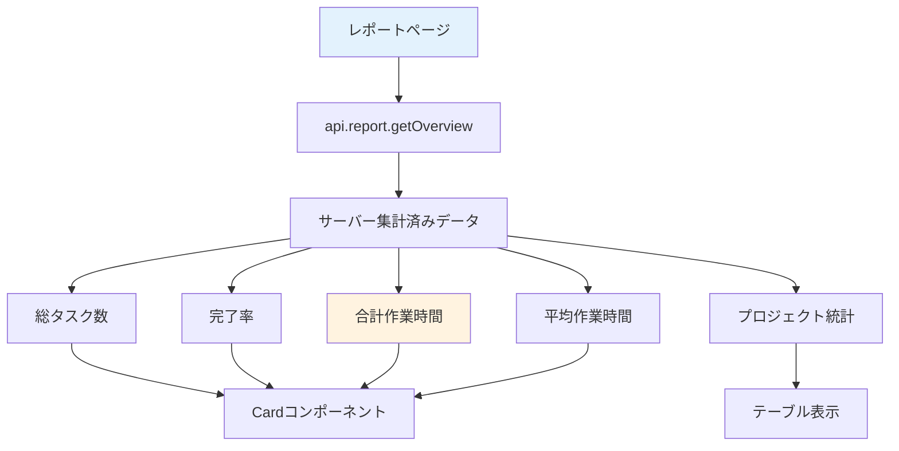

# Day 21: 統計カードを表示しよう

## 前回の振り返り

Day 20 ではキーワードや複数フィルターで
タスクを検索するページを作りました。
今日は集計データを統計カードで表示します。

---

## 今日のゴール

レポートページに統計カードを表示します。
完成版と同じく `api.report.getOverview` から
サーバーで集計済みのデータを受け取り、
総タスク数・完了率・合計作業時間・平均作業時間を
4枚のカードに分けて表示します。

完成イメージ: 4枚の統計カードとプロジェクト統計テーブルが並んだレポートページです。


## なぜこれを作るのか

タスクが増えるほど、いま全体がどれくらい進んでいるかは
一覧をスクロールするだけでは見えなくなります。
完了率や作業時間を集計して数字で見せることで、
進み具合をひと目で確認できるようにします。

> **例え話**: タスクを10個登録したとき、
> 「いくつ終わったっけ？」と1つずつ数えるのは面倒です。
> 統計カードがあれば、完了率も作業時間も
> まとめて目に入ります。

### 今日のスコープ

| 区分 | 内容 |
|------|------|
| 対象ファイル | `src/app/report/page.tsx` |
| 今日作る範囲 | 統計カード4枚 + プロジェクト統計テーブル |
| 実コードとの違い | 実コードにはグラフ（Day 22）や週次リンク（Day 23）もあるが今日は扱わない |

### レポートページのデータフロー


```mermaid
flowchart TD
    A[レポートページ] --> B[api.report.getOverview]
    B --> C[サーバー集計済みデータ]
    C --> D[総タスク数]
    C --> E[完了率]
    C --> F[合計作業時間]
    C --> G[平均作業時間]
    C --> H[プロジェクト統計]
    D --> I[Cardコンポーネント]
    E --> I
    F --> I
    G --> I
    H --> J[テーブル表示]

    style A fill:#e3f2fd
    style F fill:#fff3e0
```

この図で見てほしいのは、矢印の出発点が `api.report.getOverview` の1本しかないところです。総タスク数・完了率・作業時間のどれも、同じ1回の問い合わせから枝分かれしています。カードごとに別々の API を呼ぶ形にすると、読み込み中の判定が4つに増え、サーバー側の集計も4本に分かれます。数え方を直したいときも4か所を触ることになります。入口を1本にしておけば、直す場所は `getOverview` だけです。通信の回数については、4回になるとは限りません。このアプリは同時に呼ばれた問い合わせをまとめて1回で送る設定にしてあるためです。なお、中の集計は `Promise.all` で同時に走るので、実行の最中にタスクが増えると数字が1件ずれることはあります。

### やること / やらないこと

| やること | やらないこと |
|---------|-------------|
| タスク総数の表示 | 画面側での再集計 |
| 完了率の計算 | グラフ表示（Day 22） |
| 作業時間の集計 | 週次レポート（Day 23） |
| Cardコンポーネント使用 | 専用コンポーネント作成 |

### 新しく学ぶ概念

| 概念 | 読み方 | 役割 | 例え |
|------|--------|------|------|
| getOverview | ゲットオーバービュー | レポート用の集計済みAPI | 店員さんが合計済みのレシートを渡す |
| groupBy | グループバイ | サーバー側で件数を集計 | 種類ごとに仕分けして数える |
| aggregate | アグリゲート | 合計値をまとめて計算 | レジで合計金額を出す |
| toFixed | トゥフィクスト | 小数点の桁数を丸める | 小数第1位まで表示 |

## 実装ステップ一覧

| ステップ | 作業内容 | 所要時間 |
|---------|---------|---------|
| Step 0 | レポート集計 API（getOverview）を自分で書く | 14分 |
| Step 1 | サーバー集計の考え方 | 3分 |
| Step 2 | import 文を書く | 3分 |
| Step 3 | ページの骨組みを作る | 5分 |
| Step 4 | データを取得する | 3分 |
| Step 5 | 受け取った概要データを読む | 5分 |
| Step 6 | ローディング判定を追加 | 3分 |
| Step 7 | 統計カードを表示する | 5分 |
| Step 8 | プロジェクト統計テーブル | 5分 |
| Step 9 | 動作確認 | 3分 |

**合計時間**: 約49分です。

この時間はコードを読んで理解する目安です。写経して打ち込む時間、詰まって調べる時間は別に見てください。

---

### Step 0: レポート集計 API（getOverview）を自分で書く（14分）

**ゴール**: `src/server/api/routers/report.ts` を新規作成し、`getOverview` を写経して `api.report.getOverview` を自分で生やします。Day 09 の `project.getAll` や Day 13 の `task.getAll` と同じで、今日は「統計カードに渡す集計の入口」を1つ作ります。

統計カードは、一覧データをクライアントで数え直しているわけではありません。完成版のコード は `count`・`aggregate`・`groupBy` を server 側にまとめ、画面には「計算済みの答え」だけを返します。件数が増えても、カードとテーブルの数字がぶれないようにするためです。

#### 0-1. import を並べる

まず `src/server/api/routers/report.ts` を新規作成し、先頭に import を書きます。

```typescript
// filepath: src/server/api/routers/report.ts
import { TASK_STATUS } from '@/lib/constant/status';
import { prisma } from '@/lib/prisma';
import { createTRPCRouter, protectedProcedure } from '../trpc';
import { getUserProjectIds } from './_helpers/permission';
```

`TASK_STATUS` は、この後でステータス別に件数を数えるために使います。`getUserProjectIds` は Day 13 でも使った共有ヘルパーで、「ログイン中のユーザーが参加中のプロジェクト id 一覧」を返します。Day 23 で初めて使う `TRPCError`・`z`・`USER_ROLE` は、未使用 import にしないため今日はまだ追加しません。

#### 0-2. 空配列のとき先に返す

```typescript
// filepath: src/server/api/routers/report.ts（続き）
export const reportRouter = createTRPCRouter({
  getOverview: protectedProcedure.query(async ({ ctx }) => {
    const projectIds = await getUserProjectIds(ctx.session.userId);

    if (projectIds.length === 0) {
      return {
        totalProjects: 0,
        totalTasks: 0,
        completedTasks: 0,
        inProgressTasks: 0,
        inReviewTasks: 0,
        todoTasks: 0,
        completionRate: 0,
        totalTimeSpent: 0,
        averageTimePerTask: 0,
        recentTasks: [],
        statusData: [],
        priorityData: [],
        projectStats: [],
      };
    }
```

ここは **early return（先に返して処理を終える書き方）** です。参加中のプロジェクトが1件もない人に対して、その先の集計処理を走らせる意味はありません。空の配列と 0 をまとめて返し、画面側は「空のレポート」としてそのまま描画できます。

#### 0-3. 集計の土台となる条件を作る

```typescript
// filepath: src/server/api/routers/report.ts（続き）
    // アーカイブ済みプロジェクトのタスクは集計対象外にし、プロジェクト数・統計との整合を取る。
    const projectScope = {
      projectId: { in: projectIds },
      project: { isArchived: false },
    } as const;

    // ダッシュボードの「アクティブな作業」を母数とするため、CANCELLED は集計から除外する。
    const activeTasksFilter = {
      ...projectScope,
      NOT: { status: TASK_STATUS.CANCELLED },
    } as const;
```

`projectScope` は「自分が参加中で、しかもアーカイブされていないプロジェクトの範囲」です。`activeTasksFilter` はそこにさらに `CANCELLED` 除外を足した条件で、カードの母数に使います。こうして条件を変数にまとめておくと、同じ条件を `count`・`groupBy` の全部で使い回せます。

#### 0-4. Promise.all で集計をまとめて取る

```typescript
// filepath: src/server/api/routers/report.ts（続き）
    const [
      projects,
      totalTasks,
      completedTasks,
      inProgressTasks,
      inReviewTasks,
      todoTasks,
      totalTimeAggregate,
      recentTasks,
      statusGroups,
      priorityGroups,
      projectTaskGroups,
      projectDoneGroups,
    ] = await Promise.all([
```

`Promise.all` は「独立した問い合わせをまとめて同時に待つ」書き方です。プロジェクト数、完了数、優先度別件数などは互いに依存しないので、順番に12回待つよりまとめて走らせる方が素直です。

左辺に並べた12個の名前は、このあと書く問い合わせと**同じ並び**で受け取ります。1つ入れ替えると、`completedTasks` に優先度別の配列が入ってしまいます。件数どうしの入れ替わりなら型も合ってしまうので、エラーは出ません。画面には見た目だけ正しい、中身の違う数字が並びます。あとで集計を足すときは、左辺と問い合わせの両方の末尾へ足してください。

```typescript
// filepath: src/server/api/routers/report.ts（続き）
      prisma.project.findMany({
        where: { id: { in: projectIds }, isArchived: false },
        select: { id: true, name: true },
        orderBy: { createdAt: 'desc' },
      }),
      prisma.task.count({ where: activeTasksFilter }),
      prisma.task.count({
        where: {
          ...projectScope,
          status: TASK_STATUS.DONE,
        },
      }),
      prisma.task.count({
        where: {
          ...projectScope,
          status: TASK_STATUS.IN_PROGRESS,
        },
      }),
```

最初の数本は `findMany` と `count` です。ここでは「プロジェクト一覧」「総タスク数」「完了数」「進行中数」を取っています。`projectScope` と `activeTasksFilter` を使い分けている点が重要で、完了数などのステータス別件数は「アーカイブ済みではないプロジェクト内」で数え、総タスク数はさらに `CANCELLED` を除外した母数を使います。

```typescript
// filepath: src/server/api/routers/report.ts（続き）
      prisma.task.count({
        where: {
          ...projectScope,
          status: TASK_STATUS.IN_REVIEW,
        },
      }),
      prisma.task.count({
        where: {
          ...projectScope,
          status: TASK_STATUS.TODO,
        },
      }),
      prisma.task.aggregate({
        where: activeTasksFilter,
        _sum: { timeSpentMinutes: true },
      }),
```

`aggregate` は合計値をまとめて返す Prisma の関数です。ここでは `timeSpentMinutes` の合計だけが欲しいので、`_sum` を使います。Day 16 で記録した作業時間を、ここでレポートの数字に変換します。

```typescript
// filepath: src/server/api/routers/report.ts（続き）
      prisma.task.findMany({
        where: activeTasksFilter,
        select: {
          id: true,
          title: true,
          status: true,
          priority: true,
        },
        orderBy: { updatedAt: 'desc' },
        take: 5,
      }),
      prisma.task.groupBy({
        by: ['status'],
        where: activeTasksFilter,
        _count: { _all: true },
      }),
```

`recentTasks` は「直近で更新された5件」です。`groupBy` は「同じ値ごとにまとめて数える」関数で、ここでは `status` ごとの件数を作ります。Day 22 の円グラフは、この `statusData` に日本語ラベルと色を足して使います。

```typescript
// filepath: src/server/api/routers/report.ts（続き）
      prisma.task.groupBy({
        by: ['priority'],
        where: activeTasksFilter,
        _count: { _all: true },
      }),
      prisma.task.groupBy({
        by: ['projectId'],
        where: activeTasksFilter,
        _count: { _all: true },
        _sum: { timeSpentMinutes: true },
      }),
      prisma.task.groupBy({
        by: ['projectId'],
        where: {
          ...projectScope,
          status: TASK_STATUS.DONE,
        },
        _count: { _all: true },
      }),
    ]);
```

ここで「優先度別件数」「プロジェクトごとの総タスク数と合計時間」「プロジェクトごとの完了数」を取っています。後で `projectStats` を作るために、`groupBy` を2本に分けているのがポイントです。1本で全部済ませるのではなく、必要な軸ごとに集計を分け、その結果を最後に組み立てます。

#### 0-5. 表示用データに組み立てて返す

```typescript
// filepath: src/server/api/routers/report.ts（続き）
    const totalTimeSpent = totalTimeAggregate._sum.timeSpentMinutes ?? 0;
    const averageTimePerTask = totalTasks > 0 ? totalTimeSpent / totalTasks : 0;
    const completionRate = totalTasks > 0 ? Math.round((completedTasks / totalTasks) * 100) : 0;
```

この3行は、カードに直接出す値を作る部分です。`?? 0` は「左が無いときだけ 0 を使う」書き方でした。タスクが0件のときに 0 で割ると壊れるので、平均と完了率は三項演算子で先に守っています。

分母に置いているのは `totalTasks` です。この値は Step 0-3 の `activeTasksFilter` を通った件数なので、中止したタスクとアーカイブ済みプロジェクトのタスクは最初から数に入っていません。どの行を除いたかで完了率は変わるため、分母の正体は毎回確かめる価値があります。三項演算子で0件を先に弾いているのは、`0 / 0` が `NaN` になるからです。守りを外すと、完了率のカードには数字ではなく「NaN%」という文字が出ます。

```typescript
// filepath: src/server/api/routers/report.ts（続き）
    const doneCountByProject = new Map(
      projectDoneGroups.map((group) => [group.projectId, group._count._all]),
    );
    const taskStatsByProject = new Map(
      projectTaskGroups.map((group) => [
        group.projectId,
        {
          totalTasks: group._count._all,
          totalTimeSpent: group._sum.timeSpentMinutes ?? 0,
        },
      ]),
    );
```

`Map` は「projectId をキーにして、あとで素早く取り出す辞書」です。`projectDoneGroups` と `projectTaskGroups` はどちらも `projectId` ごとの集計なので、いったん `Map` に変えてから `projects.map(...)` で合体させます。

```typescript
// filepath: src/server/api/routers/report.ts（続き）
    return {
      totalProjects: projects.length,
      totalTasks,
      completedTasks,
      inProgressTasks,
      inReviewTasks,
      todoTasks,
      completionRate,
      totalTimeSpent,
      averageTimePerTask,
      recentTasks,
      statusData: statusGroups.map((group) => ({
        key: group.status,
        value: group._count._all,
      })),
      priorityData: priorityGroups.map((group) => ({
        key: group.priority,
        value: group._count._all,
      })),
```

ここで `statusGroups` と `priorityGroups` を、画面が使いやすい `{ key, value }` 配列へ並べ替えています。`groupBy` の生データをそのまま返さず、UI がそのまま読みやすい形に直して返すのがポイントです。

```typescript
// filepath: src/server/api/routers/report.ts（続き）
      projectStats: projects.map((project) => {
        const taskStats = taskStatsByProject.get(project.id) ?? {
          totalTasks: 0,
          totalTimeSpent: 0,
        };
        const completedTaskCount = doneCountByProject.get(project.id) ?? 0;

        return {
          id: project.id,
          name: project.name,
          totalTasks: taskStats.totalTasks,
          completedTasks: completedTaskCount,
          progress:
            taskStats.totalTasks > 0 ? (completedTaskCount / taskStats.totalTasks) * 100 : 0,
          totalTimeHours: taskStats.totalTimeSpent / 60,
        };
      }),
    };
  }),
});
```

最後の `projectStats` が Day 21 のテーブルに入る配列です。各プロジェクトについて `Map` から総数と完了数を取り出し、進捗率と時間を計算して返します。ここまで書けたら、`getOverview` は完成です。

#### 0-6. root.ts に時系列順で登録する

ルーターを書いただけでは、まだ `api.report.getOverview` とは呼べません。`src/server/api/root.ts` に追加して初めて、フロントから呼べる名前になります。

```typescript
// filepath: src/server/api/root.ts
import { authRouter } from './routers/auth';
import { commentRouter } from './routers/comment';
import { projectRouter } from './routers/project';
import { reportRouter } from './routers/report';
import { searchRouter } from './routers/search';
import { taskRouter } from './routers/task';
import { createCallerFactory, createTRPCRouter } from './trpc';
```

先頭の import は、これまで作ってきた router の名前をこのファイルへ持ち込むだけです。名前が来ただけでは、まだ `api.report.getOverview` とはつながりません。ここで手を止めて画面から呼ぶと、`api.report` の部分で「そんなプロパティは無い」という型エラーが出ます。並びをファイル名の順にそろえてあるのは、Day 24 でユーザー用の router を足すときに、どこへ入れるかで迷わないためです。

```typescript
// filepath: src/server/api/root.ts（続き）
export const appRouter = createTRPCRouter({
  auth: authRouter,
  project: projectRouter,
  task: taskRouter,
  search: searchRouter,
  comment: commentRouter,
  report: reportRouter,
});
```

import と `appRouter` の順番は、教材で作ってきた時系列に揃えます。Day 21 の時点では `report` が `comment` の次にある最後の router です。`user` は Day 24 でファイルを作ってから追加します。

**確認ポイント**:
- `src/server/api/routers/report.ts` を新規作成し、`getOverview` を最後の `});` まで書いた
- `root.ts` に `reportRouter` を追加し、`report: reportRouter` を時系列順で登録した
- `npm run dev` で型エラーが出ていない

---

### Step 1 : サーバー集計の考え方（3分）

**ゴール**: なぜ完成版のコード では
専用の集計APIを使うのかを理解します。

#### 2つの集計方法の比較

| 方法 | 仕組み | メリット | デメリット |
|------|--------|---------|-----------|
| サーバー集計 | APIが計算済み値を返す | 件数が増えても正確・高速 | API設計が必要 |
| ローカル集計 | 生データから計算 | 試作は早い | 一覧APIの件数上限に引きずられやすい |

> 初期案では `api.task.getAll` と
> `api.project.getAll` をクライアントで
> 集計することもできますが、完成版のコード は
> `api.report.getOverview` に統合しています。
> これは「100件を超えても統計が欠けない」
> 状態を守るためです。

#### `getOverview` が返すもの

`api.report.getOverview` は、完成版のコード で
必要な集計をサーバー側でまとめて返します。
クライアントは「計算する側」ではなく
「受け取って表示する側」に集中します。

| プロパティ | 内容 |
|-----------|------|
| `totalTasks` | 集計対象タスク数（キャンセル済みタスクとアーカイブ済みプロジェクトは除く） |
| `completionRate` | 完了率（整数パーセント） |
| `totalTimeSpent` | 合計作業時間（分） |
| `averageTimePerTask` | 1タスクあたり平均作業時間（分） |
| `projectStats` | プロジェクト別の集計済み配列 |

```typescript
// filepath: src/app/report/page.tsx
// Step 3 以降でこの API を実際に呼び出します
api.report.getOverview.useQuery();
```

実際に書くのは Step 4 です。ここでは形だけ見ておきます。かっこの中が空なのは、誰の集計を出すかを画面が指定しないからです。対象のユーザーは server 側が `ctx.session` から取り出すので、ブラウザから他人のIDを渡しても覗けません。Day 09 の `getAll` では `userId` を受け取ったうえで管理者だけに許しましたが、今日は「そもそも受け取らない」形で同じ守りを掛けています。

**確認ポイント**:
- 完成版のコード がサーバー集計を選んだ理由を理解した
- 一覧APIと統計APIは責務を分けるべきだと理解した

---

### Step 2 : import 文を書く（3分）

**ゴール**: 必要なモジュールを読み込みます。

先に、Day 08 で作ったサイドバーから
レポートページへ移動できるようにします。
`src/component/layout/app-layout.tsx` の
`lucide-react` の import に `BarChart` を追加してください。

```typescript
// filepath: src/component/layout/app-layout.tsx
import {
  BarChart,
  ClipboardList,
  FolderOpen,
  LayoutDashboard,
  ListTodo,
  LogOut,
  Search,
} from 'lucide-react';
```

足したのは `BarChart` の1語だけです。これで `lucide-react` から棒グラフのアイコンを1つ持ってこられます。他の6つは Day 08 までに並べたものなので、消さずにそのまま残してください。アルファベット順にそろえているのは、Biome の import 整列に合わせるためです。順番が違うと保存したときに自動で並べ替えられ、変更していない行まで差分に入ります。

同じファイルの `menuItems` に、
レポート用の項目を追加します。Day 20 までの
項目を残し、配列の閉じかっこ直前へ入れます。

```typescript
// filepath: src/component/layout/app-layout.tsx
{
  text: 'レポート',
  icon: <BarChart className="h-5 w-5" />,
  path: '/report',
},
```

`menuItems` は、サイドバーに並べるリンクの配列です。1つの要素が1行のメニューに対応し、`text` が表示名、`icon` が左に置くアイコン、`path` が飛び先のURLになります。ここに書いた `/report` は、このあと作るファイルの場所と同じ綴りでなければいけません。ずれているとメニューは出るのに、押した先が404になります。配列の末尾へ入れるのは、教材で作ってきた順にメニューが並ぶようにするためです。

**確認ポイント**:
- サイドバーに「レポート」が表示された
- 既存のメニュー項目が消えていない

まず `src/app/report/page.tsx` を新規作成し、
先頭に以下の import を書きます。

**実装**:

```typescript
// filepath: src/app/report/page.tsx
'use client';

import { AppLayout }
  from '@/component/layout/app-layout';
```

`'use client'` は、このファイルをブラウザ側で動かすという宣言です。レポートページは Step 4 で `useQuery` を使いますが、フックはブラウザ側でしか動きません。この1行が無いまま `useQuery` を書くと、保存した瞬間にサーバーコンポーネントではフックを使えないというエラーが出て、画面が真っ白になります。`AppLayout` は Day 08 で仕上げた共通の枠で、これで囲んだページにはサイドバーとヘッダーが自動で付きます。

**確認ポイント**:
- ファイルを新規作成した
- `'use client'` を先頭に書いた

```typescript
// filepath: src/app/report/page.tsx
// shadcn/ui のカード部品
import {
  Card, CardContent,
  CardHeader, CardTitle,
} from '@/component/ui/card';
// ローディング表示
import { PageLoadingSpinner }
  from '@/component/ui/loading-spinner';
```

`Card` は shadcn/ui のカード部品です。`CardHeader` が見出しの帯、`CardContent` が中身の入れ物、`CardTitle` が見出しの文字を受け持ちます。統計カードは4枚とも同じ見た目にそろえたいので、枠線や角丸を自分で書かず、すでにある部品を使います。`PageLoadingSpinner` は Day 09 の一覧画面でも出した読み込み中の表示です。集計は件数が増えるほど返るまでが長くなるので、待っている間に見せる画面を先に手元へ用意しておきます。

**確認ポイント**:
- `Card` 関連をインポートした
- `PageLoadingSpinner` をインポートした

```typescript
// filepath: src/app/report/page.tsx
// テーブル部品（プロジェクト統計用）
import {
  Table, TableBody, TableCell,
  TableHead, TableHeader, TableRow,
} from '@/component/ui/table';
```

テーブルは6つの部品に分かれています。`Table` が外枠、`TableHeader` と `TableBody` が見出し行と本体行のまとまり、`TableRow` が1行、`TableHead` が見出しのセル、`TableCell` が中身のセルです。素の `<table>` タグでも表は組めますが、この部品を通すと罫線の色や文字の大きさがアプリの他の画面とそろいます。6つ全部を Step 8 のプロジェクト統計テーブルで使うので、ここでまとめて読み込んでおきます。

**確認ポイント**:
- テーブル関連の部品をインポートした

```typescript
// filepath: src/app/report/page.tsx
// APIクライアント
import { api } from '@/trpc/react';
```

`api` は tRPC のクライアントで、これを通すとサーバー側の手続きをただの関数のように呼べます。`api.report.getOverview` という呼び名が使えるのは、Step 0-6 で `root.ts` に `report: reportRouter` を登録したからです。登録を飛ばしていると、この import 自体は通るのに `api.report` のところで型エラーが出ます。エディタで `api.` と打ったとき候補に `report` が出てこないなら、Step 0-6 に戻ってください。

**確認ポイント**:
- `api` をインポートした
- 保存してエラーが出ないこと

---

### Step 3 : ページの骨組みを作る（5分）

**ゴール**: ReportPage コンポーネントの
骨組みを作ります。サイドバーの「レポート」を
クリックして表示を確認します。

> この時点では中身はまだ空です。
> 見出しと説明文だけが表示されます。

**実装**:

```typescript
// filepath: src/app/report/page.tsx
// コンポーネント本体（骨組み）
export default function ReportPage() {
  // Step 4〜6 でここにフックを追加

  return (
    <AppLayout>
      <div className="space-y-6">
        <div>
          <h1 className="text-3xl
            font-bold tracking-tight">
            レポート・統計
          </h1>
```

数字を出す前に、空の器だけを置いて表示を確かめます。この段階で `/report` が開くと分かっていれば、あとでカードが出ないときに「ページ自体が無い」のか「データが来ていない」のかを切り分けられます。`export default` を付けた関数が、Next.js ではそのURLの画面そのものになります。`AppLayout` で囲んでいるので、サイドバーとヘッダーは書かなくても付いてきます。`space-y-6` は、この中に縦へ並べる要素の間隔をそろえる指定です。

**確認ポイント**:
- 関数コンポーネントを定義した
- `AppLayout` で囲んだ

```typescript
// filepath: src/app/report/page.tsx
// 骨組み続き: 説明文と閉じタグ
          <p className=
            "text-muted-foreground">
            プロジェクトの進捗とタスクの
            状況を確認できます。
          </p>
        </div>
        {/* Step 7〜8 でカード等を追加 */}
      </div>
    </AppLayout>
  );
}
```

開いていたタグを内側から順に閉じて、骨組みが完成します。`{/* Step 7〜8 でカード等を追加 */}` は目印のコメントで、あとで JSX を差し込む場所を見失わないために置いています。ここで保存すると、見出しと説明文だけのページが出ます。数字は1つも並びませんが、それで正常です。データを取りに行く処理は次の Step 4 で、このコメントより上へ足していきます。

**確認ポイント**:
- `/report` にアクセスして表示される
- 見出しと説明文が表示される

骨組み確認: この時点で出るのは、見出し「レポート・統計」と、その下の説明文だけです。
カードとグラフはまだ出ません。下の画像は今日の終わりの姿なので、
いまは上の2行だけが見えていれば正しい状態です。


---

### Step 4 : データを取得する（3分）

**ゴール**: tRPC の `getOverview` で
集計済みデータをまとめて取得します。

> **配置場所**: Step 3 のコメント
> `// Step 4〜6 でここにフックを追加`
> の位置に追加します。`return` 文の**前**です。

**実装**:

```typescript
// filepath: src/app/report/page.tsx
// ReportPage 内、return 文の前に追加
const { data: overview, isLoading } =
  api.report.getOverview.useQuery();
```

この1行で、カード4枚とテーブル1つに要る数字がまとめて手に入ります。`data` に `overview` という別名を付けているのは、`data` のままでは何のデータか読み取れないからです。`isLoading` は最初の取得が終わるまで `true` で、Step 6 のスピナー表示に使います。もし4枚のカードを別々の `useQuery` で作ると、読み込み中の判定も4つに増え、カードが1枚ずつバラバラに出る画面になります。取得を1本にしておけば、待ち状態も1つで済みます。

> `getOverview` の中では
> `count` `aggregate` `groupBy` が使われ、
> 100件を超えるデータでもサーバー側で
> 正しい統計が作られます。

**確認ポイント**:
- `getOverview` 1つで統計データをまとめて取得している
- 保存してエラーが出ないこと

---

### Step 5 : 受け取った概要データを読む（5分）

**ゴール**: `overview` のどのプロパティを
どのカードに使うか整理します。

> **配置場所**: Step 4 の `useQuery` の
> 直後に続けて追加します。

**実装**:

```typescript
// filepath: src/app/report/page.tsx
// JSX で使う主な値
const totalTasks = overview?.totalTasks ?? 0;
const completionRate = overview?.completionRate ?? 0;
const totalTimeHours =
  ((overview?.totalTimeSpent ?? 0) / 60).toFixed(1);
const averageTimeHours =
  ((overview?.averageTimePerTask ?? 0) / 60).toFixed(1);
```

4つとも `?? 0` で受け止めているのは、`overview` が `undefined` になる場面があるからです。`undefined / 60` の答えは `NaN` で、`toFixed(1)` を通しても `NaN` のままです。画面には数字ではなく「NaNh」という文字が出ます。

この4行は、Step 6 の読み込み判定より前に置きます。だから読み込み中でも計算そのものは走り、`?? 0` が効いて 0 になります。それでも画面へは出ません。Step 6 が先に読み込み中の表示を返すためです。`?? 0` の結果が実際に画面へ出るのは、取得そのものが失敗したときです。ただしその場合、画面には失敗した事実ではなく「0」が並びます。本当に0件なのか取得に失敗したのかを読者が見分けられないので、実務では `error` も受け取って、失敗したときだけ別の案内を出す形にします。`totalTasks` と `completionRate` は server が出した答えをそのまま受け取るだけで、画面側では足し算や割り算を一切していません。

> 完成版のコード では、
> `overview.totalTimeSpent` と
> `overview.averageTimePerTask` は
> 分単位で返るので、表示時だけ `/ 60` して
> `toFixed(1)` で時間表記にします。

**確認ポイント**:
- 4枚のカードが `overview` を元に表示される
- 集計計算をクライアント側で書いていない

#### 各統計値の計算ロジック

| 統計値 | 計算方法 | 使う関数 |
|--------|---------|---------|
| 総タスク数 | `overview.totalTasks` | server 集計結果 |
| 完了率 | `overview.completionRate` | server 集計結果 |
| 合計時間 | `overview.totalTimeSpent / 60` | 表示時だけ時間換算 |
| 平均時間 | `overview.averageTimePerTask / 60` | 表示時だけ時間換算 |

---

### Step 6 : ローディング判定を追加（3分）

**ゴール**: データ取得中にスピナーを
表示する early return を追加します。

> **配置場所**: Step 4〜5 の
> データ取得・値の準備の**下**、
> `return` 文の**前**に追加します。

**実装**:

```typescript
// filepath: src/app/report/page.tsx
// 値の準備の下、return 文の前に追加
if (isLoading) {
  return <PageLoadingSpinner />;
}
```

> **early return** とは、条件を満たしたら
> 本来の表示（カード等）を返さず、先に
> スピナーを返して処理を終える書き方です。

**確認ポイント**:
- ローディング中にスピナーが表示される
- `getOverview` の結果待ちだけを判定している

ローディング確認: 読み込んでいる間は、画面の中央にスピナーだけが出ます。
下の画像は読み込みが終わったあとの姿で、スピナーは消えています。

ここでスピナーだけを返すと、読み込み中はサイドバーも消えます。
この教材では、ページ全体の描画にデータが要る画面はこの形にしています。
サイドバーを残したい場合は、day17 のように `<AppLayout>` の内側でスピナーを返します。


---

### Step 7 : 統計カードを表示する（5分）

**ゴール**: 4枚のカードで統計を表示します。

> 以下の JSX は Step 3 の `return` 内、
> コメント
> `{/* Step 7〜8 でカード等を追加 */}`
> の位置に追加します。

**実装**:

```typescript
// filepath: src/app/report/page.tsx
// 統計カード: タスク数と完了率
<div className="grid grid-cols-1
  sm:grid-cols-2 lg:grid-cols-4
  gap-4">
  <Card>
    <CardContent className="pt-6">
      <p className="text-sm
        text-muted-foreground mb-1">
        タスク数</p>
      <p className="text-3xl font-bold">
        {totalTasks}</p>
    </CardContent>
  </Card>
```

1枚目に出る `totalTasks` は、データベースにあるタスクの全件数ではありません。Step 0-3 の `activeTasksFilter` を通った件数、つまりアーカイブ済みプロジェクトのタスクと `CANCELLED` のタスクを外した数です。中止を母数に残すとどうなるか、10件のうち5件を終えて3件を中止したプロジェクトで考えます。母数7件なら完了率は71%、中止も数えて母数10件にすると50%になります。手を動かした本人から見れば、後者は「やめたはずの仕事に足を引っ張られた数字」に映ります。

**確認ポイント**:
- グリッドの開始タグを書いた
- 1枚目のカードが表示される

```typescript
// filepath: src/app/report/page.tsx
// 統計カード: 完了率カード
  <Card>
    <CardContent className="pt-6">
      <p className="text-sm
        text-muted-foreground mb-1">
        完了率</p>
      <p className="text-3xl font-bold">
        {completionRate}%</p>
    </CardContent>
  </Card>
```

`completionRate` は server 側で `Math.round` を通した整数なので、画面では `%` を付けるだけで済みます。丸めを server に置いたのは、このカードと Day 22 で足すグラフが必ず同じ数字を出すようにするためです。片方が71、片方が71.4と出ると、読者は集計が壊れたと考えます。分子は `DONE` のタスク数、分母は中止を除いた件数です。中止したタスクが `DONE` になることはないので、分子には最初から入りません。分母からだけ消えます。

**確認ポイント**:
- 完了率がパーセント表示される
- 保存してエラーが出ないこと

```typescript
// filepath: src/app/report/page.tsx
// 統計カード: 合計と平均の作業時間
  <Card>
    <CardContent className="pt-6">
      <p className="text-sm
        text-muted-foreground mb-1">
        合計作業時間</p>
      <p className="text-3xl font-bold">
        {totalTimeHours}h</p>
    </CardContent>
  </Card>
```

`totalTimeHours` は Step 5 で作った文字列です。server は分で返し、画面へ出す直前だけ60で割ります。分のまま持ち回るほうが、時間と分の取り違えを防げるからです。割り忘れると、480分の作業が「480h」と表示されます。20日ぶん働いた計算になるので、見た瞬間におかしいと気付けます。合計する対象はここでも中止を除いたタスクです。やめた作業に費やした時間は、進み具合の目安から外します。

**確認ポイント**:
- 分を時間に変換（÷60）している
- `toFixed(1)` で小数1桁に丸めている

```typescript
// filepath: src/app/report/page.tsx
// 統計カード: 平均作業時間 + grid閉じ
  <Card>
    <CardContent className="pt-6">
      <p className="text-sm
        text-muted-foreground mb-1">
        平均作業時間/タスク</p>
      <p className="text-3xl font-bold">
        {averageTimeHours}h</p>
    </CardContent>
  </Card>
</div>
```

4枚目の平均作業時間は、server 側で合計時間を `totalTasks` で割った値です。分母がここでも中止を除いた件数なので、やめたタスクが平均を薄めることはありません。最後の `</div>` は、このステップの先頭で開いたグリッドを閉じるタグです。閉じ忘れると開始タグと終了タグの対応が取れなくなり、レイアウトが崩れる前にコンパイル自体が失敗します。ブラウザには統計カードではなく構文エラーの画面が出て、ターミナルには問題のファイル名と行番号が並びます。カードが1枚も出ないときは、まずこの1行を確かめてください。

**確認ポイント**:
- 4枚のカードが表示される
- 正しい数値が表示される

カード確認: 4枚の統計カードがグリッドで並んで表示されています。


---

### Step 8 : プロジェクト統計テーブル（5分）

**ゴール**: プロジェクトごとの統計を
テーブルで表示します。

完成版のコード では、プロジェクト別集計も
`overview.projectStats` に入って返ってきます。

まず、これから書く行の中身を1つの塊で見ておきます。**このブロックはまだ書きません。**
実際に書く場所は、このあと作る `<TableBody>` の中です。

```typescript
// filepath: 読み比べ用サンプル（実ファイルには対応しません）
// projectStats は server 側で集計済み
{overview?.projectStats.map((stat) => (
  <TableRow key={stat.id}>
    <TableCell className="font-medium">
      {stat.name}
    </TableCell>
    <TableCell className="text-right">
      {stat.totalTasks}
    </TableCell>
    <TableCell className="text-right">
      {stat.completedTasks}
    </TableCell>
    <TableCell className="text-right">
      {stat.progress.toFixed(1)}%
    </TableCell>
    <TableCell className="text-right">
      {stat.totalTimeHours.toFixed(1)}h
    </TableCell>
  </TableRow>
))}
```

この `map` が回すのは、Step 0-5 で `Map` から組み立てた `projectStats` です。画面側では `filter` や `reduce` を呼びません。プロジェクトごとの完了数をここで数え直すと、カードの数字と表の数字が別々の計算から出ることになります。除外の条件を片方だけ直したとき、合計と内訳の合わない表ができあがります。`stat.progress` と `stat.totalTimeHours` に `toFixed(1)` を付けているのは、`71.42857142857143` のような値をそのまま出さないためです。

**確認ポイント**:
- `overview.projectStats` をそのまま描画している
- クライアント側で `filter` / `reduce` を再実行していない

次に、Step 7 のカードグリッドの `</div>` の
直後にテーブルの JSX を追加します。

```typescript
// filepath: src/app/report/page.tsx
// テーブル: ヘッダー部分
<Card>
  <CardHeader>
    <CardTitle>
      プロジェクト統計</CardTitle>
  </CardHeader>
  <CardContent>
    <Table>
      <TableHeader>
        <TableRow>
          <TableHead className="w-[200px]">
            プロジェクト</TableHead>
          <TableHead className="text-right">
            タスク数</TableHead>
```

テーブルもカードと同じ `Card` の中に置きます。見出しと表を1つの枠にまとめると、上の4枚と同じ余白・同じ角丸で並び、レポートページ全体が1つの面に見えます。`TableHeader` の中の `TableRow` は見出しの行で、あとで書く本体の行とは別のまとまりです。先頭の列だけ `w-[200px]` で幅を決めているのは、プロジェクト名の長さがまちまちでも、右側の数字の列を行ごとにずらさないためです。

**確認ポイント**:
- `Card` の中に `Table` を配置している
- ヘッダー行を書いた

```typescript
// filepath: src/app/report/page.tsx
// テーブル: ヘッダー残りと閉じタグ
          <TableHead className="text-right">
            完了</TableHead>
          <TableHead className="text-right">
            進捗</TableHead>
          <TableHead className="text-right">
            作業時間</TableHead>
        </TableRow>
      </TableHeader>
```

残り3つの見出しを足して、5列がそろいます。数字の列に `text-right` を付けているのは、桁数の違う数字を右端でそろえるためです。`7` と `123` を左寄せで並べると一の位の位置がずれ、どちらが大きいか一目で分かりません。ここで `</TableRow>` と `</TableHeader>` を閉じて、見出しのまとまりを終わらせます。次のブロックから、プロジェクト1件が1行になる本体へ入ります。

**確認ポイント**:
- 5列のヘッダーが揃った
- 次のブロックで行データを追加する

```typescript
// filepath: src/app/report/page.tsx
// テーブル: 行データと閉じタグ
      <TableBody>
        {overview?.projectStats.map((stat) => (
          <TableRow key={stat.id}>
            <TableCell
              className="font-medium">
              {stat.name}</TableCell>
            <TableCell
              className="text-right">
              {stat.totalTasks}</TableCell>
            <TableCell
              className="text-right">
              {stat.completedTasks}
            </TableCell>
```

`TableBody` の中で `projectStats` を1件ずつ行に変えます。`key` に `stat.id` を渡しているのは、React が再描画のときに、どの行がどのプロジェクトかを見分けるためです。ここを配列の番号にすると、React は「0番目の行はこれからも0番目の行だ」と判断して同じ要素を使い回し、中の文字だけを差し替えます。`projectStats` は作成日の新しい順に並んでいるので、プロジェクトを1つ作ると先頭に割り込み、後ろの番号が1つずつずれます。すると、さっきまで別のプロジェクトを映していた行に、隣のプロジェクトの数字が流し込まれます。行に入力欄やチェックボックスを足したときは、そこへ入れた値まで別のプロジェクトの行へ移ります。ID を渡しておけば、番号がずれても React は同じプロジェクトの行を追いかけられます。先頭の `overview?.projectStats` にある `?.` は、`overview` がまだ届いていない一瞬を素通りさせる書き方です。

**確認ポイント**:
- `map` でプロジェクトごとに行を生成
- `key` にプロジェクトIDを指定

```typescript
// filepath: src/app/report/page.tsx
// テーブル: 残り列と全閉じタグ
            <TableCell
              className="text-right">
              {stat.progress.toFixed(1)}%</TableCell>
            <TableCell
              className="text-right">
              {stat.totalTimeHours.toFixed(1)}h
            </TableCell>
          </TableRow>
        ))}
      </TableBody>
    </Table>
  </CardContent>
</Card>
```

残り2列を足して、開いていたタグを内側から順に閉じます。`TableRow`、`TableBody`、`Table`、`CardContent`、`Card` と、開いた順の逆にたどるのが JSX の決まりです。1つでも順番を入れ違えると、保存した瞬間に閉じタグが合わないという構文エラーが出て、画面がエラー表示に切り替わります。これで4枚のカードの下に内訳の表が並び、合計がどのプロジェクトから来ているかを追えるようになります。

**確認ポイント**:
- プロジェクト統計テーブルが表示される
- 名前・タスク数・完了数・進捗・時間が並ぶ

---

### Step 9 : 動作確認（3分）

**ゴール**: 統計カードの表示を確認します。

```bash
# filepath: ターミナル（確認用）
PORT=3001 npm run dev
# http://localhost:3001/report にアクセス
```

`PORT=3001` を付けているのは、他に動かしている開発サーバーと番号を取り合わないためです。起動したら、まずカードの数字がシードデータと合っているかを確かめます。総タスク数が初期データの5件より少なくても正常です。ログイン中のユーザーが参加しているプロジェクトのタスクだけを数えるためです。管理者アカウントは2つあるプロジェクトのうち1つにしか参加していないので、3件と表示されます。逆に多いときは、Step 0-3 の `activeTasksFilter` をどこかの `count` で使い忘れています。

ブラウザの DevTools を開き（`F12` キー）、
画面幅を変更してカードの並びを確認します。

1. `/report` にアクセス
2. 4枚のカードが表示される
3. 総タスク数が、キャンセル済みを除いたタスク件数と一致
4. 完了率が正しく計算されている
5. 作業時間が時間（`h`）で表示される
6. ブラウザ幅を変えてレスポンシブ確認

#### グリッドのブレークポイント

| 画面サイズ | クラス | 列数 |
|-----------|--------|------|
| モバイル | `grid-cols-1` | 1列 |
| タブレット | `sm:grid-cols-2` | 2列 |
| PC | `lg:grid-cols-4` | 4列 |

> Day 09 のプロジェクト一覧や
> Day 13 のタスク一覧で使った
> レスポンシブグリッドと同じパターンです。

**確認ポイント**:
- 数値がシードデータと一致する
- カードが正しくグリッド表示される
- ブラウザ幅を変えると列数が変わる

レスポンシブ確認: モバイル幅で1列、PC幅で4列にカードの並びが変わります。


---

### Pro パターンで書こう（統計レイアウトの Server/Client 分離）

### Before（改善前のコード）

```typescript
// filepath: 読み比べ用サンプル（参考・実ファイルには対応しません）
"use client";
export default function ReportPage() {
  const { data } = api.report.getOverview.useQuery();
  return (
    <AppLayout>
      <h1>レポート</h1>
      <div className="grid grid-cols-4 gap-4">
        <StatCard title="総タスク" value={data?.totalTasks ?? 0} />
        <StatCard title="完了" value={data?.completedTasks ?? 0} />
      </div>
    </AppLayout>
  );
}
```

この書き方でも画面は出ます。引っかかるのは、`"use client"` がファイルの先頭に1つあるだけで、その下の全部がブラウザ側の担当になる点です。数字と関係のない見出しやレイアウトまで巻き込まれます。手元では一瞬なので気付きにくいのですが、読者の回線では、枠が出るまでに JavaScript の読み込みを待つ時間が挟まります。

**このコードの問題点**:

- ページ全体が Client Component。見出しやレイアウトまで JS で描画する必要がある
- SEO に不利（検索エンジンが中身を読めない可能性）

### After（プロが書くコード）

```typescript
// filepath: 読み比べ用サンプル（参考・実ファイルには対応しません）
// page.tsx (Server Component)
export default function ReportPage() {
  return (
    <AppLayout>
      <h1>レポート</h1>
      <ReportContent />
    </AppLayout>
  );
}

// report-content.tsx ("use client")
"use client";
export function ReportContent() {
  const { data } = api.report.getOverview.useQuery();
  return (
    <div className="grid grid-cols-4 gap-4">
      <StatCard title="総タスク" value={data?.totalTasks ?? 0} />
      <StatCard title="完了" value={data?.completedTasks ?? 0} />
    </div>
  );
}
```

分けたあとの `page.tsx` には `"use client"` がありません。見出しと `AppLayout` はサーバー側で文字へ変えてから届くので、読者は JavaScript の到着を待たずに枠を見られます。`useQuery` を使う `ReportContent` だけがブラウザ側で動きます。境界がファイル単位なので、どこで切り出すかが、そのまま「どこまでサーバーで描くか」の線引きになります。

**このコードの強み**:

- 見出しとレイアウトはサーバーで事前描画
- Client Component はデータ取得部分だけ
- 初期表示が速く、SEO にも有利

#### 覚えておきたいエッセンス

ページコンポーネントはなるべく Server Component にして、データ取得する部分だけを "use client" の子コンポーネントに切り出します。

## 完成コード全体

今日は3つのファイルを触りました。断片を貼り重ねる作業が続いたので、途中でどこへ貼ったか分からなくなった場合は、以下のコードを上から順に貼り付けて、各ファイルを置き換えてください。1つのファイルが複数のブロックに分かれている場合は、そのファイルの見出しの下にあるブロックを、出てくる順につなげたものが全文です。上から順に読めば、Step 0 から Step 8 で書いたものがどう1つのファイルになったかを確かめられます。

| ファイル | 役割 | 対応する Step |
|---------|------|--------------|
| `src/server/api/routers/report.ts` | 集計済みの数値を返す `getOverview` | Step 0 |
| `src/server/api/root.ts` | 手続きの一覧表への `report` の登録 | Step 0 |
| `src/app/report/page.tsx` | 統計カードとプロジェクト統計の画面 | Step 2〜Step 8 |

### `src/server/api/routers/report.ts`

**インポート**:

```typescript
// filepath: src/server/api/routers/report.ts
// 完成版: インポート
import { TASK_STATUS } from '@/lib/constant/status';
import { prisma } from '@/lib/prisma';
import { createTRPCRouter, protectedProcedure } from '../trpc';
import { getUserProjectIds } from './_helpers/permission';
```

`TASK_STATUS` を取り込んでいるので、集計の条件に `'DONE'` という文字列を直接書かずに済みます。文字列で書くと、打ち間違えても動いてしまい、完了件数が常に0になる不具合として現れます。定数なら打ち間違いは編集中に分かります。

`getUserProjectIds` は Day 20 の検索と同じ関数です。集計の対象を自分が参加しているプロジェクトへ絞るために使います。

**getOverview の入口と空のときの戻り値**:

```typescript
// filepath: src/server/api/routers/report.ts（同じファイルの続き）
// 完成版: getOverview の入口と空のときの戻り値
export const reportRouter = createTRPCRouter({
  getOverview: protectedProcedure.query(async ({ ctx }) => {
    const projectIds = await getUserProjectIds(ctx.session.userId);

    if (projectIds.length === 0) {
      return {
        totalProjects: 0,
        totalTasks: 0,
        completedTasks: 0,
        inProgressTasks: 0,
        inReviewTasks: 0,
        todoTasks: 0,
        completionRate: 0,
        totalTimeSpent: 0,
        averageTimePerTask: 0,
        recentTasks: [],
        statusData: [],
        priorityData: [],
        projectStats: [],
      };
    }
```

参加しているプロジェクトが0件のときに、13項目すべてを埋めて返しています。ここを `return null` や `return {}` にすると、画面側は `overview.totalTasks` を読めず、登録した直後のユーザーだけ画面が落ちます。項目の形をそろえておけば、画面は分岐を1本も増やさずに済みます。

`recentTasks` などの配列を `[]` にしているのも同じ理由です。`undefined` を返すと、画面の `.map()` がそこで止まります。

**集計の土台となる条件**:

```typescript
// filepath: src/server/api/routers/report.ts（同じファイルの続き）
// 完成版: 集計の土台となる条件
    // アーカイブ済みプロジェクトのタスクは集計対象外にし、プロジェクト数・統計との整合を取る。
    const projectScope = {
      projectId: { in: projectIds },
      project: { isArchived: false },
    } as const;

    // ダッシュボードの「アクティブな作業」を母数とするため、CANCELLED は集計から除外する。
    const activeTasksFilter = {
      ...projectScope,
      NOT: { status: TASK_STATUS.CANCELLED },
    } as const;
```

2つの条件を変数にしてあるのが、この手続きの数字を合わせている部分です。この後に12本の問い合わせが並びますが、全部がこの2つのどちらかを使います。条件を毎回書き写すと、1か所だけ書き漏らした問い合わせが別の母数で数え、画面上で合計が合わなくなります。

`activeTasksFilter` が `projectScope` を展開してから `NOT` を足しているので、「アーカイブ済みを除く」と「取り消し済みを除く」が積み重なります。`as const` を付けているのは、この条件を書き換えられない形で固定するためです。

**Promise.all の受け取り**:

```typescript
// filepath: src/server/api/routers/report.ts（同じファイルの続き）
// 完成版: Promise.all の受け取り
    const [
      projects,
      totalTasks,
      completedTasks,
      inProgressTasks,
      inReviewTasks,
      todoTasks,
      totalTimeAggregate,
      recentTasks,
      statusGroups,
      priorityGroups,
      projectTaskGroups,
      projectDoneGroups,
    ] = await Promise.all([
```

左側の12個の名前と、この後に並ぶ12本の問い合わせは、書いた順番どおりに対応します。名前を1つ入れ替えると、件数の変数に作業時間が入り、型が合う場合はエラーも出ません。数字だけが静かに入れ替わるので、追加や並べ替えのときは上下を見比べてください。

`Promise.all` にしているので、12本は同時に走ります。順番に `await` すると、1本ずつの待ち時間が積み上がります。

**プロジェクトと件数の集計・前半**:

```typescript
// filepath: src/server/api/routers/report.ts（同じファイルの続き）
// 完成版: プロジェクトと件数の集計・前半
      prisma.project.findMany({
        where: { id: { in: projectIds }, isArchived: false },
        select: { id: true, name: true },
        orderBy: { createdAt: 'desc' },
      }),
      prisma.task.count({ where: activeTasksFilter }),
      prisma.task.count({
        where: {
          ...projectScope,
          status: TASK_STATUS.DONE,
        },
      }),
      prisma.task.count({
        where: {
          ...projectScope,
          status: TASK_STATUS.IN_PROGRESS,
        },
      }),
```

`select: { id: true, name: true }` で2列だけ取っているのは、この後の表示に id と名前しか使わないからです。`select` を書かないと全列が返り、使わない説明文や日時まで通信に載ります。

完了件数の条件が `activeTasksFilter` ではなく `projectScope` になっている点に注目してください。取り消し済みのタスクは完了ではないので、`NOT` の除外があっても件数は変わりません。母数の側だけが `activeTasksFilter` です。

**件数の集計・後半と作業時間の合計**:

```typescript
// filepath: src/server/api/routers/report.ts（同じファイルの続き）
// 完成版: 件数の集計・後半と作業時間の合計
      prisma.task.count({
        where: {
          ...projectScope,
          status: TASK_STATUS.IN_REVIEW,
        },
      }),
      prisma.task.count({
        where: {
          ...projectScope,
          status: TASK_STATUS.TODO,
        },
      }),
      prisma.task.aggregate({
        where: activeTasksFilter,
        _sum: { timeSpentMinutes: true },
      }),
```

`aggregate` は合計値を返し、`count` は行数を返します。作業時間は1件ごとの分数を足し合わせる必要があるので、`_sum` を使います。`findMany` で全件を取ってから画面で足す書き方もできますが、その場合はタスクの全行が通信に載ります。

**直近のタスクとステータス別の集計**:

```typescript
// filepath: src/server/api/routers/report.ts（同じファイルの続き）
// 完成版: 直近のタスクとステータス別の集計
      prisma.task.findMany({
        where: activeTasksFilter,
        select: {
          id: true,
          title: true,
          status: true,
          priority: true,
        },
        orderBy: { updatedAt: 'desc' },
        take: 5,
      }),
      prisma.task.groupBy({
        by: ['status'],
        where: activeTasksFilter,
        _count: { _all: true },
      }),
```

`take: 5` で5件に切っているのは、直近の動きを見せるための一覧だからです。上限を付けないと、タスクが1000件あるユーザーの画面で1000行が届きます。

`groupBy` は、ステータスの種類ごとに件数を数えて返します。`count` を5回並べても同じ結果になりますが、ステータスが増えたときに問い合わせも増えます。`groupBy` なら、データベースにある種類の分だけ自動で並びます。

**優先度別とプロジェクト別の集計**:

```typescript
// filepath: src/server/api/routers/report.ts（同じファイルの続き）
// 完成版: 優先度別とプロジェクト別の集計
      prisma.task.groupBy({
        by: ['priority'],
        where: activeTasksFilter,
        _count: { _all: true },
      }),
      prisma.task.groupBy({
        by: ['projectId'],
        where: activeTasksFilter,
        _count: { _all: true },
        _sum: { timeSpentMinutes: true },
      }),
      prisma.task.groupBy({
        by: ['projectId'],
        where: {
          ...projectScope,
          status: TASK_STATUS.DONE,
        },
        _count: { _all: true },
      }),
    ]);
```

プロジェクト別の `groupBy` が2本ある理由は、条件が違うからです。1本目は母数の件数と作業時間、2本目は完了だけの件数を数えます。1本にまとめる書き方もありますが、条件の違う数を1回の集計で分けて出すには、もっと複雑な指定が必要になります。

`_count` と `_sum` を同じ集計で一緒に頼めるので、1本目は件数と分数を1回で取っています。

**割合と平均の計算**:

```typescript
// filepath: src/server/api/routers/report.ts（同じファイルの続き）
// 完成版: 割合と平均の計算
    const totalTimeSpent = totalTimeAggregate._sum.timeSpentMinutes ?? 0;
    const averageTimePerTask = totalTasks > 0 ? totalTimeSpent / totalTasks : 0;
    const completionRate = totalTasks > 0 ? Math.round((completedTasks / totalTasks) * 100) : 0;
```

3行すべてに `?? 0` か `totalTasks > 0` の確認が入っています。`_sum` は対象が1件も無いとき `null` を返し、割り算は分母が0のとき `NaN` になります。どちらも画面には「null」や「NaN」という文字として出るので、サーバー側で0に寄せています。

`Math.round` で整数に丸めているのは、完了率をパーセントの整数として見せるためです。丸める場所を画面側にすると、他の画面で違う桁数になります。

**プロジェクト別の集計の対応表**:

```typescript
// filepath: src/server/api/routers/report.ts（同じファイルの続き）
// 完成版: プロジェクト別の集計の対応表
    const doneCountByProject = new Map(
      projectDoneGroups.map((group) => [group.projectId, group._count._all]),
    );
    const taskStatsByProject = new Map(
      projectTaskGroups.map((group) => [
        group.projectId,
        {
          totalTasks: group._count._all,
          totalTimeSpent: group._sum.timeSpentMinutes ?? 0,
        },
      ]),
    );
```

`groupBy` が返すのは配列なので、そのままではプロジェクトごとの値を引けません。`Map` に組み替えておくと、この後の `projects.map()` の中で id を渡すだけで引けます。配列のまま `find` を呼ぶと、プロジェクトの数だけ全体を探し直します。

**戻り値の前半**:

```typescript
// filepath: src/server/api/routers/report.ts（同じファイルの続き）
// 完成版: 戻り値の前半
    return {
      totalProjects: projects.length,
      totalTasks,
      completedTasks,
      inProgressTasks,
      inReviewTasks,
      todoTasks,
      completionRate,
      totalTimeSpent,
      averageTimePerTask,
      recentTasks,
      statusData: statusGroups.map((group) => ({
        key: group.status,
        value: group._count._all,
      })),
      priorityData: priorityGroups.map((group) => ({
        key: group.priority,
        value: group._count._all,
      })),
```

`statusData` と `priorityData` を `key` と `value` という名前に置き換えているのは、Day 22 でグラフに渡すときの形をそろえるためです。`status` と `priority` のまま返すと、グラフの部品をステータス用と優先度用で2つ作ることになります。

項目の並びが空のときの戻り値と同じ順になっている点も確かめてください。並びをそろえておくと、項目の足し忘れを目で見つけられます。

**projectStats の組み立て**:

```typescript
// filepath: src/server/api/routers/report.ts（同じファイルの続き）
// 完成版: projectStats の組み立て
      projectStats: projects.map((project) => {
        const taskStats = taskStatsByProject.get(project.id) ?? {
          totalTasks: 0,
          totalTimeSpent: 0,
        };
        const completedTaskCount = doneCountByProject.get(project.id) ?? 0;

        return {
          id: project.id,
          name: project.name,
          totalTasks: taskStats.totalTasks,
          completedTasks: completedTaskCount,
          progress:
            taskStats.totalTasks > 0 ? (completedTaskCount / taskStats.totalTasks) * 100 : 0,
          totalTimeHours: taskStats.totalTimeSpent / 60,
        };
      }),
    };
  }),
});
```

`?? { totalTasks: 0, totalTimeSpent: 0 }` が効くのは、タスクが1件も無いプロジェクトです。`groupBy` はタスクのある分だけ行を返すので、空のプロジェクトは対応表に載りません。この既定値が無いと、そのプロジェクトの行で `undefined` を読んで画面が落ちます。

`totalTimeHours` で60で割っているのは、データベースが分で持っている値を時間に直すためです。画面側で割ると、表示する場所ごとに単位の扱いが分かれます。

### `src/server/api/root.ts`

**ルーターの取り込み**:

```typescript
// filepath: src/server/api/root.ts
// 完成版: ルーターの取り込み
import { authRouter } from './routers/auth';
import { commentRouter } from './routers/comment';
import { projectRouter } from './routers/project';
import { reportRouter } from './routers/report';
import { searchRouter } from './routers/search';
import { taskRouter } from './routers/task';
import { createCallerFactory, createTRPCRouter } from './trpc';
```

今日足したのは `reportRouter` の1行だけです。並びがアルファベット順になっているのは Biome が整えるからで、追加した位置は気にしなくて大丈夫です。

**手続きの一覧表**:

```typescript
// filepath: src/server/api/root.ts（同じファイルの続き）
// 完成版: 手続きの一覧表
export const appRouter = createTRPCRouter({
  auth: authRouter,
  project: projectRouter,
  task: taskRouter,
  search: searchRouter,
  comment: commentRouter,
  report: reportRouter,
});

export type AppRouter = typeof appRouter;

export const createCaller = createCallerFactory(appRouter);
```

左に書いたキーが、そのまま画面側の呼び名になります。`report: reportRouter` と書いたので `api.report.getOverview` で呼べます。ここを書き忘れると、ルーターのファイルは正しく書けているのに画面側で `api.report` が見つからないというエラーが出ます。

こちらの並びは Day 18 で決めた時系列順で、アルファベット順ではありません。作った順に読めるほうが、どの機能がどの Day で入ったかを追えるからです。

### `src/app/report/page.tsx`

**画面の import**:

```typescript
// filepath: src/app/report/page.tsx
// 完成版: 画面の import
'use client';

import { AppLayout }
  from '@/component/layout/app-layout';
import {
  Card, CardContent,
  CardHeader, CardTitle,
} from '@/component/ui/card';
import { PageLoadingSpinner }
  from '@/component/ui/loading-spinner';
import {
  Table, TableBody, TableCell,
  TableHead, TableHeader, TableRow,
} from '@/component/ui/table';
import { api } from '@/trpc/react';
```

1行目の `'use client'` が要ります。`api.report.getOverview.useQuery()` はブラウザ側で動く仕組みなので、この宣言が無いとサーバー側で実行されてエラーになります。

`Table` から始まる6つの部品を一度に取り込んでいるのは、テーブルの1行1列がそれぞれ別の部品になっているからです。`<table>` を直接書く方法でも表は作れますが、その場合は枠線や余白の指定を自分で書くことになります。

**データ取得と表示用の値**:

```typescript
// filepath: src/app/report/page.tsx（同じファイルの続き）
// 完成版: データ取得と表示用の値
export default function ReportPage() {
  const { data: overview, isLoading } =
    api.report.getOverview.useQuery();

  const totalTasks = overview?.totalTasks ?? 0;
  const completionRate =
    overview?.completionRate ?? 0;
  const totalTimeHours =
    ((overview?.totalTimeSpent ?? 0) / 60)
      .toFixed(1);
  const averageTimeHours =
    ((overview?.averageTimePerTask ?? 0) / 60)
      .toFixed(1);

  if (isLoading) {
    return <PageLoadingSpinner />;
  }
```

`useQuery()` に引数が無いのは、この手続きが入力を取らないからです。誰の集計を返すかは、サーバー側が Cookie から取り出したユーザーで決まります。画面から id を送る形にすると、書き換えて他人の集計を見る道ができます。

4つの値を `return` の前で用意しているのは、JSX の中に計算を書かないためです。JSX の中に `((overview?.totalTimeSpent ?? 0) / 60).toFixed(1)` を直接書くと、どこが表示でどこが計算か読み分けにくくなります。

`isLoading` の判定を値の準備より後に置いているのは、`overview` が未定義のあいだも `?? 0` で受け止められるからです。判定を先に置いても動きますが、この並びだと値の定義が1か所にまとまります。

**JSX — 見出し**:

```typescript
// filepath: src/app/report/page.tsx（同じファイルの続き）
// 完成版: JSX — 見出し
  return (
    <AppLayout>
      <div className="space-y-6">
        <div>
          <h1 className="text-3xl
            font-bold tracking-tight">
            レポート・統計
          </h1>
          <p className=
            "text-muted-foreground">
            プロジェクトの進捗とタスクの
            状況を確認できます。
          </p>
        </div>
```

`<h1>` はページに1つだけ置きます。読み上げソフトや検索エンジンが、そのページの主題として扱う見出しだからです。この後のカードやテーブルの見出しに `<h1>` を重ねると、主題が複数あることになります。

`text-muted-foreground` は文字を薄い色にする指定です。見出しと説明文で濃さを変えると、どちらが主かが色だけで伝わります。

**JSX — 統計カードの前半2枚**:

```typescript
// filepath: src/app/report/page.tsx（同じファイルの続き）
// 完成版: JSX — 統計カードの前半2枚
        <div className="grid grid-cols-1
          sm:grid-cols-2 lg:grid-cols-4
          gap-4">
          <Card>
            <CardContent className="pt-6">
              <p className="text-sm
                text-muted-foreground mb-1">
                タスク数</p>
              <p className="text-3xl font-bold">
                {totalTasks}</p>
            </CardContent>
          </Card>
          <Card>
            <CardContent className="pt-6">
              <p className="text-sm
                text-muted-foreground mb-1">
                完了率</p>
              <p className="text-3xl font-bold">
                {completionRate}%</p>
            </CardContent>
          </Card>
```

`grid-cols-1` から `lg:grid-cols-4` まで3段の指定があるので、幅に応じて1列・2列・4列へ切り替わります。スマートフォンで4列にすると、数字の桁が折り返して読めなくなります。

各カードで項目名を `text-sm` の薄い色、数字を `text-3xl font-bold` にしています。見せたいのは数字なので、大きさと太さの差で目が先に数字へ行きます。両方を同じ大きさにすると、4枚のカードがどれも同じ見た目になり、読者は数字を探すことになります。

**JSX — 統計カードの後半2枚**:

```typescript
// filepath: src/app/report/page.tsx（同じファイルの続き）
// 完成版: JSX — 統計カードの後半2枚
          <Card>
            <CardContent className="pt-6">
              <p className="text-sm
                text-muted-foreground mb-1">
                合計作業時間</p>
              <p className="text-3xl font-bold">
                {totalTimeHours}h</p>
            </CardContent>
          </Card>
          <Card>
            <CardContent className="pt-6">
              <p className="text-sm
                text-muted-foreground mb-1">
                平均作業時間/タスク</p>
              <p className="text-3xl font-bold">
                {averageTimeHours}h</p>
            </CardContent>
          </Card>
        </div>
```

数字の後ろに `h` を付けているのは、単位が無いと 12 という数字を12時間とも12分とも読めるからです。完了率の側に `%` を付けているのも同じ考えです。

`平均作業時間/タスク` という項目名にしてあるのは、何あたりの平均かを示すためです。「平均作業時間」だけでは、1日あたりとも1人あたりとも読めます。

**JSX — テーブルの見出し**:

```typescript
// filepath: src/app/report/page.tsx（同じファイルの続き）
// 完成版: JSX — テーブルの見出し
        <Card>
          <CardHeader>
            <CardTitle>
              プロジェクト統計</CardTitle>
          </CardHeader>
          <CardContent>
            <Table>
              <TableHeader>
                <TableRow>
                  <TableHead className="w-[200px]">
                    プロジェクト</TableHead>
                  <TableHead className="text-right">
                    タスク数</TableHead>
                  <TableHead className="text-right">
                    完了</TableHead>
                  <TableHead className="text-right">
                    進捗</TableHead>
                  <TableHead className="text-right">
                    作業時間</TableHead>
                </TableRow>
              </TableHeader>
```

プロジェクト名の列だけ `w-[200px]` で幅を固定し、残りの4列を `text-right` で右へ寄せています。数字は桁の位置がそろっていると比べやすく、左寄せだと桁数の違いで数の大小が読み取りにくくなります。

名前の列に幅を決めておくと、プロジェクト名の長さで表の形が変わりません。長い名前が1つ入るだけで数字の列が押しつぶされる状態を防げます。

**JSX — テーブルの行・前半**:

```typescript
// filepath: src/app/report/page.tsx（同じファイルの続き）
// 完成版: JSX — テーブルの行・前半
              <TableBody>
                {overview?.projectStats.map((stat) => (
                  <TableRow key={stat.id}>
                    <TableCell
                      className="font-medium">
                      {stat.name}</TableCell>
                    <TableCell
                      className="text-right">
                      {stat.totalTasks}</TableCell>
                    <TableCell
                      className="text-right">
                      {stat.completedTasks}
                    </TableCell>
```

`overview?.` の `?.` が、データが届く前の状態を受け止めています。`isLoading` の判定を通っているので通常はここへ `undefined` が来ませんが、通信が失敗した場合は `overview` が `undefined` のまま描画されます。この1文字が無いと、その場面で画面が落ちます。

`key={stat.id}` は React が行を見分けるための目印です。プロジェクトの id を渡しているので、並び順が変わっても行の中身が入れ替わりません。

**JSX — テーブルの行・後半と閉じタグ**:

```typescript
// filepath: src/app/report/page.tsx（同じファイルの続き）
// 完成版: JSX — テーブルの行・後半と閉じタグ
                    <TableCell
                      className="text-right">
                      {stat.progress.toFixed(1)}%</TableCell>
                    <TableCell
                      className="text-right">
                      {stat.totalTimeHours.toFixed(1)}h
                    </TableCell>
                  </TableRow>
                ))}
              </TableBody>
            </Table>
          </CardContent>
        </Card>
      </div>
    </AppLayout>
  );
}
```

`toFixed(1)` で小数第1位までに丸めています。`progress` はサーバー側で `(完了 / 全体) * 100` を計算しただけの値なので、丸めないと `33.33333333333333%` のような表示になります。丸める桁を画面側に置いてあるのは、同じ数値を別の画面では違う桁数で見せたくなる場合があるからです。

閉じタグは `</TableBody>`、`</Table>`、`</CardContent>`、`</Card>`、`</div>`、`</AppLayout>` の順で、開いた順の逆になっています。1つでも抜けるとブラウザに赤いエラー画面が出て、足りない場所が書かれています。

> **完成形の参考コード**: 完成版には `src/app/report/page.tsx` と `src/server/api/routers/report.ts` があります。ただし今日書いたコードと1文字まで同じではありません。違いは3つです。1つ目は、完成版の画面に円グラフと棒グラフが並んでいる点です。これは Day 22 で足します。2つ目は、完成版の画面に週次レポートへのリンクがある点です。これは Day 23 で足します。3つ目は、完成版の `report.ts` に `getOverview` 以外の手続きも入っていて、`root.ts` には Day 24 で追加する `user` も登録されている点です。この3か所は違って当たり前だと思って読んでください。（販売用 ZIP に完成版の `src/` は入っていません。ここに挙げた違いは、完成版がどう書かれているかの説明として読んでください）。

## 今日のまとめ

- [ ] `api.report.getOverview` の役割を理解した
- [ ] server 集計済みデータをカードに表示できた
- [ ] 4枚の統計カードを表示できた
- [ ] プロジェクト統計テーブルを表示できた
- [ ] レスポンシブグリッドを適用できた

## つまずきポイント

| エラー / 問題 | 原因 | 解決方法 |
|--------------|------|---------|
| NaN が表示される | `overview` が未取得のまま参照している | `?? 0` でフォールバック |
| 時間が分で表示 | 60で割り忘れ | `/ 60` で時間に変換 |
| カードが縦並び | グリッドクラス不足 | sm/lg ブレークポイント |

## 今日学んだ用語

| 用語 | 意味 |
|------|------|
| getOverview | レポート用の集計済みデータを返す API |
| groupBy | サーバー側で件数を分類して集計する処理 |
| toFixed(1) | 小数点以下1桁に丸める |
| aggregate | サーバー側で合計値をまとめて計算する処理 |
| early return | 条件付きで先に表示を返す手法 |

## 次回予告

Day 22 では、レポートページにグラフを追加
します。Recharts で円グラフを表示し、
タスクの分布を可視化します。

---

## 次に読むもの

- 前の日: [Day 20](./day20_タスク検索機能.md)
- 次の日: [Day 22](./day22_グラフを表示.md)
- 全体の地図: [学びのロードマップ](./00-1_学びのロードマップ.md)
- 目次: [カリキュラム目次](./00_カリキュラム目次.md)
- 詰まったとき: [トラブルシューティング](./appendix_トラブルシューティング.md)
- 言葉の意味: [用語集](./appendix_用語集.md)
