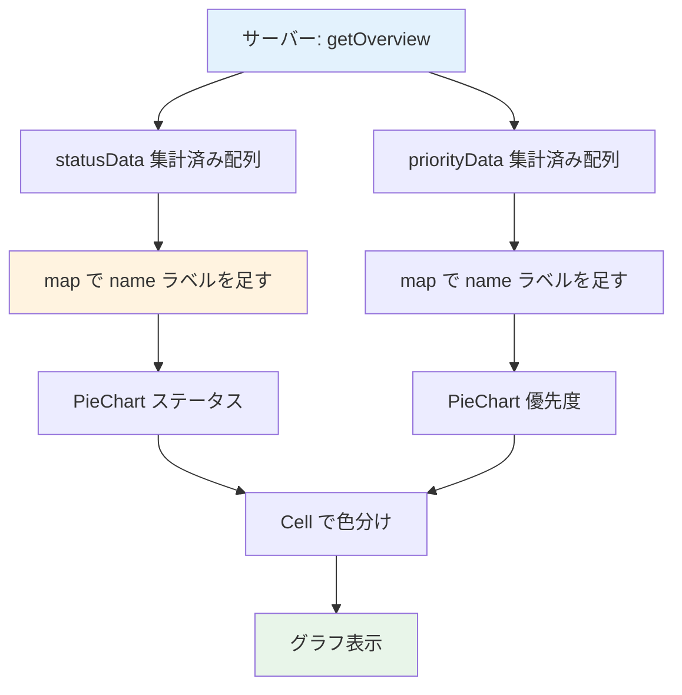

# Day 22: グラフを表示しよう

## 前回の振り返り

Day 21 では、サーバー側で集計済みのデータを返す `api.report.getOverview` を呼び出しました。タスク数・完了率・合計作業時間・平均作業時間の4枚の統計カードを表示しています。数値をカードで見せる基盤ができたので、今日は同じ集計済みデータを円グラフで可視化します。

---

## 今日のゴール

Recharts（React 用のグラフ描画ライブラリ）を使って、レポートページに円グラフを追加します。`getOverview` が返す集計済みデータから、ステータス別・優先度別のタスク分布を表示します。

スクリーンショット: レポートページにステータス別・優先度別の円グラフが並んだ完成イメージです。


> **今日のゴールライン**: サーバーが集計したタスク分布を受け取り、Recharts の部品を組み合わせて円グラフとして画面に出せればOKです。

## 始める前の前提

- Day 21 のレポートページと統計カードが表示できる
- `getOverview` が集計済みデータを返すことを Day 21 で確認済み
- タスクが複数件あり、ステータスや優先度にばらつきがある
- `recharts` がインストール済みであることを確認できる

## なぜこれを作るのか

統計カードは合計や割合は分かりますが、どのステータスにタスクが偏っているかまでは読み取れません。円グラフにすると、その偏りをひと目で把握できます。

> **例え話**: 円グラフは「天気予報の図」です。
> 「降水確率60%」と聞くより、雨雲の図を
> 見た方が直感的に伝わります。
> 数値を円グラフにすると、各ステータスの
> 割合が視覚的に伝わります。

### なぜサーバー側で集計するのか

円グラフに必要なのは「ステータスごとの件数」だけです。全タスクを丸ごとクライアントへ送ると、件数が増えるほど通信量が膨らみます。サーバーで件数まで数えておけば、送るデータは数行の集計結果で済みます。ブラウザは受け取った配列をそのまま描くので、表示も速くなります。

Day 21 で見た通り、この集計はすでに `getOverview` の中で終わっています。今日のフロントの仕事は「受け取った集計結果に日本語ラベルと色を足して描く」ことだけです。

### グラフ表示のデータフロー



### やること / やらないこと

| やること | やらないこと |
|---------|-------------|
| ステータス別円グラフ | 棒グラフ |
| 優先度別円グラフ | 折れ線グラフ |
| 集計済みデータの表示 | クライアント側での再集計 |
| 色分け・レスポンシブ対応 | アニメーション |

### 新しく学ぶ概念

| 概念 | 読み方 | 役割 | 例え |
|------|--------|------|------|
| Recharts | リチャーツ | React 用のグラフ描画ライブラリ | 画用紙とペンのセット |
| PieChart | パイチャート | 円グラフの枠組み | ピザを載せるお皿 |
| Cell | セル | 各スライスに色を付ける部品 | ピザの各ピースに振る色 |
| dataKey / nameKey | データキー / ネームキー | データのどのプロパティを使うか指定 | 名簿のどの列を読むかの指定 |
| ResponsiveContainer | — | グラフのサイズを親に合わせる | 額縁に合わせるキャンバス |

### サーバー集計済みデータの形

`getOverview` が返す `statusData` は、`key`（ステータス名）と `value`（件数）だけを持つ配列です。日本語ラベルの `name` と色は、フロント側で `key` から引いて足します。

| 段階 | データの形 | 例 |
|-----|-----------|-----|
| サーバーが返す | `{ key, value }` | `{ key: 'TODO', value: 3 }` |
| フロントで name を足す | `{ key, value, name }` | `{ key: 'TODO', value: 3, name: '未対応' }` |
| 色は key から引く | `TASK_STATUS_COLORS[key]` | `'#64748b'` |

> `key` は `'TODO'` のような英字のステータス名です。人が読む見出しには使いにくいので、`name` に日本語ラベルを入れて凡例やツールチップに出します。

### Recharts の組み立てパターン

Recharts は複数のコンポーネント（画面を組み立てる部品）を組み合わせます。「枠組み + 中身 + 補助部品」の3層で1つのグラフを構成します。

| 層 | コンポーネント | 役割 |
|---|---|---|
| 枠組み | `PieChart` | グラフ全体の座標空間 |
| 中身 | `Pie` + `Cell` | データを描画し色を付ける |
| 補助 | `Tooltip` / `Legend` | ホバー表示と凡例 |

> Day 23 では `BarChart` や `LineChart` も
> 登場しますが、3層構造は共通です。

## 実装ステップ一覧

| ステップ | 作業内容 | 所要時間 |
|---------|---------|---------|
| Step 1 | Rechartsを確認する | 3分 |
| Step 2 | インポートと定数を追加する | 4分 |
| Step 3 | ステータス表示データを作る | 5分 |
| Step 4 | ステータス円グラフのCard枠を作る | 5分 |
| Step 5 | Pieにデータとセル色を設定する | 5分 |
| Step 6 | 優先度表示データを作る | 4分 |
| Step 7 | 優先度円グラフを追加する | 5分 |
| Step 8 | グリッドに配置して完成 | 4分 |
| Step 9 | 動作確認 | 3分 |

**合計時間**: 約38分。

---

### 予備知識: 今日使う Recharts コンポーネント

| コンポーネント | 役割 | 例え |
|--------------|------|------|
| `PieChart` | 円グラフ全体の枠組み | パイを描く土台 |
| `Pie` + `Cell` | 各スライスの色を `Cell` で設定 | パイの各ピース |
| `ResponsiveContainer` | グラフを親要素の幅に合わせる | 額縁サイズの自動調整 |
| `Tooltip` | マウスホバーで数値を表示 | ポイントの拡大表示 |
| `Legend` | 凡例（色と名前の対応表） | 地図の凡例 |

---

### Step 1: Rechartsを確認する（3分）

**ゴール**: Recharts が既に
インストール済みであることを確認します。

次のコマンドで確認します。

```bash
# filepath: ターミナル（確認のみ）
# Recharts がインストール済みか確認する
npm list recharts
# recharts@3.x.x が表示されればOK
```

> Recharts は React 用のグラフ
> ライブラリで、`PieChart` や `BarChart` など
> 宣言的にグラフを描けます。このプロジェクトでは
> Day 1 の `npm install` で導入済みです。

**確認ポイント**:
- recharts がpackage.jsonにある
- バージョンが `3.x.x` と表示された

---

### Step 2: インポートと定数を追加する（4分）

**ゴール**: Day 21 のコードに Recharts と
色定数のインポートを追加します。

> Day 21 では `Card`, `CardContent`,
> `CardHeader`, `CardTitle` を既にインポート
> しています。今回はそこに Recharts と
> 色・ラベルの定数を追加します。

**実装**: Day 21 のインポート部分に、以下の
3ブロックを追加してください。

```typescript
// filepath: src/app/report/page.tsx
// Rechartsのグラフ描画コンポーネントを追加
import {
  Cell, Legend, Pie, PieChart,
  ResponsiveContainer, Tooltip,
} from 'recharts';
```

**確認ポイント**:
- Recharts のインポートが追加された

```typescript
// filepath: src/app/report/page.tsx
// 優先度の色・ラベルと型ガード関数を追加
import {
  isTaskPriority,
  TASK_PRIORITY_COLORS,
  TASK_PRIORITY_LABELS,
} from '@/lib/constant/priority';
```

**確認ポイント**:
- `isTaskPriority` と色・ラベル定数をインポートした

```typescript
// filepath: src/app/report/page.tsx
// ステータスの色・ラベルと型ガード関数を追加
import {
  isTaskStatus,
  TASK_STATUS_COLORS,
  TASK_STATUS_LABELS,
} from '@/lib/constant/status';
```

**確認ポイント**:
- `isTaskStatus` と色・ラベル定数をインポートした

```typescript
// filepath: src/app/report/page.tsx
// key に対応する色がないときの代替色を定義
const CHART_FALLBACK_COLOR = '#9e9e9e';
```

> `CHART_FALLBACK_COLOR` は保険です。`key` が
> 色の一覧にない値だったときだけ使います。
> 通常は `TASK_STATUS_COLORS` から色が引けます。

**確認ポイント**:
- 上記4ブロックのインポートと定数を追加した

#### ステータスの色一覧

| ステータス | 色 | HEXコード |
|-----------|-----|----------|
| TODO | グレー | `#64748b` |
| IN_PROGRESS | ブルー | `#60a5fa` |
| IN_REVIEW | イエロー | `#fbbf24` |
| DONE | グリーン | `#34d399` |
| CANCELLED | レッド | `#f87171` |

> この5色は `src/lib/constant/status.ts` の
> `TASK_STATUS_COLORS` に定義済みです。教材と
> アプリで同じ定数を使うので、色がずれません。

---

### Step 3: ステータス表示データを作る（5分）

**ゴール**: サーバーが返した集計済みの
`statusData` に、日本語ラベルを足します。

> Day 21 で使った `overview`（`getOverview` の
> 戻り値）をそのまま使います。集計はサーバーで
> 終わっているので、フロントでは数え直しません。

**実装**: Day 21 の `useQuery` の下、`return`
文の前に追加してください。

```typescript
// filepath: src/app/report/page.tsx
// サーバーは key と value だけ返すので name をここで足す
const statusData =
  overview?.statusData.map((entry) => ({
    ...entry,
    name: isTaskStatus(entry.key)
      ? TASK_STATUS_LABELS[entry.key]
      : entry.key,
  })) ?? [];
```

> `overview?.statusData` の `?.` は、データが
> まだ届いていないときに `undefined` を返す書き方です。
> その場合は `?? []` で空配列にして、グラフが
> 空でも落ちないようにしています。

**確認ポイント**:
- `overview.statusData` を `map` で加工している
- `isTaskStatus` でラベルに変換している
- クライアント側で件数を数え直していない

#### なぜ map だけで済むのか

サーバーがすでに件数まで数えているので、フロントの仕事は `name` を1つ足すだけです。`entry.key` が `'TODO'` などのステータス名なら、`TASK_STATUS_LABELS` から `'未対応'` を引きます。`statusData` の型は tRPC（型付き API 通信の仕組み）が推論するので、自分で型を書く必要はありません。

---

### Step 4: ステータス円グラフのCard枠を作る（5分）

**ゴール**: ステータス円グラフを表示する
Card とグラフ枠を作ります。

> 以下のJSXは `return` 文の中、
> Day 21 の統計カード `</div>` の下に
> 追加します。

**実装**:

```tsx
// filepath: src/app/report/page.tsx
<Card>
  <CardHeader>
    <CardTitle>ステータス別タスク</CardTitle>
  </CardHeader>
  <CardContent>
    <div className="h-[300px]">
      <ResponsiveContainer width="100%" height="100%">
        <PieChart>
          {/* Step 5 で Pie を追加する */}
          <Tooltip />
          <Legend />
        </PieChart>
      </ResponsiveContainer>
    </div>
  </CardContent>
</Card>
```

> `ResponsiveContainer` は幅と高さを `100%` で
> 指定しています。この `100%` は親要素を基準に
> した割合です。親に高さがないと `0` と解釈され、
> グラフが表示されません。そのため親の `div` に
> `h-[300px]` で実際の高さを与えています。

**確認ポイント**:
- `Card` > `CardContent` > `div` > `ResponsiveContainer` の入れ子になっている
- 親の `div` に `h-[300px]` がある
- `PieChart` の中に `Tooltip` と `Legend` がある

---

### Step 5: Pieにデータとセル色を設定する（5分）

**ゴール**: Step 4 の `{/* Step 5 で... */}`
を `Pie` と `Cell` に置き換えます。

**実装**: Step 4 のコメント行を消して、
以下を `<PieChart>` の先頭に追加します。

```tsx
// filepath: src/app/report/page.tsx
<Pie
  data={statusData}
  dataKey="value"
  nameKey="name"
  cx="50%"
  cy="50%"
  outerRadius={80}
  label
>
  {statusData.map((entry) => (
    <Cell
      key={entry.key}
      fill={
        isTaskStatus(entry.key)
          ? TASK_STATUS_COLORS[entry.key]
          : CHART_FALLBACK_COLOR
      }
    />
  ))}
</Pie>
```

> `dataKey="value"` は各要素の `value` プロパティ
> （件数）を扇の大きさに使う指定です。
> `nameKey="name"` は `name` プロパティ（日本語
> ラベル）を凡例やツールチップの見出しに使います。
> データの形とこの名前が一致しないと、扇が描かれず
> 空のグラフになります。

`Cell` は `Pie` の子要素として、データ1件ごとに1つ描画します。`entry.key` から `TASK_STATUS_COLORS` で色を引くので、`isTaskStatus` 型ガードで安全に判定し、`as` 型アサーションは使いません。

**確認ポイント**:
- `dataKey` と `nameKey` がデータのプロパティ名と一致している
- `isTaskStatus` 型ガードで色を決定している
- `as` 型アサーションを使っていない

スクリーンショット: ステータス別の円グラフが色分けされて表示されることを確認してください。


#### Step 4-5 の完成構造

Step 4 の Card 枠 + Step 5 の Pie を
合わせると、次のネスト構造になります。

| 階層 | 要素 | 由来 |
|-----|------|------|
| 1 | `<Card>` | Step 4 |
| 2 | `<CardHeader>` + `<CardContent>` | Step 4 |
| 3 | `<ResponsiveContainer>` > `<PieChart>` | Step 4 |
| 4 | `<Pie>` > `<Cell>` | Step 5 |
| 4 | `<Tooltip />` + `<Legend />` | Step 4 |

**確認ポイント**:
- Card 全体が1つのブロックとして完成している

---

### Step 6: 優先度表示データを作る（4分）

**ゴール**: サーバーが返した集計済みの
`priorityData` に、日本語ラベルを足します。

> Step 3 の `statusData` と同じ場所
> （`return` 文の前）に追加してください。
> 使う関数がステータス用から優先度用に
> 変わるだけです。

**実装**:

```typescript
// filepath: src/app/report/page.tsx
// priorityData も key と value だけなので name を足す
const priorityData =
  overview?.priorityData.map((entry) => ({
    ...entry,
    name: isTaskPriority(entry.key)
      ? TASK_PRIORITY_LABELS[entry.key]
      : entry.key,
  })) ?? [];
```

> ステータスと同じ手順です。型ガードが
> `isTaskPriority`、ラベルが `TASK_PRIORITY_LABELS`
> に変わる点だけが異なります。優先度も
> サーバーが集計済みなので、数え直しはしません。

**確認ポイント**:
- `overview.priorityData` を `map` で加工している
- `isTaskPriority` で型ガードしている
- Step 3 の `statusData` と同じ場所に書いた

---

### Step 7: 優先度円グラフを追加する（5分）

**ゴール**: 優先度別の円グラフを
もう1枚追加します。

**実装**: Step 4-5 のステータスグラフの
直後に、以下の Card を追加します。まずは
Card 枠と `Pie` の設定です。

```tsx
// filepath: src/app/report/page.tsx
<Card>
  <CardHeader>
    <CardTitle>優先度別タスク</CardTitle>
  </CardHeader>
  <CardContent>
    <div className="h-[300px]">
      <ResponsiveContainer width="100%" height="100%">
        <PieChart>
          <Pie
            data={priorityData}
            dataKey="value"
            nameKey="name"
            cx="50%"
            cy="50%"
            outerRadius={80}
            label
          >
```

**確認ポイント**:
- Card 枠のネスト構造がステータスと同じ
- `data` が `priorityData` に変わっている

続けて、`Cell` で色を付けて閉じます。

```tsx
// filepath: src/app/report/page.tsx
            {priorityData.map((entry) => (
              <Cell
                key={entry.key}
                fill={
                  isTaskPriority(entry.key)
                    ? TASK_PRIORITY_COLORS[entry.key]
                    : CHART_FALLBACK_COLOR
                }
              />
            ))}
          </Pie>
          <Tooltip />
          <Legend />
        </PieChart>
      </ResponsiveContainer>
    </div>
  </CardContent>
</Card>
```

> 優先度の色は `TASK_PRIORITY_COLORS` から引きます。
> `key` が `'HIGH'` などの優先度名なので、
> `isTaskPriority` 型ガードで判定してから色を
> 決めています。ここでも `as` は使いません。

**確認ポイント**:
- `isTaskPriority` 型ガードで色を決定している
- 2つの円グラフが表示される

スクリーンショット: ステータスと優先度の2つの円グラフが表示されることを確認してください。


---

### Step 8: グリッドに配置して完成（4分）

**ゴール**: 2つのグラフカードを横並びの
グリッドに配置します。

**実装**: Step 4-5 と Step 7 で作った
2つの `<Card>` を、以下の `<div>` で囲みます。

```tsx
// filepath: src/app/report/page.tsx
<div className="grid grid-cols-1 md:grid-cols-2 gap-6">
  {/* ステータス円グラフ（Step 4-5 の Card） */}
  {/* 優先度円グラフ（Step 7 の Card） */}
</div>
```

> `grid-cols-1 md:grid-cols-2` により、
> モバイルでは縦並び、PCでは横並びの
> レスポンシブ配置になります。`md:` は画面幅が
> 中サイズ以上のときだけ効く接頭辞です。

**確認ポイント**:
- PCでは横並び、モバイルでは縦並び
- Day 21 の統計カードの下に配置されている

#### グラフのブレークポイント

| 画面サイズ | クラス | 配置 |
|-----------|--------|------|
| モバイル | `grid-cols-1` | 縦並び |
| PC | `md:grid-cols-2` | 横並び |

---

### Step 9: 動作確認（3分）

**ゴール**: グラフ表示の全体を確認します。

```bash
# filepath: ターミナル（確認用）
# 開発サーバーを起動してグラフを確認する
PORT=3001 npm run dev
# http://localhost:3001/report にアクセス
```

1. `/report` にアクセス
2. 統計カード（Day 21）の下にグラフがある
3. ステータス別の円グラフが表示される
4. 優先度別の円グラフが表示される
5. 凡例（Legend）で各項目が確認できる
6. マウスオーバーで Tooltip が表示される

**確認ポイント**:
- 色がステータス/優先度に対応している
- Tooltip で件数が確認できる

スクリーンショット: 統計カード4枚の下に円グラフ2つがグリッド配置された完成画面を確認してください。


---

### Pro パターンで書こう（集計はクライアントかサーバーか）

### Before（動くけど、プロは書かない）

```tsx
// filepath: src/app/report/page.tsx（アンチパターン）
// サーバーが集計済みなのに、生の tasks をもう一度数え直す
const todo = tasks.filter((t) => t.status === 'TODO').length;
const done = tasks.filter((t) => t.status === 'DONE').length;
const statusData = [
  { key: 'TODO', name: '未対応', value: todo },
  { key: 'DONE', name: '完了', value: done },
];
```

**このコードの問題点**:

- サーバーと同じ集計ロジックがフロントにも二重で存在する
- 集計のために全タスクをクライアントへ送る必要があり、通信量が増える
- ステータスが増えたとき、サーバーとフロントの両方を直す羽目になる

### After（プロが書くコード）

```tsx
// filepath: src/app/report/page.tsx
// サーバー集計済みの statusData を受け取り name だけ足す
const statusData =
  overview?.statusData.map((entry) => ({
    ...entry,
    name: isTaskStatus(entry.key)
      ? TASK_STATUS_LABELS[entry.key]
      : entry.key,
  })) ?? [];
```

**このコードの強み**:

- 集計はサーバーの1か所だけ。ロジックが二重にならない
- 送るデータは数行の集計結果だけで済む
- `statusData` の型は tRPC が推論するので、同じ形の型を手書きしない

#### 覚えておきたいエッセンス

集計はデータの近くにあるサーバー側で1回だけ行い、クライアントは受け取った結果をそのまま描きます。型は tRPC が推論するので、同じ形の型を手書きで二重に持たないよう気をつけます。

## 今日のまとめ

- [ ] Recharts で円グラフを表示できた
- [ ] `getOverview` の集計済みデータを受け取って表示した
- [ ] `key` から色とラベルを引いて色分けした
- [ ] レスポンシブに2列配置できた

## つまずきポイント

| エラー / 問題 | 原因 | 解決方法 |
|--------------|------|---------|
| グラフが表示されない | 親に高さがない | `h-[300px]` を親に設定 |
| グラフが空になる | `dataKey` / `nameKey` がデータの形と不一致 | `value` と `name` のプロパティ名を合わせる |
| 全部同じ色になる | Cell 未使用 | map で Cell に色を設定 |
| 凡例が表示されない | Legend 未追加 | PieChart 内に Legend 追加 |
| サイズが固定される | ResponsiveContainer 未使用 | width/height 100% 設定 |

## 今日学んだ用語

| 用語 | 意味 |
|------|------|
| PieChart | 円グラフの枠組みコンポーネント |
| Cell | 円グラフの各スライスに色を付ける |
| ResponsiveContainer | 親のサイズに合わせる自動調整コンテナ |
| dataKey | 扇の大きさに使うプロパティ名の指定 |
| nameKey | 凡例やツールチップの見出しに使うプロパティ名の指定 |
| getOverview | 集計済みのレポートデータを返す API |

## 次回予告

Day 23 では、プロジェクト別の統計テーブルと
週次レポート機能を実装します。
プロジェクトごとの進捗を表形式で確認できます。
