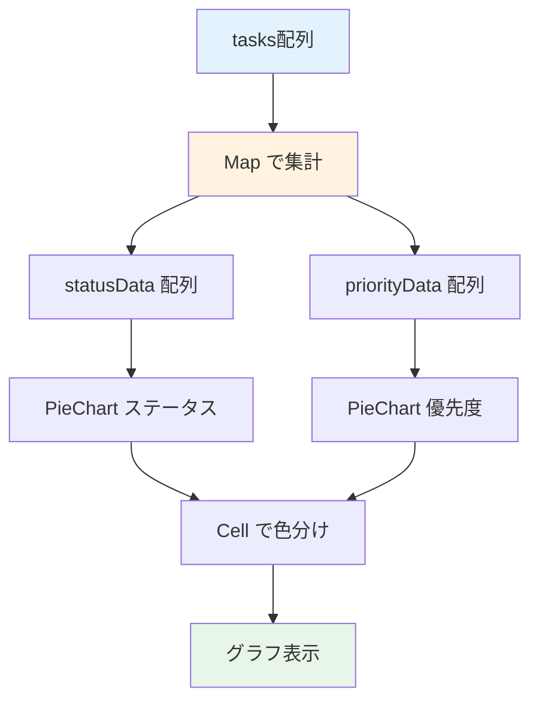

# Day 22: グラフを表示しよう

## 🔙 前回の振り返り

Day 21 では `reduce` を使ったデータ集計と、4枚の統計カード（タスク数・完了率・合計作業時間・平均作業時間）の表示を実装しました。数値データをカードで見せる基盤ができたので、今日はその数値をグラフで可視化する機能に取り組みます。

---

## 🎯 今日のゴール

Recharts ライブラリを使って、レポートページに
円グラフを追加します。ステータス別・優先度別の
タスク分布を可視化します。

📸 スクリーンショット: レポートページにステータス別・優先度別の円グラフが並んだ完成イメージです。

## 🤔 なぜこれを作るのか？

数字だけでは直感的に理解しにくい情報を
グラフで可視化します。

> 💡 **例え話**: グラフは「天気予報の図」です。
> 「降水確率60%」と聞くより、雨雲の図を
> 見た方が直感的にわかります。
> グラフを見れば、タスクの偏りが一目瞭然です。

### 📐 グラフ表示のデータフロー



### やること / やらないこと

| やること | やらないこと |
|---------|-------------|
| ステータス別円グラフ | 棒グラフ |
| 優先度別円グラフ | 折れ線グラフ |
| 色分け表示 | アニメーション |
| レスポンシブ対応 | ドリルダウン |

### 🆕 新しく学ぶ概念

| 概念 | 読み方 | 役割 | 例え |
|------|--------|------|------|
| PieChart | パイチャート | 円グラフ | ピザの切り分け |
| Cell | セル | 各セクションの色 | ピザの具材ごとの色 |
| ResponsiveContainer | — | サイズ自動調整 | 額縁に合わせる |

## 📊 実装ステップ一覧

| ステップ | 作業内容 | 所要時間 |
|---------|---------|---------|
| Step 1 | Rechartsを確認する | 2分 |
| Step 2 | インポートと色定数を準備する | 3分 |
| Step 3 | ステータス集計データを作る | 5分 |
| Step 4 | ステータス円グラフを表示 | 5分 |
| Step 5 | 優先度集計と円グラフ追加 | 5分 |
| Step 6 | レスポンシブグリッドに配置 | 3分 |
| Step 7 | 動作確認 | 3分 |

**合計時間**: 約26分

---

### 🧩 予備知識: 今日使う Recharts コンポーネント

| コンポーネント | 役割 | 例え |
|--------------|------|------|
| `PieChart` | 円グラフ全体の枠組み | パイを描く土台 |
| `Pie` + `Cell` | 各スライスの色を `Cell` で設定 | パイの各ピース |
| `ResponsiveContainer` | グラフを親要素の幅に合わせる | 額縁に合わせるサイズ調整 |
| `Tooltip` | マウスホバーで数値を表示 | ポイントの拡大表示 |
| `Legend` | 凡例（色と名前の対応表） | 地図の凡例 |

> 💡 Recharts は「`XXXChart`（枠組み）+
> `XXX`（中身）+ ツールチップ」の組み合わせ
> で 1 つのグラフが完成します。Day 23 では
> `BarChart` や `LineChart` も登場します。

---

### Step 1: Rechartsを確認する（2分）

🎯 **ゴール**: Recharts が既に
インストール済みであることを確認します。

💻 **確認**:

```bash
# filepath: ターミナル（確認のみ）
npm list recharts
# recharts@3.x.x が表示される
```

> 💡 Recharts は React 専用のグラフ
> ライブラリです。このプロジェクトでは
> 既にインストール済みです。

✅ **確認ポイント**:
- recharts がpackage.jsonにある

---

### Step 2: インポートと色定数を準備する（3分）

🎯 **ゴール**: Recharts のコンポーネントと
色定数をインポートします。

> 💡 Day 21 の `src/app/report/page.tsx` に
> 追記していきます。

💻 **実装**:

```typescript
// filepath: src/app/report/page.tsx
// Rechartsのグラフコンポーネント
import {
  Cell, Legend, Pie, PieChart,
  ResponsiveContainer, Tooltip,
} from 'recharts';
```

✅ **確認ポイント**:
- Recharts のインポートが追加された

```typescript
// filepath: src/app/report/page.tsx
// ステータスの色定数と型ガード
import {
  isTaskStatus,
  TASK_STATUS_LABELS,
  TASK_STATUS_COLORS,
} from '@/lib/constant/status';
// 優先度の色定数と型ガード
import {
  isTaskPriority,
  TASK_PRIORITY_COLORS,
  TASK_PRIORITY_LABELS,
} from '@/lib/constant/priority';
```

✅ **確認ポイント**:
- 型ガード関数とラベル・色定数をインポートした

```typescript
// filepath: src/app/report/page.tsx
// グラフのCardにはCardHeaderとCardTitleを使用
import {
  Card, CardContent,
  CardHeader, CardTitle,
} from '@/component/ui/card';

// 該当する色がないときの代替色
const CHART_FALLBACK_COLOR = '#9e9e9e';
```

> 💡 Day 21 では `Card` と `CardContent`
> だけをインポートしましたが、グラフには
> タイトル付きカードが必要なので
> `CardHeader` と `CardTitle` も追加します。

✅ **確認ポイント**:
- `CardHeader` と `CardTitle` を追加した
- `CHART_FALLBACK_COLOR` を定義した

#### ステータスの色一覧

| ステータス | 色 | HEXコード |
|-----------|-----|----------|
| TODO | グレー | `#9e9e9e` |
| IN_PROGRESS | ブルー | `#2196f3` |
| IN_REVIEW | オレンジ | `#ff9800` |
| DONE | グリーン | `#4caf50` |
| CANCELLED | レッド | `#f44336` |
| BLOCKED | パープル | `#9c27b0` |

---

### Step 3: ステータス集計データを作る（5分）

🎯 **ゴール**: タスクデータから
ステータス別の件数を集計します。

> 💡 Day 21 で作った `tasks` データ
> （`api.task.getAll.useQuery()`）を
> そのまま使います。`useMemo` は Day 21 で
> 学んだ計算結果のキャッシュです。
> Day 21 の `useMemo` と同じ場所
> （`return` 文の前）に追加してください。

💻 **実装**:

```typescript
// filepath: src/app/report/page.tsx
// ステータス別に集計（Map で安全にカウント）
const statusData = useMemo(() => {
  const counts = new Map<string, number>();
  for (const task of tasks ?? []) {
    counts.set(
      task.status,
      (counts.get(task.status) ?? 0) + 1);
  }
  return [...counts.entries()].map(
    ([key, value]) => ({
      key,
      name: isTaskStatus(key)
        ? TASK_STATUS_LABELS[key] : key,
      value,
    }));
}, [tasks]);
```

✅ **確認ポイント**:
- `Map` で集計している
- `isTaskStatus` でラベルに変換している

#### 集計の仕組み

| ステップ | 処理 | 結果例 |
|---------|------|--------|
| 1. Map | ステータスごとにカウント | `TODO: 3, DONE: 5` |
| 2. entries | キーと値のペアに変換 | `[['TODO', 3], ...]` |
| 3. map | グラフ用の形に変換 | `[{key:'TODO', name:'未着手', value:3}]` |

> 💡 `Map` でカウントし、`isTaskStatus` で
> 型ガードをかけてから `TASK_STATUS_LABELS`
> で日本語ラベルに変換します。


---

### Step 4: ステータス円グラフを表示（5分）

🎯 **ゴール**: PieChart でステータス別の
円グラフを表示します。

> 💡 以下のJSXは `return` 文の中、
> Day 21 の統計カード `</div>` の下に
> 追加します。

💻 **実装**:

```typescript
// filepath: src/app/report/page.tsx
// ステータス円グラフ: Card枠とPie定義
<Card>
  <CardHeader>
    <CardTitle>
      ステータス別タスク
    </CardTitle>
  </CardHeader>
  <CardContent>
    <div className="h-[300px]">
      <ResponsiveContainer
        width="100%" height="100%">
        <PieChart>
          <Pie data={statusData}
            dataKey="value"
            nameKey="name"
            cx="50%" cy="50%"
            outerRadius={80} label>
```

続けて、各ステータスに色を付ける `Cell` と
凡例・ツールチップを追加して閉じます。

```typescript
// filepath: src/app/report/page.tsx
// ステータス円グラフ: Cell色分けと閉じタグ
            {statusData.map((entry) => (
              <Cell key={entry.key}
                fill={
                  isTaskStatus(entry.key)
                    ? TASK_STATUS_COLORS[
                        entry.key]
                    : CHART_FALLBACK_COLOR
                } />
            ))}
          </Pie>
          <Tooltip />
          <Legend />
        </PieChart>
      </ResponsiveContainer>
    </div>
  </CardContent>
</Card>
```

✅ **確認ポイント**:
- `isTaskStatus` 型ガードで色を決定している
- `as` 型アサーションを使っていない
- 円グラフが表示される

> 💡 `ResponsiveContainer` は親要素の
> サイズに合わせてグラフを自動調整します。
> `h-[300px]` で高さを固定しています。

📸 スクリーンショット: ステータス別の円グラフが色分けされて表示されることを確認してください。

---

### Step 5: 優先度集計と円グラフ追加（5分）

🎯 **ゴール**: 優先度別の集計データを作り、
円グラフも追加します。

💻 **実装**:

```typescript
// filepath: src/app/report/page.tsx
// 優先度別に集計（return文の前に追加）
const priorityData = useMemo(() => {
  const counts = new Map<string, number>();
  for (const task of tasks ?? []) {
    counts.set(
      task.priority,
      (counts.get(task.priority) ?? 0) + 1);
  }
  return [...counts.entries()].map(
    ([key, value]) => ({
      key,
      name: isTaskPriority(key)
        ? TASK_PRIORITY_LABELS[key] : key,
      value,
    }));
}, [tasks]);
```

✅ **確認ポイント**:
- ステータスと共通のパターンで集計している

```typescript
// filepath: src/app/report/page.tsx
// 優先度円グラフ: Card枠とPie定義
<Card>
  <CardHeader>
    <CardTitle>
      優先度別タスク
    </CardTitle>
  </CardHeader>
  <CardContent>
    <div className="h-[300px]">
      <ResponsiveContainer
        width="100%" height="100%">
        <PieChart>
          <Pie data={priorityData}
            dataKey="value"
            nameKey="name"
            cx="50%" cy="50%"
            outerRadius={80} label>
```

続けて、各優先度に色を付ける `Cell` と
凡例・ツールチップを追加して閉じます。

```typescript
// filepath: src/app/report/page.tsx
// 優先度円グラフ: Cell色分けと閉じタグ
            {priorityData.map((entry) => (
              <Cell key={entry.key}
                fill={
                  isTaskPriority(entry.key)
                    ? TASK_PRIORITY_COLORS[
                        entry.key]
                    : CHART_FALLBACK_COLOR
                } />
            ))}
          </Pie>
          <Tooltip />
          <Legend />
        </PieChart>
      </ResponsiveContainer>
    </div>
  </CardContent>
</Card>
```

✅ **確認ポイント**:
- `isTaskPriority` 型ガードで色を決定している
- 2つの円グラフが表示される

> 💡 ステータスと共通の構造です。
> `TASK_PRIORITY_COLORS` で色を変えるだけで
> 優先度のグラフが完成します。

📸 スクリーンショット: ステータスと優先度の2つの円グラフが表示されることを確認してください。

---

### Step 6: レスポンシブグリッドに配置（3分）

🎯 **ゴール**: 2つのグラフを横並びに
配置します。

💻 **実装**:

```typescript
// filepath: src/app/report/page.tsx
// Step 4・5のCard2つをこのgridで囲む
<div className="grid grid-cols-1
  md:grid-cols-2 gap-6">
  {/* Step 4 のステータス円グラフCard */}
  {/* Step 5 の優先度円グラフCard */}
</div>
```

> 💡 Step 4・5 で書いた `<Card>` を
> この `<div>` の中に移動してください。

✅ **確認ポイント**:
- PCでは横並び、モバイルでは縦並び

#### グラフのブレークポイント

| 画面サイズ | クラス | 配置 |
|-----------|--------|------|
| モバイル | `grid-cols-1` | 縦並び |
| PC | `md:grid-cols-2` | 横並び |


---

### Step 7: 動作確認（3分）

🎯 **ゴール**: グラフ表示の全体を確認します。

```bash
# filepath: ターミナル（確認用）
npm run dev
# http://localhost:3000/report にアクセス
```

1. `/report` にアクセス
2. 統計カード（Day 21）の下にグラフ
3. ステータス別の円グラフが表示される
4. 優先度別の円グラフが表示される
5. 凡例（Legend）で各項目が確認できる
6. マウスオーバーでTooltip表示

✅ **確認ポイント**:
- 色がステータス/優先度に対応している
- Tooltipで件数が確認できる

📸 スクリーンショット: 統計カード4枚の下に円グラフ2つがグリッド配置された完成画面を確認してください。

## 📋 今日のまとめ

- [ ] Recharts でグラフを表示できた
- [ ] `Map` でグラフ用データを集計した
- [ ] 色定数で円グラフを色分けした
- [ ] レスポンシブに2列配置できた

## ⚠️ つまずきポイント

| エラー / 問題 | 原因 | 解決方法 |
|--------------|------|---------|
| グラフが表示されない | height未指定 | h-[300px]を親に設定 |
| 全部同じ色になる | Cell未使用 | mapでCellに色を設定 |
| 凡例が表示されない | Legend未追加 | PieChart内にLegend追加 |
| サイズが固定される | ResponsiveContainer未使用 | width/height 100%設定 |

## 📝 今日学んだ用語

| 用語 | 意味 |
|------|------|
| PieChart | 円グラフのコンポーネント |
| Cell | 円グラフの各セクション |
| ResponsiveContainer | サイズ自動調整コンテナ |
| Map.entries | Mapのキー・値ペアを配列に変換 |

## 🔜 次回予告

Day 23 では、プロジェクト別の統計テーブルと
週次レポート機能を実装します。
プロジェクトごとの進捗を表形式で確認できます。
