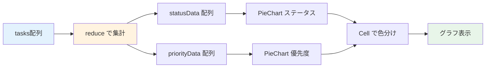

# Day 22: グラフを表示しよう

## 🔙 前回の振り返り

Day 21 では `reduce` を使ったデータ集計と、4枚の統計カード（総タスク数・完了率・作業時間・期限超過）の表示を実装しました。数値データをカードで見せる基盤ができたので、今日はその数値をグラフで可視化する機能に取り組みます。

---

## 🎯 今日のゴール

Recharts ライブラリを使って、レポートページに
円グラフを追加します。ステータス別・優先度別の
タスク分布を可視化します。


## 🤔 なぜこれを作るのか？

数字だけでは直感的に理解しにくい情報を
グラフで可視化します。

> 💡 **例え話**: グラフは「天気予報の図」です。
> 「降水確率60%」と聞くより、雨雲の図を
> 見た方が直感的にわかります。
> グラフを見れば、タスクの偏りが一目瞭然です。

### 📐 グラフ表示のデータフロー



### やること / やらないこと

| やること | やらないこと |
|---------|-------------|
| ステータス別円グラフ | 棒グラフ |
| 優先度別円グラフ | 折れ線グラフ |
| 色分け表示 | アニメーション |
| レスポンシブ対応 | ドリルダウン |

### 🆕 新しく学ぶ概念

| 概念 | 読み方 | 役割 | 例え |
|------|--------|------|------|
| PieChart | パイチャート | 円グラフ | ピザの切り分け |
| Cell | セル | 各セクションの色 | ピザの具材ごとの色 |
| ResponsiveContainer | — | サイズ自動調整 | 額縁に合わせる |

## 📊 実装ステップ一覧

| ステップ | 作業内容 | 所要時間 |
|---------|---------|---------|
| Step 1 | Rechartsを確認する | 2分 |
| Step 2 | ステータス集計データを作る | 5分 |
| Step 3 | 色定数をインポートする | 3分 |
| Step 4 | ステータス円グラフを表示 | 5分 |
| Step 5 | 優先度円グラフを追加 | 5分 |
| Step 6 | レスポンシブグリッドに配置 | 3分 |
| Step 7 | 動作確認 | 3分 |

**合計時間**: 約26分

---

### 🧩 予備知識: Recharts のコンポーネント早見表

今日使う Recharts のコンポーネントを先に一覧で確認しておきましょう。

| コンポーネント | 役割 | 例え |
|--------------|------|------|
| `ResponsiveContainer` | グラフを親要素の幅に合わせて伸縮させる | 写真フレーム——中身に合わせてサイズが変わる |
| `BarChart` | 棒グラフ全体の枠組み | キャンバス——棒を描く土台 |
| `Bar` | 実際の棒（データ 1 系列分） | キャンバス上の 1 本ずつの棒 |
| `LineChart` | 折れ線グラフ全体の枠組み | キャンバス——折れ線を描く土台 |
| `Line` | 実際の折れ線（データ 1 系列分） | キャンバス上の 1 本の線 |
| `PieChart` | 円グラフ全体の枠組み | キャンバス——パイを描く土台 |
| `Pie` + `Cell` | 実際の円（各スライスの色を `Cell` で設定） | パイの各ピース |
| `XAxis` / `YAxis` | 横軸（カテゴリ名など）と縦軸（数値） | グラフの目盛り |
| `Tooltip` | マウスホバーで数値を吹き出し表示 | 虫眼鏡——ポイントを拡大表示 |
| `CartesianGrid` | 背景のグリッド線 | グラフ用紙のマス目 |

> 💡 Recharts は「`XXXChart`（枠組み）+ `XXX`（中身）+ 軸やツールチップ」の組み合わせで 1 つのグラフが完成します。構造が分かれば、新しいグラフも同じパターンで作れます。

---

### Step 1: Rechartsを確認する（2分）

🎯 **ゴール**: Recharts が既に
インストール済みであることを確認します。

💻 **確認**:

```bash
# filepath: ターミナル（確認のみ）
npm list recharts
# recharts@3.x.x が表示される
```

> 💡 Recharts は React 専用のグラフ
> ライブラリです。このプロジェクトでは
> 既にインストール済みです。

✅ **確認ポイント**:
- recharts がpackage.jsonにある

---

### Step 2: ステータス集計データを作る（5分）

🎯 **ゴール**: タスクデータから
ステータス別の件数を集計します。

💻 **実装**:

```typescript
// filepath: src/app/report/page.tsx
// ステータス別に集計
const statusData = useMemo(
  () =>
    Object.entries(
      tasks?.reduce(
        (acc, task) => {
          acc[task.status] =
            (acc[task.status] || 0) + 1;
          return acc;
        },
        {} as Record<string, number>,
      ) || {},
    ).map(([name, value]) =>
      ({ name, value })),
  [tasks],
);
```

✅ **確認ポイント**:
- statusData にデータが入る

#### 集計の仕組み

| ステップ | 処理 | 結果例 |
|---------|------|--------|
| 1. reduce | ステータスごとにカウント | `{TODO: 3, DONE: 5}` |
| 2. Object.entries | キーと値のペアに変換 | `[['TODO', 3], ...]` |
| 3. map | グラフ用の形に変換 | `[{name: 'TODO', value: 3}]` |

> 💡 `reduce` で `{TODO: 3, IN_PROGRESS: 2}`
> のようなオブジェクトを作り、
> `Object.entries` + `map` で Recharts が
> 期待する形式に変換します。

✅ **確認ポイント**:
- statusData にデータが入る

---

### Step 3: 色定数をインポートする（3分）

🎯 **ゴール**: ステータスと優先度の
色定数を使います。

💻 **実装**:

```typescript
// filepath: src/app/report/page.tsx
import {
  TASK_STATUS_COLORS,
} from '@/lib/constant/status';
import {
  TASK_PRIORITY_COLORS,
} from '@/lib/constant/priority';
```

✅ **確認ポイント**:
- 色定数がインポートできた

#### ステータスの色一覧

| ステータス | 色 |
|-----------|-----|
| TODO | グレー |
| IN_PROGRESS | ブルー |
| IN_REVIEW | オレンジ |
| DONE | グリーン |
| CANCELLED | レッド |
| BLOCKED | パープル |

> 💡 `@/lib/constant/` に定義済みの
> 色定数を使います。アプリ全体で同じ色を
> 使うことで統一感が出ます。

✅ **確認ポイント**:
- 色定数がインポートできた

---

### Step 4: ステータス円グラフを表示（5分）

🎯 **ゴール**: PieChart でステータス別の
円グラフを表示します。

💻 **実装**:

```typescript
// filepath: src/app/report/page.tsx
import {
  Cell, Legend, Pie, PieChart,
  ResponsiveContainer, Tooltip,
} from 'recharts';
```

```typescript
// filepath: src/app/report/page.tsx
// ステータス円グラフ: Card構造とPie定義
<Card>
  <CardHeader>
    <CardTitle>ステータス別タスク</CardTitle>
  </CardHeader>
  <CardContent>
    <div className="h-[300px]">
      <ResponsiveContainer
        width="100%" height="100%">
        <PieChart>
          <Pie data={statusData}
            dataKey="value"
            nameKey="name"
            cx="50%" cy="50%"
            outerRadius={80} label>
```

続けて、各ステータスに色を付ける `Cell` と凡例・ツールチップを追加します。

```typescript
// filepath: src/app/report/page.tsx
// ステータス円グラフ: Cellの色分けと閉じタグ
            {statusData.map((entry) => (
              <Cell key={entry.name}
                fill={
                  TASK_STATUS_COLORS[
                    entry.name as
                    keyof typeof
                    TASK_STATUS_COLORS
                  ] ?? '#9e9e9e'
                } />
            ))}
          </Pie>
          <Tooltip />
          <Legend />
        </PieChart>
      </ResponsiveContainer>
    </div>
  </CardContent>
</Card>
```

> 💡 `ResponsiveContainer` は親要素の
> サイズに合わせてグラフを自動調整します。
> `h-[300px]` で高さを固定しています。

✅ **確認ポイント**:
- 円グラフが表示される
- ステータスごとに色分けされる


---

### Step 5: 優先度円グラフを追加（5分）

🎯 **ゴール**: 優先度別の円グラフも追加します。

💻 **実装**:

```typescript
// filepath: src/app/report/page.tsx
// 優先度別に集計
const priorityData = useMemo(
  () =>
    Object.entries(
      tasks?.reduce(
        (acc, task) => {
          acc[task.priority] =
            (acc[task.priority] || 0) + 1;
          return acc;
        },
        {} as Record<string, number>,
      ) || {},
    ).map(([name, value]) =>
      ({ name, value })),
  [tasks],
);
```

```typescript
// filepath: src/app/report/page.tsx
// 優先度円グラフ: Card構造とPie定義
<Card>
  <CardHeader>
    <CardTitle>
      優先度別タスク
    </CardTitle>
  </CardHeader>
  <CardContent>
    <div className="h-[300px]">
      <ResponsiveContainer
        width="100%" height="100%">
        <PieChart>
          <Pie data={priorityData}
            dataKey="value"
            nameKey="name"
            cx="50%" cy="50%"
            outerRadius={80} label>
```

続けて、各優先度に色を付ける `Cell` と凡例・ツールチップを追加します。

```typescript
// filepath: src/app/report/page.tsx
// 優先度円グラフ: Cellの色分けと閉じタグ
            {priorityData.map((entry) => (
              <Cell key={entry.name}
                fill={
                  TASK_PRIORITY_COLORS[
                    entry.name as
                    keyof typeof
                    TASK_PRIORITY_COLORS
                  ] ?? '#9e9e9e'
                } />
            ))}
          </Pie>
          <Tooltip />
          <Legend />
        </PieChart>
      </ResponsiveContainer>
    </div>
  </CardContent>
</Card>
```

> 💡 ステータスと同じ構造です。
> `TASK_PRIORITY_COLORS` で色を変えるだけで
> 優先度のグラフも作れます。

✅ **確認ポイント**:
- 2つの円グラフが表示される


---

### Step 6: レスポンシブグリッドに配置（3分）

🎯 **ゴール**: 2つのグラフを横並びに
配置します。

💻 **実装**:

```typescript
// filepath: src/app/report/page.tsx
// グラフの親要素
<div className="grid grid-cols-1
  md:grid-cols-2 gap-6">
  {/* ステータス円グラフ */}
  {/* 優先度円グラフ */}
</div>
```

✅ **確認ポイント**:
- PCでは横並び、モバイルでは縦並び

#### グラフのブレークポイント

| 画面サイズ | クラス | 配置 |
|-----------|--------|------|
| モバイル | `grid-cols-1` | 縦並び |
| PC | `md:grid-cols-2` | 横並び |

✅ **確認ポイント**:
- PCでは横並び、モバイルでは縦並び

---

### Step 7: 動作確認（3分）

🎯 **ゴール**: グラフ表示の全体を確認します。

1. `/report` にアクセス
2. 統計カード（Day 21）の下にグラフ
3. ステータス別の円グラフが表示される
4. 優先度別の円グラフが表示される
5. 凡例（Legend）で各項目が確認できる
6. マウスオーバーでTooltip表示

✅ **確認ポイント**:
- 色がステータス/優先度に対応している
- Tooltipで件数が確認できる


---

```bash
# filepath: ターミナル
# 開発サーバーを起動して動作確認
npm run dev
```

## 📋 今日のまとめ

- [ ] Recharts でグラフを表示できた
- [ ] `reduce` でグラフ用データを集計した
- [ ] 色定数で円グラフを色分けした
- [ ] レスポンシブに2列配置できた

## ⚠️ つまずきポイント

| エラー / 問題 | 原因 | 解決方法 |
|--------------|------|---------|
| グラフが表示されない | height未指定 | h-[300px]を親に設定 |
| 全部同じ色になる | Cell未使用 | mapでCellに色を設定 |
| 凡例が表示されない | Legend未追加 | PieChart内にLegend追加 |
| サイズが固定される | ResponsiveContainer未使用 | width/height 100%設定 |

## 📝 今日学んだ用語

| 用語 | 意味 |
|------|------|
| PieChart | 円グラフのコンポーネント |
| Cell | 円グラフの各セクション |
| ResponsiveContainer | サイズ自動調整コンテナ |
| Object.entries | オブジェクトを配列に変換 |

## 🔜 次回予告

Day 23 では、プロジェクト別の統計テーブルと
週次レポート機能を実装します。
プロジェクトごとの進捗を表形式で確認できます。
