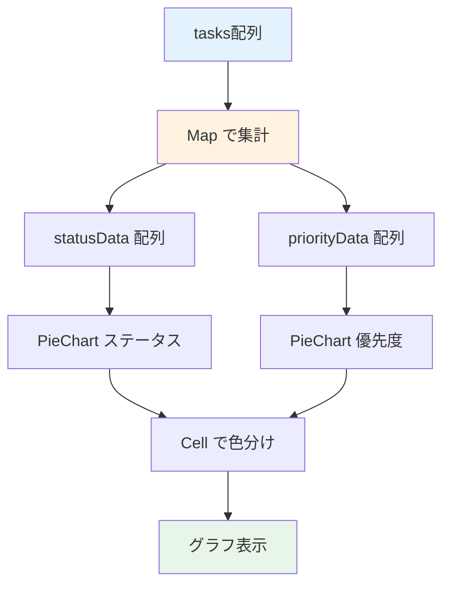

# Day 22: グラフを表示しよう

## 🔙 前回の振り返り

Day 21 では `reduce` を使ったデータ集計と、4枚の統計カード（タスク数・完了率・合計作業時間・平均作業時間）の表示を実装しました。数値データをカードで見せる基盤ができたので、今日はその数値をグラフで可視化する機能に取り組みます。

---

## 🎯 今日のゴール

Recharts ライブラリを使って、レポートページに
円グラフを追加します。ステータス別・優先度別の
タスク分布を可視化します。

📸 スクリーンショット: レポートページにステータス別・優先度別の円グラフが並んだ完成イメージです。


> 📌 **今日のゴールライン**: Rechartsの部品を組み合わせ、集計したタスク分布を円グラフとして画面に出せればOK。

## 🧰 始める前の前提

- Day 21 のレポートページと統計カードが表示できる
- タスクが複数件あり、ステータスや優先度にばらつきがある
- `recharts` がインストール済みであることを確認できる
- グラフの細かい見た目調整より、データを円グラフに変換する流れを優先する

## 🤔 なぜこれを作るのか？

統計カードの数値だけでは「全体のバランス」が
掴みにくいですよね。グラフにすると、タスクの
偏りが一目で分かるようになります。

> 💡 **例え話**: グラフは「天気予報の図」です。
> 「降水確率60%」と聞くより、雨雲の図を
> 見た方が直感的にわかります。
> 数値を円グラフにすると、各ステータスの
> 割合が一瞬で把握できます。

### 📐 グラフ表示のデータフロー



### やること / やらないこと

| やること | やらないこと |
|---------|-------------|
| ステータス別円グラフ | 棒グラフ |
| 優先度別円グラフ | 折れ線グラフ |
| 色分け表示 | アニメーション |
| レスポンシブ対応 | ドリルダウン |

### 🆕 新しく学ぶ概念

| 概念 | 読み方 | 役割 | 例え |
|------|--------|------|------|
| Recharts | リチャーツ | React 専用のグラフ描画ライブラリ | 画用紙とペンのセット |
| PieChart | パイチャート | 円グラフの枠組み | ピザを載せるお皿 |
| Cell | セル | 各スライスに色を付ける部品 | ピザの各ピースに振る色 |
| Map | マップ | キーと値のペアを管理するデータ構造 | 名簿（名前→得点） |
| ResponsiveContainer | — | グラフのサイズを親に合わせる | 額縁に合わせるキャンバス |

### Map を使った集計の仕組み

JavaScript の `Map` は「名前 → 値」を管理する
データ構造です。配列の `reduce` がすべてを
1つの値にまとめるのに対し、`Map` はキーごとに
値を持てます。

| 比較 | reduce | Map |
|------|--------|-----|
| 目的 | 全体を1つの値にまとめる | キーごとに値を管理 |
| Day 21 | 合計作業時間の算出 | — |
| Day 22 | — | ステータスごとの件数カウント |
| 例え | レシートの合計金額 | 商品ごとの売上リスト |

### Recharts の組み立てパターン

Recharts は「枠組み + 中身 + 補助部品」の
3層で1つのグラフを構成します。

| 層 | コンポーネント | 役割 |
|---|---|---|
| 枠組み | `PieChart` | グラフ全体の座標空間 |
| 中身 | `Pie` + `Cell` | データを描画し色を付ける |
| 補助 | `Tooltip` / `Legend` | ホバー表示と凡例 |

> 💡 Day 23 では `BarChart` や `LineChart` も
> 登場しますが、3層構造は共通です。

## 📊 実装ステップ一覧

| ステップ | 作業内容 | 所要時間 |
|---------|---------|---------|
| Step 1 | Rechartsを確認する | 3分 |
| Step 2 | インポートを追加する | 4分 |
| Step 3 | ステータス集計データを作る | 5分 |
| Step 4 | ステータス円グラフのCard枠を作る | 5分 |
| Step 5 | Pieにデータとセル色を設定する | 5分 |
| Step 6 | 優先度集計データを作る | 4分 |
| Step 7 | 優先度円グラフを追加する | 5分 |
| Step 8 | グリッドに配置して完成 | 4分 |
| Step 9 | 動作確認 | 3分 |

**合計時間**: 約38分

---

### 🧩 予備知識: 今日使う Recharts コンポーネント

| コンポーネント | 役割 | 例え |
|--------------|------|------|
| `PieChart` | 円グラフ全体の枠組み | パイを描く土台 |
| `Pie` + `Cell` | 各スライスの色を `Cell` で設定 | パイの各ピース |
| `ResponsiveContainer` | グラフを親要素の幅に合わせる | 額縁サイズの自動調整 |
| `Tooltip` | マウスホバーで数値を表示 | ポイントの拡大表示 |
| `Legend` | 凡例（色と名前の対応表） | 地図の凡例 |

---

### Step 1: Rechartsを確認する（3分）

🎯 **ゴール**: Recharts が既に
インストール済みであることを確認します。

💻 **確認**:

```bash
# filepath: ターミナル（確認のみ）
# Recharts がインストール済みか確認する
npm list recharts
# recharts@3.x.x が表示されればOK
```

> 💡 Recharts は React 専用のグラフ
> ライブラリで、`PieChart` や `BarChart` など
> 宣言的にグラフを描けます。このプロジェクトでは
> Day 1 の `npm install` で導入済みです。

✅ **確認ポイント**:
- recharts がpackage.jsonにある
- バージョンが `3.x.x` と表示された

---

### Step 2: インポートを追加する（4分）

🎯 **ゴール**: Day 21 のコードに Recharts と
色定数のインポートを追加します。

> 💡 Day 21 では `Card`, `CardContent`,
> `CardHeader`, `CardTitle` を既にインポート
> しています。今回はそこに Recharts と
> 色定数を追加します。

💻 **実装**: Day 21 のインポート部分に、以下の
3ブロックを追加してください。

```typescript
// filepath: src/app/report/page.tsx
// Rechartsのグラフ描画コンポーネントを追加
import {
  Cell, Legend, Pie, PieChart,
  ResponsiveContainer, Tooltip,
} from 'recharts';
```

✅ **確認ポイント**:
- Recharts のインポートが追加された

```typescript
// filepath: src/app/report/page.tsx
// ステータスの色定数と型ガード関数を追加
import {
  isTaskStatus,
  TASK_STATUS_LABELS,
  TASK_STATUS_COLORS,
} from '@/lib/constant/status';
```

✅ **確認ポイント**:
- `isTaskStatus` と色・ラベル定数をインポートした

```typescript
// filepath: src/app/report/page.tsx
// 優先度の色定数と型ガード関数を追加
import {
  isTaskPriority,
  TASK_PRIORITY_COLORS,
  TASK_PRIORITY_LABELS,
} from '@/lib/constant/priority';
```

✅ **確認ポイント**:
- `isTaskPriority` と色・ラベル定数をインポートした

```typescript
// filepath: src/app/report/page.tsx
// 該当する色がないときの代替色を定義
const CHART_FALLBACK_COLOR = '#9e9e9e';
```

> 💡 Day 21 では `TASK_STATUS` だけを
> インポートしていました。今回の追加分を
> 整理すると次の通りです。

| Day 21 でインポート済み | Day 22 で新規追加 |
|----------------------|-----------------|
| `useMemo` | `Cell`, `Legend`, `Pie`, `PieChart` |
| `Card`, `CardContent`, `CardHeader`, `CardTitle` | `ResponsiveContainer`, `Tooltip` |
| `TASK_STATUS` | `isTaskStatus`, `TASK_STATUS_LABELS`, `TASK_STATUS_COLORS` |
| `api` | `isTaskPriority`, `TASK_PRIORITY_COLORS`, `TASK_PRIORITY_LABELS` |

✅ **確認ポイント**:
- 上記4ブロックのインポートを追加した
- `CHART_FALLBACK_COLOR` を定義した

#### ステータスの色一覧

| ステータス | 色 | HEXコード |
|-----------|-----|----------|
| TODO | グレー | `#9e9e9e` |
| IN_PROGRESS | ブルー | `#2196f3` |
| IN_REVIEW | オレンジ | `#ff9800` |
| DONE | グリーン | `#4caf50` |
| CANCELLED | レッド | `#f44336` |
| BLOCKED | パープル | `#9c27b0` |

---

### Step 3: ステータス集計データを作る（5分）

🎯 **ゴール**: タスクデータから
ステータス別の件数を集計します。

> 💡 Day 21 で作った `useMemo` ブロック
> （`totalTimeSpent` や `completionRate` など）
> と同じ場所、つまり `return` 文の前に
> 追加してください。Day 21 の `useMemo` の
> すぐ下に書くのが自然です。

💻 **実装**:

```typescript
// filepath: src/app/report/page.tsx
// ステータス別に集計（Map で安全にカウント）
const statusData = useMemo(() => {
  const counts = new Map<string, number>();
  for (const task of tasks ?? []) {
    counts.set(
      task.status,
      (counts.get(task.status) ?? 0) + 1);
  }
  return [...counts.entries()].map(
    ([key, value]) => ({
      key,
      name: isTaskStatus(key)
        ? TASK_STATUS_LABELS[key] : key,
      value,
    }));
}, [tasks]);
```

✅ **確認ポイント**:
- `Map` で集計している
- `isTaskStatus` でラベルに変換している
- Day 21 の `useMemo` と同じ場所に書いた

#### 集計の仕組み

| ステップ | 処理 | 結果例 |
|---------|------|--------|
| 1. Map に蓄積 | ステータスごとにカウント | `TODO → 3, DONE → 5` |
| 2. entries で変換 | キーと値のペアに変換 | `[['TODO', 3], ...]` |
| 3. map で整形 | グラフ用の形に変換 | `[{key:'TODO', name:'未対応', value:3}]` |

> 💡 `Map` はキーの重複を自動で防ぎます。
> `counts.get(task.status) ?? 0` で「まだ
> 登録されていなければ 0 から始める」という
> 安全な書き方をしています。

---

### Step 4: ステータス円グラフのCard枠を作る（5分）

🎯 **ゴール**: ステータス円グラフを表示する
Card とグラフ枠を作ります。

> 💡 以下のJSXは `return` 文の中、
> Day 21 の統計カード `</div>` の下に
> 追加します。

💻 **実装**:

```typescript
// filepath: src/app/report/page.tsx
// ステータス円グラフ: Card枠とグラフ領域
<Card>
  <CardHeader>
    <CardTitle>
      ステータス別タスク
    </CardTitle>
  </CardHeader>
  <CardContent>
    <div className="h-[300px]">
      <ResponsiveContainer
        width="100%" height="100%">
        <PieChart>
          {/* Step 5 でPieを追加する */}
          <Tooltip />
          <Legend />
        </PieChart>
      </ResponsiveContainer>
    </div>
  </CardContent>
</Card>
```

> 💡 `ResponsiveContainer` は親要素の
> サイズに合わせてグラフを自動調整します。
> `h-[300px]` で高さを固定しています。

✅ **確認ポイント**:
- `Card` > `CardContent` > `div` > `ResponsiveContainer` の入れ子になっている
- `PieChart` の中に `Tooltip` と `Legend` がある

---

### Step 5: Pieにデータとセル色を設定する（5分）

🎯 **ゴール**: Step 4 の `{/* Step 5 で... */}`
を `Pie` と `Cell` に置き換えます。

💻 **実装**: Step 4 のコメント行を消して、
以下を `<PieChart>` の先頭に追加します。

```typescript
// filepath: src/app/report/page.tsx
// ステータス円グラフ: Pieデータと色分けCell
<Pie data={statusData}
  dataKey="value"
  nameKey="name"
  cx="50%" cy="50%"
  outerRadius={80} label>
  {statusData.map((entry) => (
    <Cell key={entry.key}
      fill={
        isTaskStatus(entry.key)
          ? TASK_STATUS_COLORS[entry.key]
          : CHART_FALLBACK_COLOR
      } />
  ))}
</Pie>
```

> 💡 `Cell` は `Pie` の子要素として
> データ1件ごとに1つ描画されます。
> `isTaskStatus` 型ガードで色を安全に
> 決定し、`as` 型アサーションは使いません。

✅ **確認ポイント**:
- `isTaskStatus` 型ガードで色を決定している
- `as` 型アサーションを使っていない
- 円グラフが表示される

📸 スクリーンショット: ステータス別の円グラフが色分けされて表示されることを確認してください。


#### Step 4-5 の完成構造

Step 4 の Card 枠 + Step 5 の Pie を
合わせると、次のネスト構造になります。

| 階層 | 要素 | 由来 |
|-----|------|------|
| 1 | `<Card>` | Step 4 |
| 2 | `<CardHeader>` + `<CardContent>` | Step 4 |
| 3 | `<ResponsiveContainer>` > `<PieChart>` | Step 4 |
| 4 | `<Pie>` > `<Cell>` | Step 5 |
| 4 | `<Tooltip />` + `<Legend />` | Step 4 |

✅ **確認ポイント**:
- Card 全体が1つのブロックとして完成している

---

### Step 6: 優先度集計データを作る（4分）

🎯 **ゴール**: 優先度別の件数を集計します。

> 💡 Step 3 の `statusData` と同じ場所
> （`return` 文の前、Day 21 の `useMemo`
> ブロックの下）に追加してください。

💻 **実装**:

```typescript
// filepath: src/app/report/page.tsx
// 優先度別に集計（ステータスと同じパターン）
const priorityData = useMemo(() => {
  const counts = new Map<string, number>();
  for (const task of tasks ?? []) {
    counts.set(
      task.priority,
      (counts.get(task.priority) ?? 0) + 1);
  }
  return [...counts.entries()].map(
    ([key, value]) => ({
      key,
      name: isTaskPriority(key)
        ? TASK_PRIORITY_LABELS[key] : key,
      value,
    }));
}, [tasks]);
```

> 💡 ステータスと共通のパターンです。
> `isTaskPriority` で型ガードをかけてから
> ラベルに変換する点だけが異なります。

✅ **確認ポイント**:
- ステータスと同じ `Map` パターンで集計している
- `isTaskPriority` で型ガードしている
- Step 3 の `statusData` と同じ場所に書いた

---

### Step 7: 優先度円グラフを追加する（5分）

🎯 **ゴール**: 優先度別の円グラフを
もう1枚追加します。

💻 **実装**: Step 4-5 のステータスグラフの
直後に、以下の Card を追加します。

```typescript
// filepath: src/app/report/page.tsx
// 優先度円グラフ: Card枠とグラフ領域
<Card>
  <CardHeader>
    <CardTitle>
      優先度別タスク
    </CardTitle>
  </CardHeader>
  <CardContent>
    <div className="h-[300px]">
      <ResponsiveContainer
        width="100%" height="100%">
        <PieChart>
          <Pie data={priorityData}
            dataKey="value" nameKey="name"
            cx="50%" cy="50%"
            outerRadius={80} label>
```

✅ **確認ポイント**:
- Card 枠のネスト構造がステータスと同じ

続けて、`Cell` で色を付けて閉じます。

```typescript
// filepath: src/app/report/page.tsx
// 優先度円グラフ: Cell色分けと閉じタグ
            {priorityData.map((entry) => (
              <Cell key={entry.key}
                fill={
                  isTaskPriority(entry.key)
                    ? TASK_PRIORITY_COLORS[
                        entry.key]
                    : CHART_FALLBACK_COLOR
                } />
            ))}
          </Pie>
          <Tooltip />
          <Legend />
        </PieChart>
      </ResponsiveContainer>
    </div>
  </CardContent>
</Card>
```

✅ **確認ポイント**:
- `isTaskPriority` 型ガードで色を決定している
- 2つの円グラフが表示される

📸 スクリーンショット: ステータスと優先度の2つの円グラフが表示されることを確認してください。


---

### Step 8: グリッドに配置して完成（4分）

🎯 **ゴール**: 2つのグラフカードを横並びの
グリッドに配置します。

💻 **実装**: Step 4-5 と Step 7 で作った
2つの `<Card>` を、以下の `<div>` で囲みます。

```typescript
// filepath: src/app/report/page.tsx
// 2列グリッドで円グラフを横並び配置
<div className="grid grid-cols-1
  md:grid-cols-2 gap-6">
  <Card>
    <CardHeader>
      <CardTitle>ステータス別タスク</CardTitle>
    </CardHeader>
    <CardContent>
      <div className="h-[300px]">
        {/* ステータス円グラフ（Step 4-5） */}
      </div>
    </CardContent>
  </Card>
  <Card>
    <CardHeader>
      <CardTitle>優先度別タスク</CardTitle>
    </CardHeader>
    <CardContent>
      <div className="h-[300px]">
        {/* 優先度円グラフ（Step 7） */}
      </div>
    </CardContent>
  </Card>
</div>
```

> 💡 `grid-cols-1 md:grid-cols-2` により、
> モバイルでは縦並び、PCでは横並びの
> レスポンシブ配置になります。

✅ **確認ポイント**:
- PCでは横並び、モバイルでは縦並び
- Day 21 の統計カードの下に配置されている

#### グラフのブレークポイント

| 画面サイズ | クラス | 配置 |
|-----------|--------|------|
| モバイル | `grid-cols-1` | 縦並び |
| PC | `md:grid-cols-2` | 横並び |

---

### Step 9: 動作確認（3分）

🎯 **ゴール**: グラフ表示の全体を確認します。

```bash
# filepath: ターミナル（確認用）
# 開発サーバーを起動してグラフを確認する
PORT=3001 npm run dev
# http://localhost:3001/report にアクセス
```

1. `/report` にアクセス
2. 統計カード（Day 21）の下にグラフがある
3. ステータス別の円グラフが表示される
4. 優先度別の円グラフが表示される
5. 凡例（Legend）で各項目が確認できる
6. マウスオーバーで Tooltip が表示される

✅ **確認ポイント**:
- 色がステータス/優先度に対応している
- Tooltip で件数が確認できる

📸 スクリーンショット: 統計カード4枚の下に円グラフ2つがグリッド配置された完成画面を確認してください。


---

### 💡 Pro パターンで書こう — チャートコンポーネントの Props

### ❌ Before（動くけど、プロは書かない）

```typescript
// filepath: src/component/report/status-chart.tsx（参考）
type StatusChartProps = {
  todoCount: number;
  inProgressCount: number;
  doneCount: number;
  totalTasks: number;
  completionRate: number;
  chartWidth: number;
  chartHeight: number;
};
```

**このコードの問題点**:

- props が7個もあり、使う側が全部渡す必要がある
- 「statusCount 系」と「chart 設定系」が混在していて役割がわかりにくい
- API のレスポンス型と二重管理になりやすい

### ✅ After（プロが書くコード）

```typescript
// filepath: src/component/report/status-chart.tsx（参考）
type StatusChartProps = {
  data: Pick<ReportOverview, "todoCount" | "inProgressCount" | "doneCount">;
};
```

**このコードの強み**:

- API の型から `Pick` で必要なフィールドだけ取り出す
- API のフィールドが変わったら、コンパイルエラーですぐ気づく
- props は1つのオブジェクトにまとまって使いやすい

#### 🎓 覚えておきたいエッセンス

props が5個以上になったら「まとめてオブジェクトで渡す」か「Pick で型から切り出す」を検討する。バラバラの primitive props は管理コストが高い。

## 📋 今日のまとめ

- [ ] Recharts でグラフを表示できた
- [ ] `Map` でグラフ用データを集計した
- [ ] 色定数で円グラフを色分けした
- [ ] レスポンシブに2列配置できた

## ⚠️ つまずきポイント

| エラー / 問題 | 原因 | 解決方法 |
|--------------|------|---------|
| グラフが表示されない | height 未指定 | `h-[300px]` を親に設定 |
| 全部同じ色になる | Cell 未使用 | map で Cell に色を設定 |
| 凡例が表示されない | Legend 未追加 | PieChart 内に Legend 追加 |
| サイズが固定される | ResponsiveContainer 未使用 | width/height 100% 設定 |

## 📝 今日学んだ用語

| 用語 | 意味 |
|------|------|
| PieChart | 円グラフの枠組みコンポーネント |
| Cell | 円グラフの各スライスに色を付ける |
| ResponsiveContainer | 親のサイズに合わせる自動調整コンテナ |
| Map | キーと値のペアを管理するデータ構造 |
| Map.entries | Map のキー・値ペアを配列に変換 |

## 🔜 次回予告

Day 23 では、プロジェクト別の統計テーブルと
週次レポート機能を実装します。
プロジェクトごとの進捗を表形式で確認できます。
