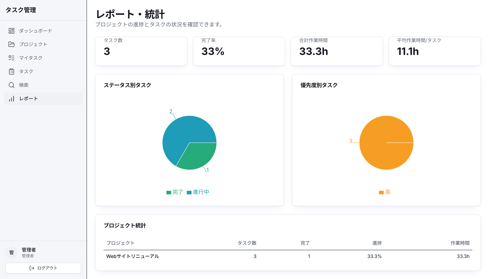
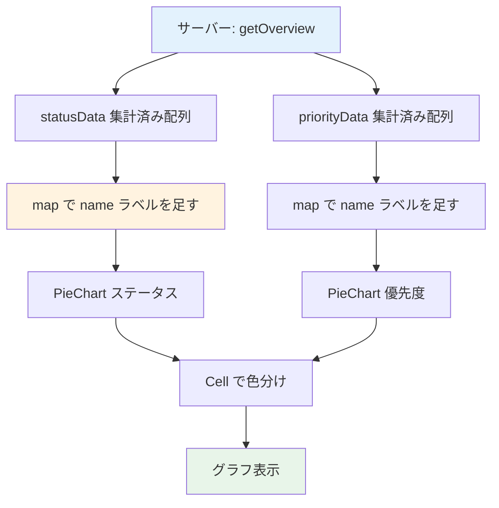
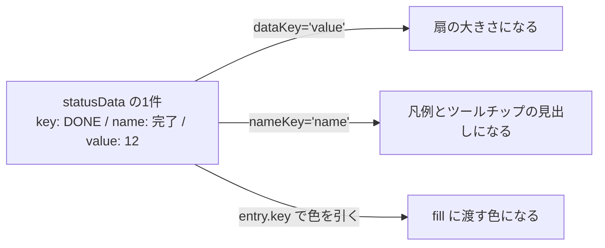
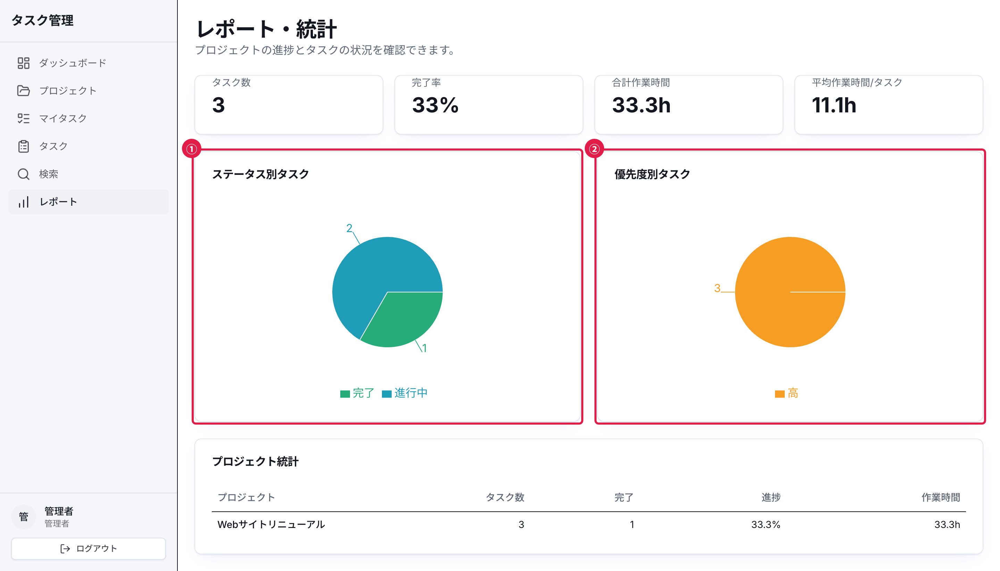
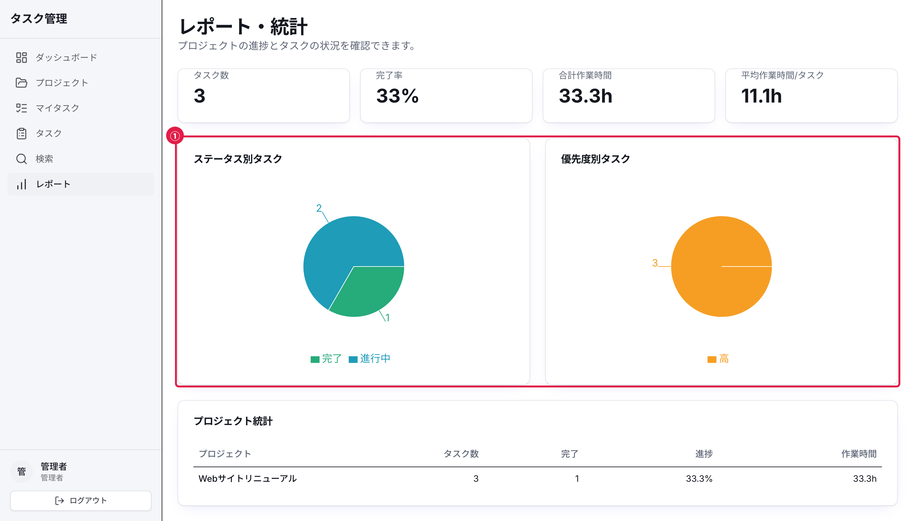

# Day 22: グラフを表示しよう

## 前回の振り返り

Day 21 では、サーバー側で集計済みのデータを返す `api.report.getOverview` を呼び出しました。タスク数・完了率・合計作業時間・平均作業時間の4枚の統計カードを表示しています。数値をカードで見せる基盤ができたので、今日は同じ集計済みデータを円グラフで可視化します。

---

## 今日のゴール

Recharts（React 用のグラフ描画ライブラリ）を使って、レポートページに円グラフを追加します。`getOverview` が返す集計済みデータから、ステータス別・優先度別のタスク分布を表示します。

スクリーンショット: レポートページにステータス別・優先度別の円グラフが並んだ完成イメージです。



> **今日のゴールライン**: サーバーが集計したタスク分布を受け取り、Recharts の部品を組み合わせて円グラフとして画面に出せればOKです。

## 始める前の前提

- Day 21 のレポートページと統計カードが表示できる
- `getOverview` が集計済みデータを返すことを Day 21 で確認済み
- タスクが複数件あり、ステータスや優先度にばらつきがある
- `recharts` がインストール済みであることを確認できる

> 3つ目の前提は、初期データのままでは満たせません。自分に見えるタスクは
> 「Webサイトリニューアル」の3件で、ステータスは未対応・進行中・完了が1件ずつ、
> 優先度は高が2件と中が1件です。低と緊急は1件もありません。
> このまま開くと、ステータスの円は同じ大きさの3切れ、優先度の円は2切れになります。
> 今日の主題は偏りを目で見ることなので、`/task` で優先度と状態を散らしたタスクを
> 4〜5件足してから始めると、扇の数と大きさの違いが画面で確かめられます。
> 足さないまま進んでも、コードの書き方は変わりません。

## なぜこれを作るのか

統計カードは合計や割合は分かりますが、どのステータスにタスクが偏っているかまでは読み取れません。円グラフにすると、その偏りをひと目で把握できます。

> **例え話**: 円グラフは「天気予報の図」です。
> 「降水確率60%」と聞くより、雨雲の図を
> 見た方が直感的に伝わります。
> 数値を円グラフにすると、各ステータスの
> 割合が視覚的に伝わります。

### なぜサーバー側で集計するのか

円グラフに必要なのは「ステータスごとの件数」だけです。全タスクを丸ごとクライアントへ送ると、件数が増えるほど通信量が膨らみます。サーバーで件数まで数えておけば、送るデータは数行の集計結果で済みます。ブラウザは受け取った配列をそのまま描くので、表示も速くなります。

Day 21 で見た通り、この集計はすでに `getOverview` の中で終わっています。今日のフロントの仕事は「受け取った集計結果に日本語ラベルと色を足して描く」ことだけです。

### グラフ表示のデータフロー


```mermaid
flowchart TD
    A[サーバー: getOverview] --> B[statusData 集計済み配列]
    A --> C[priorityData 集計済み配列]
    B --> D[map で name ラベルを足す]
    C --> E[map で name ラベルを足す]
    D --> F[PieChart ステータス]
    E --> G[PieChart 優先度]
    F --> H[Cell で色分け]
    G --> H
    H --> I[グラフ表示]

    style A fill:#e3f2fd
    style D fill:#fff3e0
    style I fill:#e8f5e9
```

図の上半分がサーバー、下半分がブラウザの担当です。`getOverview` から出てくる `statusData` と `priorityData` は、この時点ですでに件数まで数え終わった配列になっています。ブラウザ側の枝で起きるのは `map` で日本語ラベルを足すところだけで、そこから先は `PieChart` へ渡して `Cell` で色を付けるだけです。件数を数える処理がブラウザ側の枝に1つも出てこない点を、先に頭へ入れておいてください。今日のコードで `filter` や `length` が出てこないのは、書き忘れではなくこの分担のためです。

### やること / やらないこと

| やること | やらないこと |
|---------|-------------|
| ステータス別円グラフ | 棒グラフ |
| 優先度別円グラフ | 折れ線グラフ |
| 集計済みデータの表示 | クライアント側での再集計 |
| 色分け・レスポンシブ対応 | アニメーション |

### 新しく学ぶ概念

| 概念 | 読み方 | 役割 | 例え |
|------|--------|------|------|
| Recharts | リチャーツ | React 用のグラフ描画ライブラリ | 画用紙とペンのセット |
| PieChart | パイチャート | 円グラフの枠組み | ピザを載せるお皿 |
| Cell | セル | 各スライスに色を付ける部品 | ピザの各ピースに振る色 |
| dataKey / nameKey | データキー / ネームキー | データのどのプロパティを使うか指定 | 名簿のどの列を読むかの指定 |
| ResponsiveContainer | — | グラフのサイズを親に合わせる | 額縁に合わせるキャンバス |

### サーバー集計済みデータの形

`getOverview` が返す `statusData` は、`key`（ステータス名）と `value`（件数）だけを持つ配列です。日本語ラベルの `name` と色は、フロント側で `key` から引いて足します。

| 段階 | データの形 | 例 |
|-----|-----------|-----|
| サーバーが返す | `{ key, value }` | `{ key: 'TODO', value: 3 }` |
| フロントで name を足す | `{ key, value, name }` | `{ key: 'TODO', value: 3, name: '未対応' }` |
| 色は key から引く | `TASK_STATUS_COLORS[key]` | `'#64748b'` |

> `key` は `'TODO'` のような英字のステータス名です。人が読む見出しには使いにくいので、`name` に日本語ラベルを入れて凡例やツールチップに出します。

### Recharts の組み立てパターン

Recharts は複数のコンポーネント（画面を組み立てる部品）を組み合わせます。「枠組み + 中身 + 補助部品」の3層で1つのグラフを構成します。

| 層 | コンポーネント | 役割 |
|---|---|---|
| 枠組み | `PieChart` | グラフ全体の座標空間 |
| 中身 | `Pie` + `Cell` | データを描画し色を付ける |
| 補助 | `Tooltip` / `Legend` | ホバー表示と凡例 |

> Day 23 では `BarChart` や `LineChart` も
> 登場しますが、3層構造は共通です。

## 実装ステップ一覧

| ステップ | 作業内容 | 所要時間 |
|---------|---------|---------|
| Step 1 | Rechartsを確認する | 3分 |
| Step 2 | インポートと定数を追加する | 4分 |
| Step 3 | ステータス表示データを作る | 5分 |
| Step 4 | ステータス円グラフのCard枠を作る | 5分 |
| Step 5 | Pieにデータとセル色を設定する | 5分 |
| Step 6 | 優先度表示データを作る | 4分 |
| Step 7 | 優先度円グラフを追加する | 5分 |
| Step 8 | グリッドに配置して完成 | 4分 |
| Step 9 | 動作確認 | 3分 |

**合計時間**: 約38分です。

この時間はコードを読んで理解する目安です。写経して打ち込む時間、詰まって調べる時間は別に見てください。

---

### 予備知識: 今日使う Recharts コンポーネント

| コンポーネント | 役割 | 例え |
|--------------|------|------|
| `PieChart` | 円グラフ全体の枠組み | パイを描く土台 |
| `Pie` + `Cell` | 各スライスの色を `Cell` で設定 | パイの各ピース |
| `ResponsiveContainer` | グラフを親要素の幅に合わせる | 額縁サイズの自動調整 |
| `Tooltip` | マウスホバーで数値を表示 | ポイントの拡大表示 |
| `Legend` | 凡例（色と名前の対応表） | 地図の凡例 |

---

### Step 1: Rechartsを確認する（3分）

**ゴール**: Recharts がすでに
インストール済みであることを確認します。

次のコマンドで確認します。

```bash
# filepath: ターミナル（確認のみ）
# Recharts がインストール済みか確認する
npm list recharts
# recharts@3.x.x が表示されればOK
```

> Recharts は React 用のグラフ
> ライブラリで、`PieChart` や `BarChart` など
> 宣言的にグラフを描けます。このプロジェクトでは
> Day 01 で実行した `scripts/scaffold-from-scratch.sh` が
> 入れているので、あらためて入れる必要はありません。

**確認ポイント**:
- recharts がpackage.jsonにある
- バージョンが `3.x.x` と表示された

---

### Step 2: インポートと定数を追加する（4分）

**ゴール**: Day 21 のコードに Recharts と
色定数のインポートを追加します。

> Day 21 では `Card`, `CardContent`,
> `CardHeader`, `CardTitle` をすでにインポート
> しています。今回はそこに Recharts と
> 色・ラベルの定数を追加します。

**実装**: Day 21 のインポート部分に、以下の
3ブロックを追加してください。

```typescript
// filepath: src/app/report/page.tsx
// Rechartsのグラフ描画コンポーネントを追加
import {
  Cell, Legend, Pie, PieChart,
  ResponsiveContainer, Tooltip,
} from 'recharts';
```

6つをまとめて取り込みますが、役割は3つに分かれます。`PieChart` は扇を並べる座標の土台、`Pie` と `Cell` は扇そのものと1切れずつの色、`Tooltip` と `Legend` は読み手向けの補助表示です。`ResponsiveContainer` だけは何も描かず、親要素の幅と高さをグラフへ伝える係を務めます。取り込みを1つでも落とすと、その部品を書いた行で「定義されていない名前を使っている」というエラーになり、レポートページ全体が真っ白になります。Day 21 で `Card` を取り込んだときと同じ書き方なので、既存の import の並びに足すだけで済みます。

この取り込みで、レポートページの初期表示は少し重くなります。グラフの部品はブラウザ側で動くため、ページを開いた時点で描画用のコードが一式届きます。Day 21 の「Pro パターンで書こう」で触れた分け方を実際に行うと、グラフの部分だけを別ファイルへ切り出し、必要になってから読み込む形にできます。今日はまず1枚のページで動かすところまで進めます。

**確認ポイント**:
- Recharts のインポートが追加された

```typescript
// filepath: src/app/report/page.tsx
// 優先度の色・ラベルと型ガード関数を追加
import {
  isTaskPriority,
  TASK_PRIORITY_COLORS,
  TASK_PRIORITY_LABELS,
} from '@/lib/constant/priority';
```

ここで取り込む3つは、優先度の `key` を人が読める形へ変換するための道具です。`TASK_PRIORITY_LABELS` は `'HIGH'` から `'高'` を、`TASK_PRIORITY_COLORS` は同じ `'HIGH'` から扇の色を引く対応表になっています。`isTaskPriority` は、サーバーから届いた文字列が本当に優先度の値かどうかを確かめる関数（型ガード）です。この確認を挟まずに対応表を引くと、TypeScript は「どんな文字列が来るか保証できない」と判断して型エラーを出します。

**確認ポイント**:
- `isTaskPriority` と色・ラベル定数をインポートした

```typescript
// filepath: src/app/report/page.tsx
// ステータスの色・ラベルと型ガード関数を追加
import {
  isTaskStatus,
  TASK_STATUS_COLORS,
  TASK_STATUS_LABELS,
} from '@/lib/constant/status';
```

優先度でそろえた3点セットを、今度はステータス側でも用意します。`TASK_STATUS_LABELS` は `'TODO'` を `'未対応'` に、`TASK_STATUS_COLORS` は `'TODO'` を `'#64748b'` に対応づけた表です。どちらも `src/lib/constant/status.ts` にある定数で、Day 13 のタスク一覧で見出しを日本語にしたときと出どころは変わりません。ここで教材用の色をその場で書き起こすと、あとで定数側だけ直したときに円グラフが古い色のまま取り残されます。1か所を直せば画面全体が追従する状態を保つために、定数から引きます。

**確認ポイント**:
- `isTaskStatus` と色・ラベル定数をインポートした

```typescript
// filepath: src/app/report/page.tsx
// key に対応する色がないときの代替色を定義
const CHART_FALLBACK_COLOR = '#9e9e9e';
```

色を引けなかったときに `undefined` を渡すと、Recharts はその扇に色の指定を書き込みません。SVG は色の指定がない図形を黒で塗るので、円の一部だけが真っ黒な扇になります。凡例に並ぶどの色とも一致しない黒がいきなり出てくるうえ、原因はデータ側にあるので、見た目から理由をたどりにくくなります。灰色の代替色を1つ決めておけば、少なくとも「色の一覧に載っていない値が届いた」と画面から読み取れます。ステータスや優先度をあとから増やして定数の追加を忘れたときに、この灰色が知らせ役になります。ただし優先度の「低」も同じ灰色を使っているので、優先度のグラフでは見分けが付きません。初期データには「低」のタスクが1件も無いため、この重なりは画面には出ません。確かめたいときは、優先度が「低」のタスクを1件作ってから開いてください。扇の数が想定と合わないときは、色ではなくデータの中身を確かめてください。

> `CHART_FALLBACK_COLOR` は保険です。`key` が
> 色の一覧にない値だったときだけ使います。
> 通常は `TASK_STATUS_COLORS` から色が引けます。

**確認ポイント**:
- 上記4ブロックのインポートと定数を追加した

#### ステータスの色一覧

| ステータス | 色 | HEXコード |
|-----------|-----|----------|
| TODO | グレー | `#64748b` |
| IN_PROGRESS | ブルー | `#60a5fa` |
| IN_REVIEW | イエロー | `#fbbf24` |
| DONE | グリーン | `#34d399` |
| CANCELLED | レッド | `#f87171` |

> この5色は `src/lib/constant/status.ts` の
> `TASK_STATUS_COLORS` に定義済みです。教材と
> アプリで同じ定数を使うので、色がずれません。

---

### Step 3: ステータス表示データを作る（5分）

**ゴール**: サーバーが返した集計済みの
`statusData` に、日本語ラベルを足します。

> Day 21 で使った `overview`（`getOverview` の
> 戻り値）をそのまま使います。集計はサーバーで
> 終わっているので、フロントでは数え直しません。

**実装**: Day 21 の `useQuery` の下、`return`
文の前に追加してください。

```typescript
// filepath: src/app/report/page.tsx
// サーバーは key と value だけ返すので name をここで足す
const statusData =
  overview?.statusData.map((entry) => ({
    ...entry,
    name: isTaskStatus(entry.key)
      ? TASK_STATUS_LABELS[entry.key]
      : entry.key,
  })) ?? [];
```

この配列の長さは、サーバーが数えた分だけになります。Day 21 の `activeTasksFilter` を思い出してください。あの絞り込みは、アーカイブ済みプロジェクトのタスクと `CANCELLED` のタスクを集計から外しています。だから色の一覧に赤い `CANCELLED` が載っていても、その扇が円グラフに出ることはありません。中止したタスクを混ぜると「今動いている作業の内訳」として読めなくなるためで、抜け落ちているのではなく意図して外してあります。統計カードの合計と円グラフの合計が一致するのも、両方が同じ絞り込みを通っているからです。

> `overview?.statusData` の `?.` は、データが
> まだ届いていないときに `undefined` を返す書き方です。
> その場合は `?? []` で空配列にして、グラフが
> 空でも落ちないようにしています。

**確認ポイント**:
- `overview.statusData` を `map` で加工している
- `isTaskStatus` でラベルに変換している
- クライアント側で件数を数え直していない
- `npm run dev` でエラーが出ていない

> この時点では画面に変化はありません。円グラフを描く `<Pie>` は Step 5 で追加するので、凡例が日本語で並ぶのを確かめられるのはそのあとです。

#### なぜ map だけで済むのか

サーバーがすでに件数まで数えているので、フロントの仕事は `name` を1つ足すだけです。`entry.key` が `'TODO'` などのステータス名なら、`TASK_STATUS_LABELS` から `'未対応'` を引きます。`statusData` の型は tRPC（型付き API 通信の仕組み）が推論するので、自分で型を書く必要はありません。

---

### Step 4: ステータス円グラフのCard枠を作る（5分）

**ゴール**: ステータス円グラフを表示する
Card とグラフ枠を作ります。

> 以下のJSXは `return` 文の中、
> Day 21 の統計カード `</div>` の下に
> 追加します。

**実装**:

```tsx
{/* filepath: src/app/report/page.tsx */}
<Card>
  <CardHeader>
    <CardTitle>ステータス別タスク</CardTitle>
  </CardHeader>
  <CardContent>
    <div className="h-[300px]">
      <ResponsiveContainer width="100%" height="100%">
        <PieChart>
          {/* Step 5 で Pie を追加する */}
          <Tooltip />
          <Legend />
        </PieChart>
      </ResponsiveContainer>
    </div>
  </CardContent>
</Card>
```

> `ResponsiveContainer` は幅と高さを `100%` で
> 指定しています。この `100%` は親要素を基準に
> した割合です。親に高さがないと `0` と解釈され、
> グラフが表示されません。そのため親の `div` に
> `h-[300px]` で実際の高さを与えています。

**確認ポイント**:
- `Card` > `CardContent` > `div` > `ResponsiveContainer` の入れ子になっている
- 親の `div` に `h-[300px]` がある
- `PieChart` の中に `Tooltip` と `Legend` がある

---

### Step 5: Pieにデータとセル色を設定する（5分）

**ゴール**: Step 4 の `{/* Step 5 で... */}`
を `Pie` と `Cell` に置き換えます。

**実装**: Step 4 のコメント行を消して、
以下を `<PieChart>` の先頭に追加します。

```tsx
{/* filepath: src/app/report/page.tsx */}
<Pie
  data={statusData}
  dataKey="value"
  nameKey="name"
  cx="50%"
  cy="50%"
  outerRadius={80}
  label
>
  {statusData.map((entry) => (
    <Cell
      key={entry.key}
      fill={
        isTaskStatus(entry.key)
          ? TASK_STATUS_COLORS[entry.key]
          : CHART_FALLBACK_COLOR
      }
    />
  ))}
</Pie>
```

> `dataKey="value"` は各要素の `value` プロパティ
> （件数）を扇の大きさに使う指定です。
> `nameKey="name"` は `name` プロパティ（日本語
> ラベル）を凡例やツールチップの見出しに使います。
> データの形とこの名前が一致しないと、扇が描かれず
> 空のグラフになります。


```mermaid
flowchart LR
    R["statusData の1件<br/>key: DONE / name: 完了 / value: 12"]
    R -->|"dataKey='value'"| A["扇の大きさになる"]
    R -->|"nameKey='name'"| B["凡例とツールチップの見出しになる"]
    R -->|"entry.key で色を引く"| C["fill に渡す色になる"]
```

1件のデータから3本の線が出て、それぞれ別の列を指します。`dataKey` を `key` に書き換えると、`DONE` という文字を大きさに使おうとするので、扇が描かれません。グラフが空のときは、この3本の行き先とデータの列名が合っているかを見てください。

`Cell` は `Pie` の子要素として、データ1件ごとに1つ描画します。`entry.key` から `TASK_STATUS_COLORS` で色を引くので、`isTaskStatus` 型ガードで安全に判定し、`as` 型アサーションは使いません。

`statusData` が空配列のときは、この `map` が1周も回りません。`Cell` は作られず、扇は1枚も描かれません。`Legend` は項目ゼロで何も出さず、カードの中には Step 4 で確保した 300px の空白だけが残ります。グラフが真っ白なときは Recharts の書き方を疑う前に、まず自分のプロジェクトにタスクが登録されているかを確かめてください。参加しているプロジェクトが1つも無いアカウントでは、サーバーが最初から空配列を返します。

**確認ポイント**:
- `dataKey` と `nameKey` がデータのプロパティ名と一致している
- `isTaskStatus` 型ガードで色を決定している
- `as` 型アサーションを使っていない

画面を確認してください。この時点で表示される円グラフはステータス別の1つだけです。優先度別の円グラフは Step 7 で追加し、2つを横並びにするグリッド配置は Step 8 で作ります。

#### Step 4-5 の完成構造

Step 4 の Card 枠 + Step 5 の Pie を
合わせると、次のネスト構造になります。

| 階層 | 要素 | 由来 |
|-----|------|------|
| 1 | `<Card>` | Step 4 |
| 2 | `<CardHeader>` + `<CardContent>` | Step 4 |
| 3 | `<ResponsiveContainer>` > `<PieChart>` | Step 4 |
| 4 | `<Pie>` > `<Cell>` | Step 5 |
| 4 | `<Tooltip />` + `<Legend />` | Step 4 |

**確認ポイント**:
- Card 全体が1つのブロックとして完成している

---

### Step 6: 優先度表示データを作る（4分）

**ゴール**: サーバーが返した集計済みの
`priorityData` に、日本語ラベルを足します。

> Step 3 の `statusData` と同じ場所
> （`return` 文の前）に追加してください。
> 使う関数がステータス用から優先度用に
> 変わるだけです。

**実装**:

```typescript
// filepath: src/app/report/page.tsx
// priorityData も key と value だけなので name を足す
const priorityData =
  overview?.priorityData.map((entry) => ({
    ...entry,
    name: isTaskPriority(entry.key)
      ? TASK_PRIORITY_LABELS[entry.key]
      : entry.key,
  })) ?? [];
```

> ステータスと同じ手順です。型ガードが
> `isTaskPriority`、ラベルが `TASK_PRIORITY_LABELS`
> に変わる点だけが異なります。優先度も
> サーバーが集計済みなので、数え直しはしません。

**確認ポイント**:
- `overview.priorityData` を `map` で加工している
- `isTaskPriority` で型ガードしている
- Step 3 の `statusData` と同じ場所に書いた
- `npm run dev` でエラーが出ていない

> ここでも画面はまだ変わりません。優先度の円グラフは Step 7 で追加します。

---

### Step 7: 優先度円グラフを追加する（5分）

**ゴール**: 優先度別の円グラフを
もう1枚追加します。

**実装**: Step 4-5 のステータスグラフの
直後に、以下の Card を追加します。まずは
Card 枠と `Pie` の設定です。

```tsx
{/* filepath: src/app/report/page.tsx */}
<Card>
  <CardHeader>
    <CardTitle>優先度別タスク</CardTitle>
  </CardHeader>
  <CardContent>
    <div className="h-[300px]">
      <ResponsiveContainer width="100%" height="100%">
        <PieChart>
          <Pie
            data={priorityData}
            dataKey="value"
            nameKey="name"
            cx="50%"
            cy="50%"
            outerRadius={80}
            label
          >
```

枠の形は Step 4 のステータス側とそろえ、変わるのは `data` に渡す配列だけです。`cx` と `cy` の `50%` は、円の中心を親要素の幅と高さのちょうど真ん中に置く指定です。`outerRadius={80}` は円の半径をピクセルで決めます。半径を親の高さの半分より大きくすると円が枠からはみ出して上下が切れるので、`h-[300px]` の枠に対しては 80 前後が収まりのよい値になります。末尾の `label` は、各扇のそばに件数を書き出す指定です。これを外すと、ホバーするまで件数が読めないグラフになります。

**確認ポイント**:
- Card 枠のネスト構造がステータスと同じ
- `data` が `priorityData` に変わっている

続けて、`Cell` で色を付けて閉じます。

```tsx
            {/* filepath: src/app/report/page.tsx */}
            {priorityData.map((entry) => (
              <Cell
                key={entry.key}
                fill={
                  isTaskPriority(entry.key)
                    ? TASK_PRIORITY_COLORS[entry.key]
                    : CHART_FALLBACK_COLOR
                }
              />
            ))}
          </Pie>
          <Tooltip />
          <Legend />
        </PieChart>
      </ResponsiveContainer>
    </div>
  </CardContent>
</Card>
```

> 優先度の色は `TASK_PRIORITY_COLORS` から引きます。
> `key` が `'HIGH'` などの優先度名なので、
> `isTaskPriority` 型ガードで判定してから色を
> 決めています。ここでも `as` は使いません。

**確認ポイント**:
- `isTaskPriority` 型ガードで色を決定している
- 2つの円グラフが表示される

スクリーンショット: 下の画像は Step 8 まで書き終えた完成後の画面です。赤枠の中が、この Step で足した2つの円グラフです。この Step の時点では横に並ばず、縦に積まれた形で出ます。横並びにするのは Step 8 です。



写っている扇の数は、Day 15 と Day 16 で自分が動かした結果です。ステータスは「進行中」2件と「完了」1件で2切れ、優先度は3件とも「高」なので1切れになります。触った内容が違えば切れの数も変わりますが、実装の誤りではありません。優先度の円が1色で埋まるのは、`TASK_PRIORITY_COLORS` に4色あっても、その色を使う件数が0なら扇は出ないためです。

---

### Step 8: グリッドに配置して完成（4分）

**ゴール**: 2つのグラフカードを横並びの
グリッドに配置します。

**実装**: Step 4-5 と Step 7 で作った
2つの `<Card>` を、1つのグリッド用 `<div>` で囲みます。
まず、その外枠になる開始タグと閉じタグだけを追加します。

```tsx
{/* filepath: src/app/report/page.tsx */}
{/* グリッドの外枠（この2行の間に Card を移す） */}
<div className="grid grid-cols-1 md:grid-cols-2 gap-6">
</div>
```

次に、Step 4-5 で書いたステータス円グラフを移します。
その `<Card>` の開始行から `</Card>` の行までを
まるごと切り取り、上の開始タグと閉じタグの間に貼り付けます。

続けて、Step 7 で書いた優先度円グラフも同じ要領で移します。
`<Card>` から `</Card>` までを切り取り、
いま貼り付けたステータス円グラフの直後に置きます。

移し終えると、`<div>` の中に `<Card>` が2つ、
上から「ステータス」「優先度」の順で並びます。

> `grid-cols-1 md:grid-cols-2` により、
> モバイルでは縦並び、PCでは横並びの
> レスポンシブ配置になります。`md:` は画面幅が
> 中サイズ以上のときだけ効く接頭辞です。

**確認ポイント**:
- PCでは横並び、モバイルでは縦並び
- Day 21 の統計カードの下に配置されている

#### グラフのブレークポイント

| 画面サイズ | クラス | 配置 |
|-----------|--------|------|
| モバイル | `grid-cols-1` | 縦並び |
| PC | `md:grid-cols-2` | 横並び |

---

### Step 9: 動作確認（3分）

**ゴール**: グラフ表示の全体を確認します。

```bash
# filepath: ターミナル（確認用）
# 開発サーバーを起動してグラフを確認する
PORT=3001 npm run dev
# http://localhost:3001/report にアクセス
```

1. `/report` にアクセス
2. 統計カード（Day 21）の下にグラフがある
3. ステータス別の円グラフが表示される
4. 優先度別の円グラフが表示される
5. 凡例（Legend）で各項目が確認できる
6. マウスオーバーで Tooltip が表示される

**確認ポイント**:
- 色がステータス/優先度に対応している
- Tooltip で件数が確認できる

スクリーンショット: 統計カード4枚の下に円グラフ2つがグリッド配置された完成画面です。




---

### Pro パターンで書こう（集計はクライアントかサーバーか）

### Before（改善前のコード）

```tsx
// filepath: 読み比べ用サンプル（アンチパターン・実ファイルには対応しません）
// サーバーが集計済みなのに、生の tasks をもう一度数え直す
const todo = tasks.filter((t) => t.status === 'TODO').length;
const done = tasks.filter((t) => t.status === 'DONE').length;
const statusData = [
  { key: 'TODO', name: '未対応', value: todo },
  { key: 'DONE', name: '完了', value: done },
];
```

一見すると素直なコードですが、この数行は Day 21 でサーバーが済ませた仕事をやり直しています。しかも `'TODO'` と `'DONE'` を直に書いているので、`IN_PROGRESS` と `IN_REVIEW` のタスクは円グラフのどこにも現れません。統計カードのタスク数と円グラフの合計が食い違う画面になり、読み手は原因をグラフの描画側で探し始めます。

**このコードの問題点**:

- サーバーと同じ集計ロジックがフロントにも二重で存在する
- 集計のために全タスクをクライアントへ送る必要があり、通信量が増える
- ステータスが増えたとき、サーバーとフロントの両方を直す羽目になる

### After（プロが書くコード）

```tsx
// filepath: 読み比べ用サンプル（実ファイルには対応しません）
// サーバー集計済みの statusData を受け取り name だけ足す
const statusData =
  overview?.statusData.map((entry) => ({
    ...entry,
    name: isTaskStatus(entry.key)
      ? TASK_STATUS_LABELS[entry.key]
      : entry.key,
  })) ?? [];
```

書き換えた後のフロントは、受け取った配列に `name` を1つ足すだけになりました。ステータスの種類が増えてもこの行は触らずに済み、サーバーの集計に新しい `key` が加われば扇がそのまま1枚増えます。末尾の `?? []` があるので、タスクが1件も無いアカウントでも `statusData` は空配列になり、扇が描かれないだけでページは落ちません。Day 09 の一覧画面で `?? 0` を使って件数を守ったのと、狙いは変わりません。

**このコードの強み**:

- 集計はサーバーの1か所だけ。ロジックが二重にならない
- 送るデータは数行の集計結果だけで済む
- `statusData` の型は tRPC が推論するので、同じ形の型を手書きしない

#### 覚えておきたいエッセンス

集計はデータの近くにあるサーバー側で1回だけ行い、クライアントは受け取った結果をそのまま描きます。型は tRPC が推論するので、同じ形の型を手書きで二重に持たないよう気をつけます。

## 完成コード全体

今日触ったファイルは1つだけです。ただし Day 21 で書いたコードの上へ、インポート・定数・データ加工・JSX を別々の場所に貼り重ねました。どこへ何を入れたか分からなくなった場合は、以下のコードで `src/app/report/page.tsx` を丸ごと置き換えてください。上から順に読むと、Step 2 から Step 8 で書いた断片が1つのファイルへどう収まったかを確かめられます。

| ファイル | 役割 | 対応する Step |
|---------|------|--------------|
| `src/app/report/page.tsx` | レポート画面。統計カード・円グラフ2枚・プロジェクト統計テーブルを1ページに並べる | Step 2〜Step 8 |

### `src/app/report/page.tsx`

**画面部品の取り込み**:

```typescript
// filepath: src/app/report/page.tsx
// 完成版: 画面部品の取り込み
'use client';

import {
  Cell, Legend, Pie, PieChart,
  ResponsiveContainer, Tooltip,
} from 'recharts';
import { AppLayout } from '@/component/layout/app-layout';
import {
  Card, CardContent,
  CardHeader, CardTitle,
} from '@/component/ui/card';
import { PageLoadingSpinner } from '@/component/ui/loading-spinner';
import {
  Table, TableBody, TableCell,
  TableHead, TableHeader, TableRow,
} from '@/component/ui/table';
```

`recharts` が先頭に来て `@/` で始まる自分のプロジェクトの部品が後ろに続くのは、Biome が外部ライブラリを先に並べる決まりだからです。手元の並びが違っても `npm run fix` で同じ形に直るので、写経のときに順番を気にする必要はありません。並びより大事なのは中身のほうで、`recharts` の6つのうち1つでも欠けると、その部品を書いた行で名前が見つからないというエラーになります。

**色とラベルの定数**:

```typescript
// filepath: src/app/report/page.tsx（同じファイルの続き）
// 完成版: 色とラベルの定数、通信の入口
import {
  isTaskPriority,
  TASK_PRIORITY_COLORS,
  TASK_PRIORITY_LABELS,
} from '@/lib/constant/priority';
import {
  isTaskStatus,
  TASK_STATUS_COLORS,
  TASK_STATUS_LABELS,
} from '@/lib/constant/status';
import { api } from '@/trpc/react';

const CHART_FALLBACK_COLOR = '#9e9e9e';
```

優先度とステータスで、型ガード・色・ラベルの3点セットをそろえて取り込みます。色とラベルを画面側に書き写さないのは、あとで定数を直したときにこのページだけ古い色で取り残されるのを防ぐためです。`CHART_FALLBACK_COLOR` はファイルの一番外側に置きます。コンポーネント関数の中へ入れても動きますが、描き直しのたびに同じ文字列を作り直すことになります。

**取得と表示用の値づくり**:

```typescript
// filepath: src/app/report/page.tsx
// 完成版: 取得と表示用の値づくり
export default function ReportPage() {
  const { data: overview, isLoading } =
    api.report.getOverview.useQuery();

  const totalTasks = overview?.totalTasks ?? 0;
  const completionRate =
    overview?.completionRate ?? 0;
  const totalTimeHours =
    ((overview?.totalTimeSpent ?? 0) / 60)
      .toFixed(1);
  const averageTimeHours =
    ((overview?.averageTimePerTask ?? 0) / 60)
      .toFixed(1);
```

サーバーから届く数字を、画面へ出す形に整えるのがこの4行です。時間の2つだけ `/ 60` を挟んでいるのは、サーバーが分で返すからです。割り算を JSX の中へ書かず先に済ませておくと、表示部分は変数名を置くだけになり、カードのどれが何の値かを目で追えます。`?? 0` は `undefined / 60` が `NaN` になるのを防ぐ守りです。

**円グラフへ渡す2つの配列**:

```typescript
// filepath: src/app/report/page.tsx（同じファイルの続き）
// 完成版: 円グラフへ渡す2つの配列
  const statusData =
    overview?.statusData.map((entry) => ({
      ...entry,
      name: isTaskStatus(entry.key)
        ? TASK_STATUS_LABELS[entry.key]
        : entry.key,
    })) ?? [];

  const priorityData =
    overview?.priorityData.map((entry) => ({
      ...entry,
      name: isTaskPriority(entry.key)
        ? TASK_PRIORITY_LABELS[entry.key]
        : entry.key,
    })) ?? [];

  if (isLoading) {
    return <PageLoadingSpinner />;
  }
```

2つの配列は、読み込み判定より前に置きます。`if (isLoading)` の下へ移しても画面は動きますが、`return` を挟んだ先で `const` を書くことになり、値を用意する場所が読み込み判定の前後に散らばります。`?? []` があるので、まだ何も届いていない一瞬でも `statusData` は配列のままです。型を書いていないのは、tRPC が `getOverview` の戻り値から `key` と `value` の形を推論するからです。

**return の外枠と見出し**:

```typescript
// filepath: src/app/report/page.tsx
// 完成版: return の外枠と見出し
  return (
    <AppLayout>
      <div className="space-y-6">
        <div>
          <h1 className="text-3xl
            font-bold tracking-tight">
            レポート・統計
          </h1>
          <p className="text-muted-foreground">
            プロジェクトの進捗とタスクの状況を確認できます。
          </p>
        </div>
```

`AppLayout` で囲んでいるので、サイドバーとヘッダーはこのファイルに書かなくても付いてきます。`space-y-6` を持つ `div` が、このあと並べる統計カード・グラフ・テーブルの間隔をまとめて決めます。カードごとに余白を書かずに済むのは、縦に積む要素の間隔を親が1か所で持っているからです。

**統計カードの前半**:

```typescript
        {/* filepath: src/app/report/page.tsx（同じファイルの続き） */}
        {/* 完成版: 統計カード（タスク数・完了率） */}
        <div className="grid grid-cols-1
          sm:grid-cols-2 lg:grid-cols-4 gap-4">
          <Card>
            <CardContent className="pt-6">
              <p className="text-sm
                text-muted-foreground mb-1">
                タスク数</p>
              <p className="text-3xl font-bold">
                {totalTasks}</p>
            </CardContent>
          </Card>
          <Card>
            <CardContent className="pt-6">
              <p className="text-sm
                text-muted-foreground mb-1">
                完了率</p>
              <p className="text-3xl font-bold">
                {completionRate}%</p>
            </CardContent>
          </Card>
```

グリッドの列数を画面幅で3段階に変えているのは、`text-3xl` の数字が折り返さない幅を保つためです。4枚を横一列に並べたまま画面を狭めると、1枚あたりの幅が数字の桁数を下回り、`120` のような値が2行に割れます。カードの中身が2枚とも同じ形なのは、見出しの文字と数字の大きさをそろえて、4枚を1つのまとまりとして読ませるためです。

**統計カードの後半**:

```typescript
          {/* filepath: src/app/report/page.tsx（同じファイルの続き） */}
          {/* 完成版: 統計カード（作業時間の合計と平均） */}
          <Card>
            <CardContent className="pt-6">
              <p className="text-sm
                text-muted-foreground mb-1">
                合計作業時間</p>
              <p className="text-3xl font-bold">
                {totalTimeHours}h</p>
            </CardContent>
          </Card>
          <Card>
            <CardContent className="pt-6">
              <p className="text-sm
                text-muted-foreground mb-1">
                平均作業時間/タスク</p>
              <p className="text-3xl font-bold">
                {averageTimeHours}h</p>
            </CardContent>
          </Card>
        </div>
```

時間の2枚は、変数の中身がすでに文字列なので `h` を後ろに足すだけです。末尾の `</div>` は、前のブロックで開いたグリッドを閉じるタグになります。ここを書き忘れると、このあとのグラフ2枚までグリッドの中へ入り、4列のうちの1マスに押し込まれた細いグラフが並びます。

**ステータス円グラフの枠**:

```typescript
        {/* filepath: src/app/report/page.tsx（同じファイルの続き） */}
        {/* 完成版: ステータス円グラフの枠 */}
        <div className="grid grid-cols-1
          md:grid-cols-2 gap-6">
          <Card>
            <CardHeader>
              <CardTitle>ステータス別タスク</CardTitle>
            </CardHeader>
            <CardContent>
              <div className="h-[300px]">
                <ResponsiveContainer
                  width="100%" height="100%">
                  <PieChart>
                    <Pie
                      data={statusData}
                      dataKey="value"
                      nameKey="name"
                      cx="50%"
                      cy="50%"
                      outerRadius={80}
                      label
                    >
```

`h-[300px]` を持つ `div` が、`ResponsiveContainer` の `height="100%"` の基準になります。この `div` を外すと基準の高さが決まらず、100% は 0 と計算されて扇が1枚も描かれません。グラフのグリッドを統計カードとは別の `div` にしてあるのは、カードは4列、グラフは2列と、ちょうどよい列数が違うからです。

**ステータス円グラフの色付け**:

```typescript
                      {/* filepath: src/app/report/page.tsx（同じファイルの続き） */}
                      {/* 完成版: ステータス円グラフの色と閉じタグ */}
                      {statusData.map((entry) => (
                        <Cell
                          key={entry.key}
                          fill={
                            isTaskStatus(entry.key)
                              ? TASK_STATUS_COLORS[entry.key]
                              : CHART_FALLBACK_COLOR
                          }
                        />
                      ))}
                    </Pie>
                    <Tooltip />
                    <Legend />
                  </PieChart>
                </ResponsiveContainer>
              </div>
            </CardContent>
          </Card>
```

`Cell` はデータ1件につき1つ作り、その扇の色だけを受け持ちます。`isTaskStatus` を挟んでから対応表を引いているのは、サーバーから届く `key` の中身を TypeScript が文字列としてしか知らないからです。型ガードを通さずに `TASK_STATUS_COLORS[entry.key]` と書くと、どの文字列でも引ける保証が無いという型エラーになります。`Tooltip` と `Legend` を `Pie` の外に置くのは、この2つが扇そのものではなくグラフ全体に付く表示だからです。

**優先度円グラフの枠**:

```typescript
          {/* filepath: src/app/report/page.tsx（同じファイルの続き） */}
          {/* 完成版: 優先度円グラフの枠 */}
          <Card>
            <CardHeader>
              <CardTitle>優先度別タスク</CardTitle>
            </CardHeader>
            <CardContent>
              <div className="h-[300px]">
                <ResponsiveContainer
                  width="100%" height="100%">
                  <PieChart>
                    <Pie
                      data={priorityData}
                      dataKey="value"
                      nameKey="name"
                      cx="50%"
                      cy="50%"
                      outerRadius={80}
                      label
                    >
```

ステータス側と変えたのは `CardTitle` の文言と `data` に渡す配列だけです。`dataKey` と `nameKey` を書き換えずに済むのは、Step 3 と Step 6 で2つの配列を `value` と `name` という同じプロパティ名にそろえたからです。形をそろえておくと、グラフを増やすたびに設定を読み直す手間が減ります。

**優先度円グラフの色付け**:

```typescript
                      {/* filepath: src/app/report/page.tsx（同じファイルの続き） */}
                      {/* 完成版: 優先度円グラフの色と閉じタグ */}
                      {priorityData.map((entry) => (
                        <Cell
                          key={entry.key}
                          fill={
                            isTaskPriority(entry.key)
                              ? TASK_PRIORITY_COLORS[entry.key]
                              : CHART_FALLBACK_COLOR
                          }
                        />
                      ))}
                    </Pie>
                    <Tooltip />
                    <Legend />
                  </PieChart>
                </ResponsiveContainer>
              </div>
            </CardContent>
          </Card>
        </div>
```

最後の `</div>` でグラフ用のグリッドを閉じます。ここまでで `<Card>` が2つ入った状態になり、画面幅が `md` 以上なら横並び、それより狭ければ縦積みになります。閉じ忘れると、次のプロジェクト統計テーブルまでグリッドの中へ入り、グラフの隣に半分の幅の表が置かれます。

**プロジェクト統計テーブルの見出し**:

```typescript
        {/* filepath: src/app/report/page.tsx（同じファイルの続き） */}
        {/* 完成版: プロジェクト統計テーブルの見出し */}
        <Card>
          <CardHeader>
            <CardTitle>プロジェクト統計</CardTitle>
          </CardHeader>
          <CardContent>
            <Table>
              <TableHeader>
                <TableRow>
                  <TableHead className="w-[200px]">
                    プロジェクト</TableHead>
                  <TableHead className="text-right">
                    タスク数</TableHead>
                  <TableHead className="text-right">
                    完了</TableHead>
                  <TableHead className="text-right">
                    進捗</TableHead>
                  <TableHead className="text-right">
                    作業時間</TableHead>
                </TableRow>
              </TableHeader>
```

数字の列に `text-right` を付けているのは、桁数の違う値を右端でそろえるためです。`7` と `123` を左寄せで並べると一の位の位置がずれ、大小を見比べるのに時間がかかります。先頭の列だけ `w-[200px]` で幅を固定してあるのは、プロジェクト名の長さで右側の列がずれないようにするためです。

**プロジェクト統計テーブルの行**:

```typescript
              {/* filepath: src/app/report/page.tsx（同じファイルの続き） */}
              {/* 完成版: プロジェクト統計テーブルの行 */}
              <TableBody>
                {overview?.projectStats.map((stat) => (
                  <TableRow key={stat.id}>
                    <TableCell className="font-medium">
                      {stat.name}</TableCell>
                    <TableCell className="text-right">
                      {stat.totalTasks}</TableCell>
                    <TableCell className="text-right">
                      {stat.completedTasks}</TableCell>
                    <TableCell className="text-right">
                      {stat.progress.toFixed(1)}%</TableCell>
                    <TableCell className="text-right">
                      {stat.totalTimeHours.toFixed(1)}h
                    </TableCell>
                  </TableRow>
                ))}
              </TableBody>
```

`key` に `stat.id` を渡すのは、React が描き直しのときにどの行がどのプロジェクトかを見分けるためです。配列の番号を渡すと、プロジェクトを新しく作って並び順が変わったときに、前の行の表示を別のプロジェクトへ流用します。`toFixed(1)` は表示のときだけ小数を1桁へ丸める指定で、サーバーが返す `71.42857142857143` をそのまま出さないための処理です。

**ファイル末尾の閉じタグ**:

```typescript
            {/* filepath: src/app/report/page.tsx（同じファイルの続き） */}
            {/* 完成版: 閉じタグと関数の終わり */}
            </Table>
          </CardContent>
        </Card>
      </div>
    </AppLayout>
  );
}
```

開いたタグを内側から順に閉じて、ファイルが終わります。`Table` から `AppLayout` まで、開いた順の逆にたどるのが JSX の決まりです。順番を入れ違えると、保存した瞬間に構文エラーが出ます。ブラウザに映るのはグラフではなくエラー画面です。画面が真っ白になったときは、まずこの閉じタグの並びを上から数えてください。

## 今日のまとめ

- [ ] Recharts で円グラフを表示できた
- [ ] `getOverview` の集計済みデータを受け取って表示した
- [ ] `key` から色とラベルを引いて色分けした
- [ ] レスポンシブに2列配置できた

## つまずきポイント

| エラー / 問題 | 原因 | 解決方法 |
|--------------|------|---------|
| グラフが表示されない | 親に高さがない | `h-[300px]` を親に設定 |
| グラフが空になる | `dataKey` / `nameKey` がデータの形と不一致 | `value` と `name` のプロパティ名を合わせる |
| 全部同じ色になる | Cell 未使用 | map で Cell に色を設定 |
| 凡例が表示されない | Legend 未追加 | PieChart 内に Legend 追加 |
| サイズが固定される | ResponsiveContainer 未使用 | width/height 100% 設定 |

## 今日学んだ用語

| 用語 | 意味 |
|------|------|
| PieChart | 円グラフの枠組みコンポーネント |
| Cell | 円グラフの各スライスに色を付ける |
| ResponsiveContainer | 親のサイズに合わせる自動調整コンテナ |
| dataKey | 扇の大きさに使うプロパティ名の指定 |
| nameKey | 凡例やツールチップの見出しに使うプロパティ名の指定 |
| getOverview | 集計済みのレポートデータを返す API |

## 理解チェック

今日書いたコードを見ながら答えてみてください。答えは各問のすぐ下にあります。

**Q1. `statusData` を作る `map` は、サーバーから届いた配列に何を1つ足していますか。**

A. `name`、つまり日本語のラベルだけです。件数の `value` はサーバーが数え終わっているので、画面側では数え直しません。`entry.key` の `'TODO'` を `TASK_STATUS_LABELS` に通して `'未対応'` を得ています。

**Q2. `<div className="h-[300px]">` を外して、`ResponsiveContainer` を `CardContent` の直下に置くと、画面はどうなりますか。**

A. 扇が1枚も描かれず、カードの中は空のままになります。`ResponsiveContainer` の `height="100%"` は親を基準にした割合なので、親に高さが無いと 100% が 0 と計算されるためです。

**Q3. `TASK_STATUS_COLORS[entry.key]` を引く前に `isTaskStatus(entry.key)` を通すのはなぜですか。`as` で押し込まないのはなぜですか。**

A. サーバーから届く `key` を TypeScript は「ただの文字列」としか知らないので、型ガードを通さずに対応表を引くと型エラーになります。`as` で押し込むと型検査は黙りますが、対応表に無い値が来たときに `undefined` が `fill` へ渡り、SVG はその扇を黒く塗ります。型ガードなら、外れた値を `CHART_FALLBACK_COLOR` へ逃がす道が残ります。

---

## 次回予告

Day 23 では、Day 21 で作ったプロジェクト統計テーブルを
完成形と照合したうえで、週次レポート機能を実装します。
プロジェクトごとの進捗を表形式で確認できます。

---

## 次に読むもの

- 前の日: [Day 21](./day21_統計カードを表示.md)
- 次の日: [Day 23](./day23_週次レポート.md)
- 全体の地図: [学びのロードマップ](./00-1_学びのロードマップ.md)
- 目次: [カリキュラム目次](./00_カリキュラム目次.md)
- 詰まったとき: [トラブルシューティング](./appendix_トラブルシューティング.md)
- 言葉の意味: [用語集](./appendix_用語集.md)
