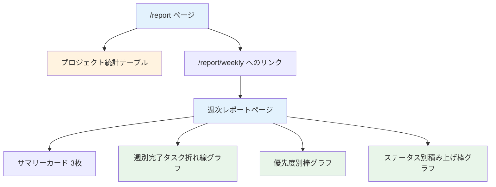

# Day 23: 週次レポートを表示しよう

## 🔙 前回の振り返り

Day 22 では Recharts ライブラリを使って、ステータス別・優先度別の円グラフを実装しました。`Map` によるグラフ用データ集計や `ResponsiveContainer` でのレスポンシブ対応も学んだので、今日はプロジェクト別統計テーブルと週次レポート機能に取り組みます。

---

## 🎯 今日のゴール

レポートページにプロジェクト別統計テーブルを追加し、
週次レポートページでグラフ付きの詳細レポートを表示します。
テーブルで進捗を一覧表示し、折れ線グラフ・棒グラフで推移を可視化します。

📸 スクリーンショット: レポートページの全体像を確認してください。


## 🤔 なぜこれを作るのか？

プロジェクトごとの進捗を比較し、
チーム全体の生産性を週単位で把握します。

> 💡 **例え話**: プロジェクト統計は
> 「学校の通信簿」です。
> 各教科（プロジェクト）ごとに成績（進捗率）
> や勉強時間（作業時間）が書かれています。
> 通信簿を見れば、どの教科が順調で
> どこを頑張るべきかが一目でわかります。

### 📐 週次レポートの全体フロー



### やること / やらないこと

| やること | やらないこと |
|---------|-------------|
| プロジェクト別統計テーブル | 専用の統計API作成 |
| 週次レポートAPI呼び出し | ユーザー別フィルタUI |
| 折れ線グラフで完了推移表示 | カスタムテーブル作成 |
| 棒グラフで優先度・ステータス表示 | 新規グラフライブラリ導入 |

### 🆕 新しく学ぶ概念

| 概念 | 読み方 | 役割 | 例え |
|------|--------|------|------|
| projectStats | — | プロジェクト別集計 | 通信簿の各教科 |
| Table | テーブル | 表形式の表示 | Excel の表 |
| getWeeklyReport | — | 週次データ取得API | 週間天気予報 |
| LineChart | ラインチャート | 折れ線グラフ | 気温の推移グラフ |

## 📊 実装ステップ一覧

| ステップ | 作業内容 | 所要時間 |
|---------|---------|---------|
| Step 1 | プロジェクト統計の集計ロジック | 5分 |
| Step 2 | 統計テーブルを表示 | 5分 |
| Step 3 | 週次レポートAPIの概要 | 3分 |
| Step 4 | 週次レポートページの基本構造 | 5分 |
| Step 5 | サマリーカードを表示 | 5分 |
| Step 6 | グラフを表示する | 5分 |
| Step 7 | 動作確認 | 3分 |

**合計時間**: 約31分

---

### Step 1: プロジェクト統計の集計ロジック（5分）

🎯 **ゴール**: レポートページ（`/report`）に
プロジェクト別の統計集計ロジックを追加します。

#### 統計テーブルに表示する項目

| 項目 | 計算方法 | 意味 |
|------|---------|------|
| プロジェクト | project.name | プロジェクト名 |
| タスク数 | filter結果の長さ | タスク総数 |
| 完了 | DONE の件数 | 完了タスク数 |
| 進捗 | 完了数 / 総数 × 100 | 進捗率（%） |
| 作業時間 | reduce で合算 / 60 | 作業時間（h） |

#### 計算の流れ

| 手順 | 処理 | 例 |
|------|------|-----|
| 1 | projectId でタスクを絞る | Aのタスクだけ |
| 2 | status が DONE のものを数える | 完了タスクは3件 |
| 3 | 完了数 / 全数 × 100 | 3/10 × 100 = 30% |
| 4 | timeSpentMinutes を合算 | 480分 = 8.0h |

```typescript
// filepath: src/app/report/page.tsx
// インポート（useMemo と TASK_STATUS）
import { useMemo } from 'react';
import {
  TASK_STATUS,
} from '@/lib/constant/status';
```

> 📝 上記は Day 21 で追加済みのインポートです。まだ追加していない場合は追加してください。

✅ **確認ポイント**:
- `useMemo` と `TASK_STATUS` がインポートされている
- 表の4項目（タスク数・完了・進捗・作業時間）の計算式を理解した

```typescript
// filepath: src/app/report/page.tsx
// projectStats 集計（projects.map）
const projectStats = useMemo(
  () =>
    projects?.map((project) => {
      const projectTasks =
        tasks?.filter(
          (t) => t.projectId === project.id
        ) ?? [];
      const completedTasks =
        projectTasks.filter(
          (t) => t.status === TASK_STATUS.DONE
        );
      return { project, projectTasks,
        completedTasks };
    }),
  [projects, tasks],
);
```

✅ **確認ポイント**:
- `projects?.map` でプロジェクトごとにループしている
- `tasks?.filter` で該当プロジェクトのタスクだけを抽出している

```typescript
// filepath: src/app/report/page.tsx
// 作業時間の合算と進捗率の計算
const totalTime = projectTasks.reduce(
  (acc, t) =>
    acc + (t.timeSpentMinutes ?? 0),
  0
);
const progress =
  projectTasks.length > 0
    ? (completedTasks.length
        / projectTasks.length) * 100
    : 0;
```

✅ **確認ポイント**:
- `reduce` で作業時間を合算している
- ゼロ除算を `length > 0` で防いでいる

```typescript
// filepath: src/app/report/page.tsx
// 戻り値オブジェクトの定義
return {
  id: project.id,
  name: project.name,
  totalTasks: projectTasks.length,
  completedTasks: completedTasks.length,
  progress: progress.toFixed(1),
  totalTimeHours:
    (totalTime / 60).toFixed(1),
};
```

✅ **確認ポイント**:
- 6つのプロパティを持つオブジェクトを返している
- `toFixed(1)` で小数第1位まで表示する

> ⚠️ **組み立てガイド**: 上記の3つのコードブロック（`projects?.map` のループ、`totalTime`/`progress` の計算、`return { ... }`）は、すべて **1つの `useMemo`** の中に組み合わせます。`totalTime` の計算と `return` 文は `projects?.map` のコールバック内に配置してください。完成形は以下のとおりです:
>
> ```
> const projectStats = useMemo(
>   () => projects?.map((project) => {
>     // ① タスク抽出・完了フィルタ（1つ目のブロック）
>     // ② totalTime / progress 計算（2つ目のブロック）
>     // ③ return { id, name, ... }（3つ目のブロック）
>   }),
>   [projects, tasks],
> );
> ```

> 💡 `TASK_STATUS.DONE` は Day 21 で
> インポート済みの定数です。
> `?? []` は `null`/`undefined` のみ
> 空配列に変換します。

---

### Step 2: 統計テーブルを表示（5分）

🎯 **ゴール**: Table コンポーネントで
プロジェクト統計を表形式で表示します。

```typescript
// filepath: src/app/report/page.tsx
// Table 関連のインポートを追加
import {
  Table, TableBody, TableCell,
  TableHead, TableHeader, TableRow,
} from '@/component/ui/table';
```

✅ **確認ポイント**:
- Table 関連の6つのコンポーネントをインポートした

#### Table コンポーネントの構造

| コンポーネント | 役割 | HTML相当 |
|--------------|------|---------|
| Table | テーブル全体 | `<table>` |
| TableHeader | ヘッダー領域 | `<thead>` |
| TableHead | 見出しセル | `<th>` |
| TableBody | データ領域 | `<tbody>` |
| TableRow | 行 | `<tr>` |
| TableCell | データセル | `<td>` |

```typescript
// filepath: src/app/report/page.tsx
// テーブルのヘッダー定義
<Card>
  <CardHeader>
    <CardTitle>プロジェクト統計</CardTitle>
  </CardHeader>
  <CardContent>
    <Table>
      <TableHeader>
        <TableRow>
          <TableHead className="w-[200px]">
            プロジェクト</TableHead>
          <TableHead className="text-right">
            タスク数</TableHead>
          <TableHead className="text-right">
            完了</TableHead>
          <TableHead className="text-right">
            進捗</TableHead>
          <TableHead className="text-right">
            作業時間</TableHead>
        </TableRow>
      </TableHeader>
```

✅ **確認ポイント**:
- `TableHeader` の中に `TableRow` と `TableHead` がある
- ヘッダー5列を定義した

```typescript
// filepath: src/app/report/page.tsx
// テーブル本体（mapで各行を生成）
<TableBody>
  {projectStats?.map((stat) => (
    <TableRow key={stat.id}>
      <TableCell className="font-medium">
        {stat.name}</TableCell>
      <TableCell className="text-right">
        {stat.totalTasks}</TableCell>
      <TableCell className="text-right">
        {stat.completedTasks}</TableCell>
      <TableCell className="text-right">
        {stat.progress}%</TableCell>
      <TableCell className="text-right">
        {stat.totalTimeHours}h</TableCell>
    </TableRow>
  ))}
</TableBody>
```

✅ **確認ポイント**:
- テーブルにプロジェクト名が並ぶ
- 数値が `text-right` で右寄せ表示される

> 💡 shadcn/ui の Table はHTML の
> テーブル要素をラップしたものです。
> `text-right` で数値を右寄せにすると
> 表が見やすくなります。

📸 スクリーンショット: プロジェクト統計テーブルの表示を確認してください。


---

### Step 3: 週次レポートAPIの概要（3分）

🎯 **ゴール**: 週次レポートAPIの
パラメータとレスポンス構造を理解します。
このステップはコードを読んで理解するだけです。

```typescript
// filepath: src/server/api/routers/report.ts
// 週次レポートAPIの呼び出しイメージ
api.report.getWeeklyReport.useQuery({
  weeks: 4,
});
```

#### APIのパラメータ

| パラメータ | 型 | 必須 | 説明 |
|-----------|-----|------|------|
| weeks | number | いいえ（デフォルト: 4） | 取得する週数（1〜12） |
| userId | string | いいえ | 特定ユーザーに絞る |

#### APIのレスポンス

| プロパティ | 型 | 説明 |
|-----------|-----|------|
| weeks | number | 指定した週数 |
| startDate | string | 集計開始日 |
| endDate | string | 集計終了日 |
| weeklyData | array | 週ごとのデータ配列 |
| totalCompleted | number | 期間内の完了総数 |

#### weeklyData の各要素

| プロパティ | 型 | 説明 |
|-----------|-----|------|
| week | string | `1週目` のような週ラベル |
| weekStart | string | その週の開始日 |
| totalCompleted | number | その週の完了数 |
| byStatus | object | ステータス別の件数 |
| byPriority | object | 優先度別の件数 |

> 💡 サーバー側で Prisma を使って
> `completedAt` の日付範囲でタスクを
> フィルタし、週ごとに集計しています。

✅ **確認ポイント**:
- APIのパラメータとレスポンスの構造を理解した
- `weeklyData` が週ごとのデータ配列であることを把握した
- `byStatus` と `byPriority` でグラフ用データが取れることを理解した

---

### Step 4: 週次レポートページの基本構造（5分）

🎯 **ゴール**: `/report/weekly` ページを作成し、
API呼び出しと週数選択UIを実装します。

```typescript
// filepath: src/app/report/weekly/page.tsx
// インポート（日付・React・UIコンポーネント）
'use client';
import { format } from 'date-fns';
import { ja } from 'date-fns/locale';
import { useState } from 'react';
import { AppLayout }
  from '@/component/layout/app-layout';
import {
  Card, CardContent,
  CardHeader, CardTitle,
} from '@/component/ui/card';
import { PageLoadingSpinner }
  from '@/component/ui/loading-spinner';
```

✅ **確認ポイント**:
- `date-fns` と `ja` ロケールをインポートした
- `PageLoadingSpinner` のパスが `@/component/ui/loading-spinner` である

```typescript
// filepath: src/app/report/weekly/page.tsx
// インポート（Select・Recharts・定数）
import {
  Select, SelectContent,
  SelectItem, SelectTrigger,
  SelectValue,
} from '@/component/ui/select';
import {
  Bar, BarChart, CartesianGrid,
  Legend, Line, LineChart,
  ResponsiveContainer,
  Tooltip, XAxis, YAxis,
} from 'recharts';
import {
  TASK_PRIORITY, TASK_PRIORITY_COLORS,
} from '@/lib/constant/priority';
import {
  TASK_STATUS, TASK_STATUS_COLORS,
} from '@/lib/constant/status';
import { api } from '@/trpc/react';
```

✅ **確認ポイント**:
- Recharts の6種類のコンポーネントをインポートした
- `TASK_PRIORITY_COLORS` と `TASK_STATUS_COLORS` をインポートした

```typescript
// filepath: src/app/report/weekly/page.tsx
// API呼び出しとローディング処理
const CHART_PRIMARY_COLOR = '#8884d8';

export default function WeeklyReportPage() {
  const [weeks, setWeeks] = useState('4');

  const {
    data: reportData,
    isLoading,
  } = api.report.getWeeklyReport.useQuery({
    weeks: Number.parseInt(weeks, 10),
  });

  if (isLoading) {
    return <PageLoadingSpinner />;
  }
```

✅ **確認ポイント**:
- `useState('4')` で初期値4週間を設定している
- `isLoading` のときスピナーを表示している

```typescript
// filepath: src/app/report/weekly/page.tsx
// 週数選択のSelectコンポーネント
<div className="w-[150px]">
  <Select
    value={weeks}
    onValueChange={setWeeks}>
    <SelectTrigger>
      <SelectValue placeholder="期間" />
    </SelectTrigger>
    <SelectContent>
      <SelectItem value="4">
        4週間
      </SelectItem>
      <SelectItem value="8">
        8週間
      </SelectItem>
      <SelectItem value="12">
        12週間
      </SelectItem>
    </SelectContent>
  </Select>
</div>
```

✅ **確認ポイント**:
- 4・8・12週間の選択肢がある
- `onValueChange` で `setWeeks` を呼んでいる

> 💡 `useState` で週数を管理します。
> ユーザーが週数を変更すると、
> `useQuery` が自動的に再取得します。

#### ページ全体のJSX構造

| 階層 | 要素 | 役割 |
|------|------|------|
| 1 | `<AppLayout>` | 共通レイアウト |
| 2 | `<div className="space-y-6">` | 縦方向の余白 |
| 3 | ヘッダー（h1 + Select） | タイトルと期間選択 |
| 3 | `grid grid-cols-3` | 3枚のサマリーカード |
| 3 | `grid grid-cols-2` | グラフ4枚 |

📸 スクリーンショット: ローディング中にスピナーが表示されることを確認してください。


---

### Step 5: サマリーカードを表示（5分）

🎯 **ゴール**: 完了タスク合計・週平均・
対象期間の3枚のカードを表示します。

```typescript
// filepath: src/app/report/weekly/page.tsx
// 完了タスク合計カード
<div className="grid grid-cols-1
  md:grid-cols-3 gap-4">
  <Card>
    <CardContent className="pt-6">
      <p className="text-sm
        text-muted-foreground mb-1">
        完了タスク合計
      </p>
      <p className="text-3xl font-bold">
        {reportData?.totalCompleted ?? 0}
      </p>
    </CardContent>
  </Card>
```

✅ **確認ポイント**:
- `grid-cols-3` で3列レイアウトになっている
- 完了タスク合計の数値が表示される

```typescript
// filepath: src/app/report/weekly/page.tsx
// 週平均カード
  <Card>
    <CardContent className="pt-6">
      <p className="text-sm
        text-muted-foreground mb-1">
        週平均
      </p>
      <p className="text-3xl font-bold">
        {reportData?.totalCompleted
          ? Math.round(
              reportData.totalCompleted
              / Number.parseInt(weeks, 10)
            )
          : 0}
      </p>
    </CardContent>
  </Card>
```

✅ **確認ポイント**:
- `Math.round` で小数を丸めている
- `Number.parseInt` で文字列の `weeks` を数値に変換している

```typescript
// filepath: src/app/report/weekly/page.tsx
// 対象期間カード（date-fns で整形）
  <Card>
    <CardContent className="pt-6">
      <p className="text-sm
        text-muted-foreground mb-1">
        対象期間</p>
      <p className="text-lg font-semibold">
        {reportData?.startDate
          && reportData?.endDate
          ? `${format(
              new Date(reportData.startDate),
              'yyyy/MM/dd', { locale: ja }
            )} - ${format(
              new Date(reportData.endDate),
              'yyyy/MM/dd', { locale: ja }
            )}`
          : '-'}
      </p>
    </CardContent>
  </Card>
</div>
```

✅ **確認ポイント**:
- `format` と `ja` ロケールで日付を整形している
- データがないときは `'-'` を表示している

#### 週次レポートの表示項目

| カード | 表示内容 | 計算方法 |
|-------|---------|---------|
| 完了タスク合計 | 期間内の完了数 | API が返す値 |
| 週平均 | 週あたり平均 | 完了数 / 週数 |
| 対象期間 | 集計期間 | 開始日 - 終了日 |

---

### Step 6: グラフを表示する（5分）

🎯 **ゴール**: Recharts で折れ線グラフと
棒グラフを表示して、週次推移を可視化します。

```typescript
// filepath: src/app/report/weekly/page.tsx
// グラフ用データの変換処理（完了数・優先度）
const chartData =
  reportData?.weeklyData.map((week) => ({
    name: week.week,
    completed: week.totalCompleted,
    high:
      week.byPriority[TASK_PRIORITY.HIGH]
      ?? 0,
    urgent:
      week.byPriority[TASK_PRIORITY.URGENT]
      ?? 0,
  }));
```

✅ **確認ポイント**:
- `chartData` は完了数と優先度データを持つ

```typescript
// filepath: src/app/report/weekly/page.tsx
// グラフ用データの変換処理（ステータス別）
const statusData =
  reportData?.weeklyData.map((week) => ({
    name: week.week,
    done:
      week.byStatus[TASK_STATUS.DONE] ?? 0,
    inProgress:
      week.byStatus[TASK_STATUS.IN_PROGRESS]
      ?? 0,
    inReview:
      week.byStatus[TASK_STATUS.IN_REVIEW]
      ?? 0,
  }));
```

✅ **確認ポイント**:
- `statusData` はステータス別データを持つ

```typescript
// filepath: src/app/report/weekly/page.tsx
// 週別完了タスク数の折れ線グラフ
<Card className="col-span-1 lg:col-span-2">
  <CardHeader>
    <CardTitle>週別完了タスク数</CardTitle>
  </CardHeader>
  <CardContent>
    <div className="h-[300px]">
      <ResponsiveContainer width="100%"
        height="100%">
        <LineChart data={chartData ?? []}>
          <CartesianGrid
            strokeDasharray="3 3" />
          <XAxis dataKey="name" />
          <YAxis /><Tooltip /><Legend />
          <Line type="monotone"
            dataKey="completed"
            stroke={CHART_PRIMARY_COLOR}
            name="完了数" strokeWidth={2} />
        </LineChart>
      </ResponsiveContainer>
    </div>
  </CardContent>
</Card>
```

✅ **確認ポイント**:
- `LineChart` で折れ線グラフを描画している
- `col-span-2` で横幅いっぱいに表示される

```typescript
// filepath: src/app/report/weekly/page.tsx
// 優先度別分布の棒グラフ
<Card>
  <CardHeader>
    <CardTitle>優先度別分布</CardTitle>
  </CardHeader>
  <CardContent>
    <div className="h-[300px]">
      <ResponsiveContainer width="100%"
        height="100%">
        <BarChart data={chartData ?? []}>
          <CartesianGrid strokeDasharray="3 3" />
          <XAxis dataKey="name" />
          <YAxis /><Tooltip /><Legend />
          <Bar dataKey="urgent" name="緊急"
            fill={TASK_PRIORITY_COLORS.URGENT} />
          <Bar dataKey="high" name="高"
            fill={TASK_PRIORITY_COLORS.HIGH} />
        </BarChart>
      </ResponsiveContainer>
    </div>
  </CardContent>
</Card>
```

✅ **確認ポイント**:
- `BarChart` で棒グラフを描画している
- `TASK_PRIORITY_COLORS` で色分けしている

```typescript
// filepath: src/app/report/weekly/page.tsx
// ステータス別積み上げ棒グラフのCard部分
<Card>
  <CardHeader>
    <CardTitle>ステータス別内訳</CardTitle>
  </CardHeader>
  <CardContent>
    <div className="h-[300px]">
      <ResponsiveContainer width="100%"
        height="100%">
        <BarChart data={statusData ?? []}>
          <CartesianGrid strokeDasharray="3 3" />
          <XAxis dataKey="name" />
          <YAxis /><Tooltip /><Legend />
```

✅ **確認ポイント**:
- `statusData` を `BarChart` に渡している

```typescript
// filepath: src/app/report/weekly/page.tsx
// 3つのBarで積み上げ表示
          <Bar dataKey="done"
            stackId="status" name="完了"
            fill={TASK_STATUS_COLORS.DONE} />
          <Bar dataKey="inProgress"
            stackId="status" name="進行中"
            fill={TASK_STATUS_COLORS.IN_PROGRESS} />
          <Bar dataKey="inReview"
            stackId="status" name="レビュー中"
            fill={TASK_STATUS_COLORS.IN_REVIEW} />
        </BarChart>
      </ResponsiveContainer>
    </div>
  </CardContent>
</Card>
```

✅ **確認ポイント**:
- `stackId="status"` で積み上げ棒グラフになっている
- 3つのステータスが色分けで表示される

> 💡 Day 22 で学んだ Recharts を
> 週次レポートでも活用しています。
> `LineChart` は推移の把握に、
> `BarChart` は比較に適しています。

📸 スクリーンショット: 週次レポートのグラフ表示を確認してください。


---

### Step 7: 動作確認（3分）

🎯 **ゴール**: 全体の表示を確認します。

```bash
# filepath: ターミナル
# 開発サーバーを起動して確認
npm run dev
```

✅ **確認ポイント**:
- 開発サーバーが正常に起動した

1. `/report` にアクセス
2. 統計カード（Day 21）が表示される
3. 円グラフ（Day 22）が表示される
4. プロジェクト統計テーブルが表示される
5. 各プロジェクトの進捗率が正しい
6. `/report/weekly` にアクセス
7. 3枚のサマリーカードが表示される
8. 折れ線グラフが表示される
9. 優先度別・ステータス別棒グラフが表示される

📸 スクリーンショット: 週次レポートページ全体の表示を確認してください。


## 📋 今日のまとめ

- [ ] プロジェクト別統計を計算できた
- [ ] Table コンポーネントで一覧表示した
- [ ] 週次レポートAPIを呼び出せた
- [ ] サマリーカードを表示した
- [ ] 折れ線グラフで完了推移を表示した
- [ ] 棒グラフで優先度・ステータス別分布を表示した

## ⚠️ つまずきポイント

| エラー / 問題 | 原因 | 解決方法 |
|--------------|------|---------|
| テーブルが空 | projectStats が undefined | projects?.map で安全に処理 |
| 進捗率が NaN | タスク0件で割り算 | length > 0 チェック追加 |
| 週次データが空 | completedAt 未設定 | シードデータを確認 |
| 型エラーが出る | weeks が string | Number.parseInt で変換 |
| グラフが表示されない | recharts 未インストール | Day 22 で導入済みか確認 |

## 📝 今日学んだ用語

| 用語 | 意味 |
|------|------|
| projectStats | プロジェクト別の集計結果配列 |
| Table / TableRow | shadcn/ui のテーブル部品 |
| getWeeklyReport | 週次レポート取得API |
| LineChart | Recharts の折れ線グラフ |
| BarChart | Recharts の棒グラフ |
| stackId | 積み上げグラフにするための識別子 |

## 🔜 次回予告

Day 24 では、管理者専用のユーザー一覧ページを
実装します。権限チェックでアクセスを制限し、
ユーザー情報をテーブルで管理できるようにします。
