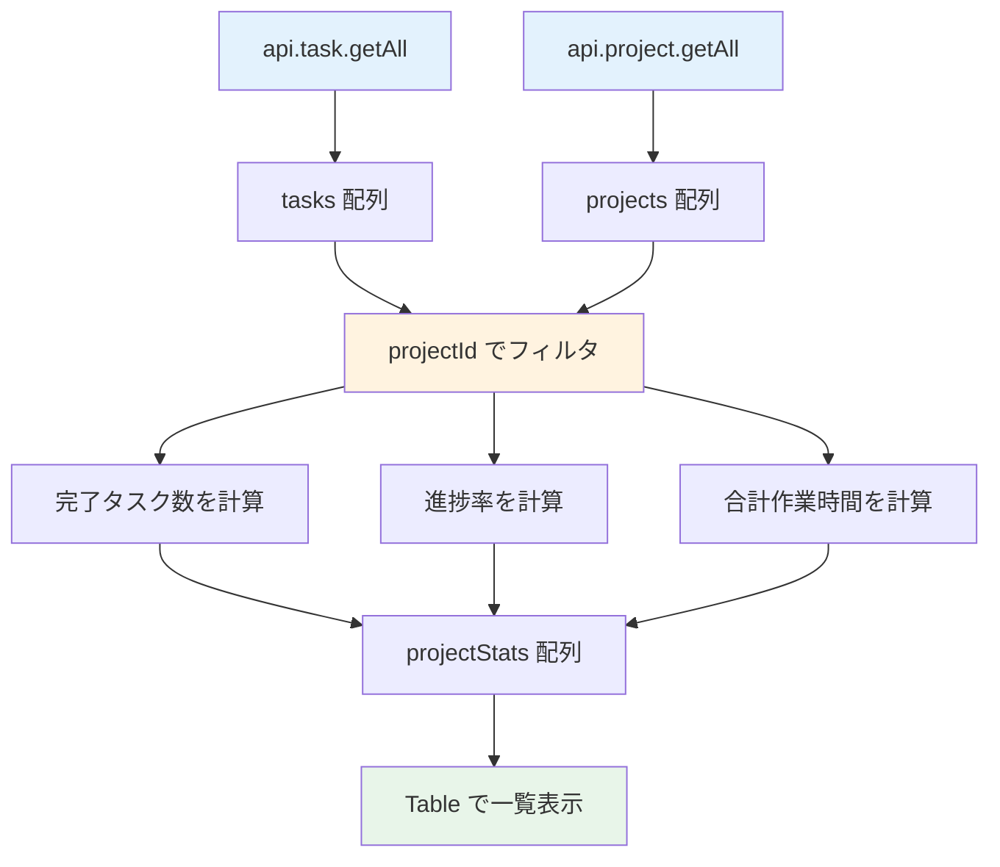

# Day 23: 週次レポートを表示しよう

## 🎯 今日のゴール

レポートページにプロジェクト別統計テーブルと
週次レポート機能を追加します。テーブルで進捗を
一覧表示し、APIで週次データを取得します。


## 🤔 なぜこれを作るのか？

プロジェクトごとの進捗を比較し、
チーム全体の生産性を週単位で把握します。

> 💡 **例え話**: プロジェクト統計は
> 「学校の通信簿」です。
> 各教科（プロジェクト）ごとに成績（進捗率）
> や勉強時間（作業時間）が書かれています。
> 通信簿を見れば、どの教科が順調で
> どこを頑張るべきかが一目でわかります。

### 📐 プロジェクト統計の計算フロー



### やること / やらないこと

| やること | やらないこと |
|---------|-------------|
| プロジェクト別統計テーブル | 専用の統計API作成 |
| 週次レポートAPI呼び出し | グラフの追加（Day 22済） |
| 週次データの表示 | ユーザー別フィルタUI |
| Table コンポーネント活用 | カスタムテーブル作成 |

### 🆕 新しく学ぶ概念

| 概念 | 読み方 | 役割 | 例え |
|------|--------|------|------|
| projectStats | — | プロジェクト別集計 | 通信簿の各教科 |
| Table | テーブル | 表形式の表示 | Excel の表 |
| getWeeklyReport | — | 週次データ取得API | 週間天気予報 |
| filter + reduce | — | 条件付き集計 | 特定科目の平均点 |

## 📊 実装ステップ一覧

| ステップ | 作業内容 | 所要時間 |
|---------|---------|---------|
| Step 1 | プロジェクト統計の考え方 | 3分 |
| Step 2 | プロジェクト別統計を計算 | 5分 |
| Step 3 | 統計テーブルを表示 | 5分 |
| Step 4 | 週次レポートAPIの概要 | 3分 |
| Step 5 | 週次レポートAPIを呼び出す | 5分 |
| Step 6 | 週次データを表示する | 5分 |
| Step 7 | 動作確認 | 3分 |

**合計時間**: 約29分

---

### Step 1: プロジェクト統計の考え方（3分）

🎯 **ゴール**: プロジェクトごとの
統計値をどう計算するか理解します。

```bash
# filepath: ターミナル
# 統計用データの取得を確認
npm run dev
```

✅ **確認ポイント**:
- 4つの統計値の計算方法を理解した
#### 統計テーブルに表示する項目

| 項目 | 計算方法 | 意味 |
|------|---------|------|
| プロジェクト | project.name | プロジェクト名 |
| タスク数 | filter結果の長さ | タスク総数 |
| 完了 | DONE の件数 | 完了タスク数 |
| 進捗 | 完了数 / 総数 × 100 | 進捗率（%） |
| 作業時間 | reduce で合算 / 60 | 作業時間（h） |

#### 計算の流れ

| 手順 | 処理 | 例 |
|------|------|-----|
| 1 | projectId でタスクを絞る | Aのタスクだけ |
| 2 | status が DONE のものを数える | 完了タスクは3件 |
| 3 | 完了数 / 全数 × 100 | 3/10 × 100 = 30% |
| 4 | timeSpentMinutes を合算 | 480分 = 8.0h |

> 💡 Day 21 で学んだ `reduce` と
> Day 22 で学んだ `filter` を
> 組み合わせて、プロジェクト単位で
> 集計します。

✅ **確認ポイント**:
- 4つの統計値の計算方法を理解した

---

### Step 2: プロジェクト別統計を計算（5分）

🎯 **ゴール**: projects.map で
各プロジェクトの統計値を計算します。

💻 **実装**:

```typescript
// filepath: src/app/report/page.tsx
// プロジェクトのタスクを取得して集計
const projectStats = useMemo(
  () =>
    projects?.map((project) => {
      const projectTasks =
        tasks?.filter(
          (t) => t.projectId === project.id
        ) || [];
      const completedTasks =
        projectTasks.filter(
          (t) => t.status === 'DONE'
        );
      const totalTime =
        projectTasks.reduce(
          (acc, t) =>
            acc + (t.timeSpentMinutes ?? 0),
          0
        );
```

```typescript
// filepath: src/app/report/page.tsx
// 進捗率を計算する
    const progress =
      projectTasks.length > 0
        ? (completedTasks.length
            / projectTasks.length) * 100
        : 0;
```

```typescript
// filepath: src/app/report/page.tsx
// 戻り値を整形する
      return {
        name: project.name,
        totalTasks: projectTasks.length,
        completedTasks:
          completedTasks.length,
        progress: progress.toFixed(1),
        totalTimeHours:
          (totalTime / 60).toFixed(1),
      };
    }),
  [projects, tasks],
);
```

> 💡 `projects?.map` で各プロジェクトを
> ループし、`tasks?.filter` でそのプロジェクト
> のタスクだけを取り出します。
> 最後に `toFixed(1)` で小数1桁に丸めます。

✅ **確認ポイント**:
- projectStats に配列が入る
- 各要素に5つのプロパティがある

---

### Step 3: 統計テーブルを表示（5分）

🎯 **ゴール**: Table コンポーネントで
プロジェクト統計を表形式で表示します。

💻 **実装**:

```typescript
// filepath: src/app/report/page.tsx
// Table 関連のインポートを追加
import {
  Table, TableBody, TableCell,
  TableHead, TableHeader, TableRow,
} from '@/component/ui/table';
```

```typescript
// filepath: src/app/report/page.tsx
// Card とテーブルの外枠
<Card>
  <CardHeader>
    <CardTitle>
      プロジェクト統計
    </CardTitle>
  </CardHeader>
  <CardContent>
    <Table>
      <TableHeader>
        <TableRow>
          {/* 次のブロックでヘッダー定義 */}
        </TableRow>
      </TableHeader>
    </Table>
  </CardContent>
</Card>
```

```typescript
// filepath: src/app/report/page.tsx
// TableHead の定義
<TableHead className="w-[200px]">
  プロジェクト
</TableHead>
<TableHead className="text-right">
  タスク数
</TableHead>
<TableHead className="text-right">
  完了
</TableHead>
<TableHead className="text-right">
  進捗
</TableHead>
<TableHead className="text-right">
  作業時間
</TableHead>
```

```typescript
// filepath: src/app/report/page.tsx
// テーブルの本体（TableBody）
<TableBody>
  {projectStats?.map((stat) => (
    <TableRow key={stat.name}>
      <TableCell className="font-medium">
        {stat.name}
      </TableCell>
      <TableCell className="text-right">
        {stat.totalTasks}
      </TableCell>
      <TableCell className="text-right">
        {stat.completedTasks}
      </TableCell>
      <TableCell className="text-right">
        {stat.progress}%
      </TableCell>
      <TableCell className="text-right">
        {stat.totalTimeHours}h
      </TableCell>
    </TableRow>
  ))}
</TableBody>
```

✅ **確認ポイント**:
- テーブルにプロジェクト名が並ぶ
- 数値が右寄せで表示される


#### Table コンポーネントの構造

| コンポーネント | 役割 | HTML相当 |
|--------------|------|---------|
| Table | テーブル全体 | `<table>` |
| TableHeader | ヘッダー領域 | `<thead>` |
| TableHead | 見出しセル | `<th>` |
| TableBody | データ領域 | `<tbody>` |
| TableRow | 行 | `<tr>` |
| TableCell | データセル | `<td>` |

> 💡 shadcn/ui の Table はHTML の
> テーブル要素をラップしたものです。
> `text-right` で数値を右寄せにすると
> 表が見やすくなります。

✅ **確認ポイント**:
- テーブルにプロジェクト名が並ぶ
- 数値が右寄せで表示される


---

### Step 4: 週次レポートAPIの概要（3分）

🎯 **ゴール**: `api.report.getWeeklyReport`
の仕組みを理解します。

```bash
# filepath: ターミナル
# 週次レポートAPIを確認
cat src/server/api/routers/report.ts | head -50
```

✅ **確認ポイント**:
- APIのパラメータとレスポンスを理解した
#### APIのパラメータ

| パラメータ | 型 | 必須 | 説明 |
|-----------|-----|------|------|
| weeks | number | はい | 取得する週数（1〜12） |
| userId | string | いいえ | 特定ユーザーに絞る |

#### APIのレスポンス

| プロパティ | 型 | 説明 |
|-----------|-----|------|
| weeks | number | 指定した週数 |
| startDate | string | 集計開始日 |
| endDate | string | 集計終了日 |
| weeklyData | array | 週ごとのデータ配列 |
| totalCompleted | number | 期間内の完了総数 |

#### weeklyData の各要素

| プロパティ | 型 | 説明 |
|-----------|-----|------|
| week | string | "Week 1" のような週ラベル |
| weekStart | string | その週の開始日 |
| totalCompleted | number | その週の完了数 |
| byStatus | object | ステータス別の件数 |
| byPriority | object | 優先度別の件数 |

> 💡 サーバー側で Prisma を使って
> `completedAt` の日付範囲でタスクを
> フィルタし、週ごとに集計しています。

✅ **確認ポイント**:
- APIのパラメータとレスポンスを理解した

---

### Step 5: 週次レポートAPIを呼び出す（5分）

🎯 **ゴール**: 週次レポートページで
APIを呼び出してデータを取得します。

💻 **実装**:

```typescript
// filepath: src/app/report/weekly/page.tsx
'use client';

import { AppLayout }
  from '@/component/layout/app-layout';
import {
  Card, CardContent,
  CardHeader, CardTitle,
} from '@/component/ui/card';
import {
  Select, SelectContent,
  SelectItem, SelectTrigger,
  SelectValue,
} from '@/component/ui/select';
import { api } from '@/trpc/react';
import { Loader2 } from 'lucide-react';
import { useState } from 'react';
```

```typescript
// filepath: src/app/report/weekly/page.tsx
// APIの呼び出しとローディング処理
export default function WeeklyReportPage() {
  const [weeks, setWeeks] = useState('4');

  const {
    data: reportData,
    isLoading,
  } = api.report.getWeeklyReport.useQuery({
    weeks: Number.parseInt(weeks, 10),
  });

  if (isLoading) {
    return (
      <AppLayout>
        <div className="flex justify-center
          items-center min-h-[60vh]">
          <Loader2 className="h-12 w-12
            animate-spin text-primary" />
        </div>
      </AppLayout>
    );
  }
```

```typescript
// filepath: src/app/report/weekly/page.tsx
// 週数の選択UI
<div className="w-[150px]">
  <Select
    value={weeks}
    onValueChange={setWeeks}>
    <SelectTrigger>
      <SelectValue placeholder="期間" />
    </SelectTrigger>
    <SelectContent>
      <SelectItem value="4">
        4週間
      </SelectItem>
      <SelectItem value="8">
        8週間
      </SelectItem>
      <SelectItem value="12">
        12週間
      </SelectItem>
    </SelectContent>
  </Select>
</div>
```

> 💡 `useState` で週数を管理します。
> ユーザーが週数を変更すると、
> `useQuery` が自動的に再取得します。

✅ **確認ポイント**:
- reportData にデータが入る
- ローディング中にスピナーが表示される

> 📸 ここでデータ読み込み中のスピナー（ぐるぐるアニメーション）が画面中央に表示されることを確認してください。

---

### Step 6: 週次データを表示する（5分）

🎯 **ゴール**: 取得した週次データを
カードで表示します。

💻 **実装**:

```typescript
// filepath: src/app/report/weekly/page.tsx
// 完了タスク数カード
<div className="grid grid-cols-1
  md:grid-cols-3 gap-4">
  <Card>
    <CardContent className="pt-6">
      <p className="text-sm
        text-muted-foreground mb-1">
        完了タスク合計
      </p>
      <p className="text-3xl font-bold">
        {reportData?.totalCompleted || 0}
      </p>
    </CardContent>
  </Card>
```

```typescript
// filepath: src/app/report/weekly/page.tsx
// 平均完了数カード
  <Card>
    <CardContent className="pt-6">
      <p className="text-sm
        text-muted-foreground mb-1">
        週平均
      </p>
      <p className="text-3xl font-bold">
        {reportData?.totalCompleted
          ? Math.round(
              reportData.totalCompleted
              / Number.parseInt(weeks, 10)
            )
          : 0}
      </p>
    </CardContent>
  </Card>
```

```typescript
// filepath: src/app/report/weekly/page.tsx
// 期間表示カード
  <Card>
    <CardContent className="pt-6">
      <p className="text-sm
        text-muted-foreground mb-1">
        対象期間
      </p>
      <p className="text-lg font-semibold">
        {reportData?.startDate
          && reportData?.endDate
          ? `${new Date(
              reportData.startDate
            ).toLocaleDateString()}
            - ${new Date(
              reportData.endDate
            ).toLocaleDateString()}`
          : '-'}
      </p>
    </CardContent>
  </Card>
</div>
```

✅ **確認ポイント**:
- 3枚のカードが表示される
- 完了数と平均が正しく計算される


#### 週次レポートの表示項目

| カード | 表示内容 | 計算方法 |
|-------|---------|---------|
| 完了タスク合計 | 期間内の完了数 | API が返す値 |
| 週平均 | 週あたり平均 | 完了数 / 週数 |
| 対象期間 | 集計期間 | 開始日 - 終了日 |

> 💡 `Math.round` で小数を丸めます。
> `toLocaleDateString()` でブラウザの
> ロケールに応じた日付形式になります。

✅ **確認ポイント**:
- 3枚のカードが表示される
- 完了数と平均が正しく計算される


---

### Step 7: 動作確認（3分）

🎯 **ゴール**: 全体の表示を確認します。

1. `/report` にアクセス
2. 統計カード（Day 21）が表示される
3. 円グラフ（Day 22）が表示される
4. プロジェクト統計テーブルが表示される
5. 各プロジェクトの進捗率が正しい
6. `/report/weekly` にアクセス
7. 週次レポートのカードが表示される

✅ **確認ポイント**:
- テーブルの数値がシードデータと一致
- 週次レポートにデータが表示される


---

```bash
# filepath: ターミナル
# 開発サーバーを起動して動作確認
npm run dev
```

## 📋 今日のまとめ

- [ ] プロジェクト別統計を計算できた
- [ ] Table コンポーネントで一覧表示した
- [ ] 週次レポートAPIを呼び出せた
- [ ] 週次データをカードで表示した

## ⚠️ つまずきポイント

| エラー / 問題 | 原因 | 解決方法 |
|--------------|------|---------|
| テーブルが空 | projectStats が undefined | projects?.map で安全に処理 |
| 進捗率が NaN | タスク0件で割り算 | length > 0 チェック追加 |
| 週次データが空 | completedAt 未設定 | シードデータを確認 |
| 型エラーが出る | weeks が string | Number.parseInt で変換 |

## 📝 今日学んだ用語

| 用語 | 意味 |
|------|------|
| projectStats | プロジェクト別の集計結果配列 |
| Table / TableRow | shadcn/ui のテーブル部品 |
| getWeeklyReport | 週次レポート取得API |
| Number.parseInt | 文字列を整数に変換する関数 |

## 🔜 次回予告

Day 24 では、管理者専用のユーザー一覧ページを
実装します。権限チェックでアクセスを制限し、
ユーザー情報をテーブルで管理できるようにします。
