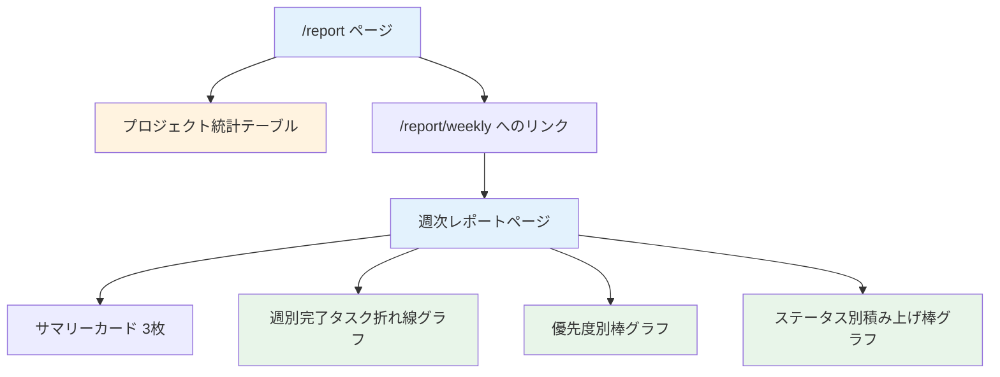

# Day 23: 週次レポートを表示しよう

## 前回の振り返り

Day 22 では Recharts ライブラリを使って、ステータス別・優先度別の円グラフを実装しました。`Map` によるグラフ用データ集計や `ResponsiveContainer` でのレスポンシブ対応も学んだので、今日はプロジェクト別統計テーブルと週次レポート機能に取り組みます。

---

## 今日のゴール

レポートページにプロジェクト別統計テーブルを追加し、
週次レポートページでグラフ付きの詳細レポートを表示します。
テーブルで進捗を一覧表示し、折れ線グラフ・棒グラフで推移を可視化します。

スクリーンショット: レポートページの全体像を確認してください。


## 始める前の前提

- Day 22 のグラフ表示が動いている
- プロジェクトとタスクが複数件あり、完了済みタスクも含まれている
- `/report` を開いて統計カードとグラフを確認できる
- 週次レポートは集計結果の読み方も大事なので、数字が少ない場合は練習用データを追加してから確認する

## なぜこれを作るのか

Day 21・22 では「今この瞬間」の数字を見てきました。
でも「先週より進んだのか」は、期間で区切って
比べないと分かりません。プロジェクトごとの進捗を
週単位でまとめ、変化を追えるようにします。

> **例え話**: プロジェクト統計は
> 「学校の通信簿」です。
> 各教科（プロジェクト）ごとに成績（進捗率）
> や勉強時間（作業時間）が書かれています。
> 通信簿を見れば、どの教科が順調で
> どこを頑張るべきかが一目でわかります。

### 週次レポートの全体フロー



### やること / やらないこと

| やること | やらないこと |
|---------|-------------|
| プロジェクト別統計テーブル | `/report` 側で `task.getAll` を再集計する実装 |
| 週次レポートAPI呼び出し | ユーザー別フィルタUI |
| 折れ線グラフで完了推移表示 | カスタムテーブル作成 |
| 棒グラフで優先度・ステータス表示 | 新規グラフライブラリ導入 |

### 新しく学ぶ概念

| 概念 | 読み方 | 役割 | 例え |
|------|--------|------|------|
| projectStats | — | プロジェクト別集計 | 通信簿の各教科 |
| Table | テーブル | 表形式の表示 | Excel の表 |
| getWeeklyReport | — | 週次データ取得API | 週間天気予報 |
| LineChart | ラインチャート | 折れ線グラフ | 気温の推移グラフ |

## 実装ステップ一覧

| ステップ | 作業内容 | 所要時間 |
|---------|---------|---------|
| Step 0 | 週次レポート API（getWeeklyReport）を自分で書く | 14分 |
| Step 1 | プロジェクト統計の集計ロジック | 5分 |
| Step 2 | 統計テーブルを表示 | 5分 |
| Step 3 | 週次レポートAPIの概要 | 3分 |
| Step 4 | 週次レポートページの基本構造 | 5分 |
| Step 5 | サマリーカードを表示 | 5分 |
| Step 6 | グラフを表示する | 5分 |
| Step 7 | 動作確認 | 3分 |

**合計時間**: 約31分。

---

### Step 0: 週次レポート API（getWeeklyReport）を自分で書く（14分）

**ゴール**: Day 21 で作った `src/server/api/routers/report.ts` に `getWeeklyReport` を追記し、`api.report.getWeeklyReport` を自分で生やします。今回の追加は `reportRouter` の2本目の procedure です。新規ファイルではなく、前回作った `getOverview` の **直後** に足します。

週次レポートは「今の合計」ではなく「7日ごとの推移」を返します。だから Day 21 の `count` 中心の集計とは違い、今回は **期間を切る**・**週ごとに配列を作る**・**各週の中で status / priority を数える**、という3段階になります。

#### 0-1. getOverview の直後に input を足す

```typescript
// filepath: src/server/api/routers/report.ts（getOverview の直後に追加）
  getWeeklyReport: protectedProcedure
    .input(
      z.object({
        weeks: z.number().min(1).max(12).default(4),
        userId: z.string().cuid().optional(),
      }),
    )
    .query(async ({ ctx, input }) => {
```

ここで受け取るのは `weeks` と `userId` の2つです。`weeks` は何週間分を見るかで、最小 1、最大 12、未指定なら 4 です。`userId` は「誰の週次レポートを見るか」で、省略したときは自分自身のレポートになります。

#### 0-2. 他人のレポートを見てよいかを確認する

```typescript
// filepath: src/server/api/routers/report.ts（続き）
      if (input.userId && input.userId !== ctx.session.userId) {
        if (ctx.session.role !== USER_ROLE.ADMIN) {
          throw new TRPCError({
            code: 'FORBIDDEN',
            message: '管理者権限が必要です',
          });
        }
      }
```

ここが認可の入口です。`userId` を指定していて、しかもそれが自分以外なら、管理者だけに許可します。一般ユーザーが他人の週報を覗けてしまうと困るので、ここで止めます。

#### 0-3. 集計する期間を決める

```typescript
// filepath: src/server/api/routers/report.ts（続き）
      const targetUserId = input.userId ?? ctx.session.userId;
      const now = new Date();
      // 週バケットは「今日で終わる直近7日間」を最終週として7日刻みで遡る。
      // 旧実装は最終週が「今日0時〜現在」だけの進行中バケットで、「4週間」表示の
      // 実カバー範囲が3週間+今日に縮んでいた（PR#285 レビュー指摘）。排他的上端を
      // 明日0時に固定した完全な7日バケット×weeks本にすることで、ラベル・週平均の
      // 分母と実際の集計範囲が一致し、範囲内タスクは必ずいずれかの週に入る。
      // 日付ラベルは toISOString()（UTC）で出すため、バケット境界も UTC で刻む。
      // ローカル時刻メソッドで刻むと、JST などのサーバーでラベルが1日ずれる。
      const rangeEnd = new Date(now);
      rangeEnd.setUTCHours(0, 0, 0, 0);
      rangeEnd.setUTCDate(rangeEnd.getUTCDate() + 1);
```

`rangeEnd` を「明日の 00:00 UTC」に寄せているのが重要です。1週間を 7 日ぴったりで切るため、最後の週も「今日 0 時から現在まで」ではなく、**今日を含む 7 日間** に揃えます。

```typescript
// filepath: src/server/api/routers/report.ts（続き）
      const startDate = new Date(rangeEnd);
      startDate.setUTCDate(startDate.getUTCDate() - input.weeks * 7);

      const where = {
        completedAt: { gte: startDate, lte: now },
        assigneeId: targetUserId,
      };
```

ここで期間の下端を作り、`where` に閉じ込めます。今回は「その期間に完了したタスク」だけを見るので、`completedAt` を軸にしています。

#### 0-4. 期間内タスクを 1 回で取る

```typescript
// filepath: src/server/api/routers/report.ts（続き）
      const tasks = await prisma.task.findMany({
        where,
        select: {
          id: true,
          completedAt: true,
          status: true,
          priority: true,
          project: { select: { id: true, name: true } },
        },
      });
```

ここでは週ごとに使う材料を 1 回で取ります。`status` と `priority` を後で数えるので両方必要です。`project` も返していますが、これは週次ページや将来の拡張で同じ配列をそのまま使える形にしておくためです。

#### 0-5. 1週ずつバケットを作る

```typescript
// filepath: src/server/api/routers/report.ts（続き）
      const weeklyData = Array.from({ length: input.weeks }, (_, i) => {
        const weekStart = new Date(startDate);
        weekStart.setUTCDate(weekStart.getUTCDate() + i * 7);
        const weekEnd = new Date(weekStart);
        weekEnd.setUTCDate(weekEnd.getUTCDate() + 7);

        const weekTasks = tasks.filter(
          (task) => task.completedAt && task.completedAt >= weekStart && task.completedAt < weekEnd,
        );
```

`Array.from({ length: input.weeks }, (_, i) => ...)` は「必要な週数ぶんだけ箱を作る」書き方です。各週について `weekStart` と `weekEnd` を作り、その範囲に入るタスクだけを `filter` で抜き出します。終了側を `< weekEnd` にしているので、同じタスクが次の週と二重に数えられません。

```typescript
// filepath: src/server/api/routers/report.ts（続き）
        return {
          week: `${i + 1}週目`,
          weekStart: weekStart.toISOString().split('T')[0],
          totalCompleted: weekTasks.length,
          byStatus: Object.fromEntries(
            Object.values(TASK_STATUS).map((status) => [
              status,
              weekTasks.filter((t) => t.status === status).length,
            ]),
          ),
```

`week` は画面表示用ラベル、`weekStart` はその週の開始日です。`byStatus` は `TASK_STATUS` を1つずつ回して件数を数え、`Object.fromEntries` で `{ TODO: 3, DONE: 5, ... }` の形へ戻しています。

```typescript
// filepath: src/server/api/routers/report.ts（続き）
          byPriority: Object.fromEntries(
            Object.values(TASK_PRIORITY).map((priority) => [
              priority,
              weekTasks.filter((t) => t.priority === priority).length,
            ]),
          ),
        };
      });
```

`byPriority` も考え方は同じです。Day 23 のグラフは、この `weeklyData` をクライアント側で `chartData` と `statusData` に組み替えて使います。server 側の役目は「週ごとの集計済み材料を返すところ」までです。

#### 0-6. 最後に返して閉じる

```typescript
// filepath: src/server/api/routers/report.ts（続き）
      return {
        weeks: input.weeks,
        startDate: startDate.toISOString(),
        endDate: now.toISOString(),
        weeklyData,
        totalCompleted: tasks.length,
      };
    }),
});
```

これで `reportRouter` は `getOverview` と `getWeeklyReport` の2本立てになりました。`root.ts` は Day 21 で `report: reportRouter` を登録済みなので、今日は追加の登録作業は不要です。

**確認ポイント**:
- `src/server/api/routers/report.ts` の `getOverview` の直後に `getWeeklyReport` を追記できた
- `weeks` / `userId` の入力検証、管理者チェック、週バケット生成まで source と同じ順序で書けた
- `root.ts` は Day 21 時点の `report: reportRouter` のままでよいと理解できた

### Step 1: プロジェクト統計の集計ロジック（5分）

**ゴール**: レポートページ（`/report`）に
表示するプロジェクト統計の構造を理解します。
完成版 source では Day 21 で導入した
`api.report.getOverview` の `projectStats` を
そのまま描画し、ここで再集計はしません。

#### 統計テーブルに表示する項目

| 項目 | 参照先 | 意味 |
|------|--------|------|
| プロジェクト | `stat.name` | プロジェクト名 |
| タスク数 | `stat.totalTasks` | タスク総数 |
| 完了 | `stat.completedTasks` | 完了タスク数 |
| 進捗 | `stat.progress` | 進捗率（%） |
| 作業時間 | `stat.totalTimeHours` | 作業時間（`h`） |

#### 計算の流れ

| 手順 | 処理 | 例 |
|------|------|-----|
| 1 | `api.report.getOverview` を呼ぶ | server 側で全件集計 |
| 2 | `overview.projectStats` を受け取る | Aプロジェクトの集計行が入る |
| 3 | 各行を `TableRow` に流し込む | 進捗 30.0% と表示 |
| 4 | `toFixed(1)`（小数第1位に丸める）で表示だけ整える | 8.0h |

```typescript
// filepath: src/app/report/page.tsx
// Day 21 で追加済みの overview 取得
const { data: overview, isLoading } =
  api.report.getOverview.useQuery();
```

> 上記は Day 21 で追加済みのインポートです。まだ追加していない場合は追加してください。
>
> `useQuery`（データ取得のフック）は、サーバーから届いた値を `data` に、取得中かどうかを `isLoading` に入れてくれます。
> 画面はこの2つを見て、表示を切り替えます。

**確認ポイント**:
- `overview` を取得できている
- 表の4項目が `projectStats` に入っていると理解した

```typescript
// filepath: src/app/report/page.tsx
// server 側で作られた projectStats をそのまま使う
const projectStats = overview?.projectStats ?? [];
```

> `?? []`（左が無いとき空配列を使う書き方）を付けています。
> `overview` がまだ届いていない瞬間でも `projectStats` は空配列になり、後の `.map` がエラーになりません。

**確認ポイント**:
- クライアント側で再集計していない
- `projectStats` が配列として扱える

```typescript
// filepath: src/app/report/page.tsx
// 描画時だけ小数第1位へ整える
{projectStats.map((stat) => (
  <TableRow key={stat.id}>
    <TableCell className="font-medium">{stat.name}</TableCell>
    <TableCell className="text-right">{stat.totalTasks}</TableCell>
    <TableCell className="text-right">{stat.completedTasks}</TableCell>
    <TableCell className="text-right">{stat.progress.toFixed(1)}%</TableCell>
    <TableCell className="text-right">{stat.totalTimeHours.toFixed(1)}h</TableCell>
  </TableRow>
))}
```

**確認ポイント**:
- `progress` / `totalTimeHours` を表示時だけ整形している
- `projectStats` の各要素がそのままテーブル行になる

> `projectStats` 自体は `reportRouter.getOverview`
> の中で `groupBy` と `count` を使って作られています。
> `/report` 側では集計の再実行は不要です。

---

### Step 2: 統計テーブルを表示（5分）

**ゴール**: Table コンポーネントで
プロジェクト統計を表形式で表示します。

```typescript
// filepath: src/app/report/page.tsx
// Table 関連のインポートを追加
import {
  Table, TableBody, TableCell,
  TableHead, TableHeader, TableRow,
} from '@/component/ui/table';
```

**確認ポイント**:
- Table 関連の6つのコンポーネントをインポートした

#### Table コンポーネントの構造

| コンポーネント | 役割 | HTML相当 |
|--------------|------|---------|
| Table | テーブル全体 | `<table>` |
| TableHeader | ヘッダー領域 | `<thead>` |
| TableHead | 見出しセル | `<th>` |
| TableBody | データ領域 | `<tbody>` |
| TableRow | 行 | `<tr>` |
| TableCell | データセル | `<td>` |

```typescript
// filepath: src/app/report/page.tsx
// テーブルのヘッダー定義
<Card>
  <CardHeader>
    <CardTitle>プロジェクト統計</CardTitle>
  </CardHeader>
  <CardContent>
    <Table>
      <TableHeader>
        <TableRow>
          <TableHead className="w-[200px]">
            プロジェクト</TableHead>
          <TableHead className="text-right">
            タスク数</TableHead>
          <TableHead className="text-right">
            完了</TableHead>
          <TableHead className="text-right">
            進捗</TableHead>
          <TableHead className="text-right">
            作業時間</TableHead>
        </TableRow>
      </TableHeader>
```

**確認ポイント**:
- `TableHeader` の中に `TableRow` と `TableHead` がある
- ヘッダー5列を定義した

> `TableHeader` の中に見出し行の `TableRow` を置き、その中へ見出しセルの `TableHead` を並べます。
> この入れ子は、ブラウザに「ここが表の見出し行」と伝えるための形です。

```typescript
// filepath: src/app/report/page.tsx
// テーブル本体（mapで各行を生成）
<TableBody>
  {projectStats?.map((stat) => (
    <TableRow key={stat.id}>
      <TableCell className="font-medium">
        {stat.name}</TableCell>
      <TableCell className="text-right">
        {stat.totalTasks}</TableCell>
      <TableCell className="text-right">
        {stat.completedTasks}</TableCell>
      <TableCell className="text-right">
        {stat.progress.toFixed(1)}%</TableCell>
      <TableCell className="text-right">
        {stat.totalTimeHours.toFixed(1)}h</TableCell>
    </TableRow>
  ))}
</TableBody>
```

**確認ポイント**:
- テーブルにプロジェクト名が並ぶ
- 数値が `text-right` で右寄せ表示される

> shadcn/ui の Table はHTML の
> テーブル要素をラップしたものです。
> `text-right` で数値を右寄せにすると
> 表が見やすくなります。

スクリーンショット: プロジェクト統計テーブルの表示を確認してください。


---

### Step 3: 週次レポートAPIの概要（3分）

**ゴール**: 週次レポートAPIの
パラメータとレスポンス構造を理解します。
このステップはコードを読んで理解するだけです。

```typescript
// filepath: src/app/report/weekly/page.tsx（Step 4 で作成）
// 週次レポートAPIの呼び出しイメージ（クライアント側で呼ぶ）
api.report.getWeeklyReport.useQuery({
  weeks: 4,
});
```

#### APIのパラメータ

| パラメータ | 型 | 必須 | 説明 |
|-----------|-----|------|------|
| weeks | number | いいえ（デフォルト: 4） | 取得する週数（1〜12） |
| userId | string | いいえ | 特定ユーザーに絞る |

#### APIのレスポンス

| プロパティ | 型 | 説明 |
|-----------|-----|------|
| weeks | number | 指定した週数 |
| startDate | string | 集計開始日 |
| endDate | string | 集計終了日 |
| weeklyData | array | 週ごとのデータ配列 |
| totalCompleted | number | 期間内の完了総数 |

#### weeklyData の各要素

| プロパティ | 型 | 説明 |
|-----------|-----|------|
| week | string | `1週目` のような週ラベル |
| weekStart | string | その週の開始日（`YYYY-MM-DD`） |
| totalCompleted | number | その週の完了数 |
| byStatus | Record<string, number>（キーが文字列・値が数値のオブジェクト型） | ステータス別の件数 |
| byPriority | Record<string, number> | 優先度別の件数 |

> サーバー側で Prisma を使って
> `completedAt` の日付範囲でタスクを
> フィルタし、週ごとに集計しています。

**確認ポイント**:
- APIのパラメータとレスポンスの構造を理解した
- `weeklyData` が週ごとのデータ配列であることを把握した
- `byStatus` と `byPriority` でグラフ用データが取れることを理解した

---

### Step 4: 週次レポートページの基本構造（5分）

**ゴール**: `/report/weekly` ページを作成し、
API呼び出しと週数選択UIを実装します。

```typescript
// filepath: src/app/report/weekly/page.tsx
// インポート（日付・React・UIコンポーネント）
'use client';
import { format } from 'date-fns';
import { ja } from 'date-fns/locale';
import { useState } from 'react';
import { AppLayout }
  from '@/component/layout/app-layout';
import {
  Card, CardContent,
  CardHeader, CardTitle,
} from '@/component/ui/card';
import { PageLoadingSpinner }
  from '@/component/ui/loading-spinner';
```

**確認ポイント**:
- `date-fns` と `ja` ロケールをインポートした
- `PageLoadingSpinner` のパスが `@/component/ui/loading-spinner` である

> 先頭の `'use client'`（ブラウザ側で動く宣言）を書くと、このページはブラウザ側で動く画面になります。
> `useState` などブラウザ側で動く機能を使うため、この宣言が必要です。

```typescript
// filepath: src/app/report/weekly/page.tsx
// インポート（Select・Recharts・定数）
import {
  Select, SelectContent,
  SelectItem, SelectTrigger,
  SelectValue,
} from '@/component/ui/select';
import {
  Bar, BarChart, CartesianGrid,
  Legend, Line, LineChart,
  ResponsiveContainer,
  Tooltip, XAxis, YAxis,
} from 'recharts';
import {
  TASK_PRIORITY, TASK_PRIORITY_COLORS,
} from '@/lib/constant/priority';
import {
  TASK_STATUS, TASK_STATUS_COLORS,
} from '@/lib/constant/status';
import { api } from '@/trpc/react';
```

**確認ポイント**:
- Recharts の6種類のコンポーネントをインポートした
- `TASK_PRIORITY_COLORS` と `TASK_STATUS_COLORS` をインポートした

> 今日初めて使う Recharts の部品を先に紹介します。
> `CartesianGrid` はグラフ背景の目盛り線を引きます。
> `XAxis` / `YAxis` は横軸と縦軸を描きます。
> `Line` は折れ線グラフの線1本、`Bar` は棒グラフの1系列です。
> どれも Step 6 で実際に配置します。

```typescript
// filepath: src/app/report/weekly/page.tsx
// API呼び出しとローディング処理
const CHART_PRIMARY_COLOR = '#8884d8';

export default function WeeklyReportPage() {
  const [weeks, setWeeks] = useState('4');

  const {
    data: reportData,
    isLoading,
  } = api.report.getWeeklyReport.useQuery({
    weeks: Number.parseInt(weeks, 10),
  });

  if (isLoading) {
    return <PageLoadingSpinner />;
  }
```

**確認ポイント**:
- `useState('4')` で初期値4週間を設定している
- `isLoading` のときスピナーを表示している

```typescript
// filepath: src/app/report/weekly/page.tsx
// 週数選択のSelectコンポーネント
<div className="w-[150px]">
  <Select
    value={weeks}
    onValueChange={setWeeks}>
    <SelectTrigger>
      <SelectValue placeholder="期間" />
    </SelectTrigger>
    <SelectContent>
      <SelectItem value="4">
        4週間
      </SelectItem>
      <SelectItem value="8">
        8週間
      </SelectItem>
      <SelectItem value="12">
        12週間
      </SelectItem>
    </SelectContent>
  </Select>
</div>
```

**確認ポイント**:
- 4・8・12週間の選択肢がある
- `onValueChange` で `setWeeks` を呼んでいる

> `useState` で週数を管理します。
> ユーザーが週数を変更すると、
> `useQuery` が自動的に再取得します。

#### ページ全体のJSX構造

| 階層 | 要素 | 役割 |
|------|------|------|
| 1 | `<AppLayout>` | 共通レイアウト |
| 2 | `<div className="space-y-6">` | 縦方向の余白 |
| 3 | ヘッダー（h1 + Select） | タイトルと期間選択 |
| 3 | `grid grid-cols-3` | 3枚のサマリーカード |
| 3 | `grid grid-cols-2` | グラフ3枚 |

#### ページの骨格を完成させる

上の表を実際のコードにすると、次の骨格になります。
`if (isLoading)` の直後に、この `return` を書きます。

```typescript
// filepath: src/app/report/weekly/page.tsx
// ページの骨格（return から関数の閉じ括弧まで）
  return (
    <AppLayout>
      <div className="space-y-6">
        <div className="flex items-center
          justify-between">
          <h1 className="text-3xl font-bold">
            週次レポート
          </h1>
          {/* 週数選択の Select を置く */}
        </div>
        {/* Step 5: サマリーカード3枚 */}
        {/* Step 6: グラフ3枚のグリッド */}
      </div>
    </AppLayout>
  );
}
```

最後の `}` は `WeeklyReportPage` 関数を閉じる括弧です。
先ほど書いた週数選択の `Select` は、`h1` の隣にある
コメントの行と置き換えます。Step 5 と Step 6 で作る
カードとグラフも、対応するコメントの行と置き換えていきます。

**確認ポイント**:
- `return` の一番外側が `<AppLayout>` になっている
- 関数を閉じる `}` まで書けている

スクリーンショット: ローディング中にスピナーが表示されることを確認してください。


---

### Step 5: サマリーカードを表示（5分）

**ゴール**: 完了タスク合計・週平均・
対象期間の3枚のカードを表示します。

```typescript
// filepath: src/app/report/weekly/page.tsx
// 完了タスク合計カード
<div className="grid grid-cols-1
  md:grid-cols-3 gap-4">
  <Card>
    <CardContent className="pt-6">
      <p className="text-sm
        text-muted-foreground mb-1">
        完了タスク合計
      </p>
      <p className="text-3xl font-bold">
        {reportData?.totalCompleted ?? 0}
      </p>
    </CardContent>
  </Card>
```

**確認ポイント**:
- `grid-cols-3` で3列レイアウトになっている
- 完了タスク合計の数値が表示される

```typescript
// filepath: src/app/report/weekly/page.tsx
// 週平均カード
  <Card>
    <CardContent className="pt-6">
      <p className="text-sm
        text-muted-foreground mb-1">
        週平均
      </p>
      <p className="text-3xl font-bold">
        {reportData?.totalCompleted
          ? Math.round(
              reportData.totalCompleted
              / Number.parseInt(weeks, 10)
            )
          : 0}
      </p>
    </CardContent>
  </Card>
```

**確認ポイント**:
- `Math.round` で小数を丸めている
- `Number.parseInt` で文字列の `weeks` を数値に変換している

```typescript
// filepath: src/app/report/weekly/page.tsx
// 対象期間カード（date-fns で整形）
  <Card>
    <CardContent className="pt-6">
      <p className="text-sm
        text-muted-foreground mb-1">
        対象期間</p>
      <p className="text-lg font-semibold">
        {reportData?.startDate
          && reportData?.endDate
          ? `${format(
              new Date(reportData.startDate),
              'yyyy/MM/dd', { locale: ja }
            )} - ${format(
              new Date(reportData.endDate),
              'yyyy/MM/dd', { locale: ja }
            )}`
          : '-'}
      </p>
    </CardContent>
  </Card>
</div>
```

**確認ポイント**:
- `format` と `ja` ロケールで日付を整形している
- データがないときは `'-'` を表示している

> 3枚のカードは1つの `reportData` から値を取り出し、合計・週平均・対象期間という3種類の見せ方にしています。
> 対象期間の `format` には `{ locale: ja }`（日付表示の言語・地域設定）を渡しています。`yyyy/MM/dd` のような数字だけの書式では並びは変わりませんが、月名や曜日を文字で出す書式に変えたとき、日本語表記になります。

#### 週次レポートの表示項目

| カード | 表示内容 | 計算方法 |
|-------|---------|---------|
| 完了タスク合計 | 期間内の完了数 | API が返す値 |
| 週平均 | 週あたり平均 | 完了数 / 週数 |
| 対象期間 | 集計期間 | 開始日 - 終了日 |

---

### Step 6: グラフを表示する（5分）

**ゴール**: Recharts で折れ線グラフと
棒グラフを表示して、週次推移を可視化します。

```typescript
// filepath: src/app/report/weekly/page.tsx
// グラフ用データの変換処理（完了数・優先度）
const chartData =
  reportData?.weeklyData.map((week) => ({
    name: week.week,
    completed: week.totalCompleted,
    high:
      week.byPriority[TASK_PRIORITY.HIGH]
      ?? 0,
    urgent:
      week.byPriority[TASK_PRIORITY.URGENT]
      ?? 0,
  }));
```

**確認ポイント**:
- `chartData` は完了数と優先度データを持つ

> Recharts のグラフは、1週分を1オブジェクトにまとめ、各系列の値をキーに持つ配列を受け取ります。
> `weeklyData` はこの形と違うので、`name` や `completed` をキーに持つ形へ組み替えています。

```typescript
// filepath: src/app/report/weekly/page.tsx
// グラフ用データの変換処理（ステータス別）
const statusData =
  reportData?.weeklyData.map((week) => ({
    name: week.week,
    done:
      week.byStatus[TASK_STATUS.DONE] ?? 0,
    inProgress:
      week.byStatus[TASK_STATUS.IN_PROGRESS]
      ?? 0,
    inReview:
      week.byStatus[TASK_STATUS.IN_REVIEW]
      ?? 0,
  }));
```

**確認ポイント**:
- `statusData` はステータス別データを持つ

```typescript
// filepath: src/app/report/weekly/page.tsx
// 週別完了タスク数の折れ線グラフ
<Card className="col-span-1 lg:col-span-2">
  <CardHeader>
    <CardTitle>週別完了タスク数</CardTitle>
  </CardHeader>
  <CardContent>
    <div className="h-[300px]">
      <ResponsiveContainer width="100%"
        height="100%">
        <LineChart data={chartData ?? []}>
          <CartesianGrid
            strokeDasharray="3 3" />
          <XAxis dataKey="name" />
          <YAxis /><Tooltip /><Legend />
          <Line type="monotone"
            dataKey="completed"
            stroke={CHART_PRIMARY_COLOR}
            name="完了数" strokeWidth={2} />
        </LineChart>
      </ResponsiveContainer>
    </div>
  </CardContent>
</Card>
```

**確認ポイント**:
- `LineChart` で折れ線グラフを描画している
- `col-span-2` で横幅いっぱいに表示される

```typescript
// filepath: src/app/report/weekly/page.tsx
// 優先度別分布の棒グラフ
<Card>
  <CardHeader>
    <CardTitle>優先度別分布</CardTitle>
  </CardHeader>
  <CardContent>
    <div className="h-[300px]">
      <ResponsiveContainer width="100%"
        height="100%">
        <BarChart data={chartData ?? []}>
          <CartesianGrid strokeDasharray="3 3" />
          <XAxis dataKey="name" />
          <YAxis /><Tooltip /><Legend />
          <Bar dataKey="urgent" name="緊急"
            fill={TASK_PRIORITY_COLORS.URGENT} />
          <Bar dataKey="high" name="高"
            fill={TASK_PRIORITY_COLORS.HIGH} />
        </BarChart>
      </ResponsiveContainer>
    </div>
  </CardContent>
</Card>
```

**確認ポイント**:
- `BarChart` で棒グラフを描画している
- `TASK_PRIORITY_COLORS` で色分けしている

```typescript
// filepath: src/app/report/weekly/page.tsx
// ステータス別積み上げ棒グラフのCard部分
<Card>
  <CardHeader>
    <CardTitle>ステータス別内訳</CardTitle>
  </CardHeader>
  <CardContent>
    <div className="h-[300px]">
      <ResponsiveContainer width="100%"
        height="100%">
        <BarChart data={statusData ?? []}>
          <CartesianGrid strokeDasharray="3 3" />
          <XAxis dataKey="name" />
          <YAxis /><Tooltip /><Legend />
```

**確認ポイント**:
- `statusData` を `BarChart` に渡している

```typescript
// filepath: src/app/report/weekly/page.tsx
// 3つのBarで積み上げ表示
          <Bar dataKey="done"
            stackId="status" name="完了"
            fill={TASK_STATUS_COLORS.DONE} />
          <Bar dataKey="inProgress"
            stackId="status" name="進行中"
            fill={TASK_STATUS_COLORS.IN_PROGRESS} />
          <Bar dataKey="inReview"
            stackId="status" name="レビュー中"
            fill={TASK_STATUS_COLORS.IN_REVIEW} />
        </BarChart>
      </ResponsiveContainer>
    </div>
  </CardContent>
</Card>
```

**確認ポイント**:
- `stackId="status"` で積み上げ棒グラフになっている
- 3つのステータスが色分けで表示される

> `stackId` は今日初登場の指定です。同じ `stackId` を持つ
> `Bar` 同士は、横に並ばず1本の棒として積み上がります。
>
> Day 22 で学んだ Recharts を
> 週次レポートでも活用しています。
> `LineChart` は推移の把握に、
> `BarChart` は比較に適しています。

スクリーンショット: 週次レポートのグラフ表示を確認してください。


---

### Step 7: 動作確認（3分）

**ゴール**: 全体の表示を確認します。

```bash
# filepath: ターミナル
# 開発サーバーを起動して確認
PORT=3001 npm run dev
```

**確認ポイント**:
- 開発サーバーが正常に起動した

1. `/report` にアクセス
2. 統計カード（Day 21）が表示される
3. 円グラフ（Day 22）が表示される
4. プロジェクト統計テーブルが表示される
5. 各プロジェクトの進捗率が正しい
6. `/report/weekly` にアクセス
7. 3枚のサマリーカードが表示される
8. 折れ線グラフが表示される
9. 優先度別・ステータス別棒グラフが表示される

スクリーンショット: 週次レポートページ全体の表示を確認してください。


---

### Pro パターンで書こう（週次レポートのデータ取得は Prisma の select でまとめる）

`select` をネストするとタスクとプロジェクトを1回の問い合わせで取得でき、N+1問題（一覧を1回取得したあと、要素ごとに追加のクエリを発行してしまう問題）を回避できます。
なぜ上の書き方をするのか、**Before/After** で見比べてみましょう。

#### Before（改善前のコード）

```typescript
// filepath: src/server/api/routers/report.ts
import { prisma } from '@/lib/prisma';

type WeeklyReportTask = {
  id: string;
  completedAt: Date | null;
  status: string;
  priority: string;
  project: {
    id: string;
    name: string;
  } | null;
};

export async function fetchWeeklyReportTasks(
  targetUserId: string,
  startDate: Date,
  endDate: Date,
): Promise<WeeklyReportTask[]> {
  const tasks = await prisma.task.findMany({
    where: {
      assigneeId: targetUserId,
      completedAt: { gte: startDate, lt: endDate },
    },
```

> `gte`/`lt`（以上／未満のPrisma条件）で、`completedAt` が指定した期間内のタスクだけを絞り込みます。終了側を `lt`（未満）にするのは、`endDate` ちょうどの瞬間を次の週に含めるためです。週の境界を「開始以上・終了未満」でそろえると、同じタスクが2つの週に二重で数えられません。

**読み比べ用**: ここは写経しません。続けてコードを読み進めましょう。

```typescript
// filepath: 続き
    select: {
      id: true,
      completedAt: true,
      status: true,
      priority: true,
      projectId: true,
    },
  });

  return await Promise.all(
    tasks.map(async (task) => {
      const project = await prisma.project.findUnique({
        where: { id: task.projectId },
        select: {
          id: true,
          name: true,
        },
      });

      return {
        id: task.id,
        completedAt: task.completedAt,
        status: task.status,
        priority: task.priority,
```

**読み比べ用**: ここは写経しません。続けてコードを読み進めましょう。

```typescript
// filepath: 続き
        project,
      };
    }),
  );
}
```

**このコードの問題点**:

- タスクが 30 件あれば、最初の取得 1 回に加えてプロジェクト取得が 30 回走る
- `Promise.all` を使っていても、DB への問い合わせ回数が増える構造は変わらない
- 週次レポートに担当者やプロジェクト情報を増やすたび、同じ N+1 が別の relation でも起きやすい

#### After（プロが書くコード）

```typescript
// filepath: src/server/api/routers/report.ts
import { prisma } from '@/lib/prisma';

type WeeklyReportTask = {
  id: string;
  completedAt: Date | null;
  status: string;
  priority: string;
  project: {
    id: string;
    name: string;
  } | null;
};

export async function fetchWeeklyReportTasks(
  targetUserId: string,
  startDate: Date,
  endDate: Date,
): Promise<WeeklyReportTask[]> {
  return await prisma.task.findMany({
    where: {
      assigneeId: targetUserId,
      completedAt: { gte: startDate, lt: endDate },
    },
```

**読み比べ用**: ここは写経しません。続けてコードを読み進めましょう。

```typescript
// filepath: 続き
    select: {
      id: true,
      completedAt: true,
      status: true,
      priority: true,
      project: {
        select: {
          id: true,
          name: true,
        },
      },
    },
  });
}
```

**このコードの強み**:

- タスクとプロジェクト情報を Prisma にまとめて取得させるので、問い合わせ回数が読みやすい
- `projectId` を手で持ち回らず、戻り値の形が「画面で使うデータ」に近くなる
- 担当者や関連情報を足すときも `select` / `include` の中に集約でき、取得ロジックが散らばりにくい

#### 覚えておきたいエッセンス

一覧やレポートで relation を使うなら、1 件ずつ取得する前に
Prisma の `select` / `include` でまとめて取れないかを考えます。

## 今日のまとめ

- [ ] プロジェクト別統計を計算できた
- [ ] Table コンポーネントで一覧表示した
- [ ] 週次レポートAPIを呼び出せた
- [ ] サマリーカードを表示した
- [ ] 折れ線グラフで完了推移を表示した
- [ ] 棒グラフで優先度・ステータス別分布を表示した

## つまずきポイント

| エラー / 問題 | 原因 | 解決方法 |
|--------------|------|---------|
| テーブルが空 | タスクやプロジェクトが0件、または `getOverview` の取得エラー | データを追加し、開発者ツールの Network タブでエラー有無を確認 |
| 進捗率が NaN | タスク0件で割り算 | length > 0 チェック追加 |
| 週次データが空 | completedAt 未設定 | シードデータを確認 |
| 型エラーが出る | weeks が string | Number.parseInt で変換 |
| グラフが表示されない | recharts 未インストール | Day 22 で導入済みか確認 |

## 今日学んだ用語

| 用語 | 意味 |
|------|------|
| projectStats | プロジェクト別の集計結果配列 |
| Table / TableRow | shadcn/ui のテーブル部品 |
| getWeeklyReport | 週次レポート取得API |
| LineChart | Recharts の折れ線グラフ |
| BarChart | Recharts の棒グラフ |
| stackId | 積み上げグラフにするための識別子 |

## 次回予告

Day 24 では、管理者専用のユーザー一覧ページを
実装します。権限チェックでアクセスを制限し、
ユーザー情報をテーブルで管理できるようにします。
