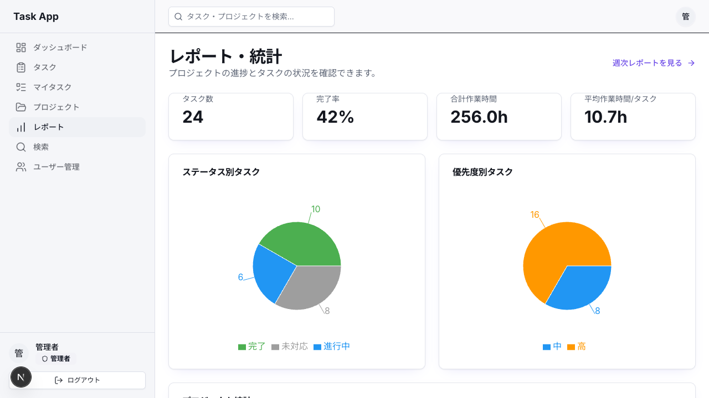
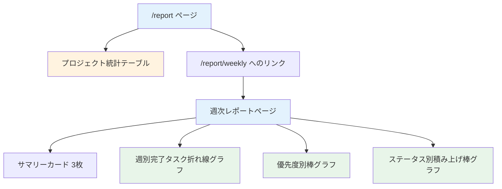
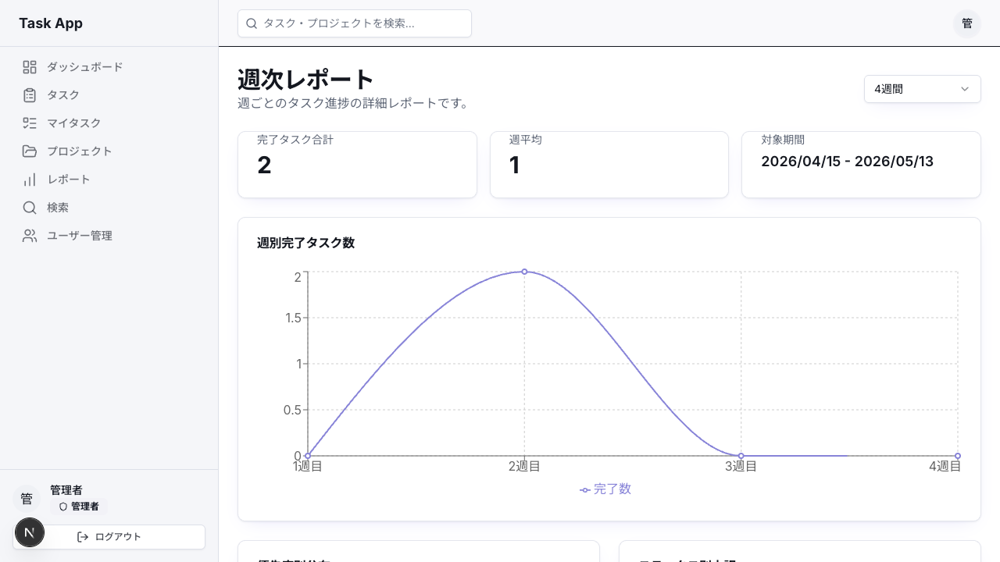

# Day 23: 週次レポートを表示しよう

## 前回の振り返り

Day 22 では Recharts ライブラリを使って、ステータス別・優先度別の円グラフを実装しました。件数を数えるのはサーバーに任せ、ブラウザ側は `map` で日本語ラベルを足すだけにする分担も確認しました。`ResponsiveContainer` でのレスポンシブ対応も学んだので、今日はプロジェクト別統計テーブルと週次レポート機能に取り組みます。

---

## 今日のゴール

レポートページのプロジェクト別統計テーブルを完成形と照合し、
週次レポートページでグラフ付きの詳細レポートを表示します。
テーブルで進捗を一覧表示し、折れ線グラフ・棒グラフで推移を可視化します。

この日は、まずサーバー側の週次レポート API（`getWeeklyReport`）を自分で書きます。そのあと画面をつなぎます。

スクリーンショット: レポートページの全体像を確認してください。



## 始める前の前提

- Day 22 のグラフ表示が動いている
- 直近数週間のうちに、自分が担当のタスクを「完了」にした記録が1件以上ある
- `/report` を開いて統計カードとグラフを確認できる
- 週次レポートは集計結果の読み方も大事なので、数字が少ない場合は練習用データを追加してから確認する

## なぜこれを作るのか

Day 21・22 では「今この瞬間」の数字を見てきました。
でも「先週より進んだのか」は、期間で区切って
比べないと分かりません。プロジェクトごとの進捗を
週単位でまとめ、変化を追えるようにします。

> **例え話**: プロジェクト統計は
> 「学校の通信簿」です。
> 各教科（プロジェクト）ごとに成績（進捗率）
> や勉強時間（作業時間）が書かれています。
> 通信簿を見れば、どの教科が順調で
> どこを頑張るべきかが一目で分かります。

### 週次レポートの全体フロー


```mermaid
flowchart TD
    A["/report ページ"] --> B[プロジェクト統計テーブル]
    A --> C["/report/weekly へのリンク"]
    C --> D[週次レポートページ]
    D --> E[サマリーカード 3枚]
    D --> F[週別完了タスク折れ線グラフ]
    D --> G[優先度別棒グラフ]
    D --> H[ステータス別積み上げ棒グラフ]

    style A fill:#e3f2fd
    style B fill:#fff3e0
    style D fill:#e3f2fd
    style F fill:#e8f5e9
    style G fill:#e8f5e9
    style H fill:#e8f5e9
```

図の左側の `/report` は Day 21・22 で作ったページです。今日はそこのプロジェクト統計テーブルを完成形と照合し、右へ渡るリンクを付けます。右側の `/report/weekly` は今日はじめて作るページで、サマリーカード3枚とグラフ3枚が並びます。

ページを2枚に分けるのは、見たい時間の幅が違うためです。`/report` は「今の合計」を出すので、期間を切りません。`/report/weekly` は「7日ずつの推移」を出すので、どこからどこまでを1週と数えるかを先に決める必要があります。その判断はすべて Step 0 で書くサーバー側の `getWeeklyReport` に置き、画面側は返ってきた配列を描くだけにします。集計の決まりが2か所に散らばると、表とグラフで数字が食い違ったときに原因を追えなくなります。

### やること / やらないこと

| やること | やらないこと |
|---------|-------------|
| プロジェクト別統計テーブル | `/report` 側で `task.getAll` を再集計する実装 |
| 週次レポートAPI呼び出し | ユーザー別フィルターUI |
| 折れ線グラフで完了推移表示 | カスタムテーブル作成 |
| 棒グラフで優先度・ステータス表示 | 新規グラフライブラリ導入 |
| | 週次レポートの出力ページ（`/report/weekly/export`） |

### 新しく学ぶ概念

| 概念 | 読み方 | 役割 | 例え |
|------|--------|------|------|
| projectStats | — | プロジェクト別集計 | 通信簿の各教科 |
| Table | テーブル | 表形式の表示 | Excel の表 |
| getWeeklyReport | — | 週次データ取得API | 週間天気予報 |
| LineChart | ラインチャート | 折れ線グラフ | 気温の推移グラフ |

## 実装ステップ一覧

| ステップ | 作業内容 | 所要時間 |
|---------|---------|---------|
| Step 0 | 週次レポート API（getWeeklyReport）を自分で書く | 14分 |
| Step 1 | プロジェクト統計の集計ロジック | 5分 |
| Step 2 | 統計テーブルを表示 | 5分 |
| Step 3 | 週次レポートAPIの概要 | 3分 |
| Step 4 | 週次レポートページの基本構造 | 5分 |
| Step 5 | サマリーカードを表示 | 5分 |
| Step 6 | グラフを表示する | 5分 |
| Step 7 | 動作確認 | 3分 |

**合計時間**: 約45分です。

この時間はコードを読んで理解する目安です。写経して打ち込む時間、詰まって調べる時間は別に見てください。

---

### Step 0: 週次レポート API（getWeeklyReport）を自分で書く（14分）

**ゴール**: Day 21 で作った `src/server/api/routers/report.ts` に `getWeeklyReport` を追記し、`api.report.getWeeklyReport` を自分で生やします。今回の追加は `reportRouter` の2本目の procedure です。新規ファイルではなく、前回作った `getOverview` の **直後** に足します。

週次レポートは「今の合計」ではなく「7日ごとの推移」を返します。だから Day 21 の `count` 中心の集計とは違い、今回は **期間を切る**・**週ごとに配列を作る**・**各週の中で status / priority を数える**、という3段階になります。

最初に、Day 21 の import 群を次の完成形へ置き換えます。今日から使う `TRPCError`・`z`・`USER_ROLE` が加わります。

```typescript
// filepath: src/server/api/routers/report.ts（import 群の完成形）
import { TRPCError } from '@trpc/server';
import { z } from 'zod';
import { TASK_PRIORITY } from '@/lib/constant/priority';
import { USER_ROLE } from '@/lib/constant/roles';
import { TASK_STATUS } from '@/lib/constant/status';
import { prisma } from '@/lib/prisma';
import { createTRPCRouter, protectedProcedure } from '../trpc';
import { getUserProjectIds } from './_helpers/permission';
```

`z` は入力検証、`USER_ROLE` と `TRPCError` は他人のレポートを一般ユーザーから守る認可エラーに使います。

置き換えと書いたのは、Day 21 では使わなかった3つが今日から加わるためです。取り込みを忘れたまま先へ進むと、`z.object` を書いた行で「z が定義されていない」というエラーが出ます。エラーの文言はファイルの後ろのほうを指しますが、直す場所はこの先頭の数行です。Day 21 で書いた `getOverview` の中身はそのまま残してください。今日はその下に足すだけで、既存の集計には触りません。

#### 0-1. getOverview の直後に input を足す

```typescript
// filepath: src/server/api/routers/report.ts（getOverview の直後に追加）
  getWeeklyReport: protectedProcedure
    .input(
      z.object({
        weeks: z.number().int().min(1).max(12).default(4),
        userId: z.string().cuid().optional(),
      }).default({}),
    )
    .query(async ({ ctx, input }) => {
```

ここで受け取るのは `weeks` と `userId` の2つです。`weeks` は何週間分を見るかで、整数かつ最小 1、最大 12、未指定なら 4 です。`userId` は「誰の週次レポートを見るか」で、省略したときは自分自身のレポートになります。

#### 0-2. 他人のレポートを見てよいかを確認する

```typescript
// filepath: src/server/api/routers/report.ts（続き）
      if (input.userId && input.userId !== ctx.session.userId) {
        if (ctx.session.role !== USER_ROLE.ADMIN) {
          throw new TRPCError({
            code: 'FORBIDDEN',
            message: '管理者権限が必要です',
          });
        }
      }
```

ここが認可の入口です。`userId` を指定していて、しかもそれが自分以外なら、管理者だけに許可します。一般ユーザーが他人の週報を覗けてしまうと困るので、ここで止めます。

#### 0-3. 集計する期間を決める

```typescript
// filepath: src/server/api/routers/report.ts（続き）
      const targetUserId = input.userId ?? ctx.session.userId;
      const now = new Date();
      // 週バケットは「今日で終わる直近7日間」を最終週として7日刻みで遡る。
      // 旧実装は最終週が「今日0時〜現在」だけの進行中バケットで、「4週間」表示の
      // 実カバー範囲が3週間+今日に縮んでいた（PR#285 レビュー指摘）。排他的上端を
      // 明日0時に固定した完全な7日バケット×weeks本にすることで、ラベル・週平均の
      // 分母と実際の集計範囲が一致し、範囲内タスクは必ずいずれかの週に入る。
      // 日付ラベルは toISOString()（UTC）で出すため、バケット境界も UTC で刻む。
      // ローカル時刻メソッドで刻むと、JST などのサーバーでラベルが1日ずれる。
      const rangeEnd = new Date(now);
      rangeEnd.setUTCHours(0, 0, 0, 0);
      rangeEnd.setUTCDate(rangeEnd.getUTCDate() + 1);
```

`rangeEnd` を「明日の 00:00 UTC」に寄せているのが重要です。1週間を 7 日ぴったりで切るため、最後の週も「今日 0 時から現在まで」ではなく、**今日を含む 7 日間** に揃えます。

境界を UTC で刻む理由は、このあと週ラベルを `toISOString()` で作るからです。`toISOString()` は必ず UTC で日付を書き出します。もし境界だけ `setHours` のようなローカル時刻の書き方で刻むと、日本時間で動くサーバーでは9時間ぶんずれ、ラベルの日付が1日前後します。刻む側と表示する側を UTC でそろえておけば、手元の開発機と本番サーバーで時計の設定が違っても、同じ週区切りになります。

そのかわり、日本時間の深夜0時から朝9時までに完了したタスクは、UTC ではまだ前日の扱いです。日本から見ると週の切れ目が朝9時に来ます。この教材では、数時間のずれよりも「どの環境で動かしても数字が変わらない」ほうを選んでいます。

```typescript
// filepath: src/server/api/routers/report.ts（続き）
      const startDate = new Date(rangeEnd);
      startDate.setUTCDate(startDate.getUTCDate() - input.weeks * 7);

      const where = {
        completedAt: { gte: startDate, lte: now },
        assigneeId: targetUserId,
      };
```

ここで期間の下端を作り、`where` に閉じ込めます。今回は「その期間に完了したタスク」だけを見るので、`completedAt` を軸にしています。

この `where` は、3種類の行をわざと落としています。1つ目は `completedAt` が `null` の行、つまりまだ終わっていないタスクです。2つ目は `assigneeId` が対象ユーザーと違う行で、他人が片づけた仕事は混ざりません。3つ目は `startDate` より前の完了で、指定した週数の外にある過去は数えません。週次レポートは「この人がこの期間に終わらせた量」を出す画面なので、残タスクの件数はここでは扱いません。

落とす条件を1か所へまとめておくと、このあとの週ごとの絞り込みは日付の比較だけで済みます。もし週ごとの絞り込み側でも担当者の条件を書き直していたら、片方を直し忘れた瞬間にグラフごとの数字が食い違います。

#### 0-4. 期間内タスクを 1 回で取る

```typescript
// filepath: src/server/api/routers/report.ts（続き）
      const tasks = await prisma.task.findMany({
        where,
        select: {
          id: true,
          completedAt: true,
          status: true,
          priority: true,
          project: { select: { id: true, name: true } },
        },
      });
```

ここでは週ごとに使う材料を 1 回で取ります。実際に使うのは `completedAt`（どの週に入るか）と、あとで数える `status` と `priority` の3つだけです。`project` も取っていますが、この手続きが画面へ返すのは集計後の数字だけなので、`project` はサーバーの中で使われないまま消えます。取る項目は使う項目に合わせるのが本来の形です。

週ごとに `findMany` を呼ぶ書き方もできますが、4週間なら4回、12週間なら12回と問い合わせが増えていきます。期間全体を1回で取り、週への仕分けはこのあとの `filter` に任せると、週数を増やしても問い合わせは1回のままです。読み込むタスクの件数は変わらないのに、往復の回数だけが減ります。この考え方は、今日の最後の「Pro パターンで書こう」でもう一度出てきます。

#### 0-5. 1週ずつバケットを作る

```typescript
// filepath: src/server/api/routers/report.ts（続き）
      const weeklyData = Array.from({ length: input.weeks }, (_, i) => {
        const weekStart = new Date(startDate);
        weekStart.setUTCDate(weekStart.getUTCDate() + i * 7);
        const weekEnd = new Date(weekStart);
        weekEnd.setUTCDate(weekEnd.getUTCDate() + 7);

        const weekTasks = tasks.filter(
          (task) => task.completedAt && task.completedAt >= weekStart && task.completedAt < weekEnd,
        );
```

`Array.from({ length: input.weeks }, (_, i) => ...)` は「必要な週数ぶんだけ箱を作る」書き方です。各週について `weekStart` と `weekEnd` を作り、その範囲に入るタスクだけを `filter` で抜き出します。終了側を `< weekEnd` にしているので、同じタスクが次の週と二重に数えられません。

```typescript
// filepath: src/server/api/routers/report.ts（続き）
        return {
          week: `${i + 1}週目`,
          weekStart: weekStart.toISOString().split('T')[0],
          totalCompleted: weekTasks.length,
          byStatus: Object.fromEntries(
            Object.values(TASK_STATUS).map((status) => [
              status,
              weekTasks.filter((t) => t.status === status).length,
            ]),
          ),
```

`week` は画面表示用ラベル、`weekStart` はその週の開始日です。`byStatus` は `TASK_STATUS` を1つずつ回して件数を数え、`Object.fromEntries` で `{ TODO: 3, DONE: 5, ... }` の形へ戻しています。

```typescript
// filepath: src/server/api/routers/report.ts（続き）
          byPriority: Object.fromEntries(
            Object.values(TASK_PRIORITY).map((priority) => [
              priority,
              weekTasks.filter((t) => t.priority === priority).length,
            ]),
          ),
        };
      });
```

`byPriority` も考え方は同じです。Day 23 のグラフは、この `weeklyData` をクライアント側で `chartData` と `statusData` に組み替えて使います。server 側の役目は「週ごとの集計済み材料を返すところ」までです。

#### 0-6. 最後に返して閉じる

```typescript
// filepath: src/server/api/routers/report.ts（続き）
      return {
        weeks: input.weeks,
        startDate: startDate.toISOString(),
        endDate: now.toISOString(),
        weeklyData,
        totalCompleted: tasks.length,
      };
    }),
```

最後の `}),` は `getWeeklyReport` 1本を閉じる行です。ルーター全体を閉じる `});` は Day 21 で書いた最終行がそのまま使えるので、ここでは足しません。0-1 から 0-6 を貼る位置は、その `});` の1行前です。

これで `reportRouter` は `getOverview` と `getWeeklyReport` の2本立てになりました。`root.ts` は Day 21 で `report: reportRouter` を登録済みなので、今日は追加の登録作業は不要です。

**確認ポイント**:
- `src/server/api/routers/report.ts` の `getOverview` の直後に `getWeeklyReport` を追記できた
- `weeks` / `userId` の入力検証、管理者チェック、週バケット生成まで 完成版と同じ順序で書けた
- ファイルの最終行の `});` は Day 21 のまま1つで、増えていない
- `root.ts` は Day 21 時点の `report: reportRouter` のままでよいと理解できた
- `npm run dev` で型エラーが出ていない

### Step 1: プロジェクト統計の集計ロジック（5分）

**ゴール**: レポートページ（`/report`）に
表示するプロジェクト統計の構造を理解します。
完成版のコード では Day 21 で導入した
`api.report.getOverview` の `projectStats` を
そのまま描画し、ここで再集計はしません。

> Step 1・2 のコードは読み比べ用です。
> `overview`、`projectStats`、Table import、
> 「プロジェクト統計」カードを追加し直しません。

#### 統計テーブルに表示する項目

| 項目 | 参照先 | 意味 |
|------|--------|------|
| プロジェクト | `stat.name` | プロジェクト名 |
| タスク数 | `stat.totalTasks` | タスク総数 |
| 完了 | `stat.completedTasks` | 完了タスク数 |
| 進捗 | `stat.progress` | 進捗率（%） |
| 作業時間 | `stat.totalTimeHours` | 作業時間（`h`） |

#### 計算の流れ

| 手順 | 処理 | 例 |
|------|------|-----|
| 1 | `api.report.getOverview` を呼ぶ | server 側で全件集計 |
| 2 | `overview.projectStats` を受け取る | Aプロジェクトの集計行が入る |
| 3 | 各行を `TableRow` に流し込む | 進捗 30.0% と表示 |
| 4 | `toFixed(1)`（小数第1位に丸める）で表示だけ整える | 8.0h |

```typescript
// filepath: src/app/report/page.tsx
// Day 21 で追加済みの overview 取得
const { data: overview, isLoading } =
  api.report.getOverview.useQuery();
```

> 上記は Day 21 で追加済みのインポートです。まだ追加していない場合は追加してください。
>
> `useQuery`（データ取得のフック）は、サーバーから届いた値を `data` に、取得中かどうかを `isLoading` に入れてくれます。
> 画面はこの2つを見て、表示を切り替えます。

**確認ポイント**:
- `overview` を取得できている
- 表の4項目が `projectStats` に入っていると理解した

```typescript
// filepath: src/app/report/page.tsx
// server 側で作られた projectStats をそのまま使う
const projectStats = overview?.projectStats ?? [];
```

> `?? []`（左が無いとき空配列を使う書き方）を付けています。
> `overview` がまだ届いていない瞬間でも `projectStats` は空配列になり、後の `.map` がエラーになりません。

**確認ポイント**:
- クライアント側で再集計していない
- `projectStats` が配列として扱える

```typescript
{/* filepath: src/app/report/page.tsx */}
{/* 描画時だけ小数第1位へ整える */}
{projectStats.map((stat) => (
  <TableRow key={stat.id}>
    <TableCell className="font-medium">{stat.name}</TableCell>
    <TableCell className="text-right">{stat.totalTasks}</TableCell>
    <TableCell className="text-right">{stat.completedTasks}</TableCell>
    <TableCell className="text-right">{stat.progress.toFixed(1)}%</TableCell>
    <TableCell className="text-right">{stat.totalTimeHours.toFixed(1)}h</TableCell>
  </TableRow>
))}
```

**確認ポイント**:
- `progress` / `totalTimeHours` を表示時だけ整形している
- `projectStats` の各要素がそのままテーブル行になる

> `projectStats` 自体は `reportRouter.getOverview`
> の中で `groupBy` と `count` を使って作られています。
> `/report` 側では集計の再実行は不要です。

---

### Step 2: 統計テーブルを表示（5分）

**ゴール**: Table コンポーネントで
プロジェクト統計を表形式で表示します。

Day 21 で表示済みのテーブルを確認します。
以下のコードを2つ目のテーブルとして
貼り付けないでください。

```typescript
// filepath: src/app/report/page.tsx
// Table 関連のインポートを追加
import {
  Table, TableBody, TableCell,
  TableHead, TableHeader, TableRow,
} from '@/component/ui/table';
```

shadcn/ui の表は1つの万能部品ではなく、`<table>` の各要素に対応する小さな部品の集まりです。だから6つをまとめて取り込みます。1つでも書き漏らすと、その名前が定義されていないというエラーで画面が真っ白になります。どの部品が HTML のどのタグに当たるかは、すぐ下の表にまとめてあります。

**確認ポイント**:
- Table 関連の6つのコンポーネントをインポートした

#### Table コンポーネントの構造

| コンポーネント | 役割 | HTML相当 |
|--------------|------|---------|
| Table | テーブル全体 | `<table>` |
| TableHeader | ヘッダー領域 | `<thead>` |
| TableHead | 見出しセル | `<th>` |
| TableBody | データ領域 | `<tbody>` |
| TableRow | 行 | `<tr>` |
| TableCell | データセル | `<td>` |

```typescript
{/* filepath: 読み比べ用サンプル（実ファイルには対応しません） */}
{/* テーブルのヘッダー定義 */}
<Card>
  <CardHeader>
    <CardTitle>プロジェクト統計</CardTitle>
  </CardHeader>
  <CardContent>
    <Table>
      <TableHeader>
        <TableRow>
          <TableHead className="w-[200px]">
            プロジェクト</TableHead>
          <TableHead className="text-right">
            タスク数</TableHead>
          <TableHead className="text-right">
            完了</TableHead>
          <TableHead className="text-right">
            進捗</TableHead>
          <TableHead className="text-right">
            作業時間</TableHead>
        </TableRow>
      </TableHeader>
```

**確認ポイント**:
- `TableHeader` の中に `TableRow` と `TableHead` がある
- ヘッダー5列を定義した

> `TableHeader` の中に見出し行の `TableRow` を置き、その中へ見出しセルの `TableHead` を並べます。
> この入れ子は、ブラウザに「ここが表の見出し行」と伝えるための形です。

```typescript
{/* filepath: 読み比べ用サンプル（実ファイルには対応しません） */}
{/* テーブル本体（mapで各行を生成） */}
<TableBody>
  {projectStats?.map((stat) => (
    <TableRow key={stat.id}>
      <TableCell className="font-medium">
        {stat.name}</TableCell>
      <TableCell className="text-right">
        {stat.totalTasks}</TableCell>
      <TableCell className="text-right">
        {stat.completedTasks}</TableCell>
      <TableCell className="text-right">
        {stat.progress.toFixed(1)}%</TableCell>
      <TableCell className="text-right">
        {stat.totalTimeHours.toFixed(1)}h</TableCell>
    </TableRow>
  ))}
</TableBody>
```

**確認ポイント**:
- テーブルにプロジェクト名が並ぶ
- 数値が `text-right` で右寄せ表示される

> shadcn/ui の Table はHTML の
> テーブル要素をラップしたものです。
> `text-right` で数値を右寄せにすると
> 表が見やすくなります。

スクリーンショット: プロジェクト統計テーブルの表示を確認してください。


---

### Step 3: 週次レポートAPIの概要（3分）

**ゴール**: 週次レポートAPIの
パラメータとレスポンス構造を理解します。
このステップはコードを読んで理解するだけです。

```typescript
// filepath: src/app/report/weekly/page.tsx（Step 4 で作成）
// 週次レポートAPIの呼び出しイメージ（クライアント側で呼ぶ）
api.report.getWeeklyReport.useQuery({
  weeks: 4,
});
```

この1行が、Step 0 で書いたサーバー側の処理を呼び出す入口です。`weeks: 4` を渡すと、サーバーは直近4週間ぶんの集計を組み立てて返します。Step 0 で `weeks` に `.min(1).max(12)` を付けたので、13 を渡した時点で tRPC が入力を弾き、データベースまでは届きません。画面側で範囲を確かめる `if` を書かなくてよいのは、この検証をサーバーに持たせたからです。

返ってくる値の形は、下の3つの表のとおりです。Step 6 のグラフは、このうち `weeklyData` だけを組み替えて使います。ここで形を頭に入れておくと、Step 4 以降でどのプロパティを触っているのか迷わずに済みます。

#### APIのパラメータ

| パラメータ | 型 | 必須 | 説明 |
|-----------|-----|------|------|
| weeks | number | いいえ（デフォルト: 4） | 取得する週数（1〜12） |
| userId | string | いいえ | 特定ユーザーに絞る |

#### APIのレスポンス

| プロパティ | 型 | 説明 |
|-----------|-----|------|
| weeks | number | 指定した週数 |
| startDate | string | 集計開始日 |
| endDate | string | 集計終了日 |
| weeklyData | array | 週ごとのデータ配列 |
| totalCompleted | number | 期間内の完了総数 |

#### weeklyData の各要素

| プロパティ | 型 | 説明 |
|-----------|-----|------|
| week | string | `1週目` のような週ラベル |
| weekStart | string | その週の開始日（`YYYY-MM-DD`） |
| totalCompleted | number | その週の完了数 |
| byStatus | Record<string, number>（キーが文字列・値が数値のオブジェクト型） | ステータス別の件数 |
| byPriority | Record<string, number> | 優先度別の件数 |

> サーバー側で Prisma を使って
> `completedAt` の日付範囲でタスクを
> フィルターし、週ごとに集計しています。

**確認ポイント**:
- APIのパラメータとレスポンスの構造を理解した
- `weeklyData` が週ごとのデータ配列であることを把握した
- `byStatus` と `byPriority` でグラフ用データが取れることを理解した

---

### Step 4: 週次レポートページの基本構造（5分）

**ゴール**: `/report/weekly` ページを作成し、
API呼び出しと週数選択UIを実装します。

```typescript
// filepath: src/app/report/weekly/page.tsx
// インポート（日付・React・UIコンポーネント）
'use client';
import { format } from 'date-fns';
import { ja } from 'date-fns/locale';
import { useState } from 'react';
import { AppLayout }
  from '@/component/layout/app-layout';
import {
  Card, CardContent,
  CardHeader, CardTitle,
} from '@/component/ui/card';
import { PageLoadingSpinner }
  from '@/component/ui/loading-spinner';
```

**確認ポイント**:
- `date-fns` と `ja` ロケールをインポートした
- `PageLoadingSpinner` のパスが `@/component/ui/loading-spinner` である

> 先頭の `'use client'`（ブラウザ側で動く宣言）を書くと、このページはブラウザ側で動く画面になります。
> `useState` などブラウザ側で動く機能を使うため、この宣言が必要です。

```typescript
// filepath: src/app/report/weekly/page.tsx
// インポート（Select・Recharts・定数）
import {
  Select, SelectContent,
  SelectItem, SelectTrigger,
  SelectValue,
} from '@/component/ui/select';
import {
  Bar, BarChart, CartesianGrid,
  Legend, Line, LineChart,
  ResponsiveContainer,
  Tooltip, XAxis, YAxis,
} from 'recharts';
import {
  TASK_PRIORITY, TASK_PRIORITY_COLORS,
} from '@/lib/constant/priority';
import {
  TASK_STATUS, TASK_STATUS_COLORS,
} from '@/lib/constant/status';
import { api } from '@/trpc/react';
```

**確認ポイント**:
- Recharts の6種類のコンポーネントをインポートした
- `TASK_PRIORITY_COLORS` と `TASK_STATUS_COLORS` をインポートした

> 今日初めて使う Recharts の部品を先に紹介します。
> `CartesianGrid` はグラフ背景の目盛り線を引きます。
> `XAxis` / `YAxis` は横軸と縦軸を描きます。
> `Line` は折れ線グラフの線1本、`Bar` は棒グラフの1系列です。
> どれも Step 6 で実際に配置します。

```typescript
// filepath: src/app/report/weekly/page.tsx
// API呼び出しとローディング処理
const CHART_PRIMARY_COLOR = '#8884d8';

export default function WeeklyReportPage() {
  const [weeks, setWeeks] = useState('4');

  const {
    data: reportData,
    isLoading,
  } = api.report.getWeeklyReport.useQuery({
    weeks: Number.parseInt(weeks, 10),
  });

  if (isLoading) {
    return <PageLoadingSpinner />;
  }
```

初期値を数字の `4` ではなく文字列の `'4'` にしているのは、あとで置く `Select` が文字列でしか値をやり取りしないからです。ところが `getWeeklyReport` の `weeks` は数値なので、そのまま渡すと型が合いません。`Number.parseInt(weeks, 10)` はその橋渡しで、第2引数の `10` は「10進数として読む」という指定です。

`isLoading` のうちに `return` で打ち切るのも大事です。この後に書くコードは `reportData?.totalCompleted ?? 0` のように `?.` と `?? 0` で守ってあるので、ここを飛ばしても画面がエラーで止まるわけではありません。代わりに、まだ何も届いていない状態のまま数字の `0` と空っぽのグラフが一瞬だけ描かれます。読み手にはそれが「この期間は0件だった」という結果に見えてしまいます。まだ届いていないことは、スピナーではっきり伝えます。Day 09 のプロジェクト一覧でも、`projectsLoading` が真の間はスピナーを返して先へ進ませませんでした。

**確認ポイント**:
- `useState('4')` で初期値4週間を設定している
- `isLoading` のときスピナーを表示している

```typescript
{/* filepath: src/app/report/weekly/page.tsx */}
{/* 週数選択のSelectコンポーネント */}
<div className="w-[150px]">
  <Select
    value={weeks}
    onValueChange={setWeeks}>
    <SelectTrigger>
      <SelectValue placeholder="期間" />
    </SelectTrigger>
    <SelectContent>
      <SelectItem value="4">
        4週間
      </SelectItem>
      <SelectItem value="8">
        8週間
      </SelectItem>
      <SelectItem value="12">
        12週間
      </SelectItem>
    </SelectContent>
  </Select>
</div>
```

**確認ポイント**:
- 4・8・12週間の選択肢がある
- `onValueChange` で `setWeeks` を呼んでいる

> `useState` で週数を管理します。
> ユーザーが週数を変更すると、
> `useQuery` が自動的に再取得します。

#### ページ全体のJSX構造

| 階層 | 要素 | 役割 |
|------|------|------|
| 1 | `<AppLayout>` | 共通レイアウト |
| 2 | `<div className="space-y-6">` | 縦方向の余白 |
| 3 | ヘッダー（h1 + Select） | タイトルと期間選択 |
| 3 | `grid grid-cols-3` | 3枚のサマリーカード |
| 3 | `grid grid-cols-2` | グラフ3枚 |

#### ページの骨格を完成させる

上の表を実際のコードにすると、次の骨格になります。
`if (isLoading)` の直後に、この `return` を書きます。

```typescript
// filepath: src/app/report/weekly/page.tsx
// ページの骨格（return から関数の閉じ括弧まで）
  return (
    <AppLayout>
      <div className="space-y-6">
        <div className="flex items-center
          justify-between">
          <h1 className="text-3xl font-bold">
            週次レポート
          </h1>
          {/* 週数選択の Select を置く */}
        </div>
        {/* Step 5: サマリーカード3枚 */}
        {/* Step 6: グラフ3枚のグリッド */}
      </div>
    </AppLayout>
  );
}
```

最後の `}` は `WeeklyReportPage` 関数を閉じる括弧です。
この Step の前半で書いた週数選択の `Select` は、`src/app/report/weekly/page.tsx` の `h1` の隣にある
コメントの行と置き換えます。Step 5 と Step 6 で作る
カードとグラフも、対応するコメントの行と置き換えていきます。

**確認ポイント**:
- `return` の一番外側が `<AppLayout>` になっている
- 関数を閉じる `}` まで書けている

スクリーンショット: ローディング中にスピナーが表示されることを確認してください。

読み込んでいる間は、スピナーだけが出ます。
下の画像は読み込みが終わったあとの姿です。



週次ページを直接 URL 入力しなくても開けるよう、
`src/app/report/page.tsx` のヘッダーへリンクを
追加します。既存 import に次を追加してください。

```typescript
// filepath: src/app/report/page.tsx
import { ArrowRight } from 'lucide-react';
import Link from 'next/link';
```

レポート見出しの右側へリンクを置きます。`Link` は Next.js が用意したページ移動用の部品で、`<a>` タグと違って移動先の中身だけを差し替えます。だからサイドバーやヘッダーは表示されたまま残り、画面が一度白くなってから描き直される動きになりません。`ArrowRight` は右向き矢印のアイコンで、押した先へ進むことを文字より速く伝えます。

```typescript
{/* filepath: src/app/report/page.tsx */}
<Link
  href="/report/weekly"
  className="inline-flex items-center gap-2
    text-sm font-medium text-primary
    hover:underline"
>
  週次レポートを見る
  <ArrowRight className="h-4 w-4" />
</Link>
```

`href` に書いた `/report/weekly` は、Step 4 で作ったファイルの置き場所とそろえてあります。`src/app/report/weekly/page.tsx` という場所がそのまま URL になるのが Next.js のページの決まりで、綴りが1文字でも違うと 404 ページに飛びます。

`inline-flex items-center gap-2` は、文字と矢印を横に並べ、縦位置を中央でそろえ、その間に隙間を空ける指定です。この3つを外すと、矢印が文字の下端にずれて落ちたように見えます。

**確認ポイント**:
- `/report` から週次レポートを開ける
- 「プロジェクト統計」テーブルは1つだけ表示される

---

### Step 5: サマリーカードを表示（5分）

**ゴール**: 完了タスク合計・週平均・
対象期間の3枚のカードを表示します。

```typescript
{/* filepath: src/app/report/weekly/page.tsx */}
{/* 完了タスク合計カード */}
<div className="grid grid-cols-1
  md:grid-cols-3 gap-4">
  <Card>
    <CardContent className="pt-6">
      <p className="text-sm
        text-muted-foreground mb-1">
        完了タスク合計
      </p>
      <p className="text-3xl font-bold">
        {reportData?.totalCompleted ?? 0}
      </p>
    </CardContent>
  </Card>
```

外枠に `grid-cols-1 md:grid-cols-3` と2つ書いてあるのは、画面幅で並べ方を切り替えるためです。スマホでは縦に1枚ずつ、`md`（横幅 768px 以上）から横3列になります。3列のまま縮めると、`text-3xl` の数字が折り返して読めなくなります。

`{reportData?.totalCompleted ?? 0}` の `?? 0` が何をしているかは、3つの状態に分けると見えてきます。1つ目は読み込み中で、`isLoading` が真の間はスピナーを返すため、この行までは来ません。2つ目は通信が失敗したときで、`reportData` は `undefined` のまま残ります。3つ目は通信に成功して、完了タスクが1件も無かったときです。0 と表示してよいのは3つ目だけです。

`?? 0` は失敗を見分けません。2つ目でも `0` と出るので、読者には「今週は完了0件」との区別が付きません。`useQuery` は取得に失敗した理由を `error` にも入れて返すので、失敗は本来そちらを見て「読み込みに失敗しました」と別に伝えます。この画面ではまだ `error` を受け取っていないため、失敗を伝える表示がありません。`?? 0` がしているのは、数字の場所が空欄になるのを防ぐことだけです。

**確認ポイント**:
- `grid-cols-3` で3列レイアウトになっている
- 完了タスク合計の数値が表示される

```typescript
{/* filepath: src/app/report/weekly/page.tsx */}
{/* 週平均カード */}
  <Card>
    <CardContent className="pt-6">
      <p className="text-sm
        text-muted-foreground mb-1">
        週平均
      </p>
      <p className="text-3xl font-bold">
        {reportData?.totalCompleted
          ? Math.round(
              reportData.totalCompleted
              / Number.parseInt(weeks, 10)
            )
          : 0}
      </p>
    </CardContent>
  </Card>
```

週平均の分母は、API が数えた週数ではなく画面が持っている `weeks` です。2つがずれると、合計は正しいのに平均だけが嘘になります。ずれないのは、Step 0 で最終週を「今日を含む7日間」に固定したからです。もし最終週が「今日の0時から今まで」の途中の週だったら、4週間と表示しながら実際は3週間と数時間ぶんしか集めておらず、4 で割った平均が本当より低く出ます。ラベルの週数と集計範囲をそろえてあるから、ここで安心して割り算できます。

`Number.parseInt(weeks, 10)` が 0 になることはありません。`Select` が返す値は `4` `8` `12` の3つだけなので、0 で割ってしまう心配は要らないという理屈です。

**確認ポイント**:
- `Math.round` で小数を丸めている
- `Number.parseInt` で文字列の `weeks` を数値に変換している

```typescript
{/* filepath: src/app/report/weekly/page.tsx */}
{/* 対象期間カード（date-fns で整形） */}
  <Card>
    <CardContent className="pt-6">
      <p className="text-sm
        text-muted-foreground mb-1">
        対象期間</p>
      <p className="text-lg font-semibold">
        {reportData?.startDate
          && reportData?.endDate
          ? `${format(
              new Date(reportData.startDate),
              'yyyy/MM/dd', { locale: ja }
            )} - ${format(
              new Date(reportData.endDate),
              'yyyy/MM/dd', { locale: ja }
            )}`
          : '-'}
      </p>
    </CardContent>
  </Card>
</div>
```

**確認ポイント**:
- `format` と `ja` ロケールで日付を整形している
- データがないときは `'-'` を表示している

> 3枚のカードは1つの `reportData` から値を取り出し、合計・週平均・対象期間という3種類の見せ方にしています。
> 対象期間の `format` には `{ locale: ja }`（日付表示の言語・地域設定）を渡しています。`yyyy/MM/dd` のような数字だけの書式では並びは変わりませんが、月名や曜日を文字で出す書式に変えたとき、日本語表記になります。

#### 週次レポートの表示項目

| カード | 表示内容 | 計算方法 |
|-------|---------|---------|
| 完了タスク合計 | 期間内の完了数 | API が返す値 |
| 週平均 | 週あたり平均 | 完了数 / 週数 |
| 対象期間 | 集計期間 | 開始日 - 終了日 |

---

### Step 6: グラフを表示する（5分）

**ゴール**: Recharts で折れ線グラフと
棒グラフを表示して、週次推移を可視化します。

```typescript
// filepath: src/app/report/weekly/page.tsx
// グラフ用データの変換処理（完了数・優先度）
const chartData =
  reportData?.weeklyData.map((week) => ({
    name: week.week,
    completed: week.totalCompleted,
    high:
      week.byPriority[TASK_PRIORITY.HIGH]
      ?? 0,
    urgent:
      week.byPriority[TASK_PRIORITY.URGENT]
      ?? 0,
  }));
```

**確認ポイント**:
- `chartData` は完了数と優先度データを持つ

> Recharts のグラフは、1週分を1オブジェクトにまとめ、各系列の値をキーに持つ配列を受け取ります。
> `weeklyData` はこの形と違うので、`name` や `completed` をキーに持つ形へ組み替えています。

```typescript
// filepath: src/app/report/weekly/page.tsx
// グラフ用データの変換処理（ステータス別）
const statusData =
  reportData?.weeklyData.map((week) => ({
    name: week.week,
    done:
      week.byStatus[TASK_STATUS.DONE] ?? 0,
    inProgress:
      week.byStatus[TASK_STATUS.IN_PROGRESS]
      ?? 0,
    inReview:
      week.byStatus[TASK_STATUS.IN_REVIEW]
      ?? 0,
  }));
```

ここで数えている材料は、`completedAt` が期間内に入っているタスクだけです。Step 0 の `where` が `completedAt` を軸に絞っているので、まだ終わっていないタスクは1件も混ざりません。担当が自分以外の行も、期間より古い行も、同じ `where` で落ちています。

そのため、積み上げ棒の「進行中」と「レビュー中」は、普段 0 のまま伸びません。Day 15 で書いた更新処理が、ステータスを完了へ変えた瞬間に完了日時を入れ、完了から戻すと `null` へ戻すからです。棒が伸びるのは、完了日時が残ったまま別のステータスへ動かされた行だけになります。グラフが平らでも壊れてはいないので、驚かなくて大丈夫です。

`done` / `inProgress` / `inReview` の3つに絞ったのは、Recharts へ渡すキーと画面に出す系列をそろえるためです。`TODO` と `CANCELLED` の件数も API は返していますが、この棒グラフでは読み飛ばします。

**確認ポイント**:
- `statusData` はステータス別データを持つ

```typescript
{/* filepath: src/app/report/weekly/page.tsx */}
{/* 週別完了タスク数の折れ線グラフ */}
<Card className="col-span-1 lg:col-span-2">
  <CardHeader>
    <CardTitle>週別完了タスク数</CardTitle>
  </CardHeader>
  <CardContent>
    <div className="h-[300px]">
      <ResponsiveContainer width="100%"
        height="100%">
        <LineChart data={chartData ?? []}>
          <CartesianGrid
            strokeDasharray="3 3" />
          <XAxis dataKey="name" />
          <YAxis /><Tooltip /><Legend />
          <Line type="monotone"
            dataKey="completed"
            stroke={CHART_PRIMARY_COLOR}
            name="完了数" strokeWidth={2} />
        </LineChart>
      </ResponsiveContainer>
    </div>
  </CardContent>
</Card>
```

折れ線を選んだのは、このカードで見せたいものが件数そのものではなく増減の向きだからです。棒でも件数は読めますが、週から週への向きは線のほうが速く目に入ります。だから `col-span-2` で横幅を2つぶん取り、時間の流れを長く見せています。

`<div className="h-[300px]">` で高さを固定しているのは、`ResponsiveContainer` に `height="100%"` を指定しているためです。親に高さが無いと 100% は 0 と計算され、グラフは1本も描かれません。Day 22 の円グラフでも、この高さ指定と `ResponsiveContainer` を組にして使いました。

`type="monotone"` は点と点を緩い曲線でつなぐ指定です。`chartData` が空配列でも `LineChart` は軸だけを描いて止まらないので、完了が1件も無い週があっても画面は壊れません。

**確認ポイント**:
- `LineChart` で折れ線グラフを描画している
- `col-span-2` で横幅いっぱいに表示される

```typescript
{/* filepath: src/app/report/weekly/page.tsx */}
{/* 優先度別分布の棒グラフ */}
<Card>
  <CardHeader>
    <CardTitle>優先度別分布</CardTitle>
  </CardHeader>
  <CardContent>
    <div className="h-[300px]">
      <ResponsiveContainer width="100%"
        height="100%">
        <BarChart data={chartData ?? []}>
          <CartesianGrid strokeDasharray="3 3" />
          <XAxis dataKey="name" />
          <YAxis /><Tooltip /><Legend />
          <Bar dataKey="urgent" name="緊急"
            fill={TASK_PRIORITY_COLORS.URGENT} />
          <Bar dataKey="high" name="高"
            fill={TASK_PRIORITY_COLORS.HIGH} />
        </BarChart>
      </ResponsiveContainer>
    </div>
  </CardContent>
</Card>
```

`Bar` を2本しか置いていないのは、`chartData` に `urgent` と `high` しか入れなかったからです。週次レポートで確かめたいのは「急ぎの仕事をどれだけ片づけたか」なので、低と中の件数は落としてあります。優先度4段階すべての内訳は、Day 22 で作った円グラフのほうで見られます。数を全部出さない判断も、グラフを読みやすくするための仕事です。

`fill` に `TASK_PRIORITY_COLORS` を渡すと、Day 22 の円グラフと同じ色で棒が塗られます。色の文字列を直接書いてしまうと、あとで優先度の色を変えたときにこのグラフだけ古い色で取り残されます。

**確認ポイント**:
- `BarChart` で棒グラフを描画している
- `TASK_PRIORITY_COLORS` で色分けしている

```typescript
{/* filepath: src/app/report/weekly/page.tsx */}
{/* ステータス別積み上げ棒グラフのCard部分 */}
<Card>
  <CardHeader>
    <CardTitle>ステータス別内訳</CardTitle>
  </CardHeader>
  <CardContent>
    <div className="h-[300px]">
      <ResponsiveContainer width="100%"
        height="100%">
        <BarChart data={statusData ?? []}>
          <CartesianGrid strokeDasharray="3 3" />
          <XAxis dataKey="name" />
          <YAxis /><Tooltip /><Legend />
```

外側の作りは優先度グラフとそろえてありますが、`data` に渡すのが `chartData` から `statusData` へ変わっています。`XAxis` の `dataKey="name"` を書き換えずに済むのは、2つの配列のどちらも `name` に「1週目」のような週ラベルを入れてあるからです。Step 6 の冒頭で形をそろえておいた効き目が、ここで出ます。

このコードブロックはカードの前半だけで、`</BarChart>` から先の閉じ括弧は次のブロックにあります。途中で保存するとエラー表示が出ますが、続きを書けば消えるので手を止めないでください。

**確認ポイント**:
- `statusData` を `BarChart` に渡している

```typescript
{/* filepath: src/app/report/weekly/page.tsx */}
{/* 3つのBarで積み上げ表示 */}
          <Bar dataKey="done"
            stackId="status" name="完了"
            fill={TASK_STATUS_COLORS.DONE} />
          <Bar dataKey="inProgress"
            stackId="status" name="進行中"
            fill={TASK_STATUS_COLORS.IN_PROGRESS} />
          <Bar dataKey="inReview"
            stackId="status" name="レビュー中"
            fill={TASK_STATUS_COLORS.IN_REVIEW} />
        </BarChart>
      </ResponsiveContainer>
    </div>
  </CardContent>
</Card>
```

**確認ポイント**:
- `stackId="status"` で積み上げ棒グラフになっている
- 3つのステータスが色分けで表示される

> `stackId` は今日初登場の指定です。同じ `stackId` を持つ
> `Bar` 同士は、横に並ばず1本の棒として積み上がります。
>
> Day 22 で学んだ Recharts を
> 週次レポートでも活用しています。
> `LineChart` は推移の把握に、
> `BarChart` は比較に適しています。

スクリーンショット: 週次レポートのグラフ表示を確認してください。


---

### Step 7: 動作確認（3分）

**ゴール**: 全体の表示を確認します。

```bash
# filepath: ターミナル
# 開発サーバーを起動して確認
PORT=3001 npm run dev
```

**確認ポイント**:
- 開発サーバーが正常に起動した

1. `/report` にアクセス
2. 統計カード（Day 21）が表示される
3. 円グラフ（Day 22）が表示される
4. プロジェクト統計テーブルが表示される
5. 各プロジェクトの進捗率が正しい
6. `/report/weekly` にアクセス
7. 3枚のサマリーカードが表示される
8. 折れ線グラフが表示される
9. 優先度別・ステータス別棒グラフが表示される

スクリーンショット: 週次レポートページ全体の表示を確認してください。


---

### Pro パターンで書こう（週次レポートのデータ取得は Prisma の select でまとめる）

`select` をネストするとタスクとプロジェクトを1回の問い合わせで取得でき、N+1問題（一覧を1回取得したあと、要素ごとに追加のクエリを発行してしまう問題）を回避できます。
なぜ直前の1文の書き方をするのか、**Before/After** で見比べてみましょう。

#### Before（改善前のコード）

```typescript
// filepath: 読み比べ用サンプル（実ファイルには対応しません）
import { prisma } from '@/lib/prisma';

type WeeklyReportTask = {
  id: string;
  completedAt: Date | null;
  status: string;
  priority: string;
  project: {
    id: string;
    name: string;
  } | null;
};

export async function fetchWeeklyReportTasks(
  targetUserId: string,
  startDate: Date,
  endDate: Date,
): Promise<WeeklyReportTask[]> {
  const tasks = await prisma.task.findMany({
    where: {
      assigneeId: targetUserId,
      completedAt: { gte: startDate, lt: endDate },
    },
```

> `gte`/`lt`（以上／未満のPrisma条件）で、`completedAt` が指定した期間内のタスクだけを絞り込みます。終了側を `lt`（未満）にするのは、`endDate` ちょうどの瞬間を次の週に含めるためです。週の境界を「開始以上・終了未満」でそろえると、同じタスクが2つの週に二重で数えられません。

**読み比べ用**: ここは写経しません。続けてコードを読み進めましょう。

```typescript
// filepath: 読み比べ用サンプル（続き・実ファイルには対応しません）
    select: {
      id: true,
      completedAt: true,
      status: true,
      priority: true,
      projectId: true,
    },
  });

  return await Promise.all(
    tasks.map(async (task) => {
      const project = await prisma.project.findUnique({
        where: { id: task.projectId },
        select: {
          id: true,
          name: true,
        },
      });

      return {
        id: task.id,
        completedAt: task.completedAt,
        status: task.status,
        priority: task.priority,
```

分かれ道は `select` に `projectId` しか入れていない点です。プロジェクト名が手元に無いので、そのあとの `tasks.map` で1件ずつ `prisma.project.findUnique` を呼び直すしかなくなります。タスクが 30 件あれば、最初の1回に加えて問い合わせが 30 回増えます。`Promise.all` で同時に走らせても、回数そのものは減りません。

**読み比べ用**: ここは写経しません。続けてコードを読み進めましょう。

```typescript
// filepath: 読み比べ用サンプル（続き・実ファイルには対応しません）
        project,
      };
    }),
  );
}
```

**このコードの問題点**:

- タスクが 30 件あれば、最初の取得 1 回に加えてプロジェクト取得が 30 回走る
- `Promise.all` を使っていても、DB への問い合わせ回数が増える構造は変わらない
- 週次レポートに担当者やプロジェクト情報を増やすたび、同じ N+1 が別の relation でも起きやすい

#### After（プロが書くコード）

```typescript
// filepath: 読み比べ用サンプル（実ファイルには対応しません）
import { prisma } from '@/lib/prisma';

type WeeklyReportTask = {
  id: string;
  completedAt: Date | null;
  status: string;
  priority: string;
  project: {
    id: string;
    name: string;
  } | null;
};

export async function fetchWeeklyReportTasks(
  targetUserId: string,
  startDate: Date,
  endDate: Date,
): Promise<WeeklyReportTask[]> {
  return await prisma.task.findMany({
    where: {
      assigneeId: targetUserId,
      completedAt: { gte: startDate, lt: endDate },
    },
```

先頭が `return await prisma.task.findMany({` になっているのが Before との違いです。Before はいったん `const tasks` で受け取り、そのあと加工していました。ただし、N+1 を消しているのは `return` の位置ではありません。`const` で受けてから返す形でも、その間に問い合わせを足せば N+1 は起きます。効いているのは、次のコードブロックの `select` に `project` を入れ子で書いて、プロジェクト名まで同じ1回で取ってくる点です。`where` の中身は Before と変えていません。

**読み比べ用**: ここは写経しません。続けてコードを読み進めましょう。

```typescript
// filepath: 読み比べ用サンプル（続き・実ファイルには対応しません）
    select: {
      id: true,
      completedAt: true,
      status: true,
      priority: true,
      project: {
        select: {
          id: true,
          name: true,
        },
      },
    },
  });
}
```

**このコードの強み**:

- タスクとプロジェクト情報を Prisma にまとめて取得させるので、問い合わせ回数が読みやすい
- `projectId` を手で持ち回らず、戻り値の形が「画面で使うデータ」に近くなる
- 担当者や関連情報を足すときも `select` / `include` の中に集約でき、取得ロジックが散らばりにくい

#### 覚えておきたいエッセンス

一覧やレポートで relation を使うなら、1 件ずつ取得する前に
Prisma の `select` / `include` でまとめて取れないかを考えます。

## 完成コード全体

今日は3つのファイルを触りました。サーバーへ手続きを1本足し、新しいページを1枚作り、すでにあるページへリンクを1つ差し込む、という3方向の作業が混ざっています。どこへ何を貼ったか分からなくなった場合は、以下のコードで各ファイルを丸ごと置き換えてください。ファイルごとに、上から順に読めば Step 0 から Step 6 で書いた断片がどう1つにまとまったかを確かめられます。

| ファイル | 役割 | 対応する Step |
|---------|------|--------------|
| `src/server/api/routers/report.ts` | レポート集計 API。`getOverview` の下に `getWeeklyReport` を足す | Step 0 |
| `src/app/report/weekly/page.tsx` | 週次レポート画面。サマリーカード3枚とグラフ3枚 | Step 4〜Step 6 |
| `src/app/report/page.tsx` | レポート画面。週次レポートへのリンクを足す | Step 4 |

### `src/server/api/routers/report.ts`

**import 群**:

```typescript
// filepath: src/server/api/routers/report.ts
// 完成版: import 群
import { TRPCError } from '@trpc/server';
import { z } from 'zod';
import { TASK_PRIORITY } from '@/lib/constant/priority';
import { USER_ROLE } from '@/lib/constant/roles';
import { TASK_STATUS } from '@/lib/constant/status';
import { prisma } from '@/lib/prisma';
import { createTRPCRouter, protectedProcedure } from '../trpc';
import { getUserProjectIds } from './_helpers/permission';
```

Day 21 の時点では上の5行しかありませんでした。今日足したのは `TRPCError`・`z`・`USER_ROLE` の3つで、どれも `getWeeklyReport` だけが使います。使う予定の無い import を先に書かないのは、Biome が未使用の名前をエラーとして報告するからです。実際に使う日まで待って足せば、警告を抱えたまま次の日へ進まずに済みます。

**プロジェクトが無いときの戻り値**:

```typescript
// filepath: src/server/api/routers/report.ts（同じファイルの続き）
// 完成版: getOverview の入口
export const reportRouter = createTRPCRouter({
  getOverview: protectedProcedure.query(async ({ ctx }) => {
    const projectIds = await getUserProjectIds(ctx.session.userId);

    if (projectIds.length === 0) {
      return {
        totalProjects: 0,
        totalTasks: 0,
        completedTasks: 0,
        inProgressTasks: 0,
        inReviewTasks: 0,
        todoTasks: 0,
        completionRate: 0,
        totalTimeSpent: 0,
        averageTimePerTask: 0,
        recentTasks: [],
        statusData: [],
        priorityData: [],
        projectStats: [],
      };
    }
```

参加中のプロジェクトが1件も無い人には、この先の集計を走らせる意味がありません。ここで 0 と空配列を返しておくと、画面側は「データが無い場合」の分岐を書かずに済みます。返す形をあとの `return` とそろえてあるのが要点で、片方だけ項目を足すと、プロジェクトが無い人の画面でだけ値が欠けます。

**集計範囲を決める2つの条件**:

```typescript
// filepath: src/server/api/routers/report.ts（同じファイルの続き）
// 完成版: 集計範囲を決める2つの条件
    // アーカイブ済みプロジェクトのタスクは集計対象外にし、プロジェクト数・統計との整合を取る。
    const projectScope = {
      projectId: { in: projectIds },
      project: { isArchived: false },
    } as const;

    // ダッシュボードの「アクティブな作業」を母数とするため、CANCELLED は集計から除外する。
    const activeTasksFilter = {
      ...projectScope,
      NOT: { status: TASK_STATUS.CANCELLED },
    } as const;
```

条件を変数にしておくと、このあとの12本の問い合わせで同じ絞り込みを使い回せます。1本ずつ条件を書き写す形にすると、あとで除外の決まりを変えたときに直し漏れが出て、カードの合計と表の内訳が合わなくなります。`as const` を付けているのは、この2つを書き換えないと決めた印です。

**Promise.all の受け取り側**:

```typescript
// filepath: src/server/api/routers/report.ts（同じファイルの続き）
// 完成版: 12個の集計結果を受け取る
    const [
      projects,
      totalTasks,
      completedTasks,
      inProgressTasks,
      inReviewTasks,
      todoTasks,
      totalTimeAggregate,
      recentTasks,
      statusGroups,
      priorityGroups,
      projectTaskGroups,
      projectDoneGroups,
    ] = await Promise.all([
```

左辺の12個の名前は、このあと並べる問い合わせと同じ順番で受け取ります。件数どうしを入れ替えても型は合ってしまうので、間違えてもエラーは出ません。画面には形だけ正しい別の数字が並びます。集計を足すときは、左辺と問い合わせの両方の末尾へ足してください。

**問い合わせの前半**:

```typescript
// filepath: src/server/api/routers/report.ts（同じファイルの続き）
// 完成版: プロジェクト一覧と件数の集計
      prisma.project.findMany({
        where: { id: { in: projectIds }, isArchived: false },
        select: { id: true, name: true },
        orderBy: { createdAt: 'desc' },
      }),
      prisma.task.count({ where: activeTasksFilter }),
      prisma.task.count({
        where: {
          ...projectScope,
          status: TASK_STATUS.DONE,
        },
      }),
      prisma.task.count({
        where: {
          ...projectScope,
          status: TASK_STATUS.IN_PROGRESS,
        },
      }),
```

総タスク数だけ `activeTasksFilter` を使い、ステータス別の件数は `projectScope` を使います。母数からは中止したタスクを外し、内訳では実際のステータスをそのまま数える分担です。`select` で `id` と `name` だけを取るのは、画面で使う項目がこの2つに限られるからです。

**問い合わせの中盤**:

```typescript
// filepath: src/server/api/routers/report.ts（同じファイルの続き）
// 完成版: 残りの件数と作業時間の合計
      prisma.task.count({
        where: {
          ...projectScope,
          status: TASK_STATUS.IN_REVIEW,
        },
      }),
      prisma.task.count({
        where: {
          ...projectScope,
          status: TASK_STATUS.TODO,
        },
      }),
      prisma.task.aggregate({
        where: activeTasksFilter,
        _sum: { timeSpentMinutes: true },
      }),
```

`aggregate` は合計や平均をデータベース側で出す関数です。全タスクを取り出してから足し算する書き方でも答えは同じですが、その場合は件数ぶんのデータがサーバーのメモリへ載ります。合計だけが欲しいので、数える仕事はデータベースに任せます。

**直近タスクとステータス別集計**:

```typescript
// filepath: src/server/api/routers/report.ts（同じファイルの続き）
// 完成版: 直近5件とステータス・優先度の集計
      prisma.task.findMany({
        where: activeTasksFilter,
        select: {
          id: true,
          title: true,
          status: true,
          priority: true,
        },
        orderBy: { updatedAt: 'desc' },
        take: 5,
      }),
      prisma.task.groupBy({
        by: ['status'],
        where: activeTasksFilter,
        _count: { _all: true },
      }),
      prisma.task.groupBy({
        by: ['priority'],
        where: activeTasksFilter,
        _count: { _all: true },
      }),
```

`groupBy` は「同じ値ごとにまとめて数える」関数で、ステータス別と優先度別の件数をここで作ります。Day 22 の円グラフが受け取っているのは、この2本の結果です。`take: 5` を付けた `findMany` だけが実際の行を返しますが、それも直近5件に限っているので、返るデータ量は件数が増えても変わりません。

**プロジェクト別集計と問い合わせの締め**:

```typescript
// filepath: src/server/api/routers/report.ts（同じファイルの続き）
// 完成版: プロジェクト別の集計2本
      prisma.task.groupBy({
        by: ['projectId'],
        where: activeTasksFilter,
        _count: { _all: true },
        _sum: { timeSpentMinutes: true },
      }),
      prisma.task.groupBy({
        by: ['projectId'],
        where: {
          ...projectScope,
          status: TASK_STATUS.DONE,
        },
        _count: { _all: true },
      }),
    ]);
```

プロジェクト別の集計を2本に分けているのは、絞り込みの条件が違うからです。1本目は母数と作業時間、2本目は完了数だけを数えます。1本にまとめて完了かどうかも軸に加えると、完了が0件のプロジェクトの行が結果から消え、あとで組み立てるときに扱いが増えます。

**表示用の値と Map の組み立て**:

```typescript
// filepath: src/server/api/routers/report.ts（同じファイルの続き）
// 完成版: 合計値の計算と辞書づくり
    const totalTimeSpent = totalTimeAggregate._sum.timeSpentMinutes ?? 0;
    const averageTimePerTask = totalTasks > 0 ? totalTimeSpent / totalTasks : 0;
    const completionRate = totalTasks > 0 ? Math.round((completedTasks / totalTasks) * 100) : 0;

    const doneCountByProject = new Map(
      projectDoneGroups.map((group) => [group.projectId, group._count._all]),
    );
    const taskStatsByProject = new Map(
      projectTaskGroups.map((group) => [
        group.projectId,
        {
          totalTasks: group._count._all,
          totalTimeSpent: group._sum.timeSpentMinutes ?? 0,
        },
      ]),
    );
```

平均と完了率で `totalTasks > 0` を先に見ているのは、0 で割った答えが `NaN` になるからです。画面には数字ではなく「NaN%」という文字が出ます。`Map` に変えているのは、次のブロックでプロジェクト1件ずつに集計を引き当てるためです。配列のまま毎回 `find` を回すと、プロジェクトが増えるほど探す回数が掛け算で増えます。

**getOverview の戻り値の前半**:

```typescript
// filepath: src/server/api/routers/report.ts（同じファイルの続き）
// 完成版: 画面へ返す値の前半
    return {
      totalProjects: projects.length,
      totalTasks,
      completedTasks,
      inProgressTasks,
      inReviewTasks,
      todoTasks,
      completionRate,
      totalTimeSpent,
      averageTimePerTask,
      recentTasks,
      statusData: statusGroups.map((group) => ({
        key: group.status,
        value: group._count._all,
      })),
      priorityData: priorityGroups.map((group) => ({
        key: group.priority,
        value: group._count._all,
      })),
```

`groupBy` の結果は `_count._all` という深い形をしています。それをそのまま返すと、画面側が Prisma の都合に合わせて書かれてしまいます。ここで `{ key, value }` へ並べ替えておくと、Day 22 の円グラフは受け取った配列に `name` を足すだけで済みます。

**projectStats の組み立て**:

```typescript
// filepath: src/server/api/routers/report.ts（同じファイルの続き）
// 完成版: プロジェクト別統計と getOverview の締め
      projectStats: projects.map((project) => {
        const taskStats = taskStatsByProject.get(project.id) ?? {
          totalTasks: 0,
          totalTimeSpent: 0,
        };
        const completedTaskCount = doneCountByProject.get(project.id) ?? 0;

        return {
          id: project.id,
          name: project.name,
          totalTasks: taskStats.totalTasks,
          completedTasks: completedTaskCount,
          progress:
            taskStats.totalTasks > 0 ? (completedTaskCount / taskStats.totalTasks) * 100 : 0,
          totalTimeHours: taskStats.totalTimeSpent / 60,
        };
      }),
    };
  }),
```

起点をプロジェクト一覧にしているので、タスクが1件も無いプロジェクトの行が残ります。集計結果の側から作ると、その行は結果に現れず、作ったばかりのプロジェクトが表から消えます。`?? { totalTasks: 0, totalTimeSpent: 0 }` は、そのタスクが無いプロジェクトのための受け皿です。

**getWeeklyReport の入力と認可**:

```typescript
// filepath: src/server/api/routers/report.ts（同じファイルの続き）
// 完成版: getWeeklyReport の入力検証と権限確認
  getWeeklyReport: protectedProcedure
    .input(
      z.object({
        weeks: z.number().int().min(1).max(12).default(4),
        userId: z.string().cuid().optional(),
      }).default({}),
    )
    .query(async ({ ctx, input }) => {
      if (input.userId && input.userId !== ctx.session.userId) {
        if (ctx.session.role !== USER_ROLE.ADMIN) {
          throw new TRPCError({
            code: 'FORBIDDEN',
            message: '管理者権限が必要です',
          });
        }
      }
```

入力の範囲をここで決めてしまうと、画面側は値の確かめ方を持たずに済みます。`.min(1).max(12)` を通らない値は tRPC が先に弾き、データベースまで届きません。権限の確認も入口に置きます。取得したあとで確かめる形にすると、返さないと決めたデータを一度は読み出すことになります。

**集計期間の決め方**:

```typescript
// filepath: src/server/api/routers/report.ts（同じファイルの続き）
// 完成版: 週バケットの上端と下端
      const targetUserId = input.userId ?? ctx.session.userId;
      const now = new Date();
      // 週バケットは「今日で終わる直近7日間」を最終週として7日刻みで遡る。
      // 旧実装は最終週が「今日0時〜現在」だけの進行中バケットで、「4週間」表示の
      // 実カバー範囲が3週間+今日に縮んでいた（PR#285 レビュー指摘）。排他的上端を
      // 明日0時に固定した完全な7日バケット×weeks本にすることで、ラベル・週平均の
      // 分母と実際の集計範囲が一致し、範囲内タスクは必ずいずれかの週に入る。
      // 日付ラベルは toISOString()（UTC）で出すため、バケット境界も UTC で刻む。
      // ローカル時刻メソッドで刻むと、JST などのサーバーでラベルが1日ずれる。
      const rangeEnd = new Date(now);
      rangeEnd.setUTCHours(0, 0, 0, 0);
      rangeEnd.setUTCDate(rangeEnd.getUTCDate() + 1);
      const startDate = new Date(rangeEnd);
      startDate.setUTCDate(startDate.getUTCDate() - input.weeks * 7);
```

上端を明日の 0 時に固定してから、そこから週数ぶん遡って下端を決めます。今この瞬間を上端にすると最後の週だけが数時間ぶんになり、「4週間」と書いてある画面が3週間と少ししか集めていない状態になります。長いコメントを残してあるのは、この境界がいちど間違えて直された箇所だからです。理由を消すと、次の人が元の書き方へ戻します。

**絞り込み条件と1回の取得**:

```typescript
// filepath: src/server/api/routers/report.ts（同じファイルの続き）
// 完成版: 対象タスクをまとめて取る
      const where = {
        completedAt: { gte: startDate, lte: now },
        assigneeId: targetUserId,
      };

      const tasks = await prisma.task.findMany({
        where,
        select: {
          id: true,
          completedAt: true,
          status: true,
          priority: true,
          project: { select: { id: true, name: true } },
        },
      });
```

期間全体を1回で取り、週への仕分けはこのあとの `filter` に任せます。週ごとに問い合わせる書き方だと、12週間を選んだときに12往復します。読み込む行数は変わらないのに、往復の回数だけが週数に比例して増えます。`where` を1か所にまとめてあるので、週ごとの絞り込みは日付の比較だけで済みます。

**週ごとのバケットとステータス集計**:

```typescript
// filepath: src/server/api/routers/report.ts（同じファイルの続き）
// 完成版: 週ごとの箱づくりとステータス別件数
      const weeklyData = Array.from({ length: input.weeks }, (_, i) => {
        const weekStart = new Date(startDate);
        weekStart.setUTCDate(weekStart.getUTCDate() + i * 7);
        const weekEnd = new Date(weekStart);
        weekEnd.setUTCDate(weekEnd.getUTCDate() + 7);

        const weekTasks = tasks.filter(
          (task) => task.completedAt && task.completedAt >= weekStart && task.completedAt < weekEnd,
        );

        return {
          week: `${i + 1}週目`,
          weekStart: weekStart.toISOString().split('T')[0],
          totalCompleted: weekTasks.length,
          byStatus: Object.fromEntries(
            Object.values(TASK_STATUS).map((status) => [
              status,
              weekTasks.filter((t) => t.status === status).length,
            ]),
          ),
```

終わりを `< weekEnd` にしてあるので、境界ちょうどに完了したタスクが2つの週で二重に数えられません。`Array.from` で先に週数ぶんの箱を作るのは、完了が0件の週も配列へ残すためです。実際にあった週だけを作る書き方にすると、グラフの横軸から静かな週が抜け落ち、推移が実際より詰まって見えます。

**優先度集計と getWeeklyReport の戻り値**:

```typescript
// filepath: src/server/api/routers/report.ts（同じファイルの続き）
// 完成版: 優先度別件数と返す値
          byPriority: Object.fromEntries(
            Object.values(TASK_PRIORITY).map((priority) => [
              priority,
              weekTasks.filter((t) => t.priority === priority).length,
            ]),
          ),
        };
      });

      return {
        weeks: input.weeks,
        startDate: startDate.toISOString(),
        endDate: now.toISOString(),
        weeklyData,
        totalCompleted: tasks.length,
      };
    }),
});
```

`Object.values(TASK_STATUS)` と `Object.values(TASK_PRIORITY)` を回しているので、あとで種類を1つ増やしても、この集計は定数を直すだけで追従します。ここで `'DONE'` などを直に並べると、増えた種類がグラフから静かに抜けます。最後の `});` で `reportRouter` 全体が閉じ、手続きは `getOverview` と `getWeeklyReport` の2本立てになります。

### `src/app/report/weekly/page.tsx`

**日付とページ枠の取り込み**:

```typescript
// filepath: src/app/report/weekly/page.tsx
// 完成版: 日付とページ枠の取り込み
'use client';
import { format } from 'date-fns';
import { ja } from 'date-fns/locale';
import { useState } from 'react';
import { AppLayout }
  from '@/component/layout/app-layout';
import {
  Card, CardContent,
  CardHeader, CardTitle,
} from '@/component/ui/card';
import { PageLoadingSpinner }
  from '@/component/ui/loading-spinner';
```

先頭の `'use client'` が無いと、`useState` を書いた行でフックはサーバー側で使えないというエラーになります。`date-fns` の `format` と `ja` は対象期間カードの日付整形だけに使います。日付を `toLocaleDateString` で組む道はありますが、書式の指定が環境の設定に左右されるため、書式を文字で指定できる `format` を使います。

**選択欄とグラフ部品の取り込み**:

```typescript
// filepath: src/app/report/weekly/page.tsx（同じファイルの続き）
// 完成版: 選択欄とグラフ部品の取り込み
import {
  Select, SelectContent,
  SelectItem, SelectTrigger,
  SelectValue,
} from '@/component/ui/select';
import {
  Bar, BarChart, CartesianGrid,
  Legend, Line, LineChart,
  ResponsiveContainer,
  Tooltip, XAxis, YAxis,
} from 'recharts';
import {
  TASK_PRIORITY, TASK_PRIORITY_COLORS,
} from '@/lib/constant/priority';
import {
  TASK_STATUS, TASK_STATUS_COLORS,
} from '@/lib/constant/status';
import { api } from '@/trpc/react';

const CHART_PRIMARY_COLOR = '#8884d8';
```

Recharts から取り込む10個のうち、`CartesianGrid`・`XAxis`・`YAxis` は今日が初登場です。円グラフには軸が無かったので、Day 22 では要りませんでした。優先度とステータスの定数を色つきで取り込むのは、Day 22 の円グラフと同じ色で棒を塗るためです。`CHART_PRIMARY_COLOR` だけは対応表を持たない折れ線1本ぶんの色なので、この画面の定数として1か所に置きます。

**関数の入口とデータ取得**:

```typescript
// filepath: src/app/report/weekly/page.tsx（同じファイルの続き）
// 完成版: 関数の入口とデータ取得
export default function WeeklyReportPage() {
  const [weeks, setWeeks] = useState('4');

  const {
    data: reportData,
    isLoading,
  } = api.report.getWeeklyReport.useQuery({
    weeks: Number.parseInt(weeks, 10),
  });

  if (isLoading) {
    return <PageLoadingSpinner />;
  }
```

`weeks` を文字列で持つのは、`Select` が文字列でしか値をやり取りしないからです。サーバー側の `weeks` は数値なので、`useQuery` へ渡すところで `Number.parseInt` を挟みます。`weeks` が変わると `useQuery` は新しい引数として扱い、自動でもう一度取りに行きます。取得の指示をどこにも書かずに済むのは、この仕組みのおかげです。

**グラフへ渡す2つの配列**:

```typescript
// filepath: src/app/report/weekly/page.tsx（同じファイルの続き）
// 完成版: グラフへ渡す2つの配列
  const chartData =
    reportData?.weeklyData.map((week) => ({
      name: week.week,
      completed: week.totalCompleted,
      high:
        week.byPriority[TASK_PRIORITY.HIGH] ?? 0,
      urgent:
        week.byPriority[TASK_PRIORITY.URGENT]
        ?? 0,
    }));

  const statusData =
    reportData?.weeklyData.map((week) => ({
      name: week.week,
      done:
        week.byStatus[TASK_STATUS.DONE] ?? 0,
      inProgress:
        week.byStatus[TASK_STATUS.IN_PROGRESS]
        ?? 0,
      inReview:
        week.byStatus[TASK_STATUS.IN_REVIEW]
        ?? 0,
    }));
```

Recharts は「1週分が1オブジェクト、系列名がそのキー」という形の配列を求めます。サーバーが返す `byStatus` は入れ物が1段深いので、ここで平らな形へ組み替えます。2つの配列で `name` というキーをそろえてあるのは、3枚のグラフが同じ `XAxis dataKey="name"` を使えるようにするためです。

**見出しの行**:

```typescript
// filepath: src/app/report/weekly/page.tsx（同じファイルの続き）
// 完成版: 見出しの行
  return (
    <AppLayout>
      <div className="space-y-6">
        <div className="flex items-center
          justify-between">
          <h1 className="text-3xl font-bold">
            週次レポート
          </h1>
```

見出しの行を `flex` にして `justify-between` を付けると、中の要素が左端と右端に分かれます。だから見出しの次に置く週数の選択欄が、自動で右端へ寄ります。この指定が無いと選択欄は見出しの真下へ回り込み、縦に2行ぶんの場所を取ります。

**週数の選択欄**:

```typescript
          {/* filepath: src/app/report/weekly/page.tsx（同じファイルの続き） */}
          {/* 完成版: 週数の選択欄 */}
          <div className="w-[150px]">
            <Select
              value={weeks}
              onValueChange={setWeeks}>
              <SelectTrigger>
                <SelectValue placeholder="期間" />
              </SelectTrigger>
              <SelectContent>
                <SelectItem value="4">
                  4週間
                </SelectItem>
                <SelectItem value="8">
                  8週間
                </SelectItem>
                <SelectItem value="12">
                  12週間
                </SelectItem>
              </SelectContent>
            </Select>
          </div>
        </div>
```

`onValueChange` に `setWeeks` をそのまま渡しているので、選んだ値が状態へ入り、`useQuery` の引数が変わって取り直しが始まります。選択肢を4・8・12の3つに絞ってあるのは、サーバー側の `.min(1).max(12)` の範囲に収めるためです。自由に数字を入れる欄にすると、13 を入れた読者が入力エラーだけを受け取ります。

**完了タスク合計のカード**:

```typescript
        {/* filepath: src/app/report/weekly/page.tsx（同じファイルの続き） */}
        {/* 完成版: 完了タスク合計のカード */}
        <div className="grid grid-cols-1
          md:grid-cols-3 gap-4">
          <Card>
            <CardContent className="pt-6">
              <p className="text-sm
                text-muted-foreground mb-1">
                完了タスク合計
              </p>
              <p className="text-3xl font-bold">
                {reportData?.totalCompleted ?? 0}
              </p>
            </CardContent>
          </Card>
```

`?? 0` は、数字の場所が空欄になるのを防ぐだけの守りです。取得が失敗したときもここは 0 と表示されるので、「完了0件」との区別は付きません。区別を付けたい場合は `useQuery` から `error` も受け取り、失敗したときだけ別の文言を出す形にします。

**週平均のカード**:

```typescript
          {/* filepath: src/app/report/weekly/page.tsx（同じファイルの続き） */}
          {/* 完成版: 週平均のカード */}
          <Card>
            <CardContent className="pt-6">
              <p className="text-sm
                text-muted-foreground mb-1">
                週平均
              </p>
              <p className="text-3xl font-bold">
                {reportData?.totalCompleted
                  ? Math.round(
                      reportData.totalCompleted
                      / Number.parseInt(weeks, 10)
                    )
                  : 0}
              </p>
            </CardContent>
          </Card>
```

割る数に使っているのは、API が返した週数ではなく画面が持っている `weeks` です。2つがずれると、合計は正しいのに平均だけが違う数字になります。ずれないのは、Step 0 で最終週を「今日を含む7日間」に固定したからです。`Math.round` で丸めているのは、`3.6666` のような値をカードに出さないためです。

**対象期間のカード**:

```typescript
          {/* filepath: src/app/report/weekly/page.tsx（同じファイルの続き） */}
          {/* 完成版: 対象期間のカード */}
          <Card>
            <CardContent className="pt-6">
              <p className="text-sm
                text-muted-foreground mb-1">
                対象期間</p>
              <p className="text-lg font-semibold">
                {reportData?.startDate
                  && reportData?.endDate
                  ? `${format(
                      new Date(reportData.startDate),
                      'yyyy/MM/dd', { locale: ja }
                    )} - ${format(
                      new Date(reportData.endDate),
                      'yyyy/MM/dd', { locale: ja }
                    )}`
                  : '-'}
              </p>
            </CardContent>
          </Card>
        </div>
```

2つの日付がそろっているときだけ期間を組み立て、片方でも無ければ `'-'` を出します。片方だけで組むと `Invalid Date` という文字が画面に出ます。このカードだけ `text-lg` にしてあるのは、日付2つを並べた文字列が `text-3xl` では折り返すからです。

**週別完了タスク数の折れ線グラフ**:

```typescript
        {/* filepath: src/app/report/weekly/page.tsx（同じファイルの続き） */}
        {/* 完成版: 週別完了タスク数の折れ線グラフ */}
        <div className="grid grid-cols-1
          lg:grid-cols-2 gap-6">
          <Card className="col-span-1 lg:col-span-2">
            <CardHeader>
              <CardTitle>週別完了タスク数</CardTitle>
            </CardHeader>
            <CardContent>
              <div className="h-[300px]">
                <ResponsiveContainer width="100%" height="100%">
                  <LineChart data={chartData ?? []}>
                    <CartesianGrid strokeDasharray="3 3" />
                    <XAxis dataKey="name" />
                    <YAxis /><Tooltip /><Legend />
                    <Line type="monotone"
                      dataKey="completed"
                      stroke={CHART_PRIMARY_COLOR}
                      name="完了数" strokeWidth={2} />
                  </LineChart>
                </ResponsiveContainer>
              </div>
            </CardContent>
          </Card>
```

このカードだけ `lg:col-span-2` で2列ぶんの幅を取っています。折れ線で見せたいのは件数そのものではなく増減の向きなので、横に長いほうが向きを読み取りやすくなります。`chartData ?? []` の `?? []` は、`chartData` が `undefined` のときに `LineChart` へ何も渡らない状態を避けるための既定値です。

**優先度別分布の棒グラフ**:

```typescript
          {/* filepath: src/app/report/weekly/page.tsx（同じファイルの続き） */}
          {/* 完成版: 優先度別分布の棒グラフ */}
          <Card>
            <CardHeader>
              <CardTitle>優先度別分布</CardTitle>
            </CardHeader>
            <CardContent>
              <div className="h-[300px]">
                <ResponsiveContainer width="100%" height="100%">
                  <BarChart data={chartData ?? []}>
                    <CartesianGrid strokeDasharray="3 3" />
                    <XAxis dataKey="name" />
                    <YAxis /><Tooltip /><Legend />
                    <Bar dataKey="urgent" name="緊急"
                      fill={TASK_PRIORITY_COLORS.URGENT} />
                    <Bar dataKey="high" name="高"
                      fill={TASK_PRIORITY_COLORS.HIGH} />
                  </BarChart>
                </ResponsiveContainer>
              </div>
            </CardContent>
          </Card>
```

`Bar` が2本だけなのは、`chartData` に `urgent` と `high` しか入れていないからです。週次レポートで確かめたいのは急ぎの仕事の片づき方なので、低と中の件数は落としてあります。4段階すべての内訳は、Day 22 の円グラフのほうで見られます。`fill` を定数から引くのは、色を1か所で管理するためです。

**ステータス別内訳の枠**:

```typescript
          {/* filepath: src/app/report/weekly/page.tsx（同じファイルの続き） */}
          {/* 完成版: ステータス別内訳の枠 */}
          <Card>
            <CardHeader>
              <CardTitle>ステータス別内訳</CardTitle>
            </CardHeader>
            <CardContent>
              <div className="h-[300px]">
                <ResponsiveContainer width="100%" height="100%">
                  <BarChart data={statusData ?? []}>
                    <CartesianGrid strokeDasharray="3 3" />
                    <XAxis dataKey="name" />
                    <YAxis /><Tooltip /><Legend />
```

外側の作りは優先度グラフとそろえ、`data` だけを `statusData` に変えます。2つの配列はどちらも週ラベルを `name` へ入れてあります。だから `XAxis` の指定は書き換えずに済みます。`h-[300px]` は3枚とも同じ値です。3枚を横へ並べても高さがそろいます。

**ステータス別内訳の積み上げと閉じタグ**:

```typescript
                    {/* filepath: src/app/report/weekly/page.tsx（同じファイルの続き） */}
                    {/* 完成版: 積み上げの3本と閉じタグ */}
                    <Bar dataKey="done"
                      stackId="status" name="完了"
                      fill={TASK_STATUS_COLORS.DONE} />
                    <Bar dataKey="inProgress"
                      stackId="status" name="進行中"
                      fill={TASK_STATUS_COLORS.IN_PROGRESS} />
                    <Bar dataKey="inReview"
                      stackId="status" name="レビュー中"
                      fill={TASK_STATUS_COLORS.IN_REVIEW} />
                  </BarChart>
                </ResponsiveContainer>
              </div>
            </CardContent>
          </Card>
        </div>
      </div>
    </AppLayout>
  );
}
```

3本の `Bar` に同じ `stackId` を付けると、横に並ばず1本の棒として積み上がります。週ごとの合計と内訳を同時に読ませたいので、並べるのではなく積みます。`stackId` を1つでも書き忘れると、その系列だけが隣に独立した棒として立ちます。最後の閉じタグは `BarChart` から `AppLayout` まで、開いた順の逆にたどります。

### `src/app/report/page.tsx`

このファイルで今日書き換えたのは、先頭の import 2行と見出しの行だけです。ただし見出しの行はタグの入れ子が1段深くなるため、貼る場所を間違えると統計カードまで巻き込みます。以下は Day 22 の終わりの状態にリンクを足した全文で、ブロックの区切りは Day 22 の「完成コード全体」とそろえてあります。2つを並べると、どこが増えたかを行単位で見比べられます。

**画面部品の取り込み**:

```typescript
// filepath: src/app/report/page.tsx
// 完成版: 画面部品の取り込み
'use client';

import { ArrowRight } from 'lucide-react';
import Link from 'next/link';
import {
  Cell, Legend, Pie, PieChart,
  ResponsiveContainer, Tooltip,
} from 'recharts';
import { AppLayout } from '@/component/layout/app-layout';
import {
  Card, CardContent,
  CardHeader, CardTitle,
} from '@/component/ui/card';
import { PageLoadingSpinner } from '@/component/ui/loading-spinner';
import {
  Table, TableBody, TableCell,
  TableHead, TableHeader, TableRow,
} from '@/component/ui/table';
```

今日足したのは `ArrowRight` と `Link` の2行です。`recharts` より前に並ぶのは、Biome が外部ライブラリをアルファベット順に置く決まりだからです。手元で末尾に足していても `npm run fix` でここへ移るので、差分を見て驚かないでください。

**色とラベルの定数**:

```typescript
// filepath: src/app/report/page.tsx（同じファイルの続き）
// 完成版: 色とラベルの定数、通信の入口
import {
  isTaskPriority,
  TASK_PRIORITY_COLORS,
  TASK_PRIORITY_LABELS,
} from '@/lib/constant/priority';
import {
  isTaskStatus,
  TASK_STATUS_COLORS,
  TASK_STATUS_LABELS,
} from '@/lib/constant/status';
import { api } from '@/trpc/react';

const CHART_FALLBACK_COLOR = '#9e9e9e';
```

ここは Day 22 のままです。週次ページも同じ定数から色を引くので、2つの画面で同じステータスが同じ色になります。片方の画面だけ色を直に書くと、行き来したときに同じ「完了」が違う色で出て、読者は別のものを見ていると受け取ります。

**取得と表示用の値づくり**:

```typescript
// filepath: src/app/report/page.tsx
// 完成版: 取得と表示用の値づくり
export default function ReportPage() {
  const { data: overview, isLoading } =
    api.report.getOverview.useQuery();

  const totalTasks = overview?.totalTasks ?? 0;
  const completionRate =
    overview?.completionRate ?? 0;
  const totalTimeHours =
    ((overview?.totalTimeSpent ?? 0) / 60)
      .toFixed(1);
  const averageTimeHours =
    ((overview?.averageTimePerTask ?? 0) / 60)
      .toFixed(1);
```

呼んでいるのは `getOverview` だけで、今日足した `getWeeklyReport` はこのページから呼びません。1つの画面に両方の集計を載せると、週次のためだけに待ち時間が伸びます。見たい人だけがリンクをたどる形にして、レポート画面の表示は Day 22 と同じ速さのまま保ちます。

**円グラフへ渡す2つの配列**:

```typescript
// filepath: src/app/report/page.tsx（同じファイルの続き）
// 完成版: 円グラフへ渡す2つの配列
  const statusData =
    overview?.statusData.map((entry) => ({
      ...entry,
      name: isTaskStatus(entry.key)
        ? TASK_STATUS_LABELS[entry.key]
        : entry.key,
    })) ?? [];

  const priorityData =
    overview?.priorityData.map((entry) => ({
      ...entry,
      name: isTaskPriority(entry.key)
        ? TASK_PRIORITY_LABELS[entry.key]
        : entry.key,
    })) ?? [];

  if (isLoading) {
    return <PageLoadingSpinner />;
  }
```

この2つも Day 22 のままです。週次ページの `chartData` とは形が違います。こちらは1件が1つのステータス、あちらは1件が1週を表します。同じ `statusData` という名前が両方の画面に出てきますが、中身が違うことを頭に入れておくと、グラフが空のときにどちらの組み替えを見ればよいか迷いません。

**見出しとリンクの行**:

```typescript
// filepath: src/app/report/page.tsx
// 完成版: 見出しと週次レポートへのリンク
  return (
    <AppLayout>
      <div className="space-y-6">
        <div className="flex flex-col gap-4
          items-start sm:flex-row
          sm:items-center sm:justify-between">
          <div>
            <h1 className="text-3xl font-bold tracking-tight">
              レポート・統計
            </h1>
            <p className="text-muted-foreground">
              プロジェクトの進捗とタスクの状況を確認できます。
            </p>
          </div>
          <Link
            href="/report/weekly"
            className="inline-flex items-center gap-2
              text-sm font-medium text-primary hover:underline"
          >
            週次レポートを見る
            <ArrowRight className="h-4 w-4" />
          </Link>
        </div>
```

今日の変更はここだけです。Day 22 では見出しと説明文を包む `div` が1つでしたが、リンクを右へ置くために外側の `div` を1つ増やし、見出しの組と `Link` を横に並べています。狭い画面では `flex-col` で縦積みになり、`sm` 以上で横並びに切り替わります。リンクを見出しの組の中へ入れてしまうと、説明文の下に潜って気づかれません。

**統計カードの前半**:

```typescript
        {/* filepath: src/app/report/page.tsx（同じファイルの続き） */}
        {/* 完成版: 統計カード（タスク数・完了率） */}
        <div className="grid grid-cols-1
          sm:grid-cols-2 lg:grid-cols-4 gap-4">
          <Card>
            <CardContent className="pt-6">
              <p className="text-sm
                text-muted-foreground mb-1">
                タスク数</p>
              <p className="text-3xl font-bold">
                {totalTasks}</p>
            </CardContent>
          </Card>
          <Card>
            <CardContent className="pt-6">
              <p className="text-sm
                text-muted-foreground mb-1">
                完了率</p>
              <p className="text-3xl font-bold">
                {completionRate}%</p>
            </CardContent>
          </Card>
```

このグリッドは、前のブロックで閉じた見出しの `div` の外側に並びます。リンクを足すときに閉じタグを1つ落とすと、カードのグリッドが見出しの `div` の中へ入り、右端のリンクの隣に4枚のカードが押し込まれます。カードが急に細くなったときは、見出しの `</div>` の位置を確かめてください。

**統計カードの後半**:

```typescript
          {/* filepath: src/app/report/page.tsx（同じファイルの続き） */}
          {/* 完成版: 統計カード（作業時間の合計と平均） */}
          <Card>
            <CardContent className="pt-6">
              <p className="text-sm
                text-muted-foreground mb-1">
                合計作業時間</p>
              <p className="text-3xl font-bold">
                {totalTimeHours}h</p>
            </CardContent>
          </Card>
          <Card>
            <CardContent className="pt-6">
              <p className="text-sm
                text-muted-foreground mb-1">
                平均作業時間/タスク</p>
              <p className="text-3xl font-bold">
                {averageTimeHours}h</p>
            </CardContent>
          </Card>
        </div>
```

作業時間の2枚が持っている値は、期間で切らない全部の合計です。週次ページの「完了タスク合計」とは数え方が違います。2つの画面で数字が食い違うのは正しい状態です。同じ数を並べたい場合は、2つの画面を同じ期間で切る必要があります。

**ステータス円グラフの枠**:

```typescript
        {/* filepath: src/app/report/page.tsx（同じファイルの続き） */}
        {/* 完成版: ステータス円グラフの枠 */}
        <div className="grid grid-cols-1
          md:grid-cols-2 gap-6">
          <Card>
            <CardHeader>
              <CardTitle>ステータス別タスク</CardTitle>
            </CardHeader>
            <CardContent>
              <div className="h-[300px]">
                <ResponsiveContainer
                  width="100%" height="100%">
                  <PieChart>
                    <Pie
                      data={statusData}
                      dataKey="value"
                      nameKey="name"
                      cx="50%"
                      cy="50%"
                      outerRadius={80}
                      label
                    >
```

`h-[300px]` の `div` が高さの基準になる形は、週次ページの3枚のグラフと同じです。高さの数字までそろえてあるので、2つの画面を行き来してもグラフの大きさが変わりません。この基準の `div` を外すと `height="100%"` が 0 と計算され、扇は1枚も描かれません。

**ステータス円グラフの色付け**:

```typescript
                      {/* filepath: src/app/report/page.tsx（同じファイルの続き） */}
                      {/* 完成版: ステータス円グラフの色と閉じタグ */}
                      {statusData.map((entry) => (
                        <Cell
                          key={entry.key}
                          fill={
                            isTaskStatus(entry.key)
                              ? TASK_STATUS_COLORS[entry.key]
                              : CHART_FALLBACK_COLOR
                          }
                        />
                      ))}
                    </Pie>
                    <Tooltip />
                    <Legend />
                  </PieChart>
                </ResponsiveContainer>
              </div>
            </CardContent>
          </Card>
```

型ガードを挟んでから対応表を引く形は、週次ページの `fill={TASK_STATUS_COLORS.DONE}` とは書き方が違います。あちらは書く時点でステータスが決まっているので、確認が要りません。こちらはサーバーから届いた文字列で引くため、その文字列が対応表のキーだと確かめる手順が入ります。

**優先度円グラフの枠**:

```typescript
          {/* filepath: src/app/report/page.tsx（同じファイルの続き） */}
          {/* 完成版: 優先度円グラフの枠 */}
          <Card>
            <CardHeader>
              <CardTitle>優先度別タスク</CardTitle>
            </CardHeader>
            <CardContent>
              <div className="h-[300px]">
                <ResponsiveContainer
                  width="100%" height="100%">
                  <PieChart>
                    <Pie
                      data={priorityData}
                      dataKey="value"
                      nameKey="name"
                      cx="50%"
                      cy="50%"
                      outerRadius={80}
                      label
                    >
```

この円グラフは優先度4段階すべてを扇にします。週次ページの棒グラフが緊急と高の2本だけなのは、あちらが急ぎの仕事の推移を見る画面だからです。全体の割合はこちら、週ごとの推移はあちらと役割を分けてあるので、どちらかへ寄せる必要はありません。

**優先度円グラフの色付け**:

```typescript
                      {/* filepath: src/app/report/page.tsx（同じファイルの続き） */}
                      {/* 完成版: 優先度円グラフの色と閉じタグ */}
                      {priorityData.map((entry) => (
                        <Cell
                          key={entry.key}
                          fill={
                            isTaskPriority(entry.key)
                              ? TASK_PRIORITY_COLORS[entry.key]
                              : CHART_FALLBACK_COLOR
                          }
                        />
                      ))}
                    </Pie>
                    <Tooltip />
                    <Legend />
                  </PieChart>
                </ResponsiveContainer>
              </div>
            </CardContent>
          </Card>
        </div>
```

末尾の `</div>` でグラフ用のグリッドが閉じます。ここを閉じ忘れると、次のプロジェクト統計テーブルがグリッドの2列目に入り、円グラフの隣に半分の幅で置かれます。表の列が窮屈になったときは、この行の有無を先に確かめてください。

**プロジェクト統計テーブルの見出し**:

```typescript
        {/* filepath: src/app/report/page.tsx（同じファイルの続き） */}
        {/* 完成版: プロジェクト統計テーブルの見出し */}
        <Card>
          <CardHeader>
            <CardTitle>プロジェクト統計</CardTitle>
          </CardHeader>
          <CardContent>
            <Table>
              <TableHeader>
                <TableRow>
                  <TableHead className="w-[200px]">
                    プロジェクト</TableHead>
                  <TableHead className="text-right">
                    タスク数</TableHead>
                  <TableHead className="text-right">
                    完了</TableHead>
                  <TableHead className="text-right">
                    進捗</TableHead>
                  <TableHead className="text-right">
                    作業時間</TableHead>
                </TableRow>
              </TableHeader>
```

Step 2 で読んだ見出しの定義は、この5列と同じ形です。あちらは読み比べ用なので、貼ると同じ表が2つ並びます。表が二重になったときは、こちらの1組だけを残してください。

**プロジェクト統計テーブルの行**:

```typescript
              {/* filepath: src/app/report/page.tsx（同じファイルの続き） */}
              {/* 完成版: プロジェクト統計テーブルの行 */}
              <TableBody>
                {overview?.projectStats.map((stat) => (
                  <TableRow key={stat.id}>
                    <TableCell className="font-medium">
                      {stat.name}</TableCell>
                    <TableCell className="text-right">
                      {stat.totalTasks}</TableCell>
                    <TableCell className="text-right">
                      {stat.completedTasks}</TableCell>
                    <TableCell className="text-right">
                      {stat.progress.toFixed(1)}%</TableCell>
                    <TableCell className="text-right">
                      {stat.totalTimeHours.toFixed(1)}h
                    </TableCell>
                  </TableRow>
                ))}
              </TableBody>
```

`projectStats` は `getOverview` が組み立てた配列で、Step 1 で確かめたとおり画面側では数え直しません。`toFixed(1)` は表示のときだけ小数を1桁へ丸める処理です。サーバーが返す `71.42857142857143` をそのまま出すと、列の幅が行ごとに変わって表が読みにくくなります。

**ファイル末尾の閉じタグ**:

```typescript
            {/* filepath: src/app/report/page.tsx（同じファイルの続き） */}
            {/* 完成版: 閉じタグと関数の終わり */}
            </Table>
          </CardContent>
        </Card>
      </div>
    </AppLayout>
  );
}
```

開いたタグを内側から順に閉じて、ファイルが終わります。今日の作業でリンクを足した位置はこの上のほうなので、末尾の並びは Day 22 と変わりません。画面が真っ白になったときは、増やした見出しの `div` の閉じタグが足りているかを先に数えてください。

## 今日のまとめ

- [ ] プロジェクト別統計を計算できた
- [ ] Table コンポーネントで一覧表示した
- [ ] 週次レポートAPIを呼び出せた
- [ ] サマリーカードを表示した
- [ ] 折れ線グラフで完了推移を表示した
- [ ] 棒グラフで優先度・ステータス別分布を表示した

## つまずきポイント

| エラー / 問題 | 原因 | 解決方法 |
|--------------|------|---------|
| テーブルが空 | タスクやプロジェクトが0件、または `getOverview` の取得エラー | データを追加し、開発者ツールの Network タブでエラー有無を確認 |
| 進捗率が NaN | タスク0件で割り算 | length > 0 チェック追加 |
| 週次データが空 | 初期データの完了タスクは2025年の日付で、しかも担当者が別のユーザー | 自分が担当のタスクを1件「完了」にしてから読み込み直す |
| 型エラーが出る | weeks が string | Number.parseInt で変換 |
| グラフが表示されない | recharts 未インストール | Day 22 で導入済みか確認 |

## 今日学んだ用語

| 用語 | 意味 |
|------|------|
| projectStats | プロジェクト別の集計結果配列 |
| Table / TableRow | shadcn/ui のテーブル部品 |
| getWeeklyReport | 週次レポート取得API |
| LineChart | Recharts の折れ線グラフ |
| BarChart | Recharts の棒グラフ |
| stackId | 積み上げグラフにするための識別子 |

## 次回予告

Day 24 では、管理者専用のユーザー一覧ページを
実装します。権限チェックでアクセスを制限し、
ユーザー情報をテーブルで管理できるようにします。

---

## 次に読むもの

- 前の日: [Day 22](./day22_グラフを表示.md)
- 次の日: [Day 24](./day24_ユーザー一覧（管理者用）.md)
- 全体の地図: [学びのロードマップ](./00-1_学びのロードマップ.md)
- 目次: [カリキュラム目次](./00_カリキュラム目次.md)
- 詰まったとき: [トラブルシューティング](./appendix_トラブルシューティング.md)
- 言葉の意味: [用語集](./appendix_用語集.md)
