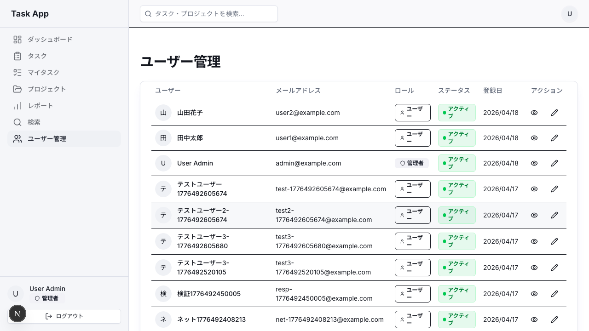

# Day 24: ユーザー一覧（管理者用）を作ろう

## 🔙 前回の振り返り

Day 23 ではプロジェクト別統計テーブルの表示と、週次レポートAPIの呼び出し・データ表示を実装しました。Table コンポーネントでデータを一覧表示するパターンを学んだので、今日は管理者専用のユーザー一覧ページに取り組みます。

---

## 🎯 今日のゴール

管理者だけがアクセスできるユーザー管理ページを実装します。
ユーザー一覧をテーブルで表示し、詳細画面や編集画面へ遷移できるようにします。

📸 完成イメージ: 管理者がユーザーを一覧管理できるページです。



## 🤔 なぜこれを作るのか？

チームメンバーの情報を管理者が一覧で確認・管理するための画面です。

> 💡 **例え話**: ユーザー管理は「学校の出席簿」です。
> 先生（管理者）だけが出席簿を開いて、
> 生徒（ユーザー）の名前や出席状況を確認できます。

### 📐 ユーザー管理ページのフロー

```mermaid
flowchart TD
    A[ユーザー管理ページ] --> B{管理者？}
    B -->|はい| C[api.user.getAll]
    B -->|いいえ| D[権限エラー表示]
    C --> E{ユーザーあり？}
    E -->|はい| F[ユーザー一覧テーブル]
    E -->|いいえ| G[空状態メッセージ]
    F --> H[詳細ボタン]
    F --> I[編集ボタン]
    H --> J[/user/ユーザーID]
    I --> K[/user/ユーザーID/edit]

    style A fill:#e3f2fd
    style B fill:#fff3e0
    style F fill:#e8f5e9
    style D fill:#ffebee
    style G fill:#f3e5f5
```

### やること / やらないこと

| やること | やらないこと |
|---------|-------------|
| 管理者権限チェック | ロール変更機能 |
| ユーザー一覧テーブル | アカウント作成 |
| アバター・バッジ表示 | パスワードリセット |
| 詳細・編集へのリンク | ユーザー削除 |
| 空状態UI表示 | ソート・フィルタ |

### 🆕 新しく学ぶ概念

| 概念 | 読み方 | 役割 | 例え |
|------|--------|------|------|
| getCurrentUser | — | ログイン中ユーザー取得 | 自分の学生証を見る |
| role チェック | ロール | 権限による制御 | 先生か生徒かの判定 |
| Avatar | アバター | ユーザーアイコン | プロフィール写真 |
| UserRoleBadge | — | ロール表示バッジ | 名札のシール |
| ActiveStatusBadge | — | 状態表示バッジ | 在席ランプ |
| \|\| (OR演算子) | オア | falsy時の代替値 | 保険のようなもの |
| && (条件付きレンダリング) | アンド | 条件を満たすとき表示 | 在庫ありの商品だけ並べる |

### ページ構造の全体像

まず完成形のページ構造を確認しましょう。
この骨格に沿って、各Stepで中身を埋めていきます。

| 層 | 内容 | 担当Step |
|----|------|---------|
| ローディング | PageLoadingSpinner | Step 3 |
| 権限チェック | ADMIN以外はエラーカード | Step 4 |
| ヘッダー | タイトル「ユーザー管理」 | Step 5 |
| テーブル | ユーザー一覧 | Step 6-8 |
| 空状態 | ユーザー0件時のメッセージ | Step 9 |

## 📊 実装ステップ一覧

| ステップ | 作業内容 | 所要時間 |
|---------|---------|---------|
| Step 1 | 使用するAPIの確認 | 3分 |
| Step 2 | インポート文（外部ライブラリ） | 3分 |
| Step 3 | インポート文（プロジェクト内） | 3分 |
| Step 4 | データ取得とエラー処理 | 5分 |
| Step 5 | ローディングと権限チェック | 5分 |
| Step 6 | ページヘッダーとテーブル枠 | 4分 |
| Step 7 | アバターとバッジの表示 | 5分 |
| Step 8 | アクションボタンの追加 | 4分 |
| Step 9 | 空状態UIと動作確認 | 3分 |

**合計時間**: 約35分

---

### Step 0: ユーザー API を有効化する（2分）

`src/server/api/root.ts` に user ルーターを追加する。

```typescript
// filepath: src/server/api/root.ts（import を追加）
import { userRouter } from './routers/user';

// appRouter に追加
  user: userRouter,
```

✅ **確認ポイント**: `user: userRouter` を追加した。

---

### Step 1: 使用するAPIの確認（3分）

🎯 **ゴール**: ユーザー管理に使う2つのAPIを理解します。

#### 使用するAPI一覧

| API | 用途 | 戻り値 |
|-----|------|--------|
| api.auth.getCurrentUser | ログイン中のユーザー | ユーザーオブジェクト |
| api.user.getAll | 全ユーザー一覧 | ユーザー配列 |

#### getCurrentUser の主なプロパティ

| プロパティ | 型 | 用途 |
|-----------|-----|------|
| id | string | ユーザーID |
| name | string | 表示名 |
| role | "ADMIN" / "USER" | ロール判定に使用 |
| isActive | boolean | アカウント有効/無効 |

```typescript
// filepath: src/app/user/page.tsx
// 2つのAPIを呼び出す（次のStepで実装）
api.auth.getCurrentUser.useQuery();
api.user.getAll.useQuery();
```

> 💡 `api.auth.getCurrentUser` で自分のロールを確認し、
> ADMIN でなければアクセスを拒否します。
> `api.user.getAll` は管理者のみ呼べるAPIです。

✅ **確認ポイント**:
- 2つのAPIの役割を理解した
- getCurrentUser でロール判定することを理解した

---

### Step 2: インポート文（外部ライブラリ）（3分）

🎯 **ゴール**: 外部ライブラリのインポートを追加します。

```typescript
// filepath: src/app/user/page.tsx
'use client';

import { format } from 'date-fns';
import { ja } from 'date-fns/locale';
import { Eye, Pencil } from 'lucide-react';
import { useRouter }
  from 'next/navigation';
import { useEffect } from 'react';
import toast from 'react-hot-toast';
```

> 💡 `'use client'` はこのファイルが
> クライアントコンポーネントであることを示します。
> `useRouter` や `useEffect` を使うために必須です。

#### インポートしたライブラリの役割

| ライブラリ | 用途 |
|-----------|------|
| date-fns / ja | 日付フォーマット（日本語） |
| Eye, Pencil | 詳細・編集ボタンのアイコン |
| useRouter | ページ遷移 |
| useEffect | 副作用処理（エラー検知） |
| react-hot-toast | トースト通知 |

✅ **確認ポイント**:
- `'use client'` がファイル先頭にある
- 各ライブラリの役割を理解した

---

### Step 3: インポート文（プロジェクト内）（3分）

🎯 **ゴール**: プロジェクト内のコンポーネントと定数をインポートします。

```typescript
// filepath: src/app/user/page.tsx
import { AppLayout }
  from '@/component/layout/app-layout';
import {
  Avatar, AvatarFallback, AvatarImage,
} from '@/component/ui/avatar';
import { Button }
  from '@/component/ui/button';
import {
  Card, CardContent,
} from '@/component/ui/card';
```

✅ **確認ポイント**:
- `AppLayout` はページ全体のレイアウト
- `Avatar` はユーザーアイコン表示用

```typescript
// filepath: src/app/user/page.tsx
import { PageLoadingSpinner }
  from '@/component/ui/loading-spinner';
import {
  Table, TableBody, TableCell,
  TableHead, TableHeader, TableRow,
} from '@/component/ui/table';
import {
  ActiveStatusBadge, UserRoleBadge,
} from '@/component/ui/user-badges';
import { USER_ROLE }
  from '@/lib/constant/roles';
import { api } from '@/trpc/react';
```

> 💡 `PageLoadingSpinner` は
> `@/component/ui/loading-spinner` にあります。
> `AppLayout` を内包しているため、サイドバーや
> ヘッダーが自動的に表示されます。

✅ **確認ポイント**:
- `PageLoadingSpinner` のパスが `@/component/ui/loading-spinner` になっている
- `USER_ROLE` 定数を `@/lib/constant/roles` からインポートしている
- `UserRoleBadge` と `ActiveStatusBadge` をインポートしている

---

### Step 4: データ取得とエラー処理（5分）

🎯 **ゴール**: APIからデータを取得し、エラー時の処理を追加します。

💻 **実装**:

```typescript
// filepath: src/app/user/page.tsx
export default function UsersPage() {
  const router = useRouter();

  const { data: currentUser } =
    api.auth.getCurrentUser.useQuery();

  const {
    data: users,
    isLoading,
    error,
  } = api.user.getAll.useQuery();
```

> 💡 `useQuery` はデータ取得用のhookです。
> `data`, `isLoading`, `error` の3つの状態を返します。
> これらを使い分けて画面表示を切り替えます。

✅ **確認ポイント**:
- `getCurrentUser` と `getAll` の2つのAPIを呼んでいる
- `isLoading` と `error` を取得している

#### `||` 演算子によるフォールバック

エラーメッセージが空のとき、代わりのメッセージを表示します。

| 演算子 | 名前 | falsy扱いする値 |
|--------|------|----------------|
| `\|\|` | OR演算子 | `false`, `0`, `""`, `null`, `undefined` |
| `??` | Null合体演算子 | `null`, `undefined` のみ |

```typescript
// filepath: src/app/user/page.tsx
  useEffect(() => {
    if (error) {
      toast.error(
        error.message
        || 'ユーザー一覧の取得に失敗しました'
      );
      if (error.message
          .includes('管理者権限')) {
        router.push('/dashboard');
      }
    }
  }, [error, router]);
```

> 💡 `||` は falsy な値のとき右辺を使います。
> `if (error)` の中なので error オブジェクトの
> 存在は保証されています。
> `error.message.includes` で管理者権限エラーを
> 検知し、ダッシュボードへリダイレクトします。

✅ **確認ポイント**:
- エラー時にトーストが表示される
- 権限エラー時にダッシュボードへリダイレクトする

---

### Step 5: ローディングと権限チェック（5分）

🎯 **ゴール**: ローディング表示とADMIN以外のアクセス拒否画面を実装します。

💻 **実装**:

```typescript
// filepath: src/app/user/page.tsx
  if (isLoading) {
    return <PageLoadingSpinner />;
  }
```

✅ **確認ポイント**:
- `/user` にアクセスしてスピナーが出る

📸 権限チェック:
一般ユーザーでアクセスすると、ユーザー一覧ではなく
権限エラーのメッセージが表示されればOKです。

```typescript
// filepath: src/app/user/page.tsx
  if (currentUser?.role
      !== USER_ROLE.ADMIN) {
    return (
      <AppLayout>
        <div className="container mx-auto
          max-w-6xl mt-8">
          <Card>
            <CardContent className="pt-6">
              <h1 className="text-2xl
                font-bold mb-2">
                アクセス権限がありません
              </h1>
```

✅ **確認ポイント**:
- `USER_ROLE.ADMIN` を使っている（文字列 `'ADMIN'` ではない）

```typescript
// filepath: src/app/user/page.tsx
              <p className=
                "text-muted-foreground">
                この機能は管理者のみ
                利用できます
              </p>
            </CardContent>
          </Card>
        </div>
      </AppLayout>
    );
  }
```

#### 権限チェックの判定ロジック

| 条件 | 結果 | 表示 |
|------|------|------|
| role === USER_ROLE.ADMIN | アクセス許可 | ユーザー一覧 |
| role === USER_ROLE.USER | アクセス拒否 | エラーカード |
| currentUser が null | アクセス拒否 | エラーカード |

> 💡 `USER_ROLE.ADMIN` は `@/lib/constant/roles` で
> 定義された定数です。文字列 `'ADMIN'` を直接書かず、
> 定数を使うことでタイプミスを防げます。

✅ **確認ポイント**:
- 一般ユーザーでアクセスすると拒否される
- 管理者でアクセスすると一覧が見える

---

### Step 6: ページヘッダーとテーブル枠（4分）

🎯 **ゴール**: ページのメインレイアウトとテーブルのヘッダー行を作ります。

💻 **実装**:

```typescript
// filepath: src/app/user/page.tsx
  return (
    <AppLayout>
      <div className="container mx-auto
        max-w-6xl py-8">
        <div className="flex
          justify-between items-center
          mb-6">
          <h1 className="text-3xl
            font-bold tracking-tight">
            ユーザー管理
          </h1>
        </div>
```

✅ **確認ポイント**:
- 「ユーザー管理」のタイトルが表示される

```typescript
// filepath: src/app/user/page.tsx
        <Card>
          <CardContent className="p-0">
            <Table>
              <TableHeader>
                <TableRow>
                  <TableHead>
                    ユーザー
                  </TableHead>
                  <TableHead>
                    メールアドレス
                  </TableHead>
                  <TableHead>
                    ロール
                  </TableHead>
```

✅ **確認ポイント**:
- テーブルヘッダーに列名が表示される

```typescript
// filepath: src/app/user/page.tsx
                  <TableHead>
                    ステータス
                  </TableHead>
                  <TableHead>
                    登録日
                  </TableHead>
                  <TableHead
                    className="text-right">
                    アクション
                  </TableHead>
                </TableRow>
              </TableHeader>
```

> 💡 `TableHeader` と `TableBody` は
> 同じ `<Table>` タグの中に並べて書きます。
> HTMLの `<thead>` と `<tbody>` に対応しています。

✅ **確認ポイント**:
- 6列のヘッダーが表示される
- アクション列が右寄せになっている

---

### Step 7: アバターとバッジの表示（5分）

🎯 **ゴール**: テーブル本体にアバター画像とロール・ステータスのバッジを表示します。

💻 **実装**:

```typescript
// filepath: src/app/user/page.tsx
              <TableBody>
                {users?.map((user) => (
                  <TableRow key={user.id}>
                    <TableCell>
                      <div className="flex
                        items-center gap-3">
                        <Avatar
                          className="h-9 w-9">
                          {user.avatar && (
                            <AvatarImage
                              src={user.avatar}
                              alt={
                                user.name
                                || ''} />
                          )}
```

> 💡 `{user.avatar && ...}` で画像URLが
> 存在するときだけ `AvatarImage` を表示します。
> avatar が null/undefined のときは
> AvatarFallback が自動的に表示されます。

✅ **確認ポイント**:
- 条件付きレンダリングを使っている

```typescript
// filepath: src/app/user/page.tsx
                          <AvatarFallback>
                            {user.name
                              ?.[0]
                              ?.toUpperCase()}
                          </AvatarFallback>
                        </Avatar>
                        <span
                          className=
                          "font-medium">
                          {user.name}
                        </span>
                      </div>
                    </TableCell>
                    <TableCell>
                      {user.email}
                    </TableCell>
```

✅ **確認ポイント**:
- アバター画像または頭文字が表示される
- ユーザー名とメールアドレスが表示される

📸 アバターとバッジの表示を確認してください。


```typescript
// filepath: src/app/user/page.tsx
                    <TableCell>
                      <UserRoleBadge
                        role={user.role} />
                    </TableCell>
                    <TableCell>
                      <ActiveStatusBadge
                        isActive={
                          user.isActive} />
                    </TableCell>
```

#### バッジコンポーネントの仕様

| コンポーネント | Props | 表示内容 |
|--------------|-------|---------|
| UserRoleBadge | role | ADMIN: Shield + 管理者 / USER: User + ユーザー |
| ActiveStatusBadge | isActive | true: 緑バッジ / false: グレーバッジ |

| ステータス | 背景色 | テキスト色 | 表示テキスト |
|-----------|--------|-----------|------------|
| アクティブ | green-500/10 | green-700 | アクティブ |
| 無効 | gray-500/10 | gray-700 | 無効 |

> 💡 `AvatarFallback` にはユーザー名の頭文字を
> 大文字で表示します。画像がないユーザーでも
> アイコンが表示されます。

✅ **確認ポイント**:
- 管理者は Shield アイコン付きで表示される
- アクティブは緑、無効はグレーで表示される

---

### Step 8: アクションボタンの追加（4分）

🎯 **ゴール**: 各行に日付表示と、詳細・編集ボタンを追加します。

💻 **実装**:

```typescript
// filepath: src/app/user/page.tsx
                    <TableCell>
                      {user.createdAt
                        ? format(
                            new Date(
                              user.createdAt),
                            'yyyy/MM/dd',
                            { locale: ja })
                        : '-'}
                    </TableCell>
```

> 💡 `format` は `date-fns` の関数です。
> `ja` ロケールを渡すと日本語の日付形式で
> 表示されます。`createdAt` が undefined なら
> `-` を表示して安全に処理しています。

✅ **確認ポイント**:
- 登録日が yyyy/MM/dd 形式で表示される

```typescript
// filepath: src/app/user/page.tsx
                    <TableCell
                      className="text-right">
                      <div className="flex
                        justify-end gap-2">
                        <Button
                          variant="ghost"
                          size="icon"
                          onClick={() =>
                            router.push(
                              `/user/${
                                user.id}`)}
                          title="詳細">
                          <Eye
                            className=
                            "h-4 w-4" />
                        </Button>
```

✅ **確認ポイント**:
- 目のアイコン（Eye）の詳細ボタンが表示される

```typescript
// filepath: src/app/user/page.tsx
                        <Button
                          variant="ghost"
                          size="icon"
                          onClick={() =>
                            router.push(
                              `/user/${
                                user.id
                              }/edit`)}
                          title="編集">
                          <Pencil
                            className=
                            "h-4 w-4" />
                        </Button>
                      </div>
                    </TableCell>
```

✅ **確認ポイント**:
- 各行に詳細・編集の2つのボタンが表示される
- ホバーで背景色が変わる

```typescript
// filepath: src/app/user/page.tsx
                  </TableRow>
                ))}
              </TableBody>
            </Table>
          </CardContent>
        </Card>
```

#### アクションボタンの仕様

| ボタン | アイコン | 遷移先 | 用途 |
|-------|---------|--------|------|
| 詳細 | Eye | /user/ユーザーID | 情報閲覧 |
| 編集 | Pencil | /user/ユーザーID/edit | 情報編集 |

> 💡 `variant="ghost"` は背景色なしのボタンです。
> テーブル内では控えめなデザインが適しています。
> `size="icon"` でアイコンサイズになります。

✅ **確認ポイント**:
- テーブルが完成し、全列にデータが表示される

---

### Step 9: 空状態UIと動作確認（3分）

🎯 **ゴール**: ユーザー0件時のメッセージを追加し、全体の動作を確認します。

💻 **実装**:

```typescript
// filepath: src/app/user/page.tsx
        {users && users.length === 0 && (
          <div className="text-center py-10
            text-muted-foreground">
            ユーザーが見つかりませんでした
          </div>
        )}
      </div>
    </AppLayout>
  );
}
```

> 💡 データが0件のとき何も表示しないと、
> ユーザーは混乱します。
> 空状態メッセージを表示して安心させましょう。

✅ **確認ポイント**:
- ユーザーが0件のときメッセージが表示される

📸 完成画面: 全ユーザーが一覧表示されています。


```bash
# filepath: ターミナル
PORT=3001 npm run dev
```

動作確認チェックリスト:

1. 管理者でログインする
2. `/user` にアクセスする
3. ユーザー一覧がテーブルで表示される
4. アバターと名前が表示される
5. ロールバッジが正しく色分けされる
6. ステータスバッジが正しい
7. 詳細ボタンで `/user/{id}` に遷移する
8. 一般ユーザーでアクセスし拒否を確認する

#### 遷移先のURL構造

| ボタン | URL パターン | 例 |
|-------|-------------|-----|
| 詳細 | /user/{id} | /user/abc123 |
| 編集 | /user/{id}/edit | /user/abc123/edit |

✅ **確認ポイント**:
- 管理者のみアクセスできる
- 全ユーザーがテーブルに表示される
- 詳細・編集ボタンで正しく遷移する


---

### 💡 Pro パターンで書こう — ユーザー一覧カードの Props は Pick で切り出す

ここまでで動くコードは書けた。でもプロの現場ではもう一段上の書き方をする。
なぜ上の書き方をするのか、**Before/After** で見比べてみよう。

#### ❌ Before（動くけど、プロは書かない）

```typescript
// filepath: src/component/user/user-list-card.tsx
import type { User } from '@prisma/client';
import { Eye, Pencil } from 'lucide-react';
import { Avatar, AvatarFallback, AvatarImage } from '@/component/ui/avatar';
import { Button } from '@/component/ui/button';
import { ActiveStatusBadge, UserRoleBadge } from '@/component/ui/user-badges';

type UserListCardProps = {
  id: string;
  name: string | null;
  email: string;
  avatar: string | null;
  role: User['role'];
  isActive: boolean;
  onDetail: (id: string) => void;
  onEdit: (id: string) => void;
};

export function UserListCard({
  id,
  name,
  email,
  avatar,
  role,
  isActive,
  onDetail,
  onEdit,
}: UserListCardProps) {
  const initial = name?.[0]?.toUpperCase() ?? '?';

  return (
    <article className="flex items-center justify-between rounded-lg border p-4">
      <div className="flex items-center gap-3">
        <Avatar className="h-9 w-9">
          {avatar && <AvatarImage src={avatar} alt={name ?? ''} />}
          <AvatarFallback>{initial}</AvatarFallback>
        </Avatar>
        <div>
          <p className="font-medium">{name}</p>
          <p className="text-sm text-muted-foreground">{email}</p>
        </div>
      </div>

      <div className="flex items-center gap-2">
        <UserRoleBadge role={role} />
        <ActiveStatusBadge isActive={isActive} />
        <Button variant="ghost" size="icon" onClick={() => onDetail(id)}>
          <Eye className="h-4 w-4" />
        </Button>
        <Button variant="ghost" size="icon" onClick={() => onEdit(id)}>
          <Pencil className="h-4 w-4" />
        </Button>
      </div>
    </article>
  );
}
```

**このコードの問題点**:

- `User` の項目と Props の項目を別々に保守する必要がある
- `role` や `avatar` の型が変わったとき、Props 側だけ古い型のまま残りやすい
- 一覧で使うユーザー情報が増えるたび、型定義と引数展開が長くなって読みづらい

#### ✅ After（プロが書くコード）

```typescript
// filepath: src/component/user/user-list-card.tsx
import type { User } from '@prisma/client';
import { Eye, Pencil } from 'lucide-react';
import { Avatar, AvatarFallback, AvatarImage } from '@/component/ui/avatar';
import { Button } from '@/component/ui/button';
import { ActiveStatusBadge, UserRoleBadge } from '@/component/ui/user-badges';

type UserListCardUser = Pick<
  User,
  'id' | 'name' | 'email' | 'avatar' | 'role' | 'isActive'
>;

type UserListCardProps = {
  user: UserListCardUser;
  onDetail: (id: string) => void;
  onEdit: (id: string) => void;
};

export function UserListCard({
  user,
  onDetail,
  onEdit,
}: UserListCardProps) {
  const initial = user.name?.[0]?.toUpperCase() ?? '?';

  return (
    <article className="flex items-center justify-between rounded-lg border p-4">
      <div className="flex items-center gap-3">
        <Avatar className="h-9 w-9">
          {user.avatar && <AvatarImage src={user.avatar} alt={user.name ?? ''} />}
          <AvatarFallback>{initial}</AvatarFallback>
        </Avatar>
        <div>
          <p className="font-medium">{user.name}</p>
          <p className="text-sm text-muted-foreground">{user.email}</p>
        </div>
      </div>

      <div className="flex items-center gap-2">
        <UserRoleBadge role={user.role} />
        <ActiveStatusBadge isActive={user.isActive} />
        <Button variant="ghost" size="icon" onClick={() => onDetail(user.id)}>
          <Eye className="h-4 w-4" />
        </Button>
        <Button variant="ghost" size="icon" onClick={() => onEdit(user.id)}>
          <Pencil className="h-4 w-4" />
        </Button>
      </div>
    </article>
  );
}
```

**このコードの強み**:

- 一覧カードが必要とする `User` の列だけを型として明示できる
- `role` や `isActive` の型は元の `User` に追従するので、重複定義によるズレが起きにくい
- Props が `user` にまとまるため、親コンポーネントから渡す値も読みやすくなる

#### 🎓 覚えておきたいエッセンス

DB や API の型から一部だけ使うコンポーネントでは、
個別に型を書き直すより `Pick` で「使う列」を切り出すほうが強い。

## 📋 今日のまとめ

- [ ] api.auth.getCurrentUser で権限チェックした
- [ ] api.user.getAll でユーザー一覧を取得した
- [ ] Avatar と UserRoleBadge/ActiveStatusBadge でユーザー情報を表示した
- [ ] アクションボタンで詳細・編集に遷移できた
- [ ] 空状態UIを実装した

## ⚠️ つまずきポイント

| エラー / 問題 | 原因 | 解決方法 |
|--------------|------|---------|
| 一般ユーザーで表示される | 権限チェック漏れ | role !== USER_ROLE.ADMIN を追加 |
| アバターが空白 | avatar が null | AvatarFallback で頭文字表示 |
| 日付がInvalid Date | createdAt が undefined | 三項演算子で '-' を表示 |
| ボタンが押せない | onClick 未設定 | router.push を追加 |
| テーブルが空で不安 | 空状態UI未実装 | length === 0 のメッセージを追加 |

## 📝 今日学んだ用語

| 用語 | 意味 |
|------|------|
| getCurrentUser | ログイン中ユーザーの情報取得 |
| USER_ROLE.ADMIN | 管理者ロールを表す定数 |
| \|\| (OR演算子) | falsy値のとき代替値を使う演算子 |
| && (条件付きレンダリング) | 条件がtrueのときだけ要素を表示するパターン |
| ?. (オプショナルチェーン) | プロパティがnull/undefinedでもエラーにならない |
| UserRoleBadge | ロール表示用の専用バッジコンポーネント |
| variant="ghost" | 背景なしの控えめなボタンスタイル |

## 🔜 次回予告

Day 25 では、プロフィールページとパスワード変更機能を実装します。
自分の情報を確認・変更できるようにします。
