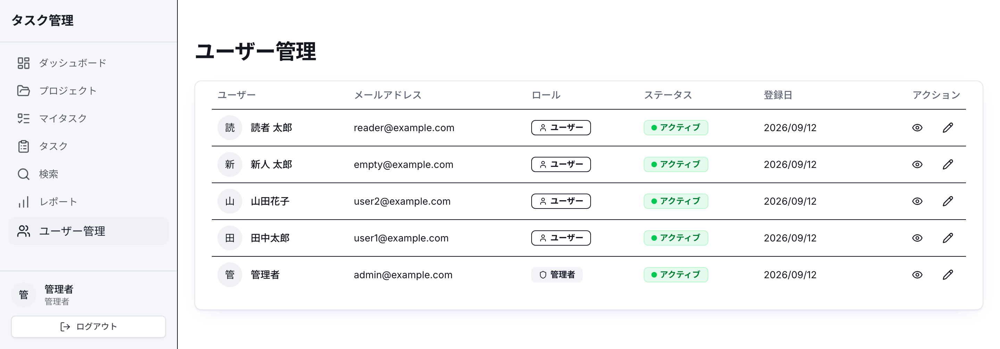
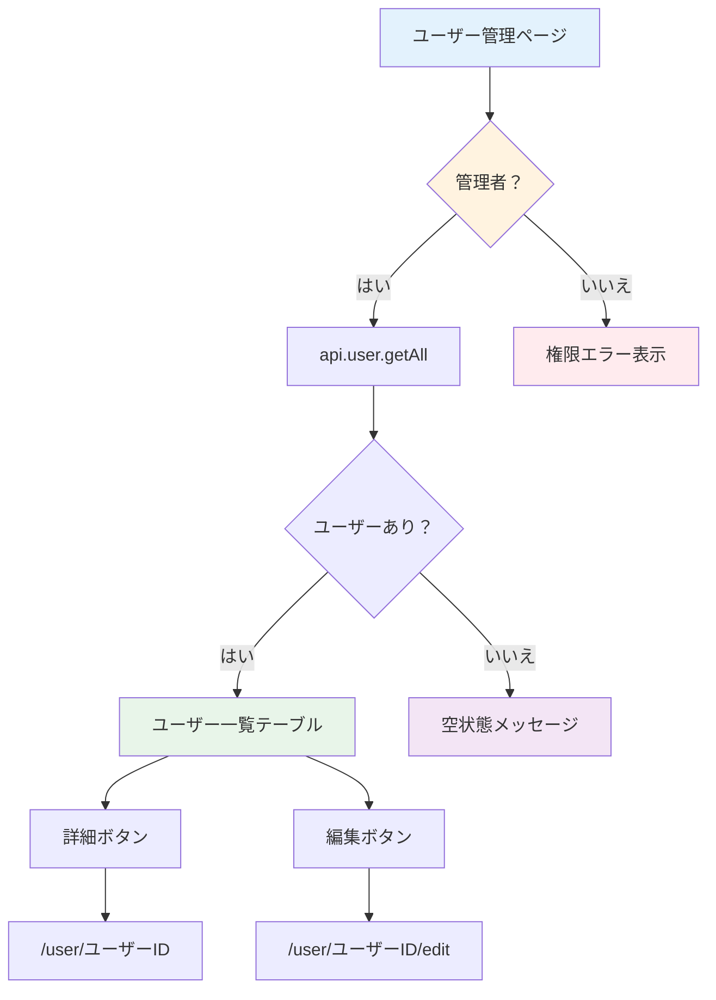
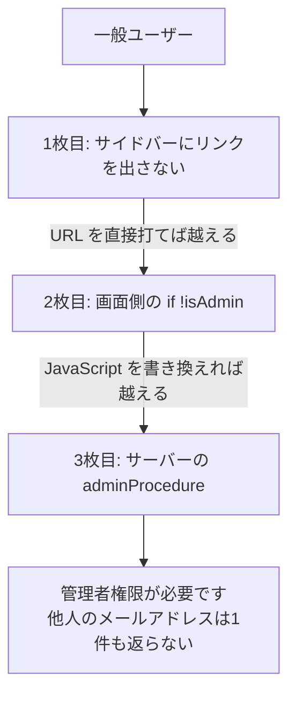
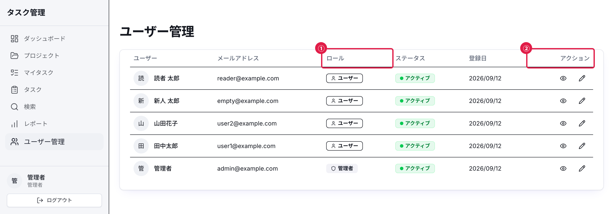

# Day 24: ユーザー一覧（管理者用）を作ろう

## 前回の振り返り

Day 23 では週次レポートAPIの呼び出し・データ表示を実装し、プロジェクト統計ページへのリンクを付けました。Table コンポーネントでデータを一覧表示するパターンを学んだので今日は管理者専用のユーザー一覧ページに取り組みます。

---

## 今日のゴール

管理者だけがアクセスできるユーザー管理ページを実装します。
ユーザー一覧をテーブルで表示し、詳細画面や編集画面へ遷移できるようにします。

この日はまずサーバー側のユーザー一覧 API（`getAll`）を自分で書きます。そのあと画面をつなぎます。

完成イメージ: 管理者がユーザーを一覧管理できるページです。



## なぜこれを作るのか

メンバーが増えるほど「誰がどの権限を持っているか」「無効にしたアカウントはどれか」が把握しづらくなります。管理者が全ユーザーを一覧で見渡し、権限や状態を確認できる画面を用意します。

> **例え話**: ユーザー管理は「学校の出席簿」です。
> 先生（管理者）だけが出席簿を開いて
> 生徒（ユーザー）の名前や出席状況を確認できます。

## 始める前の前提

- 管理者ユーザーでログインできる
- 一般ユーザーも1人以上登録済みで、一覧に表示する対象がある
- `src/server/api/root.ts` を開いて、今登録されているルーターを確認できる（user は今日追加する）
- 管理者以外で開いたときのアクセス拒否も確認する

### ユーザー管理ページのフロー


```mermaid
flowchart TD
    A[ユーザー管理ページ] --> B{管理者？}
    B -->|はい| C[api.user.getAll]
    B -->|いいえ| D[権限エラー表示]
    C --> E{ユーザーあり？}
    E -->|はい| F[ユーザー一覧テーブル]
    E -->|いいえ| G[空状態メッセージ]
    F --> H[詳細ボタン]
    F --> I[編集ボタン]
    H --> J["/user/ユーザーID"]
    I --> K["/user/ユーザーID/edit"]

    style A fill:#e3f2fd
    style B fill:#fff3e0
    style F fill:#e8f5e9
    style D fill:#ffebee
    style G fill:#f3e5f5
```

この図でいちばん大事なのは最初のひし形にある管理者かどうかの分岐です。ここで「いいえ」へ進んだ人は`api.user.getAll` を呼ぶ矢印まで届きません。一般ユーザーのブラウザからはユーザー一覧のリクエストがそもそも送信されないという意味です。一本道に見えて実際には右半分を通れるのが管理者だけになっています。分岐の先ではもう一度、ユーザーが0件かどうかで道が分かれます。テーブルと空状態メッセージはどちらか片方だけが画面に出ます。今日やるのはこの2つの分岐を画面とサーバーの両方に置く作業です。

### やること / やらないこと

| やること | やらないこと |
|---------|-------------|
| 管理者権限チェック | ロール変更機能 |
| ユーザー一覧テーブル | アカウント作成 |
| アバター・バッジ表示 | パスワードリセット |
| 詳細・編集へのリンク | ユーザー削除 |
| 空状態UI表示 | ソート・フィルター |

### 新しく学ぶ概念

| 概念 | 読み方 | 役割 | 例え |
|------|--------|------|------|
| getCurrentUser | — | ログイン中ユーザー取得 | 自分の学生証を見る |
| role チェック | ロール | 権限による制御 | 先生か生徒かの判定 |
| Avatar | アバター | ユーザーアイコン | プロフィール写真 |
| UserRoleBadge | — | ロール表示バッジ | 名札のシール |
| ActiveStatusBadge | — | 状態表示バッジ | 在席ランプ |
| \|\| (OR演算子) | オア | falsy時の代替値 | 保険のようなもの |
| && (条件付きレンダリング) | アンド | 条件を満たすとき表示 | 在庫ありの商品だけ並べる |

### ページ構造の全体像

まず完成形のページ構造を確認しましょう。
この骨格に沿って各Stepで中身を埋めていきます。

| 層 | 内容 | 担当Step |
|----|------|---------|
| ローディング | PageLoadingSpinner | Step 5 |
| 権限チェック | ADMIN以外はエラーカード | Step 5 |
| ヘッダー | タイトル「ユーザー管理」 | Step 6 |
| テーブル | ユーザー一覧 | Step 6-8 |
| 空状態 | ユーザー0件時のメッセージ | Step 9 |

## 実装ステップ一覧

| ステップ | 作業内容 | 所要時間 |
|---------|---------|---------|
| Step 0 | ユーザー一覧 API（getAll）を自分で書く | 14分 |
| Step 1 | 使用するAPIの確認 | 3分 |
| Step 2 | インポート文（外部ライブラリ） | 3分 |
| Step 3 | インポート文（プロジェクト内） | 3分 |
| Step 4 | データ取得とエラー処理 | 7分 |
| Step 5 | 取得状態と権限チェック | 8分 |
| Step 6 | ページヘッダーとテーブル枠 | 4分 |
| Step 7 | アバターとバッジの表示 | 5分 |
| Step 8 | アクションボタンの追加 | 4分 |
| Step 9 | 空状態UIと動作確認 | 3分 |

**合計時間**: 約54分です。

この時間はコードを読んで理解する目安です。写経して打ち込む時間、詰まって調べる時間は別に見てください。

---

### Step 0: ユーザー一覧 API（getAll）を自分で書く（14分）

**ゴール**: `src/server/api/routers/user.ts` を新規作成し、まず `getAll` を写経して `api.user.getAll` を自分で生やします。管理者一覧ページの入口はここです。Day 21 の `report.ts` と同じく、ファイルを「登録するだけ」ではなく、最初の procedure から自分で作ります。

一覧ページが必要としているのは全ユーザーの詳細全部ではありません。名前・メール・ロール・状態・登録日など、表示に使う項目だけです。そこで完成版のコードでは`USER_DETAIL_SELECT` を再利用しつつ `createdAt` と `updatedAt` を足して返します。

#### 0-1. import を並べる

まず `src/server/api/routers/user.ts` を新規作成し、先頭に import を書きます。

```typescript
// filepath: src/server/api/routers/user.ts
import type { Prisma } from '@prisma/client';
import { z } from 'zod';
import { USER_ROLE } from '@/lib/constant/roles';
import { prisma } from '@/lib/prisma';
import { adminProcedure, createTRPCRouter } from '../trpc';
import { USER_DETAIL_SELECT } from './_helpers/select';
```

今日は `getAll` に必要な import だけを書きます。Day 25 と Day 29 で初めて使う認可・パスワード・詳細取得の道具はその procedure を追加する日に足します。こうすると各 Day の終了時点で未使用 import が残りません。

#### 0-2. 管理者専用の getAll を書く

```typescript
// filepath: src/server/api/routers/user.ts（続き）
export const userRouter = createTRPCRouter({
  // 共通処理がDBの最新ロールで管理者判定を済ませるため、ここでは再確認しません
  getAll: adminProcedure
    .input(
      z
        .object({
          isActive: z.boolean().optional(),
          role: z.nativeEnum(USER_ROLE).optional(),
        })
        .optional(),
    )
    .query(async ({ input }) => {
      const where: Prisma.UserWhereInput = {};
```

今日のページは管理者専用なので、入口に **`adminProcedure`** を使います。共通の認証処理がDBから最新の `role` と `isActive` を取得し、有効なユーザーか確かめます。その `role` で `ADMIN` 判定まで済ませるため、`getAll` の中で管理者かどうかを調べ直す必要はありません。ログイン後に権限が変更された場合も、次のAPI呼び出しにはDBの最新状態が使われます。

#### 0-3. 条件があるときだけ where に足す

```typescript
// filepath: src/server/api/routers/user.ts（続き）
      if (input?.isActive !== undefined) {
        where.isActive = input.isActive;
      }

      if (input?.role) {
        where.role = input.role;
      }
```

一覧画面の最初の版では絞り込み UI をまだ作りませんがAPI は先に対応済みです。条件が渡されたときだけ `where` に足し、未指定なら全件のままにします。`isActive` は `false` が有効な値なので`if (input?.isActive)` ではなく `!== undefined` で判定しているのがポイントです。

#### 0-4. 表示に使う項目だけ返す

```typescript
// filepath: src/server/api/routers/user.ts（続き）
      return await prisma.user.findMany({
        where,
        select: {
          ...USER_DETAIL_SELECT,
          createdAt: true,
          updatedAt: true,
        },
        orderBy: { createdAt: 'desc' },
      });
    }),
});
```

`USER_DETAIL_SELECT` は共有の select 定義で、名前・メール・ロール・アバターなど「返してよいユーザー項目」をまとめたものです。そこへ `createdAt` と `updatedAt` だけ足しているのでDay 24 の一覧画面に必要な列をそのまま返せます。

#### 0-5. root.ts に時系列順で登録する

最後に `userRouter` を `root.ts` に登録します。完成版のコードと同じく、`user` は `report` のあとです。

```typescript
// filepath: src/server/api/root.ts
import { authRouter } from './routers/auth';
import { commentRouter } from './routers/comment';
import { projectRouter } from './routers/project';
import { reportRouter } from './routers/report';
import { searchRouter } from './routers/search';
import { taskRouter } from './routers/task';
import { userRouter } from './routers/user';
import { createCallerFactory, createTRPCRouter } from './trpc';
```

import の並び順と、次に書く登録の並び順は別物です。import 側はファイル名のアルファベット順で、保存すると整形ツールが自動でこの順に直します。登録側は教材で作った時系列を保つので`user` が最後に来ます。どちらの順番でも動作は変わりませんが`root.ts` を開いたときにどの Day で何を足したのかが追えなくなります。

2つのうち片方だけ忘れたときの出方も違います。import を書き忘れると `userRouter` が見つからないという型エラーがその場で出ます。登録を忘れると`api.user.getAll` と書いた行で「そんなプロパティは無い」という型エラーが出ます。動かす前に気づける形です。後者のほうが原因を見つけにくいので2か所そろっているかを必ず確かめてください。

```typescript
// filepath: src/server/api/root.ts（続き）
export const appRouter = createTRPCRouter({
  auth: authRouter,
  project: projectRouter,
  task: taskRouter,
  search: searchRouter,
  comment: commentRouter,
  report: reportRouter,
  user: userRouter,
});
```

Day 21 でも触れたとおり、root の順番は教材で作った時系列に揃えます。`user` は `report` のあとです。

**確認ポイント**:
- `src/server/api/routers/user.ts` を新規作成し、今日使う import と `getAll` を書けた
- `getAll` が `adminProcedure` になっている
- `root.ts` に `userRouter` を import / registration の両方で追加し、最後尾に置けた
- `npx tsc --noEmit` で型エラーが出ていない

---

### Step 1: 使用するAPIの確認（3分）

**ゴール**: ユーザー管理に使う2つのAPIを理解します。

#### 使用するAPI一覧

| API | 用途 | 戻り値 |
|-----|------|--------|
| api.auth.getCurrentUser | ログイン中のユーザー | ユーザーオブジェクト |
| api.user.getAll | 全ユーザー一覧 | ユーザー配列 |

#### getCurrentUser の主なプロパティ

| プロパティ | 型 | 用途 |
|-----------|-----|------|
| id | string | ユーザーID |
| name | string \| null | 表示名（未設定のときは null） |
| role | "ADMIN" / "USER" | ロール判定に使用 |
| isActive | boolean | アカウント有効/無効 |

```typescript
// filepath: src/app/user/page.tsx
// 2つのAPIを呼び出す（次のStepで実装）
api.auth.getCurrentUser.useQuery();
api.user.getAll.useQuery();
```

> `api.auth.getCurrentUser` で自分のロールを確認し、
> ADMIN でなければアクセスを拒否します。
> `api.user.getAll` は管理者のみ呼べるAPIです。

**確認ポイント**:
- 2つのAPIの役割を理解した
- getCurrentUser でロール判定することを理解した

---

### Step 2: インポート文（外部ライブラリ）（3分）

**ゴール**: 外部ライブラリのインポートを追加します。

```typescript
// filepath: src/app/user/page.tsx
'use client';

import { format } from 'date-fns';
import { ja } from 'date-fns/locale';
import { Eye, Pencil } from 'lucide-react';
import { useRouter }
  from 'next/navigation';
```

> `'use client'` はこのファイルが
> クライアントコンポーネントであることを示します。
> `useRouter` を使うために必須です。

`useRouter` はブラウザの中で画面を切り替えるhookです。Next.js のページは何もしなければサーバー側で組み立てられるため、この宣言が無いと呼び出した時点でエラーになります。Day 09 のプロジェクト一覧でも、先頭に同じ1行を置きました。今日はそこへ、日付を整える道具とアイコンが加わります。

#### インポートしたライブラリの役割

| ライブラリ | 用途 |
|-----------|------|
| date-fns / ja | 日付フォーマット（日本語） |
| Eye, Pencil | 詳細・編集ボタンのアイコン |
| useRouter | ページ遷移 |

**確認ポイント**:
- `'use client'` がファイル先頭にある
- 各ライブラリの役割を理解した

---

### Step 3: インポート文（プロジェクト内）（3分）

**ゴール**: プロジェクト内のコンポーネントと定数をインポートします。

`UserRoleBadge` と `ActiveStatusBadge` はスターターの `src/component/ui/user-badges.tsx` に同梱済みです。今日はその部品を一覧に配置します。

```typescript
// filepath: src/app/user/page.tsx
import { AppLayout }
  from '@/component/layout/app-layout';
import {
  Avatar, AvatarFallback, AvatarImage,
} from '@/component/ui/avatar';
import { Button }
  from '@/component/ui/button';
import {
  Card, CardContent,
} from '@/component/ui/card';
```

ここで取り込むのはページの外枠を作る部品です。`AppLayout` はサイドバーとヘッダーを持つ共通の枠、`Card` と `CardContent` はテーブルを収める箱、`Button` はアクション列に置くボタンです。`Avatar` だけ3つまとめて取り込むのは外枠・画像・代わりの表示という3部品を組み合わせて1つのアイコンにするからです。画像URLがあるときは `AvatarImage` が出て無いときは `AvatarFallback` が出ます。どちらを出すかの判定は Step 7 で書きます。

**確認ポイント**:
- `AppLayout` はページ全体のレイアウト
- `Avatar` はユーザーアイコン表示用

```typescript
// filepath: src/app/user/page.tsx
import { PageLoadingSpinner }
  from '@/component/ui/loading-spinner';
import {
  Table, TableBody, TableCell,
  TableHead, TableHeader, TableRow,
} from '@/component/ui/table';
import {
  ActiveStatusBadge, UserRoleBadge,
} from '@/component/ui/user-badges';
import { USER_ROLE }
  from '@/lib/constant/roles';
import {
  isAuthError, isForbiddenError,
  shouldRetryQuery,
} from '@/lib/query-error';
import { api } from '@/trpc/react';
```

> `PageLoadingSpinner` は
> `@/component/ui/loading-spinner` にあります。
> 画面の中央で回る円を1つ描くだけの部品で、
> サイドバーやヘッダーは含みません。

**確認ポイント**:
- `PageLoadingSpinner` のパスが `@/component/ui/loading-spinner` になっている
- `USER_ROLE` 定数を `@/lib/constant/roles` からインポートしている
- エラーの種類と再試行を判定する3つの関数をインポートしている
- `UserRoleBadge` と `ActiveStatusBadge` をインポートしている

---

### Step 4: データ取得とエラー処理（7分）

**ゴール**: APIからデータを取得し、エラー時の処理を追加します。

Step 4 から Step 8 までは `src/app/user/page.tsx` を上から書き足す途中で、関数はまだ閉じていません。保存するたびにエラー表示が出ますがStep 9 の最後のコードブロックで `</AppLayout>`、`);`、`}` を書けば消えます。それまで `/user` は開けないので画面で見た目を確かめるのは Step 9 で `</AppLayout>` まで書き終えてからにしてください。Step 8 までの確認ポイントは書いたコードの上で確かめられることだけを挙げています。

**実装**:

```typescript
// filepath: src/app/user/page.tsx
export default function UsersPage() {
  const router = useRouter();

  const {
    data: currentUser,
    isLoading: isCurrentUserLoading,
    isError: isCurrentUserError,
    isFetching: isCurrentUserFetching,
    error: currentUserError,
    refetch: refetchCurrentUser,
  } = api.auth.getCurrentUser.useQuery(
    undefined,
    { retry: shouldRetryQuery },
  );
  const isAdmin =
    currentUser?.role === USER_ROLE.ADMIN;
```

`isLoading` は最初の取得中、`isFetching` は再取得も含めて通信中であることを表します。`isError` と `error` は分けて受け取ります。前者で失敗の有無を判定し、後者で401・403・それ以外を区別するためです。

```typescript
// filepath: src/app/user/page.tsx（続き）
  const {
    data: users,
    isLoading: isUsersLoading,
    isError: isUsersError,
    isFetching: isUsersFetching,
    error: usersError,
    refetch: refetchUsers,
  } = api.user.getAll.useQuery(
    undefined,
    {
      enabled: isAdmin,
      retry: shouldRetryQuery,
    },
  );
```

> `useQuery` はデータ取得用のhookです。
> `data`, `isLoading`, `isError` などの状態を返します。
> これらを使い分けて画面表示を切り替えます。

**確認ポイント**:
- ADMIN のときだけ `getAll` を呼んでいる
- 2つのqueryから読み込み・エラー・再取得の状態を取得している
- 401と403を自動再試行しない `retry` を渡している

#### 2つのqueryをまとめて判定する

利用者情報の取得と一覧の取得は、どちらが失敗しても正常な一覧を保証できません。2つのエラーを配列へ集め、ログイン切れと権限不足を先に判定します。

```typescript
// filepath: src/app/user/page.tsx（続き）
  const queryErrors = [
    isCurrentUserError ? currentUserError : null,
    isUsersError ? usersError : null,
  ];
  const authFailed = queryErrors.some(isAuthError);
  const forbidden =
    queryErrors.some(isForbiddenError);
  const hasFetchError =
    isCurrentUserError || isUsersError;
  const hasRequiredData =
    (!isCurrentUserError || currentUser != null)
    && (!isUsersError || users != null);
```

`hasRequiredData` は失敗したqueryに表示可能なキャッシュが残っているかを確かめます。500でキャッシュがあれば前回の一覧を残せます。一方、401や403では古いデータが残っていても一覧を隠します。認証状態や権限が変わった後に、以前取得したメールアドレスを表示し続けないためです。

```typescript
// filepath: src/app/user/page.tsx（続き）
  const requiredLoading =
    isCurrentUserLoading
    || (isAdmin && isUsersLoading);
  const requiredFetching =
    isCurrentUserFetching || isUsersFetching;

  const refetchRequiredData = () => {
    void refetchCurrentUser();
    if (isAdmin) void refetchUsers();
  };
```

再試行では利用者情報を必ず取り直し、管理者だと分かっている場合だけ一覧も取り直します。`void` は Promise（非同期処理の結果）をこの場では待たないと明示する書き方です。ボタンは `requiredFetching` を使って通信中の連打を防ぎます。

---

### Step 5: 取得状態と権限チェック（8分）

**ゴール**: ローディング表示とADMIN以外のアクセス拒否画面を実装します。

**実装**:

```typescript
// filepath: src/app/user/page.tsx
  if (requiredLoading
    && !authFailed
    && !forbidden) {
    return (
      <AppLayout>
        <PageLoadingSpinner />
      </AppLayout>
    );
  }
```

このスピナーは自分の情報または一覧の初回取得を待つ表示です。エラーが判明している場合はスピナーを優先せず、次に書くエラー表示へ進みます。`AppLayout` で囲むため待っている間もサイドバーから別のページへ移れます。

**確認ポイント**:
- 初回取得中は `AppLayout` の内側に `PageLoadingSpinner` を表示している

次に、表示に必要なデータが無い取得失敗を判定します。401と403はこの分岐の後ろで専用の案内を出すため、ここでは除きます。

```typescript
// filepath: src/app/user/page.tsx
  if (hasFetchError
    && !hasRequiredData
    && !authFailed
    && !forbidden) {
    return (
      <AppLayout>
        <div className="flex flex-col items-center
          justify-center py-24 text-center">
          <p className="mb-2 text-base font-semibold">
            ユーザー一覧を取得できませんでした
          </p>
          <p className="mb-6 text-sm text-muted-foreground">
            通信状況を確認して、再読み込みしてください。
          </p>
```

初回取得では表示できる一覧が無いため、原因と次の操作を画面の中央に出します。ここで通常の一覧へ進ませないことが、取得失敗を0件と取り違えないための境目です。

```typescript
          {/* filepath: src/app/user/page.tsx */}
          <Button onClick={refetchRequiredData}
            disabled={requiredFetching}>
            再読み込み
          </Button>
        </div>
      </AppLayout>
    );
  }
```

この分岐は利用者情報の初回500を権限不足と区別し、一覧の初回500を0件の成功と区別します。失敗を無視して空のテーブルを出すと、利用者には「登録ユーザーが0人」と見えてしまいます。

続いて認証・権限チェックを書きます。一般ユーザーが開いたときも、401や403が返ったときも、ユーザー一覧を隠します。

```typescript
// filepath: src/app/user/page.tsx（続き）
  if (authFailed || forbidden || !isAdmin) {
    return (
      <AppLayout>
        <div className="container mx-auto
          max-w-6xl mt-8">
          <Card>
            <CardContent className="pt-6">
              <h1 className="text-2xl font-bold mb-2">
                {authFailed
                  ? 'ログインの有効期限が切れました'
                  : 'アクセス権限がありません'}
              </h1>
```

取得失敗を先に分けたので、ここでは `!isAdmin` をそのまま使えます。401や403は、キャッシュに管理者情報が残っていてもこの早期リターンに入るため、下の一覧を表示しません。

ただしこの判定は画面側の親切にすぎません。本当の防波堤は Step 0 で書いた `adminProcedure` のほうです。ブラウザの JavaScript は読者の手元で動くので書き換えればこの `if` は通り抜けられます。それでも `api.user.getAll` はサーバーで `管理者権限が必要です` と弾かれるため他人のメールアドレスは1件も返りません。画面の判定は表示を整えるためサーバーの判定は情報を守るためにあります。

**確認ポイント**:
- `USER_ROLE.ADMIN` を使っている（文字列 `'ADMIN'` ではない）

```typescript
              {/* filepath: src/app/user/page.tsx */}
              <p className="text-muted-foreground mb-4">
                {authFailed
                  ? 'もう一度ログインしてください。'
                  : 'この機能は管理者のみ利用できます'}
              </p>
              {authFailed && (
                <Button
                  onClick={() => router.push('/login')}
                >
                  ログイン画面へ
                </Button>
              )}
            </CardContent>
          </Card>
        </div>
      </AppLayout>
    );
  }
```

エラーメッセージには何が起きたかと誰なら使えるかの2つを書きます。「エラーが発生しました」とだけ出すと読者は自分の操作を疑って同じ手順を何度も繰り返します。管理者専用だと書いてあれば管理者に依頼するという次の行動がその場で分かります。閉じタグは開いた順の逆にたどり、`CardContent` から `Card`、`div`、`AppLayout` の順で閉じます。1つでも閉じ忘れると括弧の対応が関数の外までずれて書いた場所から離れた行に構文エラーが出ます。

キャッシュが残っている500では早期リターンしません。ページ本体の先頭に警告を置きます。

```typescript
{/* filepath: src/app/user/page.tsx（return直後） */}
{hasFetchError && (
  <div role="alert" className="mb-4 flex items-center
    justify-between gap-4 rounded-lg border px-4 py-3">
    <span>
      最新のユーザー一覧を取得できませんでした。
      前回取得時の内容です。
    </span>
    <Button variant="outline" size="sm"
      onClick={refetchRequiredData}
      disabled={requiredFetching}>
      再試行
    </Button>
  </div>
)}
```

警告と一覧を同時に見せることで、通信に失敗した事実と手元に残っている内容を区別できます。`role="alert"` は支援技術にも警告として伝えるための属性です。

#### 権限チェックの判定ロジック

| 条件 | 結果 | 表示 |
|------|------|------|
| role === USER_ROLE.ADMIN | アクセス許可 | ユーザー一覧 |
| role === USER_ROLE.USER | アクセス拒否 | エラーカード |
| currentUser が null | アクセス拒否 | エラーカード |
| 初回取得が500 | 取得失敗 | 再読み込み画面 |
| キャッシュありで500 | 一時的な取得失敗 | 前回の一覧と警告 |
| 401 / 403 | 認証・認可失敗 | 一覧を隠す |

> `USER_ROLE.ADMIN` は `@/lib/constant/roles` で
> 定義された定数です。文字列 `'ADMIN'` を直接書かず、
> 定数を使うことでタイプミスを防げます。

**確認ポイント**:
- 認証・認可エラーの早期リターンを、テーブル本体より前に書いている
- 初回500とキャッシュが残る500を分けている
- 早期リターンの `<AppLayout>` を `</AppLayout>` まで閉じている

---

### Step 6: ページヘッダーとテーブル枠（4分）

**ゴール**: ページのメインレイアウトとテーブルのヘッダー行を作ります。

**実装**:

```typescript
// filepath: src/app/user/page.tsx
  return (
    <AppLayout>
      <div className="container mx-auto
        max-w-6xl py-8">
        <div className="flex
          justify-between items-center
          mb-6">
          <h1 className="text-3xl
            font-bold tracking-tight">
            ユーザー管理
          </h1>
        </div>
```

ここから下はログイン中の人が管理者だと確定したあとのコードです。上の2つの早期リターンを通り抜けた場合しか、この `return` には届きません。だから以降では `isAdmin` を確かめ直さずに書けます。早期リターンを先に並べておくと本体のコードから条件分岐が消えて読みやすくなります。

`max-w-6xl` は横幅の上限です。この表は6列あるのでDay 09 のカード一覧より広い枠を使います。上限を付けないとワイドモニターで名前と右端のボタンが離れすぎてどの行のボタンなのかを目で追えなくなります。

**確認ポイント**:
- `<AppLayout>` の中に `<h1>` で「ユーザー管理」を書けた

```typescript
        {/* filepath: src/app/user/page.tsx */}
        <Card>
          <CardContent className="p-0">
            <Table>
              <TableHeader>
                <TableRow>
                  <TableHead>
                    ユーザー
                  </TableHead>
                  <TableHead>
                    メールアドレス
                  </TableHead>
                  <TableHead>
                    ロール
                  </TableHead>
```

`CardContent` に `className="p-0"` を付けているのはテーブル側が各セルに余白を持っているからです。カードの初期余白を残すと枠線とセルの間に余白が二重にでき、行の区切り線がカードの内側で途切れて見えます。

`TableHead` はこの表の列そのものの定義です。ここに並べた個数と、Step 7 以降で書く `TableCell` の個数はそろえます。片方だけ増やすとその行から下の列がすべて1つずつ横にずれます。エラーは1件も表示されないので見た目のずれで気づくしかありません。列を足したくなったときはヘッダーと本体の両方を必ず同時に直してください。

**確認ポイント**:
- `<TableHeader>` の中に `<TableHead>` を3つ書けた

```typescript
                  {/* filepath: src/app/user/page.tsx */}
                  <TableHead>
                    ステータス
                  </TableHead>
                  <TableHead>
                    登録日
                  </TableHead>
                  <TableHead
                    className="text-right">
                    アクション
                  </TableHead>
                </TableRow>
              </TableHeader>
```

> `TableHeader` と `TableBody` は
> 同じ `<Table>` タグの中に並べて書きます。
> HTMLの `<thead>` と `<tbody>` に対応しています。

**確認ポイント**:
- `<TableHead>` が合計6つになり、`</TableHeader>` まで閉じられた
- 6つ目の `<TableHead>` に `className="text-right"` を付けている

---

### Step 7: アバターとバッジの表示（5分）

**ゴール**: テーブル本体にアバター画像とロール・ステータスのバッジを表示します。

**実装**:

```typescript
              {/* filepath: src/app/user/page.tsx */}
              <TableBody>
                {users?.map((user) => (
                  <TableRow key={user.id}>
                    <TableCell>
                      <div className="flex
                        items-center gap-3">
                        <Avatar
                          className="h-9 w-9">
                          {user.avatar && (
                            <AvatarImage
                              src={user.avatar}
                              alt={
                                user.name
                                || ''} />
                          )}
```

> `{user.avatar && ...}` で画像URLが
> 存在するときだけ `AvatarImage` を表示します。
> avatar が null/undefined のときは
> AvatarFallback が自動的に表示されます。

**確認ポイント**:
- 条件付きレンダリングを使っている

```typescript
                          {/* filepath: src/app/user/page.tsx */}
                          <AvatarFallback>
                            {user.name
                              ?.[0]
                              ?.toUpperCase()}
                          </AvatarFallback>
                        </Avatar>
                        <span
                          className=
                          "font-medium">
                          {user.name}
                        </span>
                      </div>
                    </TableCell>
                    <TableCell>
                      {user.email}
                    </TableCell>
```

`user.name?.[0]?.toUpperCase()` は名前の1文字目を取り出して大文字にする式です。`?.` を2回はさむのは名前が未設定の場合と、名前はあっても空文字の場合の両方で途中停止できるようにするためです。`?.` を外すと名前が `null` のユーザーが1人いるだけでこの式が例外を投げ、一覧全体が真っ白になります。1件のデータ欠けで残り全員の行まで巻き添えにしないための書き方です。

**確認ポイント**:
- `<Avatar>` の中に `AvatarImage` と `AvatarFallback` の両方を書けた
- `{user.name}` を1列目、`{user.email}` を2列目の `<TableCell>` に書けた

```typescript
                    {/* filepath: src/app/user/page.tsx */}
                    <TableCell>
                      <UserRoleBadge
                        role={user.role} />
                    </TableCell>
                    <TableCell>
                      <ActiveStatusBadge
                        isActive={
                          user.isActive} />
                    </TableCell>
```

`user.role` をそのまま置けば画面には `ADMIN` という文字が出ます。意味は通じますが管理者を探すたびに文字を1行ずつ読む作業が発生します。`UserRoleBadge` に渡すとアイコンと色の付いた札に変わるので一覧を上から眺めるだけで管理者の行が目に飛び込みます。

`ActiveStatusBadge` の考え方も共通です。`isActive` の中身は `true` か `false` ですが画面に `false` と出ても読者には何のことか伝わりません。値を見た目へ翻訳する仕事を専用の部品へ閉じ込めておくと色や文言を変えたくなったときの直し先がその部品1つで済みます。Day 09 で `'DONE'` と直接書かず `TASK_STATUS.DONE` を使ったのと、根っこは共通の考え方です。

#### バッジコンポーネントの仕様

| コンポーネント | Props | 表示内容 |
|--------------|-------|---------|
| UserRoleBadge | role | ADMIN: Shield + 管理者 / USER: User + ユーザー |
| ActiveStatusBadge | isActive | true: 緑バッジ / false: グレーバッジ |

| ステータス | 背景色 | テキスト色 | 表示テキスト |
|-----------|--------|-----------|------------|
| アクティブ | green-500/10 | green-700 | アクティブ |
| 無効 | gray-500/10 | gray-700 | 無効 |

初期データのユーザーは全員アクティブなのでグレーのバッジは Day 29 でアカウントを無効にしてから確かめます。

> `AvatarFallback` にはユーザー名の頭文字を
> 大文字で表示します。画像がないユーザーでも
> アイコンが表示されます。

**確認ポイント**:
- `UserRoleBadge` に `role={user.role}` を渡している
- `ActiveStatusBadge` に `isActive={user.isActive}` を渡している
- 3列目と4列目の `<TableCell>` を1つずつ閉じている

---

### Step 8: アクションボタンの追加（4分）

**ゴール**: 各行に日付表示と、詳細・編集ボタンを追加します。

**実装**:

```typescript
                    {/* filepath: src/app/user/page.tsx */}
                    <TableCell>
                      {user.createdAt
                        ? format(
                            new Date(
                              user.createdAt),
                            'yyyy/MM/dd',
                            { locale: ja })
                        : '-'}
                    </TableCell>
```

> `format` は `date-fns` の関数です。
> `ja` ロケールを渡すと日本語の日付形式で
> 表示されます。`createdAt` が undefined なら
> `-` を表示して安全に処理しています。

**確認ポイント**:
- `format` に `'yyyy/MM/dd'` と `{ locale: ja }` を渡している

```typescript
                    {/* filepath: src/app/user/page.tsx */}
                    <TableCell
                      className="text-right">
                      <div className="flex
                        justify-end gap-2">
                        <Button
                          variant="ghost"
                          size="icon"
                          onClick={() =>
                            router.push(
                              `/user/${
                                user.id}`)}
                          aria-label="詳細"
                          title="詳細">
                          <Eye
                            className=
                            "h-4 w-4" />
                        </Button>
```

`onClick` の中で `router.push` を呼ぶとページ全体を読み込み直さずに `/user/{id}` へ移ります。`<a href>` で書くとブラウザがページを丸ごと取り直すのでサイドバーの描画やログイン状態の確認までやり直しになり、画面が一度白くなります。Day 08 で置いたサイドバーのリンクと共通の仕組みです。

`title="詳細"` はマウスを載せたときの吹き出しに使います。`aria-label="詳細"` は読み上げソフトへボタンの名前を伝える指定です。アイコンだけでも操作の目的が分かるよう、両方を付けます。

**確認ポイント**:
- 詳細ボタンの中に `<Eye />` を置き、`title="詳細"` を付けている

```typescript
                        {/* filepath: src/app/user/page.tsx */}
                        <Button
                          variant="ghost"
                          size="icon"
                          onClick={() =>
                            router.push(
                              `/user/${
                                user.id
                              }/edit`)}
                          aria-label="編集"
                          title="編集">
                          <Pencil
                            className=
                            "h-4 w-4" />
                        </Button>
                      </div>
                    </TableCell>
```

編集ボタンは詳細ボタンと共通の形で、行き先の末尾に `/edit` が付くだけです。テンプレートリテラルの中へ `user.id` を挟むと行ごとに違うURLができます。一覧のどの行から押してもその行のユーザーの編集画面に着きます。

このボタンが用意しているのは移動の入口だけで、権限を守る役目は持っていません。`/user/{id}/edit` はURLを手で打っても開けます。編集画面が安全なのはDay 29 で書く保存処理がサーバー側でロールを確かめ、管理者でなければ `管理者権限が必要です` を返すからです。ボタンを隠すことと、操作を禁じることは別の話だと覚えておいてください。

**確認ポイント**:
- 1つの `<TableCell>` の中に `<Button>` を2つ書けた
- 2つとも `variant="ghost"` と `size="icon"` を指定している

```typescript
                  {/* filepath: src/app/user/page.tsx */}
                  </TableRow>
                ))}
              </TableBody>
            </Table>
          </CardContent>
        </Card>
```

`))}` の3文字はそれぞれ別のものを閉じています。内側の丸括弧は `map` に渡した関数が返す JSX の囲み、外側の丸括弧は `map` の呼び出し、波括弧は JSX の中に JavaScript を書くための入れ物です。開いたのは Step 7 の `{users?.map((user) => (` という1行なのでそこと縦に見比べると対応がつかめます。

括弧を1つ多く閉じたり足りなかったりするとエラーが指す行番号はこの近くではなくファイルの末尾になりがちです。対応の破綻は書いた場所ではなく最後まで読んだところで初めて発覚するからです。閉じるときは開いた順の逆にたどると数え間違いが減ります。

#### アクションボタンの仕様

| ボタン | アイコン | 遷移先 | 用途 |
|-------|---------|--------|------|
| 詳細 | Eye | /user/ユーザーID | 情報閲覧 |
| 編集 | Pencil | /user/ユーザーID/edit | 情報編集 |

> `variant="ghost"` は背景色なしのボタンです。
> テーブル内では控えめなデザインが適しています。
> `size="icon"` でアイコンサイズになります。

**確認ポイント**:
- `</TableRow>` `))}` `</TableBody>` `</Table>` `</CardContent>` `</Card>` を、開いた順の逆に閉じられた
- `</div>` と `</AppLayout>` はまだ書いていない（Step 9 で書く）

---

### Step 9: 空状態UIと動作確認（3分）

**ゴール**: ユーザー0件時のメッセージを追加し、全体の動作を確認します。

一覧を通常操作から開けるよう、
`app-layout.tsx` に管理者専用リンクを加えます。

```typescript
// filepath: src/component/layout/app-layout.tsx
import { Users } from 'lucide-react';
import { USER_ROLE }
  from '@/lib/constant/roles';
```

`/user` はサイドバーのどこにも出てこないのでいまはURLを手で打たないとたどり着けません。管理者にだけリンクを出して通常の操作で開けるようにします。`app-layout.tsx` はログイン中のセッションをすでに読んでいるため足すのはこの2つだけで済みます。`Users` は下のリンクに置くアイコンです。Day 08 で書いた `lucide-react` の取り込みには入っていません。足さないと `Users is not defined` で止まります。`USER_ROLE` は管理者かどうかを比べるための定数です。ここでも文字列の `'ADMIN'` は書かず、Step 5 と共通の `USER_ROLE.ADMIN` を使います。比べる側と比べられる側で書き方をそろえておけば綴りを間違えた瞬間に型エラーで気づけます。

Day 08 のデスクトップ用のナビゲーション内で、
`menuItems.map(...)` の直後へ追加します。
見た目は既存の項目にそろえます。現在のページを
強調する `cn(...)` と、左に置くアイコンを
既存の6項目と揃った形で付けてください。付けないと
この項目だけ色が変わらず、並んだときに浮きます。

```typescript
{/* filepath: src/component/layout/app-layout.tsx（menuItems.map の直後に追加） */}
{session.user.role === USER_ROLE.ADMIN && (
  <li>
    <Link
      href="/user"
      className={cn(
        'flex items-center gap-3 rounded-lg px-3 py-2 transition-all',
        pathname === '/user'
          ? 'bg-sidebar-accent text-sidebar-accent-foreground'
          : 'text-sidebar-foreground/60 ' +
            'hover:text-sidebar-foreground ' +
            'hover:bg-sidebar-accent',
      )}
    >
      <Users className="h-5 w-5" />
      ユーザー管理
    </Link>
  </li>
)}
```

`session.user.role === USER_ROLE.ADMIN && (...)` は条件が成り立つときだけ後ろの要素を描く書き方です。成り立たないときは式の値が `false` になり、React は `false` を何も描かない値として扱います。だから一般ユーザーのサイドバーには空の行すら残りません。

これで今日の守りは3枚になりました。いちばん外側がこのリンクの出し分けで、次が Step 5 の画面側の権限チェック、いちばん内側が Step 0 の `adminProcedure` です。外側の2枚は迷わせないための案内で、情報を守っているのは内側の1枚だけです。リンクを消しても `/user` 自体は開ける点を、もう一度確かめておいてください。


```mermaid
flowchart TB
    U["一般ユーザー"] --> L["1枚目: サイドバーにリンクを出さない"]
    L -->|"URL を直接打てば越える"| P["2枚目: 画面側の if !isAdmin"]
    P -->|"JavaScript を書き換えれば越える"| S["3枚目: サーバーの adminProcedure"]
    S --> E["管理者権限が必要です<br/>他人のメールアドレスは1件も返らない"]
```

上の2枚には「越える」と書いた矢印が付いています。この2枚は迷わせないための案内で、情報を止めているのはいちばん下の1枚だけです。画面の判定を消しても他人のデータは漏れませんがサーバーの判定を消すと漏れます。

**確認ポイント**:
- `menuItems.map(...)` の直後に、`session.user.role === USER_ROLE.ADMIN &&` で囲んだ `<li>` を置けた
- 文字列の `'ADMIN'` ではなく `USER_ROLE.ADMIN` を使っている

このリンクが実際に出るかどうかは`page.tsx` を閉じ切ってから下のチェックリストで確かめます。

**実装**:

```typescript
        {/* filepath: src/app/user/page.tsx */}
        {users && users.length === 0 && (
          <div className="text-center py-10
            text-muted-foreground">
            ユーザーが見つかりませんでした
          </div>
        )}
      </div>
    </AppLayout>
  );
}
```

> データが0件のとき何も表示しないと
> ユーザーは混乱します。
> 空状態メッセージを表示して安心させましょう。

**確認ポイント**:
- ユーザーが0件のときメッセージが表示される

【スクリーンショット】ここで初めて `/user` が開きます。アバターとロールのバッジが並び、右端にアクション列が出ていることを確認してください。



初期データのユーザーはアバター画像を持っていないのでいちばん左の丸には名前の頭文字だけが出ます。ロールのバッジは管理者が1人、それ以外が一般ユーザーになります。人数が違っても実装の誤りではありません。

```bash
# filepath: ターミナル
PORT=3001 npm run dev
```

**動作確認チェックリスト**:

1. `admin@example.com` でログインする
2. サイドバーに「ユーザー管理」のリンクが出ている
3. そのリンクから `/user` を開く
4. ユーザー一覧がテーブルで表示される
5. アバターと名前が表示される
6. ロールバッジが正しく色分けされる（管理者は Shield アイコン付き）
7. ステータスバッジが正しい（初期データは全員アクティブなので緑だけが並ぶ）
8. 登録日が `yyyy/MM/dd` 形式で並ぶ
9. 各行の右端に詳細・編集のボタンが2つ並び、マウスを載せると背景色が変わる
10. 詳細ボタンで URL が `/user/{id}` に変わる（ページは Day 29 で作るためこの時点では 404 表示）
11. 編集ボタンで URL が `/user/{id}/edit` に変わる（ページは Day 29 で作るため、この時点では 404 表示）
12. 一度ログアウトし、一般ユーザー（`user1@example.com`）でログインし直す
13. サイドバーに「ユーザー管理」が出ていない
14. `/user` をURL入力で開くと「アクセス権限がありません」が表示される
15. 確認できたら `admin@example.com` でログインし直す（Day 25 以降も管理者アカウントを使う）

#### 遷移先のURL構造

| ボタン | URL パターン | 例 |
|-------|-------------|-----|
| 詳細 | /user/{id} | /user/abc123 |
| 編集 | /user/{id}/edit | /user/abc123/edit |

**確認ポイント**:
- 管理者のみアクセスできる
- 全ユーザーがテーブルに表示される
- 詳細・編集ボタンで正しく遷移する


---

### Pro パターンで書こう（ユーザー一覧カードの Props は Pick で切り出す）

ユーザー一覧カードはユーザー情報の一部だけを使います。
`User` 型を丸ごと渡すより使う列だけを `Pick` すると
カードの責務が読みやすくなります。

| 書き方 | 特徴 |
|--------|------|
| `User` を丸ごと渡す | 使わない情報も混ざる |
| `Pick<User, ...>` | 必要な列だけ分かる |

**覚えておきたいこと**: 表示部品には必要な情報だけ渡します。

## 完成コード全体

今日は4つのファイルを触りました。断片を貼り重ねる作業が続いたので途中でどこへ貼ったか分からなくなった場合は以下のコードを上から順に貼り付けて各ファイルを置き換えてください。1つのファイルが複数のブロックに分かれている場合はそのファイルの見出しの下にあるブロックを、出てくる順につなげたものが全文です。上から順に読めばStep 0 から Step 9 で書いたものがどう1つのファイルになったかを確かめられます。

| ファイル | 役割 | 対応する Step |
|---------|------|--------------|
| `src/server/api/routers/user.ts` | ユーザー一覧を返す管理者専用の入口 | Step 0 |
| `src/server/api/root.ts` | 手続きの一覧表 | Step 0 |
| `src/app/user/page.tsx` | ユーザー管理の画面 | Step 2 から Step 9 |
| `src/component/layout/app-layout.tsx` | 管理者だけに出すサイドバーのリンク | Step 9 |

最後の `app-layout.tsx` は Day 08 で作った長いファイルなので今日足した2か所だけを載せます。それ以外の行は Day 08 のまま触りません。

### `src/server/api/routers/user.ts`

**import**:

```typescript
// filepath: src/server/api/routers/user.ts
// 完成版: import
import type { Prisma } from '@prisma/client';
import { z } from 'zod';
import { USER_ROLE } from '@/lib/constant/roles';
import { prisma } from '@/lib/prisma';
import { adminProcedure, createTRPCRouter } from '../trpc';
import { USER_DETAIL_SELECT } from './_helpers/select';
```

取り込むのは今日の `getAll` が使う6つだけです。手元のファイルに `bcrypt` や `protectedProcedure` が並んでいたらそれは先の Day で足す道具を早く書きすぎています。使っていない取り込みが残っていると保存のたびに未使用の警告が出続け、本当に直すべき警告が混ざって見えなくなります。

**getAll の入口と入力の定義**:

```typescript
// filepath: src/server/api/routers/user.ts
// 完成版: getAll の入口と入力の定義
export const userRouter = createTRPCRouter({
  // 共通処理がDBの最新ロールで管理者判定を済ませるため、ここでは再確認しません
  getAll: adminProcedure
    .input(
      z
        .object({
          isActive: z.boolean().optional(),
          role: z.nativeEnum(USER_ROLE).optional(),
        })
        .optional(),
    )
    .query(async ({ input }) => {
      const where: Prisma.UserWhereInput = {};
```

`adminProcedure` で始まっているかを最初に確かめてください。ここが `protectedProcedure` になっているとログインさえしていれば誰でも全員のメールアドレスを受け取れます。画面側の `if (!isAdmin)` は書き換えられる場所で動くので他人の情報を守っているのはこの1語だけです。`.optional()` が2つ付いているのは絞り込みの条件をまだ画面から渡していないためです。

**絞り込みと取得**:

```typescript
// filepath: src/server/api/routers/user.ts
// 完成版: 絞り込みと取得
      if (input?.isActive !== undefined) {
        where.isActive = input.isActive;
      }

      if (input?.role) {
        where.role = input.role;
      }

      return await prisma.user.findMany({
        where,
        select: {
          ...USER_DETAIL_SELECT,
          createdAt: true,
          updatedAt: true,
        },
        orderBy: { createdAt: 'desc' },
      });
    }),
});
```

`isActive` の判定だけ `!== undefined` になっているのは`false` が意味を持つ値だからです。`if (input?.isActive)` と書くと無効なアカウントだけを見たいという指定が「指定なし」として捨てられます。`select` を書かずに `findMany` を呼ぶとパスワードのハッシュまで画面へ送られます。返してよい列を並べておけばテーブルに列を足したときも勝手に外へ出ません。

### `src/server/api/root.ts`

**import**:

```typescript
// filepath: src/server/api/root.ts
// 完成版: import
import { authRouter } from './routers/auth';
import { commentRouter } from './routers/comment';
import { projectRouter } from './routers/project';
import { reportRouter } from './routers/report';
import { searchRouter } from './routers/search';
import { taskRouter } from './routers/task';
import { userRouter } from './routers/user';
import { createCallerFactory, createTRPCRouter } from './trpc';
```

この並びはファイル名のアルファベット順で、保存すると整形ツールが自動でこの形へ直します。手で並べ替える必要はありません。`userRouter` の1行が抜けていると次のブロックの `user: userRouter` で名前が見つからないという型エラーが出ます。

**ルーターの登録と書き出し**:

```typescript
// filepath: src/server/api/root.ts
// 完成版: ルーターの登録と書き出し
export const appRouter = createTRPCRouter({
  auth: authRouter,
  project: projectRouter,
  task: taskRouter,
  search: searchRouter,
  comment: commentRouter,
  report: reportRouter,
  user: userRouter,
});

export type AppRouter = typeof appRouter;

export const createCaller = createCallerFactory(appRouter);
```

こちらの並びは教材で作った時系列に従い、`user` が最後に来ます。上の import 側と順番が違って見えますが動作は変わりません。時系列を保っておくと`root.ts` を開いたときにどの Day で何が増えたのかを上から順にたどれます。下2行は前の Day から置いてあるもので今日は触りません。

### `src/app/user/page.tsx`

**外部ライブラリの import**:

```typescript
// filepath: src/app/user/page.tsx
// 完成版: 外部ライブラリの import
'use client';

import { format } from 'date-fns';
import { ja } from 'date-fns/locale';
import { Eye, Pencil } from 'lucide-react';
import { useRouter } from 'next/navigation';
```

先頭の `'use client'` は`useRouter` をこのページで使うための宣言です。この1行が無いとNext.js はページをサーバー側で組み立てようとしてブラウザにしか無い仕組みを呼んだところで止まります。並びがアルファベット順になっているのは保存すると整形ツールが並べ替えるからです。書いた順番と違っていても手で直す必要はありません。

**プロジェクト内の import**:

```typescript
// filepath: src/app/user/page.tsx
// 完成版: プロジェクト内の import
import { AppLayout } from '@/component/layout/app-layout';
import { Avatar, AvatarFallback, AvatarImage } from '@/component/ui/avatar';
import { Button } from '@/component/ui/button';
import { Card, CardContent } from '@/component/ui/card';
import { PageLoadingSpinner } from '@/component/ui/loading-spinner';
import {
  Table,
  TableBody,
  TableCell,
  TableHead,
  TableHeader,
  TableRow,
} from '@/component/ui/table';
import { ActiveStatusBadge, UserRoleBadge } from '@/component/ui/user-badges';
import { USER_ROLE } from '@/lib/constant/roles';
import { isAuthError, isForbiddenError, shouldRetryQuery } from '@/lib/query-error';
import { api } from '@/trpc/react';
```

`@/component/ui/...` が単数形になっている点は Step 3 の注意書きのとおりで、複数形で書くとファイルが見つからないというエラーが起動時に出ます。`Table` の6つをまとめて取り込んでいるのは表の外枠・見出し行・本体・行・セルがそれぞれ別の部品として分かれているからです。1つでも欠けるとその部分だけタグが見つからないと言われます。

**利用者情報の取得**:

```typescript
// filepath: src/app/user/page.tsx
// 完成版: 利用者情報の取得
export default function UsersPage() {
  const router = useRouter();

  const {
    data: currentUser,
    isLoading: isCurrentUserLoading,
    isError: isCurrentUserError,
    isFetching: isCurrentUserFetching,
    error: currentUserError,
    refetch: refetchCurrentUser,
  } = api.auth.getCurrentUser.useQuery(undefined, { retry: shouldRetryQuery });
  const isAdmin = currentUser?.role === USER_ROLE.ADMIN;
```

利用者情報ではロールだけでなく、読み込み・失敗・再取得の状態も受け取ります。401や403を繰り返し送らないため、共通の `shouldRetryQuery` をqueryへ渡します。

**ユーザー一覧の取得**:

```typescript
// filepath: src/app/user/page.tsx（続き）
// 完成版: ユーザー一覧の取得
  const {
    data: users,
    isLoading: isUsersLoading,
    isError: isUsersError,
    isFetching: isUsersFetching,
    error: usersError,
    refetch: refetchUsers,
  } = api.user.getAll.useQuery(undefined, {
    enabled: isAdmin,
    retry: shouldRetryQuery,
  });
```

`enabled: isAdmin` が抜けると一般ユーザーがページを開いた瞬間にも `getAll` へリクエストが飛びます。サーバーは管理者権限が必要ですと返すため情報は漏れませんが、不要な通信が発生します。`retry` は401と403を繰り返し送らず、500だけを最大3回まで再試行します。

**取得状態の判定**:

```typescript
// filepath: src/app/user/page.tsx（続き）
// 完成版: 取得状態の判定
  const queryErrors = [
    isCurrentUserError ? currentUserError : null,
    isUsersError ? usersError : null,
  ];
  const authFailed = queryErrors.some(isAuthError);
  const forbidden = queryErrors.some(isForbiddenError);
  const hasFetchError = isCurrentUserError || isUsersError;
  const hasRequiredData =
    (!isCurrentUserError || currentUser != null) && (!isUsersError || users != null);
  const requiredLoading = isCurrentUserLoading || (isAdmin && isUsersLoading);
  const requiredFetching = isCurrentUserFetching || isUsersFetching;

  const refetchRequiredData = () => {
    void refetchCurrentUser();
    if (isAdmin) void refetchUsers();
  };
```

401・403はキャッシュがあっても一覧を隠します。500でデータが残っている場合だけ、前回取得した内容と警告を一緒に表示します。

**ローディング**:

```typescript
// filepath: src/app/user/page.tsx
// 完成版: ローディング
  if (requiredLoading && !authFailed && !forbidden) {
    return (
      <AppLayout>
        <PageLoadingSpinner />
      </AppLayout>
    );
  }
```

読み込み中は権限カードを先に出しません。利用者情報が届く前の `isAdmin` は `false` なので、順番を逆にすると管理者にも権限不足が一瞬表示されるためです。

**初回取得エラー**:

```typescript
// filepath: src/app/user/page.tsx（続き）
// 完成版: 初回取得エラー
  if (hasFetchError && !hasRequiredData && !authFailed && !forbidden) {
    return (
      <AppLayout>
        <div className="flex flex-col items-center justify-center py-24 text-center">
          <p className="mb-2 text-base font-semibold text-foreground">
            ユーザー一覧を取得できませんでした
          </p>
          <p className="mb-6 text-sm text-muted-foreground">
            通信状況を確認して、再読み込みしてください。
          </p>
          <Button onClick={refetchRequiredData} disabled={requiredFetching}>
            再読み込み
          </Button>
        </div>
      </AppLayout>
    );
  }
```

初回500をここで返すため、その後の `!isAdmin` は通信失敗を権限不足として誤表示しません。取得失敗と0件の成功も区別できます。

**認証・権限エラー**:

```typescript
// filepath: src/app/user/page.tsx（続き）
// 完成版: 認証・権限エラー
  if (authFailed || forbidden || !isAdmin) {
    return (
      <AppLayout>
        <div className="container mx-auto max-w-6xl mt-8">
          <Card>
            <CardContent className="pt-6">
              <h1 className="text-2xl font-bold mb-2">
                {authFailed ? 'ログインの有効期限が切れました' : 'アクセス権限がありません'}
              </h1>
              <p className="text-muted-foreground mb-4">
                {authFailed ? 'もう一度ログインしてください。' : 'この機能は管理者のみ利用できます'}
              </p>
              {authFailed && <Button onClick={() => router.push('/login')}>ログイン画面へ</Button>}
            </CardContent>
          </Card>
        </div>
      </AppLayout>
    );
  }
```

認証・認可エラーでは一覧の有無を調べる前に返します。キャッシュにユーザー情報が残っていても、現在の権限で読めない内容は画面へ出しません。

**前回の一覧を示す警告**:

```typescript
// filepath: src/app/user/page.tsx
// 完成版: 前回の一覧を示す警告
  return (
    <AppLayout>
      <div className="container mx-auto max-w-6xl py-8">
        {hasFetchError && (
          <div
            role="alert"
            className="mb-4 flex items-center justify-between gap-4 rounded-lg border border-amber-300/60 bg-amber-50 px-4 py-3 text-sm text-amber-900 dark:border-amber-500/40 dark:bg-amber-950/40 dark:text-amber-200"
          >
            <span>最新のユーザー一覧を取得できませんでした。前回取得時の内容です。</span>
            <Button type="button" variant="outline" size="sm" onClick={refetchRequiredData} disabled={requiredFetching}>
              再試行
            </Button>
          </div>
        )}
```

この警告へ進むのは、500が発生しても表示可能なキャッシュが残っている場合だけです。再試行中はボタンを無効にし、同じqueryを重ねて送らないようにします。

**ページヘッダーと列の定義**:

```typescript
        {/* filepath: src/app/user/page.tsx（続き） */}
        {/* 完成版: ページヘッダーと列の定義 */}
        <div className="flex justify-between items-center mb-6">
          <h1 className="text-3xl font-bold tracking-tight">ユーザー管理</h1>
        </div>

        <Card>
          <CardContent className="p-0">
            <Table>
              <TableHeader>
                <TableRow>
                  <TableHead>ユーザー</TableHead>
                  <TableHead>メールアドレス</TableHead>
                  <TableHead>ロール</TableHead>
                  <TableHead>ステータス</TableHead>
                  <TableHead>登録日</TableHead>
                  <TableHead className="text-right">アクション</TableHead>
                </TableRow>
              </TableHeader>
```

ここまで届くのは上の3つの判定を通り抜けた場合だけです。だから本体では `isAdmin` を確かめ直しません。`TableHead` の個数と、次のブロックから並べる `TableCell` の個数はそろえます。片方だけ増やすとその行から下の列がすべて1つずつ横にずれます。エラーは出ないので見た目のずれで気づくしかありません。

**行の描画とバッジ**:

```typescript
              {/* filepath: src/app/user/page.tsx */}
              {/* 完成版: 行の描画とバッジ */}
              <TableBody>
                {users?.map((user) => (
                  <TableRow key={user.id}>
                    <TableCell>
                      <div className="flex items-center gap-3">
                        <Avatar className="h-9 w-9">
                          {user.avatar && <AvatarImage src={user.avatar} alt={user.name || ''} />}
                          <AvatarFallback>{user.name?.[0]?.toUpperCase()}</AvatarFallback>
                        </Avatar>
                        <span className="font-medium">{user.name}</span>
                      </div>
                    </TableCell>
                    <TableCell>{user.email}</TableCell>
                    <TableCell>
                      <UserRoleBadge role={user.role} />
                    </TableCell>
                    <TableCell>
                      <ActiveStatusBadge isActive={user.isActive} />
                    </TableCell>
```

`user.name?.[0]?.toUpperCase()` の `?.` を2回はさむのは名前が未設定のユーザーが1人いるだけで式が例外を投げ、一覧全体が真っ白になるのを防ぐためです。バッジの2つは値を見た目へ翻訳する仕事を引き受ける部品です。`user.role` をそのまま置くと画面には `ADMIN` という文字が出るので管理者を探すたびに1行ずつ読む作業が発生します。

**登録日と詳細ボタン**:

```typescript
                    {/* filepath: src/app/user/page.tsx */}
                    {/* 完成版: 登録日と詳細ボタン */}
                    <TableCell>
                      {user.createdAt
                        ? format(new Date(user.createdAt), 'yyyy/MM/dd', {
                            locale: ja,
                          })
                        : '-'}
                    </TableCell>
                    <TableCell className="text-right">
                      <div className="flex justify-end gap-2">
                        <Button
                          variant="ghost"
                          size="icon"
                          onClick={() => router.push(`/user/${user.id}`)}
                          aria-label="詳細"
                          title="詳細"
                        >
                          <Eye className="h-4 w-4" />
                        </Button>
```

`user.createdAt ? ... : '-'` の分岐は値が無いまま `format` を呼んで例外が起きるのを防ぐためのものです。`aria-label="詳細"` で読み上げ用の名前を付け、`title="詳細"` でマウスを載せたときにも名前を表示します。

**編集ボタンとテーブルの閉じタグ**:

```typescript
                        {/* filepath: src/app/user/page.tsx */}
                        {/* 完成版: 編集ボタンとテーブルの閉じタグ */}
                        <Button
                          variant="ghost"
                          size="icon"
                          onClick={() => router.push(`/user/${user.id}/edit`)}
                          aria-label="編集"
                          title="編集"
                        >
                          <Pencil className="h-4 w-4" />
                        </Button>
                      </div>
                    </TableCell>
                  </TableRow>
                ))}
              </TableBody>
            </Table>
          </CardContent>
        </Card>
```

`))}` の3文字は別のものを閉じています。内側の丸括弧は `map` に渡した関数が返す JSX の囲み、外側の丸括弧は `map` の呼び出し、波括弧は JSX の中に JavaScript を書くための入れ物です。数が合わないとエラーの行番号はこの近くではなくファイルの末尾を指すので開いた順の逆にたどって数えてください。

**空状態と最後の閉じタグ**:

```typescript
        {/* filepath: src/app/user/page.tsx */}
        {/* 完成版: 空状態と最後の閉じタグ */}
        {users && users.length === 0 && (
          <div className="text-center py-10 text-muted-foreground">
            ユーザーが見つかりませんでした
          </div>
        )}
      </div>
    </AppLayout>
  );
}
```

条件を `users.length === 0` だけにせず `users &&` を前に置いているのは取得前の `users` が `undefined` だからです。前置きが無いと読み込み中にも0件のメッセージが一瞬出ます。件数が0のときに何も描かないと読者は表が壊れたのかデータが無いのかを区別できません。

### `src/component/layout/app-layout.tsx`

**追加する import**:

```typescript
// filepath: src/component/layout/app-layout.tsx
// 完成版: 今日足した import
import { Users } from 'lucide-react';
import { USER_ROLE } from '@/lib/constant/roles';
```

今日足すのはこの2つです。`Users` は下のリンクに置くアイコンです。Day 08 で書いた `lucide-react` の取り込みには入っていません。足さないと `Users is not defined` で止まります。`USER_ROLE` は管理者かどうかを比べるための定数です。文字列の `'ADMIN'` を直接書かないのは綴りを間違えた瞬間に型エラーで気づけるようにするためです。比べる側と比べられる側で書き方をそろえておくと間違いが画面の表示ではなく保存の時点で分かります。

**管理者だけに出すリンク**:

```typescript
{/* filepath: src/component/layout/app-layout.tsx（menuItems.map の直後に追加） */}
{/* 完成版: 今日足したリンク */}
{session.user.role === USER_ROLE.ADMIN && (
  <li>
    <Link
      href="/user"
      className={cn(
        'flex items-center gap-3 rounded-lg px-3 py-2 transition-all',
        pathname === '/user'
          ? 'bg-sidebar-accent text-sidebar-accent-foreground'
          : 'text-sidebar-foreground/60 ' +
            'hover:text-sidebar-foreground ' +
            'hover:bg-sidebar-accent',
      )}
    >
      <Users className="h-5 w-5" />
      ユーザー管理
    </Link>
  </li>
)}
```

`条件 && (...)` は条件が成り立つときだけ後ろの要素を描く書き方です。成り立たないと式の値は `false` になり、React は `false` を何も描かない値として扱います。一般ユーザーのサイドバーには空の行すら残りません。ただしこのリンクを消しても `/user` は開けます。他人のメールアドレスを守っているのは`user.ts` の `adminProcedure` のほうです。

## 今日のまとめ

- [ ] api.auth.getCurrentUser で権限チェックした
- [ ] api.user.getAll でユーザー一覧を取得した
- [ ] Avatar と UserRoleBadge/ActiveStatusBadge でユーザー情報を表示した
- [ ] アクションボタンで詳細・編集に遷移できた
- [ ] 空状態UIを実装した

## つまずきポイント

| エラー / 問題 | 原因 | 解決方法 |
|--------------|------|---------|
| 一般ユーザーで表示される | 権限チェック漏れ | `if (!isAdmin)` の早期リターンをテーブルより前に置く |
| アバターが空白 | avatar が null | AvatarFallback で頭文字表示 |
| 日付がInvalid Date | createdAt が undefined | 三項演算子で '-' を表示 |
| ボタンが押せない | onClick 未設定 | router.push を追加 |
| テーブルが空で不安 | 空状態UI未実装 | length === 0 のメッセージを追加 |

## 今日学んだ用語

| 用語 | 意味 |
|------|------|
| getCurrentUser | ログイン中ユーザーの情報取得 |
| USER_ROLE.ADMIN | 管理者ロールを表す定数 |
| && (条件付きレンダリング) | 条件がtrueのときだけ要素を表示するパターン |
| `?.` (オプショナルチェーン) | プロパティがnull/undefinedでもエラーにならない |
| キャッシュ | 前回取得したデータをブラウザ内に一時保存したもの |
| retry | 取得失敗時に同じqueryを再試行する設定 |
| UserRoleBadge | ロール表示用の専用バッジコンポーネント |
| variant="ghost" | 背景なしの控えめなボタンスタイル |

## 理解チェック

今日書いたコードを見ながら答えてみてください。答えは各問のすぐ下にあります。

**Q1. `api.user.getAll.useQuery` の `enabled: isAdmin` は何をしていますか。**

A. 管理者のときだけ、ユーザー一覧を取りに行くリクエストを送ります。これが無いと一般ユーザーがページを開いた瞬間にも不要なリクエストが飛び、サーバーに「管理者権限が必要です」と弾かれます。情報は漏れません。

**Q2. `!isAdmin` だけで早期リターンすると、利用者情報の初回取得が500で失敗した場合に何が起きますか。**

A. `currentUser` が無いため `isAdmin` は `false` になり、本当の原因が通信失敗でも「アクセス権限がありません」と誤表示します。`hasFetchError && !hasRequiredData` を先に判定し、取得失敗は再読み込み画面へ分けます。

**Q3. `getAll` を `protectedProcedure` ではなく `adminProcedure` で書くのはなぜですか。画面側に `if (!isAdmin)` があるのにサーバー側でも判定するのはなぜですか。**

A. 画面側の JavaScript は読者の手元で動くので書き換えれば `if (!isAdmin)` は通り抜けられます。`protectedProcedure` にするとログインさえしていれば誰でも全員のメールアドレスを受け取れます。他人の情報を守っているのは `adminProcedure` の1語だけで、画面の判定は表示を整えるためにあります。

---

## 追加課題：管理者だけを一覧に表示する

ユーザー一覧 API の条件を1つ使ってみましょう。理解チェック Q1 の権限確認を保ちながら、返す利用者を絞ります。

前提は管理者でログインし、今日の `/user` を開けることです。

`src/app/user/page.tsx` の `api.user.getAll.useQuery` を探します。第1引数を、ロールが `USER_ROLE.ADMIN` の利用者を選ぶオブジェクトへ変えてください。第2引数の `enabled: isAdmin` は残します。入力項目名は Step 0 のスキーマで確認できます。

再読み込みし、一覧の全行が管理者になっていれば成功です。元の一覧に一般ユーザーがいればその行が消えたことも確かめます。これは検索条件なのでユーザーの権限は変わりません。

全員が出る場合は条件を `getCurrentUser` へ渡していないか確認してください。確認後は第1引数を元の `undefined` へ戻し、再読み込みします。条件を渡す操作と管理者だけが API を呼べる条件の違いも、理解チェック Q3 を使って説明してみましょう。

## 次回予告

Day 25 ではプロフィールページとパスワード変更機能を実装します。
自分の情報を確認・変更できるようにします。

---

## 次に読むもの

- 前の日: [Day 23](./day23_週次レポート.md)
- 次の日: [Day 25](./day25_プロフィール編集.md)
- 全体の地図: [学びのロードマップ](./00-1_学びのロードマップ.md)
- 目次: [カリキュラム目次](./00_カリキュラム目次.md)
- 詰まったとき: [トラブルシューティング](./appendix_トラブルシューティング.md)
- 言葉の意味: [用語集](./appendix_用語集.md)
