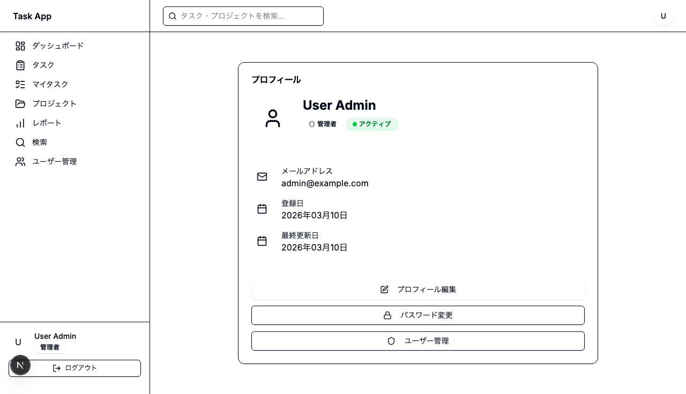
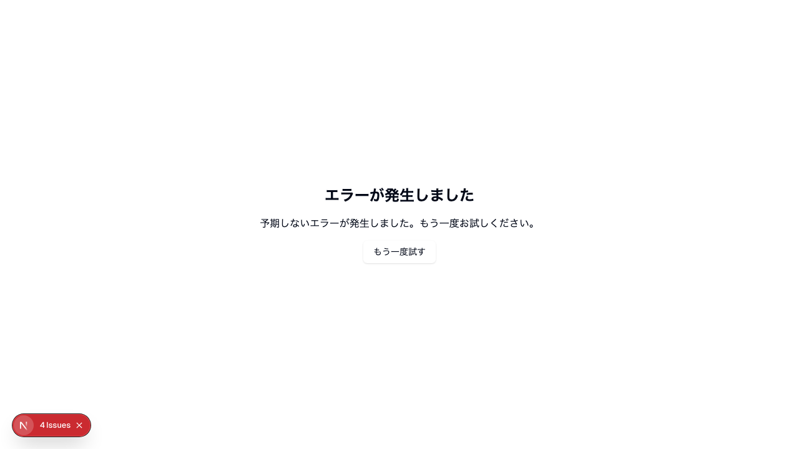

# Day 25: プロフィール編集を実装しよう

## 前回の振り返り

Day 24 では管理者専用のユーザー一覧ページを実装し、`api.auth.getCurrentUser` による権限チェックや Avatar・Badge を使ったユーザー情報の表示を学びました。管理者視点でのユーザー管理ができるようになったので、今日は自分自身のプロフィール表示とパスワード変更に取り組みます。

---

## 今日のゴール

プロフィール表示ページ・プロフィール編集ページ・パスワード変更ページの3画面を実装します。自分の情報を確認・編集し、パスワードを安全に変更できるようにします。

スクリーンショット: プロフィールページ全体の表示を確認してください。



## なぜこれを作るのか？

名前やメールは後から変わりますし、パスワードは定期的に変えたい場面があります。自分の情報を自分で確認・更新できる画面がないと、そのたびに管理者へ頼むことになってしまいます。

> **例え話**: プロフィールページは
> 「SNSのマイページ」です。
> 自分の名前やアイコンを確認（表示）し、
> 設定画面で情報を更新（編集）できます。
> パスワード変更は、銀行のATMで
> 暗証番号を変えるイメージです。

### プロフィール関連ページの構造

```mermaid
flowchart TD
    A[/profile] --> B[プロフィール表示]
    B --> C[プロフィール編集ボタン]
    B --> D[パスワード変更ボタン]
    B --> E[ユーザー管理ボタン]
    C --> F[/profile/edit]
    D --> G[/profile/change-password]
    E --> H[/user]
    G --> I[バリデーション]
    I -->|成功| J[toast.success]
    I -->|失敗| K[toast.error]
    J --> A

    style A fill:#e3f2fd
    style G fill:#fff3e0
    style J fill:#e8f5e9
    style K fill:#ffebee
```

### やること / やらないこと

| やること | やらないこと |
|---------|-------------|
| プロフィール表示 | アバター画像のアップロード |
| プロフィール編集（名前・メール・アバターURL） | 二段階認証の設定 |
| パスワード変更フォーム | alert() の使用 |
| バリデーション実装 | |
| toast でフィードバック | |

## 始める前の前提

- ログイン済みユーザーで `/profile` を開ける
- Day 24 のユーザー管理で、本人と管理者の違いを確認済み
- パスワード変更を試すため、練習用アカウントの現在のパスワードが分かっている
- 今日はプロフィール表示、プロフィール編集、パスワード変更の3画面を順番に確認する

### 新しく学ぶ概念

| 概念 | 読み方 | 役割 | 例え |
|------|--------|------|------|
| PasswordInput | パスワードインプット | パスワード入力の再利用コンポーネント | 目のアイコンで表示切替できる入力欄 |
| changePassword | — | パスワード変更API | 暗証番号の変更 |
| updateProfile | — | プロフィール更新API | 名前やメールの編集を保存 |
| toast | トースト | 通知メッセージ（復習） | ポップアップ通知 |
| useForm + zod（復習） | — | フォーム管理とバリデーション（Day 14 参照） | 記入用紙のルール自動チェック |
| refine | リファイン | zod のカスタムバリデーション | 複数フィールドを横断して検証するルール |

> **今日のゴールライン**: 3画面あって量は多いけど、14ステップに分かれてて1つ3-5分。プロフィール表示 → 編集 → パスワード変更を順番に追いかけるだけで完成します。全部一気に理解しようとしなくてよい。

## 実装ステップ一覧

| ステップ | 作業内容 | 所要時間 |
|---------|---------|---------|
| Step 1 | プロフィールページの概要 | 3分 |
| Step 2 | ユーザーデータの取得 | 3分 |
| Step 3 | プロフィール情報の表示 | 5分 |
| Step 4 | ナビゲーションボタン | 5分 |
| Step 5 | パスワード変更ページの概要 | 3分 |
| Step 6 | パスワード変更フォームのインポートとスキーマ | 5分 |
| Step 7 | パスワード変更フォームの入力欄 | 5分 |
| Step 8 | パスワード変更の送信とエラー処理 | 5分 |
| Step 9 | パスワード変更の動作確認 | 3分 |
| Step 10 | 編集ページの設計を理解 | 3分 |
| Step 11 | 編集ページのインポートとスキーマ | 5分 |
| Step 12 | 編集ページのデータ取得と初期化 | 5分 |
| Step 13 | 編集フォームの入力欄 | 5分 |
| Step 14 | 編集の動作確認 | 3分 |

**合計時間**: 約58分

---

### Step 1: プロフィールページの概要（3分）

**ゴール**: プロフィールページに
表示する情報を理解します。

#### ディレクトリ構造

```
src/app/profile/
├── page.tsx            （プロフィール表示）
├── edit/
│   └── page.tsx        （プロフィール編集）
└── change-password/
    └── page.tsx        （パスワード変更）
```

```bash
# filepath: ターミナル
# プロフィールページの構成を確認
ls src/app/profile/
```

**確認ポイント**:
- `ls` の結果に `page.tsx`、`edit/`、`change-password/` が表示された

#### 表示する情報一覧

| 項目 | プロパティ | 表示形式 |
|------|-----------|---------|
| アバター | avatar | 画像 or 頭文字 |
| 名前 | name | テキスト |
| ロール | role | Badge |
| ステータス | isActive | Badge |
| メール | email | テキスト |
| 登録日 | createdAt | yyyy年MM月dd日 |
| 更新日 | updatedAt | yyyy年MM月dd日 |

#### ページ内のボタン

| ボタン | 遷移先 | 条件 |
|-------|--------|------|
| プロフィール編集 | /profile/edit | 全ユーザー |
| パスワード変更 | /profile/change-password | 全ユーザー |
| ユーザー管理 | /user | ADMIN のみ |

> `api.auth.getCurrentUser` で
> 自分の情報を取得します。
> useSession ではなく tRPC のAPIを
> 使うのがこのアプリの設計です。

---

### Step 2: ユーザーデータの取得（3分）

**ゴール**: getCurrentUser APIで
ログイン中のユーザー情報を取得します。

**実装**:

```typescript
// filepath: src/app/profile/page.tsx
'use client';

import { format } from 'date-fns';
import { ja } from 'date-fns/locale';
import {
  Calendar, Edit, Lock, Mail,
  Shield, User,
} from 'lucide-react';
import { useRouter }
  from 'next/navigation';
import { useEffect } from 'react';
import { AppLayout }
  from '@/component/layout/app-layout';
import {
  Avatar, AvatarFallback, AvatarImage,
} from '@/component/ui/avatar';
```

残りのコンポーネントをインポートします。

```typescript
// filepath: src/app/profile/page.tsx
// UI コンポーネントと定数のインポート
import { Button }
  from '@/component/ui/button';
import {
  Card, CardContent,
  CardHeader, CardTitle,
} from '@/component/ui/card';
import { PageLoadingSpinner }
  from '@/component/ui/loading-spinner';
import { Separator }
  from '@/component/ui/separator';
import {
  ActiveStatusBadge, UserRoleBadge,
} from '@/component/ui/user-badges';
import { USER_ROLE }
  from '@/lib/constant/roles';
import { api } from '@/trpc/react';
```

> `UserRoleBadge` と `ActiveStatusBadge` は
> 再利用可能なバッジコンポーネントです。
> 定数 `USER_ROLE` を使うと、文字列リテラルの
> タイポを防げます。

```typescript
// filepath: src/app/profile/page.tsx
// データ取得とリダイレクト
export default function ProfilePage() {
  const router = useRouter();
  const {
    data: currentUser,
    isLoading,
  } = api.auth.getCurrentUser.useQuery();

  useEffect(() => {
    if (!isLoading && !currentUser) {
      router.push('/login');
    }
  }, [currentUser, isLoading, router]);
```

ローディング中は共通スピナーを表示します。

```typescript
// filepath: src/app/profile/page.tsx
  // PageLoadingSpinner で統一的に表示
  if (isLoading) {
    return <PageLoadingSpinner />;
  }
```

> `PageLoadingSpinner` は
> `@/component/ui/loading-spinner` から
> インポートする共通コンポーネントです。
> 各ページのローディング表示を統一します。

```typescript
// filepath: src/app/profile/page.tsx
// 未ログインチェック
  if (!currentUser) {
    return null;
  }
```

> `useEffect` でローディング完了後に
> `currentUser` が null だったら
> ログインページへリダイレクトします。
> ローディング中は `return null` にせず、
> スピナーを表示するようにします。

**確認ポイント**:
- currentUser にデータが入る
- 未ログインでリダイレクトされる

---

### Step 3: プロフィール情報の表示（5分）

**ゴール**: アバター、名前、バッジ、
詳細情報をCard内に表示します。

Step 2 で書いた `if (!currentUser)` の後に
`return` 文を書きます。
全体は `AppLayout > div > Card` の構造です。

**実装**:

まず `return` 文とページの骨格です。

```typescript
// filepath: src/app/profile/page.tsx
// ページ全体のreturn文
return (
  <AppLayout>
    <div className="container mx-auto
      max-w-2xl space-y-6 py-8">
      <Card>
        <CardHeader>
          <CardTitle>
            プロフィール
          </CardTitle>
        </CardHeader>
        <CardContent
          className="space-y-6">
          {/* 以降のコードをここに追加 */}
        </CardContent>
      </Card>
    </div>
  </AppLayout>
);
```

**確認ポイント**:
- return 文の骨格を書いた

上の `CardContent` の中に、以下のアバター・
名前ブロックを配置します。
`<div className="flex gap-4">` で
横並びにするのがポイントです。

```typescript
// filepath: src/app/profile/page.tsx
// アバターと名前の表示（flex gap-4 で横並び）
<div className="flex gap-4">
  <Avatar className="w-20 h-20
    rounded-lg">
    {currentUser.avatar && (
      <AvatarImage
        src={currentUser.avatar}
        className="object-cover" />
    )}
    <AvatarFallback
      className="rounded-lg
        bg-primary/10">
      <User className="w-10 h-10
        text-primary" />
    </AvatarFallback>
  </Avatar>
```

> ここで `<div className="flex gap-4">` はまだ閉じていません。次のコードブロックで `</div>` を追加して閉じます。

**確認ポイント**:
- `<div className="flex gap-4">` で囲んでいる
- `avatar ?? ''` で null 安全にしている

```typescript
// filepath: src/app/profile/page.tsx
// 名前とバッジ（flex gap-4 の右側）
  <div className="flex-1">
    <h1 className="text-2xl font-bold">
      {currentUser.name}
    </h1>
    <div className="flex gap-2 mt-2">
      {currentUser.role
        === USER_ROLE.ADMIN && (
        <UserRoleBadge
          role={currentUser.role} />
      )}
      <ActiveStatusBadge
        isActive={currentUser.isActive} />
    </div>
  </div>
</div>
```

> `UserRoleBadge` は管理者のみ表示します。
> `USER_ROLE.ADMIN` と比較して条件付き
> レンダリングします。

**確認ポイント**:
- ロールバッジが表示される
- ステータスバッジが表示される
- `</div>` で `flex gap-4` を閉じている

```typescript
// filepath: src/app/profile/page.tsx
// メールアドレスの表示
<Separator />
<div className="space-y-4">
  <div className="flex
    items-start gap-4">
    <div className="flex items-center
      justify-center w-10 h-10
      rounded-lg bg-primary/10">
      <Mail className="w-5 h-5
        text-primary" />
    </div>
    <div className="flex-1">
      <p className="text-sm font-medium
        text-muted-foreground">
        メールアドレス
      </p>
      <p className="text-base">
        {currentUser.email}
      </p>
    </div>
  </div>
</div>
```

**確認ポイント**: ブラウザでプロフィールページを開き、メールアドレスが表示されていることを確認しましょう。

```typescript
// filepath: src/app/profile/page.tsx
// 登録日の表示
<div className="flex items-start gap-4">
  <div className="flex items-center
    justify-center w-10 h-10
    rounded-lg bg-primary/10">
    <Calendar className="w-5 h-5
      text-primary" />
  </div>
  <div className="flex-1">
    <p className="text-sm font-medium
      text-muted-foreground">登録日</p>
    <p className="text-base">
      {currentUser.createdAt
        ? format(
            new Date(currentUser.createdAt),
            'yyyy年MM月dd日',
            { locale: ja })
        : '-'}
    </p>
  </div>
</div>
```

**確認ポイント**: 登録日が `yyyy年MM月dd日` 形式で正しく表示されていることを確認しましょう。

```typescript
// filepath: src/app/profile/page.tsx
// 最終更新日の表示
<div className="flex items-start gap-4">
  <div className="flex items-center
    justify-center w-10 h-10
    rounded-lg bg-primary/10">
    <Calendar className="w-5 h-5
      text-primary" />
  </div>
  <div className="flex-1">
    <p className="text-sm font-medium
      text-muted-foreground">
      最終更新日
    </p>
    <p className="text-base">
      {currentUser.updatedAt
        ? format(
            new Date(currentUser.updatedAt),
            'yyyy年MM月dd日',
            { locale: ja })
        : '-'}
    </p>
  </div>
</div>
```

**確認ポイント**: 最終更新日が `yyyy年MM月dd日` 形式で正しく表示されていることを確認しましょう。

> `Separator` は区切り線を表示する
> shadcn/ui のコンポーネントです。
> セクションを視覚的に分離します。

**確認ポイント**:
- アバターと名前が表示される
- バッジが正しく色分けされる
- メール・登録日・最終更新日が表示される

スクリーンショット: プロフィール情報表示の表示を確認してください。


---

### Step 4: ナビゲーションボタン（5分）

**ゴール**: 編集・パスワード変更・
ユーザー管理へのボタンを配置します。

**実装**:

```typescript
// filepath: src/app/profile/page.tsx
// 編集・パスワード変更ボタン
<Separator />
<div className="flex flex-col gap-3">
  <Button className="w-full"
    onClick={() =>
      router.push('/profile/edit')}>
    <Edit className="w-4 h-4 mr-2" />
    プロフィール編集
  </Button>
  <Button variant="outline"
    className="w-full"
    onClick={() => router.push(
      '/profile/change-password')}>
    <Lock className="w-4 h-4 mr-2" />
    パスワード変更
  </Button>
```

```typescript
// filepath: src/app/profile/page.tsx
// 管理者用ユーザー管理ボタン
  {currentUser.role === USER_ROLE.ADMIN && (
    <Button variant="outline"
      className="w-full"
      onClick={() =>
        router.push('/user')}>
      <Shield
        className="w-4 h-4 mr-2" />
      ユーザー管理
    </Button>
  )}
</div>
```

**確認ポイント**:
- 3つのボタンが縦に並ぶ
- 管理者にだけユーザー管理ボタンが出る
- ファイルを保存してエラーが出ていない

スクリーンショット: ナビゲーションボタンの表示を確認してください。


#### ボタンのスタイル使い分け

| ボタン | variant | 理由 |
|-------|---------|------|
| プロフィール編集 | default（塗り） | メインアクション |
| パスワード変更 | outline（枠線） | サブアクション |
| ユーザー管理 | outline（枠線） | サブアクション |

> `currentUser.role === USER_ROLE.ADMIN` で
> 条件付きレンダリングをしています。
> 管理者にだけ「ユーザー管理」ボタンが
> 表示されます。

---

### Step 5: パスワード変更ページの概要（3分）

**ゴール**: パスワード変更ページの
構成とAPIを理解します。

```bash
# filepath: ターミナル
# パスワード変更ページの構成を確認
ls src/app/profile/change-password/
```

**確認ポイント**:
- `ls` で `page.tsx` が存在する
- 入力項目が3つあることを確認した

#### パスワード変更の入力項目

| 項目 | name属性 | バリデーション |
|------|---------|--------------|
| 現在のパスワード | currentPassword | 必須（min(1)） |
| 新しいパスワード | newPassword | 8文字以上 + 大文字 + 小文字 + 数字 + 特殊文字 |
| 確認用パスワード | confirmPassword | newPassword と一致（refine） |

#### 使用するAPI

| API | メソッド | 用途 |
|-----|---------|------|
| api.user.changePassword | useMutation | パスワード変更 |

> `changePassword` はサーバー側で
> 現在のパスワードの照合と新パスワードの
> ハッシュ化を行います。
>
> サーバーの `changePasswordSchema` では
> `newPassword` に次のルールが定義されています。
> `min(8)` に加えて、`[A-Z]`、`[a-z]`、
> `[0-9]`、`[^A-Za-z0-9]` をそれぞれ
> 1文字以上含む必要があります。

---

### Step 6: パスワード変更フォームのインポートとスキーマ（5分）

**ゴール**: useForm + zod でフォームの
状態管理とバリデーションを定義します。

**実装**:

```typescript
// filepath: src/app/profile/change-password/page.tsx
'use client';

// react-hook-form + zod
import { zodResolver }
  from '@hookform/resolvers/zod';
import { AlertCircle } from 'lucide-react';
import { useRouter }
  from 'next/navigation';
import { useForm } from 'react-hook-form';
import toast from 'react-hot-toast';
import { z } from 'zod';
import { AppLayout }
  from '@/component/layout/app-layout';
import {
  Alert, AlertDescription,
  AlertTitle,
} from '@/component/ui/alert';
```

**確認ポイント**:
- `useForm`, `zodResolver`, `z` がインポートされている

フォーム用のコンポーネントをインポートします。

```typescript
// filepath: src/app/profile/change-password/page.tsx
// フォーム部品と PasswordInput
import { Button }
  from '@/component/ui/button';
import {
  Card, CardContent,
  CardHeader, CardTitle,
} from '@/component/ui/card';
import { Label }
  from '@/component/ui/label';
import { PasswordInput }
  from '@/component/ui/password-input';
import { api } from '@/trpc/react';
```

> `PasswordInput` はパスワードの表示/非表示
> トグル（Eye/EyeOff）を内蔵したコンポーネントです。
> ページ側で `showPassword` を管理する必要がありません。

zod スキーマでバリデーションを定義します。
`refine` で2つのフィールドの一致をチェックします。

#### refine とは？

`refine` は zod の「カスタムバリデーション」機能です。
`min` や `email` のような単一フィールドのチェックでは足りないとき、複数フィールドを横断して検証するルールを追加できます。

| 通常のバリデーション | refine |
|---|---|
| 1つのフィールドだけチェック | 複数フィールドを比較してチェック |
| `z.string().regex(/[A-Z]/)` | `.refine((data) => data.a === data.b)` |
| 「大文字を含むか？」 | 「新パスワードと確認が一致するか？」 |

`path` オプションでエラーを表示するフィールドを
指定できます。

```typescript
// filepath: src/app/profile/change-password/page.tsx
// パスワード変更用スキーマ: currentPassword
const changePasswordCurrentSchema =
  z.object({
  currentPassword: z.string()
    .min(1, '現在のパスワードを'
      + '入力してください'),
});
```

```typescript
// filepath: src/app/profile/change-password/page.tsx
// newPassword のルールを追加（前半）
const changePasswordPasswordSchema = changePasswordCurrentSchema.extend({
  newPassword: z.string().min(
    8,
    '新しいパスワードは' + '8文字以上で入力してください',
  )
    .regex(
      /[A-Z]/,
      'パスワードには大文字を'
        + '含める必要があります',
    )
    .regex(
      /[a-z]/,
      'パスワードには小文字を'
        + '含める必要があります',
    )
```

```typescript
// filepath: src/app/profile/change-password/page.tsx
// 同じ newPassword ルールの続き
    .regex(
      /[0-9]/,
      'パスワードには数字を'
        + '含める必要があります',
    )
    .regex(
      /[^A-Za-z0-9]/,
      'パスワードには特殊文字を'
        + '含める必要があります',
    ),
});
```

```typescript
// filepath: src/app/profile/change-password/page.tsx
// confirmPassword を追加してベーススキーマにする
const changePasswordBaseSchema =
  changePasswordPasswordSchema.extend({
  confirmPassword: z.string()
    .min(1, '確認用パスワードを'
      + '入力してください'),
});
```

```typescript
// filepath: src/app/profile/change-password/page.tsx
// confirmPassword の一致チェックを追加
const changePasswordSchema =
  changePasswordBaseSchema.refine(
  (data) => data.newPassword
    === data.confirmPassword,
  {
    message: 'パスワードが一致しません',
    path: ['confirmPassword'],
  },
);
type ChangePasswordFormValues =
  z.infer<typeof changePasswordSchema>;
```

**確認ポイント**:
- スキーマ名が `changePasswordSchema` である
- 型名が `ChangePasswordFormValues` である
- `newPassword` に 4つの `regex()` を追加している
- `refine` で一致チェックしている
- `path: ['confirmPassword']` でエラー表示先を指定している

#### サーバーと合わせるパスワード要件

`src/server/api/routers/user.ts` の
`changePasswordSchema` では、`newPassword` に
次のルールが設定されています。

| ルール | 正規表現 / zod | サーバーが返すメッセージ |
|------|----------------|-------------------------|
| 8文字以上 | `.min(8)` | `新しいパスワードは8文字以上で入力してください` |
| 大文字を1文字以上含む | `.regex(/[A-Z]/)` | `パスワードには大文字を含める必要があります` |
| 小文字を1文字以上含む | `.regex(/[a-z]/)` | `パスワードには小文字を含める必要があります` |
| 数字を1文字以上含む | `.regex(/[0-9]/)` | `パスワードには数字を含める必要があります` |
| 特殊文字を1文字以上含む | `.regex(/[^A-Za-z0-9]/)` | `パスワードには特殊文字を含める必要があります` |

> 現在のパスワードが違う場合は、
> バリデーション通過後にサーバーから
> `現在のパスワードが正しくありません`
> が返ります。

#### パスワード例

| 例 | 判定 | 理由 |
|---|---|---|
| `Abc123!@` | OK | 8文字以上で大文字・小文字・数字・特殊文字をすべて含む |
| `TaskApp2026#` | OK | 文字種の条件をすべて満たす |
| `password1!` | NG | 大文字がない |
| `PASSWORD1!` | NG | 小文字がない |
| `Password!` | NG | 数字がない |
| `Password1` | NG | 特殊文字がない |
| `Ab1!xyz` | NG | 8文字未満 |

```typescript
// filepath: src/app/profile/change-password/page.tsx
// useForm でフォームを初期化
export default function
  ChangePasswordPage() {
  const router = useRouter();
  const form =
    useForm<ChangePasswordFormValues>({
      resolver:
        zodResolver(changePasswordSchema),
      defaultValues: {
        currentPassword: '',
        newPassword: '',
        confirmPassword: '',
      },
    });
```

**確認ポイント**:
- `zodResolver(changePasswordSchema)` を設定している
- `defaultValues` で全フィールドを空文字で初期化している

```typescript
// filepath: src/app/profile/change-password/page.tsx
// useMutation でAPI呼び出し
  const changePassword =
    api.user.changePassword.useMutation({
      onSuccess: () => {
        toast.success(
          'パスワードを変更しました'
        );
        router.push('/profile');
      },
      onError: (error) => {
        toast.error(
          error.message
          ?? 'パスワードの変更に失敗しました'
        );
      },
    });
```

**確認ポイント**:
- `onSuccess` で toast 表示と画面遷移をしている
- `onError` で `??` を使ってフォールバックメッセージを設定している

---

### Step 7: パスワード変更フォームの入力欄（5分）

**ゴール**: フォームの送信ハンドラーと
3つの入力フィールドを実装します。

**実装**:

```typescript
// filepath: src/app/profile/change-password/page.tsx
// 送信ハンドラー
  const handleSubmit =
    (values: ChangePasswordFormValues) => {
      changePassword.mutate({
        currentPassword:
          values.currentPassword,
        newPassword: values.newPassword,
      });
    };
```

> `form.handleSubmit(handleSubmit)` が zod
> スキーマでバリデーションを実行してから
> `handleSubmit` を呼びます。`confirmPassword` は
> 一致チェック用なのでAPIには送りません。

```typescript
// filepath: src/app/profile/change-password/page.tsx
// ページの外枠
  return (
    <AppLayout>
      <div className="container mx-auto
        max-w-md mt-8 mb-8">
        <Card>
          <CardHeader>
            <CardTitle>
              パスワード変更
            </CardTitle>
          </CardHeader>
          <CardContent>
            <form onSubmit={
              form.handleSubmit(
                handleSubmit)}
              className="space-y-6">
```

**確認ポイント**:
- `form.handleSubmit(handleSubmit)` でバリデーション後に送信している

`<form>` タグの中に、以下の入力フィールドを
順番に配置していきます。
`register` で各入力をフォームに登録します。

```typescript
// filepath: src/app/profile/change-password/page.tsx
// 現在のパスワード入力
<div className="space-y-2">
  <Label htmlFor="currentPassword">
    現在のパスワード
    <span className="text-destructive">
      *
    </span>
  </Label>
  <PasswordInput
    id="currentPassword"
    {...form.register(
      'currentPassword')}
    disabled={changePassword.isPending}
  />
  {form.formState.errors
    .currentPassword && (
    <p className="text-sm
      text-destructive">
      {form.formState.errors
        .currentPassword.message}
    </p>
  )}
</div>
```

**確認ポイント**:
- `register` でフォームに登録している
- エラーメッセージが自動表示される

```typescript
// filepath: src/app/profile/change-password/page.tsx
// 新しいパスワード入力（Label + PasswordInput）
<div className="space-y-2">
  <Label htmlFor="newPassword">
    新しいパスワード
    <span className="text-destructive">
      *
    </span>
  </Label>
  <PasswordInput
    id="newPassword"
    {...form.register('newPassword')}
    disabled={changePassword.isPending}
  />
  <p className="text-sm
    text-muted-foreground">
    8文字以上で、大文字・小文字・数字・
    特殊文字をそれぞれ1文字以上含めてください
  </p>
```

```typescript
// filepath: src/app/profile/change-password/page.tsx
// 新しいパスワードのエラー表示
  {form.formState.errors
    .newPassword && (
    <p className="text-sm
      text-destructive">
      {form.formState.errors
        .newPassword.message}
    </p>
  )}
</div>
```

**確認ポイント**:
- ヒントテキストに文字種の条件まで表示される
- エラーメッセージとヒントが別々に表示される

```typescript
// filepath: src/app/profile/change-password/page.tsx
// 確認用パスワード入力
<div className="space-y-2">
  <Label htmlFor="confirmPassword">
    新しいパスワード（確認）
    <span className="text-destructive">
      *
    </span>
  </Label>
  <PasswordInput
    id="confirmPassword"
    {...form.register(
      'confirmPassword')}
    disabled={changePassword.isPending}
  />
  {form.formState.errors
    .confirmPassword && (
    <p className="text-sm
      text-destructive">
      {form.formState.errors
        .confirmPassword.message}
    </p>
  )}
</div>
```

> `refine` でパスワード一致チェックを
> 定義したので、`formState.errors` に
> 自動でエラーが入ります。手動の
> `if (a !== b)` チェックが不要になりました。

**確認ポイント**:
- フォームに入力できる
- 目のアイコンでパスワードの表示/非表示が切り替わる
- 不一致の時に zod がエラーを表示する

スクリーンショット: パスワード変更フォームの表示を確認してください。



---

### Step 8: パスワード変更の送信とエラー処理（5分）

**ゴール**: APIエラーの表示と
送信・キャンセルボタンを実装します。

**実装**:

```typescript
// filepath: src/app/profile/change-password/page.tsx
// APIエラーのAlert表示
{changePassword.error && (
  <Alert variant="destructive">
    <AlertCircle className="h-4 w-4" />
    <AlertTitle>エラー</AlertTitle>
    <AlertDescription>
      {changePassword.error.message}
    </AlertDescription>
  </Alert>
)}
```

**確認ポイント**:
- API側のエラー（現在のパスワード不正など）が Alert で表示される

```typescript
// filepath: src/app/profile/change-password/page.tsx
// 送信ボタンとキャンセルボタン
<div className="flex gap-2 pt-2">
  <Button type="submit"
    className="w-full"
    disabled={
      changePassword.isPending}>
    {changePassword.isPending
      ? '変更中...' : '変更'}
  </Button>
  <Button type="button"
    variant="outline"
    className="w-full"
    onClick={() =>
      router.push('/profile')}
    disabled={
      changePassword.isPending}>
    キャンセル
  </Button>
</div>
```

**確認ポイント**:
- 送信中はボタンテキストが「変更中...」になる
- `isPending` 中はボタンが無効化される
- キャンセルで `/profile` に戻る

閉じタグを忘れずに書きます。

```typescript
// filepath: src/app/profile/change-password/page.tsx
// 閉じタグ
            </form>
          </CardContent>
        </Card>
      </div>
    </AppLayout>
  );
}
```

**確認ポイント**:
- ファイルを保存した
- `npm run dev` でエラーが出ていない

#### バリデーションルール（zodスキーマで定義済み）

| チェック | zod メソッド | メッセージ |
|---------|-------------|-----------|
| 必須チェック | `z.string().min(1)` | 現在のパスワードを入力してください |
| 文字数 | `z.string().min(8)` | 新しいパスワードは8文字以上で入力してください |
| 大文字 | `.regex(/[A-Z]/)` | パスワードには大文字を含める必要があります |
| 小文字 | `.regex(/[a-z]/)` | パスワードには小文字を含める必要があります |
| 数字 | `.regex(/[0-9]/)` | パスワードには数字を含める必要があります |
| 特殊文字 | `.regex(/[^A-Za-z0-9]/)` | パスワードには特殊文字を含める必要があります |
| 一致確認 | `.refine()` | パスワードが一致しません |

#### toast の使い分け

| メソッド | 用途 | 表示色 |
|---------|------|--------|
| toast.success | 成功メッセージ | 緑 |
| toast.error | エラーメッセージ | 赤 |

> `toast` は画面の隅に一時的に
> 表示される通知メッセージです。
> `alert()` と違い、ユーザーの操作を
> ブロックしません。

---

### Step 9: パスワード変更の動作確認（3分）

**ゴール**: プロフィールページと
パスワード変更の全体を確認します。

```bash
# filepath: ターミナル
# 開発サーバーを起動して動作確認
PORT=3001 npm run dev
```

1. `/profile` にアクセス
2. アバターと名前が表示される
3. メールアドレスと日付が表示される
4. 「プロフィール編集」ボタンで遷移
5. 「パスワード変更」ボタンで遷移
6. パスワード変更フォームに入力
7. `Password1` を入力して「特殊文字」が不足した時のエラーを確認
8. `password1!` を入力して「大文字」が不足した時のエラーを確認
9. `Abc123!@` のような条件を満たすパスワードで変更成功を確認

**確認ポイント**:
- プロフィール情報が正しく表示される
- パスワード変更のフローが完了する
- 成功時に toast が表示される

スクリーンショット: パスワード変更成功の表示を確認してください。


> ここまでで、プロフィール表示とパスワード変更の2ページが完成しました！残りはプロフィール編集ページだけです。あと少しで今日のゴールに到達します。

---

### Step 10: 編集ページの設計を理解しよう（3分）

**ゴール**: プロフィール編集ページの
データフローと使用コンポーネントを理解します。

パスワード変更ページより入力項目が多いので、
まず全体像を把握してから実装に入りましょう。

```bash
# filepath: ターミナル
# 編集ページのファイルを確認
ls src/app/profile/edit/
```

**確認ポイント**:
- `page.tsx` が存在することを確認した

#### 編集ページのデータフロー

```mermaid
flowchart LR
    A[getCurrentUser] --> B[useEffect]
    B --> C[form.reset で初期値セット]
    C --> D[フォーム入力 register]
    D --> E[form.handleSubmit]
    E --> F[updateProfile.mutate]
    F --> G[toast で結果通知]
    G --> H[/profile に戻る]
```

#### フォーム項目一覧

| フィールド | 必須 | 説明 |
|-----------|------|------|
| 名前 | ✅ | 表示名 |
| メールアドレス | ✅ | ログイン用。重複チェックあり |
| アバターURL | - | 画像URL（任意） |

#### 使用する shadcn/ui コンポーネント

| コンポーネント | 用途 |
|--------------|------|
| Card | フォーム全体を囲む枠 |
| Input | テキスト入力欄 |
| Label | 入力欄のラベル |
| Avatar | アバター画像のプレビュー |
| Button | 送信・キャンセルボタン |
| Alert | エラーメッセージの表示 |
| PageLoadingSpinner | ローディング表示 |

#### useForm + useEffect の役割

| 処理 | タイミング | 目的 |
|------|-----------|------|
| getCurrentUser でデータ取得 | ページ表示時 | サーバーから最新情報を取得 |
| useEffect で `form.reset()` | データ取得完了時 | フォームに既存値をセット |
| `register` で入力を管理 | 入力変更時 | ユーザーの入力を反映 |
| `form.handleSubmit` で送信 | フォーム送信時 | zod バリデーション後に送信 |

> `useEffect` + `form.reset()` で
> サーバーデータをフォームにセットします。
> Day 14 の `values` prop と同じく、
> データ到着時にフォームが自動で埋まります。

**確認ポイント**:
- 編集ページのデータフローを理解した
- useEffect + form.reset が初期値セットに使われることを理解した

---

### Step 11: 編集ページのインポートとスキーマ（5分）

**ゴール**: プロフィール編集ページの
インポートと zod スキーマを実装します。

**実装**:

まず、ファイルの先頭部分を書きます。

```typescript
// filepath: src/app/profile/edit/page.tsx
'use client';

import { zodResolver }
  from '@hookform/resolvers/zod';
import { AlertCircle }
  from 'lucide-react';
import { useRouter }
  from 'next/navigation';
import { useEffect } from 'react';
import { useForm } from 'react-hook-form';
import toast from 'react-hot-toast';
import { z } from 'zod';
import { AppLayout }
  from '@/component/layout/app-layout';
import {
  Alert, AlertDescription,
  AlertTitle,
} from '@/component/ui/alert';
```

**確認ポイント**:
- `useForm`, `zodResolver`, `z` がインポートされている

残りの UI コンポーネントをインポートします。

```typescript
// filepath: src/app/profile/edit/page.tsx
// UIコンポーネントのインポート
import {
  Avatar, AvatarFallback,
  AvatarImage,
} from '@/component/ui/avatar';
import { Button }
  from '@/component/ui/button';
import {
  Card, CardContent,
  CardHeader, CardTitle,
} from '@/component/ui/card';
import { Input }
  from '@/component/ui/input';
import { Label }
  from '@/component/ui/label';
import { PageLoadingSpinner }
  from '@/component/ui/loading-spinner';
import { api } from '@/trpc/react';
```

**確認ポイント**:
- `PageLoadingSpinner` のインポートパスが `@/component/ui/loading-spinner` である
- shadcn/ui のコンポーネントをインポートしている

プロフィール編集用の zod スキーマを定義します。

```typescript
// filepath: src/app/profile/edit/page.tsx
// プロフィール編集用の zodスキーマ
const profileEditSchema = z.object({
  name: z.string()
    .min(1, '名前を入力してください'),
  email: z.string()
    .email('有効なメールアドレスを'
      + '入力してください'),
  avatar: z.string()
    .url('有効なURLを入力してください')
    .or(z.literal('')),
});
type ProfileEditFormValues =
  z.infer<typeof profileEditSchema>;
```

**確認ポイント**:
- スキーマ名が `profileEditSchema` である
- 型名が `ProfileEditFormValues` である
- `email()` でメール形式を検証している
- `avatar` は `url()` にエラーメッセージ付きで、空文字も許可している

---

### Step 12: 編集ページのデータ取得と初期化（5分）

**ゴール**: useForm の初期化、API設定、
useEffect でのデータセットを実装します。

**実装**:

```typescript
// filepath: src/app/profile/edit/page.tsx
// useForm でフォームを初期化
export default function ProfileEditPage() {
  const router = useRouter();
  const form =
    useForm<ProfileEditFormValues>({
      resolver:
        zodResolver(profileEditSchema),
      defaultValues: {
        name: '',
        email: '',
        avatar: '',
      },
    });
```

**確認ポイント**:
- useForm に zodResolver を設定している
- defaultValues で空文字を設定している

データ取得と更新APIの設定です。

```typescript
// filepath: src/app/profile/edit/page.tsx
// データ取得と更新API
  const { data: currentUser, isLoading } =
    api.auth.getCurrentUser.useQuery();

  const updateProfile =
    api.user.updateProfile.useMutation({
      onSuccess: () => {
        toast.success(
          'プロフィールを更新しました'
        );
        router.push('/profile');
      },
      onError: (error) => {
        toast.error(
          error.message
          ?? 'プロフィールの更新に失敗しました'
        );
      },
    });
```

**確認ポイント**:
- useQuery でデータを取得している
- useMutation で更新APIを設定している
- `??` でフォールバックメッセージを設定している

サーバーデータでフォームを初期化します。

```typescript
// filepath: src/app/profile/edit/page.tsx
  // form.reset でサーバーデータをセット
  useEffect(() => {
    if (currentUser) {
      form.reset({
        name: currentUser.name ?? '',
        email: currentUser.email ?? '',
        avatar: currentUser.avatar ?? '',
      });
    }
  }, [currentUser, form]);
```

**確認ポイント**:
- `form.reset` でフォーム初期値をセットしている
- `??` で null/undefined を空文字に変換している

フォーム送信のハンドラーです。

```typescript
// filepath: src/app/profile/edit/page.tsx
  // zodバリデーション済みの値で送信
  const handleSubmit =
    (values: ProfileEditFormValues) => {
      updateProfile.mutate(values);
    };
```

**確認ポイント**:
- 関数名が `handleSubmit` である
- zod でバリデーション済みの値を受け取る

ローディング表示とJSXの開始部分です。

```typescript
// filepath: src/app/profile/edit/page.tsx
  // ローディング中の表示
  if (isLoading) {
    return <PageLoadingSpinner />;
  }

  return (
    <AppLayout>
      <div className="container mx-auto
        max-w-md mt-8 mb-8">
        <Card>
          <CardHeader>
            <CardTitle>
              プロフィール編集
            </CardTitle>
          </CardHeader>
          <CardContent>
```

**確認ポイント**:
- ローディング中は PageLoadingSpinner を表示している

---

### Step 13: 編集フォームの入力欄（5分）

**ゴール**: アバタープレビュー、名前、
メール、アバターURLの入力欄を実装します。

**実装**:

フォームとアバター表示の部分です。

```typescript
// filepath: src/app/profile/edit/page.tsx
// フォームとアバタープレビュー
            <form onSubmit={
              form.handleSubmit(
                handleSubmit)}
              className="space-y-6">
              <div className=
                "flex justify-center mb-6">
                <Avatar
                  className="w-24 h-24">
                  <AvatarImage
                    src={form.watch(
                      'avatar')} />
                  <AvatarFallback
                    className="text-2xl">
                    {form.watch('name')
                      ?.[0]?.toUpperCase()}
                  </AvatarFallback>
                </Avatar>
              </div>
```

**確認ポイント**:
- `form.watch` でリアルタイムにプレビューが更新される
- `form.handleSubmit(handleSubmit)` を設定している

名前の入力欄です。

```typescript
// filepath: src/app/profile/edit/page.tsx
// 名前の入力欄（Label + Input）
              <div className="space-y-2">
                <Label htmlFor="name">
                  名前
                  <span className="text-destructive">*</span>
                </Label>
                <Input
                  id="name"
                  {...form.register('name')}
                  disabled={updateProfile.isPending}
                />
                {form.formState.errors.name && (
                  <p className="text-sm text-destructive">
                    {form.formState.errors.name.message}
                  </p>
                )}
              </div>
```

**確認ポイント**:
- `register` でフォームに登録している
- zod のエラーが自動表示される

メールアドレスの入力欄です。

```typescript
// filepath: src/app/profile/edit/page.tsx
// メールアドレスの入力欄
              <div className="space-y-2">
                <Label htmlFor="email">
                  メールアドレス
                  <span className="text-destructive">*</span>
                </Label>
                <Input
                  id="email"
                  type="email"
                  {...form.register('email')}
                  disabled={updateProfile.isPending}
                />
                {form.formState.errors.email && (
                  <p className="text-sm text-destructive">
                    {form.formState.errors.email.message}
                  </p>
                )}
              </div>
```

**確認ポイント**:
- zod の `email()` でメール形式を検証している

アバターURLの入力欄です。

```typescript
// filepath: src/app/profile/edit/page.tsx
// アバターURLの入力欄
              <div className="space-y-2">
                <Label htmlFor="avatar">
                  アバターURL（任意）
                </Label>
                <Input
                  id="avatar"
                  type="url"
                  {...form.register(
                    'avatar')}
                  disabled={
                    updateProfile.isPending}
                  placeholder="https://example.com/avatar.png"
                />
                <p className="text-sm
                  text-muted-foreground">
                  画像のURLを入力してください
                </p>
              </div>
```

**確認ポイント**:
- アバターは任意なので空文字も許可されている
- placeholder が1行で正しく設定されている

エラー表示と送信ボタンの部分です。

```typescript
// filepath: src/app/profile/edit/page.tsx
// APIエラーの表示
              {updateProfile.error && (
                <Alert
                  variant="destructive">
                  <AlertCircle
                    className="h-4 w-4" />
                  <AlertTitle>
                    エラー
                  </AlertTitle>
                  <AlertDescription>
                    {updateProfile
                      .error.message}
                  </AlertDescription>
                </Alert>
              )}
```

**確認ポイント**:
- エラー時に Alert が表示される

```typescript
// filepath: src/app/profile/edit/page.tsx
// 送信・キャンセルボタン
              <div className=
                "flex gap-2 pt-2">
                <Button type="submit"
                  className="w-full"
                  disabled={
                    updateProfile.isPending}>
                  {updateProfile.isPending
                    ? '更新中...' : '更新'}
                </Button>
                <Button
                  type="button"
                  variant="outline"
                  className="w-full"
                  onClick={() =>
                    router.push('/profile')}
                  disabled={
                    updateProfile.isPending
                  }>
                  キャンセル
                </Button>
              </div>
```

**確認ポイント**:
- isPending 中はボタンが無効化される
- ボタンテキストが「更新中...」に切り替わる

最後に閉じタグです。

```typescript
// filepath: src/app/profile/edit/page.tsx
// 閉じタグ
            </form>
          </CardContent>
        </Card>
      </div>
    </AppLayout>
  );
}
```

**確認ポイント**:
- ファイルを保存した
- `npm run dev` でエラーが出ていない

---

### Step 14: 編集の動作確認（3分）

**ゴール**: プロフィール編集が
正しく動作することを確認します。

```bash
# filepath: ターミナル
# 開発サーバーを起動して動作確認
PORT=3001 npm run dev
```

1. `/profile` にアクセス
2. 「プロフィール編集」ボタンをクリック
3. `/profile/edit` に遷移する
4. 名前を変更して「更新」をクリック
5. toast で「プロフィールを更新しました」と表示される
6. `/profile` に戻り、変更が反映されている

スクリーンショット: プロフィール編集フォームの表示を確認してください。


#### エラーシナリオ

| エラー | 原因 | 対処法 |
|--------|------|--------|
| 名前が空で更新できない | zod の min(1) | 名前を入力する |
| メール重複エラー | 既に使われているメール | 別のアドレスを入力 |
| アバターが表示されない | URLが不正 | https:// で始まるURLを入力 |
| サーバーエラー | API通信失敗 | 開発サーバーの起動を確認 |

**確認ポイント**:
- 名前の変更が保存される
- toast でフィードバックが表示される
- 更新後に /profile に戻る


---

### Pro パターンで書こう — プロフィール表示のデータアクセスは Optional chaining でそろえる

ここまでで動くコードは書けた。でもプロの現場ではもう一段上の書き方をします。
なぜ上の書き方をするのか、**Before/After** で見比べてみよう。

#### Before（動くけど、プロは書かない）

```typescript
// filepath: src/app/profile/page.tsx
import { format } from 'date-fns';
import { ja } from 'date-fns/locale';

type CurrentUser = {
  name: string | null;
  email: string;
  avatar: string | null;
  createdAt: Date | string | null;
  updatedAt: Date | string | null;
} | null;

export function buildProfileViewModel(currentUser: CurrentUser) {
  let avatarUrl = '';
  if (currentUser) {
    if (currentUser.avatar) {
      avatarUrl = currentUser.avatar;
    }
  }

  let displayName = '未設定';
  if (currentUser) {
    if (currentUser.name) {
      displayName = currentUser.name;
```

**確認ポイント**: ここまで写経できました。次のブロックを続けて書きます。

```typescript
// filepath: 続き
    }
  }

  let initial = '?';
  if (currentUser) {
    if (currentUser.name) {
      if (currentUser.name[0]) {
        initial = currentUser.name[0].toUpperCase();
      }
    }
  }

  let createdAtLabel = '-';
  if (currentUser) {
    if (currentUser.createdAt) {
      createdAtLabel = format(new Date(currentUser.createdAt), 'yyyy年MM月dd日', {
        locale: ja,
      });
    }
  }

  let updatedAtLabel = '-';
  if (currentUser) {
    if (currentUser.updatedAt) {
```

**確認ポイント**: ここまで写経できました。次のブロックを続けて書きます。

```typescript
// filepath: 続き
      updatedAtLabel = format(new Date(currentUser.updatedAt), 'yyyy年MM月dd日', {
        locale: ja,
      });
    }
  }

  return {
    avatarUrl,
    displayName,
    email: currentUser ? currentUser.email : '',
    initial,
    createdAtLabel,
    updatedAtLabel,
  };
}
```

**このコードの問題点**:

- `currentUser` の null チェックが何度も出てきて、プロフィールで何を表示したいのかが埋もれる
- `name[0]` のような細かいアクセスほどチェック漏れが起きやすい
- 表示項目が増えるたびに `let` と `if` が増え、フォーム初期化でも同じ形を繰り返しやすい

#### After（プロが書くコード）

```typescript
// filepath: src/app/profile/page.tsx
import { format } from 'date-fns';
import { ja } from 'date-fns/locale';

type CurrentUser = {
  name: string | null;
  email: string;
  avatar: string | null;
  createdAt: Date | string | null;
  updatedAt: Date | string | null;
} | null;

function formatProfileDate(value: Date | string | null | undefined) {
  return value
    ? format(new Date(value), 'yyyy年MM月dd日', { locale: ja })
    : '-';
}

export function buildProfileViewModel(currentUser: CurrentUser) {
  return {
    avatarUrl: currentUser?.avatar ?? '',
    displayName: currentUser?.name ?? '未設定',
    email: currentUser?.email ?? '',
    initial: currentUser?.name?.[0]?.toUpperCase() ?? '?',
```

**確認ポイント**: ここまで写経できました。次のブロックを続けて書きます。

```typescript
// filepath: 続き
    createdAtLabel: formatProfileDate(currentUser?.createdAt),
    updatedAtLabel: formatProfileDate(currentUser?.updatedAt),
  };
}
```

**このコードの強み**:

- `?.` で「存在するときだけ進む」ことを1行で表せる
- `??` で null / undefined のときの表示を近くに置けるので、代替値が読みやすい
- 日付整形を helper に寄せることで、登録日と更新日のルールを1か所でそろえられる

#### 覚えておきたいエッセンス

深い null チェックを何段も書くより、
`?.` と `??` で「安全なアクセス」と「代替表示」を近くに置く。

## 今日のまとめ

- [ ] api.auth.getCurrentUser でデータを取得した
- [ ] プロフィール情報をCard内に表示した
- [ ] パスワード変更フォームを実装した
- [ ] refine でパスワード一致チェックを実装した
- [ ] プロフィール編集フォームを実装した
- [ ] updateProfile で名前・メール・アバターを更新した

## つまずきポイント

| エラー / 問題 | 原因 | 解決方法 |
|--------------|------|---------|
| プロフィールが空 | currentUser が null | ローディングチェック追加 |
| 日付がInvalid Date | Date変換の引数不正 | new Date() で変換 |
| toast が表示されない | react-hot-toast 未設定 | Toaster コンポーネント確認 |
| 変更後に戻らない | router.push 忘れ | onSuccess 内に追加 |
| 編集が反映されない | useEffectの依存配列 | [currentUser, form] を指定 |
| メール重複エラー | 既に使われているメール | 別のアドレスを入力 |
| アバターが表示されない | URLが不正 | https:// で始まるURLを入力 |

## 今日学んだ用語

| 用語 | 意味 |
|------|------|
| changePassword | パスワード変更API |
| toast.success | 成功通知を表示する関数 |
| Separator | セクション間の区切り線 |
| isPending | API通信中かどうかのフラグ |
| updateProfile | プロフィール更新API |
| refine | zodのカスタムバリデーション（複数フィールド横断チェック） |

## 次回予告

Day 26 では、エラーページ（error.tsx）の
仕組みを確認し、意図的にバグを仕込んで
DevTools で自力修正するデバッグ演習を行います。
