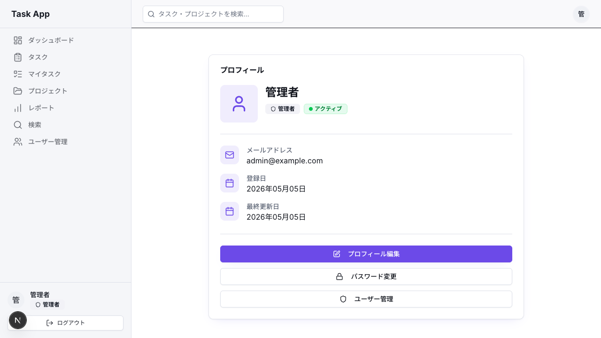
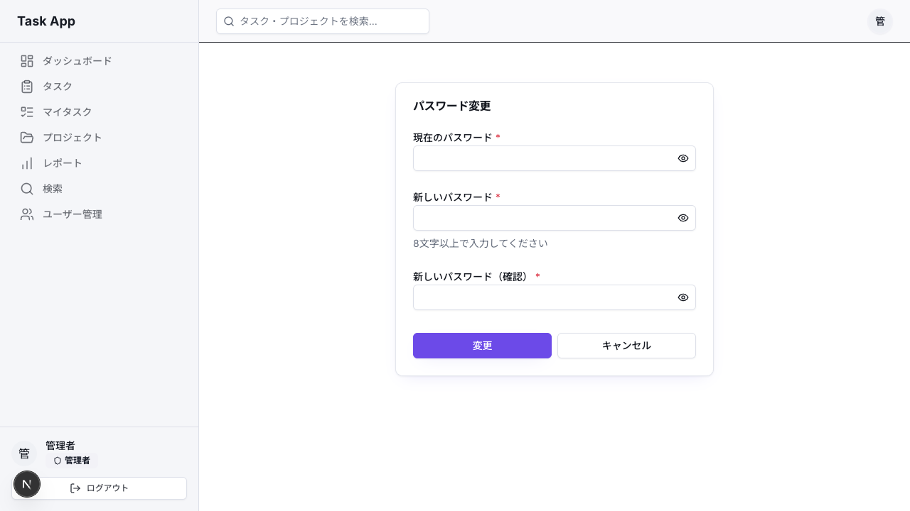
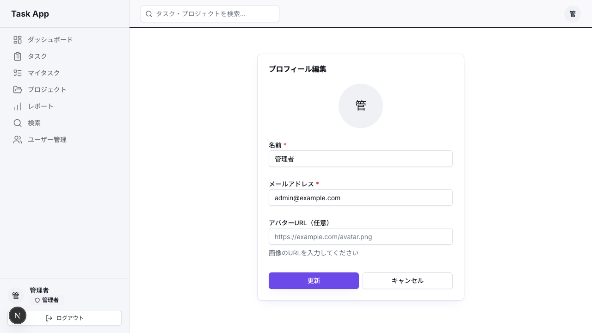

# Day 25: プロフィール編集を実装しよう

## 前回の振り返り

Day 24 では管理者専用のユーザー一覧ページを実装し、`api.auth.getCurrentUser` による権限チェックや Avatar・Badge を使ったユーザー情報の表示を学びました。管理者視点でのユーザー管理ができるようになったので、今日は自分自身のプロフィール表示とパスワード変更に取り組みます。

---

## 今日のゴール

プロフィール表示ページ・プロフィール編集ページ・パスワード変更ページの3画面を実装します。自分の情報を確認・編集し、パスワードを安全に変更できるようにします。

この日は、まずサーバー側の `updateProfile` と `changePassword` を自分で書きます。そのあと3画面をつなぎます。

スクリーンショット: プロフィールページ全体の表示を確認してください。



## なぜこれを作るのか

名前やメールは後から変わりますし、パスワードは定期的に変えたい場面があります。自分の情報を自分で確認・更新できる画面がないと、そのたびに管理者へ頼むことになってしまいます。

> **例え話**: プロフィールページは
> 「SNSのマイページ」です。
> 自分の名前やアイコンを確認（表示）し、
> 設定画面で情報を更新（編集）できます。
> パスワード変更は、銀行のATMで
> 暗証番号を変えるイメージです。

### プロフィール関連ページの構造

```mermaid
flowchart TD
    A[/profile] --> B[プロフィール表示]
    B --> C[プロフィール編集ボタン]
    B --> D[パスワード変更ボタン]
    B --> E[ユーザー管理ボタン]
    C --> F[/profile/edit]
    D --> G[/profile/change-password]
    E --> H[/user]
    G --> I[バリデーション]
    I -->|成功| J[toast.success]
    I -->|失敗| K[toast.error]
    J --> A

    style A fill:#e3f2fd
    style G fill:#fff3e0
    style J fill:#e8f5e9
    style K fill:#ffebee
```

この図の中心にいるのは `/profile` です。表示ページから編集とパスワード変更へ枝分かれし、どちらも終わると `/profile` へ戻ってきます。3画面をばらばらに置かず、1つの入口から出て同じ入口へ帰る形にすると、読者は今どこにいるかを見失いません。パスワード変更だけ途中に検証（入力内容が条件を満たすかを調べる処理）の分岐があり、成功と失敗で出すメッセージを変えます。

### やること / やらないこと

| やること | やらないこと |
|---------|-------------|
| プロフィール表示 | アバター画像のアップロード |
| プロフィール編集（名前・メール・アバターURL） | 二段階認証の設定 |
| パスワード変更フォーム | alert() の使用 |
| バリデーション実装 | |
| toast でフィードバック | |

## 始める前の前提

- ログイン済みユーザーで `/profile` を開ける
- Day 24 のユーザー管理で、本人と管理者の違いを確認済み
- パスワード変更を試すため、練習用アカウントの現在のパスワードが分かっている
- 今日はプロフィール表示、プロフィール編集、パスワード変更の3画面を順番に確認する

### 新しく学ぶ概念

| 概念 | 読み方 | 役割 | 例え |
|------|--------|------|------|
| PasswordInput | パスワードインプット | パスワード入力の再利用コンポーネント | 目のアイコンで表示を切り替えられる入力欄 |
| changePassword | — | パスワード変更API | 暗証番号の変更 |
| updateProfile | — | プロフィール更新API | 名前やメールの編集を保存 |
| toast | トースト | 通知メッセージ（復習） | ポップアップ通知 |
| useForm + zod（復習） | — | フォーム管理とバリデーション（Day 14 参照） | 記入用紙のルール自動チェック |
| refine（Day 16 の復習） | リファイン | zod のカスタムバリデーション | 複数フィールドを横断して検証するルール |

> **今日のゴールライン**: 3画面あって量は多いですが、14ステップに分かれていて1つ3〜5分です。プロフィール表示 → 編集 → パスワード変更を順番に追いかけるだけで完成します。全部を一度に理解しようとしなくて大丈夫です。

## 実装ステップ一覧

| ステップ | 作業内容 | 所要時間 |
|---------|---------|---------|
| Step 0 | user.ts に updateProfile / changePassword を追記する | 15分 |
| Step 1 | プロフィールページの概要 | 3分 |
| Step 2 | ユーザーデータの取得 | 3分 |
| Step 3 | プロフィール情報の表示 | 5分 |
| Step 4 | ナビゲーションボタン | 5分 |
| Step 5 | パスワード変更ページの概要 | 3分 |
| Step 6 | パスワード変更フォームのインポートとスキーマ | 5分 |
| Step 7 | パスワード変更フォームの入力欄 | 5分 |
| Step 8 | パスワード変更の送信とエラー処理 | 5分 |
| Step 9 | パスワード変更の動作確認 | 3分 |
| Step 10 | 編集ページの設計を理解 | 3分 |
| Step 11 | 編集ページのインポートとスキーマ | 5分 |
| Step 12 | 編集ページのデータ取得と初期化 | 5分 |
| Step 13 | 編集フォームの入力欄 | 5分 |
| Step 14 | 編集の動作確認 | 3分 |

**合計時間**: 約73分です。

この時間はコードを読んで理解する目安です。写経して打ち込む時間、詰まって調べる時間は別に見てください。

---

### Step 0: user.ts に updateProfile / changePassword を追記する（15分）

**ゴール**: Day 24 で作った `src/server/api/routers/user.ts` に、`updateProfile` と `changePassword` を 完成版と同じ順番で追記します。今日はプロフィール表示 UI を作りますが、その前に「更新先の API」が必要です。

Day 24 の `getAll` は管理者一覧の入口でした。今日は「本人が自分のプロフィールを更新する」「本人が自分のパスワードを変更する」という2本を足します。どちらも **`protectedProcedure`** なので、ログイン済みユーザー本人のセッションを前提に動きます。

最初に、Day 24 の import 群を次の形へ置き換えます。今日から使う `TRPCError`・`bcrypt`・`createSession`・`protectedProcedure` が増えます。

```typescript
// filepath: src/server/api/routers/user.ts（Day 25 時点の import）
import type { Prisma } from '@prisma/client';
import { TRPCError } from '@trpc/server';
import bcrypt from 'bcryptjs';
import { z } from 'zod';
import { USER_ROLE } from '@/lib/constant/roles';
import { prisma } from '@/lib/prisma';
import { createSession } from '@/lib/session';
import { adminProcedure, createTRPCRouter, protectedProcedure } from '../trpc';
import { USER_DETAIL_SELECT } from './_helpers/select';
```

増えた4つには、それぞれ今日の役目があります。`TRPCError` は「この条件では処理を続けない」とサーバー側から止めるためのエラーです。`bcrypt` はパスワードを元の文字列のまま扱わずに済ませる道具で、ハッシュ化（元に戻せない形へ変換する処理）と照合の両方を受け持ちます。`createSession` はログイン状態を作り直す関数で、メールアドレスを変えたあとに使います。`protectedProcedure` は Day 09 の `getAll` でも使った、ログイン済みの人だけが呼べる手続きを作る道具です。

`userRouter` の前へ、本人更新とパスワード変更の入力スキーマを追加します。

```typescript
// filepath: src/server/api/routers/user.ts（userRouter の前に追加）
const profileUpdateSchema = z.object({
  name: z.string().min(1, '名前を入力してください'),
  email: z.string().email('有効なメールアドレスを入力してください'),
  avatar: z.string().url().optional().nullable(),
});
```

このスキーマが受け取るのは名前・メール・アバターURLの3つだけで、`role` や `isActive` は入っていません。なお `avatar` は URL の形しか検査していません。好きな外部サーバーのURLを入れられるので、その画像はコメント一覧などで同じプロジェクトの他メンバーの画面に読み込まれます。出所を絞る場合は、許可するホストを配列で持ち、zod の `refine` で照合します。本人が自分のプロフィールを直すための入口なので、権限や有効・無効を書き換える余地を最初から作らない形にしてあります。もし `role` をここへ足すと、画面のフォームを通さず直接リクエストを組み立てた人が、自分を管理者へ昇格させられます。受け取らない項目は、あとから弾くのではなく入口で持たせないほうが確実です。

```typescript
// filepath: src/server/api/routers/user.ts（続き）
const changePasswordSchema = z.object({
  currentPassword: z.string().min(1, '現在のパスワードを入力してください'),
  newPassword: z
    .string()
    .min(8, '新しいパスワードは8文字以上で入力してください')
    .regex(/[A-Z]/, 'パスワードには大文字を含める必要があります')
    .regex(/[a-z]/, 'パスワードには小文字を含める必要があります')
    .regex(/[0-9]/, 'パスワードには数字を含める必要があります')
    .regex(/[^A-Za-z0-9]/, 'パスワードには特殊文字を含める必要があります'),
});
```

新しいパスワード側には `.regex(...)` が4本並びます。`.min(8)` だけだと `aaaaaaaa` のような単純な文字列も通ってしまうため、大文字・小文字・数字・記号をそれぞれ1文字以上求めます。もう1つ大事なのは、同じ条件をあとで画面側にも書く点です。ブラウザ側の検査は入力ミスをその場で知らせるためのもので、リクエストを自分で組み立てられる相手には効きません。最後に効くのは、サーバーに置いたこのスキーマのほうです。

#### 0-1. まず updateProfile を追加する

`getAll` のあと、ルーターを閉じる `});` の前へ、今日は
`updateProfile` と `changePassword` をこの順で追記します。
Day 29 では `getAll` と `updateProfile` の間へ
`getById` / `update` を差し込むので、その場所を残しておきます。

```typescript
// filepath: src/server/api/routers/user.ts（getAll のあと、閉じる }); の前に追加）
  updateProfile: protectedProcedure.input(profileUpdateSchema).mutation(async ({ ctx, input }) => {
    const userId = ctx.session.userId;

    if (input.email) {
      const existingUser = await prisma.user.findFirst({
        where: {
          email: input.email,
          id: { not: userId },
        },
      });
```

最初に `userId` をセッションから取っています。本人更新なので、フォームから「どのユーザーを更新するか」は受け取りません。ここがこの手続きの守りです。もし更新先のIDを入力として受け取る形にすると、送信内容を書き換えるだけで他人のプロフィールを上書きできてしまいます。`ctx.session` はサーバーが持っている値なので、リクエストを手で組み立てても差し替えられません。次に同じメールアドレスを別ユーザーが使っていないかを確認します。

```typescript
// filepath: src/server/api/routers/user.ts（続き）
      if (existingUser) {
        throw new TRPCError({
          code: 'CONFLICT',
          message: 'このメールアドレスは既に使用されています',
        });
      }
    }

    const updateData: Prisma.UserUpdateInput = {
      name: input.name,
      email: input.email,
    };
```

メールアドレスは一意でないと困るので、見つかったら `CONFLICT` を返して止めます。ここで `updateData` を先にオブジェクトとして作っておくと、あとから `avatar` のような任意項目だけ条件付きで足せます。

```typescript
// filepath: src/server/api/routers/user.ts（続き）
    if (input.avatar !== undefined) {
      updateData.avatar = input.avatar;
    }

    const updatedUser = await prisma.user.update({
      where: { id: userId },
      data: updateData,
      select: {
        ...USER_DETAIL_SELECT,
        updatedAt: true,
      },
    });
```

`avatar` は任意項目なので、渡されたときだけ足します。ここでは `USER_DETAIL_SELECT` に `updatedAt` を追加して返しているので、プロフィール画面へ戻ったあとすぐ最新の更新日時を表示できます。

```typescript
// filepath: src/server/api/routers/user.ts（続き）
    if (input.email !== ctx.session.email) {
      await createSession({
        id: updatedUser.id,
        email: updatedUser.email,
        role: updatedUser.role,
      });
    }

    return updatedUser;
  }),
```

ここが `updateProfile` の一番大事な行です。メールアドレスを変えたのにセッションを更新しないと、ブラウザが古いメールアドレスのままになってしまいます。だから `createSession(...)` でセッションも同時に作り直します。

#### 0-2. 次に changePassword を追加する

ここから先の「（続き）」のブロックは、`user.ts` の**末尾にある `});` の1行上**へ貼ります。ファイルの一番下に足すとルーターの外に出てしまい、英語のエラーで止まります。`});` は増やしません。

```typescript
// filepath: src/server/api/routers/user.ts（続き）
  changePassword: protectedProcedure
    .input(changePasswordSchema)
    .mutation(async ({ ctx, input }) => {
      const userId = ctx.session.userId;

      const user = await prisma.user.findUnique({
        where: { id: userId },
        select: { password: true, isActive: true },
      });
```

ここでも更新対象は本人なので、`userId` はセッションから取ります。まず現在のハッシュ済みパスワードと `isActive` を取りに行きます。

```typescript
// filepath: src/server/api/routers/user.ts（続き）
      if (!user?.password) {
        throw new TRPCError({
          code: 'NOT_FOUND',
          message: 'ユーザーが見つかりません',
        });
      }

      if (!user.isActive) {
        throw new TRPCError({
          code: 'FORBIDDEN',
          message: 'このアカウントは無効化されています',
        });
      }
```

ユーザー自体が見つからない、または無効化されている場合は、この時点で止めます。パスワード変更はログイン中の本人だけが触れるので、この2つのチェックを先に終わらせます。`isActive` の確認は二重の守りです。実は `protectedProcedure` がこの中身を呼ぶ前に、`src/server/api/trpc.ts` の `isAuthenticated` が同じ判定をしています。管理者が止めたアカウントは、そちらで `FORBIDDEN` になってここまで届きません。それでも書いておくのは、この手続きだけを別の入口へ付け替えたときに守りが1枚も残らない状態を避けるためです。パスワード変更は取り返しがつかない操作なので、判定を1か所だけに預けません。

```typescript
// filepath: src/server/api/routers/user.ts（続き）
      const isPasswordValid = await bcrypt.compare(input.currentPassword, user.password);

      if (!isPasswordValid) {
        throw new TRPCError({
          code: 'UNAUTHORIZED',
          message: '現在のパスワードが正しくありません',
        });
      }
```

`bcrypt.compare` は「平文の現在パスワード」と「DBに保存されているハッシュ」を照合する関数です。一致しなければ `UNAUTHORIZED` を返します。ここで古いパスワードを確認しているので、今のパスワードを知らない相手が1回で通ることはできません。ただし、この確認には試行回数の制限がありません。ログイン画面なら15分あたりの回数を数えて止めますが、パスワード変更に同じ仕組みはありません。繰り返し送ってくる相手を止められない点を分かったうえで使ってください。

ただし、この変更が守るのは「これから先のログイン」だけです。このアプリのセッションは、署名した文字列を Cookie に置くだけの作りで、サーバー側に「無効にする」仕組みを持ちません。有効期間は7日なので、パスワードを変える前に誰かが持ち出した Cookie は、変更後も最大7日間そのまま通ります。すべての端末からログアウトさせるには、サーバー側に使えるトークンの一覧か版数を持つ必要があり、この教材の範囲を超えます。

```typescript
// filepath: src/server/api/routers/user.ts（続き）
      const hashedPassword = await bcrypt.hash(input.newPassword, 10);

      await prisma.user.update({
        where: { id: userId },
        data: { password: hashedPassword },
      });

      return { success: true, message: 'パスワードを変更しました' };
    }),
});
```

`bcrypt.hash(input.newPassword, 10)` の `10` はハッシュ化のコストです。新しいパスワードを平文のまま保存せず、必ずハッシュにしてから DB へ更新します。最後に成功メッセージを返せば、フロント側は toast を出して終了できます。

#### 0-3. root.ts は Day 24 の登録をそのまま使う

Day 24 で `user: userRouter` は登録済みです。今日は `user.ts` の中身に 2 本 procedure を増やしただけなので、`root.ts` の追記はありません。つまり `api.user.updateProfile` と `api.user.changePassword` は、**既存の `userRouter` 登録の中で自動的に増える** 形です。

**確認ポイント**:
- `src/server/api/routers/user.ts` に `updateProfile` と `changePassword` を 完成版と同じ処理順で追記できた
- `updateProfile` がメール重複チェックと `createSession(...)` を持っている
- `changePassword` が `bcrypt.compare` → `bcrypt.hash` → `prisma.user.update` の順で並んでいる
- `root.ts` は Day 24 の `user: userRouter` のままでよいと理解できた
- `npm run dev` で型エラーが出ていない

### Step 1: プロフィールページの概要（3分）

**ゴール**: プロフィールページに
表示する情報を理解します。

#### ディレクトリ構造

```
src/app/profile/
├── page.tsx            （プロフィール表示）
├── edit/
│   └── page.tsx        （プロフィール編集）
└── change-password/
    └── page.tsx        （パスワード変更）
```

`profile/` の下へ `edit/` と `change-password/` を置くと、URL の形とフォルダの形がそのまま重なります。`/profile/edit` を開いたとき Next.js が探しに行く先は `src/app/profile/edit/page.tsx` です。この対応は Day 29 の動的ルーティングまで変わらないので、迷ったらフォルダの並びを見れば行き先が分かります。まずフォルダだけを先に作っておきます。

```bash
# filepath: ターミナル
# 今日使うディレクトリを先に作る
mkdir -p src/app/profile/edit
mkdir -p src/app/profile/change-password
find src/app/profile -maxdepth 1 -type d
```

`mkdir -p` の `-p` は、途中のフォルダが無ければ一緒に作り、すでにあってもエラーにしない指定です。だから何度実行しても結果は同じになります。最後の `find` は、いま作ったフォルダが本当にできたかを一覧で見せるための確認です。

**確認ポイント**:
- `edit/` と `change-password/` が表示された
- 各 `page.tsx` は該当 Step で新規作成する

#### 表示する情報一覧

| 項目 | プロパティ | 表示形式 |
|------|-----------|---------|
| アバター | avatar | 画像 or 頭文字 |
| 名前 | name | テキスト |
| ロール | role | Badge |
| ステータス | isActive | Badge |
| メール | email | テキスト |
| 登録日 | createdAt | yyyy年MM月dd日 |
| 更新日 | updatedAt | yyyy年MM月dd日 |

#### ページ内のボタン

| ボタン | 遷移先 | 条件 |
|-------|--------|------|
| プロフィール編集 | /profile/edit | 全ユーザー |
| パスワード変更 | /profile/change-password | 全ユーザー |
| ユーザー管理 | /user | ADMIN のみ |

> `api.auth.getCurrentUser` で
> 自分の情報を取得します。
> useSession ではなく tRPC のAPIを
> 使うのがこのアプリの設計です。

---

### Step 2: ユーザーデータの取得（3分）

**ゴール**: getCurrentUser APIで
ログイン中のユーザー情報を取得します。

**実装**:

```typescript
// filepath: src/app/profile/page.tsx
'use client';

import { format } from 'date-fns';
import { ja } from 'date-fns/locale';
import {
  Calendar, Edit, Lock, Mail,
  Shield, User,
} from 'lucide-react';
import { useRouter }
  from 'next/navigation';
import { useEffect } from 'react';
import { AppLayout }
  from '@/component/layout/app-layout';
import {
  Avatar, AvatarFallback, AvatarImage,
} from '@/component/ui/avatar';
```

最初の取り込みは、日付の整形と画面の部品です。`format` と `ja` は登録日を `2026年04月01日` の形で出すために使い、`ja` を渡さないと月の名前が英語になります。`lucide-react` から取る6つはメールや鍵などのアイコンです。`Avatar` 系の3つは、アイコン画像と、画像が無いときに出す代わりの表示を組み合わせるための部品です。

残りのコンポーネントをインポートします。

```typescript
// filepath: src/app/profile/page.tsx
// UI コンポーネントと定数のインポート
import { Button }
  from '@/component/ui/button';
import {
  Card, CardContent,
  CardHeader, CardTitle,
} from '@/component/ui/card';
import { PageLoadingSpinner }
  from '@/component/ui/loading-spinner';
import { Separator }
  from '@/component/ui/separator';
import {
  ActiveStatusBadge, UserRoleBadge,
} from '@/component/ui/user-badges';
import { USER_ROLE }
  from '@/lib/constant/roles';
import { api } from '@/trpc/react';
```

> `UserRoleBadge` と `ActiveStatusBadge` は
> 再利用可能なバッジコンポーネントです。
> 定数 `USER_ROLE` を使うと、文字列リテラルの
> タイポを防げます。

```typescript
// filepath: src/app/profile/page.tsx
// データ取得とリダイレクト
export default function ProfilePage() {
  const router = useRouter();
  const {
    data: currentUser,
    isLoading,
  } = api.auth.getCurrentUser.useQuery();

  useEffect(() => {
    if (!isLoading && !currentUser) {
      router.push('/login');
    }
  }, [currentUser, isLoading, router]);
```

自分の情報を `api.auth.getCurrentUser` で取っているのは、名前やメールを信じてよい場所から受け取るためです。ブラウザに保存された値は書き換えられますが、この問い合わせはサーバーがセッションから本人を特定して返します。`useEffect` の中で `/login` へ送っているのは、未ログインの人に空のプロフィール枠を見せないための案内です。ただしこの転送は見た目の整理にすぎません。本当の門番は Step 0 で使った `protectedProcedure` のほうにあり、画面を素通りしてAPIを直接叩かれても、そちらが先に弾きます。

ローディング中は共通スピナーを表示します。

```typescript
// filepath: src/app/profile/page.tsx
  // PageLoadingSpinner で統一的に表示
  if (isLoading) {
    return <PageLoadingSpinner />;
  }
```

> `PageLoadingSpinner` は
> `@/component/ui/loading-spinner` から
> インポートする共通コンポーネントです。
> 各ページのローディング表示を統一します。

```typescript
// filepath: src/app/profile/page.tsx
// 未ログインチェック
  if (!currentUser) {
    return null;
  }
```

> `useEffect` でローディング完了後に
> `currentUser` が null だったら
> ログインページへリダイレクトします。
> ローディング中は `return null` にせず、
> スピナーを表示するようにします。

**確認ポイント**:
- currentUser にデータが入る
- 未ログインでリダイレクトされる

---

### Step 3: プロフィール情報の表示（5分）

**ゴール**: アバター、名前、バッジ、
詳細情報をCard内に表示します。

Step 2 で書いた `if (!currentUser)` の後に
`return` 文を書きます。
全体は `AppLayout > div > Card` の構造です。

**実装**:

まず `return` 文とページの骨格です。

```typescript
// filepath: src/app/profile/page.tsx
// ページ全体のreturn文
return (
  <AppLayout>
    <div className="container mx-auto
      max-w-2xl space-y-6 py-8">
      <Card>
        <CardHeader>
          <CardTitle>
            プロフィール
          </CardTitle>
        </CardHeader>
        <CardContent
          className="space-y-6">
          {/* 以降のコードをここに追加 */}
        </CardContent>
      </Card>
    </div>
  </AppLayout>
);
```

**確認ポイント**:
- return 文の骨格を書いた

上の `CardContent` の中に、以下のアバター・
名前ブロックを配置します。
`<div className="flex gap-4">` で
横並びにするのがポイントです。

```typescript
// filepath: src/app/profile/page.tsx
// アバターと名前の表示（flex gap-4 で横並び）
<div className="flex gap-4">
  <Avatar className="w-20 h-20
    rounded-lg">
    {currentUser.avatar && (
      <AvatarImage
        src={currentUser.avatar}
        alt=""
        className="object-cover" />
    )}
    <AvatarFallback
      className="rounded-lg
        bg-primary/10">
      <User className="w-10 h-10
        text-primary" />
    </AvatarFallback>
  </Avatar>
```

> ここで `<div className="flex gap-4">` はまだ閉じていません。次のコードブロックで `</div>` を追加して閉じます。

**確認ポイント**:
- `<div className="flex gap-4">` で囲んでいる
- `currentUser.avatar && (...)` で、アバターがあるときだけ画像を表示している

```typescript
// filepath: src/app/profile/page.tsx
// 名前とバッジ（flex gap-4 の右側）
  <div className="flex-1">
    <h1 className="text-2xl font-bold">
      {currentUser.name}
    </h1>
    <div className="flex gap-2 mt-2">
      {currentUser.role
        === USER_ROLE.ADMIN && (
        <UserRoleBadge
          role={currentUser.role} />
      )}
      <ActiveStatusBadge
        isActive={currentUser.isActive} />
    </div>
  </div>
</div>
```

> `UserRoleBadge` は管理者のみ表示します。
> `USER_ROLE.ADMIN` と比較して条件付き
> レンダリングします。

**確認ポイント**:
- ロールバッジが表示される
- ステータスバッジが表示される
- `</div>` で `flex gap-4` を閉じている

```typescript
// filepath: src/app/profile/page.tsx
// メールアドレスの表示
<Separator />
<div className="space-y-4">
  <div className="flex
    items-start gap-4">
    <div className="flex items-center
      justify-center w-10 h-10
      rounded-lg bg-primary/10">
      <Mail className="w-5 h-5
        text-primary" />
    </div>
    <div className="flex-1">
      <p className="text-sm font-medium
        text-muted-foreground">
        メールアドレス
      </p>
      <p className="text-base">
        {currentUser.email}
      </p>
    </div>
  </div>
</div>
```

メールアドレスの行は、アイコンを入れた四角と本文を `flex` で横に並べた形です。`items-start` を指定してあるので、本文が2行になってもアイコンは上端でそろいます。左の `w-10 h-10` の四角は飾りなので、消しても文字は表示されます。この形をこのあとの登録日と最終更新日でも繰り返すため、3つの行が同じ見た目でそろいます。

**確認ポイント**: ブラウザでプロフィールページを開き、メールアドレスが表示されていることを確認しましょう。

```typescript
// filepath: src/app/profile/page.tsx
// 登録日の表示
<div className="flex items-start gap-4">
  <div className="flex items-center
    justify-center w-10 h-10
    rounded-lg bg-primary/10">
    <Calendar className="w-5 h-5
      text-primary" />
  </div>
  <div className="flex-1">
    <p className="text-sm font-medium
      text-muted-foreground">登録日</p>
    <p className="text-base">
      {currentUser.createdAt
        ? format(
            new Date(currentUser.createdAt),
            'yyyy年MM月dd日',
            { locale: ja })
        : '-'}
    </p>
  </div>
</div>
```

日付は `format(new Date(...), 'yyyy年MM月dd日', { locale: ja })` で整えます。この書き方では `yyyy` や `MM` のように数字を並べるだけなので、`locale: ja` を外しても表示は同じです。付けてあるのは、あとで `MMMM` のような月名の書き方へ変えたとき、そこだけ英語へ戻るのを防ぐためです。`new Date(...)` を挟むのは念のためで、このアプリは日時を `Date` のまま受け取る設定にしてあります。前に付いた `currentUser.createdAt ? ... : '-'` は、値が無いまま `format` を呼んで例外が起き、Day 26 のエラー画面へ飛ぶのを防ぐための分岐です。日付が空のユーザーには、代わりに `-` が1つ表示されます。

**確認ポイント**: 登録日が `yyyy年MM月dd日` 形式で正しく表示されていることを確認しましょう。

```typescript
// filepath: src/app/profile/page.tsx
// 最終更新日の表示
<div className="flex items-start gap-4">
  <div className="flex items-center
    justify-center w-10 h-10
    rounded-lg bg-primary/10">
    <Calendar className="w-5 h-5
      text-primary" />
  </div>
  <div className="flex-1">
    <p className="text-sm font-medium
      text-muted-foreground">
      最終更新日
    </p>
    <p className="text-base">
      {currentUser.updatedAt
        ? format(
            new Date(currentUser.updatedAt),
            'yyyy年MM月dd日',
            { locale: ja })
        : '-'}
    </p>
  </div>
</div>
```

中身は登録日とほぼ同じで、参照する項目が `updatedAt` に変わっただけです。同じ形をもう一度書いているのは、あとで片方の並びだけ変えたくなったときに手を入れやすくするためです。この `updatedAt` は、Step 0 の `updateProfile` が `select` に足して返している項目です。だから編集を保存して戻ってくると、この行の日付が新しくなります。

**確認ポイント**: 最終更新日が `yyyy年MM月dd日` 形式で正しく表示されていることを確認しましょう。

> `Separator` は区切り線を表示する
> shadcn/ui のコンポーネントです。
> セクションを視覚的に分離します。

**確認ポイント**:
- アバターと名前が表示される
- バッジが正しく色分けされる
- メール・登録日・最終更新日が表示される

スクリーンショット: プロフィール情報表示の表示を確認してください。


---

### Step 4: ナビゲーションボタン（5分）

**ゴール**: 編集・パスワード変更・
ユーザー管理へのボタンを配置します。

**実装**:

```typescript
// filepath: src/app/profile/page.tsx
// 編集・パスワード変更ボタン
<Separator />
<div className="flex flex-col gap-3">
  <Button className="w-full"
    onClick={() =>
      router.push('/profile/edit')}>
    <Edit className="w-4 h-4 mr-2" />
    プロフィール編集
  </Button>
  <Button variant="outline"
    className="w-full"
    onClick={() => router.push(
      '/profile/change-password')}>
    <Lock className="w-4 h-4 mr-2" />
    パスワード変更
  </Button>
```

2つのボタンがやっているのは、`router.push(...)` で行き先を変えることだけです。`<a href="...">` で書くとページ全体が読み込み直されますが、`router.push` なら今のページの中で必要な部分だけが差し替わります。見た目の違いは `variant` で付けていて、塗りつぶしの既定と枠線だけの `outline` を使い分けます。押してほしい順に濃さを変える、という考え方です。

```typescript
// filepath: src/app/profile/page.tsx
// 管理者用ユーザー管理ボタン
  {currentUser.role === USER_ROLE.ADMIN && (
    <Button variant="outline"
      className="w-full"
      onClick={() =>
        router.push('/user')}>
      <Shield
        className="w-4 h-4 mr-2" />
      ユーザー管理
    </Button>
  )}
</div>
```

ここでやっているのはボタンを隠すことだけで、`/user` に入れなくなるわけではありません。URL を直接打てば、一般ユーザーでもそのページを開けます。実際の線引きは別の2か所にあります。`/user` のページ自身が管理者かどうかを見て「アクセス権限がありません」と表示し、一覧を返す `user.getAll` はサーバー側で管理者だけを通します。この `&&` は、押しても断られるボタンを最初から見せないための配慮です。見た目の制御と権限の制御は、別々に用意します。

最後に、開いたタグと関数を閉じます。

```typescript
// filepath: src/app/profile/page.tsx（同じファイルの続き）
      </div>
    </AppLayout>
  );
}
```

`</AppLayout>` で外枠を閉じ、`);` で `return (` を閉じ、最後の `}` で `ProfilePage` 関数そのものを
閉じます。この `}` が無いと、ファイルの終わりで「`}` が足りない」という英語のエラーが出ます。

**確認ポイント**:
- 3つのボタンが縦に並ぶ
- 管理者にだけユーザー管理ボタンが出る
- ファイルを保存してエラーが出ていない

スクリーンショット: ナビゲーションボタンの表示を確認してください。


#### ボタンのスタイル使い分け

| ボタン | variant | 理由 |
|-------|---------|------|
| プロフィール編集 | default（塗り） | メインアクション |
| パスワード変更 | outline（枠線） | サブアクション |
| ユーザー管理 | outline（枠線） | サブアクション |

> `currentUser.role === USER_ROLE.ADMIN` で
> 条件付きレンダリングをしています。
> 管理者にだけ「ユーザー管理」ボタンが
> 表示されます。

プロフィールを URL の手入力なしで開けるよう、
Day 08 の `app-layout.tsx` も更新します。
デスクトップのユーザー情報を囲む `<div>` を
次の `Link` に置き換え、中の表示は残します。

```typescript
// filepath: src/component/layout/app-layout.tsx
<Link
  href="/profile"
  className="mb-3 flex items-center gap-3
    rounded-md px-2 py-2
    hover:bg-sidebar-accent"
>
  {/* 既存のユーザーアイコンと名前を残す */}
</Link>
```

`<div>` を `Link` に置き換えると、サイドバーのユーザー情報そのものがプロフィールへの入口になります。中の表示は触らないので見た目は変わりませんが、押せる場所になります。`hover:bg-sidebar-accent` を付けているのは、指を乗せたときに背景色が変わって、押せると目で分かるようにするためです。

Day 08 の末尾にあるメインコンテンツ部分は、
モバイル用ナビゲーションを持つ形へ置き換えます。

```typescript
// filepath: src/component/layout/app-layout.tsx
<div className="flex min-w-0 flex-1 flex-col">
  <nav className="flex gap-2 overflow-x-auto
    border-b p-2 md:hidden">
    {menuItems.map((item) => (
      <Link key={item.path}
        href={item.path}
        className="whitespace-nowrap
          rounded-md px-3 py-2 text-sm">
        {item.text}
      </Link>
    ))}
    {session.user.role === USER_ROLE.ADMIN && (
      <Link href="/user"
        className="whitespace-nowrap
          rounded-md px-3 py-2 text-sm">
        ユーザー管理
      </Link>
    )}
```

`md:hidden` が付いた `<nav>` は、画面が広いときは消えてサイドバーに任せ、狭いときだけ現れます。中では `menuItems` を `map` で回してリンクへ変えるので、メニューが増えてもこの部分は書き直しません。管理者向けの「ユーザー管理」だけは `session.user.role === USER_ROLE.ADMIN` で囲み、一般ユーザーの画面には出しません。ただしリンクを隠すのは、押しても行けない場所を見せない配慮にすぎません。`/user` を直接開かれたときに止めるのは、Day 24 で使ったサーバー側の `adminProcedure` のほうです。

```typescript
// filepath: src/component/layout/app-layout.tsx（続き）
    <Link href="/profile"
      className="whitespace-nowrap
        rounded-md px-3 py-2 text-sm">
      プロフィール
    </Link>
  </nav>
  <main className="flex-1 overflow-y-auto p-6">
    {children}
  </main>
</div>
```

`<main>` に `flex-1` を付けると、上のナビゲーションが使った分を除いた残り全部の高さを本文が受け取ります。`overflow-y-auto` は、本文が長いときに本文の中だけをスクロールさせる指定です。これが無いとページ全体が伸び、狭い画面ではメニューが上へ流れて見えなくなります。

**確認ポイント**:
- デスクトップのユーザー情報から `/profile` を開ける
- モバイル幅でも全メニューとプロフィールを開ける
- 「ユーザー管理」はモバイルでも ADMIN だけに出る

---

### Step 5: パスワード変更ページの概要（3分）

**ゴール**: パスワード変更ページの
構成とAPIを理解します。

`src/app/profile/change-password/page.tsx` は
次の実装セクションで新規作成します。この時点では
空ファイルを作らず、入力項目を先に確認します。

```bash
# filepath: ターミナル
test -d src/app/profile/change-password \
  && echo "change-password directory ready"
```

`test -d` はフォルダがあるかどうかだけを調べるコマンドで、あるときだけ後ろの `echo` が動きます。Step 1 で作ったフォルダがそのまま残っているかを、ページを書き始める前に確かめておきます。何も表示されなければ、Step 1 の `mkdir -p` をもう一度実行してください。

**確認ポイント**:
- 作成先ディレクトリの準備完了が表示された
- 空の `page.tsx` はまだ作っていない

#### パスワード変更の入力項目

| 項目 | name属性 | バリデーション |
|------|---------|--------------|
| 現在のパスワード | currentPassword | 必須（min(1)） |
| 新しいパスワード | newPassword | 8文字以上 + 大文字 + 小文字 + 数字 + 特殊文字 |
| 確認用パスワード | confirmPassword | newPassword と一致（refine） |

#### 使用するAPI

| API | メソッド | 用途 |
|-----|---------|------|
| api.user.changePassword | useMutation | パスワード変更 |

> `changePassword` はサーバー側で
> 現在のパスワードの照合と新パスワードの
> ハッシュ化を行います。
>
> サーバーの `changePasswordSchema` では
> `newPassword` に次のルールが定義されています。
> `min(8)` に加えて、`[A-Z]`、`[a-z]`、
> `[0-9]`、`[^A-Za-z0-9]` をそれぞれ
> 1文字以上含む必要があります。

---

### Step 6: パスワード変更フォームのインポートとスキーマ（5分）

**ゴール**: useForm + zod でフォームの
状態管理とバリデーションを定義します。

**実装**:

```typescript
// filepath: src/app/profile/change-password/page.tsx
'use client';

// react-hook-form + zod
import { zodResolver }
  from '@hookform/resolvers/zod';
import { AlertCircle } from 'lucide-react';
import { useRouter }
  from 'next/navigation';
import { useForm } from 'react-hook-form';
import toast from 'react-hot-toast';
import { z } from 'zod';
import { AppLayout }
  from '@/component/layout/app-layout';
import {
  Alert, AlertDescription,
  AlertTitle,
} from '@/component/ui/alert';
```

ここで取り込む3点セットが、今日のフォームの土台です。`useForm` が入力欄の値とエラーを預かり、`z` が満たすべき条件を書き、`zodResolver` がその2つをつなぎます。Day 14 のタスク作成フォームと同じ組み合わせなので、覚え直す必要はありません。`Alert` 系はサーバーから返ったエラーを画面の上に出すための部品です。

**確認ポイント**:
- `useForm`, `zodResolver`, `z` がインポートされている

フォーム用のコンポーネントをインポートします。

```typescript
// filepath: src/app/profile/change-password/page.tsx
// フォーム部品と PasswordInput
import { Button }
  from '@/component/ui/button';
import {
  Card, CardContent,
  CardHeader, CardTitle,
} from '@/component/ui/card';
import { Label }
  from '@/component/ui/label';
import { PasswordInput }
  from '@/component/ui/password-input';
import { api } from '@/trpc/react';
```

> `PasswordInput` はパスワードの表示/非表示
> トグル（Eye/EyeOff）を内蔵したコンポーネントです。
> ページ側で `showPassword` を管理する必要がありません。

zod スキーマでバリデーションを定義します。
`refine` で2つのフィールドの一致をチェックします。

#### refine とは

`refine` は zod の「カスタムバリデーション」機能です。
`min` や `email` のような単一フィールドのチェックでは足りないとき、複数フィールドを横断して検証するルールを追加できます。

| 通常のバリデーション | refine |
|---|---|
| 1つのフィールドだけチェック | 複数フィールドを比較してチェック |
| `z.string().regex(/[A-Z]/)` | `.refine((data) => data.a === data.b)` |
| 「大文字を含むか」 | 「新パスワードと確認が一致するか」 |

`path` オプションでエラーを表示するフィールドを
指定できます。

```typescript
// filepath: src/app/profile/change-password/page.tsx
// パスワード変更用スキーマ: currentPassword
const changePasswordCurrentSchema =
  z.object({
  currentPassword: z.string()
    .min(1, '現在のパスワードを'
      + '入力してください'),
});
```

画面側のスキーマは、1つの大きな定義を書かず少しずつ足していきます。まずは現在のパスワードだけを持つ形から始めます。`min(1)` は「1文字以上」、つまり空欄のまま送信できないという意味です。ここでは正しいパスワードかどうかまでは分かりません。入力されたかどうかだけを見ます。合っているかを確かめられるのは、ハッシュを持っているサーバー側だけです。

```typescript
// filepath: src/app/profile/change-password/page.tsx
// newPassword のルールを追加（前半）
const changePasswordPasswordSchema = changePasswordCurrentSchema.extend({
  newPassword: z.string().min(
    8,
    '新しいパスワードは' + '8文字以上で入力してください',
  )
    .regex(
      /[A-Z]/,
      'パスワードには大文字を'
        + '含める必要があります',
    )
    .regex(
      /[a-z]/,
      'パスワードには小文字を'
        + '含める必要があります',
    )
```

`extend` は、前のスキーマへ項目を足した新しいスキーマを作る書き方です。ここで足す `newPassword` の条件は、Step 0 でサーバーに書いた `changePasswordSchema` とそろえます。メッセージの文言まで同じにしておくと、画面に出る文とサーバーから返る文が食い違いません。`.regex(/[A-Z]/, ...)` は「大文字を1文字以上含むこと」の指定で、第2引数が満たせなかったときの説明文です。

```typescript
// filepath: src/app/profile/change-password/page.tsx
// 同じ newPassword ルールの続き
    .regex(
      /[0-9]/,
      'パスワードには数字を'
        + '含める必要があります',
    )
    .regex(
      /[^A-Za-z0-9]/,
      'パスワードには特殊文字を'
        + '含める必要があります',
    ),
});
```

残りの2本で数字と記号を求めます。`[^A-Za-z0-9]` の先頭にある `^` は「これ以外」という意味なので、英字と数字のどちらにも当てはまらない文字、つまり `!` や `#` のような記号が1文字以上あるかを見ます。4本の `.regex` は、最初の1本で打ち切られるわけではありません。zod は失敗したルールをすべて集めて返します。`abc` を渡すと、8文字未満・大文字なし・数字なし・記号なしの4件が同時に返ります。小文字の条件だけは満たしています。画面へ1件しか出ないのは、react-hook-form が既定で最初の1件だけを表示するためです（`criteriaMode: 'firstError'`）。だから直すたびに次の指摘が現れます。サーバー側の `safeParse` は react-hook-form を通らないので、4件すべてがそのまま手に入ります。

```typescript
// filepath: src/app/profile/change-password/page.tsx
// confirmPassword を追加してベーススキーマにする
const changePasswordBaseSchema =
  changePasswordPasswordSchema.extend({
  confirmPassword: z.string()
    .min(1, '確認用パスワードを'
      + '入力してください'),
});
```

確認用の欄をここで足します。この時点ではまだ空でないことしか見ていないので、新しいパスワードと一致しているかは判定できません。1つの項目だけを見る検査には、他の項目と見比べる手段が無いためです。次のブロックの `refine` がその役目を引き受けます。

```typescript
// filepath: src/app/profile/change-password/page.tsx
// confirmPassword の一致チェックを追加
const changePasswordSchema =
  changePasswordBaseSchema.refine(
  (data) => data.newPassword
    === data.confirmPassword,
  {
    message: 'パスワードが一致しません',
    path: ['confirmPassword'],
  },
);
type ChangePasswordFormValues =
  z.infer<typeof changePasswordSchema>;
```

`refine` は、1項目ずつの検査が終わったあとで値どうしを見比べるための書き方です。`path: ['confirmPassword']` を付けているのは、エラーの置き場所を確認欄に決めるためです。指定しないとフォーム全体のエラー扱いになり、どの欄を直せばいいのかが読者に伝わりません。この一致チェックは画面側だけの決まりです。Step 0 のサーバー側スキーマに `confirmPassword` は無く、送信時もこの項目は送りません。だから打ち間違いは、送る前にここで止める必要があります。

**確認ポイント**:
- スキーマ名が `changePasswordSchema` である
- 型名が `ChangePasswordFormValues` である
- `newPassword` に 4つの `regex()` を追加している
- `refine` で一致チェックしている
- `path: ['confirmPassword']` でエラー表示先を指定している

#### サーバーと合わせるパスワード要件

`src/server/api/routers/user.ts` の
`changePasswordSchema` では、`newPassword` に
次のルールが設定されています。

| ルール | 正規表現 / zod | サーバーが返すメッセージ |
|------|----------------|-------------------------|
| 8文字以上 | `.min(8)` | `新しいパスワードは8文字以上で入力してください` |
| 大文字を1文字以上含む | `.regex(/[A-Z]/)` | `パスワードには大文字を含める必要があります` |
| 小文字を1文字以上含む | `.regex(/[a-z]/)` | `パスワードには小文字を含める必要があります` |
| 数字を1文字以上含む | `.regex(/[0-9]/)` | `パスワードには数字を含める必要があります` |
| 特殊文字を1文字以上含む | `.regex(/[^A-Za-z0-9]/)` | `パスワードには特殊文字を含める必要があります` |

> 現在のパスワードが違う場合は、
> バリデーション通過後にサーバーから
> `現在のパスワードが正しくありません`
> が返ります。

#### パスワード例

| 例 | 判定 | 理由 |
|---|---|---|
| `Abc123!@` | OK | 8文字以上で大文字・小文字・数字・特殊文字をすべて含む |
| `TaskApp2026#` | OK | 文字種の条件をすべて満たす |
| `password1!` | NG | 大文字がない |
| `PASSWORD1!` | NG | 小文字がない |
| `Password!` | NG | 数字がない |
| `Password1` | NG | 特殊文字がない |
| `Ab1!xyz` | NG | 8文字未満 |

```typescript
// filepath: src/app/profile/change-password/page.tsx
// useForm でフォームを初期化
export default function
  ChangePasswordPage() {
  const router = useRouter();
  const form =
    useForm<ChangePasswordFormValues>({
      resolver:
        zodResolver(changePasswordSchema),
      defaultValues: {
        currentPassword: '',
        newPassword: '',
        confirmPassword: '',
      },
    });
```

`resolver` にスキーマを渡すと、送信のたびに3つの欄がまとめて検査されます。検査を通らなければ、あとで書く送信ハンドラーは呼ばれません。入力の見張りはフォーム自身が担うので、送信処理の中で `if` を並べずに済みます。`defaultValues` を空文字で埋めるのは、フォームの初期状態を確定させるためです。ここが決まっていないと、あとで使う `reset` や「まだ触っていない」の判定が正しく動きません。

**確認ポイント**:
- `zodResolver(changePasswordSchema)` を設定している
- `defaultValues` で全フィールドを空文字で初期化している

```typescript
// filepath: src/app/profile/change-password/page.tsx
// useMutation でAPI呼び出し
  const changePassword =
    api.user.changePassword.useMutation({
      onSuccess: () => {
        toast.success(
          'パスワードを変更しました'
        );
        router.push('/profile');
      },
      onError: (error) => {
        toast.error(
          error.message
          ?? 'パスワードの変更に失敗しました'
        );
      },
    });
```

変数の名前が `changePasswordMutation` ではなく `changePassword` になっています。Day 10 から Day 24 では `createMutation` のように末尾へ `Mutation` を付けてきました。完成版のコードがこの画面では手続き名をそのまま使っているので、それに合わせています。どちらでも動きます。

`useMutation` を送信ハンドラーの外に置いているのは、この呼び出しが送信中かどうかの状態も一緒に返すからです。この `changePassword.isPending` が送信中かどうかを表し、ボタンの見た目を切り替えるときに読みます。ハンドラーの中で作ると、その状態を画面側から読めません。`mutate` は結果を待たずにすぐ戻るので、成功と失敗の後始末は `onSuccess` と `onError` に分けて置きます。成功後に `/profile` へ戻しているのは、同じ画面に留まると変わったのかどうかが読者に分からないためです。

**確認ポイント**:
- `onSuccess` で toast 表示と画面遷移をしている
- `onError` で `??` を使ってフォールバックメッセージを設定している

---

### Step 7: パスワード変更フォームの入力欄（5分）

**ゴール**: フォームの送信ハンドラーと
3つの入力フィールドを実装します。

**実装**:

```typescript
// filepath: src/app/profile/change-password/page.tsx
// 送信ハンドラー
  const handleSubmit =
    (values: ChangePasswordFormValues) => {
      changePassword.mutate({
        currentPassword:
          values.currentPassword,
        newPassword: values.newPassword,
      });
    };
```

> `form.handleSubmit(handleSubmit)` が zod
> スキーマでバリデーションを実行してから
> `handleSubmit` を呼びます。`confirmPassword` は
> 一致チェック用なのでAPIには送りません。

```typescript
// filepath: src/app/profile/change-password/page.tsx
// ページの外枠
  return (
    <AppLayout>
      <div className="container mx-auto
        max-w-md mt-8 mb-8">
        <Card>
          <CardHeader>
            <CardTitle>
              パスワード変更
            </CardTitle>
          </CardHeader>
          <CardContent>
            <form onSubmit={
              form.handleSubmit(
                handleSubmit)}
              className="space-y-6">
```

**確認ポイント**:
- `form.handleSubmit(handleSubmit)` でバリデーション後に送信している

`<form>` タグの中に、以下の入力フィールドを
順番に配置していきます。
`register` で各入力をフォームに登録します。

```typescript
// filepath: src/app/profile/change-password/page.tsx
// 現在のパスワード入力
<div className="space-y-2">
  <Label htmlFor="currentPassword">
    現在のパスワード
    <span className="text-destructive">
      *
    </span>
  </Label>
  <PasswordInput
    id="currentPassword"
    {...form.register(
      'currentPassword')}
    disabled={changePassword.isPending}
  />
  {form.formState.errors
    .currentPassword && (
    <p className="text-sm
      text-destructive">
      {form.formState.errors
        .currentPassword.message}
    </p>
  )}
</div>
```

`{...form.register('currentPassword')}` の1行で、この入力欄がフォームの管理下に入ります。値を `useState` で持ち、`onChange` のたびに書き戻す、という手作業が要らなくなります。下の `form.formState.errors.currentPassword && (...)` は、検査に引っかかったときだけメッセージの `<p>` を出す書き方です。エラーが無いあいだは、この段落そのものが描かれません。空の行が残って高さがずれる心配もありません。

**確認ポイント**:
- `register` でフォームに登録している
- エラーメッセージが自動表示される
- 画面での確認は、`</form>` を書き終えたあとの動作確認で行う

```typescript
// filepath: src/app/profile/change-password/page.tsx
// 新しいパスワード入力（Label + PasswordInput）
<div className="space-y-2">
  <Label htmlFor="newPassword">
    新しいパスワード
    <span className="text-destructive">
      *
    </span>
  </Label>
  <PasswordInput
    id="newPassword"
    {...form.register('newPassword')}
    disabled={changePassword.isPending}
  />
  <p className="text-sm
    text-muted-foreground">
    8文字以上で、大文字・小文字・数字・
    特殊文字をそれぞれ1文字以上含めてください
  </p>
```

入力欄の下に置いた灰色の文章は、エラーではなく最初から出しておくヒントです。条件を満たせない理由をあとから見せるより、何を入力すればよいかを先に見せるほうが、直す回数を減らせます。`disabled={changePassword.isPending}` は送信中に入力を止める指定で、返事を待つあいだの二重送信を防ぎます。

```typescript
// filepath: src/app/profile/change-password/page.tsx
// 新しいパスワードのエラー表示
  {form.formState.errors
    .newPassword && (
    <p className="text-sm
      text-destructive">
      {form.formState.errors
        .newPassword.message}
    </p>
  )}
</div>
```

ヒントとエラーを別々の `<p>` に分けてあります。同じ場所を書き換える形にすると、エラーが出た瞬間にヒントが消えて、条件を確かめながら直せなくなります。`text-destructive` は shadcn/ui のテーマから来ている赤系の文字色で、他の画面のエラー表示と同じ色になります。

**確認ポイント**:
- ヒントテキストに文字種の条件まで表示される
- エラーメッセージとヒントが別々に表示される
- 画面での確認は、`</form>` を書き終えたあとの動作確認で行う

```typescript
// filepath: src/app/profile/change-password/page.tsx
// 確認用パスワード入力
<div className="space-y-2">
  <Label htmlFor="confirmPassword">
    新しいパスワード（確認）
    <span className="text-destructive">
      *
    </span>
  </Label>
  <PasswordInput
    id="confirmPassword"
    {...form.register(
      'confirmPassword')}
    disabled={changePassword.isPending}
  />
  {form.formState.errors
    .confirmPassword && (
    <p className="text-sm
      text-destructive">
      {form.formState.errors
        .confirmPassword.message}
    </p>
  )}
</div>
```

> `refine` でパスワード一致チェックを
> 定義したので、`formState.errors` に
> 自動でエラーが入ります。手動の
> `if (a !== b)` チェックが不要になりました。

**確認ポイント**:
- フォームに入力できる
- 目のアイコンでパスワードの表示/非表示が切り替わる
- 不一致の時に zod がエラーを表示する
- 画面での確認は、`</form>` を書き終えたあとの動作確認で行う



画面には「現在のパスワード」「新しいパスワード」「新しいパスワード（確認）」の
3つの入力欄が縦に並びます。どれも必須なので、ラベルの右に赤い `*` が付きます。
新しいパスワードと確認用が食い違うときは、確認用の欄の下に赤い文字で理由が出ます。

---

### Step 8: パスワード変更の送信とエラー処理（5分）

**ゴール**: APIエラーの表示と
送信・キャンセルボタンを実装します。

**実装**:

```typescript
// filepath: src/app/profile/change-password/page.tsx
// APIエラーのAlert表示
{changePassword.error && (
  <Alert variant="destructive">
    <AlertCircle className="h-4 w-4" />
    <AlertTitle>エラー</AlertTitle>
    <AlertDescription>
      {changePassword.error.message}
    </AlertDescription>
  </Alert>
)}
```

ここに出るのは、画面の検査を通り抜けたあとにサーバーが返したエラーです。現在のパスワードが合っているかどうかは、ブラウザには判定できません。正しいパスワードのハッシュを手元に持っていないからです。だから Step 0 の `bcrypt.compare` が照合し、合わなければ `現在のパスワードが正しくありません` を返します。誰かがフォームを迂回してリクエストを直接組み立てても、この照合は変わらず働きます。画面の検査は親切さのため、サーバーの検査は安全のため、と役割が分かれています。

**確認ポイント**:
- API側のエラー（現在のパスワード不正など）が Alert で表示される
- 画面での確認は、`</form>` を書き終えたあとの動作確認で行う

```typescript
// filepath: src/app/profile/change-password/page.tsx
// 送信ボタンとキャンセルボタン
<div className="flex gap-2 pt-2">
  <Button type="submit"
    className="w-full"
    disabled={
      changePassword.isPending}>
    {changePassword.isPending
      ? '変更中...' : '変更'}
  </Button>
  <Button type="button"
    variant="outline"
    className="w-full"
    onClick={() =>
      router.push('/profile')}
    disabled={
      changePassword.isPending}>
    キャンセル
  </Button>
</div>
```

`disabled={changePassword.isPending}` を両方のボタンに付けるのは、通信中の二重送信を防ぐためです。付けないと、反応が無いと感じた読者がもう一度押し、同じ変更が2回サーバーへ届きます。文字を `変更中...` へ差し替えているのは、押せない理由を目で分かる形にするためです。灰色になっているだけでは、壊れたのか処理中なのかを区別できません。キャンセル側も同時に止めているのは、送信の途中でページを離れると、返ってきた結果の表示先が無くなるためです。

**確認ポイント**:
- 送信中はボタンテキストが「変更中...」になる
- `isPending` 中はボタンが無効化される
- キャンセルで `/profile` に戻る

閉じタグを忘れずに書きます。

```typescript
// filepath: src/app/profile/change-password/page.tsx
// 閉じタグ
            </form>
          </CardContent>
        </Card>
      </div>
    </AppLayout>
  );
}
```

閉じタグは、開いた順の逆に並べます。`<form>` を閉じてから `CardContent`、`Card`、`<div>`、`AppLayout` の順です。ここがずれていると、保存した瞬間にタグが閉じられていないという趣旨のエラーが出ます。エディタで開始タグをクリックすると対応する終了タグにも色が付くので、迷ったらそれで確かめてください。

**確認ポイント**:
- ファイルを保存した
- `npm run dev` でエラーが出ていない

#### バリデーションルール（zodスキーマで定義済み）

| チェック | zod メソッド | メッセージ |
|---------|-------------|-----------|
| 必須チェック | `z.string().min(1)` | 現在のパスワードを入力してください |
| 文字数 | `z.string().min(8)` | 新しいパスワードは8文字以上で入力してください |
| 大文字 | `.regex(/[A-Z]/)` | パスワードには大文字を含める必要があります |
| 小文字 | `.regex(/[a-z]/)` | パスワードには小文字を含める必要があります |
| 数字 | `.regex(/[0-9]/)` | パスワードには数字を含める必要があります |
| 特殊文字 | `.regex(/[^A-Za-z0-9]/)` | パスワードには特殊文字を含める必要があります |
| 一致確認 | `.refine()` | パスワードが一致しません |

#### toast の使い分け

| メソッド | 用途 | 表示色 |
|---------|------|--------|
| toast.success | 成功メッセージ | 緑 |
| toast.error | エラーメッセージ | 赤 |

> `toast` は画面の隅に一時的に
> 表示される通知メッセージです。
> `alert()` と違い、ユーザーの操作を
> ブロックしません。

---

### Step 9: パスワード変更の動作確認（3分）

**ゴール**: プロフィールページと
パスワード変更の全体を確認します。

```bash
# filepath: ターミナル
# 開発サーバーを起動して動作確認
PORT=3001 npm run dev
```

1. `/profile` にアクセス
2. アバターと名前が表示される
3. メールアドレスと日付が表示される
4. 「パスワード変更」ボタンで遷移
5. パスワード変更フォームに入力
6. `Password1` で「特殊文字」不足を確認
7. `password1!` で「大文字」不足を確認
8. `Abc123!@` のような値で変更成功を確認

変更したパスワードは、Day 26 から Day 30 でも使います。送信する前に、入力した文字列を必ず手元に控えてください。

控え忘れてログインできなくなっても、直す方法はあります。`npm run db:seed` では戻りません。
初期データを入れ直す処理は、すでにいるユーザーの中身を書き換えない作りになっているためです。

代わりに `npx prisma studio` を実行し、ブラウザで開く画面から `User` テーブルを開きます。
`admin@example.com` の行の `password` 欄へ、`user1@example.com` の行の `password` 欄の値を
そのままコピーして保存します。これで `admin@example.com` も `password123` で入れます。
`password` 欄に入っているのは暗号化された文字列なので、`password123` と直接打ち込んでも戻りません。

> 「プロフィール編集」の遷移確認は、
> 編集ページを作る Step 14 で行います。

**確認ポイント**:
- プロフィール情報が正しく表示される
- パスワード変更のフローが完了する
- 成功時に toast が表示される
- 画面での確認は、`</form>` を書き終えたあとの動作確認で行う

変更に成功すると、画面の隅に「パスワードを変更しました」という通知が出て、
そのままプロフィールページへ戻ります。フォームに留まったままなら、
どこかで弾かれています。入力欄の下に出ている赤い文字を読んでください。

> ここまでで、プロフィール表示とパスワード変更の2ページが完成しました！残りはプロフィール編集ページだけです。あと少しで今日のゴールに到達します。

---

### Step 10: 編集ページの設計を理解しよう（3分）

**ゴール**: プロフィール編集ページの
データフローと使用コンポーネントを理解します。

パスワード変更ページより入力項目が多いので、
まず全体像を把握してから実装に入りましょう。

`src/app/profile/edit/page.tsx` は Step 11 で
新規作成します。ここではファイルの存在確認を
先に行わず、データフローを設計します。

#### 編集ページのデータフロー

```mermaid
flowchart LR
    A[getCurrentUser] --> B[useEffect]
    B --> C[form.reset で初期値セット]
    C --> D[フォーム入力 register]
    D --> E[form.handleSubmit]
    E --> F[updateProfile.mutate]
    F --> G[toast で結果通知]
    G --> H[/profile に戻る]
```

この図で足を止めてほしいのは、A から C までの流れです。フォームの初期値は、画面を書いた時点では決められません。名前とメールはサーバーが持っているので、届いてから入れ替える必要があります。`useForm` の `defaultValues` に空文字を置いておき、データが届いた時点で `form.reset` が中身を差し替える、という2段構えになっているのはそのためです。

#### フォーム項目一覧

| フィールド | 必須 | 説明 |
|-----------|------|------|
| 名前 | ✅ | 表示名 |
| メールアドレス | ✅ | ログイン用。重複チェックあり |
| アバターURL | - | 画像URL（任意） |

#### 使用する shadcn/ui コンポーネント

| コンポーネント | 用途 |
|--------------|------|
| Card | フォーム全体を囲む枠 |
| Input | テキスト入力欄 |
| Label | 入力欄のラベル |
| Avatar | アバター画像のプレビュー |
| Button | 送信・キャンセルボタン |
| Alert | エラーメッセージの表示 |
| PageLoadingSpinner | ローディング表示 |

#### useForm + useEffect の役割

| 処理 | タイミング | 目的 |
|------|-----------|------|
| getCurrentUser でデータ取得 | ページ表示時 | サーバーから最新情報を取得 |
| useEffect で `form.reset()` | データ取得完了時 | フォームに既存値をセット |
| `register` で入力を管理 | 入力変更時 | ユーザーの入力を反映 |
| `form.handleSubmit` で送信 | フォーム送信時 | zod バリデーション後に送信 |

> `useEffect` + `form.reset()` で
> サーバーデータをフォームにセットします。
> サーバーから値が届いた時点で
> フォームの中身が入れ替わります。

**確認ポイント**:
- 編集ページのデータフローを理解した
- useEffect + form.reset が初期値セットに使われることを理解した

---

### Step 11: 編集ページのインポートとスキーマ（5分）

**ゴール**: プロフィール編集ページの
インポートと zod スキーマを実装します。

**実装**:

まず、ファイルの先頭部分を書きます。

```typescript
// filepath: src/app/profile/edit/page.tsx
'use client';

import { zodResolver }
  from '@hookform/resolvers/zod';
import { AlertCircle }
  from 'lucide-react';
import { useRouter }
  from 'next/navigation';
import { useEffect } from 'react';
import { useForm } from 'react-hook-form';
import toast from 'react-hot-toast';
import { z } from 'zod';
import { AppLayout }
  from '@/component/layout/app-layout';
import {
  Alert, AlertDescription,
  AlertTitle,
} from '@/component/ui/alert';
```

先頭の `'use client'` は、このページをブラウザ側で動かすための指定です。`useForm` や `useRouter` はブラウザの中でしか働かないので、この1行が無いとサーバー側で実行しようとして失敗します。インポートを一度に全部書かず前半と後半へ分けているのは、書き写す途中でどこまで進んだかを見失わないためです。まとめて貼ると、打ち間違いをどの行で起こしたのか探すのに時間がかかります。

**確認ポイント**:
- `useForm`, `zodResolver`, `z` がインポートされている

残りの UI コンポーネントをインポートします。

```typescript
// filepath: src/app/profile/edit/page.tsx
// UIコンポーネントのインポート
import {
  Avatar, AvatarFallback,
  AvatarImage,
} from '@/component/ui/avatar';
import { Button }
  from '@/component/ui/button';
import {
  Card, CardContent,
  CardHeader, CardTitle,
} from '@/component/ui/card';
import { Input }
  from '@/component/ui/input';
import { Label }
  from '@/component/ui/label';
import { PageLoadingSpinner }
  from '@/component/ui/loading-spinner';
import { normalizeAvatarValue }
  from '@/lib/utils';
import { api } from '@/trpc/react';
```

**確認ポイント**:
- `PageLoadingSpinner` のインポートパスが `@/component/ui/loading-spinner` である
- `normalizeAvatarValue` を `@/lib/utils` からインポートしている
- shadcn/ui のコンポーネントをインポートしている

> `normalizeAvatarValue` は `@/lib/utils` にある関数です。
> アバターURLが空のときに `null` へ変換する役割で、
> Step 12 の送信処理で使います。

プロフィール編集用の zod スキーマを定義します。

```typescript
// filepath: src/app/profile/edit/page.tsx
// プロフィール編集用の zodスキーマ
const profileEditSchema = z.object({
  name: z.string()
    .min(1, '名前を入力してください'),
  email: z.string()
    .email('有効なメールアドレスを'
      + '入力してください'),
  avatar: z.string()
    .url('有効なURLを入力してください')
    .or(z.literal('')),
});
type ProfileEditFormValues =
  z.infer<typeof profileEditSchema>;
```

`avatar` に `.or(z.literal(''))` を足しているのは、アバターを空のままにしたい人がいるからです。`.url()` だけだと空欄が「URLの形式ではない」と弾かれ、名前だけ直したいときにも画像URLの入力を強いられます。ただしサーバー側の条件はこれと同じではありません。Step 12 の送信処理で空文字を `null` へ直す手当てが要るのは、このずれが理由です。`name` を `.min(1)` にしているのは、表示名が空になると一覧やサイドバーで誰なのか分からなくなるためです。

**確認ポイント**:
- スキーマ名が `profileEditSchema` である
- 型名が `ProfileEditFormValues` である
- `email()` でメール形式を検証している
- `avatar` は `url()` にエラーメッセージ付きで、空文字も許可している

---

### Step 12: 編集ページのデータ取得と初期化（5分）

**ゴール**: useForm の初期化、API設定、
useEffect でのデータセットを実装します。

**実装**:

```typescript
// filepath: src/app/profile/edit/page.tsx
// useForm でフォームを初期化
export default function ProfileEditPage() {
  const router = useRouter();
  const utils = api.useUtils();
  const form =
    useForm<ProfileEditFormValues>({
      resolver:
        zodResolver(profileEditSchema),
      defaultValues: {
        name: '',
        email: '',
        avatar: '',
      },
    });
```

`api.useUtils()` をここで呼んでいるのは、あとで書く更新成功時の処理でキャッシュへ古い印を付けるためです。この呼び出しはコンポーネントの本体でしか使えないので、必要になる場所より先に用意しておきます。`defaultValues` が空文字なのは、サーバーからの値がまだ届いていないためです。この空の状態は一瞬で終わります。届いた値をあとから入れ直すのは、次に書く `useEffect` の役目です。

**確認ポイント**:
- useForm に zodResolver を設定している
- defaultValues で空文字を設定している

データ取得と更新APIの設定です。

```typescript
// filepath: src/app/profile/edit/page.tsx
// データ取得と更新API
  const { data: currentUser, isLoading } =
    api.auth.getCurrentUser.useQuery();

  const updateProfile =
    api.user.updateProfile.useMutation({
      onSuccess: async () => {
        await Promise.allSettled([
          utils.auth.getCurrentUser.invalidate(),
          utils.auth.getSession.invalidate(),
        ]);
        toast.success(
          'プロフィールを更新しました'
        );
        router.push('/profile');
        router.refresh();
      },
      onError: (error) => {
        toast.error(
          error.message
          ?? 'プロフィールの更新に失敗しました'
        );
      },
    });
```

ここでは `router.push` のあとに `router.refresh()` も呼びます。パスワード変更のときは `router.push` だけでした。違いは、移動先の画面に出る内容が変わったかどうかです。名前とメールはプロフィール画面に表示されるので、サーバー側で組み立て直す必要があります。パスワードは画面のどこにも出ないので、その必要がありません。

`onSuccess` で2か所のキャッシュ（一度取ったデータを手元に置いて使い回す仕組み）へ古い印を付けているところが、この画面でいちばん間違えやすい部分です。`utils.auth.getCurrentUser.invalidate()` が指すのは、プロフィール画面の読んでいるデータです。`utils.auth.getSession.invalidate()` はサイドバーの表示が読むデータで、置き場所が別々になっています。片方だけ無効にすると、プロフィールの名前は新しいのにサイドバーの名前だけ古いまま、という食い違いが残ります。しかもサーバー側は正しく更新されているので、ブラウザを手で再読み込みすると直ってしまいます。直ってしまう不具合はいちばん原因を追いにくい種類です。両方へ印を付けておけば、次に表示されるときにどちらも取り直され、画面全体で名前がそろいます。

**確認ポイント**:
- useQuery でデータを取得している
- useMutation で更新APIを設定している
- 更新後に auth キャッシュを無効化している
- `??` でフォールバックメッセージを設定している

サーバーデータでフォームを初期化します。

```typescript
// filepath: src/app/profile/edit/page.tsx
  // form.reset でサーバーデータをセット
  useEffect(() => {
    if (currentUser) {
      form.reset({
        name: currentUser.name ?? '',
        email: currentUser.email ?? '',
        avatar: currentUser.avatar ?? '',
      });
    }
  }, [currentUser, form]);
```

`useEffect` を挟むのは、最初の描画の時点では `currentUser` がまだ `undefined` だからです。データはサーバーへの問い合わせが終わってから届くので、届いた時点で入れ直す必要があります。`defaultValues` を書き換えるのではなく `form.reset` を使うのは、入力欄の値と「まだ触っていない」という状態を同時にそろえるためです。`?? ''` を付けているのは、`name` と `avatar` が未設定なら `null` になる項目だからです。`?? ''` を付けるのは、フォームの型が文字列を求めており、`null` のままでは型が合わないためです。

**確認ポイント**:
- `form.reset` でフォーム初期値をセットしている
- `??` で null/undefined を空文字に変換している

フォーム送信のハンドラーです。

```typescript
// filepath: src/app/profile/edit/page.tsx
  // 送信直前にアバターの空文字を正規化する
  const handleSubmit =
    (values: ProfileEditFormValues) => {
      updateProfile.mutate({
        ...values,
        avatar: normalizeAvatarValue(values.avatar),
      });
    };
```

なぜ `avatar` だけ `normalizeAvatarValue` を通すのでしょうか。理由は、クライアントとサーバーでアバターの入力条件がずれているからです。

このページの `profileEditSchema` は、`avatar` に空文字を許しています（`.url().or(z.literal(''))`）。ところがサーバーの `profileUpdateSchema` は `.url()` だけを許すので、空文字をそのまま送ると「URLの形式ではない」と弾かれます。

`normalizeAvatarValue` は、空文字や未入力を `null` に変換し、URLが入っているときだけその文字列を返す関数です。空を `null` に直してから送るので、アバターを空のまま更新してもサーバーは受け取れます。

> クライアントとサーバーでバリデーションの条件が違うときは、送信する直前に値をサーバーの条件へ合わせます。空文字のような「空を表す値」は、`null` や未入力に直してから送るのが定番の対処です。

**確認ポイント**:
- 送信時に `normalizeAvatarValue(values.avatar)` でアバターを正規化している
- 関数名が `handleSubmit` である
- zod でバリデーション済みの値を受け取る

ローディング表示とJSXの開始部分です。

```typescript
// filepath: src/app/profile/edit/page.tsx
  // ローディング中の表示
  if (isLoading) {
    return <PageLoadingSpinner />;
  }

  return (
    <AppLayout>
      <div className="container mx-auto
        max-w-md mt-8 mb-8">
        <Card>
          <CardHeader>
            <CardTitle>
              プロフィール編集
            </CardTitle>
          </CardHeader>
          <CardContent>
```

`if (isLoading)` をここへ置くと、この行より下は `currentUser` が届いたあとにしか動きません。スピナーを挟まずに `return` へ進むと、空の入力欄が一瞬映ってから値が入る、という落ち着かない見え方になります。`max-w-md` で横幅を狭くしているのは、入力欄が画面いっぱいに伸びると視線が横へ動きすぎて読みにくいためです。

**確認ポイント**:
- ローディング中は PageLoadingSpinner を表示している

---

### Step 13: 編集フォームの入力欄（5分）

**ゴール**: アバタープレビュー、名前、
メール、アバターURLの入力欄を実装します。

**実装**:

フォームとアバター表示の部分です。

```typescript
// filepath: src/app/profile/edit/page.tsx
// フォームとアバタープレビュー
            <form onSubmit={
              form.handleSubmit(
                handleSubmit)}
              className="space-y-6">
              <div className=
                "flex justify-center mb-6">
                <Avatar
                  className="w-24 h-24">
                  <AvatarImage
                    src={form.watch(
                      'avatar')}
                    alt="" />
                  <AvatarFallback
                    className="text-2xl">
                    {form.watch('name')
                      ?.[0]?.toUpperCase()}
                  </AvatarFallback>
                </Avatar>
              </div>
```

`form.watch` は、入力欄の今の値を読み続ける仕組みです。`register` で登録した値は文字を打つたびに更新されるので、URL を1文字入れるたびに上の丸い画像も差し替わります。保存する前に見た目を確かめられるので、間違ったURLを保存してから気づく手戻りが減ります。`AvatarFallback` に名前の1文字目を置いているのは、URLが空のときや画像を読み込めなかったときに、丸が真っ白のまま残らないようにするためです。

**確認ポイント**:
- `form.watch` でリアルタイムにプレビューが更新される
- `form.handleSubmit(handleSubmit)` を設定している
- 画面での確認は、`</form>` を書き終えたあとの動作確認で行う

名前の入力欄です。

```typescript
// filepath: src/app/profile/edit/page.tsx
// 名前の入力欄（Label + Input）
              <div className="space-y-2">
                <Label htmlFor="name">
                  名前
                  <span className="text-destructive">*</span>
                </Label>
                <Input
                  id="name"
                  {...form.register('name')}
                  disabled={updateProfile.isPending}
                />
                {form.formState.errors.name && (
                  <p className="text-sm text-destructive">
                    {form.formState.errors.name.message}
                  </p>
                )}
              </div>
```

`htmlFor="name"` と `id="name"` を同じ文字にそろえているのは、ラベルと入力欄を結び付けるためです。そろえておくと「名前」の文字を押しただけでカーソルが入力欄へ移り、読み上げソフトもどの欄かを伝えられます。`{...form.register('name')}` は、この欄を react-hook-form の管理下へ入れる書き方です。管理下に入れると、値の保持もエラーの受け取りも自動になります。`disabled={updateProfile.isPending}` は、送信中に書き換えられて、送った内容と画面の表示がずれるのを防ぎます。

**確認ポイント**:
- `register` でフォームに登録している
- zod のエラーが自動表示される
- 画面での確認は、`</form>` を書き終えたあとの動作確認で行う

メールアドレスの入力欄です。

```typescript
// filepath: src/app/profile/edit/page.tsx
// メールアドレスの入力欄
              <div className="space-y-2">
                <Label htmlFor="email">
                  メールアドレス
                  <span className="text-destructive">*</span>
                </Label>
                <Input
                  id="email"
                  type="email"
                  {...form.register('email')}
                  disabled={updateProfile.isPending}
                />
                {form.formState.errors.email && (
                  <p className="text-sm text-destructive">
                    {form.formState.errors.email.message}
                  </p>
                )}
              </div>
```

`type="email"` を付けると、スマートフォンのキーボードが `@` を出しやすい配列に変わります。形式そのものの検査は zod の `.email()` が行うので、この属性は入力しやすさのための指定です。ここを通ったメールが実際に使えるかどうかは、まだ決まりません。他の人が同じアドレスを先に使っていないかは、Step 0 で書いた `findFirst` の重複チェックがサーバー側で確かめます。

**確認ポイント**:
- zod の `email()` でメール形式を検証している

アバターURLの入力欄です。

```typescript
// filepath: src/app/profile/edit/page.tsx
// アバターURLの入力欄
              <div className="space-y-2">
                <Label htmlFor="avatar">
                  アバターURL（任意）
                </Label>
                <Input
                  id="avatar"
                  type="url"
                  {...form.register(
                    'avatar')}
                  disabled={
                    updateProfile.isPending}
                  placeholder="https://example.com/avatar.png"
                />
                <p className="text-sm
                  text-muted-foreground">
                  画像のURLを入力してください
                </p>
              </div>
```

`type="url"` はスマートフォンのキーボードを URL 向きに変えるための指定で、形式そのものの判定は Step 11 のスキーマが行います。ラベルに「（任意）」と書き、名前やメールに付けた赤い `*` を付けていないのは、この欄だけ空のままでも送信できるからです。必須かどうかは見た目でしか伝わらないので、記号の有無を全欄でそろえておく必要があります。`placeholder` へ実物に近い形の例を入れているのは、何を貼ればいいのか分からずに手が止まるのを防ぐためです。

**確認ポイント**:
- アバターは任意なので空文字も許可されている
- placeholder が1行で正しく設定されている

エラー表示と送信ボタンの部分です。

```typescript
// filepath: src/app/profile/edit/page.tsx
// APIエラーの表示
              {updateProfile.error && (
                <Alert
                  variant="destructive">
                  <AlertCircle
                    className="h-4 w-4" />
                  <AlertTitle>
                    エラー
                  </AlertTitle>
                  <AlertDescription>
                    {updateProfile
                      .error.message}
                  </AlertDescription>
                </Alert>
              )}
```

この枠が出る代表例は、他の人と同じメールアドレスを入力したときです。Step 0 の `updateProfile` が `CONFLICT` を返し、その `message` がそのままここへ表示されます。同じ判定を画面側だけで済ませようとすると、全ユーザーのメールアドレスをブラウザへ配ることになってしまいます。だから重複の判定はサーバーへ任せ、画面は返ってきた理由を出す役に徹します。

**確認ポイント**:
- エラー時に Alert が表示される
- 画面での確認は、`</form>` を書き終えたあとの動作確認で行う

```typescript
// filepath: src/app/profile/edit/page.tsx
// 送信・キャンセルボタン
              <div className=
                "flex gap-2 pt-2">
                <Button type="submit"
                  className="w-full"
                  disabled={
                    updateProfile.isPending}>
                  {updateProfile.isPending
                    ? '更新中...' : '更新'}
                </Button>
                <Button
                  type="button"
                  variant="outline"
                  className="w-full"
                  onClick={() =>
                    router.push('/profile')}
                  disabled={
                    updateProfile.isPending
                  }>
                  キャンセル
                </Button>
              </div>
```

Step 8 のパスワード変更画面と同じ形にそろえています。`disabled` を両方へ付けるのは二重送信を防ぐためで、文字を `更新中...` に変えるのは押せない理由を見せるためです。見落としやすいのはキャンセル側の `type="button"` です。`<form>` の中のボタンは既定で送信ボタンとして扱われるので、この指定を省くと「キャンセル」を押した瞬間に更新が走ります。取り消すつもりの操作が保存になるので、間違いに気づく機会もありません。

**確認ポイント**:
- isPending 中はボタンが無効化される
- ボタンテキストが「更新中...」に切り替わる
- 画面での確認は、`</form>` を書き終えたあとの動作確認で行う

最後に閉じタグです。

```typescript
// filepath: src/app/profile/edit/page.tsx
// 閉じタグ
            </form>
          </CardContent>
        </Card>
      </div>
    </AppLayout>
  );
}
```

編集ページも、パスワード変更ページとまったく同じ順番で閉じます。`</form>` から `AppLayout` まで、開いたときの逆をたどれば迷いません。2つのページで枠の組み方をそろえてあるので、片方を読めばもう片方も追えます。これで3画面がそろったので、次の Step で実際に動かして確かめます。

**確認ポイント**:
- ファイルを保存した
- `npm run dev` でエラーが出ていない

---

### Step 14: 編集の動作確認（3分）

**ゴール**: プロフィール編集が
正しく動作することを確認します。

```bash
# filepath: ターミナル
# 開発サーバーを起動して動作確認
PORT=3001 npm run dev
```

1. `/profile` にアクセス
2. 「プロフィール編集」ボタンをクリック
3. `/profile/edit` に遷移する
4. 名前を変更して「更新」をクリック
5. toast で「プロフィールを更新しました」と表示される
6. `/profile` に戻り、変更が反映されている
7. アバターURLを空のままにして、名前だけ変更して「更新」をクリック
8. アバターが空でも更新が成功し、サーバーエラーにならないことを確認する



編集ページには「名前」「メールアドレス」「アバターURL（任意）」の3つの入力欄が並び、
名前とメールアドレスには今の値が入った状態で開きます。
アバターURLだけは任意なので、ラベルに赤い `*` が付きません。

#### エラーシナリオ

| エラー | 原因 | 対処法 |
|--------|------|--------|
| 名前が空で更新できない | zod の min(1) | 名前を入力する |
| メール重複エラー | すでに使われているメール | 別のアドレスを入力 |
| アバターが表示されない | URLが不正 | https:// で始まるURLを入力 |
| サーバーエラー | API通信失敗 | 開発サーバーの起動を確認 |

**確認ポイント**:
- 名前の変更が保存される
- toast でフィードバックが表示される
- 更新後、/profile に戻る
- 画面での確認は、`</form>` を書き終えたあとの動作確認で行う


---

### Pro パターンで書こう（プロフィール表示のデータアクセスは Optional chaining でそろえる）

`?.` と `??` でアクセスの形をそろえると、null チェックの繰り返しが減り、表示ロジックが読みやすくなります。
なぜ直前の1文の書き方をするのか、**Before/After** で見比べてみましょう。

#### Before（改善前のコード）

```typescript
// filepath: 読み比べ用サンプル（実ファイルには対応しません）
import { format } from 'date-fns';
import { ja } from 'date-fns/locale';

type CurrentUser = {
  name: string | null;
  email: string;
  avatar: string | null;
  createdAt: Date | string | null;
  updatedAt: Date | string | null;
} | null;

export function buildProfileViewModel(currentUser: CurrentUser) {
  let avatarUrl = '';
  if (currentUser) {
    if (currentUser.avatar) {
      avatarUrl = currentUser.avatar;
    }
  }

  let displayName = '未設定';
  if (currentUser) {
    if (currentUser.name) {
      displayName = currentUser.name;
```

**読み比べ用**: ここは写経しません。続けてコードを読み進めましょう。

ここまでで `avatarUrl` と `displayName` の2つを作るのに、`if` が4つ並びました。どれも「`currentUser` があるか」「その中の項目があるか」を2段で確かめています。表示する項目が増えるたびに同じ形が積み上がる点に注目してください。

```typescript
// filepath: 読み比べ用サンプル（続き・実ファイルには対応しません）
    }
  }

  let initial = '?';
  if (currentUser) {
    if (currentUser.name) {
      if (currentUser.name[0]) {
        initial = currentUser.name[0].toUpperCase();
      }
    }
  }

  let createdAtLabel = '-';
  if (currentUser) {
    if (currentUser.createdAt) {
      createdAtLabel = format(new Date(currentUser.createdAt), 'yyyy年MM月dd日', {
        locale: ja,
      });
    }
  }

  let updatedAtLabel = '-';
  if (currentUser) {
    if (currentUser.updatedAt) {
```

**読み比べ用**: ここは写経しません。続けてコードを読み進めましょう。

`initial` では入れ子が3段になりました。名前の1文字目を取り出すために、`currentUser`、`name`、`name[0]` の順で確かめています。登録日と更新日も同じ形なので、表示項目を1つ足すたびに `let` と `if` が5行ずつ増えていきます。

```typescript
// filepath: 読み比べ用サンプル（続き・実ファイルには対応しません）
      updatedAtLabel = format(new Date(currentUser.updatedAt), 'yyyy年MM月dd日', {
        locale: ja,
      });
    }
  }

  return {
    avatarUrl,
    displayName,
    email: currentUser ? currentUser.email : '',
    initial,
    createdAtLabel,
    updatedAtLabel,
  };
}
```

**このコードの問題点**:

- `currentUser` の null チェックが何度も出てきて、プロフィールで何を表示したいのかが埋もれる
- `name[0]` のような細かいアクセスほどチェック漏れが起きやすい
- 表示項目が増えるたびに `let` と `if` が増え、フォーム初期化でも同じ形を繰り返しやすい

#### After（プロが書くコード）

```typescript
// filepath: 読み比べ用サンプル（実ファイルには対応しません）
import { format } from 'date-fns';
import { ja } from 'date-fns/locale';

type CurrentUser = {
  name: string | null;
  email: string;
  avatar: string | null;
  createdAt: Date | string | null;
  updatedAt: Date | string | null;
} | null;

function formatProfileDate(value: Date | string | null | undefined) {
  return value
    ? format(new Date(value), 'yyyy年MM月dd日', { locale: ja })
    : '-';
}

export function buildProfileViewModel(currentUser: CurrentUser) {
  return {
    avatarUrl: currentUser?.avatar ?? '',
    displayName: currentUser?.name ?? '未設定',
    email: currentUser?.email ?? '',
    initial: currentUser?.name?.[0]?.toUpperCase() ?? '?',
```

**読み比べ用**: ここは写経しません。続けてコードを読み進めましょう。

同じ内容が1項目1行になりました。`currentUser?.avatar ?? ''` は、`currentUser` があれば `avatar` を見て、無ければ空文字にする、という判断を左から右へ読める形にしたものです。`initial` の行も、上で3段に重ねた `if` と結果は変わりません。

```typescript
// filepath: 読み比べ用サンプル（続き・実ファイルには対応しません）
    createdAtLabel: formatProfileDate(currentUser?.createdAt),
    updatedAtLabel: formatProfileDate(currentUser?.updatedAt),
  };
}
```

**このコードの強み**:

- `?.` で「存在するときだけ進む」ことを1行で表せる
- `??` で null / undefined のときの表示を近くに置けるので、代替値が読みやすい
- 日付整形を helper に寄せることで、登録日と更新日のルールを1か所でそろえられる

#### 覚えておきたいエッセンス

深い null チェックを何段も書くより、
`?.` と `??` で「安全なアクセス」と「代替表示」を近くに置きます。

> **完成形の参考コード**: 完成版には `src/app/profile/change-password/page.tsx` があります。ただし今日書いたコードと1文字まで同じではありません。違うのは1か所で、完成版の画面のパスワード条件が `.min(8)` だけになっており、大文字・小文字・数字・記号の `.regex()` が書かれていない点です。4本の `.regex()` はサーバー側の `src/server/api/routers/user.ts` にだけあります。今日の書き方は、同じ条件を画面にも置いて、送る前に読者へ知らせる形です。見比べるときは、この1か所は違って当たり前だと思って読んでください。（販売用 ZIP に完成版の `src/` は入っていません。ここに挙げた違いは、完成版がどう書かれているかの説明として読んでください）。

## 今日のまとめ

- [ ] api.auth.getCurrentUser でデータを取得した
- [ ] プロフィール情報をCard内に表示した
- [ ] パスワード変更フォームを実装した
- [ ] refine でパスワード一致チェックを実装した
- [ ] プロフィール編集フォームを実装した
- [ ] updateProfile で名前・メール・アバターを更新した

## つまずきポイント

| エラー / 問題 | 原因 | 解決方法 |
|--------------|------|---------|
| プロフィールが空 | currentUser が null | ローディングチェック追加 |
| 日付がInvalid Date | Date変換の引数不正 | new Date() で変換 |
| toast が表示されない | react-hot-toast 未設定 | Toaster コンポーネント確認 |
| 変更後に戻らない | router.push 忘れ | onSuccess 内に追加 |
| 編集が反映されない | useEffectの依存配列 | [currentUser, form] を指定 |
| メール重複エラー | すでに使われているメール | 別のアドレスを入力 |
| アバターが表示されない | URLが不正 | https:// で始まるURLを入力 |
| アバターを空で更新するとサーバーエラー | クライアントは空文字を許すがサーバーは URL 形式だけ許す | `normalizeAvatarValue` で空文字を `null` に正規化してから送る |

## 今日学んだ用語

| 用語 | 意味 |
|------|------|
| changePassword | パスワード変更API |
| toast.success | 成功通知を表示する関数 |
| Separator | セクション間の区切り線 |
| isPending | API通信中かどうかのフラグ |
| updateProfile | プロフィール更新API |
| refine | zodのカスタムバリデーション（複数フィールド横断チェック） |
| normalizeAvatarValue | アバターの空文字を null に変換し、サーバーの検証に通す関数 |

## 次回予告

Day 26 では、エラーページ（error.tsx）の
仕組みを確認し、意図的にバグを仕込んで
DevTools で自力修正するデバッグ演習を行います。

---

## 次に読むもの

- 前の日: [Day 24](./day24_ユーザー一覧（管理者用）.md)
- 次の日: [Day 26](./day26_エラーページを作って、バグを退治しよう.md)
- 全体の地図: [学びのロードマップ](./00-1_学びのロードマップ.md)
- 目次: [カリキュラム目次](./00_カリキュラム目次.md)
