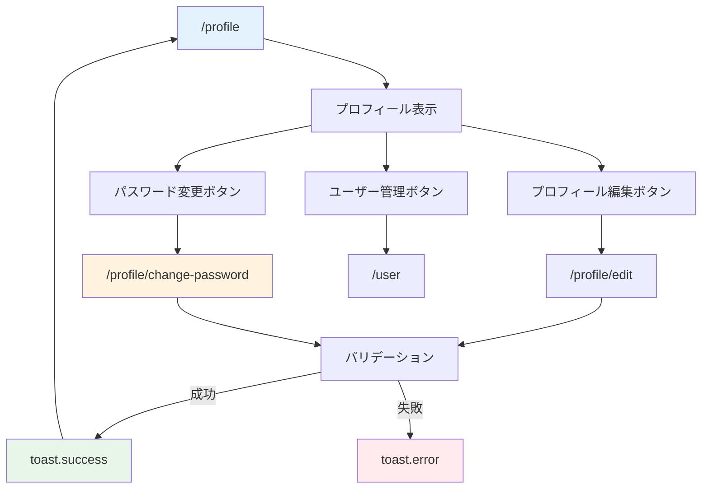
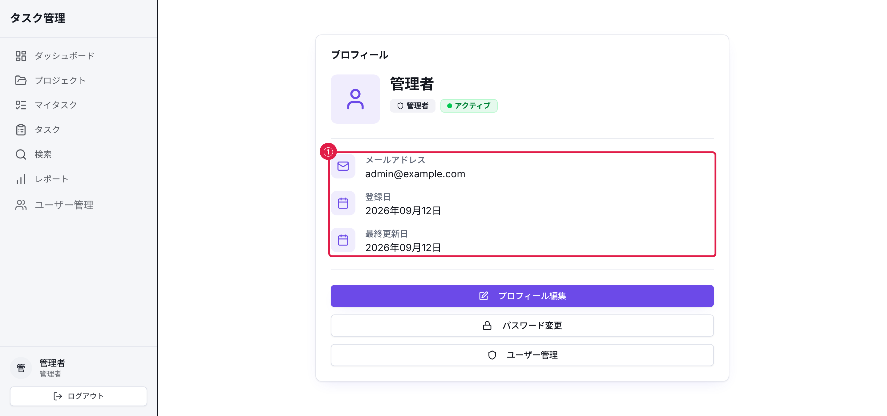
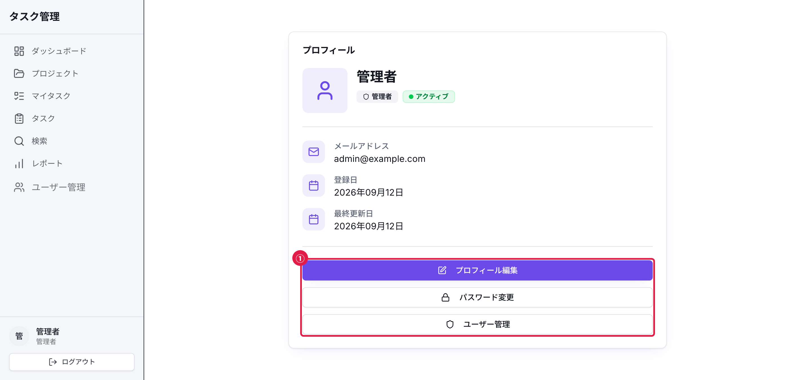
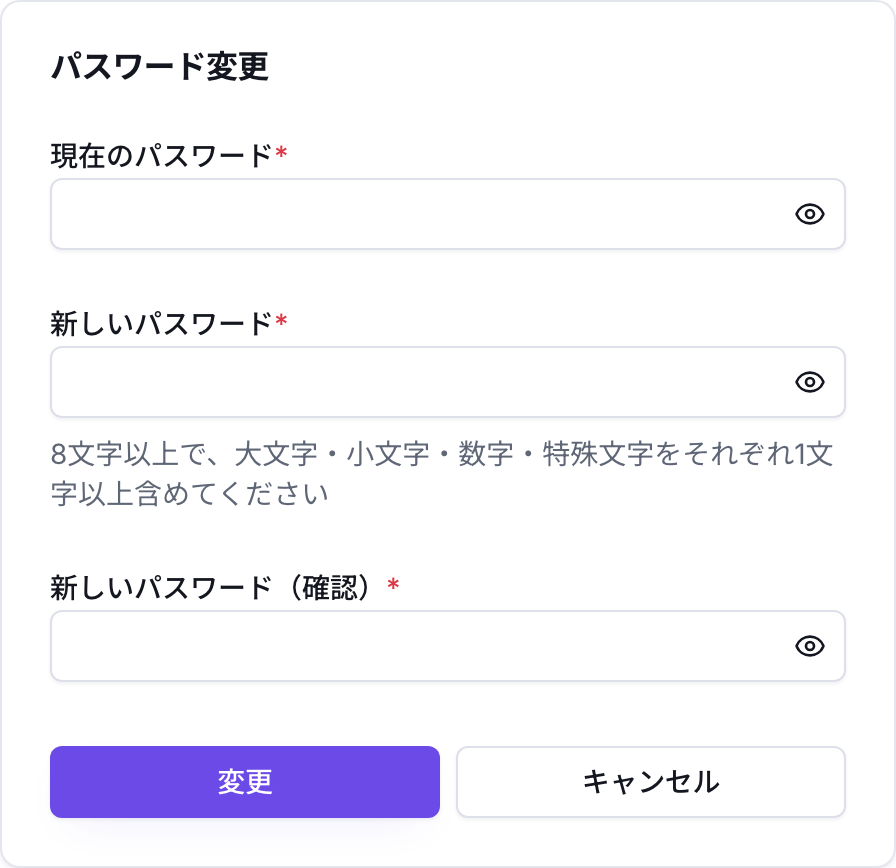
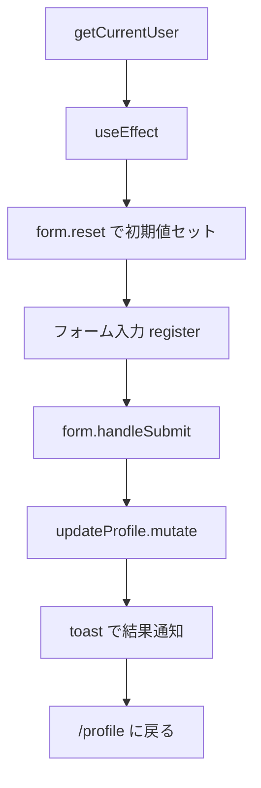
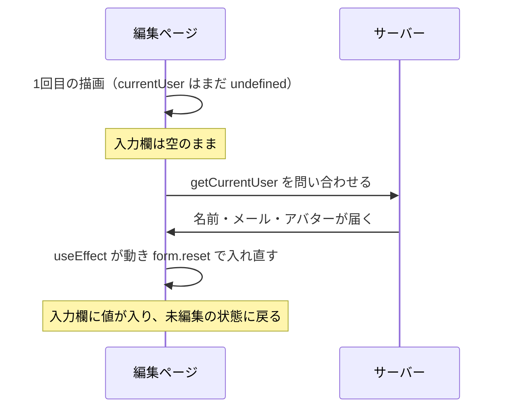
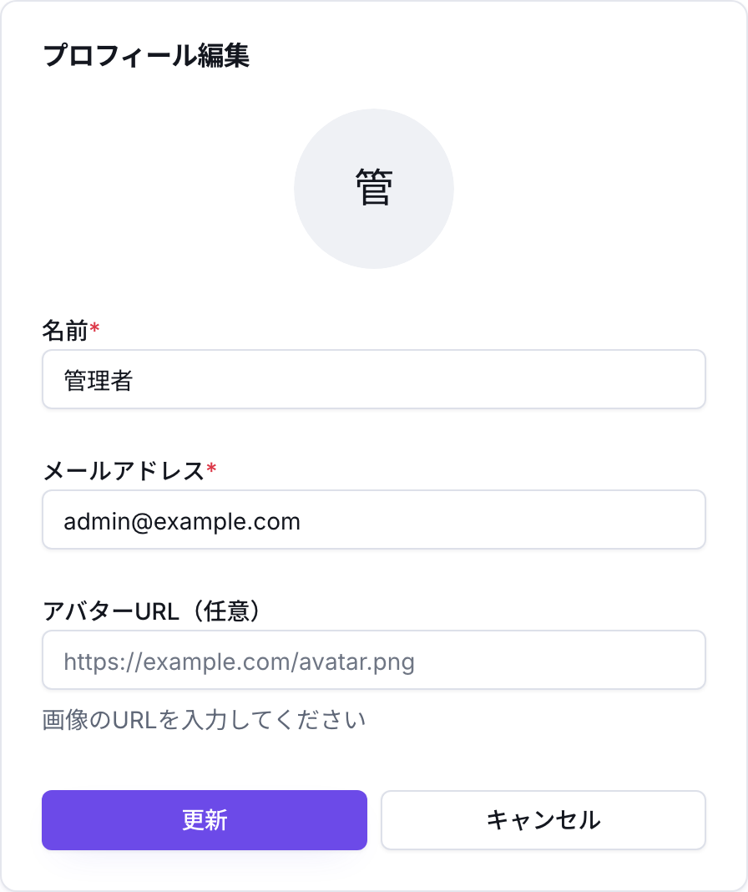

# Day 25: プロフィール編集を実装しよう

## 前回の振り返り

Day 24 では管理者専用のユーザー一覧ページを実装し、`api.auth.getCurrentUser` による権限チェックや Avatar・Badge を使ったユーザー情報の表示を学びました。管理者視点でのユーザー管理ができるようになったので今日は自分自身のプロフィール表示とパスワード変更に取り組みます。

---

## 今日のゴール

プロフィール表示ページ・プロフィール編集ページ・パスワード変更ページの3画面を実装します。自分の情報を確認・編集し、パスワードを安全に変更できるようにします。

この日はまずサーバー側の `updateProfile` と `changePassword` を自分で書きます。そのあと3画面をつなぎます。

スクリーンショット: 今日つくるプロフィールページです。


## なぜこれを作るのか

名前やメールは後から変わりますし、パスワードは定期的に変えたい場面があります。自分の情報を自分で確認・更新できる画面がないとそのたびに管理者へ頼むことになってしまいます。

> **例え話**: プロフィールページは
> 「SNSのマイページ」です。
> 自分の名前やアイコンを確認（表示）し、
> 設定画面で情報を更新（編集）できます。
> パスワード変更は銀行のATMで
> 暗証番号を変えるイメージです。

### プロフィール関連ページの構造


```mermaid
flowchart TD
    A["/profile"] --> B[プロフィール表示]
    B --> C[プロフィール編集ボタン]
    B --> D[パスワード変更ボタン]
    B --> E[ユーザー管理ボタン]
    C --> F["/profile/edit"]
    D --> G["/profile/change-password"]
    E --> H["/user"]
    F --> I[バリデーション]
    G --> I
    I -->|成功| J[toast.success]
    I -->|失敗| K[toast.error]
    J --> A

    style A fill:#e3f2fd
    style G fill:#fff3e0
    style J fill:#e8f5e9
    style K fill:#ffebee
```

この図の中心にいるのは `/profile` です。表示ページから編集とパスワード変更へ枝分かれし、どちらも終わると `/profile` へ戻ってきます。3画面をばらばらに置かず、1つの入口から出て同じ入口へ帰る形にすると読者は今どこにいるかを見失いません。編集とパスワード変更はどちらも検証（入力内容が条件を満たすかを調べる処理）を通り、成功時と失敗時で出すメッセージを変えます。

### やること / やらないこと

| やること | やらないこと |
|---------|-------------|
| プロフィール表示 | アバター画像のアップロード |
| プロフィール編集（名前・メール・アバターURL） | 二段階認証の設定 |
| パスワード変更フォーム | alert() の使用 |
| バリデーション実装 | |
| toast でフィードバック | |

## 始める前の前提

- ログインしてダッシュボードを開ける（`/profile` は今日の作成対象）
- Day 24 のユーザー管理で、本人と管理者の違いを確認済み
- パスワード変更を試すため練習用アカウントの現在のパスワードが分かっています
- 今日はプロフィール表示、プロフィール編集、パスワード変更の3画面を順番に確認します

### 新しく学ぶ概念

| 概念 | 読み方 | 役割 | 例え |
|------|--------|------|------|
| PasswordInput | パスワードインプット | パスワード入力の再利用コンポーネント | 目のアイコンで表示を切り替えられる入力欄 |
| changePassword | — | パスワード変更API | 暗証番号の変更 |
| updateProfile | — | プロフィール更新API | 名前やメールの編集を保存 |
| toast | トースト | 通知メッセージ（復習） | ポップアップ通知 |
| useForm + zod（復習） | — | フォーム管理とバリデーション（Day 14 参照） | 記入用紙のルール自動チェック |
| refine（Day 16 の復習） | リファイン | zod のカスタムバリデーション | 複数フィールドを横断して検証するルール |

> **今日のゴールライン**: 最初の Step 0 はAPIの実装で、読む目安は15分です。そのあと3画面を14ステップに分けて作ります。各ステップの目安は3〜5分です。プロフィール表示 → 編集 → パスワード変更を順番に追いかけるだけで完成します。全部を一度に理解しようとしなくて大丈夫です。

開発サーバーは前の Day から動かしたまま使います。止めてあるときは `npm run dev` で起動してから `http://localhost:3000` を開きます。

## 実装ステップ一覧

| ステップ | 作業内容 | 読む時間の目安 |
|---------|---------|---------|
| Step 0 | user.ts に updateProfile / changePassword を追記する | 15分 |
| Step 1 | プロフィールページの概要 | 3分 |
| Step 2 | ユーザーデータの取得 | 3分 |
| Step 3 | プロフィール情報の表示 | 5分 |
| Step 4 | ナビゲーションボタン | 5分 |
| Step 5 | パスワード変更ページの概要 | 3分 |
| Step 6 | パスワード変更フォームのインポートとスキーマ | 5分 |
| Step 7 | パスワード変更フォームの入力欄 | 5分 |
| Step 8 | パスワード変更の送信とエラー処理 | 5分 |
| Step 9 | パスワード変更の動作確認 | 3分 |
| Step 10 | 編集ページの設計を理解 | 3分 |
| Step 11 | 編集ページのインポートとスキーマ | 5分 |
| Step 12 | 編集ページのデータ取得・失敗表示・初期化 | 12分 |
| Step 13 | 編集フォームの入力欄 | 5分 |
| Step 14 | 編集の動作確認 | 3分 |

**読む時間の合計（仮）**: 約80分です。

表と各 Step に記した時間は、説明とコードを読む時間の仮の目安です。実測した値ではありません。コードの入力、動作確認、ダウンロードや起動の待ち時間、調べものには別に時間を取ってください。

---

### Step 0: user.ts に updateProfile / changePassword を追記する（読む目安: 15分）

**ゴール**: Day 24 で作った `src/server/api/routers/user.ts` に、`updateProfile` と `changePassword` を 完成版と同じ順番で追記します。今日はプロフィール表示 UI を作りますがその前に「更新先の API」が必要です。

Day 24 の `getAll` は管理者一覧の入口でした。今日は「本人が自分のプロフィールを更新する」「本人が自分のパスワードを変更する」という2本を足します。どちらも **`protectedProcedure`** なのでログイン済みユーザー本人のセッションを前提に動きます。

最初にDay 24 の import 群を次の形へ置き換えます。今日から使う `TRPCError`・`bcrypt`・`createSession`（および `SessionUser` 型）・`protectedProcedure` が増えます。`Prisma` はDBのエラー型を実行中に判定するため、`import type` から通常の `import` へ変えます。

```typescript
// filepath: src/server/api/routers/user.ts（Day 25 時点の import）
import { Prisma } from '@prisma/client';
import { TRPCError } from '@trpc/server';
import bcrypt from 'bcryptjs';
import { z } from 'zod';
import { USER_ROLE } from '@/lib/constant/roles';
import { createPasswordSchema } from '@/lib/password';
import { prisma } from '@/lib/prisma';
import { createSession, type SessionUser } from '@/lib/session';
import { adminProcedure, createTRPCRouter, protectedProcedure } from '../trpc';
import { USER_DETAIL_SELECT } from './_helpers/select';
import { isUserEmailUniqueConstraintError } from './_helpers/user-email-conflict';
```

増えた道具にはそれぞれ役目があります。`TRPCError` は「この条件では処理を続けない」とサーバー側から止めるためのエラーです。`bcrypt` はパスワードのハッシュ化（元に戻せない形への変換）と照合を受け持ちます。`createSession` はログイン状態を作り直す関数です。

セッション版数の整数上限値と、セッション再発行を安全に行うヘルパー関数を `userRouter` の手前に配置します。

```typescript
// filepath: src/server/api/routers/user.ts（定数と再発行ヘルパー）
const POSTGRES_INTEGER_MAX = 2_147_483_647;

async function tryReissueSession(
  path: string,
  user: SessionUser,
): Promise<boolean> {
  try {
    await createSession(user);
    return true;
  } catch {
    console.error('[auth] session reissue failed', {
      event: 'auth.session_reissue_failed',
      path,
      userId: user.id,
    });
    return false;
  }
}
```

PostgreSQL の `Int` 型の上限は `2_147_483_647` です。版数の加算による数値あふれを防ぐ境界として使います。

教材のひな型（scaffold）には外部の監視サービスやリクエスト追跡のライブラリはありません。そのため、外部依存を持たない安全なロガーとして `console.error` を使います。出力する項目は `event`、`path`、`userId` に絞り、トークンやパスワード、メールアドレスといった秘密情報をログへ流さない設計にします。

`userRouter` の前へ、本人更新とパスワード変更の入力スキーマを追加します。

```typescript
// filepath: src/server/api/routers/user.ts（userRouter の前に追加）
const profileUpdateSchema = z.object({
  name: z.string().min(1, '名前を入力してください'),
  email: z.string().email('有効なメールアドレスを入力してください'),
  avatar: z.string().url().optional().nullable(),
});
```

このスキーマが受け取るのは名前・メール・アバターURLの3つだけで、`role` や `isActive` は入っていません。なお `avatar` は URL の形しか検査していません。好きな外部サーバーのURLを入れられるのでその画像はコメント一覧などで同じプロジェクトの他メンバーの画面に読み込まれます。出所を絞る場合は許可するホストを配列で持ち、zod の `refine` で照合します。本人が自分のプロフィールを直すための入口なので権限や有効・無効を書き換える余地を最初から作らない形にしてあります。このスキーマにない `role` や `isActive` は入力から取り除かれます。保存する項目も `updateData` で名前・メール・アバターURLに限定しています。スキーマへ `role` を追加しても、保存項目は増えません。DBへの更新内容にも `role` を加えると、直接リクエストを組み立てた人が自分を管理者へ昇格させられます。

```typescript
// filepath: src/server/api/routers/user.ts（続き）
const changePasswordSchema = z.object({
  currentPassword: z.string().min(1, '現在のパスワードを入力してください'),
  newPassword: createPasswordSchema('新しいパスワードは8文字以上で入力してください'),
});
```

新しいパスワード側には `.regex(...)` が4本並びます。`.min(8)` だけだと `aaaaaaaa` のような単純な文字列も通ってしまうため大文字・小文字・数字・記号をそれぞれ1文字以上求めます。パスワードの長さ上限（72バイト）は bcrypt の制限です。UTF-8（文字コード規格）のバイト数は、半角英数字なら1文字1バイトですが日本語文字などは1文字で3〜4バイトを消費します。同じ条件をあとで画面側にも書きます。ブラウザ側の検査は入力ミスをその場で知らせるためのものでリクエストを自分で組み立てられる相手には効きません。最後に効くのはサーバーに置いたこのスキーマのほうです。

#### 0-1. まず updateProfile を追加する

`getAll` のあと、ルーターを閉じる `});` の前へ、今日は
`updateProfile` と `changePassword` をこの順で追記します。
Day 29 では `getAll` と `updateProfile` の間へ
`getById` / `update` を差し込むのでその場所を残しておきます。

```typescript
// filepath: src/server/api/routers/user.ts
// （getAll のあと、閉じる }); の前に追加）
  updateProfile: protectedProcedure.input(profileUpdateSchema).mutation(async ({ ctx, input }) => {
    const userId = ctx.session.userId;

    if (input.email) {
      const existingUser = await prisma.user.findFirst({
        where: {
          email: input.email,
          id: { not: userId },
        },
      });
```

最初に `userId` をセッションから取っています。本人更新なのでフォームから「どのユーザーを更新するか」は受け取りません。ここがこの手続きの守りです。もし更新先のIDを入力として受け取る形にすると送信内容を書き換えるだけで他人のプロフィールを上書きできてしまいます。`ctx.session` はサーバーが持っている値なのでリクエストを手で組み立てても差し替えられません。次に同じメールアドレスを別ユーザーが使っていないかを確認します。

```typescript
// filepath: src/server/api/routers/user.ts（続き）
      if (existingUser) {
        throw new TRPCError({
          code: 'CONFLICT',
          message: 'このメールアドレスは既に使用されています',
        });
      }
    }

    const updateData: Prisma.UserUpdateInput = {
      name: input.name,
      email: input.email,
    };
```

メールアドレスは一意でないと困るので見つかったら `CONFLICT` を返して止めます。ここで `updateData` を先にオブジェクトとして作っておくとあとから `avatar` のような任意項目だけ条件付きで足せます。

```typescript
// filepath: src/server/api/routers/user.ts（続き）
    if (input.avatar !== undefined) {
      updateData.avatar = input.avatar;
    }

    const updatedUser = await prisma.user
      .update({
        where: {
          id: userId,
          sessionVersion: ctx.session.version,
          isActive: true,
        },
        data: updateData,
        select: {
          ...USER_DETAIL_SELECT,
          updatedAt: true,
        },
      })
```

更新条件の `where` に `id` だけでなく `sessionVersion: ctx.session.version` と `isActive: true` を指定しています。これは CAS（Compare-And-Swap: 比較と入れ替え。更新対象が想定通りの条件（ID・版数・有効状態等）を保っているときだけ安全に更新する手法）の考え方です。

別端末でパスワードが変更されてセッションが無効化されていたり、アカウントが無効化されていたりした場合は更新対象が見つかりません。DBが返す `P2025`（更新対象なし）は `UNAUTHORIZED`（セッション失効）に変換します。次のコードを直前のブロックに続けて記入してください。

```typescript
// filepath: src/server/api/routers/user.ts（続き）
      .catch((err: unknown) => {
        if (
          err instanceof Prisma.PrismaClientKnownRequestError &&
          err.code === 'P2025'
        ) {
          throw new TRPCError({
            code: 'UNAUTHORIZED',
            message: 'セッションが無効になりました。再度ログインしてください',
          });
        }
```

事前の重複確認を通った2人が同じメールへ保存すると、DBの一意制約が片方を拒否します。`P2002`（一意制約違反）の対象がユーザーのメールだけの場合に `CONFLICT` を返します。次のコードを直前のブロックに続けて記入してください。

```typescript
// filepath: src/server/api/routers/user.ts（続き）
        if (isUserEmailUniqueConstraintError(err)) {
          throw new TRPCError({
            code: 'CONFLICT',
            message: 'このメールアドレスは既に使用されています',
          });
        }
```

別の制約違反や未知のエラーはそのまま投げ直します。DB更新が成功した場合だけ、この先へ進みます。次のコードを直前のブロックに続けて記入してください。

```typescript
// filepath: src/server/api/routers/user.ts（続き）
        throw err;
      });
```

`avatar` は任意項目なので渡されたときだけ足します。通常のプロフィール更新では `sessionVersion` を加算せず、現在のセッション版数 `ctx.session.version` を維持します。

```typescript
// filepath: src/server/api/routers/user.ts（続き）
    const sessionReissued =
      input.email === ctx.session.email ||
      (await tryReissueSession('user.updateProfile', {
        id: updatedUser.id,
        email: updatedUser.email,
        role: updatedUser.role,
        version: ctx.session.version,
      }));

    return { ...updatedUser, success: true, sessionReissued };
  }),
```

セッションの中にはメールアドレスが入っています。メールアドレスを変更したときは `tryReissueSession` を呼んで新しいメールアドレスを含むセッションへ更新します。

DB更新と Cookie の設定は独立した処理です。DB更新が成功したあとに Cookie 再発行が失敗した場合でも、完了した DB 更新はロールバックしません（部分成功）。その際は `sessionReissued: false` を返します。プロフィール更新では `sessionVersion` を増やさないため、他の端末のセッションは失効しません。ただし、この画面は最新値を入れた Cookie を保存できなかった端末の認証キャッシュを残しません。進行中の問い合わせを止め、キャッシュを消してからログイン画面へ移動します。パスワード変更はこれに加えて版数も増やすため、古い Cookie が失効します。

#### 0-2. 次に changePassword を追加する

ここから先の「（続き）」のブロックは`user.ts` の**末尾にある `});` の1行上**へ貼ります。ファイルの一番下に足すとルーターの外に出てしまい、英語のエラーで止まります。

ただし**最後のブロックだけはルーターを閉じる `});` を含みます**。そこまで来たらもとからあった `});` の1行を先に消してから貼ってください。閉じる行が最後の手続きの後ろへ移るためで、消し忘れると `});` が2つ並んでエラーになります。

```typescript
// filepath: src/server/api/routers/user.ts（続き）
  changePassword: protectedProcedure
    .input(changePasswordSchema)
    .mutation(async ({ ctx, input }) => {
      const userId = ctx.session.userId;

      const user = await prisma.user.findUnique({
        where: { id: userId },
        select: {
          password: true,
          isActive: true,
          sessionVersion: true,
        },
      });
```

ここでも更新対象は本人なので`userId` はセッションから取ります。現在のハッシュ済みパスワード、`isActive`、そして `sessionVersion` を取りに行きます。

```typescript
// filepath: src/server/api/routers/user.ts（続き）
      if (!user) {
        throw new TRPCError({
          code: 'UNAUTHORIZED',
          message: 'セッションが無効になりました。再度ログインしてください',
        });
      }

      if (!user.isActive) {
        throw new TRPCError({
          code: 'FORBIDDEN',
          message: 'このアカウントは無効化されています',
        });
      }
```

ユーザーが見つからない場合は `UNAUTHORIZED`（セッション失効）で止め、アカウントが無効化されている場合は `FORBIDDEN` を返します。

```typescript
// filepath: src/server/api/routers/user.ts（続き）
      if (user.sessionVersion !== ctx.session.version) {
        throw new TRPCError({
          code: 'UNAUTHORIZED',
          message: 'セッションが無効になりました。再度ログインしてください',
        });
      }

      if (!user.password) {
        throw new TRPCError({
          code: 'BAD_REQUEST',
          message: 'パスワードが設定されていません',
        });
      }
```

DB上のセッション版数とトークンの版数が一致しない場合は `UNAUTHORIZED` で止め、パスワード未設定の場合は `BAD_REQUEST` を返します。パスワード誤りとセッション失効はいずれも `UNAUTHORIZED` ですが、メッセージは異なります。

```typescript
// filepath: src/server/api/routers/user.ts（続き）
      const isPasswordValid = await bcrypt.compare(input.currentPassword, user.password);

      if (!isPasswordValid) {
        throw new TRPCError({
          code: 'UNAUTHORIZED',
          message: '現在のパスワードが正しくありません',
        });
      }

      if (ctx.session.version === POSTGRES_INTEGER_MAX) {
        throw new TRPCError({
          code: 'CONFLICT',
          message: 'セッションを更新できません。管理者にお問い合わせください',
        });
      }
```

`bcrypt.compare` で入力された現在のパスワードを照合します。不一致なら「現在のパスワードが正しくありません」と返します。また、セッション版数が上限値に達している場合は `CONFLICT` で止めます。

パスワード変更時は、他の端末や過去に取得されたセッションを確実に無効化するため、セッション版数を `+1` します。

```typescript
// filepath: src/server/api/routers/user.ts（続き）
      const hashedPassword = await bcrypt.hash(input.newPassword, 10);

      const updated = await prisma.user.updateMany({
        where: {
          id: userId,
          sessionVersion: ctx.session.version,
          password: user.password,
          isActive: true,
        },
        data: {
          password: hashedPassword,
          sessionVersion: { increment: 1 },
        },
      });
```

パスワード更新には `updateMany` を使い、CAS で条件を絞り込みます。`id`、`sessionVersion`、`password`、`isActive` がすべて一致しているときだけ更新が実行され、`sessionVersion` が 1 増えます。

```typescript
// filepath: src/server/api/routers/user.ts（続き）
      if (updated.count !== 1) {
        throw new TRPCError({
          code: 'UNAUTHORIZED',
          message: 'セッションが無効になりました。再度ログインしてください',
        });
      }

      const sessionReissued = await tryReissueSession(
        'user.changePassword',
        {
          id: userId,
          email: ctx.session.email,
          role: ctx.session.role,
          version: ctx.session.version + 1,
        },
      );

      return {
        success: true,
        sessionReissued,
        message: 'パスワードを変更しました',
      };
    }),
});
```

`updated.count` が 1 でない場合（count 0）、別のタブやリクエストで先にパスワードが変更されたか、アカウントが無効化されたことを意味します。このときはトークンを再発行せず `UNAUTHORIZED` で終了します。

更新に成功したら、DBを読み直さず `ctx.session.version + 1` を指定して新しいセッション Cookie を発行します。CASで増やした版数と同じ値を使うため、別の更新後の値を誤って採用しません。

Cookie 再発行が失敗した場合は `sessionReissued: false` を返します。DBのパスワード変更は取り消されません。フロントエンド側はこの返り値を見て再ログイン画面へ安全に誘導します。

#### 0-3. root.ts は Day 24 の登録をそのまま使う

Day 24 で `user: userRouter` は登録済みです。今日は `user.ts` の中身に 2 本 procedure を増やしただけなので`root.ts` の追記はありません。つまり `api.user.updateProfile` と `api.user.changePassword` は**既存の `userRouter` 登録の中で自動的に増える** 形です。

**確認ポイント**:
- `src/server/api/routers/user.ts` に `updateProfile` と `changePassword` を 完成版と同じ処理順で追記できました
- `updateProfile` が CAS 条件と `tryReissueSession` による安全なセッション再発行を持っています
- `changePassword` が CAS `updateMany` による版数インクリメントと count 0 失効判定を持っています
- `root.ts` は Day 24 の `user: userRouter` のままでよいと理解できました
- `npx tsc --noEmit` で型エラーが出ていません

### Step 1: プロフィールページの概要（読む目安: 3分）

**ゴール**: プロフィールページに
表示する情報を理解します。

#### ディレクトリ構造

```
src/app/profile/
├── page.tsx            （プロフィール表示）
├── edit/
│   └── page.tsx        （プロフィール編集）
└── change-password/
    └── page.tsx        （パスワード変更）
```

`profile/` の下へ `edit/` と `change-password/` を置くとURL の形とフォルダの形がそのまま重なります。`/profile/edit` を開いたとき Next.js が探しに行く先は `src/app/profile/edit/page.tsx` です。この対応は Day 29 の動的ルーティングまで変わらないので迷ったらフォルダの並びを見れば行き先が分かります。まずフォルダだけを先に作っておきます。

```bash
# filepath: ターミナル
# 今日使うディレクトリを先に作る
mkdir -p src/app/profile/edit
mkdir -p src/app/profile/change-password
find src/app/profile -maxdepth 1 -type d
```

`mkdir -p` の `-p` は途中のフォルダが無ければ一緒に作り、すでにあってもエラーにしない指定です。だから何度実行しても結果は同じになります。最後の `find` はいま作ったフォルダが本当にできたかを一覧で見せるための確認です。

**確認ポイント**:
- `edit/` と `change-password/` が表示されました
- 各 `page.tsx` は該当 Step で新規作成します

#### 表示する情報一覧

| 項目 | プロパティ | 表示形式 |
|------|-----------|---------|
| アバター | avatar | 画像 or 頭文字 |
| 名前 | name | テキスト |
| ロール | role | UserRoleBadge（ADMINのみ表示） |
| ステータス | isActive | Badge |
| メール | email | テキスト |
| 登録日 | createdAt | yyyy年MM月dd日 |
| 更新日 | updatedAt | yyyy年MM月dd日 |

#### ページ内のボタン

| ボタン | 遷移先 | 条件 |
|-------|--------|------|
| プロフィール編集 | /profile/edit | 全ユーザー |
| パスワード変更 | /profile/change-password | 全ユーザー |
| ユーザー管理 | /user | ADMIN のみ |

> `api.auth.getCurrentUser` で
> 自分の情報を取得します。
> useSession ではなく tRPC のAPIを
> 使うのがこのアプリの設計です。

---

### Step 2: ユーザーデータの取得（読む目安: 3分）

**ゴール**: getCurrentUser APIで
ログイン中のユーザー情報を取得します。

**実装**:

```typescript
// filepath: src/app/profile/page.tsx
'use client';

import { format } from 'date-fns';
import { ja } from 'date-fns/locale';
import {
  Calendar, Edit, Lock, Mail,
  Shield, User,
} from 'lucide-react';
import { useRouter }
  from 'next/navigation';
import { useEffect } from 'react';
import { AppLayout }
  from '@/component/layout/app-layout';
import {
  Avatar, AvatarFallback, AvatarImage,
} from '@/component/ui/avatar';
```

最初の取り込みは日付の整形と画面の部品です。`format` で登録日を `2026年04月01日` の形に整えます。この数字の書式では `ja` の有無で表示は変わりません。月名や曜日を日本語で出すときに使います。`lucide-react` から取る6つはメールや鍵などのアイコンです。`Avatar` 系の3つは画像と、画像が無いときの代わりの表示を組み合わせる部品です。

残りのコンポーネントをインポートします。

```typescript
// filepath: src/app/profile/page.tsx
// UI コンポーネントと定数のインポート
import { Button }
  from '@/component/ui/button';
import {
  Card, CardContent,
  CardHeader, CardTitle,
} from '@/component/ui/card';
import { PageLoadingSpinner }
  from '@/component/ui/loading-spinner';
import { Separator }
  from '@/component/ui/separator';
import {
  ActiveStatusBadge, UserRoleBadge,
} from '@/component/ui/user-badges';
import { USER_ROLE }
  from '@/lib/constant/roles';
import { api } from '@/trpc/react';
```

> `UserRoleBadge` と `ActiveStatusBadge` は
> 再利用可能なバッジコンポーネントです。
> 定数 `USER_ROLE` を使うと文字列リテラルの
> タイポを防げます。

```typescript
// filepath: src/app/profile/page.tsx
// データ取得とリダイレクト
export default function ProfilePage() {
  const router = useRouter();
  const {
    data: currentUser,
    isLoading,
  } = api.auth.getCurrentUser.useQuery();

  useEffect(() => {
    if (!isLoading && !currentUser) {
      router.push('/login');
    }
  }, [currentUser, isLoading, router]);
```

自分の情報を `api.auth.getCurrentUser` で取っているのは名前やメールを信じてよい場所から受け取るためです。ブラウザに保存された値は書き換えられますがこの問い合わせはサーバーがセッションから本人を特定して返します。`useEffect` の中で `/login` へ送っているのは未ログインの人に空のプロフィール枠を見せないための案内です。ただしこの転送は見た目の整理にすぎません。本当の門番は Step 0 で使った `protectedProcedure` のほうにあり、画面を素通りしてAPIを直接叩かれてもそちらが先に弾きます。

ローディング中は共通スピナーを表示します。

```typescript
// filepath: src/app/profile/page.tsx
  // PageLoadingSpinner で統一的に表示
  if (isLoading) {
    return <PageLoadingSpinner />;
  }
```

> `PageLoadingSpinner` は
> `@/component/ui/loading-spinner` から
> インポートする共通コンポーネントです。
> 各ページのローディング表示を統一します。

```typescript
// filepath: src/app/profile/page.tsx
// 未ログインチェック
  if (!currentUser) {
    return null;
  }
```

> `useEffect` でローディング完了後に
> `currentUser` が null だったら
> ログインページへリダイレクトします。
> ローディング中は `return null` にせず、
> スピナーを表示するようにします。

**確認ポイント**:
- `api.auth.getCurrentUser.useQuery()` の結果を `currentUser` で受け取っています
- `currentUser` が無い場合は `null` を返し、`useEffect` のリダイレクトを待ちます

この時点ではページ本体の `return` と `ProfilePage` の閉じ括弧をまだ書いていないため、ブラウザでは確認しません。次の Step でページの骨格を閉じてから確認します。

---

### Step 3: プロフィール情報の表示（読む目安: 5分）

**ゴール**: アバター、名前、バッジ、
詳細情報をCard内に表示します。

Step 2 で書いた `if (!currentUser)` の後に
`return` 文を書きます。
全体は `AppLayout > div > Card` の構造です。

**実装**:

まず `return` 文とページの骨格です。

```typescript
// filepath: src/app/profile/page.tsx
// ページ全体のreturn文
return (
  <AppLayout>
    <div className="container mx-auto
      max-w-2xl space-y-6 py-8">
      <Card>
        <CardHeader>
          <CardTitle>
            プロフィール
          </CardTitle>
        </CardHeader>
        <CardContent
          className="space-y-6">
          {/* 以降のコードをここに追加 */}
        </CardContent>
      </Card>
    </div>
  </AppLayout>
);
}
```

**確認ポイント**:
- return 文の骨格を書きました
- ログイン中はプロフィールの枠が表示されます
- 未ログインではローディング後にログインページへ移ります

上の `CardContent` の中に、以下のアバター・
名前ブロックを配置します。
`<div className="flex gap-4">` で
横並びにするのがポイントです。

```typescript
{/* filepath: src/app/profile/page.tsx */}
{/* アバターと名前の表示（flex gap-4 で横並び） */}
<div className="flex gap-4">
  <Avatar className="w-20 h-20
    rounded-lg">
    {currentUser.avatar && (
      <AvatarImage
        src={currentUser.avatar}
        alt=""
        className="object-cover" />
    )}
    <AvatarFallback
      className="rounded-lg
        bg-primary/10">
      <User className="w-10 h-10
        text-primary" />
    </AvatarFallback>
  </Avatar>
```

> ここで `<div className="flex gap-4">` はまだ閉じていません。次のコードブロックで `</div>` を追加して閉じます。

**確認ポイント**:
- `<div className="flex gap-4">` で囲んでいます
- `currentUser.avatar && (...)` で、アバターがあるときだけ画像を表示しています

```typescript
{/* filepath: src/app/profile/page.tsx */}
{/* 名前とバッジ（flex gap-4 の右側） */}
  <div className="flex-1">
    <h1 className="text-2xl font-bold">
      {currentUser.name}
    </h1>
    <div className="flex gap-2 mt-2">
      {currentUser.role
        === USER_ROLE.ADMIN && (
        <UserRoleBadge
          role={currentUser.role} />
      )}
      <ActiveStatusBadge
        isActive={currentUser.isActive} />
    </div>
  </div>
</div>
```

> `UserRoleBadge` は管理者のみ表示します。
> `USER_ROLE.ADMIN` と比較して条件付き
> レンダリングします。

**確認ポイント**:
- ロールバッジが表示されます
- ステータスバッジが表示されます
- `</div>` で `flex gap-4` を閉じています

```typescript
{/* filepath: src/app/profile/page.tsx */}
{/* メールアドレスの表示 */}
<Separator />
<div className="space-y-4">
  <div className="flex
    items-start gap-4">
    <div className="flex items-center
      justify-center w-10 h-10
      rounded-lg bg-primary/10">
      <Mail className="w-5 h-5
        text-primary" />
    </div>
    <div className="flex-1">
      <p className="text-sm font-medium
        text-muted-foreground">
        メールアドレス
      </p>
      <p className="text-base">
        {currentUser.email}
      </p>
    </div>
  </div>
```

`space-y-4` の `</div>` はここではまだ閉じません。このあとの登録日と最終更新日の行も同じ `space-y-4` の中に入れます。そのため最終更新日の行を書き終えたところで閉じます。

メールアドレスの行はアイコンを入れた四角と本文を `flex` で横に並べた形です。`items-start` を指定してあるので本文が2行になってもアイコンは上端でそろいます。左の `w-10 h-10` の四角は飾りなので消しても文字は表示されます。この形をこのあとの登録日と最終更新日でも繰り返すため3つの行が同じ見た目でそろいます。

**確認ポイント**: `currentUser.email` を表示する行を書き、メールアドレスの行を閉じました。外側の `space-y-4` はまだ閉じていないため、ブラウザ確認は3行を書き終えてから行います。

```typescript
{/* filepath: src/app/profile/page.tsx */}
{/* 登録日の表示 */}
<div className="flex items-start gap-4">
  <div className="flex items-center
    justify-center w-10 h-10
    rounded-lg bg-primary/10">
    <Calendar className="w-5 h-5
      text-primary" />
  </div>
  <div className="flex-1">
    <p className="text-sm font-medium
      text-muted-foreground">登録日</p>
    <p className="text-base">
      {currentUser.createdAt
        ? format(
            new Date(currentUser.createdAt),
            'yyyy年MM月dd日',
            { locale: ja })
        : '-'}
    </p>
  </div>
</div>
```

日付は `format(new Date(...), 'yyyy年MM月dd日', { locale: ja })` で整えます。この書き方では `yyyy` や `MM` のように数字を並べるだけなので`locale: ja` を外しても表示は同じです。付けてあるのはあとで `MMMM` のような月名の書き方へ変えたときそこだけ英語へ戻るのを防ぐためです。`new Date(...)` を挟むのは念のためで、このアプリは日時を `Date` のまま受け取る設定にしてあります。前に付いた `currentUser.createdAt ? ... : '-'` は値が無いまま `format` を呼んで例外が起き、Day 26 のエラー画面へ飛ぶのを防ぐための分岐です。日付が空のユーザーには代わりに `-` が1つ表示されます。

**確認ポイント**: 登録日は `currentUser.createdAt` を `yyyy年MM月dd日` 形式へ変換しています。外側の `space-y-4` は次の最終更新日のあとで閉じます。

```typescript
{/* filepath: src/app/profile/page.tsx */}
{/* 最終更新日の表示 */}
<div className="flex items-start gap-4">
  <div className="flex items-center
    justify-center w-10 h-10
    rounded-lg bg-primary/10">
    <Calendar className="w-5 h-5
      text-primary" />
  </div>
  <div className="flex-1">
    <p className="text-sm font-medium
      text-muted-foreground">
      最終更新日
    </p>
    <p className="text-base">
      {currentUser.updatedAt
        ? format(
            new Date(currentUser.updatedAt),
            'yyyy年MM月dd日',
            { locale: ja })
        : '-'}
    </p>
  </div>
</div>
</div>
```

最後の `</div>` がメールアドレスの行で開けたままにしていた `space-y-4` の閉じタグです。3つの行が1つの `space-y-4` に入るので行と行の間隔は 16px でそろいます。

中身は登録日とほぼ同じで、参照する項目が `updatedAt` に変わっただけです。同じ形をもう一度書いているのはあとで片方の並びだけ変えたくなったときに手を入れやすくするためです。この `updatedAt` はStep 0 の `updateProfile` が `select` に足して返している項目です。だから編集を保存して戻ってくるとこの行の日付が新しくなります。

**確認ポイント**: 外側の `space-y-4` まで閉じたので、ブラウザでメールアドレス・登録日・最終更新日が表示されることを確認しましょう。

> `Separator` は区切り線を表示する
> shadcn/ui のコンポーネントです。
> セクションを視覚的に分離します。

**確認ポイント**:
- アバターと名前が表示されます
- バッジが正しく色分けされます
- メール・登録日・最終更新日が表示されます

スクリーンショット: 下の画像は Step 4 まで書き終えた完成後の画面です。赤枠の中がこの Step で足した3行です。いまの自分の画面にはその下の3つのボタンがまだ出ていません。ボタンは Step 4 で足します。



---

### Step 4: ナビゲーションボタン（読む目安: 5分）

**ゴール**: 編集・パスワード変更・
ユーザー管理へのボタンを配置します。

**実装**:

```typescript
{/* filepath: src/app/profile/page.tsx */}
{/* 編集・パスワード変更ボタン */}
<Separator />
<div className="flex flex-col gap-3">
  <Button className="w-full"
    onClick={() =>
      router.push('/profile/edit')}>
    <Edit className="w-4 h-4 mr-2" />
    プロフィール編集
  </Button>
  <Button variant="outline"
    className="w-full"
    onClick={() => router.push(
      '/profile/change-password')}>
    <Lock className="w-4 h-4 mr-2" />
    パスワード変更
  </Button>
```

2つのボタンがやっているのは`router.push(...)` で行き先を変えることだけです。`<a href="...">` で書くとページ全体が読み込み直されますが`router.push` なら今のページの中で必要な部分だけが差し替わります。見た目の違いは `variant` で付けていて塗りつぶしの既定と枠線だけの `outline` を使い分けます。押してほしい順に濃さを変える、という考え方です。

```typescript
{/* filepath: src/app/profile/page.tsx */}
{/* 管理者用ユーザー管理ボタン */}
  {currentUser.role === USER_ROLE.ADMIN && (
    <Button variant="outline"
      className="w-full"
      onClick={() =>
        router.push('/user')}>
      <Shield
        className="w-4 h-4 mr-2" />
      ユーザー管理
    </Button>
  )}
</div>
```

ここでやっているのはボタンを隠すことだけで、`/user` に入れなくなるわけではありません。URL を直接打てば一般ユーザーでもそのページを開けます。実際の線引きは別の2か所にあります。`/user` のページ自身が管理者かどうかを見て「アクセス権限がありません」と表示し、一覧を返す `user.getAll` はサーバー側で管理者だけを通します。この `&&` は押しても断られるボタンを最初から見せないための配慮です。見た目の制御と権限の制御は別々に用意します。

Step 3 の骨格で、タグと `ProfilePage` 関数は閉じてあります。ボタンは `CardContent` の内側へ追加し、ファイル末尾の閉じタグは残してください。

**確認ポイント**:
- 3つのボタンが縦に並びます
- 管理者にだけユーザー管理ボタンが出ます
- ファイルを保存してエラーが出ていません

スクリーンショット: 3つのボタンが縦に並びます。



いちばん下の「ユーザー管理」は管理者にだけ出ます。読者は `admin@example.com` で入っているので3つとも並びます。

#### ボタンのスタイル使い分け

| ボタン | variant | 理由 |
|-------|---------|------|
| プロフィール編集 | default（塗り） | メインアクション |
| パスワード変更 | outline（枠線） | サブアクション |
| ユーザー管理 | outline（枠線） | サブアクション |

> `currentUser.role === USER_ROLE.ADMIN` で
> 条件付きレンダリングをしています。
> 管理者にだけ「ユーザー管理」ボタンが
> 表示されます。

プロフィールを URL の手入力なしで開けるよう、
Day 08 の `app-layout.tsx` も更新します。
デスクトップのユーザー情報を囲む `<div>` を
次の `Link` に置き換え、中の表示は残します。

```typescript
{/* filepath: src/component/layout/app-layout.tsx */}
<Link
  href="/profile"
  className="mb-3 flex items-center gap-3
    rounded-md px-2 py-2
    hover:bg-sidebar-accent"
>
  {/* 既存のユーザーアイコンと名前を残す */}
</Link>
```

`<div>` を `Link` に置き換えるとサイドバーのユーザー情報そのものがプロフィールへの入口になります。中の表示は触らないので見た目は変わりませんが押せる場所になります。`hover:bg-sidebar-accent` を付けているのは指を乗せたときに背景色が変わって押せると目で分かるようにするためです。

Day 08 の末尾にあるメインコンテンツ部分は
モバイル用ナビゲーションを持つ形へ置き換えます。

```typescript
{/* filepath: src/component/layout/app-layout.tsx */}
<div className="flex min-w-0 flex-1 flex-col">
  <nav className="flex gap-2 overflow-x-auto
    border-b p-2 md:hidden">
    {menuItems.map((item) => (
      <Link key={item.path}
        href={item.path}
        className="whitespace-nowrap
          rounded-md px-3 py-2 text-sm">
        {item.text}
      </Link>
    ))}
    {session.user.role === USER_ROLE.ADMIN && (
      <Link href="/user"
        className="whitespace-nowrap
          rounded-md px-3 py-2 text-sm">
        ユーザー管理
      </Link>
    )}
```

`md:hidden` が付いた `<nav>` は画面が広いときは消えてサイドバーに任せ、狭いときだけ現れます。中では `menuItems` を `map` で回してリンクへ変えるのでメニューが増えてもこの部分は書き直しません。管理者向けの「ユーザー管理」だけは `session.user.role === USER_ROLE.ADMIN` で囲み、一般ユーザーの画面には出しません。ただしリンクを隠すのは押しても行けない場所を見せない配慮にすぎません。`/user` を直接開かれたときに止めるのはDay 24 で使ったサーバー側の `adminProcedure` のほうです。

```typescript
    {/* filepath: src/component/layout/app-layout.tsx（続き） */}
    <Link href="/profile"
      className="whitespace-nowrap
        rounded-md px-3 py-2 text-sm">
      プロフィール
    </Link>
  </nav>
  <main className="flex-1 overflow-y-auto p-6">
    {children}
  </main>
</div>
```

`<main>` に `flex-1` を付けると上のナビゲーションが使った分を除いた残り全部の高さを本文が受け取ります。`overflow-y-auto` は本文が長いときに本文の中だけをスクロールさせる指定です。これが無いとページ全体が伸び、狭い画面ではメニューが上へ流れて見えなくなります。

**確認ポイント**:
- デスクトップのユーザー情報から `/profile` を開けます
- モバイル幅でも全メニューとプロフィールを開けます
- 「ユーザー管理」はモバイルでも ADMIN だけに出ます

---

### Step 5: パスワード変更ページの概要（読む目安: 3分）

**ゴール**: パスワード変更ページの
構成とAPIを理解します。

`src/app/profile/change-password/page.tsx` は
次の実装セクションで新規作成します。この時点では
空ファイルを作らず、入力項目を先に確認します。

```bash
# filepath: ターミナル
test -d src/app/profile/change-password \
  && echo "change-password directory ready"
```

`test -d` はフォルダがあるかどうかだけを調べるコマンドで、あるときだけ後ろの `echo` が動きます。Step 1 で作ったフォルダがそのまま残っているかを、ページを書き始める前に確かめておきます。何も表示されなければStep 1 の `mkdir -p` をもう一度実行してください。

**確認ポイント**:
- 作成先ディレクトリの準備完了が表示されました
- 空の `page.tsx` はまだ作っていません

#### パスワード変更の入力項目

| 項目 | name属性 | バリデーション |
|------|---------|--------------|
| 現在のパスワード | currentPassword | 必須（min(1)） |
| 新しいパスワード | newPassword | 8文字以上 + 大文字 + 小文字 + 数字 + 特殊文字 |
| 確認用パスワード | confirmPassword | newPassword と一致（refine） |

#### 使用するAPI

| API | メソッド | 用途 |
|-----|---------|------|
| api.user.changePassword | useMutation | パスワード変更 |

> `changePassword` はサーバー側で
> 現在のパスワードの照合と新パスワードの
> ハッシュ化を行います。
>
> サーバーの `changePasswordSchema` では
> `newPassword` に次のルールが定義されています。
> `min(8)` に加えて`[A-Z]`、`[a-z]`、
> `[0-9]`、`[^A-Za-z0-9]` をそれぞれ
> 1文字以上含む必要があります。

---

### Step 6: パスワード変更フォームのインポートとスキーマ（読む目安: 5分）

**ゴール**: useForm + zod でフォームの
状態管理とバリデーションを定義します。

**実装**:

```typescript
// filepath: src/app/profile/change-password/page.tsx
'use client';

// react-hook-form + zod
import { zodResolver }
  from '@hookform/resolvers/zod';
import { useQueryClient }
  from '@tanstack/react-query';
import { AlertCircle } from 'lucide-react';
import { useRouter }
  from 'next/navigation';
import { useForm } from 'react-hook-form';
import toast from 'react-hot-toast';
import { z } from 'zod';
import { AppLayout }
  from '@/component/layout/app-layout';
import {
  Alert, AlertDescription,
  AlertTitle,
} from '@/component/ui/alert';
```

ここで取り込む部品が今日のフォームの土台です。`useForm` は入力値とエラーを預かり、`z` は満たす条件を定義します。`zodResolver` がその2つをつなぎます。`useQueryClient` は TanStack Query のキャッシュ全体を操作するフックです。セッションの再発行に失敗したとき、進行中の問い合わせを止めてキャッシュを消すために使います。`Alert` 系はサーバーから返ったエラーを画面の上に出す部品です。

**確認ポイント**:
- `useForm`, `zodResolver`, `z`, `useQueryClient` がインポートされています
- `useQueryClient` が `@tanstack/react-query` からインポートされています

フォーム用のコンポーネントをインポートします。

```typescript
// filepath: src/app/profile/change-password/page.tsx
// フォーム部品と PasswordInput
import { Button }
  from '@/component/ui/button';
import {
  Card, CardContent,
  CardHeader, CardTitle,
} from '@/component/ui/card';
import { Label }
  from '@/component/ui/label';
import { PasswordInput }
  from '@/component/ui/password-input';
import { isPasswordWithinBcryptLimit }
  from '@/lib/password';
import { isUnknownResult }
  from '@/lib/query-error';
import { api } from '@/trpc/react';
```

> `PasswordInput` はパスワードの表示/非表示
> トグル（Eye/EyeOff）を内蔵したコンポーネントです。
> ページ側で `showPassword` を管理する必要がありません。

zod スキーマでバリデーションを定義します。
`refine` で2つのフィールドの一致をチェックします。

#### refine とは

`refine` は zod の「カスタムバリデーション」機能です。
`min` や `email` のような単一フィールドのチェックでは足りないとき複数フィールドを横断して検証するルールを追加できます。

| 通常のバリデーション | refine |
|---|---|
| 1つのフィールドだけチェック | 複数フィールドを比較してチェック |
| `z.string().regex(/[A-Z]/)` | `.refine((data) => data.a === data.b)` |
| 「大文字を含むか」 | 「新パスワードと確認が一致するか」 |

`path` オプションでエラーを表示するフィールドを
指定できます。

```typescript
// filepath: src/app/profile/change-password/page.tsx
// パスワード変更用スキーマ: currentPassword
const changePasswordCurrentSchema =
  z.object({
  currentPassword: z.string()
    .min(1, '現在のパスワードを'
      + '入力してください'),
});
```

画面側のスキーマは1つの大きな定義を書かず少しずつ足していきます。まずは現在のパスワードだけを持つ形から始めます。`min(1)` は「1文字以上」、つまり空欄のまま送信できないという意味です。ここでは正しいパスワードかどうかまでは分かりません。入力されたかどうかだけを見ます。合っているかを確かめられるのはハッシュを持っているサーバー側だけです。

```typescript
// filepath: src/app/profile/change-password/page.tsx
// newPassword のルールを追加（前半）
const changePasswordPasswordSchema = changePasswordCurrentSchema.extend({
  newPassword: z.string().min(
    8,
    '新しいパスワードは' + '8文字以上で入力してください',
  )
    .regex(
      /[A-Z]/,
      'パスワードには大文字を'
        + '含める必要があります',
    )
    .regex(
      /[a-z]/,
      'パスワードには小文字を'
        + '含める必要があります',
    )
```

`extend` は前のスキーマへ項目を足した新しいスキーマを作る書き方です。ここで足す `newPassword` の条件はStep 0 でサーバーに書いた `changePasswordSchema` とそろえます。メッセージの文言まで同じにしておくと画面に出る文とサーバーから返る文が食い違いません。`.regex(/[A-Z]/, ...)` は「大文字を1文字以上含むこと」の指定で、第2引数が満たせなかったときの説明文です。

```typescript
// filepath: src/app/profile/change-password/page.tsx
// 同じ newPassword ルールの続き
    .regex(
      /[0-9]/,
      'パスワードには数字を'
        + '含める必要があります',
    )
    .regex(
      /[^A-Za-z0-9]/,
      'パスワードには特殊文字を'
        + '含める必要があります',
    )
    .refine(
      isPasswordWithinBcryptLimit,
      'パスワードはUTF-8で72バイト以内にしてください',
    ),
});
```

残りの2本で数字と記号を求め、最後の `refine` で UTF-8 の72バイト上限を確認します。`[^A-Za-z0-9]` の先頭にある `^` は「これ以外」という意味なので英字と数字のどちらにも当てはまらない文字、つまり `!` や `#` のような記号が1文字以上あるかを見ます。4本の `.regex` は最初の1本で打ち切られるわけではありません。zod は失敗したルールをすべて集めて返します。`abc` を渡すと8文字未満・大文字なし・数字なし・記号なしの4件が同時に返ります。小文字の条件だけは満たしています。画面へ1件しか出ないのはreact-hook-form が既定で最初の1件だけを表示するためです（`criteriaMode: 'firstError'`）。だから直すたびに次の指摘が現れます。サーバー側の `safeParse` は react-hook-form を通らないので4件すべてがそのまま手に入ります。

```typescript
// filepath: src/app/profile/change-password/page.tsx
// confirmPassword を追加してベーススキーマにする
const changePasswordBaseSchema =
  changePasswordPasswordSchema.extend({
  confirmPassword: z.string()
    .min(1, '確認用パスワードを'
      + '入力してください'),
});
```

確認用の欄をここで足します。この時点ではまだ空でないことしか見ていないので新しいパスワードと一致しているかは判定できません。1つの項目だけを見る検査には他の項目と見比べる手段が無いためです。次のブロックの `refine` がその役目を引き受けます。

```typescript
// filepath: src/app/profile/change-password/page.tsx
// confirmPassword の一致チェックを追加
const changePasswordSchema =
  changePasswordBaseSchema.refine(
  (data) => data.newPassword
    === data.confirmPassword,
  {
    message: 'パスワードが一致しません',
    path: ['confirmPassword'],
  },
);
type ChangePasswordFormValues =
  z.infer<typeof changePasswordSchema>;
```

`refine` は1項目ずつの検査が終わったあとで値どうしを見比べるための書き方です。`path: ['confirmPassword']` を付けているのはエラーの置き場所を確認欄に決めるためです。指定しないとフォーム全体のエラー扱いになり、どの欄を直せばいいのかが読者に伝わりません。この一致チェックは画面側だけの決まりです。Step 0 のサーバー側スキーマに `confirmPassword` は無く、送信時もこの項目は送りません。だから打ち間違いは送る前にここで止める必要があります。

**確認ポイント**:
- スキーマ名が `changePasswordSchema` です
- 型名が `ChangePasswordFormValues` です
- `newPassword` に 4つの `regex()` を追加しています
- `refine` で一致チェックしています
- `path: ['confirmPassword']` でエラー表示先を指定しています

#### サーバーと合わせるパスワード要件

`src/server/api/routers/user.ts` の
`changePasswordSchema` では`newPassword` に
次のルールが設定されています。

| ルール | zod の書き方とサーバーが返すメッセージ |
|------|--------------------------------------|
| 8文字以上 | **zod**: `.min(8)`<br>**メッセージ**: `新しいパスワードは8文字以上で入力してください` |
| 大文字を1文字以上含む | **zod**: `.regex(/[A-Z]/)`<br>**メッセージ**: `パスワードには大文字を含める必要があります` |
| 小文字を1文字以上含む | **zod**: `.regex(/[a-z]/)`<br>**メッセージ**: `パスワードには小文字を含める必要があります` |
| 数字を1文字以上含む | **zod**: `.regex(/[0-9]/)`<br>**メッセージ**: `パスワードには数字を含める必要があります` |
| 特殊文字を1文字以上含む | **zod**: `.regex(/[^A-Za-z0-9]/)`<br>**メッセージ**: `パスワードには特殊文字を含める必要があります` |

> 現在のパスワードが違う場合は
> バリデーション通過後にサーバーから
> `現在のパスワードが正しくありません`
> が返ります。

#### パスワード例

| 例 | 判定 | 理由 |
|---|---|---|
| `Abc123!@` | OK | 8文字以上で大文字・小文字・数字・特殊文字をすべて含む |
| `TaskApp2026#` | OK | 文字種の条件をすべて満たす |
| `password1!` | NG | 大文字がない |
| `PASSWORD1!` | NG | 小文字がない |
| `Password!` | NG | 数字がない |
| `Password1` | NG | 特殊文字がない |
| `Ab1!xyz` | NG | 8文字未満 |

```typescript
// filepath: src/app/profile/change-password/page.tsx
// useForm でフォームを初期化
export default function
  ChangePasswordPage() {
  const router = useRouter();
  const queryClient = useQueryClient();
  const form =
    useForm<ChangePasswordFormValues>({
      resolver:
        zodResolver(changePasswordSchema),
      defaultValues: {
        currentPassword: '',
        newPassword: '',
        confirmPassword: '',
      },
    });
```

`resolver` にスキーマを渡すと送信のたびに3つの欄がまとめて検査されます。検査を通らなければあとで書く送信ハンドラーは呼ばれません。入力の見張りはフォーム自身が担うので送信処理の中で `if` を並べずに済みます。`defaultValues` を空文字で埋めるのはフォームの初期状態を確定させるためです。ここが決まっていないとあとで使う `reset` や「まだ触っていない」の判定が正しく動きません。

**確認ポイント**:
- `zodResolver(changePasswordSchema)` を設定しています
- `defaultValues` で全フィールドを空文字で初期化しています
- `useQueryClient` で `queryClient` を取得しています

```typescript
// filepath: src/app/profile/change-password/page.tsx
// useMutation の onSuccess
  const changePassword = api.user.changePassword.useMutation({
    onSuccess: async (result) => {
      if (!result.sessionReissued) {
        toast.success(
          'パスワードを変更しました。新しいパスワードで再度ログインしてください。',
        );
        await queryClient.cancelQueries();
        queryClient.clear();
        router.push('/login');
        return;
      }
      toast.success('パスワードを変更しました');
      router.push('/profile');
    },
```

`onSuccess` はここで閉じますが、`useMutation` の設定はまだ続きます。次の `onError` を同じオブジェクトの続きに貼り、変更の結果を確認できない通信エラーと、サーバーが失敗を返した場合を分けます。

```typescript
// filepath: src/app/profile/change-password/page.tsx
// useMutation の onError
    onError: (error) => {
      if (isUnknownResult(error)) {
        toast.error(
          '変更結果を確認できませんでした。' +
            '二重送信を防ぐため、この画面から再送信せず、' +
            '一度ログアウトして、新しいパスワードで' +
            'ログインできるか確認してください。',
        );
        return;
      }
      toast.error(error.message ?? 'パスワードの変更に失敗しました');
    },
  });
```

変数の名前が `changePasswordMutation` ではなく `changePassword` になっています。Day 10 から Day 24 では `createMutation` のように末尾へ `Mutation` を付けてきました。完成版のコードがこの画面では手続き名をそのまま使っているのでそれに合わせています。どちらでも動きます。

`useMutation` を送信ハンドラーの外に置いているのはこの呼び出しが送信中かどうかの状態も一緒に返すからです。この `changePassword.isPending` が送信中かどうかを表し、ボタンの見た目を切り替えるときに読みます。ハンドラーの中で作るとその状態を画面側から読めません。

`onSuccess` では `sessionReissued` を確認します。Cookieを再発行できなかった場合は、`cancelQueries()` で進行中の問い合わせを止めます。次に `clear()` でキャッシュを消し、`/login` へ移動します。この順番なら、古い認証付きレスポンスが戻ってキャッシュに残るのを防げます。通常の成功時はキャッシュを消さず `/profile` へ移動します。

`isUnknownResult` が `true` のときは、変更後の応答だけ失われた可能性があります。旧パスワードで同じ変更を連打すると、最初の変更が成功していた場合は「現在のパスワードが違う」という別のエラーになります。そこで再送せず、新しいパスワードでログインを確認するよう案内します。

**確認ポイント**:
- `sessionReissued` が偽のときは `cancelQueries`、`clear`、`/login` の順に処理しています
- 通常の成功時は `/profile` へ遷移し、`clear` を呼んでいません
- `onError` で `isUnknownResult` 時の安全な案内と `??` を使ったフォールバックメッセージを設定しています

---

### Step 7: パスワード変更フォームの入力欄（読む目安: 5分）

**ゴール**: フォームの送信ハンドラーと
3つの入力フィールドを実装します。

**実装**:

```typescript
// filepath: src/app/profile/change-password/page.tsx
// 送信ハンドラー
  const handleSubmit =
    (values: ChangePasswordFormValues) => {
      changePassword.mutate({
        currentPassword:
          values.currentPassword,
        newPassword: values.newPassword,
      });
    };
```

> `form.handleSubmit(handleSubmit)` が zod
> スキーマでバリデーションを実行してから
> `handleSubmit` を呼びます。`confirmPassword` は
> 一致チェック用なのでAPIには送りません。

```typescript
// filepath: src/app/profile/change-password/page.tsx
// ページの外枠
  return (
    <AppLayout>
      <div className="container mx-auto
        max-w-md mt-8 mb-8">
        <Card>
          <CardHeader>
            <CardTitle>
              パスワード変更
            </CardTitle>
          </CardHeader>
          <CardContent>
            <form onSubmit={
              form.handleSubmit(
                handleSubmit)}
              className="space-y-6">
```

**確認ポイント**:
- `form.handleSubmit(handleSubmit)` でバリデーション後に送信しています

`<form>` タグの中に、以下の入力フィールドを
順番に配置していきます。
`register` で各入力をフォームに登録します。

```typescript
{/* filepath: src/app/profile/change-password/page.tsx */}
{/* 現在のパスワード入力 */}
<div className="space-y-2">
  <Label htmlFor="currentPassword">
    現在のパスワード
    <span className="text-destructive">
      *
    </span>
  </Label>
  <PasswordInput
    id="currentPassword"
    {...form.register(
      'currentPassword')}
    disabled={changePassword.isPending}
  />
  {form.formState.errors
    .currentPassword && (
    <p className="text-sm
      text-destructive">
      {form.formState.errors
        .currentPassword.message}
    </p>
  )}
</div>
```

`{...form.register('currentPassword')}` の1行で、この入力欄がフォームの管理下に入ります。値を `useState` で持ち、`onChange` のたびに書き戻す、という手作業が要らなくなります。下の `form.formState.errors.currentPassword && (...)` は検査に引っかかったときだけメッセージの `<p>` を出す書き方です。エラーが無いあいだはこの段落そのものが描かれません。空の行が残って高さがずれる心配もありません。

**確認ポイント**:
- `register` でフォームに登録しています
- エラー表示の `<p>` が各欄の下に書けています
- 画面での確認は`</form>` を書き終える Step 9 の動作確認で行います

```typescript
{/* filepath: src/app/profile/change-password/page.tsx */}
{/* 新しいパスワード入力（Label + PasswordInput） */}
<div className="space-y-2">
  <Label htmlFor="newPassword">
    新しいパスワード
    <span className="text-destructive">
      *
    </span>
  </Label>
  <PasswordInput
    id="newPassword"
    {...form.register('newPassword')}
    disabled={changePassword.isPending}
  />
  <p className="text-sm
    text-muted-foreground">
    8文字以上で、大文字・小文字・数字・特殊文字をそれぞれ1文字以上含めてください
  </p>
```

入力欄の下に置いた灰色の文章はエラーではなく最初から出しておくヒントです。条件を満たせない理由をあとから見せるより何を入力すればよいかを先に見せるほうが直す回数を減らせます。`disabled={changePassword.isPending}` は送信中に入力を止める指定で、返事を待つあいだの二重送信を防ぎます。

```typescript
{/* filepath: src/app/profile/change-password/page.tsx */}
{/* 新しいパスワードのエラー表示 */}
  {form.formState.errors
    .newPassword && (
    <p className="text-sm
      text-destructive">
      {form.formState.errors
        .newPassword.message}
    </p>
  )}
</div>
```

ヒントとエラーを別々の `<p>` に分けてあります。同じ場所を書き換える形にするとエラーが出た瞬間にヒントが消えて条件を確かめながら直せなくなります。`text-destructive` は shadcn/ui のテーマから来ている赤系の文字色で、他の画面のエラー表示と同じ色になります。

**確認ポイント**:
- ヒントの文言に文字種の条件が書けています
- エラーとヒントを別々の要素として書き分けています
- 画面での確認は`</form>` を書き終える Step 9 の動作確認で行います

```typescript
{/* filepath: src/app/profile/change-password/page.tsx */}
{/* 確認用パスワード入力 */}
<div className="space-y-2">
  <Label htmlFor="confirmPassword">
    新しいパスワード（確認）
    <span className="text-destructive">
      *
    </span>
  </Label>
  <PasswordInput
    id="confirmPassword"
    {...form.register(
      'confirmPassword')}
    disabled={changePassword.isPending}
  />
  {form.formState.errors
    .confirmPassword && (
    <p className="text-sm
      text-destructive">
      {form.formState.errors
        .confirmPassword.message}
    </p>
  )}
</div>
```

> `refine` でパスワード一致チェックを
> 定義したので`formState.errors` に
> 自動でエラーが入ります。手動の
> `if (a !== b)` チェックが不要になりました。

**確認ポイント**:
- 3つの `PasswordInput` に `{...register(...)}` が入っています
- 目のアイコンの切り替えは `PasswordInput` に任せているのでここではコードに書けていることを確認します
- 不一致の検査が zod スキーマ側に書けています
- 画面での確認は`</form>` を書き終える Step 9 の動作確認で行います



`</form>` を書き終えると画面には「現在のパスワード」「新しいパスワード」「新しいパスワード（確認）」の
3つの入力欄が縦に並びます。どれも必須なのでラベルの右に赤い `*` が付きます。
新しいパスワードと確認用が食い違うときは確認用の欄の下に赤い文字で理由が出ます。

---

### Step 8: パスワード変更の送信とエラー処理（読む目安: 5分）

**ゴール**: APIエラーの表示と
送信・キャンセルボタンを実装します。

**実装**:

```typescript
{/* filepath: src/app/profile/change-password/page.tsx */}
{/* APIエラーのAlert表示 */}
{changePassword.error && (
  <Alert variant="destructive">
    <AlertCircle className="h-4 w-4" />
    <AlertTitle>エラー</AlertTitle>
    <AlertDescription>
      {changePassword.error.message}
    </AlertDescription>
  </Alert>
)}
```

ここに出るのは画面の検査を通り抜けたあとにサーバーが返したエラーです。現在のパスワードが合っているかどうかはブラウザには判定できません。正しいパスワードのハッシュを手元に持っていないからです。だから Step 0 の `bcrypt.compare` が照合し、合わなければ `現在のパスワードが正しくありません` を返します。誰かがフォームを迂回してリクエストを直接組み立ててもこの照合は変わらず働きます。画面の検査は親切さのためサーバーの検査は安全のためと役割が分かれています。

**確認ポイント**:
- API 側のエラーを受ける `Alert` が書けています
- 画面での確認は`</form>` を書き終える Step 9 の動作確認で行います

```typescript
{/* filepath: src/app/profile/change-password/page.tsx */}
{/* 送信ボタンとキャンセルボタン */}
<div className="flex gap-2 pt-2">
  <Button type="submit"
    className="w-full"
    disabled={
      changePassword.isPending}>
    {changePassword.isPending
      ? '変更中...' : '変更'}
  </Button>
  <Button type="button"
    variant="outline"
    className="w-full"
    onClick={() =>
      router.push('/profile')}
    disabled={
      changePassword.isPending}>
    キャンセル
  </Button>
</div>
```

`disabled={changePassword.isPending}` を両方のボタンに付けるのは通信中の二重送信を防ぐためです。付けないと反応が無いと感じた読者がもう一度押し、同じ変更が2回サーバーへ届きます。文字を `変更中...` へ差し替えているのは押せない理由を目で分かる形にするためです。灰色になっているだけでは壊れたのか処理中なのかを区別できません。キャンセル側も同時に止めているのにも理由があります。送信の途中でページを離れると返ってきた結果の表示先が無くなります。

**確認ポイント**:
- 送信中のラベル切り替えが `isPending` で書けています
- `disabled={isPending}` が書けています
- キャンセルの `onClick` に `/profile` への遷移が書けています
- 画面での確認は`</form>` を書き終える Step 9 の動作確認で行います

閉じタグを忘れずに書きます。

```typescript
{/* filepath: src/app/profile/change-password/page.tsx */}
{/* 閉じタグ */}
            </form>
          </CardContent>
        </Card>
      </div>
    </AppLayout>
  );
}
```

閉じタグは開いた順の逆に並べます。`<form>` を閉じてから `CardContent`、`Card`、`<div>`、`AppLayout` の順です。ここがずれていると保存した瞬間にタグが閉じられていないという趣旨のエラーが出ます。エディタで開始タグをクリックすると対応する終了タグにも色が付きます。迷ったらそれで確かめてください。

**確認ポイント**:
- ファイルを保存しました
- `npm run dev` でエラーが出ていません

#### バリデーションルール（zodスキーマで定義済み）

| チェック | zod メソッド | メッセージ |
|---------|-------------|-----------|
| 必須チェック | `z.string().min(1)` | 現在のパスワードを入力してください |
| 文字数 | `z.string().min(8)` | 新しいパスワードは8文字以上で入力してください |
| 大文字 | `.regex(/[A-Z]/)` | パスワードには大文字を含める必要があります |
| 小文字 | `.regex(/[a-z]/)` | パスワードには小文字を含める必要があります |
| 数字 | `.regex(/[0-9]/)` | パスワードには数字を含める必要があります |
| 特殊文字 | `.regex(/[^A-Za-z0-9]/)` | パスワードには特殊文字を含める必要があります |
| 一致確認 | `.refine()` | パスワードが一致しません |

#### toast の使い分け

| メソッド | 用途 | 表示色 |
|---------|------|--------|
| toast.success | 成功メッセージ | 緑 |
| toast.error | エラーメッセージ | 赤 |

> `toast` は画面の隅に一時的に
> 表示される通知メッセージです。
> `alert()` と違い、ユーザーの操作を
> ブロックしません。

---

### Step 9: パスワード変更の動作確認（読む目安: 3分）

**ゴール**: プロフィールページと
パスワード変更の全体を確認します。

開発サーバーが動いていればそのまま使います。止めてあるときだけ次のコマンドで起動します。

```bash
# filepath: ターミナル
# 停止している場合だけ起動する
npm run dev
```

1. `/profile` にアクセス
2. アバターと名前が表示されます
3. メールアドレスと日付が表示されます
4. 「パスワード変更」ボタンで遷移
5. パスワード変更フォームに入力
6. `Password1` で「特殊文字」不足を確認
7. `password1!` で「大文字」不足を確認
8. `Abc123!@` のような値で変更成功を確認
9. 目のアイコンを押すと入力したパスワードが表示と非表示で切り替わります
10. 入力が条件を満たさないときヒントとエラーが別々に出ます
11. 現在のパスワードにわざと違う文字列を入れて送信し、「現在のパスワードが正しくありません」が出ます

送信直後に通信エラーが出た場合は、旧パスワードで変更を連打しません。一度ログアウトし、新しいパスワードでログインできるか確認します。ログインできれば変更済みです。新しいパスワードで入れない場合だけ旧パスワードを試し、旧パスワードで入れたときに変更画面から再送します。

変更したパスワードはDay 26 から Day 30 でも使います。送信する前に、入力した文字列を必ず手元に控えてください。

控え忘れてログインできなくなっても直す方法はあります。`npm run db:seed` では戻りません。
初期データを入れ直す処理はすでにいるユーザーの中身を書き換えない作りになっているためです。

代わりに `npx prisma studio` を実行し、ブラウザで開く画面から `User` テーブルを開きます。
`admin@example.com` の行の `password` 欄へ、`user1@example.com` の行の `password` 欄の値を
そのままコピーして保存します。コピー元の `user1@example.com` が初期パスワードのままなら、`admin@example.com` も `password123` で入れます。コピー元のパスワードを変更済みなら、その変更後のパスワードを使います。
`password` 欄に入っているのはハッシュ化された文字列なので`password123` と直接打ち込んでも戻りません。

> 「プロフィール編集」の遷移確認は
> 編集ページを作る Step 14 で行います。

**確認ポイント**:
- プロフィール情報を表示する部分が書けています
- パスワード変更のフローが完了します
- 成功時に `toast` を呼ぶ処理が書けています

変更に成功すると画面の隅に「パスワードを変更しました」という通知が出て
そのままプロフィールページへ戻ります。フォームに留まったままなら
どこかで弾かれています。入力欄の下に出ている赤い文字を読んでください。

> ここまでで、プロフィール表示とパスワード変更の2ページが完成しました！残りはプロフィール編集ページだけです。あと少しで今日のゴールに到達します。

---

### Step 10: 編集ページの設計を理解しよう（読む目安: 3分）

**ゴール**: プロフィール編集ページの
データフローと使用コンポーネントを理解します。

パスワード変更ページより入力項目が多いので
まず全体像を把握してから実装に入りましょう。

`src/app/profile/edit/page.tsx` は Step 11 で
新規作成します。ここではファイルの存在確認を
先に行わず、データフローを設計します。

#### 編集ページのデータフロー


```mermaid
flowchart TB
    A[getCurrentUser] --> B[useEffect]
    B --> C[form.reset で初期値セット]
    C --> D[フォーム入力 register]
    D --> E[form.handleSubmit]
    E --> F[updateProfile.mutate]
    F --> G[toast で結果通知]
    G --> H["/profile に戻る"]
```

この図で足を止めてほしいのはA から C までの流れです。フォームの初期値は画面を書いた時点では決められません。名前とメールはサーバーが持っているので届いてから入れ替える必要があります。`useForm` の `defaultValues` に空文字を置いておき、データが届いた時点で `form.reset` が中身を差し替える、という2段構えになっているのはそのためです。

#### フォーム項目一覧

| フィールド | 必須 | 説明 |
|-----------|------|------|
| 名前 | ✅ | 表示名 |
| メールアドレス | ✅ | ログイン用。重複チェックあり |
| アバターURL | - | 画像URL（任意） |

#### 使用する shadcn/ui コンポーネント

| コンポーネント | 用途 |
|--------------|------|
| Card | フォーム全体を囲む枠 |
| Input | テキスト入力欄 |
| Label | 入力欄のラベル |
| Avatar | アバター画像のプレビュー |
| Button | 送信・キャンセルボタン |
| Alert | エラーメッセージの表示 |
| PageLoadingSpinner | ローディング表示 |

#### useForm + useEffect の役割

| 処理 | タイミング | 目的 |
|------|-----------|------|
| getCurrentUser でデータ取得 | ページ表示時 | サーバーから最新情報を取得 |
| useEffect で `form.reset()` | データ取得完了時 | フォームに既存値をセット |
| `register` で入力を管理 | 入力変更時 | ユーザーの入力を反映 |
| `form.handleSubmit` で送信 | フォーム送信時 | zod バリデーション後に送信 |

> `useEffect` + `form.reset()` で
> サーバーデータをフォームにセットします。
> サーバーから値が届いた時点で
> フォームの中身が入れ替わります。

**確認ポイント**:
- 編集ページのデータフローを理解しました
- useEffect + form.reset が初期値セットに使われることを理解しました

---

### Step 11: 編集ページのインポートとスキーマ（読む目安: 5分）

**ゴール**: プロフィール編集ページの
インポートと zod スキーマを実装します。

**実装**:

まずファイルの先頭部分を書きます。

```typescript
// filepath: src/app/profile/edit/page.tsx
'use client';

import { zodResolver }
  from '@hookform/resolvers/zod';
import { useQueryClient }
  from '@tanstack/react-query';
import { AlertCircle }
  from 'lucide-react';
import { useRouter }
  from 'next/navigation';
import { useEffect } from 'react';
import { useForm } from 'react-hook-form';
import toast from 'react-hot-toast';
import { z } from 'zod';
import { AppLayout }
  from '@/component/layout/app-layout';
import {
  Alert, AlertDescription,
  AlertTitle,
} from '@/component/ui/alert';
```

先頭の `'use client'` はこのページをブラウザ側で動かすための指定です。`useForm` や `useRouter` はブラウザの中でしか働かないのでこの1行が無いとサーバー側で実行しようとして失敗します。インポートを一度に全部書かず前半と後半へ分けているのは書き写す途中でどこまで進んだかを見失わないためです。まとめて貼ると打ち間違いをどの行で起こしたのか探すのに時間がかかります。

**確認ポイント**:
- `useForm`, `zodResolver`, `z`, `useQueryClient` がインポートされています

残りの UI コンポーネントをインポートします。

```typescript
// filepath: src/app/profile/edit/page.tsx
// UIコンポーネントのインポート
import {
  Avatar, AvatarFallback,
  AvatarImage,
} from '@/component/ui/avatar';
import { Button }
  from '@/component/ui/button';
import {
  Card, CardContent,
  CardHeader, CardTitle,
} from '@/component/ui/card';
import { Input }
  from '@/component/ui/input';
import { Label }
  from '@/component/ui/label';
import { PageLoadingSpinner }
  from '@/component/ui/loading-spinner';
import {
  httpStatusOf, isAuthError,
  isForbiddenError, isUnknownResult, shouldRetryQuery,
} from '@/lib/query-error';
import { normalizeAvatarValue }
  from '@/lib/utils';
import { api } from '@/trpc/react';
```

**確認ポイント**:
- `PageLoadingSpinner` のインポートパスが `@/component/ui/loading-spinner` です
- 取得失敗と更新結果を分類する5つの関数を `@/lib/query-error` から取り込んでいます
- `normalizeAvatarValue` を `@/lib/utils` からインポートしています
- shadcn/ui のコンポーネントをインポートしています

> `normalizeAvatarValue` は `@/lib/utils` にある関数です。
> アバターURLが空のときに `null` へ変換する役割で、
> Step 12 の送信処理で使います。

プロフィール編集用の zod スキーマを定義します。

```typescript
// filepath: src/app/profile/edit/page.tsx
// プロフィール編集用の zodスキーマ
const profileEditSchema = z.object({
  name: z.string()
    .min(1, '名前を入力してください'),
  email: z.string()
    .email('有効なメールアドレスを'
      + '入力してください'),
  avatar: z.string()
    .url('有効なURLを入力してください')
    .or(z.literal('')),
});
type ProfileEditFormValues =
  z.infer<typeof profileEditSchema>;
```

プロフィール更新の応答を受け取れない場合や、DB更新の途中で5xxが返った場合は、画面だけでは保存の成否を決められません。そのため、通信結果不明と5xxをまとめて判定する関数を用意します。Cookie再発行の例外はサーバーが捕捉して `sessionReissued: false` を返すため、それ自体は5xxになりません。409などの4xxは競合や入力エラーが確定した結果なので、この分岐へ含めません。

```typescript
// filepath: src/app/profile/edit/page.tsx
function isProfileUpdateResultUnknown(
  error: unknown
): boolean {
  const status = httpStatusOf(error);
  return isUnknownResult(error)
    || (status !== null
      && status >= 500 && status < 600);
}

const PROFILE_UPDATE_UNKNOWN_MESSAGE =
  ('更新結果を確認できませんでした。' +
    '再送信する前に' +
    'プロフィールを再読み込みしてください');
```

`avatar` に `.or(z.literal(''))` を足しているのはアバターを空のままにしたい人がいるからです。`.url()` だけだと空欄が「URLの形式ではない」と弾かれ、名前だけ直したいときにも画像URLの入力を強いられます。ただしサーバー側の条件はこれと同じではありません。Step 12 の送信処理で空文字を `null` へ直す手当てが要るのはこのずれが理由です。`name` を `.min(1)` にしているのは表示名が空になると一覧やサイドバーで誰なのか分からなくなるためです。

**確認ポイント**:
- スキーマ名が `profileEditSchema` です
- 型名が `ProfileEditFormValues` です
- `email()` でメール形式を検証しています
- `avatar` は `url()` にエラーメッセージ付きで、空文字も許可しています

---

### Step 12: 編集ページのデータ取得・失敗表示・初期化（読む目安: 12分）

**ゴール**: useForm の初期化、API設定、
useEffect でのデータセットを実装します。

**実装**:

```typescript
// filepath: src/app/profile/edit/page.tsx
// useForm でフォームを初期化
export default function ProfileEditPage() {
  const router = useRouter();
  const queryClient = useQueryClient();
  const utils = api.useUtils();
  const form =
    useForm<ProfileEditFormValues>({
      resolver:
        zodResolver(profileEditSchema),
      defaultValues: {
        name: '',
        email: '',
        avatar: '',
      },
    });
```

`queryClient` は Cookie を再発行できなかったときに問い合わせを止め、認証情報を含むキャッシュを消すために使います。`api.useUtils()` は通常の更新成功時にプロフィールとサイドバーを再取得するための道具です。どちらもコンポーネントの本体で呼び出します。`defaultValues` が空文字なのはサーバーからの値がまだ届いていないためです。届いた値をあとから入れ直すのは次に書く `useEffect` の役目です。

**確認ポイント**:
- useForm に zodResolver を設定しています
- defaultValues で空文字を設定しています

データ取得と更新APIの設定です。

```typescript
// filepath: src/app/profile/edit/page.tsx
// データ取得と更新API
  const {
    data: currentUser,
    isLoading, isError, isFetching,
    error: currentUserError,
    refetch: refetchCurrentUser,
  } = api.auth.getCurrentUser.useQuery(
    undefined,
    { retry: shouldRetryQuery },
  );
  const authFailed =
    isAuthError(currentUserError);
  const forbidden =
    isForbiddenError(currentUserError);
  const hasRequiredData =
    !isError || currentUser != null;
```

`isError` だけでは、表示に使える前回のデータが残っているか分かりません。`hasRequiredData` は失敗した問い合わせに `currentUser` が残っているかも確認します。401・403ではデータが残っていても隠し、500でデータが残る場合だけ警告とフォームを一緒に出します。

更新APIを続けて設定します。

```typescript
// filepath: src/app/profile/edit/page.tsx（続き）

  const updateProfile = api.user.updateProfile.useMutation({
      onSuccess: async (result) => {
        if (!result.sessionReissued) {
          toast.success(
            'プロフィールを更新しました。もう一度ログインしてください。'
          );
          await queryClient.cancelQueries();
          queryClient.clear();
          router.push('/login');
          return;
        }
```

DB保存は終わっているため成功を知らせます。そのうえで、古い認証付きレスポンスが後からキャッシュへ戻らないように、`cancelQueries()`、`clear()`、`/login` への移動の順で処理します。プロフィール変更では他の端末のセッション版数まで増やしていません。

Cookie を更新できた場合だけ、表示用データを再取得します。

```typescript
// filepath: src/app/profile/edit/page.tsx（続き）
        const refreshResults = await Promise.allSettled([
          utils.auth.getCurrentUser.invalidate(
            undefined, undefined,
            { throwOnError: true }),
          utils.auth.getSession.invalidate(
            undefined, undefined,
            { throwOnError: true }),
        ]);
        toast.success('プロフィールを更新しました');
        if (refreshResults.some(
          (result) =>
            result.status === 'rejected'
        )) {
          toast.error(
            '保存済みですが、表示を更新できませんでした。再読み込みしてください'
          );
        }
        router.push('/profile');
        router.refresh();
      },
```

Cookie を更新できたあとの再取得に失敗しても、保存済みの事実は変わりません。成功通知を消さず、表示だけ更新できなかったと追加で知らせます。

次に、保存APIから応答を受け取れなかった場合と、DB更新の途中で起こり得る5xxを、結果が確定した4xxから分けます。Cookie再発行の失敗は `sessionReissued: false` の成功応答になるため、この `onError` には入りません。

```typescript
// filepath: src/app/profile/edit/page.tsx（続き）
      onError: (error) => {
        if (isProfileUpdateResultUnknown(error)) {
          toast.error(
            PROFILE_UPDATE_UNKNOWN_MESSAGE
          );
          return;
        }
        toast.error(
          error.message
          ?? 'プロフィールの更新に失敗しました'
        );
      },
    });
  const updateResultUnknown =
    updateProfile.error != null
    && isProfileUpdateResultUnknown(
      updateProfile.error
    );
```

`getCurrentUser` は401・403を自動再試行しません。ログイン切れや利用停止は同じ問い合わせを繰り返しても直らないためです。500は最大3回まで再試行します。取得失敗の表示は、このあとローディング表示と一緒に書きます。

プロフィール画面の名前とメールを取り直すのは、`utils.auth.getCurrentUser.invalidate()` と `utils.auth.getSession.invalidate()` です。`router.push` はプロフィール画面へ移動します。そのあとに呼ぶ `router.refresh()` はサーバーコンポーネントを再取得しますが、tRPCのキャッシュ更新は `invalidate()` が担います。

`onSuccess` に入った時点でDBへの保存は成功しています。そのあと2か所のキャッシュ（一度取ったデータを手元に置いて使い回す仕組み）へ古い印を付けます。`getCurrentUser` はプロフィール画面、`getSession` はサイドバーが読むデータです。

`throwOnError: true` は再取得の失敗を呼び出し側へ返す指定です。これが無いと `invalidate` が失敗を内部で処理し、`Promise.allSettled` からは成功に見える場合があります。結果の中に `rejected` があれば「保存済みですが、表示を更新できませんでした」と別に知らせます。保存失敗とは表示更新の失敗を分け、再読み込みすれば確認できると案内します。

`isProfileUpdateResultUnknown` はHTTP応答を受け取れない場合と5xxを見分けます。DBへの問い合わせ後に応答が失われた場合などは、DBだけが更新済みの可能性があります。「失敗」と断定せず、再送信の前にプロフィールを再読み込みして実際の値を確認するよう案内します。Cookie再発行の失敗はサーバー内で捕捉され、5xxではなく成功応答の `sessionReissued: false` になります。409などの4xxではサーバーが返した確定メッセージをそのまま表示します。

**確認ポイント**:
- useQuery でデータを取得しています
- useMutation で更新APIを設定しています
- 更新後に auth キャッシュを無効化しています
- `??` でフォールバックメッセージを設定しています

サーバーデータでフォームを初期化します。

```typescript
// filepath: src/app/profile/edit/page.tsx
  // form.reset でサーバーデータをセット
  useEffect(() => {
    if (currentUser) {
      form.reset({
        name: currentUser.name ?? '',
        email: currentUser.email ?? '',
        avatar: currentUser.avatar ?? '',
      });
    }
  }, [currentUser, form]);
```

`useEffect` を挟むのは最初の描画の時点では `currentUser` がまだ `undefined` だからです。データはサーバーへの問い合わせが終わってから届くので届いた時点で入れ直す必要があります。`defaultValues` を書き換えるのではなく `form.reset` を使うのは入力欄の値と「まだ触っていない」という状態を同時にそろえるためです。`?? ''` は、取得した値が `null` や `undefined` のときに空文字へそろえる指定です。フォームの各入力欄には文字列を渡します。


```mermaid
sequenceDiagram
    participant P as 編集ページ
    participant S as サーバー
    P->>P: 1回目の描画（currentUser はまだ undefined）
    Note over P: 入力欄は空のまま
    P->>S: getCurrentUser を問い合わせる
    S->>P: 名前・メール・アバターが届く
    P->>P: useEffect が動き form.reset で入れ直す
    Note over P: 入力欄に値が入り、未編集の状態に戻る
```

入力欄に値が入るのはいちばん下の `form.reset` が動いたあとです。`defaultValues` だけで済ませると1回目の描画に間に合わず、入力欄が空のままになります。編集の初期値が入らないときはこの時間軸のどこで止まっているかを見てください。

**確認ポイント**:
- `form.reset` でフォーム初期値をセットしています
- `??` で null/undefined を空文字に変換しています

フォーム送信のハンドラーです。

```typescript
// filepath: src/app/profile/edit/page.tsx
  // 送信直前にアバターの空文字を正規化する
  const handleSubmit =
    (values: ProfileEditFormValues) => {
      updateProfile.mutate({
        ...values,
        avatar: normalizeAvatarValue(values.avatar),
      });
    };
```

なぜ `avatar` だけ `normalizeAvatarValue` を通すのでしょうか。理由はクライアントとサーバーでアバターの入力条件がずれているからです。

このページの `profileEditSchema` は`avatar` に空文字を許しています（`.url().or(z.literal(''))`）。サーバーの `profileUpdateSchema` はURL文字列・`null`・未指定を許しますが、空文字は許しません。空文字をそのまま送ると「URLの形式ではない」と弾かれます。

`normalizeAvatarValue` は空文字や未入力を `null` に変換し、URLが入っているときだけその文字列を返す関数です。空を `null` に直してから送るのでアバターを空のまま更新してもサーバーは受け取れます。

> クライアントとサーバーでバリデーションの条件が違うときは送信する直前に値をサーバーの条件へ合わせます。空文字のような「空を表す値」は`null` や未入力に直してから送るのが定番の対処です。

**確認ポイント**:
- 送信時に `normalizeAvatarValue(values.avatar)` でアバターを正規化しています
- 関数名が `handleSubmit` です
- zod でバリデーション済みの値を受け取ります

ローディング表示と初回500の案内です。

```typescript
// filepath: src/app/profile/edit/page.tsx
  if (isLoading && !authFailed && !forbidden) {
    return <PageLoadingSpinner />;
  }

  if (isError && !hasRequiredData &&
    !authFailed && !forbidden) {
    return (
      <AppLayout>
        <div className="flex flex-col items-center justify-center py-24 text-center">
          <p className="mb-2 text-base font-semibold">
            プロフィールを取得できませんでした
          </p>
          <p className="mb-6 text-sm text-muted-foreground">
            通信状況を確認して、再読み込みしてください。
          </p>
          <Button onClick={() => void refetchCurrentUser()}
            disabled={isFetching}>
            再読み込み
          </Button>
        </div>
      </AppLayout>
    );
  }
```

データが無い500では空の編集フォームを出しません。空欄のまま保存すると、以前の名前やメールアドレスを上書きするおそれがあるためです。再読み込みボタンは通信中だけ無効です。同じ問い合わせの連打を防ぎます。

401・403は、前回のプロフィールがキャッシュに残っていてもフォームを隠します。

```typescript
// filepath: src/app/profile/edit/page.tsx（続き）
  if (authFailed || forbidden) {
    return (
      <AppLayout>
        <div className="container mx-auto max-w-md mt-8">
          <Card>
            <CardContent className="pt-6">
              <h1 className="text-2xl font-bold mb-2">
                {authFailed ? 'ログインの有効期限が切れました'
                  : 'アクセス権限がありません'}
              </h1>
              <p className="text-muted-foreground mb-4">
                {authFailed ? 'もう一度ログインしてください。'
                  : 'プロフィールを編集できません'}
              </p>
              {authFailed && (
                <Button onClick={() => router.push('/login')}>ログイン画面へ</Button>
              )}
            </CardContent>
          </Card>
        </div>
      </AppLayout>
    );
  }
```

401はログインし直せば回復できるためログイン画面へのボタンを出します。403はログイン済みでも利用できない状態なので、同じ問い合わせを再送するボタンを出しません。どちらも古いプロフィールを編集させない点は共通です。

ページ本体を開きます。

```typescript
// filepath: src/app/profile/edit/page.tsx（続き）
  return (
    <AppLayout>
      <div className="container mx-auto
        max-w-md mt-8 mb-8">
        <Card>
          <CardHeader>
            <CardTitle>
              プロフィール編集
            </CardTitle>
          </CardHeader>
          <CardContent>
```

`max-w-md` で横幅を狭くしているのは入力欄が画面いっぱいに伸びると視線が横へ動きすぎて読みにくいためです。キャッシュが残る500の警告は、この `CardContent` の直後へ置きます。

**確認ポイント**:
- ローディング中は PageLoadingSpinner を表示しています
- 初回500と401・403で空のフォームを出していません

---

### Step 13: 編集フォームの入力欄（読む目安: 5分）

**ゴール**: アバタープレビュー、名前、
メール、アバターURLの入力欄を実装します。

**実装**:

キャッシュが残る500では、前回取得した値をフォームへ入れたまま警告を出します。

```typescript
{/* filepath: src/app/profile/edit/page.tsx */}
            {isError && (
              <div role="alert"
                className="mb-4 flex items-center
                  justify-between gap-4 rounded-lg border px-4 py-3">
                <span>
                  最新のプロフィールを取得できませんでした。前回取得時の内容です。
                </span>
                <Button type="button" variant="outline" size="sm"
                  onClick={() => void refetchCurrentUser()}
                  disabled={isFetching}>
                  再試行
                </Button>
              </div>
            )}
```

この警告へ進むのは、500でも `currentUser` が残っている場合だけです。表示中の値が最新とは限らないため、警告を読んで再試行できます。401・403は前の早期リターンでフォームごと隠しているので、ここには届きません。

フォームとアバター表示の部分です。

```typescript
{/* filepath: src/app/profile/edit/page.tsx */}
{/* フォームとアバタープレビュー */}
            <form noValidate onSubmit={
              form.handleSubmit(
                handleSubmit)}
              className="space-y-6">
              <div className=
                "flex justify-center mb-6">
                <Avatar
                  className="w-24 h-24">
                  <AvatarImage
                    src={form.watch(
                      'avatar')}
                    alt="" />
                  <AvatarFallback
                    className="text-2xl">
                    {form.watch('name')
                      ?.[0]?.toUpperCase()}
                  </AvatarFallback>
                </Avatar>
              </div>
```

`form.watch` は入力欄の今の値を読み続ける仕組みです。`register` で登録した値は文字を打つたびに更新されるのでURL を1文字入れるたびに上の丸い画像も差し替わります。保存する前に見た目を確かめられるので間違ったURLを保存してから気づく手戻りが減ります。`AvatarFallback` に名前の1文字目を置いているのはURLが空のときや画像を読み込めなかったときに丸が真っ白のまま残らないようにするためです。

**確認ポイント**:
- `form.watch('avatar')` が `AvatarImage` の `src` に渡っています
- `form.handleSubmit(handleSubmit)` を設定しています
- 画面での確認は`</form>` を書き終える Step 14 の動作確認で行います

名前の入力欄です。

```typescript
{/* filepath: src/app/profile/edit/page.tsx */}
{/* 名前の入力欄（Label + Input） */}
              <div className="space-y-2">
                <Label htmlFor="name">
                  名前
                  <span className="text-destructive">*</span>
                </Label>
                <Input
                  id="name"
                  {...form.register('name')}
                  disabled={updateProfile.isPending}
                />
                {form.formState.errors.name && (
                  <p className="text-sm text-destructive">
                    {form.formState.errors.name.message}
                  </p>
                )}
              </div>
```

`htmlFor="name"` と `id="name"` を同じ文字にそろえているのはラベルと入力欄を結び付けるためです。そろえておくと「名前」の文字を押しただけでカーソルが入力欄へ移り、読み上げソフトもどの欄かを伝えられます。`{...form.register('name')}` はこの欄を react-hook-form の管理下へ入れる書き方です。管理下に入れると値の保持もエラーの受け取りも自動になります。`disabled={updateProfile.isPending}` は送信中に書き換えられて送った内容と画面の表示がずれるのを防ぎます。

**確認ポイント**:
- `register` でフォームに登録しています
- zod のエラーを出す要素が各欄の下に書けています
- 画面での確認は`</form>` を書き終える Step 14 の動作確認で行います

メールアドレスの入力欄です。

```typescript
{/* filepath: src/app/profile/edit/page.tsx */}
{/* メールアドレスの入力欄 */}
              <div className="space-y-2">
                <Label htmlFor="email">
                  メールアドレス
                  <span className="text-destructive">*</span>
                </Label>
                <Input
                  id="email"
                  type="email"
                  {...form.register('email')}
                  disabled={updateProfile.isPending}
                />
                {form.formState.errors.email && (
                  <p className="text-sm text-destructive">
                    {form.formState.errors.email.message}
                  </p>
                )}
              </div>
```

`type="email"` を付けるとスマートフォンのキーボードが `@` を出しやすい配列に変わります。形式そのものの検査は zod の `.email()` が行うのでこの属性は入力しやすさのための指定です。ここを通ったメールが実際に使えるかどうかはまだ決まりません。他の人が同じアドレスを先に使っていないかはStep 0 で書いた `findFirst` の重複チェックがサーバー側で確かめます。

**確認ポイント**:
- zod の `email()` でメール形式を検証しています

アバターURLの入力欄です。

```typescript
{/* filepath: src/app/profile/edit/page.tsx */}
{/* アバターURLの入力欄 */}
              <div className="space-y-2">
                <Label htmlFor="avatar">
                  アバターURL（任意）
                </Label>
                <Input
                  id="avatar"
                  type="url"
                  aria-invalid={form.formState.errors.avatar
                    ? 'true' : 'false'}
                  {...form.register(
                    'avatar')}
                  disabled={
                    updateProfile.isPending}
                  placeholder="https://example.com/avatar.png"
                />
                <p className="text-sm
                  text-muted-foreground">
                  画像のURLを入力してください
                </p>
```

灰色のヒントは入力前から表示します。入力形式に合わないときは、次のコードでスキーマのエラーメッセージも入力欄の下へ表示します。何を直せば送信できるのかを、その欄の近くで伝えるためです。

```typescript
{/* filepath: src/app/profile/edit/page.tsx（続き） */}
                {form.formState.errors.avatar && (
                  <p className="text-sm text-destructive">
                    {form.formState.errors.avatar.message}
                  </p>
                )}
              </div>
```

フォームの `noValidate` でブラウザの標準検証を止め、Step 11 のスキーマで形式を検査します。`type="url"` は残しているので、スマートフォンではURL向けのキーボードを使えます。ラベルに「（任意）」と書き、名前やメールに付けた赤い `*` を付けていないのはこの欄だけ空のままでも送信できるからです。必須かどうかは見た目でしか伝わらないので記号の有無を全欄でそろえておく必要があります。`placeholder` へ実物に近い形の例を入れているのは何を貼ればいいのか分からずに手が止まるのを防ぐためです。

**確認ポイント**:
- アバターは任意なので空文字も許可されています
- placeholder が1行で正しく設定されています

エラー表示と送信ボタンの部分です。

```typescript
{/* filepath: src/app/profile/edit/page.tsx */}
{/* APIエラーの表示 */}
              {updateProfile.error && (
                <Alert variant={
                  updateResultUnknown
                    ? 'default'
                    : 'destructive'}>
                  <AlertCircle
                    className="h-4 w-4" />
                  <AlertTitle>
                    {updateResultUnknown
                      ? '更新結果を確認してください'
                      : 'エラー'}
                  </AlertTitle>
                  <AlertDescription>
                    {updateResultUnknown
                      ? PROFILE_UPDATE_UNKNOWN_MESSAGE
                      : updateProfile.error.message}
                  </AlertDescription>
                </Alert>
              )}
```

応答が無い場合や5xxでは、DBの更新が済んだか画面から決められません。消えるトーストだけに頼らず、この枠にもプロフィールを再読み込みして保存値を確かめる手順を残します。未確定のサーバーメッセージを赤いエラーとして出すと、保存されているのに再送してしまうためです。409のように結果が確定した4xxでは、`CONFLICT` の文言を赤い枠でそのまま表示します。メールアドレスの重複判定は全ユーザーの情報が必要なので、ブラウザではなくサーバーが担当します。

**確認ポイント**:
- エラー時に出す `Alert` が書けています
- 画面での確認は`</form>` を書き終える Step 14 の動作確認で行います

```typescript
{/* filepath: src/app/profile/edit/page.tsx */}
{/* 送信・キャンセルボタン */}
              <div className=
                "flex gap-2 pt-2">
                <Button type="submit"
                  className="w-full"
                  disabled={
                    updateProfile.isPending}>
                  {updateProfile.isPending
                    ? '更新中...' : '更新'}
                </Button>
                <Button
                  type="button"
                  variant="outline"
                  className="w-full"
                  onClick={() =>
                    router.push('/profile')}
                  disabled={
                    updateProfile.isPending
                  }>
                  キャンセル
                </Button>
              </div>
```

Step 8 のパスワード変更画面と同じ形にそろえています。`disabled` を両方へ付けるのは二重送信を防ぐためで、文字を `更新中...` に変えるのは押せない理由を見せるためです。見落としやすいのはキャンセル側の `type="button"` です。`<form>` の中のボタンは既定で送信ボタンとして扱われるのでこの指定を省くと「キャンセル」を押した瞬間に更新が走ります。取り消すつもりの操作が保存になるので間違いに気づく機会もありません。

**確認ポイント**:
- isPending 中はボタンが無効化されます
- 「更新中...」への切り替えが `isPending` で書けています
- 画面での確認は`</form>` を書き終える Step 14 の動作確認で行います

最後に閉じタグです。

```typescript
{/* filepath: src/app/profile/edit/page.tsx */}
{/* 閉じタグ */}
            </form>
          </CardContent>
        </Card>
      </div>
    </AppLayout>
  );
}
```

編集ページも、パスワード変更ページとまったく同じ順番で閉じます。`</form>` から `AppLayout` まで開いたときの逆をたどれば迷いません。2つのページで枠の組み方をそろえてあるので片方を読めばもう片方も追えます。これで3画面がそろったので次の Step で実際に動かして確かめます。

**確認ポイント**:
- ファイルを保存しました
- `npm run dev` でエラーが出ていません

---

### Step 14: 編集の動作確認（読む目安: 3分）

**ゴール**: プロフィール編集が
正しく動作することを確認します。

開発サーバーが動いていればそのまま使います。止めてあるときだけ次のコマンドで起動します。

```bash
# filepath: ターミナル
# 停止している場合だけ起動する
npm run dev
```

1. `/profile` にアクセス
2. 「プロフィール編集」ボタンをクリック
3. `/profile/edit` に遷移します
4. 名前を変更して「更新」をクリック
5. toast で「プロフィールを更新しました」と表示されます
6. `/profile` に戻り、変更が反映されています
7. アバターURLを空のままにして名前だけ変更して「更新」をクリック
8. アバターが空でも更新が成功し、サーバーエラーにならないことを確認します
9. アバターURLの欄に画像のURLを貼るとその場でプレビューが変わります
10. 「更新」を押した直後、ボタンが「更新中...」に変わって押せなくなります

送信直後に通信エラーが出た場合は、もう一度「更新」を押す前にプロフィール画面を再読み込みします。入力した名前とメールアドレスが表示されれば保存済みです。以前の値なら編集画面へ戻って再送します。画面のエラーだけで保存失敗と決めないことが確認のポイントです。



編集ページには「名前」「メールアドレス」「アバターURL（任意）」の3つの入力欄が並び、
名前とメールアドレスには今の値が入った状態で開きます。
アバターURLだけは任意なのでラベルに赤い `*` が付きません。

#### エラーシナリオ

| エラー | 原因 | 対処法 |
|--------|------|--------|
| 名前が空で更新できない | zod の min(1) | 名前を入力する |
| メール重複エラー | すでに使われているメール | 別のアドレスを入力 |
| アバターが表示されない | URLが不正 | https:// で始まるURLを入力 |
| サーバーエラー | API通信失敗 | 開発サーバーの起動を確認 |

**確認ポイント**:
- 名前の変更が保存されます
- 成功時に `toast` を呼ぶ処理が書けています
- 更新後、/profile に戻ります


---

### Pro パターンで書こう（プロフィール表示のデータアクセスは Optional chaining でそろえる）

`?.` と `??` でアクセスの形をそろえるとnull チェックの繰り返しが減り、表示ロジックが読みやすくなります。
なぜ直前の1文の書き方をするのか、**Before/After** で見比べてみましょう。

#### Before（改善前のコード）

```typescript
// filepath: 読み比べ用サンプル（実ファイルには対応しません）
import { format } from 'date-fns';
import { ja } from 'date-fns/locale';

type CurrentUser = {
  name: string | null;
  email: string;
  avatar: string | null;
  createdAt: Date | string | null;
  updatedAt: Date | string | null;
} | null;

export function buildProfileViewModel(currentUser: CurrentUser) {
  let avatarUrl = '';
  if (currentUser) {
    if (currentUser.avatar) {
      avatarUrl = currentUser.avatar;
    }
  }

  let displayName = '未設定';
  if (currentUser) {
    if (currentUser.name) {
      displayName = currentUser.name;
```

**読み比べ用**: ここは写経しません。続けてコードを読み進めましょう。

ここまでで `avatarUrl` と `displayName` の2つを作るのに`if` が4つ並びました。どれも「`currentUser` があるか」「その中の項目があるか」を2段で確かめています。表示する項目が増えるたびに同じ形が積み上がる点に注目してください。

```typescript
// filepath: 読み比べ用サンプル（続き・実ファイルには対応しません）
    }
  }

  let initial = '?';
  if (currentUser) {
    if (currentUser.name) {
      if (currentUser.name[0]) {
        initial = currentUser.name[0].toUpperCase();
      }
    }
  }

  let createdAtLabel = '-';
  if (currentUser) {
    if (currentUser.createdAt) {
      createdAtLabel = format(new Date(currentUser.createdAt), 'yyyy年MM月dd日', {
        locale: ja,
      });
    }
  }

  let updatedAtLabel = '-';
  if (currentUser) {
    if (currentUser.updatedAt) {
```

**読み比べ用**: ここは写経しません。続けてコードを読み進めましょう。

`initial` では入れ子が3段になりました。名前の1文字目を取り出すために、`currentUser`、`name`、`name[0]` の順で確かめています。登録日と更新日も同じ形なので表示項目を1つ足すたびに `let` と `if` が5行ずつ増えていきます。

```typescript
// filepath: 読み比べ用サンプル（続き・実ファイルには対応しません）
      updatedAtLabel = format(new Date(currentUser.updatedAt), 'yyyy年MM月dd日', {
        locale: ja,
      });
    }
  }

  return {
    avatarUrl,
    displayName,
    email: currentUser ? currentUser.email : '',
    initial,
    createdAtLabel,
    updatedAtLabel,
  };
}
```

**このコードの問題点**:

- `currentUser` の null チェックが何度も出てきてプロフィールで何を表示したいのかが埋もれます
- `name[0]` のような細かいアクセスほどチェック漏れが起きやすい
- 表示項目が増えるたびに `let` と `if` が増え、フォーム初期化でも同じ形を繰り返しやすい

#### After（プロが書くコード）

```typescript
// filepath: 読み比べ用サンプル（実ファイルには対応しません）
import { format } from 'date-fns';
import { ja } from 'date-fns/locale';

type CurrentUser = {
  name: string | null;
  email: string;
  avatar: string | null;
  createdAt: Date | string | null;
  updatedAt: Date | string | null;
} | null;

function formatProfileDate(value: Date | string | null | undefined) {
  return value
    ? format(new Date(value), 'yyyy年MM月dd日', { locale: ja })
    : '-';
}

export function buildProfileViewModel(currentUser: CurrentUser) {
  return {
    avatarUrl: currentUser?.avatar ?? '',
    displayName: currentUser?.name ?? '未設定',
    email: currentUser?.email ?? '',
    initial: currentUser?.name?.[0]?.toUpperCase() ?? '?',
```

**読み比べ用**: ここは写経しません。続けてコードを読み進めましょう。

同じ内容が1項目1行になりました。`currentUser?.avatar ?? ''` は`currentUser` があれば `avatar` を見て無ければ空文字にする、という判断を左から右へ読める形にしたものです。`initial` の行も、上で3段に重ねた `if` と結果は変わりません。

```typescript
// filepath: 読み比べ用サンプル（続き・実ファイルには対応しません）
    createdAtLabel: formatProfileDate(currentUser?.createdAt),
    updatedAtLabel: formatProfileDate(currentUser?.updatedAt),
  };
}
```

**このコードの強み**:

- `?.` で「存在するときだけ進む」ことを1行で表せます
- `??` で null / undefined のときの表示を近くに置けるので代替値が読みやすい
- 日付整形を helper に寄せることで、登録日と更新日のルールを1か所でそろえられます

#### 覚えておきたいエッセンス

深い null チェックを何段も書くより
`?.` と `??` で「安全なアクセス」と「代替表示」を近くに置きます。

> **完成形の参考コード**: 完成版には `src/app/profile/change-password/page.tsx` があります。ただし今日書いたコードと1文字まで同じではありません。完成版は `createPasswordSchema` を使い、8文字以上・大文字・小文字・数字・記号・UTF-8で72バイト以内という同じ条件を `src/lib/password.ts` から読み込みます。今日は4本の `.regex()` を画面のコードへ展開し、72バイト判定だけを共通ヘルパーから借りるため、条件がどこで働くかを1つずつ追えます。完成版の入力欄には読み上げ用の `aria-` 指定も付いています。見比べるときは、条件ではなくスキーマの組み立て方と読み上げ指定が違うと考えてください。（販売用 ZIP に完成版の `src/` は入っていません。ここに挙げた違いは完成版がどう書かれているかの説明として読んでください）。

## 完成コード全体

今日は5つのファイルを触りました。3画面ぶんの断片を貼り重ねる作業が続いたので途中でどこへ貼ったか分からなくなった場合は以下のコードを上から順に貼り付けて各ファイルを置き換えてください。1つのファイルが複数のブロックに分かれている場合はそのファイルの見出しの下にあるブロックを、出てくる順につなげたものが全文です。上から順に読めばStep 0 から Step 13 で書いたものがどう1つのファイルになったかを確かめられます。

| ファイル | 役割 | 対応する Step |
|---------|------|--------------|
| `src/server/api/routers/user.ts` | 本人更新とパスワード変更の入口 | Step 0 |
| `src/app/profile/page.tsx` | プロフィールの表示画面 | Step 2 から Step 4 |
| `src/component/layout/app-layout.tsx` | プロフィールへ入るリンク | Step 4 |
| `src/app/profile/change-password/page.tsx` | パスワード変更の画面 | Step 6 から Step 8 |
| `src/app/profile/edit/page.tsx` | プロフィール編集の画面 | Step 11 から Step 13 |

`app-layout.tsx` は Day 08 で作った長いファイルなので今日書き換えた3か所だけを載せます。それ以外の行は Day 08 のまま触りません。

### `src/server/api/routers/user.ts`

**import**:

```typescript
// filepath: src/server/api/routers/user.ts
// 完成版: import
import { Prisma } from '@prisma/client';
import { TRPCError } from '@trpc/server';
import bcrypt from 'bcryptjs';
import { z } from 'zod';
import { USER_ROLE } from '@/lib/constant/roles';
import { createPasswordSchema } from '@/lib/password';
import { prisma } from '@/lib/prisma';
import { createSession, type SessionUser } from '@/lib/session';
import { adminProcedure, createTRPCRouter, protectedProcedure } from '../trpc';
import { USER_DETAIL_SELECT } from './_helpers/select';
import { isUserEmailUniqueConstraintError } from './_helpers/user-email-conflict';
```

Day 24 から道具を追加しました。`protectedProcedure` は既存の import 行に加えるため行数は6行から9行になります。`TRPCError` は理由を添えて処理を止め、`bcrypt` はパスワードを照合します。`createSession` はメールアドレス変更後のセッション再発行に使います。`protectedProcedure` はログイン済みの人を通す入口です。

**定数と再発行ヘルパー**:

```typescript
// filepath: src/server/api/routers/user.ts
// 完成版: 定数と再発行ヘルパー
const POSTGRES_INTEGER_MAX = 2_147_483_647;

async function tryReissueSession(path: string, user: SessionUser): Promise<boolean> {
  try {
    await createSession(user);
    return true;
  } catch {
    console.error('[auth] session reissue failed', {
      event: 'auth.session_reissue_failed',
      path,
      userId: user.id,
    });
    return false;
  }
}
```

PostgreSQL の `Int` 最大値ガードと、セッション再発行ヘルパーです。ログ出力は機密情報を除外し、失敗しても例外を投げずにブール値を返します。

**2つの入力スキーマ**:

```typescript
// filepath: src/server/api/routers/user.ts
// 完成版: 2つの入力スキーマ
const profileUpdateSchema = z.object({
  name: z.string().min(1, '名前を入力してください'),
  email: z.string().email('有効なメールアドレスを入力してください'),
  avatar: z.string().url().optional().nullable(),
});

const changePasswordSchema = z.object({
  currentPassword: z.string().min(1, '現在のパスワードを入力してください'),
  newPassword: createPasswordSchema('新しいパスワードは8文字以上で入力してください'),
});
```

`profileUpdateSchema` に `role` と `isActive` が無い点を確かめてください。このスキーマにない項目は入力から取り除かれます。保存項目も `updateData` に明記しているので、スキーマに `role` を足しても権限は変わりません。DBへの更新内容にも追加すると本人が管理者へ昇格できてしまうため、両方を確認します。パスワード側の4本の `.regex()` はこの教材でいちばん最後に効く検査です。画面側の同じ検査は書き換えられる場所で動きます。

**getAll の入口と入力の定義**:

```typescript
// filepath: src/server/api/routers/user.ts
// 完成版: getAll の入口と入力の定義
export const userRouter = createTRPCRouter({
  // 共通処理がDBの最新ロールで管理者判定を済ませるため、ここでは再確認しません
  getAll: adminProcedure
    .input(
      z
        .object({
          isActive: z.boolean().optional(),
          role: z.nativeEnum(USER_ROLE).optional(),
        })
        .optional(),
    )
    .query(async ({ input }) => {
      const where: Prisma.UserWhereInput = {};
```

ここは Day 24 で書いたままで今日は1文字も変えません。載せているのは今日足す2本がこの `getAll` の下に並ぶことを位置で示すためです。`adminProcedure` のまま残っているかも一緒に確かめてください。今日足す2本は `protectedProcedure` なので3本で使い分けが2種類になります。

**getAll の絞り込みと取得**:

```typescript
// filepath: src/server/api/routers/user.ts
// 完成版: getAll の絞り込みと取得
      if (input?.isActive !== undefined) {
        where.isActive = input.isActive;
      }

      if (input?.role) {
        where.role = input.role;
      }

      return await prisma.user.findMany({
        where,
        select: {
          ...USER_DETAIL_SELECT,
          createdAt: true,
          updatedAt: true,
        },
        orderBy: { createdAt: 'desc' },
      });
    }),
```

末尾が `});` ではなく `}),` で終わっている点が大事です。Day 24 の時点では `getAll` が最後だったのでこの下にルーターを閉じる `});` がありました。今日は続きを足すため閉じる行は最後の `changePassword` の後ろへ移ります。`}),` のカンマは次の手続きが続くという意味です。

**updateProfile のメール重複チェック**:

```typescript
// filepath: src/server/api/routers/user.ts
// 完成版: updateProfile のメール重複チェック
  updateProfile: protectedProcedure.input(profileUpdateSchema).mutation(async ({ ctx, input }) => {
    const userId = ctx.session.userId;

    if (input.email) {
      const existingUser = await prisma.user.findFirst({
        where: {
          email: input.email,
          id: { not: userId },
        },
      });

      if (existingUser) {
        throw new TRPCError({
          code: 'CONFLICT',
          message: 'このメールアドレスは既に使用されています',
        });
      }
    }
```

`userId` を入力ではなくセッションから取っているところがこの手続きの守りです。更新先のIDをフォームから受け取る形にすると送信内容を書き換えるだけで他人のプロフィールを上書きできます。`id: { not: userId }` を付けているのは自分のメールアドレスを変えずに名前だけ直したときに自分自身が重複相手として引っかかるのを避けるためです。

**updateProfile の更新**:

```typescript
// filepath: src/server/api/routers/user.ts
// 完成版: updateProfile の更新
    const updateData: Prisma.UserUpdateInput = {
      name: input.name,
      email: input.email,
    };
    if (input.avatar !== undefined) {
      updateData.avatar = input.avatar;
    }

    const updatedUser = await prisma.user
      .update({
        where: {
          id: userId,
          sessionVersion: ctx.session.version,
          isActive: true,
        },
        data: updateData,
        select: {
          ...USER_DETAIL_SELECT,
          updatedAt: true,
        },
      })
```

更新を待つ間に本人のレコードが削除される場合もあります。DBが返す `P2025`（更新対象なし）は `UNAUTHORIZED` に変換します。次のコードを直前のブロックに続けて記入してください。

```typescript
// filepath: src/server/api/routers/user.ts（続き）
      .catch((err: unknown) => {
        if (
          err instanceof Prisma.PrismaClientKnownRequestError &&
          err.code === 'P2025'
        ) {
          throw new TRPCError({
            code: 'UNAUTHORIZED',
            message: 'セッションが無効になりました。再度ログインしてください',
          });
        }
```

事前の重複確認を通った2人が同じメールへ保存すると、DBの一意制約が片方を拒否します。`P2002`（一意制約違反）の対象がユーザーのメールだけの場合に `CONFLICT` を返します。次のコードを直前のブロックに続けて記入してください。

```typescript
// filepath: src/server/api/routers/user.ts（続き）
        if (isUserEmailUniqueConstraintError(err)) {
          throw new TRPCError({
            code: 'CONFLICT',
            message: 'このメールアドレスは既に使用されています',
          });
        }
```

別の制約違反や未知のエラーはそのまま投げ直します。DB更新が成功した場合だけ、この先へ進みます。次のコードを直前のブロックに続けて記入してください。

```typescript
// filepath: src/server/api/routers/user.ts（続き）
        throw err;
      });
```

`avatar` は任意の項目なので届いたときだけ更新内容へ加えます。この教材の Prisma 6 では`undefined` の項目は更新されません。画像を消す指示は `null` です。この分岐で、未指定なら保持し、`null` なら消す扱いを明示しています。`updatedAt` も返すので保存後に更新日を表示できます。

**updateProfile のセッション再発行**:

```typescript
// filepath: src/server/api/routers/user.ts
// 完成版: updateProfile のセッション再発行
    const sessionReissued =
      input.email === ctx.session.email ||
      (await tryReissueSession('user.updateProfile', {
        id: updatedUser.id,
        email: updatedUser.email,
        role: updatedUser.role,
        version: ctx.session.version,
      }));

    return { ...updatedUser, success: true, sessionReissued };
  }),
```

セッションの中にはメールアドレスが入っています。DBだけ書き換えてここを飛ばすとブラウザは古いメールアドレスを持ったまま動き続けます。次のログインまで気づけないので変わったときだけ作り直します。`input.email === ctx.session.email` のときは再発行をスキップします。

**changePassword の入口と存在チェック**:

```typescript
// filepath: src/server/api/routers/user.ts
// 完成版: changePassword の入口と存在チェック
  changePassword: protectedProcedure
    .input(changePasswordSchema)
    .mutation(async ({ ctx, input }) => {
      const userId = ctx.session.userId;

      const user = await prisma.user.findUnique({
        where: { id: userId },
        select: {
          password: true,
          isActive: true,
          sessionVersion: true,
        },
      });

      if (!user) {
        throw new TRPCError({
          code: 'UNAUTHORIZED',
          message: 'セッションが無効になりました。再度ログインしてください',
        });
      }
```

`select` で取っているのは `password`、`isActive`、`sessionVersion` の3つだけです。名前やメールはこの手続きで使わないので取りに行きません。取る列を絞ると必要な情報だけを扱っているという意図がコードから読み取れます。

**changePassword の状態と照合**:

```typescript
// filepath: src/server/api/routers/user.ts
// 完成版: changePassword の状態と照合
      if (!user.isActive) {
        throw new TRPCError({
          code: 'FORBIDDEN',
          message: 'このアカウントは無効化されています',
        });
      }

      if (user.sessionVersion !== ctx.session.version) {
        throw new TRPCError({
          code: 'UNAUTHORIZED',
          message: 'セッションが無効になりました。再度ログインしてください',
        });
      }

      if (!user.password) {
        throw new TRPCError({
          code: 'BAD_REQUEST',
          message: 'パスワードが設定されていません',
        });
      }
```

ユーザーの状態とセッション版数を確かめます。DB上の版数とセッションの版数が不一致の場合は `UNAUTHORIZED`（セッション失効）で止めます。

```typescript
// filepath: src/server/api/routers/user.ts（続き）
      const isPasswordValid = await bcrypt.compare(input.currentPassword, user.password);

      if (!isPasswordValid) {
        throw new TRPCError({
          code: 'UNAUTHORIZED',
          message: '現在のパスワードが正しくありません',
        });
      }

      if (ctx.session.version === POSTGRES_INTEGER_MAX) {
        throw new TRPCError({
          code: 'CONFLICT',
          message: 'セッションを更新できません。管理者にお問い合わせください',
        });
      }
```

`bcrypt.compare` は入力された今のパスワードと、DBに入っている元へ戻せない形の文字列を照合します。不一致ならパスワード誤りとして止めます。セッション版数の整数上限値ガードも行います。

**changePassword の保存とセッション再発行**:

```typescript
// filepath: src/server/api/routers/user.ts
// 完成版: changePassword の保存とセッション再発行
      const hashedPassword = await bcrypt.hash(input.newPassword, 10);

      const updated = await prisma.user.updateMany({
        where: {
          id: userId,
          sessionVersion: ctx.session.version,
          password: user.password,
          isActive: true,
        },
        data: {
          password: hashedPassword,
          sessionVersion: { increment: 1 },
        },
      });

      if (updated.count !== 1) {
        throw new TRPCError({
          code: 'UNAUTHORIZED',
          message: 'セッションが無効になりました。再度ログインしてください',
        });
      }
```

CAS 条件を満たすレコードを 1 件だけ更新します。他の端末やリクエストによって版数やパスワードが先に更新されていた場合、更新件数は 0 になり `UNAUTHORIZED` で終了します。

```typescript
// filepath: src/server/api/routers/user.ts（続き）
      const sessionReissued = await tryReissueSession(
        'user.changePassword',
        {
          id: userId,
          email: ctx.session.email,
          role: ctx.session.role,
          version: ctx.session.version + 1,
        },
      );

      return {
        success: true,
        sessionReissued,
        message: 'パスワードを変更しました',
      };
    }),
});
```

DBから再読み込みを行わずに `ctx.session.version + 1` の版数を固定で発行します。最後の `});` がルーター全体を閉じる行です。ここが2つ並んでいたらDay 24 の `});` を消し忘れています。

### `src/app/profile/page.tsx`

**外部ライブラリの import**:

```typescript
// filepath: src/app/profile/page.tsx
// 完成版: 外部ライブラリの import
'use client';

import { format } from 'date-fns';
import { ja } from 'date-fns/locale';
import { Calendar, Edit, Lock, Mail, Shield, User } from 'lucide-react';
import { useRouter } from 'next/navigation';
import { useEffect } from 'react';
```

`lucide-react` から6つ取り込んでいるのはこの画面が項目ごとにアイコンを持つからです。カレンダーは日付の行に2回使うので取り込みは1つで足ります。`'use client'` が抜けると`useRouter` と `useEffect` をサーバー側で実行しようとして失敗します。

**プロジェクト内の import**:

```typescript
// filepath: src/app/profile/page.tsx
// 完成版: プロジェクト内の import
import { AppLayout } from '@/component/layout/app-layout';
import { Avatar, AvatarFallback, AvatarImage } from '@/component/ui/avatar';
import { Button } from '@/component/ui/button';
import { Card, CardContent, CardHeader, CardTitle } from '@/component/ui/card';
import { PageLoadingSpinner } from '@/component/ui/loading-spinner';
import { Separator } from '@/component/ui/separator';
import { ActiveStatusBadge, UserRoleBadge } from '@/component/ui/user-badges';
import { USER_ROLE } from '@/lib/constant/roles';
import { api } from '@/trpc/react';
```

バッジの2つを部品として取り込んでいるのは`ADMIN` や `true` という値をそのまま画面へ出しても読者に意味が伝わらないためです。値を見た目へ翻訳する仕事を部品へ閉じ込めておくと色や文言を変えたくなったときの直し先が1か所で済みます。`USER_ROLE` を使うのは文字列の綴り間違いを保存の時点で見つけるためです。

**データ取得と表示の前判定**:

```typescript
// filepath: src/app/profile/page.tsx
// 完成版: データ取得と表示の前判定
export default function ProfilePage() {
  const router = useRouter();
  const { data: currentUser, isLoading } = api.auth.getCurrentUser.useQuery();

  useEffect(() => {
    if (!isLoading && !currentUser) {
      router.push('/login');
    }
  }, [currentUser, isLoading, router]);

  if (isLoading) {
    return <PageLoadingSpinner />;
  }

  if (!currentUser) {
    return null;
  }
```

`useEffect` の条件に `!isLoading` を入れているのは取得の途中でも `currentUser` が `undefined` だからです。この条件が無いとログイン済みの人まで開いた瞬間にログイン画面へ飛ばされます。`if (!currentUser) return null` は転送が始まるまでの一瞬に空の枠を見せないための行です。この下の `return` では `currentUser` が必ずあると分かるので`?.` を並べずに書けます。

**ページの外枠とアバター**:

```typescript
// filepath: src/app/profile/page.tsx
// 完成版: ページの外枠とアバター
  return (
    <AppLayout>
      <div className="container mx-auto max-w-2xl space-y-6 py-8">
        <Card>
          <CardHeader>
            <CardTitle>プロフィール</CardTitle>
          </CardHeader>
          <CardContent className="space-y-6">
            <div className="flex gap-4">
              <Avatar className="w-20 h-20 rounded-lg">
                {currentUser.avatar && (
                  <AvatarImage src={currentUser.avatar} alt="" className="object-cover" />
                )}
                <AvatarFallback className="rounded-lg bg-primary/10">
                  <User className="w-10 h-10 text-primary" />
                </AvatarFallback>
              </Avatar>
```

`CardContent` に付けた `space-y-6` が、この中に並べる4つのかたまりの間隔をまとめて決めます。ひとつずつ余白を書くより親側で1回決めるほうがあとから項目を足しても間隔がそろいます。`AvatarFallback` にアイコンを置いているのは画像を設定していない人の丸が真っ白のまま残らないようにするためです。

**名前とバッジ**:

```typescript
              {/* filepath: src/app/profile/page.tsx */}
              {/* 完成版: 名前とバッジ */}
              <div className="flex-1">
                <h1 className="text-2xl font-bold">
                  {currentUser.name}
                </h1>
                <div className="flex gap-2 mt-2">
                  {currentUser.role === USER_ROLE.ADMIN && (
                    <UserRoleBadge role={currentUser.role} />
                  )}
                  <ActiveStatusBadge isActive={currentUser.isActive} />
                </div>
              </div>
            </div>
```

`UserRoleBadge` を `ADMIN` のときだけ出しているのは一般ユーザーに「あなたはユーザーです」と伝える価値が薄いからです。バッジは他と違う人を目立たせるための表示なので全員に付けると意味が薄れます。`ActiveStatusBadge` は条件なしで出します。自分のアカウントが有効かどうかは全員に関わる情報だからです。

**メールアドレスの行**:

```typescript
            {/* filepath: src/app/profile/page.tsx */}
            {/* 完成版: メールアドレスの行 */}
            <Separator />

            <div className="space-y-4">
              <div className="flex items-start gap-4">
                <div className="flex items-center justify-center w-10 h-10 rounded-lg bg-primary/10">
                  <Mail className="w-5 h-5 text-primary" />
                </div>
                <div className="flex-1">
                  <p className="text-sm font-medium text-muted-foreground">メールアドレス</p>
                  <p className="text-base">{currentUser.email}</p>
                </div>
              </div>
```

`items-start` を指定してあるので本文が2行になってもアイコンは上端でそろいます。`items-center` にすると長いメールアドレスで折り返したときにアイコンが中央へ下がり、3つの行で高さがばらつきます。左の四角は飾りなので消しても文字は表示されます。この形をこの下の2つの行でも繰り返すため3行の見た目がそろいます。

次のコードは登録日の行です。

```typescript
              {/* filepath: src/app/profile/page.tsx */}
              {/* 完成版: 登録日の行 */}
              <div className="flex items-start gap-4">
                <div className="flex items-center justify-center w-10 h-10 rounded-lg bg-primary/10">
                  <Calendar className="w-5 h-5 text-primary" />
                </div>
                <div className="flex-1">
                  <p className="text-sm font-medium text-muted-foreground">登録日</p>
                  <p className="text-base">
                    {currentUser.createdAt
                      ? format(new Date(currentUser.createdAt), 'yyyy年MM月dd日', {
                          locale: ja,
                        })
                      : '-'}
                  </p>
                </div>
              </div>
```

`currentUser.createdAt ? ... : '-'` の分岐は値が無いまま `format` を呼んで例外が起きるのを防ぐためのものです。`locale: ja` は `yyyy` と `MM` だけの書き方では見た目に出ませんがあとで月名の書き方へ変えたときにここだけ英語へ戻るのを防ぎます。

**最終更新日の行**:

```typescript
              {/* filepath: src/app/profile/page.tsx */}
              {/* 完成版: 最終更新日の行 */}
              <div className="flex items-start gap-4">
                <div className="flex items-center justify-center w-10 h-10 rounded-lg bg-primary/10">
                  <Calendar className="w-5 h-5 text-primary" />
                </div>
                <div className="flex-1">
                  <p className="text-sm font-medium text-muted-foreground">最終更新日</p>
                  <p className="text-base">
                    {currentUser.updatedAt
                      ? format(new Date(currentUser.updatedAt), 'yyyy年MM月dd日', {
                          locale: ja,
                        })
                      : '-'}
                  </p>
                </div>
              </div>
            </div>
```

参照する項目が `updatedAt` に変わっただけで、組み方は登録日の行と共通です。まとめて1つの部品にせず並べて書いてあるのは片方の並びだけ変えたくなったときに手を入れやすくするためです。この `updatedAt` は Step 0 の `updateProfile` が返している項目なので編集を保存して戻ると日付が新しくなります。

**編集とパスワード変更のボタン**:

```typescript
            {/* filepath: src/app/profile/page.tsx */}
            {/* 完成版: 編集とパスワード変更のボタン */}
            <Separator />

            <div className="flex flex-col gap-3">
              <Button className="w-full" onClick={() => router.push('/profile/edit')}>
                <Edit className="w-4 h-4 mr-2" />
                プロフィール編集
              </Button>
              <Button
                variant="outline"
                className="w-full"
                onClick={() => router.push('/profile/change-password')}
              >
                <Lock className="w-4 h-4 mr-2" />
                パスワード変更
              </Button>
```

`variant` を書かない既定は塗りつぶし、`outline` は枠線だけになります。押してほしい順に濃さを変えると開いた人がどこから触ればいいか迷いません。`router.push` を使っているのでページ全体を読み込み直さずに移れます。`<a href="...">` で書くとサイドバーの描画とログイン状態の確認までやり直しになります。

**管理者向けのボタンと閉じタグ**:

```typescript
              {/* filepath: src/app/profile/page.tsx */}
              {/* 完成版: 管理者向けのボタンと閉じタグ */}
              {currentUser.role === USER_ROLE.ADMIN && (
                <Button variant="outline" className="w-full" onClick={() => router.push('/user')}>
                  <Shield className="w-4 h-4 mr-2" />
                  ユーザー管理
                </Button>
              )}
            </div>
          </CardContent>
        </Card>
      </div>
    </AppLayout>
  );
}
```

この `&&` が隠しているのはボタンだけで、`/user` に入れなくなるわけではありません。URLを手で打てば一般ユーザーでもそのページを開けます。実際に止めているのは`/user` の画面側の権限チェックと、一覧を返す `getAll` の `adminProcedure` です。閉じタグは開いた順の逆にたどり、`CardContent` から `Card`、`div`、`AppLayout` の順で閉じます。

> **完成形の参考コード**: 完成版には `src/app/profile/page.tsx` があります。ただし今日書いたコードと1文字まで同じではありません。違いは長い名前への備えです。完成版は名前の欄に `min-w-0` と `break-words` を付けて折り返す形にし、名前が空の人はメールアドレスを代わりに出しています。見比べるときはこの指定は違って当たり前だと思って読んでください（販売用 ZIP に完成版の `src/` は入っていません。ここに挙げた違いは完成版がどう書かれているかの説明として読んでください）。

### `src/component/layout/app-layout.tsx`

**サイドバーのユーザー情報**:

```typescript
{/* filepath: src/component/layout/app-layout.tsx */}
{/* 完成版: サイドバーのユーザー情報 */}
<Link
  href="/profile"
  className="mb-3 flex items-center gap-3
    rounded-md px-2 py-2
    hover:bg-sidebar-accent"
>
  {/* 既存のユーザーアイコンと名前を残す */}
</Link>
```

囲む `<div>` を `Link` に変えるだけなので中の表示は触りません。見た目は変わらないまま、サイドバーのユーザー情報そのものがプロフィールへの入口になります。`hover:bg-sidebar-accent` を付けているのは指を乗せたときに背景色が変わって押せると目で分かるようにするためです。押せる場所を見た目で示さないと読者はそこを押そうと思いません。

**モバイル用のナビゲーション**:

```typescript
{/* filepath: src/component/layout/app-layout.tsx */}
{/* 完成版: モバイル用のナビゲーション */}
<div className="flex min-w-0 flex-1 flex-col">
  <nav className="flex gap-2 overflow-x-auto
    border-b p-2 md:hidden">
    {menuItems.map((item) => (
      <Link key={item.path}
        href={item.path}
        className="whitespace-nowrap
          rounded-md px-3 py-2 text-sm">
        {item.text}
      </Link>
    ))}
    {session.user.role === USER_ROLE.ADMIN && (
      <Link href="/user"
        className="whitespace-nowrap
          rounded-md px-3 py-2 text-sm">
        ユーザー管理
      </Link>
    )}
```

`md:hidden` が付いた `<nav>` は画面が広いときは消えてサイドバーに任せ、狭いときだけ現れます。`overflow-x-auto` を付けているので項目が入りきらない幅では横スクロールになり、消えてしまう項目がありません。`menuItems` を `map` で回しているためメニューが増えてもここは書き直しません。

**本文の枠**:

```typescript
    {/* filepath: src/component/layout/app-layout.tsx */}
    {/* 完成版: 本文の枠 */}
    <Link href="/profile"
      className="whitespace-nowrap
        rounded-md px-3 py-2 text-sm">
      プロフィール
    </Link>
  </nav>
  <main className="flex-1 overflow-y-auto p-6">
    {children}
  </main>
</div>
```

`<main>` の `flex-1` は上のナビゲーションが使った分を除いた残りの高さを本文が受け取るという指定です。`overflow-y-auto` は本文が長いときに本文の中だけをスクロールさせます。これが無いとページ全体が伸び、狭い画面ではメニューが上へ流れて見えなくなります。

### `src/app/profile/change-password/page.tsx`

**外部ライブラリの import**:

```typescript
// filepath: src/app/profile/change-password/page.tsx
// 完成版: 外部ライブラリの import
'use client';

import { zodResolver } from '@hookform/resolvers/zod';
import { useQueryClient } from '@tanstack/react-query';
import { AlertCircle } from 'lucide-react';
import { useRouter } from 'next/navigation';
import { useForm } from 'react-hook-form';
import toast from 'react-hot-toast';
import { z } from 'zod';
```

`useForm`、`z`、`zodResolver`、`useQueryClient` が今日のフォームの土台です。`useForm` が入力欄の値とエラーを預かり、`z` が満たすべき条件を書き、`zodResolver` がその2つをつなぎます。`useQueryClient` はセッション再発行失敗時のキャッシュクリアに使います。この画面には `useEffect` がありません。サーバーから値を取ってきて入力欄へ入れる必要が無く、3つの欄はどれも空から始まるためです。

**プロジェクト内の import**:

```typescript
// filepath: src/app/profile/change-password/page.tsx
// 完成版: プロジェクト内の import
import { AppLayout } from '@/component/layout/app-layout';
import { Alert, AlertDescription, AlertTitle } from '@/component/ui/alert';
import { Button } from '@/component/ui/button';
import { Card, CardContent, CardHeader, CardTitle } from '@/component/ui/card';
import { Label } from '@/component/ui/label';
import { PasswordInput } from '@/component/ui/password-input';
import { isPasswordWithinBcryptLimit } from '@/lib/password';
import { isUnknownResult } from '@/lib/query-error';
import { api } from '@/trpc/react';
```

`Input` ではなく `PasswordInput` を取り込んでいます。この部品は文字を隠す表示と、目のアイコンで見せる切り替えを内側に持っています。だからこの画面には切り替えの状態を覚える変数がありません。同じ働きを3つの欄それぞれに書くと状態が3つに増えて取り違えが起きます。

**スキーマの前半**:

```typescript
// filepath: src/app/profile/change-password/page.tsx
// 完成版: スキーマの前半
const changePasswordCurrentSchema = z.object({
  currentPassword: z.string()
    .min(1, '現在のパスワードを入力してください'),
});

const changePasswordPasswordSchema = changePasswordCurrentSchema.extend({
  newPassword: z.string()
    .min(8, '新しいパスワードは8文字以上で入力してください')
    .regex(/[A-Z]/, 'パスワードには大文字を含める必要があります')
    .regex(/[a-z]/, 'パスワードには小文字を含める必要があります')
    .regex(/[0-9]/, 'パスワードには数字を含める必要があります')
    .regex(/[^A-Za-z0-9]/, 'パスワードには特殊文字を含める必要があります')
    .refine(
      isPasswordWithinBcryptLimit,
      'パスワードはUTF-8で72バイト以内にしてください',
    ),
});
```

`extend` で段を分けているのは1つの大きな定義を一度に書くと写している途中で括弧の対応を見失うからです。`currentPassword` に `.min(1)` しか置いていないのは合っているかを画面側では判定できないためです。正しいパスワードの照合はサーバーの `bcrypt.compare` が行います。4本の `.regex()` と72バイト上限の文言はStep 0 のサーバー側とそろえてあります。

**スキーマの後半と型**:

```typescript
// filepath: src/app/profile/change-password/page.tsx
// 完成版: スキーマの後半と型
const changePasswordBaseSchema = changePasswordPasswordSchema.extend({
  confirmPassword: z.string()
    .min(1, '確認用パスワードを入力してください'),
});

const changePasswordSchema = changePasswordBaseSchema.refine(
  (data) => data.newPassword === data.confirmPassword,
  {
    message: 'パスワードが一致しません',
    path: ['confirmPassword'],
  },
);

type ChangePasswordFormValues = z.infer<typeof changePasswordSchema>;
```

`refine` は1項目ずつの検査が終わったあとで値どうしを見比べるための書き方です。`path: ['confirmPassword']` を付けているのはエラーの置き場所を確認欄に決めるためです。指定しないとフォーム全体のエラー扱いになり、どの欄を直せばいいのかが伝わりません。この一致チェックは画面側だけの決まりで、サーバーへ `confirmPassword` は送りません。

**useForm の初期化**:

```typescript
// filepath: src/app/profile/change-password/page.tsx
// 完成版: useForm の初期化
export default function ChangePasswordPage() {
  const router = useRouter();
  const queryClient = useQueryClient();

  const form = useForm<ChangePasswordFormValues>({
    resolver: zodResolver(changePasswordSchema),
    defaultValues: {
      currentPassword: '',
      newPassword: '',
      confirmPassword: '',
    },
  });
```

`resolver` にスキーマを渡すと送信のたびに3つの欄がまとめて検査されます。検査を通らなければ下で書く送信ハンドラーは呼ばれません。だから送信処理の中で `if` を並べずに済みます。`defaultValues` を空文字で埋めるのはフォームの初期状態を確定させるためです。ここが決まっていないとまだ触っていないという判定が正しく動きません。

**更新処理の設定**:

```typescript
// filepath: src/app/profile/change-password/page.tsx
// 完成版: 更新処理の設定（成功時）
  const changePassword = api.user.changePassword.useMutation({
    onSuccess: async (result) => {
      if (!result.sessionReissued) {
        toast.success(
          'パスワードを変更しました。新しいパスワードで再度ログインしてください。',
        );
        await queryClient.cancelQueries();
        queryClient.clear();
        router.push('/login');
        return;
      }
      toast.success('パスワードを変更しました');
      router.push('/profile');
    },
```

Cookie 再発行に失敗した場合は `cancelQueries` と `clear` を呼んでログイン画面へ戻します。通常の成功時はキャッシュを破棄せずに `/profile` へ移動します。

```typescript
// filepath: src/app/profile/change-password/page.tsx
// 完成版: 更新処理の設定（失敗時）
    onError: (error) => {
      if (isUnknownResult(error)) {
        toast.error(
          '変更結果を確認できませんでした。' +
            '二重送信を防ぐため、この画面から再送信せず、' +
            '一度ログアウトして、新しいパスワードで' +
            'ログインできるか確認してください。',
        );
        return;
      }
      toast.error(error.message ?? 'パスワードの変更に失敗しました');
    },
  });
```

この呼び出しを送信ハンドラーの外に置いているのは送信中かどうかの状態も一緒に返すからです。`changePassword.isPending` をボタンや入力欄から読むためハンドラーの中では作れません。応答が無いときは失敗と断定せず、新しいパスワードでログインを確認するよう案内します。

**送信ハンドラーとページの外枠**:

```typescript
// filepath: src/app/profile/change-password/page.tsx
// 完成版: 送信ハンドラーとページの外枠
  const handleSubmit = (values: ChangePasswordFormValues) => {
    changePassword.mutate({
      currentPassword: values.currentPassword,
      newPassword: values.newPassword,
    });
  };

  return (
    <AppLayout>
      <div className="container mx-auto max-w-md mt-8 mb-8">
        <Card>
          <CardHeader>
            <CardTitle>パスワード変更</CardTitle>
          </CardHeader>
          <CardContent>
            <form onSubmit={form.handleSubmit(handleSubmit)} className="space-y-6">
```

`mutate` へ渡す項目が2つしか無い点を確かめてください。`confirmPassword` を足すとサーバー側のスキーマに無い項目を送ることになり、型エラーが出ます。`form.handleSubmit(handleSubmit)` を挟んでいるので検査を通った値だけが `handleSubmit` に届きます。`max-w-md` は入力欄の横幅の上限で、広い画面で1行が長く伸びるのを防ぎます。

**現在のパスワードの入力欄**:

```typescript
              {/* filepath: src/app/profile/change-password/page.tsx */}
              {/* 完成版: 現在のパスワードの入力欄 */}
              <div className="space-y-2">
                <Label htmlFor="currentPassword">
                  現在のパスワード
                  <span className="text-destructive">*</span>
                </Label>
                <PasswordInput
                  id="currentPassword"
                  {...form.register('currentPassword')}
                  disabled={changePassword.isPending}
                />
                {form.formState.errors.currentPassword && (
                  <p className="text-sm text-destructive">
                    {form.formState.errors.currentPassword.message}
                  </p>
                )}
              </div>
```

`htmlFor="currentPassword"` と `id="currentPassword"` を同じ文字にそろえているのはラベルと入力欄を結び付けるためです。そろえておくとラベルを押しただけでカーソルが移り、読み上げソフトもどの欄かを伝えられます。`{...form.register(...)}` の1行で、この欄がフォームの管理下に入ります。値の保持もエラーの受け取りも自動になります。

**新しいパスワードの入力欄**:

```typescript
              {/* filepath: src/app/profile/change-password/page.tsx */}
              {/* 完成版: 新しいパスワードの入力欄 */}
              <div className="space-y-2">
                <Label htmlFor="newPassword">
                  新しいパスワード
                  <span className="text-destructive">*</span>
                </Label>
                <PasswordInput
                  id="newPassword"
                  {...form.register('newPassword')}
                  disabled={changePassword.isPending}
                />
                <p className="text-sm text-muted-foreground">
                  8文字以上で、大文字・小文字・数字・特殊文字をそれぞれ1文字以上含めてください
                </p>
                {form.formState.errors.newPassword && (
                  <p className="text-sm text-destructive">
                    {form.formState.errors.newPassword.message}
                  </p>
                )}
              </div>
```

灰色の文章とエラーの文章を別々の `<p>` に分けてあります。同じ場所を書き換える形にするとエラーが出た瞬間に条件の説明が消えて何を直せばいいのか確かめながら入力できません。灰色のほうを最初から出しておくのは条件を満たせない理由をあとから見せるより直す回数が減るからです。

**確認用パスワードの入力欄**:

```typescript
              {/* filepath: src/app/profile/change-password/page.tsx */}
              {/* 完成版: 確認用パスワードの入力欄 */}
              <div className="space-y-2">
                <Label htmlFor="confirmPassword">
                  新しいパスワード（確認）
                  <span className="text-destructive">*</span>
                </Label>
                <PasswordInput
                  id="confirmPassword"
                  {...form.register('confirmPassword')}
                  disabled={changePassword.isPending}
                />
                {form.formState.errors.confirmPassword && (
                  <p className="text-sm text-destructive">
                    {form.formState.errors.confirmPassword.message}
                  </p>
                )}
              </div>
```

この欄に出るエラーは2種類あります。空欄のときの `確認用パスワードを入力してください` と、`refine` が出す `パスワードが一致しません` です。どちらも同じ `<p>` に流れ込むので表示のコードは1つで足ります。`path: ['confirmPassword']` を書いておいたおかげで、一致しないという指摘もこの欄の下に出ます。

**サーバーエラーの表示**:

```typescript
              {/* filepath: src/app/profile/change-password/page.tsx */}
              {/* 完成版: サーバーエラーの表示 */}
              {changePassword.error && (
                <Alert variant="destructive">
                  <AlertCircle className="h-4 w-4" />
                  <AlertTitle>エラー</AlertTitle>
                  <AlertDescription>{changePassword.error.message}</AlertDescription>
                </Alert>
              )}
```

ここに出るのは画面の検査を通り抜けたあとにサーバーが返した理由です。現在のパスワードが合っているかどうかはブラウザには判定できません。正しいパスワードの元へ戻せない形の文字列を手元に持っていないからです。入力欄ごとのエラーと違って画面の上寄りに大きく出すのはどの欄が原因とも言えないためです。

**送信とキャンセルのボタン**:

```typescript
              {/* filepath: src/app/profile/change-password/page.tsx */}
              {/* 完成版: 送信とキャンセルのボタン */}
              <div className="flex gap-2 pt-2">
                <Button type="submit" className="w-full" disabled={changePassword.isPending}>
                  {changePassword.isPending ? '変更中...' : '変更'}
                </Button>
                <Button
                  type="button"
                  variant="outline"
                  className="w-full"
                  onClick={() => router.push('/profile')}
                  disabled={changePassword.isPending}
                >
                  キャンセル
                </Button>
              </div>
```

キャンセル側の `type="button"` が見落としやすい部分です。`<form>` の中のボタンは既定で送信ボタンとして扱われるのでこの指定を省くと押した瞬間に変更が走ります。`disabled` を両方へ付けるのは通信中の二重送信を防ぐためで、文字を `変更中...` へ差し替えるのは押せない理由を目で分かる形にするためです。

**閉じタグ**:

```typescript
            {/* filepath: src/app/profile/change-password/page.tsx */}
            {/* 完成版: 閉じタグ */}
            </form>
          </CardContent>
        </Card>
      </div>
    </AppLayout>
  );
}
```

閉じタグは開いた順の逆に並べます。`<form>` を閉じてから `CardContent`、`Card`、`div`、`AppLayout` の順です。ここがずれていると保存した瞬間にタグが閉じられていないという趣旨のエラーが出ます。エディタで開始タグをクリックすると対応する終了タグにも色が付きます。迷ったらそれで確かめてください。

### `src/app/profile/edit/page.tsx`

**外部ライブラリの import**:

```typescript
// filepath: src/app/profile/edit/page.tsx
// 完成版: 外部ライブラリの import
'use client';

import { zodResolver } from '@hookform/resolvers/zod';
import { useQueryClient } from '@tanstack/react-query';
import { AlertCircle } from 'lucide-react';
import { useRouter } from 'next/navigation';
import { useEffect } from 'react';
import { useForm } from 'react-hook-form';
import toast from 'react-hot-toast';
import { z } from 'zod';
```

パスワード変更の画面と同じく `useQueryClient` を取り込みます。Cookie の再発行に失敗した端末で、進行中の問い合わせを止めてキャッシュを消すためです。`useEffect` は現在の名前とメールがサーバーから届いた時点で、入力欄へ入れ直すために使います。

**プロジェクト内の import**:

```typescript
// filepath: src/app/profile/edit/page.tsx
// 完成版: プロジェクト内の import
import { AppLayout } from '@/component/layout/app-layout';
import { Alert, AlertDescription, AlertTitle } from '@/component/ui/alert';
import { Avatar, AvatarFallback, AvatarImage } from '@/component/ui/avatar';
import { Button } from '@/component/ui/button';
import { Card, CardContent, CardHeader, CardTitle } from '@/component/ui/card';
import { Input } from '@/component/ui/input';
import { Label } from '@/component/ui/label';
import { PageLoadingSpinner } from '@/component/ui/loading-spinner';
import {
  httpStatusOf,
  isAuthError,
  isForbiddenError,
  isUnknownResult,
  shouldRetryQuery,
} from '@/lib/query-error';
import { normalizeAvatarValue } from '@/lib/utils';
import { api } from '@/trpc/react';
```

`normalizeAvatarValue` は空のアバターURLを `null` へ直す関数で、送信の直前に使います。画面側は空文字を許し、サーバー側は許さないという食い違いがあるため、この変換が必要です。`Avatar` 系の3つは入力したURLの見え方を保存する前に確かめるためのものです。

**スキーマと型**:

```typescript
// filepath: src/app/profile/edit/page.tsx
// 完成版: スキーマと型
const profileEditSchema = z.object({
  name: z.string().min(1, '名前を入力してください'),
  email: z.string().email('有効なメールアドレスを入力してください'),
  avatar: z.string().url('有効なURLを入力してください').or(z.literal('')),
});

type ProfileEditFormValues = z.infer<typeof profileEditSchema>;

function isProfileUpdateResultUnknown(error: unknown): boolean {
  const status = httpStatusOf(error);
  return isUnknownResult(error) || (status !== null && status >= 500 && status < 600);
}

const PROFILE_UPDATE_UNKNOWN_MESSAGE =
  ('更新結果を確認できませんでした。' +
    '再送信する前に' +
    'プロフィールを再読み込みしてください');
```

`avatar` に `.or(z.literal(''))` を足しているのはアバターを空のままにしたい人がいるからです。`.url()` だけだと空欄がURLの形式ではないと弾かれ、名前だけ直したいときにも画像URLの入力を強いられます。`name` を `.min(1)` にしているのは表示名が空になると一覧やサイドバーで誰なのか分からなくなるためです。

**useForm の初期化**:

```typescript
// filepath: src/app/profile/edit/page.tsx
// 完成版: useForm の初期化
export default function ProfileEditPage() {
  const router = useRouter();
  const queryClient = useQueryClient();
  const utils = api.useUtils();

  const form = useForm<ProfileEditFormValues>({
    resolver: zodResolver(profileEditSchema),
    defaultValues: {
      name: '',
      email: '',
      avatar: '',
    },
  });
```

`queryClient` は Cookie 再発行の失敗時に問い合わせを止め、キャッシュを消すために使います。`api.useUtils()` は通常の更新成功時にプロフィールとサイドバーのデータを再取得するために使います。`defaultValues` が空文字なのはサーバーからの値がまだ届いていないためです。

**データ取得と更新処理**:

```typescript
// filepath: src/app/profile/edit/page.tsx
// 完成版: データ取得と更新処理
  const {
    data: currentUser,
    isLoading,
    isError,
    isFetching,
    error: currentUserError,
    refetch: refetchCurrentUser,
  } = api.auth.getCurrentUser.useQuery(undefined, { retry: shouldRetryQuery });
  const authFailed = isAuthError(currentUserError);
  const forbidden = isForbiddenError(currentUserError);
  const hasRequiredData = !isError || currentUser != null;
```

`hasRequiredData` までが取得結果の分類です。401・403、データが無い500、前回の値が残る500を、このあとの表示で分けます。失敗の種類ごとに次の操作が違うためです。

```typescript
// filepath: src/app/profile/edit/page.tsx（続き）

  const updateProfile = api.user.updateProfile.useMutation({
    onSuccess: async (result) => {
      if (!result.sessionReissued) {
        toast.success('プロフィールを更新しました。もう一度ログインしてください。');
        await queryClient.cancelQueries();
        queryClient.clear();
        router.push('/login');
        return;
      }
```

`sessionReissued` が偽でもDB保存は完了しています。成功を知らせたあとで、`cancelQueries`、`clear`、`/login` への移動をこの順に行います。プロフィール更新は `sessionVersion` を増やさないため、この操作で他の端末までログアウトさせるわけではありません。

```typescript
// filepath: src/app/profile/edit/page.tsx（続き）
      const refreshResults = await Promise.allSettled([
        utils.auth.getCurrentUser.invalidate(undefined, undefined, { throwOnError: true }),
        utils.auth.getSession.invalidate(undefined, undefined, { throwOnError: true }),
      ]);
      toast.success('プロフィールを更新しました');
      if (refreshResults.some((result) => result.status === 'rejected')) {
        toast.error('保存済みですが、表示を更新できませんでした。再読み込みしてください');
      }
      router.push('/profile');
      router.refresh();
    },
```

DB保存の成功通知と、その後のキャッシュ更新失敗通知を分けています。保存した値と画面表示の更新は別の処理だからです。次は応答を受け取れない場合と、DB更新の途中で起こり得る5xxを結果不明として扱います。Cookie再発行の失敗は捕捉されるため5xxにはなりません。

```typescript
// filepath: src/app/profile/edit/page.tsx（続き）
    onError: (error) => {
      if (isProfileUpdateResultUnknown(error)) {
        toast.error(PROFILE_UPDATE_UNKNOWN_MESSAGE);
        return;
      }
      toast.error(error.message ?? 'プロフィールの更新に失敗しました');
    },
  });
  const updateResultUnknown =
    updateProfile.error != null && isProfileUpdateResultUnknown(updateProfile.error);
```

2か所のキャッシュへ古い印を付けているところがこの画面でいちばん間違えやすい部分です。`getCurrentUser` はプロフィール画面、`getSession` はサイドバーが読むデータです。`throwOnError: true` で再取得失敗を結果へ出し、DB保存の成功通知とは別に知らせます。応答が無い場合と5xxではDBが更新済みかもしれないため再送前の確認を案内し、確定した4xxはそのメッセージを表示します。

**サーバーデータの反映**:

```typescript
// filepath: src/app/profile/edit/page.tsx
// 完成版: サーバーデータの反映
  useEffect(() => {
    if (currentUser) {
      form.reset({
        name: currentUser.name ?? '',
        email: currentUser.email ?? '',
        avatar: currentUser.avatar ?? '',
      });
    }
  }, [currentUser, form]);
```

`defaultValues` を書き換えるのではなく `form.reset` を使うのは入力欄の値とまだ触っていないという状態を同時にそろえるためです。`?? ''` を付けているのは`name` と `avatar` が未設定なら `null` になる項目で、フォームの型が文字列を求めているからです。`null` のままでは型が合わず、保存の時点でエラーになります。

**送信ハンドラーとローディング**:

```typescript
// filepath: src/app/profile/edit/page.tsx
// 完成版: 送信ハンドラーとローディング
  const handleSubmit = (values: ProfileEditFormValues) => {
    updateProfile.mutate({
      ...values,
      avatar: normalizeAvatarValue(values.avatar),
    });
  };

  if (isLoading && !authFailed && !forbidden) {
    return <PageLoadingSpinner />;
  }
```

`avatar` だけ変換をはさむのは画面側とサーバー側で許す値が違うからです。このページのスキーマは空文字を許しますがサーバー側は `.url()` だけを許すので空文字をそのまま送ると弾かれます。401・403はスピナーを出し続けず、次の専用案内へ進めます。

**データが無い500**:

```typescript
// filepath: src/app/profile/edit/page.tsx
  if (isError && !hasRequiredData && !authFailed && !forbidden) {
    return (
      <AppLayout>
        <div className="flex flex-col items-center justify-center py-24 text-center">
          <p className="mb-2 text-base font-semibold text-foreground">
            プロフィールを取得できませんでした
          </p>
          <p className="mb-6 text-sm text-muted-foreground">
            通信状況を確認して、再読み込みしてください。
          </p>
          <Button onClick={() => void refetchCurrentUser()} disabled={isFetching}>
            再読み込み
          </Button>
        </div>
      </AppLayout>
    );
  }
```

表示する値が無いときはフォームを出しません。空欄の保存で既存の名前やメールアドレスを消す事故を防ぎ、再読み込みだけを案内します。

**401・403**:

```typescript
// filepath: src/app/profile/edit/page.tsx
  if (authFailed || forbidden) {
    return (
      <AppLayout>
        <div className="container mx-auto max-w-md mt-8">
          <Card>
            <CardContent className="pt-6">
              <h1 className="text-2xl font-bold mb-2">
                {authFailed ? 'ログインの有効期限が切れました' : 'アクセス権限がありません'}
              </h1>
              <p className="text-muted-foreground mb-4">
                {authFailed ? 'もう一度ログインしてください。' : 'プロフィールを編集できません'}
              </p>
              {authFailed && <Button onClick={() => router.push('/login')}>ログイン画面へ</Button>}
            </CardContent>
          </Card>
        </div>
      </AppLayout>
    );
  }
```

認証・認可エラーでは、キャッシュ済みプロフィールがあってもフォームを隠します。以前は見られた情報を現在の権限で出し続けないためです。401だけログイン画面への回復ボタンを出します。

**ページの外枠とアバタープレビュー**:

```typescript
// filepath: src/app/profile/edit/page.tsx
// 完成版: ページの外枠とアバタープレビュー
  return (
    <AppLayout>
      <div className="container mx-auto max-w-md mt-8 mb-8">
        <Card>
          <CardHeader>
            <CardTitle>プロフィール編集</CardTitle>
          </CardHeader>
          <CardContent>
```

ここまででページ本体のカードを開きました。次に、前回値が残る500だけに警告を置きます。表示中の値が最新とは限らないとフォームより先に伝えるためです。

```typescript
{/* filepath: src/app/profile/edit/page.tsx（続き） */}
            {isError && (
              <div
                role="alert"
                className="mb-4 flex items-center justify-between gap-4 rounded-lg border border-amber-300/60 bg-amber-50 px-4 py-3 text-sm text-amber-900 dark:border-amber-500/40 dark:bg-amber-950/40 dark:text-amber-200"
              >
                <span>最新のプロフィールを取得できませんでした。前回取得時の内容です。</span>
                <Button
                  type="button"
                  variant="outline"
                  size="sm"
                  onClick={() => void refetchCurrentUser()}
                  disabled={isFetching}
                >
                  再試行
                </Button>
              </div>
            )}
```

この警告は表示可能な前回値が残る500だけに出ます。表示中の名前やメールアドレスが最新とは限らないため、フォームを触る前に再試行できる位置へ置いています。続けてフォームを書きます。

```typescript
{/* filepath: src/app/profile/edit/page.tsx（続き） */}
            <form noValidate onSubmit={form.handleSubmit(handleSubmit)} className="space-y-6">
              <div className="flex justify-center mb-6">
                <Avatar className="w-24 h-24">
                  {form.watch('avatar') && <AvatarImage src={form.watch('avatar')} alt="" />}
                  <AvatarFallback className="text-2xl">
                    {form.watch('name')?.[0]?.toUpperCase()}
                  </AvatarFallback>
                </Avatar>
              </div>
```

`form.watch` は入力欄の今の値を読み続ける仕組みです。URLを1文字入れるたびに上の丸い画像も差し替わるので保存する前に見た目を確かめられます。`AvatarFallback` に名前の1文字目を置いているのはURLが空のときや画像を読み込めなかったときに丸が真っ白のまま残らないようにするためです。

**名前の入力欄**:

```typescript
              {/* filepath: src/app/profile/edit/page.tsx */}
              {/* 完成版: 名前の入力欄 */}
              <div className="space-y-2">
                <Label htmlFor="name">
                  名前
                  <span className="text-destructive">*</span>
                </Label>
                <Input
                  id="name"
                  {...form.register('name')}
                  disabled={updateProfile.isPending}
                />
                {form.formState.errors.name && (
                  <p className="text-sm text-destructive">
                    {form.formState.errors.name.message}
                  </p>
                )}
              </div>
```

`disabled={updateProfile.isPending}` を付けているのは送信中に書き換えられて送った内容と画面の表示がずれるのを防ぐためです。ずれたまま結果が返ると読者は入力した文字がそのまま保存されたと思い込みます。赤い `*` は必須を示す印で、任意の欄には付けません。付ける欄と付けない欄をそろえておくと記号の有無だけで判断できます。

**メールアドレスの入力欄**:

```typescript
              {/* filepath: src/app/profile/edit/page.tsx */}
              {/* 完成版: メールアドレスの入力欄 */}
              <div className="space-y-2">
                <Label htmlFor="email">
                  メールアドレス
                  <span className="text-destructive">*</span>
                </Label>
                <Input
                  id="email"
                  type="email"
                  {...form.register('email')}
                  disabled={updateProfile.isPending}
                />
                {form.formState.errors.email && (
                  <p className="text-sm text-destructive">
                    {form.formState.errors.email.message}
                  </p>
                )}
              </div>
```

`type="email"` を付けるとスマートフォンのキーボードが `@` を出しやすい配列に変わります。形式そのものの検査は zod の `.email()` が行うのでこの属性は入力しやすさのための指定です。他の人が同じアドレスを先に使っていないかはStep 0 の `findFirst` がサーバー側で確かめます。

**アバターURLの入力欄**:

```typescript
              {/* filepath: src/app/profile/edit/page.tsx */}
              {/* 完成版: アバターURLの入力欄 */}
              <div className="space-y-2">
                <Label htmlFor="avatar">アバターURL（任意）</Label>
                <Input
                  id="avatar"
                  type="url"
                  aria-invalid={form.formState.errors.avatar
                    ? 'true' : 'false'}
                  {...form.register('avatar')}
                  disabled={updateProfile.isPending}
                  placeholder="https://example.com/avatar.png"
                />
                <p className="text-sm text-muted-foreground">
                  画像のURLを入力してください
                </p>
```

灰色のヒントは入力前から表示します。入力形式に合わないときは、次のコードでスキーマのエラーメッセージも入力欄の下へ表示します。何を直せば送信できるのかを、その欄の近くで伝えるためです。

```typescript
{/* filepath: src/app/profile/edit/page.tsx（続き） */}
                {form.formState.errors.avatar && (
                  <p className="text-sm text-destructive">
                    {form.formState.errors.avatar.message}
                  </p>
                )}
              </div>
```

ラベルに「（任意）」と書き、赤い `*` を付けていないのはこの欄だけ空のままでも送信できるからです。必須かどうかは見た目でしか伝わらないので印の有無を全欄でそろえておく必要があります。`placeholder` へ実物に近い形の例を入れているのは何を貼ればいいのか分からずに手が止まるのを防ぐためです。

**サーバーエラーの表示**:

```typescript
              {/* filepath: src/app/profile/edit/page.tsx */}
              {/* 完成版: サーバーエラーの表示 */}
              {updateProfile.error && (
                <Alert variant={updateResultUnknown ? 'default' : 'destructive'}>
                  <AlertCircle className="h-4 w-4" />
                  <AlertTitle>
                    {updateResultUnknown ? '更新結果を確認してください' : 'エラー'}
                  </AlertTitle>
                  <AlertDescription>
                    {updateResultUnknown
                      ? PROFILE_UPDATE_UNKNOWN_MESSAGE
                      : updateProfile.error.message}
                  </AlertDescription>
                </Alert>
              )}
```

応答が無い場合や5xxでは、DBの更新が済んだか画面から決められません。消えるトーストだけに頼らず、この枠にもプロフィールを再読み込みして保存値を確かめる手順を残します。未確定のサーバーメッセージを赤いエラーとして出すと、保存されているのに再送してしまうためです。409のように結果が確定した4xxでは、`CONFLICT` の文言を赤い枠でそのまま表示します。メールアドレスの重複判定は全ユーザーの情報が必要なので、ブラウザではなくサーバーが担当します。

**送信とキャンセルのボタン**:

```typescript
              {/* filepath: src/app/profile/edit/page.tsx */}
              {/* 完成版: 送信とキャンセルのボタン */}
              <div className="flex gap-2 pt-2">
                <Button type="submit" className="w-full" disabled={updateProfile.isPending}>
                  {updateProfile.isPending ? '更新中...' : '更新'}
                </Button>
                <Button
                  type="button"
                  variant="outline"
                  className="w-full"
                  onClick={() => router.push('/profile')}
                  disabled={updateProfile.isPending}
                >
                  キャンセル
                </Button>
              </div>
```

パスワード変更の画面と組み方をそろえてあります。2つの画面で枠の作り方を共通にしておくと片方を読めばもう片方も追えます。キャンセル側の `type="button"` を省くと取り消すつもりの操作が保存になります。間違いに気づく機会も無いのでこの1語は必ず書いてください。

**閉じタグ**:

```typescript
            {/* filepath: src/app/profile/edit/page.tsx */}
            {/* 完成版: 閉じタグ */}
            </form>
          </CardContent>
        </Card>
      </div>
    </AppLayout>
  );
}
```

閉じる順番はパスワード変更の画面と共通です。`</form>` から `AppLayout` まで開いたときの逆をたどれば迷いません。ここまで3画面がそろえばプロフィールの表示、編集、パスワード変更が1つの流れとしてつながります。

## 今日のまとめ

- [ ] api.auth.getCurrentUser でデータを取得しました
- [ ] プロフィール情報をCard内に表示しました
- [ ] パスワード変更フォームを実装しました
- [ ] refine でパスワード一致チェックを実装しました
- [ ] プロフィール編集フォームを実装しました
- [ ] updateProfile で名前・メール・アバターを更新しました

## つまずきポイント

| エラー / 問題 | 原因 | 解決方法 |
|--------------|------|---------|
| プロフィールが空 | currentUser が null | ローディングチェック追加 |
| 日付がInvalid Date | Date変換の引数不正 | new Date() で変換 |
| toast が表示されない | react-hot-toast 未設定 | Toaster コンポーネント確認 |
| 変更後に戻らない | router.push 忘れ | onSuccess 内に追加 |
| 編集が反映されない | useEffectの依存配列 | [currentUser, form] を指定 |
| メール重複エラー | すでに使われているメール | 別のアドレスを入力 |
| アバターが表示されない | URLが不正 | https:// で始まるURLを入力 |
| アバターを空で更新するとサーバーエラー | サーバーはURL・null・未指定を許すが空文字は許さない | `normalizeAvatarValue` で空文字を `null` に正規化してから送る |

## 今日学んだ用語

| 用語 | 意味 |
|------|------|
| changePassword | パスワード変更API |
| toast.success | 成功通知を表示する関数 |
| Separator | セクション間の区切り線 |
| isPending | API通信中かどうかのフラグ |
| updateProfile | プロフィール更新API |
| refine | zodのカスタムバリデーション（複数フィールド横断チェック） |
| normalizeAvatarValue | アバターの空文字を null に変換し、サーバーの検証に通す関数 |

## 理解チェック

今日書いたコードを見ながら答えてみてください。答えは各問のすぐ下にあります。

**Q1. プロフィールページの「ユーザー管理」ボタンは管理者にしか出ません。一般ユーザーが `/user` を URL に直接打つとどうなりますか。理由も答えてください。**

A. ページ自体は開きますが、ユーザー一覧は表示されません。ボタンを隠しているのは見た目の配慮にすぎません。`/user` のページ自身が管理者かどうかを見て「アクセス権限がありません」を出し、一覧を返す `user.getAll` はサーバー側の `adminProcedure` で管理者だけを通します。

**Q2. アバターURLを空のまま「更新」を押してもサーバーがエラーを返さないのはなぜですか。**

A. 送る前に空文字を `null` へ変えているためです。入力欄は空文字を許します。サーバーが許すのはURL文字列・`null`・未指定で、空文字は許しません。`normalizeAvatarValue` が空文字や未入力を `null` に変換してから送るのでこの条件のずれが表に出ません。

**Q3. Step 9 でパスワードを変更したあと、控えを忘れてログインできなくなりました。`npm run db:seed` で戻せますか。戻せない場合の手順も答えてください。**

A. 戻せません。初期データを入れ直す処理はすでにいるユーザーの中身を書き換えない作りだからです。`npx prisma studio` で `User` テーブルを開き、`admin@example.com` の行の `password` 欄へ `user1@example.com` の行の `password` 欄の値をコピーして保存します。`password` 欄に入っているのはハッシュ化された文字列なので`password123` と直接打ち込んでも戻りません。

---

## 追加課題：名前だけを変更して他の項目を保つ

プロフィールの更新を、項目ごとに確かめます。理解チェック Q2 のように入力欄の値は送信前に整えられています。

前提は今日のプロフィール編集が使えることです。現在の名前、メールアドレス、アバターURLを手元に控えます。空欄の項目は空欄と記録してください。

名前の末尾に「確認用」を付け、メールアドレスとアバターURLは触らず更新します。プロフィール画面と、再度開いた編集画面の両方で、新しい名前になっているか確認してください。

メールアドレスとアバターURLが控えた値のままなら成功です。`src/app/profile/edit/page.tsx` の初期値の設定と送信処理を読み、触らなかった欄にも値が入る理由を説明します。

他の項目が変わる場合は`reset` へ渡すデータと更新時の引数を確認してください。最後に名前を控えた値へ戻して更新します。コードとパスワードは変更しません。

## 次回予告

Day 26 ではエラーページ（error.tsx）の
仕組みを確認し、意図的にバグを仕込んで
DevTools で自力修正するデバッグ演習を行います。

---

## 次に読むもの

- 前の日: [Day 24](./day24_ユーザー一覧（管理者用）.md)
- 次の日: [Day 26](./day26_エラーページを作って、バグを退治しよう.md)
- 全体の地図: [学びのロードマップ](./00-1_学びのロードマップ.md)
- 目次: [カリキュラム目次](./00_カリキュラム目次.md)
- 詰まったとき: [トラブルシューティング](./appendix_トラブルシューティング.md)
- 言葉の意味: [用語集](./appendix_用語集.md)

<!-- textlint-disable ja-technical-writing/ja-no-mixed-period, ja-technical-writing/no-doubled-conjunction, ja-technical-writing/no-exclamation-question-mark -->

---

## 奥付

| | |
|---|---|
| タイトル | Day 25: プロフィール編集を実装しよう |
| 著者 | 磯貝光佑 |
| 版 | 第1版（2026年9月19日） |

© 2026 磯貝光佑

本書は購入者個人の利用に限ります。本書に掲載されたコードの写経、および自分のプロジェクトへの転用・改変は自由です。本書（PDF・Markdown）および付属コードの再配布・転売・第三者との共有は、形態を問わず禁止します。

<!-- textlint-enable ja-technical-writing/ja-no-mixed-period, ja-technical-writing/no-doubled-conjunction, ja-technical-writing/no-exclamation-question-mark -->
