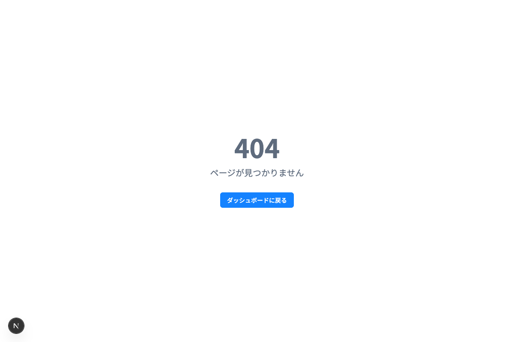
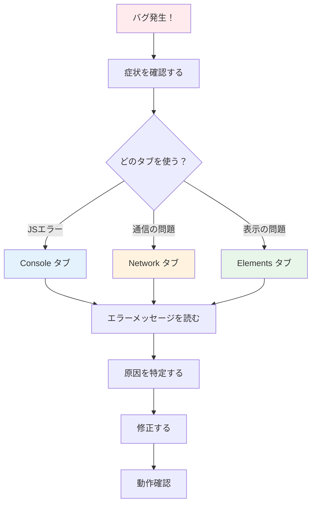

# Day 26: エラーページを作って、バグを退治しよう

## 🔙 前回の振り返り

Day 25 ではプロフィール表示ページと
パスワード変更フォームを実装し、
`useState` によるフォーム管理や
`toast` によるフィードバック表示を学びました。
ユーザー向け機能が一通り揃ったので、
今日はエラーハンドリングと DevTools を使った
デバッグ演習に取り組みます。

---

## 🎯 今日のゴール

エラーページ（error.tsx）の動作を確認し、
3つのバグパターンを学びます。
そのうち1つは実際にコードを書いて修正します。
DevTools の Console・Network・Elements タブの
使い分けも身につけます。

📸 スクリーンショット: エラーページ画面の表示を確認してください。


## 🤔 なぜこれを作るのか？

Day 25 まで完走して、アプリの主要機能が一通り
揃いました。残り5日です！
今日からはプロの開発者が日常的に使う
デバッグスキルを身につけましょう。

バグのないアプリはありません。
大事なのは「バグを怖がらない」こと。
バグを意図的に作って、DevTools で発見し、
自分で直す経験を積みましょう。

> 💡 **例え話**: DevToolsは「お医者さんの道具セット」です。Console（聴診器）で症状を聞き、Network（レントゲン）で内部の通信を見て、Elements（解剖図）でページの構造を調べます。

### 📐 デバッグの流れ



### やること / やらないこと

| やること | やらないこと |
|---------|-------------|
| error.tsxの動作を確認する | エラーハンドリングの理論を暗記する |
| 3つのバグパターンを学び、1つは実際に修正する | バグを見つけてもらうだけ |
| DevTools 3タブの使い分けを学ぶ | DevToolsの全機能を網羅する |
| Biome lintでコード品質をチェックする | ESLintの設定を書く |

### 🆕 新しく学ぶ概念

| 概念 | 読み方 | 役割 | 例え |
|------|--------|------|------|
| Error Boundary | エラー・バウンダリ | エラーをキャッチしてフォールバックUIを表示 | 安全ネット。落下しても大怪我しない |
| Optional Chaining | オプショナル・チェイニング | nullやundefinedで安全にアクセスする | 「もし存在すれば」の条件付きアクセス |
| useEffectの依存配列 | — | 再実行の条件を指定するリスト | 「これが変わった時だけ再実行」の設定 |

## 📊 実装ステップ一覧

| ステップ | 作業内容 | 所要時間 | 触るファイル | 成功状態 |
|---------|---------|---------|-------------|---------|
| Step 1 | error.tsxの動作を確認する | 5分 | dashboard/page.tsx | エラーページが表示される |
| Step 2 | error.tsxのコードを読む | 4分 | なし（読むのみ） | Error Boundaryがわかる |
| Step 3 | バグA: Optional Chainingなし | 7分 | 教材内演習 | Console赤エラーを修正 |
| Step 4 | バグB: useEffect依存配列ミス | 7分 | 教材内演習 | 無限リクエストを修正 |
| Step 5 | バグC: console.log残し | 5分 | dashboard/page.tsx | Biome lintで検出・修正 |
| Step 6 | DevTools 3タブの使い分けまとめ | 5分 | なし | いつ何を見るかわかる |
| Step 7 | Biome lintで全体チェック | 4分 | ターミナル | lint警告ゼロ |

**合計時間**: 約37分

---

### Step 1: error.tsxの動作を確認する（5分）

🎯 **ゴール**: Next.jsのError Boundary（error.tsx）がどう動くか体験します。

まず、存在しないページにアクセスしてnot-found.tsxが動作することを確認します。次に、わざとエラーを起こしてerror.tsxの動作を確認します。

💻 **操作手順**:

1. ブラウザのアドレスバーに `http://localhost:3000/this-page-does-not-exist` と入力して Enter を押す
2. 「404」と「ページが見つかりません」が表示されることを確認
3. 次に、ダッシュボードのコードに一時的にエラーを仕込む

```typescript
// filepath: src/app/dashboard/page.tsx（一時的に追加）
// DashboardPage関数の先頭に追加する
// error.tsx の動作を確認するためのテストエラー
throw new Error(
  'テストエラー: これは練習です'
);
```

> ⚠️ 開発モード（`npm run dev`）では
> Next.js のエラーオーバーレイが先に
> 表示されます。右上の × ボタンで閉じると、
> error.tsx のフォールバック UI が確認できます。

✅ **確認ポイント**:
1. `/this-page-does-not-exist`で404ページが表示された
2. エラーオーバーレイを閉じると「エラーが発生しました」画面が表示される
3. 「もう一度試す」ボタンが機能する
4. **追加した`throw`行を必ず削除する**

📸 スクリーンショット: error.tsxのエラーページ画面の表示を確認してください。


📝 **学んだこと**: error.tsxは予期しないエラーが発生した時に「白い画面」の代わりにフォールバックUIを表示します。

---

### Step 2: error.tsxのコードを読む（4分）

🎯 **ゴール**: Error Boundaryの仕組みを理解します。

VS Codeで`src/app/error.tsx`を開いてください。

💻 **確認するコード**:

```typescript
// filepath: src/app/error.tsx
// コンポーネント定義とエラーログ
'use client';

import { useEffect } from 'react';
import { Button }
  from '@/component/ui/button';

export default function ErrorPage({
  error, reset,
}: {
  error: Error & { digest?: string };
  reset: () => void;
}) {
  useEffect(() => {
    console.error(error);
  }, [error]);
```

続けて、描画する JSX を確認します。

```typescript
// filepath: src/app/error.tsx
// フォールバックUI（returnの中身）
  return (
    <div className="flex min-h-screen
      items-center justify-center">
      <div className="text-center space-y-4">
        <h2 className="text-2xl font-bold">
          エラーが発生しました
        </h2>
        <p className="text-muted-foreground">
          予期しないエラーが発生しました。
          もう一度お試しください。
        </p>
        <Button onClick={reset}>
          もう一度試す
        </Button>
      </div>
    </div>
  );
}
```

✅ **確認ポイント**:
- `reset` 関数が「もう一度試す」ボタンに紐づいている
- `error.tsx` が `error` と `reset` の2つの props を受け取ることがわかった

🔍 **コード解説**:

| コード | 意味 | 例え |
|--------|------|------|
| `error` | 発生したエラーオブジェクト | 患者のカルテ（症状の記録） |
| `reset` | エラーをリセットして再描画する関数 | 「もう一度試す」ボタンの処理 |
| `'use client'` | クライアントコンポーネント必須 | Error Boundaryはブラウザ側で動く |
| `console.error(error)` | エラー詳細をConsoleに出力 | カルテをログに記録 |

📝 **学んだこと**: Next.js App Routerでは、`error.tsx`を配置するだけでError Boundaryが自動的に機能します。

---

### Step 3: バグA — Optional Chainingなし（7分）

🎯 **ゴール**: `?.`（Optional Chaining）を使わないとどうなるか体験し、修正します。

以下のバグコードを**教材内で確認**してください。実際のアプリでは`?.`が正しく使われていますが、もし`?.`を外すとどうなるかを理解しましょう。

以下の演習では学習用の型を使います。

```typescript
// filepath: 教材内の演習コード（型定義）
// 演習用の型定義（実行不要）
type Task = {
  assignee: {
    name: string;
  } | null;
};
```

✅ **確認ポイント**:
- assignee が `null` になり得ることを確認した

💻 **バグのあるコード**:

```typescript
// filepath: 教材内の演習コード（実行不要）
// ❌ バグ: assigneeがnullの場合にクラッシュ
function TaskCard(
  { task }: { task: Task }
) {
  return (
    <div>
      <p>担当者:
        {task.assignee.name}</p>
    </div>
  );
}
```

✅ **確認ポイント**:
- `.name` にアクセスする前に null チェックがないことがわかった

**エラーメッセージ（Console）**:

```text
TypeError: Cannot read properties
  of null (reading 'name')
  at TaskCard (task-card.tsx:5:38)
```

✅ **確認ポイント**:
- `reading 'name'` が問題のプロパティだとわかった

💻 **修正後のコード**:

```typescript
// filepath: 教材内の演習コード（修正版）
// ✅ 修正: ?.でnullチェック + ??で代替値
function TaskCard(
  { task }: { task: Task }
) {
  return (
    <div>
      <p>担当者:
        {task.assignee?.name
          ?? '未割り当て'}</p>
    </div>
  );
}
```

✅ **確認ポイント**:
- `?.` と `??` の組み合わせで安全にアクセスしている

🔍 **修正前後の比較**:

| 修正前 | 修正後 | 違い |
|--------|--------|------|
| `task.assignee.name` | `task.assignee?.name` | `?.`で安全にアクセス |
| クラッシュする | `undefined`を返す | エラーにならない |
| — | `?? '未割り当て'`で代替テキスト | nullの時の表示指定 |

✅ **確認ポイント**:
1. `?.`（Optional Chaining）の役割がわかった
2. `??`（Nullish Coalescing）で代替値を指定する方法がわかった
3. Consoleのエラーメッセージの読み方がわかった

📝 **学んだこと**: `?.`はnull/undefinedの時にエラーにせず`undefined`を返します。`??`と組み合わせて代替値を指定できます。

---

### Step 4: バグB — useEffectの依存配列ミス（7分）

🎯 **ゴール**: useEffectの依存配列を間違えると無限リクエストが発生することを理解し、修正方法を学びます。

> ⚠️ task-app では tRPC の `useQuery` が
> 自動管理してくれるため、このパターンは
> 発生しません。しかし、個人開発や他の
> プロジェクトで必ず遭遇するバグパターン
> なので理解しておきましょう。

💻 **バグのあるコード**:

```typescript
// filepath: 教材内の演習コード（実行不要）
// ❌ バグ: 依存配列に毎回新しいオブジェクトが入る
function TaskList() {
  const [tasks, setTasks] = useState([]);
  const filter = { status: 'TODO' };

  useEffect(() => {
    fetchTasks(filter)
      .then(setTasks);
  }, [filter]);
  // ↑ 毎レンダリングで新しいオブジェクト
}
```

✅ **確認ポイント**:
- `filter` が関数の中で毎回作られることを確認した

**症状**: DevTools Network タブに同じリクエストが
無限に流れ続けます。

```text
GET /api/tasks ← 何百回も繰り返し
GET /api/tasks
GET /api/tasks
...（止まらない）
```

✅ **確認ポイント**:
- Network タブで同じリクエストの繰り返しが無限ループの兆候だとわかった

💻 **修正後のコード**:

```typescript
// filepath: 教材内の演習コード（修正版）
// ✅ 修正: プリミティブ値を依存配列に使う
function TaskList() {
  const [tasks, setTasks] = useState([]);
  const [status] = useState('TODO');

  useEffect(() => {
    fetchTasks({ status })
      .then(setTasks);
  }, [status]);
  // ↑ stringは参照が変わらない
}
```

✅ **確認ポイント**:
- string 型は毎回同じ参照なので再実行されない

🔍 **なぜ無限ループが起きるのか**:

| ステップ | 動作 |
|---------|------|
| 1 | コンポーネントがレンダリングされる |
| 2 | `filter = { status: 'TODO' }` で新しいオブジェクトが作られる |
| 3 | useEffectが「filterが変わった」と判断して実行 |
| 4 | `setTasks`で状態更新 → 再レンダリング → ステップ1に戻る |
| ∞ | 無限ループ |

> 💡 JavaScriptでは `{ status: 'TODO' } !== { status: 'TODO' }` です。見た目は同じでも、毎回「新しいオブジェクト」が作られるため、useEffectは「変わった」と判断します。

✅ **確認ポイント**:
1. オブジェクトの参照が毎回変わる問題が理解できた
2. Networkタブで無限リクエストを発見する方法がわかった
3. プリミティブ値（string/number）を依存配列に使う修正方法がわかった

📝 **学んだこと**: useEffectの依存配列にオブジェクトを入れると、毎レンダリングで新しい参照になり無限ループを引き起こします。

---

### Step 5: バグC — console.log残し（5分）

🎯 **ゴール**: `console.log`の残りをBiome lintで検出し、修正します。

ダッシュボードのコードにわざと`console.log`を追加してみましょう。

💻 **実装**:

```typescript
// filepath: src/app/dashboard/page.tsx
// recentTasks の直後に一時的に追加する
console.log(
  'DEBUG: tasks =', tasks
);
console.log(
  'DEBUG: projects =', projects
);
```

✅ **確認ポイント**:
- 2行の `console.log` を追加した
- ファイルを保存した

次に、Biome lintを実行します。
`npm run lint` はプロジェクト全体をチェックしますが、
ここでは変更したファイルだけを確認します。

```bash
# filepath: ターミナル
# Biome lintチェック（該当ファイルのみ）
npx biome check \
  src/app/dashboard/page.tsx
```

✅ **確認ポイント**:
- `noConsole` エラーが検出された

Biome が以下のようなエラーを出します。

```text
src/app/dashboard/page.tsx:XX:3
  lint/suspicious/noConsole
  Unexpected console object method call.
```

💻 **修正**: 追加した2行の`console.log`を削除してください。

```bash
# filepath: ターミナル
# 修正後に再チェック
npx biome check \
  src/app/dashboard/page.tsx
# → 問題なし
```

✅ **確認ポイント**:
- エラーが0件になった

📸 スクリーンショット: Biome lint のエラー出力画面を確認してください。


> 💡 `npx biome check ファイルパス` は
> Biome を1ファイルだけに実行するコマンドです。
> Step 7 の `npm run lint` は内部的に
> `biome check .`（プロジェクト全体）を
> 実行します。

🔍 **console.logを残すべきでない理由**:

| 問題 | 影響 |
|------|------|
| 本番環境でユーザーに見える | DevToolsを開くと情報漏洩の可能性 |
| パフォーマンスに影響 | 大量のログ出力は処理を遅くする |
| コードの品質低下 | デバッグ用のコードが散乱する |

✅ **確認ポイント**:
1. `console.log`を追加してBiome lintがエラーを出した
2. `console.log`を削除してBiomeのエラーが消えた
3. **追加した`console.log`を必ず削除した**

📝 **学んだこと**: Biome lintは`console.log`の残りを自動検出してくれます。本番コードには`console.log`を残さないようにしましょう。

---

### Step 6: DevTools 3タブの使い分け（5分）

🎯 **ゴール**: 症状に応じて DevTools の
どのタブを見るべきか整理します。

ブラウザで DevTools を開いてみましょう。

```bash
# filepath: ターミナル
# 開発サーバーが起動中か確認
npm run dev
# ブラウザで http://localhost:3000 を開き
# F12（Macは Cmd+Option+I）でDevToolsを開く
```

✅ **確認ポイント**:
- DevTools が表示された

| 症状 | 使うタブ | 確認するもの |
|------|---------|------------|
| 画面が白い/クラッシュ | **Console** | 赤いエラーメッセージ |
| データが取得できない | **Network** | リクエストのステータスコード |
| 表示がおかしい | **Elements** | HTML構造とCSSスタイル |
| 同じリクエストが大量に出る | **Network** | 無限ループの発見 |
| ボタンが反応しない | **Console** | クリックイベントのエラー |
| スタイルが崩れている | **Elements** | 適用されているCSSの確認 |

**DevTools 3タブの開き方**:

| 操作 | Windows/Linux | Mac |
|------|-------------|------|
| DevToolsを開く | F12 | Cmd+Option+I |
| Consoleタブ | Ctrl+Shift+J | Cmd+Option+J |
| Elementsタブ | Ctrl+Shift+C | Cmd+Shift+C |

✅ **確認ポイント**:
1. 3つのタブの使い分けが理解できた
2. 症状に応じてどのタブを見るか判断できる

📸 スクリーンショット: DevTools Consoleタブの表示を確認してください。


📸 スクリーンショット: DevTools Networkタブの表示を確認してください。


📸 スクリーンショット: DevTools Elementsタブの表示を確認してください。


📝 **学んだこと**: DevToolsは「症状に合った道具を選ぶ」のが大事です。Console→Network→Elementsの順でチェックするのが基本です。

---

### Step 7: Biome lintで全体チェック（4分）

🎯 **ゴール**: プロジェクト全体のコード品質をBiome lintで確認します。

💻 **操作手順**:

```bash
# filepath: ターミナル
# プロジェクト全体のlintチェック
npm run lint
```

✅ **確認ポイント**:
- lintチェックが完了した

もし警告やエラーがあった場合は、以下で自動修正できます。

```bash
# filepath: ターミナル
# 自動修正モード
npm run lint:fix
```

🔍 **Biomeの主な検出項目**:

| ルール | 検出するもの | 深刻度 |
|--------|------------|--------|
| `noConsole` | `console.log`の残り | エラー |
| `noUnusedVariables` | 使われていない変数 | エラー |
| `noExplicitAny` | `any`型の使用 | 警告 |
| `useConst` | `let`で再代入していない変数 | エラー |

✅ **確認ポイント**:
1. `npm run lint`が0エラーで通過した
2. Biomeの自動修正が使えることを理解した

📝 **学んだこと**: Biome lintはコードの問題を自動検出し、一部は自動修正もしてくれます。

---

## 📋 今日のまとめ

- [ ] error.tsxの動作を確認した（意図的にエラーを起こして表示確認）
- [ ] Error Boundaryの`error`と`reset` propsを理解した
- [ ] バグA: Optional Chainingなしのクラッシュを修正できた
- [ ] バグB: useEffect依存配列ミスの無限ループを理解した
- [ ] バグC: console.log残りをBiome lintで検出・修正した
- [ ] DevTools Console/Network/Elementsの使い分けがわかった
- [ ] `npm run lint`でプロジェクト全体をチェックした

## ⚠️ つまずきポイント

| エラー/問題 | 原因 | 解決方法 |
|------------|------|---------|
| `Cannot read properties of null` | Optional Chainingなし | `?.`を追加する |
| Networkタブでリクエストが止まらない | useEffect依存配列にオブジェクト | プリミティブ値に分解する |
| Biome lintのエラーが消えない | 自動修正できないルール | 手動でコードを修正する |
| error.tsxが表示されない | 開発モードではエラーオーバーレイが優先 | 本番ビルドで確認するか、オーバーレイを閉じる |

## 🔜 次回予告

Day 27では、プロジェクト詳細ダイアログとアーカイブ機能を実装します。クリックひとつでメンバー一覧やタスク一覧を確認でき、使い終わったプロジェクトをアーカイブで整理できるようになります。
