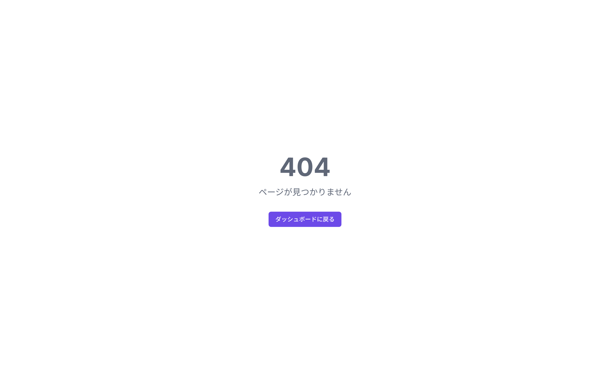
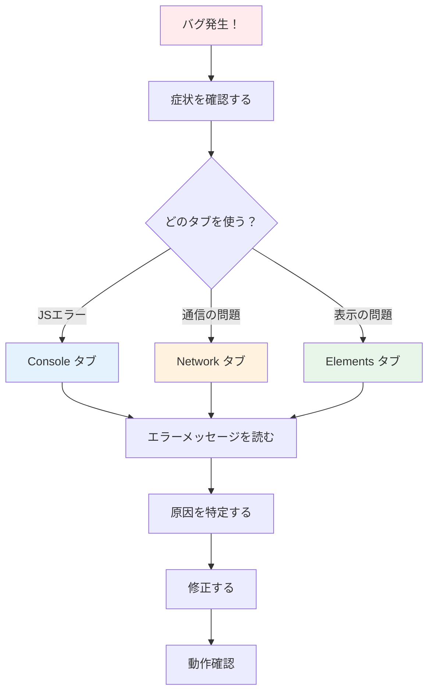
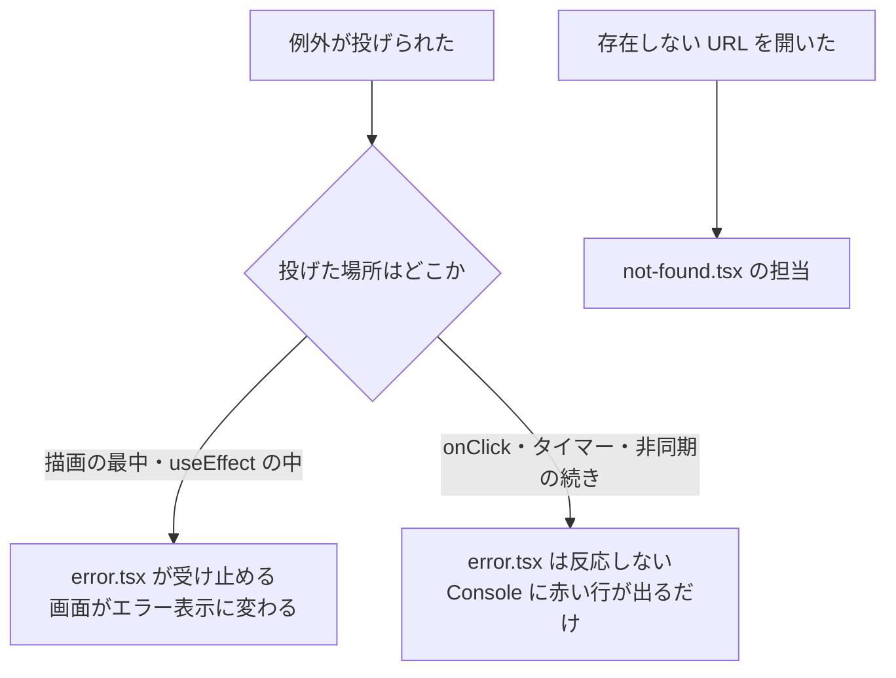
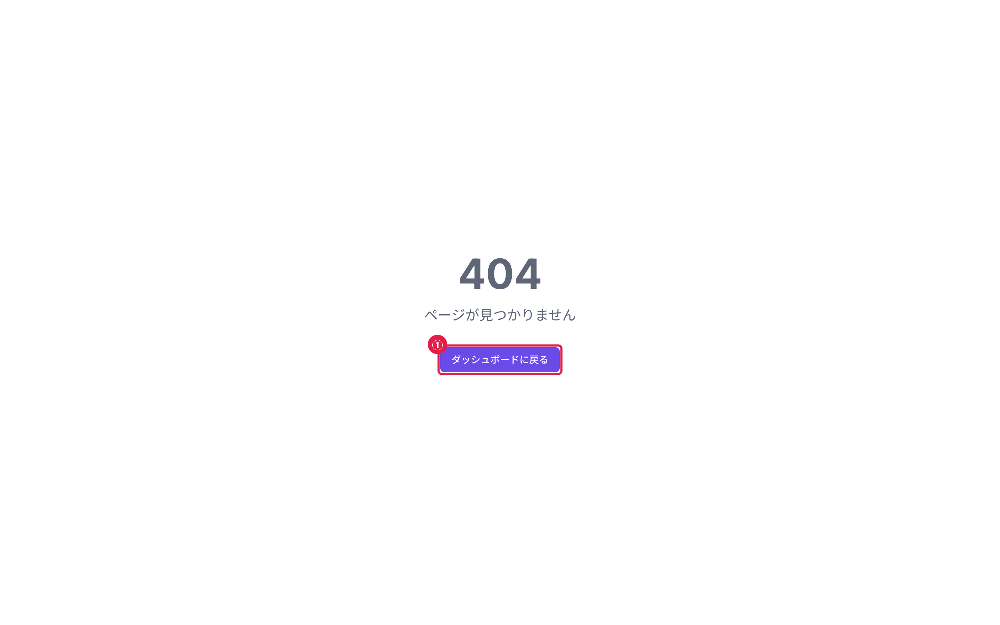

# Day 26: エラーページを作ってバグを退治しよう

## 前回の振り返り

Day 25 ではプロフィール表示ページと
パスワード変更フォームを実装し、
`useForm` と zod によるフォーム管理や
`toast` によるフィードバック表示を学びました。
ユーザー向け機能が一通り揃ったので
今日はエラーハンドリングと DevTools を使った
デバッグ演習に取り組みます。

---

## 今日のゴール

エラーページ（error.tsx）の動作を確認し、
通信エラーを利用者が判断できる表示へ直します。
そのあと3つのバグパターンを学びます。2つは教材内で修正版を読み、`console.log` を残す例はアプリのファイルを実際に直します。
DevTools の Console・Network・Elements タブの
使い分けも身につけます。

【スクリーンショット】今日つくる2枚のうち、存在しないURLで出る404画面です。



## 始める前の前提

- Day 25 までの主要画面が動いている
- ブラウザの DevTools を開ける
- 一時的にエラーコードを入れて確認後に元へ戻せる
- `npm run lint` と `npm run fix` を実行して修正後に指摘が残っていないか確認できる

## なぜこれを作るのか

Day 25 まで完走してアプリの主要機能が一通り
揃いました。残り5日です。
今日からはプロの開発者が日常的に使う
デバッグスキルを身につけましょう。

バグのないアプリはありません。
大事なのはバグが出たときに
慌てず順番どおり追えることです。
バグを意図的に作ってDevTools で発見し、
自分で直す経験を積みましょう。

> **例え話**: DevToolsは「お医者さんの道具セット」です。Console（聴診器）で症状を聞き、Network（レントゲン）で内部の通信を見てElements（解剖図）でページの構造を調べます。

### デバッグの流れ


```mermaid
flowchart TD
    A[バグ発生！] --> B[症状を確認する]
    B --> C{どのタブを使う？}
    C -->|JSエラー| D[Console タブ]
    C -->|通信の問題| E[Network タブ]
    C -->|表示の問題| F[Elements タブ]
    D --> G[エラーメッセージを読む]
    E --> G
    F --> G
    G --> H[原因を特定する]
    H --> I[修正する]
    I --> J[動作確認]

    style A fill:#ffebee
    style D fill:#e3f2fd
    style E fill:#fff3e0
    style F fill:#e8f5e9
```

この図で先頭に置いてあるのは「症状を確認する」です。
画面が真っ白になるのか、データだけ出てこないのか、見た目の崩れだけなのかで、原因のある場所は変わります。
症状を見ないままコードを上から読み直すと関係のない行を何十行も追うはめになります。

タブの選び方も丸暗記するものではありません。
Console にはブラウザ上で動いた JavaScript の投げたエラーが出ます。
Network にはブラウザとサーバーのあいだで実際に飛んだ通信が並びます。
Elements にはいま画面に出ている HTML と当たっている CSS の現物が出ます。
どこに証拠が残るかで、開くタブが決まります。
今日はこの図の上半分、つまり症状からタブを選ぶところまでを、Day 25 までに作った画面で一往復します。

### やること / やらないこと

| やること | やらないこと |
|---------|-------------|
| error.tsxの動作を確認する | エラーハンドリングの理論を暗記する |
| 3つのバグパターンを学び、1つは実際に修正する | バグを見つけてもらうだけ |
| DevTools 3タブの使い分けを学ぶ | DevToolsの全機能を網羅する |
| Biome lintでコード品質をチェックする | ESLintの設定を書く |
| | ページ単位のエラー表示（project と task の `error.tsx`） |

### 新しく学ぶ概念

| 概念 | 読み方 | 役割 | 例え |
|------|--------|------|------|
| Error Boundary | エラー・バウンダリ | エラーをキャッチしてフォールバックUIを表示 | 安全ネット。落下しても大怪我しない |
| Optional Chaining | オプショナル・チェイニング | nullやundefinedで安全にアクセスする | 「もし存在すれば」の条件付きアクセス |
| useEffectの依存配列 | — | 再実行の条件を指定するリスト | 「これが変わった時だけ再実行」の設定 |

## 実装ステップ一覧

| ステップ | 作業内容 | 所要時間 | 触るファイル | 成功状態 |
|---------|---------|---------|-------------|---------|
| Step 1 | error.tsxを作る | 4分 | src/app/error.tsx | Error Boundaryが分かる |
| Step 2 | error.tsxの動作を確認する | 5分 | src/app/not-found.tsx・dashboard/page.tsx | エラーページが表示される |
| Step 2.5 | 通信エラーを状態ごとに表示する | 35分 | 3画面・3テスト・Vitest設定 | 初回500・再取得500・401・403を区別できる |
| Step 3 | バグA: Optional Chainingなし | 7分 | 教材内演習 | Console赤エラーを修正 |
| Step 4 | バグB: useEffect依存配列ミス | 7分 | 教材内演習 | 無限リクエストを修正 |
| Step 5 | バグC: console.log残し | 5分 | dashboard/page.tsx | Biome lintで検出・修正 |
| Step 6 | DevTools 3タブの使い分けまとめ | 5分 | なし | いつ何を見るか分かる |
| Step 7 | Biome lintで全体チェック | 4分 | ターミナル | `npm run fix` のあと lint 指摘ゼロ |

**合計時間**: 約72分です。

この時間はコードを読んで理解する目安です。写経して打ち込む時間、詰まって調べる時間は別に見てください。

---

### Step 1: error.tsxのコードを書く（4分）

**ゴール**: Error Boundaryの仕組みを理解します。

`src/app/error.tsx` を新規作成します。

**実装**:

```typescript
// filepath: src/app/error.tsx
// コンポーネント定義とエラーログ
'use client';

import { useEffect } from 'react';
import { Button }
  from '@/component/ui/button';

export default function ErrorPage({
  error, reset,
}: {
  error: Error & { digest?: string };
  reset: () => void;
}) {
  useEffect(() => {
    console.error(error);
  }, [error]);
```

ここまでが「エラーを受け取って記録する」部分です。
配下のコンポーネントが描画の途中で例外を投げるとNext.js はその画面の描画をあきらめて代わりにこの `ErrorPage` を描きます。
そのとき投げられたエラー本体が `error`、描画をもう一度やり直させる関数が `reset` として渡されます。
受け取るオブジェクトのキー名 `error` と `reset` は Next.js が決めています。`{ error: e }` のように別名で受け取ることはできますが、キー自体を `{ e }` に変えるとエラーを受け取れません。

`'use client'` を先頭に書いているのはやり直しボタンにつなぐ `reset` と、記録に使う `useEffect` がブラウザで動く部品でないと使えないためです。
この1行を消すとエラーページ自体がビルドで弾かれます。
ただし受け取るエラーがブラウザ側で起きたものに限る、という意味ではありません。
サーバー側で画面を組み立てている途中に投げられたエラーも、Next.js はこの `ErrorPage` へ回します。
そのときは本番ビルドだと文言が伏せられ、`error.digest` という短い符号だけが渡ります。
HTTPステータスは、応答を送り始める前後で変わります。送信前の例外なら Next.js は500を返せます。
`loading.tsx` や `Suspense` の待機表示を送り始めたあとでは、ヘッダーを変更できないため200のままです。
その場合も失敗はブラウザへ伝わり、最寄りの `error.tsx` の表示へ切り替わります。Networkの200だけで成功と判断せず、画面・Console・サーバーログも合わせて確認します。
どちらで起きたのかを見分ける手順はこのあと Console を開くところで扱います。

`useEffect` の依存配列に `[error]` を入れているのは同じエラーで描画が何度走ってもログを1回に抑えるためです。
依存配列そのものを書き忘れると描画のたびに Console が同じ行で埋まり、肝心の1件目が上へ流れて読めなくなります。

続けて描画する JSX を確認します。

```typescript
// filepath: src/app/error.tsx
// フォールバックUI（returnの中身）
  return (
    <div className="flex min-h-screen
      items-center justify-center">
      <div className="text-center space-y-4">
        <h2 className="text-2xl font-bold">
          エラーが発生しました
        </h2>
        <p className="text-muted-foreground">
          予期しないエラーが発生しました。もう一度お試しください。
        </p>
        <Button onClick={reset}>
          もう一度試す
        </Button>
      </div>
    </div>
  );
}
```

**確認ポイント**:
- `reset` 関数が「もう一度試す」ボタンに紐づいている
- `error.tsx` が `error` と `reset` の2つの props を受け取ることがわかった

**コード解説**:

| コード | 意味 | 例え |
|--------|------|------|
| `error` | 発生したエラーオブジェクト | 患者のカルテ（症状の記録） |
| `reset` | エラーをリセットして再描画する関数 | 「もう一度試す」ボタンの処理 |
| `'use client'` | クライアントコンポーネント必須 | Error Boundaryはブラウザ側で動く |
| `console.error(error)` | エラー詳細をConsoleに出力 | カルテをログに記録 |

ここで先に線を引いておきます。
`error.tsx` が拾えるのは「画面を描いている最中に投げられた例外」だけです。
Day 09 で書いた一覧のように描画の途中で `undefined` のプロパティを読んでしまった、という種類のエラーはここに落ちてきます。

拾えないものもあります。
ボタンの `onClick` の中や、タイマー・非同期処理の続きで投げたエラーには `error.tsx` は反応しません。描画が終わったあとに起きるためです。`useEffect` の中でそのまま投げたエラーは描画の締めくくりで起きるので `error.tsx` が受け止めます。
これらは Console に赤い行が出るだけで、画面は何ごともなかったように残ります。
`fetch` は書く場所で分かれます。サーバー側の部品の中で `await` して待っている `fetch` は描画の一部なのでそこで投げられたエラーは `error.tsx` が受け止めます。ただし `fetch` はサーバーが 404 や 500 を返しても自分からはエラーを投げません。`response.ok` を確かめて自分で `throw` して初めてこの画面へ回ります。`onClick` や `useEffect` から始めた `fetch` は描画の外なので投げても受け止めません。
存在しない URL も別枠で、こちらは `not-found.tsx` の担当です。
つまり「画面が真っ白になった」ときは描画中のエラー、「画面は出ているのにボタンが効かない」ときはイベントの中のエラーだと症状から見当がつきます。


```mermaid
flowchart TB
    E["例外が投げられた"] --> Q{"投げた場所はどこか"}
    Q -->|"描画の最中・useEffect の中"| A["error.tsx が受け止める<br/>画面がエラー表示に変わる"]
    Q -->|"onClick・タイマー・非同期の続き"| B["error.tsx は反応しない<br/>Console に赤い行が出るだけ"]
    N["存在しない URL を開いた"] --> C["not-found.tsx の担当"]
```

`error.tsx` を置いた場所ではなく、例外を投げた場所で行き先が決まります。ボタンを押しても画面が変わらないのは書き忘れではなく、右下の枝に落ちているためです。その場合は `try` と `catch` で自分で受け止めます。

**学んだこと**: Next.js App Routerでは`error.tsx`を配置するだけでError Boundaryが自動的に機能します。

---

### Step 2: error.tsxの動作を確認する（5分）

**ゴール**: 作成した Error Boundary が
どう動くか体験します。

まず `src/app/not-found.tsx` を新規作成します。
このファイルは存在しない URL を開いたときに出る画面です。

```tsx
// filepath: src/app/not-found.tsx
import Link from 'next/link';

export default function NotFound() {
  return (
    <div className="flex min-h-screen
      flex-col items-center justify-center
      gap-4 px-4">
      <h1 className="text-6xl font-bold
        text-muted-foreground">404</h1>
      <p className="text-xl
        text-muted-foreground">
        ページが見つかりません
      </p>
      <Link href="/dashboard"
        className="mt-4 rounded-md
          bg-primary px-4 py-2 text-sm
          font-medium text-primary-foreground
          hover:bg-primary/90">
        ダッシュボードに戻る
      </Link>
    </div>
  );
}
```

このファイルを置かなくても404の画面自体は出ます。Next.js が用意した既定の画面へ切り替わるためです。ただしその画面は英語で、戻る先へのリンクもありません。自分のアプリの言葉で書いて戻り道を用意しておくと行き止まりになりません。`error.tsx` に `'use client'` が要るのはNext.js がこのファイルをエラー境界として扱い、エラー境界はブラウザ側でしか動けないためです。`not-found.tsx` はふつうの部品なのでサーバー側のままで足ります。

次に存在しないページにアクセスして
`not-found.tsx` が動作することを確認します。
そのあとでわざとエラーを起こして
`error.tsx` の動作を確認します。

同じプロジェクトの開発サーバーが動いている場合は先に `Ctrl+C` で停止します。この Day では 3001 番ポートで起動します。

```bash
# filepath: ターミナル
PORT=3001 npm run dev
```

別のポートでもう1つ起動しても、両方がバグを入れた同じコードを配信するため、正常な画面との比較には使えません。開発サーバーは1つだけ起動してください。

`PORT=3001` を指定した場合3001 番が使用中なら `EADDRINUSE` で起動に失敗します。別のアプリが使っている場合は`PORT=3002 npm run dev` のように空いている番号を指定します。その場合このあとの URL も指定した番号へ変えてください。

ここからはエラーの種類を2つ続けて見ます。
1つ目は「そのページが存在しない」で、2つ目は「ページはあるが描画中に落ちた」です。
出る画面が違うのでどちらの症状なのかを目で覚えてください。

1. `http://localhost:3001/this-page-does-not-exist`
   をブラウザで開く
2. 「404」と「ページが見つかりません」を確認する



いま書いた `not-found.tsx` のとおりの画面です。
ここまでが1つ目の「そのページが存在しない」側になります。

3. ダッシュボードへ一時的にエラーを追加する

```typescript
// filepath: src/app/dashboard/page.tsx（一時的に追加）
// DashboardPage関数の先頭に追加する
throw new Error(
  'テストエラー: これは練習です'
);
```

この `throw` はダッシュボードが描画を始めた直後に例外を投げます。
いま動かしているのは `npm run dev` なので`error.tsx` を置いていなくても画面が真っ白になることはありません。
Next.js の開発用オーバーレイが前面に出てきてエラーの文言と、どのファイルの何行目で起きたかを教えてくれます。
開発中にエラーの居場所をすぐ突き止められるのはこの助けがあるからです。

ただしこの親切なオーバーレイが出るのは開発中だけです。
`npm run build` で作った本番の画面では`error.tsx` が無いと Next.js があらかじめ用意している素っ気ない画面に切り替わります。
そこには何のアプリなのかも、次に何をすればよいのかも書かれていません。
使っている人からすると行き止まりに見えます。
Step 1 で置いた `error.tsx` はそのときに自分のアプリの言葉で事情を伝えて「もう一度試す」まで案内するために書きました。

Step 1 で書いた `error.tsx` は決まった日本語だけを描いていて`error` の中身を画面には出していません。
どのエラーでも同じ文言が出るので画面だけでは種類を判別できません。
中身は `useEffect` の中の `console.error(error)` がブラウザの Console へ出しています。
DevTools を開いて Console タブを見てください。
今回の `throw` なら「テストエラー: これは練習です」がそこに並びます。

ここで`npm run dev` のターミナルにも同じ文言が出ていることを確かめてください。
このダッシュボードは Day 02 で `'use client'` を外したページなので`throw` が起きる場所はサーバー側です。
それでも文言がブラウザの Console にも出るのは開発モードがサーバー側のエラーをそのまま送り届けているためです。
今回の関数先頭の `throw` は応答を送り始める前に起きるため、`/dashboard` は500を返して `error.tsx` の画面へ切り替わります。待機表示を送信した後のエラーでは、200のままでもエラー画面へ切り替わります。
つまり開発中は文言が Console に出ているかどうかでサーバー側かブラウザ側かを決められません。
開発モードは原因を追いやすくするために、どちらで起きたエラーも文言をそのまま見せます。

伏せられるのは本番ビルドのときだけです。
本番ではサーバー側で投げたエラーの文言が消え、`error.digest`（エラー1件ごとに振られる短い符号）だけがブラウザへ渡ります。
本当の文言はサーバーのログに残るので公開後の調査ではそちらを読みます。
文言を伏せるのはテーブル名やファイルのパスがそのままユーザーの画面へ漏れるのを防ぐためです。
故障ではなく、意図してそう作られています。

> 開発モードではエラーオーバーレイが
> 先に表示されます。右上の × ボタンで閉じると
> 作成したフォールバック UI を確認できます。

4. `src/app/dashboard/page.tsx` に足した `throw new Error(...)` の行を削除する
5. ブラウザを読み込み直し、ダッシュボードが元どおり表示されることを確認する

この削除を飛ばすとダッシュボードはこの先ずっとエラー画面のままになります。

**確認ポイント**:
1. 存在しないページで404画面が表示された
2. 意図的なエラーで作成済みの画面が表示された
3. 「もう一度試す」ボタンが機能した
4. **追加した `throw` 行を必ず削除した**

このとき出るのは冒頭に載せた404の画面ではありません。
`error.tsx` に書いた「エラーが発生しました」という見出しと、
「予期しないエラーが発生しました。もう一度お試しください。」という説明、
そして「もう一度試す」ボタンの3つが並びます。
数字の 404 が出ていたらそれは存在しないURLを開いている合図です。

**学んだこと**: `error.tsx` は予期しないエラーが
発生したときに白い画面の代わりとなる
フォールバック UI を表示します。

---

### Step 2.5: 通信エラーを画面の状態として扱う（35分）

**ゴール**: ダッシュボード、マイタスク、レポートで、取得失敗の種類と取得済みデータの有無に合わせて表示を変えます。

`error.tsx` は描画中の例外を受け止めます。一方、`useQuery` が返す 500 は問い合わせの結果なので、ページ自身が `isError` を見て表示を決める必要があります。ここを分けないと、取得に失敗したのに「0件」と表示してしまいます。

#### 2.5-1. エラーを4つの状態へ分ける

同じ `isError === true` でも、利用者が次に取る行動は状態ごとに異なります。

| 状態 | データ | 表示 | 次の操作 |
|------|--------|------|----------|
| 初回取得が500 | まだ無い | 全面エラー | 再読み込み |
| 再取得が500 | 前回値がある | 前回値と警告 | 再試行 |
| 401 | あっても隠す | セッション切れ | ログイン画面へ |
| 403 | あっても隠す | 権限不足 | プロジェクト一覧へ |

401 と 403 で前回値を隠すのは、いま表示する権利が確認できないデータを画面に残さないためです。500 は権限が変わった証拠ではないので、取得済みの値があれば作業を続けられるように残します。

`src/lib/query-error.ts` は scaffold に入っています。開いて、HTTP ステータスの取り出し方と再試行の条件を確認します。

```typescript
// filepath: src/lib/query-error.ts
// useQuery/useMutation が返す error は、構造化された tRPC エラー応答が
// あった時だけ data を持つ。ネットワーク断や非 JSON 応答では data は
// undefined になり、その場合サーバーで処理が成功したかどうか分からない。
// 「失敗した」と「結果が分からない」を区別するために使う。

function isRecord(value: unknown): value is Record<string, unknown> {
  return typeof value === 'object' && value !== null;
}

export function httpStatusOf(error: unknown): number | null {
  if (!isRecord(error) || !isRecord(error['data'])) return null;
  const status = error['data']['httpStatus'];
  return typeof status === 'number' ? status : null;
}

// 401: セッション切れ。再読み込みではなく再ログインが必要。
export function isAuthError(error: unknown): boolean {
  return httpStatusOf(error) === 401;
}

// 403: 認証は通っているが権限が無い。再読み込みしても解決しない。
export function isForbiddenError(error: unknown): boolean {
  return httpStatusOf(error) === 403;
}
```

`error` を `unknown` のまま受けるのは、ネットワーク断では tRPC の構造化された応答が無い場合もあるためです。形を確認してから `data.httpStatus` を読むので、エラーを分類する処理自体が例外を起こしません。

```typescript
// filepath: src/lib/query-error.ts（同じファイルの続き）
// data が無い = サーバーの判定を受け取れていない。
// 操作が成功している可能性があるため「不明」として扱い、
// 一覧を再取得して実際の状態を表示する導線に使う。
export function isUnknownResult(error: unknown): boolean {
  return isRecord(error) && error['data'] == null;
}

// 権限エラーは同じ要求を繰り返しても解決しないためです。
export function shouldRetryQuery(failureCount: number, error: unknown): boolean {
  return !isAuthError(error) && !isForbiddenError(error) && failureCount < 3;
}
```

401 と 403 は同じ要求を繰り返しても解決しません。`shouldRetryQuery` をすべての対象クエリへ渡すと、ログイン画面や権限案内を出すまでの無駄な待ち時間をなくせます。

#### 2.5-2. 画面で使う問い合わせをすべて監視する

ダッシュボードはプロジェクト一覧と集計の2件を同時に取得します。片方だけを見ると、もう片方の 401 や 500 を成功として扱ってしまいます。次の完成コードでは両方から `isError`、`error`、`refetch` を受け取ります。

マイタスクはログインユーザー、プロジェクト、タスクの3件です。タスク取得だけへエラー処理を付けても、プロジェクト取得の初回 500 で空の絞り込み欄が表示されます。画面を作るために使う問い合わせは、3件とも判定へ含めます。

```typescript
// filepath: src/app/my-task/page.tsx
const queryErrors = [
  isCurrentUserError ? currentUserQueryError : null,
  isTasksError ? tasksQueryError : null,
  isProjectsError ? projectsQueryError : null,
];
const hasFetchError =
  isCurrentUserError || isTasksError || isProjectsError;
const hasData =
  (!isCurrentUserError || currentUser != null) &&
  (!isTasksError || tasks != null) &&
  (!isProjectsError || projects != null);
const authFailed = queryErrors.some(isAuthError);
const forbidden = queryErrors.some(isForbiddenError);
```

`hasData` は「どれか1件にデータがあるか」ではありません。失敗した問い合わせのすべてに前回値があるかを調べます。たとえばタスクだけ取得済みでも、プロジェクトの初回取得が失敗したなら全面エラーにします。

再読み込みボタンでは、その画面で動いている問い合わせをすべて呼び直します。1件だけ再取得すると、別の問い合わせに残ったエラーのため全面エラーから戻れません。

```typescript
// filepath: src/app/my-task/page.tsx
onClick={() => {
  if (authFailed) {
    router.push('/login');
    return;
  }
  if (forbidden) {
    router.push('/project');
    return;
  }
  void refetchCurrentUser();
  void refetchTasks();
  void refetchProjects();
}}
```

#### 2.5-3. 更新失敗では入力を残す

タスク更新に失敗したときダイアログを閉じると、利用者の入力した文が消えます。閉じる処理は `onSuccess` にだけ置き、`onError` では入力中のダイアログを残します。

応答が届かなかった場合は、サーバーで更新できたのかも判断できません。このとき「失敗しました」と断定して同じ操作を勧めると、削除や更新を二重に送るおそれがあります。「結果を確認できない」と伝え、一覧を取り直します。

```typescript
// filepath: src/app/my-task/page.tsx
onError: (error) => {
  if (isUnknownResult(error)) {
    toast.error(
      '応答を確認できませんでした。' +
        '一覧を更新して結果を確認してください。',
    );
    void utils.task.getAll.invalidate();
    return;
  }
  toast.error(
    error.message || 'タスクの更新に失敗しました',
  );
},
```

#### 2.5-4. テストの準備をする

画面のテストはブラウザの代わりに jsdom（Node.js 上で HTML を扱う実行環境）を使います。Day 01 の scaffold で Vitest・jsdom・Testing Library はインストール済みです。ここでは `@/` から始まる import と、`toBeInTheDocument()` をテストでも使えるようにします。

まずプロジェクト直下へ `vitest.config.ts` を作ります。

```typescript
// filepath: vitest.config.ts
import { resolve } from 'node:path';
import { defineConfig } from 'vitest/config';

export default defineConfig({
  esbuild: { jsx: 'automatic' },
  test: {
    globals: true,
    setupFiles: ['./src/test/setup.ts'],
  },
  resolve: {
    alias: {
      '@': resolve(__dirname, './src'),
    },
  },
});
```

`esbuild`（テスト用に TSX を JavaScript へ変換する処理）の設定により、テストでも `import React` を書かずに JSX を使えます。`resolve.alias` はアプリと同じ `@/` をテストでも `src/` として解決する設定です。これが無いと、テストの読み込み時に `@/component/...` が見つからず止まります。

次に `src/test` フォルダを作り、その中へ `setup.ts` を作ります。

```typescript
// filepath: src/test/setup.ts
import '@testing-library/jest-dom/vitest';
```

この1行で `toBeInTheDocument()` や `toHaveTextContent()` を使えます。各テスト先頭の `@vitest-environment jsdom` は、そのファイルだけをブラウザに近い環境で動かす指定です。今回の3ファイルは API をモックするため、PostgreSQL は使いません。

#### 2.5-5. ダッシュボードの状態をテストする

`src/app/dashboard/page.test.tsx` を作り、次の内容を貼り付けます。2件の問い合わせが混在したときも401・403を優先する条件まで確認します。

<!-- code-block-length-exception: complete-copy-unit -->
```tsx
// filepath: src/app/dashboard/page.test.tsx
// @vitest-environment jsdom
import { render, screen } from '@testing-library/react';
import type { ReactNode } from 'react';
import { beforeEach, describe, expect, it, vi } from 'vitest';
import DashboardPage from './page';

const queries = vi.hoisted(() => ({ projects: vi.fn(), overview: vi.fn(), push: vi.fn() }));
vi.mock('next/navigation', () => ({ useRouter: () => ({ push: queries.push }) }));
vi.mock('@/component/layout/app-layout', () => ({
  AppLayout: ({ children }: { children: ReactNode }) => <div>{children}</div>,
}));
vi.mock('@/trpc/react', () => ({
  api: {
    project: { getAll: { useQuery: queries.projects } },
    report: { getOverview: { useQuery: queries.overview } },
  },
}));

function result(status?: number, data: unknown = {}) {
  return {
    data,
    isLoading: false,
    isError: status !== undefined,
    error: status === undefined ? null : { data: { httpStatus: status } },
    refetch: vi.fn(),
  };
}

beforeEach(() => {
  queries.projects.mockReturnValue(result(undefined, []));
  queries.overview.mockReturnValue(result());
});

describe('ダッシュボードの取得エラー', () => {
  it('再取得の500では直前の表示を残す', () => {
    queries.overview.mockReturnValue(result(500));
    render(<DashboardPage />);
    expect(screen.getByText('全体の進捗')).toBeInTheDocument();
    expect(screen.getByText(/最新の情報を取得できませんでした/)).toBeInTheDocument();
  });

  it.each([401, 403])('キャッシュがあっても%sなら保護データを隠す', (status) => {
    queries.overview.mockReturnValue(result(status));
    render(<DashboardPage />);
    expect(screen.queryByText('全体の進捗')).not.toBeInTheDocument();
    expect(
      screen.getByText(
        status === 401 ? 'ログインの有効期限が切れました' : 'このデータを見る権限がありません',
      ),
    ).toBeInTheDocument();
  });

  it.each([401, 403])('最初のクエリの500で別クエリの%sを隠さない', (status) => {
    queries.projects.mockReturnValue(result(500, []));
    queries.overview.mockReturnValue(result(status));
    render(<DashboardPage />);
    expect(screen.queryByText('全体の進捗')).not.toBeInTheDocument();
    expect(
      screen.getByText(
        status === 401 ? 'ログインの有効期限が切れました' : 'このデータを見る権限がありません',
      ),
    ).toBeInTheDocument();
  });

  it('初回500を空の成功として表示しない', () => {
    queries.overview.mockReturnValue({ ...result(500), data: undefined });
    render(<DashboardPage />);
    expect(screen.queryByText('全体の進捗')).not.toBeInTheDocument();
    expect(screen.getByText('データを取得できませんでした')).toBeInTheDocument();
  });
});
```

#### 2.5-6. マイタスクの状態と入力保持をテストする

`src/app/my-task/page.test.tsx` を作ります。実際の `TaskCard` や選択欄は小さなモックへ置き換え、取得結果と編集ダイアログが残るかだけを検査します。

<!-- code-block-length-exception: complete-copy-unit -->
```tsx
// filepath: src/app/my-task/page.test.tsx
// @vitest-environment jsdom

import { act, fireEvent, render, screen } from '@testing-library/react';
import type { ReactNode } from 'react';
import { beforeEach, describe, expect, it, vi } from 'vitest';
import MyTasksPage from './page';

const mocks = vi.hoisted(() => ({
  currentUser: vi.fn(),
  projects: vi.fn(),
  tasks: vi.fn(),
  push: vi.fn(),
  updateOptions: null as null | { onError?: (error: ErrorShape) => void },
}));

interface ErrorShape {
  data?: { httpStatus?: number };
  message?: string;
}

vi.mock('next/navigation', () => ({ useRouter: () => ({ push: mocks.push }) }));
vi.mock('react-hot-toast', () => ({ default: { error: vi.fn() } }));
vi.mock('@/component/layout/app-layout', () => ({
  AppLayout: ({ children }: { children: ReactNode }) => <div>{children}</div>,
}));
vi.mock('@/component/task/task-card', () => ({
  TaskCard: ({
    id,
    title,
    onEdit,
  }: {
    id: string;
    title: string;
    onEdit: (id: string) => void;
  }) => (
    <div>
      <span>{title}</span>
      <button type="button" onClick={() => onEdit(id)}>
        編集
      </button>
    </div>
  ),
}));
vi.mock('@/component/task/task-dialog', () => ({
  TaskDialog: ({ open, initialData }: { open: boolean; initialData?: { title?: string } }) =>
    open ? <div>編集中: {initialData?.title}</div> : null,
}));
vi.mock('@/component/ui/delete-confirm-dialog', () => ({ DeleteConfirmDialog: () => null }));
vi.mock('@/component/ui/loading-spinner', () => ({ PageLoadingSpinner: () => <div>loading</div> }));
vi.mock('@/component/ui/select', () => ({
  Select: ({ children }: { children: ReactNode }) => <div>{children}</div>,
  SelectContent: ({ children }: { children: ReactNode }) => <div>{children}</div>,
  SelectItem: ({ children }: { children: ReactNode }) => <div>{children}</div>,
  SelectTrigger: ({ children }: { children: ReactNode }) => <div>{children}</div>,
  SelectValue: () => null,
}));
vi.mock('@/component/ui/tabs', () => ({
  Tabs: ({ children }: { children: ReactNode }) => <div>{children}</div>,
  TabsList: ({ children }: { children: ReactNode }) => <div>{children}</div>,
  TabsTrigger: ({ children }: { children: ReactNode }) => <button type="button">{children}</button>,
}));
vi.mock('@/trpc/react', () => ({
  api: {
    auth: { getCurrentUser: { useQuery: mocks.currentUser } },
    project: { getAll: { useQuery: mocks.projects } },
    task: {
      getAll: { useQuery: mocks.tasks },
      update: {
        useMutation: (options: { onError?: (error: ErrorShape) => void }) => {
          mocks.updateOptions = options;
          return { mutate: vi.fn() };
        },
      },
      delete: { useMutation: () => ({ mutate: vi.fn(), isPending: false }) },
    },
    useUtils: () => ({ task: { getAll: { invalidate: vi.fn() } } }),
  },
}));

const user = { id: 'user-1' };
const task = {
  id: 'task-1',
  title: '前回取得したタスク',
  description: null,
  status: 'TODO',
  priority: 'MEDIUM',
  dueDate: null,
  assignee: null,
  assigneeId: 'user-1',
  estimatedHours: null,
  timeSpentMinutes: 0,
  projectId: 'project-1',
  updatedAt: new Date('2026-09-01T00:00:00.000Z'),
};
const projects = [
  { id: 'project-1', name: 'Project', members: [{ userId: 'user-1', role: 'OWNER' }] },
];

function queryResult(status?: number, data?: unknown) {
  return {
    data,
    isLoading: false,
    isError: status !== undefined,
    error:
      status === undefined ? null : { data: { httpStatus: status }, message: 'request failed' },
    refetch: vi.fn(),
  };
}

beforeEach(() => {
  mocks.currentUser.mockReturnValue(queryResult(undefined, user));
  mocks.projects.mockReturnValue(queryResult(undefined, projects));
  mocks.tasks.mockReturnValue(queryResult(undefined, [task]));
  mocks.push.mockReset();
  mocks.updateOptions = null;
});

describe('マイタスクの取得エラー', () => {
  it('初回500を空の成功として表示しない', () => {
    mocks.tasks.mockReturnValue(queryResult(500, undefined));
    render(<MyTasksPage />);

    expect(screen.queryByText('前回取得したタスク')).not.toBeInTheDocument();
    expect(screen.getByText('タスクを取得できませんでした')).toBeInTheDocument();
  });

  it('再取得の500では直前のタスクとフィルターを残す', () => {
    mocks.tasks.mockReturnValue(queryResult(500, [task]));
    render(<MyTasksPage />);

    expect(screen.getByText('前回取得したタスク')).toBeInTheDocument();
    expect(screen.getByText(/最新の情報を取得できませんでした/)).toBeInTheDocument();
    expect(screen.getByText('すべて')).toBeInTheDocument();
    expect(screen.getByText('すべてのプロジェクト')).toBeInTheDocument();
  });

  it.each([401, 403])('キャッシュがあっても%sなら保護データを隠す', (status) => {
    mocks.tasks.mockReturnValue(queryResult(status, [task]));
    render(<MyTasksPage />);

    expect(screen.queryByText('前回取得したタスク')).not.toBeInTheDocument();
    expect(
      screen.getByText(
        status === 401 ? 'ログインの有効期限が切れました' : 'このデータを見る権限がありません',
      ),
    ).toBeInTheDocument();
  });

  it.each([401, 403])('別クエリが500でも%sを優先して保護データを隠す', (status) => {
    mocks.currentUser.mockReturnValue(queryResult(500, user));
    mocks.tasks.mockReturnValue(queryResult(status, [task]));
    render(<MyTasksPage />);

    expect(screen.queryByText('前回取得したタスク')).not.toBeInTheDocument();
    expect(
      screen.getByText(
        status === 401 ? 'ログインの有効期限が切れました' : 'このデータを見る権限がありません',
      ),
    ).toBeInTheDocument();
  });

  it.each([401, 403])('プロジェクト一覧だけが%sでも保護データを隠す', (status) => {
    mocks.projects.mockReturnValue(queryResult(status, projects));
    render(<MyTasksPage />);
    expect(screen.queryByText('前回取得したタスク')).not.toBeInTheDocument();
    expect(screen.queryByText('Project')).not.toBeInTheDocument();
    expect(
      screen.getByText(
        status === 401 ? 'ログインの有効期限が切れました' : 'このデータを見る権限がありません',
      ),
    ).toBeInTheDocument();
  });

  it('更新失敗後も編集中の入力元とダイアログを保持する', () => {
    render(<MyTasksPage />);
    fireEvent.click(screen.getByRole('button', { name: '編集' }));
    expect(screen.getByText('編集中: 前回取得したタスク')).toBeInTheDocument();

    act(() => {
      mocks.updateOptions?.onError?.({ data: { httpStatus: 500 }, message: '更新失敗' });
    });
    expect(screen.getByText('編集中: 前回取得したタスク')).toBeInTheDocument();
  });
});
```

`updateOptions` には `useMutation` へ渡した `onError` が入ります。テストから失敗時の処理だけを呼ぶことで、サーバーを起動せずにダイアログが閉じないことを確認できます。

#### 2.5-7. レポートの状態をテストする

`src/app/report/page.test.tsx` を作ります。Recharts の `ResponsiveContainer` は画面サイズを測るため、jsdom では中身を描かないモックへ置き換えます。ここで確認したいのはグラフの寸法ではなく、取得状態ごとの表示です。

<!-- code-block-length-exception: complete-copy-unit -->
```tsx
// filepath: src/app/report/page.test.tsx
// @vitest-environment jsdom

import { fireEvent, render, screen } from '@testing-library/react';
import type { ReactNode } from 'react';
import { beforeEach, describe, expect, it, vi } from 'vitest';
import ReportPage from './page';

const mocks = vi.hoisted(() => ({ query: vi.fn(), push: vi.fn(), refetch: vi.fn() }));

vi.mock('next/navigation', () => ({ useRouter: () => ({ push: mocks.push }) }));
vi.mock('@/component/layout/app-layout', () => ({
  AppLayout: ({ children }: { children: ReactNode }) => <div>{children}</div>,
}));
vi.mock('recharts', async (importOriginal) => ({
  ...(await importOriginal<typeof import('recharts')>()),
  ResponsiveContainer: () => null,
}));
vi.mock('@/trpc/react', () => ({
  api: { report: { getOverview: { useQuery: mocks.query } } },
}));

const overview = {
  totalTasks: 7,
  completionRate: 50,
  totalTimeSpent: 120,
  averageTimePerTask: 30,
  statusData: [],
  priorityData: [],
  projectStats: [],
};

function queryResult(status?: number, data: typeof overview | undefined = overview) {
  return {
    data,
    isLoading: false,
    isError: status !== undefined,
    isFetching: false,
    error: status === undefined ? null : { data: { httpStatus: status } },
    refetch: mocks.refetch,
  };
}

beforeEach(() => {
  mocks.query.mockReset();
  mocks.push.mockReset();
  mocks.refetch.mockReset();
  mocks.query.mockReturnValue(queryResult());
});

describe('レポート概要の取得エラー', () => {
  it('初回500を0件の成功として表示しない', () => {
    mocks.query.mockReturnValue({ ...queryResult(500), data: undefined });
    render(<ReportPage />);

    expect(screen.getByText('レポートを取得できませんでした')).toBeInTheDocument();
    expect(screen.queryByText('タスク数')).not.toBeInTheDocument();
  });

  it('再取得の500では直前のデータと警告を表示する', () => {
    mocks.query.mockReturnValue(queryResult(500));
    render(<ReportPage />);

    expect(screen.getByText('7')).toBeInTheDocument();
    expect(screen.getByText(/最新のレポートを取得できませんでした/)).toBeInTheDocument();
    fireEvent.click(screen.getByRole('button', { name: '再試行' }));
    expect(mocks.refetch).toHaveBeenCalledOnce();
  });

  it.each([
    [401, 'ログインの有効期限が切れました', 'ログイン画面へ', '/login'],
    [403, 'このレポートを見る権限がありません', 'プロジェクト一覧へ', '/project'],
  ] as const)('%sではキャッシュを隠して再取得しない', (status, message, button, route) => {
    mocks.query.mockReturnValue(queryResult(status));
    render(<ReportPage />);

    expect(screen.queryByText('タスク数')).not.toBeInTheDocument();
    expect(screen.getByText(message)).toBeInTheDocument();
    fireEvent.click(screen.getByRole('button', { name: button }));
    expect(mocks.push).toHaveBeenCalledWith(route);
    expect(mocks.refetch).not.toHaveBeenCalled();

    const retry = mocks.query.mock.calls[0][1].retry;
    expect(retry(0, { data: { httpStatus: status } })).toBe(false);
  });
});
```

ダッシュボードとマイタスクは複数の問い合わせが同時に失敗する場合も検査します。レポートは1件の問い合わせについて、初回失敗・前回値あり・認証拒否の分岐を検査します。

3ファイルを保存したら、まとめて実行します。

```bash
# filepath: ターミナル
npx vitest run \
  src/app/dashboard/page.test.tsx \
  src/app/my-task/page.test.tsx \
  src/app/report/page.test.tsx
```

`Test Files 3 passed` と表示されれば成功です。失敗した場合は最初の赤いテスト名を読み、期待した文言と画面に出た文言を照合してください。

**確認ポイント**:
- [ ] 初回 500 と再取得 500 の表示を分けた
- [ ] 401 と 403 では取得済みの保護データも隠した
- [ ] 複数の問い合わせが同時に失敗しても401・403を優先した
- [ ] 更新失敗時に編集ダイアログと入力値を残した
- [ ] 応答が無い失敗を「結果不明」として案内した
- [ ] 3つのテストファイルがすべて通った

---

### Step 3: バグA（Optional Chainingなし・7分）

**ゴール**: `?.`（Optional Chaining）を使わないとどうなるか体験し、修正します。

以下のバグコードを**教材内で確認**してください。実際のアプリでは`?.`が正しく使われていますがもし`?.`を外すとどうなるかを理解しましょう。

以下の演習では学習用の型を使います。

```typescript
// filepath: 教材内の演習コード（型定義）
// 演習用の型定義（実行不要）
type Task = {
  assignee: {
    name: string;
  } | null;
};
```

`assignee` の型に `| null` が付いているのは担当者が決まっていないタスクが実際にあるからです。
Day 14 でタスクを作ったとき担当者を選ばないまま登録できました。
そのタスクの `assignee` はデータベースから取り出した時点で `null` になります。
つまりこの型は誰かが安全のために足した制約ではなく、データの実態をそのまま書き写したものです。
そして TypeScript はこの `| null` を根拠に「そこは空かもしれない」と教えてくれます。

**確認ポイント**:
- assignee が `null` になり得ることを確認した
- この型定義は次のステップで使用する

**バグのあるコード**:

```typescript
// filepath: 教材内の演習コード（実行不要）
// ❌ バグ: assigneeがnullの場合にクラッシュ
function TaskCard(
  { task }: { task: Task }
) {
  return (
    <div>
      <p>担当者:
        {task.assignee.name}</p>
    </div>
  );
}
```

`task.assignee.name` は「assignee は必ずある」という前提のうえに書かれています。
担当者が入っているタスクなら動くので開発中は気づかないまま通り過ぎます。
壊れるのは担当者が空のタスクが一覧に1件だけ混ざったときです。

そのとき消えるのは、このカード1枚ではありません。
描画の途中で例外が飛ぶとReact はそこから上へ処理を巻き戻し、いちばん近い Error Boundary まで戻ります。
結果として一覧ページごと Step 1 で作った `error.tsx` の画面に差し替わります。
たった1件のデータで画面全体が消える点こそ、このバグの怖さです。

**確認ポイント**:
- `.name` へアクセスする前の null チェックが抜けていると分かった

Consoleに表示されるエラーメッセージの例です。行番号と列番号は、手元のファイルでコードを書いた位置によって変わります。

```text
TypeError: Cannot read properties
  of null (reading 'name')
  at TaskCard (task-card.tsx:5:38)
```

このメッセージは前から順に読むとそのまま原因になっています。
`Cannot read properties of null` が「null に対してプロパティを読もうとした」、`(reading 'name')` が「読もうとしたのは name だった」です。
最後の `at TaskCard (task-card.tsx:5:38)` はそれが起きた場所を指します。
ファイル名・行番号・行の何文字目か、の順で並んでいてConsole ではこの部分がリンクになっています。
クリックすると該当行へ飛べるのでまず読むべきはここです。
その下に続く長い呼び出し履歴（スタックトレース）は慣れるまで読まなくてかまいません。

**確認ポイント**:
- `reading 'name'` が問題のプロパティだとわかった

**修正後のコード**:

```typescript
// filepath: 教材内の演習コード（修正版）
// ✅ 修正: ?.でnullチェック + ??で代替値
function TaskCard(
  { task }: { task: Task }
) {
  return (
    <div>
      <p>担当者:
        {task.assignee?.name
          ?? '未割り当て'}</p>
    </div>
  );
}
```

**確認ポイント**:
- `?.` と `??` の組み合わせで安全にアクセスしている

**修正前後の比較**:

| 修正前 | 修正後 | 違い |
|--------|--------|------|
| `task.assignee.name` | `task.assignee?.name` | `?.`で安全にアクセス |
| クラッシュする | `undefined`を返す | エラーにならない |
| — | `?? '未割り当て'`で代替テキスト | nullの時の表示指定 |

**確認ポイント**:
1. `?.`（Optional Chaining）の役割がわかった
2. `??`（Nullish Coalescing）で代替値を指定する方法がわかった
3. Consoleのエラーメッセージの読み方がわかった

**学んだこと**: `?.` は null/undefined のときエラーにせず `undefined` を返します。`??` と組み合わせて代替値を指定できます。

---

### Step 4: バグB（useEffectの依存配列ミス・7分）

**ゴール**: useEffectの依存配列を間違えると無限リクエストが発生することを理解し、修正方法を学びます。

> task-app では tRPC の `useQuery` が
> 自動管理してくれるためこのパターンは
> 発生しません。しかし個人開発や他の
> プロジェクトで必ず遭遇するバグパターン
> なので理解しておきましょう。

**バグのあるコード**:

```typescript
// filepath: 教材内の演習コード（実行不要）
// ❌ バグ: 依存配列に毎回新しいオブジェクトが入る
function TaskList() {
  const [tasks, setTasks] = useState([]);
  const filter = { status: 'TODO' };

  useEffect(() => {
    fetchTasks(filter)
      .then(setTasks);
  }, [filter]);
  // ↑ 毎レンダリングで新しいオブジェクト
}
```

この `filter` は`TaskList` が描画されるたびに `{ status: 'TODO' }` を新しく作り直しています。
中身は毎回まったく同じですがJavaScript にとっては毎回べつの入れ物です。
`useEffect` は依存配列を「前回と同じ入れ物か」で見比べるので中身が同じでも入れ物が違えば実行し直します。
Step 1 の `[error]` を1回で済ませられたのは同じエラーのあいだ入れ物が変わらないからです。

**確認ポイント**:
- `filter` が関数の中で毎回作られることを確認した

**症状**: DevTools Network タブに同じリクエストが
無限に流れ続けます。

```text
GET /api/tasks ← 何百回も繰り返し
GET /api/tasks
GET /api/tasks
...（止まらない）
```

ここがサーバー側の不具合と見分けが要る場面です。
並んでいるリクエストのステータスは全部 200 で、返ってくるデータも正しく、サーバーのログにも異常は残りません。
サーバーは聞かれたことに正しく答え続けているだけです。
おかしいのは同じことを繰り返し聞き続けているブラウザ側です。

見分け方の手掛かりはこうなります。
Network タブに赤い行（400 番台や 500 番台）が並んでいたらまずサーバー側を疑います。
ただし赤い行はサーバー側の不具合を証明しません。ブラウザが誤った内容を送ればサーバーは正しく 400 を返します。
赤い行を見つけたらそのリクエストをどのコードが出したかを追ってください。送っている値がおかしければブラウザ側です。
あわせて Console の赤い行と、`npm run dev` を動かしているターミナルのログも確認します。
今回のように緑のまま同じ行が積み上がっている場合はブラウザが同じ要求を出し続けている合図です。
放っておくとブラウザが重くなり、やがてタブごと固まります。

**確認ポイント**:
- Network タブで同じリクエストの繰り返しが無限ループの兆候だとわかった

**修正後のコード**:

```typescript
// filepath: 教材内の演習コード（修正版）
// ✅ 修正: プリミティブ値を依存配列に使う
function TaskList() {
  const [tasks, setTasks] = useState([]);
  const [status] = useState('TODO');

  useEffect(() => {
    fetchTasks({ status })
      .then(setTasks);
  }, [status]);
  // ↑ 文字列は中身そのもので比べられる
}
```

**確認ポイント**:
- 文字列や数値は中身そのもので比べられるので同じ値なら再実行されない

無限ループが起きる流れは次のとおりです。

| ステップ | 動作 |
|---------|------|
| 1 | コンポーネントがレンダリングされる |
| 2 | `filter = { status: 'TODO' }` で新しいオブジェクトが作られる |
| 3 | useEffectが「filterが変わった」と判断して実行 |
| 4 | `setTasks`で状態更新 → 再レンダリング → ステップ1に戻る |
| ∞ | 無限ループ |

> JavaScriptでは `{ status: 'TODO' } !== { status: 'TODO' }` です。見た目は同じでも、毎回「新しいオブジェクト」が作られるためuseEffectは「変わった」と判断します。

**確認ポイント**:
1. オブジェクトの参照が毎回変わる問題を理解できた
2. Networkタブで無限リクエストを発見する方法がわかった
3. プリミティブ値（string/number）を依存配列に使う修正方法がわかった

**学んだこと**: useEffectの依存配列にオブジェクトを入れると毎レンダリングで新しい参照になり無限ループを引き起こします。

---

### Step 5: バグC（console.log残し・5分）

**ゴール**: `console.log`の残りをBiome lintで検出し、修正します。

ダッシュボードのコードにわざと`console.log`を追加してみましょう。

**実装**:

```typescript
// filepath: src/app/dashboard/page.tsx
// focusCards の定義直後に一時的に追加する
console.log(
  'DEBUG: owner =', dashboardOwner
);
console.log(
  'DEBUG: cards =', focusCards
);
```

この2行はデバッグ中なら誰でも書くコードです。
値が思ったとおりに入っているかを確かめるのに`console.log` はいちばん手軽な道具です。
困るのは確かめ終わったあとに消し忘れることです。
消し忘れても画面はふつうに動くので自分では気づけません。
だから人の記憶ではなく、道具に見張らせます。

**確認ポイント**:
- 2行の `console.log` を追加した
- ファイルを保存した

次にBiome lintを実行します。
`npm run lint` は `src` 以下と主な設定ファイルをまとめてチェックしますが
ここでは変更したファイルだけを確認します。

```bash
# filepath: ターミナル
# Biome lintチェック（該当ファイルのみ）
npx biome check \
  src/app/dashboard/page.tsx
```

`npx biome check` はコードを実行せずに、書かれた文字だけを読んで規約違反を探します。
だから開発サーバーを止めていても画面を一度も開かなくても結果が出ます。
末尾にファイルパスを付けるとそのファイルだけを見ます。

30日ぶんのコードが積み上がった今、毎回 `src` 以下すべてにかけると出力が長くなり、いま足した2行の指摘が埋もれます。
直した場所を確かめているあいだは1ファイルに絞り、全体は Step 7 でまとめてかけます。

**確認ポイント**:
- `noConsole` エラーが検出された

Biome が以下のようなエラーを出します。

```text
src/app/dashboard/page.tsx:XX:3 lint/suspicious/noConsole  FIXABLE
  × Don't use console.
  i The use of console is often reserved for debugging.
```

この表示も、Console のエラーと同じ読み方が通じます。
1行目の `src/app/dashboard/page.tsx:XX:3` が場所で、ファイル・行番号・行の何文字目か、の順です。
同じ行に並ぶ `lint/suspicious/noConsole` がルール名、`×` の行が指摘の内容です。
ルール名はそのまま検索語として使えます。
見慣れない指摘が出たときはこの行をコピーして調べれば何を嫌がられているのかが分かります。

**修正**: 追加した2行の`console.log`を削除してください。

```bash
# filepath: ターミナル
# 修正後に再チェック
npx biome check \
  src/app/dashboard/page.tsx
# → noConsole の指摘が消える
```

**確認ポイント**:
- `lint/suspicious/noConsole` の指摘が消えた

確認メモ:
ターミナルに `lint/suspicious/noConsole` が表示され、
修正後にその行が消えていればOKです。
整形の差分だけが残ることがあります。
これは Day 05 で断ったとおりです。
`npm run fix` を実行すればそろいます。
> `npx biome check ファイルパス` は
> Biome を1ファイルだけに実行するコマンドです。
> Step 7 の `npm run lint` は
> `src` 以下と主な設定ファイルを
> まとめて対象にします。

**console.logを残すべきでない理由**:

| 問題 | 影響 |
|------|------|
| 本番環境でユーザーに見える | DevToolsを開くと情報漏洩の可能性 |
| パフォーマンスに影響 | 大量のログ出力は処理を遅くする |
| コードの品質低下 | デバッグ用のコードが散乱する |

**確認ポイント**:
1. `console.log`を追加してBiome lintがエラーを出した
2. `console.log`を削除してBiomeのエラーが消えた
3. **追加した`console.log`を必ず削除した**

**学んだこと**: Biome lintは`console.log`の残りを自動検出してくれます。本番コードには`console.log`を残さないようにしましょう。

---

### Step 6: DevTools 3タブの使い分け（5分）

**ゴール**: 症状に応じて DevTools の
どのタブを見るべきか整理します。

ブラウザで DevTools を開いてみましょう。

```bash
# filepath: ターミナル
# 停止している場合だけ起動する
PORT=3001 npm run dev
# ブラウザで http://localhost:3001 を開き
# F12（Macは Cmd+Option+I）でDevToolsを開く
```

**確認ポイント**:
- DevTools が表示された

| 症状 | 使うタブ | 確認するもの |
|------|---------|------------|
| 画面が白い/クラッシュ | **Console** | 赤いエラーメッセージ |
| データが取得できない | **Network** | リクエストのステータスコード |
| 表示がおかしい | **Elements** | HTML構造とCSSスタイル |
| 同じリクエストが大量に出る | **Network** | 無限ループの発見 |
| ボタンが反応しない | **Console** | クリックイベントのエラー |
| スタイルが崩れている | **Elements** | 適用されているCSSの確認 |

**DevToolsと検証ツールのショートカット**:

| 操作 | Windows/Linux | Mac |
|------|-------------|------|
| DevToolsを開く | F12 | Cmd+Option+I |
| Consoleタブ | Ctrl+Shift+J | Cmd+Option+J |
| Elementsタブ | Ctrl+Shift+C | Cmd+Shift+C |

**確認ポイント**:
1. 3つのタブの使い分けが理解できた
2. 症状に応じてどのタブを見るか判断できる

DevTools の見た目はブラウザやOSで少し変わります。
ここではスクリーンショットを暗記するのではなく、
手元の画面で Console / Network / Elements の3タブを実際に切り替えて確認してください。
**学んだこと**: DevToolsは「症状に合った道具を選ぶ」のが大事です。まず症状を確認し、上の表に合わせて開くタブを決めます。

---

### Step 7: Biome lintで全体チェック（4分）

**ゴール**: `src` 以下と主な設定ファイルのコード品質をBiome lintで確認します。

**操作手順**:

```bash
# filepath: ターミナル
# src 以下と設定ファイルのlintチェック
npm run lint
```

Step 5 では1ファイルに絞りましたがここでは自分で書いたコードをまとめて見ます。
`npm run lint` の中身は `biome check src prisma.config.ts next.config.ts package.json tsconfig.json` です。自分で書いたコードが入る `src` と、主な設定ファイルがまとめて対象になります。

消し忘れた `console.log` が見つかるのはたいてい今日触ったファイルではなく、数日前に触ったファイルです。
1つずつ思い出して開いて確かめるより全体に1回かけるほうが速くて漏れません。
ここを片づけてから次の日へ進むとDay 27 以降で出たエラーが「今日書いた分のせい」だと切り分けられます。

**確認ポイント**:
- lintチェックが完了した

もし警告やエラーがあった場合は以下で自動修正できます。

```bash
# filepath: ターミナル
# 自動修正モード
npm run fix
```

**Biomeの主な検出項目**:

| ルール | 検出するもの | 深刻度 |
|--------|------------|--------|
| `noConsole` | `console.log`の残り | エラー |
| `noUnusedVariables` | 使われていない変数 | エラー |
| `noExplicitAny` | `any`型の使用 | 警告 |
| `useConst` | `let`で再代入していない変数 | エラー |

**確認ポイント**:
1. `npm run lint` の指摘から `noConsole` が消えた
2. Biomeの自動修正が使えることを理解した

Day 05 で断ったとおり、この教材のコードは Biome の整形前の形で載せています。
そのため `npm run lint` には整形の差分が残ります。写経の間違いではありません。
`npm run fix` を実行すると差分は消えるのでそのあともう一度 `npm run lint` を走らせて
`console.log` の指摘が1件も出ないことを確かめてください。

**学んだこと**: Biome lintはコードの問題を自動検出し、一部は自動修正もしてくれます。

---

### Pro パターンで書こう（データ取得画面の表示分岐は early return で整理する）

今日の `error.tsx` は例外が起きたときだけ表示されます。取得中やデータなしの判定は、Step 2.5 のようにデータを取得する画面が担当します。各状態で早めに `return` すると、最後は通常のデータ表示だけになります。

| 状態 | 表示 |
|------|------|
| 初回取得中 | ローディング表示 |
| 初回取得失敗 | エラーメッセージと再試行ボタン |
| 取得成功 | 取得したデータ |

**覚えておきたいこと**: 状態が多い画面は early return で先に返します。

## 完成コード全体

今日作る画面は `src/app/error.tsx` と `src/app/not-found.tsx` の2つです。Step 2.5 では3画面を更新し、テストに必要な5ファイルも作ります。scaffold に入っている `src/lib/query-error.ts` を含め、次の11ファイルが今日の確認対象です。

バグAとバグBは教材内で修正版を読むため、アプリのファイルは増えません。バグCで足した `console.log` と、Step 2 で足した `throw` は削除済みです。

| ファイル | 今日の扱い | 対応する Step |
|---------|-----------|--------------|
| `src/app/error.tsx` | 新しく作る | Step 1 |
| `src/app/not-found.tsx` | 新しく作る | Step 2 |
| `src/app/dashboard/page.tsx` | 通信エラー表示を更新する | Step 2.5 |
| `src/app/my-task/page.tsx` | 通信エラー表示と更新失敗時の処理を更新する | Step 2.5 |
| `src/app/report/page.tsx` | 通信エラー表示を更新する | Step 2.5 |
| `src/lib/query-error.ts` | scaffold の内容を確認する | Step 2.5 |
| `vitest.config.ts` | 新しく作る | Step 2.5 |
| `src/test/setup.ts` | 新しく作る | Step 2.5 |
| `src/app/dashboard/page.test.tsx` | 新しく作る | Step 2.5 |
| `src/app/my-task/page.test.tsx` | 新しく作る | Step 2.5 |
| `src/app/report/page.test.tsx` | 新しく作る | Step 2.5 |

まず2つの画面を以下と見比べます。通信エラー対応の4ファイルは、そのあとの「通信エラー対応後の完成コード」で確認してください。テスト設定と3つのテストは Step 2.5-4〜2.5-7 に完全な形を載せています。

### `src/app/error.tsx`

**エラーを受け取って記録するところ**:

```typescript
// filepath: src/app/error.tsx
// 完成版: エラーを受け取って記録するところ
'use client';

import { useEffect } from 'react';
import { Button } from '@/component/ui/button';

export default function ErrorPage({
  error,
  reset,
}: {
  error: Error & { digest?: string };
  reset: () => void;
}) {
  useEffect(() => {
    console.error(error);
  }, [error]);
```

Step 1 では `import { Button }` と `from '@/component/ui/button';` を2行に分けて載せましたがここでは1行になっています。`npm run fix` を実行すると Biome が短い import を1行にまとめるためで、どちらで書いても動きは変わりません。手元が2行のままでも直す必要はありません。

引数の型を `{ error: ...; reset: ... }` と波括弧の中に直接書いているのはこの形をこのファイル以外で使わないからです。`interface ErrorPageProps` として名前を付けても動きますが名前が増えるぶん読む側は「どこか別の場所でも使うのか」と探すことになります。1か所でしか使わない形はその場に書いておくほうが読み手の手間が減ります。

**フォールバック UI**:

```typescript
// filepath: src/app/error.tsx
// 完成版: フォールバック UI
  return (
    <div className="flex min-h-screen items-center justify-center">
      <div className="text-center space-y-4">
        <h2 className="text-2xl font-bold">エラーが発生しました</h2>
        <p className="text-muted-foreground">
          予期しないエラーが発生しました。もう一度お試しください。
        </p>
        <Button onClick={reset}>もう一度試す</Button>
      </div>
    </div>
  );
}
```

`error.tsx` はエラーが起きたページの内容を置き換えます。この教材の `layout.tsx` に `<h1>` はありません。ここでは既存のエラー画面と同じ `<h2>` を使います。見出しの階層を決めるときは残るレイアウトを確認してください。

`error` の中身を画面に出していない点も、そのままにしておいてください。本番ではテーブル名やファイルのパスがエラーの文言に混じることがあり、それをそのまま出すとアプリの内部構造を訪問者全員へ見せることになります。読者が中身を確かめる先は`console.error(error)` が書き込んだ Console のほうです。

### `src/app/not-found.tsx`

**404 の見出しと本文**:

```tsx
// filepath: src/app/not-found.tsx
// 完成版: 404 の見出しと本文
import Link from 'next/link';

export default function NotFound() {
  return (
    <div className="flex min-h-screen flex-col items-center justify-center gap-4 px-4">
      <h1 className="text-6xl font-bold text-muted-foreground">404</h1>
      <p className="text-xl text-muted-foreground">ページが見つかりません</p>
```

こちらのファイルには `'use client'` がありません。`error.tsx` に必要だったのは `reset` と `useEffect` を使うためで、この画面はどちらも使わないからです。書き足しても動きますがその1行があるとブラウザへ送る JavaScript が増えます。要らないなら書かないほうが軽くなります。

`px-4` を付けているのはスマートフォンの幅で文字が画面の端に貼り付くのを防ぐためです。この画面は中央に置いた文字しか無いので余白が無いと窮屈に見えます。

**戻り道のリンク**:

```tsx
      {/* filepath: src/app/not-found.tsx */}
      {/* 完成版: 戻り道のリンク */}
      <Link
        href="/dashboard"
        className="mt-4 rounded-md bg-primary px-4 py-2 text-sm font-medium text-primary-foreground hover:bg-primary/90"
      >
        ダッシュボードに戻る
      </Link>
    </div>
  );
}
```

見た目はボタンですが中身は `<Link>` です。押したときに起きるのは画面の移動だけなのでリンクで書くのが本来の形になります。`<Button onClick={...}>` にすると右クリックで新しいタブに開く操作や、キーボードでリンクだけを拾う読み上げソフトの動きが使えなくなります。

`href` を `/dashboard` にしてあるのは、このアプリの入口へ戻すためです。未ログインならログイン画面へ移り、ログイン後にダッシュボードを開けます。存在しないページからそのアプリで最初に見るべき画面へ1回で戻せます。`bg-primary` などの色名を直接の色コードで書いていない点も見ておいてください。これは Day 01 で `@theme inline` に登録した配色の名前で、テーマを変えるとこのボタンの色も一緒に変わります。


## 通信エラー対応後の完成コード

Step 2.5 の変更後は、次の4ファイルを現行の完成形と照合します。長いページを部分ごとに置換すると、古い import や条件分岐が残って型検査を通っても誤った表示になる場合があります。ここでは状態と表示を切り離せないファイルだけを、完全なコピー単位として載せます。

### `src/app/dashboard/page.tsx`（ダッシュボード）

2件の問い合わせ、認証判定、通常表示が同じ関数の状態に依存しています。断片だけを置き換えると古い return が残るため、ファイル全体を1つのコピー単位にします。

<!-- code-block-length-exception: complete-copy-unit -->
```tsx
// filepath: src/app/dashboard/page.tsx
// 完成版: ダッシュボード
'use client';

import {
  ArrowUpRight,
  CheckCircle2,
  Circle,
  Eye,
  FolderKanban,
  ListChecks,
  Timer,
} from 'lucide-react';
import { useRouter } from 'next/navigation';
import { AppLayout } from '@/component/layout/app-layout';
import { PageLoadingSpinner } from '@/component/ui/loading-spinner';
import { TASK_PRIORITY_LABELS } from '@/lib/constant/priority';
import { TASK_STATUS, TASK_STATUS_COLORS, TASK_STATUS_LABELS } from '@/lib/constant/status';
import { isAuthError, isForbiddenError, shouldRetryQuery } from '@/lib/query-error';
import { api } from '@/trpc/react';

export default function DashboardPage() {
  const router = useRouter();
  // アクティブな状況の概要だけを表示するため、
  // アーカイブ済みプロジェクトは除外する。
  const {
    data: projects,
    isLoading: projectsLoading,
    isError: projectsError,
    error: projectsQueryError,
    refetch: refetchProjects,
  } = api.project.getAll.useQuery(
    {
      isArchived: false,
    },
    { retry: shouldRetryQuery },
  );
  const {
    data: overview,
    isLoading: overviewLoading,
    isError: overviewError,
    error: overviewQueryError,
    refetch: refetchOverview,
  } = api.report.getOverview.useQuery(undefined, { retry: shouldRetryQuery });

  const queryErrors = [
    projectsError ? projectsQueryError : null,
    overviewError ? overviewQueryError : null,
  ];
  const authFailed = queryErrors.some(isAuthError);
  const forbidden = queryErrors.some(isForbiddenError);
  const hasFetchError = projectsError || overviewError;
  // React Query は再取得に失敗しても前回のデータを保持する。
  // 失敗したクエリ自身に前回値が残っている時だけバナーに留め、
  // 一度も取れていないクエリがある場合は全面エラーにする。
  const hasData = (!projectsError || projects != null) && (!overviewError || overview != null);

  if ((projectsLoading || overviewLoading) && !authFailed && !forbidden) {
    return (
      <AppLayout>
        <PageLoadingSpinner />
      </AppLayout>
    );
  }

  // 取得失敗は「0件・0%」と区別できる表示にする。失敗を空の成功として
  // 見せると、利用者はデータが消えたのか障害なのか判断できない。
  if (authFailed || forbidden || (hasFetchError && !hasData)) {
    // 401/403 はリトライでは解決しないため、導線を分ける。
    return (
      <AppLayout>
        <div className="flex flex-col items-center justify-center py-24 text-center">
          <p className="text-base font-semibold text-foreground mb-2">
            {authFailed
              ? 'ログインの有効期限が切れました'
              : forbidden
                ? 'このデータを見る権限がありません'
                : 'データを取得できませんでした'}
          </p>
          <p className="text-sm text-muted-foreground mb-6">
            {authFailed
              ? 'もう一度ログインしてください。'
              : forbidden
                ? '権限が必要です。管理者に確認してください。'
                : '通信状況を確認して、再読み込みしてください。'}
          </p>
          <button
            type="button"
            className="rounded-lg border border-border/50 bg-card px-4 py-2 text-sm font-medium hover:bg-muted/50 transition-colors"
            onClick={() => {
              if (authFailed) {
                router.push('/login');
                return;
              }
              if (forbidden) {
                router.push('/project');
                return;
              }
              void refetchProjects();
              void refetchOverview();
            }}
          >
            {authFailed ? 'ログイン画面へ' : forbidden ? 'プロジェクト一覧へ' : '再読み込み'}
          </button>
        </div>
      </AppLayout>
    );
  }

  const totalProjects = overview?.totalProjects ?? projects?.length ?? 0;
  const completedTasks = overview?.completedTasks ?? 0;
  const inProgressTasks = overview?.inProgressTasks ?? 0;
  const inReviewTasks = overview?.inReviewTasks ?? 0;
  const todoTasks = overview?.todoTasks ?? 0;
  const completionRate = overview?.completionRate ?? 0;

  const recentTasks = overview?.recentTasks ?? [];

  return (
    <AppLayout>
      <div className="space-y-10">
        {hasFetchError && hasData ? (
          <div className="flex items-center justify-between gap-4 rounded-lg border border-amber-300/60 bg-amber-50 px-4 py-3 text-sm text-amber-900 dark:border-amber-500/40 dark:bg-amber-950/40 dark:text-amber-200">
            <span>
              {authFailed
                ? 'ログインの有効期限が切れました。表示は前回取得時の内容です。'
                : '最新の情報を取得できませんでした。' +
                  '表示は前回取得時の内容です。'}
            </span>
            <button
              type="button"
              className="shrink-0 rounded-md border border-amber-400/60 px-3 py-1 text-xs font-medium hover:bg-amber-100 dark:hover:bg-amber-900/40"
              onClick={() => {
                if (authFailed) {
                  router.push('/login');
                  return;
                }
                void refetchProjects();
                void refetchOverview();
              }}
            >
              {authFailed ? 'ログイン画面へ' : '再試行'}
            </button>
          </div>
        ) : null}
        {/* ヒーローセクション — 完了率が主役 */}
        <div className="rounded-2xl border border-border/50 bg-card p-8">
          <p className="text-sm font-medium text-muted-foreground mb-1">全体の進捗</p>
          <div className="flex items-end gap-3 mb-6">
            <span className="text-6xl font-extrabold text-foreground tracking-tighter leading-none">
              {completionRate}
            </span>
            <span className="text-2xl font-bold text-muted-foreground mb-1">%</span>
          </div>

          {/* プログレスバー */}
          <div className="h-2 w-full overflow-hidden rounded-full bg-muted mb-4">
            <div
              className="h-2 rounded-full bg-primary transition-all duration-700 ease-out"
              style={{ width: `${completionRate}%` }}
            />
          </div>

          {/* ミニ統計 */}
          <div className="flex flex-wrap gap-x-6 gap-y-2">
            <div className="flex items-center gap-2">
              <div
                className="h-2 w-2 rounded-full"
                style={{ backgroundColor: TASK_STATUS_COLORS[TASK_STATUS.DONE] }}
              />
              <span className="text-sm text-muted-foreground">
                完了タスク <span className="font-semibold text-foreground">{completedTasks}</span>
              </span>
            </div>
            <div className="flex items-center gap-2">
              <div
                className="h-2 w-2 rounded-full"
                style={{ backgroundColor: TASK_STATUS_COLORS[TASK_STATUS.IN_PROGRESS] }}
              />
              <span className="text-sm text-muted-foreground">
                進行中タスク{' '}
                <span className="font-semibold text-foreground">{inProgressTasks}</span>
              </span>
            </div>
            <div className="flex items-center gap-2">
              <div
                className="h-2 w-2 rounded-full"
                style={{ backgroundColor: TASK_STATUS_COLORS[TASK_STATUS.IN_REVIEW] }}
              />
              <span className="text-sm text-muted-foreground">
                レビュー中タスク{' '}
                <span className="font-semibold text-foreground">{inReviewTasks}</span>
              </span>
            </div>
            <div className="flex items-center gap-2">
              <div
                className="h-2 w-2 rounded-full"
                style={{ backgroundColor: TASK_STATUS_COLORS[TASK_STATUS.TODO] }}
              />
              <span className="text-sm text-muted-foreground">
                未対応タスク <span className="font-semibold text-foreground">{todoTasks}</span>
              </span>
            </div>
          </div>
        </div>

        {/* 統計カード — 控えめに、左ボーダーで色のアクセント */}
        <div className="grid gap-3 sm:grid-cols-2 xxl:grid-cols-5">
          {[
            { label: 'プロジェクト', value: totalProjects, color: '#3b82f6', icon: FolderKanban },
            { label: '未対応タスク', value: todoTasks, color: '#64748b', icon: Circle },
            { label: '完了タスク', value: completedTasks, color: '#34d399', icon: CheckCircle2 },
            { label: '進行中タスク', value: inProgressTasks, color: '#60a5fa', icon: Timer },
            { label: 'レビュー中タスク', value: inReviewTasks, color: '#fbbf24', icon: Eye },
          ].map((stat) => {
            const Icon = stat.icon;
            return (
              <div
                key={stat.label}
                className="flex items-center gap-4 rounded-xl border border-border/50 bg-card p-4"
                style={{ borderLeft: `3px solid ${stat.color}` }}
              >
                <div
                  className="flex h-10 w-10 items-center justify-center rounded-lg transition-colors"
                  style={{ backgroundColor: `${stat.color}12` }}
                >
                  <Icon className="h-5 w-5" style={{ color: stat.color }} />
                </div>
                <div>
                  <p className="text-2xl font-bold tracking-tight">{stat.value}</p>
                  <p className="text-xs text-muted-foreground">{stat.label}</p>
                </div>
              </div>
            );
          })}
        </div>

        {/* プロジェクト & タスク */}
        <div className="grid gap-6 grid-cols-1 lg:grid-cols-[minmax(0,3fr)_minmax(0,2fr)]">
          {/* 最近のプロジェクト */}
          <div className="rounded-xl border border-border/50 bg-card p-6">
            <div className="flex items-center justify-between mb-5">
              <h2 className="text-base font-semibold">プロジェクト</h2>
              <button
                type="button"
                className="flex items-center gap-1 text-xs text-muted-foreground hover:text-foreground transition-colors"
                onClick={() => router.push('/project')}
              >
                すべて
                <ArrowUpRight className="h-3 w-3" />
              </button>
            </div>

            {projects && projects.length > 0 ? (
              <div className="space-y-1">
                {projects.slice(0, 5).map((project) => {
                  // キャンセル済みは進捗の母数に含めない
                  // （アクティブな4ステータスのみを総数とする）。
                  // 総数と完了数を1回のループで同時に集計する。
                  let taskCount = 0;
                  let doneCount = 0;
                  for (const t of project.tasks ?? []) {
                    if (t.status === TASK_STATUS.CANCELLED) continue;
                    taskCount++;
                    if (t.status === TASK_STATUS.DONE) doneCount++;
                  }
                  const progress = taskCount > 0 ? (doneCount / taskCount) * 100 : 0;

                  return (
                    <button
                      key={project.id}
                      type="button"
                      className="group flex w-full items-center gap-3 rounded-lg px-3 py-3 text-left transition-colors hover:bg-muted/50"
                      onClick={() => router.push(`/project?projectId=${project.id}`)}
                    >
                      <div
                        className="rounded-full"
                        style={{
                          backgroundColor: project.color,
                          width: '4px',
                          height: '32px',
                          flexShrink: 0,
                        }}
                      />
                      <div className="flex-1 min-w-0">
                        <div className="flex items-center justify-between mb-1.5">
                          <span className="text-sm font-medium truncate">{project.name}</span>
                          <span className="text-xs tabular-nums text-muted-foreground ml-3">
                            {doneCount}/{taskCount}
                          </span>
                        </div>
                        <div
                          className="overflow-hidden rounded-full"
                          style={{
                            height: '4px',
                            width: '100%',
                            backgroundColor: 'hsl(var(--muted))',
                          }}
                        >
                          <div
                            className="rounded-full transition-all duration-500"
                            style={{
                              height: '4px',
                              width: `${progress}%`,
                              backgroundColor: project.color,
                            }}
                          />
                        </div>
                      </div>
                    </button>
                  );
                })}
              </div>
            ) : (
              <div className="flex flex-col items-center justify-center py-12 text-muted-foreground">
                <FolderKanban className="h-8 w-8 mb-2 opacity-30" />
                <p className="text-sm">プロジェクトがありません</p>
              </div>
            )}
          </div>

          {/* 最近のタスク */}
          <div className="rounded-xl border border-border/50 bg-card p-6">
            <div className="flex items-center justify-between mb-5">
              <h2 className="text-base font-semibold">最近のタスク</h2>
              <button
                type="button"
                className="flex items-center gap-1 text-xs text-muted-foreground hover:text-foreground transition-colors"
                onClick={() => router.push('/task')}
              >
                すべて
                <ArrowUpRight className="h-3 w-3" />
              </button>
            </div>

            {recentTasks.length > 0 ? (
              <div className="space-y-1">
                {recentTasks.map((task) => (
                  <button
                    key={task.id}
                    type="button"
                    className="group flex w-full items-center gap-3 rounded-lg px-3 py-2.5 text-left transition-colors hover:bg-muted/50"
                    onClick={() => router.push(`/task?taskId=${task.id}`)}
                  >
                    <div
                      className="rounded-full"
                      style={{
                        width: '10px',
                        height: '10px',
                        flexShrink: 0,
                        backgroundColor: TASK_STATUS_COLORS[task.status],
                        boxShadow: `0 0 6px ${TASK_STATUS_COLORS[task.status]}50`,
                      }}
                    />
                    <div className="flex-1 min-w-0">
                      <p className="text-sm truncate">{task.title}</p>
                      <div className="flex items-center gap-2 mt-1">
                        {/* グラフ用の色は 10px の文字に載せると明色モードで 4.5:1 を切る。
                            状態の色は左の丸が持っているので、文字はテキスト用トークンで描く。 */}
                        <span className="text-[10px] font-medium text-muted-foreground">
                          {TASK_STATUS_LABELS[task.status] ?? task.status}
                        </span>
                        <span className="text-muted-foreground text-[10px]">·</span>
                        <span className="text-[10px] font-medium text-muted-foreground">
                          {TASK_PRIORITY_LABELS[task.priority] ?? task.priority}
                        </span>
                      </div>
                    </div>
                  </button>
                ))}
              </div>
            ) : (
              <div className="flex flex-col items-center justify-center py-12 text-muted-foreground">
                <ListChecks className="h-8 w-8 mb-2 opacity-30" />
                <p className="text-sm">タスクがありません</p>
              </div>
            )}
          </div>
        </div>
      </div>
    </AppLayout>
  );
}
```

取得済みデータの有無とステータスを別々に判定するため、初回500、再取得500、401、403で決めた表示を保てます。再試行ボタンはそのページで使う取得処理を呼び直します。

### `src/app/my-task/page.tsx`（マイタスク）

3件の問い合わせ、編集入力、更新と削除、4種類の表示が同じ state を共有しています。入力保持まで実行可能な形で照合するため、ファイル全体を1つのコピー単位にします。

<!-- code-block-length-exception: complete-copy-unit -->
```tsx
// filepath: src/app/my-task/page.tsx
// 完成版: マイタスク
'use client';

import { useRouter } from 'next/navigation';
import { useCallback, useMemo, useState } from 'react';
import toast from 'react-hot-toast';
import { AppLayout } from '@/component/layout/app-layout';
import { TaskCard } from '@/component/task/task-card';
import { TaskDialog, type TaskFormData } from '@/component/task/task-dialog';
import { DeleteConfirmDialog } from '@/component/ui/delete-confirm-dialog';
import { PageLoadingSpinner } from '@/component/ui/loading-spinner';
import {
  Select,
  SelectContent,
  SelectItem,
  SelectTrigger,
  SelectValue,
} from '@/component/ui/select';
import { Tabs, TabsList, TabsTrigger } from '@/component/ui/tabs';
import type { TaskPriority } from '@/lib/constant/priority';
import { hasPermission, isProjectMemberRole, type ProjectMemberRole } from '@/lib/constant/roles';
import {
  isTaskStatus,
  TASK_STATUS,
  TASK_STATUS_LABELS,
  type TaskStatus,
} from '@/lib/constant/status';
import { dateOnlyFromValue, dateOnlyToUtcStartIso, localDateOnly } from '@/lib/date';
import {
  isAuthError,
  isForbiddenError,
  isUnknownResult,
  shouldRetryQuery,
} from '@/lib/query-error';
import { taskToFormData } from '@/lib/task-form';
import { cn } from '@/lib/utils';
import { api } from '@/trpc/react';

const ACTIVE_STATUSES: TaskStatus[] = [
  TASK_STATUS.TODO,
  TASK_STATUS.IN_PROGRESS,
  TASK_STATUS.IN_REVIEW,
  TASK_STATUS.DONE,
];
const STATUS_TABS: { label: string; value: TaskStatus | 'all' }[] = [
  { label: 'すべて', value: 'all' },
  ...ACTIVE_STATUSES.map((status) => ({
    label: TASK_STATUS_LABELS[status],
    value: status,
  })),
];

interface TaskGroupSectionProps {
  title: string;
  titleClassName?: string;
  tasks: Array<{
    id: string;
    title: string;
    description: string | null;
    status: TaskStatus;
    priority: TaskPriority;
    dueDate: Date | null;
    assignee: { name: string | null; email: string; avatar: string | null } | null;
    timeSpentMinutes: number;
    projectId: string;
  }>;
  onEdit: (id: string) => void;
  onDelete: (id: string) => void;
  onTimeLogSuccess?: (() => void) | undefined;
  canEditProject: (projectId: string) => boolean;
  canDeleteProject: (projectId: string) => boolean;
}

const TaskGroupSection = ({
  title,
  titleClassName,
  tasks,
  onEdit,
  onDelete,
  onTimeLogSuccess,
  canEditProject,
  canDeleteProject,
}: TaskGroupSectionProps) => {
  if (tasks.length === 0) return null;

  return (
    <div className="space-y-4">
      <h2 className={cn('text-xl font-semibold flex items-center gap-2', titleClassName)}>
        {title} ({tasks.length})
      </h2>
      <div className="grid gap-6 sm:grid-cols-2 lg:grid-cols-3 xl:grid-cols-4">
        {tasks.map((task) => (
          <TaskCard
            key={task.id}
            id={task.id}
            title={task.title}
            description={task.description}
            status={task.status}
            priority={task.priority}
            dueDate={task.dueDate}
            assignee={task.assignee}
            timeSpentMinutes={task.timeSpentMinutes}
            onEdit={onEdit}
            onDelete={onDelete}
            onTimeLogSuccess={onTimeLogSuccess}
            canEdit={canEditProject(task.projectId)}
            canDelete={canDeleteProject(task.projectId)}
          />
        ))}
      </div>
    </div>
  );
};

export default function MyTasksPage() {
  const router = useRouter();
  const [activeTab, setActiveTab] = useState<TaskStatus | 'all'>('all');
  const [filterProject, setFilterProject] = useState<string>('all');
  const [dialogOpen, setDialogOpen] = useState(false);
  const [editingTask, setEditingTask] = useState<TaskFormData | undefined>(undefined);
  const [deleteDialogOpen, setDeleteDialogOpen] = useState(false);
  const [deleteTargetId, setDeleteTargetId] = useState<string | null>(null);

  const {
    data: currentUser,
    isLoading: isCurrentUserLoading,
    isError: isCurrentUserError,
    error: currentUserQueryError,
    refetch: refetchCurrentUser,
  } = api.auth.getCurrentUser.useQuery(undefined, { retry: shouldRetryQuery });
  const {
    data: projects,
    isLoading: isProjectsLoading,
    isError: isProjectsError,
    error: projectsQueryError,
    refetch: refetchProjects,
  } = api.project.getAll.useQuery(undefined, { retry: shouldRetryQuery });
  const {
    data: tasks,
    isLoading,
    isError: isTasksError,
    error: tasksQueryError,
    refetch: refetchTasks,
  } = api.task.getAll.useQuery(
    {
      assigneeId: currentUser?.id,
      status: activeTab === 'all' ? undefined : activeTab,
      projectId: filterProject === 'all' ? undefined : filterProject,
    },
    { enabled: !!currentUser, retry: shouldRetryQuery },
  );

  // プロジェクトごとのログインユーザー自身のロールを引けるようにする
  const myRoleByProject = useMemo(() => {
    const map = new Map<string, ProjectMemberRole>();
    const userId = currentUser?.id;
    if (!userId || !projects) {
      return map;
    }
    for (const project of projects) {
      const me = project.members?.find((member) => member.userId === userId);
      if (me && isProjectMemberRole(me.role)) {
        map.set(project.id, me.role);
      }
    }
    return map;
  }, [projects, currentUser?.id]);

  const canEditProject = useCallback(
    (projectId: string) => {
      const role = myRoleByProject.get(projectId);
      return role ? hasPermission(role, 'canEdit') : false;
    },
    [myRoleByProject],
  );

  const canDeleteProject = useCallback(
    (projectId: string) => {
      const role = myRoleByProject.get(projectId);
      return role ? hasPermission(role, 'canDelete') : false;
    },
    [myRoleByProject],
  );

  const utils = api.useUtils();

  const handleTimeLogSuccess = useCallback(() => {
    utils.task.getAll.invalidate();
  }, [utils.task.getAll]);

  const updateMutation = api.task.update.useMutation({
    onSuccess: () => {
      utils.task.getAll.invalidate();
      setDialogOpen(false);
    },
    // 失敗時はダイアログを閉じず入力を残す。閉じてしまうと利用者は
    // 成功したのか失敗したのか分からず、再入力を強いられる。
    onError: (error) => {
      // 応答そのものが届かなかった場合、サーバー側では処理が
      // 成功している可能性がある。「失敗しました」と断定せず、
      // 一覧を再取得して実際の結果を確認できるようにする。
      if (isUnknownResult(error)) {
        toast.error(
          '応答を確認できませんでした。' +
            '一覧を更新して結果を確認してください。',
        );
        void utils.task.getAll.invalidate();
        return;
      }
      toast.error(error.message || 'タスクの更新に失敗しました');
    },
  });

  const deleteMutation = api.task.delete.useMutation({
    onSuccess: () => {
      utils.task.getAll.invalidate();
      setDeleteDialogOpen(false);
      setDeleteTargetId(null);
    },
    onError: (error) => {
      if (isUnknownResult(error)) {
        toast.error(
          '応答を確認できませんでした。' +
            '一覧を更新して結果を確認してください。',
        );
        void utils.task.getAll.invalidate();
        return;
      }
      toast.error(error.message || 'タスクの削除に失敗しました');
    },
  });

  const handleEdit = (taskId: string) => {
    const task = tasks?.find((t) => t.id === taskId);
    if (task) {
      setEditingTask(taskToFormData(task));
      setDialogOpen(true);
    }
  };

  const handleDelete = (taskId: string) => {
    setDeleteTargetId(taskId);
    setDeleteDialogOpen(true);
  };

  const handleSubmit = (data: TaskFormData) => {
    if (data.id) {
      updateMutation.mutate({
        id: data.id,
        title: data.title,
        description: data.description || null,
        status: data.status,
        priority: data.priority,
        dueDate: data.dueDate ? dateOnlyToUtcStartIso(data.dueDate) : null,
        estimatedHours: data.estimatedHours ?? null,
        projectId: data.projectId,
        assigneeId: data.assigneeId || null,
        ...(data.expectedUpdatedAt !== undefined && {
          expectedUpdatedAt: data.expectedUpdatedAt,
        }),
      });
    }
  };

  const groupedTasks = useMemo(() => {
    const overdue: typeof tasks = [];
    const today: typeof tasks = [];
    const upcoming: typeof tasks = [];
    const noDueDate: typeof tasks = [];
    const todayKey = localDateOnly(new Date());

    for (const t of tasks ?? []) {
      if (!t.dueDate) {
        noDueDate.push(t);
      } else {
        const dueDateKey = dateOnlyFromValue(t.dueDate);
        if (dueDateKey === todayKey) {
          today.push(t);
        } else if (dueDateKey < todayKey) {
          overdue.push(t);
        } else {
          upcoming.push(t);
        }
      }
    }

    return { overdue, today, upcoming, noDueDate };
  }, [tasks]);

  const queryErrors = [
    isCurrentUserError ? currentUserQueryError : null,
    isTasksError ? tasksQueryError : null,
    isProjectsError ? projectsQueryError : null,
  ];
  const hasFetchError = isCurrentUserError || isTasksError || isProjectsError;
  // React Query は再取得に失敗しても前回のデータを保持する。
  // 失敗したクエリ自身に前回値が残っている時だけバナーに留め、
  // 一度も取れていないクエリがある場合は全面エラーにする。
  const hasData =
    (!isCurrentUserError || currentUser != null) &&
    (!isTasksError || tasks != null) &&
    (!isProjectsError || projects != null);
  const authFailed = queryErrors.some(isAuthError);
  const forbidden = queryErrors.some(isForbiddenError);

  return (
    <AppLayout>
      {(isCurrentUserLoading || isProjectsLoading || isLoading) && !authFailed && !forbidden ? (
        <PageLoadingSpinner />
      ) : authFailed || forbidden || (hasFetchError && !hasData) ? (
        <div className="flex flex-col items-center justify-center py-24 text-center">
          <p className="text-base font-semibold text-foreground mb-2">
            {authFailed
              ? 'ログインの有効期限が切れました'
              : forbidden
                ? 'このデータを見る権限がありません'
                : 'タスクを取得できませんでした'}
          </p>
          <p className="text-sm text-muted-foreground mb-6">
            {authFailed
              ? 'もう一度ログインしてください。'
              : forbidden
                ? '権限が必要です。管理者に確認してください。'
                : '通信状況を確認して、再読み込みしてください。'}
          </p>
          <button
            type="button"
            className="rounded-lg border border-border/50 bg-card px-4 py-2 text-sm font-medium hover:bg-muted/50 transition-colors"
            onClick={() => {
              if (authFailed) {
                router.push('/login');
                return;
              }
              if (forbidden) {
                router.push('/project');
                return;
              }
              void refetchCurrentUser();
              void refetchTasks();
              void refetchProjects();
            }}
          >
            {authFailed ? 'ログイン画面へ' : forbidden ? 'プロジェクト一覧へ' : '再読み込み'}
          </button>
        </div>
      ) : (
        <div className="flex flex-col gap-6">
          {hasFetchError ? (
            <div className="flex items-center justify-between gap-4 rounded-lg border border-amber-300/60 bg-amber-50 px-4 py-3 text-sm text-amber-900 dark:border-amber-500/40 dark:bg-amber-950/40 dark:text-amber-200">
              <span>
                {authFailed
                  ? 'ログインの有効期限が切れました。表示は前回取得時の内容です。'
                  : '最新の情報を取得できませんでした。' +
                    '表示は前回取得時の内容です。'}
              </span>
              <button
                type="button"
                className="shrink-0 rounded-md border border-amber-400/60 px-3 py-1 text-xs font-medium hover:bg-amber-100 dark:hover:bg-amber-900/40"
                onClick={() => {
                  if (authFailed) {
                    router.push('/login');
                    return;
                  }
                  void refetchCurrentUser();
                  void refetchTasks();
                  void refetchProjects();
                }}
              >
                {authFailed ? 'ログイン画面へ' : '再試行'}
              </button>
            </div>
          ) : null}
          <h1 className="text-3xl font-bold tracking-tight">マイタスク</h1>

          <div className="flex flex-col sm:flex-row gap-4 items-center">
            <Tabs
              value={activeTab}
              onValueChange={(v) => {
                if (v === 'all' || isTaskStatus(v)) setActiveTab(v);
              }}
              className="w-full sm:w-auto"
            >
              <TabsList aria-label="ステータスフィルター">
                {STATUS_TABS.map((tab) => (
                  <TabsTrigger key={tab.label} value={tab.value}>
                    {tab.label}
                  </TabsTrigger>
                ))}
              </TabsList>
            </Tabs>

            <div className="ml-auto w-full sm:w-[200px]">
              <Select value={filterProject} onValueChange={setFilterProject}>
                <SelectTrigger id="project-filter" aria-label="プロジェクトフィルター">
                  <SelectValue placeholder="すべてのプロジェクト" />
                </SelectTrigger>
                <SelectContent>
                  <SelectItem value="all">すべてのプロジェクト</SelectItem>
                  {projects?.map((project) => (
                    <SelectItem key={project.id} value={project.id}>
                      {project.name}
                    </SelectItem>
                  ))}
                </SelectContent>
              </Select>
            </div>
          </div>

          <TaskGroupSection
            title="期限切れ"
            titleClassName="text-destructive"
            tasks={groupedTasks.overdue ?? []}
            onEdit={handleEdit}
            onDelete={handleDelete}
            onTimeLogSuccess={handleTimeLogSuccess}
            canEditProject={canEditProject}
            canDeleteProject={canDeleteProject}
          />

          <TaskGroupSection
            title="今日が期限"
            titleClassName="text-orange-500"
            tasks={groupedTasks.today ?? []}
            onEdit={handleEdit}
            onDelete={handleDelete}
            onTimeLogSuccess={handleTimeLogSuccess}
            canEditProject={canEditProject}
            canDeleteProject={canDeleteProject}
          />

          <TaskGroupSection
            title="今後の予定"
            tasks={groupedTasks.upcoming ?? []}
            onEdit={handleEdit}
            onDelete={handleDelete}
            onTimeLogSuccess={handleTimeLogSuccess}
            canEditProject={canEditProject}
            canDeleteProject={canDeleteProject}
          />

          <TaskGroupSection
            title="期限なし"
            tasks={groupedTasks.noDueDate ?? []}
            onEdit={handleEdit}
            onDelete={handleDelete}
            onTimeLogSuccess={handleTimeLogSuccess}
            canEditProject={canEditProject}
            canDeleteProject={canDeleteProject}
          />

          {tasks && tasks.length === 0 && (
            <div className="flex flex-col items-center justify-center py-12 text-center text-muted-foreground">
              <p>条件に合うタスクはありません</p>
            </div>
          )}

          <TaskDialog
            open={dialogOpen}
            onClose={() => setDialogOpen(false)}
            onSubmit={handleSubmit}
            initialData={editingTask}
            projects={projects ?? []}
          />
        </div>
      )}

      <DeleteConfirmDialog
        open={deleteDialogOpen}
        onOpenChange={setDeleteDialogOpen}
        onConfirm={() => {
          if (deleteTargetId) {
            deleteMutation.mutate({ id: deleteTargetId });
          }
        }}
        isPending={deleteMutation.isPending}
      />
    </AppLayout>
  );
}
```

この完成版では、どの取得処理が失敗しても判定から漏れません。更新に失敗したときはダイアログを開いたままにし、応答が無いときは一覧を再取得して実際の状態を確かめられます。

### `src/app/report/page.tsx`（レポート）

取得状態からグラフ用データとエラー表示の両方を作ります。初回500を0件表示へ落とさない完成形を保つため、ファイル全体を1つのコピー単位にします。

<!-- code-block-length-exception: complete-copy-unit -->
```tsx
// filepath: src/app/report/page.tsx
// 完成版: レポート
'use client';

import { ArrowRight } from 'lucide-react';
import Link from 'next/link';
import { useRouter } from 'next/navigation';
import { Cell, Legend, Pie, PieChart, ResponsiveContainer, Tooltip } from 'recharts';
import { AppLayout } from '@/component/layout/app-layout';
import { Button } from '@/component/ui/button';
import { Card, CardContent, CardHeader, CardTitle } from '@/component/ui/card';
import { PageLoadingSpinner } from '@/component/ui/loading-spinner';
import {
  Table,
  TableBody,
  TableCell,
  TableHead,
  TableHeader,
  TableRow,
} from '@/component/ui/table';
import {
  isTaskPriority,
  TASK_PRIORITY_COLORS,
  TASK_PRIORITY_LABELS,
} from '@/lib/constant/priority';
import { isTaskStatus, TASK_STATUS_COLORS, TASK_STATUS_LABELS } from '@/lib/constant/status';
import { isAuthError, isForbiddenError, shouldRetryQuery } from '@/lib/query-error';
import { api } from '@/trpc/react';

const CHART_FALLBACK_COLOR = '#9e9e9e';

export default function ReportPage() {
  const router = useRouter();
  const {
    data: overview,
    isLoading,
    isError,
    isFetching,
    error,
    refetch,
  } = api.report.getOverview.useQuery(undefined, {
    retry: shouldRetryQuery,
  });
  const authFailed = isError && isAuthError(error);
  const forbidden = isError && isForbiddenError(error);

  const statusData =
    overview?.statusData.map((entry) => ({
      ...entry,
      name: isTaskStatus(entry.key) ? TASK_STATUS_LABELS[entry.key] : entry.key,
    })) ?? [];

  const priorityData =
    overview?.priorityData.map((entry) => ({
      ...entry,
      name: isTaskPriority(entry.key) ? TASK_PRIORITY_LABELS[entry.key] : entry.key,
    })) ?? [];

  if (isLoading && !authFailed && !forbidden) {
    return <PageLoadingSpinner />;
  }

  if (authFailed || forbidden || (isError && overview == null)) {
    return (
      <AppLayout>
        <div className="flex flex-col items-center justify-center py-24 text-center">
          <p className="text-base font-semibold text-foreground mb-2">
            {authFailed
              ? 'ログインの有効期限が切れました'
              : forbidden
                ? 'このレポートを見る権限がありません'
                : 'レポートを取得できませんでした'}
          </p>
          <p className="text-sm text-muted-foreground mb-6">
            {authFailed
              ? 'もう一度ログインしてください。'
              : forbidden
                ? '権限が必要です。管理者に確認してください。'
                : '通信状況を確認して、再読み込みしてください。'}
          </p>
          <Button
            type="button"
            onClick={() => {
              if (authFailed) {
                router.push('/login');
                return;
              }
              if (forbidden) {
                router.push('/project');
                return;
              }
              void refetch();
            }}
            disabled={isFetching}
          >
            {authFailed ? 'ログイン画面へ' : forbidden ? 'プロジェクト一覧へ' : '再読み込み'}
          </Button>
        </div>
      </AppLayout>
    );
  }

  return (
    <AppLayout>
      <div className="space-y-6">
        {isError && overview != null ? (
          <div className="flex items-center justify-between gap-4 rounded-lg border border-amber-300/60 bg-amber-50 px-4 py-3 text-sm text-amber-900 dark:border-amber-500/40 dark:bg-amber-950/40 dark:text-amber-200">
            <span>最新のレポートを取得できませんでした。表示は前回取得時の内容です。</span>
            <Button
              type="button"
              variant="outline"
              size="sm"
              onClick={() => void refetch()}
              disabled={isFetching}
            >
              再試行
            </Button>
          </div>
        ) : null}
        <div className="flex flex-col gap-4 items-start sm:flex-row sm:items-center sm:justify-between">
          <div>
            <h1 className="text-3xl font-bold tracking-tight">レポート・統計</h1>
            <p className="text-muted-foreground">
              プロジェクトの進捗とタスクの状況を確認できます。
            </p>
          </div>
          <Link
            href="/report/weekly"
            className="inline-flex items-center gap-2 text-sm font-medium text-primary hover:underline"
          >
            週次レポートを見る
            <ArrowRight className="h-4 w-4" />
          </Link>
        </div>

        <div className="grid grid-cols-1 sm:grid-cols-2 lg:grid-cols-4 gap-4">
          <Card>
            <CardContent className="pt-6 sm:pt-6">
              <p className="text-sm text-muted-foreground mb-1">タスク数</p>
              <p className="text-3xl font-bold">{overview?.totalTasks ?? 0}</p>
            </CardContent>
          </Card>

          <Card>
            <CardContent className="pt-6 sm:pt-6">
              <p className="text-sm text-muted-foreground mb-1">完了率</p>
              <p className="text-3xl font-bold">{overview?.completionRate ?? 0}%</p>
            </CardContent>
          </Card>

          <Card>
            <CardContent className="pt-6 sm:pt-6">
              <p className="text-sm text-muted-foreground mb-1">合計作業時間</p>
              <p className="text-3xl font-bold">
                {((overview?.totalTimeSpent ?? 0) / 60).toFixed(1)}h
              </p>
            </CardContent>
          </Card>

          <Card>
            <CardContent className="pt-6 sm:pt-6">
              <p className="text-sm text-muted-foreground mb-1">平均作業時間/タスク</p>
              <p className="text-3xl font-bold">
                {((overview?.averageTimePerTask ?? 0) / 60).toFixed(1)}h
              </p>
            </CardContent>
          </Card>
        </div>

        <div className="grid grid-cols-1 md:grid-cols-2 gap-6">
          <Card>
            <CardHeader>
              <CardTitle>ステータス別タスク</CardTitle>
            </CardHeader>
            <CardContent>
              <div className="h-[300px]">
                <ResponsiveContainer width="100%" height="100%">
                  <PieChart>
                    <Pie
                      data={statusData}
                      dataKey="value"
                      nameKey="name"
                      cx="50%"
                      cy="50%"
                      outerRadius={80}
                      label
                    >
                      {statusData.map((entry) => (
                        <Cell
                          key={entry.key}
                          fill={
                            isTaskStatus(entry.key)
                              ? TASK_STATUS_COLORS[entry.key]
                              : CHART_FALLBACK_COLOR
                          }
                        />
                      ))}
                    </Pie>
                    <Tooltip />
                    <Legend />
                  </PieChart>
                </ResponsiveContainer>
              </div>
            </CardContent>
          </Card>

          <Card>
            <CardHeader>
              <CardTitle>優先度別タスク</CardTitle>
            </CardHeader>
            <CardContent>
              <div className="h-[300px]">
                <ResponsiveContainer width="100%" height="100%">
                  <PieChart>
                    <Pie
                      data={priorityData}
                      dataKey="value"
                      nameKey="name"
                      cx="50%"
                      cy="50%"
                      outerRadius={80}
                      label
                    >
                      {priorityData.map((entry) => (
                        <Cell
                          key={entry.key}
                          fill={
                            isTaskPriority(entry.key)
                              ? TASK_PRIORITY_COLORS[entry.key]
                              : CHART_FALLBACK_COLOR
                          }
                        />
                      ))}
                    </Pie>
                    <Tooltip />
                    <Legend />
                  </PieChart>
                </ResponsiveContainer>
              </div>
            </CardContent>
          </Card>
        </div>

        <Card>
          <CardHeader>
            <CardTitle>プロジェクト統計</CardTitle>
          </CardHeader>
          <CardContent>
            <Table className="whitespace-nowrap">
              <TableHeader>
                <TableRow>
                  <TableHead className="w-[200px]">プロジェクト</TableHead>
                  <TableHead className="text-right">タスク数</TableHead>
                  <TableHead className="text-right">完了</TableHead>
                  <TableHead className="text-right">進捗</TableHead>
                  <TableHead className="text-right">作業時間</TableHead>
                </TableRow>
              </TableHeader>
              <TableBody>
                {overview?.projectStats.map((stat) => (
                  <TableRow key={stat.id}>
                    <TableCell className="font-medium">{stat.name}</TableCell>
                    <TableCell className="text-right">{stat.totalTasks}</TableCell>
                    <TableCell className="text-right">{stat.completedTasks}</TableCell>
                    <TableCell className="text-right">{stat.progress.toFixed(1)}%</TableCell>
                    <TableCell className="text-right">{stat.totalTimeHours.toFixed(1)}h</TableCell>
                  </TableRow>
                ))}
              </TableBody>
            </Table>
          </CardContent>
        </Card>
      </div>
    </AppLayout>
  );
}
```

取得済みデータの有無とステータスを別々に判定するため、初回500、再取得500、401、403で決めた表示を保てます。再試行ボタンはそのページで使う取得処理を呼び直します。

### `src/lib/query-error.ts`（エラー判定）

各ページと更新処理が同じ分類関数を使います。コメントに分類理由も残した配布ファイルと照合できるよう、短いファイル全体を1つのコピー単位にします。

<!-- code-block-length-exception: complete-copy-unit -->
```typescript
// filepath: src/lib/query-error.ts
// 完成版: エラー判定
// useQuery/useMutation が返す error は、構造化された tRPC エラー応答が
// あった時だけ data を持つ。ネットワーク断や非 JSON 応答では data は
// undefined になり、その場合サーバーで処理が成功したかどうか分からない。
// 「失敗した」と「結果が分からない」を区別するために使う。

function isRecord(value: unknown): value is Record<string, unknown> {
  return typeof value === 'object' && value !== null;
}

export function httpStatusOf(error: unknown): number | null {
  if (!isRecord(error) || !isRecord(error['data'])) return null;
  const status = error['data']['httpStatus'];
  return typeof status === 'number' ? status : null;
}

// 401: セッション切れ。再読み込みではなく再ログインが必要。
export function isAuthError(error: unknown): boolean {
  return httpStatusOf(error) === 401;
}

// 403: 認証は通っているが権限が無い。再読み込みしても解決しない。
export function isForbiddenError(error: unknown): boolean {
  return httpStatusOf(error) === 403;
}

// data が無い = サーバーの判定を受け取れていない。
// 操作が成功している可能性があるため「不明」として扱い、
// 一覧を再取得して実際の状態を表示する導線に使う。
export function isUnknownResult(error: unknown): boolean {
  return isRecord(error) && error['data'] == null;
}

// 権限エラーは同じ要求を繰り返しても解決しないためです。
export function shouldRetryQuery(failureCount: number, error: unknown): boolean {
  return !isAuthError(error) && !isForbiddenError(error) && failureCount < 3;
}
```

401 と 403 の再試行を止め、応答が無い更新を結果不明として分ける基準が1か所にまとまりました。ページごとに別の判定を書かないため、同じ通信状態なら同じ案内になります。

4ファイルを置き換えたら、Step 2.5 のテストを実行します。テストが通れば、通常表示が出ることだけでなく、保護データを隠す条件と入力を残す条件も確認できます。

## 今日のまとめ

- [ ] error.tsxの動作を確認した（意図的にエラーを起こして表示確認）
- [ ] Error Boundaryの`error`と`reset` propsを理解した
- [ ] バグA: Optional Chainingなしのクラッシュを修正できた
- [ ] バグB: useEffect依存配列ミスの無限ループを理解した
- [ ] バグC: console.log残りをBiome lintで検出・修正した
- [ ] DevTools Console/Network/Elementsの使い分けがわかった
- [ ] 初回500・再取得500・401・403の表示をテストした
- [ ] 更新失敗時に入力を残し、応答なしを結果不明として扱った
- [ ] `npm run lint` で `src` 以下と設定ファイルをチェックした

## つまずきポイント

#### `Cannot read properties of null`

**原因**

Optional Chainingがないためです。

**解決方法**

`?.`を追加してください。

#### Networkタブでリクエストが止まらない

**原因**

useEffect依存配列にオブジェクトを指定しているためです。

**解決方法**

プリミティブ値に分解してください。

#### Biome lintのエラーが消えない

**原因**

自動修正できないルールのためです。

**解決方法**

手動でコードを修正してください。

#### error.tsxが表示されない

**原因**

開発モードではエラーオーバーレイが優先されるためです。

**解決方法**

本番ビルドで確認するか、オーバーレイを閉じてください。

## 今日学んだ用語

| 用語 | 意味 |
|------|------|
| Error Boundary | 描画中に投げられた例外を受け止めて代わりの画面を出す仕組み |
| `error.tsx` | Next.js で Error Boundary の中身になるファイル。`error` と `reset` を受け取る |
| `not-found.tsx` | 存在しない URL を開いたときに出る画面のファイル |
| `reset()` | 失敗した部分をもう一度描き直させる関数。`error.tsx` が受け取る |
| `error.digest` | 本番ビルドでサーバー側のエラーに付く短い符号。文言の代わりに届く |
| Optional Chaining | `?.` のこと。途中が `null` や `undefined` でも落ちずに `undefined` を返す |
| 依存配列 | `useEffect` の第2引数。ここに毎回新しく作る値を入れると再実行が止まらない |
| `noConsole` | 消し忘れた `console.log` を見つける Biome のルール |

## 理解チェック

今日書いたコードを見ながら答えてみてください。答えは各問のすぐ下にあります。

**Q1. 「画面は出ているのにボタンを押しても何も起きない」とき`error.tsx` の画面に切り替わりますか。理由も答えてください。**

A. 切り替わりません。`error.tsx` が受け止められるのは画面を描いている最中に投げられた例外だけだからです。`onClick` の中身は描画が終わったあとに動くのでConsole に赤い行が出るだけで画面はそのまま残ります。

**Q2. 開発中に「文言がブラウザの Console に出たからこれはブラウザ側で起きたエラーだ」と判断できますか。**

A. できません。開発モードはサーバー側で起きたエラーの文言もそのままブラウザへ送り届けるためです。文言が伏せられるのは本番ビルドのときで、そのときはサーバー側の文言が消えて `error.digest` という短い符号だけがブラウザへ渡ります。

**Q3. Network タブに同じリクエストが何度も並んでいます。ステータスは全部 200 です。まずどちら側を疑いますか。**

A. ブラウザ側です。サーバーは聞かれたことに正しく答え続けているだけで、おかしいのは同じことを繰り返し聞いているブラウザのほうだからです。原因は `useEffect` の依存配列に、毎回新しく作られるオブジェクトが入っていることです。

---

## 追加課題：404ページからタスク一覧へ戻る

存在しないページを開いた人に、作業へ戻るリンクを用意します。今日作った `not-found.tsx` を、別の戻り先へ応用しましょう。

前提はログイン済みで、今日の404画面が表示できることです。

`src/app/not-found.tsx` の `Link` を探し、戻り先をタスク一覧に変えてください。リンクの文言も行き先に合わせます。URL と文言の両方を変えるのは押した後の画面を利用者が予測できるようにするためです。

ブラウザで `/exercise-day26-missing` を開き、404画面からリンクを押します。アドレス欄が `/task` になり、タスク一覧が表示されれば成功です。

また404が出る場合は`href` が実在する `/task` と一致するか確認します。確認後はリンクの URL と文言を元へ戻してください。この確認で `error.tsx` の動作も確かめたことになるか、理解チェック Q1 と今日の404の説明から答えてみましょう。

答えは「なりません」です。存在しないURLの表示は `not-found.tsx` が担当します。この操作では、描画中の例外を受け止める `error.tsx` の動作は確認していません。

## 次回予告

Day 27 ではDay 11・12 で作ったプロジェクト詳細のインライン表示とアーカイブ機能を、完成形と照合して仕上げます。クリックひとつでメンバー一覧やタスク一覧を確認でき、使い終わったプロジェクトをアーカイブで整理できるようになります。

---

## 次に読むもの

- 前の日: [Day 25](./day25_プロフィール編集.md)
- 次の日: [Day 27](./day27_プロジェクト詳細・アーカイブを実装しよう.md)
- 全体の地図: [学びのロードマップ](./00-1_学びのロードマップ.md)
- 目次: [カリキュラム目次](./00_カリキュラム目次.md)
- 詰まったとき: [トラブルシューティング](./appendix_トラブルシューティング.md)
- 言葉の意味: [用語集](./appendix_用語集.md)
