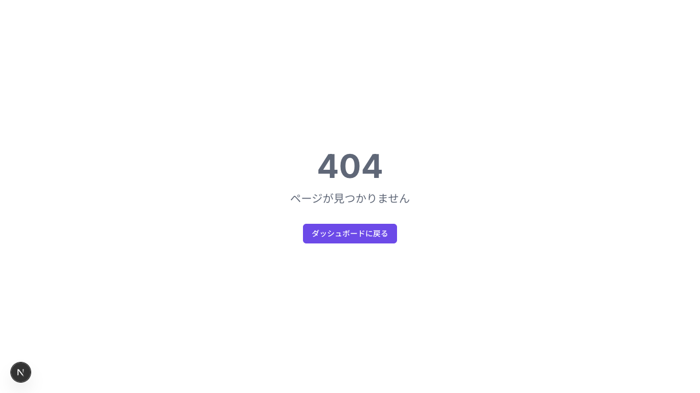
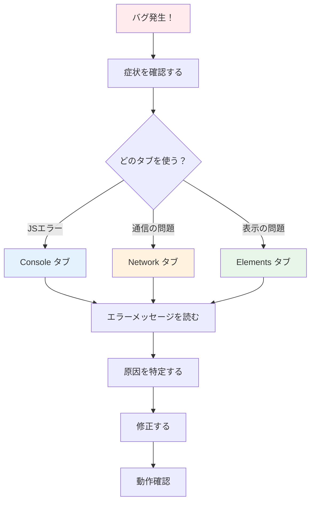

# Day 26: エラーページを作って、バグを退治しよう

## 前回の振り返り

Day 25 ではプロフィール表示ページと
パスワード変更フォームを実装し、
`useState` によるフォーム管理や
`toast` によるフィードバック表示を学びました。
ユーザー向け機能が一通り揃ったので、
今日はエラーハンドリングと DevTools を使った
デバッグ演習に取り組みます。

---

## 今日のゴール

エラーページ（error.tsx）の動作を確認し、
3つのバグパターンを学びます。
そのうち1つは実際にコードを書いて修正します。
DevTools の Console・Network・Elements タブの
使い分けも身につけます。

【スクリーンショット】エラーページ画面の表示を確認してください。



## 始める前の前提

- Day 25 までの主要画面が動いている
- ブラウザの DevTools を開ける
- 一時的にエラーコードを入れて、確認後に元へ戻せる
- `npm run lint` を実行して、修正後に警告が残っていないか確認できる

## なぜこれを作るのか

Day 25 まで完走して、アプリの主要機能が一通り
揃いました。残り5日です。
今日からはプロの開発者が日常的に使う
デバッグスキルを身につけましょう。

バグのないアプリはありません。
大事なのは、バグが出たときに
慌てず順番どおり追えることです。
バグを意図的に作って、DevTools で発見し、
自分で直す経験を積みましょう。

> **例え話**: DevToolsは「お医者さんの道具セット」です。Console（聴診器）で症状を聞き、Network（レントゲン）で内部の通信を見て、Elements（解剖図）でページの構造を調べます。

### デバッグの流れ


```mermaid
flowchart TD
    A[バグ発生！] --> B[症状を確認する]
    B --> C{どのタブを使う？}
    C -->|JSエラー| D[Console タブ]
    C -->|通信の問題| E[Network タブ]
    C -->|表示の問題| F[Elements タブ]
    D --> G[エラーメッセージを読む]
    E --> G
    F --> G
    G --> H[原因を特定する]
    H --> I[修正する]
    I --> J[動作確認]

    style A fill:#ffebee
    style D fill:#e3f2fd
    style E fill:#fff3e0
    style F fill:#e8f5e9
```

この図で先頭に置いてあるのは「症状を確認する」です。
画面が真っ白になるのか、データだけ出てこないのか、見た目の崩れだけなのかで、原因のある場所は変わります。
症状を見ないままコードを上から読み直すと、関係のない行を何十行も追うはめになります。

タブの選び方も丸暗記するものではありません。
Console には、ブラウザ上で動いた JavaScript の投げたエラーが出ます。
Network にはブラウザとサーバーのあいだで実際に飛んだ通信が並びます。
Elements には、いま画面に出ている HTML と当たっている CSS の現物が出ます。
どこに証拠が残るかで、開くタブが決まります。
今日はこの図の上半分、つまり症状からタブを選ぶところまでを、Day 25 までに作った画面で一往復します。

### やること / やらないこと

| やること | やらないこと |
|---------|-------------|
| error.tsxの動作を確認する | エラーハンドリングの理論を暗記する |
| 3つのバグパターンを学び、1つは実際に修正する | バグを見つけてもらうだけ |
| DevTools 3タブの使い分けを学ぶ | DevToolsの全機能を網羅する |
| Biome lintでコード品質をチェックする | ESLintの設定を書く |

### 新しく学ぶ概念

| 概念 | 読み方 | 役割 | 例え |
|------|--------|------|------|
| Error Boundary | エラー・バウンダリ | エラーをキャッチしてフォールバックUIを表示 | 安全ネット。落下しても大怪我しない |
| Optional Chaining | オプショナル・チェイニング | nullやundefinedで安全にアクセスする | 「もし存在すれば」の条件付きアクセス |
| useEffectの依存配列 | — | 再実行の条件を指定するリスト | 「これが変わった時だけ再実行」の設定 |

## 実装ステップ一覧

| ステップ | 作業内容 | 所要時間 | 触るファイル | 成功状態 |
|---------|---------|---------|-------------|---------|
| Step 1 | error.tsxを作る | 4分 | src/app/error.tsx | Error Boundaryがわかる |
| Step 2 | error.tsxの動作を確認する | 5分 | dashboard/page.tsx | エラーページが表示される |
| Step 3 | バグA: Optional Chainingなし | 7分 | 教材内演習 | Console赤エラーを修正 |
| Step 4 | バグB: useEffect依存配列ミス | 7分 | 教材内演習 | 無限リクエストを修正 |
| Step 5 | バグC: console.log残し | 5分 | dashboard/page.tsx | Biome lintで検出・修正 |
| Step 6 | DevTools 3タブの使い分けまとめ | 5分 | なし | いつ何を見るかわかる |
| Step 7 | Biome lintで全体チェック | 4分 | ターミナル | lint警告ゼロ |

**合計時間**: 約37分です。

---

### Step 1: error.tsxのコードを書く（4分）

**ゴール**: Error Boundaryの仕組みを理解します。

`src/app/error.tsx` を新規作成します。

**実装**:

```typescript
// filepath: src/app/error.tsx
// コンポーネント定義とエラーログ
'use client';

import { useEffect } from 'react';
import { Button }
  from '@/component/ui/button';

export default function ErrorPage({
  error, reset,
}: {
  error: Error & { digest?: string };
  reset: () => void;
}) {
  useEffect(() => {
    console.error(error);
  }, [error]);
```

ここまでが「エラーを受け取って記録する」部分です。
配下のコンポーネントが描画の途中で例外を投げると、Next.js はその画面の描画をあきらめて、代わりにこの `ErrorPage` を描きます。
そのとき投げられたエラー本体が `error`、描画をもう一度やり直させる関数が `reset` として渡されます。
だから引数の名前を勝手に変えても動きますが、順番と形（オブジェクトの中の `error` と `reset`）は Next.js が決めているので変えられません。

`'use client'` を先頭に書いているのは、やり直しボタンにつなぐ `reset` と、記録に使う `useEffect` が、ブラウザで動く部品でないと使えないためです。
この1行を消すと、エラーページ自体がビルドで弾かれます。
ただし、受け取るエラーがブラウザ側で起きたものに限る、という意味ではありません。
サーバー側で画面を組み立てている途中に投げられたエラーも、Next.js はこの `ErrorPage` へ回します。
そのときは本番ビルドだと文言が伏せられ、`error.digest` という短い符号だけが渡ります。
届く順番は少し変わります。サーバー側で起きた場合、最初に返ってくる HTML はステータス 500 で、この画面の中身はまだ入っていません。
JavaScript が読み込まれたところで、はじめてこの `ErrorPage` が描かれます。
だから Network タブには 500 の赤い行が残ったまま、画面にはやり直しボタンが出ている、という状態になります。
どちらで起きたのかを見分ける手順は、このあと Console を開くところで扱います。

`useEffect` の依存配列に `[error]` を入れているのは、同じエラーで描画が何度走ってもログを1回に抑えるためです。
依存配列そのものを書き忘れると、描画のたびに Console が同じ行で埋まり、肝心の1件目が上へ流れて読めなくなります。

続けて、描画する JSX を確認します。

```typescript
// filepath: src/app/error.tsx
// フォールバックUI（returnの中身）
  return (
    <div className="flex min-h-screen
      items-center justify-center">
      <div className="text-center space-y-4">
        <h2 className="text-2xl font-bold">
          エラーが発生しました
        </h2>
        <p className="text-muted-foreground">
          予期しないエラーが発生しました。
          もう一度お試しください。
        </p>
        <Button onClick={reset}>
          もう一度試す
        </Button>
      </div>
    </div>
  );
}
```

**確認ポイント**:
- `reset` 関数が「もう一度試す」ボタンに紐づいている
- `error.tsx` が `error` と `reset` の2つの props を受け取ることがわかった

**コード解説**:

| コード | 意味 | 例え |
|--------|------|------|
| `error` | 発生したエラーオブジェクト | 患者のカルテ（症状の記録） |
| `reset` | エラーをリセットして再描画する関数 | 「もう一度試す」ボタンの処理 |
| `'use client'` | クライアントコンポーネント必須 | Error Boundaryはブラウザ側で動く |
| `console.error(error)` | エラー詳細をConsoleに出力 | カルテをログに記録 |

ここで先に線を引いておきます。
`error.tsx` が拾えるのは「画面を描いている最中に投げられた例外」だけです。
Day 09 で書いた一覧のように、描画の途中で `undefined` のプロパティを読んでしまった、という種類のエラーはここに落ちてきます。

拾えないものもあります。
ボタンの `onClick` の中や、`useEffect` やタイマーから始めた処理で投げたエラーは、描画が終わったあとに起きるので `error.tsx` は反応しません。
これらは Console に赤い行が出るだけで、画面は何ごともなかったように残ります。
`fetch` は書く場所で分かれます。サーバー側の部品の中で `await` して待っている `fetch` は描画の一部なので、そこで投げられたエラーは `error.tsx` が受け止めます。ただし `fetch` は、サーバーが 404 や 500 を返しても自分からはエラーを投げません。`response.ok` を確かめて自分で `throw` して初めて、この画面へ回ります。`onClick` や `useEffect` から始めた `fetch` は描画の外なので、投げても受け止めません。
存在しない URL も別枠で、こちらは `not-found.tsx` の担当です。
つまり「画面が真っ白になった」ときは描画中のエラー、「画面は出ているのにボタンが効かない」ときはイベントの中のエラーだと、症状から見当がつきます。

**学んだこと**: Next.js App Routerでは、`error.tsx`を配置するだけでError Boundaryが自動的に機能します。

---

### Step 2: error.tsxの動作を確認する（5分）

**ゴール**: 作成した Error Boundary が
どう動くか体験します。

まず `src/app/not-found.tsx` を新規作成します。
このファイルは、存在しない URL を開いたときに出る画面です。

```tsx
// filepath: src/app/not-found.tsx
import Link from 'next/link';

export default function NotFound() {
  return (
    <div className="flex min-h-screen
      flex-col items-center justify-center
      gap-4 px-4">
      <h1 className="text-6xl font-bold
        text-muted-foreground">404</h1>
      <p className="text-xl
        text-muted-foreground">
        ページが見つかりません
      </p>
      <Link href="/dashboard"
        className="mt-4 rounded-md
          bg-primary px-4 py-2 text-sm
          font-medium text-primary-foreground
          hover:bg-primary/90">
        ダッシュボードに戻る
      </Link>
    </div>
  );
}
```

このファイルを置かなくても404の画面自体は出ます。Next.js が用意した既定の画面へ切り替わるためです。ただしその画面は英語で、戻る先へのリンクもありません。自分のアプリの言葉で書いて戻り道を用意しておくと、行き止まりになりません。`error.tsx` と違って `'use client'` が要らないのは、押す場所がリンク1つで、状態を持たないためです。

次に、存在しないページにアクセスして
`not-found.tsx` が動作することを確認します。
そのあとで、わざとエラーを起こして
`error.tsx` の動作を確認します。

この Day では 3001 番ポートで
開発サーバーを起動します。

```bash
# filepath: ターミナル
PORT=3001 npm run dev
```

`PORT=3001` を頭に付けているのは、Day 01 から使ってきた 3000 番の開発サーバーを止めずに済ませるためです。
今日はわざとエラーを起こすので、普段どおり動く画面を別のポートに残しておくと、比べながら進められます。
`Error: listen EADDRINUSE` と出たら、その番号は誰かが使っています。
3002 など空いている番号に変えてください。

ここからは、エラーの種類を2つ続けて見ます。
1つ目は「そのページが存在しない」で、2つ目は「ページはあるが描画中に落ちた」です。
出る画面が違うので、どちらの症状なのかを目で覚えてください。

1. `http://localhost:3001/this-page-does-not-exist`
   をブラウザで開く
2. 「404」と「ページが見つかりません」を確認する
3. ダッシュボードへ一時的にエラーを追加する

```typescript
// filepath: src/app/dashboard/page.tsx（一時的に追加）
// DashboardPage関数の先頭に追加する
throw new Error(
  'テストエラー: これは練習です'
);
```

この `throw` は、ダッシュボードが描画を始めた直後に例外を投げます。
いま動かしているのは `npm run dev` なので、`error.tsx` を置いていなくても画面が真っ白になることはありません。
Next.js の開発用オーバーレイが前面に出てきて、エラーの文言と、どのファイルの何行目で起きたかを教えてくれます。
開発中にエラーの居場所をすぐ突き止められるのは、この助けがあるからです。

ただし、この親切なオーバーレイが出るのは開発中だけです。
`npm run build` で作った本番の画面では、`error.tsx` が無いと Next.js があらかじめ用意している素っ気ない画面に切り替わります。
そこには何のアプリなのかも、次に何をすればよいのかも書かれていません。
使っている人からすると、行き止まりに見えます。
Step 1 で置いた `error.tsx` は、そのときに自分のアプリの言葉で事情を伝えて「もう一度試す」まで案内するために書きました。

Step 1 で書いた `error.tsx` は決まった日本語だけを描いていて、`error` の中身を画面には出していません。
どのエラーでも同じ文言が出るので、画面だけでは種類を判別できません。
中身は `useEffect` の中の `console.error(error)` がブラウザの Console へ出しています。
DevTools を開いて Console タブを見てください。
今回の `throw` なら「テストエラー: これは練習です」がそこに並びます。

ここで、`npm run dev` のターミナルにも同じ文言が出ていることを確かめてください。
このダッシュボードは Day 02 で `'use client'` を外したページなので、`throw` が起きる場所はサーバー側です。
それでも文言がブラウザの Console にも出るのは、開発モードがサーバー側のエラーをそのまま送り届けているためです。
Network タブの `/dashboard` はステータス 500 になり、そのあと `error.tsx` の画面に入れ替わります。
つまり開発中は、文言が Console に出ているかどうかでサーバー側かブラウザ側かを決められません。
開発モードは原因を追いやすくするために、どちらで起きたエラーも文言をそのまま見せます。

伏せられるのは本番ビルドのときだけです。
本番ではサーバー側で投げたエラーの文言が消え、`error.digest`（エラー1件ごとに振られる短い符号）だけがブラウザへ渡ります。
本当の文言はサーバーのログに残るので、公開後の調査ではそちらを読みます。
文言を伏せるのは、テーブル名やファイルのパスがそのままユーザーの画面へ漏れるのを防ぐためです。
故障ではなく、意図してそう作られています。

> 開発モードではエラーオーバーレイが
> 先に表示されます。右上の × ボタンで閉じると、
> 作成したフォールバック UI を確認できます。

**確認ポイント**:
1. 存在しないページで404画面が表示された
2. 意図的なエラーで作成済みの画面が表示された
3. 「もう一度試す」ボタンが機能した
4. **追加した `throw` 行を必ず削除した**

【スクリーンショット】error.tsxのエラーページ画面の表示を確認してください。


**学んだこと**: `error.tsx` は予期しないエラーが
発生したときに、白い画面の代わりとなる
フォールバック UI を表示します。

---

### Step 3: バグA（Optional Chainingなし・7分）

**ゴール**: `?.`（Optional Chaining）を使わないとどうなるか体験し、修正します。

以下のバグコードを**教材内で確認**してください。実際のアプリでは`?.`が正しく使われていますが、もし`?.`を外すとどうなるかを理解しましょう。

以下の演習では学習用の型を使います。

```typescript
// filepath: 教材内の演習コード（型定義）
// 演習用の型定義（実行不要）
type Task = {
  assignee: {
    name: string;
  } | null;
};
```

`assignee` の型に `| null` が付いているのは、担当者が決まっていないタスクが実際にあるからです。
Day 14 でタスクを作ったとき、担当者を選ばないまま登録できました。
そのタスクの `assignee` は、データベースから取り出した時点で `null` になります。
つまりこの型は誰かが安全のために足した制約ではなく、データの実態をそのまま書き写したものです。
そして TypeScript は、この `| null` を根拠に「そこは空かもしれない」と教えてくれます。

**確認ポイント**:
- assignee が `null` になり得ることを確認した
- この型定義は次のステップで使用する

**バグのあるコード**:

```typescript
// filepath: 教材内の演習コード（実行不要）
// ❌ バグ: assigneeがnullの場合にクラッシュ
function TaskCard(
  { task }: { task: Task }
) {
  return (
    <div>
      <p>担当者:
        {task.assignee.name}</p>
    </div>
  );
}
```

`task.assignee.name` は「assignee は必ずある」という前提のうえに書かれています。
担当者が入っているタスクなら動くので、開発中は気づかないまま通り過ぎます。
壊れるのは、担当者が空のタスクが一覧に1件だけ混ざったときです。

そのとき消えるのは、このカード1枚ではありません。
描画の途中で例外が飛ぶと、React はそこから上へ処理を巻き戻し、いちばん近い Error Boundary まで戻ります。
結果として、一覧ページごと Step 1 で作った `error.tsx` の画面に差し替わります。
たった1件のデータで画面全体が消える点こそ、このバグの怖さです。

**確認ポイント**:
- `.name` へアクセスする前の null チェックが抜けていると分かった

Console に表示されるエラーメッセージは次のとおりです。

```text
TypeError: Cannot read properties
  of null (reading 'name')
  at TaskCard (task-card.tsx:5:38)
```

このメッセージは、前から順に読むとそのまま原因になっています。
`Cannot read properties of null` が「null に対してプロパティを読もうとした」、`(reading 'name')` が「読もうとしたのは name だった」です。
最後の `at TaskCard (task-card.tsx:5:38)` は、それが起きた場所を指します。
ファイル名・行番号・行の何文字目か、の順で並んでいて、Console ではこの部分がリンクになっています。
クリックすると該当行へ飛べるので、まず読むべきはここです。
その下に続く長い呼び出し履歴（スタックトレース）は、慣れるまで読まなくてかまいません。

**確認ポイント**:
- `reading 'name'` が問題のプロパティだとわかった

**修正後のコード**:

```typescript
// filepath: 教材内の演習コード（修正版）
// ✅ 修正: ?.でnullチェック + ??で代替値
function TaskCard(
  { task }: { task: Task }
) {
  return (
    <div>
      <p>担当者:
        {task.assignee?.name
          ?? '未割り当て'}</p>
    </div>
  );
}
```

**確認ポイント**:
- `?.` と `??` の組み合わせで安全にアクセスしている

**修正前後の比較**:

| 修正前 | 修正後 | 違い |
|--------|--------|------|
| `task.assignee.name` | `task.assignee?.name` | `?.`で安全にアクセス |
| クラッシュする | `undefined`を返す | エラーにならない |
| — | `?? '未割り当て'`で代替テキスト | nullの時の表示指定 |

**確認ポイント**:
1. `?.`（Optional Chaining）の役割がわかった
2. `??`（Nullish Coalescing）で代替値を指定する方法がわかった
3. Consoleのエラーメッセージの読み方がわかった

**学んだこと**: `?.` は null/undefined のときエラーにせず `undefined` を返します。`??` と組み合わせて代替値を指定できます。

---

### Step 4: バグB（useEffectの依存配列ミス・7分）

**ゴール**: useEffectの依存配列を間違えると無限リクエストが発生することを理解し、修正方法を学びます。

> task-app では tRPC の `useQuery` が
> 自動管理してくれるため、このパターンは
> 発生しません。しかし、個人開発や他の
> プロジェクトで必ず遭遇するバグパターン
> なので理解しておきましょう。

**バグのあるコード**:

```typescript
// filepath: 教材内の演習コード（実行不要）
// ❌ バグ: 依存配列に毎回新しいオブジェクトが入る
function TaskList() {
  const [tasks, setTasks] = useState([]);
  const filter = { status: 'TODO' };

  useEffect(() => {
    fetchTasks(filter)
      .then(setTasks);
  }, [filter]);
  // ↑ 毎レンダリングで新しいオブジェクト
}
```

この `filter` は、`TaskList` が描画されるたびに `{ status: 'TODO' }` を新しく作り直しています。
中身は毎回まったく同じですが、JavaScript にとっては毎回べつの入れ物です。
`useEffect` は依存配列を「前回と同じ入れ物か」で見比べるので、中身が同じでも入れ物が違えば実行し直します。
Step 1 の `[error]` を1回で済ませられたのは、同じエラーのあいだ入れ物が変わらないからです。

**確認ポイント**:
- `filter` が関数の中で毎回作られることを確認した

**症状**: DevTools Network タブに同じリクエストが
無限に流れ続けます。

```text
GET /api/tasks ← 何百回も繰り返し
GET /api/tasks
GET /api/tasks
...（止まらない）
```

ここが、サーバー側の不具合と見分けが要る場面です。
並んでいるリクエストのステータスは全部 200 で、返ってくるデータも正しく、サーバーのログにも異常は残りません。
サーバーは聞かれたことに正しく答え続けているだけです。
おかしいのは、同じことを繰り返し聞き続けているブラウザ側です。

見分け方の手掛かりはこうなります。
Network タブに赤い行（400 番台や 500 番台）が並んでいたら、まずサーバー側を疑います。
ただし赤い行はサーバー側の不具合を証明しません。ブラウザが誤った内容を送れば、サーバーは正しく 400 を返します。
赤い行を見つけたら、そのリクエストをどのコードが出したかを追ってください。送っている値がおかしければブラウザ側です。
あわせて Console の赤い行と、`npm run dev` を動かしているターミナルのログも確認します。
今回のように緑のまま同じ行が積み上がっている場合は、ブラウザが同じ要求を出し続けている合図です。
放っておくとブラウザが重くなり、やがてタブごと固まります。

**確認ポイント**:
- Network タブで同じリクエストの繰り返しが無限ループの兆候だとわかった

**修正後のコード**:

```typescript
// filepath: 教材内の演習コード（修正版）
// ✅ 修正: プリミティブ値を依存配列に使う
function TaskList() {
  const [tasks, setTasks] = useState([]);
  const [status] = useState('TODO');

  useEffect(() => {
    fetchTasks({ status })
      .then(setTasks);
  }, [status]);
  // ↑ stringは参照が変わらない
}
```

**確認ポイント**:
- string 型は毎回同じ参照なので再実行されない

無限ループが起きる流れは次のとおりです。

| ステップ | 動作 |
|---------|------|
| 1 | コンポーネントがレンダリングされる |
| 2 | `filter = { status: 'TODO' }` で新しいオブジェクトが作られる |
| 3 | useEffectが「filterが変わった」と判断して実行 |
| 4 | `setTasks`で状態更新 → 再レンダリング → ステップ1に戻る |
| ∞ | 無限ループ |

> JavaScriptでは `{ status: 'TODO' } !== { status: 'TODO' }` です。見た目は同じでも、毎回「新しいオブジェクト」が作られるため、useEffectは「変わった」と判断します。

**確認ポイント**:
1. オブジェクトの参照が毎回変わる問題を理解できた
2. Networkタブで無限リクエストを発見する方法がわかった
3. プリミティブ値（string/number）を依存配列に使う修正方法がわかった

**学んだこと**: useEffectの依存配列にオブジェクトを入れると、毎レンダリングで新しい参照になり無限ループを引き起こします。

---

### Step 5: バグC（console.log残し・5分）

**ゴール**: `console.log`の残りをBiome lintで検出し、修正します。

ダッシュボードのコードにわざと`console.log`を追加してみましょう。

**実装**:

```typescript
// filepath: src/app/dashboard/page.tsx
// focusCards の定義直後に一時的に追加する
console.log(
  'DEBUG: owner =', dashboardOwner
);
console.log(
  'DEBUG: cards =', focusCards
);
```

この2行は、デバッグ中なら誰でも書くコードです。
値が思ったとおりに入っているかを確かめるのに、`console.log` はいちばん手軽な道具です。
困るのは、確かめ終わったあとに消し忘れることです。
消し忘れても画面はふつうに動くので、自分では気づけません。
だから人の記憶ではなく、道具に見張らせます。

**確認ポイント**:
- 2行の `console.log` を追加した
- ファイルを保存した

次に、Biome lintを実行します。
`npm run lint` は `src` 以下と主な設定ファイルをまとめてチェックしますが、
ここでは変更したファイルだけを確認します。

```bash
# filepath: ターミナル
# Biome lintチェック（該当ファイルのみ）
npx biome check \
  src/app/dashboard/page.tsx
```

`npx biome check` は、コードを実行せずに、書かれた文字だけを読んで規約違反を探します。
だから開発サーバーを止めていても、画面を一度も開かなくても結果が出ます。
末尾にファイルパスを付けると、そのファイルだけを見ます。

30日ぶんのコードが積み上がった今、毎回 `src` 以下すべてにかけると出力が長くなり、いま足した2行の指摘が埋もれます。
直した場所を確かめているあいだは1ファイルに絞り、全体は Step 7 でまとめてかけます。

**確認ポイント**:
- `noConsole` エラーが検出された

Biome が以下のようなエラーを出します。

```text
src/app/dashboard/page.tsx:XX:3 lint/suspicious/noConsole  FIXABLE
  × Don't use console.
  i The use of console is often reserved for debugging.
```

この表示も、Console のエラーと同じ読み方が通じます。
1行目の `src/app/dashboard/page.tsx:XX:3` が場所で、ファイル・行番号・行の何文字目か、の順です。
同じ行に並ぶ `lint/suspicious/noConsole` がルール名、`×` の行が指摘の内容です。
ルール名はそのまま検索語として使えます。
見慣れない指摘が出たときは、この行をコピーして調べれば、何を嫌がられているのかが分かります。

**修正**: 追加した2行の`console.log`を削除してください。

```bash
# filepath: ターミナル
# 修正後に再チェック
npx biome check \
  src/app/dashboard/page.tsx
# → 問題なし
```

**確認ポイント**:
- エラーが0件になった

確認メモ:
ターミナルに `lint/suspicious/noConsole` が表示され、
修正後に `Checked ... No fixes applied.` のような成功表示になればOKです。
> `npx biome check ファイルパス` は
> Biome を1ファイルだけに実行するコマンドです。
> Step 7 の `npm run lint` は
> `src` 以下と主な設定ファイルを
> まとめて対象にします。

**console.logを残すべきでない理由**:

| 問題 | 影響 |
|------|------|
| 本番環境でユーザーに見える | DevToolsを開くと情報漏洩の可能性 |
| パフォーマンスに影響 | 大量のログ出力は処理を遅くする |
| コードの品質低下 | デバッグ用のコードが散乱する |

**確認ポイント**:
1. `console.log`を追加してBiome lintがエラーを出した
2. `console.log`を削除してBiomeのエラーが消えた
3. **追加した`console.log`を必ず削除した**

**学んだこと**: Biome lintは`console.log`の残りを自動検出してくれます。本番コードには`console.log`を残さないようにしましょう。

---

### Step 6: DevTools 3タブの使い分け（5分）

**ゴール**: 症状に応じて DevTools の
どのタブを見るべきか整理します。

ブラウザで DevTools を開いてみましょう。

```bash
# filepath: ターミナル
# 開発サーバーが起動中か確認
PORT=3001 npm run dev
# ブラウザで http://localhost:3001 を開き
# F12（Macは Cmd+Option+I）でDevToolsを開く
```

**確認ポイント**:
- DevTools が表示された

| 症状 | 使うタブ | 確認するもの |
|------|---------|------------|
| 画面が白い/クラッシュ | **Console** | 赤いエラーメッセージ |
| データが取得できない | **Network** | リクエストのステータスコード |
| 表示がおかしい | **Elements** | HTML構造とCSSスタイル |
| 同じリクエストが大量に出る | **Network** | 無限ループの発見 |
| ボタンが反応しない | **Console** | クリックイベントのエラー |
| スタイルが崩れている | **Elements** | 適用されているCSSの確認 |

**DevTools 3タブの開き方**:

| 操作 | Windows/Linux | Mac |
|------|-------------|------|
| DevToolsを開く | F12 | Cmd+Option+I |
| Consoleタブ | Ctrl+Shift+J | Cmd+Option+J |
| Elementsタブ | Ctrl+Shift+C | Cmd+Shift+C |

**確認ポイント**:
1. 3つのタブの使い分けが理解できた
2. 症状に応じてどのタブを見るか判断できる

DevTools の見た目はブラウザやOSで少し変わります。
ここではスクリーンショットを暗記するのではなく、
手元の画面で Console / Network / Elements の3タブを実際に切り替えて確認してください。
**学んだこと**: DevToolsは「症状に合った道具を選ぶ」のが大事です。Console→Network→Elementsの順でチェックするのが基本です。

---

### Step 7: Biome lintで全体チェック（4分）

**ゴール**: `src` 以下と主な設定ファイルのコード品質をBiome lintで確認します。

**操作手順**:

```bash
# filepath: ターミナル
# src 以下と設定ファイルのlintチェック
npm run lint
```

Step 5 では1ファイルに絞りましたが、ここでは自分で書いたコードをまとめて見ます。
`npm run lint` の中身は `biome check src prisma.config.ts next.config.ts package.json tsconfig.json` です。自分で書いたコードが入る `src` と、主な設定ファイルがまとめて対象になります。

消し忘れた `console.log` が見つかるのは、たいてい今日触ったファイルではなく、数日前に触ったファイルです。
1つずつ思い出して開いて確かめるより、全体に1回かけるほうが速くて漏れません。
ここで0件にしてから次の日へ進むと、Day 27 以降で出たエラーが「今日書いた分のせい」だと切り分けられます。

**確認ポイント**:
- lintチェックが完了した

もし警告やエラーがあった場合は、以下で自動修正できます。

```bash
# filepath: ターミナル
# 自動修正モード
npm run lint:fix
```

**Biomeの主な検出項目**:

| ルール | 検出するもの | 深刻度 |
|--------|------------|--------|
| `noConsole` | `console.log`の残り | エラー |
| `noUnusedVariables` | 使われていない変数 | エラー |
| `noExplicitAny` | `any`型の使用 | 警告 |
| `useConst` | `let`で再代入していない変数 | エラー |

**確認ポイント**:
1. `npm run lint`が0エラーで通過した
2. Biomeの自動修正が使えることを理解した

**学んだこと**: Biome lintはコードの問題を自動検出し、一部は自動修正もしてくれます。

---


---

### Pro パターンで書こう（Error Boundary の表示分岐は early return で整理する）

エラー画面は、再読み込み中・エラーなし・エラーありで表示が変わります。
三項演算子を重ねるより、先に返すほうが読みやすいです。
最後の `return` に通常のエラー表示だけを残せます。

| 状態 | 表示 |
|------|------|
| 再読み込み中 | 再読み込み中です |
| エラーなし | 再読み込みボタン |
| エラーあり | メッセージと再試行ボタン |

**覚えておきたいこと**: 状態が多い画面は early return で先に返します。

## 今日のまとめ

- [ ] error.tsxの動作を確認した（意図的にエラーを起こして表示確認）
- [ ] Error Boundaryの`error`と`reset` propsを理解した
- [ ] バグA: Optional Chainingなしのクラッシュを修正できた
- [ ] バグB: useEffect依存配列ミスの無限ループを理解した
- [ ] バグC: console.log残りをBiome lintで検出・修正した
- [ ] DevTools Console/Network/Elementsの使い分けがわかった
- [ ] `npm run lint` で `src` 以下と設定ファイルをチェックした

## つまずきポイント

| エラー/問題 | 原因 | 解決方法 |
|------------|------|---------|
| `Cannot read properties of null` | Optional Chainingなし | `?.`を追加する |
| Networkタブでリクエストが止まらない | useEffect依存配列にオブジェクト | プリミティブ値に分解する |
| Biome lintのエラーが消えない | 自動修正できないルール | 手動でコードを修正する |
| error.tsxが表示されない | 開発モードではエラーオーバーレイが優先 | 本番ビルドで確認するか、オーバーレイを閉じる |

## 次回予告

Day 27 では、Day 11・12 で作ったプロジェクト詳細のインライン表示とアーカイブ機能を、完成形と照合して仕上げます。クリックひとつでメンバー一覧やタスク一覧を確認でき、使い終わったプロジェクトをアーカイブで整理できるようになります。
