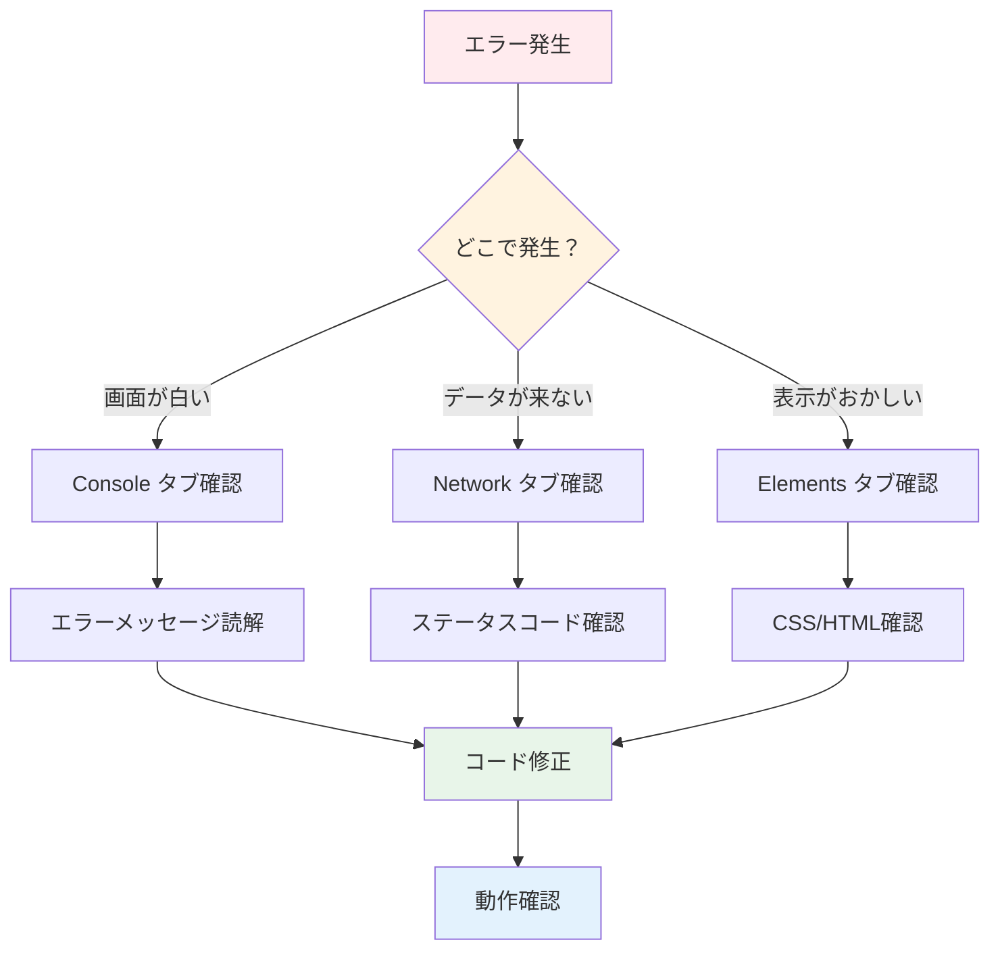

# Day 26: エラー対策・デバッグを学ぼう

## 🎯 今日のゴール

Chrome DevTools を使ったデバッグ方法と、
よくあるReact/tRPCのエラー対処法を学びます。
エラーハンドリングの実装パターンを習得します。

【スクリーンショット: Chrome DevTools Console】

## 🤔 なぜこれを作るのか？

開発では必ずエラーに遭遇します。
素早く原因を特定する力が重要です。

> 💡 **例え話**: デバッグは「探偵の捜査」
> です。事件（エラー）が起きたとき、
> 証拠（ログ）を集めて、犯人（バグ）を
> 特定します。
> Console は証拠保管庫、Network は
> 監視カメラのようなものです。

### 📐 エラー対応のフロー



### やること / やらないこと

| やること | やらないこと |
|---------|-------------|
| DevTools の基本操作 | 高度なパフォーマンス分析 |
| よくあるエラーの対処 | WebSocket デバッグ |
| tRPC エラーハンドリング | サーバーサイドデバッグ |
| error.tsx の実装 | Sentry 等の外部ツール |

### 🆕 新しく学ぶ概念

| 概念 | 読み方 | 役割 | 例え |
|------|--------|------|------|
| Console | コンソール | ログ・エラー表示 | 証拠保管庫 |
| Network | ネットワーク | API通信の監視 | 監視カメラ |
| TRPCError | — | サーバー側エラー | 公式の報告書 |
| error.tsx | — | エラー画面 | 工事中の看板 |

## 📊 実装ステップ一覧

| ステップ | 作業内容 | 所要時間 |
|---------|---------|---------|
| Step 1 | Chrome DevTools の概要 | 3分 |
| Step 2 | Console タブの活用 | 5分 |
| Step 3 | よくあるReactエラー | 5分 |
| Step 4 | Network タブでAPI確認 | 5分 |
| Step 5 | tRPC エラーハンドリング | 5分 |
| Step 6 | TRPCError コード一覧 | 3分 |
| Step 7 | グローバルエラーページ | 5分 |
| Step 8 | toast でユーザーフィードバック | 3分 |
| Step 9 | 動作確認 | 3分 |

**合計時間**: 約37分

---

### Step 1: Chrome DevTools の概要（3分）

🎯 **ゴール**: DevTools の開き方と
主要タブの役割を理解します。

#### DevTools を開くショートカット

| OS | キー |
|-----|------|
| Windows / Linux | F12 |
| Windows / Linux | Ctrl + Shift + I |
| Mac | Cmd + Option + I |

#### 主要タブの一覧

| タブ | 用途 | 確認できる情報 |
|------|------|--------------|
| Console | ログ・エラー | console.log の出力 |
| Network | API通信 | リクエスト/レスポンス |
| Elements | HTML/CSS | DOM構造とスタイル |
| Application | ストレージ | Cookie / LocalStorage |

> 💡 開発中は DevTools を常に開いて
> おくことを推奨します。エラーが起きた
> 瞬間にすぐ原因を確認できます。

✅ **確認ポイント**:
- DevTools を開けた
- 4つのタブの場所を確認した

【スクリーンショット: DevTools 全体】

---

### Step 2: Console タブの活用（5分）

🎯 **ゴール**: console のメソッドを
使い分けてデバッグします。

💻 **実装**:

```typescript
// filepath: src/app/report/page.tsx
// デバッグ用のログ出力例
const { data: tasks } =
  api.task.getAll.useQuery();

console.log('タスク一覧:', tasks);
console.warn('注意: データが空です');
console.error('エラー: 取得失敗');
```

#### console メソッドの使い分け

| メソッド | 用途 | アイコン |
|---------|------|---------|
| console.log | 通常のログ出力 | なし |
| console.warn | 警告メッセージ | 黄色の三角 |
| console.error | エラーメッセージ | 赤い丸 |
| console.table | テーブル形式で表示 | 表 |

💻 **console.table の活用**:

```typescript
// filepath: src/app/report/page.tsx
// 配列データをテーブル形式で確認
const { data: tasks } =
  api.task.getAll.useQuery();

if (tasks) {
  console.table(
    tasks.map((t) => ({
      id: t.id,
      title: t.title,
      status: t.status,
    }))
  );
}
```

> 💡 `console.table` は配列やオブジェクトを
> 見やすい表形式で Console に表示します。
> データの中身を確認するのに便利です。

✅ **確認ポイント**:
- Console にログが表示される
- console.table でデータが見える

【スクリーンショット: Console のログ出力】

---

### Step 3: よくあるReactエラー（5分）

🎯 **ゴール**: React で頻出するエラー3つの
原因と解決方法を学びます。

#### エラー1: Cannot read property of undefined

```typescript
// filepath: src/app/task/page.tsx
// ❌ task が undefined の場合にエラー
const title = task.title;

// ✅ オプショナルチェーンで安全にアクセス
const title = task?.title;

// ✅ デフォルト値を設定する
const title =
  task?.title ?? 'タイトルなし';
```

#### エラー2: Maximum update depth exceeded

```typescript
// filepath: src/app/task/page.tsx
// ❌ 無限ループが発生する
useEffect(() => {
  setCount(count + 1);
}, [count]);

// ✅ 依存配列を空にして初回のみ実行
useEffect(() => {
  setCount((prev) => prev + 1);
}, []);
```

#### エラー3: Hydration failed

```typescript
// filepath: src/app/task/page.tsx
// ❌ SSR と クライアントで値が違う
export default function Page() {
  return (
    <p>{new Date().toString()}</p>
  );
}
```

```typescript
// filepath: src/app/task/page.tsx
// ✅ useEffect でクライアント側のみ実行
'use client';
import { useState, useEffect } from 'react';

export default function Page() {
  const [now, setNow] = useState('');

  useEffect(() => {
    setNow(new Date().toString());
  }, []);

  return <p>{now}</p>;
}
```

#### 3つのエラーまとめ

| エラー名 | 原因 | 対処法 |
|---------|------|--------|
| Cannot read property | 値がundefined | ?. でアクセス |
| Maximum update depth | 無限ループ | 依存配列を修正 |
| Hydration failed | SSR/CSRの不一致 | useEffect で分離 |

> 💡 エラーメッセージを検索エンジンに
> 貼り付けると、解決策が見つかることが
> 多いです。英語のまま検索すると
> より多くの情報が見つかります。

✅ **確認ポイント**:
- 3つのエラーの原因と対処法を理解した

---

### Step 4: Network タブでAPI確認（5分）

🎯 **ゴール**: Network タブで
API通信の状態を確認します。

#### Network タブの見方

| 列 | 意味 | 確認ポイント |
|-----|------|------------|
| Name | リクエスト名 | どのAPIか |
| Status | HTTPステータス | 200 なら成功 |
| Time | 応答時間 | 遅いと問題 |
| Size | データ量 | 大きすぎないか |

#### HTTPステータスコード

| コード | 意味 | よくある原因 |
|--------|------|------------|
| 200 | 成功 | 正常 |
| 400 | Bad Request | パラメータ不正 |
| 401 | Unauthorized | 未ログイン |
| 403 | Forbidden | 権限がない |
| 404 | Not Found | URLが間違い |
| 500 | Server Error | サーバー側の問題 |

#### tRPC のリクエスト確認手順

1. DevTools の Network タブを開く
2. ページを操作してAPIを呼び出す
3. `trpc` を含むリクエストを探す
4. クリックして Response タブを確認
5. エラーがあれば message を確認

> 💡 tRPC のリクエストは `/api/trpc/`
> という URL で送信されます。Network
> タブのフィルタに `trpc` と入力すると
> 見つけやすくなります。

✅ **確認ポイント**:
- Network タブでリクエストを確認できた
- ステータスコードの意味を理解した

【スクリーンショット: Network タブの表示】

---

### Step 5: tRPC エラーハンドリング（5分）

🎯 **ゴール**: useQuery と useMutation の
エラー処理パターンを学びます。

💻 **useQuery のエラー処理**:

```typescript
// filepath: src/app/task/page.tsx
// useQuery でエラーを受け取る
const {
  data: tasks,
  error,
  isLoading,
} = api.task.getAll.useQuery();

if (error) {
  return (
    <AppLayout>
      <div className="p-6">
        <p className="text-destructive">
          エラー: {error.message}
        </p>
      </div>
    </AppLayout>
  );
}
```

💻 **useMutation のエラー処理**:

```typescript
// filepath: src/app/task/page.tsx
// useMutation で onError を使う
const createTask =
  api.task.create.useMutation({
    onSuccess: () => {
      toast.success(
        'タスクを作成しました'
      );
    },
    onError: (error) => {
      toast.error(
        `作成に失敗: ${error.message}`
      );
    },
  });
```

#### useQuery vs useMutation のエラー処理

| 種類 | 取得方法 | タイミング |
|------|---------|-----------|
| useQuery | error プロパティ | 自動的にセット |
| useMutation | onError コールバック | mutate 失敗時 |

> 💡 `useQuery` はデータ取得なので、
> error プロパティで確認します。
> `useMutation` はアクション実行なので、
> コールバックでハンドリングします。

✅ **確認ポイント**:
- useQuery のエラー表示パターンを理解した
- useMutation の onError を理解した

---

### Step 6: TRPCError コード一覧（3分）

🎯 **ゴール**: サーバー側で使われる
TRPCError のコードを理解します。

💻 **サーバー側のエラー例**:

```typescript
// filepath: src/server/api/trpc.ts
// 認証チェックのミドルウェア
const isAuthenticated =
  t.middleware(async ({ ctx, next }) => {
    if (!ctx.session?.userId) {
      throw new TRPCError({
        code: 'UNAUTHORIZED',
        message: 'ログインが必要です',
      });
    }
    return next({
      ctx: { session: ctx.session },
    });
  });
```

#### TRPCError コード一覧

| コード | HTTPステータス | 意味 | 使用場面 |
|--------|-------------|------|---------|
| UNAUTHORIZED | 401 | 未認証 | 未ログイン |
| FORBIDDEN | 403 | 権限なし | 管理者のみ |
| NOT_FOUND | 404 | 見つからない | タスクが存在しない |
| BAD_REQUEST | 400 | 入力不正 | バリデーション失敗 |

> 💡 これらのエラーコードはサーバー側で
> `throw new TRPCError(...)` として
> 投げられます。クライアント側では
> `error.message` で詳細を確認できます。

✅ **確認ポイント**:
- 4つのエラーコードの用途を理解した

---

### Step 7: グローバルエラーページ（5分）

🎯 **ゴール**: Next.js の error.tsx で
予期しないエラーをキャッチします。

💻 **実装**:

```typescript
// filepath: src/app/error.tsx
'use client';

import { Button }
  from '@/component/ui/button';
import { useEffect } from 'react';
```

```typescript
// filepath: src/app/error.tsx
// コンポーネント定義と副作用
export default function ErrorPage({
  error,
  reset,
}: {
  error: Error;
  reset: () => void;
}) {
  useEffect(() => {
    console.error(
      'エラー発生:', error
    );
  }, [error]);
```

```typescript
// filepath: src/app/error.tsx
// エラー画面のJSX
  return (
    <div className="flex flex-col
      items-center justify-center
      min-h-screen p-6">
      <h1 className="text-2xl
        font-bold mb-4">
        エラーが発生しました
      </h1>
      <p className=
        "text-muted-foreground mb-6">
        {error.message}
      </p>
      <Button onClick={reset}>
        再試行
      </Button>
    </div>
  );
}
```

#### error.tsx の仕組み

| 項目 | 説明 |
|------|------|
| 配置場所 | src/app/error.tsx |
| 受け取るProps | error（Errorオブジェクト）, reset（リトライ関数） |
| 動作タイミング | 子コンポーネントで未捕捉エラー発生時 |
| 'use client' | 必須（エラーバウンダリはCSR） |

> 💡 `error.tsx` は Next.js App Router の
> エラーバウンダリです。配置したディレクトリ
> 以下で発生した未捕捉エラーを全て
> キャッチして、このページを表示します。
> `reset` を呼ぶとコンポーネントを
> 再レンダリングできます。

✅ **確認ポイント**:
- error.tsx を作成できた
- reset ボタンの仕組みを理解した

---

### Step 8: toast でユーザーフィードバック（3分）

🎯 **ゴール**: toast を使って
ユーザーに結果を通知します。

💻 **実装**:

```typescript
// filepath: src/app/task/page.tsx
// toast の使い分け
import toast from 'react-hot-toast';

// 成功時
toast.success('タスクを作成しました');

// エラー時
toast.error('作成に失敗しました');

// カスタムメッセージ
toast('処理を開始します', {
  icon: '🔄',
});
```

#### toast vs alert の比較

| 項目 | toast | alert |
|------|-------|-------|
| 操作ブロック | しない | する |
| 自動消去 | あり（数秒） | なし（OK押すまで） |
| カスタマイズ | 色・アイコン変更可 | テキストのみ |
| 複数表示 | 可能 | 1つずつ |

> 💡 本番アプリケーションでは
> `alert()` ではなく `toast` を使います。
> ユーザーの操作をブロックせず、
> 自然に結果を伝えることができます。

✅ **確認ポイント**:
- toast.success と toast.error を使い分けられる
- alert() との違いを理解した

【スクリーンショット: toast 表示】

---

### Step 9: 動作確認（3分）

🎯 **ゴール**: 学んだデバッグ手法を
実際に試します。

1. DevTools の Console タブを開く
2. `/report` にアクセスしてログを確認
3. Network タブで trpc リクエストを確認
4. リクエストの Status が 200 か確認
5. Response タブでデータを確認
6. console.log を追加してデータを表示
7. わざとエラーを起こして Console 確認

✅ **確認ポイント**:
- DevTools でエラーを発見できる
- ステータスコードを確認できる

【スクリーンショット: デバッグ実践】

---

## 📋 今日のまとめ

- [ ] Chrome DevTools の操作を学んだ
- [ ] よくある React エラー3つを理解した
- [ ] tRPC のエラーハンドリングを実装した
- [ ] error.tsx でグローバルエラーを処理した
- [ ] toast でユーザーに結果を通知できた

## ⚠️ つまずきポイント

| エラー / 問題 | 原因 | 解決方法 |
|--------------|------|---------|
| Console が空 | DevTools 未起動 | F12 で開く |
| error が undefined | useQuery 未実行 | isLoading チェック追加 |
| toast が出ない | Toaster 未配置 | layout.tsx に追加 |
| error.tsx が動かない | 'use client' 未記載 | ファイル先頭に追加 |

## 📝 今日学んだ用語

| 用語 | 意味 |
|------|------|
| DevTools | ブラウザ内蔵の開発者ツール |
| オプショナルチェーン (?.) | undefined エラーを防ぐ記法 |
| TRPCError | サーバー側のエラークラス |
| error.tsx | Next.js のエラーバウンダリ |
| toast | 非ブロッキングの通知メッセージ |

## 🔗 次回予告

Day 27 では、セキュリティ対策を学びます。
入力値のサニタイズやCSRF対策など、
安全なアプリケーションに必要な知識を習得します。
