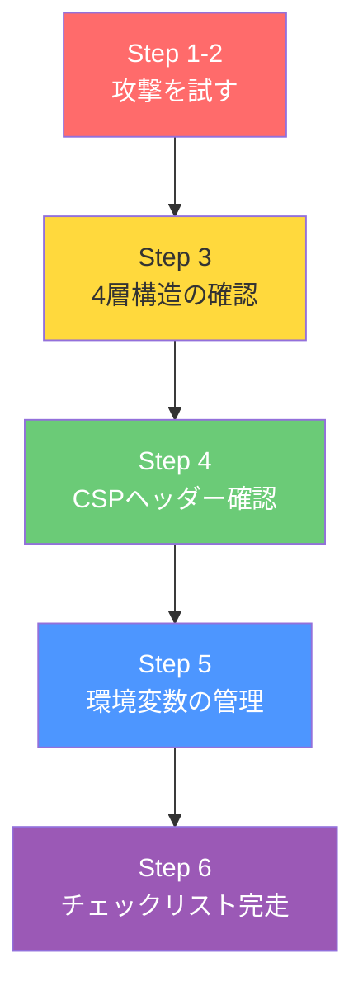
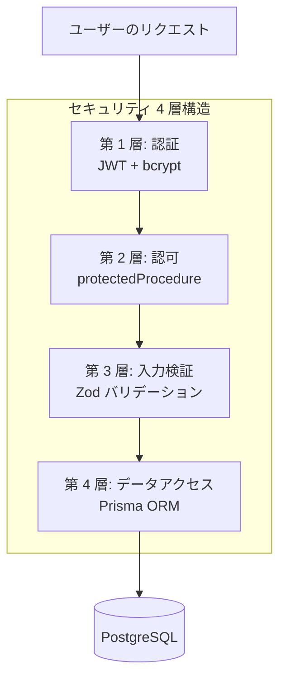

# Day 27: アプリの守りを固めよう

## 🎯 今日のゴール

「攻撃者になりきって」自分のアプリに攻撃を仕掛け、
**全て防がれることを確認**します。
最終的に CSP ヘッダーを DevTools で確認し、
「このアプリは 4 層構造で守られている」と
自信を持って言える状態をゴールにします。

## 🤔 なぜこれを作るのか？

セキュリティは「学ぶもの」ではなく「確認するもの」です。
Day 7 で学んだ JWT・bcrypt・Cookie の仕組みは、
本当に攻撃を防いでくれるのか？
今日は実際に手を動かして確かめます。

> 💡 **例え話**: 家に鍵をつけたら「鍵をつけた！」で
> 終わりにせず、外から実際にドアを引っ張ってみる。
> それがセキュリティテストです。

### 📐 全体像



### やること / やらないこと

| やること | やらないこと |
|---------|-------------|
| XSS 攻撃を試して防御を確認 | 本格的なペネトレーションテスト |
| SQLi 攻撃を試して防御を確認 | 脆弱性スキャンツールの導入 |
| CSP ヘッダーを DevTools で確認 | WAF（Web Application Firewall）設定 |
| 環境変数の管理状況を確認 | OAuth プロバイダー連携 |

### 🆕 新しく学ぶ概念

| 概念 | 読み方 | 一言でいうと |
|------|--------|------------|
| XSS | クロスサイトスクリプティング | 悪い JS を注入する攻撃 |
| SQLi | エスキューエルインジェクション | 悪い SQL を注入する攻撃 |
| CSP | コンテンツセキュリティポリシー | ブラウザに「許可する読み込み元」を指示するヘッダー |

> 💡 JWT・bcrypt・HttpOnly Cookie は Day 7 で
> 学びましたね。今日はその知識を前提に
> 「攻撃と防御」に集中します。

## 📊 実装ステップ一覧

| # | やること | 所要時間 |
|---|---------|---------|
| 1 | XSS 攻撃を試す → React の自動エスケープを確認 | 5分 |
| 2 | SQLi 攻撃を試す → Prisma の自動エスケープを確認 | 5分 |
| 3 | セキュリティ 4 層構造をコードで確認 | 7分 |
| 4 | CSP ヘッダーを DevTools で確認 | 5分 |
| 5 | 環境変数の安全管理を確認 | 5分 |
| 6 | Cookie の HttpOnly 属性を DevTools で確認 | 3分 |
| 7 | セキュリティチェックリストを完走 | 3分 |

**合計**: 約 33 分

---

## Step 1: XSS 攻撃を試す（5分）

🎯 **ゴール**: タスクタイトルに `<script>` タグを
入力し、**文字列として表示される**ことを確認します。

### 1-1. 攻撃してみよう

1. ログインして **タスク一覧** (`/task`) を開く
2. 「新規タスク」ボタンをクリック
3. タイトルに以下を入力:

```text
<script>alert('XSS')</script>
```

4. プロジェクトを選択して「作成」をクリック

### 1-2. 結果を確認

タスク一覧に戻ると、タイトルが
**そのまま文字列として表示**されているはずです。
`alert` は実行されません。


> 💡 ブラウザの「アラート」ダイアログが
> 出なければ成功です。React の JSX `{変数}` は
> 自動的に HTML をエスケープするため、
> `<script>` はただの文字列になります。

### 1-3. なぜ安全なのか？

React が内部でやっていることを表で見てみましょう。

| 入力 | React が表示する文字列 |
|------|---------------------|
| `<script>alert('XSS')</script>` | `&lt;script&gt;alert('XSS')&lt;/script&gt;` |
| `` | `&lt;img onerror=&quot;alert(1)&quot;&gt;` |
| `javascript:alert(1)` | そのまま文字列（href に使わなければ安全） |

> ⚠️ **唯一の例外**: `dangerouslySetInnerHTML` を
> 使うと React のエスケープが無効になります。
> このアプリでは**一切使っていません**。
> 使わないのが最大の防御です。

✅ **確認ポイント**:
- `<script>` タグがただの文字列として表示された
- アラートダイアログは出なかった

---

## Step 2: SQLi 攻撃を試す（5分）

🎯 **ゴール**: 検索画面に SQL インジェクションを
入力し、**何も起きない**ことを確認します。

### 2-1. 攻撃してみよう

1. **検索画面** (`/search`) を開く
2. 検索ボックスに以下を入力:

```text
' OR '1'='1
```

3. 検索ボタンをクリック

### 2-2. 結果を確認

「該当なし」か、キーワード通りの検索結果が
返ってくるだけです。データベースの全件取得や
エラーは発生しません。


### 2-3. なぜ安全なのか？

検索 API のコードを見てみましょう。

```typescript
// filepath: src/server/api/routers/search.ts
const searchInputSchema = z.object({
  keyword: z.string().optional(),
  projectId: z.string().cuid().optional(),
  status: z
    .enum([
      'all', 'TODO', 'IN_PROGRESS',
      'IN_REVIEW', 'DONE',
      'CANCELLED', 'BLOCKED',
    ])
    .optional()
    .default('all'),
});
```

| 防御層 | 何をしているか |
|--------|-------------|
| Zod バリデーション | `keyword` を `z.string()` で型チェック |
| Prisma ORM | パラメータを **自動エスケープ** して SQL 生成 |

> 💡 Prisma は **パラメータ化クエリ** を使います。
> ユーザー入力が SQL 文に直接埋め込まれることは
> ありません。生 SQL (`$queryRaw`) を使わない限り、
> SQL インジェクションは構造的に不可能です。

| 方式 | 実際の SQL | 安全性 |
|------|-----------|--------|
| 生 SQL 結合 | `WHERE name = '' OR '1'='1'` | 危険 |
| Prisma ORM | `WHERE name = $1` (パラメータ: `' OR '1'='1`) | 安全 |

✅ **確認ポイント**:
- SQL インジェクション文字列で異常な結果が出なかった
- Prisma がパラメータ化クエリを使う理由を理解した

---

## Step 3: セキュリティ 4 層構造を確認（7分）

🎯 **ゴール**: このアプリが **4 つの層** で
守られていることをコードで確認します。

### 3-1. 4 層構造の全体像



### 3-2. 各層の実装ファイルを確認

| 層 | ファイル | 確認するコード |
|----|---------|-------------|
| 第 1 層: 認証 | `src/lib/session.ts` | `encrypt()` / `decrypt()` で JWT 生成・検証 |
| 第 2 層: 認可 | `src/server/api/trpc.ts` | `isAuthenticated` ミドルウェア |
| 第 3 層: 入力検証 | `src/server/api/routers/task.ts` | `taskCreateSchema` の Zod スキーマ |
| 第 4 層: データアクセス | `src/server/api/routers/task.ts` | `prisma.task.findMany()` のクエリ |

### 3-3. 第 2 層: 認可ミドルウェアのコード

```typescript
// filepath: src/server/api/trpc.ts
const isAuthenticated = t.middleware(
  async ({ ctx, next }) => {
    if (!ctx.session?.userId) {
      throw new TRPCError({
        code: 'UNAUTHORIZED',
        message: 'ログインが必要です',
      });
    }

    return next({
      ctx: { session: ctx.session },
    });
  }
);

export const protectedProcedure =
  t.procedure.use(isAuthenticated);
```

> 💡 `protectedProcedure` を使ったすべての API は、
> JWT が無効なら自動的に `UNAUTHORIZED` を返します。
> Day 7 で Cookie を削除したとき、ダッシュボードに
> アクセスできなくなったのはこの仕組みです。

### 3-4. 第 3 層: 入力検証のコード

```typescript
// filepath: src/server/api/routers/task.ts
const taskCreateSchema = z.object({
  title: z
    .string()
    .min(1, 'Title is required'),
  description: z.string().optional(),
  status: z
    .enum([
      'TODO', 'IN_PROGRESS', 'IN_REVIEW',
      'DONE', 'CANCELLED', 'BLOCKED',
    ])
    .default('TODO'),
  priority: z
    .enum(['LOW', 'MEDIUM', 'HIGH', 'URGENT'])
    .default('MEDIUM'),
  projectId: z.string().cuid(),
});
```

| バリデーション | 効果 |
|-------------|------|
| `z.string().min(1)` | 空文字を拒否 |
| `z.enum([...])` | 許可された値以外を拒否 |
| `z.string().cuid()` | CUID 形式以外の ID を拒否 |
| `z.number().min(0)` | 負の数を拒否 |

> 💡 Zod のバリデーションは **サーバー側** で
> 実行されます。ブラウザの入力チェックだけでは
> DevTools から直接 API を叩かれると突破されます。
> サーバー側の検証が本当の防御です。

✅ **確認ポイント**:
- 4 層構造の各ファイルを特定できた
- `protectedProcedure` の動作原理を理解した
- Zod がサーバー側で検証する理由を理解した

---

## Step 4: CSP ヘッダーを DevTools で確認（5分）

🎯 **ゴール**: `Content-Security-Policy` ヘッダーが
レスポンスに含まれていることを DevTools で確認します。

### 4-1. ヘッダーの設定コード

```javascript
// filepath: next.config.mjs（前半: 基本ヘッダー）
// セキュリティヘッダー
async headers() {
  return [{
    source: '/(.*)',
    headers: [
      {
        key: 'X-Frame-Options',
        value: 'DENY',
      },
      {
        key: 'X-Content-Type-Options',
        value: 'nosniff',
      },
      {
        key: 'Referrer-Policy',
        value: 'origin-when-cross-origin',
      },
```

CSP ヘッダーは別途設定されています。

```javascript
// filepath: next.config.mjs（後半: CSP ヘッダー）
      {
        key: 'Content-Security-Policy',
        value: "default-src 'self'; "
          + "script-src 'self' "
          + "'unsafe-inline' 'unsafe-eval'; "
          + "style-src 'self' 'unsafe-inline'; "
          + "img-src 'self' data: blob:; "
          + "font-src 'self' data:; "
          + "connect-src 'self'",
      },
    ],
  }];
},
```

### 4-2. 各ヘッダーの役割

| ヘッダー | 値 | 防御する攻撃 |
|---------|-----|------------|
| `X-Frame-Options` | `DENY` | クリックジャッキング（iframe 埋め込み禁止） |
| `X-Content-Type-Options` | `nosniff` | MIME スニッフィング |
| `Referrer-Policy` | `origin-when-cross-origin` | リファラー情報漏洩 |
| `Content-Security-Policy` | `default-src 'self'` + 追加ルール | XSS の追加防御（外部スクリプト禁止） |

### 4-3. DevTools で確認する手順

1. ブラウザで `/dashboard` を開く
2. **F12** で DevTools を開く
3. **Network** タブをクリック
4. ページをリロード（**Ctrl + R** / **Cmd + R**）
5. 最初のリクエスト（`dashboard`）をクリック
6. **Headers** タブ → **Response Headers** を確認

以下のヘッダーが表示されていれば成功です:

```text
content-security-policy: default-src 'self'; ...
x-content-type-options: nosniff
x-frame-options: DENY
referrer-policy: origin-when-cross-origin
```

> 💡 CSP の `default-src 'self'` は「自分のドメイン
> 以外からの読み込みを禁止」という意味です。
> 攻撃者が外部の悪意あるスクリプトを読み込もうと
> しても、ブラウザが拒否してくれます。

> 📸 DevTools の Network → Headers タブで Response Headers にセキュリティヘッダーが表示されていることを確認しましょう。

✅ **確認ポイント**:
- DevTools の Network タブで 4 つのヘッダーを確認した
- CSP の `default-src 'self'` の意味を理解した

---

## Step 5: 環境変数の安全管理を確認（5分）

🎯 **ゴール**: 秘密情報が Git に含まれていないことを
確認します。

### 5-1. `.gitignore` の確認

```bash
# filepath: .gitignore（該当部分）
*.env*
!.env.example
.env*.local
```

| ファイル | Git に含まれる？ | 中身 |
|---------|:----:|------|
| `.env` | ❌ | 本番の秘密値 |
| `.env.local` | ❌ | ローカルの秘密値 |
| `.env.example` | ✅ | ダミー値（テンプレート） |
| `.gitignore` | ✅ | 除外ルール |

### 5-2. `.env.example` の確認

```bash
# filepath: .env.example（抜粋）
DATABASE_URL="postgresql://user:password
  @localhost:5432/taskapp?schema=public"

JWT_SECRET="your-jwt-secret-key-32-chars
  -minimum-please-change"
```

> 💡 `.env.example` には **ダミー値** だけを入れます。
> 「ここに秘密鍵を書いてね」というテンプレートです。
> 実際の値は `.env` に書き、Git には含めません。

### 5-3. なぜ `JWT_SECRET` が重要なのか

| 状況 | 何が起きるか |
|------|-----------|
| `JWT_SECRET` が流出 | 攻撃者が有効な JWT を自由に生成できる |
| `JWT_SECRET` が安全 | JWT を改ざんしても署名検証で弾かれる |
| `DATABASE_URL` が流出 | DB に直接接続される（全データ漏洩） |

> ⚠️ **重要**: もし誤って `.env` を Git に
> コミットしてしまったら、すぐに以下を実行:
> 1. `JWT_SECRET` を新しい値に変更
> 2. `DATABASE_URL` のパスワードを変更
> 3. Git 履歴から `.env` を完全に削除

✅ **確認ポイント**:
- `.gitignore` に `.env` の除外ルールがある
- `.env.example` に実際の秘密値が入っていない
- `JWT_SECRET` 流出のリスクを理解した

---

## Step 6: Cookie の HttpOnly 属性を確認（3分）

🎯 **ゴール**: ブラウザの DevTools で Cookie を確認し、
HttpOnly 属性が有効であることを確かめます。

### 6-1. DevTools で Cookie を確認する手順

1. ブラウザで `/dashboard` を開く（ログイン済みの状態）
2. **F12** で DevTools を開く
3. **Application** タブをクリック
4. 左メニューの **Cookies** → `http://localhost:3000` を選択
5. `session` という Cookie を探す

### 6-2. 確認すべき項目

| 属性 | 期待する値 | 理由 |
|------|-----------|------|
| `HttpOnly` | ✓（チェックあり） | JavaScript から Cookie を読めなくする |
| `Path` | `/` | 全ページで有効 |
| `SameSite` | `Strict` | CSRF 攻撃の防御 |

> 💡 HttpOnly が有効な Cookie は、
> `document.cookie` で読み取れません。
> XSS 攻撃でセッションを盗むのが困難になります。

✅ **確認ポイント**:
- Application タブで `session` Cookie を見つけた
- HttpOnly にチェックが入っていることを確認した

---

## Step 7: セキュリティチェックリスト完走（3分）

🎯 **ゴール**: このアプリのセキュリティ対策を
一覧で最終確認します。

### 6-1. 総合チェックリスト

| # | カテゴリ | 確認項目 | 対策技術 | ファイル |
|---|---------|---------|---------|---------|
| 1 | 認証 | パスワードがハッシュ化されている | bcrypt (salt: 10) | `auth.ts` |
| 2 | 認証 | JWT に有効期限がある（7日間） | jose `setExpirationTime` | `session.ts` |
| 3 | 認証 | Cookie が HttpOnly である | `httpOnly: true` | `session.ts` |
| 4 | 認可 | 全 API が認証チェックを通る | `protectedProcedure` | `trpc.ts` |
| 5 | 入力検証 | 全入力が Zod で検証されている | tRPC `input` スキーマ | 各 `routers/*.ts` |
| 6 | XSS | HTML が自動エスケープされる | React JSX | 全コンポーネント |
| 7 | SQLi | ORM がパラメータ化クエリを使用 | Prisma | 各 `routers/*.ts` |
| 8 | ヘッダー | CSP が設定されている | `Content-Security-Policy` | `next.config.mjs` |
| 9 | ヘッダー | iframe 埋め込みが禁止されている | `X-Frame-Options: DENY` | `next.config.mjs` |
| 10 | 環境 | `.env` が Git に含まれていない | `.gitignore` | `.gitignore` |

> 💡 10 項目すべてが「対策済み」です。
> Day 7 で学んだ認証の仕組みと、今日確認した
> XSS / SQLi / CSP / 環境変数の管理が合わさって
> **4 層構造の防御** が完成しています。

✅ **確認ポイント**:
- 10 項目すべてを確認した

---

## 📋 今日のまとめ

### 学んだこと

| やったこと | 結果 |
|-----------|------|
| XSS 攻撃を試した | React が自動エスケープして防御 |
| SQLi 攻撃を試した | Prisma のパラメータ化クエリで防御 |
| 4 層構造をコードで確認 | 認証→認可→入力検証→ORM の多層防御 |
| CSP ヘッダーを DevTools で確認 | 外部スクリプトの読み込みをブロック |
| 環境変数の管理を確認 | `.env` は Git に含まれていない |

### チェックリスト

- [ ] `<script>` タグが文字列として表示された
- [ ] SQLi で異常な結果が出なかった
- [ ] 4 層構造の各ファイルを特定できた
- [ ] DevTools で CSP ヘッダーを確認した
- [ ] `.gitignore` に `.env` の除外ルールがあった
- [ ] 10 項目のセキュリティチェックリストを確認した

## ⚠️ つまずきポイント

| 問題 | 原因 | 解決方法 |
|------|------|---------|
| DevTools に CSP が表示されない | 開発サーバーのキャッシュ | `npm run dev` を再起動してリロード |
| XSS の `<script>` が実行された | `dangerouslySetInnerHTML` を使っている | 絶対に使わない。JSX `{変数}` を使う |
| Network タブにリクエストが出ない | ページ遷移前に開いていなかった | 先に DevTools を開いてからリロード |

## 🔜 次回予告

Day 28 では **Vitest を使ったテスト** を書きます。
「テストって何のために書くの？」の答えを
Red → Green → Refactor のサイクルで体験します。
