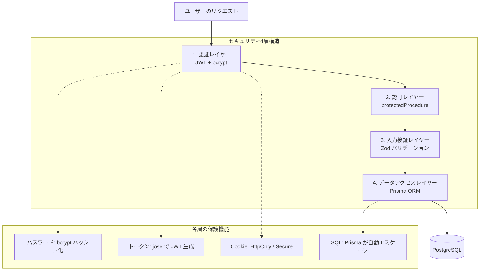

# Day 27: セキュリティ対策を学ぼう

## 🎯 今日のゴール

Webアプリケーションのセキュリティ対策を
理解します。認証・認可・入力検証・データ
アクセスの4層構造で守る仕組みを学びます。

【スクリーンショット: セキュリティ対策の全体像】

## 🤔 なぜこれを学ぶのか？

セキュリティはアプリの信頼性を支える土台です。
ユーザーの個人情報を守る責任があります。

> 💡 **例え話**: セキュリティは「城の防御」
> です。外壁（認証）、門番（認可）、
> 持ち物検査（入力検証）、金庫（暗号化）と
> 多層的に守ることで、どこか1つが突破されても
> 被害を最小限に抑えられます。

### 📐 セキュリティ層の構造図



### やること / やらないこと

| やること | やらないこと |
|---------|-------------|
| bcrypt のハッシュ化を理解 | 独自の暗号化アルゴリズム作成 |
| JWT トークンの仕組みを学ぶ | OAuth プロバイダー連携 |
| XSS / SQLi 対策を確認 | ペネトレーションテスト |
| 環境変数の管理方法を学ぶ | WAF の設定 |

### 🆕 新しく学ぶ概念

| 概念 | 読み方 | 役割 | 例え |
|------|--------|------|------|
| bcrypt | ビークリプト | パスワードハッシュ化 | 暗号化された金庫 |
| JWT | ジェイダブリューティー | 認証トークン | 入館証 |
| HttpOnly Cookie | — | XSS からトークン保護 | 金庫の鍵 |
| Zod | ゾッド | 入力バリデーション | 持ち物検査 |
| Prisma ORM | プリズマ | SQL インジェクション防止 | 自動翻訳機 |

## 📊 学習ステップ一覧

| ステップ | 学習内容 | 所要時間 |
|---------|---------|---------|
| Step 1 | セキュリティ層の全体像 | 5分 |
| Step 2 | パスワードハッシュ化（bcrypt） | 8分 |
| Step 3 | JWT トークンのセキュリティ | 8分 |
| Step 4 | protectedProcedure ミドルウェア | 5分 |
| Step 5 | XSS 対策 | 5分 |
| Step 6 | SQL インジェクション対策 | 5分 |
| Step 7 | 環境変数の管理 | 5分 |
| Step 8 | セキュリティチェックリスト | 3分 |
| Step 9 | 振り返り確認 | 3分 |

**合計時間**: 約47分

---

### Step 1: セキュリティ層の全体像（5分）

🎯 **ゴール**: 4層構造でアプリを守る
考え方を理解します。

#### 各レイヤーの役割

| レイヤー | 何を守るか | 使う技術 |
|---------|-----------|---------|
| 認証 | 本人確認 | bcrypt + JWT (jose) |
| 認可 | アクセス権限 | protectedProcedure |
| 入力検証 | 不正データ排除 | Zod スキーマ |
| データアクセス | DB への安全な問合せ | Prisma ORM |

> 💡 1つの層だけでは不十分です。
> 認証を突破されても、認可レイヤーで
> 権限チェックが働きます。
> 多層防御（Defense in Depth）が重要です。

✅ **確認ポイント**:
- 4層構造の役割を説明できる

---

### Step 2: パスワードハッシュ化（8分）

🎯 **ゴール**: bcrypt によるパスワード保護の
仕組みを理解します。

#### ハッシュ化とは

| 方式 | 保存される値 | 安全性 |
|------|------------|--------|
| 平文保存 | `password123` | 危険 |
| MD5 | `482c811da5d...` | 危険（高速すぎる） |
| bcrypt | `$2b$10$Kx9...` | 安全（遅い＝強い） |

💻 **実装**:

```typescript
// filepath: src/server/api/routers/auth.ts
import bcrypt from 'bcryptjs';

// ユーザー登録時: ハッシュ化して保存
const hashedPassword =
  await bcrypt.hash(input.password, 10);

const user = await prisma.user.create({
  data: {
    email: input.email,
    name: input.name,
    password: hashedPassword,
    role: 'USER',
    isActive: true,
  },
});
```

> 💡 `bcrypt.hash(password, 10)` の `10` は
> ソルトラウンド数です。数値が大きいほど
> 計算コストが上がり、安全性が高まります。

```typescript
// filepath: src/server/api/routers/auth.ts
// ログイン時: 入力とハッシュ値を比較
const isPasswordValid =
  await bcrypt.compare(
    input.password,
    user.password
  );

if (!isPasswordValid) {
  throw new TRPCError({
    code: 'UNAUTHORIZED',
    message: 'メールアドレスまたは'
      + 'パスワードが正しくありません',
  });
}
```

> 💡 `bcrypt.compare` はハッシュ値から
> 元のパスワードを復元するのではなく、
> 入力もハッシュ化して結果を比較します。

#### パスワードバリデーション

```typescript
// filepath: src/server/api/routers/auth.ts
const registerSchema = z.object({
  name: z.string().min(1),
  email: z.string().email(),
  password: z
    .string()
    .min(8, '8文字以上')
    .regex(/[A-Z]/, '大文字を含む')
    .regex(/[a-z]/, '小文字を含む')
    .regex(/[0-9]/, '数字を含む')
    .regex(/[^A-Za-z0-9]/, '特殊文字を含む'),
});
```

> 💡 Zod スキーマでパスワード強度を
> サーバー側で検証します。クライアント側の
> チェックだけでは不十分です。

✅ **確認ポイント**:
- bcrypt.hash と bcrypt.compare の違いを理解
- ソルトラウンドの意味を理解

【スクリーンショット: Prisma Studio でハッシュ化済パスワード確認】

---

### Step 3: JWT トークンのセキュリティ（8分）

🎯 **ゴール**: jose ライブラリによる JWT 生成と
HttpOnly Cookie の保護を理解します。

#### JWT の構造

| パート | 内容 | 例 |
|--------|------|-----|
| Header | アルゴリズム情報 | `{"alg":"HS256"}` |
| Payload | ユーザー情報 | `{"userId":"..."}` |
| Signature | 改ざん検知用署名 | HMAC-SHA256 の結果 |

💻 **実装**:

```typescript
// filepath: src/lib/session.ts
import { SignJWT, jwtVerify } from 'jose';

export async function encrypt(
  payload: SessionPayload
): Promise<string> {
  const jwtPayload: Record<string, unknown> = {
    userId: payload.userId,
    email: payload.email,
    role: payload.role,
    exp: payload.exp,
  };

  return await new SignJWT(jwtPayload)
    .setProtectedHeader({ alg: 'HS256' })
    .setIssuedAt()
    .setExpirationTime('7d')
    .sign(getKey());
}
```

> 💡 `jose` ライブラリは Web 標準の
> crypto API を使う軽量な JWT ライブラリです。
> `HS256` は HMAC-SHA256 アルゴリズムです。

```typescript
// filepath: src/lib/session.ts
// Cookie の設定（セキュリティ重要）
const cookieStore = await cookies();
cookieStore.set(COOKIE_NAME, token, {
  httpOnly: true,
  secure:
    process.env['NODE_ENV'] === 'production',
  sameSite: 'strict',
  maxAge: 60 * 60 * 24 * 7,
  path: '/',
});
```

#### Cookie オプションの意味

| オプション | 値 | 効果 |
|-----------|-----|------|
| httpOnly | true | JS からアクセス不可（XSS対策） |
| secure | true (本番) | HTTPS のみで送信 |
| sameSite | strict | 他サイトからの送信を拒否 |
| maxAge | 604800 | 7日間で有効期限切れ |

> 💡 `httpOnly: true` が最も重要です。
> これにより `document.cookie` で JWT を
> 読み取る XSS 攻撃を防ぎます。

✅ **確認ポイント**:
- JWT の3パート構造を理解した
- HttpOnly Cookie の役割を理解した

---

### Step 4: protectedProcedure（5分）

🎯 **ゴール**: 認証ミドルウェアの仕組みを
理解します。

💻 **実装**:

```typescript
// filepath: src/server/api/trpc.ts
const isAuthenticated = t.middleware(
  async ({ ctx, next }) => {
    if (!ctx.session?.userId) {
      throw new TRPCError({
        code: 'UNAUTHORIZED',
        message: 'ログインが必要です',
      });
    }

    return next({
      ctx: { session: ctx.session },
    });
  }
);

export const protectedProcedure =
  t.procedure.use(isAuthenticated);
```

> 💡 `protectedProcedure` を使った
> エンドポイントは、JWT が無効なら
> 自動的に `UNAUTHORIZED` エラーを返します。

#### publicProcedure との使い分け

| プロシージャ | 用途 | 例 |
|-------------|------|-----|
| publicProcedure | 誰でもアクセス可 | ログイン、登録 |
| protectedProcedure | ログイン必須 | タスク作成、編集 |

> 💡 `getSession` 関数が Cookie から JWT を
> 取得し、`jwtVerify` で署名を検証します。
> 有効期限切れや改ざんされた JWT は拒否されます。

✅ **確認ポイント**:
- protectedProcedure が認証を自動チェックする

【スクリーンショット: 未ログイン時の UNAUTHORIZED エラー】

---

### Step 5: XSS 対策（5分）

🎯 **ゴール**: React と Zod による XSS 防御を
理解します。

#### XSS（Cross-Site Scripting）とは

悪意ある JavaScript をページに注入し、
ユーザーの情報を盗む攻撃です。

💻 **React の自動エスケープ**:

```tsx
// filepath: src/component/task/task-card.tsx
// React は自動的に HTML をエスケープする
const userInput =
  '<script>alert("XSS")</script>';

// 安全: エスケープされて文字列として表示
return <p>{userInput}</p>;
// 結果: &lt;script&gt;... と表示
```

💻 **Zod によるサーバー側バリデーション**:

```typescript
// filepath: src/server/api/routers/task.ts
const createTaskSchema = z.object({
  title: z.string()
    .min(1, 'タイトルは必須です')
    .max(255, '255文字以内です')
    .trim(),
  description: z.string()
    .max(5000, '5000文字以内です')
    .optional(),
});
```

#### XSS 対策チェックリスト

| 対策 | このアプリでの実装 |
|------|-----------------|
| HTML エスケープ | React が自動で実行 |
| 入力バリデーション | Zod で長さ・形式を制限 |
| dangerouslySetInnerHTML 禁止 | コードレビューで防止 |
| HttpOnly Cookie | JWT を JS から隠蔽 |

> 💡 React の JSX `{変数}` は自動的に
> エスケープされるため、意識せずとも
> XSS 対策ができています。
> ただし `dangerouslySetInnerHTML` は
> 絶対に使わないでください。

✅ **確認ポイント**:
- React の自動エスケープの仕組みを理解

---

### Step 6: SQL インジェクション対策（5分）

🎯 **ゴール**: Prisma ORM が SQL インジェクション
を防ぐ仕組みを理解します。

#### SQL インジェクションとは

悪意ある SQL 文を入力に含めて、
データベースを不正操作する攻撃です。

| 方法 | コード例 | 安全性 |
|------|---------|--------|
| 生 SQL | `SELECT * WHERE name='${input}'` | 危険 |
| Prisma | `prisma.user.findMany({where: {name: input}})` | 安全 |

💻 **Prisma の安全なクエリ**:

```typescript
// filepath: src/server/api/routers/task.ts
// Prisma はパラメータを自動エスケープ
const tasks = await prisma.task.findMany({
  where: {
    title: { contains: input.keyword },
    projectId: input.projectId,
  },
  include: {
    assignee: true,
    project: true,
  },
});
```

> 💡 Prisma はクエリビルダーパターンで
> SQL を生成します。ユーザー入力は
> パラメータとして自動エスケープされ、
> SQL 文に直接埋め込まれません。

✅ **確認ポイント**:
- Prisma が SQL インジェクションを防ぐ理由

【スクリーンショット: Prisma のクエリログ例】

---

### Step 7: 環境変数の管理（5分）

🎯 **ゴール**: 機密情報を安全に管理する
方法を理解します。

💻 **`.env` ファイルの管理**:

```bash
# filepath: .env（Git にコミットしない）
DATABASE_URL="postgresql://user:password
  @localhost:5432/taskapp?schema=public"
JWT_SECRET="your-jwt-secret-key-32-chars"
```

```bash
# filepath: .env.example（Git にコミットする）
DATABASE_URL="postgresql://user:password
  @localhost:5432/taskapp?schema=public"
JWT_SECRET="your-jwt-secret-key-32-chars
  -minimum-please-change"
```

#### 環境変数の管理ルール

| ファイル | Git に含める | 値 |
|---------|-------------|-----|
| .env | 含めない | 実際の秘密値 |
| .env.example | 含める | ダミー値 |
| .gitignore | 含める | .env を除外 |

💻 **.gitignore の確認**:

```bash
# filepath: .gitignore（該当部分）
.env
.env.local
.env.production.local
```

> 💡 `JWT_SECRET` はトークンの署名に使う
> 秘密鍵です。流出すると第三者が有効な
> JWT を生成できてしまいます。
> 32文字以上のランダムな文字列を使います。

✅ **確認ポイント**:
- `.env` が `.gitignore` に含まれている
- `.env.example` に実際の秘密値がない

---

### Step 8: セキュリティチェックリスト（3分）

🎯 **ゴール**: アプリ全体のセキュリティを
最終確認します。

#### 総合セキュリティチェック

| カテゴリ | 確認項目 | 対策技術 |
|---------|---------|---------|
| 認証 | パスワードがハッシュ化されている | bcrypt (salt: 10) |
| 認証 | JWT に有効期限がある（7日間） | jose setExpirationTime |
| 認証 | Cookie が HttpOnly である | session.ts の設定 |
| 認可 | API が protectedProcedure を使用 | trpc.ts ミドルウェア |
| 検証 | 全入力が Zod で検証されている | tRPC input スキーマ |
| DB | 生 SQL を使っていない | Prisma ORM |
| 環境 | .env が Git に含まれていない | .gitignore |
| ヘッダー | X-Frame-Options が設定済み | next.config.mjs |

💻 **セキュリティヘッダーの確認**:

```javascript
// filepath: next.config.mjs
async headers() {
  return [{
    source: '/(.*)',
    headers: [
      {
        key: 'X-Frame-Options',
        value: 'DENY',
      },
      {
        key: 'X-Content-Type-Options',
        value: 'nosniff',
      },
      {
        key: 'Referrer-Policy',
        value: 'origin-when-cross-origin',
      },
    ],
  }];
},
```

> 💡 `X-Frame-Options: DENY` はクリック
> ジャッキング攻撃を防ぎます。
> 他のサイトが iframe であなたのアプリを
> 埋め込むことを禁止します。

✅ **確認ポイント**:
- チェックリストの全項目を確認した

【スクリーンショット: DevTools で確認したレスポンスヘッダー】

---

### Step 9: 振り返り確認（3分）

🎯 **ゴール**: 今日学んだセキュリティ対策を
振り返ります。

1. bcrypt でパスワードをハッシュ化している
2. jose で JWT トークンを生成・検証している
3. HttpOnly Cookie で XSS から JWT を保護
4. protectedProcedure で認証チェック
5. Zod で全入力をバリデーション
6. Prisma で SQL インジェクションを防止
7. 環境変数を .env で安全に管理
8. セキュリティヘッダーを next.config.mjs で設定

✅ **確認ポイント**:
- 8項目すべてを説明できる

---

## 📋 今日のまとめ

- [ ] bcrypt のハッシュ化を理解した
- [ ] JWT と jose の仕組みを理解した
- [ ] HttpOnly Cookie の役割を理解した
- [ ] protectedProcedure の動作を理解した
- [ ] XSS / SQL インジェクション対策を確認した
- [ ] 環境変数の管理方法を確認した

## ⚠️ つまずきポイント

| 問題 | 原因 | 解決方法 |
|------|------|---------|
| JWT が無効になる | JWT_SECRET が変わった | 同じシークレットキーを使う |
| Cookie が送信されない | sameSite: strict で別ドメイン | 同一ドメインでアクセス |
| UNAUTHORIZED エラー | Cookie の有効期限切れ | 再ログインする |
| パスワード比較失敗 | hash と compare の引数逆 | compare(平文, ハッシュ値) |

## 📝 今日学んだ用語

| 用語 | 意味 |
|------|------|
| bcrypt | 低速なハッシュ関数（安全性が高い） |
| JWT (JSON Web Token) | 認証用の署名付きトークン |
| HttpOnly | JavaScript からアクセスできない Cookie |
| XSS | 悪意ある JS を注入する攻撃 |
| SQL インジェクション | 不正 SQL を実行させる攻撃 |
| ソルトラウンド | ハッシュ化の繰り返し回数 |
| protectedProcedure | 認証必須の tRPC プロシージャ |

## 🔗 次回予告

Day 28 では、Vitest を使ったテストの書き方を
学びます。tRPC ルーターのテストと React
コンポーネントのテストを実装します。
