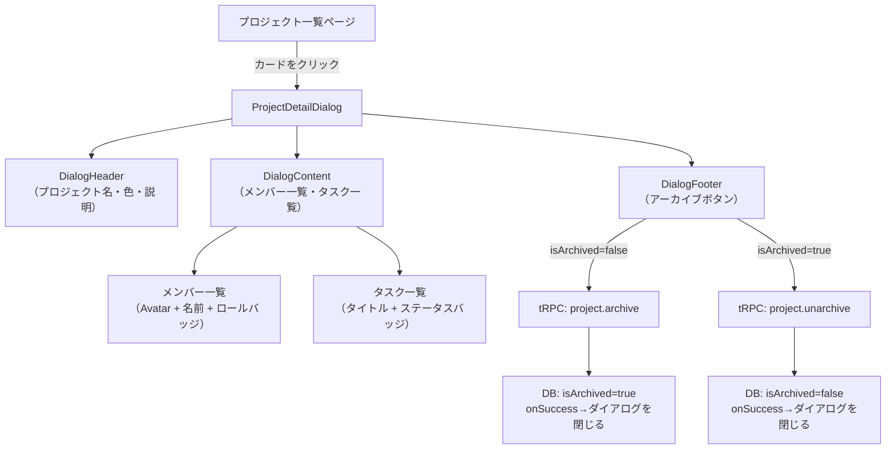

# Day 27: プロジェクト詳細・アーカイブを実装しよう

## 🔙 前回の振り返り

Day 26ではエラーページ（404・500）を実装し、予期せぬエラーが発生したときにユーザーを適切な画面に案内できるようにしました。今日はプロジェクト管理の中核機能である「詳細ダイアログ」と「アーカイブ機能」を実装します。

---

## 🎯 今日のゴール

プロジェクトの詳細情報（メンバー一覧・タスク一覧）を表示するダイアログを実装し、プロジェクトをアーカイブ（一時保存）・復元できる機能を追加します。

📸 スクリーンショット: プロジェクト詳細ダイアログの完成形の表示を確認してください。


## 🤔 なぜこれを作るのか？

プロジェクト管理アプリでは「このプロジェクト、誰が参加してるんだっけ？」「今どんなタスクが残ってる？」をサッと確認したいシーンが多々あります。

毎回別ページに遷移するのは面倒なので、**その場でダイアログ（ポップアップ）を開いて確認できる**ようにします。

また、完了したプロジェクトをゴミ箱に捨てるのではなく、**アーカイブ（棚に保存）**することで、過去の記録を残しつつ普段の作業の邪魔にならないようにします。

> 💡 **例え話**: アーカイブは「本棚の奥にしまう」ようなものです。捨てる（削除）と違って、いつでも取り出せます。完了した年間プロジェクトを「非表示にするけど記録は残す」というのが典型的なユースケースです。

### 📐 今日実装するコンポーネントの全体像



### やること / やらないこと

| やること | やらないこと |
|---------|-------------|
| プロジェクト詳細ダイアログの作成 | プロジェクト詳細専用ページの作成 |
| メンバー一覧・タスク一覧の表示 | タスクのインライン編集 |
| アーカイブ・アーカイブ解除の実装 | アーカイブされたプロジェクトの一覧ページ |
| メンバー削除ボタン（オーナーは除く） | メンバーの権限変更 |

### 🆕 新しく学ぶ概念

| 概念 | 読み方 | 役割 | 例え |
|------|--------|------|------|
| `inferRouterOutputs` | インファー・ルーター・アウトプット | tRPCのAPIレスポンスから型を自動生成する | レシートを見て「これは何円の商品リスト」と型を読み取る |
| ダイアログ（Dialog） | ダイアログ | 画面上にオーバーレイで表示されるポップアップ | 銀行ATMの「本当に引き出しますか？」確認画面 |
| アーカイブ（Soft Delete） | アーカイブ | 削除ではなくフラグで「隠す」こと | 本棚の奥に本を入れること |

### 🔄 復習する概念

| 概念 | 初出 |
|------|------|
| `&&` 演算子レンダリング | Day 10〜 で使用済み |
| コールバック関数（`on〇〇` Props） | Day 15〜 で使用済み |

---

## 📊 実装ステップ一覧

| ステップ | 作業内容 | 所要時間 | 触るファイル | 成功状態 |
|---------|---------|---------|-------------|---------|
| Step 1 | アーカイブAPIをサーバーに追加 | 5分 | `src/server/api/routers/project.ts` | tRPCでarchive/unarchiveを呼べる |
| Step 2 | `inferRouterOutputs`で型を作る | 5分 | `src/component/project/project-detail-dialog.tsx` | 型エラーが出ない |
| Step 3 | ダイアログの骨格を作る | 7分 | `project-detail-dialog.tsx` | ダイアログが開閉できる |
| Step 4 | メンバー一覧を表示する | 7分 | `project-detail-dialog.tsx` | アバターと名前が並ぶ |
| Step 5 | タスク一覧を表示する | 5分 | `project-detail-dialog.tsx` | タスクとバッジが表示される |
| Step 6 | アーカイブボタンを追加する | 5分 | `project-detail-dialog.tsx` | ボタンクリックでDBが更新される |
| Step 7 | 親コンポーネントから呼び出す | 7分 | `src/app/project/page.tsx` | 詳細ボタンでダイアログが開く |

**合計時間**: 約41分

---

### Step 1: アーカイブAPIをサーバーに追加する (5分)

🎯 **ゴール**: `project.archive` と `project.unarchive` という2つのAPIエンドポイントを作り、プロジェクトのアーカイブ状態を切り替えられるようにする。

**アーカイブとは何か？なぜ削除しないのか？**

データを「削除する」方法には2種類あります。

| 方法 | 英語名 | 仕組み | 復元 | 使い場面 |
|------|--------|--------|------|---------|
| 完全削除 | Hard Delete | DBのレコードを消す | 不可能 | 個人情報など本当に消したいもの |
| 論理削除 | Soft Delete / Archive | `isArchived=true` にするだけ | 可能 | 完了プロジェクト、過去の記録など |

**アーカイブ（論理削除）を使う理由:**
- 過去のタスクやコメントの履歴が残る
- 間違って削除してしまうリスクがない
- 後から復元できる

まず、Prismaスキーマに `isArchived` フィールドが必要です。すでに追加されていることを確認しましょう。

```prisma
// filepath: prisma/schema.prisma
model Project {
  id          String    @id @default(cuid())
  name        String
  description String?
  color       String    @default("#1976d2")
  isArchived  Boolean   @default(false) @map("is_archived")
  startDate   DateTime? @map("start_date")
  endDate     DateTime? @map("end_date")
  createdAt   DateTime  @default(now()) @map("created_at")
  updatedAt   DateTime  @updatedAt @map("updated_at")
  // リレーション省略
}
```

次に、アーカイブの状態を変更する共通関数 `setArchiveStatus` を書きます。`archive` と `unarchive` は「`true`にするか`false`にするか」の違いだけなので、共通関数にまとめるのがスマートです。

**重要なポイント**: この関数は**routerの定義（`createTRPCRouter`）の前**にファイルスコープのヘルパー関数として配置します。権限チェックに `prisma.project.findUnique` ではなく `prisma.projectMember.findUnique` を使います。確認したいのは「そのユーザーがプロジェクトのメンバーかどうか」だからです。

```typescript
// filepath: src/server/api/routers/project.ts
// アーカイブ状態を変更する共通関数
const setArchiveStatus = async (
  userId: string,
  projectId: string,
  isArchived: boolean,
) => {
  // メンバーかどうかをDBで確認
  const userMember =
    await prisma.projectMember
      .findUnique({
        where: { userId_projectId: {
          userId, projectId,
        }},
      });
  // 権限チェック
  assertMemberPermission(
    userMember ? [userMember] : [],
    'canArchive',
  );
  return await prisma.project.update({
    where: { id: projectId },
    data: { isArchived },
  });
};
```

✅ **確認ポイント**:
- `prisma.projectMember.findUnique` を使っている
- `assertMemberPermission` に配列と文字列を渡している

`assertMemberPermission` の第1引数は**配列**です。`userMember` が見つかった場合は `[userMember]`、見つからなかった場合は空配列 `[]` を渡します。

空配列を渡すと「メンバーがいない＝権限なし」としてエラーを投げます。第2引数の `'canArchive'` は「アーカイブの権限を確認する」という意味です。

```typescript
// filepath: src/server/api/routers/project.ts
  // アーカイブ（isArchived を true に）
  archive: protectedProcedure
    .input(z.object({
      id: z.string().cuid(),
    }))
    .mutation(async ({ ctx, input }) => {
      return await setArchiveStatus(
        ctx.session.userId,
        input.id, true,
      );
    }),

  // アーカイブ解除（isArchived を false に）
  unarchive: protectedProcedure
    .input(z.object({
      id: z.string().cuid(),
    }))
    .mutation(async ({ ctx, input }) => {
      return await setArchiveStatus(
        ctx.session.userId,
        input.id, false,
      );
    }),
```

✅ **確認ポイント**:
- `archive` と `unarchive` が同じ `setArchiveStatus` を呼んでいる
- `.mutation()` を使っている（データ変更操作のため）

`.mutation()` を使うのは、データを**変更する**操作だからです。データを**取得するだけ**なら `.query()` を使います。これはHTTPの `GET` と `POST` の違いと同じ考え方です。

✅ **確認ポイント**:
- `setArchiveStatus` が `prisma.projectMember.findUnique` を使っている（`prisma.project` ではない）
- `assertMemberPermission` に **2つの引数**を渡している（配列と `'canArchive'` 文字列）
- `archive` と `unarchive` どちらも `setArchiveStatus` を呼んでいる

---

### Step 2: `inferRouterOutputs` でAPIの型を作る (5分)

🎯 **ゴール**: tRPCのAPIレスポンスの型を自動で取得し、TypeScriptの型安全を確保する。

**`inferRouterOutputs` とは何か？**

通常、APIからデータを受け取ると「これは何の型なんだろう？」と型を手書きで定義しなければなりません。しかしtRPCでは、**サーバーの定義から自動的に型を取得できます**。

```
手書き型定義（昔のやり方）:
  type Project = {
    id: string;
    name: string;
    isArchived: boolean;
    // ...何十行も書く
  }

inferRouterOutputs（tRPCのやり方）:
  type RouterOutputs = inferRouterOutputs<AppRouter>
  // project.getById の戻り値の型が自動でわかる！
```

これは「レシートを見るだけで商品の型が全部わかる」ようなものです。サーバー側で型を変えると、クライアント側でも自動的に反映されます。

```typescript
// filepath: src/component/project/project-detail-dialog.tsx
'use client';

// tRPC の型推論ユーティリティ
import type { inferRouterOutputs } from '@trpc/server';
import type { AppRouter } from '@/server/api/root';

type RouterOutputs = inferRouterOutputs<AppRouter>;
type ProjectDetail =
  RouterOutputs['project']['getById'];
```

✅ **確認ポイント**:
- `inferRouterOutputs` を `@trpc/server` からインポートしている
- `type` キーワードを使っている（値ではなく型のインポート）
- `ProjectDetail` 型が `project.getById` の戻り値と完全に一致している

このファイルではさらに多くのインポートが
必要です。以下をファイルの先頭に追加します。

```typescript
// filepath: src/component/project/project-detail-dialog.tsx
// lucide-react のアイコン
import {
  Archive, ArchiveRestore,
  Trash2, UserPlus,
} from 'lucide-react';
// shadcn/ui コンポーネント
import { Avatar, AvatarFallback, AvatarImage }
  from '@/component/ui/avatar';
import { Badge } from '@/component/ui/badge';
import { Button } from '@/component/ui/button';
import {
  Dialog, DialogContent,
  DialogDescription, DialogFooter,
  DialogHeader, DialogTitle,
} from '@/component/ui/dialog';
```

✅ **確認ポイント**:
- lucide-react のアイコンをインポートしている
- shadcn/ui の各コンポーネントをインポートしている
- パスが `@/component/ui/` であること（`components` ではない）

さらに、バッジのラベル変換やロール判定に
必要なユーティリティもインポートします。

```typescript
// filepath: src/component/project/project-detail-dialog.tsx
// タスク・プロジェクトの定数とユーティリティ
import {
  TASK_STATUS_LABELS,
} from '@/lib/constant/status';
import {
  TASK_PRIORITY_LABELS,
} from '@/lib/constant/priority';
import {
  PROJECT_MEMBER_ROLE,
  PROJECT_MEMBER_ROLE_LABELS,
  isProjectMemberRole,
} from '@/lib/constant/roles';
import {
  getStatusBadgeVariant,
  getPriorityBadgeVariant,
} from '@/lib/badge-variant';
```

✅ **確認ポイント**:
- タスクとプロジェクトの定数をインポートしている
- バッジのバリアント判定関数をインポートしている

`RouterOutputs['project']['getById']` の読み方:
- `RouterOutputs` → 全APIの型が入った辞書
- `['project']` → その中の `project` ルーターの型
- `['getById']` → さらにその中の `getById` エンドポイントの型

JavaScriptのオブジェクトのプロパティアクセスと同じ構文で、型の世界でも同じことができます。

---

### Step 3: ダイアログの骨格を作る (7分)

🎯 **ゴール**: shadcn/ui の Dialog コンポーネントを使って、開閉できるダイアログの骨格を作る。

**Dialog コンポーネントの構造を理解する**

shadcn/ui の Dialog は、役割ごとに細かく分かれたコンポーネントの組み合わせで構成されます。

| コンポーネント | 役割 | 例え |
|--------------|------|------|
| `Dialog` | ダイアログ全体の管理（開閉状態など） | 窓枠全体 |
| `DialogContent` | ダイアログの中身を囲む白いボックス | 窓ガラス |
| `DialogHeader` | タイトルと説明文を置くエリア | 窓の上部 |
| `DialogTitle` | ダイアログのタイトル | 窓のタイトルラベル |
| `DialogDescription` | 補足説明文 | タイトルの下の小さな説明 |
| `DialogFooter` | ボタンなどを置くエリア | 窓の下部 |

次に、Props（設定値）を定義します。`on〇〇` という名前の Props は慣習的に「イベントが起きたときに呼ぶ関数」を表します。

これを**コールバック関数**と言います。「終わったら呼んでね（call back）」という意味です。

```typescript
// filepath: src/component/project/project-detail-dialog.tsx
// ダイアログが受け取る Props の型定義
interface ProjectDetailDialogProps {
  projectDetail:
    ProjectDetail | null | undefined;
  onClose: () => void;
  onAddMemberClick: () => void;
  onRemoveMember:
    (userId: string) => void;
  onArchive:
    (projectId: string,
     isArchived: boolean) => void;
}
```

コンポーネント関数の宣言と `Dialog` の開閉ロジックを書きます。

```typescript
// filepath: src/component/project/project-detail-dialog.tsx
// コンポーネント本体
export function ProjectDetailDialog({
  projectDetail,
  onClose,
  onAddMemberClick,
  onRemoveMember,
  onArchive,
}: ProjectDetailDialogProps) {
  return (
    // projectDetail があれば開く
    <Dialog
      open={!!projectDetail}
      onOpenChange={(isOpen) =>
        !isOpen && onClose()
      }
    >
```

✅ **確認ポイント**:
- `open` に `!!projectDetail` を渡している

`!!projectDetail` の仕組み: `!projectDetail` は null や undefined のとき `true`、`!!projectDetail` はもう一度否定して元に戻すので、値があれば `true` になります。`onOpenChange` は「ダイアログの開閉状態が変わったとき」に呼ばれます。外側をクリックすると `isOpen` が `false` になるので、そのときだけ `onClose()` を呼びます。

次に `DialogContent` の中身を書きます。`DialogTitle` にはプロジェクトのカラーを示す小さな丸（インジケーター）を入れます。

```typescript
// filepath: src/component/project/project-detail-dialog.tsx
      <DialogContent className="max-w-4xl max-h-[90vh] overflow-y-auto">
        <DialogHeader>
          <DialogTitle className="flex items-center gap-2">
            <div
              className="h-3 w-3 rounded-full"
              style={{ backgroundColor: projectDetail?.color }}
            />
            {projectDetail?.name}
          </DialogTitle>
          <DialogDescription>
            {projectDetail?.description || '説明なし'}
          </DialogDescription>
        </DialogHeader>
        {/* Step 4, 5 でコンテンツを追加 */}
        <DialogFooter>
          {/* Step 6 でアーカイブボタンを追加 */}
          <Button onClick={onClose}>閉じる</Button>
        </DialogFooter>
      </DialogContent>
    </Dialog>
  );
}
```

`DialogTitle` の中の `<div>` がカラーインジケーターです。`style={{ backgroundColor: projectDetail?.color }}` でプロジェクトに設定された色（例: `#3B82F6`）を動的に適用します。`max-h-[90vh] overflow-y-auto` はビューポート高さの90%を最大高さにして、内容が多いときはスクロールできるようにする設定です。

✅ **確認ポイント**:
- `Dialog` の `open` に `!!projectDetail` を渡している（開閉の制御）
- `DialogTitle` の中にカラーインジケーター用の `<div>` がある
- ダイアログの外をクリックしたときも閉じる

> 💡 次の Step 4・5 では、上のコードの `{/* Step 4, 5 でコンテンツを追加 */}` の位置にメンバー一覧とタスク一覧のコードを追加します。

---

### Step 4: メンバー一覧を表示する (7分)

🎯 **ゴール**: プロジェクトのメンバーをアバター・名前・ロールバッジとともに一覧表示し、オーナー以外のメンバーには削除ボタンを表示する。

> 💡 このStepでは4つのコードブロックを**上から順に組み合わせて**1つのJSXブロックを作ります。Step 3の `{/* Step 4, 5 でコンテンツを追加 */}` の位置に配置してください。

**`.map()` で配列をJSXに変換する**

メンバーの配列を画面に表示するとき、JavaScriptの `.map()` を使います。

```
配列のイメージ:
  members = [
    { id: 'a', user: { name: '田中' }, role: 'OWNER' },
    { id: 'b', user: { name: '鈴木' }, role: 'MEMBER' },
  ]

.map() でJSXに変換:
  →  <MemberCard key="a" name="田中" role="OWNER" />
     <MemberCard key="b" name="鈴木" role="MEMBER" />
```

まず、メンバーセクションのヘッダー（タイトルと追加ボタン）を作ります。

`{projectDetail && (...)}` は
**`&&` 演算子レンダリング**と呼ばれるパターンです。
`projectDetail` が `null` や `undefined` のときは
何も表示せず、値がある時だけ中身を描画します。

```typescript
// filepath: src/component/project/project-detail-dialog.tsx
// projectDetail がある時だけメンバーセクションを表示
{projectDetail && (
  <div className="space-y-6">
    <div>
      <div className="flex items-center justify-between mb-4">
        <h3 className="text-lg font-semibold">
          メンバー ({projectDetail.members?.length ?? 0})
        </h3>
        <Button variant="outline" size="sm" onClick={onAddMemberClick}>
          <UserPlus className="mr-2 h-4 w-4" /> メンバー追加
        </Button>
      </div>
```

`projectDetail.members?.length ?? 0` の読み方: `?.` はオプショナルチェーン（`members` が `undefined` でもエラーにしない）、`?? 0` はNull合体演算子（`undefined` のとき `0` を使う）です。

次に、各メンバーをカードとして表示する `.map()` を書きます。アバターのフォールバック（画像がない場合の代替）には名前の先頭文字を表示しますが、**名前がない場合はメールアドレスの先頭文字にフォールバック**します。

```typescript
// filepath: src/component/project/project-detail-dialog.tsx
      <div className="grid gap-2">
        {projectDetail.members?.map((member) => (
          <div
            key={member.id}
            className="flex items-center justify-between p-2 rounded-lg border bg-card"
          >
            <div className="flex items-center gap-3">
              <Avatar>
                <AvatarImage src={member.user?.avatar ?? ''} />
                <AvatarFallback>
                  {(member.user?.name || member.user?.email || '?')[0]?.toUpperCase()}
                </AvatarFallback>
              </Avatar>
```

`(member.user?.name || member.user?.email || '?')[0]` の読み方: 名前があれば名前、なければメールアドレス、どちらもなければ `'?'` を使い、その先頭1文字を取得します。ユーザーがGoogleログインなどで名前を設定していない場合にメールアドレスを使うためです。

最後に、名前・ロールバッジ・削除ボタンを追加して `.map()` のブロックを閉じます。

```typescript
// filepath: src/component/project/project-detail-dialog.tsx
              <div>
                <p className="font-medium">
                  {member.user?.name || member.user?.email || '不明'}
                </p>
                <Badge variant="outline">
                  {isProjectMemberRole(member.role)
                    ? PROJECT_MEMBER_ROLE_LABELS[member.role]
                    : member.role}
                </Badge>
              </div>
            </div>
```

削除ボタンを追加して `.map()` と外側のコンテナを閉じます。

```typescript
// filepath: src/component/project/project-detail-dialog.tsx
            <Button
              variant="ghost"
              size="icon"
              onClick={() => onRemoveMember(member.userId)}
              disabled={member.role === PROJECT_MEMBER_ROLE.OWNER}
            >
              <Trash2 className="h-4 w-4 text-destructive" />
            </Button>
          </div>
        ))}
      </div>
    </div>
  </div>
)}
```

名前表示も `member.user?.name || member.user?.email || '不明'` のパターンで、メールアドレスをフォールバックとして使います。`isProjectMemberRole(member.role)` は型ガード関数で、`role` が既知のロール文字列かどうかを確認し、`true` なら日本語ラベルに変換します。`disabled={member.role === PROJECT_MEMBER_ROLE.OWNER}` でオーナーの削除ボタンをグレーアウトして押せなくします。

✅ **確認ポイント**:
- メンバーの数だけカードが表示される
- オーナーには削除ボタンがグレーアウトしている
- `AvatarFallback` がメールアドレスにもフォールバックしている

📸 スクリーンショット: メンバー一覧の表示確認の表示を確認してください。


---

### Step 5: タスク一覧を表示する (5分)

🎯 **ゴール**: プロジェクトに紐づくタスクを、ステータスバッジと優先度バッジとともに表示する。

**バッジのバリアントとは？**

shadcn/ui の `Badge` コンポーネントは `variant` プロパティで見た目が変わります。

| variant | 見た目 | 使い場面 |
|---------|--------|---------|
| `default` | 濃い色（主張する） | デフォルト、重要な情報 |
| `secondary` | 薄い色（控えめ） | 補足情報、ロール表示 |
| `destructive` | 赤系（警告） | 危険な操作、エラー |
| `outline` | 枠線のみ | 低優先度の情報 |

`getStatusBadgeVariant` と `getPriorityBadgeVariant` は、ステータスや優先度の文字列から適切なバリアントを返すユーティリティ関数です。

```typescript
// filepath: src/component/project/project-detail-dialog.tsx
// タスク一覧セクション
<div>
  <h3 className="text-lg font-semibold mb-4">
    タスク ({projectDetail.tasks?.length ?? 0})
  </h3>
  <div className="grid gap-2">
    {projectDetail.tasks?.map((task) => (
      <div
        key={task.id}
        className="flex flex-col gap-1 p-3 rounded-lg border bg-card hover:bg-muted/50 transition-colors"
      >
        <p className="font-medium">{task.title}</p>
        <div className="flex gap-2">
          <Badge variant={getStatusBadgeVariant(task.status)}>
            {TASK_STATUS_LABELS[task.status] ?? task.status}
          </Badge>
          <Badge variant={getPriorityBadgeVariant(task.priority)}>
            {TASK_PRIORITY_LABELS[task.priority] ?? task.priority}
          </Badge>
        </div>
      </div>
    ))}
  </div>
</div>
```

`TASK_STATUS_LABELS[task.status] ?? task.status` の意味: `task.status` は `'TODO'` や `'IN_PROGRESS'` などの英語の定数です。`TASK_STATUS_LABELS` はその定数を日本語に変換する辞書で、`??` は「変換できなかったら元の値をそのまま表示」という意味です。

✅ **確認ポイント**:
- タスクが0件のときも表示が崩れない
- 各タスクにステータスバッジと優先度バッジが表示される
- ホバーすると背景色が変わる（`hover:bg-muted/50`）

📸 スクリーンショット: タスク一覧の表示確認の表示を確認してください。


---

### Step 6: アーカイブボタンを追加する (5分)

🎯 **ゴール**: プロジェクトの現在のアーカイブ状態に応じて「アーカイブ」または「アーカイブ解除」ボタンを表示し、クリックで状態を切り替える。

```typescript
// filepath: src/component/project/project-detail-dialog.tsx
// アーカイブボタンをフッターに配置
<DialogFooter className="gap-2 sm:gap-0">
  <div className="flex-1 flex justify-start">
    {/* 状態に応じてアイコンとラベルを切替 */}
    <Button
      variant="outline"
      onClick={() =>
        projectDetail && onArchive(
          projectDetail.id,
          projectDetail.isArchived,
        )}>
      {projectDetail?.isArchived
        ? <><ArchiveRestore /> 復元</>
        : <><Archive /> アーカイブ</>}
    </Button>
  </div>
  <Button onClick={onClose}>
    閉じる
  </Button>
</DialogFooter>
```

> 💡 `Archive` と `ArchiveRestore` は
> lucide-react のアイコンです。三項演算子で
> `isArchived` の値に応じて切り替えます。

`<>...</>` は**フラグメント**と呼ばれます。JSXでは複数の要素を並べるとき、必ず1つの親要素が必要です。でも不要な `<div>` を追加したくないときに `<>` を使います。

`onArchive(projectDetail.id, projectDetail.isArchived)` の引数について:
- 第1引数: プロジェクトのID（どのプロジェクトか）
- 第2引数: **現在の**アーカイブ状態

このダイアログ自身は「archive を呼ぶか unarchive を呼ぶか」を判断しません。親コンポーネントに「今の状態はこれです」と伝えるだけです。これはReactの**単方向データフロー**の一部で、データは親→子（props）、イベントは子→親（コールバック）の方向に流れます。

ダイアログを閉じる処理も、親の `onSuccess` コールバック内で行います。

✅ **確認ポイント**:
- `isArchived` が `false` のとき「アーカイブ」ボタンが表示される
- `isArchived` が `true` のとき「アーカイブ解除」ボタンが表示される
- ボタンクリックで `onArchive` コールバックが呼ばれる

---

### Step 7: 親コンポーネントから呼び出す (7分)

🎯 **ゴール**: プロジェクト一覧ページに `ProjectDetailDialog` を組み込み、カードのクリックでダイアログが開くようにする。

**状態管理: 2つの状態変数を使う**

「ダイアログが開いているか」と「どのプロジェクトのIDか」を別々の `useState` で管理します。`detailOpen` は表示制御に、`selectedProject` はAPI呼び出しのIDに使います。

```typescript
// filepath: src/app/project/page.tsx
// ダイアログの開閉とプロジェクトIDを管理
const [detailOpen, setDetailOpen] =
  useState(false);
const [selectedProject, setSelectedProject] =
  useState<string | null>(null);

// 選択されたプロジェクトの詳細を取得
const { data: projectDetail } =
  api.project.getById.useQuery(
    { id: selectedProject ?? '' },
    { enabled: !!selectedProject },
  );
```

✅ **確認ポイント**:
- `enabled` で不要なAPI呼び出しを防いでいる

`enabled: !!selectedProject` が重要です。`selectedProject` が `null`（ダイアログが閉じている）のときはAPIを呼ばないようにします。`selectedProject` に ID がセットされると `!!selectedProject` が `true` になり、初めてAPIが呼ばれます。

ダイアログを閉じるハンドラと、
メンバー削除のハンドラを定義します。

```typescript
// filepath: src/app/project/page.tsx
// ダイアログを閉じるハンドラ
const handleDetailClose = () => {
  setDetailOpen(false);
  setSelectedProject(null);
};

// メンバー削除ハンドラ
const handleRemoveMember =
  (userId: string) => {
    removeMember.mutate({
      projectId: selectedProject ?? '',
      userId,
    });
  };
```

✅ **確認ポイント**:
- `handleDetailClose` で state を2つともリセットしている
- `handleRemoveMember` で `selectedProject` を使っている

次に、archive・unarchive のミューテーションを定義します。**ダイアログを閉じる処理は `onSuccess` の中で行います**。ミューテーションの関数内でダイアログを閉じると、APIの成功を待たずに閉じてしまうためです。

```typescript
// filepath: src/app/project/page.tsx
// アーカイブ用のミューテーション
const archiveMutation =
  api.project.archive.useMutation({
    onSuccess: () => {
      // キャッシュを無効化して一覧を再取得
      utils.project.getAll.invalidate();
      setDetailOpen(false);
    },
  });

// アーカイブ解除用のミューテーション
const unarchiveMutation =
  api.project.unarchive.useMutation({
    onSuccess: () => {
      utils.project.getAll.invalidate();
      setDetailOpen(false);
    },
  });
```

✅ **確認ポイント**:
- `onSuccess` 内で `invalidate()` を呼んでいる
- ダイアログを閉じる処理も `onSuccess` 内にある

`utils.project.getAll.invalidate()` は**キャッシュの無効化**です。tRPCはAPIレスポンスをキャッシュしているので、アーカイブ後に `invalidate()` を呼ぶことで「このキャッシュは古い！」と印をつけます。

次回は再取得が走ります。これがアーカイブ後に一覧が自動更新される仕組みです。

`handleArchive` では、現在の状態によって呼ぶミューテーションを切り替えるだけです。ダイアログを閉じる処理は `onSuccess` に任せます。

```typescript
// filepath: src/app/project/page.tsx
const handleArchive = (
  projectId: string,
  isArchived: boolean,
) => {
  const mutation = isArchived ? unarchiveMutation : archiveMutation;
  mutation.mutate({ id: projectId });
};
```

最後に、ダイアログを JSX に組み込みます。`projectDetail` を渡す際は `detailOpen ? projectDetail : null` とします。これにより、ダイアログが閉じているとき（`detailOpen=false`）は `null` を渡し、ダイアログを閉じた状態に保ちます。

```typescript
// filepath: src/app/project/page.tsx
<ProjectDetailDialog
  projectDetail={detailOpen ? projectDetail : null}
  onClose={handleDetailClose}
  onAddMemberClick={() => setMemberDialogOpen(true)}
  onRemoveMember={handleRemoveMember}
  onArchive={handleArchive}
/>
```

データの流れを整理すると：

```
ユーザーがカードをクリック
  → setSelectedProject(id) / setDetailOpen(true)
  → enabled=true になりAPIが呼ばれる
  → projectDetail にデータが入る
  → detailOpen=true なので projectDetail がそのまま渡る
  → !!projectDetail が true → ダイアログが開く

ユーザーが「アーカイブ」ボタンをクリック
  → handleArchive → archiveMutation.mutate
  → サーバー側でDB更新
  → onSuccess: invalidate() + setDetailOpen(false)
  → ダイアログが閉じる＆一覧が再取得される
```

✅ **確認ポイント**:
- カードをクリックするとダイアログが開く
- ダイアログの外をクリックすると閉じる
- 「アーカイブ」ボタンをクリックするとDBが更新されダイアログが閉じる
- アーカイブ後、一覧の表示が自動で更新される

📸 スクリーンショット: 完成したダイアログの動作確認の表示を確認してください。


### 📁 ファイル構成の確認

今日変更・作成したファイルを確認しましょう。

| ファイル | 内容 | Step |
|---------|------|------|
| `src/component/project/project-detail-dialog.tsx` | 詳細ダイアログ本体（新規作成） | Step 2〜6 |
| `src/app/project/page.tsx` | 一覧ページに状態管理・ダイアログ呼び出しを追加 | Step 7 |

> 💡 `project-detail-dialog.tsx` は Step 2〜6 のコードブロックを上から順番に組み合わせた1つのファイルです。迷ったら `src/component/project/project-detail-dialog.tsx` を開いて、import文 → Props型定義 → コンポーネント本体（DialogHeader → メンバー一覧 → タスク一覧 → アーカイブボタン）の順に並んでいるか確認してください。

## ⚠️ つまずきポイント

| エラー/問題 | 原因 | 解決方法 |
|------------|------|---------|
| `inferRouterOutputs`の型が`any`になる | `AppRouter`のインポートパスが間違っている | `@/server/api/root`からインポートしているか確認する |
| ダイアログが開かない | `selectedProject` が null のまま `detailOpen` だけ true になっている | `handleProjectClick` で `setSelectedProject(id)` と `setDetailOpen(true)` を両方呼んでいるか確認する |
| アーカイブ後に一覧が更新されない | `invalidate()`の呼び出しが`onSuccess`にない | `onSuccess`コールバック内で`utils.project.getAll.invalidate()`を呼ぶ |
| `Property 'isArchived' does not exist` | Prismaスキーマの変更後に型生成をしていない | `npx prisma generate`を実行してから`npm run dev`を再起動する |
| ダイアログを閉じてもURLが変わる | `Link`コンポーネントでカード全体を囲んでいる | カードのクリックハンドラとダイアログの`onClick`でイベント伝播を止める（`e.stopPropagation()`） |

---

## 🎉 Day 27 完了！

### 今日学んだこと

| 概念 | 意味 | 使い場面 |
|------|------|---------|
| `inferRouterOutputs` | tRPCのAPIレスポンス型を自動で取得する | tRPCを使う全コンポーネント |
| Dialog コンポーネント | `DialogHeader/Content/Footer` の組み合わせ | 確認画面、詳細表示 |
| アーカイブ（Soft Delete） | `isArchived=true` フラグで論理的に隠す | 復元が必要なデータの非表示化 |
| `&&` レンダリング | 条件が真のときだけJSXを表示する | オーナーバッジ、削除ボタンなど |
| コールバック Props | `on〇〇` という名前の関数 Props | 子から親へのイベント通知 |
| `enabled` オプション | `useQuery` をON/OFFするフラグ | 特定条件のときだけAPIを呼ぶ |
| `invalidate()` | tRPCキャッシュを無効化して再取得を走らせる | データ変更後の一覧更新 |

### 📝 次回予告

Day 28では、タスクの一括操作を実装します。チェックボックスで複数のタスクを選択して、一気に完了・削除・ステータス変更ができる機能を作ります。
