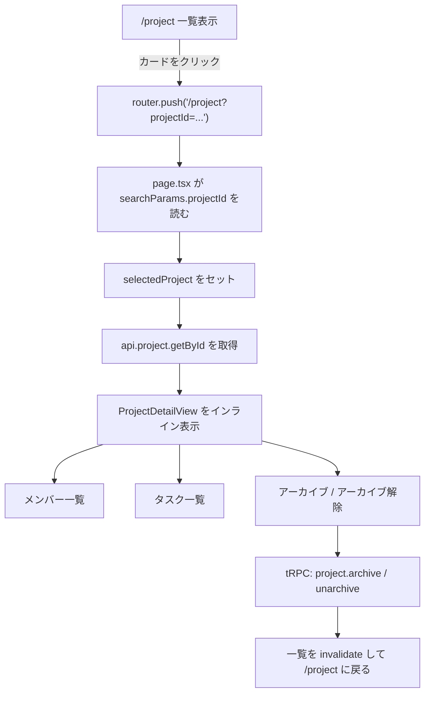
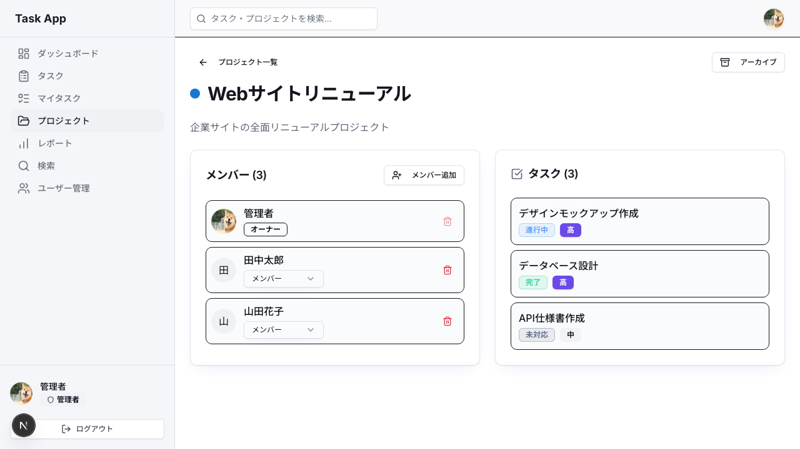

# Day 27: プロジェクト詳細・アーカイブを実装しよう

## 前回の振り返り

Day 26ではエラーページ（404・500）を実装し、予期せぬエラーが起きたときでもユーザーを安全に案内できるようにしました。今日はプロジェクト管理画面をさらに使いやすくするために、**プロジェクト詳細表示**と**アーカイブ機能**を実装します。

---

## 今日のゴール

プロジェクト一覧から1件を選ぶと、同じ `/project` ページの中で **一覧表示から詳細表示へ切り替わる UI** を実装します。詳細画面では次の情報を扱います。


- プロジェクト名・色・説明
- メンバー一覧
- タスク一覧
- アーカイブ / アーカイブ解除

> **今日のゴールライン**: URLのprojectIdで一覧と詳細を切り替え、アーカイブまで同じページ内で扱える感覚を掴めばOK。

> 現在の完成形は `ProjectDetailDialog` のモーダルではなく、`ProjectDetailView` を使った**インライン詳細表示**です。URL は `/project?projectId=xxx` のように変わり、同じページの中で一覧 ↔ 詳細を切り替えます。

## なぜこれを作るのか

プロジェクト管理アプリでは、「このプロジェクトには誰が入っているのか」「今どんなタスクがあるのか」をすぐ確認できる必要があります。

今回は詳細を別ルートに分離するのではなく、一覧ページの延長として表示を切り替える構成にします。この構成には次の利点があります。

- URL に `projectId` が残るので再読み込みや共有に強い
- 一覧画面へ戻る導線をシンプルに保てる
- ページ全体の責務を `page.tsx` に集約しやすい

また、完了したプロジェクトは削除ではなく**アーカイブ**します。アーカイブは「使わないものを棚にしまう」イメージです。履歴は残したまま、普段の一覧からは外せます。

### 今日実装する全体像



### やること / やらないこと

| やること | やらないこと |
|---------|-------------|
| 一覧 ↔ 詳細の表示切り替え | 詳細モーダルの新規採用 |
| `ProjectDetailView` の作成 | タスクの編集機能 |
| アーカイブ / アーカイブ解除 | アーカイブ専用ページの新設 |
| メンバー追加・削除の導線 | メンバー権限変更 UI |

### 新しく学ぶ概念

| 概念 | 読み方 | 役割 | 例え |
|------|--------|------|------|
| `useSearchParams` | ユースサーチパラメータ | URL クエリを読む | ブラウザの住所欄から条件を読む |
| `router.push()` | ルータープッシュ | URL を変えて画面状態を切り替える | 本にしおりを挟んで場所を移す |
| `inferRouterOutputs` | インファー・ルーター・アウトプット | tRPC の戻り値から型を自動取得 | レシートから商品一覧の型を読む |
| アーカイブ | アーカイブ | 削除ではなく `isArchived` で隠す | 本棚の奥にしまう |

### 復習する概念

| 概念 | 初出 |
|------|------|
| `useState` / `useEffect` | Day 10 以降 |
| コールバック Props | Day 15 以降 |
| `useQuery` / `useMutation` | Day 20 以降 |

---

## 実装ステップ一覧

| ステップ | 作業内容 | 所要時間 | 触るファイル | 成功状態 |
|---------|---------|---------|-------------|---------|
| Step 1 | アーカイブ API を確認・実装する | 5分 | `src/server/api/routers/project.ts` | `archive` / `unarchive` が呼べる |
| Step 2 | 一覧 ↔ 詳細の切り替えを作る | 8分 | `src/app/project/page.tsx` | カードクリックで詳細へ切り替わる |
| Step 3 | `ProjectDetailView` の型と骨格を作る | 8分 | `src/component/project/project-detail-view.tsx` | 戻るボタン付きの詳細画面が出る |
| Step 4 | メンバー一覧とタスク一覧を表示する | 10分 | `project-detail-view.tsx` | 主要情報が確認できる |
| Step 5 | アーカイブ / アーカイブ解除をつなぐ | 5分 | `page.tsx`, `project-detail-view.tsx` | ボタンで状態が切り替わる |
| Step 6 | 補助ダイアログと完成形を整える | 5分 | `src/app/project/page.tsx` | メンバー追加・削除確認も動く |

**合計時間**: 約41分。

---

### Step 1: アーカイブ API を確認・実装する (5分)

**ゴール**: `project.archive` と `project.unarchive` で `isArchived` を切り替えられるようにします。

まず前提です。アーカイブは**削除ではありません**。

| 方法 | 仕組み | 復元 | 向いている用途 |
|------|--------|------|---------------|
| 完全削除 | レコード自体を消す | 不可 | 本当に不要なデータ |
| アーカイブ | `isArchived` を切り替える | 可 | 過去プロジェクトの退避 |

Prisma スキーマに `isArchived` があることを確認します。

```prisma
model Project {
  id          String    @id @default(cuid())
  name        String
  description String?
  color       String    @default("#1976d2")
  isArchived  Boolean   @default(false) @map("is_archived")
  startDate   DateTime? @map("start_date")
  endDate     DateTime? @map("end_date")
  createdAt   DateTime  @default(now()) @map("created_at")
  updatedAt   DateTime  @updatedAt @map("updated_at")
}
```

現在の実装では、`archive` と `unarchive` は共通ヘルパー `setArchiveStatus` を使っています。

```ts
// filepath: src/server/api/routers/project.ts
const setArchiveStatus = async (userId: string, projectId: string, isArchived: boolean) => {
  const userMember = await prisma.projectMember.findUnique({
    where: {
      userId_projectId: { userId, projectId },
    },
  });

  assertMemberPermission(userMember ? [userMember] : [], 'canArchive');

  return await prisma.project.update({
    where: { id: projectId },
    data: { isArchived },
  });
};
```

ポイントは次の2つです。

- 権限確認は `prisma.project` ではなく `prisma.projectMember` で行う
- `assertMemberPermission(..., 'canArchive')` でアーカイブ権限を明示する

ルーター本体はシンプルです。

```ts
// filepath: src/server/api/routers/project.ts
archive: protectedProcedure
  .input(z.object({ id: z.string().cuid() }))
  .mutation(async ({ ctx, input }) => {
    return await setArchiveStatus(ctx.session.userId, input.id, true);
  }),

unarchive: protectedProcedure
  .input(z.object({ id: z.string().cuid() }))
  .mutation(async ({ ctx, input }) => {
    return await setArchiveStatus(ctx.session.userId, input.id, false);
  }),
```

**確認ポイント**

- `archive` と `unarchive` の両方がある
- どちらも `setArchiveStatus` を使っている
- `getAll` は `isArchived` で一覧を絞り込める

---

### Step 2: 一覧 ↔ 詳細の切り替えを作る (8分)

**ゴール**: 一覧カードをクリックしたら URL の `projectId` を更新し、同じ `/project` ページ内で詳細表示へ切り替える。

現在の完成形では、`page.tsx` が**画面全体の分岐役**です。

- `projectId` が無いとき: 一覧を表示
- `projectId` があるとき: `ProjectDetailView` を表示

まず `searchParams` と state を用意します。

```ts
// filepath: src/app/project/page.tsx
const [selectedProject, setSelectedProject] = useState<string | null>(null);

const searchParams = useSearchParams();
const projectIdParam = searchParams.get('projectId');
const router = useRouter();

useEffect(() => {
  if (projectIdParam) {
    setSelectedProject(projectIdParam);
  } else {
    setSelectedProject(null);
  }
}, [projectIdParam]);
```

`selectedProject` は詳細取得用の ID です。実際の切り替えトリガーは URL に置いているので、再読み込みしても状態を復元できます。

詳細データの取得は `selectedProject` があるときだけ行います。

```ts
// filepath: src/app/project/page.tsx
const { data: projectDetail } = api.project.getById.useQuery(
  { id: selectedProject ?? '' },
  { enabled: !!selectedProject },
);
```

カードクリック時は `router.push()` で URL を変えます。

```ts
// filepath: src/app/project/page.tsx
const handleProjectClick = (projectId: string) => {
  router.push(`/project?projectId=${projectId}`);
};

const handleDetailClose = () => {
  router.push('/project');
};
```

最後に、`projectIdParam` があるかどうかで描画を分岐します。

```tsx
// filepath: src/app/project/page.tsx
if (projectIdParam && selectedProject) {
  return (
    <AppLayout>
      <ProjectDetailView
        projectDetail={projectDetail}
        onBack={handleDetailClose}
        onAddMemberClick={() => setMemberDialogOpen(true)}
        onRemoveMember={handleRemoveMember}
        onArchive={handleArchive}
      />
    </AppLayout>
  );
}
```

**確認ポイント**

- 一覧クリックで `/project?projectId=...` に変わる
- URL を直接開いても詳細が表示される
- 戻るボタンで `/project` に戻る

---

### Step 3: `ProjectDetailView` の型と骨格を作る (8分)

**ゴール**: モーダルではなく、ページ内に表示する詳細ビューコンポーネントを作ります。

まず tRPC の戻り値から型を取ります。

```ts
// filepath: src/component/project/project-detail-view.tsx
import type { inferRouterOutputs } from '@trpc/server';
import type { AppRouter } from '@/server/api/root';

type RouterOutputs = inferRouterOutputs<AppRouter>;
type ProjectDetail = RouterOutputs['project']['getById'];
```

Props は次の形です。

```ts
// filepath: src/component/project/project-detail-view.tsx
interface ProjectDetailViewProps {
  projectDetail: ProjectDetail | null | undefined;
  onBack: () => void;
  onAddMemberClick: () => void;
  onRemoveMember: (userId: string) => void;
  onArchive: (projectId: string, isArchived: boolean) => void;
}
```

現在の完成形は、データが見つからないケースも自前で処理します。

```tsx
// filepath: src/component/project/project-detail-view.tsx
if (!projectDetail) {
  return (
    <div className="flex flex-col items-center justify-center py-24 text-muted-foreground">
      <p>プロジェクトが見つかりません。</p>
      <Button variant="ghost" className="mt-4" onClick={onBack}>
        <ArrowLeft className="mr-2 h-4 w-4" />
        プロジェクト一覧に戻る
      </Button>
    </div>
  );
}
```

詳細ビュー本体の骨格はこうなります。

```tsx
// filepath: src/component/project/project-detail-view.tsx
return (
  <div className="flex flex-col gap-6">
    <div className="flex items-center justify-between">
      <div className="flex items-center gap-4">
        <Button variant="ghost" size="sm" onClick={onBack}>
          <ArrowLeft className="mr-2 h-4 w-4" />
          プロジェクト一覧
        </Button>
        <div className="flex items-center gap-3">
          <div
            className="h-4 w-4 rounded-full flex-shrink-0"
            style={{ backgroundColor: projectDetail.color }}
          />
          <h1 className="text-3xl font-bold tracking-tight">{projectDetail.name}</h1>
        </div>
      </div>
    </div>

    {projectDetail.description && (
      <p className="text-muted-foreground">{projectDetail.description}</p>
    )}

    <div className="grid gap-6 lg:grid-cols-2">
```

**確認ポイント**: ここまで写経できました。次のブロックを続けて書きます。

```tsx
// filepath: 続き
      {/* Step 4 でメンバー一覧とタスク一覧を入れる */}
    </div>
  </div>
);
```

**確認ポイント**

- モーダルの `Dialog` は使っていない
- 戻るボタンは `onBack` で親に処理を委譲している
- 詳細画面は 2 カラムのカード構成になっている

---

### Step 4: メンバー一覧とタスク一覧を表示する (10分)

**ゴール**: `ProjectDetailView` の中に、現在の完成形と同じ情報量を持つ 2 つのカードを配置します。

メンバーカードは `Card` と `Avatar` を使って構成します。

```tsx
// filepath: src/component/project/project-detail-view.tsx
<Card>
  <CardHeader className="flex flex-row items-center justify-between space-y-0 pb-4">
    <CardTitle className="text-lg">
      メンバー ({projectDetail.members?.length ?? 0})
    </CardTitle>
    <Button variant="outline" size="sm" onClick={onAddMemberClick}>
      <UserPlus className="mr-2 h-4 w-4" /> メンバー追加
    </Button>
  </CardHeader>
  <CardContent>
    <div className="grid gap-2">
      {projectDetail.members?.map((member) => (
        <div
          key={member.id}
          className="flex items-center justify-between p-2 rounded-lg border bg-muted/30"
        >
          <div className="flex items-center gap-3">
            <Avatar>
              {member.user?.avatar && <AvatarImage src={member.user.avatar} />}
              <AvatarFallback>
                {(member.user?.name || member.user?.email || '?')[0]?.toUpperCase()}
              </AvatarFallback>
            </Avatar>
```

**確認ポイント**: ここまで写経できました。次のブロックを続けて書きます。

```tsx
// filepath: 続き
            <div>
              <p className="font-medium">{member.user?.name || member.user?.email || '不明'}</p>
              <Badge variant="outline" className="text-xs">
                {isProjectMemberRole(member.role)
                  ? PROJECT_MEMBER_ROLE_LABELS[member.role]
                  : member.role}
              </Badge>
            </div>
          </div>
          <Button
            variant="ghost"
            size="icon"
            onClick={() => onRemoveMember(member.userId)}
            disabled={member.role === PROJECT_MEMBER_ROLE.OWNER}
          >
            <Trash2 className="h-4 w-4 text-destructive" />
          </Button>
        </div>
      ))}
    </div>
  </CardContent>
</Card>
```

タスクカードは 0 件のときの表示も入れておくのがポイントです。

```tsx
// filepath: src/component/project/project-detail-view.tsx
<Card>
  <CardHeader className="space-y-0 pb-4">
    <div className="flex items-center gap-2">
      <CheckSquare className="h-5 w-5 text-muted-foreground" />
      <CardTitle className="text-lg">タスク ({projectDetail.tasks?.length ?? 0})</CardTitle>
    </div>
  </CardHeader>
  <CardContent>
    <div className="grid gap-2">
      {projectDetail.tasks?.length === 0 ? (
        <p className="text-sm text-muted-foreground text-center py-4">
          タスクがありません。
        </p>
      ) : (
        projectDetail.tasks?.map((task) => (
          <div
            key={task.id}
            className="flex flex-col gap-1 p-3 rounded-lg border bg-muted/30 hover:bg-muted/50 transition-colors"
          >
            <p className="font-medium">{task.title}</p>
            <div className="flex gap-2">
              <StatusBadge status={task.status} />
```

**確認ポイント**: ここまで写経できました。次のブロックを続けて書きます。

```tsx
// filepath: 続き
              <Badge variant={getPriorityBadgeVariant(task.priority)}>
                {TASK_PRIORITY_LABELS[task.priority] ?? task.priority}
              </Badge>
            </div>
          </div>
        ))
      )}
    </div>
  </CardContent>
</Card>
```

**確認ポイント**

- メンバー追加ボタンがヘッダー右上にある
- オーナーの削除ボタンは無効化される
- タスク 0 件でも空表示で崩れない

---

### Step 5: アーカイブ / アーカイブ解除をつなぐ (5分)

**ゴール**: 詳細画面上部のボタンで `archive` / `unarchive` を切り替えられるようにします。

`ProjectDetailView` 側では「どちらを呼ぶか」は判断せず、現在状態だけを親へ渡します。

```tsx
// filepath: src/component/project/project-detail-view.tsx
<Button
  variant="outline"
  onClick={() => onArchive(projectDetail.id, projectDetail.isArchived)}
>
  {projectDetail.isArchived ? (
    <>
      <ArchiveRestore className="mr-2 h-4 w-4" /> アーカイブ解除
    </>
  ) : (
    <>
      <Archive className="mr-2 h-4 w-4" /> アーカイブ
    </>
  )}
</Button>
```

親の `page.tsx` では 2 つの mutation を持ちます。

```ts
// filepath: src/app/project/page.tsx
const archiveMutation = api.project.archive.useMutation({
  onSuccess: () => {
    utils.project.getAll.invalidate();
    router.push('/project');
  },
});

const unarchiveMutation = api.project.unarchive.useMutation({
  onSuccess: () => {
    utils.project.getAll.invalidate();
    router.push('/project');
  },
});
```

切り替え関数は次の通りです。

```ts
// filepath: src/app/project/page.tsx
const handleArchive = (projectId: string, isArchived: boolean) => {
  const mutation = isArchived ? unarchiveMutation : archiveMutation;
  mutation.mutate({ id: projectId });
};
```

**確認ポイント**

- 未アーカイブなら「アーカイブ」と表示される
- アーカイブ済みなら「アーカイブ解除」と表示される
- 成功後は `/project` に戻って一覧が更新される

---

### Step 6: 補助ダイアログと完成形を整える (5分)

**ゴール**: 詳細表示はインラインのままにしつつ、補助的なモーダルだけ `page.tsx` 側で扱う現在構成を完成させる。

ここが少し重要です。**いまも `Dialog` は使っていますが、詳細表示のためではありません。**

- `ProjectDialog`: プロジェクト作成 / 編集用
- メンバー追加用 `Dialog`
- 削除確認用 `DeleteConfirmDialog`

つまり、現在の役割分担はこうです。

| コンポーネント | 役割 |
|---------------|------|
| `ProjectDetailView` | 詳細をインライン表示する |
| `ProjectDialog` | プロジェクト作成・編集 |
| `DeleteConfirmDialog` | 削除確認 |

メンバー削除は即時実行ではなく、確認ダイアログを挟みます。

```ts
// filepath: src/app/project/page.tsx
const handleRemoveMember = (userId: string) => {
  setRemoveMemberTargetId(userId);
  setRemoveMemberDialogOpen(true);
};
```

```tsx
// filepath: src/app/project/page.tsx
<DeleteConfirmDialog
  open={removeMemberDialogOpen}
  onOpenChange={setRemoveMemberDialogOpen}
  onConfirm={() => {
    if (selectedProject && removeMemberTargetId) {
      removeMemberMutation.mutate({
        projectId: selectedProject,
        userId: removeMemberTargetId,
      });
    }
  }}
  isPending={removeMemberMutation.isPending}
  title="このメンバーを削除しますか？"
/>
```

これで完成です。

**確認ポイント**:
- メンバー削除は確認ダイアログを挟んで実行される
- 詳細表示そのものはインライン表示のままになっている



---

## 現在の完成形の流れ

1. 一覧カードをクリックする
2. `router.push('/project?projectId=...')` が走る
3. `page.tsx` が `projectId` を読み、`selectedProject` を更新する
4. `api.project.getById` が有効化される
5. `ProjectDetailView` が表示される
6. 戻る・アーカイブ・メンバー操作は親の `page.tsx` が処理する

---

## 設計の変化メモ

この章の古い教材や一部のコードには `ProjectDetailDialog` という名前が残っていることがあります。これは**以前のモーダル設計の名残**です。

現在の完成形は次のとおりです。

- 詳細表示の本体は `src/component/project/project-detail-view.tsx`
- 画面遷移の制御は `src/app/project/page.tsx`

という構成になっています。

`src/component/project/project-detail-dialog.tsx` というファイル自体は残っていても、現行の `page.tsx` では詳細表示に使っていません。教材では**現行の実装に合わせて `ProjectDetailView` を正解とします。**

---

## ファイル構成の確認

| ファイル | 内容 | Step |
|---------|------|------|
| `src/server/api/routers/project.ts` | アーカイブ API | Step 1 |
| `src/app/project/page.tsx` | 一覧 ↔ 詳細の切り替え、各種 mutation | Step 2, 5, 6 |
| `src/component/project/project-detail-view.tsx` | 詳細表示本体 | Step 3, 4, 5 |
| `src/component/project/project-dialog.tsx` | プロジェクト作成 / 編集ダイアログ | Step 6 |

---


---

### Pro パターンで書こう（アーカイブ状態の絞り込みは配列メソッドで選ぶ）

ここまでで動くコードは書けました。でもプロの現場では、もう一段上の書き方をします。
なぜ上の書き方をするのか、**Before/After** で見比べてみましょう。

#### Before（動くけど、プロは書かない）

```typescript
type ProjectListItem = {
  id: string;
  name: string;
  isArchived: boolean;
};

type ArchiveFilter = 'active' | 'archived' | 'all';
```

**読み比べ用**: ここは写経しません。続けてコードを読み進めましょう。

```typescript
export function filterProjectsByArchiveStatus(
  projects: ProjectListItem[],
  filter: ArchiveFilter,
) {
  if (filter === 'active') {
    return projects.filter((project) => !project.isArchived);
  }

  if (filter === 'archived') {
    return projects.filter((project) => project.isArchived);
  }

  if (filter === 'all') {
    return projects;
  }

  return projects;
}
```

**このコードの問題点**:

- `if` が増えるほど、どの条件が一覧のルールなのか見渡しにくくなる
- 新しい絞り込み条件を足すと、関数の中に分岐がさらに増える
- `filter` の値と実際の絞り込み処理が離れていないため、UI 側の選択肢と対応づけにくい

#### After（プロが書くコード）

```typescript
type ProjectListItem = {
  id: string;
  name: string;
  isArchived: boolean;
};

type ArchiveFilter = 'active' | 'archived' | 'all';
```

**読み比べ用**: ここは写経しません。続けてコードを読み進めましょう。

```typescript
const ARCHIVE_FILTERS: Array<{
  key: ArchiveFilter;
  apply: (projects: ProjectListItem[]) => ProjectListItem[];
}> = [
  {
    key: 'active',
    apply: (projects) => projects.filter((project) => !project.isArchived),
  },
  {
    key: 'archived',
    apply: (projects) => projects.filter((project) => project.isArchived),
  },
  {
    key: 'all',
    apply: (projects) => projects,
  },
];
```

**読み比べ用**: ここは写経しません。続けてコードを読み進めましょう。

```typescript
export function filterProjectsByArchiveStatus(
  projects: ProjectListItem[],
  filter: ArchiveFilter,
) {
  const archiveFilter = ARCHIVE_FILTERS.find((item) => item.key === filter);

  return archiveFilter?.apply(projects) ?? projects;
}
```

**このコードの強み**:

- 絞り込み条件が配列にまとまり、選択肢と処理の対応が一覧できる
- 新しい条件を足すときは `ARCHIVE_FILTERS` に1要素追加するだけで済む
- `find` で対象ルールを選ぶ形なので、分岐のネストが増えにくい

#### 覚えておきたいエッセンス

同じ値を見て分岐する `if` が並び始めたら、
「条件と処理を配列にして選ぶ」形にできないか考えます。

## つまずきポイント

| エラー/問題 | 原因 | 解決方法 |
|------------|------|---------|
| 詳細が開かない | `router.push('/project?projectId=...')` していない | カードクリック時の URL 更新を確認する |
| API が毎回エラーになる | `selectedProject` が空なのに `getById` を呼んでいる | `enabled: !!selectedProject` を付ける |
| 一覧に戻れない | `onBack` が `router.push('/project')` になっていない | 戻る処理を URL ベースにそろえる |
| アーカイブ後に画面が古いまま | `invalidate()` を呼んでいない | `utils.project.getAll.invalidate()` を `onSuccess` に入れる |
| 詳細 UI が教材画像と違う | 旧モーダル版の資料を見ている | 現在は `ProjectDetailView` のインライン表示が正解 |

---

## Day 27 完了

### 今日学んだこと

| 概念 | 意味 | 使い場面 |
|------|------|---------|
| `useSearchParams` | URL クエリを読む | `/project?projectId=...` の解釈 |
| `router.push()` | URL を変えて画面状態を切り替える | 一覧 ↔ 詳細の切り替え |
| `inferRouterOutputs` | tRPC の戻り値型を自動で取る | `ProjectDetailView` の Props |
| アーカイブ | `isArchived` で論理的に隠す | 完了済みプロジェクトの退避 |
| `enabled` | 条件付きで `useQuery` を実行する | `selectedProject` があるときだけ詳細取得 |
| `invalidate()` | tRPC キャッシュを再取得させる | アーカイブ後の一覧更新 |

### 次回予告

Day 28では、タスクの一括操作を実装します。複数選択したタスクをまとめて完了・削除・ステータス変更できるようにしていきます。

---

## Day 27 完成形コード（参照用）

### `src/app/project/page.tsx`

Day 27 全 Step 完了後の状態は、このリポジトリの `src/app/project/page.tsx` と同じです。手元のコードと見比べて確認してください。
