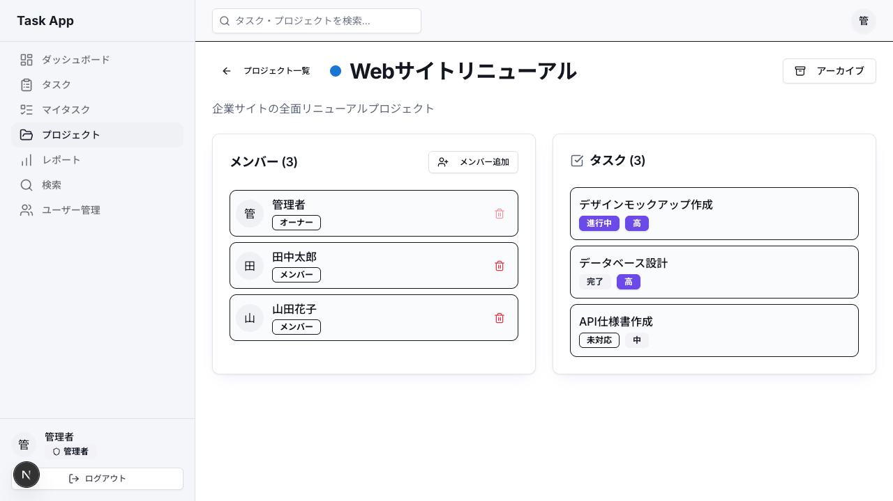
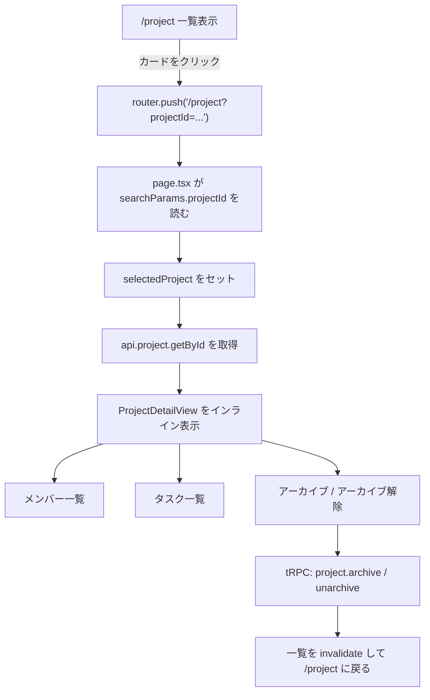

# Day 27: プロジェクト詳細・アーカイブを実装しよう

## 前回の振り返り

Day 26ではエラーページ（404・500）を実装し、予期せぬエラーが起きたときでもユーザーを安全に案内できるようにしました。今日はプロジェクト管理画面をさらに使いやすくするために、**プロジェクト詳細表示**と**アーカイブ機能**を実装します。

---

## 今日のゴール

プロジェクト一覧から1件を選ぶと、同じ `/project` ページの中で **一覧表示から詳細表示へ切り替わる UI** を実装します。詳細画面では次の情報を扱います。




- プロジェクト名・色・説明
- メンバー一覧
- タスク一覧
- アーカイブ / アーカイブ解除

> **今日のゴールライン**: URLのprojectIdで一覧と詳細を切り替え、アーカイブまで同じページ内で扱える感覚を掴めれば大丈夫です。
>
> 現在の完成形は `ProjectDetailDialog` のモーダルではなく、`ProjectDetailView` を使った**インライン詳細表示**です。URL は `/project?projectId=xxx` のように変わり、同じページの中で一覧 ↔ 詳細を切り替えます。
>
> **この Day は Day 11・12 で作った機能の
> 統合確認です。** 以下のコードは完成状態との
> 照合用です。同じ名前の state、query、mutation、
> handler、Props を追加し直してはいけません。
> 不足がある場合だけ、該当箇所を補ってください。

## なぜこれを作るのか

プロジェクト管理アプリでは、「このプロジェクトには誰が入っているのか」「今どんなタスクがあるのか」をすぐ確認できる必要があります。

今回は詳細を別ルートに分離するのではなく、一覧ページの延長として表示を切り替える構成にします。この構成には次の利点があります。

- URL に `projectId` が残るので再読み込みや共有に強い
- 一覧画面へ戻る導線をシンプルに保てる
- ページ全体の責務を `page.tsx` に集約しやすい

また、完了したプロジェクトは削除ではなく**アーカイブ**します。アーカイブは「使わないものを棚にしまう」イメージです。履歴は残したまま、普段の一覧からは外せます。

### 今日実装する全体像


```mermaid
flowchart TD
    A["/project 一覧表示"] -->|"カードをクリック"| B["router.push('/project?projectId=...')"]
    B --> C["page.tsx が searchParams.projectId を読む"]
    C --> D["selectedProject をセット"]
    D --> E["api.project.getById を取得"]
    E --> F["ProjectDetailView をインライン表示"]
    F --> G["メンバー一覧"]
    F --> H["タスク一覧"]
    F --> I["アーカイブ / アーカイブ解除"]
    I --> J["tRPC: project.archive / unarchive"]
    J --> K["一覧を invalidate して /project に戻る"]
```

この図で目を留めてほしいのは、B から C への戻りです。カードをクリックしたとき、`selectedProject` を直接書き換えてはいません。いったん URL を書き換えて、そのあと `page.tsx` が URL を読み直して `selectedProject` に反映します。遠回りに見えますが、画面の状態を決める大元が URL 1か所にそろいます。だから再読み込みしても、リンクを人に送っても、同じ詳細画面が開きます。

### やること / やらないこと

| やること | やらないこと |
|---------|-------------|
| 一覧 ↔ 詳細の表示切り替え | 詳細モーダルの新規採用 |
| 配布済みの `ProjectDetailView` に詳細表示を書き足す | タスクの編集機能 |
| アーカイブ / アーカイブ解除 | アーカイブ専用ページの新設 |
| メンバー追加・削除の導線 | メンバー権限変更 UI |

### 新しく学ぶ概念

| 概念 | 読み方 | 役割 | 例え |
|------|--------|------|------|
| `useSearchParams` | ユースサーチパラメータ | URL クエリを読む | ブラウザの住所欄から条件を読む |
| `router.push()` | ルータープッシュ | URL を変えて画面状態を切り替える | 本にしおりを挟んで場所を移す |
| `inferRouterOutputs` | インファー・ルーター・アウトプット | tRPC の戻り値から型を自動取得 | レシートから商品一覧の型を読む |
| アーカイブ | アーカイブ | 削除ではなく `isArchived` で隠す | 本棚の奥にしまう |

### 復習する概念

| 概念 | 初出 |
|------|------|
| `useState` / `useEffect` | Day 10 以降 |
| コールバック Props | Day 15 以降 |
| `useQuery` / `useMutation` | Day 20 以降 |

---

## 実装ステップ一覧

| ステップ | 作業内容 | 所要時間 | 触るファイル | 成功状態 |
|---------|---------|---------|-------------|---------|
| Step 1 | アーカイブ API を確認・実装する | 5分 | `src/server/api/routers/project.ts` | `archive` / `unarchive` が呼べる |
| Step 2 | 一覧 ↔ 詳細の切り替えを作る | 8分 | `src/app/project/page.tsx` | カードクリックで詳細へ切り替わる |
| Step 3 | `ProjectDetailView` の型と骨格を作る | 8分 | `src/component/project/project-detail-view.tsx` | 戻るボタン付きの詳細画面が出る |
| Step 4 | メンバー一覧とタスク一覧を表示する | 10分 | `project-detail-view.tsx` | 主要情報が確認できる |
| Step 5 | アーカイブ / アーカイブ解除をつなぐ | 5分 | `page.tsx`, `project-detail-view.tsx` | ボタンで状態が切り替わる |
| Step 6 | 補助ダイアログと完成形を整える | 5分 | `src/app/project/page.tsx` | メンバー追加・削除確認も動く |

**合計時間**: 約41分です。

---

### Step 1: アーカイブ API を確認・実装する (5分)

**ゴール**: `project.archive` と `project.unarchive` で `isArchived` を切り替えられるようにします。

Day 11 で実装済みなら、ここではコードを追加せず
次の完成形と照合してください。同名 procedure を
追加すると重複定義になるため、書き直しません。

まず前提です。アーカイブは**削除ではありません**。

| 方法 | 仕組み | 復元 | 向いている用途 |
|------|--------|------|---------------|
| 完全削除 | レコード自体を消す | 不可 | 本当に不要なデータ |
| アーカイブ | `isArchived` を切り替える | 可 | 過去プロジェクトの退避 |

Prisma スキーマに `isArchived` があることを確認します。

```prisma
model Project {
  id          String    @id @default(cuid())
  name        String
  description String?
  color       String    @default("#1976d2")
  isArchived  Boolean   @default(false) @map("is_archived")
  startDate   DateTime? @map("start_date")
  endDate     DateTime? @map("end_date")
  createdAt   DateTime  @default(now()) @map("created_at")
  updatedAt   DateTime  @updatedAt @map("updated_at")
}
```

現在の実装では、`archive` と `unarchive` は共通ヘルパー `setArchiveStatus` を使っています。

```ts
// filepath: src/server/api/routers/project.ts
const setArchiveStatus = async (userId: string, projectId: string, isArchived: boolean) => {
  const userMember = await prisma.projectMember.findUnique({
    where: {
      userId_projectId: { userId, projectId },
    },
  });

  assertMemberPermission(userMember ? [userMember] : [], 'canArchive');

  return await prisma.project.update({
    where: { id: projectId },
    data: { isArchived },
  });
};
```

ポイントは次の2つです。

- 権限確認は `prisma.project` ではなく `prisma.projectMember` で行う
- `assertMemberPermission(..., 'canArchive')` でアーカイブ権限を明示する

`prisma.project` を引いても、そのユーザーがそのプロジェクトの何なのかは分かりません。役割が載っているのは `ProjectMember` の行のほうです。`assertMemberPermission` は渡された配列の先頭を見て、行が1つも無ければ `FORBIDDEN` を返します。だから `findUnique` が `null` を返す「そもそも参加していない人」は、ここで止まります。第2引数の `'canArchive'` を渡すと、役割の中身まで見ます。`canArchive` が `true` の役割は `OWNER` だけなので、管理者でもアーカイブはできません。この引数を省くと「メンバーなら誰でもアーカイブできる」に意味が変わってしまいます。

ルーター本体はシンプルです。

```ts
// filepath: src/server/api/routers/project.ts
archive: protectedProcedure
  .input(z.object({ id: z.string().cuid() }))
  .mutation(async ({ ctx, input }) => {
    return await setArchiveStatus(ctx.session.userId, input.id, true);
  }),

unarchive: protectedProcedure
  .input(z.object({ id: z.string().cuid() }))
  .mutation(async ({ ctx, input }) => {
    return await setArchiveStatus(ctx.session.userId, input.id, false);
  }),
```

2つの procedure で違うのは、最後に渡す `true` と `false` だけです。1つにまとめて現在値を反転させる作り方もできますが、そうすると画面が送ってきた「今の状態」を信じることになります。同じプロジェクトを2人が開いていると、反転した結果がお互いにずれます。呼ぶ名前で結果を決めておけば、サーバーが受け取るのは「こうしたい」という最終状態だけです。`archive` を続けて2回呼んでも、`isArchived` は `true` のままで変わりません。権限確認をヘルパー1か所に寄せてあるので、片方だけ確認を書き忘れる事故も起きません。

**確認ポイント**

- `archive` と `unarchive` の両方がある
- どちらも `setArchiveStatus` を使っている
- `getAll` は `isArchived` で一覧を絞り込める

---

### Step 2: 一覧 ↔ 詳細の切り替えを作る (8分)

**ゴール**: 一覧カードをクリックしたら URL の `projectId` を更新し、同じ `/project` ページ内で詳細表示へ切り替えます。

この state、query、handler、描画分岐は
Day 11・12 で実装済みです。以下は追加手順ではなく
照合用です。同名の宣言があれば変更しません。

現在の完成形では、`page.tsx` が**画面全体の分岐役**です。

- `projectId` が無いとき: 一覧を表示
- `projectId` があるとき: `ProjectDetailView` を表示

まず `searchParams` と state を用意します。

```ts
// filepath: src/app/project/page.tsx
const [selectedProject, setSelectedProject] = useState<string | null>(null);

const searchParams = useSearchParams();
const projectIdParam = searchParams.get('projectId');
const router = useRouter();

useEffect(() => {
  if (projectIdParam) {
    setSelectedProject(projectIdParam);
  } else {
    setSelectedProject(null);
  }
}, [projectIdParam]);
```

`selectedProject` は詳細取得用の ID です。実際の切り替えトリガーは URL に置いているので、再読み込みしても状態を復元できます。

詳細データの取得は `selectedProject` があるときだけ行います。

```ts
// filepath: src/app/project/page.tsx
const { data: projectDetail } = api.project.getById.useQuery(
  { id: selectedProject ?? '' },
  { enabled: !!selectedProject },
);
```

`useQuery` は Day 09 で書いたときと同じで、置いておくだけで自動的に走ります。ところが一覧を見ている間は `selectedProject` が `null` です。そのままだと、空の ID で詳細を取りに行ってサーバー側でエラーになります。それを止めているのが第2引数の `enabled` です。`!!selectedProject` が `false` の間、この `useQuery` は通信そのものを行いません。第1引数の `?? ''` は、その間も `id` が文字列であるという型の約束を満たすための埋め合わせで、この空文字が実際に送られることはありません。

カードクリック時は `router.push()` で URL を変えます。

```ts
// filepath: src/app/project/page.tsx
const handleProjectClick = (projectId: string) => {
  router.push(`/project?projectId=${projectId}`);
};

const handleDetailClose = () => {
  router.push('/project');
};
```

どちらのハンドラーも `setSelectedProject` を呼んでいません。やっているのは URL の書き換えだけです。ここで state も一緒に書き換えたくなりますが、そうすると更新の経路が2本になります。ブラウザの戻るボタンを押したとき、URL だけ `/project` に戻って詳細の表示が残る、という食い違いはその一例です。URL を唯一の起点にしておけば、上で書いた `useEffect` が `projectIdParam` の変化を受け取って、state のほうを合わせてくれます。

最後に、`projectIdParam` があるかどうかで描画を分岐します。

```tsx
// filepath: src/app/project/page.tsx
if (projectIdParam && selectedProject) {
  return (
    <AppLayout>
      <ProjectDetailView
        projectDetail={projectDetail}
        onBack={handleDetailClose}
        onAddMemberClick={() => setMemberDialogOpen(true)}
        onRemoveMember={handleRemoveMember}
        onUpdateMemberRole={handleUpdateMemberRole}
        onArchive={handleArchive}
        canManageMembers={canManageMembers}
        canArchive={canArchiveProject}
      />
    </AppLayout>
  );
}
```

肝心なのは、この分岐が `if` の中の `return` になっている点です。ここで `return` すると、この下に書いてある一覧の JSX には一切進みません。条件を満たすときだけ詳細を返す形なので、一覧と詳細が同時に描かれる状態になりません。条件に `projectIdParam && selectedProject` と2つ並べているのにも理由があります。URL が変わった直後の1回目の描画では `useEffect` がまだ走っておらず、`selectedProject` には前の値が残っています。`projectIdParam` だけで判定すると、その一瞬だけ前のプロジェクトの詳細が見えてしまいます。Props を8つも渡しているのは、`ProjectDetailView` が自分ではデータを取りに行かないためです。

**確認ポイント**

- 一覧クリックで `/project?projectId=...` に変わる
- URL を直接開いても詳細が表示される
- 戻るボタンで `/project` に戻る

---

### Step 3: `ProjectDetailView` の型と骨格を作る (8分)

**ゴール**: モーダルではなく、ページ内に表示する詳細ビューコンポーネントを作ります。

Day 12 で作成済みのファイルを削除したり、
5 props の旧形式へ置き換えたりしないでください。
現在の8 props 契約を、次の完成形と照合します。

まず tRPC の戻り値から型を取ります。

```ts
// filepath: src/component/project/project-detail-view.tsx
import type { inferRouterOutputs } from '@trpc/server';
import type {
  ProjectMemberRole,
} from '@/lib/constant/roles';
import type { AppRouter } from '@/server/api/root';

type RouterOutputs = inferRouterOutputs<AppRouter>;
type ProjectDetail = RouterOutputs['project']['getById'];
```

ここで `ProjectDetail` の中身を自分で書き並べないのが肝心なところです。`inferRouterOutputs` は、サーバー側の手続きが実際に返す形をそのまま取り出して型にしてくれます。Day 09 の `getAll` でメンバーとタスクを `include` して返したように、`getById` も関連データを一緒に返します。その入れ子の形まで自動で付いてくるので、`{ id: string; name: string; ... }` と手で書く必要はありません。手書きにすると、あとで `include` を1つ増やしたときに画面側の型だけが古いまま取り残されます。

Props は次の形です。

```ts
// filepath: src/component/project/project-detail-view.tsx
interface ProjectDetailViewProps {
  projectDetail: ProjectDetail | null | undefined;
  onBack: () => void;
  onAddMemberClick: () => void;
  onRemoveMember: (userId: string) => void;
  onUpdateMemberRole?: (
    userId: string,
    role: ProjectMemberRole,
  ) => void;
  onArchive: (projectId: string, isArchived: boolean) => void;
  canManageMembers?: boolean;
  canArchive?: boolean;
}
```

末尾の3つに `?` が付いているのは、Day 11 の呼び出しがこの3つを渡さないためです。
必須にすると Day 11 で書いた記述が型エラーになります。

8つと聞くと多く感じますが、中身は2種類しかありません。`projectDetail` と `canManageMembers` / `canArchive` は「表示に必要な材料」、`on` で始まる5つは「押されたことを親に伝える窓口」です。裏を返すと、`ProjectDetailView` は mutation を1つも持ちません。通信も権限の判定もこの部品の仕事ではありません。Day 15 以降で使ってきたコールバック Props と同じ考え方で、判断は `page.tsx` に集めます。こう分けておくと、あとで詳細を別ページへ移したくなったときも、この部品はそのまま持っていけます。

現在の完成形は、データが見つからないケースも自前で処理します。

```tsx
// filepath: src/component/project/project-detail-view.tsx
if (!projectDetail) {
  return (
    <div className="flex flex-col items-center justify-center py-24 text-muted-foreground">
      <p>プロジェクトが見つかりません。</p>
      <Button variant="ghost" className="mt-4" onClick={onBack}>
        <ArrowLeft className="mr-2 h-4 w-4" />
        プロジェクト一覧に戻る
      </Button>
    </div>
  );
}
```

Props の型が `ProjectDetail | null | undefined` になっているので、この `if` は中身が無い場面をまとめて受け止めます。まだ通信が終わっていない `undefined` のときと、親から明示的に `null` を渡されたときです。存在しない ID を開いたときは `null` にはなりません。`project.getById` が `NOT_FOUND` を投げるので、`data` は `undefined` のままで、代わりに `error` のほうに中身が入ります。どの場合もこの `if` が受け止めます。ただし、受け止め方は同じでも中身は違います。通信中も、通信に失敗したときも、この案内は「プロジェクトが見つかりません」と出ます。読者から見ると、待っているだけなのか本当に無いのかが分かりません。実務では `isLoading` と `error` も親から渡し、待機中・失敗・不在の3つを別々に出し分けます。今日は3つを1つにまとめた形で進めます。そしてこの早い `return` には、もう1つの効き目があります。ここを通り抜けた先では、TypeScript が「`projectDetail` には必ず中身がある」と判断してくれます。だからこの後に出てくる `projectDetail.color` や `projectDetail.name` を、`?.` を付けずにそのまま書けます。逆にこの `if` を消すと、以降のすべての参照で型エラーが出ます。

詳細ビュー本体の骨格はこうなります。

```tsx
// filepath: src/component/project/project-detail-view.tsx
return (
  <div className="flex flex-col gap-6">
    <div className="flex items-center justify-between">
      <div className="flex items-center gap-4">
        <Button variant="ghost" size="sm" onClick={onBack}>
          <ArrowLeft className="mr-2 h-4 w-4" />
          プロジェクト一覧
        </Button>
        <div className="flex items-center gap-3">
          <div
            className="h-4 w-4 rounded-full flex-shrink-0"
            style={{ backgroundColor: projectDetail.color }}
          />
          <h1 className="text-3xl font-bold tracking-tight">{projectDetail.name}</h1>
        </div>
      </div>
    </div>

    {projectDetail.description && (
      <p className="text-muted-foreground">{projectDetail.description}</p>
    )}

    <div className="grid gap-6 lg:grid-cols-2">
```

先に外枠だけを置いています。上から順に、戻るボタンと色の丸と名前を1行に並べたヘッダー、説明文、そして下半分に来る2カラムの入れ物、という3段構えです。`projectDetail.description && (...)` としてあるので、説明が空のプロジェクトでは段落そのものが出ません。空の `<p>` が残って行間だけ空くのを防げます。`lg:grid-cols-2` は Day 09 のグリッドと同じ考え方で、画面が広いときだけ横2列にします。スマートフォンの幅ではメンバーとタスクが縦に積まれます。

なお最後の `<div className="grid ...">` は開いたままです。閉じタグが足りない状態なので、この時点では保存してもエラーが出ます。続きを次のブロックで書きます。

```tsx
// filepath: 続き
      {/* Step 4 でメンバー一覧とタスク一覧を入れる */}
    </div>
  </div>
);
```

閉じタグが2つ並ぶだけのブロックですが、どれがどれを閉じるかを数えておいてください。1つ目の `</div>` が `grid gap-6 lg:grid-cols-2` を、2つ目が一番外側の `flex flex-col gap-6` を閉じます。JSX は開いたタグが閉じていないとビルドで止まるため、ここまで書いて初めてファイルが保存できる状態になります。中のコメント行は Step 4 で中身に置き換える目印で、このままでも表示は崩れません。2カラムの入れ物だけが先にあり、そこに入るカードがまだ無い状態です。

**確認ポイント**

- モーダルの `Dialog` は使っていない
- 戻るボタンは `onBack` で親に処理を委譲している
- 詳細画面は 2 カラムのカード構成になっている

---

### Step 4: メンバー一覧とタスク一覧を表示する (10分)

**ゴール**: `ProjectDetailView` の中に、メンバー一覧とタスク一覧の 2 つのカードを配置します。ここで作るのは完成版を少し削った形です。削ってある部分は、それぞれのカードを書き終えたところで説明します。

Day 12 で実装済みなら、以下は読み比べだけ行います。
既存の権限制御やロール変更 UI を残してください。

メンバーカードは `Card` と `Avatar` を使って構成します。

```tsx
// filepath: src/component/project/project-detail-view.tsx
<Card>
  <CardHeader className="flex flex-row items-center justify-between space-y-0 pb-4">
    <CardTitle className="text-lg">
      メンバー ({projectDetail.members?.length ?? 0})
    </CardTitle>
    <Button variant="outline" size="sm" onClick={onAddMemberClick}>
      <UserPlus className="mr-2 h-4 w-4" /> メンバー追加
    </Button>
  </CardHeader>
  <CardContent>
    <div className="grid gap-2">
      {projectDetail.members?.map((member) => (
        <div
          key={member.id}
          className="flex items-center justify-between p-2 rounded-lg border bg-muted/30"
        >
          <div className="flex items-center gap-3">
            <Avatar>
              {member.user?.avatar && <AvatarImage src={member.user.avatar} />}
              <AvatarFallback>
                {(member.user?.name || member.user?.email || '?')[0]?.toUpperCase()}
              </AvatarFallback>
            </Avatar>
```

`Avatar` の中を2段構えにしているのは、アイコン画像を持たないメンバーがいるからです。`member.user?.avatar` があるときだけ `AvatarImage` を出し、無ければ `AvatarFallback` が受け止めて、名前かメールの1文字目を大文字にして丸の中に置きます。`(member.user?.name || member.user?.email || '?')` と3段に重ねてあるのは、名前とメールが両方空だったときに `?` を出すためです。ここを `member.user.name[0]` と素直に書くと、名前が空のメンバーが1人いるだけで、描画の途中で例外が飛びます。Day 26 で `error.tsx` を置いたので、行き先は真っ白な画面ではなく、あのエラーページです。それでも、1人分のデータ欠けで詳細画面ごと消える点は変わりません。

`<Avatar>` を閉じた直後で切れているので、続きを次のブロックで書きます。

```tsx
// filepath: 続き
            <div>
              <p className="font-medium">{member.user?.name || member.user?.email || '不明'}</p>
              <Badge variant="outline" className="text-xs">
                {isProjectMemberRole(member.role)
                  ? PROJECT_MEMBER_ROLE_LABELS[member.role]
                  : member.role}
              </Badge>
            </div>
          </div>
          <Button
            variant="ghost"
            size="icon"
            onClick={() => onRemoveMember(member.userId)}
            disabled={member.role === PROJECT_MEMBER_ROLE.OWNER}
          >
            <Trash2 className="h-4 w-4 text-destructive" />
          </Button>
        </div>
      ))}
    </div>
  </CardContent>
</Card>
```

この一覧でいちばん大事な1行は、削除ボタンの `disabled={member.role === PROJECT_MEMBER_ROLE.OWNER}` です。最後のオーナーを消せてしまうと、そのプロジェクトを操作できる人が誰も残らず、誰も直せない状態のプロジェクトが残ります。押せない見た目にしておけば、うっかりクリックがそこで止まります。ここでは相手がオーナーなら一律で押せなくしているので、オーナーが2人以上いるプロジェクトでも片方を外せません。サーバー側の `removeMember` は2段構えで止めます。オーナー以外がオーナーを外そうとしたら `FORBIDDEN` で拒み、そのうえでオーナーが1人しか残っていなければ `BAD_REQUEST` で拒みます。つまりオーナー同士なら2人目以降を外せるので、一律で押させない画面のほうが厳しい作りです。安全側に倒した分、オーナーの入れ替えは画面からはできません。ただし画面側の `disabled` は入口の防波堤にすぎません。本当の門番は Step 1 で見た `assertMemberPermission` で、そちらが最後に権限を確かめます。ロール名を `PROJECT_MEMBER_ROLE_LABELS` に通しているのも同じ発想で、`'OWNER'` という英字をそのまま出さず、他の画面と同じ日本語のラベルにそろえます。

ここで書いたメンバーカードは、完成版から2つ削ってあります。完成版はロール名をただのラベルではなく `Select` で出し、その場で権限を変えられます。さらに `canManageMembers` が false の人には `Select` と削除ボタンを見せず、ラベルだけの読み取り専用にします。今日はまず一覧を出すところまでで、この出し分けは Day 12 で書いた既存のコードにそのまま残しておいて問題ありません。

タスクカードは 0 件のときの表示も入れておくのがポイントです。

```tsx
// filepath: src/component/project/project-detail-view.tsx
<Card>
  <CardHeader className="space-y-0 pb-4">
    <div className="flex items-center gap-2">
      <CheckSquare className="h-5 w-5 text-muted-foreground" />
      <CardTitle className="text-lg">タスク ({projectDetail.tasks?.length ?? 0})</CardTitle>
    </div>
  </CardHeader>
  <CardContent>
    <div className="grid gap-2">
      {projectDetail.tasks?.length === 0 ? (
        <p className="text-sm text-muted-foreground text-center py-4">
          タスクがありません。
        </p>
      ) : (
        projectDetail.tasks?.map((task) => (
          <div
            key={task.id}
            className="flex flex-col gap-1 p-3 rounded-lg border bg-muted/30 hover:bg-muted/50 transition-colors"
          >
            <p className="font-medium">{task.title}</p>
            <div className="flex gap-2">
              <StatusBadge status={task.status} />
```

タスクカードで先に書いてあるのは、0 件のときの分岐です。`projectDetail.tasks?.length === 0` を最初に見て、空なら「タスクがありません。」の1行だけを出します。これが無いと、タスクを作っていないプロジェクトでは枠の中が空のまま残ります。読み込み中と失敗は手前の `if (!projectDetail)` が受け止めているので、ここへ来た時点での0件は「まだタスクが無い」以外にありません。それを1行で言い切っておくと、画面が壊れているのかタスクが無いだけなのかで読者が迷いません。`StatusBadge` はタスク一覧でも使っている共通の部品で、`task.status` を渡すだけで状態に応じた色の札になります。ここで色分けを直に書かないので、状態の色を変えたいときは部品側を1か所直すだけで全画面に効きます。

見出しの件数も、完成版とは数え方が違います。ここでは `projectDetail.tasks?.length ?? 0` として全件を数えますが、完成版はキャンセル済みを外した件数を `タスク (3)` のように出し、外した分を「（キャンセル済 1）」と脇に添えます。Day 21 の統計カードと同じで、中止したタスクを混ぜると「今動いている作業の量」として読めなくなるためです。今日は数え分けまでは踏み込まず、まず一覧が出る状態を作ります。

こちらも `<div>` の途中で切れています。続きを次のブロックで書きます。

```tsx
// filepath: 続き
              <Badge variant={getPriorityBadgeVariant(task.priority)}>
                {TASK_PRIORITY_LABELS[task.priority] ?? task.priority}
              </Badge>
            </div>
          </div>
        ))
      )}
    </div>
  </CardContent>
</Card>
```

優先度の札だけは専用の部品にせず、共通の `Badge` に `variant` を渡す形にしています。色を決める役目は `getPriorityBadgeVariant` が持っていて、`URGENT` なら `destructive`、`HIGH` なら `default`、`MEDIUM` なら `secondary`、残りは `outline` を返します。ここで `task.priority === 'URGENT' ? ... : ...` と書き始めると、同じ優先度がタスク一覧と詳細で違う色になっていきます。文字のほうは `TASK_PRIORITY_LABELS[task.priority]` を通して「緊急」「高」「中」「低」の日本語にします。`?? task.priority` を添えてあるのは、対応表で見つからない値が届いても札を空にしないためです。

**確認ポイント**

- メンバー追加ボタンがヘッダー右上にある
- オーナーの削除ボタンは無効化される
- タスク 0 件でも空表示で崩れない

---

### Step 5: アーカイブ / アーカイブ解除をつなぐ (5分)

**ゴール**: 詳細画面上部のボタンで `archive` / `unarchive` を切り替えられるようにします。

Day 11 で作った mutation と handler があれば、
追加し直さず、次の条件を満たすか確認します。

`ProjectDetailView` 側では「どちらを呼ぶか」は判断せず、現在状態だけを親へ渡します。

```tsx
// filepath: src/component/project/project-detail-view.tsx
<Button
  variant="outline"
  onClick={() => onArchive(projectDetail.id, projectDetail.isArchived)}
>
  {projectDetail.isArchived ? (
    <>
      <ArchiveRestore className="mr-2 h-4 w-4" /> アーカイブ解除
    </>
  ) : (
    <>
      <Archive className="mr-2 h-4 w-4" /> アーカイブ
    </>
  )}
</Button>
```

このボタンは `archive` と `unarchive` のどちらを呼ぶかを決めていません。親に渡しているのは `projectDetail.isArchived`、つまり今どちらの状態なのかという事実だけです。判断を親に預けておくと、あとで「アーカイブ前に確認ダイアログを挟む」と決めても、直すのは `page.tsx` の1か所で済みます。表示のほうは `isArchived` を見て文字とアイコンを入れ替えるので、アーカイブが成功して詳細のデータが取り直されると、ラベルも自動で反対側へ変わります。押すたびに文字を書き換える処理を自分で持つ必要はありません。

親の `page.tsx` では 2 つの mutation を持ちます。

```ts
// filepath: src/app/project/page.tsx
const archiveMutation = api.project.archive.useMutation({
  onSuccess: () => {
    utils.project.getAll.invalidate();
    router.push('/project');
  },
});

const unarchiveMutation = api.project.unarchive.useMutation({
  onSuccess: () => {
    utils.project.getAll.invalidate();
    router.push('/project');
  },
});
```

2つの mutation で `onSuccess` の中身がそろっているのは、どちらも「一覧の中身が変わった」という同じ結果を生むからです。`utils.project.getAll.invalidate()` は、tRPC が手元に持っている一覧のデータに古いという印を付けて、次に表示されるときに取り直させます。これを忘れると、アーカイブしたはずのプロジェクトが一覧に残って見えます。サーバー側は正しく更新されているのに画面だけが古い、という一番気付きにくいずれ方です。続く `router.push('/project')` で詳細から一覧へ戻すので、読者は取り直された一覧をその場で確かめられます。

切り替え関数は次の通りです。

```ts
// filepath: src/app/project/page.tsx
const handleArchive = (projectId: string, isArchived: boolean) => {
  const mutation = isArchived ? unarchiveMutation : archiveMutation;
  mutation.mutate({ id: projectId });
};
```

3行しかありませんが、この関数がアーカイブ機能の分かれ道です。受け取る `isArchived` は今の状態なので、`true`（すでにアーカイブ済み）なら呼ぶのは `unarchiveMutation` のほうです。渡ってくるのは現在で、呼ぶのは反対側、と覚えてください。ここを逆にすると、アーカイブ済みのプロジェクトをもう一度アーカイブする通信になります。エラーにはならず、ボタンを押しても何も変わらないので、原因を見つけるのに時間がかかります。`useMutation` の戻り値をいったん変数に入れてから `mutate` を呼べるのは、戻り値がただのオブジェクトだからです。おかげで `if` を2つに分けて同じ `mutate` を2回書かずに済みます。

**確認ポイント**

- 未アーカイブなら「アーカイブ」と表示される
- アーカイブ済みなら「アーカイブ解除」と表示される
- 成功後は `/project` に戻って一覧が更新される

---

### Step 6: 補助ダイアログと完成形を整える (5分)

**ゴール**: 詳細表示はインラインのままにしつつ、補助的なモーダルだけ `page.tsx` 側で扱う現在構成を完成させます。

Day 12 で実装済みのダイアログや state は
再宣言しません。以下は配置と動作の確認用です。

ここが少し重要です。**いまも `Dialog` は使っていますが、詳細表示のためではありません。**

- `ProjectDialog`: プロジェクト作成 / 編集用
- メンバー追加用 `Dialog`
- 削除確認用 `DeleteConfirmDialog`

つまり、現在の役割分担はこうです。

| コンポーネント | 役割 |
|---------------|------|
| `ProjectDetailView` | 詳細をインライン表示する |
| `ProjectDialog` | プロジェクト作成・編集 |
| `DeleteConfirmDialog` | 削除確認 |

メンバー削除は即時実行ではなく、確認ダイアログを挟みます。

```ts
// filepath: src/app/project/page.tsx
const handleRemoveMember = (userId: string) => {
  setRemoveMemberTargetId(userId);
  setRemoveMemberDialogOpen(true);
};
```

この関数は削除そのものを行いません。誰を消すのかを `removeMemberTargetId` に覚えて、ダイアログを開くところまでです。実際に消すのは、次に置く `DeleteConfirmDialog` の `onConfirm` の中です。ここで即座に mutation を呼ぶ形にすると、押し間違いがそのままメンバーの削除になります。取り消せない操作では「対象を覚える」と「実行する」を2段に分ける、という形を覚えてください。`ProjectDetailView` 側が `onRemoveMember` を呼ぶだけで済んでいるのも、この2段を親が引き受けているからです。

```tsx
// filepath: src/app/project/page.tsx
<DeleteConfirmDialog
  open={removeMemberDialogOpen}
  onOpenChange={setRemoveMemberDialogOpen}
  onConfirm={() => {
    if (selectedProject && removeMemberTargetId) {
      removeMemberMutation.mutate({
        projectId: selectedProject,
        userId: removeMemberTargetId,
      });
    }
  }}
  isPending={removeMemberMutation.isPending}
  title="このメンバーを削除しますか？"
/>
```

`onConfirm` の中で `selectedProject && removeMemberTargetId` を確かめてから `mutate` を呼びます。`selectedProject` の型は `string | null` なので、この確認が無いと `projectId` に `null` が入りうる形になり、TypeScript が先に止めます。`isPending` を渡しているのは、通信の返事を待つ間にボタンを押せなくするためです。`DeleteConfirmDialog` は `isPending` が `true` の間、削除ボタンの文字を「削除中...」に変えて、キャンセルも含めて `disabled` にします。これが無いと連打で同じ削除要求が何本も飛びます。`title` を上書きしているのは、既定の文言が削除対象を名指ししない一般的な言い回しで、プロジェクトそのものの削除と見分けが付かないためです。

これで完成です。

**確認ポイント**:
- メンバー削除は確認ダイアログを挟んで実行される
- 詳細表示そのものはインライン表示のままになっている


---

## 現在の完成形の流れ

1. 一覧カードをクリックする
2. `router.push('/project?projectId=...')` が走る
3. `page.tsx` が `projectId` を読み、`selectedProject` を更新する
4. `api.project.getById` が有効化される
5. `ProjectDetailView` が表示される
6. 戻る・アーカイブ・メンバー操作は親の `page.tsx` が処理する

---

## 設計の変化メモ

この章の古い教材や一部のコードには `ProjectDetailDialog` という名前が残っていることがあります。これは**以前のモーダル設計の名残**です。

現在の完成形は次のとおりです。

- 詳細表示の本体は `src/component/project/project-detail-view.tsx`
- 画面遷移の制御は `src/app/project/page.tsx`

という構成になっています。

`src/component/project/project-detail-dialog.tsx` というファイル自体は残っていても、現行の `page.tsx` では詳細表示に使っていません。教材では**現行の実装に合わせて `ProjectDetailView` を正解とします。**

---

## ファイル構成の確認

| ファイル | 内容 | Step |
|---------|------|------|
| `src/server/api/routers/project.ts` | アーカイブ API | Step 1 |
| `src/app/project/page.tsx` | 一覧 ↔ 詳細の切り替え、各種 mutation | Step 2, 5, 6 |
| `src/component/project/project-detail-view.tsx` | 詳細表示本体 | Step 3, 4, 5 |
| `src/component/project/project-dialog.tsx` | プロジェクト作成 / 編集ダイアログ | Step 6 |

---


---

### Pro パターンで書こう（アーカイブ状態の絞り込みは配列メソッドで選ぶ）

絞り込み条件を配列メソッドで並べると、条件が増えても追記だけで対応でき、見渡しが保てます。
なぜ上の書き方をするのか、**Before/After** で見比べてみましょう。

#### Before（改善前のコード）

```typescript
type ProjectListItem = {
  id: string;
  name: string;
  isArchived: boolean;
};

type ArchiveFilter = 'active' | 'archived' | 'all';
```

**読み比べ用**: ここは写経しません。続けてコードを読み進めましょう。

`ArchiveFilter` は3つの文字列だけを許す型なので、`'finished'` のような綴り違いを渡すと TypeScript が先に止めてくれます。ここまでは Before と After で共通です。次のブロックから、この3つを処理へ結びつける書き方が分かれます。

```typescript
export function filterProjectsByArchiveStatus(
  projects: ProjectListItem[],
  filter: ArchiveFilter,
) {
  if (filter === 'active') {
    return projects.filter((project) => !project.isArchived);
  }

  if (filter === 'archived') {
    return projects.filter((project) => project.isArchived);
  }

  if (filter === 'all') {
    return projects;
  }

  return projects;
}
```

**このコードの問題点**:

- `if` が増えるほど、どの条件が一覧のルールなのか見渡しにくくなる
- 新しい絞り込み条件を足すと、関数の中に分岐がさらに増える
- `filter` の値と実際の絞り込み処理が離れているため、UI 側の選択肢と対応づけにくい

#### After（プロが書くコード）

```typescript
type ProjectListItem = {
  id: string;
  name: string;
  isArchived: boolean;
};

type ArchiveFilter = 'active' | 'archived' | 'all';
```

**読み比べ用**: ここは写経しません。続けてコードを読み進めましょう。

型の定義は Before とまったく同じです。書き換えるのは、この3つの値と処理をどこで結びつけるか、その1点だけです。型を触らずに組み立て方だけを差し替えられる、という確認も兼ねています。

```typescript
const ARCHIVE_FILTERS: Array<{
  key: ArchiveFilter;
  apply: (projects: ProjectListItem[]) => ProjectListItem[];
}> = [
  {
    key: 'active',
    apply: (projects) => projects.filter((project) => !project.isArchived),
  },
  {
    key: 'archived',
    apply: (projects) => projects.filter((project) => project.isArchived),
  },
  {
    key: 'all',
    apply: (projects) => projects,
  },
];
```

**読み比べ用**: ここは写経しません。続けてコードを読み進めましょう。

ここで効いているのは、配列の要素が `key` と `apply` の組になっている点です。`'active'` という選択肢の名前と「アーカイブ済みを除く」という処理が、同じ1つの要素の中で隣り合います。Before では、選択肢の名前と処理が `if` を挟んで数行離れていました。並べて置くと、画面の絞り込みメニューの選択肢をこの配列から作る、といった使い回しもできます。

```typescript
export function filterProjectsByArchiveStatus(
  projects: ProjectListItem[],
  filter: ArchiveFilter,
) {
  const archiveFilter = ARCHIVE_FILTERS.find((item) => item.key === filter);

  return archiveFilter?.apply(projects) ?? projects;
}
```

**このコードの強み**:

- 絞り込み条件が配列にまとまり、選択肢と処理の対応が一覧できる
- 新しい条件を足すときは `ARCHIVE_FILTERS` に1要素追加するだけで済む
- `find` で対象ルールを選ぶ形なので、分岐のネストが増えにくい

#### 覚えておきたいエッセンス

同じ値を見て分岐する `if` が並び始めたら、
「条件と処理を配列にして選ぶ」形にできないか考えます。

## つまずきポイント

| エラー/問題 | 原因 | 解決方法 |
|------------|------|---------|
| 詳細が開かない | `router.push('/project?projectId=...')` していない | カードクリック時の URL 更新を確認する |
| API が毎回エラーになる | `selectedProject` が空なのに `getById` を呼んでいる | `enabled: !!selectedProject` を付ける |
| 一覧に戻れない | `onBack` が `router.push('/project')` になっていない | 戻る処理を URL ベースにそろえる |
| アーカイブ後に画面が古いまま | `invalidate()` を呼んでいない | `utils.project.getAll.invalidate()` を `onSuccess` に入れる |
| 詳細 UI が教材画像と違う | 旧モーダル版の資料を見ている | 現在は `ProjectDetailView` のインライン表示が正解 |

---

## Day 27 完了

### 今日学んだこと

| 概念 | 意味 | 使い場面 |
|------|------|---------|
| `useSearchParams` | URL クエリを読む | `/project?projectId=...` の解釈 |
| `router.push()` | URL を変えて画面状態を切り替える | 一覧 ↔ 詳細の切り替え |
| `inferRouterOutputs` | tRPC の戻り値型を自動で取る | `ProjectDetailView` の Props |
| アーカイブ | `isArchived` で論理的に隠す | 完了済みプロジェクトの退避 |
| `enabled` | 条件付きで `useQuery` を実行する | `selectedProject` があるときだけ詳細取得 |
| `invalidate()` | tRPC キャッシュを再取得させる | アーカイブ後の一覧更新 |

### 次回予告

Day 28では、タスクの一括操作を実装します。複数選択したタスクをまとめて完了・削除・ステータス変更できるようにしていきます。

---

## Day 27 完成形コード（参照用）

### `src/app/project/page.tsx`

Day 27 全 Step 完了後の状態は、このリポジトリの `src/app/project/page.tsx` と同じです。手元のコードと見比べて確認してください。

---

## 次に読むもの

- 前の日: [Day 26](./day26_エラーページを作って、バグを退治しよう.md)
- 次の日: [Day 28](./day28_タスク一括操作を実装しよう.md)
- 全体の地図: [学びのロードマップ](./00-1_学びのロードマップ.md)
- 目次: [カリキュラム目次](./00_カリキュラム目次.md)
