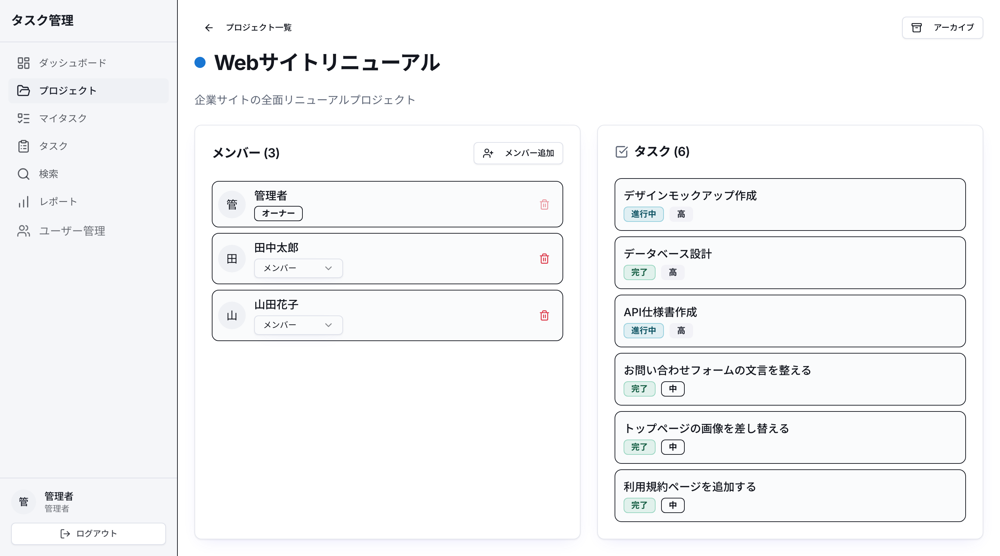
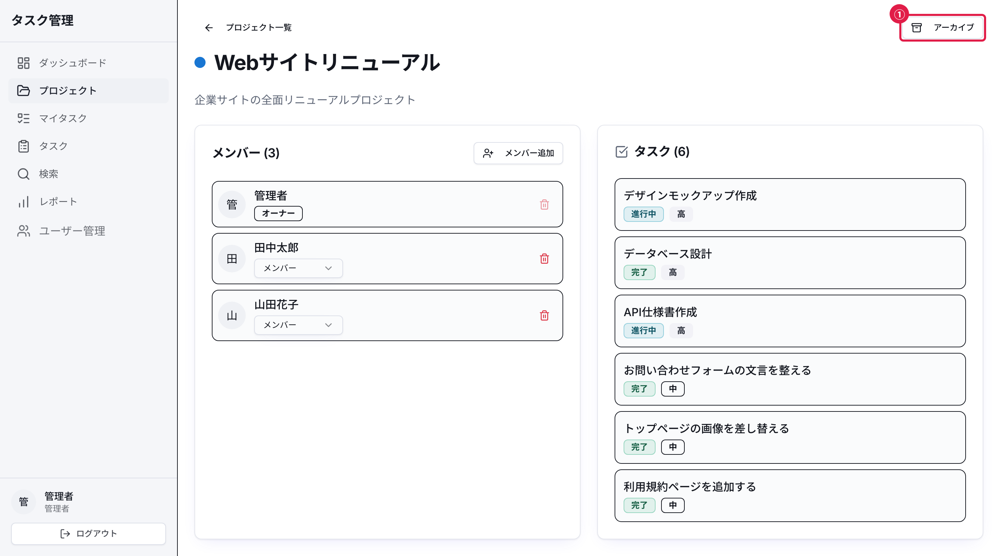
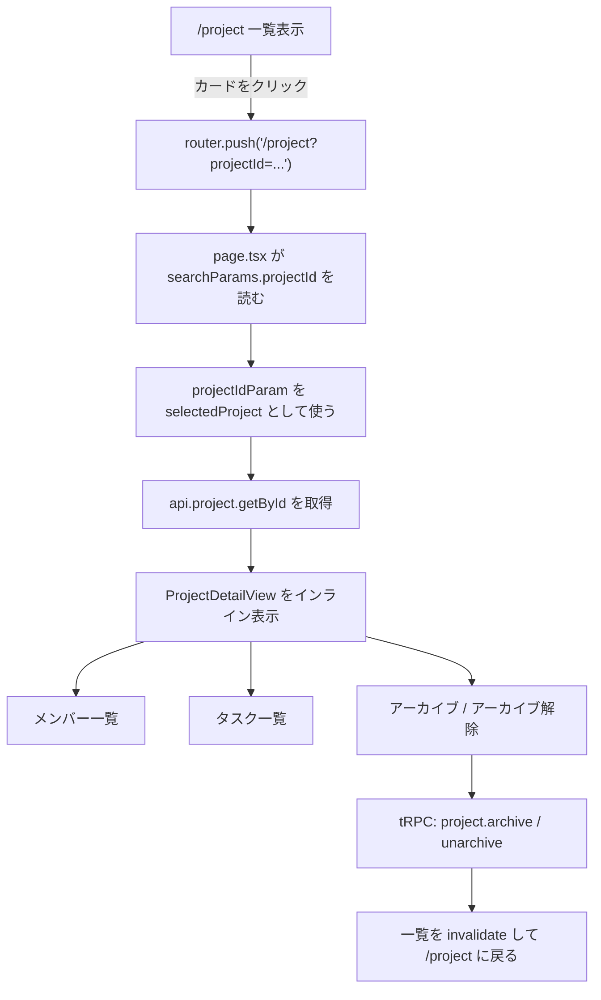
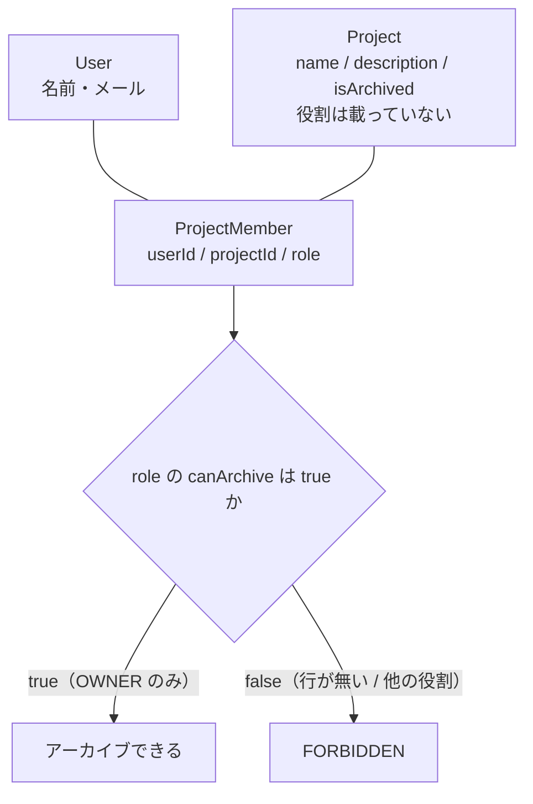
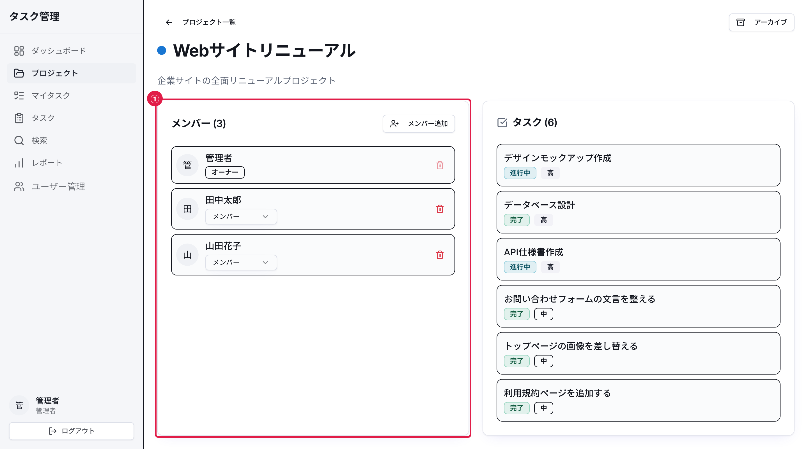

# Day 27: プロジェクト詳細・アーカイブを実装しよう

## 前回の振り返り

Day 26ではエラーページ（404・500）を実装し、予期せぬエラーが起きたときでもユーザーを安全に案内できるようにしました。今日はプロジェクト管理画面をさらに使いやすくするために、**プロジェクト詳細表示**と**アーカイブ機能**を実装します。

---

## 今日のゴール

プロジェクト一覧から1件を選ぶと同じ `/project` ページの中で **一覧表示から詳細表示へ切り替わる UI** を、完成形と照合して仕上げます。詳細画面では次の情報を扱います。





- プロジェクト名・色・説明
- メンバー一覧
- タスク一覧
- アーカイブ / アーカイブ解除

> **今日のゴールライン**: URLのprojectIdで一覧と詳細を切り替え、アーカイブまで同じページ内で扱える感覚を掴めれば大丈夫です。
>
> 現在の完成形は `ProjectDetailDialog` のモーダルではなく、`ProjectDetailView` を使った**インライン詳細表示**です。URL は `/project?projectId=xxx` のように変わり、同じページの中で一覧 ↔ 詳細を切り替えます。
>
> **この Day は Day 11・12 で作った機能の
> 統合確認です。** 以下のコードは完成状態との
> 照合用です。同じ名前の state、query、mutation、
> handler、Props を追加し直してはいけません。
> 不足がある場合だけ、該当箇所を補ってください。
>
> `project-detail-view.tsx` は写経の土台に完成した形で含まれています。
> Day 01 で `scaffold-from-scratch.sh` を走らせた時点で、手元に置かれています。
> 販売用 ZIP に入るのはこの土台までで、完成版の `src/` 一式は入っていません。
> この Day のコードブロックは**読んで見比べるためのもの**で、書き写す必要はありません。

## なぜこれを作るのか

プロジェクト管理アプリでは「このプロジェクトには誰が入っているのか」「今どんなタスクがあるのか」をすぐ確認できる必要があります。

今回は詳細を別ルートに分離するのではなく、一覧ページの延長として表示を切り替える構成にします。この構成には次の利点があります。

- URL に `projectId` が残るので再読み込みや共有に強い
- 一覧画面へ戻る導線をシンプルに保てる
- ページ全体の責務を `page.tsx` に集約しやすい

また、完了したプロジェクトは削除ではなく**アーカイブ**します。アーカイブは「使わないものを棚にしまう」イメージです。履歴は残したまま、普段の一覧からは外せます。

### 今日実装する全体像


```mermaid
flowchart TD
    A["/project 一覧表示"] -->|"カードをクリック"| B["router.push('/project?projectId=...')"]
    B --> C["page.tsx が searchParams.projectId を読む"]
    C --> D["projectIdParam を selectedProject として使う"]
    D --> E["api.project.getById を取得"]
    E --> F["ProjectDetailView をインライン表示"]
    F --> G["メンバー一覧"]
    F --> H["タスク一覧"]
    F --> I["アーカイブ / アーカイブ解除"]
    I --> J["tRPC: project.archive / unarchive"]
    J --> K["一覧を invalidate して /project に戻る"]
```

この図で目を留めてほしいのは B から C の流れです。カードをクリックしたとき`selectedProject` を直接書き換えてはいません。いったん URL を書き換え、そのあと `page.tsx` が URL を読み直します。`selectedProject` は読み取った値の別名です。遠回りに見えますが画面の状態を決める大元が URL 1か所にそろいます。だから再読み込みしてもリンクを人に送っても同じ詳細画面が開きます。

### やること / やらないこと

| やること | やらないこと |
|---------|-------------|
| 一覧 ↔ 詳細の表示切り替え | 詳細モーダルの新規採用 |
| 配布済みの `ProjectDetailView` の中身を完成形と照合する | タスクの編集機能 |
| アーカイブ / アーカイブ解除 | アーカイブ専用ページの新設 |
| メンバー追加・削除・権限変更の導線を照合する | メンバー管理 UI の新規追加 |

### 新しく学ぶ概念

| 概念 | 読み方 | 役割 | 例え |
|------|--------|------|------|
| `useSearchParams` | ユースサーチパラメータ | URL クエリを読む | ブラウザの住所欄から条件を読む |
| `router.push()` | ルータープッシュ | URL を変えて画面状態を切り替える | 本にしおりを挟んで場所を移す |
| `inferRouterOutputs` | インファー・ルーター・アウトプット | tRPC の戻り値から型を自動取得 | レシートから商品一覧の型を読む |
| アーカイブ | アーカイブ | 削除ではなく `isArchived` で隠す | 本棚の奥にしまう |

### 復習する概念

| 概念 | 初出 |
|------|------|
| `useState` / URLパラメータ | Day 10 以降 |
| コールバック Props | Day 15 以降 |
| `useQuery` / `useMutation` | Day 08 以降 |

---

## 実装ステップ一覧

| ステップ | 作業内容 | 所要時間 | 触るファイル | 成功状態 |
|---------|---------|---------|-------------|---------|
| Step 1 | アーカイブ API の完成形を読む | 5分 | `src/server/api/routers/project.ts` | `archive` / `unarchive` が呼べる |
| Step 2 | 一覧 ↔ 詳細の切り替えを読む | 8分 | `src/app/project/page.tsx` | カードクリックで詳細へ切り替わる |
| Step 3 | `ProjectDetailView` の型と骨格を確かめる | 8分 | `src/component/project/project-detail-view.tsx` | 戻るボタン付きの詳細画面が出る |
| Step 4 | メンバー一覧とタスク一覧の表示を確かめる | 10分 | `project-detail-view.tsx` | 主要情報が確認できる |
| Step 5 | アーカイブのつなぎ込みを確かめる | 5分 | `page.tsx`, `project-detail-view.tsx` | ボタンで状態が切り替わる |
| Step 6 | 補助ダイアログの置き場所を確かめる | 5分 | `src/app/project/page.tsx` | メンバー追加・削除確認も動く |

**合計時間**: 約41分です。

この時間はコードを読んで理解する目安です。写経して打ち込む時間、詰まって調べる時間は別に見てください。

---

### Step 1: アーカイブ API の完成形を読む（5分）

**ゴール**: `project.archive` と `project.unarchive` で `isArchived` を切り替えられるようにします。

Day 11 で実装済みならここではコードを追加せず
次の完成形と照合してください。同名 procedure を
追加すると重複定義になるため書き直しません。

まず前提です。アーカイブは**削除ではありません**。

| 方法 | 仕組み | 復元 | 向いている用途 |
|------|--------|------|---------------|
| 完全削除 | レコード自体を消す | 不可 | 本当に不要なデータ |
| アーカイブ | `isArchived` を切り替える | 可 | 過去プロジェクトの退避 |

Prisma スキーマに `isArchived` があることを確認します。

```prisma
model Project {
  id          String    @id @default(cuid())
  name        String
  description String?
  color       String    @default("#1976d2")
  isArchived  Boolean   @default(false) @map("is_archived")
  startDate   DateTime? @map("start_date")
  endDate     DateTime? @map("end_date")
  createdAt   DateTime  @default(now()) @map("created_at")
  updatedAt   DateTime  @updatedAt @map("updated_at")
}
```

現在の実装では`archive` と `unarchive` は共通ヘルパー `setArchiveStatus` を使っています。

```ts
// filepath: src/server/api/routers/project.ts
const setArchiveStatus = async (userId: string, projectId: string, isArchived: boolean) => {
  const userMember = await prisma.projectMember.findUnique({
    where: {
      userId_projectId: { userId, projectId },
    },
  });

  assertMemberPermission(userMember ? [userMember] : [], 'canArchive');

  return await prisma.project.update({
    where: { id: projectId },
    data: { isArchived },
  });
};
```

ポイントは次の2つです。

- 権限確認は `prisma.project` ではなく `prisma.projectMember` で行う
- `assertMemberPermission(..., 'canArchive')` でアーカイブ権限を明示する

`prisma.project` を引いてもそのユーザーがそのプロジェクトの何なのかは分かりません。役割が載っているのは `ProjectMember` の行のほうです。


```mermaid
flowchart TB
    U["User<br/>名前・メール"] --- M["ProjectMember<br/>userId / projectId / role"]
    P["Project<br/>name / description / isArchived<br/>役割は載っていない"] --- M
    M --> Q{"role の canArchive は true か"}
    Q -->|"true（OWNER のみ）"| OK["アーカイブできる"]
    Q -->|"false（行が無い / 他の役割）"| NG["FORBIDDEN"]
```

役割が載っているのは `ProjectMember` だけで、上の2つには入っていません。行が1つも見つからない人はそのプロジェクトに参加していない人です。

`assertMemberPermission` は渡された配列の先頭を見て行が1つも無ければ `FORBIDDEN` を返します。だから `findUnique` が `null` を返す「そもそも参加していない人」はここで止まります。第2引数の `'canArchive'` を渡すと役割の中身まで見ます。`canArchive` が `true` の役割は `OWNER` だけなので管理者でもアーカイブはできません。この引数を省くと「メンバーなら誰でもアーカイブできる」に意味が変わってしまいます。

ルーター本体はシンプルです。

```ts
// filepath: src/server/api/routers/project.ts
archive: protectedProcedure
  .input(z.object({ id: z.string().cuid() }))
  .mutation(async ({ ctx, input }) => {
    return await setArchiveStatus(ctx.session.userId, input.id, true);
  }),

unarchive: protectedProcedure
  .input(z.object({ id: z.string().cuid() }))
  .mutation(async ({ ctx, input }) => {
    return await setArchiveStatus(ctx.session.userId, input.id, false);
  }),
```

2つの procedure で違うのは最後に渡す `true` と `false` だけです。1つにまとめて現在値を反転させる作り方もできますがそうすると画面が送ってきた「今の状態」を信じることになります。同じプロジェクトを2人が開いていると反転した結果がお互いにずれます。呼ぶ名前で結果を決めておけばサーバーが受け取るのは「こうしたい」という最終状態だけです。`archive` を続けて2回呼んでも、`isArchived` は `true` のままで変わりません。権限確認をヘルパー1か所に寄せてあるので片方だけ確認を書き忘れる事故も起きません。

**確認ポイント**

- `archive` と `unarchive` の両方がある
- どちらも `setArchiveStatus` を使っている
- `getAll` は `isArchived` で一覧を絞り込める

---

### Step 2: 一覧 ↔ 詳細の切り替えを読む（8分）

**ゴール**: 一覧カードをクリックしたら URL の `projectId` を更新し、同じ `/project` ページ内で詳細表示へ切り替えます。

この値、query、handler、描画分岐は
Day 11・12 で実装済みです。以下は追加手順ではなく
照合用です。同名の宣言があれば変更しません。

現在の完成形では`page.tsx` が**画面全体の分岐役**です。

- `projectId` が無いとき: 一覧を表示
- `projectId` があるとき: `ProjectDetailView` を表示

まず `searchParams` から詳細IDを読みます。

```ts
// filepath: src/app/project/page.tsx
const searchParams = useSearchParams();
const projectIdParam = searchParams.get('projectId');
const router = useRouter();

const selectedProject = projectIdParam;
```

`selectedProject` は詳細取得用の ID です。実際の切り替えトリガーは URL に置いているので再読み込みしても状態を復元できます。

詳細データの取得は `selectedProject` があるときだけ行います。

```ts
// filepath: src/app/project/page.tsx
const {
  data: projectDetail,
  isLoading: projectDetailLoading,
  isError: projectDetailError,
  isFetching: projectDetailFetching,
  error: projectDetailQueryError,
  refetch: refetchProjectDetail,
} = api.project.getById.useQuery(
  { id: selectedProject ?? '' },
  {
    enabled: !!selectedProject,
    retry: shouldRetryProjectQuery,
  },
);
```

詳細のデータ・待機・失敗・再取得を別々に受け取ります。まだ応答が無い状態を「見つかりません」と誤って扱わないためです。

`enabled` は一覧を見ている間の通信を止めます。取得中・失敗・再取得中を別々に受け取るため、応答待ちを「見つかりません」と誤表示しません。`retry` は 401・403・404 を繰り返さず、通信失敗だけを再試行します。

カードクリック時は `router.push()` で URL を変えます。

```ts
// filepath: src/app/project/page.tsx
const handleProjectClick = (projectId: string) => {
  router.push(`/project?projectId=${projectId}`);
};

const handleDetailClose = () => {
  router.push('/project');
};
```

どちらのハンドラーも URL だけを書き換えます。`selectedProject` は `projectIdParam` の別名なので、URL を唯一の起点にできます。ブラウザの戻るボタンでも URL と詳細表示が同じ描画で切り替わります。

詳細を返す前に、Day 11から引き継いだ取得状態の分岐も確認します。

**表示に必要な取得状態**

```typescript
// filepath: src/app/project/page.tsx
  const viewingDetail = Boolean(selectedProject);
  const queryErrors = viewingDetail
    ? [
        currentUserError ? currentUserQueryError : null,
        projectDetailError
          ? projectDetailQueryError
          : null,
      ]
    : [
        currentUserError ? currentUserQueryError : null,
        projectsError ? projectsQueryError : null,
      ];
  const authFailed = queryErrors.some(isAuthError);
  const forbidden = queryErrors.some(isForbiddenError);
  const notFound = viewingDetail
    && projectDetailError
    && httpStatusOf(projectDetailQueryError) === 404;
```

URLに詳細IDがあるかで対象の問い合わせを選びます。401・403・404を先に判定し、保護されたキャッシュや誤った内容を表示しないためです。

```typescript
// filepath: src/app/project/page.tsx
  const hasFetchError = viewingDetail
    ? currentUserError || projectDetailError
    : currentUserError || projectsError;
  const hasRequiredData =
    (!currentUserError || currentUser != null)
    && (viewingDetail
      ? !projectDetailError || projectDetail != null
      : !projectsError || projects != null);
  const requiredLoading = currentUserLoading
    || (viewingDetail
      ? projectDetailLoading
      : projectsLoading);
  const requiredFetching = currentUserFetching
    || (viewingDetail
      ? projectDetailFetching
      : projectsFetching);
```

エラーの有無と利用できるデータの有無を別々に判定します。初回失敗ではエラー画面を出し、再取得失敗では既存データを残すためです。

```typescript
// filepath: src/app/project/page.tsx
  const refetchRequiredData = () => {
    void refetchCurrentUser();
    if (viewingDetail) {
      void refetchProjectDetail();
      return;
    }
    void refetchProjects();
  };

  if (requiredLoading
    && !authFailed && !forbidden && !notFound) {
    return (
      <AppLayout>
        <PageLoadingSpinner />
      </AppLayout>
    );
  }
```

`viewingDetail` によって一覧と詳細のどちらを判定対象にするかを切り替えます。詳細取得中は `ProjectDetailView` へ進まないため、「見つかりません」という誤表示は出ません。

エラー表示は見出し・説明・移動先が一体になった分岐です。途中で分けると三項演算子と閉じタグの対応を確認できないため、ここは完成したコピー単位で載せます。

<!-- code-block-length-exception: complete-copy-unit -->
```tsx
// filepath: src/app/project/page.tsx
  if (authFailed || forbidden || notFound
    || (hasFetchError && !hasRequiredData)) {
    return (
      <AppLayout>
        <div className="flex flex-col items-center justify-center py-24 text-center">
          <p className="mb-2 text-base font-semibold text-foreground">
            {authFailed
              ? 'ログインの有効期限が切れました'
              : forbidden
                ? 'このプロジェクトを見る権限がありません'
                : notFound
                  ? 'プロジェクトが見つかりません'
                  : 'プロジェクトを取得できませんでした'}
          </p>
          <p className="mb-6 text-sm text-muted-foreground">
            {authFailed
              ? 'もう一度ログインしてください。'
              : forbidden
                ? '権限が必要です。プロジェクトの管理者に確認してください。'
                : notFound
                  ? '削除されたか、URLが正しくない可能性があります。'
                  : '通信状況を確認して、再読み込みしてください。'}
          </p>
          <Button
            type="button"
            onClick={() => {
              if (authFailed) {
                router.push('/login');
                return;
              }
              if (forbidden || notFound) {
                router.push('/project');
                return;
              }
              refetchRequiredData();
            }}
            disabled={requiredFetching}
          >
            {authFailed
              ? 'ログイン画面へ'
              : forbidden || notFound
                ? 'プロジェクト一覧へ'
                : '再読み込み'}
          </Button>
        </div>
      </AppLayout>
    );
  }
```

401・403・404では取得済みデータも隠します。初回の通信失敗には再読み込みを出します。権限が確かめられない画面に前回の一覧を残すと、見てはいけない人の画面に古いデータが出続けます。通信失敗はデータを失っていないので、画面ごと消さず取り直す手段を置きます。

```tsx
// filepath: src/app/project/page.tsx
  const staleDataWarning = hasFetchError ? (
    <div
      role="alert"
      className="flex items-center justify-between gap-4 rounded-lg border border-amber-300/60 bg-amber-50 px-4 py-3 text-sm text-amber-900 dark:border-amber-500/40 dark:bg-amber-950/40 dark:text-amber-200"
    >
      <span>
        最新のプロジェクト情報を取得できませんでした。前回取得時の内容です。
      </span>
      <Button
        type="button"
        variant="outline"
        size="sm"
        onClick={refetchRequiredData}
        disabled={requiredFetching}
      >
        再試行
      </Button>
    </div>
  ) : null;
```

再取得だけが失敗して以前のデータが残っている場合は、内容を消さず警告と再試行を添えます。`role="alert"` を付けるのは画面リーダーがこの帯を変化として読み上げるようにするためです。帯は `hasFetchError` が真の間だけ出るので、取り直しに成功すれば消えます。

最後に `viewingDetail` で描画を分岐します。

```tsx
// filepath: src/app/project/page.tsx
if (viewingDetail) {
  return (
    <AppLayout>
      <div className="space-y-4">
        {staleDataWarning}
        <ProjectDetailView
          projectDetail={projectDetail}
          onBack={handleDetailClose}
          onAddMemberClick={() => setMemberDialogOpen(true)}
          onRemoveMember={handleRemoveMember}
          onUpdateMemberRole={handleUpdateMemberRole}
          onArchive={handleArchive}
          canManageMembers={canManageMembers}
          canArchive={canArchiveProject}
        />
      </div>
    </AppLayout>
  );
}
```

この分岐で `return` すると、下にある一覧の JSX には進みません。`viewingDetail` は URL に詳細IDがあるかを表し、直接開いた初回から読み込み分岐へ入ります。`ProjectDetailView` はデータを自分で取得しないため、取得済みデータと操作用の props を親から渡します。

**確認ポイント**

- 一覧クリックで `/project?projectId=...` に変わる
- URL を直接開いても詳細が表示される
- 戻るボタンで `/project` に戻る

---

### Step 3: `ProjectDetailView` の型と骨格を確かめる（8分）

**ゴール**: モーダルではなく、ページ内に表示する詳細ビューコンポーネントの中身を読みます。

scaffold で配布済みのファイルを削除したり、
5 props の旧形式へ置き換えたりしないでください。
現在の8 props 契約を、次の完成形と照合します。

まず tRPC の戻り値から型を取ります。

```ts
// filepath: src/component/project/project-detail-view.tsx
import type { inferRouterOutputs } from '@trpc/server';
import type {
  ProjectMemberRole,
} from '@/lib/constant/roles';
import type { AppRouter } from '@/server/api/root';

type RouterOutputs = inferRouterOutputs<AppRouter>;
type ProjectDetail = RouterOutputs['project']['getById'];
```

ここで `ProjectDetail` の中身を自分で書き並べないのが肝心なところです。`inferRouterOutputs` はサーバー側の手続きが実際に返す形をそのまま取り出して型にしてくれます。Day 09 の `getAll` でメンバーとタスクを `include` して返したように`getById` も関連データを一緒に返します。その入れ子の形まで自動で付いてくるので`{ id: string; name: string; ... }` と手で書く必要はありません。手書きにするとあとで `include` を1つ増やしたときに画面側の型だけが古いまま取り残されます。

Props は次の形です。

```ts
// filepath: src/component/project/project-detail-view.tsx
interface ProjectDetailViewProps {
  projectDetail: ProjectDetail | null | undefined;
  onBack: () => void;
  onAddMemberClick: () => void;
  onRemoveMember: (userId: string) => void;
  onUpdateMemberRole: (
    userId: string,
    role: ProjectMemberRole,
  ) => void;
  onArchive: (projectId: string, isArchived: boolean) => void;
  canManageMembers: boolean;
  canArchive: boolean;
}
```

8つとも `?` を付けていません。つまり全部必須です。`?` は「渡さなくてもよい」という意味で、渡し忘れても型検査が通ります。`canManageMembers` のような権限の値でそれをやると渡し忘れがそのまま「ボタンが出ない」という不具合になり、しかもエラーは出ません。必須にしておけば呼ぶ側が忘れた時点でエラーが出ます。Day 11 の呼び出し（`onUpdateMemberRole={() => {}}` など）はこの8つを全部渡しているので必須にしても型エラーにはなりません。

8つと聞くと多く感じますが中身は2種類しかありません。`projectDetail` と `canManageMembers` / `canArchive` は「表示に必要な材料」、`on` で始まる5つは「押されたことを親に伝える窓口」です。裏を返すと`ProjectDetailView` は mutation を1つも持ちません。通信も権限の判定もこの部品の仕事ではありません。Day 15 以降で使ってきたコールバック Props と同じ考え方で、判断は `page.tsx` に集めます。こう分けておくとあとで詳細を別ページへ移したくなったときも、この部品はそのまま持っていけます。

現在の完成形はデータが見つからないケースも自前で処理します。

```tsx
// filepath: src/component/project/project-detail-view.tsx
if (!projectDetail) {
  return (
    <div className="flex flex-col items-center justify-center py-24 text-muted-foreground">
      <p>プロジェクトが見つかりません。</p>
      <Button variant="ghost" className="mt-4" onClick={onBack}>
        <ArrowLeft className="mr-2 h-4 w-4" />
        プロジェクト一覧に戻る
      </Button>
    </div>
  );
}
```

Props の型が `ProjectDetail | null | undefined` なので、この `if` は部品を単独で使ったときの防御になります。ただし現在の `page.tsx` は、この部品を呼ぶ前に取得状態を判定します。取得中はスピナー、初回500は再読み込み、401・403は権限案内、404は不在案内を親が返すため、通常の画面操作で `undefined` のままこの部品へ進みません。ここを通り抜けた先ではTypeScript が「`projectDetail` には必ず中身がある」と判断します。だからこの後に出てくる `projectDetail.color` や `projectDetail.name` を、`?.` を付けずにそのまま書けます。逆にこの `if` を消すと以降の参照で型エラーが出ます。

詳細ビュー本体の骨格はこうなります。

```tsx
// filepath: src/component/project/project-detail-view.tsx
return (
  <div className="flex flex-col gap-6">
    <div className="flex items-center justify-between">
      <div className="flex items-center gap-4">
        <Button variant="ghost" size="sm" onClick={onBack}>
          <ArrowLeft className="mr-2 h-4 w-4" />
          プロジェクト一覧
        </Button>
        <div className="flex items-center gap-3">
          <div
            className="h-4 w-4 rounded-full flex-shrink-0"
            style={{ backgroundColor: projectDetail.color }}
          />
          <h1 className="text-3xl font-bold tracking-tight">{projectDetail.name}</h1>
        </div>
      </div>
    </div>

    {projectDetail.description && (
      <p className="text-muted-foreground">{projectDetail.description}</p>
    )}

    <div className="grid gap-6 lg:grid-cols-2">
```

先に外枠だけを置いています。上から順に、戻るボタンと色の丸と名前を1行に並べたヘッダー、説明文、そして下半分に来る2カラムの入れ物、という3段構えです。`projectDetail.description && (...)` としてあるので説明が空のプロジェクトでは段落そのものが出ません。空の `<p>` が残って行間だけ空くのを防げます。`lg:grid-cols-2` は Day 09 のグリッドと同じ考え方で、画面が広いときだけ横2列にします。スマートフォンの幅ではメンバーとタスクが縦に積まれます。

なお最後の `<div className="grid ...">` は開いたままです。閉じタグは次のブロックにあります。手元のファイルではすでに閉じているのでそちらと見比べてください。

```tsx
      {/* filepath: src/component/project/project-detail-view.tsx（同じファイルの続き） */}
      {/* Step 4 でメンバー一覧とタスク一覧を入れる */}
    </div>
  </div>
);
```

閉じタグが2つ並ぶだけのブロックですがどれがどれを閉じるかを数えておいてください。1つ目の `</div>` が `grid gap-6 lg:grid-cols-2` を、2つ目が一番外側の `flex flex-col gap-6` を閉じます。JSX は開いたタグが閉じていないとビルドで止まるのでこの2行がそろって初めてファイルが成り立ちます。中のコメント行は Step 4 で読む中身の目印です。2カラムの入れ物があり、そこにカードが入る、という並びを頭に入れておいてください。

**確認ポイント**

- モーダルの `Dialog` は使っていない
- 戻るボタンは `onBack` で親に処理を委譲している
- 詳細画面は 2 カラムのカード構成になっている

---

### Step 4: メンバー一覧とタスク一覧の表示を確かめる（10分）

**ゴール**: `ProjectDetailView` の中に並ぶ、メンバー一覧とタスク一覧の 2 つのカードを読みます。ここに載せるのは完成版を少し削った形です。削ってある部分はそれぞれのカードの後ろで説明します。

Day 12 で実装済みなら以下は読み比べだけ行います。
既存の権限制御やロール変更 UI を残してください。

メンバーカードは `Card` と `Avatar` を使って構成します。

```tsx
{/* filepath: src/component/project/project-detail-view.tsx */}
<Card>
  <CardHeader className="flex flex-row items-center justify-between space-y-0 pb-4">
    <CardTitle className="text-lg">
      メンバー ({projectDetail.members?.length ?? 0})
    </CardTitle>
    <Button variant="outline" size="sm" onClick={onAddMemberClick}>
      <UserPlus className="mr-2 h-4 w-4" /> メンバー追加
    </Button>
  </CardHeader>
  <CardContent>
    <div className="grid gap-2">
      {projectDetail.members?.map((member) => (
        <div
          key={member.id}
          className="flex items-center justify-between p-2 rounded-lg border bg-muted/30"
        >
          <div className="flex items-center gap-3">
            <Avatar>
              {member.user?.avatar && <AvatarImage src={member.user.avatar} alt="" />}
              <AvatarFallback>
                {(member.user?.name || member.user?.email || '?')[0]?.toUpperCase()}
              </AvatarFallback>
            </Avatar>
```

`Avatar` の中を2段構えにしているのはアイコン画像を持たないメンバーがいるからです。`member.user?.avatar` があるときだけ `AvatarImage` を出し、無ければ `AvatarFallback` が受け止めて名前かメールの1文字目を大文字にして丸の中に置きます。`(member.user?.name || member.user?.email || '?')` と3段に重ねてあるのは名前とメールが両方空だったときに `?` を出すためです。ここを `member.user.name[0]` と素直に書くと名前が空のメンバーが1人いるだけで、描画の途中で例外が飛びます。Day 26 で `error.tsx` を置いたので行き先は真っ白な画面ではなく、あのエラーページです。それでも、1人分のデータ欠けで詳細画面ごと消える点は変わりません。

`<Avatar>` を閉じた直後で切れているので続きを次のブロックで書きます。

```tsx
            {/* filepath: src/component/project/project-detail-view.tsx（同じファイルの続き） */}
            <div>
              <p className="font-medium">{member.user?.name || member.user?.email || '不明'}</p>
              <Badge variant="outline" className="text-xs">
                {isProjectMemberRole(member.role)
                  ? PROJECT_MEMBER_ROLE_LABELS[member.role]
                  : member.role}
              </Badge>
            </div>
          </div>
          <Button
            variant="ghost"
            size="icon"
            aria-label={`${member.user?.name || member.user?.email || '不明'}をプロジェクトから削除`}
            onClick={() => onRemoveMember(member.userId)}
            disabled={member.role === PROJECT_MEMBER_ROLE.OWNER}
          >
            <Trash2 className="h-4 w-4 text-destructive" />
          </Button>
        </div>
      ))}
    </div>
  </CardContent>
</Card>
```

この一覧でいちばん大事な1行は削除ボタンの `disabled={member.role === PROJECT_MEMBER_ROLE.OWNER}` です。最後のオーナーを消せてしまうとそのプロジェクトを操作できる人が誰も残らず、誰も直せない状態のプロジェクトが残ります。押せない見た目にしておけばうっかりクリックがそこで止まります。ここでは相手がオーナーなら一律で押せなくしているのでオーナーが2人以上いるプロジェクトでも片方を外せません。サーバー側の `removeMember` は2段構えで止めます。オーナー以外がオーナーを外そうとしたら `FORBIDDEN` で拒み、そのうえでオーナーが1人しか残っていなければ `BAD_REQUEST` で拒みます。つまりオーナー同士なら2人目以降を外せるので一律で押させない画面のほうが厳しい作りです。安全側に倒した分、オーナーの入れ替えは画面からはできません。ただし画面側の `disabled` は入口の防波堤にすぎません。本当の門番は Step 1 で見た `assertMemberPermission` で、そちらが最後に権限を確かめます。ロール名を `PROJECT_MEMBER_ROLE_LABELS` に通しているのも同じ発想で、`'OWNER'` という英字をそのまま出さず、他の画面と同じ日本語のラベルにそろえます。

削除ボタンはアイコン1つなので`aria-label` で名前を付けています。Day 16 で見たとおり、名前が無いと読み上げでは同じボタンが人数分並ぶだけになり、どの行を押しているのか分かりません。

ここで書いたメンバーカードは完成版から2つ削ってあります。完成版はロール名をただのラベルではなく `Select` で出し、その場で権限を変えられます。さらに `canManageMembers` が false の人には `Select` と削除ボタンを見せず、ラベルだけの読み取り専用にします。今日はまず一覧を出すところまでで、この出し分けは Day 12 で書いた既存のコードにそのまま残しておいて問題ありません。

タスクカードは 0 件のときの表示も入れておくのがポイントです。

```tsx
{/* filepath: src/component/project/project-detail-view.tsx */}
<Card>
  <CardHeader className="space-y-0 pb-4">
    <div className="flex items-center gap-2">
      <CheckSquare className="h-5 w-5 text-muted-foreground" />
      <CardTitle className="text-lg">タスク ({projectDetail.tasks?.length ?? 0})</CardTitle>
    </div>
  </CardHeader>
  <CardContent>
    <div className="grid gap-2">
      {projectDetail.tasks?.length === 0 ? (
        <p className="text-sm text-muted-foreground text-center py-4">
          タスクがありません。
        </p>
      ) : (
        projectDetail.tasks?.map((task) => (
          <div
            key={task.id}
            className="flex flex-col gap-1 p-3 rounded-lg border bg-muted/30 hover:bg-muted/50 transition-colors"
          >
            <p className="font-medium">{task.title}</p>
            <div className="flex gap-2">
              <StatusBadge status={task.status} />
```

タスクカードで先に書いてあるのは0 件のときの分岐です。`projectDetail.tasks?.length === 0` を最初に見て空なら「タスクがありません。」の1行だけを出します。これが無いとタスクを作っていないプロジェクトでは枠の中が空のまま残ります。読み込み中と失敗は手前の `if (!projectDetail)` が受け止めているのでここへ来た時点での0件は「まだタスクが無い」以外にありません。それを1行で言い切っておくと画面が壊れているのかタスクが無いだけなのかで読者が迷いません。`StatusBadge` はタスク一覧でも使っている共通の部品で、`task.status` を渡すだけで状態に応じた色の札になります。ここで色分けを直に書かないので状態の色を変えたいときは部品側を1か所直すだけで全画面に効きます。

見出しの件数も、完成版とは数え方が違います。ここでは `projectDetail.tasks?.length ?? 0` として全件を数えますが完成版はキャンセル済みを外した件数を `タスク (3)` のように出し、外した分を「（キャンセル済 1）」と脇に添えます。Day 21 の統計カードと同じで、中止したタスクを混ぜると「今動いている作業の量」として読めなくなるためです。今日は数え分けまでは踏み込まずまず一覧が出る状態を作ります。

こちらも `<div>` の途中で切れています。続きを次のブロックで書きます。

```tsx
              {/* filepath: src/component/project/project-detail-view.tsx（同じファイルの続き） */}
              <Badge variant={getPriorityBadgeVariant(task.priority)}>
                {TASK_PRIORITY_LABELS[task.priority] ?? task.priority}
              </Badge>
            </div>
          </div>
        ))
      )}
    </div>
  </CardContent>
</Card>
```

優先度の札だけは専用の部品にせず、共通の `Badge` に `variant` を渡す形にしています。色を決める役目は `getPriorityBadgeVariant` が持っていて`URGENT` なら `destructive`、`HIGH` なら `default`、`MEDIUM` なら `secondary`、残りは `outline` を返します。ここで `task.priority === 'URGENT' ? ... : ...` と書き始めると同じ優先度がタスク一覧と詳細で違う色になっていきます。文字のほうは `TASK_PRIORITY_LABELS[task.priority]` を通して「緊急」「高」「中」「低」の日本語にします。`?? task.priority` を添えてあるのは対応表で見つからない値が届いても札を空にしないためです。

**確認ポイント**

- メンバー追加ボタンがヘッダー右上にある
- オーナーの削除ボタンは無効化される
- タスク 0 件でも空表示で崩れない

---

### Step 5: アーカイブのつなぎ込みを確かめる（5分）

**ゴール**: 詳細画面上部のボタンで `archive` / `unarchive` を切り替えられるようにします。

Day 11 で作った mutation と handler があれば
追加し直さず、次の条件を満たすか確認します。

`ProjectDetailView` 側では「どちらを呼ぶか」は判断せず、現在状態だけを親へ渡します。

```tsx
{/* filepath: src/component/project/project-detail-view.tsx */}
<Button
  variant="outline"
  onClick={() => onArchive(projectDetail.id, projectDetail.isArchived)}
>
  {projectDetail.isArchived ? (
    <>
      <ArchiveRestore className="mr-2 h-4 w-4" /> アーカイブ解除
    </>
  ) : (
    <>
      <Archive className="mr-2 h-4 w-4" /> アーカイブ
    </>
  )}
</Button>
```

このボタンは `archive` と `unarchive` のどちらを呼ぶかを決めていません。親に渡しているのは `projectDetail.isArchived`、つまり今どちらの状態なのかという事実だけです。判断を親に預けておくとあとで「アーカイブ前に確認ダイアログを挟む」と決めても直すのは `page.tsx` の1か所で済みます。表示のほうは `isArchived` を見て文字とアイコンを入れ替えるのでアーカイブが成功して詳細のデータが取り直されるとラベルも自動で反対側へ変わります。押すたびに文字を書き換える処理を自分で持つ必要はありません。

親の `page.tsx` では2つの mutation を持ちます。Day 12で追加した `getById.invalidate()` も残してください。これが詳細の古いアーカイブ状態を更新対象にします。

```ts
// filepath: src/app/project/page.tsx
const archiveMutation = api.project.archive.useMutation({
  onSuccess: () => {
    utils.project.getAll.invalidate();
    utils.project.getById.invalidate();
    router.push('/project');
  },
});

const unarchiveMutation = api.project.unarchive.useMutation({
  onSuccess: () => {
    utils.project.getAll.invalidate();
    utils.project.getById.invalidate();
    router.push('/project');
  },
});
```

2つの mutation で `onSuccess` の中身がそろっているのはどちらも「一覧の中身が変わった」という同じ結果を生むからです。`utils.project.getAll.invalidate()` はtRPC が手元に持っている一覧のデータに古いという印を付けて次に表示されるときに取り直させます。これを忘れるとアーカイブしたはずのプロジェクトが一覧に残って見えます。サーバー側は正しく更新されているのに画面だけが古い、という一番気付きにくいずれ方です。続く `router.push('/project')` で詳細から一覧へ戻すので読者は取り直された一覧をその場で確かめられます。

切り替え関数は次の通りです。

```ts
// filepath: src/app/project/page.tsx
const handleArchive = (projectId: string, isArchived: boolean) => {
  const mutation = isArchived ? unarchiveMutation : archiveMutation;
  mutation.mutate({ id: projectId });
};
```

3行しかありませんがこの関数がアーカイブ機能の分かれ道です。受け取る `isArchived` は今の状態なので`true`（すでにアーカイブ済み）なら呼ぶのは `unarchiveMutation` のほうです。渡ってくるのは現在で、呼ぶのは反対側、と覚えてください。ここを逆にするとアーカイブ済みのプロジェクトをもう一度アーカイブする通信になります。エラーにはならず、ボタンを押しても何も変わらないので原因を見つけるのに時間がかかります。`useMutation` の戻り値をいったん変数に入れてから `mutate` を呼べるのは戻り値がただのオブジェクトだからです。おかげで `if` を2つに分けて同じ `mutate` を2回書かずに済みます。

**確認ポイント**

- 未アーカイブなら「アーカイブ」と表示される
- アーカイブ済みなら「アーカイブ解除」と表示される
- 成功後は `/project` に戻って一覧が更新される

---

### Step 6: 補助ダイアログの置き場所を確かめる（5分）

**ゴール**: 詳細表示はインラインのままにしつつ、補助的なモーダルだけ `page.tsx` 側で扱う現在構成を完成させます。

Day 12 で実装済みのダイアログや state は
再宣言しません。以下は配置と動作の確認用です。

ここが少し重要です。**いまも `Dialog` は使っていますが詳細表示のためではありません。**

- `ProjectDialog`: プロジェクト作成 / 編集用
- メンバー追加用 `Dialog`
- 削除確認用 `DeleteConfirmDialog`

つまり現在の役割分担はこうです。

| コンポーネント | 役割 |
|---------------|------|
| `ProjectDetailView` | 詳細をインライン表示する |
| `ProjectDialog` | プロジェクト作成・編集 |
| `DeleteConfirmDialog` | 削除確認 |

メンバー削除は即時実行ではなく、確認ダイアログを挟みます。

```ts
// filepath: src/app/project/page.tsx
const handleRemoveMember = (userId: string) => {
  setRemoveMemberTargetId(userId);
  setRemoveMemberDialogOpen(true);
};
```

この関数は削除そのものを行いません。誰を消すのかを `removeMemberTargetId` に覚えてダイアログを開くところまでです。実際に消すのは次に置く `DeleteConfirmDialog` の `onConfirm` の中です。ここで即座に mutation を呼ぶ形にすると押し間違いがそのままメンバーの削除になります。取り消せない操作では「対象を覚える」と「実行する」を2段に分ける、という形を覚えてください。`ProjectDetailView` 側が `onRemoveMember` を呼ぶだけで済んでいるのも、この2段を親が引き受けているからです。

```tsx
{/* filepath: src/app/project/page.tsx */}
<DeleteConfirmDialog
  open={removeMemberDialogOpen}
  onOpenChange={setRemoveMemberDialogOpen}
  onConfirm={() => {
    if (selectedProject && removeMemberTargetId) {
      removeMemberMutation.mutate({
        projectId: selectedProject,
        userId: removeMemberTargetId,
      });
    }
  }}
  isPending={removeMemberMutation.isPending}
  title="このメンバーを削除しますか？"
/>
```

`onConfirm` の中で `selectedProject && removeMemberTargetId` を確かめてから `mutate` を呼びます。`selectedProject` の型は `string | null` なのでこの確認が無いと `projectId` に `null` が入りうる形になり、TypeScript が先に止めます。`isPending` を渡しているのは通信の返事を待つ間にボタンを押せなくするためです。`DeleteConfirmDialog` は `isPending` が `true` の間、削除ボタンの文字を「削除中...」に変えてキャンセルも含めて `disabled` にします。これが無いと連打で同じ削除要求が何本も飛びます。`title` を上書きしているのは既定の文言が削除対象を名指ししない一般的な言い回しで、プロジェクトそのものの削除と見分けが付かないためです。

これで完成です。

**確認ポイント**:
- メンバー削除は確認ダイアログを挟んで実行される
- 詳細表示そのものはインライン表示のままになっている



---

## 現在の完成形の流れ

1. 一覧カードをクリックする
2. `router.push('/project?projectId=...')` が走る
3. `page.tsx` が `projectId` を読み、`selectedProject` という別名で使う
4. `api.project.getById` が有効化される
5. `ProjectDetailView` が表示される
6. 戻る・アーカイブ・メンバー操作は親の `page.tsx` が処理する

---

## 設計の変化メモ

この章の古い教材や一部のコードには `ProjectDetailDialog` という名前が残っていることがあります。これは**以前のモーダル設計の名残**です。

現在の完成形は次のとおりです。

- 詳細表示の本体は `src/component/project/project-detail-view.tsx`
- 画面遷移の制御は `src/app/project/page.tsx`

という構成になっています。

`src/component/project/project-detail-dialog.tsx` というファイル自体は残っていても現行の `page.tsx` では詳細表示に使っていません。教材では**現行の実装に合わせて `ProjectDetailView` を正解とします。**

---

## ファイル構成の確認

| ファイル | 内容 | Step |
|---------|------|------|
| `src/server/api/routers/project.ts` | アーカイブ API | Step 1 |
| `src/app/project/page.tsx` | 一覧 ↔ 詳細の切り替え、各種 mutation | Step 2, 5, 6 |
| `src/component/project/project-detail-view.tsx` | 詳細表示本体 | Step 3, 4, 5 |
| `src/component/project/project-dialog.tsx` | プロジェクト作成 / 編集ダイアログ | Step 6 |

---

### Pro パターンで書こう（アーカイブ状態の絞り込みは配列メソッドで選ぶ）

絞り込み条件を配列メソッドで並べると条件が増えても追記だけで対応でき、見渡しが保てます。
なぜ直前の1文の書き方をするのか、**Before/After** で見比べてみましょう。

#### Before（改善前のコード）

```typescript
type ProjectListItem = {
  id: string;
  name: string;
  isArchived: boolean;
};

type ArchiveFilter = 'active' | 'archived' | 'all';
```

**読み比べ用**: ここは写経しません。続けてコードを読み進めましょう。

`ArchiveFilter` は3つの文字列だけを許す型なので`'finished'` のような綴り違いを渡すと TypeScript が先に止めてくれます。ここまでは Before と After で共通です。次のブロックからこの3つを処理へ結びつける書き方が分かれます。

```typescript
export function filterProjectsByArchiveStatus(
  projects: ProjectListItem[],
  filter: ArchiveFilter,
) {
  if (filter === 'active') {
    return projects.filter((project) => !project.isArchived);
  }

  if (filter === 'archived') {
    return projects.filter((project) => project.isArchived);
  }

  if (filter === 'all') {
    return projects;
  }

  return projects;
}
```

**このコードの問題点**:

- `if` が増えるほどどの条件が一覧のルールなのか見渡しにくくなる
- 新しい絞り込み条件を足すと関数の中に分岐がさらに増える
- `filter` の値と実際の絞り込み処理が離れているためUI 側の選択肢と対応づけにくい

#### After（プロが書くコード）

```typescript
type ProjectListItem = {
  id: string;
  name: string;
  isArchived: boolean;
};

type ArchiveFilter = 'active' | 'archived' | 'all';
```

**読み比べ用**: ここは写経しません。続けてコードを読み進めましょう。

型の定義は Before とまったく同じです。書き換えるのはこの3つの値と処理をどこで結びつけるか、その1点だけです。型を触らずに組み立て方だけを差し替えられる、という確認も兼ねています。

```typescript
const ARCHIVE_FILTERS: Array<{
  key: ArchiveFilter;
  apply: (projects: ProjectListItem[]) => ProjectListItem[];
}> = [
  {
    key: 'active',
    apply: (projects) => projects.filter((project) => !project.isArchived),
  },
  {
    key: 'archived',
    apply: (projects) => projects.filter((project) => project.isArchived),
  },
  {
    key: 'all',
    apply: (projects) => projects,
  },
];
```

**読み比べ用**: ここは写経しません。続けてコードを読み進めましょう。

ここで効いているのは配列の要素が `key` と `apply` の組になっている点です。`'active'` という選択肢の名前と「アーカイブ済みを除く」という処理が同じ1つの要素の中で隣り合います。Before では選択肢の名前と処理が `if` を挟んで数行離れていました。並べて置くと画面の絞り込みメニューの選択肢をこの配列から作る、といった使い回しもできます。

```typescript
export function filterProjectsByArchiveStatus(
  projects: ProjectListItem[],
  filter: ArchiveFilter,
) {
  const archiveFilter = ARCHIVE_FILTERS.find((item) => item.key === filter);

  return archiveFilter?.apply(projects) ?? projects;
}
```

**このコードの強み**:

- 絞り込み条件が配列にまとまり、選択肢と処理の対応が一覧できる
- 新しい条件を足すときは `ARCHIVE_FILTERS` に1要素追加するだけで済む
- `find` で対象ルールを選ぶ形なので分岐のネストが増えにくい

#### 覚えておきたいエッセンス

同じ値を見て分岐する `if` が並び始めたら
「条件と処理を配列にして選ぶ」形にできないか考えます。

## 完成コード全体

今日は3つのファイルを扱いました。各 Step のコードは説明のために短く切ってあり、途中で切れたブロックも混ざっています。ここでは同じ3ファイルの完成状態を、意味のまとまりごとに最初から最後まで載せます。手元のファイルを開いて上から順に見比べてください。

`src/server/api/routers/project.ts` だけはアーカイブに関わる部分だけを載せます。このファイルには Day 09 から Day 12 で作った手続きも並んでおり、全体で 500 行を超えます。今日足したのはこの2か所だけです。

| ファイル | 役割 | 対応する Step |
|---------|------|--------------|
| `src/server/api/routers/project.ts` | アーカイブ状態を切り替えるサーバー側の手続き | Step 1 |
| `src/app/project/page.tsx` | 一覧と詳細の切り替え、通信と権限の判断 | Step 2, 5, 6 |
| `src/component/project/project-detail-view.tsx` | 詳細画面の見た目 | Step 3, 4, 5 |

### `src/server/api/routers/project.ts`

**アーカイブ状態を書き換える共通ヘルパー**:

```typescript
// filepath: src/server/api/routers/project.ts
// 完成版: アーカイブ状態を書き換える共通ヘルパー
const setArchiveStatus = async (userId: string, projectId: string, isArchived: boolean) => {
  const userMember = await prisma.projectMember.findUnique({
    where: {
      userId_projectId: { userId, projectId },
    },
  });

  assertMemberPermission(userMember ? [userMember] : [], 'canArchive');

  return await prisma.project.update({
    where: { id: projectId },
    data: { isArchived },
  });
};
```

この関数を `projectRouter` の外、つまり `createTRPCRouter({ ... })` より前に置いてあります。中に入れるとtRPC は手続きの一覧としてこの名前も公開しようとして型が合わなくなります。外に出しておけばこのファイルの中だけで呼べるただの関数です。

`findUnique` に `userId_projectId` という見慣れない名前を渡している点も見ておいてください。Prisma のスキーマで「ユーザーとプロジェクトの組は1行しか作れない」と決めてあり、その組に付けられた名前がこれです。2つの値をまとめて渡すと`findUnique` が1行だけを取り出せます。

**archive と unarchive の手続き**:

```typescript
// filepath: src/server/api/routers/project.ts
// 完成版: archive と unarchive の手続き
  archive: protectedProcedure
    .input(z.object({ id: z.string().cuid() }))
    .mutation(async ({ ctx, input }) => {
      return await setArchiveStatus(ctx.session.userId, input.id, true);
    }),

  unarchive: protectedProcedure
    .input(z.object({ id: z.string().cuid() }))
    .mutation(async ({ ctx, input }) => {
      return await setArchiveStatus(ctx.session.userId, input.id, false);
    }),
```

`.input(z.object({ id: z.string().cuid() }))` の `.cuid()` は渡された文字列が cuid（このアプリが ID に使っている形式）かどうかを確かめます。ここで弾いておくと形の違う文字列がそのままデータベースへの問い合わせに使われません。

`protectedProcedure` を使っているのでログインしていない人はこの手続きに入れません。その先の「入れたとしてこの人にアーカイブする資格があるか」を見るのがヘルパーの中の `assertMemberPermission` です。ログイン済みかどうかと、そのプロジェクトで何ができるかは別の問いなので確かめる場所も分けてあります。

### `src/app/project/page.tsx`

**外部ライブラリと画面部品の import**:

```tsx
// filepath: src/app/project/page.tsx
// 完成版: インポート（外部ライブラリと画面部品）
'use client';

import { Plus } from 'lucide-react';
import { useRouter, useSearchParams } from 'next/navigation';
import { Suspense, useState } from 'react';
import { AppLayout } from '@/component/layout/app-layout';
import { ProjectCard } from '@/component/project/project-card';
import { ProjectDetailView } from '@/component/project/project-detail-view';
import { ProjectDialog, type ProjectFormData } from '@/component/project/project-dialog';
import { Button } from '@/component/ui/button';
import { DeleteConfirmDialog } from '@/component/ui/delete-confirm-dialog';
```

`'use client'` が先頭にあるのはこのページが `useState` とルーター用フックを使うためです。この1行が無いとサーバー側の部品として扱われ、状態を持てないというエラーで止まります。

`ProjectDialog` の行だけ `type ProjectFormData` が並んでいます。同じファイルから部品と型をまとめて取り込む書き方です。型のほうに `type` を付けておくとビルド時にその名前が実行するコードから外れます。型は型検査だけに使うもので動くコードには要らないためです。

**UI 部品と共通の道具の import**:

```tsx
// filepath: src/app/project/page.tsx
// 完成版: インポート（UI 部品と共通の道具）
import {
  Dialog,
  DialogContent,
  DialogDescription,
  DialogFooter,
  DialogHeader,
  DialogTitle,
} from '@/component/ui/dialog';
import { Label } from '@/component/ui/label';
import { PageLoadingSpinner } from '@/component/ui/loading-spinner';
import {
  Select,
  SelectContent,
  SelectItem,
  SelectTrigger,
  SelectValue,
} from '@/component/ui/select';
import { Switch } from '@/component/ui/switch';
```

`Dialog` と `Select` は名前を6つ前後まとめて取り込むのでBiome が1行へ収めず縦に並べます。shadcn/ui の部品は「枠・中身・見出し・footer」と役割ごとに分かれており、使う組み合わせを自分で選べます。

**権限・日付・tRPC の import**:

```tsx
// filepath: src/app/project/page.tsx
// 完成版: インポート（権限・日付・tRPC）
import {
  hasPermission,
  isProjectMemberRole,
  PROJECT_MEMBER_ROLE,
  PROJECT_MEMBER_ROLE_LABELS,
  type ProjectMemberRole,
} from '@/lib/constant/roles';
import { TASK_STATUS } from '@/lib/constant/status';
import { dateOnlyFromValue, dateOnlyToUtcStartIso } from '@/lib/date';
import {
  httpStatusOf,
  isAuthError,
  isForbiddenError,
  shouldRetryQuery,
} from '@/lib/query-error';
import { api } from '@/trpc/react';

const shouldRetryProjectQuery = (
  failureCount: number,
  error: unknown,
) => httpStatusOf(error) !== 404
  && shouldRetryQuery(failureCount, error);
```

役割やステータスの文字列を `@/lib/constant/` から取り込んでいるのは`'OWNER'` や `'CANCELLED'` をこのファイルに直接書かないためです。直接書くと綴りを1文字間違えても TypeScript は気付かず、条件が静かに外れます。定数を通せば間違った名前はその場でエラーになります。

**useState で持つ状態**:

```tsx
// filepath: src/app/project/page.tsx
// 完成版: 状態（useState）
function ProjectPageContent() {
  const [dialogOpen, setDialogOpen] = useState(false);
  const [memberDialogOpen, setMemberDialogOpen] = useState(false);
  const [editingProject, setEditingProject] = useState<ProjectFormData | undefined>(undefined);
  const [newMemberUserId, setNewMemberUserId] = useState('');
  const [newMemberRole, setNewMemberRole] = useState<ProjectMemberRole>(PROJECT_MEMBER_ROLE.MEMBER);
  const [showArchived, setShowArchived] = useState(false);
  const [deleteDialogOpen, setDeleteDialogOpen] = useState(false);
  const [deleteTargetId, setDeleteTargetId] = useState<string | null>(null);
  const [removeMemberDialogOpen, setRemoveMemberDialogOpen] = useState(false);
  const [removeMemberTargetId, setRemoveMemberTargetId] = useState<string | null>(null);
```

10 個並んでいますが対になっているものを探すと数はぐっと減ります。`deleteDialogOpen` と `deleteTargetId`、`removeMemberDialogOpen` と `removeMemberTargetId` はそれぞれ「開いているか」と「対象は誰か」の組です。Step 6 で見た2段構えの操作はこの組があって初めて成り立ちます。

`editingProject` の初期値が `undefined` なのは`ProjectDialog` が「初期値が無い＝新規作成」と読む約束だからです。`null` にすると型が合いません。

**URL から読み取る詳細の対象**:

```tsx
// filepath: src/app/project/page.tsx
// 完成版: URL から詳細の対象を読む
  const searchParams = useSearchParams();
  const projectIdParam = searchParams.get('projectId');
  const router = useRouter();

  const selectedProject = projectIdParam;
```

`selectedProject` は URL の `projectIdParam` をそのまま参照します。詳細から一覧へ戻ってパラメータが消えると同じ描画で `null` になり、詳細取得も止まります。

**データ取得と権限判定**

一覧と詳細で必要な問い合わせが異なるため、取得状態も別々に受け取ります。

```typescript
// filepath: src/app/project/page.tsx（同じファイルの続き）
  const utils = api.useUtils();
  const {
    data: currentUser,
    isLoading: currentUserLoading,
    isError: currentUserError,
    isFetching: currentUserFetching,
    error: currentUserQueryError,
    refetch: refetchCurrentUser,
  } = api.auth.getCurrentUser.useQuery(
    undefined,
    { retry: shouldRetryProjectQuery },
  );
```

ログイン情報の取得状態も表示判定に含めます。本人の確認が終わる前に詳細や操作ボタンを描かず、認証失敗時のデータ露出を防ぐためです。

```typescript
// filepath: src/app/project/page.tsx（同じファイルの続き）
  const {
    data: projects,
    isLoading: projectsLoading,
    isError: projectsError,
    isFetching: projectsFetching,
    error: projectsQueryError,
    refetch: refetchProjects,
  } = api.project.getAll.useQuery(
    {
      isArchived: showArchived
        ? undefined
        : false,
    },
    {
      enabled: !selectedProject,
      retry: shouldRetryProjectQuery,
    },
  );
```

**手元のコードを書き換えます**。Day 12 で書いた `isArchived: showArchived` の行を、上の `isArchived: showArchived ? undefined : false` に置き換えてください。Day 12 で予告したとおり、ここで絞り込みの意味を変えます。

`isArchived: showArchived ? undefined : false` は `false` と `undefined` を別物として使い分けています。`false` は「アーカイブしていないものだけ」という絞り込みで、`undefined` は「この条件を送らない」という意味です。サーバー側は条件が来なければ絞り込みをしないので両方が返ります。ここを `true` にするとアーカイブ済みだけが並ぶ別の画面になってしまいます。

一覧の取得状態をデータと分けて受け取ります。0件と通信待ちを区別し、失敗時には空の一覧ではなく再読み込みの入口を示すためです。

```typescript
// filepath: src/app/project/page.tsx（同じファイルの続き）
  const {
    data: projectDetail,
    isLoading: projectDetailLoading,
    isError: projectDetailError,
    isFetching: projectDetailFetching,
    error: projectDetailQueryError,
    refetch: refetchProjectDetail,
  } = api.project.getById.useQuery(
    { id: selectedProject ?? '' },
    {
      enabled: !!selectedProject,
      retry: shouldRetryProjectQuery,
    },
  );
```

詳細のデータ・待機・失敗・再取得を別々に受け取ります。まだ応答が無い状態を「見つかりません」と誤って扱わないためです。

詳細を開いている間は一覧の取得を止めます。401・403・404は同じ問い合わせを繰り返しても解決しないため再試行しません。

```typescript
// filepath: src/app/project/page.tsx（同じファイルの続き）
  const currentMember = projectDetail?.members
    ?.find((m) => m.userId === currentUser?.id);
  const currentMemberRole = currentMember
    && isProjectMemberRole(currentMember.role)
      ? currentMember.role
      : undefined;
  const canManageMembers = currentMemberRole
    ? hasPermission(
        currentMemberRole,
        'canManageMembers',
      )
    : false;
  const canArchiveProject = currentMemberRole
    ? hasPermission(currentMemberRole, 'canArchive')
    : false;
```

権限の計算を `ProjectDetailView` の中ではなく `page.tsx` で行うのは、サーバーと同じ `hasPermission` を使って「見せてよいボタンか」を1か所で決めるためです。`isProjectMemberRole` は `members` に並ぶ値が4種のロールのどれかを確かめる型ガードで、予期しない値が混ざっていても `undefined` へ倒れます。コンポーネントは受け取った `boolean` に従って表示を切り替えるだけになり、権限ロジックが画面のあちこちに散らばりません。

```typescript
// filepath: src/app/project/page.tsx（同じファイルの続き）
  const { data: availableUsers } =
    api.project.getAvailableUsers.useQuery(
      { projectId: selectedProject ?? '' },
      {
        enabled:
          !!selectedProject && canManageMembers,
        retry: shouldRetryProjectQuery,
      },
    );
```

候補一覧はメンバー管理権限がある場合だけ取得します。MEMBERやVIEWERが詳細を開いただけで403を発生させないためです。

**プロジェクトを作る・直す・消す通信**:

```tsx
// filepath: src/app/project/page.tsx
// 完成版: プロジェクトを作る・直す・消す通信
  const createMutation = api.project.create.useMutation({
    onSuccess: () => {
      utils.project.getAll.invalidate();
      setDialogOpen(false);
    },
  });

  const updateMutation = api.project.update.useMutation({
    onSuccess: () => {
      utils.project.getAll.invalidate();
      if (selectedProject) {
        utils.project.getById.invalidate({ id: selectedProject });
      }
      setDialogOpen(false);
    },
  });
```

`update` のほうだけ `getById.invalidate` も呼んでいます。別のタブで詳細を開いている間に一覧側から編集すると、一覧だけを取り直しても詳細のキャッシュには古い名前が残るためです。`create` にこれが要らないのは作ったばかりのプロジェクトの詳細キャッシュがまだ無いためです。

`setDialogOpen(false)` を `onSuccess` の中に置いているのは保存が終わってからダイアログを閉じるためです。送信した瞬間に閉じると失敗したときに入力内容ごと消えます。

**削除とメンバー追加の通信**:

```tsx
// filepath: src/app/project/page.tsx
// 完成版: 削除とメンバー追加の通信
  const deleteMutation = api.project.delete.useMutation({
    onSuccess: () => {
      utils.project.getAll.invalidate();
      router.push('/project');
    },
  });

  const addMemberMutation = api.project.addMember.useMutation({
    onSuccess: () => {
      utils.project.getAll.invalidate();
      if (selectedProject) {
        utils.project.getById.invalidate({ id: selectedProject });
      }
      setMemberDialogOpen(false);
      setNewMemberUserId('');
      setNewMemberRole(PROJECT_MEMBER_ROLE.MEMBER);
    },
  });
```

削除の `onSuccess` で `router.push('/project')` を呼ぶのは消したプロジェクトの詳細を開いたままにしないためです。URL に `projectId` が残っていると無くなった ID を取りに行って「プロジェクトが見つかりません」の画面になります。

メンバー追加のほうは閉じるだけでなく入力欄も初期値へ戻しています。ここを戻さないと次に開いたときに前回選んだ人が残ったままで続けて同じ人を追加しかけます。

**メンバーを外す・権限を変える通信**:

```tsx
// filepath: src/app/project/page.tsx
// 完成版: メンバーを外す・権限を変える通信
  const removeMemberMutation = api.project.removeMember.useMutation({
    onSuccess: () => {
      utils.project.getAll.invalidate();
      if (selectedProject) {
        utils.project.getById.invalidate({ id: selectedProject });
      }
    },
  });

  const updateMemberRoleMutation = api.project.updateMemberRole.useMutation({
    onSuccess: () => {
      if (selectedProject) {
        utils.project.getById.invalidate({ id: selectedProject });
      }
    },
  });
```

追加と削除は詳細に加えて一覧も取り直します。一覧カードにメンバー数が表示されるためです。権限変更は人数を変えないので、`updateMemberRoleMutation` は詳細だけを取り直します。更新対象に合わせて無関係なqueryの再取得を増やしません。

`if (selectedProject)` で囲んであるのは`invalidate` に渡す `id` が `string` でなければならないためです。詳細を開いていなければこの通信自体が起きません。

**アーカイブの通信**:

```tsx
// filepath: src/app/project/page.tsx
// 完成版: アーカイブの通信
  const archiveMutation = api.project.archive.useMutation({
    onSuccess: () => {
      utils.project.getAll.invalidate();
      utils.project.getById.invalidate();
      router.push('/project');
    },
  });

  const unarchiveMutation = api.project.unarchive.useMutation({
    onSuccess: () => {
      utils.project.getAll.invalidate();
      utils.project.getById.invalidate();
      router.push('/project');
    },
  });
```

2つの中身がそろっているのはどちらも一覧の並びを変える操作だからです。アーカイブすれば進行中の一覧から消え、解除すれば戻ります。どちらでも `getAll` に古いという印が要ります。

`router.push('/project')` で一覧へ戻すので読者は自分の操作の結果をその場で確かめられます。詳細へ留まる作りにするとボタンの文字が入れ替わるだけになり、一覧がどうなったかは分かりません。

**新規作成と編集を開くハンドラー**:

```tsx
// filepath: src/app/project/page.tsx
// 完成版: 新規作成と編集を開くハンドラー
  const handleCreate = () => {
    setEditingProject(undefined);
    setDialogOpen(true);
  };

  const handleEdit = (projectId: string) => {
    const project = projects?.find((p) => p.id === projectId);
    if (project) {
      const startDate = project.startDate ? dateOnlyFromValue(project.startDate) : undefined;
      const endDate = project.endDate ? dateOnlyFromValue(project.endDate) : undefined;

      setEditingProject({
        id: project.id,
        name: project.name,
        description: project.description || '',
        color: project.color,
        ...(startDate && { startDate }),
        ...(endDate && { endDate }),
      });
      setDialogOpen(true);
    }
  };
```

`handleCreate` の1行目で `undefined` を入れ直しているのは直前に編集を開いていた場合に前のプロジェクトの内容が残るのを防ぐためです。

`...(startDate && { startDate })` という書き方は日付が入っているときだけその項目を作ります。`startDate: undefined` と書いてもエラーにはなりませんがその場合はキーだけが残ります。Day 11 で決めたとおり、`editingProject` へ入れる値は「日付が入っているか、項目が無いか」のどちらかにそろえます。

**保存の送信先の振り分け**:

```tsx
// filepath: src/app/project/page.tsx
// 完成版: 保存の送信先を振り分ける
  const handleDelete = (projectId: string) => {
    setDeleteTargetId(projectId);
    setDeleteDialogOpen(true);
  };

  const handleSubmit = (data: ProjectFormData) => {
    if (data.id) {
      updateMutation.mutate({
        id: data.id,
        name: data.name,
        description: data.description || null,
        color: data.color,
        startDate: data.startDate ? dateOnlyToUtcStartIso(data.startDate) : null,
        endDate: data.endDate ? dateOnlyToUtcStartIso(data.endDate) : null,
      });
    } else {
      if (!currentUser?.id) {
        return;
      }
```

`data.id` があるかどうかで作成と更新を分けています。ダイアログは1つしか無いので開いたときに ID を入れたかどうかがそのまま送信先の分かれ道になります。

更新のときだけ `null` を送っている点も見ておいてください。更新では「説明を空にする」という指示を送る必要があり、`null` はその意思表示です。項目を送らないとサーバー側は「触らない」と受け取ります。

**新規作成の送信**:

```tsx
// filepath: src/app/project/page.tsx
// 完成版: 新規作成の送信
      createMutation.mutate({
        name: data.name,
        description: data.description,
        color: data.color,
        startDate: data.startDate ? dateOnlyToUtcStartIso(data.startDate) : undefined,
        endDate: data.endDate ? dateOnlyToUtcStartIso(data.endDate) : undefined,
      });
    }
  };
```

作成では未入力の日付を `undefined` にします。更新の `null` と使い分けているのは作成に「空にする」という指示が要らないためです。値が無ければその項目は最初から無い状態で作られます。

説明が未入力のとき、フォームは空文字を返します。作成では空文字のまま保存し、更新で消したときは `null` を保存するためDB上の値は異なります。ただし表示側はどちらも説明なしとして扱います。この Day では既存データの保存形式を変えず、画面上の同じ結果を保ちます。

`dateOnlyToUtcStartIso` を通しているのは画面が扱う「年月日だけ」の値を、サーバーが扱う日時の文字列へそろえるためです。ここを素通しにすると時差の分だけ日付が前後します。

**一覧と詳細を行き来するハンドラー**:

```tsx
// filepath: src/app/project/page.tsx
// 完成版: 一覧と詳細を行き来するハンドラー
  const handleProjectClick = (projectId: string) => {
    router.push(`/project?projectId=${projectId}`);
  };

  const handleDetailClose = () => {
    router.push('/project');
  };

  const handleAddMember = () => {
    if (selectedProject && newMemberUserId) {
      addMemberMutation.mutate({
        projectId: selectedProject,
        userId: newMemberUserId,
        role: newMemberRole,
      });
    }
  };
```

`handleAddMember` が `selectedProject && newMemberUserId` を確かめてから送っているのは`newMemberUserId` の初期値が空文字だからです。ユーザーを選ばずにボタンを押せた場合でも、ここで止まります。画面側でもボタンを押せなくしてありますが確認は両方に置きます。

**メンバー操作とアーカイブのハンドラー**:

```tsx
// filepath: src/app/project/page.tsx
// 完成版: メンバー操作とアーカイブのハンドラー
  const handleRemoveMember = (userId: string) => {
    setRemoveMemberTargetId(userId);
    setRemoveMemberDialogOpen(true);
  };

  const handleUpdateMemberRole = (userId: string, role: ProjectMemberRole) => {
    if (selectedProject) {
      updateMemberRoleMutation.mutate({
        projectId: selectedProject,
        userId,
        role,
      });
    }
  };

  const handleArchive = (projectId: string, isArchived: boolean) => {
    const mutation = isArchived ? unarchiveMutation : archiveMutation;
    mutation.mutate({ id: projectId });
  };
```

3つのうち、その場で通信するのは `handleUpdateMemberRole` と `handleArchive` だけです。権限の変更とアーカイブは間違えてもう一度押せば戻せます。取り消せない削除だけが確認ダイアログを挟む形になっていてこの差が Step 6 で見た2段構えの理由です。

**表示に必要な取得状態**

```typescript
// filepath: src/app/project/page.tsx（同じファイルの続き）
  const viewingDetail = Boolean(selectedProject);
  const queryErrors = viewingDetail
    ? [
        currentUserError ? currentUserQueryError : null,
        projectDetailError
          ? projectDetailQueryError
          : null,
      ]
    : [
        currentUserError ? currentUserQueryError : null,
        projectsError ? projectsQueryError : null,
      ];
  const authFailed = queryErrors.some(isAuthError);
  const forbidden = queryErrors.some(isForbiddenError);
  const notFound = viewingDetail
    && projectDetailError
    && httpStatusOf(projectDetailQueryError) === 404;
```

URLに詳細IDがあるかで対象の問い合わせを選びます。401・403・404を先に判定し、保護されたキャッシュや誤った内容を表示しないためです。

```typescript
// filepath: src/app/project/page.tsx（同じファイルの続き）
  const hasFetchError = viewingDetail
    ? currentUserError || projectDetailError
    : currentUserError || projectsError;
  const hasRequiredData =
    (!currentUserError || currentUser != null)
    && (viewingDetail
      ? !projectDetailError || projectDetail != null
      : !projectsError || projects != null);
  const requiredLoading = currentUserLoading
    || (viewingDetail
      ? projectDetailLoading
      : projectsLoading);
  const requiredFetching = currentUserFetching
    || (viewingDetail
      ? projectDetailFetching
      : projectsFetching);
```

エラーの有無と利用できるデータの有無を別々に判定します。初回失敗ではエラー画面を出し、再取得失敗では既存データを残すためです。

```typescript
// filepath: src/app/project/page.tsx（同じファイルの続き）
  const refetchRequiredData = () => {
    void refetchCurrentUser();
    if (viewingDetail) {
      void refetchProjectDetail();
      return;
    }
    void refetchProjects();
  };

  if (requiredLoading
    && !authFailed && !forbidden && !notFound) {
    return (
      <AppLayout>
        <PageLoadingSpinner />
      </AppLayout>
    );
  }
```

`viewingDetail` によって一覧と詳細のどちらを判定対象にするかを切り替えます。詳細取得中は `ProjectDetailView` へ進まないため、「見つかりません」という誤表示は出ません。

エラー表示は見出し・説明・移動先が一体になった分岐です。途中で分けると三項演算子と閉じタグの対応を確認できないため、ここは完成したコピー単位で載せます。

<!-- code-block-length-exception: complete-copy-unit -->
```tsx
// filepath: src/app/project/page.tsx（同じファイルの続き）
  if (authFailed || forbidden || notFound
    || (hasFetchError && !hasRequiredData)) {
    return (
      <AppLayout>
        <div className="flex flex-col items-center justify-center py-24 text-center">
          <p className="mb-2 text-base font-semibold text-foreground">
            {authFailed
              ? 'ログインの有効期限が切れました'
              : forbidden
                ? 'このプロジェクトを見る権限がありません'
                : notFound
                  ? 'プロジェクトが見つかりません'
                  : 'プロジェクトを取得できませんでした'}
          </p>
          <p className="mb-6 text-sm text-muted-foreground">
            {authFailed
              ? 'もう一度ログインしてください。'
              : forbidden
                ? '権限が必要です。プロジェクトの管理者に確認してください。'
                : notFound
                  ? '削除されたか、URLが正しくない可能性があります。'
                  : '通信状況を確認して、再読み込みしてください。'}
          </p>
          <Button
            type="button"
            onClick={() => {
              if (authFailed) {
                router.push('/login');
                return;
              }
              if (forbidden || notFound) {
                router.push('/project');
                return;
              }
              refetchRequiredData();
            }}
            disabled={requiredFetching}
          >
            {authFailed
              ? 'ログイン画面へ'
              : forbidden || notFound
                ? 'プロジェクト一覧へ'
                : '再読み込み'}
          </Button>
        </div>
      </AppLayout>
    );
  }
```

401・403・404では取得済みデータも隠します。初回の通信失敗には再読み込みを出します。権限が確かめられない画面に前回の一覧を残すと、見てはいけない人の画面に古いデータが出続けます。通信失敗はデータを失っていないので、画面ごと消さず取り直す手段を置きます。

```tsx
// filepath: src/app/project/page.tsx（同じファイルの続き）
  const staleDataWarning = hasFetchError ? (
    <div
      role="alert"
      className="flex items-center justify-between gap-4 rounded-lg border border-amber-300/60 bg-amber-50 px-4 py-3 text-sm text-amber-900 dark:border-amber-500/40 dark:bg-amber-950/40 dark:text-amber-200"
    >
      <span>
        最新のプロジェクト情報を取得できませんでした。前回取得時の内容です。
      </span>
      <Button
        type="button"
        variant="outline"
        size="sm"
        onClick={refetchRequiredData}
        disabled={requiredFetching}
      >
        再試行
      </Button>
    </div>
  ) : null;
```

再取得だけが失敗して以前のデータが残っている場合は、内容を消さず警告と再試行を添えます。`role="alert"` を付けるのは画面リーダーがこの帯を変化として読み上げるようにするためです。帯は `hasFetchError` が真の間だけ出るので、取り直しに成功すれば消えます。

**詳細画面を返す分岐**:

```tsx
// filepath: src/app/project/page.tsx
// 完成版: 詳細画面を返す分岐
  // プロジェクト詳細をインラインページとして表示（ダイアログオーバーレイなし）
  if (viewingDetail) {
    return (
      <AppLayout>
        <div className="space-y-4">
          {staleDataWarning}
          <ProjectDetailView
            projectDetail={projectDetail}
            onBack={handleDetailClose}
            onAddMemberClick={() => setMemberDialogOpen(true)}
            onRemoveMember={handleRemoveMember}
            onUpdateMemberRole={handleUpdateMemberRole}
            onArchive={handleArchive}
            canManageMembers={canManageMembers}
            canArchive={canArchiveProject}
          />
        </div>
```

`onAddMemberClick` だけ、その場で書いた短い関数を渡しています。やることが `setMemberDialogOpen(true)` の1つだけで、名前を付けて上に置いても読む手掛かりが増えないためです。何段階かある処理は上のハンドラーのように名前を付けて分けます。

渡している `canArchive` の名前と、こちら側の変数名 `canArchiveProject` がずれている点にも気付いてください。部品の側は「アーカイブしてよいか」だけを知ればよく、何のアーカイブかは呼ぶ側の関心です。

**メンバー追加ダイアログのユーザー選択欄**:

```tsx
        {/* filepath: src/app/project/page.tsx */}
        {/* 完成版: メンバー追加ダイアログ（ユーザー選択） */}
        <Dialog open={memberDialogOpen} onOpenChange={setMemberDialogOpen}>
          <DialogContent className="sm:max-w-[425px]">
            <DialogHeader>
              <DialogTitle>メンバー追加</DialogTitle>
              <DialogDescription>このプロジェクトに新しいメンバーを追加します。</DialogDescription>
            </DialogHeader>
            <div className="grid gap-4 py-4">
              <div className="grid gap-2">
                <Label htmlFor="user">ユーザー</Label>
                <Select value={newMemberUserId} onValueChange={setNewMemberUserId}>
                  <SelectTrigger id="user">
                    <SelectValue placeholder="ユーザーを選択" />
                  </SelectTrigger>
                  <SelectContent>
                    {availableUsers?.map((user) => (
                      <SelectItem key={user.id} value={user.id}>
                        {user.name || user.email}
                      </SelectItem>
                    ))}
                  </SelectContent>
                </Select>
              </div>
```

`onOpenChange={setMemberDialogOpen}` と書けるのは`onOpenChange` の渡す値が `true` か `false` の2択で、`setMemberDialogOpen` の求める形と一致するからです。`Escape` キーや背景のクリックで閉じたときも、この1本の線を通って状態が戻ります。

`availableUsers` はまだこのプロジェクトに入っていない人だけを返す手続きです。全ユーザーを出すとすでにメンバーの人を選んで失敗する道ができます。

**メンバー追加ダイアログのロール選択欄**:

```tsx
              {/* filepath: src/app/project/page.tsx */}
              {/* 完成版: メンバー追加ダイアログ（ロール選択） */}
              <div className="grid gap-2">
                <Label htmlFor="role">ロール</Label>
                <Select
                  value={newMemberRole}
                  onValueChange={(value) => {
                    if (isProjectMemberRole(value)) setNewMemberRole(value);
                  }}
                >
                  <SelectTrigger id="role">
                    <SelectValue placeholder="ロールを選択" />
                  </SelectTrigger>
                  <SelectContent>
                    {Object.entries(PROJECT_MEMBER_ROLE_LABELS)
                      .filter(([value]) => value !== PROJECT_MEMBER_ROLE.OWNER)
                      .map(([value, label]) => (
                        <SelectItem key={value} value={value}>
                          {label}
                        </SelectItem>
                      ))}
                  </SelectContent>
                </Select>
              </div>
            </div>
```

`onValueChange` が `isProjectMemberRole` を挟んでいるのは`Select` が渡してくる値の型が `string` だからです。`newMemberRole` は4つの名前しか受け付けないのでそのままでは代入できません。ここで確かめてから入れると`as` を使わずに型が通ります。

`.filter(([value]) => value !== PROJECT_MEMBER_ROLE.OWNER)` がオーナーを選択肢から外します。オーナーはプロジェクトを作った人へ自動で付く役割なのであとから他人へ配るものではありません。

**メンバー追加ダイアログの操作ボタン**:

```tsx
            {/* filepath: src/app/project/page.tsx */}
            {/* 完成版: メンバー追加ダイアログの操作ボタン */}
            <DialogFooter>
              <Button variant="outline" onClick={() => setMemberDialogOpen(false)}>
                キャンセル
              </Button>
              <Button onClick={handleAddMember} disabled={!newMemberUserId}>
                メンバー追加
              </Button>
            </DialogFooter>
          </DialogContent>
        </Dialog>
```

`disabled={!newMemberUserId}` で、ユーザーを選ぶまで追加ボタンを押せなくしています。押せてしまうと何も起きないボタンを押した人が「壊れている」と受け取ります。

キャンセル側を `variant="outline"` にしてあるのは色の付いたボタンを画面に1つだけにするためです。2つとも目立つとどちらが本命の操作か迷います。

**詳細画面のメンバー削除確認**:

```tsx
        {/* filepath: src/app/project/page.tsx */}
        {/* 完成版: 詳細画面のメンバー削除確認 */}
        <DeleteConfirmDialog
          open={removeMemberDialogOpen}
          onOpenChange={setRemoveMemberDialogOpen}
          onConfirm={() => {
            if (selectedProject && removeMemberTargetId) {
              removeMemberMutation.mutate({
                projectId: selectedProject,
                userId: removeMemberTargetId,
              });
            }
          }}
          isPending={removeMemberMutation.isPending}
          title="このメンバーを削除しますか？"
        />
      </AppLayout>
    );
  }
```

この `</AppLayout>` と `}` で、詳細を返す `if` が閉じます。ここから下は `projectIdParam` が無いときつまり一覧のときだけ動く部分です。

ダイアログをこの `if` の中にも置いてあるのは詳細画面から開くダイアログだからです。下の一覧側にも同じ形が出てきますが返り値が別々なのでそれぞれの中に置く必要があります。

**一覧画面のヘッダー**:

```tsx
// filepath: src/app/project/page.tsx
// 完成版: 一覧画面のヘッダー
  return (
    <AppLayout>
      <div className="flex flex-col gap-6">
        {staleDataWarning}
        <div className="flex flex-col gap-4 sm:flex-row sm:items-center sm:justify-between">
          <h1 className="shrink-0 whitespace-nowrap text-3xl font-bold tracking-tight">
            プロジェクト
          </h1>
          <div className="flex shrink-0 items-center gap-4">
            <div className="flex items-center space-x-2">
              <Switch id="show-archived" checked={showArchived} onCheckedChange={setShowArchived} />
              <Label htmlFor="show-archived" className="whitespace-nowrap">
                アーカイブ表示
              </Label>
            </div>
            <Button onClick={handleCreate}>
              <Plus className="mr-2 h-4 w-4" /> 新規プロジェクト
            </Button>
          </div>
        </div>
```

`flex-col` から始めて `sm:flex-row` を足しているのは狭い画面では見出しと操作を縦に積むためです。横1列のまま狭めると見出しが折り返して読みにくくなります。

`Label` の `htmlFor="show-archived"` と `Switch` の `id` をそろえてあるので文字のほうを押しても切り替わります。小さなスイッチだけを狙わずに済み、指でも操作しやすくなります。

**カードに渡す件数の集計**:

```tsx
        {/* filepath: src/app/project/page.tsx */}
        {/* 完成版: カードに渡す件数の集計 */}
        <div className="grid gap-6 sm:grid-cols-2 lg:grid-cols-3 xl:grid-cols-4">
          {projects && projects.length > 0 ? (
            projects.map((project) => {
              // キャンセル済みは進捗の母数に含めない
              // （アクティブな4ステータスのみを総数とする）。
              // 総数と完了数を1回のループで同時に集計する。
              let taskCount = 0;
              let doneCount = 0;
              for (const t of project.tasks ?? []) {
                if (t.status === TASK_STATUS.CANCELLED) continue;
                taskCount++;
                if (t.status === TASK_STATUS.DONE) doneCount++;
              }
```

`filter` を2回呼ぶ書き方もできますがここでは `for` の1周で2つの数を数えています。1周のあいだに両方を数えればタスクの配列を2度読む必要がありません。

キャンセル済みを `continue` で飛ばしているのは中止した作業を分母に入れると進捗率が実態より低く出るためです。10 件のうち3件を中止して7件を終えたらその画面が示すべきは 100% です。

**プロジェクトカードの描画**:

```tsx
// filepath: src/app/project/page.tsx
// 完成版: プロジェクトカードの描画
              return (
                <ProjectCard
                  key={project.id}
                  id={project.id}
                  name={project.name}
                  description={project.description}
                  color={project.color}
                  memberCount={project.members?.length ?? 0}
                  taskStats={{ total: taskCount, done: doneCount }}
                  onEdit={handleEdit}
                  onDelete={handleDelete}
                  onClick={handleProjectClick}
                  isArchived={project.isArchived}
                />
              );
            })
```

`key={project.id}` はReact が並び替えや削除のときにどのカードが同じものかを見分ける目印です。配列の番号を使うと先頭を消した後に番号がずれます。その結果、別のプロジェクトへ同じカードの状態を引き継いでしまうことがあります。

`onClick={handleProjectClick}` で詳細へ移りますがこの関数がやるのは URL の書き換えだけです。カードの側は「押された」と伝えるところまでで、その先をどうするかは知りません。

**プロジェクトが0件のときの表示**:

```tsx
// filepath: src/app/project/page.tsx
// 完成版: プロジェクトが0件のときの表示
          ) : (
            <div className="col-span-full flex flex-col items-center justify-center py-12 text-center text-muted-foreground">
              <p>プロジェクトが見つかりません。</p>
              <p>最初のプロジェクトを作成しましょう！</p>
            </div>
          )}
        </div>
```

`col-span-full` を付けているのはこの案内がグリッドの中に入るからです。付けないと4列のうちの1列ぶんの幅に押し込まれ、中央にそろいません。

2行に分けてあるのは事実と次の行動を分けて読ませるためです。1行にまとめると初めて開いた人には長い1文になります。

**作成・編集ダイアログ**:

```tsx
        {/* filepath: src/app/project/page.tsx */}
        {/* 完成版: 作成・編集ダイアログ */}
        <ProjectDialog
          open={dialogOpen}
          onClose={() => setDialogOpen(false)}
          onSubmit={handleSubmit}
          initialData={editingProject}
        />
```

作成と編集で `ProjectDialog` を1つだけ置いているのは入力欄がまったく同じだからです。違うのは `initialData` に中身が入っているかどうかで、その1点を `handleSubmit` が読んで送信先を分けます。

**一覧側のメンバー追加ダイアログのユーザー選択欄**:

```tsx
        {/* filepath: src/app/project/page.tsx */}
        {/* 完成版: 一覧側のメンバー追加ダイアログ（ユーザー選択） */}
        <Dialog open={memberDialogOpen} onOpenChange={setMemberDialogOpen}>
          <DialogContent className="sm:max-w-[425px]">
            <DialogHeader>
              <DialogTitle>メンバー追加</DialogTitle>
              <DialogDescription>このプロジェクトに新しいメンバーを追加します。</DialogDescription>
            </DialogHeader>
            <div className="grid gap-4 py-4">
              <div className="grid gap-2">
                <Label htmlFor="user">ユーザー</Label>
                <Select value={newMemberUserId} onValueChange={setNewMemberUserId}>
                  <SelectTrigger id="user">
                    <SelectValue placeholder="ユーザーを選択" />
                  </SelectTrigger>
                  <SelectContent>
                    {availableUsers?.map((user) => (
                      <SelectItem key={user.id} value={user.id}>
                        {user.name || user.email}
                      </SelectItem>
                    ))}
                  </SelectContent>
                </Select>
              </div>
```

ここから先は詳細側で見たメンバー追加ダイアログと中身が重なります。手元のファイルでも2か所に書かれていれば正しい状態です。

重なっているのは詳細と一覧が別々の `return` に分かれているためです。`if` の中で返してしまうとその下の JSX は描かれません。この重複が気になる場合はダイアログを部品として切り出して両方から呼ぶ形にできます。今日は現状の形をそのまま載せます。

**一覧側のメンバー追加ダイアログのロール選択欄**:

```tsx
              {/* filepath: src/app/project/page.tsx */}
              {/* 完成版: 一覧側のメンバー追加ダイアログ（ロール選択） */}
              <div className="grid gap-2">
                <Label htmlFor="role">ロール</Label>
                <Select
                  value={newMemberRole}
                  onValueChange={(value) => {
                    if (isProjectMemberRole(value)) setNewMemberRole(value);
                  }}
                >
                  <SelectTrigger id="role">
                    <SelectValue placeholder="ロールを選択" />
                  </SelectTrigger>
                  <SelectContent>
                    {Object.entries(PROJECT_MEMBER_ROLE_LABELS)
                      .filter(([value]) => value !== PROJECT_MEMBER_ROLE.OWNER)
                      .map(([value, label]) => (
                        <SelectItem key={value} value={value}>
                          {label}
                        </SelectItem>
                      ))}
                  </SelectContent>
                </Select>
              </div>
            </div>
```

状態の変数は詳細側と共有しています。`newMemberRole` は1つしか無いのでどちらのダイアログから選んでも同じ場所へ入ります。片方を開いているときはもう片方が画面に無いため値が混ざる心配はありません。

**一覧側ダイアログの操作ボタン**:

```tsx
            {/* filepath: src/app/project/page.tsx */}
            {/* 完成版: 一覧側ダイアログの操作ボタン */}
            <DialogFooter>
              <Button variant="outline" onClick={() => setMemberDialogOpen(false)}>
                キャンセル
              </Button>
              <Button onClick={handleAddMember} disabled={!newMemberUserId}>
                メンバー追加
              </Button>
            </DialogFooter>
          </DialogContent>
        </Dialog>
      </div>
```

最後の `</div>` がヘッダーから始まった `flex flex-col gap-6` の外枠を閉じます。この下に置く削除確認のダイアログは外枠の外に出してあり、画面の縦の並びには入りません。

**プロジェクト削除の確認**:

```tsx
      {/* filepath: src/app/project/page.tsx */}
      {/* 完成版: プロジェクト削除の確認 */}
      <DeleteConfirmDialog
        open={deleteDialogOpen}
        onOpenChange={setDeleteDialogOpen}
        onConfirm={() => {
          if (deleteTargetId) {
            deleteMutation.mutate({ id: deleteTargetId });
          }
        }}
        isPending={deleteMutation.isPending}
        title="プロジェクトを削除しますか？"
      />
```

`title` に `プロジェクトを削除しますか？` を渡して対象を名指ししています。この画面には削除の確認が2つあり、文言が同じだと何を消そうとしているのか分かりません。

**一覧側に残るメンバー削除確認とページの出口**:

```tsx
      {/* filepath: src/app/project/page.tsx */}
      {/* 完成版: 一覧側のメンバー削除確認とページの出口 */}
      <DeleteConfirmDialog
        open={removeMemberDialogOpen}
        onOpenChange={setRemoveMemberDialogOpen}
        onConfirm={() => {
          if (selectedProject && removeMemberTargetId) {
            removeMemberMutation.mutate({
              projectId: selectedProject,
              userId: removeMemberTargetId,
            });
          }
        }}
        isPending={removeMemberMutation.isPending}
        title="このメンバーを削除しますか？"
      />
    </AppLayout>
  );
}
```

`removeMemberMutation.isPending` を渡しているので返事を待つあいだボタンが押せなくなります。これが無いと反応が遅いときに読者が何度も押し、同じ削除の要求が重なって飛びます。

現在のコードでこの一覧側ダイアログを開く導線はありません。メンバー削除は詳細分岐にある同じダイアログから行います。このブロックは既存の完成コードに残っていますが、一覧側の機能として数えません。

**Suspense で包んだページ本体**:

```tsx
// filepath: src/app/project/page.tsx
// 完成版: Suspense で包んだページ本体
export default function ProjectPage() {
  return (
    <Suspense fallback={<PageLoadingSpinner />}>
      <ProjectPageContent />
    </Suspense>
  );
}
```

ここまで書いてきた中身が `ProjectPageContent` で、外へ出しているのはこの短い関数のほうです。2つに分けているのは `useSearchParams` のためで、この関数を使う部品は `Suspense` で包まないとビルドが通りません。URL の中身が決まるまで待つ必要があり、その待ち時間に何を出すかを `fallback` で指定します。

`fallback` に `PageLoadingSpinner` を置いてあるので待っているあいだも画面は白のままになりません。

### `src/component/project/project-detail-view.tsx`

このファイルは Day 01 の配布物に完成した形で入っています。Step 3 と Step 4 では説明のために一部を削った形を載せたのでここで完成状態を確かめてください。主な差分はロールを変える `Select`、権限による出し分け、キャンセル済みタスクの数え分けです。完成版にはヘッダーの2段構成、長い名前の折り返し、アーカイブ済みバッジ、アーカイブボタンの権限判定も含まれます。

**画面部品の import**:

```tsx
// filepath: src/component/project/project-detail-view.tsx
// 完成版: インポート（部品）
'use client';

import type { inferRouterOutputs } from '@trpc/server';
import { Archive, ArchiveRestore, ArrowLeft, CheckSquare, Trash2, UserPlus } from 'lucide-react';
import { StatusBadge } from '@/component/task/status-badge';
import { Avatar, AvatarFallback, AvatarImage } from '@/component/ui/avatar';
import { Badge } from '@/component/ui/badge';
import { Button } from '@/component/ui/button';
import { Card, CardContent, CardHeader, CardTitle } from '@/component/ui/card';
import {
  Select,
  SelectContent,
  SelectItem,
  SelectTrigger,
  SelectValue,
} from '@/component/ui/select';
```

`'use client'` が必要なのは`Select` が開閉を自分で覚える部品だからです。その動きはブラウザ側でしか成り立ちません。Step 3 と Step 4 のコードだけを見ると状態を持っていないように見えますが完成版はここで `Select` を使います。

`inferRouterOutputs` にだけ `import type` が付いています。これは型を取り出すためだけの名前で、動くコードには残りません。

**定数と型の import**:

```tsx
// filepath: src/component/project/project-detail-view.tsx
// 完成版: インポート（定数と型）
import { getPriorityBadgeVariant } from '@/lib/badge-variant';
import { TASK_PRIORITY_LABELS } from '@/lib/constant/priority';
import {
  isProjectMemberRole,
  PROJECT_MEMBER_ROLE,
  PROJECT_MEMBER_ROLE_LABELS,
  type ProjectMemberRole,
} from '@/lib/constant/roles';
import { TASK_STATUS } from '@/lib/constant/status';
import type { AppRouter } from '@/server/api/root';

type RouterOutputs = inferRouterOutputs<AppRouter>;
type ProjectDetail = RouterOutputs['project']['getById'];
```

`TASK_STATUS` を取り込んでいるのはキャンセル済みのタスクを数え分けるためです。Step 4 の形では全件を数えていたのでこの import も要りませんでした。

`AppRouter` の取り込みで `import type` を付けているのはサーバー側のファイルを動くコードとしてブラウザへ持ち込まないためです。型として使うだけならここで線を引いておけば安全です。

**Props の形**:

```tsx
// filepath: src/component/project/project-detail-view.tsx
// 完成版: Props の形
interface ProjectDetailViewProps {
  projectDetail: ProjectDetail | null | undefined;
  onBack: () => void;
  onAddMemberClick: () => void;
  onRemoveMember: (userId: string) => void;
  onUpdateMemberRole: (userId: string, role: ProjectMemberRole) => void;
  onArchive: (projectId: string, isArchived: boolean) => void;
  canManageMembers: boolean;
  canArchive: boolean;
}
```

Step 3 で書いたものと同じで、8つとも必須です。

`onUpdateMemberRole` が引数を2つ取るのは誰の役割をどれに変えるかの両方が要るためです。

**中身が無いときの表示**:

```tsx
// filepath: src/component/project/project-detail-view.tsx
// 完成版: 中身が無いときの表示
export function ProjectDetailView({
  projectDetail,
  onBack,
  onAddMemberClick,
  onRemoveMember,
  onUpdateMemberRole,
  onArchive,
  canManageMembers,
  canArchive,
}: ProjectDetailViewProps) {
  if (!projectDetail) {
    return (
      <div className="flex flex-col items-center justify-center py-24 text-muted-foreground">
        <p>プロジェクトが見つかりません。</p>
        <Button variant="ghost" className="mt-4" onClick={onBack}>
          <ArrowLeft className="mr-2 h-4 w-4" />
          プロジェクト一覧に戻る
        </Button>
      </div>
    );
  }
```

`export function` は関数名を指定して読み込む形式です。別名にするには import 側に `as` を書くため元の名前もコードに残ります。`page.tsx` の import と見比べると波括弧が付いた形になっています。

`py-24` で上下に広い余白を取っているのはこの案内を画面の真ん中あたりへ置くためです。上に貼り付くと読み込み中の一瞬だけ画面が跳ねて見えます。

**タスク件数の集計**:

```tsx
// filepath: src/component/project/project-detail-view.tsx
// 完成版: タスク件数の数え分け
  // 総数はアクティブな4ステータスのみで数え、
  // キャンセル済みは別表記にする（進捗指標との整合のため）。
  // アクティブ数とキャンセル数を1回のループで同時に集計する。
  let activeTaskCount = 0;
  let cancelledTaskCount = 0;
  for (const task of projectDetail.tasks ?? []) {
    if (task.status === TASK_STATUS.CANCELLED) {
      cancelledTaskCount++;
    } else {
      activeTaskCount++;
    }
  }
```

Step 4 で予告した数え分けがここに入っています。中止したタスクを総数に混ぜるとその数字は「今動いている作業の量」として読めません。一覧のカードが使っている数え方とここをそろえておくと同じプロジェクトの件数が画面によって違う、という食い違いが起きません。

`projectDetail.tasks ?? []` としてあるのでタスクの配列が届いていない場合でも `for` は0周で終わります。

**ヘッダー左側の戻るボタン**:

```tsx
// filepath: src/component/project/project-detail-view.tsx
// 完成版: ヘッダーの左側（戻るボタン）
  return (
    <div className="flex flex-col gap-6">
      {/* ヘッダー */}
      <div className="flex flex-col gap-4">
        {/* アクション行: 戻る・アーカイブ操作 */}
        <div className="flex items-center justify-between gap-2">
          <Button variant="ghost" size="sm" className="shrink-0" onClick={onBack}>
            <ArrowLeft className="mr-2 h-4 w-4" />
            プロジェクト一覧
          </Button>
```

Step 3 では戻るボタンとプロジェクト名を横1列に並べていましたが完成版は操作の行とタイトルの行を上下に分けています。長い名前のプロジェクトでも、ボタンが押し出されて画面の外へ出ません。

`shrink-0` は隣の要素が広がってもこのボタンを縮ませない指定です。付けないと文字が2行へ折り返した細長いボタンになります。

**ヘッダー右側のアーカイブ操作**:

```tsx
          {/* filepath: src/component/project/project-detail-view.tsx */}
          {/* 完成版: ヘッダーの右側（アーカイブ操作） */}
          {canArchive && (
            <Button
              variant="outline"
              size="sm"
              className="shrink-0"
              onClick={() => onArchive(projectDetail.id, projectDetail.isArchived)}
            >
              {projectDetail.isArchived ? (
                <>
                  <ArchiveRestore className="mr-2 h-4 w-4" /> アーカイブ解除
                </>
              ) : (
                <>
                  <Archive className="mr-2 h-4 w-4" /> アーカイブ
                </>
              )}
            </Button>
          )}
        </div>
```

Step 5 のコードには無かった `canArchive &&` が完成版では付いています。アーカイブできるのはオーナーだけなのでそれ以外の人には押しても断られるボタンを見せません。

`<>` と `</>` はフラグメントと呼ばれ、アイコンと文字の2つを1つとして扱うための入れ物です。`<div>` で囲むとその `div` の分だけ余分な箱ができてボタンの中の並びが崩れます。

**タイトル行**:

```tsx
        {/* filepath: src/component/project/project-detail-view.tsx */}
        {/* 完成版: タイトル行 */}
        {/* タイトル行: 長い名前も省略せず全文表示する。アーカイブバッジはタイトルの下に置く */}
        <div className="flex items-start gap-3">
          <div
            className="mt-2.5 h-4 w-4 rounded-full shrink-0"
            style={{ backgroundColor: projectDetail.color }}
          />
          <div className="min-w-0">
            <h1 className="text-3xl font-bold tracking-tight break-words">{projectDetail.name}</h1>
            {projectDetail.isArchived && (
              <Badge variant="secondary" className="mt-2 text-xs">
                アーカイブ済み
              </Badge>
            )}
          </div>
        </div>
      </div>
```

色の丸に `mt-2.5` を足してあるのは`items-start` で上にそろえた結果、丸が文字の上端より高い位置に来るためです。この値で、丸の中心が1行目の文字の高さに合います。

`min-w-0` と `break-words` は組で効きます。flex の中の要素は既定で中身より小さくならないため`min-w-0` が無いと長い名前が枠を突き破ります。`break-words` はその中で語の途中でも折り返す指定です。

**説明文と2列の入れ物**:

```tsx
      {/* filepath: src/component/project/project-detail-view.tsx */}
      {/* 完成版: 説明文と2列の入れ物 */}
      {/* 説明 */}
      {projectDetail.description && (
        <p className="text-muted-foreground">{projectDetail.description}</p>
      )}

      <div className="grid gap-6 lg:grid-cols-2">
```

`projectDetail.description &&` で囲んでいるので説明が空のプロジェクトでは段落そのものが出ません。空の `<p>` が残るとそこだけ行間が空いて理由の分からない隙間になります。

`lg:grid-cols-2` に `lg:` が付いているので狭い画面ではメンバーとタスクが縦に積まれます。横2列を固定にするとスマートフォンで1列の幅が半分になって読めません。

**メンバーカードの見出し**:

```tsx
        {/* filepath: src/component/project/project-detail-view.tsx */}
        {/* 完成版: メンバーカードの見出し */}
        {/* メンバーセクション */}
        <Card>
          <CardHeader className="flex flex-row items-center justify-between space-y-0 pb-4">
            <CardTitle className="text-lg">
              メンバー ({projectDetail.members?.length ?? 0})
            </CardTitle>
            {canManageMembers && (
              <Button variant="outline" size="sm" onClick={onAddMemberClick}>
                <UserPlus className="mr-2 h-4 w-4" /> メンバー追加
              </Button>
            )}
          </CardHeader>
```

Step 4 では常に出していたメンバー追加ボタンが完成版では `canManageMembers &&` で囲まれています。追加できない人にボタンを見せると押してから断られる形になります。

`space-y-0` を付けているのは`CardHeader` が既定で子要素を縦に離すためです。ここは横1列に並べたいのでその既定を打ち消します。

**メンバー1人ぶんの枠とアイコン**:

```tsx
          {/* filepath: src/component/project/project-detail-view.tsx */}
          {/* 完成版: メンバー1人ぶんの枠とアイコン */}
          <CardContent>
            <div className="grid gap-2">
              {projectDetail.members?.map((member) => (
                <div
                  key={member.id}
                  className="flex items-center justify-between p-2 rounded-lg border bg-muted/30"
                >
                  <div className="flex items-center gap-3">
                    <Avatar>
                      {member.user?.avatar && <AvatarImage src={member.user.avatar} alt="" />}
                      <AvatarFallback>
                        {(member.user?.name || member.user?.email || '?')[0]?.toUpperCase()}
                      </AvatarFallback>
                    </Avatar>
                    <div>
                      <p className="font-medium">
                        {member.user?.name || member.user?.email || '不明'}
                      </p>
```

`key={member.id}` に使っているのは参加を表す行そのものの ID です。`member.userId` でも重複はしませんが行の ID のほうがこの一覧の並びと1対1で対応します。

`alt=""` を空にしてあるのはこの画像が飾りだからです。隣に名前の文字が出ているので読み上げソフトが画像の説明も読むと同じ人の名前が2回続きます。

**変更できない場合の役割表示**:

```tsx
                      {/* filepath: src/component/project/project-detail-view.tsx */}
                      {/* 完成版: 役割の表示（変更できない場合） */}
                      {member.role === PROJECT_MEMBER_ROLE.OWNER || !canManageMembers ? (
                        // オーナーは権限変更対象外。加えて、
                        // メンバー管理権限を持たないユーザーは
                        // 読み取り専用で表示する
                        // （操作してもバックエンドで弾かれるため誤操作を防ぐ）
                        <Badge variant="outline" className="text-xs">
                          {isProjectMemberRole(member.role)
                            ? PROJECT_MEMBER_ROLE_LABELS[member.role]
                            : member.role}
                        </Badge>
                      ) : (
```

条件が2つ並んでいてどちらかに当たれば読み取り専用の札になります。相手がオーナーのときと、見ている自分にメンバー管理の権限が無いときです。

`isProjectMemberRole(member.role)` で確かめてから対応表を引いているのは`member.role` の型がデータベース由来の文字列で、4つの名前に限られていないためです。確かめずに `PROJECT_MEMBER_ROLE_LABELS[member.role]` と書くと型エラーになります。当てはまらない値が来たときは変換せずそのまま出します。

**役割を変える Select**:

```tsx
                        {/* filepath: src/component/project/project-detail-view.tsx */}
                        {/* 完成版: 役割の変更（Select） */}
                        <Select
                          value={member.role}
                          onValueChange={(value) => {
                            if (isProjectMemberRole(value)) {
                              onUpdateMemberRole(member.userId, value);
                            }
                          }}
                        >
                          <SelectTrigger
                            aria-label={`${member.user?.name || member.user?.email || '不明'}の権限`}
                            className="mt-1 h-7 w-32 text-xs"
                          >
                            <SelectValue />
                          </SelectTrigger>
```

Step 4 の形にはこの `Select` がありませんでした。役割を選び直した瞬間に `onUpdateMemberRole` が呼ばれ、保存ボタンを押す手間がありません。選択肢を選ぶ操作は取り消しやすいので確認を挟まなくても事故になりにくいためです。

`aria-label` に名前を入れているのは同じ見た目の選択欄が人数分並ぶからです。読み上げでは「権限」だけが繰り返され、誰のものか分かりません。

**役割の選択肢**:

```tsx
                          {/* filepath: src/component/project/project-detail-view.tsx */}
                          {/* 完成版: 役割の選択肢 */}
                          <SelectContent>
                            {Object.entries(PROJECT_MEMBER_ROLE_LABELS)
                              .filter(([value]) => value !== PROJECT_MEMBER_ROLE.OWNER)
                              .map(([value, label]) => (
                                <SelectItem key={value} value={value}>
                                  {label}
                                </SelectItem>
                              ))}
                          </SelectContent>
                        </Select>
                      )}
                    </div>
                  </div>
```

選択肢を対応表から作っているので役割を1つ増やしたときにこの画面を直す必要がありません。手で `<SelectItem>` を並べると増やした役割がここだけ抜け落ちます。

オーナーを `filter` で外している理由は選べる状態にすると1つのプロジェクトへオーナーを2人以上作る道が開くからです。

**メンバーを外すボタン**:

```tsx
                  {/* filepath: src/component/project/project-detail-view.tsx */}
                  {/* 完成版: メンバーを外すボタン */}
                  {canManageMembers && (
                    <Button
                      variant="ghost"
                      size="icon"
                      aria-label={`${member.user?.name || member.user?.email || '不明'}をプロジェクトから削除`}
                      onClick={() => onRemoveMember(member.userId)}
                      disabled={member.role === PROJECT_MEMBER_ROLE.OWNER}
                    >
                      <Trash2 className="h-4 w-4 text-destructive" />
                    </Button>
                  )}
                </div>
              ))}
            </div>
          </CardContent>
        </Card>
```

`canManageMembers &&` で丸ごと隠す形と、`disabled` で押せなくする形を使い分けています。権限が無い人にはボタンそのものを見せず、権限がある人にはオーナー行だけを押せない状態で見せます。押せない状態で残しておくと「ここは操作できる場所だがこの相手だけは外せない」と伝わります。

`text-destructive` で赤にしてあるのは取り消せない操作だと目で分かるようにするためです。

**タスクカードの見出し**:

```tsx
        {/* filepath: src/component/project/project-detail-view.tsx */}
        {/* 完成版: タスクカードの見出し */}
        {/* タスクセクション */}
        <Card>
          <CardHeader className="space-y-0 pb-4">
            <div className="flex items-center gap-2">
              <CheckSquare className="h-5 w-5 text-muted-foreground" />
              <CardTitle className="text-lg">
                タスク ({activeTaskCount})
                {cancelledTaskCount > 0 && (
                  <span className="ml-2 text-sm font-normal text-muted-foreground">
                    （キャンセル済 {cancelledTaskCount}）
                  </span>
                )}
              </CardTitle>
            </div>
          </CardHeader>
```

Step 4 で `projectDetail.tasks?.length ?? 0` としていた部分が完成版では `activeTaskCount` に変わっています。中止したタスクは括弧の中へ回し、見出しの数字は動いている作業の件数だけを表します。

`cancelledTaskCount > 0 &&` で囲んでいるので中止が0件のプロジェクトでは括弧そのものが出ません。「（キャンセル済 0）」と出すと読む側は無い情報を毎回目で追うことになります。

**タスク0件のときの表示**:

```tsx
          {/* filepath: src/component/project/project-detail-view.tsx */}
          {/* 完成版: タスク0件のときの表示 */}
          <CardContent>
            <div className="grid gap-2">
              {projectDetail.tasks?.length === 0 ? (
                <p className="text-sm text-muted-foreground text-center py-4">
                  タスクがありません。
                </p>
              ) : (
                projectDetail.tasks?.map((task) => (
                  <div
                    key={task.id}
                    className="flex flex-col gap-1 p-3 rounded-lg border bg-muted/30"
                  >
```

0件の判定に使っているのは `projectDetail.tasks?.length === 0` で、`activeTaskCount` ではありません。中止したタスクだけが並ぶプロジェクトでも、その中止分は一覧に出したいためです。見出しの数字と一覧の中身で、数え方が別になっています。

読み込み中と失敗は手前の `if (!projectDetail)` が受け止めているのでここへ来た時点での0件は「まだタスクが無い」以外にありません。

**タスク1件ぶんの中身**:

```tsx
                    {/* filepath: src/component/project/project-detail-view.tsx */}
                    {/* 完成版: タスク1件ぶんの中身 */}
                    <p className="font-medium">{task.title}</p>
                    <div className="flex gap-2">
                      <StatusBadge status={task.status} />
                      <Badge variant={getPriorityBadgeVariant(task.priority)}>
                        {TASK_PRIORITY_LABELS[task.priority] ?? task.priority}
                      </Badge>
                    </div>
                  </div>
                ))
              )}
            </div>
          </CardContent>
        </Card>
      </div>
    </div>
  );
}
```

状態の札は `StatusBadge` という専用の部品に任せ、優先度は共通の `Badge` に色の指定を渡す形にしています。状態はタスク一覧でも同じ見た目で何度も出てくるため部品にする値打ちがあり、優先度は色を決める関数さえそろえておけば足ります。

`?? task.priority` を添えてあるのは対応表に載っていない値が届いても札を空にしないためです。表示が消えるとデータがおかしいことにも気付けません。

## 今日のまとめ

- [ ] `archive` / `unarchive` が `setArchiveStatus` を呼ぶ形になっていることを確かめた
- [ ] `/project?projectId=...` で一覧と詳細が入れ替わることを確かめた
- [ ] `ProjectDetailView` にメンバー一覧とタスク一覧が並ぶことを確かめた
- [ ] アーカイブボタンで `isArchived` が変わり、一覧が更新されることを確かめた
- [ ] 詳細表示がモーダルではなくインラインであることを確かめた

---

## つまずきポイント

| エラー/問題 | 原因 | 解決方法 |
|------------|------|---------|
| 詳細が開かない | `router.push('/project?projectId=...')` していない | カードクリック時の URL 更新を確認する |
| API が毎回エラーになる | `selectedProject` が空なのに `getById` を呼んでいる | `enabled: !!selectedProject` を付ける |
| 一覧に戻れない | `onBack` が `router.push('/project')` になっていない | 戻る処理を URL ベースにそろえる |
| アーカイブ後に画面が古いまま | `invalidate()` を呼んでいない | `utils.project.getAll.invalidate()` を `onSuccess` に入れる |
| 詳細 UI が教材画像と違う | 旧モーダル版の資料を見ている | 現在は `ProjectDetailView` のインライン表示が正解 |

---

## 今日学んだ用語

| 用語 | 意味 |
|------|------|
| `useSearchParams` | URL クエリを読む。`/project?projectId=...` の解釈に使う |
| `router.push()` | URL を変えて画面状態を切り替える。一覧 ↔ 詳細の行き来に使う |
| `inferRouterOutputs` | tRPC の戻り値から型を自動で取る。`ProjectDetailView` の Props に使う |
| アーカイブ | `isArchived` を立てて一覧から隠す。完了したプロジェクトの退避に使う |
| `enabled` | 条件を満たしたときだけ `useQuery` を走らせる指定 |
| `invalidate()` | tRPC のキャッシュを捨てて取り直させる。アーカイブ後の一覧更新に使う |

---

## 理解チェック

今日書いたコードを見ながら答えてみてください。答えは各問のすぐ下にあります。

**Q1. カードをクリックしたとき `router.push` で URL を書き換え、`selectedProject` に `projectIdParam` をそのまま使うのはなぜですか。**

A. 画面の状態を決める大元を URL の1か所にそろえるためです。URL の値をそのまま使えば同期用の state と `useEffect` が要らず、ブラウザの戻るボタンでも表示が同時に切り替わります。

**Q2. `archive` と `unarchive` を1つにまとめて「現在値を反転させる」作りにしないのはなぜですか。**

A. 反転にすると画面が送ってきた「今の状態」をサーバーが信じることになるためです。同じプロジェクトを2人が開いているとお互いの結果がずれます。呼ぶ名前で結果を決めておけばサーバーが受け取るのは「こうしたい」という最終状態だけになり、`archive` を2回呼んでも `isArchived` は `true` のままです。

**Q3. メンバー一覧の削除ボタンは相手がオーナーなら一律で押せません。サーバー側の `removeMember` も同じ厳しさですか。**

A. 画面のほうが厳しいです。サーバーは2段構えで、オーナー以外がオーナーを外そうとしたら `FORBIDDEN`、オーナーが1人しか残っていなければ `BAD_REQUEST` で拒みます。つまりオーナーが2人いれば2人目以降を外せますが画面からは外せません。

---

## 追加課題：詳細画面をURLから開き直す

理解チェック Q1 の「URL が起点」を、ブラウザの移動で確かめます。別のタブでも同じプロジェクトを選べることが目標です。

前提は今日のプロジェクト詳細が表示できることです。

プロジェクト一覧から1件を開き、名前を控えて URL をコピーします。同じブラウザの新しいタブへ貼り付け、同じ名前の詳細が表示されるか確認してください。

元のタブへ戻り、ブラウザの戻るボタンで一覧へ戻ります。進むボタンで先ほどの詳細へ戻れれば成功です。`src/app/project/page.tsx` の `projectIdParam` を読み取る箇所から表示対象が決まるまでを説明してみましょう。

一覧へ戻っても詳細が残る場合は、`onBack` から `router.push('/project')` が呼ばれているかを確認します。詳細の通信が一覧で続く場合は、`selectedProject` が `projectIdParam` をそのまま参照しているかを確認してください。確認後は追加したタブを閉じ、元のタブを一覧へ戻します。アーカイブや削除は実行せず、DB とコードは変更しません。

## 次回予告

Day 28ではタスクの一括操作を実装します。複数選択したタスクをまとめて完了・削除・ステータス変更できるようにしていきます。

---

## Day 27 終了時点の状態（完成版との違い）

### `src/app/project/page.tsx`

Day 27 全 Step 完了後の状態は完成版の `src/app/project/page.tsx` と同じです。ただし `selectedProject` の宣言は完成版が `router` の前に置いています。読み取る順番が違うだけで動きは同じです。手元のコードが各 Step の確認ポイントを満たしているかを見てください（販売用 ZIP に完成版の `src/` は入っていません。教材内のコードと確認ポイントが正本です）。

---

## 次に読むもの

- 前の日: [Day 26](./day26_エラーページを作って、バグを退治しよう.md)
- 次の日: [Day 28](./day28_タスク一括操作を実装しよう.md)
- 全体の地図: [学びのロードマップ](./00-1_学びのロードマップ.md)
- 目次: [カリキュラム目次](./00_カリキュラム目次.md)
- 詰まったとき: [トラブルシューティング](./appendix_トラブルシューティング.md)
- 言葉の意味: [用語集](./appendix_用語集.md)
