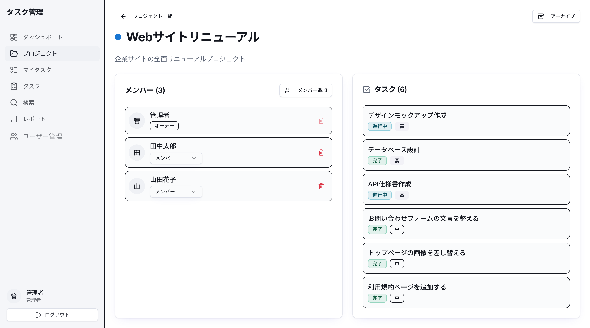
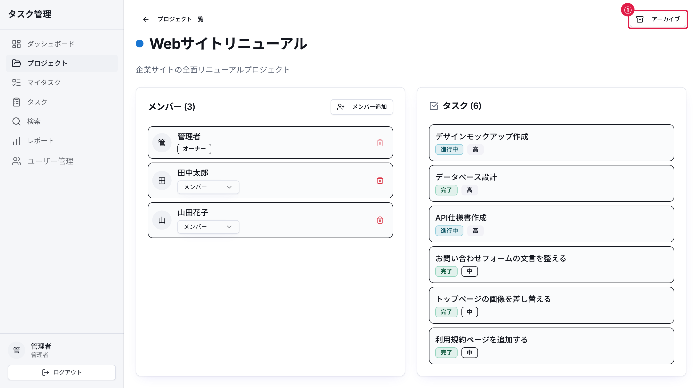
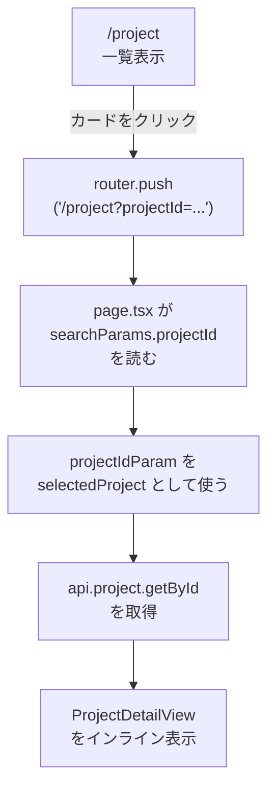
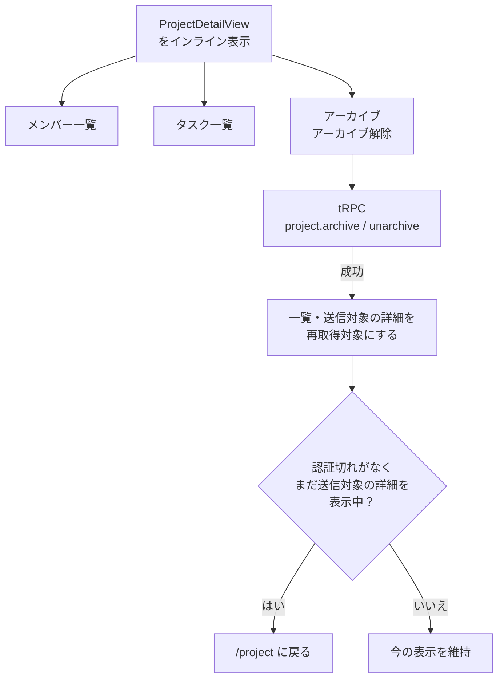
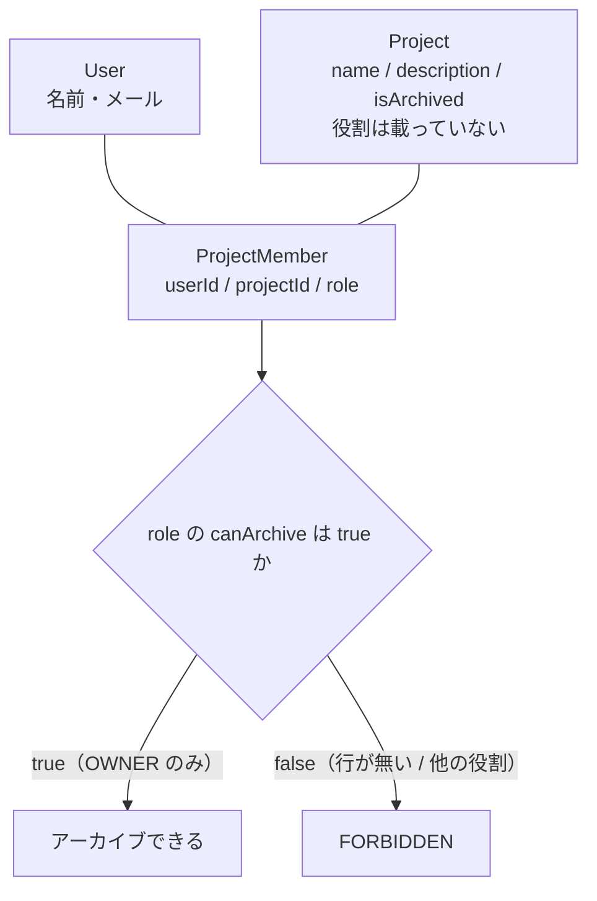
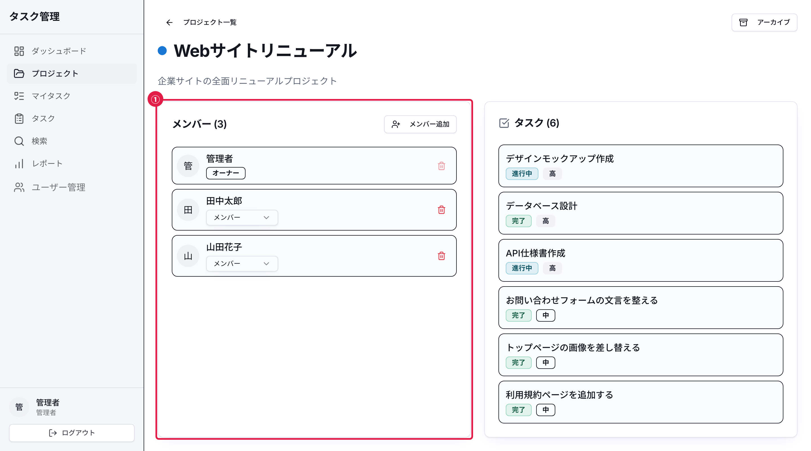

# Day 27: プロジェクト詳細・アーカイブを実装しよう

## 前回の振り返り

Day 26ではエラーページ（404・500）を実装し、予期せぬエラーが起きたときでもユーザーを安全に案内できるようにしました。今日はプロジェクト管理画面をさらに使いやすくするために、**プロジェクト詳細表示**と**アーカイブ機能**を実装します。

---

## 今日のゴール

プロジェクト一覧から1件を選ぶと同じ `/project` ページの中で **一覧表示から詳細表示へ切り替わる UI** を、完成形と照合して仕上げます。詳細画面では次の情報を扱います。





- プロジェクト名・色・説明
- メンバー一覧
- タスク一覧
- アーカイブ / アーカイブ解除

> **今日のゴールライン**: URLのprojectIdで一覧と詳細を切り替え、アーカイブまで同じページ内で扱える感覚を掴めれば大丈夫です。
>
> 現在の完成形は `ProjectDetailDialog` のモーダルではなく、`ProjectDetailView` を使った**インライン詳細表示**です。URL は `/project?projectId=xxx` のように変わり、同じページの中で一覧 ↔ 詳細を切り替えます。
>
> **この Day は Day 11・12 で作った機能の統合確認です。**
> 同じ名前の state、query、mutation、handler を追加し直さず、完成状態と照合します。
> Step 3 では、配布済みの `ProjectDetailView` を必須の8 props を持つ完成形へ揃えます。
>
> `project-detail-view.tsx` は写経の土台に含まれています。3つの props は途中の日程でも使えるように省略可能になっています。
> Day 01 で `scaffold-from-scratch.sh` を走らせた時点で、手元に置かれています。
> 販売用 ZIP に入るのはこの土台までで、完成版の `src/` 一式は入っていません。
> Step 1、2、4、5、6はコードを読んで見比べます。Step 3では `ProjectDetailView`、Step 7では `page.tsx` のファイル全体を置き換えます。説明用の抜粋を既存コードへ追記しないでください。

## なぜこれを作るのか

プロジェクト管理アプリでは「このプロジェクトには誰が入っているのか」「今どんなタスクがあるのか」をすぐ確認できる必要があります。

今回は詳細を別ルートに分離するのではなく、一覧ページの延長として表示を切り替える構成にします。この構成には次の利点があります。

- URL に `projectId` が残るので再読み込みや共有に強い
- 一覧画面へ戻る導線をシンプルに保てます
- ページ全体の責務を `page.tsx` に集約しやすい

また、完了したプロジェクトは削除ではなく**アーカイブ**します。アーカイブは「使わないものを棚にしまう」イメージです。履歴は残したまま、普段の一覧からは外せます。

### 今日実装する全体像


```mermaid
flowchart TD
    A["/project<br/>一覧表示"] -->|"カードをクリック"| B["router.push<br/>('/project?projectId=...')"]
    B --> C["page.tsx が<br/>searchParams.projectId<br/>を読む"]
    C --> D["projectIdParam を<br/>selectedProject として使う"]
    D --> E["api.project.getById<br/>を取得"]
    E --> F["ProjectDetailView<br/>をインライン表示"]
```

次の図は、前の図の最後にある `ProjectDetailView` からの続きです。2つの図に出る `ProjectDetailView` は同じコンポーネントです。


```mermaid
flowchart TD
    F["ProjectDetailView<br/>をインライン表示"] --> G["メンバー一覧"]
    F --> H["タスク一覧"]
    F --> I["アーカイブ<br/>アーカイブ解除"]
    I --> J["tRPC<br/>project.archive / unarchive"]
    J -->|成功| K["一覧・送信対象の詳細を<br/>再取得対象にする"]
    K --> L{"認証切れがなく<br/>まだ送信対象の詳細を<br/>表示中？"}
    L -->|はい| M["/project に戻る"]
    L -->|いいえ| N["今の表示を維持"]
```

最初の図で目を留めてほしいのは B から C の流れです。カードをクリックしたとき`selectedProject` を直接書き換えてはいません。いったん URL を書き換え、そのあと `page.tsx` が URL を読み直します。`selectedProject` は読み取った値の別名です。遠回りに見えますが画面の状態を決める大元が URL 1か所にそろいます。だから再読み込みしてもリンクを人に送っても同じ詳細画面が開きます。

### やること / やらないこと

| やること | やらないこと |
|---------|-------------|
| 一覧 ↔ 詳細の表示切り替え | 詳細モーダルの新規採用 |
| 配布済みの `ProjectDetailView` の中身を完成形と照合する | タスクの編集機能 |
| アーカイブ / アーカイブ解除 | アーカイブ専用ページの新設 |
| メンバー追加・削除・権限変更の導線を照合する | メンバー管理 UI の新規追加 |

### 新しく学ぶ概念

| 概念 | 読み方 | 役割 | 例え |
|------|--------|------|------|
| `useSearchParams` | ユースサーチパラメータ | URL クエリを読む | ブラウザの住所欄から条件を読む |
| `router.push()` | ルータープッシュ | URL を変えて画面状態を切り替える | 本にしおりを挟んで場所を移す |
| `inferRouterOutputs` | インファー・ルーター・アウトプット | tRPC の戻り値から型を自動取得 | レシートから商品一覧の型を読む |
| アーカイブ | アーカイブ | 削除ではなく `isArchived` で隠す | 本棚の奥にしまう |

### 復習する概念

| 概念 | 初出 |
|------|------|
| `useState` / URLパラメータ | Day 10 以降 |
| コールバック Props | Day 15 以降 |
| `useQuery` / `useMutation` | Day 08 以降 |

開発サーバーは前の Day から動かしたまま使います。止めてあるときは `npm run dev` で起動してから `http://localhost:3000` を開きます。

---

## 実装ステップ一覧

| ステップ | 作業内容・触るファイル・成功状態 | 読む時間の目安 |
|---------|---------------------------------|----------|
| Step 1 | **作業内容**: アーカイブ API の完成形を読む<br>**触るファイル**: `src/server/api/routers/project.ts`<br>**成功状態**: `archive` / `unarchive` が呼べる | 5分 |
| Step 2 | **作業内容**: 一覧 ↔ 詳細の切り替えを読む<br>**触るファイル**: `src/app/project/page.tsx`<br>**成功状態**: カードクリックで詳細へ切り替わる | 8分 |
| Step 3 | **作業内容**: `ProjectDetailView` を完成形へ揃える<br>**触るファイル**: `src/component/project/project-detail-view.tsx`<br>**成功状態**: 戻るボタン付きの詳細画面が出る | 8分 |
| Step 4 | **作業内容**: メンバー一覧とタスク一覧の表示を確かめる<br>**触るファイル**: `project-detail-view.tsx`<br>**成功状態**: 主要情報が確認できる | 10分 |
| Step 5 | **作業内容**: アーカイブのつなぎ込みを確かめる<br>**触るファイル**: `page.tsx`, `project-detail-view.tsx`<br>**成功状態**: ボタンで状態が切り替わる | 5分 |
| Step 6 | **作業内容**: 補助ダイアログの置き場所を確かめる<br>**触るファイル**: `src/app/project/page.tsx`<br>**成功状態**: メンバー追加・削除確認も動く | 5分 |
| Step 7 | **作業内容**: 書き込み失敗時の画面を整える<br>**触るファイル**: `src/app/project/page.tsx`<br>**成功状態**: 失敗時に入力と対象が残る | 20分 |

**読む時間の合計（仮）**: 約61分です。

表と各 Step に記した時間は、説明とコードを読む時間の仮の目安です。実測した値ではありません。コードの入力、動作確認、ダウンロードや起動の待ち時間、調べものには別に時間を取ってください。

---

### Step 1: アーカイブ API の完成形を読む （読む目安: 5分）

**ゴール**: `project.archive` と `project.unarchive` で `isArchived` を切り替えられるようにします。

Day 11 で実装済みならここではコードを追加せず
次の完成形と照合してください。同名 procedure を
追加すると重複定義になるため書き直しません。

まず前提です。アーカイブは**削除ではありません**。

| 方法 | 仕組み | 復元 | 向いている用途 |
|------|--------|------|---------------|
| 完全削除 | レコード自体を消す | 不可 | 本当に不要なデータ |
| アーカイブ | `isArchived` を切り替える | 可 | 過去プロジェクトの退避 |

Prisma スキーマに `isArchived` があることを確認します。

```prisma
model Project {
  id          String    @id @default(cuid())
  name        String
  description String?
  color       String    @default("#1976d2")
  isArchived  Boolean   @default(false) @map("is_archived")
  startDate   DateTime? @map("start_date")
  endDate     DateTime? @map("end_date")
  createdAt   DateTime  @default(now()) @map("created_at")
  updatedAt   DateTime  @updatedAt @map("updated_at")
}
```

現在の実装では`archive` と `unarchive` は共通ヘルパー `setArchiveStatus` を使っています。

Day 11・12で使った `Prisma` の値インポートを残します。`Prisma.sql` は文字列と入力値を分けてSQLを組み立てる関数です。メンバーの役割を変える処理もプロジェクト行をロックするので、同じ行のロックを待ってから現在の役割を確認します。先に降格が確定した場合、古いオーナー権限でアーカイブしません。ロックの取得から権限確認、更新までを1つのトランザクションにまとめます。

```ts
// filepath: src/server/api/routers/project.ts
const setArchiveStatus = async (userId: string, projectId: string, isArchived: boolean) => {
  return await prisma.$transaction(async (tx) => {
    // メンバー変更と同じ行を先にロックし、待機中に確定した現在の権限を確認する。
    await tx.$queryRaw(
      Prisma.sql`SELECT "id" FROM "projects" WHERE "id" = ${projectId} FOR UPDATE`,
    );
    const userMember = await tx.projectMember.findUnique({
      where: {
        userId_projectId: { userId, projectId },
      },
    });

    assertMemberPermission(userMember ? [userMember] : [], 'canArchive');

    return await tx.project.update({
      where: { id: projectId },
      data: { isArchived },
    });
  });
};
```

ポイントは次の3つです。

- プロジェクト行をロックした後、同じトランザクションの `tx.projectMember` で現在の役割を調べます
- 権限確認は `Project` の値ではなく `ProjectMember` の役割で行います
- `assertMemberPermission(..., 'canArchive')` でアーカイブ権限を明示します

`prisma.project` を引いてもそのユーザーがそのプロジェクトの何なのかは分かりません。役割が載っているのは `ProjectMember` の行のほうです。


```mermaid
flowchart TB
    U["User<br/>名前・メール"] --- M["ProjectMember<br/>userId / projectId / role"]
    P["Project<br/>name / description / isArchived<br/>役割は載っていない"] --- M
    M --> Q{"role の canArchive は true か"}
    Q -->|"true（OWNER のみ）"| OK["アーカイブできる"]
    Q -->|"false（行が無い / 他の役割）"| NG["FORBIDDEN"]
```

役割が載っているのは `ProjectMember` だけで、上の2つには入っていません。行が1つも見つからない人はそのプロジェクトに参加していない人です。

`assertMemberPermission` は渡された配列の先頭を見て行が1つも無ければ `FORBIDDEN` を返します。だから `findUnique` が `null` を返す「そもそも参加していない人」はここで止まります。第2引数の `'canArchive'` を渡すと役割の中身まで見ます。`canArchive` が `true` の役割は `OWNER` だけなので管理者でもアーカイブはできません。この引数を省くと「メンバーなら誰でもアーカイブできる」に意味が変わってしまいます。

ルーター本体はシンプルです。

```ts
// filepath: src/server/api/routers/project.ts
archive: protectedProcedure
  .input(z.object({ id: z.string().cuid() }))
  .mutation(async ({ ctx, input }) => {
    return await setArchiveStatus(ctx.session.userId, input.id, true);
  }),

unarchive: protectedProcedure
  .input(z.object({ id: z.string().cuid() }))
  .mutation(async ({ ctx, input }) => {
    return await setArchiveStatus(ctx.session.userId, input.id, false);
  }),
```

2つの procedure で違うのは最後に渡す `true` と `false` だけです。画面に表示された現在値を反転して送る方式では、別の人が更新する前の古い値から送信先を決める場合があります。ここでは `archive` は `true`、`unarchive` は `false` を保存するように決め、要求した最終状態を明示します。呼ぶ名前で結果を決めておけばサーバーが受け取るのは「こうしたい」という最終状態だけです。`archive` を続けて2回呼んでも、`isArchived` は `true` のままで変わりません。権限確認をヘルパー1か所に寄せてあるので片方だけ確認を書き忘れる事故も起きません。

**確認ポイント**

- `archive` と `unarchive` の両方があります
- どちらも `setArchiveStatus` を使っています
- `getAll` は `isArchived` で一覧を絞り込めます

---

### Step 2: 一覧 ↔ 詳細の切り替えを読む （読む目安: 8分）

**ゴール**: 一覧カードをクリックしたら URL の `projectId` を更新し、同じ `/project` ページ内で詳細表示へ切り替えます。

この値、query、handler、描画分岐は
Day 11・12 で実装済みです。以下は追加手順ではなく
照合用です。同名の宣言があれば変更しません。

現在の完成形では`page.tsx` が**画面全体の分岐役**です。

- `projectId` が無いとき: 一覧を表示
- `projectId` があるとき: `ProjectDetailView` を表示

まず `searchParams` から詳細IDを読みます。

```ts
// filepath: src/app/project/page.tsx
const searchParams = useSearchParams();
const projectIdParam = searchParams.get('projectId');
const router = useRouter();

const selectedProject = projectIdParam;
```

`selectedProject` は詳細取得用の ID です。実際の切り替えトリガーは URL に置いているので再読み込みしても状態を復元できます。

詳細データの取得は `selectedProject` があるときだけ行います。

```ts
// filepath: src/app/project/page.tsx
const {
  data: projectDetail,
  isLoading: projectDetailLoading,
  isError: projectDetailError,
  isFetching: projectDetailFetching,
  error: projectDetailQueryError,
  refetch: refetchProjectDetail,
} = api.project.getById.useQuery(
  { id: selectedProject ?? '' },
  {
    enabled: !authExpired && !!selectedProject,
    retry: shouldRetryProjectQuery,
  },
);
```

詳細のデータ・待機・失敗・再取得を別々に受け取ります。まだ応答が無い状態を「見つかりません」と誤って扱わないためです。

`enabled` は一覧を見ている間と認証切れ後の通信を止めます。取得中・失敗・再取得中を別々に受け取るため、応答待ちを「見つかりません」と誤表示しません。`retry` は 401・403・404 を繰り返さず、通信失敗だけを再試行します。

カードクリック時は `router.push()` で URL を変えます。

```ts
// filepath: src/app/project/page.tsx
const handleProjectClick = (projectId: string) => {
  router.push(`/project?projectId=${projectId}`);
};

const handleDetailClose = () => {
  router.push('/project');
};
```

どちらのハンドラーも URL だけを書き換えます。`selectedProject` は `projectIdParam` の別名なので、URL を唯一の起点にできます。ブラウザの戻るボタンでも URL と詳細表示が同じ描画で切り替わります。

詳細を返す前に、Day 11から引き継いだ取得状態の分岐も確認します。

**表示に必要な取得状態**

```typescript
// filepath: src/app/project/page.tsx
  const viewingDetail = Boolean(selectedProject);
  const queryErrors = viewingDetail
    ? [
        currentUserError ? currentUserQueryError : null,
        projectDetailError ? projectDetailQueryError : null,
      ]
    : [
        currentUserError ? currentUserQueryError : null,
        projectsError ? projectsQueryError : null,
      ];
  const queryAuthFailed = queryErrors.some(isAuthError);
  useEffect(() => {
    if (!queryAuthFailed) return;
    // 読み取りで判明した認証切れも、後続の書き込み成功では解除しません。
    authExpiredRef.current = true;
    setAuthExpired(true);
  }, [queryAuthFailed]);
  const authFailed = authExpired || queryAuthFailed;
  const forbidden = queryErrors.some(isForbiddenError);
  const notFound = viewingDetail
    && projectDetailError
    && httpStatusOf(projectDetailQueryError) === 404;
```

URLに詳細IDがあるかで対象の問い合わせを選びます。401を検出したら `authExpired` に保持し、書き込み成功など別の処理で解除されないようにします。401・403・404を先に判定し、保護されたキャッシュや誤った内容を表示しないためです。

```typescript
// filepath: src/app/project/page.tsx
  const hasFetchError = viewingDetail
    ? currentUserError || projectDetailError
    : currentUserError || projectsError;
  const hasRequiredData =
    (!currentUserError || currentUser != null)
    && (viewingDetail
      ? !projectDetailError || projectDetail != null
      : !projectsError || projects != null);
  const requiredLoading = currentUserLoading
    || (viewingDetail
      ? projectDetailLoading
      : projectsLoading);
  const requiredFetching = currentUserFetching
    || (viewingDetail
      ? projectDetailFetching
      : projectsFetching);
```

エラーの有無と利用できるデータの有無を別々に判定します。初回失敗ではエラー画面を出し、再取得失敗では既存データを残すためです。

```typescript
// filepath: src/app/project/page.tsx
  const refetchRequiredData = () => {
    void refetchCurrentUser();
    if (viewingDetail) {
      void refetchProjectDetail();
      return;
    }
    void refetchProjects();
  };

  if (requiredLoading
    && !authFailed && !forbidden && !notFound) {
    return (
      <AppLayout>
        <PageLoadingSpinner />
      </AppLayout>
    );
  }
```

表示中の画面に必要な問い合わせだけを取り直します。一覧と詳細を分けることで、関係のない通信を増やさず待機状態も正しく表示できます。

`viewingDetail` によって一覧と詳細のどちらを判定対象にするかを切り替えます。詳細取得中は `ProjectDetailView` へ進まないため、「見つかりません」という誤表示は出ません。

エラー表示は見出し・説明・移動先が一体になった分岐です。次の2ブロックは完成形を読み取るための連続した抜粋です。このStepでは貼り付けません。Step 7でファイル全体を置き換えます。

```tsx
// filepath: src/app/project/page.tsx
  if (authFailed || forbidden || notFound
    || (hasFetchError && !hasRequiredData)) {
    return (
      <AppLayout>
        <div className="flex flex-col items-center justify-center py-24 text-center">
          <p className="mb-2 text-base font-semibold text-foreground">
            {authFailed
              ? 'ログインの有効期限が切れました'
              : forbidden
                ? 'このプロジェクトを見る権限がありません'
                : notFound
                  ? 'プロジェクトが見つかりません'
                  : 'プロジェクトを取得できませんでした'}
          </p>
          <p className="mb-6 text-sm text-muted-foreground">
            {authFailed
              ? 'もう一度ログインしてください。入力内容はログイン後に入力し直してください。'
              : forbidden
                ? '権限が必要です。プロジェクトの管理者に確認してください。'
                : notFound
                  ? '削除されたか、URLが正しくない可能性があります。'
                  : '通信状況を確認して、再読み込みしてください。'}
          </p>
          <Button
```

ここまででエラー説明の条件分岐が続いています。三項演算子の残りと操作ボタンは次のフェンスへ続きます。2つを掲載順に読み、条件と表示の対応を確認してください。

```tsx
{/* filepath: src/app/project/page.tsx（同じファイルの続き） */}
            type="button"
            onClick={() => {
              if (authFailed) {
                router.push('/login');
                return;
              }
              if (forbidden || notFound) {
                router.push('/project');
                return;
              }
              refetchRequiredData();
            }}
            disabled={!authFailed && requiredFetching}
          >
            {authFailed
              ? 'ログイン画面へ'
              : forbidden || notFound
                ? 'プロジェクト一覧へ'
                : '再読み込み'}
          </Button>
        </div>
      </AppLayout>
    );
  }
```

ボタンの行き先もエラーの種類で決めます。認証切れならログインへ、権限不足か削除済みなら一覧へ移動します。通信失敗のときだけ現在の画面を再取得し、取得中は連打を止めます。

401・403・404では取得済みデータも隠します。初回の通信失敗には再読み込みを出します。

```tsx
// filepath: src/app/project/page.tsx
  const staleDataWarning = hasFetchError ? (
    <div
      role="alert"
      className="flex items-center justify-between gap-4 rounded-lg border border-amber-300/60 bg-amber-50 px-4 py-3 text-sm text-amber-900 dark:border-amber-500/40 dark:bg-amber-950/40 dark:text-amber-200"
    >
      <span>
        最新のプロジェクト情報を取得できませんでした。前回取得時の内容です。
      </span>
      <Button
        type="button"
        variant="outline"
        size="sm"
        onClick={refetchRequiredData}
        disabled={requiredFetching}
      >
        再試行
      </Button>
    </div>
  ) : null;
```

この警告は再取得に失敗しても以前のデータが残る場合だけ作ります。内容を消さず、古い可能性と再試行の入口を同時に示すためです。


最後に `viewingDetail` で描画を分岐します。

```tsx
// filepath: src/app/project/page.tsx
if (viewingDetail) {
  return (
    <AppLayout>
      <div className="space-y-4">
        {staleDataWarning}
        <ProjectDetailView
          projectDetail={projectDetail}
          onBack={handleDetailClose}
          onAddMemberClick={openMemberDialog}
          onRemoveMember={handleRemoveMember}
          onUpdateMemberRole={handleUpdateMemberRole}
          onArchive={handleArchive}
          canManageMembers={canManageMembers}
          canArchive={canArchiveProject}
        />
      </div>
    </AppLayout>
  );
}
```

この分岐で `return` すると、下にある一覧の JSX には進みません。`viewingDetail` は URL に詳細IDがあるかを表し、直接開いた初回から読み込み分岐へ入ります。`ProjectDetailView` はデータを自分で取得しないため、取得済みデータと操作用の props を親から渡します。

**確認ポイント**

- 一覧クリックで `/project?projectId=...` に変わります
- URL を直接開いても詳細が表示されます
- 戻るボタンで `/project` に戻ります

---

### Step 3: `ProjectDetailView` を完成形へ揃える （読む目安: 8分）

**ゴール**: 配布済みの詳細ビューを、8つの props を必須で受け取る形へ揃えます。

配布版では `onUpdateMemberRole`、`canManageMembers`、`canArchive` に `?` が付き、省略できる形になっています。Day 12 までに親ページから8つとも渡す形を作ったので、ここで必須にします。

この章の後半にある「完成コード全体」の「`src/component/project/project-detail-view.tsx`」へ進んでください。その見出しから「今日のまとめ」の直前までにあるコードブロックを、掲載順につなげます。説明文やコードを囲む三連のバッククオートはコピーしません。

つなげたコードで、手元の `src/component/project/project-detail-view.tsx` の内容全体を置き換えて保存します。`scripts/` 内の配布元は変更しません。3つの `?` だけでなく、権限の既定値とコールバックの省略時の処理も完成形へ揃えるため、ファイル全体を置き換えます。

保存したらこの位置に戻り、型と表示の役割を読み進めてください。この Step と Step 4 の抜粋は説明用なので追記しません。

まず tRPC の戻り値から型を取り出す箇所を確認します。

```ts
// filepath: src/component/project/project-detail-view.tsx
import type { inferRouterOutputs } from '@trpc/server';
import type {
  ProjectMemberRole,
} from '@/lib/constant/roles';
import type { AppRouter } from '@/server/api/root';

type RouterOutputs = inferRouterOutputs<AppRouter>;
type ProjectDetail = RouterOutputs['project']['getById'];
```

ここで `ProjectDetail` の中身を自分で書き並べないのが肝心なところです。`inferRouterOutputs` はサーバー側の手続きが実際に返す形をそのまま取り出して型にしてくれます。Day 09 の `getAll` でメンバーとタスクを `include` して返したように`getById` も関連データを一緒に返します。その入れ子の形まで自動で付いてくるので`{ id: string; name: string; ... }` と手で書く必要はありません。手書きにするとあとで `include` を1つ増やしたときに画面側の型だけが古いまま取り残されます。

Props は次の形です。

```ts
// filepath: src/component/project/project-detail-view.tsx
interface ProjectDetailViewProps {
  projectDetail: ProjectDetail | null | undefined;
  onBack: () => void;
  onAddMemberClick: () => void;
  onRemoveMember: (userId: string) => void;
  onUpdateMemberRole: (
    userId: string,
    role: ProjectMemberRole,
  ) => void;
  onArchive: (projectId: string, isArchived: boolean) => void;
  canManageMembers: boolean;
  canArchive: boolean;
}
```


8つとも `?` を付けていません。つまり全部必須です。`?` は「渡さなくてもよい」という意味で、渡し忘れても型検査が通ります。配布版は権限の値を省略すると `true` を使うため、渡し忘れてもボタンが表示されます。必須にしておけば呼ぶ側が忘れた時点でエラーが出ます。Day 11 の呼び出し（`onUpdateMemberRole={() => {}}` など）はこの8つを全部渡しているので必須にしても型エラーにはなりません。

8つと聞くと多く感じますが中身は2種類しかありません。`projectDetail` と `canManageMembers` / `canArchive` は「表示に必要な材料」、`on` で始まる5つは「押されたことを親に伝える窓口」です。裏を返すと`ProjectDetailView` は mutation を1つも持ちません。通信も権限の判定もこの部品の仕事ではありません。Day 15 以降で使ってきたコールバック Props と同じ考え方で、判断は `page.tsx` に集めます。こう分けておくとあとで詳細を別ページへ移したくなったときも、この部品はそのまま持っていけます。

現在の完成形はデータが見つからないケースも自前で処理します。

```tsx
// filepath: src/component/project/project-detail-view.tsx
if (!projectDetail) {
  return (
    <div className="flex flex-col items-center justify-center py-24 text-muted-foreground">
      <p>プロジェクトが見つかりません。</p>
      <Button variant="ghost" className="mt-4" onClick={onBack}>
        <ArrowLeft className="mr-2 h-4 w-4" />
        プロジェクト一覧に戻る
      </Button>
    </div>
  );
}
```

Props の型が `ProjectDetail | null | undefined` なので、この `if` は部品を単独で使ったときの防御になります。ただし現在の `page.tsx` は、この部品を呼ぶ前に取得状態を判定します。取得中はスピナー、初回500は再読み込み、401・403は権限案内、404は不在案内を親が返すため、通常の画面操作で `undefined` のままこの部品へ進みません。ここを通り抜けた先ではTypeScript が「`projectDetail` には必ず中身がある」と判断します。だからこの後に出てくる `projectDetail.color` や `projectDetail.name` を、`?.` を付けずにそのまま書けます。逆にこの `if` を消すと以降の参照で型エラーが出ます。

詳細ビューの外枠を、説明用に簡略化したコードで確認します。

```tsx
// filepath: src/component/project/project-detail-view.tsx
return (
  <div className="flex flex-col gap-6">
    <div className="flex items-center justify-between">
      <div className="flex items-center gap-4">
        <Button variant="ghost" size="sm" onClick={onBack}>
          <ArrowLeft className="mr-2 h-4 w-4" />
          プロジェクト一覧
        </Button>
        <div className="flex items-center gap-3">
          <div
            className="h-4 w-4 rounded-full flex-shrink-0"
            style={{ backgroundColor: projectDetail.color }}
          />
          <h1 className="text-3xl font-bold tracking-tight">{projectDetail.name}</h1>
        </div>
      </div>
    </div>

    {projectDetail.description && (
      <p className="text-muted-foreground">{projectDetail.description}</p>
    )}

    <div className="grid gap-6 lg:grid-cols-2">
```

この抜粋では外枠だけを示しています。上から順に、戻るボタンと色の丸と名前を1行に並べたヘッダー、説明文、そして下半分に来る2カラムの入れ物、という3段構えです。`projectDetail.description && (...)` としてあるので説明が空のプロジェクトでは段落そのものが出ません。空の `<p>` が残って行間だけ空くのを防げます。`lg:grid-cols-2` は Day 09 のグリッドと同じ考え方で、画面が広いときだけ横2列にします。スマートフォンの幅ではメンバーとタスクが縦に積まれます。

なお最後の `<div className="grid ...">` は開いたままです。閉じタグは次のブロックにあります。手元のファイルではすでに閉じているのでそちらと見比べてください。

```tsx
      {/* filepath: src/component/project/project-detail-view.tsx（同じファイルの続き） */}
      {/* Step 4 でメンバー一覧とタスク一覧を入れる */}
    </div>
  </div>
);
```

閉じタグが2つ並ぶだけのブロックですがどれがどれを閉じるかを数えておいてください。1つ目の `</div>` が `grid gap-6 lg:grid-cols-2` を、2つ目が一番外側の `flex flex-col gap-6` を閉じます。JSX は開いたタグが閉じていないとビルドで止まるのでこの2行がそろって初めてファイルが成り立ちます。中のコメント行は Step 4 で読む中身の目印です。2カラムの入れ物があり、そこにカードが入る、という並びを頭に入れておいてください。

**確認ポイント**

- `onUpdateMemberRole`、`canManageMembers`、`canArchive` に `?` がなく、8つの props が必須になっています
- 権限の引数に `= true` がなく、`onUpdateMemberRole` の呼び出しに `?.` がありません
- モーダルの `Dialog` は使っていません
- 戻るボタンは `onBack` で親に処理を委譲しています
- 詳細画面は 2 カラムのカード構成になっています

---

### Step 4: メンバー一覧とタスク一覧の表示を確かめる （読む目安: 10分）

**ゴール**: `ProjectDetailView` の中に並ぶ、メンバー一覧とタスク一覧の 2 つのカードを読みます。ここに載せるのは完成版を少し削った形です。削ってある部分はそれぞれのカードの後ろで説明します。

Step 3 で置き換えた完成形と、以下の説明用の抜粋を読み比べます。抜粋の追記や置き換えはせず、完成形の権限制御やロール変更 UI を残してください。

メンバーカードの `Card` と `Avatar` の役割を確認します。

```tsx
{/* filepath: src/component/project/project-detail-view.tsx */}
<Card>
  <CardHeader className="flex flex-row items-center justify-between space-y-0 pb-4">
    <CardTitle className="text-lg">
      メンバー ({projectDetail.members?.length ?? 0})
    </CardTitle>
    <Button variant="outline" size="sm" onClick={onAddMemberClick}>
      <UserPlus className="mr-2 h-4 w-4" /> メンバー追加
    </Button>
  </CardHeader>
  <CardContent>
    <div className="grid gap-2">
      {projectDetail.members?.map((member) => (
        <div
          key={member.id}
          className="flex items-center justify-between p-2 rounded-lg border bg-muted/30"
        >
          <div className="flex items-center gap-3">
            <Avatar>
              {member.user?.avatar && <AvatarImage src={member.user.avatar} alt="" />}
              <AvatarFallback>
                {(member.user?.name || member.user?.email || '?')[0]?.toUpperCase()}
              </AvatarFallback>
            </Avatar>
```

`Avatar` の中を2段構えにしているのはアイコン画像を持たないメンバーがいるからです。`member.user?.avatar` があるときだけ `AvatarImage` を出し、無ければ `AvatarFallback` が受け止めて名前かメールの1文字目を大文字にして丸の中に置きます。`(member.user?.name || member.user?.email || '?')` と3段に重ねてあるのは名前とメールが両方空だったときに `?` を出すためです。ここを `member.user.name[0]` と書くと、名前が `null` のメンバーを表示したときに例外が出ます。名前が空文字なら例外にはなりませんが、先頭の文字が無いため何も表示されません。Day 26 で `error.tsx` を置いたので行き先は真っ白な画面ではなく、あのエラーページです。それでも、1人分のデータ欠けで詳細画面ごと消える点は変わりません。

`<Avatar>` を閉じた直後で抜粋を区切っています。続きは次のブロックで読みます。

```tsx
            {/* filepath: src/component/project/project-detail-view.tsx（同じファイルの続き） */}
            <div>
              <p className="font-medium">{member.user?.name || member.user?.email || '不明'}</p>
              <Badge variant="outline" className="text-xs">
                {isProjectMemberRole(member.role)
                  ? PROJECT_MEMBER_ROLE_LABELS[member.role]
                  : member.role}
              </Badge>
            </div>
          </div>
          <Button
            variant="ghost"
            size="icon"
            aria-label={`${member.user?.name || member.user?.email || '不明'}をプロジェクトから削除`}
            onClick={() => onRemoveMember(member.userId)}
            disabled={member.role === PROJECT_MEMBER_ROLE.OWNER}
          >
            <Trash2 className="h-4 w-4 text-destructive" />
          </Button>
        </div>
      ))}
    </div>
  </CardContent>
</Card>
```

この一覧でいちばん大事な1行は削除ボタンの `disabled={member.role === PROJECT_MEMBER_ROLE.OWNER}` です。最後のオーナーを消せてしまうとそのプロジェクトを操作できる人が誰も残らず、誰も直せない状態のプロジェクトが残ります。押せない見た目にしておけばうっかりクリックがそこで止まります。ここでは相手がオーナーなら一律で押せなくしているのでオーナーが2人以上いるプロジェクトでも片方を外せません。サーバー側の `removeMember` は2段構えで止めます。オーナー以外がオーナーを外そうとしたら `FORBIDDEN` で拒み、そのうえでオーナーが1人しか残っていなければ `BAD_REQUEST` で拒みます。つまりオーナー同士なら2人目以降を外せるので一律で押させない画面のほうが厳しい作りです。安全側に倒した分、オーナーの入れ替えは画面からはできません。ただし画面側の `disabled` は入口の防波堤にすぎません。サーバー側では Day 12 の `removeMember` がプロジェクトの行をロックした後に現在の権限とオーナー人数を確かめます。画面の表示後に権限が変わっていても、その確認で削除を拒みます。ロール名を `PROJECT_MEMBER_ROLE_LABELS` に通しているのも同じ発想で、`'OWNER'` という英字をそのまま出さず、他の画面と同じ日本語のラベルにそろえます。

削除ボタンはアイコン1つなので`aria-label` で名前を付けています。Day 16 で見たとおり、名前が無いと読み上げでは同じボタンが人数分並ぶだけになり、どの行を押しているのか分かりません。

ここに載せたメンバーカードの抜粋は、完成版から2つ削ってあります。完成版はロール名をただのラベルではなく `Select` で出し、その場で権限を変えられます。さらに `canManageMembers` が false の人には `Select` と削除ボタンを見せず、ラベルだけの読み取り専用にします。この出し分けは Step 3 で置き換えた完成形に含まれています。手元の `Select` と `canManageMembers` の条件を確認してください。

タスクカードでは、0 件のときの表示も確認します。

```tsx
{/* filepath: src/component/project/project-detail-view.tsx */}
<Card>
  <CardHeader className="space-y-0 pb-4">
    <div className="flex items-center gap-2">
      <CheckSquare className="h-5 w-5 text-muted-foreground" />
      <CardTitle className="text-lg">タスク ({projectDetail.tasks?.length ?? 0})</CardTitle>
    </div>
  </CardHeader>
  <CardContent>
    <div className="grid gap-2">
      {projectDetail.tasks?.length === 0 ? (
        <p className="text-sm text-muted-foreground text-center py-4">
          タスクがありません。
        </p>
      ) : (
        projectDetail.tasks?.map((task) => (
          <div
            key={task.id}
            className="flex flex-col gap-1 p-3 rounded-lg border bg-muted/30 hover:bg-muted/50 transition-colors"
          >
            <p className="font-medium">{task.title}</p>
            <div className="flex gap-2">
              <StatusBadge status={task.status} />
```

タスクカードで先に書いてあるのは0 件のときの分岐です。`projectDetail.tasks?.length === 0` を最初に見て空なら「タスクがありません。」の1行だけを出します。これが無いとタスクを作っていないプロジェクトでは枠の中が空のまま残ります。読み込み中や初回の取得失敗は、親の `page.tsx` で分けています。ここでは取得済みのタスク配列が0件かを確かめます。再取得に失敗している場合は、親が前回の内容であることを警告します。タスクが無いことを表示しておくと、画面が壊れているのかタスクが無いだけなのかで読者が迷いません。`StatusBadge` はタスク一覧でも使っている共通の部品で、`task.status` を渡すだけで状態に応じた色の札になります。ここで色分けを直に書かないので状態の色を変えたいときは部品側を1か所直すだけで全画面に効きます。

見出しの件数も、完成版とは数え方が違います。ここでは `projectDetail.tasks?.length ?? 0` として全件を数えますが完成版はキャンセル済みを外した件数を `タスク (3)` のように出し、外した分を「（キャンセル済 1）」と脇に添えます。Day 21 の統計カードと同じで、中止したタスクを混ぜると「今動いている作業の量」として読めなくなるためです。Step 3 で置き換えた完成形には、この数え分けも含まれています。手元の見出しは全件を数える抜粋へ戻さず、キャンセル済みの件数を分けた表示のまま確認してください。

こちらも `<div>` の途中で抜粋を区切っています。次のブロックで優先度の表示と閉じタグを確認します。

```tsx
              {/* filepath: src/component/project/project-detail-view.tsx（同じファイルの続き） */}
              <Badge variant={getPriorityBadgeVariant(task.priority)}>
                {TASK_PRIORITY_LABELS[task.priority] ?? task.priority}
              </Badge>
            </div>
          </div>
        ))
      )}
    </div>
  </CardContent>
</Card>
```

優先度の札だけは専用の部品にせず、共通の `Badge` に `variant` を渡す形にしています。色を決める役目は `getPriorityBadgeVariant` が持っていて`URGENT` なら `destructive`、`HIGH` なら `secondary`、`MEDIUM` と `LOW` なら `outline` を返します。ここで `task.priority === 'URGENT' ? ... : ...` と書き始めると同じ優先度がタスク一覧と詳細で違う色になっていきます。文字のほうは `TASK_PRIORITY_LABELS[task.priority]` を通して「緊急」「高」「中」「低」の日本語にします。`?? task.priority` を添えてあるのは対応表で見つからない値が届いても札を空にしないためです。

**確認ポイント**

- メンバー追加ボタンがヘッダー右上にあります
- オーナーの削除ボタンは無効化されます
- タスク 0 件でも空表示で崩れません

---

### Step 5: アーカイブのつなぎ込みを確かめる （読む目安: 5分）

**ゴール**: 詳細画面上部のボタンから、送信時のプロジェクトだけを安全にアーカイブ・解除できることを確かめます。

Day 12で作ったmutationとhandlerは追加し直しません。次のコードは現在の完成形を読むための抜粋です。

```ts
// filepath: src/app/project/page.tsx（読むだけ）
const archiveMutation = api.project.archive.useMutation({
  retry: false,
  onSuccess: (_data, variables) => {
    refreshProject(variables.id);
    leaveSubmittedDetail(variables.id);
  },
  onError: (error, variables) =>
    reportWriteError(error, 'archive', variables.id),
});
```

`unarchiveMutation` も同じ形で、操作名だけが `unarchive` です。`variables.id` は送信時の対象なので、通信中に別の詳細へ移っても現在のURLを誤って更新しません。`leaveSubmittedDetail` は送信した詳細をまだ表示している場合だけ一覧へ戻します。`retry: false` は、返事だけ失われた通信を自動再送しないためです。

`handleArchive` は `authExpiredRef.current` を確認し、現在の状態に応じて `archiveMutation` または `unarchiveMutation` を1回だけ呼びます。`ProjectDetailView` は判断せず、`projectDetail.id` と現在の `isArchived` を親へ渡します。

**確認ポイント**:

- 2つのmutationが `variables.id` を `refreshProject` と `leaveSubmittedDetail` へ渡します
- `retry: false` と操作別の `reportWriteError` があります
- 未アーカイブなら「アーカイブ」、アーカイブ済みなら「アーカイブ解除」と表示されます
- 成功後は、送信した詳細を表示中の場合だけ `/project` に戻ります

---

### Step 6: 補助ダイアログの置き場所を確かめる （読む目安: 5分）

**ゴール**: 詳細表示はインラインのままにし、削除確認は失敗時に対象を残すダイアログで扱うことを確かめます。

Day 12で実装済みのstate、handler、ダイアログは再宣言しません。`handleRemoveMember` は対象のプロジェクトID、ユーザーID、session番号を保存して確認ダイアログを開きます。`confirmRemoveMember` は保存した対象を `mutateAsync` へ渡し、成功した場合だけ `closeRemoveDialog` を呼びます。

```tsx
{/* filepath: src/app/project/page.tsx（読むだけ） */}
<DeleteConfirmDialog
  open={removeMemberDialogOpen}
  onOpenChange={(open) => {
    if (!open) closeRemoveDialog();
  }}
  onConfirm={confirmRemoveMember}
  closeOnConfirm={false}
  isPending={removeMemberMutation.isPending}
  title="このメンバーを削除しますか？"
/>
```

`closeOnConfirm={false}` があるため、確認ボタンを押しただけでは閉じません。利用者がキャンセルしない場合、通信が失敗しても同じ削除対象を表示したままにします。成功後に自動で閉じるのはsession番号と対象が一致した場合だけです。`isPending` は削除ボタンを止め、送信中のrefは同じ描画での連打も止めます。キャンセルで確認を閉じても、送信済みの削除を取り消せるとは限りません。

**確認ポイント**:

- メンバー削除は確認ダイアログを挟みます
- 失敗時はダイアログと削除対象が残ります
- 成功時だけ `closeRemoveDialog` が呼ばれます
- 詳細表示そのものはインライン表示のままになっています



---

## 現在の完成形の流れ

1. 一覧カードをクリックします
2. `router.push('/project?projectId=...')` が走ります
3. `page.tsx` が `projectId` を読み、`selectedProject` という別名で使います
4. `api.project.getById` が有効化されます
5. `ProjectDetailView` が表示されます
6. 戻る・アーカイブ・メンバー操作は親の `page.tsx` が処理します

---

## 設計の変化メモ

この章の古い教材や一部のコードには `ProjectDetailDialog` という名前が残っていることがあります。これは**以前のモーダル設計の名残**です。

現在の完成形は次のとおりです。

- 詳細表示の本体は `src/component/project/project-detail-view.tsx`
- 画面遷移の制御は `src/app/project/page.tsx`

という構成になっています。

`src/component/project/project-detail-dialog.tsx` というファイル自体は残っていても現行の `page.tsx` では詳細表示に使っていません。教材では**現行の実装に合わせて `ProjectDetailView` を正解とします。**

---

## ファイル構成の確認

| ファイル | 内容 | Step |
|---------|------|------|
| `src/server/api/routers/project.ts` | アーカイブ API | Step 1 |
| `src/app/project/page.tsx` | 一覧 ↔ 詳細の切り替え、各種 mutation | Step 2, 5, 6 |
| `src/component/project/project-detail-view.tsx` | 詳細表示本体 | Step 3, 4, 5 |
| `src/component/project/project-dialog.tsx` | プロジェクト作成 / 編集ダイアログ | Step 6 |

---

### Pro パターンで書こう（絞り込み条件と処理を対応表にする）

絞り込み条件と処理を対応表にすると、型にある条件をすべて扱ったか確かめられます。
なぜ直前の1文の書き方をするのか、**Before/After** で見比べてみましょう。

#### Before（改善前のコード）

```typescript
type ProjectListItem = {
  id: string;
  name: string;
  isArchived: boolean;
};

type ArchiveFilter = 'active' | 'archived' | 'all';
```

**読み比べ用**: ここは写経しません。続けてコードを読み進めましょう。

`ArchiveFilter` は3つの文字列だけを許す型なので`'finished'` のような綴り違いを渡すと TypeScript が先に止めてくれます。ここまでは Before と After で共通です。次のブロックからこの3つを処理へ結びつける書き方が分かれます。

```typescript
export function filterProjectsByArchiveStatus(
  projects: ProjectListItem[],
  filter: ArchiveFilter,
) {
  if (filter === 'active') {
    return projects.filter((project) => !project.isArchived);
  }

  if (filter === 'archived') {
    return projects.filter((project) => project.isArchived);
  }

  if (filter === 'all') {
    return projects;
  }

  return projects;
}
```

**このコードの問題点**:

- `if` が増えるほどどの条件が一覧のルールなのか見渡しにくくなります
- 新しい絞り込み条件を足すと関数の中に分岐がさらに増えます
- `filter` の値と実際の絞り込み処理が離れているためUI 側の選択肢と対応づけにくい

#### After（プロが書くコード）

```typescript
type ProjectListItem = {
  id: string;
  name: string;
  isArchived: boolean;
};

type ArchiveFilter = 'active' | 'archived' | 'all';
```

**読み比べ用**: ここは写経しません。続けてコードを読み進めましょう。

型の定義は Before とまったく同じです。書き換えるのはこの3つの値と処理をどこで結びつけるか、その1点だけです。型を触らずに組み立て方だけを差し替えられる、という確認も兼ねています。

```typescript
const ARCHIVE_FILTERS: Record<
  ArchiveFilter,
  (projects: ProjectListItem[]) => ProjectListItem[]
> = {
  active: (projects) => projects.filter((project) => !project.isArchived),
  archived: (projects) => projects.filter((project) => project.isArchived),
  all: (projects) => projects,
};
```

**読み比べ用**: ここは写経しません。続けてコードを読み進めましょう。

`Record`（指定したキーすべてに同じ型の値を持たせる型）を使っています。`ArchiveFilter` の3つの値がキーなので、`archived` の処理を書き忘れると型検査が失敗します。条件の名前と処理を同じ行へ置き、対応を確かめやすくします。

```typescript
export function filterProjectsByArchiveStatus(
  projects: ProjectListItem[],
  filter: ArchiveFilter,
) {
  return ARCHIVE_FILTERS[filter](projects);
}
```

**このコードの強み**:

絞り込み条件と処理の対応を一覧で確認できます。条件を追加するときは `ArchiveFilter` と `ARCHIVE_FILTERS` の両方を更新します。対応する処理の書き忘れは型検査で見つけられます。

`Before` の末尾では条件を扱い忘れても全件を返します。対応表は型にあるキーをすべて要求するので、未実装の条件が黙って全件表示になるのを防ぎます。

#### 覚えておきたいエッセンス

条件が増えたときは、その条件を扱う処理もそろっているか確かめます。対応表と型を結びつけると、書き忘れをビルド時に見つけられます。

### Step 7: 書き込みの失敗を画面へ返す（読む目安: 20分）

Day 12までの画面は、アーカイブ表示のスイッチをONにするとアーカイブ済みだけを取得します。今日は進行中とアーカイブ済みを同じ一覧で確認できる完成形へ進め、8つの書き込み操作の失敗処理もまとめて照合します。

`src/lib/project-write-error.ts` は教材のscaffold（最初に配布される土台）に含まれています。見つからない場合は `scripts/_lib-base/project-write-error.ts` を `src/lib/project-write-error.ts` へコピーします。`query-error.ts` も同じく `scripts/_lib-base/` が復元元です。通信切断など結果が分からない失敗では自動再送しません。サーバー側で書き込みだけ完了している可能性があるため、最新表示を確認してから必要な場合だけ再実行します。

このStepではimportやmutationの抜粋を個別に追記しません。後ろの「完成コード全体」にある **`### src/app/project/page.tsx` の見出しから、次の `### src/component/project/project-detail-view.tsx` の直前まで**を使います。その範囲にある41個のコードブロックを掲載順につなげ、手元の `src/app/project/page.tsx` 全体を置き換えて保存してください。各ブロック先頭の `filepath` 行もコードの一部です。

置き換え後、このStepへ戻って次を確認します。

**確認ポイント**:

- `showArchived` がtrueなら `isArchived` フィルターを外し、進行中とアーカイブ済みを取得します
- 8つのmutationが `retry: false` と操作別の `onError` を持ちます
- 作成・編集・追加・2つの削除は、成功後だけダイアログと対象をリセットします
- `refreshProject` が送信時のIDを使って一覧と対象の詳細を更新します
- `leaveSubmittedDetail` が送信対象の詳細をまだ表示中か確かめてから一覧へ戻ります
- フォームを閉じる処理が送信時のIDとsession番号（Day 11で「世代」と呼んだ番号）を照合します
- `ProjectDialog` に `isPending`、3つの削除確認に `closeOnConfirm={false}` を渡します
- 認証切れ後は新しい書き込みと自動再取得を止めます

次のコマンドで型エラーがないことを確認してから、Step 5と6の確認ポイントをもう一度見直します。

```bash
# filepath: ターミナル
npm run build
```

コマンドがエラーなしで終了し、ターミナルへ入力できる状態に戻れば、Step 5と6の画面確認へ進みます。途中に型エラーや構文エラーが出た場合は、先にそのエラーを直します。

最初のエラーに書かれたファイル名と行番号を開きます。`page.tsx` の場合は、41個のブロックをすべて掲載順につないだか確認してください。最初の `'use client';` から最後の `ProjectPage` の閉じ括弧までが必要です。本文、見出し、コードを囲む三連のバッククオートは貼り付けず、コード内の `filepath` コメントは残します。抜けた部分を補い、同じコードを2回貼った場合は重複分を除いて保存します。

`project-detail-view.tsx` のエラーなら、Step 3で指定した完成版の範囲をつないだか確認します。`Cannot find module` と出た場合は、表示された import のパスと手元のファイル名を照合し、`project-write-error.ts` と `query-error.ts` はこのStepの復元元を確認します。直した後に `npm run build` をもう一度実行してください。エラーが残る間は次の画面確認へ進みません。

## 完成コード全体

今日は3つのファイルを扱いました。各 Step のコードは説明のために短く切ってあり、途中で切れたブロックも混ざっています。ここでは同じ3ファイルの完成状態を、意味のまとまりごとに最初から最後まで載せます。手元のファイルを開いて上から順に見比べてください。

`src/server/api/routers/project.ts` だけはアーカイブに関わる部分だけを載せます。このファイルには Day 09 から Day 12 で作った手続きも並んでおり、全体で 500 行を超えます。今日確認するアーカイブ関連のコードは、この2か所です。

| ファイル | 役割 | 対応する Step |
|---------|------|--------------|
| `src/server/api/routers/project.ts` | アーカイブ状態を切り替えるサーバー側の手続き | Step 1 |
| `src/app/project/page.tsx` | 一覧と詳細の切り替え、通信と権限の判断 | Step 2, 5, 6 |
| `src/component/project/project-detail-view.tsx` | 詳細画面の見た目 | Step 3, 4, 5 |

### `src/server/api/routers/project.ts`

**アーカイブ状態を書き換える共通ヘルパー**:

```typescript
// filepath: src/server/api/routers/project.ts
// 照合用: アーカイブ状態を書き換える共通ヘルパー
const setArchiveStatus = async (userId: string, projectId: string, isArchived: boolean) => {
  return await prisma.$transaction(async (tx) => {
    // メンバー変更と同じ行を先にロックし、待機中に確定した現在の権限を確認する。
    await tx.$queryRaw(
      Prisma.sql`SELECT "id" FROM "projects" WHERE "id" = ${projectId} FOR UPDATE`,
    );
    const userMember = await tx.projectMember.findUnique({
      where: {
        userId_projectId: { userId, projectId },
      },
    });

    assertMemberPermission(userMember ? [userMember] : [], 'canArchive');

    return await tx.project.update({
      where: { id: projectId },
      data: { isArchived },
    });
  });
};
```

この関数を `projectRouter` の外、つまり `createTRPCRouter({ ... })` より前に置いてあります。中に入れるとtRPC は手続きの一覧としてこの名前も公開しようとして型が合わなくなります。外に出しておけばこのファイルの中だけで呼べるただの関数です。

`findUnique` に `userId_projectId` という見慣れない名前を渡している点も見ておいてください。Prisma のスキーマで「ユーザーとプロジェクトの組は1行しか作れない」と決めてあり、その組に付けられた名前がこれです。2つの値をまとめて渡すと`findUnique` が1行だけを取り出せます。

**archive と unarchive の手続き**:

```typescript
// filepath: src/server/api/routers/project.ts
// 照合用: archive と unarchive の手続き
  archive: protectedProcedure
    .input(z.object({ id: z.string().cuid() }))
    .mutation(async ({ ctx, input }) => {
      return await setArchiveStatus(ctx.session.userId, input.id, true);
    }),

  unarchive: protectedProcedure
    .input(z.object({ id: z.string().cuid() }))
    .mutation(async ({ ctx, input }) => {
      return await setArchiveStatus(ctx.session.userId, input.id, false);
    }),
```

`.input(z.object({ id: z.string().cuid() }))` の `.cuid()` は渡された文字列が cuid（このアプリが ID に使っている形式）かどうかを確かめます。ここで弾いておくと形の違う文字列がそのままデータベースへの問い合わせに使われません。

`protectedProcedure` を使っているのでログインしていない人はこの手続きに入れません。その先の「入れたとしてこの人にアーカイブする資格があるか」を見るのがヘルパーの中の `assertMemberPermission` です。ログイン済みかどうかと、そのプロジェクトで何ができるかは別の問いなので確かめる場所も分けてあります。

### `src/app/project/page.tsx`

Day 27 全 Step を反映した完成版です。41個のフェンスを上から順番につなげ、手元のファイル全体を置き換えてください。途中で括弧やJSXが閉じていない部分もあるので、最後の `ProjectPage` の閉じ括弧まで順番を変えずに貼ります。

```tsx
// filepath: src/app/project/page.tsx
'use client';

import { Plus } from 'lucide-react';
import { useRouter, useSearchParams } from 'next/navigation';
import { Suspense, useEffect, useRef, useState } from 'react';
import toast from 'react-hot-toast';
import { AppLayout } from '@/component/layout/app-layout';
import { ProjectCard } from '@/component/project/project-card';
import { ProjectDetailView } from '@/component/project/project-detail-view';
import { ProjectDialog, type ProjectFormData } from '@/component/project/project-dialog';
import { Button } from '@/component/ui/button';
import { DeleteConfirmDialog } from '@/component/ui/delete-confirm-dialog';
import {
  Dialog,
  DialogContent,
  DialogDescription,
  DialogFooter,
  DialogHeader,
  DialogTitle,
} from '@/component/ui/dialog';
import { Label } from '@/component/ui/label';
import { PageLoadingSpinner } from '@/component/ui/loading-spinner';
import {
  Select,
```

画面で使う部品を取り込みます。`DeleteConfirmDialog` は送信中の表示を扱い、通常の `Dialog` はメンバー追加に使います。ここでは `Select` の import が途中なので、次のフェンスへ続けます。


```tsx
// filepath: src/app/project/page.tsx（同じファイルの続き）
  SelectContent,
  SelectItem,
  SelectTrigger,
  SelectValue,
} from '@/component/ui/select';
import { Switch } from '@/component/ui/switch';
import {
  hasPermission,
  isProjectMemberRole,
  PROJECT_MEMBER_ROLE,
  PROJECT_MEMBER_ROLE_LABELS,
  type ProjectMemberRole,
} from '@/lib/constant/roles';
import { TASK_STATUS } from '@/lib/constant/status';
import { dateOnlyFromValue, dateOnlyToUtcStartIso } from '@/lib/date';
import { classifyProjectWriteError, type ProjectWriteOperation } from '@/lib/project-write-error';
import { httpStatusOf, isAuthError, isForbiddenError, shouldRetryQuery } from '@/lib/query-error';
import { api } from '@/trpc/react';

const shouldRetryProjectQuery = (failureCount: number, error: unknown) =>
  httpStatusOf(error) !== 404 && shouldRetryQuery(failureCount, error);

function ProjectPageContent() {
  const [dialogOpen, setDialogOpen] = useState(false);
```

ロールと日付の共通関数、読み取りと書き込みのエラー判定を取り込みます。詳細の404は再試行しても消えた対象を戻せないため、`shouldRetryProjectQuery` で再試行から外します。


```tsx
// filepath: src/app/project/page.tsx（同じファイルの続き）
  const [memberDialogProjectId, setMemberDialogProjectId] = useState<string | null>(null);
  const [editingProject, setEditingProject] = useState<ProjectFormData | undefined>(undefined);
  const [newMemberUserId, setNewMemberUserId] = useState('');
  const [newMemberRole, setNewMemberRole] = useState<ProjectMemberRole>(PROJECT_MEMBER_ROLE.MEMBER);
  const [showArchived, setShowArchived] = useState(false);
  const [deleteDialogOpen, setDeleteDialogOpen] = useState(false);
  const [removeMemberDialogProjectId, setRemoveMemberDialogProjectId] = useState<string | null>(
    null,
  );

  const searchParams = useSearchParams();
  const projectIdParam = searchParams.get('projectId');
  const selectedProject = projectIdParam;
  const router = useRouter();

  const previousProject = useRef(selectedProject);
  const viewRef = useRef(selectedProject);
  useEffect(() => {
    viewRef.current = selectedProject;
  }, [selectedProject]);
  const authExpiredRef = useRef(false);
  const [authExpired, setAuthExpired] = useState(false);
  const formSession = useRef({ generation: 0, target: null as string | null });
  const memberSession = useRef({ generation: 0, target: null as string | null });
```

URL の `projectId` が表示対象です。`viewRef` は遅れて届いた成功が現在の詳細に関係するかを確かめるために残します。フォームとメンバー追加には、それぞれ開き直しを区別する世代番号を用意します。


```tsx
// filepath: src/app/project/page.tsx（同じファイルの続き）
  const deleteSession = useRef({ generation: 0, target: null as string | null });
  const removeSession = useRef({
    generation: 0,
    projectId: null as string | null,
    userId: null as string | null,
  });
  const notifiedWriteErrors = useRef(new Set<unknown>());
  const formSubmitting = useRef(false);
  const memberSubmitting = useRef(false);
  const deleteSubmitting = useRef(false);
  const removeSubmitting = useRef(false);
  const memberDialogOpen =
    memberDialogProjectId !== null && memberDialogProjectId === selectedProject;
  const removeMemberDialogOpen =
    removeMemberDialogProjectId !== null && removeMemberDialogProjectId === selectedProject;

  const closeProjectDialog = () => {
    formSession.current = { generation: formSession.current.generation + 1, target: null };
    setDialogOpen(false);
  };
  const closeMemberDialog = () => {
    memberSession.current = { generation: memberSession.current.generation + 1, target: null };
    setMemberDialogProjectId(null);
  };
```

削除対象と送信中の状態を操作別に持ちます。メンバーダイアログは、開いたときのIDと表示中のIDが一致するときだけ出します。閉じるたびに世代を進め、以前の送信結果が新しいダイアログを閉じるのを防ぎます。


```tsx
// filepath: src/app/project/page.tsx（同じファイルの続き）
  const closeDeleteDialog = () => {
    deleteSession.current = { generation: deleteSession.current.generation + 1, target: null };
    setDeleteDialogOpen(false);
  };
  const closeRemoveDialog = () => {
    removeSession.current = {
      generation: removeSession.current.generation + 1,
      projectId: null,
      userId: null,
    };
    setRemoveMemberDialogProjectId(null);
  };

  useEffect(() => {
    if (previousProject.current === selectedProject) return;
    previousProject.current = selectedProject;
    // 別のプロジェクトへ移ったとき、前の選択を送信しないためです。
    formSession.current = { generation: formSession.current.generation + 1, target: null };
    memberSession.current = { generation: memberSession.current.generation + 1, target: null };
    deleteSession.current = { generation: deleteSession.current.generation + 1, target: null };
    removeSession.current = {
      generation: removeSession.current.generation + 1,
      projectId: null,
      userId: null,
```

削除確認を閉じた場合も世代を進めます。別のプロジェクトへ移ったときは、編集・追加・削除の対象をまとめて無効にします。前の画面で選んだ人を移動後に削除しないためです。


```tsx
// filepath: src/app/project/page.tsx（同じファイルの続き）
    };
    setDialogOpen(false);
    setMemberDialogProjectId(null);
    setDeleteDialogOpen(false);
    setRemoveMemberDialogProjectId(null);
    setNewMemberUserId('');
    setNewMemberRole(PROJECT_MEMBER_ROLE.MEMBER);
  }, [selectedProject]);

  const utils = api.useUtils();
  const refreshProject = async (projectId?: string, membershipChanged = false) => {
    // 認証切れの後に届いた成功はキャッシュだけを無効にし、再通信しません。
    const filters = {
      refetchType: authExpiredRef.current ? ('none' as const) : ('active' as const),
    };
    try {
      const updates = [utils.project.getAll.invalidate(undefined, filters)];
      if (projectId) {
        updates.push(utils.project.getById.invalidate({ id: projectId }, filters));
        if (membershipChanged)
          updates.push(utils.project.getAvailableUsers.invalidate({ projectId }, filters));
      }
      await Promise.all(updates);
    } catch (error) {
```

移動後は選択したユーザーとロールも初期値へ戻します。`refreshProject` は一覧に加え、指定されたプロジェクトの詳細を更新します。認証切れ後はキャッシュの無効化だけにとどめ、再通信しません。


```tsx
// filepath: src/app/project/page.tsx（同じファイルの続き）
      // 表示更新の失敗を、書き込みの失敗として通知しないためです。
      console.error('プロジェクトの表示更新に失敗しました。', error);
      if (!authExpiredRef.current)
        toast.error(('最新の表示を取得できませんでした。' +
          '再表示して' +
          '操作結果を確認してください。'));
    }
  };
```

ここまででメンバー変更後の一覧と詳細を更新し、表示更新だけが失敗した場合の案内も終えます。次は操作の種類と対象を使って、保存そのものの失敗を分類します。

```tsx
// filepath: src/app/project/page.tsx（同じファイルの続き）
  const reportWriteError = (
    error: unknown,
    operation: ProjectWriteOperation,
    projectId?: string,
    membershipChanged = false,
  ) => {
    if (['create', 'update', 'delete', 'addMember', 'removeMember'].includes(operation)) {
      notifiedWriteErrors.current.add(error);
    }
    const result = classifyProjectWriteError(error, operation);
    if (result.kind === 'auth') {
      authExpiredRef.current = true;
      setAuthExpired(true);
      return;
    }
    toast.error(result.message);
    refreshProject(projectId, membershipChanged);
  };
```

表示更新の失敗は、保存失敗とは別に通知します。`reportWriteError` は操作別にエラーを分類し、認証切れを記録します。権限不足などの場合には送信対象を再取得して、古い権限表示を更新します。


```tsx
// filepath: src/app/project/page.tsx（同じファイルの続き）
  const leaveSubmittedDetail = (projectId: string) => {
    if (authExpiredRef.current || viewRef.current !== projectId) return;
    try {
      router.push('/project');
    } catch (error) {
      console.error('プロジェクト一覧への移動に失敗しました。', error);
      toast.error('一覧へ移動できませんでした。再表示して操作結果を確認してください。');
    }
  };

  const {
    data: currentUser,
    isLoading: currentUserLoading,
    isError: currentUserError,
    isFetching: currentUserFetching,
    error: currentUserQueryError,
    refetch: refetchCurrentUser,
  } = api.auth.getCurrentUser.useQuery(undefined, {
    retry: shouldRetryProjectQuery,
    enabled: !authExpired,
  });
  const {
    data: projects,
    isLoading: projectsLoading,
```

削除・アーカイブの成功で一覧へ戻るのは、まだ送信対象の詳細を表示している場合だけです。Aの応答待ち中にBへ移った場合はBを維持します。ログイン情報の取得も認証切れ後は止めます。


```tsx
// filepath: src/app/project/page.tsx（同じファイルの続き）
    isError: projectsError,
    isFetching: projectsFetching,
    error: projectsQueryError,
    refetch: refetchProjects,
  } = api.project.getAll.useQuery(
    {
      // showArchived が true のとき isArchived フィルターを外して
      // 進行中・アーカイブ両方を取得する
      isArchived: showArchived ? undefined : false,
    },
    { enabled: !authExpired && !selectedProject, retry: shouldRetryProjectQuery },
  );
  const {
    data: projectDetail,
    isLoading: projectDetailLoading,
    isError: projectDetailError,
    isFetching: projectDetailFetching,
    error: projectDetailQueryError,
    refetch: refetchProjectDetail,
  } = api.project.getById.useQuery(
    { id: selectedProject ?? '' },
    { enabled: !authExpired && !!selectedProject, retry: shouldRetryProjectQuery },
```

一覧と詳細の問い合わせをURLで切り替えます。アーカイブ表示がオンなら状態の絞り込みを外し、進行中とアーカイブ済みの両方を取得します。詳細IDがない間は `getById` を呼びません。


```tsx
// filepath: src/app/project/page.tsx（同じファイルの続き）
  );

  // 詳細画面で操作ボタンの表示可否を決めるため、
  // ログインユーザー自身のプロジェクト内ロールから権限を求める
  const currentMember = projectDetail?.members?.find((m) => m.userId === currentUser?.id);
  const currentMemberRole =
    currentMember && isProjectMemberRole(currentMember.role) ? currentMember.role : undefined;
  const canManageMembers = currentMemberRole
    ? hasPermission(currentMemberRole, 'canManageMembers')
    : false;
  const canArchiveProject = currentMemberRole
    ? hasPermission(currentMemberRole, 'canArchive')
    : false;

  const { data: availableUsers } = api.project.getAvailableUsers.useQuery(
    { projectId: selectedProject ?? '' },
    {
      enabled: !authExpired && !!selectedProject && canManageMembers,
      retry: shouldRetryProjectQuery,
    },
  );

  const createMutation = api.project.create.useMutation({
    retry: false,
```

自分のプロジェクト内ロールから、メンバー管理とアーカイブの可否を別々に求めます。追加候補の問い合わせはメンバー管理権限がある場合だけ有効にし、操作できない人には不要な候補を取得しません。


```tsx
// filepath: src/app/project/page.tsx（同じファイルの続き）
    onSuccess: () => {
      refreshProject();
    },
    onError: (error) => reportWriteError(error, 'create'),
  });

  const updateMutation = api.project.update.useMutation({
    retry: false,
    onSuccess: (_data, variables) => {
      refreshProject(variables.id);
    },
    onError: (error, variables) => reportWriteError(error, 'update', variables.id),
  });

  const deleteMutation = api.project.delete.useMutation({
    retry: false,
    onSuccess: (_data, variables) => {
      refreshProject(variables.id);
      leaveSubmittedDetail(variables.id);
    },
    onError: (error, variables) => reportWriteError(error, 'delete', variables.id),
  });

  const addMemberMutation = api.project.addMember.useMutation({
```

作成・更新・削除の成功で表示を更新します。更新と削除は、応答時の表示対象ではなく送信時の `variables.id` を使います。削除成功で別のプロジェクトの詳細を閉じないよう、移動にも同じIDを渡します。


```tsx
// filepath: src/app/project/page.tsx（同じファイルの続き）
    retry: false,
    onSuccess: (_data, variables) => {
      refreshProject(variables.projectId, true);
    },
    onError: (error, variables) => reportWriteError(error, 'addMember', variables.projectId, true),
  });

  const removeMemberMutation = api.project.removeMember.useMutation({
    retry: false,
    onSuccess: (_data, variables) => {
      refreshProject(variables.projectId, true);
    },
    onError: (error, variables) =>
      reportWriteError(error, 'removeMember', variables.projectId, true),
  });

  const updateMemberRoleMutation = api.project.updateMemberRole.useMutation({
    retry: false,
    onSuccess: (_data, variables) => {
      refreshProject(variables.projectId);
    },
    onError: (error, variables) => reportWriteError(error, 'updateMemberRole', variables.projectId),
```

メンバー追加と削除は詳細に加えて追加候補も更新します。追加済みの人を候補に残さず、外した人を再び候補に出すためです。ロール変更は人数を変えないので、プロジェクトの表示を更新します。


```tsx
// filepath: src/app/project/page.tsx（同じファイルの続き）
  });

  const archiveMutation = api.project.archive.useMutation({
    retry: false,
    onSuccess: (_data, variables) => {
      refreshProject(variables.id);
      leaveSubmittedDetail(variables.id);
    },
    onError: (error, variables) => reportWriteError(error, 'archive', variables.id),
  });

  const unarchiveMutation = api.project.unarchive.useMutation({
    retry: false,
    onSuccess: (_data, variables) => {
      refreshProject(variables.id);
      leaveSubmittedDetail(variables.id);
    },
    onError: (error, variables) => reportWriteError(error, 'unarchive', variables.id),
  });

  const handleCreate = () => {
    if (authExpiredRef.current) return;
    formSession.current = { generation: formSession.current.generation + 1, target: null };
    setEditingProject(undefined);
```

アーカイブと解除も送信時のIDで更新します。新規フォームを開くと世代を進め、編集対象を消します。以前の編集値が新規作成へ残るのを防ぎます。


```tsx
// filepath: src/app/project/page.tsx（同じファイルの続き）
    setDialogOpen(true);
  };

  const handleEdit = (projectId: string) => {
    const project = projects?.find((p) => p.id === projectId);
    if (project && !authExpiredRef.current) {
      formSession.current = { generation: formSession.current.generation + 1, target: projectId };
      const startDate = project.startDate ? dateOnlyFromValue(project.startDate) : undefined;
      const endDate = project.endDate ? dateOnlyFromValue(project.endDate) : undefined;

      setEditingProject({
        id: project.id,
        name: project.name,
        description: project.description || '',
        color: project.color,
        ...(startDate && { startDate }),
        ...(endDate && { endDate }),
      });
      setDialogOpen(true);
    }
  };

  const handleDelete = (projectId: string) => {
    if (authExpiredRef.current) return;
```

編集では一覧から対象を探し、日付をフォーム用の値へ変換します。認証切れ後にはフォームを開きません。削除確認も開く時点のIDを次のフェンスで記録します。


```tsx
// filepath: src/app/project/page.tsx（同じファイルの続き）
    deleteSession.current = { generation: deleteSession.current.generation + 1, target: projectId };
    setDeleteDialogOpen(true);
  };

  const handleSubmit = async (data: ProjectFormData) => {
    if (authExpiredRef.current || formSubmitting.current) return;
    if (!data.id && !currentUser?.id) return;
    const session = { ...formSession.current };
    if (session.target !== (data.id ?? null)) return;
    const payload = {
      name: data.name,
      description: data.description,
      color: data.color,
      startDate: data.startDate ? dateOnlyToUtcStartIso(data.startDate) : undefined,
      endDate: data.endDate ? dateOnlyToUtcStartIso(data.endDate) : undefined,
    };
    formSubmitting.current = true;
    try {
      if (data.id) {
        await updateMutation.mutateAsync({
          ...payload,
          id: data.id,
          description: data.description || null,
          startDate: payload.startDate ?? null,
```

送信前に対象IDがフォームを開いた時点と一致するかを確かめます。`formSubmitting` で同じ処理の重複を止めます。更新で説明や日付を空にした場合は `null` を送り、保存済みの値を消します。


```tsx
// filepath: src/app/project/page.tsx（同じファイルの続き）
          endDate: payload.endDate ?? null,
        });
      } else {
        await createMutation.mutateAsync(payload);
      }
    } catch (error) {
      if (!notifiedWriteErrors.current.delete(error)) throw error;
      return;
    } finally {
      formSubmitting.current = false;
    }
    if (
      !authExpiredRef.current &&
      formSession.current.generation === session.generation &&
      formSession.current.target === session.target
    ) {
      closeProjectDialog();
      setEditingProject(undefined);
    }
  };

  const handleProjectClick = (projectId: string) => {
    router.push(`/project?projectId=${projectId}`);
```

作成と更新の応答を待ち、世代と対象が一致する場合だけフォームを閉じます。通知済みのエラーはここで二重通知しません。カードクリックはURLへIDを書き込み、一覧から詳細へ切り替えます。


```tsx
// filepath: src/app/project/page.tsx（同じファイルの続き）
  };

  const handleDetailClose = () => {
    router.push('/project');
  };

  const openMemberDialog = () => {
    if (!selectedProject || authExpiredRef.current) return;
    memberSession.current = {
      generation: memberSession.current.generation + 1,
      target: selectedProject,
    };
    setMemberDialogProjectId(selectedProject);
    setNewMemberUserId('');
    setNewMemberRole(PROJECT_MEMBER_ROLE.MEMBER);
  };
  const handleAddMember = async () => {
    if (authExpiredRef.current || memberSubmitting.current || !selectedProject || !newMemberUserId)
      return;
    const session = { ...memberSession.current };
    if (session.target !== selectedProject || !memberDialogOpen) return;
    memberSubmitting.current = true;
    try {
      await addMemberMutation.mutateAsync({
```

メンバー追加を開くたびに、対象IDと世代を記録して選択を消します。送信は、表示対象とダイアログの対象が一致し、ユーザーが選ばれている場合だけ行います。


```tsx
// filepath: src/app/project/page.tsx（同じファイルの続き）
        projectId: session.target,
        userId: newMemberUserId,
        role: newMemberRole,
      });
    } catch (error) {
      if (!notifiedWriteErrors.current.delete(error)) throw error;
      return;
    } finally {
      memberSubmitting.current = false;
    }
    if (
      !authExpiredRef.current &&
      memberSession.current.generation === session.generation &&
      memberSession.current.target === session.target
    ) {
      closeMemberDialog();
      setNewMemberUserId('');
      setNewMemberRole(PROJECT_MEMBER_ROLE.MEMBER);
    }
  };
  const handleRemoveMember = (userId: string) => {
    if (!selectedProject || authExpiredRef.current) return;
    removeSession.current = {
      generation: removeSession.current.generation + 1,
```

追加成功でも、別の世代へ開き直していれば現在の選択を消しません。メンバー削除は別の操作として、削除するユーザーとプロジェクトを次のフェンスで組にして記録します。


```tsx
// filepath: src/app/project/page.tsx（同じファイルの続き）
      projectId: selectedProject,
      userId,
    };
    setRemoveMemberDialogProjectId(selectedProject);
  };
  const confirmRemoveMember = async () => {
    const session = { ...removeSession.current };
    if (
      authExpiredRef.current ||
      removeSubmitting.current ||
      !session.projectId ||
      !session.userId ||
      viewRef.current !== session.projectId
    )
      return;
    removeSubmitting.current = true;
    try {
      await removeMemberMutation.mutateAsync({
        projectId: session.projectId,
        userId: session.userId,
      });
    } catch (error) {
      if (!notifiedWriteErrors.current.delete(error)) throw error;
      return;
```

メンバー削除の確認は、記録したプロジェクトをまだ表示している場合だけ送信します。確認ダイアログを開いた後に移動しても、前の対象への削除を送らないためです。


```tsx
// filepath: src/app/project/page.tsx（同じファイルの続き）
    } finally {
      removeSubmitting.current = false;
    }
    if (
      !authExpiredRef.current &&
      removeSession.current.generation === session.generation &&
      removeSession.current.projectId === session.projectId &&
      removeSession.current.userId === session.userId
    )
      closeRemoveDialog();
  };
  const confirmDeleteProject = async () => {
    const session = { ...deleteSession.current };
    if (authExpiredRef.current || deleteSubmitting.current || !session.target) return;
    deleteSubmitting.current = true;
    try {
      await deleteMutation.mutateAsync({ id: session.target });
    } catch (error) {
      if (!notifiedWriteErrors.current.delete(error)) throw error;
      return;
    } finally {
      deleteSubmitting.current = false;
    }
    if (
```

メンバー削除の成功は世代・プロジェクト・ユーザーが一致する確認だけを閉じます。プロジェクト削除も独立した送信中フラグを持ち、応答を待ってから確認を閉じる条件を判定します。


```tsx
// filepath: src/app/project/page.tsx（同じファイルの続き）
      !authExpiredRef.current &&
      deleteSession.current.generation === session.generation &&
      deleteSession.current.target === session.target
    )
      closeDeleteDialog();
  };

  const handleUpdateMemberRole = (userId: string, role: ProjectMemberRole) => {
    if (selectedProject && !authExpiredRef.current) {
      updateMemberRoleMutation.mutate({
        projectId: selectedProject,
        userId,
        role,
      });
    }
  };

  const handleArchive = (projectId: string, isArchived: boolean) => {
    if (authExpiredRef.current) return;
    const mutation = isArchived ? unarchiveMutation : archiveMutation;
    mutation.mutate({ id: projectId });
  };

  const viewingDetail = Boolean(selectedProject);
```

プロジェクト削除の確認を閉じる前に、世代と対象を照合します。アーカイブ操作は現在の画面が示す状態から呼び出すAPIを選び、サーバーへは反転値ではなく対象IDを送ります。


```tsx
// filepath: src/app/project/page.tsx（同じファイルの続き）
  const queryErrors = viewingDetail
    ? [
        currentUserError ? currentUserQueryError : null,
        projectDetailError ? projectDetailQueryError : null,
      ]
    : [currentUserError ? currentUserQueryError : null, projectsError ? projectsQueryError : null];
  const queryAuthFailed = queryErrors.some(isAuthError);
  useEffect(() => {
    if (!queryAuthFailed) return;
    // 読み取りで判明した認証切れも、後続の書き込み成功では解除しません。
    authExpiredRef.current = true;
    setAuthExpired(true);
  }, [queryAuthFailed]);
  const authFailed = authExpired || queryAuthFailed;
  const forbidden = queryErrors.some(isForbiddenError);
  const notFound =
    viewingDetail && projectDetailError && httpStatusOf(projectDetailQueryError) === 404;
  const hasFetchError = viewingDetail
    ? currentUserError || projectDetailError
    : currentUserError || projectsError;
  const hasRequiredData =
    (!currentUserError || currentUser != null) &&
    (viewingDetail
      ? !projectDetailError || projectDetail != null
```

表示中の画面に必要な問い合わせのエラーを集めます。読み取りで判明した認証切れも保持し、遅い書き込み成功で解除しません。認証・権限・削除済みのエラーと、前回データを残せる通信失敗を分けます。


```tsx
// filepath: src/app/project/page.tsx（同じファイルの続き）
      : !projectsError || projects != null);
  const requiredLoading =
    currentUserLoading || (viewingDetail ? projectDetailLoading : projectsLoading);
  const requiredFetching =
    currentUserFetching || (viewingDetail ? projectDetailFetching : projectsFetching);

  const refetchRequiredData = () => {
    void refetchCurrentUser();
    if (viewingDetail) {
      void refetchProjectDetail();
      return;
    }
    void refetchProjects();
  };

  if (requiredLoading && !authFailed && !forbidden && !notFound) {
    return (
      <AppLayout>
        <PageLoadingSpinner />
      </AppLayout>
    );
  }

  if (authFailed || forbidden || notFound || (hasFetchError && !hasRequiredData)) {
```

一覧と詳細に必要な待機状態を選びます。初回取得中はスピナーを表示し、未取得の詳細を「見つかりません」と表示しません。再取得も現在表示中の画面に必要な問い合わせへ限定します。


```tsx
// filepath: src/app/project/page.tsx（同じファイルの続き）
    return (
      <AppLayout>
        <div className="flex flex-col items-center justify-center py-24 text-center">
          <p className="mb-2 text-base font-semibold text-foreground">
            {authFailed
              ? 'ログインの有効期限が切れました'
              : forbidden
                ? 'このプロジェクトを見る権限がありません'
                : notFound
                  ? 'プロジェクトが見つかりません'
                  : 'プロジェクトを取得できませんでした'}
          </p>
          <p className="mb-6 text-sm text-muted-foreground">
            {authFailed
              ? 'もう一度ログインしてください。入力内容はログイン後に入力し直してください。'
              : forbidden
                ? '権限が必要です。プロジェクトの管理者に確認してください。'
                : notFound
                  ? '削除されたか、URLが正しくない可能性があります。'
                  : '通信状況を確認して、再読み込みしてください。'}
          </p>
          <Button
            type="button"
            onClick={() => {
```

認証切れ、権限不足、削除済み、初回取得失敗で見出しと案内を変えます。古い保護データを表示する代わりに、利用者が次に取れる操作を示します。ボタンの処理は次のフェンスに続きます。


```tsx
// filepath: src/app/project/page.tsx（同じファイルの続き）
              if (authFailed) {
                router.push('/login');
                return;
              }
              if (forbidden || notFound) {
                router.push('/project');
                return;
              }
              refetchRequiredData();
            }}
            disabled={!authFailed && requiredFetching}
          >
            {authFailed
              ? 'ログイン画面へ'
              : forbidden || notFound
                ? 'プロジェクト一覧へ'
                : '再読み込み'}
          </Button>
        </div>
      </AppLayout>
    );
  }

```

認証切れはログインへ、権限不足と削除済みは一覧へ移動します。通信失敗だけ再読み込みを行います。再取得中でもログインへの移動は押せるよう、無効化条件から認証切れを外します。


```tsx
// filepath: src/app/project/page.tsx（同じファイルの続き）
  const staleDataWarning = hasFetchError ? (
    <div
      role="alert"
      className="flex items-center justify-between gap-4 rounded-lg border border-amber-300/60 bg-amber-50 px-4 py-3 text-sm text-amber-900 dark:border-amber-500/40 dark:bg-amber-950/40 dark:text-amber-200"
    >
      <span>最新のプロジェクト情報を取得できませんでした。前回取得時の内容です。</span>
      <Button
        type="button"
        variant="outline"
        size="sm"
        onClick={refetchRequiredData}
        disabled={requiredFetching}
      >
        再試行
      </Button>
    </div>
  ) : null;

  // プロジェクト詳細をインラインページとして表示（ダイアログオーバーレイなし）
  if (viewingDetail) {
    return (
      <AppLayout>
        <div className="space-y-4">
          {staleDataWarning}
```

再取得だけが失敗した場合は、前回の内容に警告と再試行ボタンを添えます。詳細表示ではこの警告も詳細ビューと一緒に表示し、古い内容であることを見落とさせません。


```tsx
{/* filepath: src/app/project/page.tsx（同じファイルの続き） */}
          <ProjectDetailView
            projectDetail={projectDetail}
            onBack={handleDetailClose}
            onAddMemberClick={openMemberDialog}
            onRemoveMember={handleRemoveMember}
            onUpdateMemberRole={handleUpdateMemberRole}
            onArchive={handleArchive}
            canManageMembers={canManageMembers}
            canArchive={canArchiveProject}
          />
        </div>

        <Dialog
          open={memberDialogOpen}
          onOpenChange={(open) => {
            if (!open) closeMemberDialog();
          }}
        >
          <DialogContent className="sm:max-w-[425px]">
            <DialogHeader>
              <DialogTitle>メンバー追加</DialogTitle>
              <DialogDescription>このプロジェクトに新しいメンバーを追加します。</DialogDescription>
            </DialogHeader>
            <div className="grid gap-4 py-4">
```

詳細ビューへ取得済みデータ、操作関数、権限を渡します。メンバー追加ダイアログも詳細の分岐内へ置き、一覧へ戻るとその画面から外れます。


```tsx
{/* filepath: src/app/project/page.tsx（同じファイルの続き） */}
              <div className="grid gap-2">
                <Label htmlFor="user">ユーザー</Label>
                <Select value={newMemberUserId} onValueChange={setNewMemberUserId}>
                  <SelectTrigger id="user">
                    <SelectValue placeholder="ユーザーを選択" />
                  </SelectTrigger>
                  <SelectContent>
                    {availableUsers?.map((user) => (
                      <SelectItem key={user.id} value={user.id}>
                        {user.name || user.email}
                      </SelectItem>
                    ))}
                  </SelectContent>
                </Select>
              </div>
              <div className="grid gap-2">
                <Label htmlFor="role">ロール</Label>
                <Select
                  value={newMemberRole}
                  onValueChange={(value) => {
                    if (isProjectMemberRole(value)) setNewMemberRole(value);
                  }}
                >
                  <SelectTrigger id="role">
```

追加するユーザーとロールを別々に選びます。ロールは対応表にある値かを確かめてから状態へ入れ、任意の文字列を送信しません。


```tsx
{/* filepath: src/app/project/page.tsx（同じファイルの続き） */}
                    <SelectValue placeholder="ロールを選択" />
                  </SelectTrigger>
                  <SelectContent>
                    {Object.entries(PROJECT_MEMBER_ROLE_LABELS)
                      .filter(([value]) => value !== PROJECT_MEMBER_ROLE.OWNER)
                      .map(([value, label]) => (
                        <SelectItem key={value} value={value}>
                          {label}
                        </SelectItem>
                      ))}
                  </SelectContent>
                </Select>
              </div>
            </div>
            <DialogFooter>
              <Button variant="outline" onClick={closeMemberDialog}>
                キャンセル
              </Button>
              <Button
                onClick={handleAddMember}
                disabled={!newMemberUserId || addMemberMutation.isPending}
              >
                メンバー追加
              </Button>
```

追加候補にオーナーは出しません。送信する人が決まっていない場合と送信中は追加ボタンを止めます。キャンセルは対象と世代を無効にする関数を呼びます。


```tsx
{/* filepath: src/app/project/page.tsx（同じファイルの続き） */}
            </DialogFooter>
          </DialogContent>
        </Dialog>

        <DeleteConfirmDialog
          open={removeMemberDialogOpen}
          onOpenChange={(open) => {
            if (!open) closeRemoveDialog();
          }}
          onConfirm={confirmRemoveMember}
          closeOnConfirm={false}
          isPending={removeMemberMutation.isPending}
          title="このメンバーを削除しますか？"
        />
      </AppLayout>
    );
  }

  return (
    <AppLayout>
      <div className="flex flex-col gap-6">
        {staleDataWarning}
        <div className="flex flex-col gap-4 sm:flex-row sm:items-center sm:justify-between">
          <h1 className="shrink-0 whitespace-nowrap text-3xl font-bold tracking-tight">
```

メンバー削除の確認は送信だけでは閉じず、成功後の世代確認へ任せます。`isPending` で待機中の削除ボタンを止めます。キャンセルは押せますが、送信済みの削除そのものを取り消す操作ではありません。詳細分岐の `return` が終わった後に、一覧の表示が続きます。


```tsx
{/* filepath: src/app/project/page.tsx（同じファイルの続き） */}
            プロジェクト
          </h1>
          <div className="flex shrink-0 items-center gap-4">
            <div className="flex items-center space-x-2">
              <Switch id="show-archived" checked={showArchived} onCheckedChange={setShowArchived} />
              <Label htmlFor="show-archived" className="whitespace-nowrap">
                アーカイブ表示
              </Label>
            </div>
            <Button onClick={handleCreate}>
              <Plus className="mr-2 h-4 w-4" /> 新規プロジェクト
            </Button>
          </div>
        </div>

        <div className="grid gap-6 sm:grid-cols-2 lg:grid-cols-3 xl:grid-cols-4">
          {projects && projects.length > 0 ? (
            projects.map((project) => {
              // キャンセル済みは進捗の母数に含めない
              // （アクティブな4ステータスのみを総数とする）。
              // 総数と完了数を1回のループで同時に集計する。
              let taskCount = 0;
              let doneCount = 0;
              for (const t of project.tasks ?? []) {
```

一覧にはアーカイブ表示の切り替えと新規作成を置きます。カードの件数はキャンセル済みを除いて数え、完了数も同じループで集計します。


```tsx
// filepath: src/app/project/page.tsx（同じファイルの続き）
                if (t.status === TASK_STATUS.CANCELLED) continue;
                taskCount++;
                if (t.status === TASK_STATUS.DONE) doneCount++;
              }
```

一覧の各カードも、詳細と同じロール情報を使います。現在のプロジェクトでログインユーザーが持つロールを、カードを返す直前に確かめます。

```tsx
// filepath: src/app/project/page.tsx（同じファイルの続き）
              const listMemberRole = project.members?.find(
                (member) => member.userId === currentUser?.id,
              )?.role;
              const canUpdateProject =
                isProjectMemberRole(listMemberRole) &&
                hasPermission(listMemberRole, 'canManageMembers');
              const canDeleteProject =
                listMemberRole === PROJECT_MEMBER_ROLE.OWNER;

              return (
                <ProjectCard
                  key={project.id}
                  id={project.id}
                  name={project.name}
                  description={project.description}
                  color={project.color}
                  memberCount={project.members?.length ?? 0}
                  taskStats={{ total: taskCount, done: doneCount }}
                  {...(canUpdateProject ? { onEdit: handleEdit } : {})}
                  {...(canDeleteProject ? { onDelete: handleDelete } : {})}
                  onClick={handleProjectClick}
                  isArchived={project.isArchived}
                />
              );
```

編集は OWNER と ADMIN、削除は OWNER だけに表示します。`ProjectCard` へ関数を渡さない操作はボタンも表示されないため、画面とサーバーの権限がそろいます。

```tsx
// filepath: src/app/project/page.tsx（同じファイルの続き）
            })
          ) : (
            <div className="col-span-full flex flex-col items-center justify-center py-12 text-center text-muted-foreground">
              {showArchived ? (
                <>
                  <p>プロジェクトが見つかりません。</p>
```

各カードへ名前、色、人数、タスク件数と許可された操作関数を渡します。キャンセル済みを分母へ入れないので、詳細の件数と一覧の進捗が同じ数え方になります。


```tsx
{/* filepath: src/app/project/page.tsx（同じファイルの続き） */}
                  <p>最初のプロジェクトを作成しましょう！</p>
                </>
              ) : (
                <>
                  <p>進行中のプロジェクトが見つかりません。</p>
                  <p>
                    アーカイブ表示をオンにすると、アーカイブ済みのプロジェクトも確認できます。
                  </p>
                </>
              )}
            </div>
          )}
        </div>
```

アーカイブ表示の状態に合う空表示までを閉じます。続けて、作成・メンバー操作・削除の各ダイアログを同じ return の中へ置きます。

```tsx
{/* filepath: src/app/project/page.tsx（同じファイルの続き） */}
        <ProjectDialog
          open={dialogOpen}
          onClose={closeProjectDialog}
          onSubmit={handleSubmit}
          isPending={createMutation.isPending || updateMutation.isPending}
          initialData={editingProject}
        />

        <Dialog
          open={memberDialogOpen}
          onOpenChange={(open) => {
            if (!open) closeMemberDialog();
          }}
        >
          <DialogContent className="sm:max-w-[425px]">
            <DialogHeader>
              <DialogTitle>メンバー追加</DialogTitle>
              <DialogDescription>このプロジェクトに新しいメンバーを追加します。</DialogDescription>
            </DialogHeader>
```

スイッチがオフのときは進行中だけを取得するため、0件でもアーカイブ済みのプロジェクトが残っている場合があります。先にアーカイブ表示を案内し、オンでも0件だった場合だけ新規作成を案内します。

作成・編集フォームは同じ `ProjectDialog` を使い、初期値で用途を分けます。作成と更新のどちらかが送信中なら待機状態にします。後続のメンバーダイアログは既存の一覧側の配置ですが、一覧から開く導線はありません。


```tsx
{/* filepath: src/app/project/page.tsx（同じファイルの続き） */}
            <div className="grid gap-4 py-4">
              <div className="grid gap-2">
                <Label htmlFor="user">ユーザー</Label>
                <Select value={newMemberUserId} onValueChange={setNewMemberUserId}>
                  <SelectTrigger id="user">
                    <SelectValue placeholder="ユーザーを選択" />
                  </SelectTrigger>
                  <SelectContent>
                    {availableUsers?.map((user) => (
                      <SelectItem key={user.id} value={user.id}>
                        {user.name || user.email}
                      </SelectItem>
                    ))}
                  </SelectContent>
                </Select>
              </div>
              <div className="grid gap-2">
                <Label htmlFor="role">ロール</Label>
                <Select
                  value={newMemberRole}
                  onValueChange={(value) => {
                    if (isProjectMemberRole(value)) setNewMemberRole(value);
                  }}
                >
```

一覧側に残るメンバーダイアログも、ユーザーとロールを別々に保持します。実際の追加操作は詳細側から開きます。このブロックを新たな一覧側の導線として数えないでください。


```tsx
{/* filepath: src/app/project/page.tsx（同じファイルの続き） */}
                  <SelectTrigger id="role">
                    <SelectValue placeholder="ロールを選択" />
                  </SelectTrigger>
                  <SelectContent>
                    {Object.entries(PROJECT_MEMBER_ROLE_LABELS)
                      .filter(([value]) => value !== PROJECT_MEMBER_ROLE.OWNER)
                      .map(([value, label]) => (
                        <SelectItem key={value} value={value}>
                          {label}
                        </SelectItem>
                      ))}
                  </SelectContent>
                </Select>
              </div>
            </div>
            <DialogFooter>
              <Button variant="outline" onClick={closeMemberDialog}>
                キャンセル
              </Button>
              <Button
                onClick={handleAddMember}
                disabled={!newMemberUserId || addMemberMutation.isPending}
              >
                メンバー追加
```

一覧側の追加欄もオーナーを候補から外し、ユーザー未選択時と送信中はボタンを止めます。詳細側と同じ送信関数を渡すため、独自の保存処理は増やしません。


```tsx
{/* filepath: src/app/project/page.tsx（同じファイルの続き） */}
              </Button>
            </DialogFooter>
          </DialogContent>
        </Dialog>
      </div>

      <DeleteConfirmDialog
        open={deleteDialogOpen}
        onOpenChange={(open) => {
          if (!open) closeDeleteDialog();
        }}
        onConfirm={confirmDeleteProject}
        closeOnConfirm={false}
        isPending={deleteMutation.isPending}
        title="プロジェクトを削除しますか？"
      />

      <DeleteConfirmDialog
        open={removeMemberDialogOpen}
        onOpenChange={(open) => {
          if (!open) closeRemoveDialog();
        }}
        onConfirm={confirmRemoveMember}
        closeOnConfirm={false}
```

プロジェクト削除とメンバー削除の確認を操作別に配置します。どちらも `closeOnConfirm={false}` にして、送信開始で閉じず、成功した対象と世代が一致するときに自動で閉じます。利用者がキャンセルした場合も世代を進め、前の成功が開き直した確認を閉じないようにします。


```tsx
// filepath: src/app/project/page.tsx（同じファイルの続き）
        isPending={removeMemberMutation.isPending}
        title="このメンバーを削除しますか？"
      />
    </AppLayout>
  );
}

export default function ProjectPage() {
  return (
    <Suspense fallback={<PageLoadingSpinner />}>
      <ProjectPageContent />
    </Suspense>
  );
}
```

一覧側に残るメンバー削除確認には開く導線がありません。実際には詳細側の確認を使います。最後に `Suspense` でURLの読み取りを待つ画面を包み、待機中のスピナーを指定します。

### `src/component/project/project-detail-view.tsx`

このファイルは Step 3 で置き換える完成形です。この見出しから「今日のまとめ」の直前までのコードブロックを掲載順につなげ、手元のファイル全体を置き換えて保存してください。Step 3 から来た場合は、保存後に Step 3 へ戻ります。置き換え済みなら読み比べだけ行います。

Step 3 と Step 4 の抜粋では説明のために一部を削っています。主な差分はロールを変える `Select`、権限による出し分け、キャンセル済みタスクの数え分けです。完成版にはヘッダーの2段構成、長い名前の折り返し、アーカイブ済みバッジ、アーカイブボタンの権限判定も含まれます。

**画面部品の import**:

```tsx
// filepath: src/component/project/project-detail-view.tsx
// 完成版: インポート（部品）
'use client';

import type { inferRouterOutputs } from '@trpc/server';
import { Archive, ArchiveRestore, ArrowLeft, CheckSquare, Trash2, UserPlus } from 'lucide-react';
import { StatusBadge } from '@/component/task/status-badge';
import { Avatar, AvatarFallback, AvatarImage } from '@/component/ui/avatar';
import { Badge } from '@/component/ui/badge';
import { Button } from '@/component/ui/button';
import { Card, CardContent, CardHeader, CardTitle } from '@/component/ui/card';
import {
  Select,
  SelectContent,
  SelectItem,
  SelectTrigger,
  SelectValue,
} from '@/component/ui/select';
```

`'use client'` は、このファイルを Client Component の入口にする宣言です。`ProjectDetailView` は `onClick` や `onValueChange` でブラウザ上の操作を扱います。現在は `'use client'` を持つ `src/app/project/page.tsx` から読み込まれるため、`ProjectDetailView` もブラウザへ送るコードに含まれます。`Select` が内部で状態を持つことだけを理由に、`Select` を使う親すべてへ `'use client'` を付ける必要はありません。

`inferRouterOutputs` にだけ `import type` が付いています。これは型を取り出すためだけの名前で、動くコードには残りません。

**定数と型の import**:

```tsx
// filepath: src/component/project/project-detail-view.tsx
// 完成版: インポート（定数と型）
import { getPriorityBadgeVariant } from '@/lib/badge-variant';
import { TASK_PRIORITY_LABELS } from '@/lib/constant/priority';
import {
  isProjectMemberRole,
  PROJECT_MEMBER_ROLE,
  PROJECT_MEMBER_ROLE_LABELS,
  type ProjectMemberRole,
} from '@/lib/constant/roles';
import { TASK_STATUS } from '@/lib/constant/status';
import type { AppRouter } from '@/server/api/root';

type RouterOutputs = inferRouterOutputs<AppRouter>;
type ProjectDetail = RouterOutputs['project']['getById'];
```

`TASK_STATUS` を取り込んでいるのはキャンセル済みのタスクを数え分けるためです。Step 4 の形では全件を数えていたのでこの import も要りませんでした。

`AppRouter` の取り込みで `import type` を付けているのはサーバー側のファイルを動くコードとしてブラウザへ持ち込まないためです。型として使うだけならここで線を引いておけば安全です。

**Props の形**:

```tsx
// filepath: src/component/project/project-detail-view.tsx
// 完成版: Props の形
interface ProjectDetailViewProps {
  projectDetail: ProjectDetail | null | undefined;
  onBack: () => void;
  onAddMemberClick: () => void;
  onRemoveMember: (userId: string) => void;
  onUpdateMemberRole: (userId: string, role: ProjectMemberRole) => void;
  onArchive: (projectId: string, isArchived: boolean) => void;
  canManageMembers: boolean;
  canArchive: boolean;
}
```


Step 3 で置き換えた形と同じで、8つとも必須です。

`onUpdateMemberRole` が引数を2つ取るのは誰の役割をどれに変えるかの両方が要るためです。

**中身が無いときの表示**:

```tsx
// filepath: src/component/project/project-detail-view.tsx
// 完成版: 中身が無いときの表示
export function ProjectDetailView({
  projectDetail,
  onBack,
  onAddMemberClick,
  onRemoveMember,
  onUpdateMemberRole,
  onArchive,
  canManageMembers,
  canArchive,
}: ProjectDetailViewProps) {
  if (!projectDetail) {
    return (
      <div className="flex flex-col items-center justify-center py-24 text-muted-foreground">
        <p>プロジェクトが見つかりません。</p>
        <Button variant="ghost" className="mt-4" onClick={onBack}>
          <ArrowLeft className="mr-2 h-4 w-4" />
          プロジェクト一覧に戻る
        </Button>
      </div>
    );
  }
```


`export function` は関数名を指定して読み込む形式です。別名にするには import 側に `as` を書くため元の名前もコードに残ります。`page.tsx` の import と見比べると波括弧が付いた形になっています。

`py-24` で上下に広い余白を取っているのはこの案内を画面の真ん中あたりへ置くためです。上に貼り付くと読み込み中の一瞬だけ画面が跳ねて見えます。

**タスク件数の集計**:

```tsx
// filepath: src/component/project/project-detail-view.tsx
// 完成版: タスク件数の数え分け
  // 総数はアクティブな4ステータスのみで数え、
  // キャンセル済みは別表記にする（進捗指標との整合のため）。
  // アクティブ数とキャンセル数を1回のループで同時に集計する。
  let activeTaskCount = 0;
  let cancelledTaskCount = 0;
  for (const task of projectDetail.tasks ?? []) {
    if (task.status === TASK_STATUS.CANCELLED) {
      cancelledTaskCount++;
    } else {
      activeTaskCount++;
    }
  }
```

Step 4 で予告した数え分けがここに入っています。中止したタスクを総数に混ぜるとその数字は「今動いている作業の量」として読めません。一覧のカードが使っている数え方とここをそろえておくと同じプロジェクトの件数が画面によって違う、という食い違いが起きません。

`projectDetail.tasks ?? []` としてあるのでタスクの配列が届いていない場合でも `for` は0周で終わります。

**ヘッダー左側の戻るボタン**:

```tsx
// filepath: src/component/project/project-detail-view.tsx
// 完成版: ヘッダーの左側（戻るボタン）
  return (
    <div className="flex flex-col gap-6">
      {/* ヘッダー */}
      <div className="flex flex-col gap-4">
        {/* アクション行: 戻る・アーカイブ操作 */}
        <div className="flex items-center justify-between gap-2">
          <Button variant="ghost" size="sm" className="shrink-0" onClick={onBack}>
            <ArrowLeft className="mr-2 h-4 w-4" />
            プロジェクト一覧
          </Button>
```

Step 3 では戻るボタンとプロジェクト名を横1列に並べていましたが完成版は操作の行とタイトルの行を上下に分けています。長い名前のプロジェクトでも、ボタンが押し出されて画面の外へ出ません。

`shrink-0` は隣の要素が広がってもこのボタンを縮ませない指定です。付けないと文字が2行へ折り返した細長いボタンになります。

次のコードはヘッダー右側のアーカイブ操作です。

```tsx
          {/* filepath: src/component/project/project-detail-view.tsx */}
          {/* 完成版: ヘッダーの右側（アーカイブ操作） */}
          {canArchive && (
            <Button
              variant="outline"
              size="sm"
              className="shrink-0"
              onClick={() => onArchive(projectDetail.id, projectDetail.isArchived)}
            >
              {projectDetail.isArchived ? (
                <>
                  <ArchiveRestore className="mr-2 h-4 w-4" /> アーカイブ解除
                </>
              ) : (
                <>
                  <Archive className="mr-2 h-4 w-4" /> アーカイブ
                </>
              )}
            </Button>
          )}
        </div>
```

Step 5 のコードには無かった `canArchive &&` が完成版では付いています。アーカイブできるのはオーナーだけなのでそれ以外の人には押しても断られるボタンを見せません。

`<>` と `</>` はフラグメントと呼ばれ、アイコンと文字の2つを1つとして扱うための入れ物です。`<div>` で囲むとその `div` の分だけ余分な箱ができてボタンの中の並びが崩れます。

次のコードはプロジェクト名を表示するタイトル行です。

```tsx
        {/* filepath: src/component/project/project-detail-view.tsx */}
        {/* 完成版: タイトル行 */}
        {/* タイトル行: 長い名前も省略せず全文表示する。アーカイブバッジはタイトルの下に置く */}
        <div className="flex items-start gap-3">
          <div
            className="mt-2.5 h-4 w-4 rounded-full shrink-0"
            style={{ backgroundColor: projectDetail.color }}
          />
          <div className="min-w-0">
            <h1 className="text-3xl font-bold tracking-tight break-words">{projectDetail.name}</h1>
            {projectDetail.isArchived && (
              <Badge variant="secondary" className="mt-2 text-xs">
                アーカイブ済み
              </Badge>
            )}
          </div>
        </div>
      </div>
```

色の丸に `mt-2.5` を足してあるのは`items-start` で上にそろえた結果、丸が文字の上端より高い位置に来るためです。この値で、丸の中心が1行目の文字の高さに合います。

`min-w-0` と `break-words` は組で効きます。flex の中の要素は既定で中身より小さくならないため`min-w-0` が無いと長い名前が枠を突き破ります。`break-words` はその中で語の途中でも折り返す指定です。

**説明文と2列の入れ物**:

```tsx
      {/* filepath: src/component/project/project-detail-view.tsx */}
      {/* 完成版: 説明文と2列の入れ物 */}
      {/* 説明 */}
      {projectDetail.description && (
        <p className="text-muted-foreground">{projectDetail.description}</p>
      )}

      <div className="grid gap-6 lg:grid-cols-2">
```

`projectDetail.description &&` で囲んでいるので説明が空のプロジェクトでは段落そのものが出ません。空の `<p>` が残るとそこだけ行間が空いて理由の分からない隙間になります。

`lg:grid-cols-2` に `lg:` が付いているので狭い画面ではメンバーとタスクが縦に積まれます。横2列を固定にするとスマートフォンで1列の幅が半分になって読めません。

**メンバーカードの見出し**:

```tsx
        {/* filepath: src/component/project/project-detail-view.tsx */}
        {/* 完成版: メンバーカードの見出し */}
        {/* メンバーセクション */}
        <Card>
          <CardHeader className="flex flex-row items-center justify-between space-y-0 pb-4">
            <CardTitle className="text-lg">
              メンバー ({projectDetail.members?.length ?? 0})
            </CardTitle>
            {canManageMembers && (
              <Button variant="outline" size="sm" onClick={onAddMemberClick}>
                <UserPlus className="mr-2 h-4 w-4" /> メンバー追加
              </Button>
            )}
          </CardHeader>
```


Step 4 では常に出していたメンバー追加ボタンが完成版では `canManageMembers &&` で囲まれています。追加できない人にボタンを見せると押してから断られる形になります。

`space-y-0` を付けているのは`CardHeader` が既定で子要素を縦に離すためです。ここは横1列に並べたいのでその既定を打ち消します。

**メンバー1人ぶんの枠とアイコン**:

```tsx
          {/* filepath: src/component/project/project-detail-view.tsx */}
          {/* 完成版: メンバー1人ぶんの枠とアイコン */}
          <CardContent>
            <div className="grid gap-2">
              {projectDetail.members?.map((member) => (
                <div
                  key={member.id}
                  className="flex items-center justify-between p-2 rounded-lg border bg-muted/30"
                >
                  <div className="flex items-center gap-3">
                    <Avatar>
                      {member.user?.avatar && <AvatarImage src={member.user.avatar} alt="" />}
                      <AvatarFallback>
                        {(member.user?.name || member.user?.email || '?')[0]?.toUpperCase()}
                      </AvatarFallback>
                    </Avatar>
                    <div>
                      <p className="font-medium">
                        {member.user?.name || member.user?.email || '不明'}
                      </p>
```

`key={member.id}` に使っているのは参加を表す行そのものの ID です。`member.userId` でも重複はしませんが行の ID のほうがこの一覧の並びと1対1で対応します。

`alt=""` を空にしてあるのはこの画像が飾りだからです。隣に名前の文字が出ているので読み上げソフトが画像の説明も読むと同じ人の名前が2回続きます。

**変更できない場合の役割表示**:

```tsx
                      {/* filepath: src/component/project/project-detail-view.tsx */}
                      {/* 完成版: 役割の表示（変更できない場合） */}
                      {member.role === PROJECT_MEMBER_ROLE.OWNER || !canManageMembers ? (
                        // オーナーは権限変更対象外。加えて、
                        // メンバー管理権限を持たないユーザーは
                        // 読み取り専用で表示する
                        // （操作してもバックエンドで弾かれるため誤操作を防ぐ）
                        <Badge variant="outline" className="text-xs">
                          {isProjectMemberRole(member.role)
                            ? PROJECT_MEMBER_ROLE_LABELS[member.role]
                            : member.role}
                        </Badge>
```


条件が2つ並んでいてどちらかに当たれば読み取り専用の札になります。相手がオーナーのときと、見ている自分にメンバー管理の権限が無いときです。

`member.role` の型は Prisma の列挙型で、4つの役割に限られています。`isProjectMemberRole` は実行時に届いた値も確かめるために使います。対応表にない値が届いた場合は、その値をそのまま表示して、役割の表示が空になるのを防ぎます。

**役割を変える Select**:

```tsx
                        // filepath: src/component/project/project-detail-view.tsx
                        // 完成版: 役割の変更（Select）
                      ) : (
                        <Select
                          value={member.role}
                          onValueChange={(value) => {
                            if (isProjectMemberRole(value)) {
                              onUpdateMemberRole(member.userId, value);
                            }
                          }}
                        >
                          <SelectTrigger
                            aria-label={`${member.user?.name || member.user?.email || '不明'}の権限`}
                            className="mt-1 h-7 w-32 text-xs"
                          >
                            <SelectValue />
                          </SelectTrigger>
```

Step 4 の形にはこの `Select` がありませんでした。役割を選び直した瞬間に `onUpdateMemberRole` が呼ばれ、保存ボタンを押す手間がありません。確認ダイアログは出ないので、対象の名前と変更先を確かめてから選びます。自分の管理権限を外した場合は、別の権限ある人に戻してもらう必要があります。

`aria-label` に名前を入れているのは同じ見た目の選択欄が人数分並ぶからです。読み上げでは「権限」だけが繰り返され、誰のものか分かりません。

**役割の選択肢**:

```tsx
                          {/* filepath: src/component/project/project-detail-view.tsx */}
                          {/* 完成版: 役割の選択肢 */}
                          <SelectContent>
                            {Object.entries(PROJECT_MEMBER_ROLE_LABELS)
                              .filter(([value]) => value !== PROJECT_MEMBER_ROLE.OWNER)
                              .map(([value, label]) => (
                                <SelectItem key={value} value={value}>
                                  {label}
                                </SelectItem>
                              ))}
                          </SelectContent>
                        </Select>
                      )}
                    </div>
                  </div>
```

選択肢を対応表から作っているので役割を1つ増やしたときにこの画面を直す必要がありません。手で `<SelectItem>` を並べると増やした役割がここだけ抜け落ちます。

この画面からオーナーへの変更は提供しません。サーバーでは操作する本人がオーナーなら変更できる場合もありますが、画面は選択肢から外し、オーナーの追加や入れ替えを扱わない範囲にしています。

**メンバーを外すボタン**:

```tsx
                  {/* filepath: src/component/project/project-detail-view.tsx */}
                  {/* 完成版: メンバーを外すボタン */}
                  {canManageMembers && (
                    <Button
                      variant="ghost"
                      size="icon"
                      aria-label={`${member.user?.name || member.user?.email || '不明'}をプロジェクトから削除`}
                      onClick={() => onRemoveMember(member.userId)}
                      disabled={member.role === PROJECT_MEMBER_ROLE.OWNER}
                    >
                      <Trash2 className="h-4 w-4 text-destructive" />
                    </Button>
                  )}
                </div>
              ))}
            </div>
          </CardContent>
        </Card>
```


`canManageMembers &&` で丸ごと隠す形と、`disabled` で押せなくする形を使い分けています。権限が無い人にはボタンそのものを見せず、権限がある人にはオーナー行だけを押せない状態で見せます。押せない状態で残しておくと「ここは操作できる場所だがこの相手だけは外せない」と伝わります。

`text-destructive` で赤にしてあるのは取り消せない操作だと目で分かるようにするためです。

**タスクカードの見出し**:

```tsx
        {/* filepath: src/component/project/project-detail-view.tsx */}
        {/* 完成版: タスクカードの見出し */}
        {/* タスクセクション */}
        <Card>
          <CardHeader className="space-y-0 pb-4">
            <div className="flex items-center gap-2">
              <CheckSquare className="h-5 w-5 text-muted-foreground" />
              <CardTitle className="text-lg">
                タスク ({activeTaskCount})
                {cancelledTaskCount > 0 && (
                  <span className="ml-2 text-sm font-normal text-muted-foreground">
                    （キャンセル済 {cancelledTaskCount}）
                  </span>
                )}
              </CardTitle>
            </div>
          </CardHeader>
```

Step 4 で `projectDetail.tasks?.length ?? 0` としていた部分が完成版では `activeTaskCount` に変わっています。中止したタスクは括弧の中へ回し、見出しの数字は動いている作業の件数だけを表します。

`cancelledTaskCount > 0 &&` で囲んでいるので中止が0件のプロジェクトでは括弧そのものが出ません。「（キャンセル済 0）」と出すと読む側は無い情報を毎回目で追うことになります。

**タスク0件のときの表示**:

```tsx
          {/* filepath: src/component/project/project-detail-view.tsx */}
          {/* 完成版: タスク0件のときの表示 */}
          <CardContent>
            <div className="grid gap-2">
              {projectDetail.tasks?.length === 0 ? (
                <p className="text-sm text-muted-foreground text-center py-4">
                  タスクがありません。
                </p>
              ) : (
                projectDetail.tasks?.map((task) => (
                  <div
                    key={task.id}
                    className="flex flex-col gap-1 p-3 rounded-lg border bg-muted/30"
                  >
```

0件の判定に使っているのは `projectDetail.tasks?.length === 0` で、`activeTaskCount` ではありません。中止したタスクだけが並ぶプロジェクトでも、その中止分は一覧に出したいためです。見出しの数字と一覧の中身で、数え方が別になっています。

読み込み中や初回の取得失敗は、親の `page.tsx` で分けています。ここでは取得済みのタスク配列が0件かを確かめます。再取得に失敗している場合は、親が前回の内容であることを警告します。

**タスク1件ぶんの中身**:

```tsx
                    {/* filepath: src/component/project/project-detail-view.tsx */}
                    {/* 完成版: タスク1件ぶんの中身 */}
                    <p className="font-medium">{task.title}</p>
                    <div className="flex gap-2">
                      <StatusBadge status={task.status} />
                      <Badge variant={getPriorityBadgeVariant(task.priority)}>
                        {TASK_PRIORITY_LABELS[task.priority] ?? task.priority}
                      </Badge>
                    </div>
                  </div>
                ))
              )}
            </div>
          </CardContent>
        </Card>
      </div>
    </div>
  );
}
```

状態の札は `StatusBadge` という専用の部品に任せ、優先度は共通の `Badge` に色の指定を渡す形にしています。状態はタスク一覧でも同じ見た目で何度も出てくるため部品にする値打ちがあり、優先度は色を決める関数さえそろえておけば足ります。

`?? task.priority` を添えてあるのは対応表に載っていない値が届いても札を空にしないためです。表示が消えるとデータがおかしいことにも気付けません。

## 今日のまとめ

- [ ] `archive` / `unarchive` が `setArchiveStatus` を呼ぶ形になっていることを確かめました
- [ ] `/project?projectId=...` で一覧と詳細が入れ替わることを確かめました
- [ ] `ProjectDetailView` にメンバー一覧とタスク一覧が並ぶことを確かめました
- [ ] アーカイブボタンで `isArchived` が変わり、一覧が更新されることを確かめました
- [ ] 詳細表示がモーダルではなくインラインであることを確かめました

---

## つまずきポイント

#### 詳細が開かない

**原因**

`router.push('/project?projectId=...')` を呼んでいないためです。

**解決方法**

カードクリック時の URL 更新を確認してください。

#### API が毎回エラーになる

**原因**

`selectedProject` が空のまま `getById` を呼んでいるためです。

**解決方法**

`enabled: !authExpired && !!selectedProject` になっているか確認してください。認証切れ後に同じ取得を繰り返さない条件も残します。

#### 一覧に戻れない

**原因**

`onBack` が `router.push('/project')` になっていないためです。

**解決方法**

戻る処理を URL ベースにそろえてください。

#### アーカイブ後に画面が古いまま

**原因**

`invalidate()` を呼んでいないためです。

**解決方法**

`onSuccess` が送信時の `variables.id` を `refreshProject` と `leaveSubmittedDetail` へ渡しているか確認してください。

#### 詳細 UI が教材画像と違う

**原因**

旧モーダル版の資料を見ているためです。

**解決方法**

現在は `ProjectDetailView` のインライン表示が正解です。

---

## 今日学んだ用語

| 用語 | 意味 |
|------|------|
| `useSearchParams` | URL クエリを読む。`/project?projectId=...` の解釈に使う |
| `router.push()` | URL を変えて画面状態を切り替える。一覧 ↔ 詳細の行き来に使う |
| `inferRouterOutputs` | tRPC の戻り値から型を自動で取る。`ProjectDetailView` の Props に使う |
| アーカイブ | `isArchived` を立てて一覧から隠す。完了したプロジェクトの退避に使う |
| `enabled` | 条件を満たしたときだけ `useQuery` を走らせる指定 |
| `invalidate()` | tRPC のキャッシュを捨てて取り直させる。アーカイブ後の一覧更新に使う |

---

## 理解チェック

今日書いたコードを見ながら答えてみてください。答えは各問のすぐ下にあります。

**Q1. カードをクリックしたとき `router.push` で URL を書き換え、`selectedProject` に `projectIdParam` をそのまま使うのはなぜですか。**

A. 画面の状態を決める大元を URL の1か所にそろえるためです。URL の値をそのまま使えば同期用の state と `useEffect` が要らず、ブラウザの戻るボタンでも表示が同時に切り替わります。

**Q2. `archive` と `unarchive` を1つにまとめて「現在値を反転させる」作りにしないのはなぜですか。**

A. 同じ要求を2回受け取っても、結果が反対へ戻らないようにするためです。`archive` は `true`、`unarchive` は `false` を保存します。サーバーの現在値を毎回反転するAPIでは、2回目に元へ戻ります。最終状態を明示すれば、`archive` を2回呼んでも `isArchived` は `true` のままです。

**Q3. メンバー一覧の削除ボタンは相手がオーナーなら一律で押せません。サーバー側の `removeMember` も同じ厳しさですか。**

A. 画面のほうが厳しいです。サーバーは2段構えで、オーナー以外がオーナーを外そうとしたら `FORBIDDEN`、オーナーが1人しか残っていなければ `BAD_REQUEST` で拒みます。つまりオーナーが2人いれば2人目以降を外せますが画面からは外せません。

---

## 追加課題：詳細画面をURLから開き直す

理解チェック Q1 の「URL が起点」を、ブラウザの移動で確かめます。別のタブでも同じプロジェクトを選べることが目標です。

前提は今日のプロジェクト詳細が表示できることです。

プロジェクト一覧から1件を開き、名前を控えて URL をコピーします。同じブラウザの新しいタブへ貼り付け、同じ名前の詳細が表示されるか確認してください。

元のタブへ戻り、ブラウザの戻るボタンで一覧へ戻ります。進むボタンで先ほどの詳細へ戻れれば成功です。`src/app/project/page.tsx` の `projectIdParam` を読み取る箇所から表示対象が決まるまでを説明してみましょう。

ブラウザの戻るボタンを押しても詳細が残る場合は、アドレスが `/project` に戻ったか確認します。次に `selectedProject` が `projectIdParam` を直接参照し、表示分岐がその値から決まるかを見てください。画面内の「プロジェクト一覧」ボタンで戻れない場合は、`onBack` から `router.push('/project')` が呼ばれているかを確認します。詳細の通信が一覧で続く場合は、`getById` の `enabled` が `!authExpired && !!selectedProject` になっているかを確認してください。確認後は追加したタブを閉じ、元のタブを一覧へ戻します。アーカイブや削除は実行せず、DB とコードは変更しません。

## 次回予告

Day 28ではタスクの一括操作を実装します。複数選択したタスクをまとめて完了・削除・ステータス変更できるようにしていきます。

---

## Day 27 終了時点の状態（完成版との違い）

### `src/app/project/page.tsx`

Day 27 全 Step 完了後の状態は完成版の `src/app/project/page.tsx` と同じです。手元のコードが各 Step の確認ポイントを満たしているかを見てください（販売用 ZIP に完成版の `src/` は入っていません。教材内のコードと確認ポイントが正本です）。

---

## 次に読むもの

- 前の日: [Day 26](./day26_エラーページを作って、バグを退治しよう.md)
- 次の日: [Day 28](./day28_タスク一括操作を実装しよう.md)
- 全体の地図: [学びのロードマップ](./00-1_学びのロードマップ.md)
- 目次: [カリキュラム目次](./00_カリキュラム目次.md)
- 詰まったとき: [トラブルシューティング](./appendix_トラブルシューティング.md)
- 言葉の意味: [用語集](./appendix_用語集.md)

<!-- textlint-disable ja-technical-writing/ja-no-mixed-period, ja-technical-writing/no-doubled-conjunction, ja-technical-writing/no-exclamation-question-mark -->

---

## 奥付

| | |
|---|---|
| タイトル | Day 27: プロジェクト詳細・アーカイブを実装しよう |
| 著者 | 磯貝光佑 |
| 版 | 第1版（2026年9月19日） |

© 2026 磯貝光佑

本書は購入者個人の利用に限ります。本書に掲載されたコードの写経、および自分のプロジェクトへの転用・改変は自由です。本書（PDF・Markdown）および付属コードの再配布・転売・第三者との共有は、形態を問わず禁止します。

<!-- textlint-enable ja-technical-writing/ja-no-mixed-period, ja-technical-writing/no-doubled-conjunction, ja-technical-writing/no-exclamation-question-mark -->
