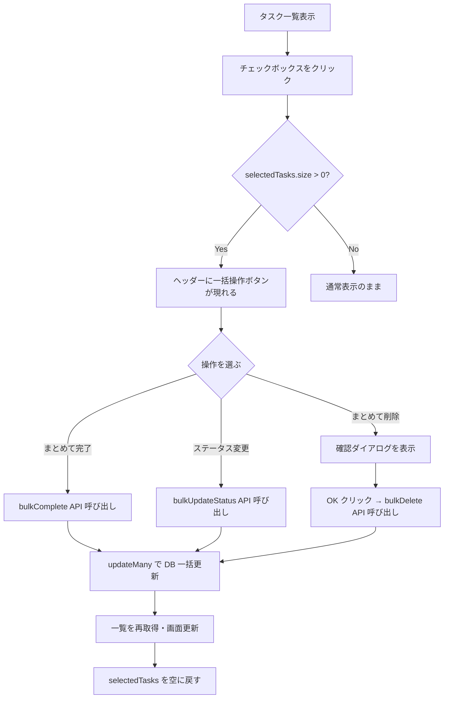
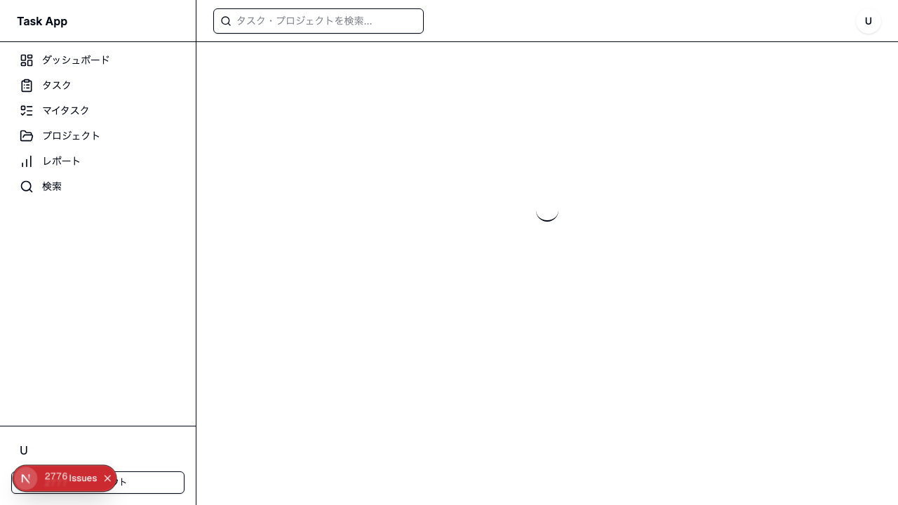

# Day 28: タスク一括操作を実装しよう

## 前回の振り返り

Day 27 では、プロジェクト詳細ページとアーカイブ機能を実装しました。動的ルート `[id]` でプロジェクトごとの専用ページを作り、`isArchived` フラグで論理削除を実現しましたね。今日はそこで学んだ「状態管理」の応用として、タスク一覧での **一括操作** に挑戦します。

---

## 🎯 今日のゴール

チェックボックスで複数のタスクを選択し、「まとめて完了」「ステータス一括変更」「まとめて削除（確認ダイアログあり）」ができる機能を実装します。


---

## 🤔 なぜこれを作るのか？

タスクが 100 件あるとき、1 件ずつ「完了」ボタンを押すのは苦痛です。スーパーのセルフレジで商品を 1 個ずつ別々に会計するようなもの。まとめてカゴに入れて、一度に精算できれば効率的ですよね。

> 💡 **例え話**: 一括操作は「まとめ買い」と同じです。スーパーで 1 個ずつレジに持っていくより、カゴにまとめてから一度に精算する方が速い。データベースも同じで、100 回の更新コマンドより「この 100 件を一度にまとめて更新して」と伝える方が圧倒的に速いです。

---

### 📐 一括操作の全体像



---

### やること / やらないこと

| やること | やらないこと |
|---------|-------------|
| チェックボックスで複数選択 | ドラッグ選択（範囲選択） |
| 全選択・一部選択・全解除の 3 状態チェックボックス | キーボードショートカット |
| まとめて完了（`completedAt` も記録） | 一括アサイン変更 |
| まとめて削除（確認ダイアログあり） | 一括優先度変更 |
| DropdownMenu によるステータス一括変更 | ページをまたいだ選択 |

---

### 🆕 今日学ぶ概念

| 概念 | 読み方 | 役割 | 例え |
|------|--------|------|------|
| `Set<string>` | セット | 重複なし集合。チェック済み ID を管理 | 出席簿（同じ人は 2 回書かない） |
| `indeterminate` | インデターミネイト | チェックボックスの「部分選択」状態 | 「一部選択中」を示す — でもなく ✓ でもない |
| `updateMany` | アップデートメニー | 複数レコードを一度に更新 | 授業で「全員起立」と言うのと同じ |
| `isTaskStatus` | イズタスクステータス | 型ガード。不明な値が `TaskStatus` か確認する | 身分証明書のチェック |
| `completedAt` | コンプリーテッドアット | 完了した日時を記録するフィールド | タイムカードの退勤打刻 |

---

### 📊 実装ステップ一覧

| ステップ | 作業内容 | 所要時間 | 触るファイル | 成功状態 |
|---------|---------|---------|-------------|---------|
| Step 1 | tRPC ルーターを読んで理解する | 5 分 | `task.ts`（読むだけ） | 3 つの bulk API が説明できる |
| Step 2 | 選択状態を管理する state を作る | 7 分 | `src/app/task/page.tsx` | state が正しく動作する |
| Step 3 | チェックボックス付きタスクカードを作る | 8 分 | `src/app/task/page.tsx` | 各カードにチェックボックスが表示される |
| Step 4 | 3 状態チェックボックスで全選択を実装する | 6 分 | `src/app/task/page.tsx` | 全選択・部分選択・全解除が切り替わる |
| Step 5 | ヘッダーに一括操作ボタンを追加する | 7 分 | `src/app/task/page.tsx` | 選択時にボタンが現れる |
| Step 6 | 一括完了を実装する | 5 分 | `src/app/task/page.tsx` | まとめて完了できる |
| Step 7 | 確認ダイアログ付き一括削除を実装する | 7 分 | `src/app/task/page.tsx` | 確認後にまとめて削除できる |
| Step 8 | DropdownMenu でステータス一括変更を実装する | 7 分 | `src/app/task/page.tsx` | ステータス変更が動作する |
| Step 9 | 動作確認と仕上げ | 4 分 | — | 一括操作が完全に動く |

**合計時間**: 約 56 分

---

## Step 1: tRPC ルーターを読んで理解する（5 分）

🎯 **ゴール**: サーバー側にどんな API が用意されているか把握し、なぜ `updateMany` と `completedAt` を使うのか理解する。

まずサーバー側のコードを読みましょう。すでに実装済みの API が 3 つあります。

```typescript
// filepath: src/server/api/routers/task.ts（読むだけ）
bulkComplete: protectedProcedure
  .input(z.object({
    ids: z.array(z.string().cuid()).min(1)
  }))
  .mutation(async ({ ctx, input }) => {
    await findTasksWithPermission(
      input.ids, ctx.session.userId
    );
    const completedAt = new Date();
    return await prisma.task.updateMany({
      where: { id: { in: input.ids } },
      data: { status: TASK_STATUS.DONE, completedAt },
    });
  }),
```

**`completedAt` を一緒に更新する理由**

`bulkComplete` は `status` を `DONE` にするだけでなく、`completedAt` にも現在時刻を記録します。これは「いつ完了したか」の履歴を残すためです。後から「今週何件完了したか」を集計するときに役立ちます。単に状態を変えるだけでは、完了した事実の証拠が残りません。

| 更新する値 | 理由 |
|----------|------|
| `status: DONE` | 表示上「完了」にするため |
| `completedAt: new Date()` | 完了した日時を記録するため（分析・履歴用） |

`{ id: { in: input.ids } }` は「ID がこのリストの中にあるもの全部」という意味です。SQL では `WHERE id IN (...)` と書くのと同じです。

**`bulkUpdateStatus` の `completedAt` 管理**

```typescript
// filepath: src/server/api/routers/task.ts（読むだけ）
bulkUpdateStatus: protectedProcedure
  .input(z.object({
    ids: z.array(z.string().cuid()).min(1),
    status: taskStatusSchema,
  }))
  .mutation(async ({ ctx, input }) => {
    await findTasksWithPermission(
      input.ids, ctx.session.userId
    );
    const data: Prisma.TaskUpdateManyMutationInput = {
      status: input.status,
    };
    if (input.status === TASK_STATUS.DONE) {
      data.completedAt = new Date();
    } else {
      data.completedAt = null;
    }
    return await prisma.task.updateMany({
      where: { id: { in: input.ids } },
      data,
    });
  }),
```

`DONE` 以外のステータスに変更するときは `completedAt` を `null` にリセットしています。「完了を取り消した」のだから記録も消す、という一貫したデータ設計です。

**`updateMany` と 1 件ずつの比較**

| 方法 | DB アクセス回数 | 速度 |
|------|--------------|------|
| `for` ループ + `update` | タスク数と同じ（100 件 → 100 回） | 遅い |
| `updateMany` | 1 回 | 速い |

✅ **確認ポイント**:
- `bulkComplete`・`bulkDelete`・`bulkUpdateStatus` の 3 つの API がある
- `bulkComplete` は `status` と `completedAt` を同時に更新する
- `updateMany` が「まとめて更新」のキーワード
- `ids` は文字列の配列（複数のタスク ID）が渡ってくる

---

## Step 2: 選択状態を管理する state を作る（7 分）

🎯 **ゴール**: どのタスクにチェックが入っているかを `Set` で管理し、操作関数を定義する。

チェックボックスの状態管理には `Set`（セット）を使います。`Set` は「重複のない集合」で、「この ID はもう入ってるから追加しない」を自動でやってくれます。

**なぜ `Set` を使うのか？**

| 操作 | 配列の場合 | Set の場合 |
|------|-----------|-----------|
| 追加（重複チェックあり） | `if (!arr.includes(id)) arr.push(id)` | `set.add(id)` |
| 削除 | `arr.filter(x => x !== id)` | `set.delete(id)` |
| 含まれるか確認 | `arr.includes(id)` | `set.has(id)` |

実際のコードを確認しましょう。`useState` だけを使います（`useCallback` は不要です）。

```typescript
// filepath: src/app/task/page.tsx
// コンポーネント内に state を追加
const [selectedTasks, setSelectedTasks] =
  useState<Set<string>>(new Set());
const [bulkDeleteDialogOpen, setBulkDeleteDialogOpen] =
  useState(false);
```

次に、1 件のチェック状態を変える関数を定義します。

```typescript
// filepath: src/app/task/page.tsx
const handleTaskSelect = (
  taskId: string, checked: boolean
) => {
  setSelectedTasks((prev) => {
    const next = new Set(prev);
    checked ? next.add(taskId) : next.delete(taskId);
    return next;
  });
};
```

`handleTaskSelect` は `(taskId, checked)` の 2 引数を受け取ります。`checked` が `true` なら追加、`false` なら削除という、シンプルな設計です。

**なぜ `new Set(prev)` でコピーするのか？**

React では state を直接変更してはいけません。`prev.add(id)` と書くと元の Set を変更してしまいます。`new Set(prev)` で新しい Set を作ってから変更することで、React が「状態が変わった！」と検知して画面を更新してくれます。

全選択・全解除は 1 つの関数で処理します。

```typescript
// filepath: src/app/task/page.tsx
const handleSelectAll = (checked: boolean) => {
  setSelectedTasks(
    checked
      ? new Set(tasks?.map((t) => t.id) ?? [])
      : new Set()
  );
};
```

`checked` が `true` なら全タスクの ID を Set に詰める、`false` なら空の Set で上書き。2 つの関数（`selectAll`/`clearSelection`）に分けず、**1 つの関数** で管理するのが実際のコードのスタイルです。

✅ **確認ポイント**:
- `selectedTasks` が `Set<string>` 型で定義されている
- `bulkDeleteDialogOpen` の state も一緒に追加されている
- `handleTaskSelect(taskId, checked)` が 2 引数を受け取る
- `handleSelectAll(checked)` の 1 つの関数で全選択・全解除ができる
- `new Set(prev)` でコピーしてから変更している

---

## Step 3: チェックボックス付きタスクカードを作る（8 分）

🎯 **ゴール**: 各タスクの隣にチェックボックスを追加し、`TaskCard` と並べてグリッド表示する。



実際のコードでは `<p>` タグではなく `TaskCard` コンポーネントをグリッドで並べています。チェックボックスはカードの左側に配置します。

```typescript
// filepath: src/app/task/page.tsx
import { Checkbox } from '@/component/ui/checkbox';
import { TaskCard } from '@/component/task/task-card';

// タスク一覧の grid レイアウト
<div className="grid gap-6 sm:grid-cols-2 lg:grid-cols-3 xl:grid-cols-4">
  {tasks && tasks.length > 0 ? (
    tasks.map((task) => (
      <div
        key={task.id}
        className="flex gap-2 items-start h-full"
      >
        <Checkbox
          checked={selectedTasks.has(task.id)}
          onCheckedChange={(checked) =>
            handleTaskSelect(task.id, checked === true)
          }
          className="mt-4"
        />
```

各タスクカードは `flex-1 min-w-0 h-full` のラッパーで囲み、`TaskCard` に props を渡します。タスクがない場合は空メッセージを表示します。

```typescript
// filepath: src/app/task/page.tsx
        <div className="flex-1 min-w-0 h-full">
          <TaskCard
            id={task.id}
            title={task.title}
            description={task.description}
            status={task.status}
            priority={task.priority}
            dueDate={task.dueDate}
            assignee={task.assignee}
            onEdit={handleEdit}
            onDelete={handleDelete}
            onClick={handleTaskClick}
          />
        </div>
      </div>
    ))
  ) : (
    <p>タスクが見つかりません。</p>
  )}
</div>
```

**`onCheckedChange={(checked) => handleTaskSelect(task.id, checked === true)}`**

`onCheckedChange` は `boolean | 'indeterminate'` 型の値を渡してくることがあります。`checked === true` と比較することで確実に `boolean` 型に絞り込んでから `handleTaskSelect` に渡しています。

**`className="mt-4"` をチェックボックスに付ける理由**

カードの上部にタイトルが来ます。チェックボックスを `mt-4` でずらすことで、カードのタイトルと視覚的に揃い、選択しやすくなります。

**`flex-1 min-w-0 h-full` の意味**

| クラス | 意味 |
|--------|------|
| `flex-1` | 残りの幅を全部カードに使う |
| `min-w-0` | テキストがはみ出さないよう制限 |
| `h-full` | カードの高さを親要素に合わせる |

✅ **確認ポイント**:
- 各タスクカードの左側にチェックボックスが表示される
- チェックを入れると `selectedTasks` に ID が追加される
- 再度クリックするとチェックが外れる
- `npm run dev` でエラーが出ない

---

## Step 4: 3 状態チェックボックスで全選択を実装する（6 分）

🎯 **ゴール**: 「全選択 / 部分選択 / 全解除」の 3 状態を 1 つのチェックボックスで表現する。


チェックボックスには 3 つの状態があります。

| `selectAllState` の値 | 表示 | 意味 |
|---------------------|------|------|
| `false` | □（未チェック） | 1 件も選択されていない |
| `'indeterminate'` | ▪（部分チェック） | 一部のタスクだけ選択されている |
| `true` | ✓（全チェック） | 全タスクが選択されている |

```typescript
// filepath: src/app/task/page.tsx
// selectAllState を計算する（JSX の外、コンポーネント内で定義）
const selectAllState =
  tasks && tasks.length > 0
    ? selectedTasks.size === 0
      ? false
      : selectedTasks.size === tasks.length
        ? true
        : 'indeterminate'
    : false;
```

この値をチェックボックスに渡します。

```typescript
// filepath: src/app/task/page.tsx
import { Label } from '@/component/ui/label';

// フィルター行の先頭に配置
<div className="flex items-center space-x-2">
  <Checkbox
    id="select-all"
    checked={selectAllState}
    onCheckedChange={(checked) =>
      handleSelectAll(checked === true)
    }
  />
  <Label htmlFor="select-all">すべて選択</Label>
</div>
```

**`indeterminate` が重要な理由**

ユーザーが「一部選択されている」ことを一目で把握できます。この状態がないと、ヘッダーのチェックボックスを見ただけでは「全未選択」と「全選択」しか判断できません。細かな UX の配慮が、使いやすさを大きく左右します。

**`checked === true` にする理由**

`onCheckedChange` は `boolean | 'indeterminate'` を渡してきます。`indeterminate` のときに `handleSelectAll` を呼ぶと意図しない動作をするため、明示的に `=== true` で絞り込みます。

✅ **確認ポイント**:
- 全未選択のとき、ヘッダーのチェックボックスが未チェック（□）
- 一部選択のとき、ヘッダーのチェックボックスが `indeterminate`（▪）
- 全選択のとき、ヘッダーのチェックボックスがチェック（✓）
- ヘッダーのチェックボックスをクリックして全選択・全解除が切り替わる

---

## Step 5: ヘッダーに一括操作ボタンを追加する（7 分）

🎯 **ゴール**: 1 件以上選択されているときだけ、ページヘッダーに一括操作ボタンを表示する。

実際のコードでは、一括操作ボタンは **画面下部の固定バーではなく、ページヘッダーの右側** に配置されています。


```typescript
// filepath: src/app/task/page.tsx
// ページのタイトル行（h1 と操作ボタンが並ぶ行）
<div className="flex items-center justify-between">
  <div className="flex items-center gap-3">
    <h1 className="text-3xl font-bold tracking-tight">
      タスク
    </h1>
    {selectedTasks.size > 0 && (
      <span className="text-sm text-muted-foreground">
        ({selectedTasks.size}件選択中)
      </span>
    )}
  </div>
  <div className="flex items-center gap-2">
    {selectedTasks.size > 0 && (
      <>
        {/* Step 6, 7, 8 でボタンを追加 */}
      </>
    )}
    <Button onClick={handleCreate}>
      <Plus className="mr-2 h-4 w-4" /> 新規タスク
    </Button>
  </div>
</div>
```

**なぜ固定バーではなくヘッダーに配置するのか？**

| 配置場所 | 特徴 |
|---------|------|
| `fixed bottom-0`（固定バー） | どこにいても見えるが、コンテンツに重なることがある |
| ヘッダーの右側 | ページトップにいれば常に見える。コンテンツを隠さない |

今回のアプリではタスクカードがグリッド表示で、スクロール量がさほど多くないためヘッダーに配置しています。

**`{selectedTasks.size > 0 && (...)}` のパターン**

React で「条件が真のときだけ描画する」定番パターンです。`selectedTasks.size` が 0 のときは `false` と評価されるため何も描画されず、1 以上のときだけ JSX が描画されます。

✅ **確認ポイント**:
- タスクを 1 件も選択していないとき、「新規タスク」ボタンだけが表示される
- タスクを 1 件以上選択すると「(N 件選択中)」の文字が現れる
- 一括操作ボタンが追加される領域（`<>...</>` の中）が確保されている
- `npm run dev` でエラーが出ない

---

## Step 6: 一括完了を実装する（5 分）

🎯 **ゴール**: 「完了にする」ボタンを押すと、選択したタスクの `status` と `completedAt` がまとめて更新される。

まず mutation を定義します。

```typescript
// filepath: src/app/task/page.tsx
import { CheckSquare } from 'lucide-react';

const bulkCompleteMutation =
  api.task.bulkComplete.useMutation({
    onSuccess: () => {
      utils.task.getAll.invalidate();
      setSelectedTasks(new Set());
    },
  });

const handleBulkComplete = () => {
  if (selectedTasks.size > 0) {
    bulkCompleteMutation.mutate({
      ids: Array.from(selectedTasks),
    });
  }
};
```

ヘッダーの一括操作ボタン領域に追加します。

```typescript
// filepath: src/app/task/page.tsx
// {selectedTasks.size > 0 && (...)} の中に追加
<Button
  variant="outline"
  size="sm"
  onClick={handleBulkComplete}
>
  <CheckSquare className="mr-2 h-4 w-4" />
  完了にする
</Button>
```

**`Array.from(selectedTasks)` が必要な理由**

`selectedTasks` は `Set<string>` 型ですが、tRPC の `bulkComplete` は `string[]`（配列）を期待しています。`Array.from()` で Set を配列に変換してから渡します。

**`utils.task.getAll.invalidate()` の意味**

tRPC は一度取得したデータをキャッシュ（記憶）しています。データが変わったら再取得が必要です。`invalidate()` は「このキャッシュは古い、再取得して」と指示する関数です。`onSuccess` で呼ぶことで、API 成功後に自動で最新のタスク一覧が表示されます。

**`setSelectedTasks(new Set())` で選択状態をリセットする理由**

操作が完了したあとも選択状態が残っていると、ユーザーが「さっきの操作は終わったの？」と混乱します。`onSuccess` でリセットすることで、「操作完了 → 選択が消える」という明確なフィードバックになります。

✅ **確認ポイント**:
- 複数のタスクを選択して「完了にする」を押すと、対象タスクのステータスが「完了」に変わる
- 操作後にタスク一覧が再取得される
- 操作後に `selectedTasks` が空になり、チェックが消える

---

## Step 7: 確認ダイアログ付き一括削除を実装する（7 分）

🎯 **ゴール**: 「削除」ボタンを押すと確認ダイアログが開き、OK 後にまとめて削除する。

削除は取り消せない操作のため、必ず確認ダイアログを挟みます。

```typescript
// filepath: src/app/task/page.tsx
import { Trash2 } from 'lucide-react';
import { DeleteConfirmDialog } from '@/component/ui/delete-confirm-dialog';

const bulkDeleteMutation =
  api.task.bulkDelete.useMutation({
    onSuccess: () => {
      utils.task.getAll.invalidate();
      setSelectedTasks(new Set());
    },
  });

const handleBulkDelete = () => {
  if (selectedTasks.size > 0) {
    setBulkDeleteDialogOpen(true);
  }
};
```

`handleBulkDelete` は **削除を実行しない**点に注目してください。ダイアログを開くだけです。実際の削除は、ダイアログで OK を押したときに実行されます。

ヘッダーにボタンとダイアログを追加します。

```typescript
// filepath: src/app/task/page.tsx
// ヘッダーの一括操作ボタン領域に追加
<Button
  variant="outline"
  size="sm"
  className="text-destructive hover:text-destructive"
  onClick={handleBulkDelete}
>
  <Trash2 className="mr-2 h-4 w-4" /> 削除
</Button>
```

ページ最下部（`AppLayout` の外側）に `DeleteConfirmDialog` を配置します。

```typescript
// filepath: src/app/task/page.tsx
// JSX の末尾、AppLayout の後に追加
<DeleteConfirmDialog
  open={bulkDeleteDialogOpen}
  onOpenChange={setBulkDeleteDialogOpen}
  onConfirm={() => {
    bulkDeleteMutation.mutate({
      ids: Array.from(selectedTasks),
    });
  }}
  isPending={bulkDeleteMutation.isPending}
  title={`${selectedTasks.size}件のタスクを削除しますか？`}
/>
```

**なぜダイアログを挟むのか？**

| 操作の種類 | ダイアログの有無 | 理由 |
|-----------|---------------|------|
| 完了にする | 不要 | 元に戻せる（ステータス変更で戻せる） |
| ステータス変更 | 不要 | 元に戻せる |
| 削除 | **必要** | 元に戻せない（DBから消える） |

✅ **確認ポイント**:
- 「削除」ボタンをクリックすると確認ダイアログが開く
- ダイアログをキャンセルするとタスクは削除されない
- ダイアログで OK を押すと、選択したタスクが削除される
- 削除後にタスク一覧が再取得され、選択が解除される

---

## Step 8: DropdownMenu でステータス一括変更を実装する（7 分）

🎯 **ゴール**: 「ステータス変更」ドロップダウンから選んで、選択したタスクのステータスをまとめて変更する。

ステータス変更には `Select` コンポーネントではなく `DropdownMenu` を使います。

```typescript
// filepath: src/app/task/page.tsx
import {
  DropdownMenu,
  DropdownMenuContent,
  DropdownMenuItem,
  DropdownMenuTrigger,
} from '@/component/ui/dropdown-menu';
import {
  isTaskStatus,
  TASK_STATUS_LABELS,
  type TaskStatus,
} from '@/lib/constant/status';
```

`isTaskStatus` は型ガード関数で、文字列が `TaskStatus` 型であることを保証します。mutation と handler は以下のように定義します。

```typescript
// filepath: src/app/task/page.tsx
const bulkUpdateStatusMutation =
  api.task.bulkUpdateStatus.useMutation({
    onSuccess: () => {
      utils.task.getAll.invalidate();
      setSelectedTasks(new Set());
    },
  });

const handleBulkUpdateStatus = (status: TaskStatus) => {
  if (selectedTasks.size > 0) {
    bulkUpdateStatusMutation.mutate({
      ids: Array.from(selectedTasks),
      status,
    });
  }
};
```

ヘッダーの一括操作ボタン領域に追加します。

```typescript
// filepath: src/app/task/page.tsx
<DropdownMenu>
  <DropdownMenuTrigger asChild>
    <Button variant="outline" size="sm">
      ステータス変更
    </Button>
  </DropdownMenuTrigger>
  <DropdownMenuContent>
    {Object.entries(TASK_STATUS_LABELS).map(
      ([value, label]) => (
        <DropdownMenuItem
          key={value}
          onClick={() => {
            if (isTaskStatus(value)) {
              handleBulkUpdateStatus(value);
            }
          }}
        >
          {label}
        </DropdownMenuItem>
      )
    )}
  </DropdownMenuContent>
</DropdownMenu>
```

**`isTaskStatus` 型ガードが必要な理由**

`Object.entries(TASK_STATUS_LABELS)` の `value` は TypeScript では `string` 型として推論されます。しかし `handleBulkUpdateStatus` は `TaskStatus`（`'TODO' | 'IN_PROGRESS' | ...`）を期待しています。`isTaskStatus(value)` で「この文字列は確かに有効なステータスか？」を確認することで、型安全に呼び出せます。

```typescript
// src/lib/constant/status.ts の isTaskStatus
export function isTaskStatus(value: unknown): value is TaskStatus {
  return typeof value === 'string' && value in TASK_STATUS;
}
```

この関数は `value in TASK_STATUS` で「`TASK_STATUS` オブジェクトにこのキーが存在するか」をチェックし、型ガードとして機能します。

**`DropdownMenu` vs `Select` の違い**

| コンポーネント | 適した場面 |
|-------------|----------|
| `Select` | フォーム内の入力欄（選択後に値を保持したい） |
| `DropdownMenu` | 操作のトリガー（選択後に値は保持しない） |

ステータス変更は「選択 → 即実行」の操作なので、`DropdownMenu` が適しています。`Select` を使うと「選択した値を保持する」機能が邪魔になります。

✅ **確認ポイント**:
- 「ステータス変更」をクリックするとドロップダウンが開く
- ドロップダウンにすべてのステータスが表示される
- ステータスを選ぶと選択中タスクのステータスがまとめて変わる
- 変更後に一覧が再取得され、選択が解除される

---

## Step 9: 動作確認と仕上げ（4 分）

🎯 **ゴール**: 一括操作機能の全体が正常に動作することを最終確認する。


以下のチェックリストで動作確認をしましょう。

| テスト項目 | 操作 | 期待結果 |
|-----------|------|---------|
| 個別選択 | タスクカードのチェックボックスをクリック | チェックが入り、ヘッダーにボタンが現れる |
| 個別解除 | 選択済みチェックボックスをクリック | チェックが外れる。0 件でボタンが消える |
| 全選択 | 「すべて選択」チェックボックスをクリック | 全タスクが選択される（indeterminate は全選択に変わる） |
| 全解除 | 全選択中に「すべて選択」をクリック | 全タスクの選択が解除される |
| 一部選択表示 | 一部だけチェックを入れる | ヘッダーのチェックボックスが indeterminate になる |
| まとめて完了 | 3 件選択して「完了にする」をクリック | 3 件が「完了」ステータスに変わる |
| 削除キャンセル | 2 件選択して「削除」→ ダイアログでキャンセル | タスクは削除されない |
| まとめて削除 | 2 件選択して「削除」→ ダイアログで OK | 2 件がリストから消える |
| ステータス変更 | 5 件選択して「ステータス変更」→「進行中」 | 5 件が「進行中」に変わる |

最後に TypeScript の型チェックとリントを確認します。

```bash
# filepath: （プロジェクトルートで実行）
npm run lint
```

エラーがなければ完成です。

✅ **確認ポイント**:
- 上記のテスト項目がすべてパスする
- `npm run lint` でエラーが出ない
- `npm run dev` でブラウザにエラーが出ない

---

## 🎉 Day 28 完了！

### 今日学んだこと

| 概念 | 意味 | 使い場面 |
|------|------|---------|
| `Set<string>` | 重複なしの集合 | チェックボックスの選択 ID 管理 |
| `indeterminate` | チェックボックスの「部分選択」状態 | 全選択ヘッダーで一部選択を表現 |
| `updateMany` | 複数レコードを 1 回の DB アクセスで更新 | 一括操作・バッチ処理全般 |
| `isTaskStatus` 型ガード | 文字列が `TaskStatus` か実行時に確認 | DropdownMenu の値を型安全に扱う |
| `completedAt` の同時更新 | 完了日時も一緒に記録する | 完了操作で status と completedAt をセット |
| `DropdownMenu` vs `Select` | 操作トリガー vs フォーム入力 | ステータス変更には DropdownMenu が適切 |
| `Array.from(set)` | Set を API に渡せる配列に変換 | tRPC の mutation に渡すとき |
| `invalidate()` | キャッシュを無効化して再取得 | データ変更後の画面更新 |

---

### 詰まりやすいポイントまとめ

| 症状 | 原因 | 解決策 |
|------|------|--------|
| `selectedIds` という変数名でエラーになる | 実際のコードは `selectedTasks` を使う | 変数名を `selectedTasks` / `setSelectedTasks` に統一する |
| 型エラー: `string` is not assignable to `TaskStatus` | `isTaskStatus` 型ガードがない | `if (isTaskStatus(value))` で囲んでから呼ぶ |
| 削除が確認なしで即実行される | `setBulkDeleteDialogOpen(true)` を呼んでいない | `handleBulkDelete` でダイアログを開く流れに修正 |
| 操作後に画面が更新されない | `invalidate()` を呼んでいない | `onSuccess` の中で `utils.task.getAll.invalidate()` を追加 |
| チェックが入ったまま残る | `setSelectedTasks(new Set())` を呼んでいない | `onSuccess` で空の Set にリセットする |
| 全選択チェックボックスが動かない | `tasks` が `undefined` のときを考慮していない | `tasks?.map(...)  ?? []` と書く |

---

### 📝 次回予告

Day 29 では、ユーザー詳細・編集ページを作ります。Next.js の動的ルーティング `[id]` を使って、ユーザーごとの専用ページを実装します。
