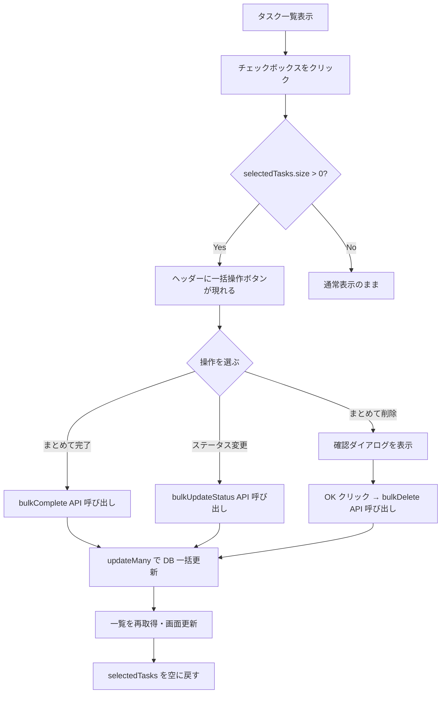
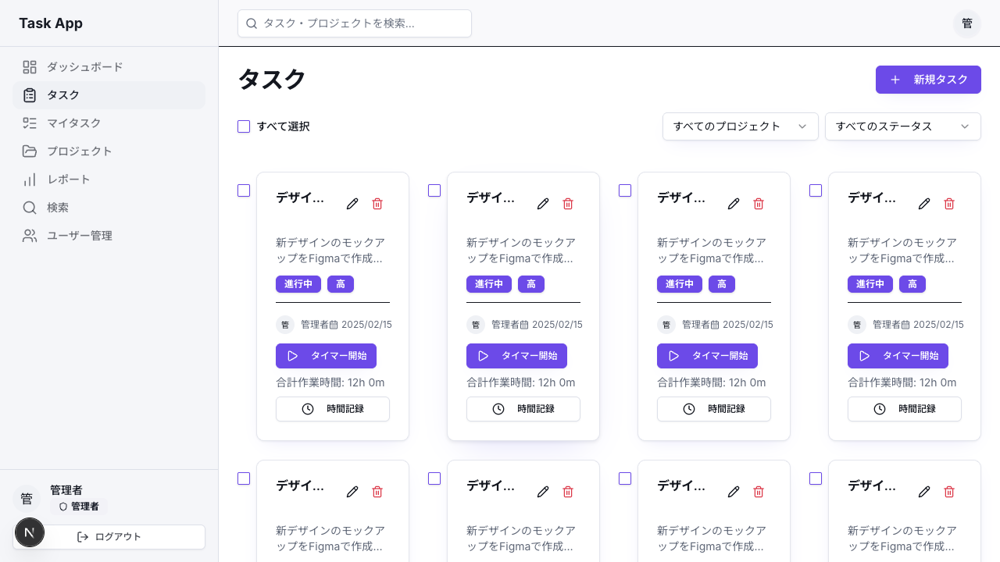
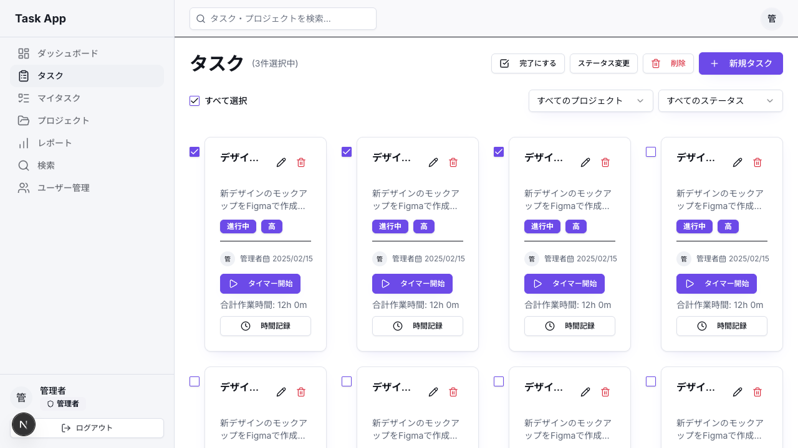

# Day 28: タスク一括操作を実装しよう

## 前回の振り返り

Day 27 では、`/project?projectId=...` で
一覧と詳細を切り替え、`isArchived` フラグによる
アーカイブ機能を確認しました。

今日はそこで学んだ「状態管理」の応用として、タスク一覧での **一括操作** に挑戦します。

---

## 今日のゴール

チェックボックスで複数のタスクを選択し、「まとめて完了」「ステータス一括変更」「まとめて削除（確認ダイアログあり）」ができる機能を実装します。

この日は、まずサーバー側の一括操作 API（3種類）を自分で書きます。そのあと画面をつなぎます。

スクリーンショット: タスク一括操作の完成画面の表示を確認してください。


> **今日のゴールライン**: Setで選択中タスクを管理し、完了・削除・ステータス変更をまとめて動かせれば大丈夫です。

---

## 始める前の前提

- Day 27 のプロジェクト詳細とアーカイブ機能が動いている
- `/task` に複数のタスクが表示されている
- 一括削除を試すため、消えてもよい練習用タスクを用意している
- `src/server/api/routers/task.ts` と `src/app/task/page.tsx` を編集できる

> Day 13〜16 で作った import、`TaskCard`、
> `DeleteConfirmDialog`、時間記録機能は残します。
> 同じ import やコンポーネントを追加し直さず、
> 既存コードへ一括操作だけを統合してください。

---

## なぜこれを作るのか

タスクが 100 件あるとき、1 件ずつ「完了」ボタンを押すのは苦痛です。スーパーのセルフレジで商品を 1 個ずつ別々に会計するようなものです。まとめてカゴに入れて一度に精算できれば、操作は一気に減ります。

> **例え話**: 一括操作は「まとめ買い」と同じです。スーパーで 1 個ずつレジに持っていくより、カゴにまとめてから一度に精算する方が速いです。データベースも同じで、100 回の更新コマンドより「この 100 件を一度にまとめて更新して」と伝える方が圧倒的に速いです。

---

### 一括操作の全体像


```mermaid
flowchart TD
    A[タスク一覧表示] --> B[チェックボックスをクリック]
    B --> C{selectedTasks.size > 0?}
    C -->|Yes| D[ヘッダーに一括操作ボタンが現れる]
    C -->|No| E[通常表示のまま]
    D --> F{操作を選ぶ}
    F -->|まとめて完了| G[bulkComplete API 呼び出し]
    F -->|ステータス変更| H[bulkUpdateStatus API 呼び出し]
    F -->|まとめて削除| I[確認ダイアログを表示]
    I --> J[OK クリック → bulkDelete API 呼び出し]
    G --> K[updateMany で DB 一括更新]
    H --> K
    J --> K
    K --> L[一覧を再取得・画面更新]
    L --> M[selectedTasks を空に戻す]
```

この図で目を留めてほしいのは、G・H・J の3本が K に合流するところです。完了・ステータス変更・削除のどれを選んでも、行き着く先は「DB へ1回だけ書き込む」「一覧を取り直す」「選択を空に戻す」という同じ3手です。だから Step 6 以降で操作を増やすときに新しく考えるのは、呼ぶ API の名前だけになります。

逆に L と M を落とすと何が起きるかも押さえてください。削除したはずのタスクが画面に残り、チェックも入ったままになります。サーバー側は正しく変わっているのに画面だけが古い、という一番気付きにくいずれ方です。

---

### やること / やらないこと

| やること | やらないこと |
|---------|-------------|
| チェックボックスで複数選択 | ドラッグ選択（範囲選択） |
| 全選択・一部選択・全解除の 3 状態チェックボックス | キーボードショートカット |
| まとめて完了（`completedAt` も記録） | 一括アサイン変更 |
| まとめて削除（確認ダイアログあり） | 優先度をまとめて変更 |
| DropdownMenu によるステータス一括変更 | ページをまたいだ選択 |

---

### 新しく学ぶ概念

| 概念 | 読み方 | 役割 | 例え |
|------|--------|------|------|
| `Set<string>` | セット | 重複なし集合。チェック済み ID を管理 | 出席簿（同じ人は 2 回書かない） |
| `indeterminate` | インデターミネイト | チェックボックスの「部分選択」状態 | 全部チェックでも空でもない、一部だけ選ばれた中間の状態 |
| `updateMany` | アップデートメニー | 複数レコードを一度に更新 | 授業で「全員起立」と言うのと同じ |
| `isTaskStatus` | イズタスクステータス | 型ガード。不明な値が `TaskStatus` か確認する | 身分証明書のチェック |
| `completedAt` | コンプリーテッドアット | 完了した日時を記録するフィールド | タイムカードの退勤打刻 |

---

### 実装ステップ一覧

| ステップ | 作業内容 | 所要時間 | 触るファイル | 成功状態 |
|---------|---------|---------|-------------|---------|
| Step 0 | タスク一括操作 API（bulk 3種）を自分で書く | 20 分 | `task.ts` | 3 つの bulk API を写経して登録できる |
| Step 1 | 選択状態を管理する state を作る | 7 分 | `src/app/task/page.tsx` | state が正しく動作する |
| Step 2 | チェックボックス付きタスクカードを作る | 8 分 | `src/app/task/page.tsx` | 各カードにチェックボックスが表示される |
| Step 3 | まず「全選択 / 全解除」チェックボックスを作る | 4 分 | `src/app/task/page.tsx` | 全選択・全解除が切り替わる |
| Step 4 | 部分選択を `indeterminate` で表現する | 4 分 | `src/app/task/page.tsx` | 全選択・部分選択・全解除が切り替わる |
| Step 5 | ヘッダーに一括操作ボタンを追加する | 7 分 | `src/app/task/page.tsx` | 選択時にボタンが現れる |
| Step 6 | 一括完了を実装する | 5 分 | `src/app/task/page.tsx` | まとめて完了できる |
| Step 7 | 確認ダイアログ付き一括削除を実装する | 7 分 | `src/app/task/page.tsx` | 確認後にまとめて削除できる |
| Step 8 | DropdownMenu でステータス一括変更を実装する | 7 分 | `src/app/task/page.tsx` | ステータス変更が動作する |
| Step 9 | 動作確認と仕上げ | 4 分 | — | 一括操作が一通り動く |

**合計時間**: 約 73 分です。

この時間はコードを読んで理解する目安です。写経して打ち込む時間、詰まって調べる時間は別に見てください。

---

### Step 0: タスク一括操作 API（bulk 3種）を自分で書く（20 分）

**ゴール**: 複数のタスクをまとめて処理する `bulkComplete`・`bulkDelete`・`bulkUpdateStatus` を自分で書き、`api.task.bulkComplete` などを呼べる状態にします。この3つは、このあと Step 6〜8 で画面のボタンから呼び出します。

Day 13〜16 で `task.ts` に、1件ずつ扱う手続きを積み上げてきました。今日はそこへ、複数のタスクを一度に処理する3つの手続きを足します。骨組みはこれまでと同じ入力・処理・戻り値の3部品です。ちがうのは、入力が「タスク id の配列」になり、処理が「まとめて更新する」`updateMany` や「まとめて削除する」`deleteMany` になるところです。

#### 0-1. import に一括操作で使う道具を足す

3つの手続きは、渡された id の配列をまとめて権限つきで取る共有ヘルパー `findTasksWithPermission`（複数形）を使います。Day 15 までに書いた `_helpers/permission` の import 文に、この1行を足して次の形にします。

```typescript
// filepath: src/server/api/routers/task.ts（permission の import に findTasksWithPermission を足した完成形）
import {
  assertMemberPermission,
  findTasksWithPermission,
  findTaskWithPermission,
  getUserProjectIds,
} from './_helpers/permission';
```

`findTasksWithPermission`（複数形）は、id の配列を受け取り、その全部のタスクを権限つきで取ってくるヘルパーです。Day 15 で使った `findTaskWithPermission`（単数形）の複数版と考えてください。名前が `s` の1文字だけ違うので、取り違えに注意します。`assertMemberPermission` などは前の Day で足したものなので、新しく行を増やさず同じ import 文の中に並べます。

Day 13 で書いた `import { Prisma } from '@prisma/client';` は、次の行へ置き換えます。`ProjectMemberRole` は、書き込み直前にも権限を確認するために使います。

```typescript
// filepath: src/server/api/routers/task.ts（既存の Prisma import を置き換える）
import { Prisma, ProjectMemberRole } from '@prisma/client';
import { hasPermission, type PermissionKey } from '@/lib/constant/roles';
```

`ProjectMemberRole` は、Prisma がスキーマの enum（決まった値だけを許す型）から自動で作ってくれる型です。`'OWNER'` のような文字列を自分で打ち込まずに済むので、綴り違いが型エラーとして先に見つかります。`hasPermission` はロールと権限名を受け取って可否を返す関数、`PermissionKey` は `'canEdit'` のような権限名だけを許す型です。

この3つがそろうと、次の 0-2 で「編集できるロールはどれか」を権限マップから計算できます。ここを `['OWNER', 'ADMIN']` と手書きしてしまうと、あとで権限の決まりを直したときに一括操作だけが古い判定のまま取り残されます。

#### 0-2. 件数上限と書き込み条件を作る

一度に受け付ける件数と、重複を拒否する ID 配列スキーマを作ります。編集・削除できるロールは権限マップから導出し、権限定義を二重管理しません。`taskTimeUpdateSchema` の直後へ追加してください。

```typescript
// filepath: src/server/api/routers/task.ts（taskTimeUpdateSchema の直後に追加）
const MAX_BULK_TASKS = 100;
const bulkTaskIdsSchema = z
  .array(z.string().cuid())
  .min(1)
  .max(MAX_BULK_TASKS)
  .refine(
    (ids) => new Set(ids).size === ids.length,
    'タスクIDを重複して指定できません',
  );
const getRolesWithPermission = (
  permission: PermissionKey,
): ProjectMemberRole[] =>
  Object.values(ProjectMemberRole).filter(
    (role) => hasPermission(role, permission),
  );
const TASK_EDIT_ROLES =
  getRolesWithPermission('canEdit');
const TASK_DELETE_ROLES =
  getRolesWithPermission('canDelete');
```

`MAX_BULK_TASKS` は巨大な id 配列による DB 負荷を防ぎ、`bulkTaskIdsSchema` は同じ id の二重指定を入力段階で拒否します。ロール配列は `hasPermission` が参照する権限マップから作るため、権限設定を変更しても読み取り側と書き込み側がずれません。

続けて、タスク id と現在の権限を同じ `where` にまとめる部品を書きます。

```typescript
// filepath: src/server/api/routers/task.ts（続き）
const buildBulkPermissionWhere = (
  ids: string[],
  userId: string,
  roles: ProjectMemberRole[],
): Prisma.TaskWhereInput => ({
  id: { in: ids },
  project: {
    members: {
      some: { userId, role: { in: roles } },
    },
  },
});
```

この関数が返すのは、`updateMany` や `deleteMany` の `where` にそのまま渡せる条件です。`id: { in: ids }` で対象のタスクを選び、`project.members.some` で「そのプロジェクトに、必要なロールを持った自分が入っていること」も同時に要求します。

2つの条件を1つの `where` にまとめるのが肝心なところです。id だけで絞ると、他人のプロジェクトのタスク id を混ぜて送りつけられたとき、そのまま書き換わってしまいます。条件をこの関数1か所に置いておけば、これから書く3つの手続きが同じ守り方を共有できます。

最後に、書き込めた件数が入力件数と違った場合に処理を止める部品を追加します。

```typescript
// filepath: src/server/api/routers/task.ts（続き）
const assertBulkWriteCount = (count: number, expected: number) => {
  if (count !== expected) {
    throw new TRPCError({
      code: 'FORBIDDEN',
      message: '一括操作の途中で権限が変更されました。もう一度お試しください',
    });
  }
};
```

一括操作は、最初の権限確認と DB への書き込みの間にロールが変わる可能性も考えます。書き込み側の `where` でも現在のロールを確認し、件数がずれたらトランザクション（途中で失敗した場合に変更全体を取り消すまとまり）を失敗させます。

#### 0-3. bulkComplete を書く（まとめて完了にする）

まず、選んだタスクをまとめて完了にする `bulkComplete` を、Day 16 で書いた `addTime` の直後に足します。

```typescript
// filepath: src/server/api/routers/task.ts（addTime の直後に追加）
  bulkComplete: protectedProcedure
    .input(z.object({ ids: bulkTaskIdsSchema }))
    .mutation(async ({ ctx, input }) => {
      const tasks = await findTasksWithPermission(input.ids, ctx.session.userId);
      for (const task of tasks) {
        assertMemberPermission(task.project.members, 'canEdit');
      }

      const completedAt = new Date();
      return await prisma.$transaction(async (tx) => {
        const result = await tx.task.updateMany({
          where: buildBulkPermissionWhere(input.ids, ctx.session.userId, TASK_EDIT_ROLES),
          data: { status: TASK_STATUS.DONE, completedAt },
        });
        assertBulkWriteCount(result.count, input.ids.length);
        return result;
      });
    }),
```

入力の `ids` は「1件以上、100件以下のタスク id の配列」に絞ります。まず `findTasksWithPermission` と `assertMemberPermission` で入力全体を確認します。書き込み時にも `buildBulkPermissionWhere` で id と現在の編集権限を同時に絞ります。

`$transaction` の中で件数を確認するため、途中で権限が変わり `result.count` が入力件数より少なくなった場合は、更新全体が取り消されます。`status` と同時に `completedAt` へ現在時刻を入れるのは、Day 23 の週次レポートで完了件数を数えるためです。

| 方法 | DB への問い合わせ回数 |
|------|---------------------|
| `for` ループ + `update` | タスク数と同じ（100件なら100回） |
| `updateMany` | 1回 |

#### 0-4. bulkDelete を書く（まとめて削除する）

次に、選んだタスクをまとめて消す `bulkDelete` を、`bulkComplete` の直後に足します。

```typescript
// filepath: src/server/api/routers/task.ts（bulkComplete の直後に追加）
  bulkDelete: protectedProcedure
    .input(z.object({ ids: bulkTaskIdsSchema }))
    .mutation(async ({ ctx, input }) => {
      const tasks = await findTasksWithPermission(input.ids, ctx.session.userId);
      for (const task of tasks) {
        assertMemberPermission(task.project.members, 'canDelete');
      }

      return await prisma.$transaction(async (tx) => {
        const result = await tx.task.deleteMany({
          where: buildBulkPermissionWhere(input.ids, ctx.session.userId, TASK_DELETE_ROLES),
        });
        assertBulkWriteCount(result.count, input.ids.length);
        return result;
      });
    }),
```

流れは `bulkComplete` とよく似ていますが、権限の確認と書き込み条件が削除用になっています。`TASK_DELETE_ROLES` を使うため、編集はできても削除はできない MEMBER を書き込み直前にも除外できます。件数がずれた場合は削除全体を取り消します。

#### 0-5. bulkUpdateStatus を書く（まとめてステータス変更・前半）

最後に、選んだタスクのステータスをまとめて変える `bulkUpdateStatus` を、`bulkDelete` の直後に足します。まず入力と権限確認までを書きます。

```typescript
// filepath: src/server/api/routers/task.ts（bulkDelete の直後に追加）
  bulkUpdateStatus: protectedProcedure
    .input(
      z.object({
        ids: bulkTaskIdsSchema,
        status: taskStatusSchema,
      }),
    )
    .mutation(async ({ ctx, input }) => {
      const tasks = await findTasksWithPermission(input.ids, ctx.session.userId);
      for (const task of tasks) {
        assertMemberPermission(task.project.members, 'canEdit');
      }
```

入力は id の配列に加えて、変更後の `status`（`taskStatusSchema` で検証）も受け取ります。ここまでは `bulkComplete` と同じで、まとめてタスクを取り、`for` で1件ずつ `'canEdit'` 権限を確かめます。ステータスの変更は編集にあたるので、確認する権限は `'canEdit'` です。

#### 0-6. bulkUpdateStatus を書く（後半・完了日時の管理）

続けて、更新するデータを組み立てて `updateMany` を呼びます。

```typescript
// filepath: src/server/api/routers/task.ts（続き）
      const data: Prisma.TaskUpdateManyMutationInput = {
        status: input.status,
      };

      if (input.status === TASK_STATUS.DONE) {
        data.completedAt = new Date();
      } else {
        data.completedAt = null;
      }

      return await prisma.$transaction(async (tx) => {
        const result = await tx.task.updateMany({
          where: buildBulkPermissionWhere(input.ids, ctx.session.userId, TASK_EDIT_ROLES),
          data,
        });
        assertBulkWriteCount(result.count, input.ids.length);
        return result;
      });
    }),
```

`data` に `Prisma.TaskUpdateManyMutationInput` 型を付けているのは、あとから `completedAt` を足し引きするからです。変更後が `DONE` のときだけ現在時刻を入れ、それ以外では `null` に戻します。書き込みは編集用ロールを含む条件で再確認し、件数がずれた場合はトランザクション全体を取り消します。

**確認ポイント**:
- `bulkComplete`・`bulkDelete`・`bulkUpdateStatus` の3つを `addTime` の直後に順に足した
- 3つの `ids` が1件以上・`MAX_BULK_TASKS` 件以下に制限されている
- `findTasksWithPermission`（複数形）で権限を確認してから `updateMany` / `deleteMany` を呼んでいる
- 書き込み側でも現在のロールを確認し、件数がずれたら全体を取り消している
- `npm run dev` で型エラーが出ていない

---

### Step 1: 選択状態を管理する state を作る（7 分）

**ゴール**: どのタスクにチェックが入っているかを `Set` で管理し、操作関数を定義します。

チェックボックスの状態管理には `Set`（セット）を使います。`Set` は「重複のない集合」で、「この ID はもう入ってるから追加しない」を自動でやってくれます。

**なぜ `Set` を使うのか**

| 操作 | 配列の場合 | Set の場合 |
|------|-----------|-----------|
| 追加（重複チェックあり） | `if (!arr.includes(id)) arr.push(id)` | `set.add(id)` |
| 削除 | `arr.filter(x => x !== id)` | `set.delete(id)` |
| 含まれるか確認 | `arr.includes(id)` | `set.has(id)` |

実際のコードを確認しましょう。`useState` だけを使います（`useCallback` は不要です）。

```typescript
// filepath: src/app/task/page.tsx
// コンポーネント内に state を追加
const [selectedTasks, setSelectedTasks] =
  useState<Set<string>>(new Set());
const [bulkDeleteDialogOpen, setBulkDeleteDialogOpen] =
  useState(false);
```

`useState<Set<string>>(new Set())` の型注釈は、この箱にはタスク id の文字列しか入らないと宣言する意味です。空の `new Set()` から始めるので、画面を開いた直後は1件も選ばれていない状態になります。

`bulkDeleteDialogOpen` を同じ場所で作っておくのは、Step 7 の削除確認ダイアログが開いているかどうかを覚える役目があるからです。削除だけは押し間違いを取り消せません。だから選択の中身とは別に「いま確認中かどうか」を覚えさせて、選択と実行のあいだにワンクッションを置きます。

次に、1 件のチェック状態を変える関数を定義します。

```typescript
// filepath: src/app/task/page.tsx
const handleTaskSelect = (
  taskId: string, checked: boolean
) => {
  setSelectedTasks((prev) => {
    const next = new Set(prev);
    checked ? next.add(taskId) : next.delete(taskId);
    return next;
  });
};
```

`handleTaskSelect` は `(taskId, checked)` の 2 引数を受け取ります。`checked` が `true` なら追加、`false` なら削除という、シンプルな設計です。

**なぜ `new Set(prev)` でコピーするのか**

React では state を直接変更してはいけません。`prev.add(id)` と書くと元の Set を変更してしまいます。

`new Set(prev)` で新しい Set を作ってから変更することで、React が「状態が変わった」と検知して画面を更新してくれます。

全選択の前に、操作できるタスクと
現在表示中の選択タスクを求めます。
閲覧専用タスクや、フィルターで消えたタスクを
一括操作へ混ぜないためです。

```typescript
// filepath: src/app/task/page.tsx
const selectableTasks = useMemo(
  () => tasks?.filter(
    (task) =>
      canEditProject(task.projectId)
      || canDeleteProject(task.projectId),
  ) ?? [],
  [tasks, canEditProject, canDeleteProject],
);

const selectedTaskList = useMemo(
  () => tasks?.filter(
    (task) => selectedTasks.has(task.id),
  ) ?? [],
  [tasks, selectedTasks],
);
```

`selectableTasks` は、編集か削除のどちらかができるタスクだけを残した一覧です。閲覧しかできないプロジェクトのタスクをここで外しておくと、このあと作る全選択がそれらを拾わなくなります。

`selectedTaskList` のほうは、`selectedTasks` に id が残っていて、なおかつ今の一覧にも並んでいるタスクだけを取り出します。フィルターを切り替えると画面から消えるタスクがありますが、`Set` の中の id は消えません。ここで一覧と突き合わせておかないと、目に見えていないタスクまで一括操作の巻き添えになります。`useMemo` で包んだのは、`tasks` か `selectedTasks` が変わったときだけ計算し直せば足りるからです。

選択中タスクすべてに必要な権限があるかも
操作ごとに判定します。

```typescript
// filepath: src/app/task/page.tsx
const canCompleteSelected =
  selectedTaskList.length > 0
  && selectedTaskList.every(
    (task) => canEditProject(task.projectId),
  );
const canDeleteSelected =
  selectedTaskList.length > 0
  && selectedTaskList.every(
    (task) => canDeleteProject(task.projectId),
  );
```

`every`（配列の全要素が条件を満たしたときだけ `true` を返すメソッド）を使うのは、権限のないタスクが1件でも混ざったら操作そのものを止めたいからです。選択は複数のプロジェクトをまたげるので、「編集はできるが削除はできない」タスクが1件だけ紛れ込む場面は実際に起きます。ここを `some` にすると、権限のあるタスクが1件でもあればボタンが出てしまい、押した先でサーバーに断られます。

ただし、この2つの変数が守っているのはボタンを出すかどうかまでです。Step 0 で書いた通り、サーバー側は `findTasksWithPermission` と `assertMemberPermission` でもう一度権限を確かめ、書き込み時の `where` でも現在のロールを見ます。件数が入力とずれれば、`$transaction` が書き込み全体をまとめて取り消します。

画面の判定だけを門番にはできません。ブラウザから送る中身は手元で書き換えられるので、id の配列を直接投げつけられたら `canDeleteSelected` は一度も評価されません。画面側の条件は誤操作を減らすための入口で、最後に本当に守っているのはサーバー側です。

全選択・全解除は、操作できるタスクだけを対象に
1 つの関数で処理します。

```typescript
// filepath: src/app/task/page.tsx
const handleSelectAll = (checked: boolean) => {
  setSelectedTasks(
    checked
      ? new Set(selectableTasks.map(
          (task) => task.id
        ))
      : new Set()
  );
};
```

`checked` が `true` なら操作可能なタスクの ID を
Set に詰め、`false` なら空の Set で上書きします。

**確認ポイント**:
- `selectedTasks` が `Set<string>` 型で定義されている
- `bulkDeleteDialogOpen` の state も一緒に追加されている
- `handleTaskSelect(taskId, checked)` が 2 引数を受け取る
- `handleSelectAll(checked)` の 1 つの関数で全選択・全解除ができる
- `new Set(prev)` でコピーしてから変更している
- 閲覧専用タスクが全選択に含まれない

---

### Step 2: チェックボックス付きタスクカードを作る（8 分）

**ゴール**: 各タスクの隣にチェックボックスを追加し、`TaskCard` と並べてグリッド表示します。

スクリーンショット: チェックボックス付きタスクカードの表示を確認してください。


実際のコードでは `TaskCard` コンポーネントをグリッドで並べています。`TaskCard`・`handleEdit`・`handleDelete`・`handleTaskClick`・`handleCreate` は過去の Day で作成済みです。

チェックボックスはカードの左側に配置します。

```typescript
// filepath: src/app/task/page.tsx
import { Checkbox } from '@/component/ui/checkbox';

// タスク一覧の grid レイアウト
<div className="grid gap-6 sm:grid-cols-2 lg:grid-cols-3 xl:grid-cols-4">
  {tasks && tasks.length > 0 ? (
    tasks.map((task) => {
      const taskCanEdit = canEditProject(task.projectId);
      const taskCanDelete = canDeleteProject(task.projectId);
      return (
      <div
        key={task.id}
        className="flex gap-2 items-start h-full"
      >
        {(taskCanEdit || taskCanDelete) && (
          <Checkbox
            checked={selectedTasks.has(task.id)}
            onCheckedChange={(checked) =>
              handleTaskSelect(task.id, checked === true)
            }
            className="mt-4"
            aria-label={`${task.title}を選択`}
          />
        )}
```

`aria-label` にタスク名を入れているのは、同じ形のチェックボックスがカードの数だけ並ぶためです。名前が無いと、読み上げでは「チェックボックス」が何個も続くだけになり、どのタスクを選んでいるのか分かりません。まとめて削除する操作なので、取り違えると戻せません。

上のコードブロックの `</div>` 閉じタグは次のブロックに続きます。各タスクカードは `flex-1 min-w-0 h-full` のラッパーで囲み、`TaskCard` に props を渡します。タスクがない場合は空メッセージを表示します。

```typescript
// filepath: src/app/task/page.tsx
        <div className="flex-1 min-w-0 h-full">
          <TaskCard
            id={task.id}
            title={task.title}
            description={task.description}
            status={task.status}
            priority={task.priority}
            dueDate={task.dueDate}
            assignee={task.assignee}
            timeSpentMinutes={task.timeSpentMinutes}
            onEdit={handleEdit}
            onDelete={handleDelete}
            onClick={handleTaskClick}
            onTimeLogSuccess={handleTimeLogSuccess}
            canEdit={taskCanEdit}
            canDelete={taskCanDelete}
          />
        </div>
```

ここで `TaskCard` に渡している props は、Day 13〜16 で1つずつ増やしてきたものをそのまま並べただけです。今日の一括操作のために新しく足した props は1つもありません。チェックボックスをカードの外側へ置く形にしたので、カード本体は一行も書き換えずに済んでいます。

`canEdit` と `canDelete` は、カードの中にある編集ボタンと削除ボタンを出し分けるための値です。1つ前のブロックでチェックボックスを出す条件に使ったのと同じ `taskCanEdit` / `taskCanDelete` を渡しています。同じ値を使い回すので、カードの中と外で操作できる範囲が食い違いません。

カード行と一覧の条件分岐を閉じます。

```typescript
// filepath: src/app/task/page.tsx（続き）
      </div>
      );
    })
  ) : (
    <p>タスクが見つかりません。</p>
  )}
</div>
```

> `TaskCard` は Day 13 で import 済みです。
> `taskCanEdit` / `taskCanDelete` は
> `canEditProject` / `canDeleteProject` を
> `task.projectId` に適用した結果です。
> Day 16 の `timeSpentMinutes` と
> `onTimeLogSuccess` も残してください。

**`onCheckedChange={(checked) => handleTaskSelect(task.id, checked === true)}`**

`onCheckedChange` は `boolean | 'indeterminate'` 型の値を渡してくることがあります。`checked === true` と比較することで確実に `boolean` 型に絞り込んでから `handleTaskSelect` に渡しています。

**`className="mt-4"` をチェックボックスに付ける理由**

カードの上部にタイトルが来ます。チェックボックスを `mt-4` でずらすことで、カードのタイトルと視覚的に揃い、選択しやすくなります。

**`flex-1 min-w-0 h-full` の意味**

| クラス | 意味 |
|--------|------|
| `flex-1` | 残りの幅を全部カードに使う |
| `min-w-0` | テキストがはみ出さないよう制限 |
| `h-full` | カードの高さを親要素に合わせる |

**確認ポイント**:
- 各タスクカードの左側にチェックボックスが表示される
- チェックを入れると `selectedTasks` に ID が追加される
- 再度クリックするとチェックが外れる
- `npm run dev` でエラーが出ない

---

### Step 3: まず「全選択 / 全解除」チェックボックスを作る（4 分）

**ゴール**: ヘッダーにチェックボックスを追加し、シンプルな全選択・全解除を実装します。

スクリーンショット: ヘッダーに全選択・全解除のチェックボックスが表示された画面を確認してください。


いきなり 3 状態（未チェック・部分チェック・全チェック）を作ると複雑なので、まずは **2 状態（全選択 / 全解除）** だけで動くものを作ります。

```typescript
// filepath: src/app/task/page.tsx
// まずシンプルに boolean で管理する
const isAllSelected =
  selectableTasks.length > 0
  && selectedTaskList.length
    === selectableTasks.length;
```

`isAllSelected` は「タスクが存在し、全タスクの ID が `selectedTasks` に入っているか」を判定するだけのシンプルな `boolean` です。

この値をチェックボックスに渡します。

```typescript
// filepath: src/app/task/page.tsx
import { Label } from '@/component/ui/label';

// フィルター行の先頭に配置
<div className="flex items-center space-x-2">
  <Checkbox
    id="select-all"
    checked={isAllSelected}
    onCheckedChange={(checked) =>
      handleSelectAll(checked === true)
    }
  />
  <Label htmlFor="select-all">すべて選択</Label>
</div>
```

**この段階での動き**

| 操作 | 結果 |
|------|------|
| チェックボックスをクリック | 操作可能なタスクが選択される |
| もう一度クリック | 全タスクの選択が解除される（全解除） |
| 一部だけ手動で選択 | ヘッダーは未チェック（□）のまま |

3 行目の「一部だけ手動で選択」のとき、ヘッダーのチェックボックスが未チェックのままだと、いま何件選んでいるのかが見た目で分かりません。次の Step でこれを改善します。

**確認ポイント**:
- ヘッダーのチェックボックスをクリックすると全タスクが選択される
- もう一度クリックすると全選択が解除される
- `npm run dev` でエラーが出ない

---

### Step 4: 部分選択を `indeterminate` で表現する（4 分）

**ゴール**: 一部だけ選択されているとき、ヘッダーのチェックボックスに「▪（部分チェック）」を表示します。

前のステップでは 2 状態（全選択 / 全解除）しかないため、一部選択のときヘッダーが未チェック（□）のままでした。チェックボックスには実は **3 つ目の状態** があります。

| 状態の値 | 表示 | 意味 |
|---------|------|------|
| `false` | □（未チェック） | 1 件も選択されていない |
| `'indeterminate'` | ▪（部分チェック） | 一部のタスクだけ選択されている |
| `true` | ✓（全チェック） | 全タスクが選択されている |

Step 3 で書いた `isAllSelected`（boolean）を、3 状態を返す `selectAllState` に置き換えます。

```typescript
// filepath: src/app/task/page.tsx
// isAllSelected を削除して、以下に置き換える
const selectAllState =
  selectableTasks.length > 0
    ? selectedTaskList.length === 0
      ? false
      : selectedTaskList.length
          === selectableTasks.length
        ? true
        : 'indeterminate'
    : false;
```

入れ子になった三項演算子は読みづらく見えますが、やっているのは上から順に3つ問いかけることだけです。

- 操作できるタスクが1件でもあるか
- 選択が0件か
- 選択の数が操作できるタスクの数と一致するか

この順に絞り込むと、`false`・`true`・`'indeterminate'` のどれか1つに必ず決まります。

分母を `tasks` ではなく `selectableTasks` にしているところが大事な点です。閲覧専用のタスクまで分母に入れると、選べるものを全部選んでも数が足りず、チェックボックスがいつまでも部分選択のままになります。読者から見ると「全部選んだのに全チェックにならない」という不可解な動きです。

JSX 側の `checked` に渡す値を差し替えます。

```typescript
// filepath: src/app/task/page.tsx
// Step 3 で書いた Checkbox の checked を差し替える
<Checkbox
  id="select-all"
  checked={selectAllState}
  onCheckedChange={(checked) =>
    handleSelectAll(checked === true)
  }
/>
```

**確認ポイント**:
- `checked={isAllSelected}` を `checked={selectAllState}` に変更した
- ファイルを保存して `npm run dev` でエラーが出ない

**`indeterminate` が重要な理由**

ユーザーが「一部選択されている」ことを一目で把握できます。この状態がないと、ヘッダーのチェックボックスを見ただけでは「全未選択」と「全選択」しか判断できません。細かな UX の配慮が、使いやすさを大きく左右します。

**`checked === true` にする理由**

`onCheckedChange` は `boolean | 'indeterminate'` を渡してきます。`indeterminate` のときに `handleSelectAll` を呼ぶと意図しない動作をするため、明示的に `=== true` で絞り込みます。

**確認ポイント**:
- 全未選択のとき、ヘッダーのチェックボックスが未チェック（□）
- 一部選択のとき、ヘッダーのチェックボックスが `indeterminate`（▪）
- 全選択のとき、ヘッダーのチェックボックスがチェック（✓）
- ヘッダーのチェックボックスをクリックして全選択・全解除が切り替わる

---

### Step 5: ヘッダーに一括操作ボタンを追加する（7 分）

**ゴール**: 1 件以上選択されているときだけ、ページヘッダーに一括操作ボタンを表示します。

実際のコードでは、一括操作ボタンは **画面下部の固定バーではなく、ページヘッダーの右側** に配置されています。

スクリーンショット: 一括操作ボタンがヘッダーに表示される様子の表示を確認してください。


```typescript
// filepath: src/app/task/page.tsx
// ページのタイトル行（h1 と操作ボタンが並ぶ行）
<div className="flex items-center justify-between">
  <div className="flex items-center gap-3">
    <h1 className="text-3xl font-bold tracking-tight">
      タスク
    </h1>
    {selectedTaskList.length > 0 && (
      <span className="text-sm text-muted-foreground">
        ({selectedTaskList.length}件選択中)
      </span>
    )}
  </div>
  <div className="flex items-center gap-2">
    {selectedTaskList.length > 0 && (
      <>
        {/* ここにStep 6〜8でボタンを追加していく */}
      </>
    )}
    <Button onClick={handleCreate}>
      <Plus className="mr-2 h-4 w-4" /> 新規タスク
    </Button>
  </div>
</div>
```

**なぜ固定バーではなくヘッダーに配置するのか**

| 配置場所 | 特徴 |
|---------|------|
| `fixed bottom-0`（固定バー） | どこにいても見えるが、コンテンツに重なることがある |
| ヘッダーの右側 | ページトップにいれば常に見えます。コンテンツを隠さない |

今回のアプリではタスクカードがグリッド表示で、スクロール量がさほど多くないためヘッダーに配置しています。

> `{/* ここにStep 6〜8でボタンを追加していく */}` は一時的なプレースホルダーです。この後の Step 6・7・8 で、ここに「完了にする」「削除」「ステータス変更」ボタンを順番に追加していきます。今はこのまま進めてください。

**`{selectedTaskList.length > 0 && (...)}` のパターン**

React で「条件が真のときだけ描画する」
定番パターンです。現在の一覧に残っている
選択タスクが1件以上のときだけ JSX を描画します。

**確認ポイント**:
- タスクを 1 件も選択していないとき、「新規タスク」ボタンだけが表示される
- タスクを 1 件以上選択すると「(N 件選択中)」の文字が現れる
- 一括操作ボタンが追加される領域（`<>...</>` の中）が確保されている
- `npm run dev` でエラーが出ない

---

### Step 6: 一括完了を実装する（5 分）

**ゴール**: 「完了にする」ボタンを押すと、選択したタスクの `status` と `completedAt` がまとめて更新されるようにします。

まず mutation を定義します。

```typescript
// filepath: src/app/task/page.tsx
import { CheckSquare } from 'lucide-react';

// 一括完了のミューテーション
const bulkCompleteMutation =
  api.task.bulkComplete.useMutation({
    onSuccess: () => {
      // キャッシュを無効化して一覧を再取得
      utils.task.getAll.invalidate();
      // 選択状態をリセット
      setSelectedTasks(new Set());
    },
  });

// 一括完了のハンドラー
const handleBulkComplete = () => {
  if (canCompleteSelected) {
    bulkCompleteMutation.mutate({
      ids: selectedTaskList.map(
        (task) => task.id
      ),
    });
  }
};
```

`useMutation` の形は、Day 10 で新規プロジェクトを保存したときと変わりません。違うのは、送るのが1件の id ではなく id の配列になった点だけです。Step 0 の `bulkComplete` が配列を受け取る作りになっているので、画面側は `map` で id を並べて渡すだけで済みます。

`onSuccess` に2つの後始末を書いているのは、書き込みが本当に成功したという知らせをここでしか受け取れないからです。どちらか片方でも抜けると、画面と DB の中身がずれたまま残ります。`handleBulkComplete` が `canCompleteSelected` を確かめてから `mutate` を呼ぶのは、ボタンが消えている状況で誤って呼ばれても通信を起こさないためです。

ヘッダーの一括操作ボタン領域に追加します。

```typescript
// filepath: src/app/task/page.tsx
// 一括操作ボタン領域に「完了にする」ボタンを追加
{canCompleteSelected && (
  <Button
    variant="outline"
    size="sm"
    onClick={handleBulkComplete}
  >
    <CheckSquare className="mr-2 h-4 w-4" />
    完了にする
  </Button>
)}
```

**確認ポイント**:
- Step 5 の `{/* ここにStep 6〜8で... */}` の位置にボタンを追加した
- ファイルを保存してエラーが出ない

**`selectedTaskList.map()` を使う理由**

フィルター変更後も Set に残っている非表示 ID や、
操作権限のない ID を API に送らないためです。
現在表示中で編集可能な選択タスクだけを送ります。

**`utils.task.getAll.invalidate()` の意味**

tRPC は一度取得したデータをキャッシュ（記憶）しています。データが変わったら再取得します。

`invalidate()` は「このキャッシュは古い、再取得して」と指示する関数です。

`onSuccess` で呼ぶことで、API 成功後に自動で最新のタスク一覧が表示されます。

**`setSelectedTasks(new Set())` で選択状態をリセットする理由**

操作が完了したあとも選択状態が残っていると、ユーザーが「さっきの操作は終わったのか」と混乱します。`onSuccess` でリセットすることで、「操作完了 → 選択が消える」という明確なフィードバックになります。

**確認ポイント**:
- 複数のタスクを選択して「完了にする」を押すと、対象タスクのステータスが「完了」に変わる
- 操作後にタスク一覧が再取得される
- 操作後、`selectedTasks` が空になりチェックも消える

---

### Step 7: 確認ダイアログ付き一括削除を実装する（7 分）

**ゴール**: 「削除」ボタンを押すと確認ダイアログが開き、OK 後にまとめて削除します。

削除は取り消せない操作のため、必ず確認ダイアログを挟みます。

```typescript
// filepath: src/app/task/page.tsx
// 一括削除のミューテーション
const bulkDeleteMutation =
  api.task.bulkDelete.useMutation({
    onSuccess: () => {
      utils.task.getAll.invalidate();
      setSelectedTasks(new Set());
    },
  });

// 削除ボタンのハンドラー（ダイアログを開くだけ）
const handleBulkDelete = () => {
  if (canDeleteSelected) {
    setBulkDeleteDialogOpen(true);
  }
};
```

`Trash2` はこのファイルにまだありません。Day 19 で `Trash2` を書いたのは
`task-detail-dialog.tsx` で、別のファイルです。`page.tsx` にも取り込みます。

```typescript
// filepath: src/app/task/page.tsx
// lucide-react の import を1行にまとめる
// （Day 14 の Plus と Step 6 の CheckSquare の行は削除する）
import { CheckSquare, Plus, Trash2 }
  from 'lucide-react';
```

取り込みを忘れると、一括削除ボタンを置いた瞬間に `Trash2 is not defined` が出て、
タスク一覧の画面ごと表示されなくなります。`DeleteConfirmDialog` は Day 15 でこのファイルへ import 済みなので、追加は要りません。

`handleBulkDelete` は **削除しない**点に注目してください。ダイアログを開くだけです。実際の削除は、ダイアログで OK を押したときに実行されます。

ヘッダーにボタンとダイアログを追加します。

```typescript
// filepath: src/app/task/page.tsx
// 削除ボタン（赤色のテキスト）
{canDeleteSelected && (
  <Button
    variant="outline"
    size="sm"
    className="text-destructive hover:text-destructive"
    onClick={handleBulkDelete}
  >
    <Trash2 className="mr-2 h-4 w-4" /> 削除
  </Button>
)}
```

`canDeleteSelected` で囲んでいるのは、選んだタスクの中に削除権限の無いものが1つでもあれば、ボタン自体を出さないためです。押してから半分だけ失敗すると、どれが消えてどれが残ったのかを読者が追えません。

色をクラスで指定して `variant="destructive"` にしていないのは、この操作が確認ダイアログを挟むためです。押した瞬間に消える赤い塗りつぶしのボタンと、確認をはさむボタンは、見た目で区別が付くようにしてあります。

**確認ポイント**:
- 「削除」ボタンが赤色で表示される

ページの JSX 末尾に `DeleteConfirmDialog` を配置します。

```typescript
// filepath: src/app/task/page.tsx
// 確認ダイアログ（JSXの末尾に配置）
<DeleteConfirmDialog
  open={bulkDeleteDialogOpen}
  onOpenChange={setBulkDeleteDialogOpen}
  onConfirm={() => {
    // OKが押されたら実際に削除を実行
    bulkDeleteMutation.mutate({
      ids: selectedTaskList.map(
        (task) => task.id
      ),
    });
  }}
  isPending={bulkDeleteMutation.isPending}
  title={`${selectedTaskList.length}件のタスクを削除しますか？`}
/>
```

**なぜダイアログを挟むのか**

| 操作の種類 | ダイアログの有無 | 理由 |
|-----------|---------------|------|
| 完了にする | 不要 | 元に戻せる（ステータス変更で戻せる） |
| ステータス変更 | 不要 | 元に戻せる |
| 削除 | **必要** | 元に戻せない（DBから消える） |

**確認ポイント**:
- 「削除」ボタンをクリックすると確認ダイアログが開く
- ダイアログをキャンセルするとタスクは削除されない
- ダイアログで OK を押すと、選択したタスクが削除される
- 削除後にタスク一覧が再取得され、選択が解除される

---

### Step 8: DropdownMenu でステータス一括変更を実装する（7 分）

**ゴール**: 「ステータス変更」ドロップダウンから選んで、選択したタスクのステータスをまとめて変更します。

ステータス変更には `Select` コンポーネントではなく `DropdownMenu` を使います。

```typescript
// filepath: src/app/task/page.tsx
import {
  DropdownMenu,
  DropdownMenuContent,
  DropdownMenuItem,
  DropdownMenuTrigger,
} from '@/component/ui/dropdown-menu';
```

`TASK_STATUS_LABELS` は過去の Day で import 済みです。
同じ `@/lib/constant/status` の import 文に
`isTaskStatus` と `type TaskStatus` が無い場合だけ
加えてください。別の import 文を重複させません。

`isTaskStatus` は型ガード関数で、文字列が `TaskStatus` 型であることを保証します。mutation と handler は以下のように定義します。

```typescript
// filepath: src/app/task/page.tsx
// 一括ステータス変更のミューテーション
const bulkUpdateStatusMutation =
  api.task.bulkUpdateStatus.useMutation({
    onSuccess: () => {
      utils.task.getAll.invalidate();
      setSelectedTasks(new Set());
    },
  });

// ステータス変更のハンドラー
const handleBulkUpdateStatus = (
  status: TaskStatus
) => {
  if (canCompleteSelected) {
    bulkUpdateStatusMutation.mutate({
      ids: selectedTaskList.map(
        (task) => task.id
      ),
      status,
    });
  }
};
```

`bulkComplete` との違いは、`mutate` に `status` を一緒に渡すところだけです。完了は「行き先が `DONE` に決まったステータス変更」なので、両者の中身はほとんど重なります。

権限の判定に `canCompleteSelected` を使い回しているのには理由があります。ステータスを変える操作は削除ではなく編集にあたるため、必要な権限は `'canEdit'` です。Step 0 の `bulkUpdateStatus` も `assertMemberPermission(task.project.members, 'canEdit')` で同じ権限を確かめていました。ここで画面側だけ削除権限に変えると、ボタンは出るのにサーバーが断る、という食い違いが生まれます。

ヘッダーの一括操作ボタン領域に追加します。

```typescript
// filepath: src/app/task/page.tsx
// ステータス変更ドロップダウン
{canCompleteSelected && (
  <DropdownMenu>
    <DropdownMenuTrigger asChild>
      <Button variant="outline" size="sm">
        ステータス変更
      </Button>
    </DropdownMenuTrigger>
    <DropdownMenuContent>
      {Object.entries(
        TASK_STATUS_LABELS
      ).map(([value, label]) => (
        <DropdownMenuItem key={value}
          onClick={() => {
            if (isTaskStatus(value)) {
              handleBulkUpdateStatus(value);
            }
          }}>
          {label}
        </DropdownMenuItem>
      ))}
    </DropdownMenuContent>
  </DropdownMenu>
)}
```

**`isTaskStatus` 型ガードが必要な理由**

`Object.entries(TASK_STATUS_LABELS)` の `value` は TypeScript では `string` 型として推論されます。しかし `handleBulkUpdateStatus` は `TaskStatus`（`'TODO' | 'IN_PROGRESS' | ...`）を期待しています。`isTaskStatus(value)` で「この文字列は確かに有効なステータスか」を確認することで、型安全に呼び出せます。

```typescript
// filepath: src/lib/constant/status.ts
// isTaskStatus 型ガード関数
export function isTaskStatus(
  value: unknown
): value is TaskStatus {
  return typeof value === 'string'
    && value in TASK_STATUS;
}
```

**確認ポイント**: `isTaskStatus` は `value in TASK_STATUS` で有効なステータスかを判定しています。

この関数は `value in TASK_STATUS` で「`TASK_STATUS` オブジェクトにこのキーが存在するか」をチェックし、型ガードとして機能します。

**`DropdownMenu` vs `Select` の違い**

| コンポーネント | 適した場面 |
|-------------|----------|
| `Select` | フォーム内の入力欄（選択後に値を保持したい） |
| `DropdownMenu` | 操作のトリガー（選択後に値は保持しない） |

ステータス変更は「選択 → 即実行」の操作なので、`DropdownMenu` が適しています。`Select` を使うと「選択した値を保持する」機能が邪魔になります。

**確認ポイント**:
- 「ステータス変更」をクリックするとドロップダウンが開く
- ドロップダウンにすべてのステータスが表示される
- ステータスを選ぶと選択中タスクのステータスがまとめて変わる
- 変更後に一覧が再取得され、選択が解除される

---

### Step 9: 動作確認と仕上げ（4 分）

**ゴール**: 一括操作機能の全体が正常に動作することを最終確認します。

スクリーンショット: 完成した一括操作機能の表示を確認してください。


以下のチェックリストで動作確認をしましょう。

| テスト項目 | 操作 | 期待結果 |
|-----------|------|---------|
| 個別選択 | タスクカードのチェックボックスをクリック | チェックが入り、ヘッダーにボタンが現れる |
| 個別解除 | 選択済みチェックボックスをクリック | チェックが外れる。0 件でボタンが消える |
| 全選択 | 「すべて選択」チェックボックスをクリック | 全タスクが選択される（indeterminate は全選択に変わる） |
| 全解除 | 全選択中に「すべて選択」をクリック | 全タスクの選択が解除される |
| 一部選択表示 | 一部だけチェックを入れる | ヘッダーのチェックボックスが indeterminate になる |
| まとめて完了 | 3 件選択して「完了にする」をクリック | 3 件が「完了」ステータスに変わる |
| 削除キャンセル | 2 件選択して「削除」→ ダイアログでキャンセル | タスクは削除されない |
| まとめて削除 | 2 件選択して「削除」→ ダイアログで OK | 2 件がリストから消える |
| ステータス変更 | 5 件選択して「ステータス変更」→「進行中」 | 5 件が「進行中」に変わる |

最後に TypeScript の型チェックとリントを確認します。

```bash
# filepath: プロジェクトルート
npm run lint
```

エラーがなければ完成です。

**確認ポイント**:
- 上記のテスト項目がすべてパスする
- `npm run lint` でエラーが出ない
- `npm run dev` でブラウザにエラーが出ない


---

### Pro パターンで書こう（一括操作のハンドラーは Map で選ぶ）

一括操作は、完了・削除・ステータス変更のように種類が増えやすいです。
`switch` が長くなったら、操作名と処理を表に分けると読みやすいです。
ただし今日は、まず動く `switch` で流れを理解できれば十分です。

| 書き方 | 向いている場面 |
|--------|----------------|
| `switch` | 操作が少ない、学習初期 |
| handler map | 操作が増えてきた実務コード |

**覚えておきたいこと**: 分岐が増えたら処理表を検討します。

## つまずきポイント

| エラー/問題 | 原因 | 解決方法 |
|------------|------|---------|
| チェックボックスをクリックしても反応しない | `onCheckedChange`ハンドラーで`Set`を正しく更新していない（`Checkbox`は`onChange`ではなく`onCheckedChange`を受け取る） | `new Set(prev)`でコピーを作ってから`add`/`delete`する（直接mutateしない） |
| `indeterminate`状態が表示されない | `checked`propに`true`/`false`しか渡していない | shadcn/uiの`Checkbox`は`checked`に文字列`'indeterminate'`を渡すと部分選択状態になる |
| 一括操作後にチェックが残る | 操作成功後に`selectedTasks`をクリアしていない | `onSuccess`内で`setSelectedTasks(new Set())`を呼ぶ |
| `updateMany`で型エラーが出る | `status`に文字列をそのまま渡している | `isTaskStatus`型ガードで検証してから渡す |
| 全選択チェックボックスが常にON | `selectedTasks.size === tasks.length`の比較で`tasks`が`undefined`になる場合がある | `tasks?.length ?? 0`でnullチェックする |

---

## Day 28 完了

### 今日学んだこと

| 概念 | 意味 | 使い場面 |
|------|------|---------|
| `Set<string>` | 重複なしの集合 | チェックボックスの選択 ID 管理 |
| `indeterminate` | チェックボックスの「部分選択」状態 | 全選択ヘッダーで一部選択を表現 |
| `updateMany` | 複数レコードを 1 回の DB アクセスで更新 | 一括操作・バッチ処理全般 |
| `isTaskStatus` 型ガード | 文字列が `TaskStatus` か実行時に確認 | DropdownMenu の値を型安全に扱う |
| `completedAt` の同時更新 | 完了日時も一緒に記録する | 完了操作で status と completedAt をセット |
| `DropdownMenu` vs `Select` | 操作トリガー vs フォーム入力 | ステータス変更には DropdownMenu が適切 |
| `Array.from(set)` | Set を API に渡せる配列に変換 | tRPC の mutation に渡すとき |
| `invalidate()` | キャッシュを無効化して再取得 | データ変更後の画面更新 |

---

### 詰まりやすいポイントまとめ

| 症状 | 原因 | 解決策 |
|------|------|--------|
| `selectedIds` という変数名でエラーになる | 実際のコードは `selectedTasks` を使う | 変数名を `selectedTasks` / `setSelectedTasks` に統一する |
| 型エラー: `string` is not assignable to `TaskStatus` | `isTaskStatus` 型ガードがない | `if (isTaskStatus(value))` で囲んでから呼ぶ |
| 削除が確認なしで即実行される | `setBulkDeleteDialogOpen(true)` を呼んでいない | `handleBulkDelete` でダイアログを開く流れに修正 |
| 操作後に画面が更新されない | `invalidate()` を呼んでいない | `onSuccess` の中で `utils.task.getAll.invalidate()` を追加 |
| チェックが入ったまま残る | `setSelectedTasks(new Set())` を呼んでいない | `onSuccess` で空の Set にリセットする |
| 全選択チェックボックスが動かない | `tasks` が `undefined` のときを考慮していない | `tasks?.map(...)  ?? []` と書く |

---

### 次回予告

Day 29 では、ユーザー詳細・編集ページを作ります。Next.js の動的ルーティング `[id]` を使って、ユーザーごとの専用ページを実装します。

---

## 次に読むもの

- 前の日: [Day 27](./day27_プロジェクト詳細・アーカイブを実装しよう.md)
- 次の日: [Day 29](./day29_ユーザー詳細・編集ページを作ろう.md)
- 全体の地図: [学びのロードマップ](./00-1_学びのロードマップ.md)
- 目次: [カリキュラム目次](./00_カリキュラム目次.md)
- 詰まったとき: [トラブルシューティング](./appendix_トラブルシューティング.md)
- 言葉の意味: [用語集](./appendix_用語集.md)
