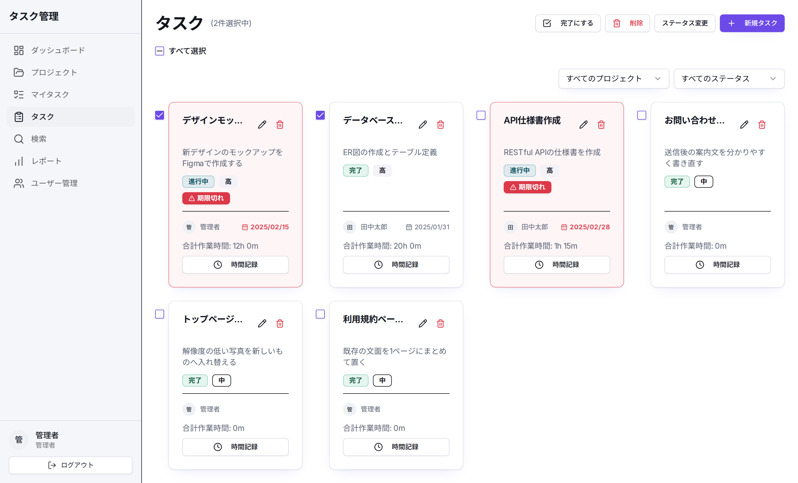
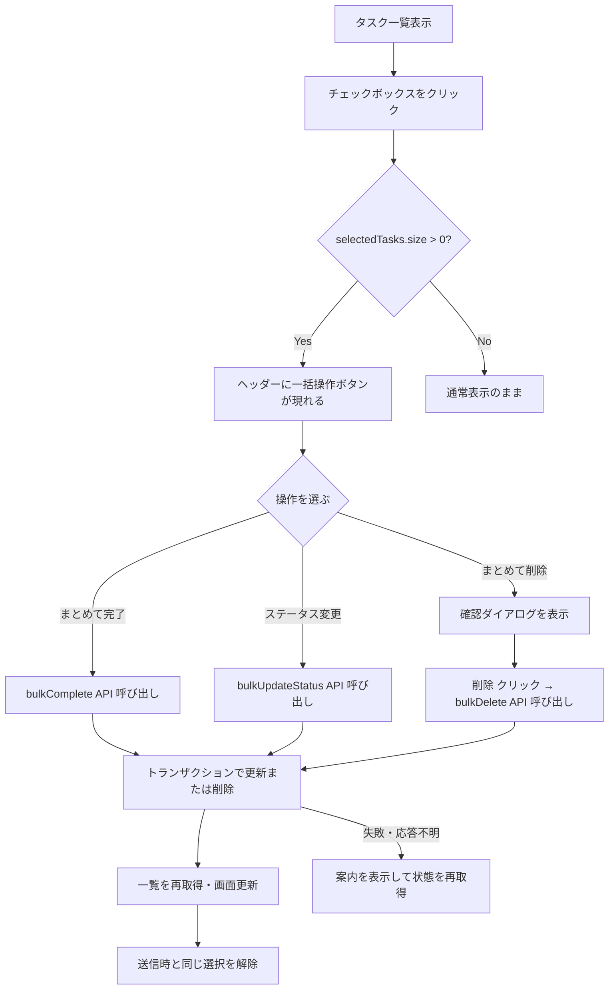
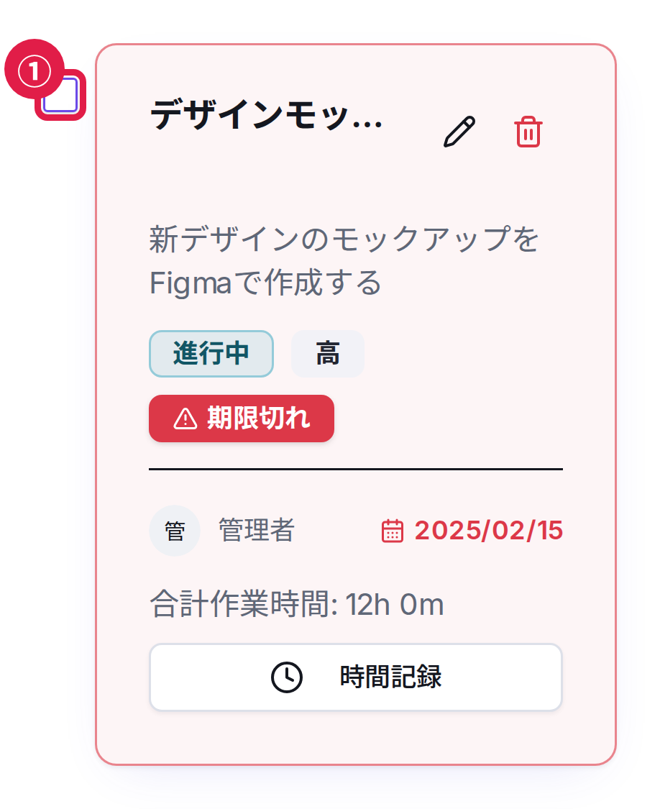
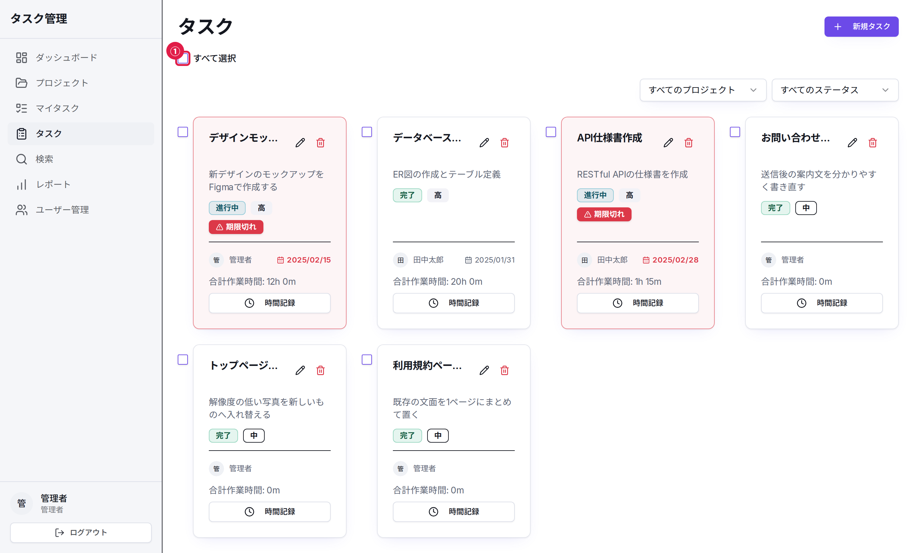
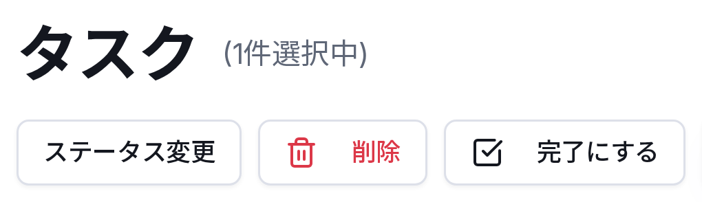
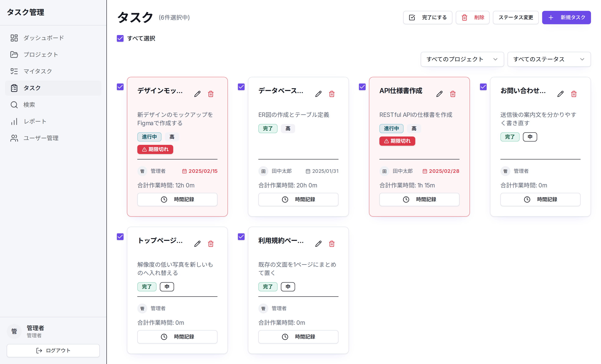

# Day 28: タスク一括操作を実装しよう

## 前回の振り返り

Day 27 では`/project?projectId=...` で
一覧と詳細を切り替え、`isArchived` フラグによる
アーカイブ機能を確認しました。

今日はそこで学んだ「状態管理」の応用としてタスク一覧での **一括操作** に挑戦します。

---

## 今日のゴール

チェックボックスで複数のタスクを選択し、「まとめて完了」「ステータス一括変更」「まとめて削除（確認ダイアログあり）」ができる機能を実装します。

この日はまずサーバー側の一括操作 API（3種類）を自分で書きます。そのあと画面をつなぎます。

スクリーンショット: タスク一括操作の完成画面の表示を確認してください。



> **今日のゴールライン**: Map で選択を管理し、完了・削除・ステータス変更の結果と失敗時の案内を確認できれば到達です。

---

## 始める前の前提

- Day 27 のプロジェクト詳細とアーカイブ機能が動いています
- `/task` に複数のタスクが表示されています
- 自分が OWNER の練習用プロジェクトに、削除してもよいタスクを 7 件以上用意しています

> 7 件という数には理由があります。Step 9 の動作確認は「3 件を完了」「2 件を削除」
> 「5 件のステータスを変更」の順に進めます。削除で 2 件減ったあとに 5 件を選ぶので
> 始める時点で 7 件が同じ画面に並んでいる必要があります。初期データは 3 件しか見えないので
> `/task` から練習用のタスクを足してから始めてください。
- `src/server/api/routers/task.ts` と `src/app/task/page.tsx` を編集できます

> Day 13〜16 で作った import、`TaskCard`、
> `DeleteConfirmDialog`、時間記録機能は残します。
> 同じ import やコンポーネントを追加し直さず、
> 既存コードへ一括操作だけを統合してください。

---

## なぜこれを作るのか

タスクが 100 件あるとき1 件ずつ「完了」ボタンを押すのは苦痛です。スーパーのセルフレジで商品を 1 個ずつ別々に会計するようなものです。まとめてカゴに入れて一度に精算できれば操作は一気に減ります。

> **例え話**: 一括操作は「まとめ買い」と同じです。スーパーで 1 個ずつレジに持っていくよりカゴにまとめてから一度に精算する方が速いです。データベースも同じで、100 回の更新コマンドより「この 100 件を一度にまとめて更新して」と伝える方が圧倒的に速いです。

---

### 一括操作の全体像


```mermaid
flowchart TD
    A[タスク一覧表示] --> B[チェックボックスをクリック]
    B --> C{selectedTasks.size > 0?}
    C -->|Yes| D[ヘッダーに一括操作ボタンが現れる]
    C -->|No| E[通常表示のまま]
    D --> F{操作を選ぶ}
    F -->|まとめて完了| G[bulkComplete API 呼び出し]
    F -->|ステータス変更| H[bulkUpdateStatus API 呼び出し]
    F -->|まとめて削除| I[確認ダイアログを表示]
    I --> J[削除 クリック → bulkDelete API 呼び出し]
    G --> K[トランザクションで更新または削除]
    H --> K
    J --> K
    K --> L[一覧を再取得・画面更新]
    L --> M[送信時と同じ選択を解除]
    K -->|失敗・応答不明| N[案内を表示して状態を再取得]
```

3つの API はトランザクションで対象全件を処理します。成功後は一覧と対象の詳細を再取得します。完了とステータス変更では送信後に選び直したチェックを残し、削除では実際に消えた ID のチェックを外します。

失敗や通信切断も扱います。応答が届かないと、サーバーで成功したかは分かりません。そこで再送を急がず、最新の状態を確認する案内を表示します。認証が切れた場合は保護されたデータを隠し、ログイン画面へのボタンを表示します。

---

### やること / やらないこと

| やること | やらないこと |
|---------|-------------|
| チェックボックスで複数選択 | ドラッグ選択（範囲選択） |
| 全選択・一部選択・全解除の 3 状態チェックボックス | キーボードショートカット |
| まとめて完了（`completedAt` も記録） | 一括アサイン変更 |
| まとめて削除（確認ダイアログあり） | 優先度をまとめて変更 |
| DropdownMenu によるステータス一括変更 | ページをまたいだ選択 |

---

### 新しく学ぶ概念

| 概念 | 読み方 | 役割 | 例え |
|------|--------|------|------|
| `Map<string, number>` | マップ | ID と選択番号の組を管理 | ID ごとに最新の選択番号を記録する表 |
| `useRef` | ユーズレフ | 再描画を待たず値を保存 | 送信中の記録をクリック直後に更新 |
| スナップショット | — | 確認時点の対象をコピーして保存 | 確認後の再取得で対象を変えないための記録 |
| `indeterminate` | インデターミネイト | チェックボックスの「部分選択」状態 | 全部チェックでも空でもない、一部だけ選ばれた中間の状態 |
| `updateMany` | アップデートメニー | 複数レコードを一度に更新 | 授業で「全員起立」と言うのと同じ |
| `isTaskStatus` | イズタスクステータス | 型ガード。不明な値が `TaskStatus` か確認する | 身分証明書のチェック |
| `completedAt` | コンプリーテッドアット | 完了した日時を記録するフィールド | タイムカードの退勤打刻 |

開発サーバーは前の Day から動かしたまま使います。止めてあるときは `npm run dev` で起動してから `http://localhost:3000` を開きます。

---

## 実装ステップ一覧

| ステップ | 作業内容 | 読む時間の目安 | 触るファイル | 成功状態 |
|---------|---------|---------|-------------|---------|
| Step 0 | タスク一括操作 API（bulk 3種）を自分で書く | 20 分 | `task.ts` | 3 つの bulk API を写経して登録できる |
| Step 1 | ID、選択番号、1件操作の送信記録を管理する | 30 分 | `src/app/task/page.tsx` | state が正しく動作する |
| Step 2 | チェックボックス付きタスクカードを作る | 8 分 | `src/app/task/page.tsx` | 各カードにチェックボックスが表示される |
| Step 3 | まず「全選択 / 全解除」チェックボックスを作る | 4 分 | `src/app/task/page.tsx` | 全選択・全解除が切り替わる |
| Step 4 | 部分選択を `indeterminate` で表現する | 4 分 | `src/app/task/page.tsx` | 全選択・部分選択・全解除が切り替わる |
| Step 5 | ヘッダーに一括操作ボタンを追加する | 7 分 | `src/app/task/page.tsx` | 選択件数が表示される |
| Step 6 | 4つの絞り込みと、成功・失敗・送信中の扱いを実装する | 32 分 | `src/app/task/page.tsx` | まとめて完了できる |
| Step 7 | 確認ダイアログ付き一括削除を実装する | 7 分 | `src/app/task/page.tsx` | 確認後にまとめて削除できる |
| Step 8 | DropdownMenu でステータス一括変更を実装する | 7 分 | `src/app/task/page.tsx` | ステータス変更が動作する |
| Step 9 | 動作確認と仕上げ | 10 分 | — | 一括操作が一通り動く |

**読む時間の合計（仮）**: 約129分です。

表と各 Step に記した時間は、説明とコードを読む時間の仮の目安です。実測した値ではありません。コードの入力、動作確認、ダウンロードや起動の待ち時間、調べものには別に時間を取ってください。

送信待ちの選択変更、失敗時の案内、ログイン切れへの対応も扱うため、今日は内容が多めです。

Step 5 の確認が済んだら、保存して一度休憩できます。再開時は Step 6 から進めてください。関数や JSX の途中では区切らず、各 Step の確認を終えてから休みましょう。

---

### Step 0: タスク一括操作 API（bulk 3種）を自分で書く（読む目安: 20分）

**ゴール**: 複数のタスクをまとめて処理する `bulkComplete`・`bulkDelete`・`bulkUpdateStatus` を自分で書き、`api.task.bulkComplete` などを呼べる状態にします。この3つはこのあと Step 6〜8 で画面のボタンから呼び出します。

Day 13〜16 で `task.ts` に、1件ずつ扱う手続きを積み上げてきました。今日はそこへ、複数のタスクを一度に処理する3つの手続きを足します。骨組みはこれまでと同じ入力・処理・戻り値の3部品です。ちがうのは入力が「タスク id の配列」になり、処理が「まとめて更新する」`updateMany` や「まとめて削除する」`deleteMany` になるところです。

一括操作では、最初の権限確認が終わった直後に管理者が自分のロールを変更する場合も考えます。Day 14 で作った `lockTaskProjects` を使い、対象プロジェクトを ID 順にロックしてから、現在のロールを含む書き込みを始めます。入口で権限があっても、書き込み時に権限がなくなっていれば1件も確定させません。

#### 0-1. import に一括操作で使う道具を足す

3つの手続きは渡された id の配列をまとめて権限つきで取る共有ヘルパー `findTasksWithPermission`（複数形）を使います。Day 15 までに書いた `_helpers/permission` の import 文に、この1行を足して次の形にします。

```typescript
// filepath: src/server/api/routers/task.ts
// （permission の import に findTasksWithPermission を足した完成形）
import {
  assertMemberPermission,
  findTasksWithPermission,
  findTaskWithPermission,
  getUserProjectIds,
} from './_helpers/permission';
```

`findTasksWithPermission`（複数形）はid の配列を受け取り、その全部のタスクを権限つきで取ってくるヘルパーです。Day 15 で使った `findTaskWithPermission`（単数形）の複数版と考えてください。名前が `s` の1文字だけ違うので取り違えに注意します。`assertMemberPermission` などは前の Day で足したものなので新しく行を増やさず同じ import 文の中に並べます。

Day 13 で書いた `import { Prisma } from '@prisma/client';` は次の行へ置き換えます。`ProjectMemberRole` は書き込み直前にも権限を確認するために使います。

```typescript
// filepath: src/server/api/routers/task.ts（既存の Prisma import を置き換える）
import { Prisma, ProjectMemberRole } from '@prisma/client';
import { hasPermission, type PermissionKey } from '@/lib/constant/roles';
```

`ProjectMemberRole` はPrisma がスキーマの enum（決まった値だけを許す型）から自動で作ってくれる型です。`'OWNER'` のような文字列を自分で打ち込まずに済むので綴り違いが型エラーとして先に見つかります。`hasPermission` はロールと権限名を受け取って可否を返す関数、`PermissionKey` は `'canEdit'` のような権限名だけを許す型です。

この3つがそろうと次の 0-2 で「編集できるロールはどれか」を権限マップから計算できます。ここを `['OWNER', 'ADMIN']` と手書きしてしまうとあとで権限の決まりを直したときに一括操作だけが古い判定のまま取り残されます。

#### 0-2. 件数上限と書き込み条件を作る

一度に受け付ける件数と、重複を拒否する ID 配列スキーマを作ります。編集・削除できるロールは権限マップから導出し、権限定義を二重管理しません。`taskTimeUpdateSchema` の直後へ追加してください。

```typescript
// filepath: src/server/api/routers/task.ts（taskTimeUpdateSchema の直後に追加）
const MAX_BULK_TASKS = 100;
const bulkTaskIdsSchema = z
  .array(z.string().cuid())
  .min(1)
  .max(MAX_BULK_TASKS)
  .refine(
    (ids) => new Set(ids).size === ids.length,
    'タスクIDを重複して指定できません',
  );
const getRolesWithPermission = (
  permission: PermissionKey,
): ProjectMemberRole[] =>
  Object.values(ProjectMemberRole).filter(
    (role) => hasPermission(role, permission),
  );
const TASK_EDIT_ROLES =
  getRolesWithPermission('canEdit');
const TASK_DELETE_ROLES =
  getRolesWithPermission('canDelete');
```

`MAX_BULK_TASKS` は巨大な id 配列による DB 負荷を防ぎ、`bulkTaskIdsSchema` は同じ id の二重指定を入力段階で拒否します。ロール配列は `hasPermission` が参照する権限マップから作るため権限設定を変更しても読み取り側と書き込み側がずれません。

続けてタスク id と現在の権限を同じ `where` にまとめる部品を書きます。

```typescript
// filepath: src/server/api/routers/task.ts（続き）
const buildBulkPermissionWhere = (
  tasks: { id: string; projectId: string }[],
  userId: string,
  roles: ProjectMemberRole[],
): Prisma.TaskWhereInput => ({
  // ロックしたプロジェクトから移動した行を、別プロジェクトの権限で更新しない。
  OR: tasks.map(({ id, projectId }) => ({ id, projectId })),
  project: {
    members: {
      some: { userId, role: { in: roles } },
    },
  },
});
```

この関数が返すのは `updateMany` や `deleteMany` の `where` にそのまま渡せる条件です。`OR` の各要素には、入口で読んだタスクの `id` と `projectId` を組にして入れます。ロックを待っている間にタスクが別のプロジェクトへ移動した場合、そのタスクは同じ ID でも条件に一致しません。

`project.members.some` は、書き込みを始める時点でも必要なロールを持つ自分がプロジェクトにいることを要求します。対象の組と現在のメンバー権限を1つの `where` に入れるため、ロックしたプロジェクトの古い権限を、移動後のタスクへ使い回せません。3つの手続きがこの条件を共有します。

最後に書き込めた件数が入力件数と違った場合に処理を止める部品を追加します。

```typescript
// filepath: src/server/api/routers/task.ts（続き）
const assertBulkWriteCount = (count: number, expected: number) => {
  if (count !== expected) {
    throw new TRPCError({
      code: 'FORBIDDEN',
      message: '一括操作の途中で権限が変更されました。もう一度お試しください',
    });
  }
};
```

一括操作は最初の権限確認と DB への書き込みの間にロールが変わる可能性も考えます。書き込み側の `where` でも現在のロールを確認し、件数がずれたらトランザクション（途中で失敗した場合に変更全体を取り消すまとまり）を失敗させます。

#### 0-3. bulkComplete を書く（まとめて完了にする）

まず選んだタスクをまとめて完了にする `bulkComplete` を、Day 16 で書いた `addTime` の直後に足します。

```typescript
// filepath: src/server/api/routers/task.ts（addTime の直後に追加）
  bulkComplete: protectedProcedure
    .input(z.object({ ids: bulkTaskIdsSchema }))
    .mutation(async ({ ctx, input }) => {
      const tasks = await findTasksWithPermission(input.ids, ctx.session.userId);
      for (const task of tasks) {
        assertMemberPermission(task.project.members, 'canEdit');
      }

      const completedAt = new Date();
      return await prisma.$transaction(async (tx) => {
        // 待機中の権限変更を古い文スナップショットで通さないよう、
        // メンバー変更と同じプロジェクト行をID順に先にロックする。
        await lockTaskProjects(
          tx,
          tasks.map((task) => task.projectId),
        );
        const where = buildBulkPermissionWhere(tasks, ctx.session.userId, TASK_EDIT_ROLES);
```

入力の `ids` は「1件以上、100件以下のタスク id の配列」に絞ります。入口で全件の編集権限を確認したあと、トランザクション内で対象プロジェクトを ID 順にロックします。並びをそろえるのは、2つの一括操作が複数プロジェクトを逆順に選んでも互いに1件目のロックを持ったまま待ち続けないようにするためです。

ロックを取り終えてから、タスクとプロジェクトの組と現在の編集権限を含む `where` で更新します。先にロールが変わっていれば新しいロールを見て拒否します。一括操作が先なら、ロール変更は完了を待ちます。

続けて完了済みと未完了のタスクを分けて更新します。

```typescript
// filepath: src/server/api/routers/task.ts（続き）
        const unchanged = await tx.task.updateMany({
          where: { ...where, status: TASK_STATUS.DONE },
          data: { status: TASK_STATUS.DONE },
        });
        const changed = await tx.task.updateMany({
          where: { ...where, status: { not: TASK_STATUS.DONE } },
          data: { status: TASK_STATUS.DONE, completedAt },
        });
        const count = unchanged.count + changed.count;
        assertBulkWriteCount(count, input.ids.length);
        return { count };
      });
    }),
```

最初の更新は完了済みの日時を変えずに対象行をロックします。次の更新だけで新しい完了日時を入れるため完了済みのタスクを再選択しても Day 23 の週次集計が変わりません。件数は2回の更新を合計します。権限の変更で入力件数と合わなくなった場合はトランザクション全体を取り消します。

| 方法 | 更新用のクエリ数（権限確認を除く） |
|------|---------------------|
| `for` ループ + `update` | タスク数と同じ（100件なら100回） |
| 今回の `updateMany` | 完了済みと未完了に分けて2回 |

#### 0-4. bulkDelete を書く（まとめて削除する）

次に選んだタスクをまとめて消す `bulkDelete` を、`bulkComplete` の直後に足します。

```typescript
// filepath: src/server/api/routers/task.ts（bulkComplete の直後に追加）
  bulkDelete: protectedProcedure
    .input(z.object({ ids: bulkTaskIdsSchema }))
    .mutation(async ({ ctx, input }) => {
      const tasks = await findTasksWithPermission(input.ids, ctx.session.userId);
      for (const task of tasks) {
        assertMemberPermission(task.project.members, 'canDelete');
      }

      return await prisma.$transaction(async (tx) => {
        // 待機中の権限変更を古い文スナップショットで通さないよう、
        // メンバー変更と同じプロジェクト行をID順に先にロックする。
        await lockTaskProjects(
          tx,
          tasks.map((task) => task.projectId),
        );
        const result = await tx.task.deleteMany({
          where: buildBulkPermissionWhere(tasks, ctx.session.userId, TASK_DELETE_ROLES),
        });
        assertBulkWriteCount(result.count, input.ids.length);
        return result;
      });
    }),
```

削除でも、対象プロジェクトを ID 順にロックしてから `deleteMany` を始めます。`TASK_DELETE_ROLES` を使うため、入口の確認後に MEMBER へ降格した人やプロジェクトから外れた人は書き込み時点で一致しません。1件でも対象から外れれば件数確認が例外を投げ、同じトランザクションで先に消した行も元へ戻ります。

#### 0-5. bulkUpdateStatus を書く（まとめてステータス変更・前半）

最後に選んだタスクのステータスをまとめて変える `bulkUpdateStatus` を、`bulkDelete` の直後に足します。まず入力と権限確認までを書きます。

```typescript
// filepath: src/server/api/routers/task.ts（bulkDelete の直後に追加）
  bulkUpdateStatus: protectedProcedure
    .input(
      z.object({
        ids: bulkTaskIdsSchema,
        status: taskStatusSchema,
      }),
    )
    .mutation(async ({ ctx, input }) => {
      const tasks = await findTasksWithPermission(input.ids, ctx.session.userId);
      for (const task of tasks) {
        assertMemberPermission(task.project.members, 'canEdit');
      }
```

入力は id の配列に加えて変更後の `status`（`taskStatusSchema` で検証）も受け取ります。ここまでは `bulkComplete` と同じで、まとめてタスクを取り、`for` で1件ずつ `'canEdit'` 権限を確かめます。ステータスの変更は編集にあたるので確認する権限は `'canEdit'` です。

#### 0-6. bulkUpdateStatus を書く（後半・完了日時の管理）

続けて更新するデータを組み立てて `updateMany` を呼びます。

```typescript
// filepath: src/server/api/routers/task.ts（続き）
      const data: Prisma.TaskUpdateManyMutationInput = {
        status: input.status,
      };

      if (input.status === TASK_STATUS.DONE) {
        data.completedAt = new Date();
      } else {
        data.completedAt = null;
      }

```

`data` に型を付けるとあとから追加する `completedAt` も検査できます。完了に変える場合は現在時刻を用意し、それ以外では `null` に戻します。

続けて完了済みの日時を保ちながら更新します。

```typescript
// filepath: src/server/api/routers/task.ts（続き）
      return await prisma.$transaction(async (tx) => {
        // 待機中の権限変更を古い文スナップショットで通さないよう、
        // メンバー変更と同じプロジェクト行をID順に先にロックする。
        await lockTaskProjects(
          tx,
          tasks.map((task) => task.projectId),
        );
        const where = buildBulkPermissionWhere(tasks, ctx.session.userId, TASK_EDIT_ROLES);
        const unchanged =
          input.status === TASK_STATUS.DONE
            ? await tx.task.updateMany({
                where: { ...where, status: TASK_STATUS.DONE },
                data: { status: TASK_STATUS.DONE },
              })
            : { count: 0 };
```

`DONE` を選んだときだけ、すでに完了している行を先に更新します。この更新には `completedAt` を含めないため、以前の完了日時を保てます。

```typescript
// filepath: src/server/api/routers/task.ts（続き）
        const changed = await tx.task.updateMany({
          where:
            input.status === TASK_STATUS.DONE
              ? { ...where, status: { not: TASK_STATUS.DONE } }
              : where,
          data,
        });
        const count = unchanged.count + changed.count;
        assertBulkWriteCount(count, input.ids.length);
        return { count };
      });
    }),
```

対象プロジェクトのロックがそろってから、現在の編集権限と `id`・`projectId` の組を含む条件で更新します。変更先が `DONE` の場合は完了済みの行を先に更新して日時を保ち、未完了の行だけに新しい完了日時を入れます。変更先が `DONE` 以外なら全対象を1回で更新し、完了日時を消します。どちらも合計件数が入力件数とずれれば、先の更新を含めて全体を取り消します。

**確認ポイント**:
- `bulkComplete`・`bulkDelete`・`bulkUpdateStatus` の3つを `addTime` の直後に順に足しました
- 3つの `ids` が1件以上・`MAX_BULK_TASKS` 件以下に制限されています
- `findTasksWithPermission`（複数形）で権限を確認してから `updateMany` / `deleteMany` を呼んでいます
- 対象プロジェクトを ID 順にロックしてから、現在のロールを含む書き込みを始めています
- `id` と入口で読んだ `projectId` の組で対象を固定しています
- 書き込み件数がずれたら、同じトランザクションの変更を全体ごと取り消しています
- `npx tsc --noEmit` で型エラーが出ていません

---

### Step 1: ID と選択番号を管理する（読む目安: 10分）

**ゴール**: チェックした ID と、選んだ時点の番号を記録します。

送信中に A のチェックを外して付け直した場合、古い成功通知で新しいチェックを消してはいけません。`Map`（マップ、キーと値の組を保存する型）に、タスク ID と選択番号を入れます。選択番号は照合用のトークン（同じ選択かを見分ける値）です。

Day 27 の React の import には `useRef` があるので、追加し直しません。`useRef` は、再描画を待たずに値を保存する React の関数です。`TaskPageContent` の直前へ次の型と定数を追加します。

<!-- day28-edit: types -->
```typescript
// filepath: src/app/task/page.tsx
const MAX_BULK_TASKS = 100;
type BulkSelection = Map<string, number>;
type BulkSubmission = { selection: BulkSelection };
```

`Map<string, number>` のキーは ID、値は選択番号です。上限はサーバーと同じ 100 件にします。

`TaskPageContent` の先頭へ次の state と ref を追加します。既存の1件用 `deleteDialogOpen` と `deleteTargetId` は残してください。

<!-- day28-edit: state -->
```typescript
// filepath: src/app/task/page.tsx
const [selectedTasks, setSelectedTasks] = useState<BulkSelection>(new Map());
const [bulkDeleteTarget, setBulkDeleteTarget] = useState<BulkSelection | null>(null);
const selectionVersion = useRef(0);
const bulkSubmission = useRef<BulkSubmission | null>(null);
```

`bulkDeleteTarget` は削除の確認時に写した対象です。`null` は確認を閉じた状態を表します。`bulkSubmission.current` は送信中の選択を保存し、続くクリックを同期的に止めます。画面を描き直してから変わる値だけに頼ると、同じ瞬間の2回目を防げません。

ここで追加するのは `selectedTasks`、`bulkDeleteTarget`、`selectionVersion`、`bulkSubmission` の4つです。Day 15 で作った `singleSubmission` と `formGeneration`、ログイン切れを保持する `authExpiredRef` と `authExpired` の隣へ置き、既存の宣言は追加し直しません。`singleSubmission` は1件操作の2回送信を止め、`formGeneration` は送信後に別のフォームを開いたかを見分けるためです。

Day 20 で作った `src/lib/task-filter-query.ts` は作り直しません。この日の前提は SHA-256 `c11f6395dd14435fffaa80edac6b64dead646e1071f9ec39adeb28143ad0e414` のhelperです。`parseTaskFiltersFromSearchParams` で初回のプロジェクト・ステータスを読み、`desiredUrlFilterContext` と2つのeffectで画面とURLを同期する処理も残します。

このhelperはプロジェクトIDをサーバー入力と同じZodのCUID形式で検査します。形式が壊れた値は `'all'` へ戻しますが、有効な形のIDが現在の利用者に見えるかは決めません。所属と権限はサーバーが現在のDBを見て判定します。

Day 20 の `dismissedDetailTaskId` も残します。詳細を閉じてからURL更新が届くまで古い `taskId` が一度見えても、同じ詳細を開き直さないためのrefです。URLを読むeffect、URLを書くeffectの順序は変えません。書くeffectでは閉じた `taskId` を消し、別ID・編集リンク・URL反映後にはrefを解除します。

```typescript
// filepath: src/app/task/page.tsx（既存の宣言を確認）
const dismissedDetailTaskId = useRef<string | null>(null);
```

このrefは閉じた詳細のIDだけをURL反映まで保持し、別IDへの移動や編集リンクへの切り替えを止めません。`handleDetailClose` は次の形を保ちます。

```typescript
// filepath: src/app/task/page.tsx（既存関数を保持）
const handleDetailClose = () => {
  setDetailOpen(false);
  setSelectedTask(null);
  if (taskIdParam && !isEditLink) {
    dismissedDetailTaskId.current = taskIdParam;
    const params =
      new URLSearchParams(searchParams.toString());
    params.delete('taskId');
    const nextQuery = params.toString();
    router.replace(nextQuery
      ? `${pathname}?${nextQuery}` : pathname,
      { scroll: false });
  }
};
```

詳細を閉じてもプロジェクトとステータスの条件は残ります。Day 28 の4条件、ページ番号、選択状態を加えるときも、このURL寿命を削りません。

Day 20 の `leavePageContext` は、ページや絞り込みを変えたときに一括選択も破棄する形へ置き換えます。

```typescript
// filepath: src/app/task/page.tsx
const leavePageContext = useCallback(() => {
  formGeneration.current++;
  selectionVersion.current++;
  setSelectedTasks(new Map());
  setBulkDeleteTarget(null);
  setDeleteDialogOpen(false);
  setDeleteTargetId(null);
  setSelectedTask(null);
  setDetailOpen(false);
  setDialogOpen(false);
  setEditingTask(undefined);
}, []);
```

`selectionVersion` を進めて選択を空にするので、移動前に送った一括操作の応答は移動後のチェックを消しません。個別削除の `deleteTargetId` も空にし、前のページで選んだ対象を新しいページから削除しないようにします。Day 20 のURLから画面へ戻すeffectもこの関数を呼ぶため、ブラウザの「戻る」「進む」でも同じ境界が働きます。

`handleDetailClose` の定義の直後、`if (tasksLoading)` の前へ次の4ブロックを順番に追加します。

<!-- day28-edit: select-one -->
```typescript
// filepath: src/app/task/page.tsx
const handleTaskSelect = (taskId: string, checked: boolean) => {
    const version = ++selectionVersion.current;
    setSelectedTasks((previous) => {
      const next = new Map(previous);
      checked ? next.set(taskId, version) : next.delete(taskId);
      return next;
    });
  };
```

選択番号はクリックのたびに増やします。`new Map(previous)` でコピーしてから変更するので、React が選択の変化を検知できます。

<!-- day28-edit: selection-lists -->
```typescript
// filepath: src/app/task/page.tsx
// 編集も削除もできないタスク（閲覧のみ）は一括操作の対象から除外する
  const selectableTasks = useMemo(
    () => tasks?.filter((t) => canEditProject(t.projectId) || canDeleteProject(t.projectId)) ?? [],
    [tasks, canEditProject, canDeleteProject],
  );

  const selectedTaskList = useMemo(
    () => tasks?.filter((t) => selectedTasks.has(t.id)) ?? [],
    [tasks, selectedTasks],
  );
```

`selectableTasks` は編集か削除ができるタスクです。`selectedTaskList` は、現在の一覧に残っている選択済みタスクです。非表示になった ID を送らないため、一覧と照合します。

<!-- day28-edit: permissions -->
```typescript
// filepath: src/app/task/page.tsx
const canCompleteSelected =
    selectedTaskList.length > 0 && selectedTaskList.every((t) => canEditProject(t.projectId));
  const canDeleteSelected =
    selectedTaskList.length > 0 && selectedTaskList.every((t) => canDeleteProject(t.projectId));
```

`every`（全要素が条件を満たすかの判定）で、選択した全件の権限を確かめます。サーバーも書き込み時の権限を再確認するため、画面の判定だけを認可には使いません。

<!-- day28-edit: select-all -->
```typescript
// filepath: src/app/task/page.tsx
const handleSelectAll = (checked: boolean) => {
    const version = ++selectionVersion.current;
    setSelectedTasks((previous) =>
      checked
        ? new Map(selectableTasks.map((task) => [task.id, previous.get(task.id) ?? version]))
        : new Map(),
    );
  };
```

全選択では既存の選択番号を維持し、新しく選ぶ ID だけに番号を付けます。送信済みの A に触らず B を追加した場合、A の成功で A だけを解除するためです。

**確認ポイント**: `new Map()`、選択番号、2つの選択配列が定義されています。まだチェックボックスは無いので、画面操作は Step 2 で確認します。

#### 1-1. Day 27 の1件操作を一括選択と共存させる

Day 20 の `TaskSubmission` はフォーム世代、ページ番号、URLの対象を覚えています。Day 28 では一括送信の型と区別するため、同じフィールドを保ったまま `SingleSubmission` へ名前を変えます。送信した対象、現在のURL、選択中のIDは別々に照合します。

まず `classifyTaskWriteError` の import を置き換え、操作名の型も読み込みます。

<!-- day28-edit: single-operation-import -->
```typescript
// filepath: src/app/task/page.tsx（既存の import を置き換える）
import { classifyTaskWriteError, type TaskWriteOperation } from '@/lib/task-write-error';
```

TaskSubmission の型を次の `SingleSubmission` へ置き換えます。続いて `singleSubmission` の型名も同じ名前へ変えます。

<!-- day28-edit: single-submission-type -->
```typescript
// filepath: src/app/task/page.tsx（TaskSubmission を置き換える）
type SingleSubmission = {
  generation: number;
  pageIndex: number;
  isCurrent: () => boolean;
  routeTaskId: string | null;
  editLink: boolean;
};
```

フォーム世代、ページ番号、送信開始時の `taskId` と `edit` を保存します。ページを移動した場合や、あとから別のタスクを開いた場合に、古い応答が現在のフォームを閉じないようにするためです。

<!-- day28-edit: single-submission-ref -->
```typescript
// filepath: src/app/task/page.tsx（既存のrefを置き換える）
const singleSubmission = useRef<SingleSubmission | null>(null);
```

routeTaskId は送信を始めたURLの対象です。保存待ちの間に別の詳細リンクを開いた場合、古い成功結果で新しい対象のフォームを閉じないために使います。一括選択の `BulkSubmission` とは用途が違うのでrefを分けます。

Day 27 にすでにある `const [authExpired, setAuthExpired] = useState(false);` の直後へ、認証切れを親ページへ固定する関数を追加します。

<!-- day28-edit: detail-auth -->
```typescript
// filepath: src/app/task/page.tsx（authExpired state の直後に追加）
const handleDetailAuthExpired = useCallback(() => {
  authExpiredRef.current = true;
  setAuthExpired(true);
}, []);
```

この関数は詳細取得と書き込みの401を同じ状態へ集めます。`handleCreate` と `handleEdit` の先頭にある `if (authExpiredRef.current) return;` は削除しません。認証切れが確定した同じ描画中に、古いボタンからフォームを開かないための同期ガードです。

2つのハンドラーの先頭が次の形であることを確認します。

```typescript
// filepath: src/app/task/page.tsx
const handleCreate = () => {
  if (authExpiredRef.current) return;
  formGeneration.current++;
  setEditingTask(undefined);
  setDialogOpen(true);
};
const handleEdit = (taskId: string) => {
  if (authExpiredRef.current) return;
  const task = tasks?.find((item) => item.id === taskId);
  if (!task) return;
  formGeneration.current++;
  setEditingTask(taskToFormData(task));
  setDialogOpen(true);
};
```

この2行は再描画を待たずに操作を止めます。フォームを開く直前に認証切れを確認するので、書き込みボタンの表示が切り替わる前の操作も止められます。

`handleSubmit` の中にある `if (!data.id && !session?.user?.id)` を探します。その分岐内の `authExpiredRef.current = true;` と `setAuthExpired(true);` の2行を、次の1行へ置き換えます。直後の `return;` は残してください。

<!-- day28-edit: submit-missing-session-auth -->
```typescript
// filepath: src/app/task/page.tsx（新規作成時のセッション確認分岐内）
handleDetailAuthExpired();
```

新規作成の直前にセッションが無い場合も、詳細の取得や保存で認証が切れた場合と同じ関数へ集めます。先に認証切れを固定してから return するので、ユーザーIDの無い作成要求をサーバーへ送りません。

`const utils = api.useUtils();` と Day 20 のURL同期effectはそのまま残します。Day 28 では時間記録の処理を書き換えません。一括操作とページ境界の追加に範囲を絞り、既存の1件操作を削らないでください。

`closeTaskDialog` の直後へ、送信したフォーム世代とURLの対象を照合する関数を追加します。

<!-- day28-edit: owns-single-lifetime -->
```typescript
// filepath: src/app/task/page.tsx（closeTaskDialog の直後に追加）
const ownsSubmittedLifetime = (submitted: SingleSubmission | null) =>
  !authExpiredRef.current &&
  submitted?.generation === formGeneration.current &&
  submitted.pageIndex === pageIndex &&
  submitted.routeTaskId === taskIdParam &&
  submitted.editLink === isEditLink;
```

この関数が `true` を返すのは、認証が有効で、フォーム世代、ページ番号、`taskId`、`edit` が送信開始時のままの場合だけです。続けて `finishSubmittedForm` の引数型と `canClose` の計算を次の形へ置き換えます。

<!-- day28-edit: finish-single-lifetime -->
```typescript
// filepath: src/app/task/page.tsx（finishSubmittedForm の先頭を置き換える）
const finishSubmittedForm = (
  submitted: SingleSubmission | null,
  operation: 'create' | 'update',
  target: { id: string; title: string | undefined },
) => {
  const canClose =
    ownsSubmittedLifetime(submitted) &&
    submitted?.isCurrent();
```

世代、URL、フォーム内の入力revisionがすべて一致した送信だけがダイアログを閉じます。どれかが変わっていれば保存した対象名だけを通知し、いま開いている入力は残します。

同じ関数にある未保存入力の2つの案内を、次の文へ置き換えます。

<!-- day28-edit: unsaved-single-guidance -->
```typescript
// filepath: src/app/task/page.tsx（既存の2つのtoast文を置き換える）
if (operation === 'create' && !editingTask?.id) {
  toast(
    ('送信後に入力を変えた場合、' +
      'その変更は保存されていません。' +
      'このまま作成すると' +
      '別のタスクになります。'),
  );
} else if (operation === 'update' && editingTask?.id === target.id) {
  toast(
    ('送信後に入力した変更は保存されていません。' +
      '入力内容を別の場所にコピーしてから、' +
      'タスク編集画面を閉じて開き直し、もう一度保存してください。'),
  );
}
```

1つ目は作成後の追加入力、2つ目は同じタスクを編集し直した入力に対応します。保存済みの値と画面に残った値を混同せず、次の操作前に再取得する必要を伝えます。

`handleSingleError` は操作名を共通型へ変え、認証エラーの分岐を先ほどの関数へ置き換えます。

<!-- day28-edit: single-error-auth -->
```typescript
// filepath: src/app/task/page.tsx（handleSingleError を置き換える）
const handleSingleError = async (
  error: unknown,
  operation: TaskWriteOperation,
  ids: string[],
) => {
  const failure = classifyTaskWriteError(error, operation);
  if (failure.kind === 'auth') {
    handleDetailAuthExpired();
    return;
  }
  toast.error(failure.message);
  await refreshTaskTargets(ids, true, true);
};
```

認証エラーでは一覧の再取得へ進まず、親ページをログイン切れ表示へ切り替えます。その他の失敗だけ対象を再取得し、保存結果が不明な画面を更新します。`singleMutationOptions` 内の `submitted` の型も次の形へ変えます。

<!-- day28-edit: single-context-type -->
```typescript
// filepath: src/app/task/page.tsx（onSettled の第4引数の型を置き換える）
submitted: SingleSubmission | null | undefined,
```

mutationが返したcontextを新しい型で受けないと、routeTaskId を後続処理で安全に読めません。`singleSubmission.current === submitted` の照合と、送信終了時に `null` へ戻す処理は残します。

1件削除の `onSuccess` で `setSelectedTask` を更新した直後へ、削除したIDを一括選択から外す処理を追加します。

<!-- day28-edit: single-delete-selection -->
```typescript
// filepath: src/app/task/page.tsx（deleteMutation.onSuccess に追加）
setSelectedTasks((current) => {
  const next = new Map(current);
  next.delete(variables.id);
  return next;
});
```

1件削除したカードのIDが `selectedTasks` に残ると、画面から消えた対象を次の一括操作へ渡しかねません。削除成功時だけそのIDを外し、失敗時は選択を残します。

`handleSubmit` が `singleSubmission.current` へ代入するオブジェクトを次の形へ置き換えます。直前の `!isCurrent()` は残してください。

<!-- day28-edit: single-submit-context -->
```typescript
// filepath: src/app/task/page.tsx（singleSubmission.current の代入を置き換える）
singleSubmission.current = {
  generation: formGeneration.current,
  pageIndex,
  isCurrent,
  routeTaskId: taskIdParam,
  editLink: isEditLink,
};
```

作成または更新を始めた瞬間のフォーム世代、ページ番号、入力revision、URLの対象を1組で保存します。送信後にどれかが変わると、完了処理は現在のフォームを閉じません。1件削除ダイアログの `onConfirm` でも、削除開始時のページとURLを同じcontextへ保存します。

<!-- day28-edit: single-delete-context -->
```typescript
// filepath: src/app/task/page.tsx（1件削除のcontext代入を置き換える）
singleSubmission.current = {
  generation: formGeneration.current,
  pageIndex,
  isCurrent: () => false,
  routeTaskId: taskIdParam,
  editLink: isEditLink,
};
```

削除には編集フォームが無いため `isCurrent` は常に `false` です。ページ、URL、世代は、削除待ちの間に移動した先や別の対象へ古い完了処理を作用させない照合に使います。

最後に `TaskDetailDialog` を次の形へ置き換えます。

<!-- day28-edit: detail-auth-props -->
```tsx
{/* filepath: src/app/task/page.tsx */}
<TaskDetailDialog
  open={detailOpen && selectedTask !== null}
  onAuthExpired={handleDetailAuthExpired}
  taskId={selectedTask}
  onClose={handleDetailClose}
/>
```

一括削除で表示中の対象が消えた場合は `selectedTask` が `null` になり、詳細を閉じます。詳細queryの401は `onAuthExpired` から親へ伝え、一覧を含む保護データを同じ画面から隠します。

---

### Step 2: チェックボックス付きタスクカードを作る（読む目安: 8分）

**ゴール**: 各タスクの隣にチェックボックスを追加し、`TaskCard` と並べてグリッド表示します。

スクリーンショット: チェックボックス付きタスクカードの表示を確認してください。



実際のコードでは `TaskCard` コンポーネントをグリッドで並べています。`TaskCard`・`handleEdit`・`handleDelete`・`handleTaskClick`・`handleCreate` は過去の Day で作成済みです。

まず、ファイル先頭の import 群へ `Checkbox` の import を追加します。すでに同じ行がある場合は追加しません。

```typescript
// filepath: src/app/task/page.tsx（ファイル先頭の import 群に追加）
import { Checkbox } from '@/component/ui/checkbox';
```

この import を先頭へ置くと、これから追加する JSX で `Checkbox` を名前どおりに使えます。コンポーネントの途中へ貼ると構文エラーになるため、貼り先を分けています。

次に、チェックボックスをカードの左側へ配置します。

```typescript
{/* filepath: src/app/task/page.tsx（className="grid gap-6 の要素を書き直す） */}
{/* タスク一覧の grid レイアウト */}
<div className="grid gap-6 sm:grid-cols-2 lg:grid-cols-3 xl:grid-cols-4">
  {tasks && tasks.length > 0 ? (
    tasks.map((task) => {
      const taskCanEdit = canEditProject(task.projectId);
      const taskCanDelete = canDeleteProject(task.projectId);
      return (
      <div
        key={task.id}
        className="flex gap-2 items-start h-full"
      >
        {(taskCanEdit || taskCanDelete) && (
          <Checkbox
            checked={selectedTasks.has(task.id)}
            onCheckedChange={(checked) =>
              handleTaskSelect(task.id, checked === true)
            }
            className="mt-4"
            aria-label={`${task.title}を選択`}
          />
        )}
```

`aria-label` にタスク名を入れているのは同じ形のチェックボックスがカードの数だけ並ぶためです。名前が無いと読み上げでは「チェックボックス」が何個も続くだけになり、どのタスクを選んでいるのか分かりません。まとめて削除する操作なので取り違えると戻せません。

上のコードブロックの `</div>` 閉じタグは次のブロックに続きます。各タスクカードは `flex-1 min-w-0 h-full` のラッパーで囲み、`TaskCard` に props を渡します。タスクがない場合は空メッセージを表示します。

```typescript
        {/* filepath: src/app/task/page.tsx（同じファイルの続き） */}
        <div className="flex-1 min-w-0 h-full">
          <TaskCard
            id={task.id}
            title={task.title}
            description={task.description}
            status={task.status}
            priority={task.priority}
            dueDate={task.dueDate}
            assignee={task.assignee}
            timeSpentMinutes={task.timeSpentMinutes}
            onEdit={handleEdit}
            onDelete={handleDelete}
            onClick={handleTaskClick}
            canEdit={taskCanEdit}
            canDelete={taskCanDelete}
          />
        </div>
```

チェックボックスはカードの外側へ置くので、`TaskCard` 自体のファイルは変更しません。

`canEdit` と `canDelete` はカードの中にある編集ボタンと削除ボタンを出し分けるための値です。1つ前のブロックでチェックボックスを出す条件に使ったのと同じ `taskCanEdit` / `taskCanDelete` を渡しています。同じ値を使い回すのでカードの中と外で操作できる範囲が食い違いません。

カード行と一覧の条件分岐を閉じます。

```typescript
      {/* filepath: src/app/task/page.tsx（続き） */}
      </div>
      );
    })
  ) : (
    <div className="col-span-full flex flex-col items-center justify-center py-12 text-center text-muted-foreground">
      <p>タスクが見つかりません。</p>
      <p>最初のタスクを作成しましょう!</p>
    </div>
  )}
</div>
```

> `TaskCard` は Day 13 で import 済みです。
> `taskCanEdit` / `taskCanDelete` は
> `canEditProject` / `canDeleteProject` を
> `task.projectId` に適用した結果です。
> `timeSpentMinutes` は残してください。

**`onCheckedChange={(checked) => handleTaskSelect(task.id, checked === true)}`**

`onCheckedChange` は `boolean | 'indeterminate'` 型の値を渡してくることがあります。`checked === true` と比較することで確実に `boolean` 型に絞り込んでから `handleTaskSelect` に渡しています。

**`className="mt-4"` をチェックボックスに付ける理由**

カードの上部にタイトルが来ます。チェックボックスを `mt-4` でずらすことで、カードのタイトルと視覚的に揃い、選択しやすくなります。

**`flex-1 min-w-0 h-full` の意味**

| クラス | 意味 |
|--------|------|
| `flex-1` | 残りの幅を全部カードに使う |
| `min-w-0` | テキストがはみ出さないよう制限 |
| `h-full` | カードの高さを親要素に合わせる |

**確認ポイント**:
- 各タスクカードの左側にチェックボックスが表示されます
- チェックを入れると `selectedTasks` に ID が追加されます
- 再度クリックするとチェックが外れます
- `npm run dev` でエラーが出ません

---

### Step 3: まず「全選択 / 全解除」チェックボックスを作る（読む目安: 4分）

**ゴール**: ヘッダーにチェックボックスを追加し、シンプルな全選択・全解除を実装します。

スクリーンショット: ヘッダーに全選択・全解除のチェックボックスが表示された画面を確認してください。



いきなり 3 状態（未チェック・部分チェック・全チェック）を作ると複雑なのでまずは **2 状態（全選択 / 全解除）** だけで動くものを作ります。

次の `isAllSelected` は、`TaskPageContent` の中にある `handleSelectAll` の直後、`if (tasksLoading)` の直前に追加してください。選択できるタスクと選択済みの一覧を使うため、それらの宣言より後に置きます。

```typescript
// filepath: src/app/task/page.tsx
// まずシンプルに boolean で管理する
const isAllSelected =
  selectableTasks.length > 0
  && selectedTaskList.length
    === selectableTasks.length;
```

`isAllSelected` は、操作可能なタスクが1件以上あり、表示中の選択件数が操作可能な件数と一致すると `true` を返します。

この値をチェックボックスに渡します。先に、ファイル先頭の import 群へ `Label` の import を追加します。すでに同じ行がある場合は追加しません。

```typescript
// filepath: src/app/task/page.tsx（ファイル先頭の import 群に追加）
import { Label } from '@/component/ui/label';
```

この import を先頭へ置くと、これから追加する JSX で `Label` を使えます。フィルター行の途中へ貼ると構文エラーになるため、貼り先を分けています。

次に、全選択チェックボックスをフィルター行の先頭へ追加します。

```typescript
{/* filepath: src/app/task/page.tsx（className="flex gap-2 w-full の前に追加） */}
{/* フィルター行の先頭に配置 */}
<div className="flex items-center space-x-2">
  <Checkbox
    id="select-all"
  aria-label="表示中のタスクをすべて選択"
    checked={isAllSelected}
    onCheckedChange={(checked) =>
      handleSelectAll(checked === true)
    }
  />
  <Label htmlFor="select-all">表示中をすべて選択</Label>
</div>
```

**この段階での動き**

| 操作 | 結果 |
|------|------|
| チェックボックスをクリック | 操作可能なタスクが選択される |
| もう一度クリック | 全タスクの選択が解除される（全解除） |
| 一部だけ手動で選択 | ヘッダーは未チェック（□）のまま |

3 行目の「一部だけ手動で選択」のときヘッダーのチェックボックスが未チェックのままだといま何件選んでいるのかが見た目で分かりません。次の Step でこれを改善します。

**確認ポイント**:
- ヘッダーのチェックボックスをクリックすると全タスクが選択されます
- もう一度クリックすると全選択が解除されます
- `npm run dev` でエラーが出ません

---

### Step 4: 部分選択を `indeterminate` で表現する（読む目安: 4分）

**ゴール**: 一部だけ選択されているときヘッダーのチェックボックスに「横棒（部分チェック）」を表示します。

前のステップでは 2 状態（全選択 / 全解除）しかないため一部選択のときヘッダーが未チェック（□）のままでした。チェックボックスには実は **3 つ目の状態** があります。

| 状態の値 | 表示 | 意味 |
|---------|------|------|
| `false` | □（未チェック） | 1 件も選択されていない |
| `'indeterminate'` | 横棒（部分チェック） | 一部のタスクだけ選択されている |
| `true` | ✓（全チェック） | 全タスクが選択されている |

Step 3 で書いた `isAllSelected`（boolean）を、3 状態を返す `selectAllState` に置き換えます。

```typescript
// filepath: src/app/task/page.tsx
// isAllSelected を削除して、以下に置き換える
const selectAllState =
  selectableTasks.length > 0
    ? selectedTaskList.length === 0
      ? false
      : selectedTaskList.length
          === selectableTasks.length
        ? true
        : 'indeterminate'
    : false;
```

入れ子になった三項演算子は読みづらく見えますがやっているのは上から順に3つ問いかけることだけです。

- 操作できるタスクが1件でもあるか
- 選択が0件か
- 選択の数が操作できるタスクの数と一致するか

この順に絞り込むと`false`・`true`・`'indeterminate'` のどれか1つに必ず決まります。

分母を `tasks` ではなく `selectableTasks` にしているところが大事な点です。閲覧専用のタスクまで分母に入れると選べるものを全部選んでも数が足りず、チェックボックスがいつまでも部分選択のままになります。読者から見ると「全部選んだのに全チェックにならない」という不可解な動きです。

JSX 側の `checked` に渡す値を差し替えます。

```typescript
{/* filepath: src/app/task/page.tsx */}
{/* Step 3 で書いた Checkbox の checked を差し替える */}
<Checkbox
  id="select-all"
  aria-label="表示中のタスクをすべて選択"
  checked={selectAllState}
  onCheckedChange={(checked) =>
    handleSelectAll(checked === true)
  }
/>
```

**確認ポイント**:
- `checked={isAllSelected}` を `checked={selectAllState}` に変更しました
- ファイルを保存して `npm run dev` でエラーが出ません

**`indeterminate` が重要な理由**

ユーザーが「一部選択されている」ことを一目で把握できます。この状態がないとヘッダーのチェックボックスを見ただけでは「全未選択」と「全選択」しか判断できません。細かな UX の配慮が使いやすさを大きく左右します。

**`checked === true` にする理由**

`onCheckedChange` は `boolean | 'indeterminate'` を渡してきます。`checked === true` で `boolean` に絞り込みます。部分選択の状態で押すと `true` が渡され、全選択に変わります。

**確認ポイント**:
- 全未選択のときヘッダーのチェックボックスが未チェック（□）
- 一部選択のときヘッダーのチェックボックスが `indeterminate`（横棒）
- 全選択のときヘッダーのチェックボックスがチェック（✓）
- ヘッダーのチェックボックスをクリックして全選択・全解除が切り替わります

---

### Step 5: ヘッダーに一括操作ボタンを追加する（読む目安: 7分）

**ゴール**: 選択件数を表示し、次の Step から一括操作ボタンを追加する場所を作ります。

実際のコードでは一括操作ボタンは **画面下部の固定バーではなく、ページヘッダーの右側** に配置されています。

スクリーンショット: 下の画像は Step 8 まで書き終えた完成後のヘッダーです。この Step 5 の時点で出るのは「(1件選択中)」の文字までで、右側のボタンは Step 6・7・8 で足していきます。



Day 27 の「タスク」の `<h1>` の開始タグから、その直後の「新規タスク」ボタンの `</Button>` までを次のコードで置き換えます。2つの要素を置き換え、周囲の `div` と直後のフィルター行は残してください。

```typescript
{/* filepath: src/app/task/page.tsx（h1 と直後の新規タスクボタンを置き換える） */}
{/* ページのタイトル行（h1 と操作ボタンが並ぶ行） */}
<div className="flex flex-col gap-3 lg:flex-row lg:items-center lg:justify-between">
  <div className="flex items-center gap-3">
    <h1 className="text-3xl font-bold tracking-tight">
      タスク
    </h1>
    {selectedTaskList.length > 0 && (
      <span className="text-sm text-muted-foreground">
        ({selectedTaskList.length}件選択中)
      </span>
    )}
  </div>
  <div className="flex flex-col gap-2 sm:flex-row sm:items-center">
    {selectedTaskList.length > 0 && (
      <>
        {/* ここにStep 6〜8でボタンを追加していく */}
      </>
    )}
    <Button className="w-full sm:w-auto" onClick={handleCreate}>
      <Plus className="mr-2 h-4 w-4" /> 新規タスク
    </Button>
  </div>
</div>
```

外側の `flex-col` は狭い画面で見出しと操作ボタンを縦に並べ、`lg:flex-row` は広い画面で横並びへ戻します。ボタン側も `sm:flex-row` と `w-full sm:w-auto` を使うため、狭い画面ではボタンが縦に並び、押せる幅を確保できます。

**なぜ固定バーではなくヘッダーに配置するのか**

| 配置場所 | 特徴 |
|---------|------|
| `fixed bottom-0`（固定バー） | どこにいても見えるがコンテンツに重なることがある |
| ヘッダーの右側 | ページトップにいれば常に見えます。コンテンツを隠さない |

今回のアプリではタスクカードがグリッド表示で、スクロール量がさほど多くないためヘッダーに配置しています。

> `{/* ここにStep 6〜8でボタンを追加していく */}` は一時的なプレースホルダーです。この後の Step 6・7・8 で、ここに「完了にする」「削除」「ステータス変更」ボタンを順番に追加していきます。今はこのまま進めてください。

**`{selectedTaskList.length > 0 && (...)}` のパターン**

React で「条件が真のときだけ描画する」
定番パターンです。現在の一覧に残っている
選択タスクが1件以上のときだけ JSX を描画します。

**確認ポイント**:
- タスクを 1 件も選択していないとき「新規タスク」ボタンだけが表示されます
- タスクを 1 件以上選択すると「(N 件選択中)」の文字が現れます
- 一括操作ボタンが追加される領域（`<>...</>` の中）が確保されています
- `npm run dev` でエラーが出ません

---

### Step 6: 4つの絞り込みと、成功・失敗・送信中の扱いを実装する（読む目安: 32分）

**ゴール**: 優先度・担当者を含む4つの条件で一覧を絞り込み、3種類の一括操作では二重送信を止めて、成功と失敗を表示へ反映します。

エラー文の分類は提供コードを使います。プロジェクトルートのターミナルで次を実行してください。

```bash
# filepath: プロジェクトルート
cp scripts/_lib-base/task-bulk-error.ts src/lib/task-bulk-error.ts
```

コピー元は配布 ZIP の `scripts/_lib-base/task-bulk-error.ts` です。ここには HTTP の状態コードから固定メッセージを選ぶ処理が入っています。ブラウザへサーバーの内部メッセージを直接出さないためです。ファイルが無い場合は配布物を確認し、この Step を止めてください。

既存の `lucide-react` の import を `import { CheckSquare, Plus, Trash2 } from 'lucide-react';` に置き換えます。続いて、次の import をファイル先頭へ追加します。

<!-- day28-edit: bulk-imports -->
```typescript
// filepath: src/app/task/page.tsx
import { classifyTaskBulkError, type TaskBulkOperation } from '@/lib/task-bulk-error';
```

手元の `src/app/task/page.tsx` には `useCallback`、`useRouter`、`isAuthError`、`shouldRetryQuery` の import もあります。これらは追加し直しません。`useCallback` は、再描画しても同じ関数を渡す React の関数です。

Day 27ですでにある `const [authExpired, setAuthExpired] = useState(false);` の直後を確認します。Step 1-1で書いた `handleDetailAuthExpired` があるため、同じ関数は追加し直しません。

Step 1-1の関数は、詳細の401と書き込みの401を親の認証切れ状態へ集めます。空の依存配列にしたため、子へ渡す通知関数は再描画のたびに変わりません。

`const router = useRouter();` は Day 27 からあります。そのまま使い、同じ宣言を追加しないでください。ログイン画面へ移動する際に、後でこの `router` を使います。

#### 6-1. 優先度と担当者の絞り込みを足す

Day 20 で追加した `usePathname`、`parseTaskFiltersFromSearchParams`、`buildTaskFiltersQueryString`、`desiredUrlFilterContext` は残します。プロジェクトとステータスの初期値をURLから読み、画面からURLへ書く処理も削りません。

ブラウザの「戻る」「進む」では1ページ目へ戻します。詳細を閉じたときは `taskId` だけを消し、編集を閉じたときは `taskId` と `edit` を消します。URLを読むeffectを先、書くeffectを後ろに置く順序も保ちます。

Day 27 の一覧はプロジェクトとステータスの2条件で絞り込めます。今日の一括操作では表示中のタスクだけを対象にするため、完成版で使う優先度と担当者の条件もここで追加します。完成コードにだけ新しい絞り込みが現れないよう、state、取得条件、画面の順でつなぎます。

ファイル先頭へ優先度の定数と型を追加します。`Label` は Step 3 で追加済みです。

```typescript
// filepath: src/app/task/page.tsx（import 群に追加）
import {
  isTaskPriority,
  TASK_PRIORITY_LABELS,
  type TaskPriority,
} from '@/lib/constant/priority';
```

`filterStatus` の直後にある既存の `pageContext`、`pagination`、`pageIndex` の宣言群を、次の全文へ**置き換えます**。優先度と担当者のstateも同じ範囲へ加えます。古い2条件の宣言群を残したまま追加しません。`'all'` は条件を付けない選択です。

```typescript
// filepath: src/app/task/page.tsx
const [filterPriority, setFilterPriority] =
  useState<TaskPriority | 'all'>('all');
const [filterAssignee, setFilterAssignee] =
  useState<string>('all');
const pageContext =
  `${filterProject}\u0000${filterStatus}` +
  `\u0000${filterPriority}\u0000${filterAssignee}`;
const [pagination, setPagination] =
  useState({ context: pageContext, index: 0 });
const pageIndex =
  pagination.context === pageContext ? pagination.index : 0;
```

優先度は決められた値だけを受け取るため `TaskPriority` を使います。担当者はユーザー ID なので文字列で保持します。`pageContext` は4条件の組です。どれか1つでも変わった描画では `pageIndex` を0として扱い、前の条件の2ページ目を新しい条件へ持ち込みません。

Day 27 では、セッション、タスク、プロジェクトの順に取得しています。セッション取得の `const {` から、`const queryAuthFailed =` に続く `useEffect` の `}, [queryAuthFailed]);` までを削除します。次の2ブロックをその位置へ順に入れてください。

`const utils = api.useUtils();` とURLを読む `useEffect` は、この取得部分より前にあります。その前の宣言は残します。後ろの `const myRoleByProject = useMemo` から始まる処理も残してください。

<!-- day28-edit: queries-core -->
```typescript
// filepath: src/app/task/page.tsx
const {
  data: tasks,
  isLoading: tasksLoading,
  isFetching: tasksFetching,
  error: tasksError,
  refetch: refetchTasks,
} = api.task.getAll.useQuery(
  {
    projectId: filterProject === 'all' ? undefined : filterProject,
    status: filterStatus === 'all' ? undefined : filterStatus,
    priority: filterPriority === 'all' ? undefined : filterPriority,
    assigneeId: filterAssignee === 'all' ? undefined : filterAssignee,
    limit: PAGE_SIZE,
    offset: pageIndex * PAGE_SIZE,
  },
  { enabled: !authExpired, retry: shouldRetryQuery,
    refetchOnWindowFocus: false },
);
```

タスク一覧は4つの絞り込み条件を送ります。取得失敗時の再試行に使う `refetchTasks` も残します。条件を変えた場合も、該当する先頭100件だけを取得します。

```typescript
// filepath: src/app/task/page.tsx（続き）
const {
  data: projects, error: projectsError,
  isFetching: projectsFetching,
  refetch: refetchProjects,
} = api.project.getAll.useQuery(undefined, {
  enabled: !authExpired, retry: shouldRetryQuery,
});
const {
  data: session, error: sessionError,
  isSuccess: sessionLoaded,
  isFetching: sessionFetching, refetch: refetchSession,
} = api.auth.getSession.useQuery(undefined, {
  enabled: !authExpired, retry: shouldRetryQuery,
});
```

ログイン情報の再取得に使う `refetchSession` と、取得中を示す `sessionFetching` も残します。失敗時の再試行ボタンがこの2つを使うので、取得部分を置き換えても画面の案内を続けられます。

直前のブロックに続けて、担当者候補の取得と新しい認証判定を書きます。古い `queryAuthFailed` と対応する `useEffect` は、前の手順で削除済みです。担当者候補だけが401になった場合も、一覧を隠してログイン切れ画面へ進めるために置き換えます。

<!-- day28-edit: queries-members-auth -->
```typescript
// filepath: src/app/task/page.tsx（続き）
const {
  data: users, error: usersError,
  isFetching: usersFetching,
  refetch: refetchUsers,
} = api.search.getProjectMembers.useQuery(undefined, {
  enabled: !authExpired && !!session?.user,
  retry: shouldRetryQuery,
});
const queryAuthFailed =
  (sessionLoaded && session === null) ||
  [sessionError, tasksError, projectsError,
    usersError, linkedTaskError].some(isAuthError);
const queryForbidden =
  [sessionError, tasksError, projectsError,
    usersError, linkedTaskError].some(isForbiddenError);
useEffect(() => {
  if (!queryAuthFailed) return;
  authExpiredRef.current = true;
  setAuthExpired(true);
}, [queryAuthFailed]);
```

一覧は `limit: PAGE_SIZE` と `offset: pageIndex * PAGE_SIZE` で100件ずつ取得します。`isFetching` は通信中のページ移動と再試行ボタンを止めるために使います。`refetchTasks` と `refetchProjects` は Day 14 の取得失敗表示で使うため残します。5つの取得処理すべてで、401と403の再試行を止めます。編集リンクの `linkedTaskError` も判定に含めます。`getProjectMembers` は担当者候補を返す保護された手続きなので、セッションを確認できた後だけ動かします。セッションが `null` の場合や担当者取得が401になった場合も同じログイン切れ画面へ進みます。500などの失敗では、ログイン情報、担当者候補、編集対象を空扱いにしません。前回取得時の値があれば古い可能性を表示して残し、無ければ取得失敗と再試行を表示します。

担当者候補の取得が失敗した場合も、候補が0人だった成功と区別します。`const myRoleByProject = useMemo(` の直前へ次の3つの変数を追加してください。前回取得した候補がある場合は、その候補を表示したまま古い可能性を伝えます。

```typescript
// filepath: src/app/task/page.tsx
const usersReadFailed = !!usersError
  && !isAuthError(usersError)
  && !isForbiddenError(usersError);
const usersReadFailedInitially =
  usersReadFailed && users === undefined;
const usersReadDataIsStale =
  usersReadFailed && users !== undefined;
```

Day 20 の `{(linkedTaskReadFailedInitially || linkedTaskReadDataIsStale) && (` から始まる警告の直前へ、次の表示を追加します。担当者候補の取得だけを再試行するため、成功済みのタスク一覧は取得し直しません。再取得中はボタンを無効にして、同じ問い合わせの連打を防ぎます。

```tsx
{/* filepath: src/app/task/page.tsx */}
{(usersReadFailedInitially || usersReadDataIsStale) && (
  <div className="flex flex-col gap-3 rounded-md border border-destructive/50 p-4"
    role="alert">
    <span>{usersReadDataIsStale
      ? '最新の担当者候補を取得できませんでした。前回取得時の候補です。'
      : '担当者候補を取得できませんでした。'}</span>
    <Button type="button" variant="outline" size="sm"
      onClick={() => void refetchUsers()}
      disabled={usersFetching}>再試行</Button>
  </div>
)}
```

現在のページには、`if (tasksLoading)` の前に次の認証切れ分岐があります。追加するコードではなく、残っていることを確認するための抜粋です。同じ分岐をもう1つ追加しないでください。

<!-- day28-edit: auth-gate -->
```typescript
// filepath: src/app/task/page.tsx
if (authExpired || queryAuthFailed) {
    return (
      <AppLayout>
        <div className="py-24 text-center">
          <p role="alert">ログインの有効期限が切れました。もう一度ログインしてください。</p>
          <Button onClick={() => router.push('/login')}>ログイン画面へ</Button>
        </div>
      </AppLayout>
    );
  }
```

一覧だけでなく、ページ内の詳細や編集ダイアログも描画しないため、読み込み表示より前で戻ります。手元に残ったキャッシュのデータをログイン切れの画面へ出しません。

Day 15 からある `moveToPage` と `resetPageForFilter` は既存位置のままです。`handleTaskSelect` より後ろに、次の形で1組だけ残っていることを確認します。`tasksFetching` の判定はDay 15からあるため、新しく足しません。

```typescript
// filepath: src/app/task/page.tsx（既存の2関数を確認）
const moveToPage = (nextPage: number) => {
  if (tasksFetching || nextPage < 0 || nextPage === pageIndex) return;
  leavePageContext();
  setPagination({ context: pageContext, index: nextPage });
};
const resetPageForFilter = () => {
  leavePageContext();
  setPagination({ context: '', index: 0 });
};
```

Day 28 で置き換えた `leavePageContext` を既存の2関数が呼ぶため、ページ移動と絞り込み変更のどちらでも選択、個別削除対象、一括削除の確認、フォームを先に閉じます。取得中の移動と同じページへの二重移動を止める判定も、そのまま保ちます。

Step 3・4で追加した全選択の `div` と、その直後にある既存のプロジェクト・ステータスのフィルター用 `div` を、まとめて置き換えます。削除する範囲は `{/* フィルター行の先頭に配置 */}` から、`{/* タスク一覧の grid レイアウト */}` の直前にあるフィルター用 `div` の閉じタグまでです。タスク一覧のコメントと、その後ろの一覧は残してください。

次の5ブロックを順番につなげて、削除した場所へ貼ります。途中の開いたタグは後続のブロックで閉じるため、5つとも貼ってから保存します。優先度と担当者の欄もこの置き換えに含めます。

<!-- day28-edit: combined-filter-1 -->
```tsx
{/* filepath: src/app/task/page.tsx（フィルター行の続き 1/5） */}
<div className="flex flex-col sm:flex-row gap-4 items-start sm:items-center mb-4">
  {selectableTasks.length > 0 && (
    <div className="flex items-center space-x-2 shrink-0">
      <Checkbox
        id="select-all"
        checked={selectAllState}
        onCheckedChange={(checked) => handleSelectAll(checked === true)}
        aria-label="表示中のタスクをすべて選択"
      />
      <Label htmlFor="select-all" className="whitespace-nowrap">表示中をすべて選択</Label>
    </div>
  )}
  <div className="task-filter-grid ml-auto">
```

全選択は操作できるタスクがあるときだけ表示します。外側の要素は狭い画面で縦に並べ、640px以上では横に並べます。選択欄を縮めないため shrink-0 を付け、ラベルの途中で改行しないようにします。

<!-- day28-edit: combined-filter-2 -->
```tsx
{/* filepath: src/app/task/page.tsx（フィルター行の続き 2/5） */}
    <div>
      <Label htmlFor="task-project-filter" className="sr-only">プロジェクトで絞り込み</Label>
      <Select value={filterProject} onValueChange={(value) => {
        if (value === filterProject) return;
        desiredUrlFilterContext.current =
          `${value}\u0000${filterStatus}`;
        resetPageForFilter();
        setFilterProject(value);
      }}>
        <SelectTrigger id="task-project-filter" aria-label="プロジェクトで絞り込み">
          <SelectValue placeholder="すべてのプロジェクト" />
        </SelectTrigger>
        <SelectContent>
          <SelectItem value="all">すべてのプロジェクト</SelectItem>
          {projects?.map((project) => (
            <SelectItem key={project.id} value={project.id}>{project.name}</SelectItem>
          ))}
        </SelectContent>
      </Select>
    </div>
```

プロジェクト欄に見えないラベルを付けます。ラベルの htmlFor と選択欄の id を一致させると、画面読み上げでも欄の用途が分かります。欄の横幅と列数は、この後で追加するCSSに任せます。

<!-- day28-edit: combined-filter-3 -->
```tsx
{/* filepath: src/app/task/page.tsx（フィルター行の続き 3/5） */}
    <div>
      <Label htmlFor="task-status-filter" className="sr-only">ステータスで絞り込み</Label>
      <Select value={filterStatus} onValueChange={(value) => {
        if ((value === 'all' || isTaskStatus(value))
          && value !== filterStatus) {
          desiredUrlFilterContext.current =
            `${filterProject}\u0000${value}`;
          resetPageForFilter();
          setFilterStatus(value);
        }
      }}>
        <SelectTrigger id="task-status-filter" aria-label="ステータスで絞り込み">
          <SelectValue placeholder="すべてのステータス" />
        </SelectTrigger>
        <SelectContent>
          <SelectItem value="all">すべてのステータス</SelectItem>
          {Object.entries(TASK_STATUS_LABELS).map(([value, label]) => (
            <SelectItem key={value} value={value}>{label}</SelectItem>
          ))}
        </SelectContent>
      </Select>
    </div>
```

ステータス欄もラベルと id を組にします。選択値は isTaskStatus で検査してから state に保存します。サーバーへ送る条件の型を維持したまま、プロジェクト欄と同じグリッドの中に置きます。

<!-- day28-edit: combined-filter-4 -->
```tsx
{/* filepath: src/app/task/page.tsx（フィルター行の続き 4/5） */}
    <div>
      <Label htmlFor="task-priority-filter" className="sr-only">優先度で絞り込み</Label>
      <Select value={filterPriority} onValueChange={(value) => {
        if ((value === 'all' || isTaskPriority(value))
          && value !== filterPriority) {
          resetPageForFilter();
          setFilterPriority(value);
        }
      }}>
        <SelectTrigger id="task-priority-filter" aria-label="優先度で絞り込み">
          <SelectValue placeholder="すべての優先度" />
        </SelectTrigger>
        <SelectContent>
          <SelectItem value="all">すべての優先度</SelectItem>
          {Object.entries(TASK_PRIORITY_LABELS).map(([value, label]) => (
            <SelectItem key={value} value={value}>{label}</SelectItem>
          ))}
        </SelectContent>
      </Select>
    </div>
```

優先度欄は isTaskPriority で選択値を確かめます。未選択を示す all も受け付けるので、絞り込みを解除できます。優先度の日本語表示は既存の定数を使い、サーバーへ送る値とは分けます。

<!-- day28-edit: combined-filter-5 -->
```tsx
{/* filepath: src/app/task/page.tsx（フィルター行の続き 5/5） */}
    <div>
      <Label htmlFor="task-assignee-filter" className="sr-only">担当者で絞り込み</Label>
      <Select value={filterAssignee} onValueChange={(value) => {
        if (value === filterAssignee) return;
        resetPageForFilter();
        setFilterAssignee(value);
      }}>
        <SelectTrigger id="task-assignee-filter" aria-label="担当者で絞り込み">
          <SelectValue placeholder="すべての担当者" />
        </SelectTrigger>
        <SelectContent>
          <SelectItem value="all">すべての担当者</SelectItem>
          {users?.map((user) => (
            <SelectItem key={user.id} value={user.id}>{user.name || user.email}</SelectItem>
          ))}
        </SelectContent>
      </Select>
    </div>
  </div>
</div>
```

担当者名が空ならメールアドレスを表示します。最後の2つの閉じタグは、4欄を囲むグリッドと、全選択も含めた外側の行を閉じます。ここまで貼ると4つの選択欄が1つの行としてまとまります。

続けて `src/app/globals.css` を開き、末尾へ次のCSSを追加します。`.task-filter-grid` の定義がすでにある場合は、その定義と640px・1280pxのメディアクエリをこの内容へ置き換え、重複させません。メディアクエリは画面幅に応じてCSSを切り替える指定です。

<!-- day28-edit: filter-grid-css -->
```css
/* filepath: src/app/globals.css */
.task-filter-grid {
  display: grid;
  grid-template-columns: minmax(0, 1fr);
  gap: 0.5rem;
  width: 100%;
}
@media (min-width: 640px) {
  .task-filter-grid {
    width: auto;
    grid-template-columns: repeat(2, 180px);
  }
}
@media (min-width: 1280px) {
  .task-filter-grid {
    grid-template-columns: repeat(4, 180px);
  }
}
```

狭い画面では1列、640px以上では180px幅の2列、1280px以上では4列にします。minmax の最小値を0にすると、選択欄の内容が長くても画面からはみ出しにくくなります。グリッドで列数を指定し、3欄と1欄に分かれる折り返しを防ぎます。

最後に「最初のタスクを作成しましょう」を出す条件へ、2つの新しいフィルターも加えます。

```tsx
{/* filepath: src/app/task/page.tsx */}
{filterProject === 'all' &&
  filterStatus === 'all' &&
  filterPriority === 'all' &&
  filterAssignee === 'all' && <p>最初のタスクを作成しましょう！</p>}
```

条件が1つでも選ばれている場合、0件は「絞り込み結果が無い」状態です。そのとき作成案内を出さないよう4条件を確認します。

一覧の空表示は、1ページ目と2ページ目以降を分けます。タスク一覧の末尾にある空表示の分岐を次の形へ置き換えます。

```tsx
// filepath: src/app/task/page.tsx
) : pageIndex > 0 ? (
  <div className="col-span-full py-12 text-center">
    <p>このページにはタスクがありません。</p>
    <p>前のページへ戻ってください。</p>
  </div>
) : (
  <div className="col-span-full py-12 text-center">
    <p>タスクが見つかりません。</p>
    {filterProject === 'all' && filterStatus === 'all' &&
      filterPriority === 'all' && filterAssignee === 'all' &&
      <p>最初のタスクを作成しましょう！</p>}
  </div>
)}
```

100件ちょうどの次ページが空だった場合も、全体が0件の案内へ戻しません。続けて、タスク一覧の直後へページ移動を追加します。

```tsx
{/* filepath: src/app/task/page.tsx */}
{(pageIndex > 0 || (tasks?.length ?? 0) === PAGE_SIZE) && (
  <nav aria-label="タスク一覧のページ移動"
    className="flex items-center justify-center gap-3">
    <Button variant="outline"
      disabled={tasksFetching || pageIndex === 0}
      onClick={() => moveToPage(pageIndex - 1)}>前へ</Button>
    <span className="text-sm text-muted-foreground">
      {pageIndex + 1}ページ目
    </span>
    <Button variant="outline"
      disabled={tasksFetching || (tasks?.length ?? 0) < PAGE_SIZE}
      onClick={() => moveToPage(pageIndex + 1)}>次へ</Button>
  </nav>
)}
```

次へは100件表示された場合だけ有効です。結果が100件ちょうどのときは、次ページに何も無い可能性があります。それでも、そのページで「前へ」を残せば行き止まりになりません。

`TaskDetailDialog` は Step 1-1 で置き換え済みです。`open={detailOpen && selectedTask !== null}` と `onAuthExpired={handleDetailAuthExpired}` を残し、ここで変更し直したり同じ props を追加したりしません。

`deleteMutation` の定義の直後、`handleCreate` の前へ、次のブロックを順番につなげて追加します。3種類の mutation（サーバーへ変更を送る処理）をここで用意し、ボタンは Step 6〜8 で1つずつつなぎます。

この位置にある1件用の `createMutation`、`updateMutation`、`deleteMutation` と `refreshTaskTargets` は置き換えません。1件用の `handleSubmit` は、非同期バリデーション中にフォームが閉じられたり開き直されたりした場合、`isCurrent()` を mutation の前に確認して古い入力を送信しません。送信後もフォーム世代とタスクIDを保存し、その送信が所有するフォームだけを閉じます。一括用は選択番号を保存します。記録する対象が異なるため、どちらの ref も必要です。

Day 15から残している `refreshTaskTargets` を一括操作でも使います。一覧、対象の詳細、必要な場合の権限を同じ関数で再取得するため、`refreshBulkTargets` という別の関数は作りません。

<!-- day28-edit: bulk-common-2 -->
```typescript
// filepath: src/app/task/page.tsx
const bulkMutationOptions = (operation: TaskBulkOperation) => ({
  retry: false as const,
  onMutate: () => bulkSubmission.current,
  onSuccess: (_data: unknown, variables: { ids: string[] }, submitted: BulkSubmission | null) => {
    void refreshTaskTargets(variables.ids, false);
    if (authExpiredRef.current || !submitted) return;
    setSelectedTasks((previous) => {
      const next = new Map(previous);
      for (const id of variables.ids) {
        // 送信後に同じ項目を選び直した意思を古い応答で消さないためです。
        if (operation === 'delete' || next.get(id) === submitted.selection.get(id))
          next.delete(id);
      }
      return next;
    });
    if (operation === 'delete') {
      setBulkDeleteTarget(null);
      // 削除済みの内容を再取得失敗時のキャッシュから表示し続けないためです。
      setSelectedTask((current) => (current && variables.ids.includes(current) ? null : current));
    }
  },
  onError: (error: unknown, variables: { ids: string[] }) => {
    const result = classifyTaskBulkError(error, operation);
```

成功時は送った選択番号と現在の番号を比較します。失敗時には選択を消さずに案内するため、書き始めた onError を次のブロックで完成させてください。

<!-- day28-edit: bulk-common-3 -->
```typescript
// filepath: src/app/task/page.tsx
    if (result.kind === 'auth') {
      authExpiredRef.current = true;
      setAuthExpired(true);
      return;
    }
    toast.error(result.message);
    void refreshTaskTargets(variables.ids, true);
  },
  onSettled: () => {
    bulkSubmission.current = null;
  },
});

const bulkCompleteMutation = api.task.bulkComplete.useMutation(bulkMutationOptions('complete'));
const bulkDeleteMutation = api.task.bulkDelete.useMutation(bulkMutationOptions('delete'));
const bulkUpdateStatusMutation = api.task.bulkUpdateStatus.useMutation(
  bulkMutationOptions('status'),
);
const bulkPending =
  bulkCompleteMutation.isPending ||
  bulkDeleteMutation.isPending ||
  bulkUpdateStatusMutation.isPending;
```

`onMutate` は送信時の選択番号を保存します。完了とステータス変更の成功では、保存した番号と現在の番号が一致する ID だけを解除します。一括削除の成功では、実際に消えた ID を番号に関係なく解除します。

失敗時は `onError` が固定メッセージを表示し、一覧・対象の詳細・権限を再取得します。応答が不明な場合はサーバーで成功した可能性もあるため、自動再送しません。表示の再取得だけが失敗した場合も、書き込みを失敗扱いへ変えません。`refreshTaskTargets` の第2引数へ渡す `true` は権限一覧も再取得する指定です。関数内部では一覧と権限の再取得へ `throwOnError: true` を渡し、失敗を `catch` へ届けます。再取得中の401も認証切れとして扱います。

一括削除の成功では、今開いている詳細の ID が削除対象なら `selectedTask` を `null` にします。待っている間に別の B の詳細を開いた場合は、その B を閉じません。削除済みの詳細が404になるのは自然なので、詳細の再取得には `throwOnError: true` を付けません。

`onSettled` は成功・失敗にかかわらず送信中の記録を外します。`bulkPending` は3種類のうちどれかが通信中であることを表し、ボタンを無効にします。

`handleSelectAll` の直後、`selectAllState` の前へ次のブロックを順番に追加します。

<!-- day28-edit: bulk-handlers-1 -->
```typescript
// filepath: src/app/task/page.tsx
const currentBulkSelection = () =>
    new Map(selectedTaskList.map((task) => [task.id, selectedTasks.get(task.id) ?? 0]));
  const beginBulk = (selection: BulkSelection) => {
    if (
      authExpiredRef.current ||
      bulkPending ||
      bulkSubmission.current ||
      selection.size === 0 ||
      selection.size > MAX_BULK_TASKS
    )
      return false;
    bulkSubmission.current = { selection };
    return true;
  };
  const tooManySelected = selectedTaskList.length > MAX_BULK_TASKS;

  // 非表示の選択を送信せず、確認画面では同意した対象を固定するためです。
  const handleBulkComplete = () => {
    if (!canCompleteSelected) return;
    const selection = currentBulkSelection();
    if (beginBulk(selection)) bulkCompleteMutation.mutate({ ids: [...selection.keys()] });
  };

  const handleBulkDelete = () => {
```

beginBulk で送信中の記録を付けた場合だけ mutate を呼びます。ここから始まる削除用の関数は確認を開く役割なので、次のブロックを続けて対象を保存します。

<!-- day28-edit: bulk-handlers-2 -->
```typescript
// filepath: src/app/task/page.tsx
if (
      authExpiredRef.current ||
      bulkPending ||
      bulkSubmission.current ||
      !canDeleteSelected ||
      tooManySelected
    )
      return;
    setBulkDeleteTarget(currentBulkSelection());
  };

  const handleBulkUpdateStatus = (status: TaskStatus) => {
    if (!canCompleteSelected) return;
    const selection = currentBulkSelection();
    if (beginBulk(selection))
      bulkUpdateStatusMutation.mutate({ ids: [...selection.keys()], status });
  };
```

`beginBulk` は空選択・100件超・ログイン切れ・送信中を止めます。`bulkSubmission.current` を即座に更新するので、画面の無効表示が反映される前のクリックも止められます。

削除ボタンは `currentBulkSelection()` の結果をコピーして保存します。このスナップショット（その時点の値のコピー）から実行対象を決めるため、確認中に一覧が再取得されても別の対象へ変わりません。

Step 5 の一括操作用フラグメントへ、次のボタンを追加します。

<!-- day28-edit: complete-button -->
```typescript
{/* filepath: src/app/task/page.tsx */}
{canCompleteSelected && (
  <Button variant="outline" size="sm"
    className="w-full sm:w-auto"
    disabled={bulkPending || tooManySelected}
    onClick={handleBulkComplete}>
    <CheckSquare className="mr-2 h-4 w-4" /> 完了にする
  </Button>
)}
```

`disabled` は送信中と100件超の操作を止めます。関数側の判定と合わせて使い、画面の更新前に届く連打も防ぎます。ボタンの下へ次の案内も追加してください。

<!-- day28-edit: limit-message -->
```typescript
{/* filepath: src/app/task/page.tsx */}
{tooManySelected && (
  <p role="alert">一括操作は100件までです。選択する件数を減らしてください。</p>
)}
```

件数の案内は、ボタンが無効になった理由を伝えます。100件までに選択を減らしてから実行し、完了を確認して次の対象を選びます。サーバー側の上限も変えません。

**確認ポイント**: 選んだタスクを完了にできます。通信中は一括操作の追加送信ができません。選択は変更できますが、古い成功で新しく選び直したタスクのチェックは消えません。

---

### Step 7: 確認した対象を一括削除する（読む目安: 7分）

**ゴール**: 確認で同意した ID を送り、失敗時にも確認内容を残します。

Step 5 の一括操作用フラグメント内で、Step 6 の完了ボタンを囲む `{canCompleteSelected && ( ... )}` の直後へ、次の削除ボタンを追加します。表示順は完了、削除です。

<!-- day28-edit: delete-button -->
```typescript
{/* filepath: src/app/task/page.tsx */}
{canDeleteSelected && (
  <Button variant="outline" size="sm"
    className="w-full text-destructive hover:text-destructive sm:w-auto"
    disabled={bulkPending || tooManySelected}
    onClick={handleBulkDelete}>
    <Trash2 className="mr-2 h-4 w-4" /> 削除
  </Button>
)}
```

赤い文字は取り消せない操作の目印です。このボタンは確認を開くだけで、削除は送信しません。

JSX 末尾の1件用 `DeleteConfirmDialog` の直後へ、次の一括用ダイアログを追加します。1件用は残してください。

1件用の `TaskDialog` では `onClose={closeTaskDialog}`、`onSubmit={handleSubmit}`、`isPending={singlePending}` を保ちます。1件用の削除確認も `singleSubmission.current` を記録し、`isPending={singlePending}` と `closeOnConfirm={false}` を使います。送信中に閉じて別のフォームを開いた場合、古い成功結果が新しい入力を閉じないためです。

<!-- day28-edit: bulk-dialog -->
```typescript
{/* filepath: src/app/task/page.tsx */}
<DeleteConfirmDialog
        open={bulkDeleteTarget !== null}
        onOpenChange={(open) => {
          if (!open) setBulkDeleteTarget(null);
        }}
        onConfirm={() => {
          if (bulkDeleteTarget && beginBulk(bulkDeleteTarget)) {
            bulkDeleteMutation.mutate({ ids: [...bulkDeleteTarget.keys()] });
          }
        }}
        isPending={bulkPending}
        closeOnConfirm={false}
        title={`${bulkDeleteTarget?.size ?? 0}件のタスクを削除しますか？`}
      />
```

`closeOnConfirm={false}` は、送信した瞬間に確認を閉じない指定です。成功したときだけ対象を `null` に戻します。404などの失敗では確認が残り、画面の案内を読めます。

通信中もキャンセルで確認を閉じられます。ただし、送った削除は取り消されません。応答が返るまでは新しい一括操作や削除確認を開けません。キャンセル後に失敗しても確認は勝手に開き直しません。

**確認ポイント**: 送信前のキャンセルなら削除されません。承諾すると保存済みの ID を削除し、成功後に確認が閉じます。通信中のキャンセルはサーバーの削除を取り消さないことも確認してください。

---

### Step 8: ステータス変更をつなぐ（読む目安: 7分）

**ゴール**: メニューで選んだ状態へタスクをまとめて更新します。

ファイル先頭へ次の import を追加します。

<!-- day28-edit: menu-import -->
```typescript
// filepath: src/app/task/page.tsx
import {
  DropdownMenu, DropdownMenuContent,
  DropdownMenuItem, DropdownMenuTrigger,
} from '@/component/ui/dropdown-menu';
```

Step 5 の一括操作用フラグメント内で、Step 7 の削除ボタンを囲む `{canDeleteSelected && ( ... )}` の直前へ、次の3ブロックを順番につなげて追加します。表示順は完了、ステータス変更、削除です。メニューを閉じるタグまで書いてから保存してください。

<!-- day28-edit: status-menu-1 -->
```typescript
{/* filepath: src/app/task/page.tsx */}
{canCompleteSelected && (
  <DropdownMenu>
    <DropdownMenuTrigger asChild>
      <Button variant="outline" size="sm"
        className="w-full sm:w-auto"
        disabled={bulkPending || tooManySelected}>
        ステータス変更
      </Button>
    </DropdownMenuTrigger>
    <DropdownMenuContent>
```

`DropdownMenu` は選択した直後に操作する部品です。入力値を保持する `Select` と使い分けます。ここでは選んだ状態へ変更する要求を、その場で送ります。

<!-- day28-edit: status-menu-2 -->
```typescript
{/* filepath: src/app/task/page.tsx */}
{Object.entries(TASK_STATUS_LABELS).map(([value, label]) => (
        <DropdownMenuItem key={value}
          disabled={bulkPending || tooManySelected}
          onClick={() => {
            if (isTaskStatus(value)) handleBulkUpdateStatus(value);
          }}>
          {label}
        </DropdownMenuItem>
      ))}
```

配布済みの `isTaskStatus` は、文字列を有効なステータスへ絞る型ガードです。`src/lib/constant/status.ts` にある定義を追加し直す必要はありません。

<!-- day28-edit: status-menu-3 -->
```typescript
{/* filepath: src/app/task/page.tsx */}
</DropdownMenuContent>
  </DropdownMenu>
)}
```

メニュー項目にも `disabled` を付けるため、開いた状態で別の一括操作が始まっても追加送信できません。全項目の可否を同じ送信中の値で判定します。

**確認ポイント**: 選んだタスクだけが指定した状態へ変わります。送信後に同じ ID を選び直した場合、その新しいチェックは成功後も残ります。

---

### Step 9: 動作確認と仕上げ（読む目安: 10分）

**ゴール**: 一括操作機能の全体が正常に動作することを最終確認します。

スクリーンショット: 完成した一括操作機能の表示を確認してください。



以下のチェックリストで動作確認をしましょう。

| テスト項目 | 操作 | 期待結果 |
|-----------|------|---------|
| 個別選択 | タスクカードのチェックボックスをクリック | チェックが入り、ヘッダーにボタンが現れる |
| 個別解除 | 選択済みチェックボックスをクリック | チェックが外れる。0 件でボタンが消える |
| 全選択 | 「表示中をすべて選択」チェックボックスをクリック | 表示中で操作権限のあるタスクが選択される（indeterminate は全選択に変わる） |
| 全解除 | 全選択中に「表示中をすべて選択」をクリック | 全タスクの選択が解除される |
| 一部選択表示 | 一部だけチェックを入れる | ヘッダーのチェックボックスが indeterminate になる |
| まとめて完了 | 3 件選択して「完了にする」をクリック | 3 件が「完了」ステータスに変わる |
| 削除キャンセル | 2 件選択して「削除」→ ダイアログでキャンセル | タスクは削除されない |
| まとめて削除 | 2 件選択して「削除」→ ダイアログで「削除」 | 2 件がリストから消える |
| ステータス変更 | 5 件選択して「ステータス変更」→「進行中」 | 5 件が「進行中」に変わる |

通信待ちの確認には、ブラウザの開発者ツールの Network（通信一覧）で速度を低速に設定します。練習用タスクの完了を送り、待っている間に別のタスクを選んでください。完了後も新しい選択が残り、一括ボタンは通信中だけ無効なら成功です。確認後は速度を元に戻します。

エラーの確認では、削除する必要はありません。クリック前に Offline（通信できない状態）へ切り替えると、一括完了は送信待ちになります。Online へ戻すと待っていた要求が送られるため、エラーの確認には通信要求を遮断する機能を使います。

Chrome の開発者ツールを開いたまま、次の手順で一括完了の通信だけを遮断してください。

1. Network で Offline を解除し、速度を No throttling（速度制限なし）に戻します。
2. Windows・Linux は `Ctrl + Shift + P`、Mac は `Command + Shift + P` を押します。開発者ツールの機能を検索するコマンドメニューが開きます。
3. `Request conditions` と入力し、`Show Request conditions` を選んで Enter を押します。Request conditions（通信ごとの遮断や速度を設定する画面）が下部に開きます。旧版では `Network request blocking` を検索し、`Show Network request blocking` を選びます。
4. `Add condition`（条件を追加）を押し、URL のパターンに `*task.bulkComplete*` を入力して保存します。旧版では「＋」でパターンを追加します。`*` は前後の文字に一致する指定なので、一括完了の URL だけが対象です。
5. 追加した条件を遮断に設定し、`Enable blocking and throttling`（遮断と速度制限を有効にする）にチェックを入れます。旧版のチェック項目は `Enable network request blocking` です。
6. 練習用タスクを選び、「完了にする」を一度クリックします。結果を確認する案内が出て、一括ボタンを再び使えることを確認してください。Network では要求が赤くなり、状態欄に `(blocked:devtools)` と表示されます。要求が自動で繰り返されないことも確認します。
7. 追加した `*task.bulkComplete*` の条件をゴミ箱ボタンで削除し、ページを再読み込みします。最新の一覧で対象の状態を確認し、未完了なら対象を選び直し、必要な場合だけ一度「完了にする」を送ります。すでに完了していれば再送は不要です。

遮断中は要求がサーバーへ届かないので、選んだタスクの状態は変わりません。実際の通信エラーでは、サーバーの更新後に応答だけを受け取れない場合もあります。そのため、遮断を解除したあとも先に最新の一覧を確認します。再取得に失敗したら結果は不明のままなので、再送せず通信状態を確認してください。

401や403の全条件をこの手動確認だけで網羅したとは扱いません。実装では取得時の401と成功した `null` セッションでも保護データを隠し、403では権限と対象を再取得します。

最後に TypeScript の型チェックとリントを確認します。

```bash
# filepath: プロジェクトルート
npx tsc --noEmit
npm run lint
```

ここで整形の差分が並んでも、写経の間違いではありません。Day 05 で断ったとおり、
この教材のコードは行の幅を狭く保つために Biome の整形前の形で載せています。
`npm run fix` を実行すると Biome の形にそろい、差分は消えます。
そのあともう一度 `npm run lint` を走らせて今日書いたコードへの指摘が残っていないかを見てください。

**確認ポイント**:
- 上記のテスト項目がすべてパスします
- `npm run fix` のあとの `npm run lint` で、今日書いたコードへの指摘が残っていません
- `npm run dev` でブラウザにエラーが出ません
- コードで確認: `isCurrent()` が `false` のときは、mutation を呼ぶ前に `return` します


---

### Pro パターンで書こう（一括操作のハンドラーは Map で選ぶ）

一括操作は完了・削除・ステータス変更のように種類が増えやすいです。
今日は Step 6 で3つのハンドラーを用意し、Step 6〜8 で画面へ接続しました。
種類が3つのうちはこの形がいちばん追いやすいです。

増えてくると事情が変わります。呼び出し口を1つにまとめたくなり、操作名で分ける
`switch` が縦に伸びていきます。そこまで来たら操作名と処理を1つの表にまとめて
その表から引く形に変えます。操作を足すときの変更が1行で済むようになります。

| 書き方 | 向いている場面 |
|--------|----------------|
| ハンドラーを別々に書く | 操作が3つ程度。今日の実装がこれです |
| `switch` で分ける | 呼び出し口を1つにまとめたいとき |
| handler map | 操作が増えてきた実務コード |

**覚えておきたいこと**: 分岐が増えたら処理表を検討します。

## 完成コード全体

今日は3つのファイルを編集し、提供されたエラー分類ファイルをコピーしました。サーバーは追加部分、画面は手順を反映した完全なファイルを載せています。貼り付け位置が分からなくなった場合に照合してください。

| ファイル | 役割 | 対応する Step |
|---------|------|--------------|
| `src/server/api/routers/task.ts` | 複数のタスクをまとめて処理する3つの手続き | Step 0 |
| `src/app/task/page.tsx` | 選択状態の管理と一括操作のボタン | Step 1 から Step 8 |
| `src/app/globals.css` | 画面幅に応じた絞り込み欄の列数 | Step 6 |
| `src/lib/task-bulk-error.ts` | 失敗時の固定メッセージ | Step 6 の提供コードをコピー |

### `src/server/api/routers/task.ts`

**一括操作で使う import**:

```typescript
// filepath: src/server/api/routers/task.ts
// 完成版: 一括操作で使う import
import { Prisma, ProjectMemberRole } from '@prisma/client';
import { hasPermission, type PermissionKey } from '@/lib/constant/roles';
import {
  assertMemberPermission,
  findTasksWithPermission,
  findTaskWithPermission,
  getUserProjectIds,
} from './_helpers/permission';
```

`findTasksWithPermission` と `findTaskWithPermission` が両方並んでいる形が正解です。複数形は今日足したもので単数形は Day 15 で書いた1件用のヘルパーです。片方だけにするとどちらかの手続きが動かなくなります。`ProjectMemberRole` と `hasPermission` を取り込むのは次のブロックで編集できるロールを自分で並べずに権限マップから計算するためです。

**件数の上限と権限ロールの定数**:

```typescript
// filepath: src/server/api/routers/task.ts
// 完成版: 件数の上限と権限ロールの定数
const MAX_BULK_TASKS = 100;
const bulkTaskIdsSchema = z
  .array(z.string().cuid())
  .min(1)
  .max(MAX_BULK_TASKS)
  .refine(
    (ids) => new Set(ids).size === ids.length,
    'タスクIDを重複して指定できません',
  );
const getRolesWithPermission = (
  permission: PermissionKey,
): ProjectMemberRole[] =>
  Object.values(ProjectMemberRole).filter(
    (role) => hasPermission(role, permission),
  );
const TASK_EDIT_ROLES =
  getRolesWithPermission('canEdit');
const TASK_DELETE_ROLES =
  getRolesWithPermission('canDelete');
```

3つの手続きが同じ `bulkTaskIdsSchema` を使うので件数の上限と重複の拒否は1か所で決まります。手続きごとに書き分けるとあとから上限を変えたときに直し漏れた手続きだけが無防備に残ります。ロールの配列を `hasPermission` から計算しているのも同じ考え方です。`['OWNER', 'ADMIN']` と手で並べると権限の決まりを変えたときに一括操作だけが古い判定のまま取り残されます。

**書き込み条件を組み立てる関数**:

```typescript
// filepath: src/server/api/routers/task.ts
// 完成版: 書き込み条件を組み立てる関数
const buildBulkPermissionWhere = (
  tasks: { id: string; projectId: string }[],
  userId: string,
  roles: ProjectMemberRole[],
): Prisma.TaskWhereInput => ({
  // ロックしたプロジェクトから移動した行を、別プロジェクトの権限で更新しない。
  OR: tasks.map(({ id, projectId }) => ({ id, projectId })),
  project: {
    members: {
      some: { userId, role: { in: roles } },
    },
  },
});
```

入口で読んだ `id` と `projectId` の組、書き込み時点のメンバー権限を1つの `where` にまとめています。タスクがロック待ちの間に別プロジェクトへ移動すると、その行は `OR` の組に一致しません。ロックした元プロジェクトの権限で移動先のタスクを書き換える経路を、この条件で閉じます。

**件数のずれを検出する関数**:

```typescript
// filepath: src/server/api/routers/task.ts
// 完成版: 件数のずれを検出する関数
const assertBulkWriteCount = (count: number, expected: number) => {
  if (count !== expected) {
    throw new TRPCError({
      code: 'FORBIDDEN',
      message: '一括操作の途中で権限が変更されました。もう一度お試しください',
    });
  }
};
```

入口で権限を確かめてから DB へ書き込むまでの間に、ロールが変わることもあります。そのとき `updateMany` は書き込めた分だけを処理し、エラーを出しません。件数を突き合わせて例外にすると`$transaction` が中途半端な書き込みをまとめて取り消します。半分だけ完了したタスクが残る状態は読者からは原因の見えない不具合になります。

**bulkComplete**:

```typescript
// filepath: src/server/api/routers/task.ts
// 完成版: bulkComplete
  bulkComplete: protectedProcedure
    .input(z.object({ ids: bulkTaskIdsSchema }))
    .mutation(async ({ ctx, input }) => {
      const tasks = await findTasksWithPermission(input.ids, ctx.session.userId);
      for (const task of tasks) {
        assertMemberPermission(task.project.members, 'canEdit');
      }

      const completedAt = new Date();
      return await prisma.$transaction(async (tx) => {
        // 待機中の権限変更を古い文スナップショットで通さないよう、
        // メンバー変更と同じプロジェクト行をID順に先にロックする。
        await lockTaskProjects(
          tx,
          tasks.map((task) => task.projectId),
        );
        const where = buildBulkPermissionWhere(tasks, ctx.session.userId, TASK_EDIT_ROLES);
```

入口で読んだ全タスクのプロジェクトを ID 順にロックしてから、現在の権限を含む書き込みを始めます。ロック後の条件にはタスク ID だけでなく、その入口で読んだ `projectId` も入ります。待機中に別プロジェクトへ移動したタスクは更新対象になりません。ここから完了済みと未完了を分け、完了済みタスクの日時を新しい値で上書きしないようにします。

```typescript
// filepath: src/server/api/routers/task.ts（続き）
// 完成版: bulkComplete の2段更新
        // 完了日時を保ち、全対象の権限を再確認するため、
        // 完了済みの行を先に更新・ロックする。
        const unchanged = await tx.task.updateMany({
          where: { ...where, status: TASK_STATUS.DONE },
          data: { status: TASK_STATUS.DONE },
        });
        const changed = await tx.task.updateMany({
          where: { ...where, status: { not: TASK_STATUS.DONE } },
          data: { status: TASK_STATUS.DONE, completedAt },
        });
        const count = unchanged.count + changed.count;
        assertBulkWriteCount(count, input.ids.length);
        return { count };
      });
    }),
```

入口の `assertMemberPermission` は、最初から権限のないタスクが混ざっていたら書き込み前に止めます。その後のプロジェクトロックは、権限変更と一括操作の順序を1本に決めます。最後の `where` はロック後の現在のロールと、入口で読んだ `id`・`projectId` の組を確認します。2回の更新件数を合計して入力件数と違えば、トランザクション全体を取り消します。

**bulkDelete**:

```typescript
// filepath: src/server/api/routers/task.ts
// 完成版: bulkDelete
  bulkDelete: protectedProcedure
    .input(z.object({ ids: bulkTaskIdsSchema }))
    .mutation(async ({ ctx, input }) => {
      const tasks = await findTasksWithPermission(input.ids, ctx.session.userId);
      for (const task of tasks) {
        assertMemberPermission(task.project.members, 'canDelete');
      }

      return await prisma.$transaction(async (tx) => {
        // 待機中の権限変更を古い文スナップショットで通さないよう、
        // メンバー変更と同じプロジェクト行をID順に先にロックする。
        await lockTaskProjects(
          tx,
          tasks.map((task) => task.projectId),
        );
        const result = await tx.task.deleteMany({
          where: buildBulkPermissionWhere(tasks, ctx.session.userId, TASK_DELETE_ROLES),
        });
        assertBulkWriteCount(result.count, input.ids.length);
        return result;
      });
    }),
```

見比べる箇所は `'canDelete'` と `TASK_DELETE_ROLES` に加え、`lockTaskProjects` が `deleteMany` より前にあることです。ここを `'canEdit'` のままコピーすると、編集はできても削除はできない MEMBER が他人のタスクを消せます。ロックを後ろへ置くと、降格を待っていた削除文が古い権限のまま通る余地が戻ります。削除は元へ戻せないため、この3点をコード上で追ってください。

**bulkUpdateStatus の入力と権限の判定**:

```typescript
// filepath: src/server/api/routers/task.ts
// 完成版: bulkUpdateStatus の入力と権限の確認
  bulkUpdateStatus: protectedProcedure
    .input(
      z.object({
        ids: bulkTaskIdsSchema,
        status: taskStatusSchema,
      }),
    )
    .mutation(async ({ ctx, input }) => {
      const tasks = await findTasksWithPermission(input.ids, ctx.session.userId);
      for (const task of tasks) {
        assertMemberPermission(task.project.members, 'canEdit');
      }
```

入力に `status` が増えた点だけが `bulkComplete` との違いです。確かめる権限が `'canEdit'` なのはステータスの変更が削除ではなく編集にあたるからです。ここを `'canDelete'` にすると編集権限しか持たない人が自分の担当タスクの状態を動かせなくなります。画面側の Step 8 も同じ `canCompleteSelected` で判定しているので両側の基準がそろいます。

**bulkUpdateStatus の更新内容と書き込み条件**:

```typescript
// filepath: src/server/api/routers/task.ts（続き）
// 完成版: bulkUpdateStatus の更新内容と書き込み
      const data: Prisma.TaskUpdateManyMutationInput = {
        status: input.status,
      };

      if (input.status === TASK_STATUS.DONE) {
        data.completedAt = new Date();
      } else {
        data.completedAt = null;
      }
```

変更先が完了なら新しい完了日時を用意し、それ以外なら日時を消します。ここではまだ DB へ書き込みません。対象プロジェクトをすべてロックしたあと、次のブロックで更新を始めます。

```typescript
// filepath: src/server/api/routers/task.ts（続き）
// 完成版: bulkUpdateStatus のプロジェクトロック
      return await prisma.$transaction(async (tx) => {
        // 待機中の権限変更を古い文スナップショットで通さないよう、
        // メンバー変更と同じプロジェクト行をID順に先にロックする。
        await lockTaskProjects(
          tx,
          tasks.map((task) => task.projectId),
        );
        const where = buildBulkPermissionWhere(tasks, ctx.session.userId, TASK_EDIT_ROLES);
        // 完了済みの行を先にロックし、後続の未完了行更新との二重計上を防ぐ。
        const unchanged =
          input.status === TASK_STATUS.DONE
            ? await tx.task.updateMany({
                where: { ...where, status: TASK_STATUS.DONE },
                data: { status: TASK_STATUS.DONE },
              })
            : { count: 0 };
```

対象プロジェクトをすべてロックしたあとで `where` を作ります。変更先が `DONE` の場合だけ完了済みの行を先に更新し、`completedAt` を含めません。すでに週次集計へ入っている完了日時を保ちながら、同じ書き込み条件で現在の編集権限も確認できます。

```typescript
// filepath: src/server/api/routers/task.ts（続き）
// 完成版: bulkUpdateStatus の対象更新
        const changed = await tx.task.updateMany({
          where:
            input.status === TASK_STATUS.DONE
              ? { ...where, status: { not: TASK_STATUS.DONE } }
              : where,
          data,
        });
        const count = unchanged.count + changed.count;
        assertBulkWriteCount(count, input.ids.length);
        return { count };
      });
    }),
```

`DONE` 以外へ動かす場合は `where` を分けず、全対象の `completedAt` を `null` へ戻します。完了から進行中へ差し戻したタスクに日時が残ると、Day 23 の週次レポートが未完了のタスクを完了件数に数え続けるためです。

### `src/app/task/page.tsx`

以下は Step 0〜8 を順番に反映した完成ファイルです。Day 20 のURL初期値、`desiredUrlFilterContext`、ブラウザの「戻る」「進む」、編集リンクを閉じる処理を残し、Day 15 のページ番号とgenerationも1件操作の照合へ含めています。4条件のページ境界、一括選択番号、個別削除対象の初期化も段階説明と同じ形です。

Day 27とこの日の手順で追加した、`handleCreate` と `handleEdit` の認証切れガードを完成ファイルにも残しています。認証切れを確認したあとに、新規作成や編集を始めないためです。

<!-- code-block-length-exception: complete-copy-unit -->
```tsx
// filepath: src/app/task/page.tsx
'use client';

import { CheckSquare, Plus, Trash2 } from 'lucide-react';
import { usePathname, useRouter, useSearchParams } from 'next/navigation';
import { Suspense, useCallback, useEffect, useMemo, useRef, useState } from 'react';
import toast from 'react-hot-toast';
import { AppLayout } from '@/component/layout/app-layout';
import { TaskCard } from '@/component/task/task-card';
import { TaskDetailDialog } from '@/component/task/task-detail-dialog';
import { TaskDialog, type TaskFormData } from '@/component/task/task-dialog';
import { Button } from '@/component/ui/button';
import { Checkbox } from '@/component/ui/checkbox';
import { DeleteConfirmDialog } from '@/component/ui/delete-confirm-dialog';
import {
  DropdownMenu,
  DropdownMenuContent,
  DropdownMenuItem,
  DropdownMenuTrigger,
} from '@/component/ui/dropdown-menu';
import { Label } from '@/component/ui/label';
import { PageLoadingSpinner } from '@/component/ui/loading-spinner';
import {
  Select,
  SelectContent,
  SelectItem,
  SelectTrigger,
  SelectValue,
} from '@/component/ui/select';
import { isTaskPriority, TASK_PRIORITY_LABELS, type TaskPriority } from '@/lib/constant/priority';
import { hasPermission, isProjectMemberRole, type ProjectMemberRole } from '@/lib/constant/roles';
import { isTaskStatus, TASK_STATUS_LABELS, type TaskStatus } from '@/lib/constant/status';
import { dateOnlyToUtcStartIso } from '@/lib/date';
import { isAuthError, isForbiddenError, shouldRetryQuery } from '@/lib/query-error';
import { classifyTaskBulkError, type TaskBulkOperation } from '@/lib/task-bulk-error';
import {
  buildTaskFiltersQueryString,
  parseTaskFiltersFromSearchParams,
} from '@/lib/task-filter-query';
import { taskToFormData } from '@/lib/task-form';
import { classifyTaskWriteError, type TaskWriteOperation } from '@/lib/task-write-error';
import { api } from '@/trpc/react';

const MAX_BULK_TASKS = 100;
const PAGE_SIZE = 100;
type BulkSelection = Map<string, number>;
type BulkSubmission = { selection: BulkSelection };
type SingleSubmission = {
  generation: number;
  pageIndex: number;
  isCurrent: () => boolean;
  routeTaskId: string | null;
  editLink: boolean;
};

function TaskPageContent() {
  const searchParams = useSearchParams();
  const urlFilters = parseTaskFiltersFromSearchParams(searchParams);
  const [dialogOpen, setDialogOpen] = useState(false);
  const [detailOpen, setDetailOpen] = useState(false);
  const [selectedTask, setSelectedTask] = useState<string | null>(null);
  const [editingTask, setEditingTask] = useState<TaskFormData | undefined>(undefined);
  const [filterProject, setFilterProject] = useState<string>(urlFilters.project);
  const [filterStatus, setFilterStatus] = useState<TaskStatus | 'all'>(urlFilters.status);
  const [filterPriority, setFilterPriority] = useState<TaskPriority | 'all'>('all');
  const [filterAssignee, setFilterAssignee] = useState<string>('all');
  const pageContext = `${filterProject}\u0000${filterStatus}\u0000${filterPriority}\u0000${filterAssignee}`;
  const [pagination, setPagination] = useState({ context: pageContext, index: 0 });
  const pageIndex = pagination.context === pageContext ? pagination.index : 0;
  const [selectedTasks, setSelectedTasks] = useState<BulkSelection>(new Map());
  const [deleteDialogOpen, setDeleteDialogOpen] = useState(false);
  const [deleteTargetId, setDeleteTargetId] = useState<string | null>(null);
  const [bulkDeleteTarget, setBulkDeleteTarget] = useState<BulkSelection | null>(null);
  const selectionVersion = useRef(0);
  const bulkSubmission = useRef<BulkSubmission | null>(null);
  const singleSubmission = useRef<SingleSubmission | null>(null);
  const formGeneration = useRef(0);
  const linkedFormTarget = useRef<string | null>(null);
  const dismissedDetailTaskId = useRef<string | null>(null);
  const authExpiredRef = useRef(false);
  const [authExpired, setAuthExpired] = useState(false);
  const handleDetailAuthExpired = useCallback(() => {
    authExpiredRef.current = true;
    setAuthExpired(true);
  }, []);
  const leavePageContext = useCallback(() => {
    formGeneration.current++;
    selectionVersion.current++;
    setSelectedTasks(new Map());
    setBulkDeleteTarget(null);
    setDeleteDialogOpen(false);
    setDeleteTargetId(null);
    setSelectedTask(null);
    setDetailOpen(false);
    setDialogOpen(false);
    setEditingTask(undefined);
  }, []);
  const desiredUrlFilterContext = useRef(`${urlFilters.project}\u0000${urlFilters.status}`);

  const router = useRouter();
  const pathname = usePathname();
  const taskIdParam = searchParams.get('taskId');
  const isEditLink = searchParams.get('edit') === 'true';
  useEffect(() => {
    formGeneration.current++;
    linkedFormTarget.current = null;
  }, [taskIdParam, isEditLink]);
  const {
    data: linkedTask,
    error: linkedTaskError,
    isFetching: linkedTaskFetching,
    refetch: refetchLinkedTask,
  } = api.task.getById.useQuery(
    { id: taskIdParam ?? '' },
    { enabled: !authExpired && !!taskIdParam && isEditLink, retry: shouldRetryQuery },
  );

  useEffect(() => {
    if (!taskIdParam || isEditLink || dismissedDetailTaskId.current !== taskIdParam) {
      dismissedDetailTaskId.current = null;
    }
    if (taskIdParam && !isEditLink && dismissedDetailTaskId.current !== taskIdParam) {
      setSelectedTask(taskIdParam);
      setDetailOpen(true);
    }
  }, [isEditLink, taskIdParam]);

  useEffect(() => {
    if (!isEditLink) {
      linkedFormTarget.current = null;
      return;
    }
    if (!linkedTask || linkedFormTarget.current === linkedTask.id) return;
    linkedFormTarget.current = linkedTask.id;
    formGeneration.current++;
    setEditingTask(taskToFormData(linkedTask));
    setDetailOpen(false);
    setDialogOpen(true);
  }, [isEditLink, linkedTask]);

  useEffect(() => {
    const nextUrlFilterContext = `${urlFilters.project}\u0000${urlFilters.status}`;
    if (desiredUrlFilterContext.current !== nextUrlFilterContext) {
      leavePageContext();
      setPagination({ context: '', index: 0 });
    }
    desiredUrlFilterContext.current = nextUrlFilterContext;
    setFilterProject(urlFilters.project);
    setFilterStatus(urlFilters.status);
  }, [leavePageContext, urlFilters.project, urlFilters.status]);

  useEffect(() => {
    const renderedUrlFilterContext = `${filterProject}\u0000${filterStatus}`;
    if (renderedUrlFilterContext !== desiredUrlFilterContext.current) return;
    const params = new URLSearchParams(searchParams.toString());
    params.delete('project');
    params.delete('status');
    if (dismissedDetailTaskId.current === taskIdParam && !isEditLink) {
      params.delete('taskId');
    }

    const filterQuery = buildTaskFiltersQueryString({
      project: filterProject,
      status: filterStatus,
    });

    if (filterQuery) {
      const filterParams = new URLSearchParams(filterQuery);
      for (const [key, value] of filterParams.entries()) {
        params.set(key, value);
      }
    }

    const nextQuery = params.toString();
    const currentQuery = searchParams.toString();

    if (nextQuery !== currentQuery) {
      router.replace(nextQuery ? `${pathname}?${nextQuery}` : pathname, { scroll: false });
    }
  }, [filterProject, filterStatus, isEditLink, pathname, router, searchParams, taskIdParam]);

  const utils = api.useUtils();

  const {
    data: session,
    error: sessionError,
    isSuccess: sessionLoaded,
    isFetching: sessionFetching,
    refetch: refetchSession,
  } = api.auth.getSession.useQuery(undefined, {
    enabled: !authExpired,
    retry: shouldRetryQuery,
  });
  const {
    data: tasks,
    isLoading: tasksLoading,
    isFetching: tasksFetching,
    error: tasksError,
    refetch: refetchTasks,
  } = api.task.getAll.useQuery(
    {
      projectId: filterProject === 'all' ? undefined : filterProject,
      status: filterStatus === 'all' ? undefined : filterStatus,
      priority: filterPriority === 'all' ? undefined : filterPriority,
      assigneeId: filterAssignee === 'all' ? undefined : filterAssignee,
      limit: PAGE_SIZE,
      offset: pageIndex * PAGE_SIZE,
    },
    { enabled: !authExpired, retry: shouldRetryQuery, refetchOnWindowFocus: false },
  );

  const {
    data: projects,
    error: projectsError,
    isFetching: projectsFetching,
    refetch: refetchProjects,
  } = api.project.getAll.useQuery(undefined, {
    enabled: !authExpired,
    retry: shouldRetryQuery,
  });
  // getProjectMembers は protectedProcedure のため、セッション確定後にのみ実行する
  const {
    data: users,
    error: usersError,
    isFetching: usersFetching,
    refetch: refetchUsers,
  } = api.search.getProjectMembers.useQuery(undefined, {
    enabled: !authExpired && !!session?.user,
    retry: shouldRetryQuery,
  });

  const queryAuthFailed =
    (sessionLoaded && session === null) ||
    [sessionError, tasksError, projectsError, usersError, linkedTaskError].some(isAuthError);
  const queryForbidden = [
    sessionError,
    tasksError,
    projectsError,
    usersError,
    linkedTaskError,
  ].some(isForbiddenError);
  useEffect(() => {
    if (!queryAuthFailed) return;
    authExpiredRef.current = true;
    setAuthExpired(true);
  }, [queryAuthFailed]);

  const taskReadFailed = !!tasksError && !isAuthError(tasksError) && !isForbiddenError(tasksError);
  const projectReadFailed =
    !!projectsError && !isAuthError(projectsError) && !isForbiddenError(projectsError);
  const sessionReadFailed =
    !!sessionError && !isAuthError(sessionError) && !isForbiddenError(sessionError);
  const usersReadFailed = !!usersError && !isAuthError(usersError) && !isForbiddenError(usersError);
  const linkedTaskReadFailed =
    !!linkedTaskError && !isAuthError(linkedTaskError) && !isForbiddenError(linkedTaskError);
  const taskReadFailedInitially = taskReadFailed && tasks === undefined;
  const projectReadFailedInitially = projectReadFailed && projects === undefined;
  const sessionReadFailedInitially = sessionReadFailed && session === undefined;
  const sessionReadDataIsStale = sessionReadFailed && session !== undefined;
  const usersReadFailedInitially = usersReadFailed && users === undefined;
  const usersReadDataIsStale = usersReadFailed && users !== undefined;
  const linkedTaskReadFailedInitially = linkedTaskReadFailed && linkedTask === undefined;
  const linkedTaskReadDataIsStale = linkedTaskReadFailed && linkedTask !== undefined;
  const requiredReadFailedInitially = taskReadFailedInitially || projectReadFailedInitially;
  const requiredReadDataIsStale =
    (taskReadFailed && tasks !== undefined) || (projectReadFailed && projects !== undefined);
  const requiredReadRetrying =
    (taskReadFailed && tasksFetching) || (projectReadFailed && projectsFetching);
  const retryRequiredReads = () => {
    const retries: Promise<unknown>[] = [];
    if (taskReadFailed) retries.push(refetchTasks());
    if (projectReadFailed) retries.push(refetchProjects());
    void Promise.all(retries);
  };
  const initialReadErrorMessage =
    taskReadFailedInitially && projectReadFailedInitially
      ? 'タスクとプロジェクトを取得できませんでした。'
      : taskReadFailedInitially
        ? 'タスクを取得できませんでした。'
        : 'プロジェクトを取得できませんでした。';
  const staleReadErrorMessage =
    taskReadFailed && projectReadFailed
      ? '最新のタスクとプロジェクトを取得できませんでした。前回取得時の内容です。'
      : taskReadFailed
        ? '最新のタスクを取得できませんでした。前回取得時の内容です。'
        : '最新のプロジェクトを取得できませんでした。前回取得時の内容です。';

  // プロジェクトごとのログインユーザー自身のロールを引けるようにする
  const myRoleByProject = useMemo(() => {
    const map = new Map<string, ProjectMemberRole>();
    const userId = session?.user?.id;
    if (!userId || !projects) {
      return map;
    }
    for (const project of projects) {
      const me = project.members?.find((member) => member.userId === userId);
      if (me && isProjectMemberRole(me.role)) {
        map.set(project.id, me.role);
      }
    }
    return map;
  }, [projects, session?.user?.id]);

  const canEditProject = useCallback(
    (projectId: string) => {
      const role = myRoleByProject.get(projectId);
      return role ? hasPermission(role, 'canEdit') : false;
    },
    [myRoleByProject],
  );

  const canDeleteProject = useCallback(
    (projectId: string) => {
      const role = myRoleByProject.get(projectId);
      return role ? hasPermission(role, 'canDelete') : false;
    },
    [myRoleByProject],
  );

  // 作成可能なプロジェクト（canEdit）のみをタスク作成ダイアログに渡す
  const editableProjects = useMemo(
    () => projects?.filter((project) => canEditProject(project.id)) ?? [],
    [projects, canEditProject],
  );

  const closeTaskDialog = useCallback(() => {
    formGeneration.current++;
    setDialogOpen(false);
    setEditingTask(undefined);

    if (isEditLink) {
      const params = new URLSearchParams(searchParams.toString());
      params.delete('taskId');
      params.delete('edit');
      const nextQuery = params.toString();
      router.replace(nextQuery ? `${pathname}?${nextQuery}` : pathname, { scroll: false });
    }
  }, [isEditLink, pathname, router, searchParams]);

  const ownsSubmittedLifetime = (submitted: SingleSubmission | null) =>
    !authExpiredRef.current &&
    submitted?.generation === formGeneration.current &&
    submitted.pageIndex === pageIndex &&
    submitted.routeTaskId === taskIdParam &&
    submitted.editLink === isEditLink;

  const finishSubmittedForm = (
    submitted: SingleSubmission | null,
    operation: 'create' | 'update',
    target: { id: string; title: string | undefined },
  ) => {
    const canClose = ownsSubmittedLifetime(submitted) && submitted?.isCurrent();
    if (canClose) closeTaskDialog();
    if (authExpiredRef.current) return;
    const name = target.title ? `「${target.title}」` : '先ほど送信したタスク';
    toast.success(`${name}を${operation === 'create' ? '作成' : '更新'}しました。`);
    if (canClose || !dialogOpen) return;
    // 別の対象へ保存案内を出さず、残った入力から再操作する際の注意を伝えるためです。
    if (operation === 'create' && !editingTask?.id) {
      toast(
        '送信後に入力を変えた場合、' +
          'その変更は保存されていません。' +
          'このまま作成すると別のタスクになります。',
      );
    } else if (operation === 'update' && editingTask?.id === target.id) {
      toast(
        '送信後に入力した変更は保存されていません。' +
          '入力内容を別の場所にコピーしてから、' +
          'タスク編集画面を閉じて開き直し、' +
          'もう一度保存してください。',
      );
    }
  };
  const handleSingleError = async (
    error: unknown,
    operation: TaskWriteOperation,
    ids: string[],
  ) => {
    const failure = classifyTaskWriteError(error, operation);
    if (failure.kind === 'auth') {
      handleDetailAuthExpired();
      return;
    }
    toast.error(failure.message);
    await refreshTaskTargets(ids, true, true);
  };
  const singleMutationOptions = {
    retry: false as const,
    onMutate: () => singleSubmission.current,
    onSettled: (
      _data: unknown,
      _error: unknown,
      _variables: unknown,
      submitted: SingleSubmission | null | undefined,
    ) => {
      if (singleSubmission.current === submitted) singleSubmission.current = null;
    },
  };
  const createMutation = api.task.create.useMutation({
    ...singleMutationOptions,
    onSuccess: async (data, variables, submitted) => {
      finishSubmittedForm(submitted, 'create', { id: data.id, title: variables.title });
      await refreshTaskTargets([data.id], false, true);
    },
    onError: (error) => handleSingleError(error, 'create', []),
  });
  const updateMutation = api.task.update.useMutation({
    ...singleMutationOptions,
    onSuccess: async (_data, variables, submitted) => {
      finishSubmittedForm(submitted, 'update', { id: variables.id, title: variables.title });
      await refreshTaskTargets([variables.id], false, true);
    },
    onError: (error, variables) => handleSingleError(error, 'update', [variables.id]),
  });
  const deleteMutation = api.task.delete.useMutation({
    ...singleMutationOptions,
    onSuccess: async (_data, variables) => {
      setDeleteDialogOpen(false);
      setDeleteTargetId(null);
      setSelectedTask((current) => (current === variables.id ? null : current));
      setSelectedTasks((current) => {
        const next = new Map(current);
        next.delete(variables.id);
        return next;
      });
      await refreshTaskTargets([variables.id], false);
    },
    onError: (error, variables) => handleSingleError(error, 'delete', [variables.id]),
  });
  const singlePending =
    createMutation.isPending || updateMutation.isPending || deleteMutation.isPending;

  const refreshTaskTargets = async (
    ids: string[],
    refreshPermissions: boolean,
    reportDetailFailure = false,
  ) => {
    const filters = {
      refetchType: authExpiredRef.current ? ('none' as const) : ('active' as const),
    };
    try {
      const updates = [
        utils.task.getAll.invalidate(undefined, filters, { throwOnError: true }),
        ...ids.map((id) =>
          utils.task.getById.invalidate({ id }, filters, { throwOnError: reportDetailFailure }),
        ),
      ];
      if (refreshPermissions)
        updates.push(utils.project.getAll.invalidate(undefined, filters, { throwOnError: true }));
      await Promise.all(updates);
    } catch (error) {
      if (isAuthError(error)) {
        authExpiredRef.current = true;
        setAuthExpired(true);
        return;
      }
      // 書き込み結果と表示更新の失敗を混同しないためです。
      console.error('操作後の表示更新に失敗しました。', error);
      if (!authExpiredRef.current)
        toast.error(
          '最新の表示を取得できませんでした。' +
            '再表示して操作結果を確認してください。'
        );
    }
  };

  const bulkMutationOptions = (operation: TaskBulkOperation) => ({
    retry: false as const,
    onMutate: () => bulkSubmission.current,
    onSuccess: (_data: unknown, variables: { ids: string[] }, submitted: BulkSubmission | null) => {
      void refreshTaskTargets(variables.ids, false);
      if (authExpiredRef.current || !submitted) return;
      setSelectedTasks((previous) => {
        const next = new Map(previous);
        for (const id of variables.ids) {
          // 送信後に同じ項目を選び直した意思を古い応答で消さないためです。
          if (operation === 'delete' || next.get(id) === submitted.selection.get(id))
            next.delete(id);
        }
        return next;
      });
      if (operation === 'delete') {
        setBulkDeleteTarget(null);
        // 削除済みの内容を再取得失敗時のキャッシュから表示し続けないためです。
        setSelectedTask((current) => (current && variables.ids.includes(current) ? null : current));
      }
    },
    onError: (error: unknown, variables: { ids: string[] }) => {
      const result = classifyTaskBulkError(error, operation);
      if (result.kind === 'auth') {
        authExpiredRef.current = true;
        setAuthExpired(true);
        return;
      }
      toast.error(result.message);
      void refreshTaskTargets(variables.ids, true);
    },
    onSettled: () => {
      bulkSubmission.current = null;
    },
  });

  const bulkCompleteMutation = api.task.bulkComplete.useMutation(bulkMutationOptions('complete'));
  const bulkDeleteMutation = api.task.bulkDelete.useMutation(bulkMutationOptions('delete'));
  const bulkUpdateStatusMutation = api.task.bulkUpdateStatus.useMutation(
    bulkMutationOptions('status'),
  );
  const bulkPending =
    bulkCompleteMutation.isPending ||
    bulkDeleteMutation.isPending ||
    bulkUpdateStatusMutation.isPending;

  const handleCreate = () => {
    if (authExpiredRef.current) return;
    formGeneration.current++;
    setEditingTask(undefined);
    setDialogOpen(true);
  };

  const handleEdit = (taskId: string) => {
    if (authExpiredRef.current) return;
    const task = tasks?.find((t) => t.id === taskId);
    if (task) {
      formGeneration.current++;
      setEditingTask(taskToFormData(task));
      setDialogOpen(true);
    }
  };

  const handleDelete = (taskId: string) => {
    if (singleSubmission.current || singlePending || authExpiredRef.current) return;
    setDeleteTargetId(taskId);
    setDeleteDialogOpen(true);
  };

  const handleSubmit = (data: TaskFormData, isCurrent: () => boolean = () => true) => {
    if (
      singleSubmission.current ||
      singlePending ||
      authExpiredRef.current ||
      !dialogOpen ||
      !isCurrent()
    )
      return;
    if (!data.id && !session?.user?.id) {
      handleDetailAuthExpired();
      return;
    }
    singleSubmission.current = {
      generation: formGeneration.current,
      pageIndex,
      isCurrent,
      routeTaskId: taskIdParam,
      editLink: isEditLink,
    };
    if (data.id) {
      updateMutation.mutate({
        id: data.id,
        title: data.title,
        description: data.description || null,
        status: data.status,
        priority: data.priority,
        dueDate: data.dueDate ? dateOnlyToUtcStartIso(data.dueDate) : null,
        estimatedHours: data.estimatedHours ?? null,
        projectId: data.projectId,
        assigneeId: data.assigneeId || null,
        ...(data.expectedUpdatedAt !== undefined && {
          expectedUpdatedAt: data.expectedUpdatedAt,
        }),
      });
    } else {
      createMutation.mutate({
        title: data.title,
        description: data.description,
        status: data.status,
        priority: data.priority,
        dueDate: data.dueDate ? dateOnlyToUtcStartIso(data.dueDate) : undefined,
        estimatedHours: data.estimatedHours,
        projectId: data.projectId,
        assigneeId: data.assigneeId || undefined,
      });
    }
  };

  const handleTaskClick = (taskId: string) => {
    setSelectedTask(taskId);
    setDetailOpen(true);
  };

  const handleDetailClose = () => {
    setDetailOpen(false);
    setSelectedTask(null);
    if (taskIdParam && !isEditLink) {
      dismissedDetailTaskId.current = taskIdParam;
      const params = new URLSearchParams(searchParams.toString());
      params.delete('taskId');
      const nextQuery = params.toString();
      router.replace(nextQuery ? `${pathname}?${nextQuery}` : pathname, { scroll: false });
    }
  };

  const handleTaskSelect = (taskId: string, checked: boolean) => {
    const version = ++selectionVersion.current;
    setSelectedTasks((previous) => {
      const next = new Map(previous);
      checked ? next.set(taskId, version) : next.delete(taskId);
      return next;
    });
  };

  const moveToPage = (nextPage: number) => {
    if (tasksFetching || nextPage < 0 || nextPage === pageIndex) return;
    leavePageContext();
    setPagination({ context: pageContext, index: nextPage });
  };

  const resetPageForFilter = () => {
    leavePageContext();
    setPagination({ context: '', index: 0 });
  };

  // 編集も削除もできないタスク（閲覧のみ）は一括操作の対象から除外する
  const selectableTasks = useMemo(
    () => tasks?.filter((t) => canEditProject(t.projectId) || canDeleteProject(t.projectId)) ?? [],
    [tasks, canEditProject, canDeleteProject],
  );

  const selectedTaskList = useMemo(
    () => tasks?.filter((t) => selectedTasks.has(t.id)) ?? [],
    [tasks, selectedTasks],
  );

  const canCompleteSelected =
    selectedTaskList.length > 0 && selectedTaskList.every((t) => canEditProject(t.projectId));
  const canDeleteSelected =
    selectedTaskList.length > 0 && selectedTaskList.every((t) => canDeleteProject(t.projectId));

  const handleSelectAll = (checked: boolean) => {
    const version = ++selectionVersion.current;
    setSelectedTasks((previous) =>
      checked
        ? new Map(selectableTasks.map((task) => [task.id, previous.get(task.id) ?? version]))
        : new Map(),
    );
  };

  const currentBulkSelection = () =>
    new Map(selectedTaskList.map((task) => [task.id, selectedTasks.get(task.id) ?? 0]));
  const beginBulk = (selection: BulkSelection) => {
    if (
      authExpiredRef.current ||
      bulkPending ||
      bulkSubmission.current ||
      selection.size === 0 ||
      selection.size > MAX_BULK_TASKS
    )
      return false;
    bulkSubmission.current = { selection };
    return true;
  };
  const tooManySelected = selectedTaskList.length > MAX_BULK_TASKS;

  // 非表示の選択を送信せず、確認画面では同意した対象を固定するためです。
  const handleBulkComplete = () => {
    if (!canCompleteSelected) return;
    const selection = currentBulkSelection();
    if (beginBulk(selection)) bulkCompleteMutation.mutate({ ids: [...selection.keys()] });
  };

  const handleBulkDelete = () => {
    if (
      authExpiredRef.current ||
      bulkPending ||
      bulkSubmission.current ||
      !canDeleteSelected ||
      tooManySelected
    )
      return;
    setBulkDeleteTarget(currentBulkSelection());
  };

  const handleBulkUpdateStatus = (status: TaskStatus) => {
    if (!canCompleteSelected) return;
    const selection = currentBulkSelection();
    if (beginBulk(selection))
      bulkUpdateStatusMutation.mutate({ ids: [...selection.keys()], status });
  };

  const selectAllState =
    selectableTasks.length > 0
      ? selectedTaskList.length === 0
        ? false
        : selectedTaskList.length === selectableTasks.length
          ? true
          : 'indeterminate'
      : false;

  if (authExpired || queryAuthFailed) {
    return (
      <AppLayout>
        <div className="py-24 text-center">
          <p role="alert">ログインの有効期限が切れました。もう一度ログインしてください。</p>
          <Button onClick={() => router.push('/login')}>ログイン画面へ</Button>
        </div>
      </AppLayout>
    );
  }

  if (queryForbidden) {
    return (
      <AppLayout>
        <div className="py-24 text-center">
          <p role="alert">タスク情報を表示する権限がありません。</p>
        </div>
      </AppLayout>
    );
  }

  if (sessionReadFailedInitially) {
    return (
      <AppLayout>
        <div className="flex flex-col items-center gap-4 py-24 text-center">
          <p role="alert">ログイン情報を取得できませんでした。</p>
          <Button type="button" onClick={() => void refetchSession()} disabled={sessionFetching}>
            再試行
          </Button>
        </div>
      </AppLayout>
    );
  }

  if (requiredReadFailedInitially) {
    return (
      <AppLayout>
        <div className="flex flex-col items-center gap-4 py-24 text-center">
          <p role="alert">{initialReadErrorMessage}</p>
          <Button type="button" onClick={retryRequiredReads} disabled={requiredReadRetrying}>
            再試行
          </Button>
        </div>
      </AppLayout>
    );
  }

  return (
    <AppLayout>
      {tasksLoading ? (
        <PageLoadingSpinner />
      ) : (
        <div className="flex flex-col gap-6">
          <div className="flex flex-col gap-3 lg:flex-row lg:items-center lg:justify-between">
            <div className="flex items-center gap-3">
              <h1 className="text-3xl font-bold tracking-tight">タスク</h1>
              {selectedTaskList.length > 0 && (
                <span className="text-sm text-muted-foreground">
                  ({selectedTaskList.length}件選択中)
                </span>
              )}
            </div>
            <div className="flex flex-col gap-2 sm:flex-row sm:items-center">
              {canCompleteSelected && (
                <>
                  <Button
                    variant="outline"
                    size="sm"
                    className="w-full sm:w-auto"
                    disabled={bulkPending || tooManySelected}
                    onClick={handleBulkComplete}
                  >
                    <CheckSquare className="mr-2 h-4 w-4" /> 完了にする
                  </Button>
                  <DropdownMenu>
                    <DropdownMenuTrigger asChild>
                      <Button
                        variant="outline"
                        size="sm"
                        className="w-full sm:w-auto"
                        disabled={bulkPending || tooManySelected}
                      >
                        ステータス変更
                      </Button>
                    </DropdownMenuTrigger>
                    <DropdownMenuContent>
                      {Object.entries(TASK_STATUS_LABELS).map(([value, label]) => (
                        <DropdownMenuItem
                          key={value}
                          disabled={bulkPending || tooManySelected}
                          onClick={() => {
                            if (isTaskStatus(value)) handleBulkUpdateStatus(value);
                          }}
                        >
                          {label}
                        </DropdownMenuItem>
                      ))}
                    </DropdownMenuContent>
                  </DropdownMenu>
                </>
              )}
              {canDeleteSelected && (
                <Button
                  variant="outline"
                  size="sm"
                  className="w-full text-destructive hover:text-destructive sm:w-auto"
                  disabled={bulkPending || tooManySelected}
                  onClick={handleBulkDelete}
                >
                  <Trash2 className="mr-2 h-4 w-4" /> 削除
                </Button>
              )}
              {editableProjects.length > 0 && (
                <Button size="sm" className="w-full sm:w-auto" onClick={handleCreate}>
                  <Plus className="mr-2 h-4 w-4" /> 新規タスク
                </Button>
              )}
            </div>
          </div>

          {requiredReadDataIsStale && (
            <div
              className="flex flex-col gap-3 rounded-md border border-destructive/50 p-4 sm:flex-row sm:items-center sm:justify-between"
              role="alert"
            >
              <span>{staleReadErrorMessage}</span>
              <Button
                type="button"
                variant="outline"
                size="sm"
                onClick={retryRequiredReads}
                disabled={requiredReadRetrying}
              >
                再試行
              </Button>
            </div>
          )}

          {sessionReadDataIsStale && (
            <div
              className="flex flex-col gap-3 rounded-md border border-destructive/50 p-4 sm:flex-row sm:items-center sm:justify-between"
              role="alert"
            >
              <span>
                最新のログイン情報を取得できませんでした。前回取得時の権限で表示しています。
              </span>
              <Button
                type="button"
                variant="outline"
                size="sm"
                onClick={() => void refetchSession()}
                disabled={sessionFetching}
              >
                再試行
              </Button>
            </div>
          )}

          {(usersReadFailedInitially || usersReadDataIsStale) && (
            <div
              className="flex flex-col gap-3 rounded-md border border-destructive/50 p-4 sm:flex-row sm:items-center sm:justify-between"
              role="alert"
            >
              <span>
                {usersReadDataIsStale
                  ? '最新の担当者候補を取得できませんでした。前回取得時の候補です。'
                  : '担当者候補を取得できませんでした。'}
              </span>
              <Button
                type="button"
                variant="outline"
                size="sm"
                onClick={() => void refetchUsers()}
                disabled={usersFetching}
              >
                再試行
              </Button>
            </div>
          )}

          {(linkedTaskReadFailedInitially || linkedTaskReadDataIsStale) && (
            <div
              className="flex flex-col gap-3 rounded-md border border-destructive/50 p-4 sm:flex-row sm:items-center sm:justify-between"
              role="alert"
            >
              <span>
                {linkedTaskReadDataIsStale
                  ? '最新の編集対象タスクを取得できませんでした。前回取得時の内容です。'
                  : '編集するタスクを取得できませんでした。'}
              </span>
              <Button
                type="button"
                variant="outline"
                size="sm"
                onClick={() => void refetchLinkedTask()}
                disabled={linkedTaskFetching}
              >
                再試行
              </Button>
            </div>
          )}

          {tooManySelected && (
            <p role="alert">一括操作は100件までです。選択する件数を減らしてください。</p>
          )}
          {bulkPending && (
            <p role="status">一括操作の結果を待っています。別の一括操作は完了後に実行できます。</p>
          )}

          <div className="flex flex-col sm:flex-row gap-4 items-start sm:items-center mb-4">
            {selectableTasks.length > 0 && (
              <div className="flex items-center space-x-2 shrink-0">
                <Checkbox
                  id="select-all"
                  checked={selectAllState}
                  onCheckedChange={(checked) => handleSelectAll(checked === true)}
                  aria-label="表示中のタスクをすべて選択"
                />
                <Label htmlFor="select-all" className="whitespace-nowrap">
                  表示中をすべて選択
                </Label>
              </div>
            )}

            <div className="task-filter-grid ml-auto">
              <div>
                <Label htmlFor="task-project-filter" className="sr-only">
                  プロジェクトで絞り込み
                </Label>
                <Select
                  value={filterProject}
                  onValueChange={(value) => {
                    if (value === filterProject) return;
                    desiredUrlFilterContext.current = `${value}\u0000${filterStatus}`;
                    resetPageForFilter();
                    setFilterProject(value);
                  }}
                >
                  <SelectTrigger id="task-project-filter" aria-label="プロジェクトで絞り込み">
                    <SelectValue placeholder="すべてのプロジェクト" />
                  </SelectTrigger>
                  <SelectContent>
                    <SelectItem value="all">すべてのプロジェクト</SelectItem>
                    {projects?.map((project) => (
                      <SelectItem key={project.id} value={project.id}>
                        {project.name}
                      </SelectItem>
                    ))}
                  </SelectContent>
                </Select>
              </div>
              <div>
                <Label htmlFor="task-status-filter" className="sr-only">
                  ステータスで絞り込み
                </Label>
                <Select
                  value={filterStatus}
                  onValueChange={(value) => {
                    if ((value === 'all' || isTaskStatus(value)) && value !== filterStatus) {
                      desiredUrlFilterContext.current = `${filterProject}\u0000${value}`;
                      resetPageForFilter();
                      setFilterStatus(value);
                    }
                  }}
                >
                  <SelectTrigger id="task-status-filter" aria-label="ステータスで絞り込み">
                    <SelectValue placeholder="すべてのステータス" />
                  </SelectTrigger>
                  <SelectContent>
                    <SelectItem value="all">すべてのステータス</SelectItem>
                    {Object.entries(TASK_STATUS_LABELS).map(([value, label]) => (
                      <SelectItem key={value} value={value}>
                        {label}
                      </SelectItem>
                    ))}
                  </SelectContent>
                </Select>
              </div>
              <div>
                <Label htmlFor="task-priority-filter" className="sr-only">
                  優先度で絞り込み
                </Label>
                <Select
                  value={filterPriority}
                  onValueChange={(value) => {
                    if ((value === 'all' || isTaskPriority(value)) && value !== filterPriority) {
                      resetPageForFilter();
                      setFilterPriority(value);
                    }
                  }}
                >
                  <SelectTrigger id="task-priority-filter" aria-label="優先度で絞り込み">
                    <SelectValue placeholder="すべての優先度" />
                  </SelectTrigger>
                  <SelectContent>
                    <SelectItem value="all">すべての優先度</SelectItem>
                    {Object.entries(TASK_PRIORITY_LABELS).map(([value, label]) => (
                      <SelectItem key={value} value={value}>
                        {label}
                      </SelectItem>
                    ))}
                  </SelectContent>
                </Select>
              </div>
              <div>
                <Label htmlFor="task-assignee-filter" className="sr-only">
                  担当者で絞り込み
                </Label>
                <Select
                  value={filterAssignee}
                  onValueChange={(value) => {
                    if (value === filterAssignee) return;
                    resetPageForFilter();
                    setFilterAssignee(value);
                  }}
                >
                  <SelectTrigger id="task-assignee-filter" aria-label="担当者で絞り込み">
                    <SelectValue placeholder="すべての担当者" />
                  </SelectTrigger>
                  <SelectContent>
                    <SelectItem value="all">すべての担当者</SelectItem>
                    {users?.map((user) => (
                      <SelectItem key={user.id} value={user.id}>
                        {user.name || user.email}
                      </SelectItem>
                    ))}
                  </SelectContent>
                </Select>
              </div>
            </div>
          </div>

          <div className="grid gap-6 sm:grid-cols-2 lg:grid-cols-3 xl:grid-cols-4">
            {tasks && tasks.length > 0 ? (
              tasks.map((task) => {
                const taskCanEdit = canEditProject(task.projectId);
                const taskCanDelete = canDeleteProject(task.projectId);
                return (
                  <div key={task.id} className="flex gap-2 items-start h-full">
                    {(taskCanEdit || taskCanDelete) && (
                      <Checkbox
                        checked={selectedTasks.has(task.id)}
                        onCheckedChange={(checked) => handleTaskSelect(task.id, checked === true)}
                        className="mt-4"
                        aria-label={`${task.title}を選択`}
                      />
                    )}
                    <div className="flex-1 min-w-0 h-full">
                      <TaskCard
                        id={task.id}
                        title={task.title}
                        description={task.description}
                        status={task.status}
                        priority={task.priority}
                        dueDate={task.dueDate}
                        assignee={task.assignee}
                        timeSpentMinutes={task.timeSpentMinutes}
                        onEdit={handleEdit}
                        onDelete={handleDelete}
                        onClick={handleTaskClick}
                        canEdit={taskCanEdit}
                        canDelete={taskCanDelete}
                      />
                    </div>
                  </div>
                );
              })
            ) : pageIndex > 0 ? (
              <div className="col-span-full flex flex-col items-center justify-center py-12 text-center text-muted-foreground">
                <p>このページにはタスクがありません。</p>
                <p>前のページへ戻ってください。</p>
              </div>
            ) : (
              <div className="col-span-full flex flex-col items-center justify-center py-12 text-center text-muted-foreground">
                <p>タスクが見つかりません。</p>
                {filterProject === 'all' &&
                  filterStatus === 'all' &&
                  filterPriority === 'all' &&
                  filterAssignee === 'all' && <p>最初のタスクを作成しましょう！</p>}
              </div>
            )}
          </div>

          {(pageIndex > 0 || (tasks?.length ?? 0) === PAGE_SIZE) && (
            <nav
              className="flex items-center justify-center gap-3"
              aria-label="タスク一覧のページ移動"
            >
              <Button
                variant="outline"
                disabled={tasksFetching || pageIndex === 0}
                onClick={() => moveToPage(pageIndex - 1)}
              >
                前へ
              </Button>
              <span className="text-sm text-muted-foreground">{pageIndex + 1}ページ目</span>
              <Button
                variant="outline"
                disabled={tasksFetching || (tasks?.length ?? 0) < PAGE_SIZE}
                onClick={() => moveToPage(pageIndex + 1)}
              >
                次へ
              </Button>
            </nav>
          )}

          <TaskDialog
            open={dialogOpen}
            onClose={closeTaskDialog}
            onSubmit={handleSubmit}
            isPending={singlePending}
            initialData={editingTask}
            projects={editableProjects}
          />

          <TaskDetailDialog
            open={detailOpen && selectedTask !== null}
            taskId={selectedTask}
            onClose={handleDetailClose}
            onAuthExpired={handleDetailAuthExpired}
          />
        </div>
      )}

      <DeleteConfirmDialog
        open={deleteDialogOpen}
        onOpenChange={setDeleteDialogOpen}
        onConfirm={() => {
          if (
            deleteTargetId &&
            !singleSubmission.current &&
            !singlePending &&
            !authExpiredRef.current
          ) {
            singleSubmission.current = {
              generation: formGeneration.current,
              pageIndex,
              isCurrent: () => false,
              routeTaskId: taskIdParam,
              editLink: isEditLink,
            };
            deleteMutation.mutate({ id: deleteTargetId });
          }
        }}
        isPending={singlePending}
        closeOnConfirm={false}
      />

      <DeleteConfirmDialog
        open={bulkDeleteTarget !== null}
        onOpenChange={(open) => {
          if (!open) setBulkDeleteTarget(null);
        }}
        onConfirm={() => {
          if (bulkDeleteTarget && beginBulk(bulkDeleteTarget)) {
            bulkDeleteMutation.mutate({ ids: [...bulkDeleteTarget.keys()] });
          }
        }}
        isPending={bulkPending}
        closeOnConfirm={false}
        title={`${bulkDeleteTarget?.size ?? 0}件のタスクを削除しますか？`}
      />
    </AppLayout>
  );
}

export default function TaskPage() {
  return (
    <Suspense fallback={<PageLoadingSpinner />}>
      <TaskPageContent />
    </Suspense>
  );
}
```

`singleSubmission` は送信したフォームの世代、ページ番号、URL対象を固定し、`bulkSubmission` は送信した選択番号を固定します。1件操作では古い結果から新しい入力を守り、一括操作では送信後に選び直したチェックを守ります。2つは役割が異なるため、完成ファイルでも片方へまとめません。

## 今日のまとめ

- [ ] Map に ID と選択番号を保存できました
- [ ] 全選択・部分選択・全解除を切り替えられました
- [ ] 100件までのタスクを完了・削除・ステータス変更できました
- [ ] 送信中は一括操作を止め、選び直したチェックを保護できました
- [ ] 削除確認の対象を固定し、失敗時の案内を表示できました
- [ ] ログイン切れでは一覧とページ内のダイアログを隠せました
- [ ] コードで、古い送信結果が新しいフォームを閉じない条件を確認しました
- [ ] コードで、保存成功と再取得失敗を分けて案内する条件を確認しました

---

## つまずきポイント

| 状況 | 確認する箇所 |
|------|--------------|
| チェックが反応しない | `onCheckedChange` から `handleTaskSelect` を呼び、コピーした Map を更新しているか |
| 全選択の表示が合わない | `selectedTaskList.length` と `selectableTasks.length` を比べているか |
| 送信後に選び直したチェックが消える | 完了とステータス変更の `onSuccess` で選択番号を比較しているか |
| 削除した ID のチェックが残る | 一括削除の成功では、送った ID を番号に関係なく解除しているか |
| 同時に2つの操作が送られる | `beginBulk` の同期判定と全ボタンの `disabled` があるか |
| 失敗した削除の確認が閉じる | `closeOnConfirm={false}` を渡しているか |
| 確認した件数が再取得で変わる | 件数と送信 ID を `bulkDeleteTarget` から読んでいるか |
| 100件を超えて操作できない | サーバーも100件上限なので、選択を100件以下に減らす |
| 結果を確認できない案内が出る | 再送前に一覧を再表示し、対象の状態を確認する |
| 1件の保存後に開き直したフォームが閉じる | `singleSubmission`、`formGeneration`、`isCurrent` と `singlePending` を Day 15 のまま残しているか |
| 権限と対象の状態を確認する案内が出る | 一覧と権限の再取得後に対象を確認する。403は対象削除との競合でも返るため、権限不足だけとは限らない |
| 表示の取得に失敗した案内が出る | 書き込み成功を取り消した意味ではないので、再表示して結果を確認する |
| ログイン画面への案内が出る | ログインし直してから、対象の状態を確認する |

送信中に確認を閉じても、送った削除は取り消されません。新しい操作を始める前に結果を確認してください。選択が残っているだけでは結果を判断できません。

---

## 今日学んだ用語

| 用語 | 意味 |
|------|------|
| `Map<string, number>` | タスク ID と選択番号を対応付ける型 |
| 選択番号（トークン） | 古い送信と新しい選択を区別するために保存する番号 |
| スナップショット | 削除確認時にコピーした ID と選択番号 |
| `useRef` | 再描画を待たずに送信中などの値を保存する React の関数 |
| `indeterminate` | 一部だけ選択したチェックボックスの状態 |
| `updateMany` | 条件に合う複数レコードをまとめて更新する Prisma のメソッド |
| `isTaskStatus` | 文字列が有効なステータスかを確かめる型ガード |
| `invalidate()` | キャッシュを古い状態として扱い、必要に応じて再取得する処理 |

---

## 理解チェック

今日のコードを見ながら、選択と送信の違いを確認してください。

**Q1. A を送信してから A を選び直したとき、完了と削除でチェックの扱いが違うのはなぜですか。**

A. 完了は選択番号が変わった新しい選択を尊重します。削除が成功した A は実際に存在しなくなるため、選び直していても解除します。

**Q2. 確認中に一覧が変わったとき、削除する ID を作り直してよいですか。**

A. 作り直しません。同意した対象を変えないため、確認を開いた時点の `bulkDeleteTarget` から全 ID を送ります。サーバーは送信された全件の存在と権限を確認します。

**Q3. 通信が切れたら自動でもう一度送ってよいですか。**

A. サーバーで成功した可能性があるため、自動では再送しません。最新の一覧で結果を確認してから、必要な場合だけ操作します。

## 追加課題：選択した2件だけをステータス変更する

選択集合が操作対象を決めることを確かめます。全選択と、1件ずつの選択を区別しましょう。

前提は今日の一括操作が使えることです。自分が管理するプロジェクトに「課題28-A」「課題28-B」「課題28-C」を未対応で作成します。

A と B だけのチェックを付け、C は選びません。一括の「ステータス変更」から「進行中」を選んでください。

再読み込みし、A と B が進行中、C が未対応なら成功です。`src/app/task/page.tsx` の `selectedTasks` から API へ渡す ID の配列を作る箇所を探し、C が入らない理由を説明します。

C も変わった場合は送信する ID が一覧全件から作られていないか確認してください。確認後は課題用3件だけを選んで一括削除します。確認ダイアログの件数が3件であることを確かめてから実行してください。

## 次回予告

Day 29 ではユーザー詳細・編集ページを作ります。Next.js の動的ルーティング `[id]` を使ってユーザーごとの専用ページを実装します。

---

## 次に読むもの

- 前の日: [Day 27](./day27_プロジェクト詳細・アーカイブを実装しよう.md)
- 次の日: [Day 29](./day29_ユーザー詳細・編集ページを作ろう.md)
- 全体の地図: [学びのロードマップ](./00-1_学びのロードマップ.md)
- 目次: [カリキュラム目次](./00_カリキュラム目次.md)
- 詰まったとき: [トラブルシューティング](./appendix_トラブルシューティング.md)
- 言葉の意味: [用語集](./appendix_用語集.md)

<!-- textlint-disable ja-technical-writing/ja-no-mixed-period, ja-technical-writing/no-doubled-conjunction, ja-technical-writing/no-exclamation-question-mark -->

---

## 奥付

| | |
|---|---|
| タイトル | Day 28: タスク一括操作を実装しよう |
| 著者 | 磯貝光佑 |
| 版 | 第1版（2026年9月19日） |

© 2026 磯貝光佑

本書は購入者個人の利用に限ります。本書に掲載されたコードの写経、および自分のプロジェクトへの転用・改変は自由です。本書（PDF・Markdown）および付属コードの再配布・転売・第三者との共有は、形態を問わず禁止します。

<!-- textlint-enable ja-technical-writing/ja-no-mixed-period, ja-technical-writing/no-doubled-conjunction, ja-technical-writing/no-exclamation-question-mark -->
