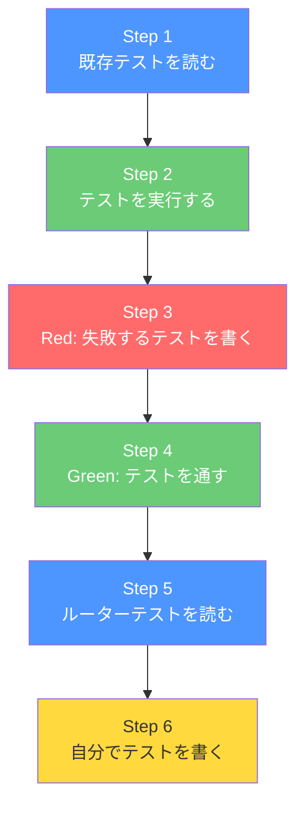

# Day 28: テストでアプリを守ろう

## 🎯 今日のゴール

既存のテストを読んで「テストってこういうものか」を理解した後、
**自分でテストを 1 本書いて、グリーンにする**ところまでを体験します。

## 🤔 なぜこれを作るのか？

コードを書き換えた時に「壊れてないかな...」と不安になったこと、
ありませんか？テストは **自動で動く安全点検** です。
1 回書けば何度でも確認してくれます。

> 💡 **例え話**: テストは「車の安全点検」です。
> エンジンをかけるたびにブレーキやタイヤを
> 自動点検してくれる仕組み。
> 人間が毎回目視で確認するより遥かに確実です。

### 📐 全体像



### やること / やらないこと

| やること | やらないこと |
|---------|-------------|
| 既存テストを読んで構造を理解 | テストフレームワークの変更 |
| Red → Green サイクルを体験 | カバレッジ 100% を目指す |
| ユニットテストを 1 本書く | E2E テストやコンポーネントテストの実装 |
| `npm test` でテストを実行 | CI/CD パイプラインの構築 |

### 🆕 新しく学ぶ概念

| 概念 | 読み方 | 一言でいうと |
|------|--------|------------|
| describe | ディスクライブ | テストをグループにまとめる |
| it / test | イット / テスト | 1 つのテストケースを定義する |
| expect | エクスペクト | 「結果はこうなるはず」と宣言する |
| Red → Green | レッド → グリーン | 先に失敗させてから成功させる手法 |

### 📊 ステップ一覧

| # | やること | 所要時間 |
|---|---------|---------|
| 1 | 既存のテストファイルを読む | 5分 |
| 2 | テストを実行して全部グリーンを確認 | 3分 |
| 3 | Red: わざと失敗するテストを書く | 5分 |
| 4 | Green: テストを通す | 5分 |
| 5 | ルーターテストを読む | 5分 |
| 6 | 自分でテストを 1 本書く | 7分 |
| 7 | 全テストを実行して最終確認 | 3分 |

**合計**: 約 33 分

---

## Step 1: 既存のテストファイルを読む（5分）

🎯 **ゴール**: このアプリにどんなテストがあるか把握し、
テストの基本構造を理解します。

### 1-1. テストファイルの場所

```text
src/
├── lib/utils/__test/
│   └── type-guards.test.ts    ← ユーティリティのテスト
├── server/api/routers/__test/
│   ├── auth.test.ts           ← 認証 API のテスト
│   ├── task.test.ts           ← タスク API のテスト
│   ├── project.test.ts        ← プロジェクト API のテスト
│   ├── comment.test.ts        ← コメント API のテスト
│   ├── search.test.ts         ← 検索 API のテスト
│   ├── report.test.ts         ← レポート API のテスト
│   └── user.test.ts           ← ユーザー API のテスト
```

> 💡 テストファイルは `__test/` ディレクトリに
> `*.test.ts` という名前で置くのがこのプロジェクトの
> ルールです。

### 1-2. 一番シンプルなテストを読む

以下のファイルを VS Code で開いてください。

```typescript
// filepath: src/lib/utils/__test/type-guards.test.ts
import {
  describe, expect, it,
} from 'vitest';
import { isNonNullable } from '../type-guards';

describe('Type Guards', () => {
  describe('isNonNullable', () => {
    it('should return true for non-null/undefined values',
      () => {
        expect(isNonNullable('string'))
          .toBe(true);
        expect(isNonNullable(0)).toBe(true);
        expect(isNonNullable(false))
          .toBe(true);
        expect(isNonNullable([])).toBe(true);
        expect(isNonNullable({})).toBe(true);
      }
    );
```

null と undefined は false になることを検証します。

```typescript
// filepath: src/lib/utils/__test/type-guards.test.ts
    it('should return false for null/undefined',
      () => {
        expect(isNonNullable(null))
          .toBe(false);
        expect(isNonNullable(undefined))
          .toBe(false);
      }
    );
  });
});
```

### 1-3. テストの 3 つの構成要素

| 要素 | コード | 役割 |
|------|--------|------|
| `describe` | `describe('Type Guards', () => {...})` | テストをグループにまとめる（章のタイトル） |
| `it` | `it('non-null なら true', () => {...})` | 1 つのテストケース（テスト項目） |
| `expect` | `expect(isNonNullable('a')).toBe(true)` | 「この結果はこうなるはず」と宣言 |

> 💡 `describe` の中に `describe` をネストできます。
> 大きなグループ → 小さなグループ → 個別テストの
> 階層構造で、テスト結果が読みやすくなります。

✅ **確認ポイント**:
- `describe`, `it`, `expect` の 3 つの役割を理解した
- テストファイルの場所と命名規則を把握した

---

## Step 2: テストを実行する（3分）

🎯 **ゴール**: `npm test` でテストを実行し、
全部グリーン（成功）になることを確認します。

### 2-1. テストを実行

ターミナルで以下を実行してください。

```bash
# filepath: ターミナル
npm test
```

### 2-2. 結果の見方

テスト結果にはこんな表示が出ます:

```text
 ✓ src/lib/utils/__test/type-guards.test.ts
 ✓ src/server/api/routers/__test/auth.test.ts
 ✓ src/server/api/routers/__test/task.test.ts
   ...

 Tests  XX passed
 Time   X.XXs
```

| 記号 | 意味 |
|------|------|
| ✓（緑） | テスト成功（パス） |
| ×（赤） | テスト失敗（フェイル） |
| Tests XX passed | 合計 XX 件のテストが成功 |

> ⚠️ DB に接続できないテストは `skip` 扱いに
> なることがあります。Docker で PostgreSQL が
> 起動していない場合は気にしなくて OK です。

> 📸 ターミナルに緑の ✓ マークが並んでいる npm test の実行結果を確認しましょう。
> 大事なのは「赤い × がない」ことです。

✅ **確認ポイント**:
- `npm test` を実行してテスト結果を確認した
- ✓ マークが表示された

---

## Step 3: Red — わざと失敗するテストを書く（5分）

🎯 **ゴール**: 先に「失敗するテスト」を書いて
赤い × を見ます。これが **Red → Green** の「Red」です。

### 3-1. テストファイルを作成

新しいファイルを作成してください。

```typescript
// filepath: src/lib/utils/__test/math.test.ts
import { describe, expect, it } from 'vitest';

describe('Math Utils', () => {
  it('2 + 3 は 5 になる', () => {
    expect(2 + 3).toBe(5);
  });

  it('add 関数が正しく動く', () => {
    // まだ add 関数は存在しない！
    // @ts-expect-error — 未実装のテスト
    expect(add(2, 3)).toBe(5);
  });
});
```

### 3-2. テストを実行

```bash
# filepath: ターミナル
npm test -- src/lib/utils/__test/math.test.ts
```

### 3-3. 結果を確認

```text
 ✓ 2 + 3 は 5 になる
 × add 関数が正しく動く
   ReferenceError: add is not defined
```

| テスト | 結果 | 理由 |
|--------|------|------|
| `2 + 3 は 5 になる` | ✓ 成功 | 計算結果が正しい |
| `add 関数が正しく動く` | × 失敗 | `add` 関数がまだない |

> 💡 **これが「Red」です！**
> テストが赤くなるのは正常です。
> 「こうなってほしい」をテストで先に書き、
> 次のステップで実装して緑にします。

> 📸 ターミナルに赤い × マークが表示されている「Red」状態の画面を確認しましょう。

✅ **確認ポイント**:
- 赤い × が表示された
- エラーメッセージが `add is not defined` だった

---

## Step 4: Green — テストを通す（5分）

🎯 **ゴール**: `add` 関数を実装して、
赤いテストを緑にします。

### 4-1. 関数を作成

```typescript
// filepath: src/lib/utils/math.ts
export function add(a: number, b: number): number {
  return a + b;
}
```

### 4-2. テストを修正

```typescript
// filepath: src/lib/utils/__test/math.test.ts
import { describe, expect, it } from 'vitest';
import { add } from '../math';

describe('Math Utils', () => {
  it('2 + 3 は 5 になる', () => {
    expect(add(2, 3)).toBe(5);
  });

  it('0 + 0 は 0 になる', () => {
    expect(add(0, 0)).toBe(0);
  });

  it('負の数も計算できる', () => {
    expect(add(-1, 1)).toBe(0);
  });
});
```

### 4-3. テストを実行

```bash
# filepath: ターミナル
npm test -- src/lib/utils/__test/math.test.ts
```

### 4-4. 結果を確認

```text
 ✓ 2 + 3 は 5 になる
 ✓ 0 + 0 は 0 になる
 ✓ 負の数も計算できる

 Tests  3 passed
```

> 📸 ターミナルに緑の ✓ が 3 つ並んでいる「Green」状態の画面を確認しましょう。

> 💡 **これが「Green」です！**
> Red → Green のサイクルを 1 周しました。
> 実務ではこの後「リファクタリング」で
> コードを整理して、再度テストを実行します。
> これが **Red → Green → Refactor** です。

### 4-5. Red → Green → Refactor サイクル

| フェーズ | 色 | やること |
|---------|:--:|---------|
| Red | 🔴 | 失敗するテストを書く |
| Green | 🟢 | テストが通る最小の実装をする |
| Refactor | 🔵 | コードを整理する（テストは変えない） |

✅ **確認ポイント**:
- 全テストが ✓ になった
- Red → Green のサイクルを 1 周体験した

---

## Step 5: ルーターテストを読む（5分）

🎯 **ゴール**: 実際の API テスト（認証ルーター）を
読んで、テストヘルパーの使い方を理解します。

### 5-1. 認証テストを読む

```typescript
// filepath: src/server/api/routers/__test/auth.test.ts（前半）
import {
  describe, expect, it,
} from 'vitest';
import {
  createTestCaller,
  createTestUser,
} from '../../../../test/helpers';
```

テスト本体の構造を見ましょう。

```typescript
// filepath: src/server/api/routers/__test/auth.test.ts（後半）
describe('authRouter', () => {
  describe('login', () => {
    it('should login successfully with correct credentials',
      async () => {
        const testUser = await createTestUser({
          email: 'login-test@example.com',
          password: 'Password123!',
          name: 'Login Test User',
        });
        const caller = await createTestCaller();
        const result = await caller.auth.login({
          email: 'login-test@example.com',
          password: 'Password123!',
        });
        expect(result.user.id)
          .toBe(testUser.id);
        expect(result.user.email)
          .toBe(testUser.email);
        expect(result.user.name)
          .toBe(testUser.name);
      }
    );
  });
});
```

### 5-2. テストの AAA パターン

このテストは **AAA パターン** で書かれています。

| ステップ | 英語 | コード |
|---------|------|--------|
| 1. 準備 | **A**rrange | `createTestUser(...)` でユーザー作成 |
| 2. 実行 | **A**ct | `caller.auth.login(...)` でログイン |
| 3. 検証 | **A**ssert | `expect(...).toBe(...)` で結果を確認 |

### 5-3. 異常系テストも見てみよう

```typescript
// filepath: src/server/api/routers/__test/auth.test.ts
it('should fail login with incorrect password',
  async () => {
    await createTestUser({
      email: 'wrong-password@example.com',
      password: 'correctpassword',
    });

    const caller = await createTestCaller();

    await expect(
      caller.auth.login({
        email: 'wrong-password@example.com',
        password: 'wrongpassword',
      })
    ).rejects.toThrow(
      'メールアドレスまたは'
      + 'パスワードが正しくありません'
    );
  }
);
```

| テスト種別 | 検証内容 | 使う matcher |
|-----------|---------|------------|
| 正常系 | 期待した値が返る | `expect(result).toBe(...)` |
| 異常系 | エラーが発生する | `expect(...).rejects.toThrow(...)` |

> 💡 `rejects.toThrow` は「Promise が
> reject されること」を検証します。
> 正常系だけでなく「ちゃんとエラーになるか」も
> テストするのがプロの書き方です。

✅ **確認ポイント**:
- AAA パターン（Arrange → Act → Assert）を理解した
- 正常系と異常系の書き分けを理解した

---

## Step 6: 自分でテストを 1 本書く（7分）

🎯 **ゴール**: Step 4 で作った `add` 関数のテストに
**エッジケース**（境界値）を追加します。

### 6-1. エッジケースを考える

| ケース | 入力 | 期待値 |
|--------|------|--------|
| 大きな数同士 | `add(999999, 1)` | `1000000` |
| 小数同士 | `add(0.1, 0.2)` | `0.30000000000000004`（浮動小数点） |
| 正と負 | `add(10, -3)` | `7` |

### 6-2. テストを追加

`math.test.ts` を開いて、以下を追加してください。

```typescript
// filepath: src/lib/utils/__test/math.test.ts
// 既存の describe の中に追加
  it('大きな数も計算できる', () => {
    expect(add(999999, 1)).toBe(1000000);
  });

  it('小数の計算は浮動小数点に注意', () => {
    // 0.1 + 0.2 は厳密には 0.3 にならない！
    expect(add(0.1, 0.2)).toBeCloseTo(0.3);
  });
```

### 6-3. `toBeCloseTo` とは？

| matcher | 用途 | 例 |
|---------|------|-----|
| `toBe(5)` | 厳密一致 | 整数の比較 |
| `toBeCloseTo(0.3)` | 近似一致 | 小数の比較（浮動小数点対策） |
| `toThrow('...')` | エラー検証 | 例外が投げられることを確認 |
| `toContain('...')` | 部分一致 | 配列や文字列に含まれるか |

> 💡 `0.1 + 0.2` は JavaScript では
> `0.30000000000000004` になります。
> これは JavaScript のバグではなく、
> IEEE 754 浮動小数点数の仕様です。
> `toBeCloseTo` を使えば安全に比較できます。

### 6-4. テストを実行

```bash
# filepath: ターミナル
npm test -- src/lib/utils/__test/math.test.ts
```

```text
 ✓ 2 + 3 は 5 になる
 ✓ 0 + 0 は 0 になる
 ✓ 負の数も計算できる
 ✓ 大きな数も計算できる
 ✓ 小数の計算は浮動小数点に注意

 Tests  5 passed
```

> 💡 全部グリーンになれば成功です！
> 自分で考えたテストケースが通ると
> 気持ちいいですよね。

✅ **確認ポイント**:
- エッジケースのテストを追加した
- `toBeCloseTo` の使い方を理解した
- 全テストがグリーンになった

---

## Step 7: 全テストを実行して最終確認（3分）

🎯 **ゴール**: プロジェクト全体のテストを実行して、
自分の変更が他のテストを壊していないことを確認します。

### 7-1. 全テスト実行

```bash
# filepath: ターミナル
npm test
```

### 7-2. 確認すべきポイント

| 確認項目 | 期待する結果 |
|---------|------------|
| 自分で書いた `math.test.ts` | ✓ 5 件すべて成功 |
| 既存の `type-guards.test.ts` | ✓ 成功（壊れていない） |
| 既存の `auth.test.ts` | ✓ 成功（壊れていない） |
| 全体 | `Tests XX passed`（赤い × がゼロ） |

> 💡 新しいコードやテストを追加した後は、
> 必ず **全テスト** を実行しましょう。
> 自分の変更が既存の機能を壊していないか
> 確認する習慣が、プロのエンジニアの基本です。

✅ **確認ポイント**:
- 全テストがグリーンで通った
- 自分のテストも既存テストも成功している

---

## 📋 今日のまとめ

### 学んだこと

| やったこと | 結果 |
|-----------|------|
| 既存テストファイルを読んだ | `describe` / `it` / `expect` の構造を理解 |
| `npm test` を実行した | テストが自動で走ることを確認 |
| Red: 失敗するテストを書いた | 赤い × を確認 |
| Green: 実装してテストを通した | Red → Green サイクルを体験 |
| ルーターテストを読んだ | AAA パターンと正常系/異常系を理解 |
| 自分でテストを書いた | エッジケースと `toBeCloseTo` を学んだ |
| 全テストを最終確認した | 既存テストを壊していないことを確認 |

### チェックリスト

- [ ] `describe`, `it`, `expect` の役割を説明できる
- [ ] `npm test` を実行してテスト結果を確認した
- [ ] Red → Green サイクルを 1 周体験した
- [ ] AAA パターン（Arrange → Act → Assert）を理解した
- [ ] 自分でテストを 1 本書いてグリーンにした

## ⚠️ つまずきポイント

| 問題 | 原因 | 解決方法 |
|------|------|---------|
| `npm test` でエラーが大量に出る | DB（PostgreSQL）が起動していない | Docker を起動するか、`type-guards.test.ts` だけ実行 |
| `ReferenceError: describe is not defined` | `vitest.config.ts` の `globals: true` が無い | 設定を確認、または `import { describe } from 'vitest'` を追加 |
| テストが通っているのに赤い | `console.error` の出力を赤と見間違い | ✓ マークが緑なら成功。ログ出力は無視して OK |

## 🔜 次回予告

Day 29 では **リリース前の総点検** をします。
型チェック → Lint → テスト → ビルドの
4 コマンドを全部グリーンにして、
「このアプリは出荷できる」状態を作ります。
