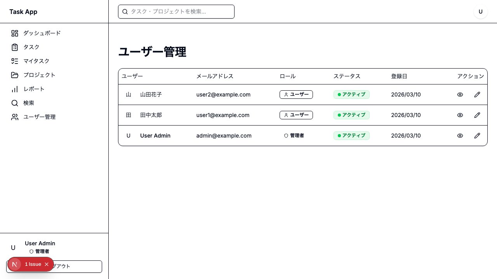
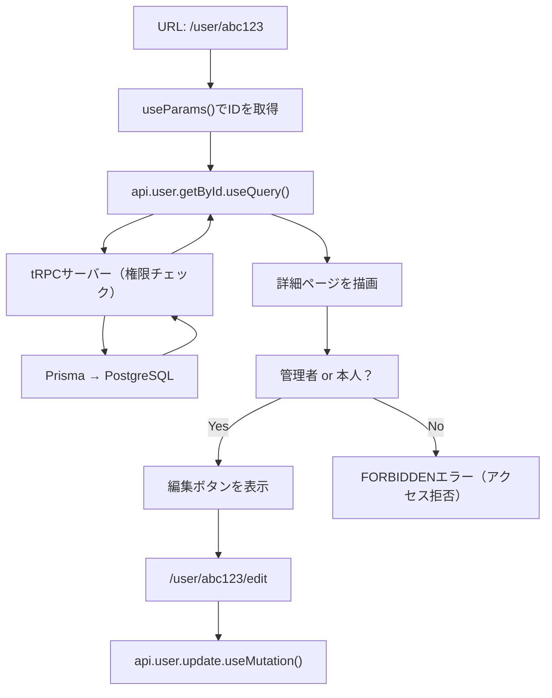
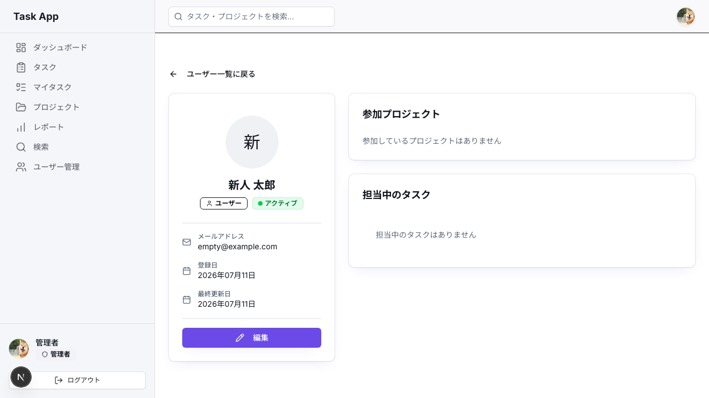
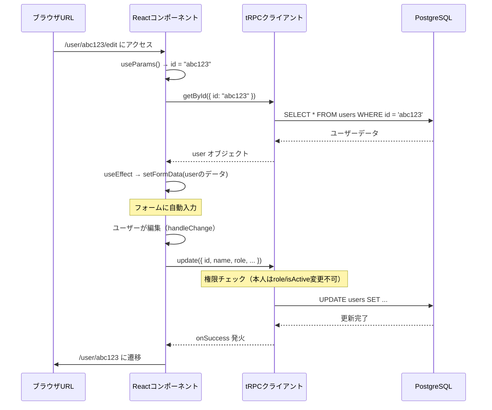

# Day 29: ユーザー詳細・編集ページを作ろう

## 🔙 前回の振り返り

Day 28 では **タスク一括操作**を実装しました。チェックボックスで複数タスクを選択し、一括でステータス変更・削除できる機能を作りましたね。今日は Day 24 で作った**ユーザー一覧ページ**の続きとして、「各ユーザーをクリックしたときに開く詳細ページ」と「編集ページ」を作ります。

---

## 🎯 今日のゴール

ユーザーの詳細情報を表示するページと、管理者または本人がユーザー情報を編集できるページを作ります。Next.js の**動的ルーティング**という仕組みを使って、URLに含まれるユーザーIDからデータを取得する方法を学びます。

📸 スクリーンショット: ユーザー詳細ページの完成イメージの表示を確認してください。


## 🤔 なぜこれを作るのか？

管理者は「各ユーザーの情報を確認したい」「権限を変えたい」「アカウントを無効にしたい」という管理業務が必要です。また、一般ユーザーも自分のプロフィールを確認・編集したいですよね。

このアプリでは**管理者は全ユーザーの情報を閲覧・編集でき、一般ユーザーは自分の情報だけを閲覧・編集できる**という権限モデルです。

> 💡 **例え話**: 会社の社員名簿を想像してください。人事担当者（管理者）は全社員のページを開けますが、一般社員は自分のページだけです。

> 「部署変更」「在籍状態の変更」は人事担当者だけが行えます。今日はその仕組みを作ります。

### 📐 ページ構成とデータの流れ



### やること / やらないこと

| やること | やらないこと |
|---------|-------------|
| 動的ルーティング `[id]` フォルダの作成 | パスワード変更機能 |
| ユーザー詳細ページの実装 | プロフィール画像のアップロード機能 |
| 管理者・本人向けユーザー編集ページの実装 | メール通知機能 |
| 権限に基づいたUI表示切り替え | ユーザー削除機能 |
| フォームとサーバーデータの同期（useEffect） | 2要素認証 |

### 🆕 新しく学ぶ概念

| 概念 | 読み方 | 役割 | 例え |
|------|--------|------|------|
| 動的ルーティング `[id]` | どうてきルーティング | URLのID部分を変数として受け取る | 「社員番号001の名簿ページ」→ URLの001が変数 |
| `useParams()` | ユーズパラムズ | URLのパラメータ（変数）を読み取るフック | 住所から「番地」だけを取り出す |
| `useEffect` | ユーズエフェクト | コンポーネント外部の変化に反応して副作用を実行するフック | 荷物が届いたら自動で棚に並べる係 |
| useForm + zod（復習） | — | フォーム管理＋バリデーション（Day 14 参照） | 記入用紙のルール自動チェック |
| 権限チェック | けんげんチェック | ユーザーの役割によって表示を変える | 社員証の種類によって入れる部屋を変える |

## 📊 実装ステップ一覧

| ステップ | 作業内容 | 所要時間 | 触るファイル | 成功状態 |
|---------|---------|---------|-------------|---------|
| Step 1 | 動的ルーティングの仕組みを理解する | 5分 | 概念説明のみ | 仕組みが頭に入る |
| Step 2 | ユーザー詳細ページのファイルを作成 | 5分 | `src/app/user/[id]/page.tsx` | ファイルが存在する |
| Step 3 | URLからユーザーIDを取得してデータを取得 | 7分 | `src/app/user/[id]/page.tsx` | ユーザー名が表示される |
| Step 4 | グリッドレイアウトで詳細情報を表示 | 7分 | `src/app/user/[id]/page.tsx` | 2カラムレイアウトで表示 |
| Step 5 | プロジェクト一覧とタスクテーブルを表示 | 7分 | `src/app/user/[id]/page.tsx` | バッジとテーブルが表示される |
| Step 6 | 権限チェックで編集ボタンを出し分ける | 5分 | `src/app/user/[id]/page.tsx` | 管理者・本人のみ編集ボタンが見える |
| Step 7 | 編集ページのファイルを作成 | 5分 | `src/app/user/[id]/edit/page.tsx` | ファイルが存在する |
| Step 8 | フォーム状態管理とuseEffectでデータ同期 | 7分 | `src/app/user/[id]/edit/page.tsx` | フォームにデータが入る |
| Step 9 | ロール選択・アクティブ状態の切り替え | 7分 | `src/app/user/[id]/edit/page.tsx` | ドロップダウンとチェックボックスが動く |
| Step 10 | 保存機能を実装して完成 | 5分 | `src/app/user/[id]/edit/page.tsx` | 保存ボタンでDBが更新される |

**合計時間**: 約60分

---

### Step 1: 動的ルーティングの仕組みを理解する（5分）

🎯 **ゴール**: Next.js の `[id]` フォルダがどんな魔法をしているか理解する。

Next.js では、フォルダ名を `[id]` のように**角括弧で囲む**と、そのフォルダ名が「変数」になります。URLの対応する部分が自動的にその変数に入ります。

```
フォルダ構造:
src/app/user/[id]/page.tsx

アクセスできるURL:
/user/abc123     → id = "abc123"
/user/xyz789     → id = "xyz789"
/user/user001    → id = "user001"
```

これが**動的ルーティング**です。1つのファイルで何千人ものユーザーページを作れます。

| 方式 | フォルダ例 | 動作 |
|------|-----------|------|
| 静的ルーティング | `src/app/about/page.tsx` | `/about` だけに対応 |
| 動的ルーティング | `src/app/user/[id]/page.tsx` | `/user/なんでも` に対応 |

`[id]` の `id` という名前は自由に決められます。`[userId]` でも `[username]` でも OK です。ただし、コード内で読み取るときも同じ名前を使います。

```tsx
// filepath: src/app/user/[id]/page.tsx
// このファイルは /user/なんでも という全てのURLに対応する
// URLの「なんでも」部分が params['id'] として受け取れる
export default function UserDetailPage() {
  // 次のステップでここに useParams() を書く
  return <div>ユーザー詳細ページ</div>;
}
```

✅ **確認ポイント**:
- 動的ルーティングは「角括弧 `[]` でフォルダ名を囲む」ことで実現する
- 1つのファイルで無数のURLに対応できる仕組みだと理解した

---

### Step 2: ユーザー詳細ページのファイルを作成する（5分）

🎯 **ゴール**: 必要なフォルダとファイルを作成し、まず骨組みを作る。

以下のフォルダ構造を作成します。

```
src/app/user/
├── page.tsx           ← Day 24 で作った一覧ページ
└── [id]/
    ├── page.tsx       ← 今回作成（詳細ページ）
    └── edit/
        └── page.tsx   ← 後で作成（編集ページ）
```

まずは詳細ページの骨組みです。

```tsx
// filepath: src/app/user/[id]/page.tsx
'use client';

import { AppLayout } from '@/component/layout/app-layout';

export default function UserDetailPage() {
  return (
    <AppLayout>
      <div className="container mx-auto max-w-6xl py-8">
        <h1 className="text-2xl font-bold">
          ユーザー詳細ページ
        </h1>
        <p>ここにユーザー情報を表示します</p>
      </div>
    </AppLayout>
  );
}
```

開発サーバーを起動して `/user/test123` にアクセスしてみましょう。

```bash
npm run dev
```

📸 スクリーンショット: ユーザー詳細ページの骨組みの表示を確認してください。


どんなIDを入れても同じページが表示されるはずです。次のステップでURLからIDを読み取ります。

✅ **確認ポイント**:
- `src/app/user/[id]/page.tsx` ファイルが作成できた
- `/user/test123` にアクセスして「ユーザー詳細ページ」と表示される
- `npm run dev` でエラーが出ない

---

### Step 3: URLからユーザーIDを取得してデータを取得する（7分）

🎯 **ゴール**: `useParams()` でIDを読み取り、tRPCでユーザーデータを取得し、エラー時にトースト通知を表示する。

`useParams()` は Next.js が提供するフックで、現在のURLのパラメータを読み取ります。

インポートとデータ取得の部分を書きます。

```tsx
// filepath: src/app/user/[id]/page.tsx
'use client';

import { useParams, useRouter } from 'next/navigation';
import { useEffect } from 'react';
import toast from 'react-hot-toast';
import { AppLayout } from '@/component/layout/app-layout';
import { Card, CardContent } from '@/component/ui/card';
import { PageLoadingSpinner } from '@/component/ui/loading-spinner';
import { USER_ROLE } from '@/lib/constant/roles';
import { api } from '@/trpc/react';
```

✅ **確認ポイント**: ファイルを保存して `npm run dev` でインポートエラーが出ないことを確認してください。

コンポーネントの中でURLのIDを取得し、データを取得します。

```tsx
// filepath: src/app/user/[id]/page.tsx
export default function UserDetailPage() {
  const router = useRouter();
  const params = useParams();
  const userId = String(params['id'] ?? '');

  const { data: currentUser } = api.auth.getCurrentUser.useQuery();

  const { data: user, isLoading, error } =
    api.user.getById.useQuery(
      { id: userId },
      { enabled: userId.length > 0 },
    );

  useEffect(() => {
    if (error) {
      toast.error(error.message || 'ユーザー情報の取得に失敗しました');
    }
  }, [error]);
```

`useEffect` で `error` の変化を監視し、エラー発生時にトースト表示します。

> 💡 React の Strict Mode（開発時のみ有効）では `useEffect` が2回実行されることがあります。ただし依存配列に `[error]` を指定しているため、`error` オブジェクトの参照が変わらなければ再実行されません。本番ビルドでは1回だけ実行されます。

次に早期リターンを書きます。

```tsx
// filepath: src/app/user/[id]/page.tsx
  if (isLoading) {
    return (
      <AppLayout>
        <PageLoadingSpinner />
      </AppLayout>
    );
  }

  if (!user) {
    return (
      <AppLayout>
        <div className="container mx-auto max-w-6xl mt-8">
          <Card>
            <CardContent className="pt-6">
              <p>ユーザーが見つかりません</p>
            </CardContent>
          </Card>
        </div>
      </AppLayout>
    );
  }
```

`if (!user)` の早期リターンを通過した後に権限変数を宣言します（`user` が確実に存在する状態でないと `user.id` にアクセスできないため）。

```tsx
// filepath: src/app/user/[id]/page.tsx
  // この位置に書く（if (!user) の後）
  const isAdmin = currentUser?.role === USER_ROLE.ADMIN;
  const isOwnProfile = currentUser?.id === user.id;
```

✅ **確認ポイント**: この時点で存在しないIDにアクセスすると「ユーザーが見つかりません」と表示されることを確認してください。

正常系の表示を書きます。次のステップで内容を充実させます。

```tsx
// filepath: src/app/user/[id]/page.tsx
  return (
    <AppLayout>
      <div className="container mx-auto max-w-6xl py-8">
        <h1 className="text-2xl font-bold">{user.name}</h1>
        <p>ID: {userId}</p>
      </div>
    </AppLayout>
  );
}
```

✅ **確認ポイント**:
- 存在するユーザーIDでアクセスするとユーザー名が表示される
- 存在しないIDでは「ユーザーが見つかりません」と表示される
- 読み込み中はスピナーが表示される

---

### Step 4: グリッドレイアウトで詳細情報を表示する（7分）

🎯 **ゴール**: 戻るボタン・サイドバー・メインコンテンツの2カラムレイアウトで表示する。

```
モバイル: 縦に並ぶ
PC: 左4列 + 右8列
  ┌──────┬────────────────────┐
  │Avatar│プロジェクト一覧    │
  │名前  │担当タスクテーブル  │
  │ロール│                    │
  └──────┴────────────────────┘
```

必要なコンポーネントをインポートします。ファイルの先頭のインポート部分に追加してください。

```tsx
// filepath: src/app/user/[id]/page.tsx
import { format } from 'date-fns';
import { ja } from 'date-fns/locale';
import { ArrowLeft, Calendar, Mail } from 'lucide-react';
import { Avatar, AvatarFallback, AvatarImage }
  from '@/component/ui/avatar';
import { Button } from '@/component/ui/button';
import { Card, CardContent } from '@/component/ui/card';
import { Separator } from '@/component/ui/separator';
import { ActiveStatusBadge, UserRoleBadge }
  from '@/component/ui/user-badges';
```

✅ **確認ポイント**: ファイルを保存してインポートエラーが出ないことを確認してください。

12列グリッド（`md:grid-cols-12`）で左4列・右8列に分割します。`return` 文を書き換えます。

```tsx
// filepath: src/app/user/[id]/page.tsx
  return (
    <AppLayout>
      <div className="container mx-auto max-w-6xl py-8">
        <Button
          variant="ghost"
          className="mb-4 pl-0 hover:bg-transparent hover:text-primary"
          onClick={() => router.push('/user')}
        >
          <ArrowLeft className="mr-2 h-4 w-4" />
          ユーザー一覧に戻る
        </Button>

        <div className="grid gap-6 md:grid-cols-12">
```

左カラムにアバターとユーザー基本情報を置きます。

```tsx
// filepath: src/app/user/[id]/page.tsx
          {/* 左カラム: アバター・基本情報 */}
          <div className="md:col-span-4 space-y-6">
            <Card>
              <CardContent className="pt-6">
                <div className="text-center mb-6">
                  {/* アバター画像（未設定時は名前の頭文字を表示） */}
                  <Avatar className="w-24 h-24 mx-auto mb-4">
                    <AvatarImage
                      src={user.avatar ?? ''}
                      alt={user.name ?? ''}
                    />
                    <AvatarFallback className="text-3xl">
                      {user.name?.[0]?.toUpperCase()}
                    </AvatarFallback>
                  </Avatar>
                  <h2 className="text-xl font-bold mb-2">
                    {user.name}
                  </h2>
                  {/* ロールバッジとアクティブ状態バッジ */}
                  <div className="flex justify-center gap-2 mb-4">
                    <UserRoleBadge role={user.role} />
                    <ActiveStatusBadge isActive={user.isActive} />
                  </div>
                </div>
```

✅ **確認ポイント**: ファイルを保存して `npm run dev` でエラーが出ないことを確認してください。

次にセパレーターとメールアドレスを表示します。

```tsx
// filepath: src/app/user/[id]/page.tsx
// セパレーターとメールアドレス表示
                <Separator className="my-4" />
                <div className="space-y-4 text-sm">
                  <div className="flex items-center gap-3">
                    <Mail className="h-4 w-4 text-muted-foreground" />
                    <div>
                      <p className="font-medium text-muted-foreground text-xs">
                        メールアドレス
                      </p>
                      <p>{user.email}</p>
                    </div>
                  </div>
```

✅ **確認ポイント**: メールアドレスがアイコン付きで表示されることを確認してください。

登録日も同じレイアウトパターンで表示します。

```tsx
// filepath: src/app/user/[id]/page.tsx
// 登録日の表示
                  <div className="flex items-center gap-3">
                    <Calendar className="h-4 w-4 text-muted-foreground" />
                    <div>
                      <p className="font-medium text-muted-foreground text-xs">
                        登録日
                      </p>
                      <p>
                        {user.createdAt
                          ? format(
                              new Date(user.createdAt),
                              'yyyy年MM月dd日',
                              { locale: ja }
                            )
                          : '-'}
                      </p>
                    </div>
                  </div>
```

✅ **確認ポイント**: 登録日がカレンダーアイコン付きで表示されることを確認してください。

最終更新日も同じパターンで表示します。

```tsx
// filepath: src/app/user/[id]/page.tsx
// 最終更新日と左カラムの閉じタグ
                  <div className="flex items-center gap-3">
                    <Calendar className="h-4 w-4 text-muted-foreground" />
                    <div>
                      <p className="font-medium text-muted-foreground text-xs">
                        最終更新日
                      </p>
                      <p>
                        {user.updatedAt
                          ? format(
                              new Date(user.updatedAt),
                              'yyyy年MM月dd日',
                              { locale: ja }
                            )
                          : '-'}
                      </p>
                    </div>
                  </div>
                </div>
              </CardContent>
            </Card>
          </div>
```

✅ **確認ポイント**: メールアドレス・登録日・最終更新日がアイコン付きで表示されていることを確認してください。

左カラムの `div` を閉じた後、右カラムの枠を書きます。中身は Step 5 で追加します。

```tsx
// filepath: src/app/user/[id]/page.tsx
          {/* 右カラム: Step 5で中身を追加 */}
          <div className="md:col-span-8 space-y-6">
            {/* Step 5 でプロジェクト・タスクを追加 */}
          </div>
        </div>
      </div>
    </AppLayout>
  );
}
```

✅ **確認ポイント**:
- PCサイズのブラウザで左にアバター、右にスペースが表示される
- スマホサイズに縮小すると縦に並ぶ
- アバターが未設定のユーザーでは名前の頭文字が表示される
- 「ユーザー一覧に戻る」ボタンが表示される

---

### Step 5: プロジェクト一覧とタスクテーブルを表示する（7分）

🎯 **ゴール**: 参加プロジェクトをバッジで、担当タスクをテーブルで表示する。

必要なコンポーネントをインポートします。ファイル先頭のインポート部分に追加してください。

```tsx
// filepath: src/app/user/[id]/page.tsx
import { Badge } from '@/component/ui/badge';
import { CardHeader, CardTitle } from '@/component/ui/card';
import {
  Table, TableBody, TableCell,
  TableHead, TableHeader, TableRow,
} from '@/component/ui/table';
import {
  getPriorityBadgeVariant, getStatusBadgeVariant,
} from '@/lib/badge-variant';
import { TASK_PRIORITY_LABELS } from '@/lib/constant/priority';
import { TASK_STATUS_LABELS } from '@/lib/constant/status';
```

右カラムに「参加プロジェクト」カードを追加します。

```tsx
// filepath: src/app/user/[id]/page.tsx
{/* 参加プロジェクト一覧（バッジ形式） */}
<Card>
  <CardHeader>
    <CardTitle className="text-lg">参加プロジェクト</CardTitle>
  </CardHeader>
  <CardContent>
    {user.projects && user.projects.length > 0 ? (
      <div className="flex flex-wrap gap-2">
        {user.projects.map((member) => (
          <Badge
            key={member.id}
            className="cursor-pointer hover:opacity-80 px-3 py-1 text-sm font-normal text-white"
            style={{ backgroundColor: member.project.color }}
```

各バッジにクリックイベントを付けて、プロジェクトページへ遷移できるようにしています。上のコードブロック内の `<Badge` に以下の属性が含まれています。

```tsx
// filepath: src/app/user/[id]/page.tsx
// Badge のクリックでプロジェクトページに遷移
onClick={() =>
  router.push(
    `/project?projectId=${member.project.id}`
  )
}
```

✅ **確認ポイント**: プロジェクトバッジにカーソルを合わせるとポインターカーソルになることを確認してください。

プロジェクトがないユーザー向けの空メッセージも忘れずに。`CardContent` の閉じタグまで書き切りましょう。

Tailwind CSS では動的な色をクラスで指定できないため、`style={{ backgroundColor: member.project.color }}` でプロジェクトカラーを適用しています。

「担当中のタスク」カードをテーブル形式で追加します。テーブルのヘッダー部分です。

```tsx
// filepath: src/app/user/[id]/page.tsx
            {/* 担当中タスクのテーブル表示 */}
            <Card>
              <CardHeader>
                <CardTitle className="text-lg">担当中のタスク</CardTitle>
              </CardHeader>
              <CardContent className="p-0">
                {user.assignedTasks && user.assignedTasks.length > 0 ? (
                  <Table>
                    <TableHeader>
                      <TableRow>
                        <TableHead>タイトル</TableHead>
                        <TableHead>ステータス</TableHead>
                        <TableHead>優先度</TableHead>
                        <TableHead>期限</TableHead>
                      </TableRow>
                    </TableHeader>
```

✅ **確認ポイント**: テーブルヘッダーに「タイトル」「ステータス」「優先度」「期限」の4列が表示されることを確認してください。

`TableHeader` の直後に `TableBody` を追加します。各タスク行はクリックでタスク詳細に遷移します。

```tsx
// filepath: src/app/user/[id]/page.tsx
// タスクテーブルのボディ部分
                    <TableBody>
                      {user.assignedTasks.map((task) => (
                        <TableRow
                          key={task.id}
                          className="cursor-pointer hover:bg-muted/50"
                          onClick={() =>
                            router.push(`/task?taskId=${task.id}`)
                          }
                        >
                          <TableCell className="font-medium">
                            {task.title}
                          </TableCell>
                          <TableCell>
                            <Badge variant={getStatusBadgeVariant(task.status)}>
                              {TASK_STATUS_LABELS[task.status]}
                            </Badge>
                          </TableCell>
                          <TableCell>
                            <Badge variant={getPriorityBadgeVariant(task.priority)}>
                              {TASK_PRIORITY_LABELS[task.priority]}
                            </Badge>
                          </TableCell>
```

期限列の表示とカードの閉じタグを追加します。日付がない場合は `-` を表示します。

```tsx
// filepath: src/app/user/[id]/page.tsx
// 期限列とテーブル・カードの閉じタグ
                          <TableCell>
                            {task.dueDate
                              ? format(new Date(task.dueDate), 'yyyy/MM/dd', { locale: ja })
                              : '-'}
                          </TableCell>
                        </TableRow>
                      ))}
                    </TableBody>
                  </Table>
                ) : (
                  <div className="p-6 text-muted-foreground text-sm">
                    担当中のタスクはありません
                  </div>
                )}
              </CardContent>
            </Card>
```

✅ **確認ポイント**: タスクテーブルにステータスバッジと優先度バッジが色付きで表示されることを確認してください。

📸 スクリーンショット: プロジェクト一覧とタスクテーブルの表示を確認してください。


✅ **確認ポイント**:
- プロジェクトバッジがカラフルに（テキストは白で）表示される
- バッジをクリックするとプロジェクトページに遷移する
- タスクの行をクリックするとタスク詳細に遷移する
- プロジェクト・タスクがないユーザーには「ありません」メッセージが出る

---

### Step 6: 権限チェックで編集ボタンを出し分ける（5分）

🎯 **ゴール**: 管理者または本人のみに編集ボタンを表示する。

まずインポートを追加します。

```tsx
// filepath: src/app/user/[id]/page.tsx
import { ArrowLeft, Calendar, Mail, Pencil } from 'lucide-react';
// Pencil を追加（ArrowLeft, Calendar, Mail は Step 4 で追加済み）
```

左カラムの `Separator` と閉じタグ `</CardContent>` の間に追加します。

```tsx
// filepath: src/app/user/[id]/page.tsx
                {(isAdmin || isOwnProfile) && (
                  <>
                    <Separator className="my-4" />
                    <Button
                      className="w-full"
                      onClick={() =>
                        router.push(`/user/${user.id}/edit`)
                      }
                    >
                      <Pencil className="mr-2 h-4 w-4" /> 編集
                    </Button>
                  </>
                )}
```

| 条件 | 結果 |
|------|------|
| 管理者 + 他人のプロフィール | ボタン表示される |
| 管理者 + 自分のプロフィール | ボタン表示される |
| 一般ユーザー + 自分のプロフィール | ボタン表示される |
| 一般ユーザー + 他人のプロフィール | そもそもページにアクセスできない（サーバーが FORBIDDEN を返す） |

> ⚠️ **注意**: 一般ユーザーが他人のユーザーIDで `/user/他人のid` にアクセスすると、`getById` の権限チェックで FORBIDDEN エラーになり、データが取得できません。「ボタンが非表示」ではなく「ページ自体が表示されない」という設計です。

✅ **確認ポイント**:
- 管理者でログインするとどのユーザーページにも「編集」ボタンが表示される
- 一般ユーザーで自分のページを見るとボタンが表示される
- 一般ユーザーで他人のIDにアクセスするとエラートーストが表示され、データが表示されない

---

### Step 7: 編集ページのファイルを作成する（5分）

🎯 **ゴール**: `/user/[id]/edit` の骨組みを作り、権限チェックを実装する。

まずインポートを書きます。

```tsx
// filepath: src/app/user/[id]/edit/page.tsx
'use client';

import { zodResolver }
  from '@hookform/resolvers/zod';
import { ArrowLeft } from 'lucide-react';
import { useParams, useRouter } from 'next/navigation';
import { useEffect } from 'react';
import { useForm } from 'react-hook-form';
import toast from 'react-hot-toast';
import { z } from 'zod';
```

✅ **確認ポイント**: `zodResolver`, `useForm`, `z` のインポートが含まれていることを確認してください。

```tsx
// filepath: src/app/user/[id]/edit/page.tsx
import { zodResolver }
  from '@hookform/resolvers/zod';
import { useForm } from 'react-hook-form';
import { z } from 'zod';
import { AppLayout }
  from '@/component/layout/app-layout';
import { Button } from '@/component/ui/button';
import { Card, CardContent, CardHeader, CardTitle }
  from '@/component/ui/card';
import { PageLoadingSpinner }
  from '@/component/ui/loading-spinner';
import { USER_ROLE, type UserRole }
  from '@/lib/constant/roles';
import { api } from '@/trpc/react';
```

✅ **確認ポイント**: ファイルを保存してインポートエラーが出ないことを確認してください。

URLパラメータ取得 → データ取得 → 早期リターンの流れで実装します。`useForm` + zod でフォーム状態を管理します。

```tsx
// filepath: src/app/user/[id]/edit/page.tsx
export default function UserEditPage() {
  const router = useRouter();
  const params = useParams();
  const userId = String(params['id'] ?? '');

  const form = useForm<UserEditFormValues>({
    resolver: zodResolver(userEditSchema),
    defaultValues: {
      name: '',
      avatar: '',
      role: USER_ROLE.USER,
      isActive: true,
    },
  });

  const { data: currentUser } = api.auth.getCurrentUser.useQuery();
  const { data: user, isLoading } = api.user.getById.useQuery(
    { id: userId },
    { enabled: userId.length > 0 },
  );
```

早期リターン（ローディング → 未発見）の後に権限チェックを追加します。

```tsx
// filepath: src/app/user/[id]/edit/page.tsx
  if (isLoading) {
    return (
      <AppLayout>
        <PageLoadingSpinner />
      </AppLayout>
    );
  }

  if (!user) {
    return (
      <AppLayout>
        <div className="container mx-auto max-w-md mt-8">
          <Card>
            <CardContent className="pt-6">
              <p>ユーザーが見つかりません</p>
            </CardContent>
          </Card>
        </div>
      </AppLayout>
    );
  }
```

続いて、権限チェックを追加します。管理者でも本人でもなければ編集画面にアクセスできません。

```tsx
// filepath: src/app/user/[id]/edit/page.tsx
// 権限チェック部分
  const isAdmin = currentUser?.role === USER_ROLE.ADMIN;
  const isOwnProfile = currentUser?.id === userId;

  if (!isAdmin && !isOwnProfile) {
    return (
      <AppLayout>
        <div className="container mx-auto max-w-md mt-8">
          <Card>
            <CardContent className="pt-6">
              <h1 className="text-xl font-bold mb-2">
                アクセス権限がありません
              </h1>
              <p className="text-muted-foreground">
                管理者または本人のみユーザー編集が可能です
              </p>
            </CardContent>
          </Card>
        </div>
      </AppLayout>
    );
  }
```

権限チェックを通過した後に編集フォームの枠を表示します。

```tsx
// filepath: src/app/user/[id]/edit/page.tsx
  return (
    <AppLayout>
      <div className="container mx-auto max-w-md mt-8 mb-8">
        <Button
          variant="ghost"
          className="mb-4 pl-0 hover:bg-transparent hover:text-primary"
          onClick={() => router.push(`/user/${userId}`)}
        >
          <ArrowLeft className="mr-2 h-4 w-4" />
          戻る
        </Button>
        <Card>
          <CardHeader>
            <CardTitle>ユーザー編集</CardTitle>
          </CardHeader>
          <CardContent>
            {/* Step 8, 9, 10 でフォームを追加 */}
          </CardContent>
        </Card>
      </div>
    </AppLayout>
  );
}
```

✅ **確認ポイント**:
- 権限のないユーザーで `/user/他人のid/edit` にアクセスすると「権限がありません」と表示される
- 管理者でアクセスすると「ユーザー編集」が表示される
- 自分のIDでアクセスすると「ユーザー編集」が表示される
- 「戻る」ボタンで詳細ページに戻れる

---

### Step 8: zodスキーマとuseFormでデータを同期する（7分）

🎯 **ゴール**: react-hook-form + zod でフォームを管理し、サーバーデータを自動入力する。

zod スキーマを定義します（Step 7 で `zodResolver`, `useForm`, `z` はインポート済み）。

```tsx
// filepath: src/app/user/[id]/edit/page.tsx
// ユーザー編集用の zodスキーマ
const userEditSchema = z.object({
  name: z.string()
    .min(1, '名前は必須です'),
  avatar: z.string().url().or(
    z.literal('')),
  role: z.string(),
  isActive: z.boolean(),
});
type UserEditFormValues =
  z.infer<typeof userEditSchema>;
```

✅ **確認ポイント**: `z.infer` で型を自動生成している。

`useEffect` + `form.reset` でサーバーデータが届いたらフォームに反映します。

```tsx
// filepath: src/app/user/[id]/edit/page.tsx
  // サーバーデータでフォームを初期化
  useEffect(() => {
    if (user) {
      form.reset({
        name: user.name ?? '',
        avatar: user.avatar ?? '',
        role: user.role,
        isActive: user.isActive,
      });
    }
  }, [user, form]);
```

`user` データは非同期に取得されるため、コンポーネント表示時はまだ `undefined` です。`[user]` 依存配列により、データ到着時に `form.reset` が自動実行されフォームが埋まります。

✅ **確認ポイント**: ファイルを保存してエラーが出ないことを確認してください。

次に必要なコンポーネントをインポートし、フォームを書きます。

```tsx
// filepath: src/app/user/[id]/edit/page.tsx
import { Avatar, AvatarFallback, AvatarImage }
  from '@/component/ui/avatar';
import { Input } from '@/component/ui/input';
import { Label } from '@/component/ui/label';
```

CardContent 内のフォームを書きます。`register` でテキスト入力を管理し、`watch` でアバタープレビューをリアルタイム更新します。

> 💡 `onSubmit` と `updateUser` は
> Step 10 で定義します。ここではJSX構造を
> 先に書き、Step 10 の完了後に動作確認します。

```tsx
// filepath: src/app/user/[id]/edit/page.tsx
// フォーム開始 + アバタープレビュー
            <form onSubmit={
              form.handleSubmit(onSubmit)}
              className="space-y-6">
              <div className="flex
                justify-center mb-6">
                <Avatar className="w-24 h-24">
                  <AvatarImage
                    src={form.watch('avatar')} />
                  <AvatarFallback
                    className="text-2xl">
                    {form.watch('name')
                      ?.[0]?.toUpperCase()}
                  </AvatarFallback>
                </Avatar>
              </div>
```

```tsx
// filepath: src/app/user/[id]/edit/page.tsx
// 名前入力（register版）
              <div className="space-y-2">
                <Label htmlFor="name">
                  名前
                  <span className=
                    "text-destructive">*
                  </span>
                </Label>
                <Input id="name"
                  {...form.register('name')}
                  disabled={
                    updateUser.isPending} />
                {form.formState.errors
                  .name && (
                  <p className="text-sm
                    text-destructive">
                    {form.formState.errors
                      .name.message}
                  </p>)}
              </div>
```

メールアドレスとアバターURL入力欄を追加します。

```tsx
// filepath: src/app/user/[id]/edit/page.tsx
              <div className="space-y-2">
                <Label htmlFor="email">
                  メールアドレス</Label>
                <Input id="email"
                  value={user.email}
                  disabled />
                <p className="text-xs
                  text-muted-foreground">
                  メールアドレスは変更できません
                </p>
              </div>

              <div className="space-y-2">
                <Label htmlFor="avatar">
                  アバターURL（任意）</Label>
                <Input id="avatar" type="url"
                  {...form.register('avatar')}
                  disabled={
                    updateUser.isPending}
                  placeholder=
                    "https://example.com/
                      avatar.png" />
              </div>
```

✅ **確認ポイント**:
- 編集ページを開くとフォームにユーザーの名前が自動入力される
- アバターURLを入力するとプレビューがリアルタイムで変わる（`form.watch('avatar')` が `AvatarImage` の `src` に直結しているため）
- メールアドレスの入力欄が `disabled` でグレーアウトしている

---

### Step 9: ロール選択・アクティブ状態の切り替えを実装する（7分）

🎯 **ゴール**: Select でロールを選択、Checkbox でアクティブ状態を切り替える。

**サーバー側のアクセス制御**: 一般ユーザーが自分の `role` や `isActive` を変更しようとすると、サーバーが `FORBIDDEN` エラーを返します。Step 10 の `handleSubmit` で非管理者の場合はこれらのフィールドを送信しないようにガードしています。

インポートを追加します。

```tsx
// filepath: src/app/user/[id]/edit/page.tsx
import { Checkbox } from '@/component/ui/checkbox';
import {
  Select, SelectContent, SelectItem,
  SelectTrigger, SelectValue,
} from '@/component/ui/select';
import { isUserRole, USER_ROLE_LABELS }
  from '@/lib/constant/roles';
```

✅ **確認ポイント**: ファイルを保存してインポートエラーが出ないことを確認してください。

ロール選択のドロップダウンを追加します。

```tsx
// filepath: src/app/user/[id]/edit/page.tsx
// ロール選択（form.setValue版）
              <div className="space-y-2">
                <Label htmlFor="role">
                  ロール</Label>
                <Select
                  value={form.watch('role')}
                  onValueChange={(value) => {
                    if (isUserRole(value)) {
                      form.setValue(
                        'role', value);
                    }
                  }}
                  disabled={
                    updateUser.isPending}>
                  <SelectTrigger id="role">
                    <SelectValue
                      placeholder=
                        "ロールを選択" />
                  </SelectTrigger>
```

```tsx
// filepath: src/app/user/[id]/edit/page.tsx
// ロール選択肢（SelectContent）
                  <SelectContent>
                    {Object.entries(
                      USER_ROLE_LABELS
                    ).map(([value, label]) => (
                      <SelectItem
                        key={value}
                        value={value}>
                        {label}
                      </SelectItem>
                    ))}
                  </SelectContent>
                </Select>
              </div>
```

✅ **確認ポイント**: ドロップダウンを開いて「ユーザー」「管理者」が表示されることを確認してください。

`onValueChange` の `value` は `string` 型ですが、`form.watch('role')` は `string` 型です。`isUserRole` 型ガードで安全に検証します（`as UserRole` は使いません）。

アクティブ状態を切り替えるチェックボックスを追加します。

```tsx
// filepath: src/app/user/[id]/edit/page.tsx
              <div className="flex
                items-center space-x-2">
                <Checkbox id="isActive"
                  checked={form.watch(
                    'isActive')}
                  onCheckedChange={
                    (checked) =>
                      form.setValue(
                        'isActive',
                        checked === true)}
                  disabled={
                    updateUser.isPending} />
                <Label htmlFor="isActive">
                  アクティブ</Label>
              </div>
```

✅ **確認ポイント**: チェックボックスの ON/OFF が切り替えられることを確認してください。

`checked === true` と書くのは、`onCheckedChange` が `boolean | 'indeterminate'` を受け取るためです。

📸 スクリーンショット: 編集フォームの完成イメージの表示を確認してください。


✅ **確認ポイント**:
- ロール選択ドロップダウンに「ユーザー」「管理者」の2つが表示される
- 現在のロールが選択済み状態で表示される
- チェックボックスのON/OFFが切り替えられる

---

### Step 10: 保存機能を実装して完成（5分）

🎯 **ゴール**: 保存ボタンをクリックするとtRPCでDBが更新され、詳細ページに戻る。

Day 25 で学んだ `useMutation` パターンで保存処理を実装します。

```tsx
// filepath: src/app/user/[id]/edit/page.tsx
import { AlertCircle } from 'lucide-react';
import { Alert, AlertDescription, AlertTitle }
  from '@/component/ui/alert';
// ArrowLeft は既にインポート済みなので AlertCircle を追加
```

✅ **確認ポイント**: ファイルを保存してインポートエラーが出ないことを確認してください。

```tsx
// filepath: src/app/user/[id]/edit/page.tsx
  const updateUser =
    api.user.update.useMutation({
      onSuccess: () => {
        toast.success(
          'ユーザー情報を更新しました');
        router.push(`/user/${userId}`);
      },
      onError: (error) => {
        toast.error(error.message
          ?? 'ユーザー情報の更新に'
          + '失敗しました');
      },
    });
```

```tsx
// filepath: src/app/user/[id]/edit/page.tsx
  // zodバリデーション済みの値で送信
  const onSubmit =
    (values: UserEditFormValues) => {
      updateUser.mutate({
        id: userId,
        name: values.name,
        avatar: values.avatar
          || undefined,
        ...(isAdmin
          ? { role: values.role,
              isActive: values.isActive }
          : {}),
      });
    };
```

✅ **確認ポイント**: ファイルを保存してエラーが出ないことを確認してください。`onSubmit` と `updateUser` が定義されたことで、Step 8 で書いた `<form onSubmit={form.handleSubmit(onSubmit)}>` が動作するようになりました。

サーバー側の `update` ルーターは、自分のプロフィール更新で `role` や `isActive` が含まれると `FORBIDDEN` を返します。`isAdmin` で分岐し、管理者のときだけこれらを送信することで問題を防いでいます。`avatar` に空文字を送ると zod バリデーションで URL 不正になるため、空文字なら `undefined` に変換しています。

エラー表示ブロックをチェックボックスの下に追加します。

```tsx
// filepath: src/app/user/[id]/edit/page.tsx
              {updateUser.error && (
                <Alert variant="destructive">
                  <AlertCircle className="h-4 w-4" />
                  <AlertTitle>エラー</AlertTitle>
                  <AlertDescription>
                    {updateUser.error.message}
                  </AlertDescription>
                </Alert>
              )}
```

✅ **確認ポイント**: エラー発生時にフォーム内に赤いアラートが表示されることを確認してください。

`toast` は一時的な通知（数秒で消える）、`Alert` はフォーム内に残り続ける表示です。両方使うことでユーザーにエラーを確実に伝えます。

フォームの送信ボタンとキャンセルボタンを追加します。

```tsx
// filepath: src/app/user/[id]/edit/page.tsx
              <div className="flex gap-2 pt-2">
                <Button
                  type="submit"
                  className="w-full"
                  disabled={updateUser.isPending}
                >
                  {updateUser.isPending ? '更新中...' : '更新'}
                </Button>
                <Button
                  type="button"
                  variant="outline"
                  className="w-full"
                  onClick={() => router.push(`/user/${userId}`)}
                  disabled={updateUser.isPending}
                >
                  キャンセル
                </Button>
              </div>
```

✅ **確認ポイント**:
- フォームに変更を加えて「更新」をクリックするとトースト通知が表示される
- 保存成功後に詳細ページに戻り、変更内容が反映されている
- 保存中はボタンが「更新中...」に変わりグレーアウトする
- 「キャンセル」をクリックすると詳細ページに戻る（変更は保存されない）
- 一般ユーザーが自分のロールや isActive を変更しようとすると FORBIDDEN エラーが `Alert` で表示される
- `npm run dev` でエラーが出ない

## ⚠️ つまずきポイント

| エラー/問題 | 原因 | 解決方法 |
|------------|------|---------|
| ページが404になる | `[id]`フォルダ名のブラケットが全角になっている | 半角の`[id]`でフォルダを作り直す |
| `useParams()`が`undefined`を返す | App Routerの動的ルートでファイル配置が間違っている | `src/app/user/[id]/page.tsx`のパス構造を確認する |
| フォームの初期値が空になる | `useForm` の `values` に `user` データを渡していない | `useForm({ values: { name: user.name, ... } })` でデータ到着時にフォームが自動更新されることを確認する |
| 権限チェックが効かない | `currentUser?.role` の比較で定数を使っていない | `USER_ROLE.ADMIN` を使って比較しているか確認する |
| 更新後に古いデータが表示される | `onSuccess` でページ遷移していない | `onSuccess` 内で `router.push(\`/user/\${userId}\`)` により詳細ページに戻る（再取得される） |
| `FORBIDDEN`エラーが表示される | 一般ユーザーが `role`・`isActive` を送信している | `handleSubmit` で `isAdmin` 判定を行い、非管理者のときは `role`・`isActive` を送信データから除外する |

---

## 🎉 Day 29 完了！

今日で管理者向けのユーザー管理機能が完成しました！ 詳細表示・編集・権限チェックまで実装し、あなたのタスク管理アプリは本格的なチーム管理ツールになりました。

動的ルーティングでURLから情報を読み取り、権限に基づいてUIを切り替える方法を学びました。

### 今日学んだこと

| 概念 | 意味 | 使い場面 |
|------|------|---------|
| 動的ルーティング `[id]` | フォルダ名を変数にして任意のURLに対応 | ユーザー詳細、記事詳細など |
| `useParams()` | URLのパラメータを読み取るオブジェクトを返す | 動的ルーティングとセットで使う |
| `useEffect` + 依存配列 | 指定した値が変わったときに処理を実行 | サーバーデータをフォームに反映 |
| 制御コンポーネント | Reactが入力値を管理するフォーム（初期値は空文字） | すべてのフォーム入力 |
| `handleChange` 共通ハンドラ | `name` 属性を使って対象フィールドを動的に更新 | テキスト入力フォーム全般 |
| 早期リターンの順序 | ローディング → 未発見 → 権限なし → 本体 | ページの安全な描画 |
| `isAdmin \|\| isOwnProfile` | OR条件で権限チェック | ページやボタンの表示制御 |
| `isPending` | mutationが処理中かどうか | 2重送信防止・入力無効化 |
| `md:grid-cols-12` | レスポンシブなグリッドレイアウト | サイドバー+コンテンツ |

### 全体のデータフロー振り返り



### 📝 次回予告

Day 30では、いよいよ完成版をVercelに公開します！30日間コツコツ作ってきたタスク管理アプリを世界中からアクセスできる状態にしましょう！
