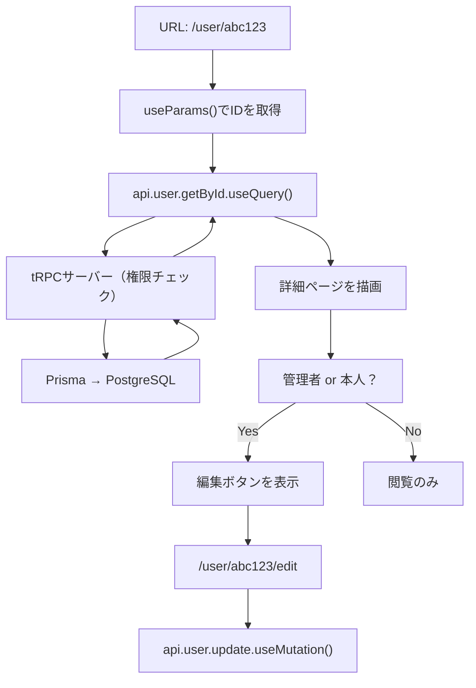
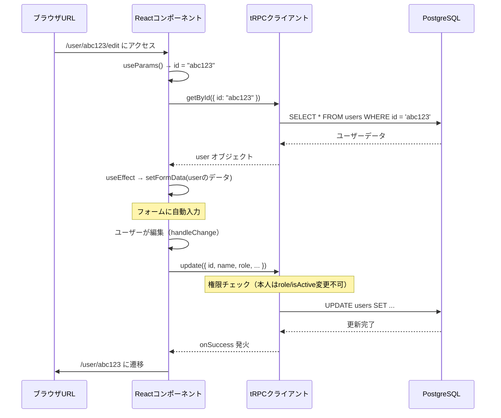

# Day 29: ユーザー詳細・編集ページを作ろう

## 前回の振り返り（Day 28）

Day 28 では **ユーザー一覧ページ**を作りました。管理者だけが全ユーザーを一覧表示でき、ロールやアクティブ状態でフィルタリングできる機能を実装しました。今日はその一覧ページの「各ユーザーをクリックしたときに開く詳細ページ」と「編集ページ」を作ります。

---

## 🎯 今日のゴール

ユーザーの詳細情報を表示するページと、管理者または本人がユーザー情報を編集できるページを作ります。Next.js の**動的ルーティング**という仕組みを使って、URLに含まれるユーザーIDからデータを取得する方法を学びます。


## 🤔 なぜこれを作るのか？

タスク管理アプリを使う人が増えてくると、「このユーザーって誰？」「どのプロジェクトに参加しているの？」を確認したくなります。また、管理者は「このユーザーの権限を変えたい」「アカウントを無効にしたい」という操作が必要です。

> 💡 **例え話**: 会社の社員名簿を想像してください。各社員のページには「名前・部署・担当プロジェクト・担当タスク」が載っていて、人事担当者（管理者）または本人だけが「部署変更」「在籍状態の変更」を編集できます。今日はその仕組みを作ります。

### 📐 ページ構成とデータの流れ



### やること / やらないこと

| やること | やらないこと |
|---------|-------------|
| 動的ルーティング `[id]` フォルダの作成 | パスワード変更機能 |
| ユーザー詳細ページの実装 | プロフィール画像のアップロード機能 |
| 管理者・本人向けユーザー編集ページの実装 | メール通知機能 |
| 権限に基づいたUI表示切り替え | ユーザー削除機能 |
| フォームとサーバーデータの同期（useEffect） | 2要素認証 |

### 🆕 新しく学ぶ概念

| 概念 | 読み方 | 役割 | 例え |
|------|--------|------|------|
| 動的ルーティング `[id]` | どうてきルーティング | URLのID部分を変数として受け取る | 「社員番号001の名簿ページ」→ URLの001が変数 |
| `useParams()` | ユーズパラムズ | URLのパラメータ（変数）を読み取るフック | 住所から「番地」だけを取り出す |
| `useEffect` | ユーズエフェクト | データ取得後にフォームを自動で埋めるトリガー | 書類が届いたら自動で入力欄に転記する |
| 制御コンポーネント | せいぎょコンポーネント | Reactが入力値を管理するフォーム部品 | メモ帳の内容が常にReactの管理下にある |
| 権限チェック | けんげんチェック | ユーザーの役割によって表示を変える | 社員証の種類によって入れる部屋を変える |

## 📊 実装ステップ一覧

| ステップ | 作業内容 | 所要時間 | 触るファイル | 成功状態 |
|---------|---------|---------|-------------|---------|
| Step 1 | 動的ルーティングの仕組みを理解する | 5分 | 概念説明のみ | 仕組みが頭に入る |
| Step 2 | ユーザー詳細ページのファイルを作成 | 5分 | `src/app/user/[id]/page.tsx` | ファイルが存在する |
| Step 3 | URLからユーザーIDを取得してデータを取得 | 7分 | `src/app/user/[id]/page.tsx` | ユーザー名が表示される |
| Step 4 | グリッドレイアウトで詳細情報を表示 | 7分 | `src/app/user/[id]/page.tsx` | 2カラムレイアウトで表示 |
| Step 5 | プロジェクト一覧とタスクテーブルを表示 | 7分 | `src/app/user/[id]/page.tsx` | バッジとテーブルが表示される |
| Step 6 | 権限チェックで編集ボタンを出し分ける | 5分 | `src/app/user/[id]/page.tsx` | 管理者・本人のみ編集ボタンが見える |
| Step 7 | 編集ページのファイルを作成 | 5分 | `src/app/user/[id]/edit/page.tsx` | ファイルが存在する |
| Step 8 | フォーム状態管理とuseEffectでデータ同期 | 7分 | `src/app/user/[id]/edit/page.tsx` | フォームにデータが入る |
| Step 9 | ロール選択・アクティブ状態の切り替え | 7分 | `src/app/user/[id]/edit/page.tsx` | ドロップダウンとチェックボックスが動く |
| Step 10 | 保存機能を実装して完成 | 5分 | `src/app/user/[id]/edit/page.tsx` | 保存ボタンでDBが更新される |

**合計時間**: 約60分

---

### Step 1: 動的ルーティングの仕組みを理解する（5分）

🎯 **ゴール**: Next.js の `[id]` フォルダがどんな魔法をしているか理解する。

Next.js では、フォルダ名を `[id]` のように**角括弧で囲む**と、そのフォルダ名が「変数」になります。URLの対応する部分が自動的にその変数に入ります。

```
フォルダ構造:
src/app/user/[id]/page.tsx

アクセスできるURL:
/user/abc123     → id = "abc123"
/user/xyz789     → id = "xyz789"
/user/user001    → id = "user001"
```

これが**動的ルーティング**です。1つのファイルで何千人ものユーザーページを作れます。

| 方式 | フォルダ例 | 動作 |
|------|-----------|------|
| 静的ルーティング | `src/app/about/page.tsx` | `/about` だけに対応 |
| 動的ルーティング | `src/app/user/[id]/page.tsx` | `/user/なんでも` に対応 |

`[id]` の `id` という名前は自由に決められます。`[userId]` でも `[username]` でも OK です。ただし、コード内で読み取るときも同じ名前を使います。

```tsx
// filepath: src/app/user/[id]/page.tsx
// このファイルは /user/なんでも という全てのURLに対応する
// URLの「なんでも」部分が params['id'] として受け取れる
export default function UserDetailPage() {
  // 次のステップでここに useParams() を書く
  return <div>ユーザー詳細ページ</div>;
}
```

✅ **確認ポイント**:
- 動的ルーティングは「角括弧 `[]` でフォルダ名を囲む」ことで実現する
- 1つのファイルで無数のURLに対応できる仕組みだと理解した

---

### Step 2: ユーザー詳細ページのファイルを作成する（5分）

🎯 **ゴール**: 必要なフォルダとファイルを作成し、まず骨組みを作る。

以下のフォルダ構造を作成します。

```
src/app/user/
├── page.tsx           ← Day 28 で作った一覧ページ
└── [id]/
    ├── page.tsx       ← 今回作成（詳細ページ）
    └── edit/
        └── page.tsx   ← 後で作成（編集ページ）
```

まずは詳細ページの骨組みです。

```tsx
// filepath: src/app/user/[id]/page.tsx
'use client';

import { AppLayout } from '@/component/layout/app-layout';

export default function UserDetailPage() {
  return (
    <AppLayout>
      <div className="container mx-auto max-w-6xl py-8">
        <h1 className="text-2xl font-bold">
          ユーザー詳細ページ
        </h1>
        <p>ここにユーザー情報を表示します</p>
      </div>
    </AppLayout>
  );
}
```

開発サーバーを起動して `/user/test123` にアクセスしてみましょう。

```bash
npm run dev
```


どんなIDを入れても同じページが表示されるはずです。次のステップでURLからIDを読み取ります。

✅ **確認ポイント**:
- `src/app/user/[id]/page.tsx` ファイルが作成できた
- `/user/test123` にアクセスして「ユーザー詳細ページ」と表示される
- `npm run dev` でエラーが出ない

---

### Step 3: URLからユーザーIDを取得してデータを取得する（7分）

🎯 **ゴール**: `useParams()` でIDを読み取り、tRPCでユーザーデータを取得し、エラー時にトースト通知を表示する。

`useParams()` は Next.js が提供するフックで、現在のURLのパラメータを読み取ります。

**`useParams()` の戻り値について**

`useParams()` は `{ [key: string]: string | string[] }` 型のオブジェクトを返します。`params['id']` でID文字列にアクセスでき、`String(params['id'] ?? '')` と書くことで確実に文字列型にしています。`??` は「左辺が `null` または `undefined` のとき右辺を使う」演算子です。

インポートとデータ取得の部分を書きます。

```tsx
// filepath: src/app/user/[id]/page.tsx
'use client';

import { useParams, useRouter } from 'next/navigation';
import { useEffect } from 'react';
import toast from 'react-hot-toast';
import { AppLayout } from '@/component/layout/app-layout';
import { Card, CardContent } from '@/component/ui/card';
import { PageLoadingSpinner } from '@/component/ui/loading-spinner';
import { USER_ROLE } from '@/lib/constant/roles';
import { api } from '@/trpc/react';
```

コンポーネントの中でURLのIDを取得し、データを取得します。

```tsx
// filepath: src/app/user/[id]/page.tsx
export default function UserDetailPage() {
  const router = useRouter();
  const params = useParams();
  const userId = String(params['id'] ?? '');

  const { data: currentUser } = api.auth.getCurrentUser.useQuery();

  const { data: user, isLoading, error } =
    api.user.getById.useQuery(
      { id: userId },
      { enabled: userId.length > 0 },
    );

  useEffect(() => {
    if (error) {
      toast.error(error.message || 'ユーザー情報の取得に失敗しました');
    }
  }, [error]);
```

**なぜ `useEffect` でエラーを処理するのか？**

`error` はReactのレンダリングサイクル外で発生します。`useEffect` の依存配列 `[error]` により、`error` の値が変化したときだけトーストを表示します。これにより、同じエラーが何度もトースト表示されることを防ぎます。

次に早期リターンを書きます。ローディング中とユーザーが見つからない場合を先に処理します。

```tsx
// filepath: src/app/user/[id]/page.tsx
  if (isLoading) {
    return (
      <AppLayout>
        <PageLoadingSpinner />
      </AppLayout>
    );
  }

  if (!user) {
    return (
      <AppLayout>
        <div className="container mx-auto max-w-6xl mt-8">
          <Card>
            <CardContent className="pt-6">
              <p>ユーザーが見つかりません</p>
            </CardContent>
          </Card>
        </div>
      </AppLayout>
    );
  }
```

**重要: `isAdmin` と `isOwnProfile` は `if (!user)` の後に宣言する**

`user` が存在することが確定した後（`if (!user)` の早期リターンを通過した後）に、以下の変数を宣言します。

```tsx
// filepath: src/app/user/[id]/page.tsx
  // この位置に書く（if (!user) の後）
  const isAdmin = currentUser?.role === USER_ROLE.ADMIN;
  const isOwnProfile = currentUser?.id === user.id;
```

なぜこの順序が重要なのかというと、`user.id` という参照は `user` が確実に存在する状態でないと `undefined` へのアクセスが発生するためです。早期リターンを通過した後なら `user` は必ず存在します。

**なぜ `enabled: userId.length > 0` を使うのか？**

`userId` が空文字列の場合、無駄なAPIリクエストが発生します。`enabled` を `false` にするとクエリは実行されません。

正常系の表示を書きます。次のステップで内容を充実させます。

```tsx
// filepath: src/app/user/[id]/page.tsx
  return (
    <AppLayout>
      <div className="container mx-auto max-w-6xl py-8">
        <h1 className="text-2xl font-bold">{user.name}</h1>
        <p>ID: {userId}</p>
      </div>
    </AppLayout>
  );
}
```

✅ **確認ポイント**:
- 存在するユーザーIDでアクセスするとユーザー名が表示される
- 存在しないIDでは「ユーザーが見つかりません」と表示される
- 読み込み中はスピナーが表示される

---

### Step 4: グリッドレイアウトで詳細情報を表示する（7分）

🎯 **ゴール**: 戻るボタン・サイドバー・メインコンテンツの2カラムレイアウトで表示する。

```
モバイル: 縦に並ぶ
PC: 左4列 + 右8列
  ┌──────┬────────────────────┐
  │Avatar│プロジェクト一覧    │
  │名前  │担当タスクテーブル  │
  │ロール│                    │
  └──────┴────────────────────┘
```

必要なコンポーネントをインポートします。ファイルの先頭のインポート部分に追加してください。

```tsx
// filepath: src/app/user/[id]/page.tsx
import { format } from 'date-fns';
import { ja } from 'date-fns/locale';
import { ArrowLeft, Calendar, Mail } from 'lucide-react';
import { Avatar, AvatarFallback, AvatarImage }
  from '@/component/ui/avatar';
import { Button } from '@/component/ui/button';
import { Card, CardContent } from '@/component/ui/card';
import { Separator } from '@/component/ui/separator';
import { ActiveStatusBadge, UserRoleBadge }
  from '@/component/ui/user-badges';
```

**グリッドの考え方**

| クラス | 意味 |
|--------|------|
| `grid` | グリッドレイアウトを有効にする |
| `md:grid-cols-12` | 中サイズ以上では12列に分割 |
| `md:col-span-4` | 12列中4列分の幅（左サイドバー） |
| `md:col-span-8` | 12列中8列分の幅（メインコンテンツ） |

`return` 文を2カラムレイアウトに書き換えます。まずボタンと外枠を書きます。

```tsx
// filepath: src/app/user/[id]/page.tsx
  return (
    <AppLayout>
      <div className="container mx-auto max-w-6xl py-8">
        <Button
          variant="ghost"
          className="mb-4 pl-0 hover:bg-transparent hover:text-primary"
          onClick={() => router.push('/user')}
        >
          <ArrowLeft className="mr-2 h-4 w-4" />
          ユーザー一覧に戻る
        </Button>

        <div className="grid gap-6 md:grid-cols-12">
```

左カラムにアバターとユーザー基本情報を置きます。

```tsx
// filepath: src/app/user/[id]/page.tsx
          {/* 左カラム */}
          <div className="md:col-span-4 space-y-6">
            <Card>
              <CardContent className="pt-6">
                <div className="text-center mb-6">
                  <Avatar className="w-24 h-24 mx-auto mb-4">
                    <AvatarImage
                      src={user.avatar || ''}
                      alt={user.name || ''}
                    />
                    <AvatarFallback className="text-3xl">
                      {user.name?.[0]?.toUpperCase()}
                    </AvatarFallback>
                  </Avatar>
                  <h2 className="text-xl font-bold mb-2">
                    {user.name}
                  </h2>
                  <div className="flex justify-center gap-2 mb-4">
                    <UserRoleBadge role={user.role} />
                    <ActiveStatusBadge isActive={user.isActive} />
                  </div>
                </div>
```

`AvatarFallback` の `user.name?.[0]` は「`name` が存在すれば最初の文字を取得する」という意味です。アバター画像がない場合に頭文字を表示します。

次にセパレーターと連絡先情報、登録日・最終更新日を書きます。

```tsx
// filepath: src/app/user/[id]/page.tsx
                <Separator className="my-4" />
                <div className="space-y-4 text-sm">
                  <div className="flex items-center gap-3">
                    <Mail className="h-4 w-4 text-muted-foreground" />
                    <div>
                      <p className="font-medium text-muted-foreground text-xs">
                        メールアドレス
                      </p>
                      <p>{user.email}</p>
                    </div>
                  </div>
                  <div className="flex items-center gap-3">
                    <Calendar className="h-4 w-4 text-muted-foreground" />
                    <div>
                      <p className="font-medium text-muted-foreground text-xs">
                        登録日
                      </p>
                      <p>
                        {user.createdAt
                          ? format(new Date(user.createdAt), 'yyyy年MM月dd日', { locale: ja })
                          : '-'}
                      </p>
                    </div>
                  </div>
```

APIは `createdAt` だけでなく `updatedAt` も返します。最終更新日も表示しましょう。

```tsx
// filepath: src/app/user/[id]/page.tsx
                  <div className="flex items-center gap-3">
                    <Calendar className="h-4 w-4 text-muted-foreground" />
                    <div>
                      <p className="font-medium text-muted-foreground text-xs">
                        最終更新日
                      </p>
                      <p>
                        {user.updatedAt
                          ? format(new Date(user.updatedAt), 'yyyy年MM月dd日', { locale: ja })
                          : '-'}
                      </p>
                    </div>
                  </div>
                </div>
              </CardContent>
            </Card>
          </div>
```

左カラムの `div` を閉じた後、右カラムの枠を書きます。中身は Step 5 で追加します。

```tsx
// filepath: src/app/user/[id]/page.tsx
          {/* 右カラム */}
          <div className="md:col-span-8 space-y-6">
            {/* Step 5 でプロジェクト・タスクを追加 */}
          </div>
        </div>
      </div>
    </AppLayout>
  );
}
```

✅ **確認ポイント**:
- PCサイズのブラウザで左にアバター、右にスペースが表示される
- スマホサイズに縮小すると縦に並ぶ
- アバターが未設定のユーザーでは名前の頭文字が表示される
- 「ユーザー一覧に戻る」ボタンが表示される

---

### Step 5: プロジェクト一覧とタスクテーブルを表示する（7分）

🎯 **ゴール**: 参加プロジェクトをバッジで、担当タスクをテーブルで表示する。

必要なコンポーネントをインポートします。ファイル先頭のインポート部分に追加してください。

```tsx
// filepath: src/app/user/[id]/page.tsx
import { Badge } from '@/component/ui/badge';
import { CardHeader, CardTitle } from '@/component/ui/card';
import {
  Table, TableBody, TableCell,
  TableHead, TableHeader, TableRow,
} from '@/component/ui/table';
import {
  getPriorityBadgeVariant, getStatusBadgeVariant,
} from '@/lib/badge-variant';
import { TASK_PRIORITY_LABELS } from '@/lib/constant/priority';
import { TASK_STATUS_LABELS } from '@/lib/constant/status';
```

右カラムに「参加プロジェクト」カードを追加します。

```tsx
// filepath: src/app/user/[id]/page.tsx
<Card>
  <CardHeader>
    <CardTitle className="text-lg">参加プロジェクト</CardTitle>
  </CardHeader>
  <CardContent>
    {user.projects && user.projects.length > 0 ? (
      <div className="flex flex-wrap gap-2">
        {user.projects.map((member) => (
          <Badge
            key={member.id}
            className="cursor-pointer hover:opacity-80 px-3 py-1 text-sm font-normal text-white"
            style={{ backgroundColor: member.project.color }}
```

各バッジにはクリックイベントを設定し、プロジェクトページへ遷移します。プロジェクトがない場合はメッセージを表示します。

```tsx
// filepath: src/app/user/[id]/page.tsx
            onClick={() =>
              router.push(`/project?projectId=${member.project.id}`)
            }
          >
            {member.project.name}
          </Badge>
        ))}
      </div>
    ) : (
      <p className="text-muted-foreground text-sm">
        参加しているプロジェクトはありません
      </p>
    )}
  </CardContent>
</Card>
```

**バッジの色について: `style` 属性を使う理由**

`style={{ backgroundColor: member.project.color }}` はプロジェクトごとに設定されたカラーをそのまま背景色に使っています。Tailwind CSS では事前に定義されたクラスしか使えないため、動的な色は `style` 属性で設定します。

**`text-white` クラスについて**

`className` に `text-white` を書くことでテキスト色を白に固定しています。`style={{ color: 'white' }}` と書くこともできますが、Tailwind の `text-white` を使う方がプロジェクトのスタイルと一貫性が保てます。

「担当中のタスク」カードをテーブル形式で追加します。テーブルのヘッダー部分です。

```tsx
// filepath: src/app/user/[id]/page.tsx
            <Card>
              <CardHeader>
                <CardTitle className="text-lg">担当中のタスク</CardTitle>
              </CardHeader>
              <CardContent className="p-0">
                {user.assignedTasks && user.assignedTasks.length > 0 ? (
                  <Table>
                    <TableHeader>
                      <TableRow>
                        <TableHead>タイトル</TableHead>
                        <TableHead>ステータス</TableHead>
                        <TableHead>優先度</TableHead>
                        <TableHead>期限</TableHead>
                      </TableRow>
                    </TableHeader>
```

テーブルのボディ部分（各タスク行）を書きます。

```tsx
// filepath: src/app/user/[id]/page.tsx
                    <TableBody>
                      {user.assignedTasks.map((task) => (
                        <TableRow
                          key={task.id}
                          className="cursor-pointer hover:bg-muted/50"
                          onClick={() =>
                            router.push(`/task?taskId=${task.id}`)
                          }
                        >
                          <TableCell className="font-medium">
                            {task.title}
                          </TableCell>
                          <TableCell>
                            <Badge variant={getStatusBadgeVariant(task.status)}>
                              {TASK_STATUS_LABELS[task.status]}
                            </Badge>
                          </TableCell>
                          <TableCell>
                            <Badge variant={getPriorityBadgeVariant(task.priority)}>
                              {TASK_PRIORITY_LABELS[task.priority]}
                            </Badge>
                          </TableCell>
```

期限表示とテーブルの閉じタグです。タスクが0件のときは空メッセージを表示します。

```tsx
// filepath: src/app/user/[id]/page.tsx
                          <TableCell>
                            {task.dueDate
                              ? format(new Date(task.dueDate), 'yyyy/MM/dd', { locale: ja })
                              : '-'}
                          </TableCell>
                        </TableRow>
                      ))}
                    </TableBody>
                  </Table>
                ) : (
                  <div className="p-6 text-muted-foreground text-sm">
                    担当中のタスクはありません
                  </div>
                )}
              </CardContent>
            </Card>
```

**テーブル行をクリック可能にする理由**

`cursor-pointer` でマウスカーソルが手の形に変わり、`hover:bg-muted/50` でホバー時に背景色が変わります。これによりクリックできることをユーザーに視覚的に伝えます。


✅ **確認ポイント**:
- プロジェクトバッジがカラフルに（テキストは白で）表示される
- バッジをクリックするとプロジェクトページに遷移する
- タスクの行をクリックするとタスク詳細に遷移する
- プロジェクト・タスクがないユーザーには「ありません」メッセージが出る

---

### Step 6: 権限チェックで編集ボタンを出し分ける（5分）

🎯 **ゴール**: 管理者または本人のみに編集ボタンを表示する。

まずインポートを追加します。

```tsx
// filepath: src/app/user/[id]/page.tsx
import { ArrowLeft, Calendar, Mail, Pencil } from 'lucide-react';
// Pencil を追加（ArrowLeft, Calendar, Mail は Step 4 で追加済み）
```

左カラムの `Separator` と閉じタグ `</CardContent>` の間に追加します。

```tsx
// filepath: src/app/user/[id]/page.tsx
                {(isAdmin || isOwnProfile) && (
                  <>
                    <Separator className="my-4" />
                    <Button
                      className="w-full"
                      onClick={() =>
                        router.push(`/user/${user.id}/edit`)
                      }
                    >
                      <Pencil className="mr-2 h-4 w-4" /> 編集
                    </Button>
                  </>
                )}
```

| 条件 | 結果 |
|------|------|
| 管理者 + 他人のプロフィール | ボタン表示される |
| 管理者 + 自分のプロフィール | ボタン表示される |
| 一般ユーザー + 自分のプロフィール | ボタン表示される |
| 一般ユーザー + 他人のプロフィール | ボタン表示されない |

**`<>` （フラグメント）を使う理由**

`(isAdmin || isOwnProfile)` が `true` のとき `Separator` と `Button` の2つの要素を返す必要があります。React では return 文や条件式で複数の要素を直接並べられないため、`<>...</>` で囲んでまとめます。

✅ **確認ポイント**:
- 管理者でログインするとどのユーザーページにも「編集」ボタンが表示される
- 一般ユーザーで自分のページを見るとボタンが表示される
- 一般ユーザーで他人のページを見るとボタンが表示されない

---

### Step 7: 編集ページのファイルを作成する（5分）

🎯 **ゴール**: `/user/[id]/edit` の骨組みを作り、権限チェックを実装する。

まずインポートを書きます。

```tsx
// filepath: src/app/user/[id]/edit/page.tsx
'use client';

import { ArrowLeft } from 'lucide-react';
import { useParams, useRouter } from 'next/navigation';
import { useState } from 'react';
import toast from 'react-hot-toast';
import { AppLayout } from '@/component/layout/app-layout';
import { Button } from '@/component/ui/button';
import { Card, CardContent, CardHeader, CardTitle }
  from '@/component/ui/card';
import { PageLoadingSpinner }
  from '@/component/ui/loading-spinner';
import { USER_ROLE, type UserRole } from '@/lib/constant/roles';
import { api } from '@/trpc/react';
```

コンポーネントの中でURLのIDを取得し、データを取得します。

```tsx
// filepath: src/app/user/[id]/edit/page.tsx
export default function UserEditPage() {
  const router = useRouter();
  const params = useParams();
  const userId = String(params['id'] ?? '');

  const [formData, setFormData] = useState<{
    name: string;
    avatar: string;
    role: UserRole;
    isActive: boolean;
  }>({
    name: '',
    avatar: '',
    role: USER_ROLE.USER,
    isActive: true,
  });

  const { data: currentUser } = api.auth.getCurrentUser.useQuery();
  const { data: user, isLoading } = api.user.getById.useQuery(
    { id: userId },
    { enabled: userId.length > 0 },
  );
```

**制御コンポーネントとして初期値を空文字にする理由**

`useState` の初期値を `name: ''` と空文字にしています。`undefined` や `null` を使うと React は「非制御コンポーネント」として扱い、後から `value` を与えたときに警告が出ます。空文字ならコンポーネントは最初から制御状態にあり、`useEffect` でデータが入っても切り替わりません。

次に早期リターンを書きます。`isAdmin` と `isOwnProfile` は必ず `if (!user)` の後に書いてください。

```tsx
// filepath: src/app/user/[id]/edit/page.tsx
  if (isLoading) {
    return (
      <AppLayout>
        <PageLoadingSpinner />
      </AppLayout>
    );
  }

  if (!user) {
    return (
      <AppLayout>
        <div className="container mx-auto max-w-md mt-8">
          <Card>
            <CardContent className="pt-6">
              <p>ユーザーが見つかりません</p>
            </CardContent>
          </Card>
        </div>
      </AppLayout>
    );
  }
```

`if (!user)` のガード節を通過した後に、権限変数を宣言します。こうすることで `user` が確実に存在する状態で安全に比較できます。

```tsx
// filepath: src/app/user/[id]/edit/page.tsx
  // user が確定した後に権限変数を宣言する
  const isAdmin = currentUser?.role === USER_ROLE.ADMIN;
  const isOwnProfile = currentUser?.id === userId;
```

権限がない場合は「アクセス権限がありません」を表示します。

```tsx
// filepath: src/app/user/[id]/edit/page.tsx
  if (!isAdmin && !isOwnProfile) {
    return (
      <AppLayout>
        <div className="container mx-auto max-w-md mt-8">
          <Card>
            <CardContent className="pt-6">
              <h1 className="text-xl font-bold mb-2">
                アクセス権限がありません
              </h1>
              <p className="text-muted-foreground">
                管理者または本人のみユーザー編集が可能です
              </p>
            </CardContent>
          </Card>
        </div>
      </AppLayout>
    );
  }
```

権限チェックを通過した後に編集フォームの枠を表示します。

```tsx
// filepath: src/app/user/[id]/edit/page.tsx
  return (
    <AppLayout>
      <div className="container mx-auto max-w-md mt-8 mb-8">
        <Button
          variant="ghost"
          className="mb-4 pl-0 hover:bg-transparent hover:text-primary"
          onClick={() => router.push(`/user/${userId}`)}
        >
          <ArrowLeft className="mr-2 h-4 w-4" />
          戻る
        </Button>
        <Card>
          <CardHeader>
            <CardTitle>ユーザー編集</CardTitle>
          </CardHeader>
          <CardContent>
            {/* Step 8, 9, 10 でフォームを追加 */}
          </CardContent>
        </Card>
      </div>
    </AppLayout>
  );
}
```

✅ **確認ポイント**:
- 権限のないユーザーで `/user/他人のid/edit` にアクセスすると「権限がありません」と表示される
- 管理者でアクセスすると「ユーザー編集」が表示される
- 自分のIDでアクセスすると「ユーザー編集」が表示される
- 「戻る」ボタンで詳細ページに戻れる

---

### Step 8: フォーム状態管理とuseEffectでデータを同期する（7分）

🎯 **ゴール**: サーバーから取得したユーザーデータをフォームに自動入力する。

ここが今日のハイライトです。**サーバーデータとフォーム状態の同期**という重要なパターンを学びます。

`useEffect` でデータが届いたらフォームに反映します。コンポーネント内（`const isAdmin` の行の上あたり）に追加してください。

```tsx
// filepath: src/app/user/[id]/edit/page.tsx
import { useEffect, useState } from 'react';
// useState は既にインポート済みなので useEffect を追加

// コンポーネント内、api呼び出しの後に追加
  useEffect(() => {
    if (user) {
      setFormData({
        name: user.name || '',
        avatar: user.avatar || '',
        role: user.role,
        isActive: user.isActive,
      });
    }
  }, [user]);
```

**なぜ `useEffect` が必要なのか？**

`user` データはサーバーから非同期に取得されます。コンポーネントが最初に表示される瞬間は `user` が `undefined` なので、初期値に使えません。

```
タイムライン:
[0ms]  ページ表示 → user = undefined → フォームは空文字
[200ms] データ到着 → user = { name: "田中", ... }
[200ms] useEffect発火 → setFormData({ name: "田中" })
[201ms] フォームに "田中" が表示される ✅
```

`[user]` 依存配列により、`user` が変わったときにエフェクトが実行されます。

次に必要なコンポーネントをインポートし、フォームを書きます。

```tsx
// filepath: src/app/user/[id]/edit/page.tsx
import { Avatar, AvatarFallback, AvatarImage }
  from '@/component/ui/avatar';
import { Input } from '@/component/ui/input';
import { Label } from '@/component/ui/label';
```

`handleChange` 関数を定義します。これは名前・アバターURLなどテキスト入力共通のハンドラです。

```tsx
// filepath: src/app/user/[id]/edit/page.tsx
  // isAdmin, isOwnProfile の後に追加
  const handleChange = (e: React.ChangeEvent<HTMLInputElement>) => {
    const { name, value } = e.target;
    setFormData((prev) => ({
      ...prev,
      [name]: value,
    }));
  };
```

**`handleChange` を共通化する理由**

フィールドごとに `onChange={(e) => setFormData(...)}` を書くと同じコードが何度も登場します。`handleChange` を一つ定義し、各 `Input` の `name` 属性をキーとして使うことで、どのフィールドを更新するかを自動的に判定できます。`[name]: value` の `[]` は「変数の値をキー名として使う」という JavaScript の構文です。

CardContent 内のフォームを書きます。アバタープレビューと名前入力欄です。

```tsx
// filepath: src/app/user/[id]/edit/page.tsx
            <form onSubmit={handleSubmit} className="space-y-6">
              <div className="flex justify-center mb-6">
                <Avatar className="w-24 h-24">
                  <AvatarImage src={formData.avatar} />
                  <AvatarFallback className="text-2xl">
                    {formData.name?.[0]?.toUpperCase()}
                  </AvatarFallback>
                </Avatar>
              </div>

              <div className="space-y-2">
                <Label htmlFor="name">
                  名前 <span className="text-destructive">*</span>
                </Label>
                <Input
                  id="name"
                  name="name"
                  value={formData.name}
                  onChange={handleChange}
                  required
                  disabled={updateUser.isPending}
                />
              </div>
```

**`disabled={updateUser.isPending}` を全入力欄につける理由**

送信処理中に入力値を変更されると、送信データと画面の表示がズレる可能性があります。`isPending` が `true` の間は全入力欄を無効化することで、送信中の変更を防ぎます。

メールアドレスとアバターURL入力欄を追加します。

```tsx
// filepath: src/app/user/[id]/edit/page.tsx
              <div className="space-y-2">
                <Label htmlFor="email">メールアドレス</Label>
                <Input id="email" value={user.email} disabled />
                <p className="text-xs text-muted-foreground">
                  メールアドレスは変更できません
                </p>
              </div>

              <div className="space-y-2">
                <Label htmlFor="avatar">アバターURL（任意）</Label>
                <Input
                  id="avatar"
                  name="avatar"
                  type="url"
                  value={formData.avatar}
                  onChange={handleChange}
                  disabled={updateUser.isPending}
                  placeholder="https://example.com/avatar.png"
                />
              </div>
```

アバターURLを入力すると上のプレビュー画像がリアルタイムで切り替わります。`formData.avatar` が `AvatarImage` の `src` に直接繋がっているからです。

✅ **確認ポイント**:
- 編集ページを開くとフォームにユーザーの名前が自動入力される
- アバターURLを入力するとプレビューがリアルタイムで変わる
- メールアドレスの入力欄が `disabled` でグレーアウトしている

---

### Step 9: ロール選択・アクティブ状態の切り替えを実装する（7分）

🎯 **ゴール**: Select でロールを選択、Checkbox でアクティブ状態を切り替える。

**重要: サーバー側のアクセス制御について**

`user.ts` のルーターには重要な制約があります。

| 実行者 | 操作対象 | role / isActive の変更 |
|--------|---------|----------------------|
| 管理者 | 誰のプロフィールでも | 変更できる |
| 一般ユーザー | 自分のプロフィール | **変更できない（FORBIDDEN エラー）** |
| 一般ユーザー | 他人のプロフィール | そもそもページが表示されない |

自分のプロフィール編集時に `role` や `isActive` を変更しようとすると、サーバーが `FORBIDDEN` エラーを返します。これはセキュリティ上の重要な制約です。UIでも `isAdmin` のときだけロール・アクティブ状態を変更できるようにすることが望ましいですが、今回はシンプルに全フィールドを表示します（サーバー側でガードされているので安全です）。

インポートを追加します。

```tsx
// filepath: src/app/user/[id]/edit/page.tsx
import { Checkbox } from '@/component/ui/checkbox';
import {
  Select, SelectContent, SelectItem,
  SelectTrigger, SelectValue,
} from '@/component/ui/select';
import { isUserRole, USER_ROLE_LABELS }
  from '@/lib/constant/roles';
```

ロール選択のドロップダウンを追加します。`USER_ROLE_LABELS` は `roles.ts` で `{ USER: 'ユーザー', ADMIN: '管理者' }` と定義されています。`Object.entries` で `[['USER', 'ユーザー'], ['ADMIN', '管理者']]` 形式に変換して `map` します。

```tsx
// filepath: src/app/user/[id]/edit/page.tsx
              <div className="space-y-2">
                <Label htmlFor="role">ロール</Label>
                <Select
                  value={formData.role}
                  onValueChange={(value) => {
                    if (isUserRole(value)) {
                      setFormData((prev) => ({ ...prev, role: value }));
                    }
                  }}
                  disabled={updateUser.isPending}
                >
                  <SelectTrigger id="role">
                    <SelectValue placeholder="ロールを選択" />
                  </SelectTrigger>
                  <SelectContent>
                    {Object.entries(USER_ROLE_LABELS).map(([value, label]) => (
                      <SelectItem key={value} value={value}>
                        {label}
                      </SelectItem>
                    ))}
                  </SelectContent>
                </Select>
              </div>
```

**`isUserRole(value)` という型ガードの重要性**

`Select` の `onValueChange` が返す `value` は型が `string` です。しかし `formData.role` は `UserRole` 型（`'USER' | 'ADMIN'`）である必要があります。`isUserRole` で「本当に有効なロール値か？」を確認することで型安全を保ちます。`as UserRole` のような型アサーションは使わないルールのため、型ガードを使います。

アクティブ状態を切り替えるチェックボックスを追加します。

```tsx
// filepath: src/app/user/[id]/edit/page.tsx
              <div className="flex items-center space-x-2">
                <Checkbox
                  id="isActive"
                  checked={formData.isActive}
                  onCheckedChange={(checked) =>
                    setFormData((prev) => ({
                      ...prev,
                      isActive: checked === true,
                    }))
                  }
                  disabled={updateUser.isPending}
                />
                <Label htmlFor="isActive">アクティブ</Label>
              </div>
```

**`checked === true` と書く理由**

`onCheckedChange` のコールバックは `boolean | 'indeterminate'` を受け取ります。`=== true` で確実に `true` のときだけ `true` にしています。


✅ **確認ポイント**:
- ロール選択ドロップダウンに「ユーザー」「管理者」の2つが表示される
- 現在のロールが選択済み状態で表示される
- チェックボックスのON/OFFが切り替えられる

---

### Step 10: 保存機能を実装して完成（5分）

🎯 **ゴール**: 保存ボタンをクリックするとtRPCでDBが更新され、詳細ページに戻る。

`useMutation` を定義します。コンポーネント内、`const handleChange` の前に追加してください。

```tsx
// filepath: src/app/user/[id]/edit/page.tsx
import { AlertCircle } from 'lucide-react';
import { Alert, AlertDescription, AlertTitle }
  from '@/component/ui/alert';
// ArrowLeft は既にインポート済みなので AlertCircle を追加
```

```tsx
// filepath: src/app/user/[id]/edit/page.tsx
  const updateUser = api.user.update.useMutation({
    onSuccess: () => {
      toast.success('ユーザー情報を更新しました');
      router.push(`/user/${userId}`);
    },
    onError: (error) => {
      toast.error(error.message || 'ユーザー情報の更新に失敗しました');
    },
  });

  const handleSubmit = (e: React.FormEvent) => {
    e.preventDefault();
    updateUser.mutate({
      id: userId,
      ...formData,
    });
  };
```

**`e.preventDefault()` が必要な理由**

HTMLのフォームはデフォルトで送信するとページ全体がリロードされます。Reactでは自分でデータ送信を管理するため、このデフォルト動作をキャンセルする必要があります。

エラー表示ブロックをチェックボックスの下に追加します。

```tsx
// filepath: src/app/user/[id]/edit/page.tsx
              {updateUser.error && (
                <Alert variant="destructive">
                  <AlertCircle className="h-4 w-4" />
                  <AlertTitle>エラー</AlertTitle>
                  <AlertDescription>
                    {updateUser.error.message}
                  </AlertDescription>
                </Alert>
              )}
```

**`toast` と `Alert` を両方使う理由**

`onError` の `toast.error` はポップアップ通知で「エラーが起きた」をすぐ知らせます。しかし `toast` は数秒後に消えます。`Alert` コンポーネントはフォームの中に常に表示され続けるため、ユーザーがエラー内容を確認してから再入力できます。

フォームの送信ボタンとキャンセルボタンを追加します。

```tsx
// filepath: src/app/user/[id]/edit/page.tsx
              <div className="flex gap-2 pt-2">
                <Button
                  type="submit"
                  className="w-full"
                  disabled={updateUser.isPending}
                >
                  {updateUser.isPending ? '更新中...' : '更新'}
                </Button>
                <Button
                  type="button"
                  variant="outline"
                  className="w-full"
                  onClick={() => router.push(`/user/${userId}`)}
                  disabled={updateUser.isPending}
                >
                  キャンセル
                </Button>
              </div>
```

**`isPending` で2重送信を防ぐ**

ユーザーが「更新」ボタンを素早く2回クリックしたとき、同じリクエストが2回送られてしまいます。`isPending` で処理中はボタンを `disabled` にして防ぎます。送信ボタンだけでなくキャンセルボタンも `disabled` にするのは、送信中の画面遷移を防ぐためです。

✅ **確認ポイント**:
- フォームに変更を加えて「更新」をクリックするとトースト通知が表示される
- 保存成功後に詳細ページに戻り、変更内容が反映されている
- 保存中はボタンが「更新中...」に変わりグレーアウトする
- 「キャンセル」をクリックすると詳細ページに戻る（変更は保存されない）
- 一般ユーザーが自分のロールや isActive を変更しようとすると FORBIDDEN エラーが `Alert` で表示される
- `npm run dev` でエラーが出ない

---

## 🎉 Day 29 完了！

今日は2つの重要なページを実装しました。動的ルーティングでURLから情報を読み取り、権限に基づいてUIを切り替える方法を学びました。

### 今日学んだこと

| 概念 | 意味 | 使い場面 |
|------|------|---------|
| 動的ルーティング `[id]` | フォルダ名を変数にして任意のURLに対応 | ユーザー詳細、記事詳細など |
| `useParams()` | URLのパラメータを読み取るオブジェクトを返す | 動的ルーティングとセットで使う |
| `useEffect` + 依存配列 | 指定した値が変わったときに処理を実行 | サーバーデータをフォームに反映 |
| 制御コンポーネント | Reactが入力値を管理するフォーム（初期値は空文字） | すべてのフォーム入力 |
| `handleChange` 共通ハンドラ | `name` 属性を使って対象フィールドを動的に更新 | テキスト入力フォーム全般 |
| 早期リターンの順序 | ローディング → 未発見 → 権限なし → 本体 | ページの安全な描画 |
| `isAdmin \|\| isOwnProfile` | OR条件で権限チェック | ページやボタンの表示制御 |
| `isPending` | mutationが処理中かどうか | 2重送信防止・入力無効化 |
| `md:grid-cols-12` | レスポンシブなグリッドレイアウト | サイドバー+コンテンツ |

### 全体のデータフロー振り返り



### 📝 次回予告

Day 30では、いよいよ完成版をVercelに公開します！30日間コツコツ作ってきたタスク管理アプリを世界中からアクセスできる状態にしましょう！
