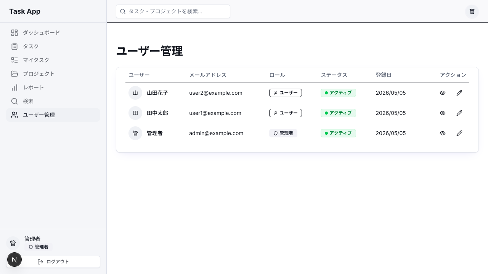
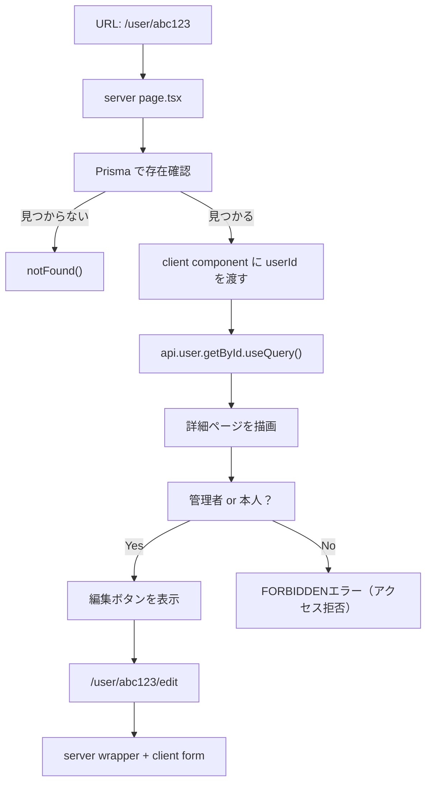
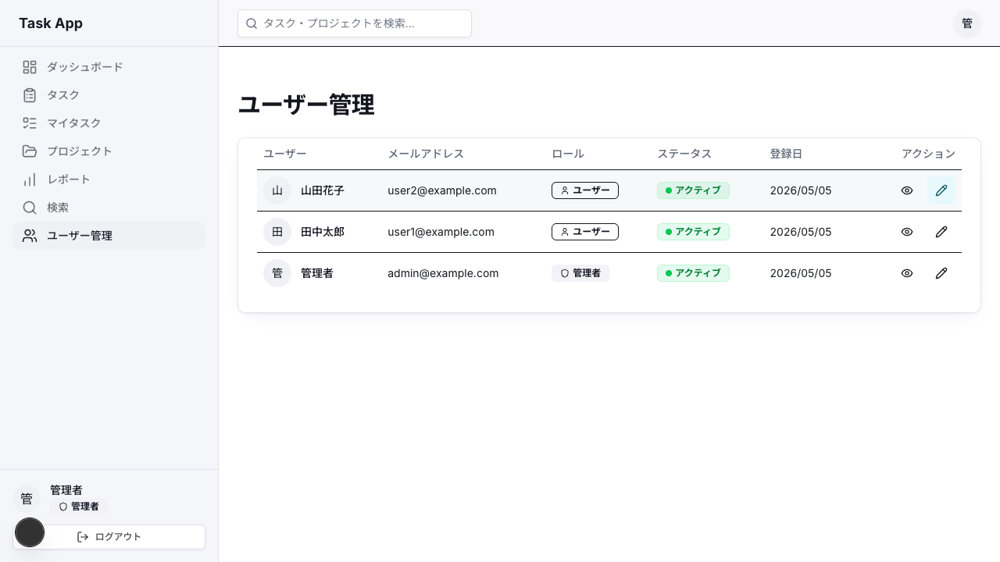
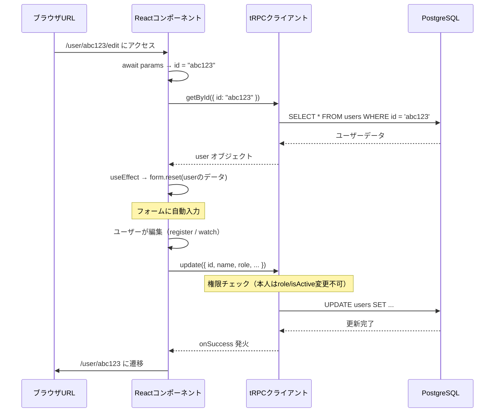

# Day 29: ユーザー詳細・編集ページを作ろう

## 前回の振り返り

Day 28 では **タスク一括操作**を実装しました。チェックボックスで複数タスクを選択し、一括でステータス変更・削除できる機能を作りました。今日は Day 24 で作った**ユーザー一覧ページ**の続きとして、「各ユーザーをクリックしたときに開く詳細ページ」と「編集ページ」を作ります。

---

## 今日のゴール

ユーザーの詳細情報を表示するページと、管理者または本人がユーザー情報を編集できるページを作ります。Next.js の**動的ルーティング**という仕組みを使って、URLに含まれるユーザーIDからデータを取得する方法を学びます。

スクリーンショット: ユーザー詳細ページの完成イメージの表示を確認してください。



> **今日のゴールライン**: 動的ルーティングでユーザーIDを受け取り、詳細表示から編集保存まで権限つきで動かせれば大丈夫です。

## 始める前の前提

- Day 24 のユーザー一覧ページからユーザー詳細へ遷移できる
- 管理者ユーザーと一般ユーザーの両方で確認できる
- 編集対象にする練習用ユーザーが1人以上いる
- URL の `[id]` 部分は実際のユーザーIDに置き換えて確認する

## なぜこれを作るのか

管理者は「各ユーザーの情報を確認したい」「権限を変えたい」「アカウントを無効にしたい」という管理業務が必要です。また、一般ユーザーも自分のプロフィールを確認・編集する場面があります。

このアプリでは**管理者は全ユーザーの情報を閲覧・編集でき、一般ユーザーは自分の情報だけを閲覧・編集できる**という権限モデルです。

> **例え話**: 会社の社員名簿を想像してください。人事担当者（管理者）は全社員のページを開けますが、一般社員は自分のページだけです。
>
> 「部署変更」「在籍状態の変更」は人事担当者だけが行えます。今日はその仕組みを作ります。

### ページ構成とデータの流れ


```mermaid
flowchart TD
    A["URL: /user/abc123"] --> B["server page.tsx"]
    B --> C["Prisma で存在確認"]
    C -->|見つからない| D["notFound()"]
    C -->|見つかる| E["client component に userId を渡す"]
    E --> F["api.user.getById.useQuery()"]
    F --> G["詳細ページを描画"]
    G --> H["管理者 or 本人？"]
    H -->|Yes| I["編集ボタンを表示"]
    H -->|No| J["FORBIDDENエラー（アクセス拒否）"]
    I --> K["/user/abc123/edit"]
    K --> L["server wrapper + client form"]
```

この図で見てほしいのは、B と F で2回サーバーに問い合わせているところです。B の `page.tsx` が Prisma（データベースを読み書きする道具）で確かめるのは「その ID のユーザーが居るか」だけで、名前やメールは取りません。居なければ D の `notFound()` に進み、画面が1度も描かれないまま404になります。居たときだけ F の `getById` が本物の詳細データを取りに行き、そこで「見る権限があるか」を確かめます。存在の確認と権限の確認が別々になっているので、他人のIDを打ち込まれたときの返り方も別々になります。居ないIDなら404、居るIDなら権限エラーです。これは裏を返すと、返り方の違いから「そのIDのユーザーが実在するか」を外から言い当てられるということでもあります。Day 07 でログインの文言をそろえたのと同じ考え方でいくなら、どちらも同じ404に見せるほうが安全です。今日は動的ルーティングと権限判定を追うことを優先して、この形のまま進みます。

### やること / やらないこと

| やること | やらないこと |
|---------|-------------|
| 動的ルーティング `[id]` フォルダの作成 | パスワード変更機能 |
| ユーザー詳細ページの実装 | プロフィール画像のアップロード機能 |
| 管理者・本人向けユーザー編集ページの実装 | メール通知機能 |
| 権限に基づいたUI表示切り替え | ユーザー削除機能 |
| フォームとサーバーデータの同期（useEffect） | 2要素認証 |

### 新しく学ぶ概念

| 概念 | 読み方 | 役割 | 例え |
|------|--------|------|------|
| 動的ルーティング `[id]` | どうてきルーティング | URLのID部分を変数として受け取る | 「社員番号001の名簿ページ」→ URLの001が変数 |
| `notFound()` | ノットファウンド | そのIDが存在しないときに404へ送る | 名簿にいない社員番号なら案内終了 |
| server wrapper | — | 存在確認や404判定を server 側に寄せる | 受付で本人確認してから会議室へ通す |
| `await params` | アウェイト パラムズ | URLのパラメータ（変数）を server 側で受け取る | 受付で渡された整理番号を開いて読む |
| `useEffect` | ユーズエフェクト | コンポーネント外部の変化に反応して副作用を実行するフック | 荷物が届いたら自動で棚に並べる係 |
| useForm + zod（復習） | — | フォーム管理＋バリデーション（Day 14 参照） | 記入用紙のルール自動チェック |
| 権限チェック | けんげんチェック | ユーザーの役割によって表示を変える | 社員証の種類によって入れる部屋を変える |

## 実装ステップ一覧

| ステップ | 作業内容 | 所要時間 | 触るファイル | 成功状態 |
|---------|---------|---------|-------------|---------|
| Step 0 | user.ts に getById / update を追記する | 16分 | `src/server/api/routers/user.ts` | 詳細取得と更新APIが生える |
| Step 1 | 動的ルーティングの仕組みを理解する | 5分 | 概念説明のみ | 仕組みが頭に入る |
| Step 2 | ユーザー詳細ページのファイルを作成 | 5分 | `src/app/user/[id]/page.tsx` | ファイルが存在する |
| Step 3 | URLからユーザーIDを取得してデータを取得 | 7分 | `src/app/user/[id]/page.tsx` | ユーザー名が表示される |
| Step 4 | グリッドレイアウトで詳細情報を表示 | 7分 | `src/app/user/[id]/page.tsx` | 2カラムレイアウトで表示 |
| Step 5 | プロジェクト一覧とタスクテーブルを表示 | 7分 | `src/app/user/[id]/page.tsx` | バッジとテーブルが表示される |
| Step 6 | 権限チェックで編集ボタンを出し分ける | 5分 | `src/app/user/[id]/page.tsx` | 管理者・本人のみ編集ボタンが見える |
| Step 7 | 編集ページのファイルを作成 | 5分 | `src/app/user/[id]/edit/page.tsx` | ファイルが存在する |
| Step 8 | フォーム状態管理とuseEffectでデータ同期 | 7分 | `src/app/user/[id]/edit/page.tsx` | フォームにデータが入る |
| Step 9 | ロール選択・アクティブ状態の切り替え | 7分 | `src/app/user/[id]/edit/page.tsx` | ドロップダウンとチェックボックスが動く |
| Step 10 | 保存機能を実装して完成 | 5分 | `src/app/user/[id]/edit/page.tsx` | 保存ボタンでDBが更新される |

**合計時間**: 約60分です。

---

### Step 0: user.ts に getById / update を追記する（16分）

**ゴール**: Day 24・Day 25 で作った `src/server/api/routers/user.ts` に、`getById` と `update` を追記します。今日は UI で動的ルーティングを学びますが、その前に「ユーザー詳細を返す入口」と「編集内容を保存する出口」を完成させます。

この2本で初めて、Day 24 の一覧 → Day 29 の詳細 → Day 29 の編集、という流れが閉じます。ここも source と同じく、**閲覧権限** と **更新権限** を先に判定してから DB を触ります。

最初に import 群を完成形へ置き換えます。`getById` の未完了タスク絞り込みに使う `TASK_STATUS` が今日の追加分です。

```typescript
// filepath: src/server/api/routers/user.ts（import 群の完成形）
import type { Prisma } from '@prisma/client';
import { TRPCError } from '@trpc/server';
import bcrypt from 'bcryptjs';
import { z } from 'zod';
import { USER_ROLE } from '@/lib/constant/roles';
import { TASK_STATUS } from '@/lib/constant/status';
import { prisma } from '@/lib/prisma';
import { createSession } from '@/lib/session';
import { adminProcedure, createTRPCRouter, protectedProcedure } from '../trpc';
import { USER_DETAIL_SELECT } from './_helpers/select';
```

Day 25 で書いた `profileUpdateSchema` の前へ、管理者または本人が使う更新入力を追加します。

```typescript
// filepath: src/server/api/routers/user.ts（profileUpdateSchema の前に追加）
const userUpdateSchema = z
  .object({
    id: z.string().cuid(),
    name: z.string().min(1, '名前を入力してください').optional(),
    avatar: z.string().url().optional().nullable(),
    role: z.nativeEnum(USER_ROLE).optional(),
    isActive: z.boolean().optional(),
  })
  .refine(
    ({ name, avatar, role, isActive }) =>
      name !== undefined ||
      avatar !== undefined ||
      role !== undefined ||
      isActive !== undefined,
    '更新する項目を1つ以上指定してください',
  );
```

末尾の `.refine` は、項目ごとの検査では捕まえられない条件を足すための書き方です。この `userUpdateSchema` は `id` 以外の4項目すべてに `.optional()` が付いているので、`{ id }` だけを送っても項目単位の検査は通ります。それを許すと「何も変えない更新」が DB まで届き、`updatedAt` だけが動いたレコードが残ります。`.refine` で「4つのうち1つは入っていること」を最後に確かめると、その空振りの更新を入口で止められます。

#### 0-1. getAll の直後に getById を足す

完成版 source では `getAll` の次が `getById` です。まずそこへ追記します。

```typescript
// filepath: src/server/api/routers/user.ts（getAll の直後に追加）
  getById: protectedProcedure
    .input(z.object({ id: z.string().cuid() }))
    .query(async ({ ctx, input }) => {
      // 本人またはADMINのみ他ユーザーの詳細情報にアクセス可能
      if (ctx.session.userId !== input.id && ctx.session.role !== USER_ROLE.ADMIN) {
        throw new TRPCError({
          code: 'FORBIDDEN',
          message: 'この操作を行う権限がありません',
        });
      }
```

`getById` は管理者専用ではありません。本人なら自分の詳細を見られる必要があるからです。だから `protectedProcedure` を使い、`本人または ADMIN` という条件を中で判定しています。

```typescript
// filepath: src/server/api/routers/user.ts（続き）
      const user = await prisma.user.findUnique({
        where: { id: input.id },
        select: {
          ...USER_DETAIL_SELECT,
          createdAt: true,
          updatedAt: true,
          projects: {
            include: {
              project: {
                select: {
                  id: true,
                  name: true,
                  color: true,
                },
              },
            },
          },
```

ここからが「詳細ページに必要なデータ」を返す本体です。`USER_DETAIL_SELECT` に加えて、登録日・更新日・所属プロジェクトを返します。`projects.include.project.select` が少し深いですが、これは `ProjectMember` 経由でぶら下がっているプロジェクト本体の `id`・`name`・`color` まで一緒に返すためです。

```typescript
// filepath: src/server/api/routers/user.ts（続き）
          assignedTasks: {
            select: {
              id: true,
              title: true,
              status: true,
              priority: true,
              dueDate: true,
            },
            where: {
              status: {
                notIn: [TASK_STATUS.DONE, TASK_STATUS.CANCELLED],
              },
            },
            orderBy: { dueDate: 'asc' },
          },
        },
      });
```

`assignedTasks` は「今その人が担当している作業」の一覧です。完了済みやキャンセル済みまで混ぜると詳細ページが読みづらくなるので、`notIn: [TASK_STATUS.DONE, TASK_STATUS.CANCELLED]` で除外しています。

```typescript
// filepath: src/server/api/routers/user.ts（続き）
      if (!user) {
        throw new TRPCError({
          code: 'NOT_FOUND',
          message: 'ユーザーが見つかりません',
        });
      }

      return user;
    }),
```

`findUnique` は「無ければ null」を返すので、そのまま返さず `NOT_FOUND` に変換します。UI 側はこのエラーを受けて 404 やエラートーストに繋げられます。

#### 0-2. 次に update を追加する

`getById` の直後に `update` を追記します。この日の Step 1 で `profileUpdateSchema` の前に置いた `userUpdateSchema` をここで使います。

```typescript
// filepath: src/server/api/routers/user.ts（getById の直後に追加）
  update: protectedProcedure.input(userUpdateSchema).mutation(async ({ ctx, input }) => {
    const { id, ...data } = input;

    if (id !== ctx.session.userId) {
      // 他ユーザーを更新する場合はセッションのroleでADMIN判定
      if (ctx.session.role !== USER_ROLE.ADMIN) {
        throw new TRPCError({
          code: 'FORBIDDEN',
          message: '管理者権限が必要です',
        });
      }
```

ここでもまず権限判定です。更新対象が自分以外なら、管理者だけに許可します。判定に使っているのは `ctx.session.role` で、クライアントから送られてきた値ではありません。ここを `input` の中身で判定すると、送信内容を書き換えるだけで誰でも管理者を名乗れてしまいます。0-1 の `getById` と判定材料をそろえてあるので、閲覧と更新で権限の基準がずれません。

```typescript
// filepath: src/server/api/routers/user.ts（続き）
    } else {
      // 自分のプロフィール更新の場合、roleとisActiveは変更不可
      if (data.role !== undefined || data.isActive !== undefined) {
        throw new TRPCError({
          code: 'FORBIDDEN',
          message: 'roleとisActiveは変更できません',
        });
      }
    }
```

本人編集のときは逆に制限が入ります。自分の名前やアバターは変えられても、自分で `role` や `isActive` を変えるのは不可です。ここを入れておかないと、一般ユーザーが DevTools から管理者権限を送り込めてしまいます。

```typescript
// filepath: src/server/api/routers/user.ts（続き）
    const updateData: Prisma.UserUpdateInput = {};
    if (data.name !== undefined) {
      updateData.name = data.name;
    }
    if (data.avatar !== undefined) {
      updateData.avatar = data.avatar;
    }
    if (data.role !== undefined) {
      updateData.role = data.role;
    }
    if (data.isActive !== undefined) {
      updateData.isActive = data.isActive;
    }
```

ここは「渡された項目だけを更新対象に足す」段階です。空文字や `undefined` を無理にまとめて送らず、存在する項目だけ 1 本ずつ加えています。Day 25 の `updateProfile` で作った `updateData` と同じ考え方です。

```typescript
// filepath: src/server/api/routers/user.ts（続き）
    return await prisma.user.update({
      where: { id },
      data: updateData,
      select: {
        ...USER_DETAIL_SELECT,
        updatedAt: true,
      },
    });
  }),
```

更新後は、画面がすぐに描画し直せるよう `USER_DETAIL_SELECT` と `updatedAt` を返します。ここまでで `update` は完成です。

#### 0-3. Day 25 までの user.ts 完成形を確認する

今日ここまで追記すると、`src/server/api/routers/user.ts` には次の5本が揃います。

| 順番 | procedure | 追加した日 |
|------|-----------|-----------|
| 1 | `getAll` | Day 24 |
| 2 | `getById` | Day 29 |
| 3 | `update` | Day 29 |
| 4 | `updateProfile` | Day 25 |
| 5 | `changePassword` | Day 25 |

順番も source と同じです。`root.ts` の `user: userRouter` は Day 24 ですでに登録済みなので、今日も root の追記はありません。

**確認ポイント**:
- `src/server/api/routers/user.ts` に `getById` と `update` を source と同じ位置へ追記できた
- `getById` が「本人または ADMIN」、`update` が「本人更新 / 他人更新」で分岐している
- Day 24〜29 の積み上がりで `userRouter` の5手続きが揃った

### Step 1: 動的ルーティングの仕組みを理解する（5分）

**ゴール**: Next.js の `[id]` フォルダがどんな魔法をしているか理解します。

Next.js では、フォルダ名を `[id]` のように**角括弧で囲む**と、そのフォルダ名が「変数」になります。URLの対応する部分が自動的にその変数に入ります。

```
フォルダ構造:
src/app/user/[id]/page.tsx

アクセスできるURL:
/user/abc123     → id = "abc123"
/user/xyz789     → id = "xyz789"
/user/user001    → id = "user001"
```

これが**動的ルーティング**です。1つのファイルで何千人ものユーザーページを作れます。

| 方式 | フォルダ例 | 動作 |
|------|-----------|------|
| 静的ルーティング | `src/app/about/page.tsx` | `/about` だけに対応 |
| 動的ルーティング | `src/app/user/[id]/page.tsx` | `/user/なんでも` に対応 |

`[id]` の `id` という名前は自由に決められます。`[userId]` でも `[username]` でも OK です。ただし、コード内で読み取るときも同じ名前を使います。

```tsx
// filepath: src/app/user/[id]/page.tsx
// このファイルは /user/なんでも という全てのURLに対応する
// URLの「なんでも」部分が params['id'] として受け取れる
export default function UserDetailPage() {
  // 次のステップでここに params から id を取り出す処理を書く
  return <div>ユーザー詳細ページ</div>;
}
```

**確認ポイント**:
- 動的ルーティングは「角括弧 `[]` でフォルダ名を囲む」ことで実現する
- 1つのファイルで無数のURLに対応できる仕組みだと理解した

---

### Step 2: ユーザー詳細ページのファイルを作成する（5分）

**ゴール**: 必要なフォルダとファイルを作成し、まず骨組みを作ります。

以下のフォルダ構造を作成します。

```
src/app/user/
├── page.tsx           ← Day 24 で作った一覧ページ
└── [id]/
    ├── page.tsx       ← 今回作成（詳細ページ）
    └── edit/
        └── page.tsx   ← 後で作成（編集ページ）
```

`[id]` の下にさらに `edit/` を置くのは、URLの入れ子とフォルダの入れ子を同じ形にそろえるためです。`/user/abc123` は `[id]/page.tsx` が受け持ち、`/user/abc123/edit` は `[id]/edit/page.tsx` が受け持ちます。編集ページ側でも同じ `[id]` の値を読めるので、詳細から編集へIDを持ち回す仕組みを別に作る必要はありません。

まずは route-level 404 を担当する
server wrapper を作ります。

```tsx
// filepath: src/app/user/[id]/page.tsx
import { notFound } from 'next/navigation';
import { prisma } from '@/lib/prisma';
import { UserDetailClient } from './user-detail-client';

interface UserDetailPageProps {
  params: Promise<{
    id: string;
  }>;
}

export default async function UserDetailPage({
  params,
}: UserDetailPageProps) {
  const { id } = await params;

  const user = await prisma.user.findUnique({
    where: { id },
    select: { id: true },
  });

  if (!user) {
    notFound();
  }
```

`params` が `Promise` になっているのは、Next.js 15 から動的ルーティングの値が非同期で渡されるようになったためです。だから `await params` で中身を開いてから `id` を取り出します。`select: { id: true }` として名前やメールを取っていないのは、この段階で知りたいのが「その ID のユーザーが居るかどうか」だけだからです。`notFound()` は下の行へ進まず、`src/app/not-found.tsx` の404画面に切り替えます。この確認を server 側に置くと、存在しないIDのときブラウザは一瞬も詳細画面を描きません。

続きを次のブロックで書きます。

```tsx
// filepath: 続き

  return <UserDetailClient userId={id} />;
}
```

`notFound()` の後に `return` が続きますが、この行に届くのは `user` が見つかったときだけです。`notFound()` はその場で描画を打ち切るため、下の `return` は実行されません。取り出した `id` を `userId` として渡すので、client 側はURLをもう一度読み直さずに済みます。

開発サーバーを起動して、存在するユーザーIDのURLで確認しましょう。
`/user/test123` のような存在しないIDでは、
このコードは正しく 404 を表示します。
実IDは Day 24 のユーザー一覧、または DB の `users` テーブルで確認します。

```bash
PORT=3001 npm run dev
```

スクリーンショット: ユーザー詳細ページの骨組みの表示を確認してください。


存在するユーザーIDなら骨組みが表示され、
存在しないIDなら 404 になります。
次のステップで `userId` を使って詳細データを読み込みます。

**確認ポイント**:
- `src/app/user/[id]/page.tsx` ファイルが作成できた
- `src/app/user/[id]/page.tsx` が server wrapper になっている
- `npm run dev` でエラーが出ない

---

### Step 3: URLからユーザーIDを取得してデータを取得する（7分）

**ゴール**: `user-detail-client.tsx` で
`userId` を受け取り、tRPC でユーザーデータを取得し、
エラー時にトースト通知を表示します。

インポートとデータ取得の部分を書きます。

```tsx
// filepath: src/app/user/[id]/user-detail-client.tsx
'use client';

import { useRouter } from 'next/navigation';
import { useEffect } from 'react';
import toast from 'react-hot-toast';
import { AppLayout } from '@/component/layout/app-layout';
import { Card, CardContent } from '@/component/ui/card';
import { PageLoadingSpinner } from '@/component/ui/loading-spinner';
import { USER_ROLE } from '@/lib/constant/roles';
import { api } from '@/trpc/react';
```

**確認ポイント**: ファイルを保存して `npm run dev` でインポートエラーが出ないことを確認してください。

コンポーネントの中でURLのIDを取得し、データを取得します。

```tsx
// filepath: src/app/user/[id]/user-detail-client.tsx
interface UserDetailClientProps {
  userId: string;
}

export function UserDetailClient({ userId }: UserDetailClientProps) {
  const router = useRouter();

  const { data: currentUser, isLoading: isCurrentUserLoading } =
    api.auth.getCurrentUser.useQuery();

  const { data: user, isLoading, error } =
    api.user.getById.useQuery(
      { id: userId },
      { enabled: userId.length > 0 },
    );

  useEffect(() => {
    if (error) {
      toast.error(error.message || 'ユーザー情報の取得に失敗しました');
    }
  }, [error]);
```

`useEffect` で `error` の変化を監視し、エラー発生時にトースト表示します。

> React の Strict Mode（開発時のみ有効）は、コンポーネントをいったん取り外してからもう一度取り付けます。そのため最初の `useEffect` は、依存配列に何を書いても2回走ります。`[error]` を指定しても、この2回は減りません。依存配列の役割は別で、取り付けが済んだあと `error` が変わったときだけ中身を走らせることです。取り付け直しの時点では `error` はまだ `undefined` なので、`if (error)` に阻まれてトーストは出ません。この取り付け直しは開発中だけの確認です。本番ビルドでは行われないので、取り付けは1回だけになります。

次に早期リターンを書きます。

```tsx
// filepath: src/app/user/[id]/user-detail-client.tsx
  if (isLoading || isCurrentUserLoading) {
    return (
      <AppLayout>
        <PageLoadingSpinner />
      </AppLayout>
    );
  }

  if (!user) {
    return (
      <AppLayout>
        <PageLoadingSpinner />
      </AppLayout>
    );
  }
```

`if (!user)` の早期リターンを通過した後に権限変数を宣言します。`user` が確実に存在する状態でないと `user.id` に触れないためです。

> route-level 404 は Step 2 の
> `page.tsx` で担当します。
> client component 側の `!user` は
> 一時的な再取得中に備える保険です。
>
> 期限列の完成版 source は
> `format(new Date(task.dueDate), ...)` ではなく
> `formatDateOnly(task.dueDate)` を使います。
> User 詳細だけ違う日付処理にすると、
> Day 17 と Day 20 で学んだ「date-only は
> helper に寄せる」という方針と矛盾してしまいます。

```tsx
// filepath: src/app/user/[id]/user-detail-client.tsx
  // この位置に書く（if (!user) の後）
  const isAdmin = currentUser?.role === USER_ROLE.ADMIN;
  const isOwnProfile = currentUser?.id === user.id;
```

**確認ポイント**: 存在しないIDにアクセスすると server wrapper から `notFound()` が呼ばれ、`src/app/not-found.tsx` の404画面が表示されます。

正常系の表示を書きます。次のステップで内容を充実させます。

```tsx
// filepath: src/app/user/[id]/user-detail-client.tsx
  return (
    <AppLayout>
      <div className="container mx-auto max-w-6xl py-8">
        <h1 className="text-2xl font-bold">{user.name}</h1>
        <p>ID: {userId}</p>
      </div>
    </AppLayout>
  );
}
```

**確認ポイント**:
- 存在するユーザーIDでアクセスするとユーザー名が表示される
- 完成版 source では、存在しないIDは route-level 404 に流れる
- 読み込み中はスピナーが表示される

---

### Step 4: グリッドレイアウトで詳細情報を表示する（7分）

**ゴール**: 戻るボタン・サイドバー・メインコンテンツの2カラムレイアウトで表示します。

```
モバイル: 縦に並ぶ
PC: 左4列 + 右8列
  ┌──────┬────────────────────┐
  │Avatar│プロジェクト一覧    │
  │名前  │担当タスクテーブル  │
  │ロール│                    │
  └──────┴────────────────────┘
```

左を4列、右を8列に分けるのは、左が名前やロールのような長さの決まった情報で、右が件数によって伸び縮みする一覧だからです。伸びる側に広い幅を渡します。スマートフォンの幅では12列を横に割ると1つが狭くなりすぎるので、`md:` を付けて画面が広いときだけ2カラムにします。狭い画面では上下に積まれます。

必要なコンポーネントをインポートします。ファイルの先頭のインポート部分に追加してください。

```tsx
// filepath: src/app/user/[id]/user-detail-client.tsx
import { format } from 'date-fns';
import { ja } from 'date-fns/locale';
import { ArrowLeft, Calendar, Mail } from 'lucide-react';
import { Avatar, AvatarFallback, AvatarImage }
  from '@/component/ui/avatar';
import { Button } from '@/component/ui/button';
import { Card, CardContent } from '@/component/ui/card';
import { Separator } from '@/component/ui/separator';
import { ActiveStatusBadge, UserRoleBadge }
  from '@/component/ui/user-badges';
import { formatDateOnly } from '@/lib/date';
```

**確認ポイント**: ファイルを保存してインポートエラーが出ないことを確認してください。

12列グリッド（`md:grid-cols-12`）で左4列・右8列に分割します。`return` 文を書き換えます。

```tsx
// filepath: src/app/user/[id]/user-detail-client.tsx
  return (
    <AppLayout>
      <div className="container mx-auto max-w-6xl py-8">
        <Button
          variant="ghost"
          className="mb-4 pl-0 hover:bg-transparent hover:text-primary"
          onClick={() => router.push('/user')}
        >
          <ArrowLeft className="mr-2 h-4 w-4" />
          ユーザー一覧に戻る
        </Button>

        <div className="grid gap-6 md:grid-cols-12">
```

戻るボタンを画面の先頭に置いているのは、この詳細ページがURLを直接開いても表示できるからです。一覧を経由せずに来た人はブラウザの戻るボタンで一覧へ帰れません。`router.push('/user')` と行き先を書いておけば、どこから来ても同じ場所へ戻せます。最後の `md:grid-cols-12` で12列の枠を開き、この中に左右のカラムを入れていきます。

左カラムにアバターとユーザー基本情報を置きます。

```tsx
// filepath: src/app/user/[id]/user-detail-client.tsx
          {/* 左カラム: アバター・基本情報 */}
          <div className="md:col-span-4 space-y-6">
            <Card>
              <CardContent className="pt-6">
                <div className="text-center mb-6">
                  {/* アバター画像（未設定時は名前の頭文字を表示） */}
                  <Avatar className="w-24 h-24 mx-auto mb-4">
                    {user.avatar && <AvatarImage
                      src={user.avatar}
                      alt={user.name || ''} />}
                    <AvatarFallback className="text-3xl">
                      {user.name?.[0]?.toUpperCase()}
                    </AvatarFallback>
                  </Avatar>
                  <h2 className="text-xl font-bold mb-2">
                    {user.name}
                  </h2>
                  {/* ロールバッジとアクティブ状態バッジ */}
                  <div className="flex justify-center gap-2 mb-4">
                    <UserRoleBadge role={user.role} />
                    <ActiveStatusBadge isActive={user.isActive} />
                  </div>
                </div>
```

**確認ポイント**: ファイルを保存して `npm run dev` でエラーが出ないことを確認してください。

次にセパレーターとメールアドレスを表示します。

```tsx
// filepath: src/app/user/[id]/user-detail-client.tsx
// セパレーターとメールアドレス表示
                <Separator className="my-4" />
                <div className="space-y-4 text-sm">
                  <div className="flex items-center gap-3">
                    <Mail className="h-4 w-4 text-muted-foreground" />
                    <div>
                      <p className="font-medium text-muted-foreground text-xs">
                        メールアドレス
                      </p>
                      <p>{user.email}</p>
                    </div>
                  </div>
```

**確認ポイント**: メールアドレスがアイコン付きで表示されることを確認してください。

登録日も同じレイアウトパターンで表示します。

```tsx
// filepath: src/app/user/[id]/user-detail-client.tsx
// 登録日の表示
                  <div className="flex items-center gap-3">
                    <Calendar className="h-4 w-4 text-muted-foreground" />
                    <div>
                      <p className="font-medium text-muted-foreground text-xs">
                        登録日
                      </p>
                      <p>
                        {user.createdAt
                          ? format(
                              new Date(user.createdAt),
                              'yyyy年MM月dd日',
                              { locale: ja }
                            )
                          : '-'}
                      </p>
                    </div>
                  </div>
```

**確認ポイント**: 登録日がカレンダーアイコン付きで表示されることを確認してください。

最終更新日も同じパターンで表示します。

```tsx
// filepath: src/app/user/[id]/user-detail-client.tsx
// 最終更新日と左カラムの閉じタグ
                  <div className="flex items-center gap-3">
                    <Calendar className="h-4 w-4 text-muted-foreground" />
                    <div>
                      <p className="font-medium text-muted-foreground text-xs">
                        最終更新日
                      </p>
                      <p>
                        {user.updatedAt
                          ? format(
                              new Date(user.updatedAt),
                              'yyyy年MM月dd日',
                              { locale: ja }
                            )
                          : '-'}
                      </p>
                    </div>
                  </div>
                </div>
              </CardContent>
            </Card>
          </div>
```

**確認ポイント**: メールアドレス・登録日・最終更新日がアイコン付きで表示されていることを確認してください。

左カラムの `div` を閉じた後、右カラムの枠を書きます。中身は Step 5 で追加します。

```tsx
// filepath: src/app/user/[id]/user-detail-client.tsx
          {/* 右カラム: Step 5で中身を追加 */}
          <div className="md:col-span-8 space-y-6">
            {/* Step 5 でプロジェクト・タスクを追加 */}
          </div>
        </div>
      </div>
    </AppLayout>
  );
}
```

**確認ポイント**:
- PCサイズのブラウザで左にアバター、右にスペースが表示される
- スマホサイズに縮小すると縦に並ぶ
- アバターが未設定のユーザーでは名前の頭文字が表示される
- 「ユーザー一覧に戻る」ボタンが表示される

---

### Step 5: プロジェクト一覧とタスクテーブルを表示する（7分）

**ゴール**: 参加プロジェクトをバッジで、担当タスクをテーブルで表示します。

必要なコンポーネントをインポートします。ファイル先頭のインポート部分に追加してください。

```tsx
// filepath: src/app/user/[id]/user-detail-client.tsx
import { StatusBadge } from '@/component/task/status-badge';
import { Badge } from '@/component/ui/badge';
import { CardHeader, CardTitle } from '@/component/ui/card';
import {
  Table, TableBody, TableCell,
  TableHead, TableHeader, TableRow,
} from '@/component/ui/table';
import { getPriorityBadgeVariant } from '@/lib/badge-variant';
import { TASK_PRIORITY_LABELS } from '@/lib/constant/priority';
```

ステータス表示は `StatusBadge` に任せます。このコンポーネントが status に応じたラベルと色を内部で決めるため、この画面でバッジの見た目を組み立てる必要はありません。優先度は `getPriorityBadgeVariant` で色の種類だけを選び、ラベルは `TASK_PRIORITY_LABELS` から引きます。

右カラムに「参加プロジェクト」カードを追加します。

```tsx
// filepath: src/app/user/[id]/user-detail-client.tsx
{/* 参加プロジェクト一覧（バッジ形式） */}
<Card>
  <CardHeader>
    <CardTitle className="text-lg">参加プロジェクト</CardTitle>
  </CardHeader>
  <CardContent>
    {user.projects && user.projects.length > 0 ? (
      <div className="flex flex-wrap gap-2">
        {user.projects.map((member) => (
          <Badge
            key={member.id}
            className="cursor-pointer hover:opacity-80 px-3 py-1 text-sm font-normal text-white"
            style={{ backgroundColor: member.project.color }}
```

各バッジにクリックイベントを付けて、プロジェクトページへ遷移できるようにしています。上のコードブロック内の `<Badge` に以下の属性が含まれています。

```tsx
// filepath: src/app/user/[id]/user-detail-client.tsx
// Badge のクリックでプロジェクトページに遷移
onClick={() =>
  router.push(
    `/project?projectId=${member.project.id}`
  )
}
```

**確認ポイント**: プロジェクトバッジにカーソルを合わせるとポインターカーソルになることを確認してください。

プロジェクトが1件もないユーザー向けに、空のときのメッセージも入れておきます。`CardContent` の閉じタグまで書き切りましょう。

Tailwind CSS では動的な色をクラスで指定できないため、`style={{ backgroundColor: member.project.color }}` でプロジェクトカラーを適用しています。

「担当中のタスク」カードをテーブル形式で追加します。テーブルのヘッダー部分です。

```tsx
// filepath: src/app/user/[id]/user-detail-client.tsx
            {/* 担当中タスクのテーブル表示 */}
            <Card>
              <CardHeader>
                <CardTitle className="text-lg">担当中のタスク</CardTitle>
              </CardHeader>
              <CardContent className="p-0">
                {user.assignedTasks && user.assignedTasks.length > 0 ? (
                  <Table>
                    <TableHeader>
                      <TableRow>
                        <TableHead>タイトル</TableHead>
                        <TableHead>ステータス</TableHead>
                        <TableHead>優先度</TableHead>
                        <TableHead>期限</TableHead>
                      </TableRow>
                    </TableHeader>
```

**確認ポイント**: テーブルヘッダーに「タイトル」「ステータス」「優先度」「期限」の4列が表示されることを確認してください。

`TableHeader` の直後に `TableBody` を追加します。各タスク行はクリックでタスク詳細に遷移します。

```tsx
// filepath: src/app/user/[id]/user-detail-client.tsx
// タスクテーブルのボディ部分
                    <TableBody>
                      {user.assignedTasks.map((task) => (
                        <TableRow
                          key={task.id}
                          className="cursor-pointer hover:bg-muted/50"
                          onClick={() =>
                            router.push(`/task?taskId=${task.id}`)
                          }
                        >
                          <TableCell className="font-medium">
                            {task.title}
                          </TableCell>
                          <TableCell>
                            <StatusBadge status={task.status} />
                          </TableCell>
                          <TableCell>
                            <Badge variant={getPriorityBadgeVariant(task.priority)}>
                              {TASK_PRIORITY_LABELS[task.priority]}
                            </Badge>
                          </TableCell>
```

`onClick` を `TableRow` そのものに付けているので、タイトルの文字だけでなく行のどこを押してもタスク詳細へ移動します。`hover:bg-muted/50` で指を乗せた行の色が変わるのは、押せる場所だと目で分かるようにするためです。`key={task.id}` は Day 09 のカード一覧と同じ役目で、React が行の入れ替わりを追うための印です。

期限列の表示とカードの閉じタグを追加します。日付がない場合は `-` を表示します。

```tsx
// filepath: src/app/user/[id]/user-detail-client.tsx
// 期限列とテーブル・カードの閉じタグ
                          <TableCell>
                            {task.dueDate
                              ? formatDateOnly(task.dueDate)
                              : '-'}
                          </TableCell>
                        </TableRow>
                      ))}
                    </TableBody>
                  </Table>
                ) : (
                  <div className="p-6 text-muted-foreground text-sm">
                    担当中のタスクはありません
                  </div>
                )}
              </CardContent>
            </Card>
```

**確認ポイント**: タスクテーブルにステータスバッジと優先度バッジが色付きで表示されることを確認してください。

スクリーンショット: プロジェクト一覧とタスクテーブルの表示を確認してください。


**確認ポイント**:
- プロジェクトバッジがカラフルに（テキストは白で）表示される
- バッジをクリックするとプロジェクトページに遷移する
- タスクの行をクリックするとタスク詳細に遷移する
- プロジェクト・タスクがないユーザーには「ありません」メッセージが出る

---

### Step 6: 権限チェックで編集ボタンを出し分ける（5分）

**ゴール**: 管理者または本人のみに編集ボタンを表示します。

まずインポートを追加します。

```tsx
// filepath: src/app/user/[id]/user-detail-client.tsx
import { ArrowLeft, Calendar, Mail, Pencil } from 'lucide-react';
// Pencil を追加（ArrowLeft, Calendar, Mail は Step 4 で追加済み）
```

アイコンはすべて `lucide-react` から取り込むので、行を増やさず Step 4 で書いた行へ `Pencil` を足します。まとめて1行にしておくと、このファイルが使うアイコンを1か所で見渡せます。ボタンを置く場所は左カラムの下端です。プロフィールを読んでから操作へ進む順番になります。

```tsx
// filepath: src/app/user/[id]/user-detail-client.tsx
                {(isAdmin || isOwnProfile) && (
                  <>
                    <Separator className="my-4" />
                    <Button
                      className="w-full"
                      onClick={() =>
                        router.push(`/user/${user.id}/edit`)
                      }
                    >
                      <Pencil className="mr-2 h-4 w-4" /> 編集
                    </Button>
                  </>
                )}
```

| 条件 | 結果 |
|------|------|
| 管理者 + 他人のプロフィール | ボタン表示される |
| 管理者 + 自分のプロフィール | ボタン表示される |
| 一般ユーザー + 自分のプロフィール | ボタン表示される |
| 一般ユーザー + 他人のプロフィール | そもそもページにアクセスできない（サーバーが FORBIDDEN を返す） |

> 一般ユーザーが他人のユーザーIDで `/user/他人のid` にアクセスすると、`getById` の権限チェックで FORBIDDEN エラーになり、データが取得できません。「ボタンが非表示」ではなく「ページ自体が表示されない」という設計です。

**確認ポイント**:
- 管理者でログインするとどのユーザーページにも「編集」ボタンが表示される
- 一般ユーザーで自分のページを見るとボタンが表示される
- 一般ユーザーで他人のIDにアクセスするとエラートーストが表示され、データが表示されない

---

### Step 7: 編集ページのファイルを作成する（5分）

**ゴール**: `/user/[id]/edit` の骨組みを作り、権限チェックを実装します。

まずは route-level 404 を担当する
server wrapper を作ります。

```tsx
// filepath: src/app/user/[id]/edit/page.tsx
import { notFound } from 'next/navigation';
import { prisma } from '@/lib/prisma';
import { UserEditClient } from './user-edit-client';

interface UserEditPageProps {
  params: Promise<{
    id: string;
  }>;
}

export default async function UserEditPage({
  params,
}: UserEditPageProps) {
  const { id } = await params;

  const user = await prisma.user.findUnique({
    where: { id },
    select: { id: true },
  });

  if (!user) {
    notFound();
  }
```

詳細ページの `page.tsx` と見比べると、違うのは最後に返す部品の名前だけです。編集ページでも同じ存在確認をもう一度書くのは、`/user/存在しないid/edit` を直接開かれる場合があるからです。詳細ページを通らないと編集ページに入れない、という前提は、URLを手打ちできる以上は成り立ちません。入口ごとに404を確かめます。

続きを次のブロックで書きます。

```tsx
// filepath: 続き

  return <UserEditClient userId={id} />;
}
```

フォームの中身をこのファイルに直接書かず、`UserEditClient` という別ファイルに渡しているのには理由があります。`page.tsx` は `await` と Prisma を使う server 側のファイルで、フォームは入力に反応する client 側の部品です。役割の違う2つを1ファイルに混ぜると `'use client'` の境目が引けません。ファイルを分けて、境目をそのままファイルの境目にします。

次に、実際のフォーム本体となる
`user-edit-client.tsx` のインポートを書きます。

```tsx
// filepath: src/app/user/[id]/edit/user-edit-client.tsx
'use client';

import { zodResolver }
  from '@hookform/resolvers/zod';
import { ArrowLeft } from 'lucide-react';
import { useRouter } from 'next/navigation';
import { useEffect } from 'react';
import { useForm } from 'react-hook-form';
import toast from 'react-hot-toast';
import { z } from 'zod';
```

**確認ポイント**: `zodResolver`, `useForm`, `z` のインポートが含まれていることを確認してください。

```tsx
// filepath: src/app/user/[id]/edit/user-edit-client.tsx
import { AppLayout }
  from '@/component/layout/app-layout';
import { Button } from '@/component/ui/button';
import { Card, CardContent, CardHeader, CardTitle }
  from '@/component/ui/card';
import { PageLoadingSpinner }
  from '@/component/ui/loading-spinner';
import { USER_ROLE }
  from '@/lib/constant/roles';
import { api } from '@/trpc/react';
```

**確認ポイント**: ファイルを保存してインポートエラーが出ないことを確認してください。

`useForm` より先に zod スキーマと型を定義します。
Step 7 の骨組みだけでも型検査が通る順序です。

```tsx
// filepath: src/app/user/[id]/edit/user-edit-client.tsx
const userEditSchema = z.object({
  name: z.string()
    .min(1, '名前は必須です'),
  avatar: z.string().url().or(
    z.literal('')),
  role: z.enum(["USER", "ADMIN"]),
  isActive: z.boolean(),
});
type UserEditFormValues =
  z.infer<typeof userEditSchema>;
```

`page.tsx` から受け取った `userId` を使って
データ取得 → 早期リターンの流れで実装します。
`useForm` + zod でフォーム状態を管理します。

```tsx
// filepath: src/app/user/[id]/edit/user-edit-client.tsx
interface UserEditClientProps {
  userId: string;
}

export function UserEditClient({ userId }: UserEditClientProps) {
  const router = useRouter();
  const utils = api.useUtils();

  const form = useForm<UserEditFormValues>({
    resolver: zodResolver(userEditSchema),
    defaultValues: {
      name: '',
      avatar: '',
      role: USER_ROLE.USER,
      isActive: true,
    },
  });
```

`defaultValues` を空文字と `USER_ROLE.USER` で埋めているのは、サーバーからデータが届く前にフォームが1度描かれるからです。ここを省くと入力欄の値が `undefined` になり、React が「値を持たない入力欄が途中から値を持った」と警告を出します。中身は次に置く `useEffect` で本物のデータに差し替えるので、この初期値は最初の一瞬だけ使われます。

現在ユーザーから権限フラグを作り、
許可された場合だけ編集対象を取得します。

```tsx
// filepath: src/app/user/[id]/edit/user-edit-client.tsx
  const { data: currentUser, isLoading: isCurrentUserLoading } =
    api.auth.getCurrentUser.useQuery();
  const isAdmin =
    currentUser?.role === USER_ROLE.ADMIN;
  const isOwnProfile =
    currentUser?.id === userId;
  const canEditUser =
    isAdmin || isOwnProfile;
  const canManageAccount =
    isAdmin && !isOwnProfile;

  const { data: user, isLoading } = api.user.getById.useQuery(
    { id: userId },
    {
      enabled:
        !!currentUser
        && canEditUser
        && userId.length > 0,
    },
  );
```

現在ユーザーの取得後に権限を判定し、
許可された場合だけ `getById` を呼びます。
一般ユーザーが他人の ID を開いても、
権限エラーになる API を送信しません。

```tsx
// filepath: src/app/user/[id]/edit/user-edit-client.tsx
  if (isCurrentUserLoading || !currentUser) {
    return (
      <AppLayout>
        <PageLoadingSpinner />
      </AppLayout>
    );
  }
```

読み込み中を表す `isCurrentUserLoading` だけでなく `!currentUser` も見ています。読み込みが終わっても取得に失敗して中身が空の場合があり、そのまま下へ進むと `currentUser?.role` がずっと `undefined` のままになります。すると下の権限判定が必ず「権限なし」に倒れ、ログイン済みの本人にまで拒否画面が出ます。それを止める1行です。ただし、取得の失敗そのものが直るわけではありません。通信に失敗して `currentUser` が空のままだと、読み込みが終わったあとも待機中の表示が消えません。本来はここで失敗した場合を見分けて、やり直しの案内を出す必要があります。今日は権限判定に絞るため、その分岐は入れていません。

権限がなければ、API エラーではなく
安定した拒否画面を返します。

```tsx
// filepath: src/app/user/[id]/edit/user-edit-client.tsx
  if (!canEditUser) {
    return (
      <AppLayout>
        <div className="container mx-auto max-w-md mt-8">
          <Card>
            <CardContent className="pt-6">
              <h1 className="text-xl font-bold mb-2">
                アクセス権限がありません
              </h1>
              <p className="text-muted-foreground">
                管理者または本人のみユーザー編集が可能です
              </p>
            </CardContent>
          </Card>
        </div>
      </AppLayout>
    );
  }
```

拒否するとき、サーバーのエラーをそのまま見せずに自分でこの画面を返しています。`getById` は `enabled` の条件を満たしていないので通信自体が起きず、待っていてもエラーは返ってきません。読者にとっても「白い画面のあとに通知が出る」より「なぜ入れないかが書いてある画面」のほうが迷いません。

許可された query の完了を待ちます。

```tsx
// filepath: src/app/user/[id]/edit/user-edit-client.tsx
  if (isLoading || !user) {
    return (
      <AppLayout>
        <PageLoadingSpinner />
      </AppLayout>
    );
  }
```

3つの早期リターンは並び順に意味があります。先に現在ユーザー、次に権限、最後に編集対象のデータです。権限より先に `user` の到着を待つ形にすると、そもそも入れない人の画面が読み込み中のまま止まります。この順にしておけば、拒否する相手には待ち時間なしで拒否画面が出ます。

権限チェックを通過した後に編集フォームの枠を表示します。

```tsx
// filepath: src/app/user/[id]/edit/user-edit-client.tsx
  return (
    <AppLayout>
      <div className="container mx-auto max-w-md mt-8 mb-8">
        <Button
          variant="ghost"
          className="mb-4 pl-0 hover:bg-transparent hover:text-primary"
          onClick={() => router.push(`/user/${userId}`)}
        >
          <ArrowLeft className="mr-2 h-4 w-4" />
          戻る
        </Button>
        <Card>
          <CardHeader>
            <CardTitle>ユーザー編集</CardTitle>
          </CardHeader>
          <CardContent>
            {/* Step 8, 9, 10 でフォームを追加 */}
          </CardContent>
        </Card>
      </div>
    </AppLayout>
  );
}
```

**確認ポイント**:
- 存在しないユーザーIDでは `page.tsx` 側で `notFound()` になる
- 権限のないユーザーで `/user/他人のid/edit` にアクセスすると「権限がありません」と表示される
- 管理者でアクセスすると「ユーザー編集」が表示される
- 自分のIDでアクセスすると「ユーザー編集」が表示される
- 「戻る」ボタンで詳細ページに戻れる

---

### Step 8: zodスキーマとuseFormでデータを同期する（7分）

**ゴール**: react-hook-form + zod でフォームを管理し、サーバーデータを自動入力します。

zod スキーマと `useForm` は Step 7 で
定義済みです。ここでは重複して追加せず、
`z.infer` で型が自動生成されていることを
確認してください。

`useEffect` + `form.reset` でサーバーデータが届いたらフォームに反映します。

```tsx
// filepath: src/app/user/[id]/edit/user-edit-client.tsx
  // サーバーデータでフォームを初期化
  useEffect(() => {
    if (user) {
      form.reset({
        name: user.name ?? '',
        avatar: user.avatar ?? '',
        role: user.role,
        isActive: user.isActive,
      });
    }
  }, [user, form]);
```

`user` データは非同期に取得されるため、コンポーネント表示時はまだ `undefined` です。`[user]` 依存配列により、データ到着時に `form.reset` が自動実行されフォームが埋まります。

**確認ポイント**: ファイルを保存してエラーが出ないことを確認してください。

次に必要なコンポーネントをインポートし、フォームを書きます。

```tsx
// filepath: src/app/user/[id]/edit/user-edit-client.tsx
import { Avatar, AvatarFallback, AvatarImage }
  from '@/component/ui/avatar';
import { Input } from '@/component/ui/input';
import { Label } from '@/component/ui/label';
```

CardContent 内のフォームを書きます。`register` でテキスト入力を管理し、`watch` でアバタープレビューをリアルタイム更新します。

> `onSubmit` と `updateUser` は
> Step 10 で定義します。ここではJSX構造を
> 先に書き、Step 10 の完了後に動作確認します。

```tsx
// filepath: src/app/user/[id]/edit/user-edit-client.tsx
// フォーム開始 + アバタープレビュー
            <form onSubmit={
              form.handleSubmit(onSubmit)}
              className="space-y-6">
              <div className="flex
                justify-center mb-6">
                <Avatar className="w-24 h-24">
                  {form.watch('avatar') && (
                    <AvatarImage
                      src={form.watch('avatar')} />
                  )}
                  <AvatarFallback
                    className="text-2xl">
                    {form.watch('name')
                      ?.[0]?.toUpperCase()}
                  </AvatarFallback>
                </Avatar>
              </div>
```

`form.watch('avatar')` は、その項目の今の入力値を読み出して、変わるたびに描き直させる書き方です。だからURLを1文字打つごとにプレビューが差し替わります。`AvatarImage` を `form.watch('avatar') &&` で囲むのは、空欄のときに `src=""` の画像を出さないためです。空欄なら下の `AvatarFallback` が名前の頭文字を表示します。

```tsx
// filepath: src/app/user/[id]/edit/user-edit-client.tsx
// 名前入力（register版）
              <div className="space-y-2">
                <Label htmlFor="name">
                  名前
                  <span className=
                    "text-destructive">*
                  </span>
                </Label>
                <Input id="name"
                  {...form.register('name')}
                  disabled={
                    updateUser.isPending} />
                {form.formState.errors
                  .name && (
                  <p className="text-sm
                    text-destructive">
                    {form.formState.errors
                      .name.message}
                  </p>)}
              </div>
```

`{...form.register('name')}` の1行で、この入力欄が `useForm` の管理下に入ります。`value` と `onChange` を自分で書かずに済むのは、`register` が両方を作って渡してくれるからです。下の `form.formState.errors.name` は、Step 7 の zod スキーマに書いた「名前は必須です」を受け取る場所です。文言をスキーマ側だけに置けるので、検査の条件と画面の表示が食い違いません。

メールアドレスとアバターURL入力欄を追加します。

```tsx
// filepath: src/app/user/[id]/edit/user-edit-client.tsx
              <div className="space-y-2">
                <Label htmlFor="email">
                  メールアドレス</Label>
                <Input id="email"
                  value={user.email}
                  disabled />
                <p className="text-xs
                  text-muted-foreground">
                  メールアドレスは変更できません
                </p>
              </div>

              <div className="space-y-2">
                <Label htmlFor="avatar">
                  アバターURL（任意）</Label>
                <Input id="avatar" type="url"
                  {...form.register('avatar')}
                  disabled={
                    updateUser.isPending}
                  placeholder=
                    "https://example.com/
                      avatar.png" />
              </div>
```

**確認ポイント**:
- 編集ページを開くとフォームにユーザーの名前が自動入力される
- アバターURLを入力するとプレビューがリアルタイムで変わる（`form.watch('avatar')` が `AvatarImage` の `src` に直結しているため）
- メールアドレスの入力欄が `disabled` でグレーアウトしている

---

### Step 9: ロール選択・アクティブ状態の切り替えを実装する（7分）

**ゴール**: Select でロールを選び、Checkbox でアクティブ状態を切り替えられるようにします。

**サーバー側のアクセス制御**:
本人は管理者であっても、自分の `role` や
`isActive` を変更できません。
Step 10 では `canManageAccount` を使い、
管理者が他人を編集するときだけ送信します。

インポートを追加します。

```tsx
// filepath: src/app/user/[id]/edit/user-edit-client.tsx
import { Checkbox } from '@/component/ui/checkbox';
import {
  Select, SelectContent, SelectItem,
  SelectTrigger, SelectValue,
} from '@/component/ui/select';
import { isUserRole, USER_ROLE_LABELS }
  from '@/lib/constant/roles';
```

**確認ポイント**: ファイルを保存してインポートエラーが出ないことを確認してください。

ロール選択のドロップダウンを追加します。

次のロール選択とアクティブ切り替えは、
`canManageAccount` が `true` の場合だけ表示します。

```tsx
// filepath: src/app/user/[id]/edit/user-edit-client.tsx
{canManageAccount && (
  <>
```

`canManageAccount` は Step 7 で `isAdmin && !isOwnProfile` として作った値です。管理者が自分自身を編集しているときは `false` になるので、この囲みの中は画面に出ません。管理者が自分の権限を自分で下げてしまい、誰も管理できないアプリになる事故を防ぐためです。`<>` は画面に何も残さない囲みで、条件が成り立つときだけ中の2つをまとめて出します。

```tsx
// filepath: src/app/user/[id]/edit/user-edit-client.tsx
// ロール選択（form.setValue版）
              <div className="space-y-2">
                <Label htmlFor="role">
                  ロール</Label>
                <Select
                  value={form.watch('role')}
                  onValueChange={(value) => {
                    if (isUserRole(value)) {
                      form.setValue(
                        'role', value);
                    }
                  }}
                  disabled={
                    updateUser.isPending}>
                  <SelectTrigger id="role">
                    <SelectValue
                      placeholder=
                        "ロールを選択" />
                  </SelectTrigger>
```

ここだけ `register` を使わず、`value` と `onValueChange` の2つで `useForm` へつないでいます。`Select` は素の `<select>` タグではなく、ボタンと一覧を組み合わせて作られた部品なので、`register` が待っている `onChange` が発生しないからです。代わりに `form.setValue` で値を書き戻します。選択肢の中身は次のブロックで足すので、いまは開いたままにしておきます。

```tsx
// filepath: src/app/user/[id]/edit/user-edit-client.tsx
// ロール選択肢（SelectContent）
                  <SelectContent>
                    {Object.entries(
                      USER_ROLE_LABELS
                    ).map(([value, label]) => (
                      <SelectItem
                        key={value}
                        value={value}>
                        {label}
                      </SelectItem>
                    ))}
                  </SelectContent>
                </Select>
              </div>
```

**確認ポイント**: ドロップダウンを開いて「ユーザー」「管理者」が表示されることを確認してください。

`onValueChange` が渡してくる `value` は、どんな文字列でもありうる `string` 型です。一方 `form.watch('role')` の型は zod スキーマから作られるので `'USER' | 'ADMIN'` の2択に絞られています。広いほうの型を狭いほうへそのまま入れることはできないので、`isUserRole` 型ガードで中身を確かめてから渡します（`as UserRole` は使いません）。

アクティブ状態を切り替えるチェックボックスを追加します。

```tsx
// filepath: src/app/user/[id]/edit/user-edit-client.tsx
              <div className="flex
                items-center space-x-2">
                <Checkbox id="isActive"
                  checked={form.watch(
                    'isActive')}
                  onCheckedChange={
                    (checked) =>
                      form.setValue(
                        'isActive',
                        checked === true)}
                  disabled={
                    updateUser.isPending} />
                <Label htmlFor="isActive">
                  アクティブ</Label>
              </div>
```

`checked` と `onCheckedChange` の組み方は、上の `Select` とそろえてあります。`form.watch('isActive')` で今の値を映し、切り替わったら `form.setValue` で書き戻す形です。どの入力欄にも `disabled={updateUser.isPending}` を付けているのは、保存中に値を変えられると、送った内容と画面に見えている内容が食い違うからです。

```tsx
// filepath: src/app/user/[id]/edit/user-edit-client.tsx
  </>
)}
```

**確認ポイント**: チェックボックスの ON/OFF が切り替えられることを確認してください。

`checked === true` と書くのは、`onCheckedChange` が `boolean | 'indeterminate'` を受け取るためです。

スクリーンショット: 編集フォームの完成イメージの表示を確認してください。


**確認ポイント**:
- ロール選択ドロップダウンに「ユーザー」「管理者」の2つが表示される
- 現在のロールが選択済み状態で表示される
- チェックボックスのON/OFFが切り替えられる

---

### Step 10: 保存機能を実装して完成（5分）

**ゴール**: 保存ボタンを押すとtRPCでDBが更新され、詳細ページに戻るところまで作ります。

Day 25 で学んだ `useMutation` パターンを使い、保存処理を実装します。

```tsx
// filepath: src/app/user/[id]/edit/user-edit-client.tsx
import { AlertCircle } from 'lucide-react';
import { Alert, AlertDescription, AlertTitle }
  from '@/component/ui/alert';
// ArrowLeft は既にインポート済みなので AlertCircle を追加
```

`Alert` を足すのは、保存に失敗した理由を画面に残すためです。この後に書く `onError` のトーストは数秒で消えるので、目を離している間に失敗すると読者は何が起きたか分かりません。消えない場所にも同じ内容を出しておきます。

**確認ポイント**: ファイルを保存してインポートエラーが出ないことを確認してください。

```tsx
// filepath: src/app/user/[id]/edit/user-edit-client.tsx
  const updateUser =
    api.user.update.useMutation({
      onSuccess: async () => {
        await Promise.allSettled([
          utils.user.getById.invalidate(
            { id: userId }),
          utils.user.getAll.invalidate(),
          utils.auth.getCurrentUser.invalidate(),
          utils.auth.getSession.invalidate(),
        ]);
        toast.success(
          'ユーザー情報を更新しました');
        router.push(`/user/${userId}`);
        router.refresh();
      },
      onError: (error) => {
        toast.error(error.message
          ?? 'ユーザー情報の更新に'
          + '失敗しました');
      },
    });
```

`onSuccess` で4つを `invalidate` しているのは、同じ人の情報を4か所が別々に覚えているからです。詳細ページの `getById`、一覧の `getAll`、サイドバーに名前を出す `getCurrentUser`、そしてセッションです。名前を変えたのに一覧やサイドバーだけ古いままになるのは、ここを1つ書き忘れたときに起きます。`Promise.allSettled` でまとめてあるので、どれか1つが失敗しても残りの取り直しは進み、通知と画面遷移までたどり着きます。

```tsx
// filepath: src/app/user/[id]/edit/user-edit-client.tsx
  // zodバリデーション済みの値で送信
  const onSubmit =
    (values: UserEditFormValues) => {
      updateUser.mutate({
        id: userId,
        name: values.name,
        avatar: values.avatar
          || undefined,
        ...(canManageAccount
          ? { role: values.role,
              isActive: values.isActive }
          : {}),
      });
    };
```

**確認ポイント**: ファイルを保存してエラーが出ないことを確認してください。`onSubmit` と `updateUser` が定義されたことで、Step 8 で書いた `<form onSubmit={form.handleSubmit(onSubmit)}>` が動作するようになりました。更新後は30秒待たなくても詳細・一覧・セッション表示へ反映されます。

サーバー側の `update` ルーターは、自分のプロフィール更新で `role` や `isActive` が含まれると `FORBIDDEN` を返します。`canManageAccount` で分岐し、管理者が他人を編集するときだけ送信することで問題を防いでいます。`avatar` に空文字を送ると zod バリデーションで URL 不正になるため、空文字なら `undefined` に変換しています。

エラー表示ブロックをチェックボックスの下に追加します。

```tsx
// filepath: src/app/user/[id]/edit/user-edit-client.tsx
              {updateUser.error && (
                <Alert variant="destructive">
                  <AlertCircle className="h-4 w-4" />
                  <AlertTitle>エラー</AlertTitle>
                  <AlertDescription>
                    {updateUser.error.message}
                  </AlertDescription>
                </Alert>
              )}
```

**確認ポイント**: エラー発生時、フォーム内に赤いアラートが表示されることを確認してください。

`toast` は一時的な通知（数秒で消える）、`Alert` はフォーム内に残り続ける表示です。両方使うことでユーザーにエラーを確実に伝えます。

フォームの送信ボタンとキャンセルボタンを追加します。

```tsx
// filepath: src/app/user/[id]/edit/user-edit-client.tsx
              <div className="flex gap-2 pt-2">
                <Button
                  type="submit"
                  className="w-full"
                  disabled={updateUser.isPending}
                >
                  {updateUser.isPending ? '更新中...' : '更新'}
                </Button>
                <Button
                  type="button"
                  variant="outline"
                  className="w-full"
                  onClick={() => router.push(`/user/${userId}`)}
                  disabled={updateUser.isPending}
                >
                  キャンセル
                </Button>
              </div>
```

**確認ポイント**:
- フォームに変更を加えて「更新」をクリックするとトースト通知が表示される
- 保存成功後、詳細ページへ戻り変更内容が反映されている
- 保存中はボタンが「更新中...」に変わりグレーアウトする
- 「キャンセル」をクリックすると詳細ページに戻る（変更は保存されない）
- 一般ユーザーが自分のロールや isActive を変更しようとすると FORBIDDEN エラーが `Alert` で表示される
- `npm run dev` でエラーが出ない


---

### Pro パターンで書こう（ユーザー編集フォームは zod で境界バリデーションする）

入力境界に zod を置くと、`role` などのフィールドに不正値が混入したときに実行時エラーとして検出できます。
なぜ上の書き方をするのか、**Before/After** で見比べてみましょう。

#### Before（改善前のコード）

```typescript
// filepath: src/app/user/[id]/edit/user-edit-client.tsx
import { USER_ROLE, type UserRole } from '@/lib/constant/roles';

type UserEditFormValues = {
  name: string;
  avatar: string;
  role: UserRole;
  isActive: boolean;
};

type UpdateUserInput = {
  id: string;
  name: string;
  avatar?: string;
  role?: UserRole;
  isActive?: boolean;
};

type UpdateUserMutation = {
  mutate: (input: UpdateUserInput) => void;
};

export function submitUserEditForm(
  rawValues: unknown,
```

**読み比べ用**: ここは写経しません。続けてコードを読み進めましょう。

入口の引数が `rawValues: unknown` になっているところに目を留めてください。`unknown` は「まだ何の型か分からない値」を表し、そのままでは中身に触れません。フォームから来た値を最初に受け止める型としては、これで正しいです。Before と After が分かれるのは、この `unknown` をこの先どう扱うかという1点です。

```typescript
// filepath: 続き
  userId: string,
  updateUser: UpdateUserMutation,
  isAdmin: boolean,
) {
  const values = rawValues as UserEditFormValues;

  updateUser.mutate({
    id: userId,
    name: values.name,
    avatar: values.avatar || undefined,
    ...(isAdmin
      ? {
          role: values.role,
          isActive: values.isActive,
        }
      : {}),
  });
}

submitUserEditForm(
  {
    name: 'Taro',
    avatar: '',
    role: USER_ROLE.ADMIN,
```

**読み比べ用**: ここは写経しません。続けてコードを読み進めましょう。

問題は `const values = rawValues as UserEditFormValues;` の1行です。`as` は値を1つも見ずに「この形だと思って進む」と伝える書き方なので、`unknown` で受け取った意味がここで消えます。呼び出し側が正しい形を渡している限りは動きます。ただし、それを保証しているのは書き手の記憶だけで、TypeScript は何も確かめていません。

```typescript
// filepath: 続き
    isActive: true,
  },
  'clx_user_123',
  updateUser,
  true,
);
```

**このコードの問題点**:

- `as UserEditFormValues` は「そういう型だと信じる」だけで、実際の値は検証していない
- `role: 'OWNER'` や `isActive: 'yes'` のような値でも、クライアント側では通ってしまう
- フォーム項目が増えると、型と実行時チェックのズレに気づきにくい

#### After（プロが書くコード）

```typescript
// filepath: src/app/user/[id]/edit/user-edit-client.tsx
import { z } from 'zod';
import { USER_ROLE, type UserRole } from '@/lib/constant/roles';

const userEditSchema = z.object({
  name: z.string().min(1, '名前は必須です'),
  avatar: z.string().url('有効なURLを入力してください').or(z.literal('')),
  role: z.enum([USER_ROLE.USER, USER_ROLE.ADMIN]),
  isActive: z.boolean(),
});

type UserEditFormValues = z.infer<typeof userEditSchema>;

type UpdateUserInput = {
  id: string;
  name: string;
  avatar?: string;
  role?: UserRole;
  isActive?: boolean;
};

type UpdateUserMutation = {
  mutate: (input: UpdateUserInput) => void;
};
```

**読み比べ用**: ここは写経しません。続けてコードを読み進めましょう。

After では、型を用意する順番が逆になっています。先に `userEditSchema` を書き、そこから `z.infer` で型を取り出します。名前・アバター・ロール・アクティブの条件が置いてある場所が1か所だけになるので、項目を足すときに直すのもスキーマだけです。Step 7 でフォームに渡したのと同じスキーマを、ここでは送信前の検査にも使い回しています。

```typescript
// filepath: 続き

export function submitUserEditForm(
  rawValues: unknown,
  userId: string,
  updateUser: UpdateUserMutation,
  canManageAccount: boolean,
) {
  const values: UserEditFormValues = userEditSchema.parse(rawValues);

  updateUser.mutate({
    id: userId,
    name: values.name,
    avatar: values.avatar || undefined,
    ...(canManageAccount
      ? {
          role: values.role,
          isActive: values.isActive,
        }
      : {}),
  });
}

submitUserEditForm(
  {
```

**読み比べ用**: ここは写経しません。続けてコードを読み進めましょう。

`as` が `userEditSchema.parse(rawValues)` に置き換わりました。`parse` は値を1項目ずつスキーマと照らし合わせて、合っていれば型の付いた値を返し、合っていなければその場で例外を投げます。`role` に `'OWNER'` が紛れ込んでいれば、サーバーへ送る前にここで止まります。左辺に `UserEditFormValues` と型を書いても `as` のような信じるだけの宣言にはなりません。中身が確かめられた後の値だからです。

```typescript
// filepath: 続き
    name: 'Taro',
    avatar: '',
    role: USER_ROLE.ADMIN,
    isActive: true,
  },
  'clx_user_123',
  updateUser,
  true,
);
```

**このコードの強み**:

- zod が実行時にも値を検証するので、フォーム外から変な値が来ても止められる
- `z.infer` で TypeScript の型をスキーマから作るため、型とバリデーションがズレにくい
- 管理者が他人を編集するときだけ
  `role` / `isActive` を送るルールと、
  入力値の安全性を分けて読める

#### 覚えておきたいエッセンス

`as` は型チェックを黙らせる道具であって、値を守る道具ではありません。
ユーザー入力や API 境界では zod で実際の値を検証します。

## つまずきポイント

| エラー/問題 | 原因 | 解決方法 |
|------------|------|---------|
| ページが404になる | `[id]`フォルダ名のブラケットが全角になっている | 半角の`[id]`でフォルダを作り直す |
| `await params` の `id` が `undefined` になる | App Routerの動的ルートでファイル配置が間違っている | `src/app/user/[id]/page.tsx`のパス構造を確認する |
| フォームの初期値が空になる | Step 8 の `useEffect` で `form.reset` を呼んでいない | `useEffect(() => { if (user) form.reset({ ... }); }, [user, form])` が書けているか確認する |
| 権限チェックが効かない | `currentUser?.role` の比較で定数を使っていない | `USER_ROLE.ADMIN` を使って比較しているか確認する |
| 更新後に古いデータが表示される | tRPC のキャッシュが残っている | `onSuccess` で user/auth を invalidate してから詳細へ戻る |
| `FORBIDDEN`エラーが表示される | 本人更新で `role`・`isActive` を送信している | `canManageAccount` が true のときだけ送信する |

---

## Day 29 完了

今日で管理者向けのユーザー管理機能が完成しました。詳細表示・編集・権限チェックまで実装し、あなたのタスク管理アプリは本格的なチーム管理ツールになりました。

動的ルーティングでURLから情報を読み取り、権限に基づいてUIを切り替える方法を学びました。

### 今日学んだこと

| 概念 | 意味 | 使い場面 |
|------|------|---------|
| 動的ルーティング `[id]` | フォルダ名を変数にして任意のURLに対応 | ユーザー詳細、記事詳細など |
| `await params` | server component で URL のパラメータを受け取る | 動的ルーティングとセットで使う |
| `useEffect` + 依存配列 | 指定した値が変わったときに処理を実行 | サーバーデータをフォームに反映 |
| `useForm` + `zodResolver` | フォーム状態管理とバリデーションをまとめて担当 | すべてのフォーム入力 |
| `form.reset` / `register` / `watch` | データ到着時に初期化し、入力欄と現在値をつなぐ | react-hook-form のフォーム全般 |
| 早期リターンの順序 | ローディング → 未発見 → 権限なし → 本体 | ページの安全な描画 |
| `isAdmin \|\| isOwnProfile` | OR条件で権限チェック | ページやボタンの表示制御 |
| `isPending` | mutationが処理中かどうか | 2重送信防止・入力無効化 |
| `md:grid-cols-12` | レスポンシブなグリッドレイアウト | サイドバー+コンテンツ |

### 全体のデータフロー振り返り


```mermaid
sequenceDiagram
    participant URL as ブラウザURL
    participant Comp as Reactコンポーネント
    participant tRPC as tRPCクライアント
    participant DB as PostgreSQL

    URL->>Comp: /user/abc123/edit にアクセス
    Comp->>Comp: await params → id = "abc123"
    Comp->>tRPC: getById({ id: "abc123" })
    tRPC->>DB: SELECT * FROM users WHERE id = 'abc123'
    DB-->>tRPC: ユーザーデータ
    tRPC-->>Comp: user オブジェクト
    Comp->>Comp: useEffect → form.reset(userのデータ)
    Note over Comp: フォームに自動入力
    Comp->>Comp: ユーザーが編集（register / watch）
    Comp->>tRPC: update({ id, name, role, ... })
    Note over tRPC: 権限チェック（本人はrole/isActive変更不可）
    tRPC->>DB: UPDATE users SET ...
    DB-->>tRPC: 更新完了
    tRPC-->>Comp: onSuccess 発火
    Comp->>URL: /user/abc123 に遷移
```

この図を上から下へたどると、今日書いたコードが1本の線でつながります。URLの文字列が `id` になり、`id` が SQL の `WHERE` に入り、返ってきたユーザーが `form.reset` でフォームの初期値になります。戻りも同じ線です。フォームの値が `update` に乗り、`UPDATE` 文になって DB に届き、`onSuccess` が画面を詳細ページへ送り返します。表示が変わらないときは、この線のどこで値が止まっているかを探すと原因に近づけます。

### 次回予告

Day 30では、いよいよ完成版をVercelに公開します。30日間コツコツ作ってきたタスク管理アプリを、世界中からアクセスできる状態にしましょう。

---

## Day 29 完成形コード（参照用）

### `src/app/user/[id]/page.tsx`

```typescript
// filepath: src/app/user/[id]/page.tsx
import { notFound } from 'next/navigation';
import { prisma } from '@/lib/prisma';
import { UserDetailClient } from './user-detail-client';

interface UserDetailPageProps {
  params: Promise<{
    id: string;
  }>;
}

export default async function UserDetailPage({ params }: UserDetailPageProps) {
  const { id } = await params;

  const user = await prisma.user.findUnique({
    where: { id },
    select: { id: true },
  });

  if (!user) {
    notFound();
  }

  return <UserDetailClient userId={id} />;
}
```

この server wrapper が短いのは、担当を存在確認と404だけに絞ったからです。表示に必要なデータは client 側の `getById` が取りに行くので、ここで名前やタスクまで読む必要はありません。

### `src/app/user/[id]/edit/page.tsx`

```typescript
// filepath: src/app/user/[id]/edit/page.tsx
import { notFound } from 'next/navigation';
import { prisma } from '@/lib/prisma';
import { UserEditClient } from './user-edit-client';

interface UserEditPageProps {
  params: Promise<{
    id: string;
  }>;
}

export default async function UserEditPage({ params }: UserEditPageProps) {
  const { id } = await params;

  const user = await prisma.user.findUnique({
    where: { id },
    select: { id: true },
  });

  if (!user) {
    notFound();
  }

  return <UserEditClient userId={id} />;
}
```

編集ページの wrapper は、返す部品が `UserEditClient` になっている以外は詳細ページと同じ形です。似た形が2つ並ぶのは無駄に見えますが、URLごとに404の判定を独立させておくためです。片方を消すと、消したほうのURLだけ存在しないIDでも画面が描かれ始めます。

### `src/app/user/[id]/user-detail-client.tsx`

完成形は、このリポジトリの `src/app/user/[id]/user-detail-client.tsx` と同じです。手元のコードと見比べて確認してください。

### `src/app/user/[id]/edit/user-edit-client.tsx`

完成形は、このリポジトリの `src/app/user/[id]/edit/user-edit-client.tsx` と同じです。手元のコードと見比べて確認してください。
