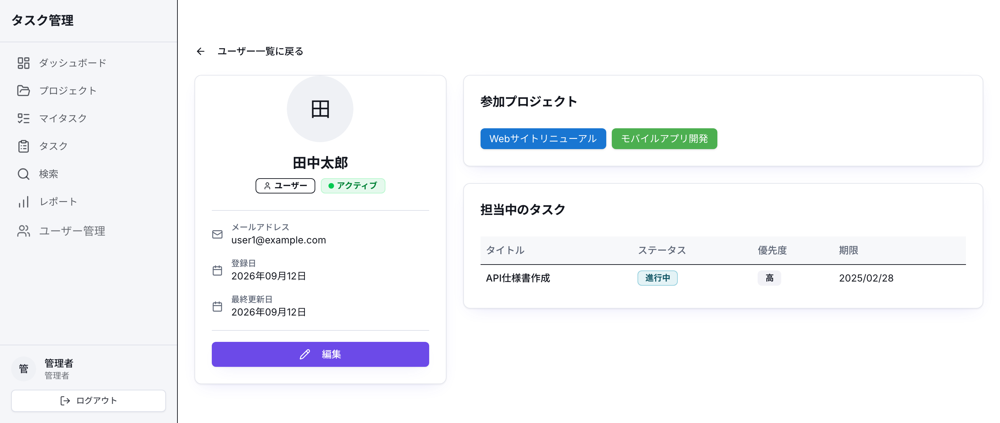
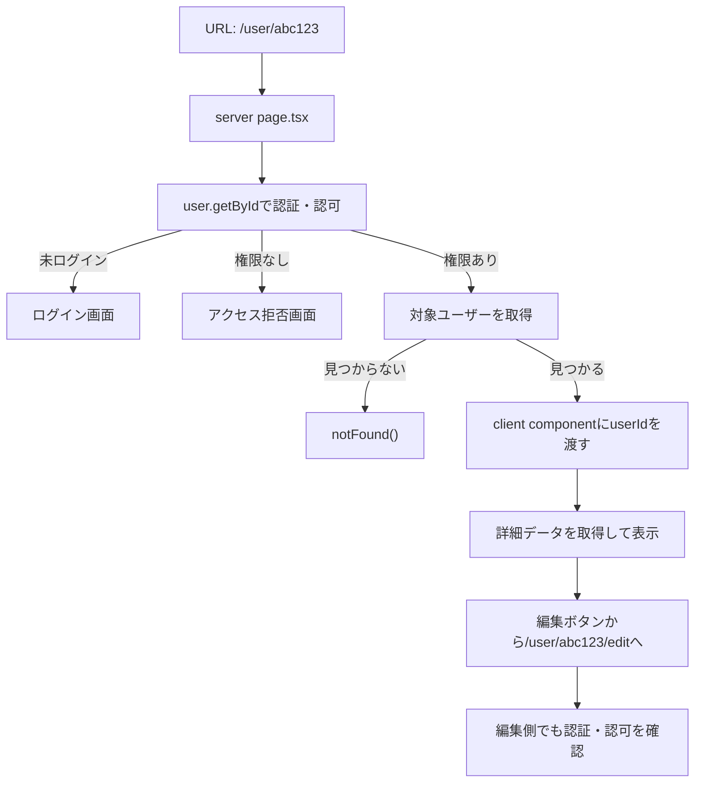
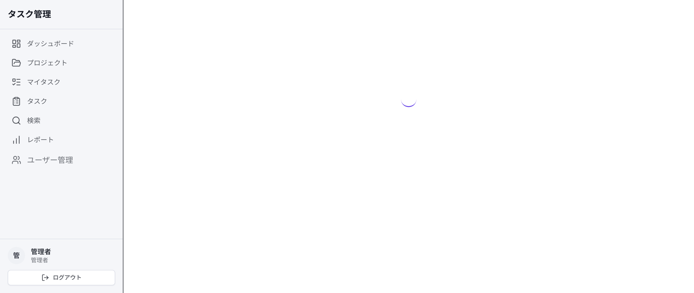
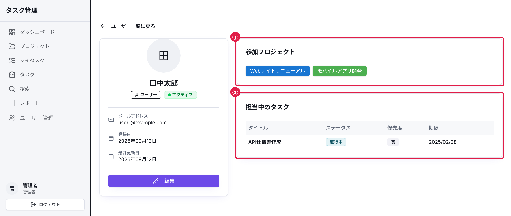
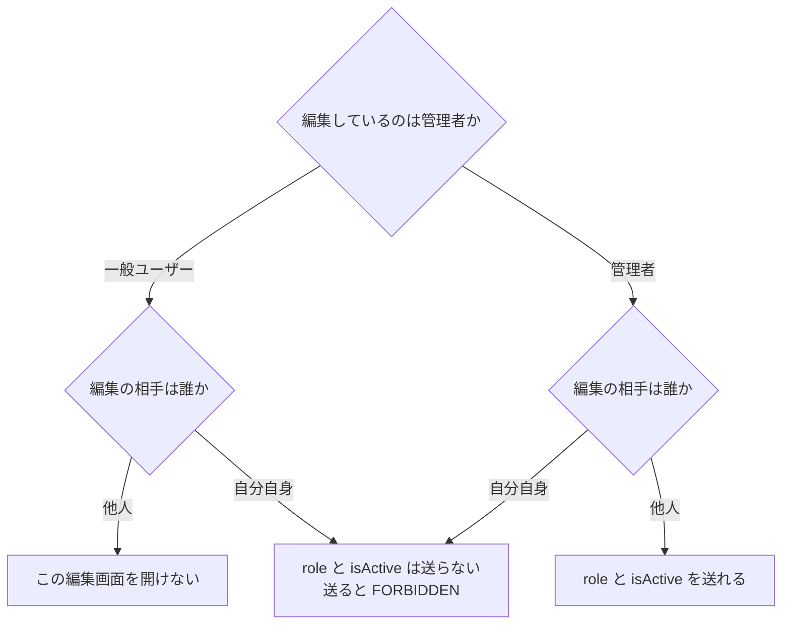
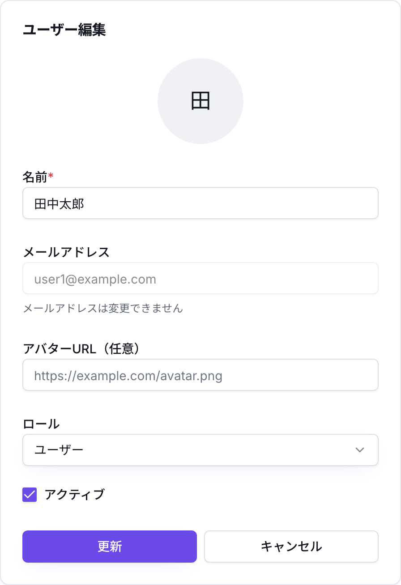
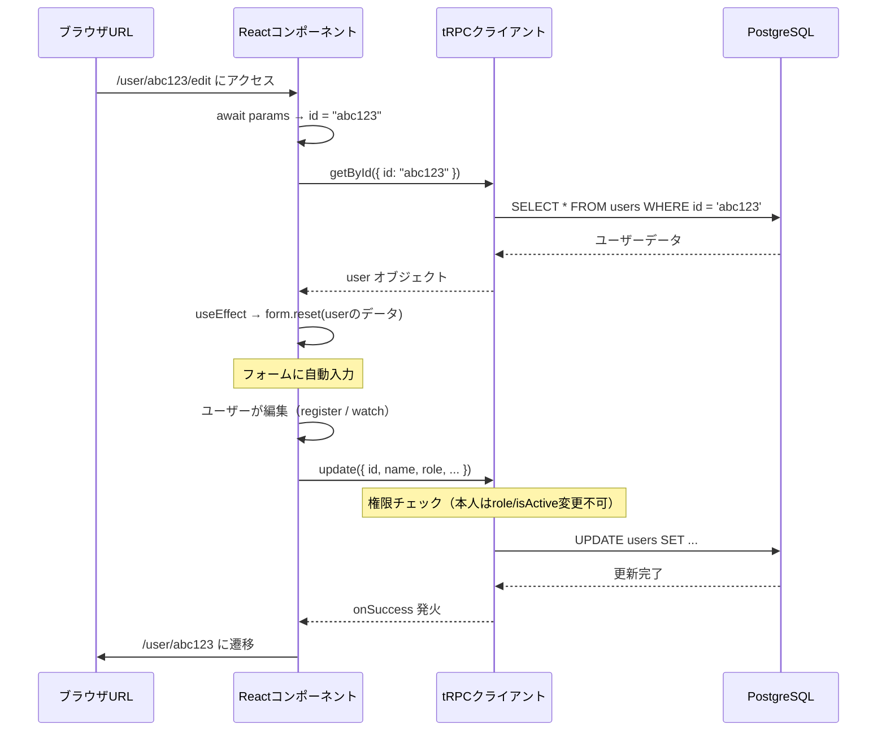

# Day 29: ユーザー詳細・編集ページを作ろう

## 前回の振り返り

Day 28 では **タスク一括操作**を実装しました。チェックボックスで複数タスクを選択し、一括でステータス変更・削除できる機能を作りました。今日は Day 24 で作った**ユーザー一覧ページ**の続きとして「各ユーザーをクリックしたときに開く詳細ページ」と「編集ページ」を作ります。

---

## 今日のゴール

ユーザーの詳細情報を表示するページと、管理者または本人がユーザー情報を編集できるページを作ります。Next.js の**動的ルーティング**という仕組みを使ってURLに含まれるユーザーIDからデータを取得する方法を学びます。

この日はまずサーバー側の `getById` と `update` を自分で書きます。そのあと2画面をつなぎます。

スクリーンショット: ユーザー詳細ページの完成イメージの表示を確認してください。



> **今日のゴールライン**: 動的ルーティングでユーザーIDを受け取り、詳細表示から編集保存まで権限つきで動かせれば大丈夫です。

## 始める前の前提

- Day 24 のユーザー一覧ページが表示できる（詳細ボタンの遷移先は今日つくるため押すと404になる）
- 管理者ユーザーと一般ユーザーの両方で確認できる
- 編集対象にする練習用ユーザーが1人以上いる
- URL の `[id]` 部分は実際のユーザーIDに置き換えて確認する

## なぜこれを作るのか

管理者は「各ユーザーの情報を確認したい」「権限を変えたい」「アカウントを無効にしたい」という管理業務が必要です。また、一般ユーザーも自分のプロフィールを確認・編集する場面があります。

このアプリでは**管理者は全ユーザーの情報を閲覧・編集でき、一般ユーザーは自分の情報だけを閲覧・編集できる**という権限モデルです。

> **例え話**: 会社の社員名簿を想像してください。人事担当者（管理者）は全社員のページを開けますが一般社員は自分のページだけです。
>
> 「部署変更」「在籍状態の変更」は人事担当者だけが行えます。今日はその仕組みを作ります。

### ページ構成とデータの流れ


```mermaid
flowchart TD
    A["URL: /user/abc123"] --> B["server page.tsx"]
    B --> C["user.getByIdで認証・認可"]
    C -->|未ログイン| D["ログイン画面"]
    C -->|権限なし| E["アクセス拒否画面"]
    C -->|権限あり| F["対象ユーザーを取得"]
    F -->|見つからない| G["notFound()"]
    F -->|見つかる| H["client componentにuserIdを渡す"]
    H --> I["詳細データを取得して表示"]
    I --> J["編集ボタンから/user/abc123/editへ"]
    J --> K["編集側でも認証・認可を確認"]
```

`page.tsx` は先に `user.getById` を呼び、ログイン状態と閲覧権限を確認します。この手続きは、本人と管理者のどちらにも当てはまらなければ対象の存在を調べる前に拒否します。他人のIDが存在するかどうかで応答を変えないためです。権限がある場合だけユーザーを取得し、見つからなければ `notFound()` で404を表示します。取得できた場合はブラウザ側の部品へIDを渡します。ブラウザからの再取得にも同じ認可が適用されます。

### やること / やらないこと

| やること | やらないこと |
|---------|-------------|
| 動的ルーティング `[id]` フォルダの作成 | パスワード変更機能 |
| ユーザー詳細ページの実装 | プロフィール画像のアップロード機能 |
| 管理者・本人向けユーザー編集ページの実装 | メール通知機能 |
| 権限に基づいたUI表示切り替え | ユーザー削除機能 |
| フォームとサーバーデータの同期（useEffect） | 2要素認証 |

### 新しく学ぶ概念

| 概念 | 読み方 | 役割 | 例え |
|------|--------|------|------|
| 動的ルーティング `[id]` | どうてきルーティング | URLのID部分を変数として受け取る | 「社員番号001の名簿ページ」→ URLの001が変数 |
| `notFound()` | ノットファウンド | そのIDが存在しないときに404へ送る | 名簿にいない社員番号なら案内終了 |
| server wrapper | — | 存在確認や404判定を server 側に寄せる | 受付で本人確認してから会議室へ通す |
| `await params` | アウェイト パラムズ | URLのパラメータ（変数）を server 側で受け取る | 受付で渡された整理番号を開いて読む |
| `useEffect` | ユーズエフェクト | コンポーネント外部の変化に反応して副作用を実行するフック | 荷物が届いたら自動で棚に並べる係 |
| useForm + zod（復習） | — | フォーム管理＋バリデーション（Day 14 参照） | 記入用紙のルール自動チェック |
| 権限チェック | けんげんチェック | ユーザーの役割によって表示を変える | 社員証の種類によって入れる部屋を変える |

## 実装ステップ一覧

| ステップ | 作業内容 | 所要時間 | 触るファイル | 成功状態 |
|---------|---------|---------|-------------|---------|
| Step 0 | user.ts に getById / update を追記する | 16分 | `src/server/api/routers/user.ts` | 詳細取得と更新APIが生える |
| Step 1 | 動的ルーティングの仕組みを理解する | 5分 | 概念説明のみ | 仕組みが頭に入る |
| Step 2 | ユーザー詳細ページのファイルを作成 | 5分 | `src/app/user/[id]/page.tsx` | server wrapper のファイルが存在する |
| Step 3 | URLからユーザーIDを取得してデータを取得 | 7分 | `src/app/user/[id]/user-detail-client.tsx` | ユーザー名が表示される |
| Step 4 | グリッドレイアウトで詳細情報を表示 | 7分 | `src/app/user/[id]/user-detail-client.tsx` | 2カラムレイアウトで表示 |
| Step 5 | プロジェクト一覧とタスクテーブルを表示 | 7分 | `src/app/user/[id]/user-detail-client.tsx` | バッジとテーブルが表示される |
| Step 6 | 権限チェックで編集ボタンを出し分ける | 5分 | `src/app/user/[id]/user-detail-client.tsx` | 管理者・本人のみ編集ボタンが見える |
| Step 7 | 編集ページのファイルを作成 | 5分 | `src/app/user/[id]/edit/page.tsx` と `edit/user-edit-client.tsx` | 2ファイルが存在する |
| Step 8 | zodスキーマとuseFormでデータを同期する | 7分 | `src/app/user/[id]/edit/user-edit-client.tsx` | フォームにデータが入る |
| Step 9 | ロール選択・アクティブ状態の切り替え | 7分 | `src/app/user/[id]/edit/user-edit-client.tsx` | ドロップダウンとチェックボックスが動く |
| Step 10 | 保存機能を実装して完成 | 5分 | `src/app/user/[id]/edit/user-edit-client.tsx` | 保存ボタンでDBが更新される |

表の Step 3 以降が `page.tsx` ではなく `user-detail-client.tsx` を指しているのは
`page.tsx` を server wrapper（サーバー側で動く入口）にしてあるためです。
画面の状態を持つコードは `use client` の付いたファイルにしか書けません。
`page.tsx` に `useQuery` を書くとサーバー側で実行され、必ずエラーになります。

**合計時間**: 約76分です。

この時間はコードを読んで理解する目安です。写経して打ち込む時間、詰まって調べる時間は別に見てください。

---

### Step 0: user.ts に getById / update を追記する（16分）

**ゴール**: Day 24・Day 25 で作った `src/server/api/routers/user.ts` に、`getById` と `update` を追記します。今日は UI で動的ルーティングを学びますがその前に「ユーザー詳細を返す入口」と「編集内容を保存する出口」を完成させます。

この2本で初めてDay 24 の一覧 → Day 29 の詳細 → Day 29 の編集、という流れが閉じます。ここも 完成版と同じく、**閲覧権限** と **更新権限** を先に判定してから DB を触ります。

最初に import 群を完成形へ置き換えます。`getById` の未完了タスク絞り込みに使う `TASK_STATUS` が今日の追加分です。

```typescript
// filepath: src/server/api/routers/user.ts（import 群の完成形）
import type { Prisma } from '@prisma/client';
import { TRPCError } from '@trpc/server';
import bcrypt from 'bcryptjs';
import { z } from 'zod';
import { USER_ROLE } from '@/lib/constant/roles';
import { TASK_STATUS } from '@/lib/constant/status';
import { prisma } from '@/lib/prisma';
import { createSession } from '@/lib/session';
import { adminProcedure, createTRPCRouter, protectedProcedure } from '../trpc';
import { USER_DETAIL_SELECT } from './_helpers/select';
```

Day 25 で書いた `profileUpdateSchema` の前へ、管理者または本人が使う更新入力を追加します。

```typescript
// filepath: src/server/api/routers/user.ts（profileUpdateSchema の前に追加）
const userUpdateSchema = z
  .object({
    id: z.string().cuid(),
    name: z.string().min(1, '名前を入力してください').optional(),
    avatar: z.string().url().optional().nullable(),
    role: z.nativeEnum(USER_ROLE).optional(),
    isActive: z.boolean().optional(),
  })
  .refine(
    ({ name, avatar, role, isActive }) =>
      name !== undefined ||
      avatar !== undefined ||
      role !== undefined ||
      isActive !== undefined,
    '更新する項目を1つ以上指定してください',
  );
```

末尾の `.refine` は項目ごとの検査では捕まえられない条件を足すための書き方です。この `userUpdateSchema` は `id` 以外の4項目すべてに `.optional()` が付いているので`{ id }` だけを送っても項目単位の検査は通ります。それを許すと「何も変えない更新」が DB まで届き、`updatedAt` だけが動いたレコードが残ります。`.refine` で「4つのうち1つは入っていること」を最後に確かめるとその空振りの更新を入口で止められます。

#### 0-1. getAll の直後に getById を足す

完成版のコードでは `getAll` の次が `getById` です。まずそこへ追記します。

```typescript
// filepath: src/server/api/routers/user.ts（getAll の直後に追加）
  getById: protectedProcedure
    .input(z.object({ id: z.string().cuid() }))
    .query(async ({ ctx, input }) => {
      // 本人またはADMINのみ他ユーザーの詳細情報にアクセス可能
      if (ctx.session.userId !== input.id && ctx.session.role !== USER_ROLE.ADMIN) {
        throw new TRPCError({
          code: 'FORBIDDEN',
          message: 'この操作を行う権限がありません',
        });
      }
```

`getById` は管理者専用ではありません。本人なら自分の詳細を見られる必要があるからです。だから `protectedProcedure` を使い、`本人または ADMIN` という条件を中で判定しています。

```typescript
// filepath: src/server/api/routers/user.ts（続き）
      const user = await prisma.user.findUnique({
        where: { id: input.id },
        select: {
          ...USER_DETAIL_SELECT,
          createdAt: true,
          updatedAt: true,
          projects: {
            include: {
              project: {
                select: {
                  id: true,
                  name: true,
                  color: true,
                },
              },
            },
          },
```

ここからが「詳細ページに必要なデータ」を返す本体です。`USER_DETAIL_SELECT` に加えて登録日・更新日・所属プロジェクトを返します。`projects.include.project.select` が少し深いですがこれは `ProjectMember` 経由でぶら下がっているプロジェクト本体の `id`・`name`・`color` まで一緒に返すためです。

```typescript
// filepath: src/server/api/routers/user.ts（続き）
          assignedTasks: {
            select: {
              id: true,
              title: true,
              status: true,
              priority: true,
              dueDate: true,
            },
            where: {
              status: {
                notIn: [TASK_STATUS.DONE, TASK_STATUS.CANCELLED],
              },
            },
            orderBy: { dueDate: 'asc' },
          },
        },
      });
```

`assignedTasks` は「今その人が担当している作業」の一覧です。完了済みやキャンセル済みまで混ぜると詳細ページが読みづらくなるので`notIn: [TASK_STATUS.DONE, TASK_STATUS.CANCELLED]` で除外しています。

```typescript
// filepath: src/server/api/routers/user.ts（続き）
      if (!user) {
        throw new TRPCError({
          code: 'NOT_FOUND',
          message: 'ユーザーが見つかりません',
        });
      }

      return user;
    }),
```

`findUnique` は「無ければ null」を返すのでそのまま返さず `NOT_FOUND` に変換します。UI 側はこのエラーを受けて 404 やエラートーストに繋げられます。

#### 0-2. 次に update を追加する

`getById` の直後に `update` を追記します。この日の Step 0 で `profileUpdateSchema` の前に置いた `userUpdateSchema` をここで使います。

```typescript
// filepath: src/server/api/routers/user.ts（getById の直後に追加）
  update: protectedProcedure.input(userUpdateSchema).mutation(async ({ ctx, input }) => {
    const { id, ...data } = input;

    if (id !== ctx.session.userId) {
      // 他ユーザーを更新する場合はセッションのroleでADMIN判定
      if (ctx.session.role !== USER_ROLE.ADMIN) {
        throw new TRPCError({
          code: 'FORBIDDEN',
          message: '管理者権限が必要です',
        });
      }
```

ここでもまず権限判定です。更新対象が自分以外なら管理者だけに許可します。判定に使っているのは `ctx.session.role` で、クライアントから送られてきた値ではありません。ここを `input` の中身で判定すると送信内容を書き換えるだけで誰でも管理者を名乗れてしまいます。0-1 の `getById` と判定材料をそろえてあるので閲覧と更新で権限の基準がずれません。

```typescript
// filepath: src/server/api/routers/user.ts（続き）
    } else {
      // 自分のプロフィール更新の場合、roleとisActiveは変更不可
      if (data.role !== undefined || data.isActive !== undefined) {
        throw new TRPCError({
          code: 'FORBIDDEN',
          message: 'roleとisActiveは変更できません',
        });
      }
    }
```

本人編集のときは逆に制限が入ります。自分の名前やアバターは変えられても自分で `role` や `isActive` を変えるのは不可です。ここを入れておかないと一般ユーザーが DevTools から管理者権限を送り込めてしまいます。

```typescript
// filepath: src/server/api/routers/user.ts（続き）
    const updateData: Prisma.UserUpdateInput = {};
    if (data.name !== undefined) {
      updateData.name = data.name;
    }
    if (data.avatar !== undefined) {
      updateData.avatar = data.avatar;
    }
    if (data.role !== undefined) {
      updateData.role = data.role;
    }
    if (data.isActive !== undefined) {
      updateData.isActive = data.isActive;
    }
```

ここは「渡された項目だけを更新対象に足す」段階です。空文字や `undefined` を無理にまとめて送らず、存在する項目だけ 1 本ずつ加えています。Day 25 の `updateProfile` で作った `updateData` と同じ考え方です。

```typescript
// filepath: src/server/api/routers/user.ts（続き）
    return await prisma.user.update({
      where: { id },
      data: updateData,
      select: {
        ...USER_DETAIL_SELECT,
        updatedAt: true,
      },
    });
  }),
```

更新後は画面がすぐに描画し直せるよう `USER_DETAIL_SELECT` と `updatedAt` を返します。ここまでで `update` は完成です。

#### 0-3. 追記後の user.ts 全体を確認する

今日ここまで追記すると`src/server/api/routers/user.ts` には次の5本が揃います。

| 順番 | procedure | 追加した日 |
|------|-----------|-----------|
| 1 | `getAll` | Day 24 |
| 2 | `getById` | Day 29 |
| 3 | `update` | Day 29 |
| 4 | `updateProfile` | Day 25 |
| 5 | `changePassword` | Day 25 |

順番も 完成版と同じです。`root.ts` の `user: userRouter` は Day 24 ですでに登録済みなので今日も root の追記はありません。

**確認ポイント**:
- `src/server/api/routers/user.ts` に `getById` と `update` を 完成版と同じ位置へ追記できた
- `getById` が「本人または ADMIN」、`update` が「本人更新 / 他人更新」で分岐している
- Day 24〜29 の積み上がりで `userRouter` の5手続きが揃った
- `npx tsc --noEmit` で型エラーが出ていない

### Step 1: 動的ルーティングの仕組みを理解する（5分）

**ゴール**: Next.js の `[id]` フォルダがどんな魔法をしているか理解します。

Next.js ではフォルダ名を `[id]` のように**角括弧で囲む**と、そのフォルダ名が「変数」になります。URLの対応する部分が自動的にその変数に入ります。

```
フォルダ構造:
src/app/user/[id]/page.tsx

アクセスできるURL:
/user/abc123     → id = "abc123"
/user/xyz789     → id = "xyz789"
/user/user001    → id = "user001"
```

これが**動的ルーティング**です。1つのファイルで何千人ものユーザーページを作れます。

| 方式 | フォルダ例 | 動作 |
|------|-----------|------|
| 静的ルーティング | `src/app/about/page.tsx` | `/about` だけに対応 |
| 動的ルーティング | `src/app/user/[id]/page.tsx` | `/user/なんでも` に対応 |

`[id]` の `id` という名前は自由に決められます。`[userId]` でも `[username]` でも OK です。ただしコード内で読み取るときも同じ名前を使います。

```tsx
// filepath: src/app/user/[id]/page.tsx
// このファイルは /user/なんでも というすべてのURLに対応する
// URLの「なんでも」部分が params['id'] として受け取れる
export default function UserDetailPage() {
  // 次のステップでここに params から id を取り出す処理を書く
  return <div>ユーザー詳細ページ</div>;
}
```

この段階であえて `params` を受け取らないのはまず「このファイルが呼ばれているか」だけを確かめたいからです。角括弧のフォルダ名は全角と半角を間違えても見た目でほとんど区別が付きません。中身まで書いてから404が出るとフォルダ名とコードのどちらが原因か切り分けられません。文字を1行返すだけにしておけば画面に文字が出た時点でフォルダ名は正しいと確定します。

**確認ポイント**:
- 動的ルーティングは「角括弧 `[]` でフォルダ名を囲む」ことで実現する
- 1つのファイルで無数のURLに対応できる仕組みだと理解した

---

### Step 2: ユーザー詳細ページのファイルを作成する（5分）

**ゴール**: 必要なフォルダとファイルを作成し、まず骨組みを作ります。

以下のフォルダ構造を作成します。

```
src/app/user/
├── page.tsx           ← Day 24 で作った一覧ページ
└── [id]/
    ├── page.tsx       ← 今回作成（詳細ページ）
    └── edit/
        └── page.tsx   ← 後で作成（編集ページ）
```

`[id]` の下にさらに `edit/` を置くのはURLの入れ子とフォルダの入れ子を同じ形にそろえるためです。`/user/abc123` は `[id]/page.tsx` が受け持ち、`/user/abc123/edit` は `[id]/edit/page.tsx` が受け持ちます。編集ページ側でも同じ `[id]` の値を読めるので詳細から編集へIDを持ち回す仕組みを別に作る必要はありません。

Step 1 で作った仮の `page.tsx` を、次のコードへ置き換えます。この入口は認証・認可・404をブラウザへ渡す前に判定します。この教材では、この役目を持つ入口を server wrapper と呼びます。

```tsx
// filepath: src/app/user/[id]/page.tsx
import { getTRPCErrorFromUnknown } from '@trpc/server';
import { notFound, redirect } from 'next/navigation';
import { AppLayout } from '@/component/layout/app-layout';
import { Card, CardContent } from '@/component/ui/card';
import { trpc } from '@/trpc/server';
import { UserDetailClient } from './user-detail-client';

interface UserDetailPageProps {
  params: Promise<{
    id: string;
  }>;
}

export default async function UserDetailPage({ params }: UserDetailPageProps) {
  const { id } = await params;

  try {
    await trpc.user.getById({ id });
  } catch (error) {
    const trpcError = getTRPCErrorFromUnknown(error);
```

`params` が `Promise` になっているのは Next.js 15 から動的ルーティングの値が非同期で渡されるためです。`await params` で中身を開いてから `id` を取り出します。`trpc` はスターターが `src/trpc/server.ts` に配る server 用の呼び出し口です。ブラウザ用の `api` と違い、Server Component から手続きを直接呼べます。

エラーの種類ごとに行き先を分けます。

```tsx
// filepath: src/app/user/[id]/page.tsx（同じファイルの続き）
    if (trpcError.code === 'UNAUTHORIZED') redirect('/login');
    if (trpcError.code === 'NOT_FOUND') notFound();
    if (trpcError.code === 'FORBIDDEN') {
      return (
        <AppLayout>
          <div className="container mx-auto max-w-6xl mt-8">
            <Card>
              <CardContent className="pt-6">
                <h1 className="text-2xl font-bold mb-2">
                  アクセス権限がありません
                </h1>
                <p className="text-muted-foreground">
                  このユーザーを見る権限がありません
                </p>
              </CardContent>
            </Card>
          </div>
        </AppLayout>
      );
    }
```

未ログインはログイン画面、権限がある人から見て対象が無い場合は404、権限がない場合は拒否画面です。`getById` は対象を検索する前に本人か管理者かを調べるので、権限のない人には実在するIDと存在しないIDのどちらでも同じ拒否画面が出ます。

```tsx
// filepath: src/app/user/[id]/page.tsx（同じファイルの続き）
    throw error;
  }

  return <UserDetailClient userId={id} />;
}
```

想定外のエラーは `throw error` で `error.tsx` へ渡します。500相当の失敗まで404や権限拒否に置き換えると、障害と入力間違いを区別できません。手続きを通過した場合だけ `UserDetailClient` へIDを渡します。

ここでブラウザを開くのはまだ早いです。
1行目で読み込んでいる `./user-detail-client` を、次の Step 3 で作るためです。
この時点で `/user/...` を開くと画面いっぱいに
`Module not found: Can't resolve './user-detail-client'` と表示されます。
これは書き間違いではなく、まだファイルが無いだけです。

動作確認は Step 3 でそのファイルを作ってから行います。
そのときに使う実在のユーザーIDはDay 24 のユーザー一覧、
または DB の `users` テーブルで確認できます。

**確認ポイント**:
- `src/app/user/[id]/page.tsx` ファイルが作成できた
- `src/app/user/[id]/page.tsx` が server wrapper になり、`trpc.user.getById` を先に呼んでいる
- 未ログイン・権限なし・未発見・想定外エラーの4つを別々に扱っている
- この時点ではブラウザで開かず、次の Step へ進む

---

### Step 3: URLからユーザーIDを取得してデータを取得する（7分）

**ゴール**: `user-detail-client.tsx` でユーザーを取得し、読み込み・権限拒否・未発見・通信失敗を画面で区別します。

まず、この Step で使う部品を取り込みます。

```tsx
// filepath: src/app/user/[id]/user-detail-client.tsx
'use client';

import { useRouter } from 'next/navigation';
import { AppLayout } from '@/component/layout/app-layout';
import { Button } from '@/component/ui/button';
import { PageLoadingSpinner } from '@/component/ui/loading-spinner';
import { USER_ROLE } from '@/lib/constant/roles';
import {
  httpStatusOf,
  isAuthError,
  isForbiddenError,
  shouldRetryQuery,
} from '@/lib/query-error';
import { api } from '@/trpc/react';

const shouldRetryUserQuery = (failureCount: number, error: unknown) =>
  httpStatusOf(error) !== 404 && shouldRetryQuery(failureCount, error);
```

`shouldRetryQuery` は一時的な通信失敗だけを再試行します。401・403に加えて404も繰り返しても結果が変わらないため、ユーザー取得では再試行から外します。

2つの query からデータと状態を受け取ります。

```tsx
// filepath: src/app/user/[id]/user-detail-client.tsx（同じファイルの続き）
interface UserDetailClientProps {
  userId: string;
}

export function UserDetailClient({ userId }: UserDetailClientProps) {
  const router = useRouter();

  const {
    data: currentUser,
    isLoading: isCurrentUserLoading,
    isError: isCurrentUserError,
    isFetching: isCurrentUserFetching,
    error: currentUserError,
    refetch: refetchCurrentUser,
  } = api.auth.getCurrentUser.useQuery(
    undefined,
    { retry: shouldRetryQuery },
  );
```

`isLoading` は初回取得中、`isFetching` は再取得中も含む状態です。再試行ボタンを連打できないようにするには後者も必要です。

```tsx
// filepath: src/app/user/[id]/user-detail-client.tsx（同じファイルの続き）
  const {
    data: user,
    isLoading: isUserLoading,
    isError: isUserError,
    isFetching: isUserFetching,
    error: userError,
    refetch: refetchUser,
  } = api.user.getById.useQuery(
    { id: userId },
    {
      enabled: userId.length > 0,
      retry: shouldRetryUserQuery,
    },
  );

  const queryErrors = [
    isCurrentUserError ? currentUserError : null,
    isUserError ? userError : null,
  ];
  const authFailed = queryErrors.some(isAuthError);
  const forbidden = queryErrors.some(isForbiddenError);
  const notFound = isUserError && httpStatusOf(userError) === 404;
```

`queryErrors` に2本の失敗を集めるのは、どちらが401や403でも前回のユーザーデータを隠すためです。ログアウト後もキャッシュに残る場合があります。前回の内容を拒否画面の裏に残してはいけません。

```tsx
// filepath: src/app/user/[id]/user-detail-client.tsx（同じファイルの続き）
  const hasFetchError = isCurrentUserError || isUserError;
  const hasRequiredData =
    (!isCurrentUserError || currentUser != null)
    && (!isUserError || user != null);
  const requiredLoading = isCurrentUserLoading || isUserLoading;
  const requiredFetching = isCurrentUserFetching || isUserFetching;

  const refetchRequiredData = () => {
    void refetchCurrentUser();
    void refetchUser();
  };

  if (requiredLoading && !authFailed && !forbidden && !notFound) {
    return (
      <AppLayout>
        <PageLoadingSpinner />
      </AppLayout>
    );
  }
```

読み込み中だけスピナーを表示します。`hasRequiredData` で2本のデータの有無を分けて見るのは、片方だけ失敗したときに残っている側の情報まで隠さないためです。取得済みデータがないまま失敗した場合は次の分岐へ進み、失敗の理由とあわせて操作ボタンを表示します。

```tsx
// filepath: src/app/user/[id]/user-detail-client.tsx（同じファイルの続き）
  if (
    authFailed
    || forbidden
    || notFound
    || (hasFetchError && !hasRequiredData)
    || !currentUser
    || !user
  ) {
    return (
      <AppLayout>
        <div className="flex flex-col items-center justify-center py-24 text-center">
          <p className="mb-2 text-base font-semibold text-foreground">
            {authFailed
              ? 'ログインの有効期限が切れました'
              : forbidden
                ? 'このユーザーを見る権限がありません'
                : notFound
                  ? 'ユーザーが見つかりません'
                  : 'ユーザー情報を取得できませんでした'}
          </p>
```

最初の `<p>` は失敗の見出しです。4つの状態を1文に絞って太字で出すのは、まず何が起きたのか一瞬で読み取れるようにするためです。続くブロックで対処方法の説明文とボタンを足します。

```tsx
{/* filepath: src/app/user/[id]/user-detail-client.tsx（同じファイルの続き） */}
          <p className="mb-6 text-sm text-muted-foreground">
            {authFailed
              ? 'もう一度ログインしてください。'
              : forbidden
                ? '管理者または本人のみ表示できます。'
                : notFound
                  ? '削除されたか、URLが正しくない可能性があります。'
                  : '通信状況を確認して、再読み込みしてください。'}
          </p>
          <Button
            type="button"
            onClick={() => {
              if (authFailed) {
                router.push('/login');
                return;
              }
              if (forbidden) {
                router.push('/dashboard');
                return;
              }
```

説明文では失敗の理由ごとに次の行動を変えています。ログイン期限切れなら再ログイン、権限不足なら管理者・本人限定であること、404ならURLや削除の可能性を伝えます。続くブロックで404の場合だけ戻り先を分ける処理を書きます。

```tsx
// filepath: src/app/user/[id]/user-detail-client.tsx（同じファイルの続き）
              if (notFound) {
                router.push(
                  currentUser?.role === USER_ROLE.ADMIN
                    ? '/user'
                    : '/dashboard',
                );
                return;
              }
              refetchRequiredData();
            }}
            disabled={requiredFetching}
          >
            {authFailed
              ? 'ログイン画面へ'
              : forbidden
                ? 'ダッシュボードへ'
                : notFound
                  ? currentUser?.role === USER_ROLE.ADMIN
                    ? 'ユーザー一覧へ'
                    : 'ダッシュボードへ'
                  : '再読み込み'}
          </Button>
```

ボタンの文言も失敗の理由に合わせて切り替えます。404のときだけ管理者をユーザー一覧へ戻すのは、一般ユーザーにはユーザー一覧画面が存在しないためです。最後のブロックでこの早期リターンを閉じて、本人判定の準備をします。

```tsx
{/* filepath: src/app/user/[id]/user-detail-client.tsx（同じファイルの続き） */}
        </div>
      </AppLayout>
    );
  }

  const isAdmin = currentUser.role === USER_ROLE.ADMIN;
  const isOwnProfile = currentUser.id === user.id;
```

401ではログイン、403ではダッシュボード、404では管理者だけユーザー一覧へ戻します。一時的な500相当の失敗で前回データがある場合はこの早期リターンを通らず、Step 4 で追加する警告と前回内容を表示します。本人判定にはサーバーが返した `user.id` を使います。

**確認ポイント**: 存在しないIDにアクセスすると server wrapper から `notFound()` が呼ばれ、`src/app/not-found.tsx` の404画面が表示されます。client 側で再取得中に対象が消えた場合も、スピナーではなく未発見の案内が残ります。

正常系の表示を書きます。次のステップで内容を充実させます。

```tsx
// filepath: src/app/user/[id]/user-detail-client.tsx
  return (
    <AppLayout>
      <div className="container mx-auto max-w-6xl py-8">
        <h1 className="text-2xl font-bold">{user.name}</h1>
        <p>ID: {userId}</p>
      </div>
    </AppLayout>
  );
}
```

名前とIDの2つしか出さないのはデータが本当に届いているかを最短で確かめるためです。レイアウトを先に作り込んでしまうと画面が空のときに原因を絞り込めません。データが来ていないのか、権限で弾かれたのか、CSS で見えなくなっているのかが混ざります。名前が出た時点で、URL から `getById` までの経路は通ったと確定します。飾りを足すのはそのあとです。

ここで初めてブラウザを開きます。Step 2 で読み込んでいたファイルがそろったので
今度は `Module not found` が出ません。

```bash
PORT=3001 npm run dev
```

実在するユーザーIDを Day 24 のユーザー一覧で確認し、`/user/そのID` を開きます。
データが届くまでの一瞬は次のように本文の場所がスピナーだけになります。



スピナーが消えたあとにユーザー名と ID が出れば
URL から `getById` までの経路がつながっています。

**確認ポイント**:
- 存在するユーザーIDでアクセスするとユーザー名が表示される
- 完成版では存在しないIDは Step 2 の `page.tsx` が404へ流す
- 読み込み中はスピナーが表示される

---

### Step 4: グリッドレイアウトで詳細情報を表示する（7分）

**ゴール**: 戻るボタン・サイドバー・メインコンテンツの2カラムレイアウトで表示します。

```
モバイル: 縦に並ぶ
PC: 左4列 + 右8列
  ┌──────┬────────────────────┐
  │Avatar│プロジェクト一覧    │
  │名前  │担当タスクテーブル  │
  │ロール│                    │
  └──────┴────────────────────┘
```

左を4列、右を8列に分けるのは左が名前やロールのような長さの決まった情報で、右が件数によって伸び縮みする一覧だからです。伸びる側に広い幅を渡します。スマートフォンの幅では12列を横に割ると1つが狭くなりすぎるので`md:` を付けて画面が広いときだけ2カラムにします。狭い画面では上下に積まれます。

必要なコンポーネントをインポートします。ファイルの先頭のインポート部分に追加してください。

```tsx
// filepath: src/app/user/[id]/user-detail-client.tsx
import { format } from 'date-fns';
import { ja } from 'date-fns/locale';
import { ArrowLeft, Calendar, Mail } from 'lucide-react';
import { Avatar, AvatarFallback, AvatarImage }
  from '@/component/ui/avatar';
import { Button } from '@/component/ui/button';
import { Separator } from '@/component/ui/separator';
import { ActiveStatusBadge, UserRoleBadge }
  from '@/component/ui/user-badges';
import { formatDateOnly } from '@/lib/date';
```

日付の道具が2種類あることに気付いたでしょうか。`format` は時刻まで持っている値を日本語の表記に直すもので登録日と最終更新日に使います。`formatDateOnly` は期限のように「日付だけ」の値に使います。期限は時刻を持たない約束で保存してあるため時刻として読み直すと表示が1日ずれます。混ぜて使わないよう、最初から両方を取り込んでおきます。`ActiveStatusBadge` と `UserRoleBadge` を自作せず取り込むのは一覧ページと同じ色と文言をそのまま使うためです。

12列グリッド（`md:grid-cols-12`）で左4列・右8列に分割します。`return` 文を書き換えます。

```tsx
// filepath: src/app/user/[id]/user-detail-client.tsx
  return (
    <AppLayout>
      <div className="container mx-auto max-w-6xl py-8">
        <Button
          variant="ghost"
          className="mb-4 pl-0 hover:bg-transparent hover:text-primary"
          onClick={() => router.push('/user')}
        >
          <ArrowLeft className="mr-2 h-4 w-4" />
          ユーザー一覧に戻る
        </Button>

        <div className="grid gap-6 md:grid-cols-12">
```

戻るボタンを画面の先頭に置いているのはこの詳細ページがURLを直接開いても表示できるからです。一覧を経由せずに来た人はブラウザの戻るボタンで一覧へ帰れません。`router.push('/user')` と行き先を書いておけばどこから来ても同じ場所へ戻せます。最後の `md:grid-cols-12` で12列の枠を開き、この中に左右のカラムを入れていきます。

左カラムにアバターとユーザー基本情報を置きます。

```tsx
          {/* filepath: src/app/user/[id]/user-detail-client.tsx */}
          {/* 左カラム: アバター・基本情報 */}
          <div className="md:col-span-4 space-y-6">
            <Card>
              <CardContent className="pt-6">
                <div className="text-center mb-6">
                  {/* アバター画像（未設定時は名前の頭文字を表示） */}
                  <Avatar className="w-24 h-24 mx-auto mb-4">
                    {user.avatar && <AvatarImage
                      src={user.avatar}
                      alt={user.name || ''} />}
                    <AvatarFallback className="text-3xl">
                      {user.name?.[0]?.toUpperCase()}
                    </AvatarFallback>
                  </Avatar>
                  <h2 className="text-xl font-bold mb-2">
                    {user.name}
                  </h2>
                  {/* ロールバッジとアクティブ状態バッジ */}
                  <div className="flex justify-center gap-2 mb-4">
                    <UserRoleBadge role={user.role} />
                    <ActiveStatusBadge isActive={user.isActive} />
                  </div>
                </div>
```

`user.avatar` と `user.name` はどちらもデータベース側で空を許している列です。ですから両方とも「入っていない人がいる」前提で書きます。`{user.avatar && <AvatarImage ... />}` はURL が無い人には画像そのものを置かないという意味です。囲まずに書くと行き先の無い画像を読み込もうとして枠が壊れます。名前側の `user.name?.[0]` も同じ理由です。`?.` を外すと名前未設定のユーザーのページは Day 26 で作った `error.tsx` のエラー画面に切り替わります。頭文字を出す `AvatarFallback` は画像が無い人の丸が空白にならないための受け皿です。

次にセパレーターとメールアドレスを表示します。

```tsx
{/* filepath: src/app/user/[id]/user-detail-client.tsx */}
{/* セパレーターとメールアドレス表示 */}
                <Separator className="my-4" />
                <div className="space-y-4 text-sm">
                  <div className="flex items-center gap-3">
                    <Mail className="h-4 w-4 text-muted-foreground" />
                    <div>
                      <p className="font-medium text-muted-foreground text-xs">
                        メールアドレス
                      </p>
                      <p>{user.email}</p>
                    </div>
                  </div>
```

`Separator` を1本挟むのは上と下で情報の性質が変わるからです。上は名前とバッジで「この人が誰か」、下はメールと日付で「この人の属性」です。線が無いと縦に9行並ぶだけになり、目がどこで区切ればよいか迷います。ここから始まる3行はアイコン・小さい見出し・値、という同じ形の繰り返しです。最初の1つで形を決めておくと残りは同じ型に流し込むだけになります。

**確認ポイント**: メールアドレスがアイコン付きで表示されることを確認してください。

登録日も同じレイアウトパターンで表示します。

```tsx
{/* filepath: src/app/user/[id]/user-detail-client.tsx */}
{/* 登録日の表示 */}
                  <div className="flex items-center gap-3">
                    <Calendar className="h-4 w-4 text-muted-foreground" />
                    <div>
                      <p className="font-medium text-muted-foreground text-xs">
                        登録日
                      </p>
                      <p>
                        {user.createdAt
                          ? format(
                              new Date(user.createdAt),
                              'yyyy年MM月dd日',
                              { locale: ja }
                            )
                          : '-'}
                      </p>
                    </div>
                  </div>
```

表示の形を `'yyyy年MM月dd日'` に決めて時刻を落としています。登録日を見る人が知りたいのは「いつからいる人か」で、何時何分かは判断に使わないからです。値が無いときに `-` を出しているのは空文字にすると「登録日」という見出しだけが値なしで残るためです。読む側はまだ読み込み中なのか、そもそも値が無いのか区別できません。`-` は「確かめたうえで空だった」という返事になります。

**確認ポイント**: 登録日がカレンダーアイコン付きで表示されることを確認してください。

最終更新日も同じパターンで表示します。

```tsx
{/* filepath: src/app/user/[id]/user-detail-client.tsx */}
{/* 最終更新日と左カラムの閉じタグ */}
                  <div className="flex items-center gap-3">
                    <Calendar className="h-4 w-4 text-muted-foreground" />
                    <div>
                      <p className="font-medium text-muted-foreground text-xs">
                        最終更新日
                      </p>
                      <p>
                        {user.updatedAt
                          ? format(
                              new Date(user.updatedAt),
                              'yyyy年MM月dd日',
                              { locale: ja }
                            )
                          : '-'}
                      </p>
                    </div>
                  </div>
                </div>
              </CardContent>
            </Card>
          </div>
```

最終更新日を出しておくと今日の後半で作る保存機能を自分で検証できます。データベース側の `updatedAt` はレコードが更新されるたびに自動で書き換わる列です。Step 10 で名前を保存して詳細ページに戻ったときここの日付が今日に変われば保存が本当に届いたと分かります。トーストが出ただけでは通知が出ただけかもしれません。画面に残る証拠を1つ持っておきます。

**確認ポイント**: メールアドレス・登録日・最終更新日がアイコン付きで表示されていることを確認してください。

左カラムの `div` を閉じた後、右カラムの枠を書きます。中身は Step 5 で追加します。

```tsx
          {/* filepath: src/app/user/[id]/user-detail-client.tsx */}
          {/* 右カラム: Step 5で中身を追加 */}
          <div className="md:col-span-8 space-y-6">
            {/* Step 5 でプロジェクト・タスクを追加 */}
          </div>
        </div>
      </div>
    </AppLayout>
  );
}
```

中身が空のまま右カラムを置くのは`4` と `8` を足して12列になっているかを今のうちに確かめるためです。数が合っていないと右のカラムが左の下へ回り込みます。カードを入れてからその崩れに気付くと原因が列の数なのかカードの幅なのか切り分ける手間が増えます。今なら右側に空きスペースが見えるかどうかだけで判断できます。ブラウザの幅を狭めて縦積みに変わることも、ここで一緒に確かめます。

**確認ポイント**:
- PCサイズのブラウザで左にアバター、右にスペースが表示される
- スマホサイズに縮小すると縦に並ぶ
- アバターが未設定のユーザーでは名前の頭文字が表示される
- 「ユーザー一覧に戻る」ボタンが表示される

---

### Step 5: プロジェクト一覧とタスクテーブルを表示する（7分）

**ゴール**: 参加プロジェクトをバッジで、担当タスクをテーブルで表示します。

必要なコンポーネントをインポートします。ファイル先頭のインポート部分に追加してください。

```tsx
// filepath: src/app/user/[id]/user-detail-client.tsx
import { StatusBadge } from '@/component/task/status-badge';
import { Badge } from '@/component/ui/badge';
import { CardHeader, CardTitle } from '@/component/ui/card';
import {
  Table, TableBody, TableCell,
  TableHead, TableHeader, TableRow,
} from '@/component/ui/table';
import { getPriorityBadgeVariant } from '@/lib/badge-variant';
import { TASK_PRIORITY_LABELS } from '@/lib/constant/priority';
```

ステータス表示は `StatusBadge` に任せます。このコンポーネントが status に応じたラベルと色を内部で決めるため、この画面でバッジの見た目を組み立てる必要はありません。優先度は `getPriorityBadgeVariant` で色の種類だけを選び、ラベルは `TASK_PRIORITY_LABELS` から引きます。

右カラムに「参加プロジェクト」カードを追加します。バッジを押すとそのプロジェクトのページへ移動できるようにします。所属を見て気になったプロジェクトへ、URL を打ち直さずに行けます。

```tsx
            {/* filepath: src/app/user/[id]/user-detail-client.tsx */}
            {/* 参加プロジェクト一覧（バッジ形式） */}
            <Card>
              <CardHeader>
                <CardTitle className="text-lg">参加プロジェクト</CardTitle>
              </CardHeader>
              <CardContent>
                {user.projects && user.projects.length > 0 ? (
                  <div className="flex flex-wrap gap-2">
                    {user.projects.map((member) => (
                      <Badge
                        key={member.id}
                        className="cursor-pointer hover:opacity-80 px-3 py-1 text-sm font-normal text-white"
                        style={{ backgroundColor: member.project.color }}
```

クリックイベントはバッジ1つずつに付けます。文字色を `text-white` で固定しているのでDay 10 で明るい色を選んだプロジェクトはこのバッジの文字が読みにくくなります。暗めの色を選んでおくとこの画面でも文字が残ります。上のコードブロックは `<Badge` のタグを開いたまま終わっています。続けて次の属性を書きます。

```tsx
// filepath: src/app/user/[id]/user-detail-client.tsx
// Badge のクリックでプロジェクトページに遷移
                        onClick={() =>
                          router.push(
                            `/project?projectId=${member.project.id}`
                          )
                        }
```

`router.push` はページを読み込み直さずに URL だけを切り替える移動のしかたです。`?projectId=` にプロジェクトの ID を付けているので移動先のプロジェクト画面はどれを開けばよいかを URL から読み取れます。

この時点では `<Badge` のタグがまだ閉じていないので画面は出ません。残りを閉じるところまで一気に書きます。`onClick` の下へ続けてください。

```tsx
// filepath: src/app/user/[id]/user-detail-client.tsx（同じファイルの続き）
                      >
                        {member.project.name}
                      </Badge>
                    ))}
                  </div>
                ) : (
                  <p className="text-muted-foreground text-sm">
                    参加しているプロジェクトはありません
                  </p>
                )}
              </CardContent>
            </Card>
```

`) : (` から下が、プロジェクトが1件も無い人に出る表示です。`user.projects.length > 0`
の判定が false のときにこちらが描かれます。ここでカードが閉じました。外側の箱と
`return (` は Step 4 で閉じてあるためファイルはこの時点で通ります。

**確認ポイント**:
- 右カラムに「参加プロジェクト」のカードが出る
- バッジにカーソルを合わせると指の形のポインターに変わる


Tailwind CSS では動的な色をクラスで指定できないため`style={{ backgroundColor: member.project.color }}` でプロジェクトカラーを適用しています。

「担当中のタスク」カードをテーブル形式で追加します。テーブルのヘッダー部分です。

```tsx
            {/* filepath: src/app/user/[id]/user-detail-client.tsx */}
            {/* 担当中タスクのテーブル表示 */}
            <Card>
              <CardHeader>
                <CardTitle className="text-lg">担当中のタスク</CardTitle>
              </CardHeader>
              <CardContent className="p-0">
                {user.assignedTasks && user.assignedTasks.length > 0 ? (
                  <Table>
                    <TableHeader>
                      <TableRow>
                        <TableHead>タイトル</TableHead>
                        <TableHead>ステータス</TableHead>
                        <TableHead>優先度</TableHead>
                        <TableHead>期限</TableHead>
                      </TableRow>
                    </TableHeader>
```

**確認ポイント**: テーブルヘッダーに「タイトル」「ステータス」「優先度」「期限」の4列が表示されることを確認してください。

`TableHeader` の直後に `TableBody` を追加します。各タスク行はクリックでタスク詳細に遷移します。

```tsx
{/* filepath: src/app/user/[id]/user-detail-client.tsx */}
{/* タスクテーブルのボディ部分 */}
                    <TableBody>
                      {user.assignedTasks.map((task) => (
                        <TableRow
                          key={task.id}
                          className="cursor-pointer hover:bg-muted/50"
                          onClick={() =>
                            router.push(`/task?taskId=${task.id}`)
                          }
                        >
                          <TableCell className="font-medium">
                            {task.title}
                          </TableCell>
                          <TableCell>
                            <StatusBadge status={task.status} />
                          </TableCell>
                          <TableCell>
                            <Badge variant={getPriorityBadgeVariant(task.priority)}>
                              {TASK_PRIORITY_LABELS[task.priority]}
                            </Badge>
                          </TableCell>
```

`onClick` を `TableRow` そのものに付けているのでタイトルの文字だけでなく行のどこを押してもタスク詳細へ移動します。`hover:bg-muted/50` で指を乗せた行の色が変わるのは押せる場所だと目で分かるようにするためです。`key={task.id}` は Day 09 のカード一覧と同じ役目で、React が行の入れ替わりを追うための印です。

期限列の表示とカードの閉じタグを追加します。日付がない場合は `-` を表示します。

```tsx
{/* filepath: src/app/user/[id]/user-detail-client.tsx */}
{/* 期限列とテーブル・カードの閉じタグ */}
                          <TableCell>
                            {task.dueDate
                              ? formatDateOnly(task.dueDate)
                              : '-'}
                          </TableCell>
                        </TableRow>
                      ))}
                    </TableBody>
                  </Table>
                ) : (
                  <div className="p-6 text-muted-foreground text-sm">
                    担当中のタスクはありません
                  </div>
                )}
              </CardContent>
            </Card>
```

期限だけ `format` を使わず `formatDateOnly` に任せているのにははっきりした理由があります。`dueDate` は「日付だけ」の値として時刻を UTC の0時にそろえて保存してあります。これを `new Date()` で読み直して各自の時計に合わせるとUTC より西の時間帯では前日にずれます。5月10日締切のタスクが5月9日と表示され、期限切れの判定まで1日早まります。`formatDateOnly` は各自の時計へ直さず、UTC のまま日付の部分だけを取り出します。だから誰の時計で見ても同じ日付になります。

**確認ポイント**: タスクテーブルにステータスバッジと優先度バッジが色付きで表示されることを確認してください。

スクリーンショット: プロジェクト一覧とタスクテーブルの表示を確認してください。



**確認ポイント**:
- プロジェクトバッジがカラフルに（テキストは白で）表示される
- バッジをクリックするとプロジェクトページに遷移する
- タスクの行をクリックするとタスク詳細に遷移する
- プロジェクト・タスクがないユーザーには「ありません」メッセージが出る

---

### Step 6: 権限チェックで編集ボタンを出し分ける（5分）

**ゴール**: 管理者または本人のみに編集ボタンを表示します。

まずインポートを追加します。

```tsx
// filepath: src/app/user/[id]/user-detail-client.tsx
import { ArrowLeft, Calendar, Mail, Pencil } from 'lucide-react';
// Pencil を追加（ArrowLeft, Calendar, Mail は Step 4 で追加済み）
```

アイコンはすべて `lucide-react` から取り込むので行を増やさず Step 4 で書いた行へ `Pencil` を足します。まとめて1行にしておくとこのファイルが使うアイコンを1か所で見渡せます。ボタンを置く場所は左カラムの下端です。プロフィールを読んでから操作へ進む順番になります。

```tsx
                {/* filepath: src/app/user/[id]/user-detail-client.tsx */}
                {(isAdmin || isOwnProfile) && (
                  <>
                    <Separator className="my-4" />
                    <Button
                      className="w-full"
                      onClick={() =>
                        router.push(`/user/${user.id}/edit`)
                      }
                    >
                      <Pencil className="mr-2 h-4 w-4" /> 編集
                    </Button>
                  </>
                )}
```

| 条件 | 結果 |
|------|------|
| 管理者 + 他人のプロフィール | ボタン表示される |
| 管理者 + 自分のプロフィール | ボタン表示される |
| 一般ユーザー + 自分のプロフィール | ボタン表示される |
| 一般ユーザー + 他人のプロフィール | そもそもページにアクセスできない（サーバーが FORBIDDEN を返す） |

> 一般ユーザーが他人のユーザーIDで `/user/他人のid` にアクセスすると`getById` の権限チェックで FORBIDDEN エラーになり、データが取得できません。「ボタンが非表示」ではなく「ページ自体が表示されない」という設計です。

**確認ポイント**:
- 管理者でログインするとどのユーザーページにも「編集」ボタンが表示される
- 一般ユーザーで自分のページを見るとボタンが表示される
- 一般ユーザーで他人のIDにアクセスするとエラートーストが表示され、データが表示されない

---

### Step 7: 編集ページのファイルを作成する（5分）

**ゴール**: `/user/[id]/edit` の入口とフォームの骨組みを作り、取得失敗で待ち続けない画面にします。

詳細ページと同じく、編集ページもブラウザへ渡す前に `getById` で認証・認可を確認します。

```tsx
// filepath: src/app/user/[id]/edit/page.tsx
import { getTRPCErrorFromUnknown } from '@trpc/server';
import { notFound, redirect } from 'next/navigation';
import { AppLayout } from '@/component/layout/app-layout';
import { Card, CardContent } from '@/component/ui/card';
import { trpc } from '@/trpc/server';
import { UserEditClient } from './user-edit-client';

interface UserEditPageProps {
  params: Promise<{
    id: string;
  }>;
}

export default async function UserEditPage({ params }: UserEditPageProps) {
  const { id } = await params;

  try {
    await trpc.user.getById({ id });
  } catch (error) {
    const trpcError = getTRPCErrorFromUnknown(error);
```

`getById` を `try` で囲むのは、権限エラーを種類別に画面へ振り分けるためです。tRPC の例外は `getTRPCErrorFromUnknown` で `code` を取り出すと、UNAUTHORIZED・NOT_FOUND・FORBIDDEN を確実に見分けられます。

```tsx
// filepath: src/app/user/[id]/edit/page.tsx（同じファイルの続き）
    if (trpcError.code === 'UNAUTHORIZED') redirect('/login');
    if (trpcError.code === 'NOT_FOUND') notFound();
    if (trpcError.code === 'FORBIDDEN') {
      return (
        <AppLayout>
          <div className="container mx-auto max-w-md mt-8">
            <Card>
              <CardContent className="pt-6">
                <h1 className="text-xl font-bold mb-2">
                  アクセス権限がありません
                </h1>
                <p className="text-muted-foreground">
                  管理者または本人のみユーザー編集が可能です
                </p>
              </CardContent>
            </Card>
          </div>
        </AppLayout>
      );
    }
```

UNAUTHORIZED はログイン画面へ、NOT_FOUND は404ページへ送ります。FORBIDDEN だけ画面内のカードで返すのは、詳細ページと同じ拒否画面にそろえて利用者を迷わせないためです。それ以外のエラーは `throw` で上位へ委ねます。

```tsx
// filepath: src/app/user/[id]/edit/page.tsx（同じファイルの続き）
    throw error;
  }

  return <UserEditClient userId={id} />;
}
```

詳細ページを通らず編集URLを直接開くこともできます。そのため編集側にも同じ判定が必要です。一般ユーザーが他人の実在IDと存在しないIDを開いた場合は、どちらも `FORBIDDEN` の拒否画面になります。権限のある人にだけ `NOT_FOUND` の404を返します。

次に client 側の取り込み、スキーマ、フォーム初期値を書きます。

```tsx
// filepath: src/app/user/[id]/edit/user-edit-client.tsx
'use client';

import { zodResolver } from '@hookform/resolvers/zod';
import { ArrowLeft } from 'lucide-react';
import { useRouter } from 'next/navigation';
import { useEffect } from 'react';
import { useForm } from 'react-hook-form';
import toast from 'react-hot-toast';
import { z } from 'zod';
import { AppLayout } from '@/component/layout/app-layout';
import { Button } from '@/component/ui/button';
import { Card, CardContent, CardHeader, CardTitle } from '@/component/ui/card';
import { PageLoadingSpinner } from '@/component/ui/loading-spinner';
import { USER_ROLE } from '@/lib/constant/roles';
import {
  httpStatusOf,
  isAuthError,
  isForbiddenError,
  shouldRetryQuery,
} from '@/lib/query-error';
import { api } from '@/trpc/react';
```

`ArrowLeft` は戻るボタン、4つの query helper は取得結果の分類に使います。`toast` は Step 10 の保存結果で使うため、この時点で取り込みます。

```tsx
// filepath: src/app/user/[id]/edit/user-edit-client.tsx（同じファイルの続き）
const shouldRetryUserQuery = (failureCount: number, error: unknown) =>
  httpStatusOf(error) !== 404 && shouldRetryQuery(failureCount, error);

const USER_ROLE_VALUES = ['USER', 'ADMIN'] as const;

const userEditSchema = z.object({
  name: z.string().min(1, '名前を入力してください'),
  avatar: z.string().url('有効なURLを入力してください').or(z.literal('')),
  role: z.enum(USER_ROLE_VALUES),
  isActive: z.boolean(),
});
type UserEditFormValues = z.infer<typeof userEditSchema>;

interface UserEditClientProps {
  userId: string;
}

export function UserEditClient({ userId }: UserEditClientProps) {
  const router = useRouter();

  const form = useForm<UserEditFormValues>({
    resolver: zodResolver(userEditSchema),
```

文字列の配列へ `as const` を付けると、zod と TypeScript の両方がロールを `'USER' | 'ADMIN'` の2択として扱えます。アバターは有効なURLか空文字だけを許します。

```tsx
// filepath: src/app/user/[id]/edit/user-edit-client.tsx（同じファイルの続き）
    defaultValues: {
      name: '',
      avatar: '',
      role: USER_ROLE.USER,
      isActive: true,
    },
  });

  const {
    data: currentUser,
    isLoading: isCurrentUserLoading,
    isError: isCurrentUserError,
    isFetching: isCurrentUserFetching,
    error: currentUserError,
    refetch: refetchCurrentUser,
  } = api.auth.getCurrentUser.useQuery(
    undefined,
    { retry: shouldRetryQuery },
  );
  const isAdmin = currentUser?.role === USER_ROLE.ADMIN;
  const isOwnProfile = currentUser?.id === userId;
  const canEditUser = isAdmin || isOwnProfile;
  const canManageAccount = isAdmin && !isOwnProfile;
```

ここでは編集対象の `user` が届く前に query の `enabled` を決めるため、本人判定にURLから受け取った `userId` を使います。`user.id` を使うと、取得前は本人と判定できず query 自体が始まりません。

```tsx
// filepath: src/app/user/[id]/edit/user-edit-client.tsx（同じファイルの続き）
  const {
    data: user,
    isLoading: isUserLoading,
    isError: isUserError,
    isFetching: isUserFetching,
    error: userError,
    refetch: refetchUser,
  } = api.user.getById.useQuery(
    { id: userId },
    {
      enabled: !!currentUser && canEditUser && userId.length > 0,
      retry: shouldRetryUserQuery,
    },
  );

  const queryErrors = [
    isCurrentUserError ? currentUserError : null,
    isUserError ? userError : null,
  ];
  const authFailed = queryErrors.some(isAuthError);
  const forbidden = queryErrors.some(isForbiddenError);
  const notFound = isUserError && httpStatusOf(userError) === 404;
```

一般ユーザーが他人を開いた場合は `enabled` が `false` になり、対象データを取りに行きません。サーバー側の先行確認も同じアクセスを拒否します。client の分岐は画面遷移後の再取得やログイン期限切れにも備えます。

```tsx
// filepath: src/app/user/[id]/edit/user-edit-client.tsx（同じファイルの続き）
  const hasFetchError = isCurrentUserError || isUserError;
  const hasRequiredData =
    (!isCurrentUserError || currentUser != null)
    && (!isUserError || user != null);
  const requiredLoading =
    isCurrentUserLoading || (canEditUser && isUserLoading);
  const requiredFetching = isCurrentUserFetching || isUserFetching;

  const refetchRequiredData = () => {
    void refetchCurrentUser();
    if (canEditUser) void refetchUser();
  };

  if (requiredLoading && !authFailed && !forbidden && !notFound) {
    return (
      <AppLayout>
        <PageLoadingSpinner />
      </AppLayout>
    );
  }
```

スピナーを出すのは query が動いている間だけです。`requiredLoading` が本人以外では `isUserLoading` を数えないのは、権限のない利用者の対象データを取りに行かない `enabled` の条件とそろえるためです。取得が終わってデータがない場合は次のエラー画面へ進みます。

```tsx
// filepath: src/app/user/[id]/edit/user-edit-client.tsx（同じファイルの続き）
  if (
    authFailed
    || forbidden
    || notFound
    || (hasFetchError && !hasRequiredData)
    || !currentUser
  ) {
    return (
      <AppLayout>
        <div className="flex flex-col items-center justify-center py-24 text-center">
          <p className="mb-2 text-base font-semibold text-foreground">
            {authFailed
              ? 'ログインの有効期限が切れました'
              : forbidden
                ? 'このユーザーを編集する権限がありません'
                : notFound
                  ? 'ユーザーが見つかりません'
                  : 'ユーザー情報を取得できませんでした'}
          </p>
          <p className="mb-6 text-sm text-muted-foreground">
```

詳細ページと同じく、見出しの `<p>` で何が起きたかを先に伝えます。編集画面では文言を「編集する権限」に変えている点だけが異なります。続くブロックで説明文とボタンの分岐を書きます。

```tsx
{/* filepath: src/app/user/[id]/edit/user-edit-client.tsx（同じファイルの続き） */}
            {authFailed
              ? 'もう一度ログインしてください。'
              : forbidden
                ? '管理者または本人のみ編集できます。'
                : notFound
                  ? '削除されたか、URLが正しくない可能性があります。'
                  : '通信状況を確認して、再読み込みしてください。'}
          </p>
          <Button
            type="button"
            onClick={() => {
              if (authFailed) {
                router.push('/login');
                return;
              }
              if (forbidden) {
                router.push('/dashboard');
                return;
              }
              if (notFound) {
                router.push(isAdmin ? '/user' : '/dashboard');
                return;
              }
```

ボタンの行き先は詳細ページの分岐と同じですが、404では `isAdmin` だけを見て戻り先を決めます。編集画面では権限がない時点で対象データを取っていないため、本人判定に使う `user` がここには無いからです。

```tsx
// filepath: src/app/user/[id]/edit/user-edit-client.tsx（同じファイルの続き）
              refetchRequiredData();
            }}
            disabled={requiredFetching}
          >
            {authFailed
              ? 'ログイン画面へ'
              : forbidden
                ? 'ダッシュボードへ'
                : notFound
                  ? isAdmin
                    ? 'ユーザー一覧へ'
                    : 'ダッシュボードへ'
                  : '再読み込み'}
          </Button>
        </div>
      </AppLayout>
    );
  }
```

401と403ではキャッシュに前回データがあってもフォームを隠します。初回の通信失敗は再読み込みを案内します。500相当の一時失敗でも前回データが残っている場合はフォームを保ち、後で追加する警告を表示します。

```tsx
// filepath: src/app/user/[id]/edit/user-edit-client.tsx（同じファイルの続き）
  if (!canEditUser) {
    return (
      <AppLayout>
        <div className="container mx-auto max-w-md mt-8">
          <Card>
            <CardContent className="pt-6">
              <h1 className="text-xl font-bold mb-2">
                アクセス権限がありません
              </h1>
              <p className="text-muted-foreground">
                管理者または本人のみユーザー編集が可能です
              </p>
            </CardContent>
          </Card>
        </div>
      </AppLayout>
    );
  }
```

サーバー側で拒否済みでも client にも同じカードを置きます。ページ表示後に権限が変わったり、ログイン期限が切れたりした場合にも、フォームを出さずに済ませるためです。

```tsx
// filepath: src/app/user/[id]/edit/user-edit-client.tsx（同じファイルの続き）
  if (!user) {
    return (
      <AppLayout>
        <div className="flex flex-col items-center justify-center py-24 text-center">
          <p className="mb-2 text-base font-semibold text-foreground">
            ユーザー情報を取得できませんでした
          </p>
          <p className="mb-6 text-sm text-muted-foreground">
            通信状況を確認して、再読み込みしてください。
          </p>
          <Button onClick={refetchRequiredData} disabled={requiredFetching}>
            再読み込み
          </Button>
        </div>
      </AppLayout>
    );
  }
```

`!user` をスピナーへ戻さないことが大切です。待機中ではないのにデータがない状態でスピナーを出すと、失敗しても画面が永久に変わりません。

権限チェックを通過した後に編集フォームの枠を表示します。

```tsx
// filepath: src/app/user/[id]/edit/user-edit-client.tsx（同じファイルの続き）
  return (
    <AppLayout>
      <div className="container mx-auto max-w-md mt-8 mb-8">
        {hasFetchError && (
          <div role="alert" className="mb-4 rounded-lg border px-4 py-3">
            <span>
              最新のユーザー情報を取得できませんでした。
              入力内容は保持されています。
            </span>
            <Button
              type="button"
              onClick={refetchRequiredData}
              disabled={requiredFetching}
            >
              再試行
            </Button>
          </div>
        )}
        <Button
          variant="ghost"
          onClick={() => router.push(`/user/${userId}`)}
        >
```

この警告は説明を読みやすくするため className を短くした途中版です。完成コードでは配色と間隔も加えます。キャッシュがある500相当の失敗ではフォームと入力内容を残し、再試行できるようにします。

```tsx
{/* filepath: src/app/user/[id]/edit/user-edit-client.tsx（同じファイルの続き） */}
          <ArrowLeft className="mr-2 h-4 w-4" />
          戻る
        </Button>
        <Card>
          <CardHeader>
            <CardTitle>ユーザー編集</CardTitle>
          </CardHeader>
          <CardContent>
            {/* Step 8, 9, 10 でフォームを追加 */}
          </CardContent>
        </Card>
      </div>
    </AppLayout>
  );
}
```

フォームの本体はまだ空のままです。先に戻るボタンとカードの枠だけを確定させるのは、権限エラーの分岐がすべて終わってから入力欄を足すほうが、エラー表示とフォームのどちらが壊れたかを切り分けやすいためです。

**確認ポイント**:
- 存在しないユーザーIDでは、権限のある人だけ `notFound()` の404になる
- 権限のない一般ユーザーでは、実在ID・存在しないIDのどちらでも同じ拒否画面になる
- 初回取得失敗では再読み込み、401ではログイン、403ではダッシュボードへのボタンが出る
- 読み込み中だけスピナーが表示され、取得失敗後に回り続けない
- 「戻る」ボタンで詳細ページに戻れる

---

### Step 8: zodスキーマとuseFormでデータを同期する（7分）

**ゴール**: react-hook-form + zod でフォームを管理し、サーバーデータを自動入力します。

zod スキーマと `useForm` は Step 7 で
定義済みです。ここでは重複して追加せず、
`z.infer` で型が自動生成されていることを
確認してください。

`useEffect` + `form.reset` でサーバーデータが届いたらフォームに反映します。

次のコードは `UserEditClient` 関数内の `useQuery` の直後へ入れます。Step 7 の3つの早期リターンより前です。フックは描画ごとに同じ順番で呼ぶため条件分岐の後ろへ置かないでください。

```tsx
// filepath: src/app/user/[id]/edit/user-edit-client.tsx
  // サーバーデータでフォームを初期化
  useEffect(() => {
    if (user) {
      form.reset({
        name: user.name ?? '',
        avatar: user.avatar ?? '',
        role: user.role,
        isActive: user.isActive,
      });
    }
  }, [user, form]);
```

`user` データは非同期に取得されるためコンポーネント表示時はまだ `undefined` です。`[user]` 依存配列によりデータ到着時に `form.reset` が自動実行されフォームが埋まります。

**確認ポイント**: ファイルを保存してエラーが出ないことを確認してください。

次に必要なコンポーネントをインポートし、フォームを書きます。

```tsx
// filepath: src/app/user/[id]/edit/user-edit-client.tsx
import { Avatar, AvatarFallback, AvatarImage }
  from '@/component/ui/avatar';
import { Input } from '@/component/ui/input';
import { Label } from '@/component/ui/label';
```

CardContent 内のフォームを書きます。`register` でテキスト入力を管理し、`watch` でアバタープレビューをリアルタイム更新します。

> `onSubmit` と `updateUser` は
> Step 10 で定義します。ここではJSX構造を
> 先に書き、Step 10 の完了後に動作確認します。

```tsx
{/* filepath: src/app/user/[id]/edit/user-edit-client.tsx */}
{/* フォーム開始 + アバタープレビュー */}
            <form onSubmit={
              form.handleSubmit(onSubmit)}
              className="space-y-6">
              <div className="flex
                justify-center mb-6">
                <Avatar className="w-24 h-24">
                  {form.watch('avatar') && (
                    <AvatarImage
                      src={form.watch('avatar')}
                      alt="" />
                  )}
                  <AvatarFallback
                    className="text-2xl">
                    {form.watch('name')
                      ?.[0]?.toUpperCase()}
                  </AvatarFallback>
                </Avatar>
              </div>
```

`form.watch('avatar')` はその項目の今の入力値を読み出して変わるたびに描き直させる書き方です。だからURLを1文字打つごとにプレビューが差し替わります。`AvatarImage` を `form.watch('avatar') &&` で囲むのは空欄のときに `src=""` の画像を出さないためです。空欄なら下の `AvatarFallback` が名前の頭文字を表示します。

```tsx
{/* filepath: src/app/user/[id]/edit/user-edit-client.tsx */}
{/* 名前入力（register版） */}
              <div className="space-y-2">
                <Label htmlFor="name">
                  名前
                  <span className=
                    "text-destructive">*
                  </span>
                </Label>
                <Input id="name"
                  {...form.register('name')}
                  disabled={
                    updateUser.isPending} />
                {form.formState.errors
                  .name && (
                  <p className="text-sm
                    text-destructive">
                    {form.formState.errors
                      .name.message}
                  </p>)}
              </div>
```

`{...form.register('name')}` の1行で、この入力欄が `useForm` の管理下に入ります。`register` は `name`・`onChange`・`onBlur`・`ref` を渡し、入力値を読み取れるようにします。下の `form.formState.errors.name` はStep 7 の zod スキーマに書いた「名前を入力してください」を受け取る場所です。文言をスキーマ側だけに置けるので検査の条件と画面の表示が食い違いません。

メールアドレスとアバターURL入力欄を追加します。

```tsx
              {/* filepath: src/app/user/[id]/edit/user-edit-client.tsx */}
              <div className="space-y-2">
                <Label htmlFor="email">
                  メールアドレス</Label>
                <Input id="email"
                  value={user.email}
                  disabled />
                <p className="text-xs
                  text-muted-foreground">
                  メールアドレスは変更できません
                </p>
              </div>

              <div className="space-y-2">
                <Label htmlFor="avatar">
                  アバターURL（任意）</Label>
                <Input id="avatar" type="url"
                  {...form.register('avatar')}
                  disabled={
                    updateUser.isPending}
                  placeholder="https://example.com/avatar.png"
                />
              </div>
```

メールアドレスの欄だけ `register` を使わず、`user.email` を直接入れて `disabled` にしています。この欄は送信の対象ではないからです。Step 7 の `userEditSchema` にも `email` は入れていません。ログインに使う値なのでここで気軽に書き換えられると本人が締め出されます。それでも欄ごと消さないのはいま誰を編集しているのかを画面で確かめられるようにするためです。読み取り専用で置いておくと開くページを間違えたことにその場で気付けます。

画面での確認は Step 10 の最後で行います。ここではコードを見ます。

**確認ポイント**:
- `<form onSubmit={form.handleSubmit(onSubmit)}>` から名前・メール・アバターの3つの `<div>` までが書けている
- 名前欄に `{...form.register('name')}` が入っている
- メールアドレスの欄だけ `register` を使わず `value={user.email}` と `disabled` になっている

---

### Step 9: ロール選択・アクティブ状態の切り替えを実装する（7分）

**ゴール**: Select でロールを選び、Checkbox でアクティブ状態を切り替えられるようにします。

**サーバー側のアクセス制御**:
本人は管理者であっても自分の `role` や
`isActive` を変更できません。
Step 10 では `canManageAccount` を使い、
管理者が他人を編集するときだけ送信します。


```mermaid
flowchart TB
    A{"編集しているのは管理者か"}
    A -->|"一般ユーザー"| C{"編集の相手は誰か"}
    C -->|"他人"| N1["この編集画面を開けない"]
    C -->|"自分自身"| NG
    A -->|"管理者"| B{"編集の相手は誰か"}
    B -->|"他人"| OK["role と isActive を送れる"]
    B -->|"自分自身"| NG["role と isActive は送らない<br/>送ると FORBIDDEN"]
```

管理者かどうかだけでは決まらず、相手が誰かでもう一度分かれます。右下の枝があるのは管理者が自分の権限を下げたり自分を停止したりして誰も管理できなくなる状態を防ぐためです。

インポートを追加します。

```tsx
// filepath: src/app/user/[id]/edit/user-edit-client.tsx
import { Checkbox } from '@/component/ui/checkbox';
import {
  Select, SelectContent, SelectItem,
  SelectTrigger, SelectValue,
} from '@/component/ui/select';
import { isUserRole, USER_ROLE_LABELS }
  from '@/lib/constant/roles';
```

**確認ポイント**: 取り込んだ部品の名前が赤くなっていないことを確認してください。`</form>` はこのあと書くのでこの時点では閉じタグが足りないというエラーが残ります。

次の `useMutation` は `UserEditClient` 関数内の、3つの早期リターンより前へ追加します。読み込み中にも同じ順番でフックを呼ぶ必要があるためです。

ロール選択のドロップダウンを追加します。

次のロール選択とアクティブ切り替えは
`canManageAccount` が `true` の場合だけ表示します。

```tsx
{/* filepath: src/app/user/[id]/edit/user-edit-client.tsx */}
{canManageAccount && (
  <>
```

`canManageAccount` は Step 7 で `isAdmin && !isOwnProfile` として作った値です。管理者が自分自身を編集しているときは `false` になるのでこの囲みの中は画面に出ません。管理者が自分の権限を自分で下げてしまい、誰も管理できないアプリになる事故を防ぐためです。`<>` は画面に何も残さない囲みで、条件が成り立つときだけ中の2つをまとめて出します。

```tsx
{/* filepath: src/app/user/[id]/edit/user-edit-client.tsx */}
{/* ロール選択（form.setValue版） */}
              <div className="space-y-2">
                <Label htmlFor="role">
                  ロール</Label>
                <Select
                  value={form.watch('role')}
                  onValueChange={(value) => {
                    if (isUserRole(value)) {
                      form.setValue(
                        'role', value);
                    }
                  }}
                  disabled={
                    updateUser.isPending}>
                  <SelectTrigger id="role">
                    <SelectValue
                      placeholder=
                        "ロールを選択" />
                  </SelectTrigger>
```

ここだけ `register` を使わず、`value` と `onValueChange` の2つで `useForm` へつないでいます。`Select` は素の `<select>` タグではなく、ボタンと一覧を組み合わせて作られた部品なので`register` が待っている `onChange` が発生しないからです。代わりに `form.setValue` で値を書き戻します。選択肢の中身は次のブロックで足すのでいまは開いたままにしておきます。

```tsx
{/* filepath: src/app/user/[id]/edit/user-edit-client.tsx */}
{/* ロール選択肢（SelectContent） */}
                  <SelectContent>
                    {Object.entries(
                      USER_ROLE_LABELS
                    ).map(([value, label]) => (
                      <SelectItem
                        key={value}
                        value={value}>
                        {label}
                      </SelectItem>
                    ))}
                  </SelectContent>
                </Select>
              </div>
```

**確認ポイント**: `SelectItem` が「ユーザー」「管理者」の2つ書けていることをコードで確認してください。画面での確認は`</form>` を書き終える Step 10 の最後で行います。

`onValueChange` が渡してくる `value` はどんな文字列でもありうる `string` 型です。一方 `form.watch('role')` の型は zod スキーマから作られるので `'USER' | 'ADMIN'` の2択に絞られています。広いほうの型を狭いほうへそのまま入れることはできないので`isUserRole` 型ガードで中身を確かめてから渡します（`as UserRole` は使いません）。

アクティブ状態を切り替えるチェックボックスを追加します。

```tsx
              {/* filepath: src/app/user/[id]/edit/user-edit-client.tsx */}
              <div className="flex
                items-center space-x-2">
                <Checkbox id="isActive"
                  checked={form.watch(
                    'isActive')}
                  onCheckedChange={
                    (checked) =>
                      form.setValue(
                        'isActive',
                        checked === true)}
                  disabled={
                    updateUser.isPending} />
                <Label htmlFor="isActive">
                  アクティブ</Label>
              </div>
```

`checked` と `onCheckedChange` の組み方は上の `Select` とそろえてあります。`form.watch('isActive')` で今の値を映し、切り替わったら `form.setValue` で書き戻す形です。どの入力欄にも `disabled={updateUser.isPending}` を付けているのは保存中に値を変えられると送った内容と画面に見えている内容が食い違うからです。

```tsx
  {/* filepath: src/app/user/[id]/edit/user-edit-client.tsx */}
  </>
)}
```

**確認ポイント**: `Checkbox` に `checked` と `onCheckedChange` の2つが書けていることをコードで確認してください。実際の切り替えは Step 10 の最後で確かめます。

`checked === true` と書くのは`onCheckedChange` が `boolean | 'indeterminate'` を受け取るためです。

スクリーンショット: 完成後の編集フォームはこのように表示されます（この時点ではまだ描画されません）。



画面での確認は Step 10 の最後で行います。ここではコードを見ます。

**確認ポイント**:
- ロール選択の `SelectItem` に「ユーザー」「管理者」の2つが書けている
- `Select` の `value` に現在のロールが渡っている
- `Checkbox` に `checked` と `onCheckedChange` が書けている

---

### Step 10: 保存機能を実装して完成（5分）

**ゴール**: 保存ボタンを押すとtRPCでDBが更新され、詳細ページに戻るところまで作ります。

Day 25 で学んだ `useMutation` パターンを使い、保存処理を実装します。

```tsx
// filepath: src/app/user/[id]/edit/user-edit-client.tsx
import { AlertCircle } from 'lucide-react';
import { Alert, AlertDescription, AlertTitle }
  from '@/component/ui/alert';
// ArrowLeft は既にインポート済みなので AlertCircle を追加
```

`Alert` を足すのは保存に失敗した理由を画面に残すためです。この後に書く `onError` のトーストは数秒で消えるので目を離している間に失敗すると読者は何が起きたか分かりません。消えない場所にも同じ内容を出しておきます。

**確認ポイント**: 取り込んだ部品の名前が赤くなっていないことを確認してください。`</form>` はこのあと書くのでこの時点では閉じタグが足りないというエラーが残ります。

```tsx
// filepath: src/app/user/[id]/edit/user-edit-client.tsx
  const updateUser =
    api.user.update.useMutation({
      onSuccess: async () => {
        await Promise.allSettled([
          utils.user.getById.invalidate(
            { id: userId }),
          utils.user.getAll.invalidate(),
          utils.auth.getCurrentUser.invalidate(),
          utils.auth.getSession.invalidate(),
        ]);
        toast.success(
          'ユーザー情報を更新しました');
        router.push(`/user/${userId}`);
        router.refresh();
      },
      onError: (error) => {
        toast.error(error.message
          ?? 'ユーザー情報の更新に'
          + '失敗しました');
      },
    });
```

`onSuccess` で4つを `invalidate` しているのは同じ人の情報を4か所が別々に覚えているからです。詳細ページの `getById`、一覧の `getAll`、サイドバーに名前を出す `getCurrentUser`、そしてセッションです。名前を変えたのに一覧やサイドバーだけ古いままになるのはここを1つ書き忘れたときに起きます。`Promise.allSettled` でまとめてあるのでどれか1つが失敗しても残りの取り直しは進み、通知と画面遷移までたどり着きます。

```tsx
// filepath: src/app/user/[id]/edit/user-edit-client.tsx
  // zodバリデーション済みの値で送信
  const onSubmit =
    (values: UserEditFormValues) => {
      updateUser.mutate({
        id: userId,
        name: values.name,
        avatar: values.avatar
          || null,
        ...(canManageAccount
          ? { role: values.role,
              isActive: values.isActive }
          : {}),
      });
    };
```

**確認ポイント**: `onSubmit` と `updateUser` が定義できた。`</form>` はこのあと書くのでこの時点ではまだ構文エラーが残ります。これで Step 8 で書いた `<form onSubmit={form.handleSubmit(onSubmit)}>` が指している2つがそろいました。実際に動くかどうかは`</form>` を書き終えた Step 10 の最後で確かめます。

サーバー側の `update` ルーターは自分のプロフィール更新で `role` や `isActive` が含まれると `FORBIDDEN` を返します。`canManageAccount` で分岐し、管理者が他人を編集するときだけ送信することで問題を防いでいます。`avatar` に空文字を送ると zod バリデーションで URL 不正になるため、空文字なら `null` に変換しています。`undefined` にすると Step 0 の `if (data.avatar !== undefined)` を通らず、すでに登録されている画像を消せません。

エラー表示ブロックをチェックボックスの下に追加します。

```tsx
              {/* filepath: src/app/user/[id]/edit/user-edit-client.tsx */}
              {updateUser.error && (
                <Alert variant="destructive">
                  <AlertCircle className="h-4 w-4" />
                  <AlertTitle>エラー</AlertTitle>
                  <AlertDescription>
                    {updateUser.error.message}
                  </AlertDescription>
                </Alert>
              )}
```

**確認ポイント**: `{updateUser.error && (...)}` のブロックがチェックボックスの下に書けていることを確認してください。赤いアラートの実表示は`</form>` を書き終えた後の最終確認で見ます。

`toast` は一時的な通知（数秒で消える）、`Alert` はフォーム内に残り続ける表示です。両方使うことでユーザーにエラーを確実に伝えます。

フォームの送信ボタンとキャンセルボタンを追加します。

```tsx
              {/* filepath: src/app/user/[id]/edit/user-edit-client.tsx */}
              <div className="flex gap-2 pt-2">
                <Button
                  type="submit"
                  className="w-full"
                  disabled={updateUser.isPending}
                >
                  {updateUser.isPending ? '更新中...' : '更新'}
                </Button>
                <Button
                  type="button"
                  variant="outline"
                  className="w-full"
                  onClick={() => router.push(`/user/${userId}`)}
                  disabled={updateUser.isPending}
                >
                  キャンセル
                </Button>
              </div>
            </form>
```

キャンセル側の `type="button"` は書き忘れると事故になる1行です。`<button>` はフォームの中に置くと何も指定しない限り送信ボタンとして扱われます。つまり `type` を書かずにいるとキャンセルを押した瞬間に保存が走ります。取り消すつもりの操作が保存になるので読者は自分が何をしたのか分かりません。2つのボタンに `disabled={updateUser.isPending}` を付けているのも同じ考え方で、保存中の連打で同じ更新が二重に飛ぶのを止めます。

**確認ポイント**:
- フォームに変更を加えて「更新」をクリックするとトースト通知が表示される
- 保存成功後、詳細ページへ戻り変更内容が反映されている
- 保存中はボタンが「更新中...」に変わりグレーアウトする
- 「キャンセル」をクリックすると詳細ページに戻る（変更は保存されない）
- `npm run dev` でエラーが出ない
- 編集ページを開くとフォームにユーザーの名前が自動入力されている
- アバターURLを入力するとプレビューがリアルタイムで変わる
- メールアドレスの入力欄がグレーアウトして編集できない
- 自分のページを開いたときはロールとアクティブの欄が出ない
- 管理者で他人のページを開くとロールとアクティブの欄が出る
- ロール選択には「ユーザー」「管理者」が並ぶ
- アクティブのチェックボックスは ON/OFF を切り替えられる

ロールとアクティブの欄は `canManageAccount`（`isAdmin && !isOwnProfile`）の中にあります。一般ユーザーには欄そのものが出ず、送信データにも `role` と `isActive` が入りません。サーバーの `FORBIDDEN` は最後の守りで、画面からは届かない形になっています。


---

### Pro パターンで書こう（ユーザー編集フォームは zod で境界バリデーションする）

入力境界に zod を置くと`role` などのフィールドに不正値が混入したときに実行時エラーとして検出できます。
なぜ直前の1文の書き方をするのか、**Before/After** で見比べてみましょう。

#### Before（改善前のコード）

```typescript
// filepath: 読み比べ用サンプル（実ファイルには対応しません）
import { USER_ROLE, type UserRole } from '@/lib/constant/roles';

type UserEditFormValues = {
  name: string;
  avatar: string;
  role: UserRole;
  isActive: boolean;
};

type UpdateUserInput = {
  id: string;
  name: string;
  avatar?: string;
  role?: UserRole;
  isActive?: boolean;
};

type UpdateUserMutation = {
  mutate: (input: UpdateUserInput) => void;
};

export function submitUserEditForm(
  rawValues: unknown,
```

**読み比べ用**: ここは写経しません。続けてコードを読み進めましょう。

入口の引数が `rawValues: unknown` になっているところに目を留めてください。`unknown` は「まだ何の型か分からない値」を表し、そのままでは中身に触れません。フォームから来た値を最初に受け止める型としてはこれで正しいです。Before と After が分かれるのはこの `unknown` をこの先どう扱うかという1点です。

```typescript
// filepath: 読み比べ用サンプル（続き・実ファイルには対応しません）
  userId: string,
  updateUser: UpdateUserMutation,
  isAdmin: boolean,
) {
  const values = rawValues as UserEditFormValues;

  updateUser.mutate({
    id: userId,
    name: values.name,
    avatar: values.avatar || undefined,
    ...(isAdmin
      ? {
          role: values.role,
          isActive: values.isActive,
        }
      : {}),
  });
}

submitUserEditForm(
  {
    name: 'Taro',
    avatar: '',
    role: USER_ROLE.ADMIN,
```

**読み比べ用**: ここは写経しません。続けてコードを読み進めましょう。

問題は `const values = rawValues as UserEditFormValues;` の1行です。`as` は値を1つも見ずに「この形だと思って進む」と伝える書き方なので`unknown` で受け取った意味がここで消えます。呼び出し側が正しい形を渡している限りは動きます。ただしそれを保証しているのは書き手の記憶だけで、TypeScript は何も確かめていません。

```typescript
// filepath: 読み比べ用サンプル（続き・実ファイルには対応しません）
    isActive: true,
  },
  'clx_user_123',
  updateUser,
  true,
);
```

**このコードの問題点**:

- `as UserEditFormValues` は「そういう型だと信じる」だけで、実際の値は検証していない
- `role: 'OWNER'` や `isActive: 'yes'` のような値でも、クライアント側では通ってしまう
- フォーム項目が増えると型と実行時チェックのズレに気づきにくい

#### After（プロが書くコード）

```typescript
// filepath: 読み比べ用サンプル（実ファイルには対応しません）
import { z } from 'zod';
import { USER_ROLE, type UserRole } from '@/lib/constant/roles';

const userEditSchema = z.object({
  name: z.string().min(1, '名前を入力してください'),
  avatar: z.string().url('有効なURLを入力してください').or(z.literal('')),
  role: z.enum([USER_ROLE.USER, USER_ROLE.ADMIN]),
  isActive: z.boolean(),
});

type UserEditFormValues = z.infer<typeof userEditSchema>;

type UpdateUserInput = {
  id: string;
  name: string;
  avatar?: string;
  role?: UserRole;
  isActive?: boolean;
};

type UpdateUserMutation = {
  mutate: (input: UpdateUserInput) => void;
};
```

**読み比べ用**: ここは写経しません。続けてコードを読み進めましょう。

After では型を用意する順番が逆になっています。先に `userEditSchema` を書き、そこから `z.infer` で型を取り出します。名前・アバター・ロール・アクティブの条件が置いてある場所が1か所だけになるので項目を足すときに直すのもスキーマだけです。Step 7 でフォームに渡したのと同じスキーマを、ここでは送信前の検査にも使い回しています。

```typescript
// filepath: 読み比べ用サンプル（続き・実ファイルには対応しません）

export function submitUserEditForm(
  rawValues: unknown,
  userId: string,
  updateUser: UpdateUserMutation,
  canManageAccount: boolean,
) {
  const values: UserEditFormValues = userEditSchema.parse(rawValues);

  updateUser.mutate({
    id: userId,
    name: values.name,
    avatar: values.avatar || undefined,
    ...(canManageAccount
      ? {
          role: values.role,
          isActive: values.isActive,
        }
      : {}),
  });
}

submitUserEditForm(
  {
```

**読み比べ用**: ここは写経しません。続けてコードを読み進めましょう。

`as` が `userEditSchema.parse(rawValues)` に置き換わりました。`parse` は値を1項目ずつスキーマと照らし合わせて合っていれば型の付いた値を返し、合っていなければその場で例外を投げます。`role` に `'OWNER'` が紛れ込んでいればサーバーへ送る前にここで止まります。左辺に `UserEditFormValues` と型を書いても `as` のような信じるだけの宣言にはなりません。中身が確かめられた後の値だからです。

```typescript
// filepath: 読み比べ用サンプル（続き・実ファイルには対応しません）
    name: 'Taro',
    avatar: '',
    role: USER_ROLE.ADMIN,
    isActive: true,
  },
  'clx_user_123',
  updateUser,
  true,
);
```

**このコードの強み**:

- zod が実行時にも値を検証するのでフォーム外から変な値が来ても止められる
- `z.infer` で TypeScript の型をスキーマから作るため型とバリデーションがズレにくい
- 管理者が他人を編集するときだけ
  `role` / `isActive` を送るルールと、
  入力値の安全性を分けて読める

#### 覚えておきたいエッセンス

`as` は型チェックを黙らせる道具であって値を守る道具ではありません。
ユーザー入力や API 境界では zod で実際の値を検証します。

## 完成コード全体

今日は5つのファイルを触りました。断片を貼り重ねる作業が11個の Step にまたがったので途中でどこへ貼ったか分からなくなった場合は以下のコードと手元のファイルを見比べてください。`user.ts` は Day 24 と Day 25 で書いた中身がそのまま残るため今日足した部分だけを載せます。残り4つは今日作ったファイルなのでDay 29 終了時点の全文です。

| ファイル | 役割 | 対応する Step |
|---------|------|--------------|
| `src/server/api/routers/user.ts` | 詳細を返す入口と、更新を受け取る出口 | Step 0 |
| `src/app/user/[id]/page.tsx` | 詳細ページの存在確認と404 | Step 2 |
| `src/app/user/[id]/user-detail-client.tsx` | 詳細画面の表示本体 | Step 3 から Step 6 |
| `src/app/user/[id]/edit/page.tsx` | 編集ページの存在確認と404 | Step 7 |
| `src/app/user/[id]/edit/user-edit-client.tsx` | 編集フォームの本体 | Step 7 から Step 10 |

### `src/server/api/routers/user.ts`

**import 群の完成形**:

```typescript
// filepath: src/server/api/routers/user.ts
// 完成版: import 群
import type { Prisma } from '@prisma/client';
import { TRPCError } from '@trpc/server';
import bcrypt from 'bcryptjs';
import { z } from 'zod';
import { USER_ROLE } from '@/lib/constant/roles';
import { TASK_STATUS } from '@/lib/constant/status';
import { prisma } from '@/lib/prisma';
import { createSession } from '@/lib/session';
import { adminProcedure, createTRPCRouter, protectedProcedure } from '../trpc';
import { USER_DETAIL_SELECT } from './_helpers/select';
```

今日の追加は `TASK_STATUS` の1行だけです。`getById` が担当タスクを絞り込むときに使います。ここを取り込まずに `'DONE'` と文字列で書くと綴りを間違えても TypeScript は黙ったままで絞り込みだけが効かなくなります。他の9行は Day 24 と Day 25 で入れたものなので手元に無い行があればその日の Step へ戻ってください。

**userUpdateSchema**:

```typescript
// filepath: src/server/api/routers/user.ts
// 完成版: userUpdateSchema
const userUpdateSchema = z
  .object({
    id: z.string().cuid(),
    name: z.string().min(1, '名前を入力してください').optional(),
    avatar: z.string().url().optional().nullable(),
    role: z.nativeEnum(USER_ROLE).optional(),
    isActive: z.boolean().optional(),
  })
  .refine(
    ({ name, avatar, role, isActive }) =>
      name !== undefined ||
      avatar !== undefined ||
      role !== undefined ||
      isActive !== undefined,
    '更新する項目を1つ以上指定してください',
  );
```

`id` 以外の4項目すべてに `.optional()` が付いているので項目ごとの検査だけでは `{ id }` だけの送信も通ってしまいます。それを許すと何も変えない更新が DB まで届き、`updatedAt` だけが動いたレコードが残ります。末尾の `.refine` は項目単位では表せない「4つのうち1つは入っていること」を最後に足すための書き方です。

**getById の権限判定**:

```typescript
// filepath: src/server/api/routers/user.ts
// 完成版: getById の権限判定
  getById: protectedProcedure
    .input(z.object({ id: z.string().cuid() }))
    .query(async ({ ctx, input }) => {
      if (ctx.session.userId !== input.id && ctx.session.role !== USER_ROLE.ADMIN) {
        throw new TRPCError({
          code: 'FORBIDDEN',
          message: 'この操作を行う権限がありません',
        });
      }
```

`adminProcedure` を使わず `protectedProcedure` の中で判定しているのは本人なら自分の詳細を見られる必要があるからです。管理者専用にすると一般ユーザーは自分のページさえ開けません。判定に使うのが `ctx.session` の中身であるところも要点です。`input` の値で判定すると送信内容を書き換えるだけで誰でも管理者を名乗れます。

**getById が返す基本情報とプロジェクト**:

```typescript
// filepath: src/server/api/routers/user.ts
// 完成版: getById が返す基本情報とプロジェクト
      const user = await prisma.user.findUnique({
        where: { id: input.id },
        select: {
          ...USER_DETAIL_SELECT,
          createdAt: true,
          updatedAt: true,
          projects: {
            include: {
              project: {
                select: {
                  id: true,
                  name: true,
                  color: true,
                },
              },
            },
          },
```

`select` に列を並べる形にしてあるのでパスワードのハッシュのような返してはいけない列が混ざりません。`USER_DETAIL_SELECT` を展開しているのは一覧と詳細で同じ列の組み合わせを使い回すためです。`projects` の下がもう1段深いのは参加情報の中間テーブルを経由してプロジェクト本体へたどる形になっているからです。

**getById が返す担当タスク**:

```typescript
// filepath: src/server/api/routers/user.ts
// 完成版: getById が返す担当タスク
          assignedTasks: {
            select: {
              id: true,
              title: true,
              status: true,
              priority: true,
              dueDate: true,
            },
            where: {
              status: {
                notIn: [TASK_STATUS.DONE, TASK_STATUS.CANCELLED],
              },
            },
            orderBy: { dueDate: 'asc' },
          },
        },
      });
```

完了とキャンセルを `notIn` で外しているのは詳細ページで知りたいのが「いま抱えている作業」だからです。過去の全タスクを返すと長く使っている人のページだけ表が何百行にもなります。`orderBy` で期限の近い順に並べてあるので画面側で並べ替える処理は要りません。並び順の決定を DB 側へ寄せておくと表示する場所が増えても順番がそろいます。

**getById の見つからない場合**:

```typescript
// filepath: src/server/api/routers/user.ts
// 完成版: getById の見つからない場合
      if (!user) {
        throw new TRPCError({
          code: 'NOT_FOUND',
          message: 'ユーザーが見つかりません',
        });
      }

      return user;
    }),
```

`findUnique` は見つからないとき例外ではなく `null` を返します。そのまま返すと画面側は「読み込み中」と「存在しない」を区別できません。`NOT_FOUND` へ変換しておくと画面側は届いたエラーの種類で分岐できます。

**update の他人を更新するときの権限判定**:

```typescript
// filepath: src/server/api/routers/user.ts
// 完成版: update の権限判定
  update: protectedProcedure.input(userUpdateSchema).mutation(async ({ ctx, input }) => {
    const { id, ...data } = input;

    if (id !== ctx.session.userId) {
      if (ctx.session.role !== USER_ROLE.ADMIN) {
        throw new TRPCError({
          code: 'FORBIDDEN',
          message: '管理者権限が必要です',
        });
      }
```

`getById` と判定の材料をそろえてあるので閲覧できる相手と更新できる相手の基準がずれません。片方だけ `input` の値で判定していると見ることはできないのに更新だけ通る、という抜け道が生まれます。`const { id, ...data } = input` で `id` を切り離しているのは次のブロックで残りの4項目だけを扱いたいからです。

**update の自分を更新するときの制限**:

```typescript
// filepath: src/server/api/routers/user.ts
// 完成版: 自分を更新するときの制限
    } else {
      if (data.role !== undefined || data.isActive !== undefined) {
        throw new TRPCError({
          code: 'FORBIDDEN',
          message: 'roleとisActiveは変更できません',
        });
      }
    }
```

本人の更新では名前とアバターだけを許して `role` と `isActive` を断ります。ここが無いと一般ユーザーが送信内容へ `role` を足すだけで管理者になれます。画面側の Step 9 でも入力欄そのものを出さない作りにしていますが画面に出ていないことは送れないことと違います。最後に断るのはこの4行です。

**update が更新する項目の組み立て**:

```typescript
// filepath: src/server/api/routers/user.ts
// 完成版: 更新する項目の組み立て
    const updateData: Prisma.UserUpdateInput = {};
    if (data.name !== undefined) {
      updateData.name = data.name;
    }
    if (data.avatar !== undefined) {
      updateData.avatar = data.avatar;
    }
    if (data.role !== undefined) {
      updateData.role = data.role;
    }
    if (data.isActive !== undefined) {
      updateData.isActive = data.isActive;
    }
```

届いた項目だけを `updateData` に加えます。この教材の Prisma 6 では`undefined` の項目は更新されず、`null` は値を消す指示です。判定を `!== undefined` にそろえると`isActive` の `false` も変更として受け取れます。

**update の書き込みと戻り値**:

```typescript
// filepath: src/server/api/routers/user.ts
// 完成版: update の書き込みと戻り値
    return await prisma.user.update({
      where: { id },
      data: updateData,
      select: {
        ...USER_DETAIL_SELECT,
        updatedAt: true,
      },
    });
  }),
```

更新した中身をそのまま返しているので画面側は保存の直後に新しい値を持てます。もう一度取りに行く必要がありません。`updatedAt` を含めているのは詳細ページの最終更新日をこの値で描き替えられるようにするためです。ここで全列を返さず `select` で絞るのは`getById` と返す形をそろえて画面側の型を1つに保つためです。

### `src/app/user/[id]/page.tsx`

**認証・認可の先行確認**:

```tsx
// filepath: src/app/user/[id]/page.tsx
// 完成版: 認証・認可の先行確認
import { getTRPCErrorFromUnknown } from '@trpc/server';
import { notFound, redirect } from 'next/navigation';
import { AppLayout } from '@/component/layout/app-layout';
import { Card, CardContent } from '@/component/ui/card';
import { trpc } from '@/trpc/server';
import { UserDetailClient } from './user-detail-client';

interface UserDetailPageProps {
  params: Promise<{
    id: string;
  }>;
}

export default async function UserDetailPage({ params }: UserDetailPageProps) {
  const { id } = await params;

  try {
    await trpc.user.getById({ id });
  } catch (error) {
    const trpcError = getTRPCErrorFromUnknown(error);
```

`await params` を忘れると Promise に `id` がないという型エラーになります。`getById` を先に呼ぶことで、対象の存在を調べる前に認証と認可を適用できます。

**エラーごとの行き先**:

```tsx
// filepath: src/app/user/[id]/page.tsx（同じファイルの続き）
// 完成版: エラーごとの行き先
    if (trpcError.code === 'UNAUTHORIZED') redirect('/login');
    if (trpcError.code === 'NOT_FOUND') notFound();
    if (trpcError.code === 'FORBIDDEN') {
      return (
        <AppLayout>
          <div className="container mx-auto max-w-6xl mt-8">
            <Card>
              <CardContent className="pt-6">
                <h1 className="text-2xl font-bold mb-2">
                  アクセス権限がありません
                </h1>
                <p className="text-muted-foreground">
                  このユーザーを見る権限がありません
                </p>
              </CardContent>
            </Card>
          </div>
        </AppLayout>
      );
    }
```

401・403・404を別々に扱うため、ログインし直すべき人とURLを直すべき人へ異なる案内を出せます。403は実在するIDと存在しないIDで同じ表示になります。

**client 部品への受け渡し**:

```tsx
// filepath: src/app/user/[id]/page.tsx（同じファイルの続き）
// 完成版: client 部品への受け渡し
    throw error;
  }

  return <UserDetailClient userId={id} />;
}
```

想定外の失敗は元のエラーを投げ直し、成功時だけ client 部品へIDを渡します。500相当の障害を404へ変えないため、原因を追える状態が残ります。

### `src/app/user/[id]/user-detail-client.tsx`

**外部ライブラリの import**:

```tsx
// filepath: src/app/user/[id]/user-detail-client.tsx
// 完成版: 外部ライブラリの import
'use client';

import { format } from 'date-fns';
import { ja } from 'date-fns/locale';
import { ArrowLeft, Calendar, Mail, Pencil } from 'lucide-react';
import { useRouter } from 'next/navigation';
```

`'use client'` が1行目にあるのは、このファイルがブラウザ側で動く部品だという宣言です。この行が無いと `useRouter` が使えません。アイコンを4つとも1行にまとめてあるのは`lucide-react` からの取り込みを2行に分けると Biome が1行へ直すからです。`Pencil` は Step 6 で足した4つ目です。

**プロジェクト内の部品の import**:

```tsx
// filepath: src/app/user/[id]/user-detail-client.tsx（同じファイルの続き）
// 完成版: プロジェクト内の部品の import
import { AppLayout } from '@/component/layout/app-layout';
import { StatusBadge } from '@/component/task/status-badge';
import { Avatar, AvatarFallback, AvatarImage } from '@/component/ui/avatar';
import { Badge } from '@/component/ui/badge';
import { Button } from '@/component/ui/button';
import { Card, CardContent, CardHeader, CardTitle } from '@/component/ui/card';
import { PageLoadingSpinner } from '@/component/ui/loading-spinner';
import { Separator } from '@/component/ui/separator';
import {
  Table,
  TableBody,
  TableCell,
  TableHead,
  TableHeader,
  TableRow,
} from '@/component/ui/table';
import { ActiveStatusBadge, UserRoleBadge } from '@/component/ui/user-badges';
import { getPriorityBadgeVariant } from '@/lib/badge-variant';
import { TASK_PRIORITY_LABELS } from '@/lib/constant/priority';
import { USER_ROLE } from '@/lib/constant/roles';
import { formatDateOnly } from '@/lib/date';
import { httpStatusOf, isAuthError, isForbiddenError, shouldRetryQuery } from '@/lib/query-error';
import { api } from '@/trpc/react';

```

日付の道具が `format` と `formatDateOnly` の2つある理由がここで一番大事です。`format` は時刻を持つ値へ使い、`formatDateOnly` は期限のような日付だけの値へ使います。取り違えると期限の表示が地域によって1日ずれます。`@/lib/query-error` からの4つは取得の失敗を「ログイン切れ」「権限なし」「見つからない」「一時的な通信失敗」へ分けるための道具です。バッジ類を自作せず取り込んでいるのはDay 24 の一覧と同じ色と文言をそのまま使うためです。

**リトライ判定と props**:

```tsx
// filepath: src/app/user/[id]/user-detail-client.tsx（同じファイルの続き）
// 完成版: リトライ判定と props
const shouldRetryUserQuery = (failureCount: number, error: unknown) =>
  httpStatusOf(error) !== 404 && shouldRetryQuery(failureCount, error);

interface UserDetailClientProps {
  userId: string;
}

```

`shouldRetryUserQuery` を自分で作るのはユーザー取得だけ再試行の条件が1つ違うからです。`shouldRetryQuery` は一時的な通信失敗だけをやり直しますが、404（ユーザーが存在しない）は何度聞き直しても同じ答えです。`httpStatusOf(error) !== 404` を先に確かめて、404以外なら共通の判定へ渡します。

**2つのデータ取得**:

```tsx
// filepath: src/app/user/[id]/user-detail-client.tsx（同じファイルの続き）
// 完成版: 2つのデータ取得
export function UserDetailClient({ userId }: UserDetailClientProps) {
  const router = useRouter();

  const {
    data: currentUser,
    isLoading: isCurrentUserLoading,
    isError: isCurrentUserError,
    isFetching: isCurrentUserFetching,
    error: currentUserError,
    refetch: refetchCurrentUser,
  } = api.auth.getCurrentUser.useQuery(undefined, { retry: shouldRetryQuery });

  const {
    data: user,
    isLoading: isUserLoading,
    isError: isUserError,
    isFetching: isUserFetching,
    error: userError,
    refetch: refetchUser,
  } = api.user.getById.useQuery(
    { id: userId },
    { enabled: userId.length > 0, retry: shouldRetryUserQuery },
  );

```

取得が2本あるのは見ている本人と表示する相手が別物だからです。`currentUser` は編集ボタンを出すかどうかの判断に使い、`user` は画面に描く中身です。6つの値を別名で受け取るのは、下の分岐で「どちらが」「どう失敗したか」を個別に見るためです。`isLoading` は初回取得中、`isFetching` は再取得中も含む状態です。再試行ボタンを連打できないようにするには後者も必要です。

**エラーの分類**:

```tsx
// filepath: src/app/user/[id]/user-detail-client.tsx（同じファイルの続き）
// 完成版: エラーの分類
  const queryErrors = [
    isCurrentUserError ? currentUserError : null,
    isUserError ? userError : null,
  ];
  const authFailed = queryErrors.some(isAuthError);
  const forbidden = queryErrors.some(isForbiddenError);
  const notFound = isUserError && httpStatusOf(userError) === 404;
  const hasFetchError = isCurrentUserError || isUserError;
  const hasRequiredData =
    (!isCurrentUserError || currentUser != null) && (!isUserError || user != null);
  const requiredLoading = isCurrentUserLoading || isUserLoading;
  const requiredFetching = isCurrentUserFetching || isUserFetching;

```

`queryErrors` に2本の失敗をまとめるのは、どちらが401や403でも画面を閉じるためです。`authFailed`・`forbidden`・`notFound` の3つに分けることで「ログインし直せばよい」「権限が無い」「存在しない」を出し分けられます。`hasRequiredData` は片方だけ失敗したとき残っている側の情報まで隠さないための判定です。前回取得済みのデータがあれば、警告を出しながら表示を続けます。

**再取得と読み込み中の早期リターン**:

```tsx
// filepath: src/app/user/[id]/user-detail-client.tsx（同じファイルの続き）
// 完成版: 再取得と読み込み中の早期リターン
  const refetchRequiredData = () => {
    void refetchCurrentUser();
    void refetchUser();
  };

  if (requiredLoading && !authFailed && !forbidden && !notFound) {
    return (
      <AppLayout>
        <PageLoadingSpinner />
      </AppLayout>
    );
  }

```

`refetchRequiredData` で2本まとめて取り直すのは、再試行ボタンを押した人が「どちらを取り直すか」を考えなくてよいようにするためです。読み込み中はスピナーだけを出します。失敗の種類がもう決まっているときはスピナーではなく次の拒否画面へ進ませるので、`!authFailed && !forbidden && !notFound` が条件に入っています。

**拒否画面を出す条件**:

```tsx
// filepath: src/app/user/[id]/user-detail-client.tsx（同じファイルの続き）
// 完成版: 拒否画面を出す条件
  if (
    authFailed ||
    forbidden ||
    notFound ||
    (hasFetchError && !hasRequiredData) ||
    !currentUser ||
    !user
  ) {
```

拒否画面へ進む条件は5つあります。`authFailed`・`forbidden`・`notFound` は失敗の種類が決まった状態です。`hasFetchError && !hasRequiredData` は再試行しても届かず手元にも前回のデータが無い状態、`!currentUser`・`!user` は失敗ではないのに中身が無い状態です。どれか1つでも当てはまれば詳細画面は描きません。

**拒否画面のメッセージ**:

```tsx
// filepath: src/app/user/[id]/user-detail-client.tsx（同じファイルの続き）
// 完成版: 拒否画面のメッセージ
    return (
      <AppLayout>
        <div className="flex flex-col items-center justify-center py-24 text-center">
          <p className="mb-2 text-base font-semibold text-foreground">
            {authFailed
              ? 'ログインの有効期限が切れました'
              : forbidden
                ? 'このユーザーを見る権限がありません'
                : notFound
                  ? 'ユーザーが見つかりません'
                  : 'ユーザー情報を取得できませんでした'}
          </p>
          <p className="mb-6 text-sm text-muted-foreground">
            {authFailed
              ? 'もう一度ログインしてください。'
              : forbidden
                ? '管理者または本人のみ表示できます。'
                : notFound
                  ? '削除されたか、URLが正しくない可能性があります。'
                  : '通信状況を確認して、再読み込みしてください。'}
          </p>
```

見出しと説明文を分けてあるのは「何が起きたか」と「次に何をすればよいか」を読み分けられるようにするためです。どちらも失敗の種類ごとに文言を変えます。権限が無い人には「管理者または本人のみ」と断り、見つからないときは「削除されたかURLが違う」可能性を伝えます。原因の分からない失敗だけ再読み込みを案内します。

**拒否画面のボタンの分岐**:

```tsx
          {/* filepath: src/app/user/[id]/user-detail-client.tsx（同じファイルの続き） */}
          {/* 完成版: 拒否画面のボタンの分岐 */}
          <Button
            type="button"
            onClick={() => {
              if (authFailed) {
                router.push('/login');
                return;
              }
              if (forbidden) {
                router.push('/dashboard');
                return;
              }
              if (notFound) {
                router.push(currentUser?.role === USER_ROLE.ADMIN ? '/user' : '/dashboard');
                return;
              }
              refetchRequiredData();
            }}
            disabled={requiredFetching}
          >
```

ボタンは1つですが押した先は失敗の種類で変わります。ログイン切れは `/login`、権限不足は `/dashboard` へ戻します。404のときだけ `currentUser?.role` を見て、管理者はユーザー一覧へ、それ以外はダッシュボードへ分けます。一般ユーザーにはユーザー一覧画面が無いからです。どれにも当てはまらない失敗は `refetchRequiredData` で取り直します。

**ボタンのラベルと拒否画面の閉じタグ**:

```tsx
            {/* filepath: src/app/user/[id]/user-detail-client.tsx（同じファイルの続き） */}
            {/* 完成版: ボタンのラベルと拒否画面の閉じタグ */}
            {authFailed
              ? 'ログイン画面へ'
              : forbidden
                ? 'ダッシュボードへ'
                : notFound
                  ? currentUser?.role === USER_ROLE.ADMIN
                    ? 'ユーザー一覧へ'
                    : 'ダッシュボードへ'
                  : '再読み込み'}
          </Button>
        </div>
      </AppLayout>
    );
  }

```

ラベルも行き先と同じ分岐で切り替えます。「再読み込み」と書くのは通信失敗のときだけです。`disabled={requiredFetching}` で再取得中は押せなくしてあるので、連打して同じ通信を何本も投げることはありません。

**権限フラグと画面の開始**:

```tsx
// filepath: src/app/user/[id]/user-detail-client.tsx（同じファイルの続き）
// 完成版: 権限フラグと画面の開始
  const isAdmin = currentUser?.role === USER_ROLE.ADMIN;
  const isOwnProfile = currentUser?.id === user.id;

  return (
    <AppLayout>
      <div className="container mx-auto max-w-6xl py-8">
```

ここまで来たとき `currentUser` と `user` は両方そろっています。比べる相手が `userId` ではなく `user.id` になっているところが要点です。`userId` はURLに打ち込まれた文字列で、まだ誰のものとも決まっていません。`user.id` はサーバーが `getById` で認めた本物のIDです。名前を2つ付けておくとStep 6 の表示条件が `(isAdmin || isOwnProfile)` の1行で読めます。

**取得失敗の警告バナー**:

```tsx
        {/* filepath: src/app/user/[id]/user-detail-client.tsx（同じファイルの続き） */}
        {/* 完成版: 取得失敗の警告バナー */}
        {hasFetchError && (
          <div
            role="alert"
            className="mb-4 flex items-center justify-between gap-4 rounded-lg border border-amber-300/60 bg-amber-50 px-4 py-3 text-sm text-amber-900 dark:border-amber-500/40 dark:bg-amber-950/40 dark:text-amber-200"
          >
            <span>最新のユーザー情報を取得できませんでした。前回取得時の内容です。</span>
            <Button
              type="button"
              variant="outline"
              size="sm"
              onClick={refetchRequiredData}
              disabled={requiredFetching}
            >
              再試行
            </Button>
          </div>
        )}
```

`hasFetchError` のままここへ来られるのは、前回取得済みのデータが両方残っている場合だけです。一覧を隠す代わりに、黄色の帯で「前回の内容です」と伝えて再試行ボタンを置きます。`role="alert"` を付けるのは画面リーダーがこの帯を変化として読み上げるようにするためです。

**戻るボタンとグリッドの開始**:

```tsx
        {/* filepath: src/app/user/[id]/user-detail-client.tsx（同じファイルの続き） */}
        {/* 完成版: 戻るボタンとグリッドの開始 */}
        <Button
          variant="ghost"
          className="mb-4 pl-0 hover:bg-transparent hover:text-primary"
          onClick={() => router.push('/user')}
        >
          <ArrowLeft className="mr-2 h-4 w-4" />
          ユーザー一覧に戻る
        </Button>

        <div className="grid gap-6 md:grid-cols-12">
          <div className="md:col-span-4 space-y-6">
            <Card>
              <CardContent style={{ paddingTop: '2.5rem' }}>
```

戻るボタンを自分で置いているのはこの詳細ページがURLを直接開いても表示できるからです。一覧を経由せずに来た人はブラウザの戻るボタンでは一覧へ行けません。`md:grid-cols-12` に `md:` が付いているので狭い画面では左右に割らず上下へ積まれます。スマートフォンの幅で12列を横に割ると1列がどちらも読めない幅になります。

**左カラムのアバターとバッジ**:

```tsx
                {/* filepath: src/app/user/[id]/user-detail-client.tsx（同じファイルの続き） */}
                {/* 完成版: 左カラムのアバターとバッジ */}
                <div className="text-center mb-6">
                  <Avatar className="w-24 h-24 mx-auto mb-4">
                    {user.avatar && <AvatarImage src={user.avatar} alt={user.name || ''} />}
                    <AvatarFallback className="text-3xl">
                      {user.name?.[0]?.toUpperCase()}
                    </AvatarFallback>
                  </Avatar>
                  <h2 className="text-xl font-bold mb-2 break-words">{user.name || user.email}</h2>
                  <div className="flex justify-center gap-2 mb-4">
                    <UserRoleBadge role={user.role} />
                    <ActiveStatusBadge isActive={user.isActive} />
                  </div>
                </div>

```

`user.avatar` と `user.name` はどちらもデータベース側で空を許している列です。`{user.avatar && ...}` で囲まないとURLの無い人のページで行き先の無い画像を読み込もうとして枠が壊れます。`user.name?.[0]` の `?.` を外すと名前未設定のユーザーのページが Day 26 で作ったエラー画面へ切り替わります。`user.name || user.email` は名前が無い人をメールアドレスで呼ぶための代わりです。

**左カラムのメールアドレス**:

```tsx
                {/* filepath: src/app/user/[id]/user-detail-client.tsx（同じファイルの続き） */}
                {/* 完成版: 左カラムのメールアドレス */}
                <Separator className="my-4" />

                <div className="space-y-4 text-sm">
                  <div className="flex items-center gap-3">
                    <Mail className="h-4 w-4 text-muted-foreground" />
                    <div>
                      <p className="font-medium text-muted-foreground text-xs">メールアドレス</p>
                      <p>{user.email}</p>
                    </div>
                  </div>
```

`Separator` を1本挟むのは線の上と下で情報の性質が変わるからです。上は名前とバッジで誰かを示し、下はメールと日付でその人の属性を並べます。線が無いと縦に9行続くだけになり、目の休む場所がありません。ここで決めた「アイコン・小さい見出し・値」の形を、下の2つがそのまま繰り返します。

**左カラムの登録日**:

```tsx
                  {/* filepath: src/app/user/[id]/user-detail-client.tsx（同じファイルの続き） */}
                  {/* 完成版: 左カラムの登録日 */}
                  <div className="flex items-center gap-3">
                    <Calendar className="h-4 w-4 text-muted-foreground" />
                    <div>
                      <p className="font-medium text-muted-foreground text-xs">登録日</p>
                      <p>
                        {user.createdAt
                          ? format(new Date(user.createdAt), 'yyyy年MM月dd日', {
                              locale: ja,
                            })
                          : '-'}
                      </p>
                    </div>
                  </div>
```

表示の形から時刻を落としているのは登録日で知りたいのが「いつからいる人か」だけだからです。値が無いときに `-` を出すのは見出しだけが値なしで残る状態を避けるためです。空欄だと読み込みが終わっていないのか、そもそも値が無いのかを読者が判断できません。`-` は「確かめたうえで空だった」という返事になります。

**左カラムの最終更新日**:

```tsx
                  {/* filepath: src/app/user/[id]/user-detail-client.tsx（同じファイルの続き） */}
                  {/* 完成版: 左カラムの最終更新日 */}
                  <div className="flex items-center gap-3">
                    <Calendar className="h-4 w-4 text-muted-foreground" />
                    <div>
                      <p className="font-medium text-muted-foreground text-xs">最終更新日</p>
                      <p>
                        {user.updatedAt
                          ? format(new Date(user.updatedAt), 'yyyy年MM月dd日', {
                              locale: ja,
                            })
                          : '-'}
                      </p>
                    </div>
                  </div>
                </div>

```

最終更新日を画面に出しておくとStep 10 の保存が本当に届いたかを自分で確かめられます。`updatedAt` はレコードが更新されるたびに DB 側で書き換わる列だからです。トーストは数秒で消えるので通知が出ただけでは証拠になりません。末尾の `</div>` はメールから最終更新日までを囲んでいた枠を閉じています。

**左カラムの編集ボタン**:

```tsx
                {/* filepath: src/app/user/[id]/user-detail-client.tsx（同じファイルの続き） */}
                {/* 完成版: 左カラムの編集ボタン */}
                {(isAdmin || isOwnProfile) && (
                  <>
                    <Separator className="my-4" />
                    <Button className="w-full" onClick={() => router.push(`/user/${user.id}/edit`)}>
                      <Pencil className="mr-2 h-4 w-4" /> 編集
                    </Button>
                  </>
                )}
              </CardContent>
            </Card>
          </div>

```

ボタンを左カラムの下端へ置いたのはプロフィールを読んでから操作へ進む順番にするためです。`<>` で `Separator` とボタンをまとめてあるので権限が無い人には線も出ません。条件を外すと一般ユーザーにも他人のページの編集ボタンが見えます。押した先はサーバーが断りますが押せると思わせる表示そのものが誤解の元です。

**右カラムの参加プロジェクトのバッジ**:

```tsx
          {/* filepath: src/app/user/[id]/user-detail-client.tsx（同じファイルの続き） */}
          {/* 完成版: 参加プロジェクトのバッジ */}
          <div className="md:col-span-8 space-y-6">
            <Card>
              <CardHeader>
                <CardTitle className="text-lg">参加プロジェクト</CardTitle>
              </CardHeader>
              <CardContent>
                {user.projects && user.projects.length > 0 ? (
                  <div className="flex flex-wrap gap-2">
                    {user.projects.map((member) => (
                      <Badge
                        key={member.id}
                        className="cursor-pointer hover:opacity-80 px-3 py-1 text-sm font-normal text-white"
                        style={{ backgroundColor: member.project.color }}
                        onClick={() => router.push(`/project?projectId=${member.project.id}`)}
                      >
                        {member.project.name}
                      </Badge>
                    ))}
                  </div>
```

プロジェクトをバッジで、タスクを表で出しているのは比べる項目の数が違うからです。プロジェクトは名前だけなので横へ流し、タスクは4つの項目を並べて縦に読ませます。背景色を `className` ではなく `style` で当てているのはTailwind CSS がその場で決まる色をクラス名として作れないからです。`md:col-span-8` の `8` は左の `4` と足して12になる数です。

**右カラムのプロジェクトが無い場合**:

```tsx
                {/* filepath: src/app/user/[id]/user-detail-client.tsx（同じファイルの続き） */}
                {/* 完成版: プロジェクトが無い場合 */}
                ) : (
                  <p className="text-muted-foreground text-sm">
                    参加しているプロジェクトはありません
                  </p>
                )}
              </CardContent>
            </Card>

```

`) : (` から下が、参加プロジェクトが0件の人に出る表示です。ここを書かないと入ったばかりの人のページだけ見出しの下が空白になります。空白は「読み込みに失敗した」とも読めるので確かめた結果として文章を1行置きます。

**右カラムの担当タスクの見出し**:

```tsx
            {/* filepath: src/app/user/[id]/user-detail-client.tsx（同じファイルの続き） */}
            {/* 完成版: 担当タスクの見出し */}
            <Card>
              <CardHeader>
                <CardTitle className="text-lg">担当中のタスク</CardTitle>
              </CardHeader>
              <CardContent className="p-0">
                {user.assignedTasks && user.assignedTasks.length > 0 ? (
                  <Table>
                    <TableHeader>
                      <TableRow>
                        <TableHead>タイトル</TableHead>
                        <TableHead>ステータス</TableHead>
                        <TableHead>優先度</TableHead>
                        <TableHead>期限</TableHead>
                      </TableRow>
                    </TableHeader>
```

`CardContent` へ `p-0` を付けてあるのは表の枠線とカードの内側の余白が二重になるのを防ぐためです。`assignedTasks` が無い人でも `&&` のおかげで表を描こうとして止まることはありません。

**右カラムのタスク行**:

```tsx
                    {/* filepath: src/app/user/[id]/user-detail-client.tsx（同じファイルの続き） */}
                    {/* 完成版: タスク行 */}
                    <TableBody>
                      {user.assignedTasks.map((task) => (
                        <TableRow
                          key={task.id}
                          className="cursor-pointer hover:bg-muted/50"
                          onClick={() => router.push(`/task?taskId=${task.id}`)}
                        >
                          <TableCell className="font-medium">{task.title}</TableCell>
                          <TableCell>
                            <StatusBadge status={task.status} />
                          </TableCell>
                          <TableCell>
                            <Badge variant={getPriorityBadgeVariant(task.priority)}>
                              {TASK_PRIORITY_LABELS[task.priority]}
                            </Badge>
                          </TableCell>
                          <TableCell>{task.dueDate ? formatDateOnly(task.dueDate) : '-'}</TableCell>
                        </TableRow>
                      ))}
                    </TableBody>
                  </Table>
```

`onClick` を `TableRow` そのものへ付けているので行のどこを押してもタスク詳細へ移動します。タイトルの文字だけを押せる形にすると押せる場所が細くなって当てにくくなります。`hover:bg-muted/50` で色が変わるのは押せる場所だと目で分かるようにするためです。期限だけ `format` を使わず `formatDateOnly` に任せているのは、`dueDate` が時刻を UTC の0時にそろえて保存してあるからです。`new Date()` で読み直して各自の時計へ合わせるとUTC より西の地域では前日にずれます。

**右カラムのタスクが無い場合**:

```tsx
                {/* filepath: src/app/user/[id]/user-detail-client.tsx（同じファイルの続き） */}
                {/* 完成版: タスクが無い場合 */}
                ) : (
                  <div className="p-6 text-muted-foreground text-sm">
                    担当中のタスクはありません
                  </div>
                )}
              </CardContent>
            </Card>
```

タスクが0件の人にも「担当中のタスクはありません」と1行置きます。`p-6` で表のときと同じだけ内側へ余白を取ってあるので、枠の中で文字だけが端へ寄りません。末尾の `</Card>` で右カラムの2枚目のカードを閉じています。

**全体の閉じタグ**:

```tsx
          {/* filepath: src/app/user/[id]/user-detail-client.tsx（同じファイルの続き） */}
          {/* 完成版: 全体の閉じタグ */}
          </div>
        </div>
      </div>
    </AppLayout>
  );
}
```

閉じタグが4段続くのは右カラム・グリッド・中央寄せの箱・全体のレイアウトを順にたたんでいるからです。数を1つ間違えるとエラーはこの行ではなくファイルの末尾に出ます。写経した結果が動かないときはここの段の数だけを先に数え直してください。

### `src/app/user/[id]/edit/page.tsx`

**認証・認可の先行確認**:

```tsx
// filepath: src/app/user/[id]/edit/page.tsx
// 完成版: 認証・認可の先行確認
import { getTRPCErrorFromUnknown } from '@trpc/server';
import { notFound, redirect } from 'next/navigation';
import { AppLayout } from '@/component/layout/app-layout';
import { Card, CardContent } from '@/component/ui/card';
import { trpc } from '@/trpc/server';
import { UserEditClient } from './user-edit-client';

interface UserEditPageProps {
  params: Promise<{
    id: string;
  }>;
}

export default async function UserEditPage({ params }: UserEditPageProps) {
  const { id } = await params;

  try {
    await trpc.user.getById({ id });
  } catch (error) {
    const trpcError = getTRPCErrorFromUnknown(error);
```

編集URLを直接開かれても、詳細ページと同じ `getById` で認証と認可を先に適用します。詳細画面から来たという前提には頼りません。

**エラーごとの行き先**:

```tsx
// filepath: src/app/user/[id]/edit/page.tsx（同じファイルの続き）
// 完成版: エラーごとの行き先
    if (trpcError.code === 'UNAUTHORIZED') redirect('/login');
    if (trpcError.code === 'NOT_FOUND') notFound();
    if (trpcError.code === 'FORBIDDEN') {
      return (
        <AppLayout>
          <div className="container mx-auto max-w-md mt-8">
            <Card>
              <CardContent className="pt-6">
                <h1 className="text-xl font-bold mb-2">
                  アクセス権限がありません
                </h1>
                <p className="text-muted-foreground">
                  管理者または本人のみユーザー編集が可能です
                </p>
              </CardContent>
            </Card>
          </div>
        </AppLayout>
      );
    }
```

権限がある人にだけ未発見の404を返します。権限のない人にはIDの実在を知らせず、編集できる条件を画面に残します。

**client 部品への受け渡し**:

```tsx
// filepath: src/app/user/[id]/edit/page.tsx（同じファイルの続き）
// 完成版: client 部品への受け渡し
    throw error;
  }

  return <UserEditClient userId={id} />;
}
```

成功したときだけ編集フォームを描画します。分類していないエラーは `error.tsx` に届くように投げ直します。

### `src/app/user/[id]/edit/user-edit-client.tsx`

**外部ライブラリの import**:

```tsx
// filepath: src/app/user/[id]/edit/user-edit-client.tsx
// 完成版: 外部ライブラリの import
'use client';

import { zodResolver } from '@hookform/resolvers/zod';
import { AlertCircle, ArrowLeft } from 'lucide-react';
import { useRouter } from 'next/navigation';
import { useEffect } from 'react';
import { useForm } from 'react-hook-form';
import toast from 'react-hot-toast';
import { z } from 'zod';
```

`zodResolver` はzod で書いた検査ルールを `useForm` へつなぐ継ぎ手です。これが無いと `useForm` は実際の入力を検査せず、名前を空のまま送信してもその場で止まりません。サーバーへ届いてから断られるので押した場所と赤字の出る場所が離れます。読者は原因を追いにくくなります。`useEffect` と `toast` はフォームの初期値の流し込みと保存結果の通知に使います。

**プロジェクト内の部品の import**:

```tsx
// filepath: src/app/user/[id]/edit/user-edit-client.tsx（同じファイルの続き）
// 完成版: プロジェクト内の部品の import
import { AppLayout } from '@/component/layout/app-layout';
import { Alert, AlertDescription, AlertTitle } from '@/component/ui/alert';
import { Avatar, AvatarFallback, AvatarImage } from '@/component/ui/avatar';
import { Button } from '@/component/ui/button';
import { Card, CardContent, CardHeader, CardTitle } from '@/component/ui/card';
import { Checkbox } from '@/component/ui/checkbox';
import { Input } from '@/component/ui/input';
import { Label } from '@/component/ui/label';
import { PageLoadingSpinner } from '@/component/ui/loading-spinner';
import {
  Select,
  SelectContent,
  SelectItem,
  SelectTrigger,
  SelectValue,
} from '@/component/ui/select';
import { isUserRole, USER_ROLE, USER_ROLE_LABELS } from '@/lib/constant/roles';
import { httpStatusOf, isAuthError, isForbiddenError, shouldRetryQuery } from '@/lib/query-error';
import { normalizeAvatarValue } from '@/lib/utils';
import { api } from '@/trpc/react';

```

`@/lib/constant/roles` からの3つを1行に集めているのは同じ場所からの取り込みを何本も並べるとエラーになるからです。`isUserRole` は Step 9 の型ガード、`USER_ROLE` は初期値、`USER_ROLE_LABELS` は選択肢の文言に使います。`@/lib/query-error` の4つは詳細ページと同じく、取得の失敗を種類別に分ける道具です。`normalizeAvatarValue` は空欄を送る形へ整える関数です。

**リトライ判定とロールの定数**:

```tsx
// filepath: src/app/user/[id]/edit/user-edit-client.tsx（同じファイルの続き）
// 完成版: リトライ判定とロールの定数
const shouldRetryUserQuery = (failureCount: number, error: unknown) =>
  httpStatusOf(error) !== 404 && shouldRetryQuery(failureCount, error);

const USER_ROLE_VALUES = ['USER', 'ADMIN'] as const;

```

`shouldRetryUserQuery` は詳細ページと同じで、404は再試行しても結果が変わらないため外します。`USER_ROLE_VALUES` へ `as const` を付けているのは `z.enum` へ渡す値を「USERかADMINだけ」の型へ絞るためです。普通の文字列の配列のまま渡すとロールの型がゆるいまま残ります。

**zod スキーマと型**:

```tsx
// filepath: src/app/user/[id]/edit/user-edit-client.tsx（同じファイルの続き）
// 完成版: zod スキーマと型
const userEditSchema = z.object({
  name: z.string().min(1, '名前を入力してください'),
  avatar: z.string().url('有効なURLを入力してください').or(z.literal('')),
  role: z.enum(USER_ROLE_VALUES),
  isActive: z.boolean(),
});
type UserEditFormValues = z.infer<typeof userEditSchema>;

```

`avatar` に `.or(z.literal(''))` を足してあるのは任意の項目として空欄も許すためです。`.url()` だけにすると何も入れていない人が保存できません。`z.infer` で型を作っているので入力の形を2か所に書く必要がありません。スキーマを直せば型も追いかけて変わるため検査と型の食い違いが起きません。

**props と useForm の初期値**:

```tsx
// filepath: src/app/user/[id]/edit/user-edit-client.tsx（同じファイルの続き）
// 完成版: props と useForm の初期値
interface UserEditClientProps {
  userId: string;
}

export function UserEditClient({ userId }: UserEditClientProps) {
  const router = useRouter();

  const form = useForm<UserEditFormValues>({
    resolver: zodResolver(userEditSchema),
    defaultValues: {
      name: '',
      avatar: '',
      role: USER_ROLE.USER,
      isActive: true,
    },
  });

```

`defaultValues` を埋めておくのはサーバーからデータが届く前にフォームが1度描かれるからです。ここを省くと初期状態が定まらず、入力欄が管理下に入ったかどうかの判定が期待どおりになりません。中身は下の `form.reset` で本物のデータへ差し替わるのでこの値が使われるのは最初の一瞬だけです。

**現在ユーザーの取得と権限フラグ**:

```tsx
// filepath: src/app/user/[id]/edit/user-edit-client.tsx（同じファイルの続き）
// 完成版: 現在ユーザーの取得と権限フラグ
  const {
    data: currentUser,
    isLoading: isCurrentUserLoading,
    isError: isCurrentUserError,
    isFetching: isCurrentUserFetching,
    error: currentUserError,
    refetch: refetchCurrentUser,
  } = api.auth.getCurrentUser.useQuery(undefined, { retry: shouldRetryQuery });
  const isAdmin = currentUser?.role === USER_ROLE.ADMIN;
  const isOwnProfile = currentUser?.id === userId;
  const canEditUser = isAdmin || isOwnProfile;
  const canManageAccount = isAdmin && !isOwnProfile;
```

真偽値を2段に分けてあるのが要点です。`canEditUser` はページへ入れる権限、`canManageAccount` はロールとアクティブ状態を触れる権限です。後者に `!isOwnProfile` が入っているので管理者が自分の権限を自分で下げる操作が塞がれます。

**編集対象の取得**:

```tsx
// filepath: src/app/user/[id]/edit/user-edit-client.tsx（同じファイルの続き）
// 完成版: 編集対象の取得
  const {
    data: user,
    isLoading: isUserLoading,
    isError: isUserError,
    isFetching: isUserFetching,
    error: userError,
    refetch: refetchUser,
  } = api.user.getById.useQuery(
    { id: userId },
    {
      enabled: !!currentUser && canEditUser && userId.length > 0,
      retry: shouldRetryUserQuery,
    },
  );

```

`enabled` で権限を確かめてから取得するため入れない人の画面では通信そのものが起きません。`!!currentUser` が条件に入っているのは `currentUser` が届く前に `canEditUser` を確定できないからです。`retry: shouldRetryUserQuery` は詳細ページと同じく、存在しないユーザーを何度も聞き直さないためです。

**保存する mutation**:

```tsx
// filepath: src/app/user/[id]/edit/user-edit-client.tsx（同じファイルの続き）
// 完成版: 保存する mutation
  const utils = api.useUtils();

  const updateUser = api.user.update.useMutation({
    onSuccess: async () => {
      await Promise.allSettled([
        utils.user.getById.invalidate({ id: userId }),
        utils.user.getAll.invalidate(),
        utils.auth.getCurrentUser.invalidate(),
        utils.auth.getSession.invalidate(),
      ]);
      toast.success('ユーザー情報を更新しました');
      router.push(`/user/${userId}`);
      router.refresh();
    },
    onError: (error) => {
      toast.error(error.message ?? 'ユーザー情報の更新に失敗しました');
    },
  });

```

`invalidate` が4つ並ぶのは同じ人の情報を4か所が別々に覚えているからです。詳細の `getById`、一覧の `getAll`、サイドバーへ名前を出す `getCurrentUser`、そしてセッションです。1つ書き忘れると名前を変えたのにサイドバーだけ古いまま残ります。`Promise.allSettled` でまとめてあるのでどれか1つが失敗しても残りの取り直しは進み、通知と画面の移動までたどり着きます。

**フォームへ値を流し込む useEffect**:

```tsx
// filepath: src/app/user/[id]/edit/user-edit-client.tsx（同じファイルの続き）
// 完成版: フォームへ値を流し込む useEffect
  useEffect(() => {
    if (user) {
      form.reset({
        name: user.name ?? '',
        avatar: user.avatar ?? '',
        role: user.role,
        isActive: user.isActive,
      });
    }
  }, [user, form]);

```

`form.reset` を `useEffect` の中へ入れているのは`user` の到着が最初の描画より後になるからです。描画の途中で値を書き換えるとReact が同じ描画を繰り返します。`?? ''` で空を空文字へ寄せているのは入力欄に `null` を渡すとブラウザが警告を出すからです。`reset` は初期値そのものを置き換えるのでこの後の取り消し操作もサーバーの値へ戻ります。

**送信する値の組み立て**:

```tsx
// filepath: src/app/user/[id]/edit/user-edit-client.tsx（同じファイルの続き）
// 完成版: 送信する値の組み立て
  const handleSubmit = (values: UserEditFormValues) => {
    updateUser.mutate({
      id: userId,
      name: values.name,
      avatar: normalizeAvatarValue(values.avatar),
      // 管理者でも本人編集時は role/isActive を送らない
      ...(canManageAccount ? { role: values.role, isActive: values.isActive } : {}),
    });
  };

```

`canManageAccount` で分岐して項目ごと落としているのはStep 0 の `update` が本人編集で `role` を受け取ると `FORBIDDEN` を返すからです。値を `undefined` にするのではなく、項目そのものを送らない形にします。`normalizeAvatarValue` は空文字を `null` へ寄せます。空文字をそのまま送るとサーバー側の `.url()` が断り、値を送らないと登録済みの画像が消せません。

**エラーの分類**:

```tsx
// filepath: src/app/user/[id]/edit/user-edit-client.tsx（同じファイルの続き）
// 完成版: エラーの分類
  const queryErrors = [
    isCurrentUserError ? currentUserError : null,
    isUserError ? userError : null,
  ];
  const authFailed = queryErrors.some(isAuthError);
  const forbidden = queryErrors.some(isForbiddenError);
  const notFound = isUserError && httpStatusOf(userError) === 404;
  const hasFetchError = isCurrentUserError || isUserError;
  const hasRequiredData =
    (!isCurrentUserError || currentUser != null) && (!isUserError || user != null);
  const requiredLoading = isCurrentUserLoading || (canEditUser && isUserLoading);
  const requiredFetching = isCurrentUserFetching || isUserFetching;

```

詳細ページと同じ5つの判定です。違いは `requiredLoading` だけで、`canEditUser &&` を足してあるのは入れない人の `user` 取得が `enabled` で止まっているためです。動かない通信の読み込みを待っても読み込み中のまま止まります。

**再取得と読み込み中の早期リターン**:

```tsx
// filepath: src/app/user/[id]/edit/user-edit-client.tsx（同じファイルの続き）
// 完成版: 再取得と読み込み中の早期リターン
  const refetchRequiredData = () => {
    void refetchCurrentUser();
    if (canEditUser) void refetchUser();
  };

  if (requiredLoading && !authFailed && !forbidden && !notFound) {
    return (
      <AppLayout>
        <PageLoadingSpinner />
      </AppLayout>
    );
  }

```

`refetchRequiredData` は `canEditUser` のときだけ `user` も取り直します。権限の無い人の画面では `user` の取得が `enabled` で止まっているので取り直す対象がありません。読み込み中で、失敗の種類がまだ決まっていない間はスピナーを出します。

**拒否画面の条件とメッセージ**:

```tsx
// filepath: src/app/user/[id]/edit/user-edit-client.tsx（同じファイルの続き）
// 完成版: 拒否画面の条件とメッセージ
  if (authFailed || forbidden || notFound || (hasFetchError && !hasRequiredData) || !currentUser) {
    return (
      <AppLayout>
        <div className="flex flex-col items-center justify-center py-24 text-center">
          <p className="mb-2 text-base font-semibold text-foreground">
            {authFailed
              ? 'ログインの有効期限が切れました'
              : forbidden
                ? 'このユーザーを編集する権限がありません'
                : notFound
                  ? 'ユーザーが見つかりません'
                  : 'ユーザー情報を取得できませんでした'}
          </p>
          <p className="mb-6 text-sm text-muted-foreground">
            {authFailed
              ? 'もう一度ログインしてください。'
              : forbidden
                ? '管理者または本人のみ編集できます。'
                : notFound
                  ? '削除されたか、URLが正しくない可能性があります。'
                  : '通信状況を確認して、再読み込みしてください。'}
          </p>
```

詳細ページと同じ分岐です。`!currentUser` まで含めてあるのは読み込みが終わっても中身が空の場合があるからです。そのまま下へ進むと `currentUser?.role` がずっと `undefined` のままで権限の判定が必ず「権限なし」へ倒れ、ログイン済みの本人にまで拒否画面が出ます。メッセージは「見る」ではなく「編集する」権限の文言になっています。

**拒否画面のボタンの分岐**:

```tsx
          {/* filepath: src/app/user/[id]/edit/user-edit-client.tsx（同じファイルの続き） */}
          {/* 完成版: 拒否画面のボタンの分岐 */}
          <Button
            type="button"
            onClick={() => {
              if (authFailed) {
                router.push('/login');
                return;
              }
              if (forbidden) {
                router.push('/dashboard');
                return;
              }
              if (notFound) {
                router.push(isAdmin ? '/user' : '/dashboard');
                return;
              }
              refetchRequiredData();
            }}
            disabled={requiredFetching}
          >
```

行き先の分け方も詳細ページと同じです。404のとき管理者をユーザー一覧へ戻すのは一般ユーザーにはユーザー一覧画面が無いからです。ここでは `isAdmin` を使っているので `currentUser` が無い途中の状態でも安全に `false` へ倒れます。

**ボタンのラベルと拒否画面の閉じタグ**:

```tsx
            {/* filepath: src/app/user/[id]/edit/user-edit-client.tsx（同じファイルの続き） */}
            {/* 完成版: ボタンのラベルと拒否画面の閉じタグ */}
            {authFailed
              ? 'ログイン画面へ'
              : forbidden
                ? 'ダッシュボードへ'
                : notFound
                  ? isAdmin
                    ? 'ユーザー一覧へ'
                    : 'ダッシュボードへ'
                  : '再読み込み'}
          </Button>
        </div>
      </AppLayout>
    );
  }

```

ラベルも行き先と同じ分岐で切り替えます。「再読み込み」と書くのは通信失敗のときだけです。

**権限が無い場合の拒否画面**:

```tsx
// filepath: src/app/user/[id]/edit/user-edit-client.tsx（同じファイルの続き）
// 完成版: 権限が無い場合の拒否画面
  if (!canEditUser) {
    return (
      <AppLayout>
        <div className="container mx-auto max-w-md mt-8">
          <Card>
            <CardContent className="pt-6">
              <h1 className="text-xl font-bold mb-2">アクセス権限がありません</h1>
              <p className="text-muted-foreground">管理者または本人のみユーザー編集が可能です</p>
            </CardContent>
          </Card>
        </div>
      </AppLayout>
    );
  }

```

ここへ来るのは失敗ではなく権限が無いと確定した場合だけです。サーバーのエラーを見せずに、自分でこの画面を返しています。ページ側の `edit/page.tsx` が先に断った場合と同じ見た目にしてあるので、どちらが止めても読者には同じ画面が出ます。

**編集対象のデータが無い場合**:

```tsx
// filepath: src/app/user/[id]/edit/user-edit-client.tsx（同じファイルの続き）
// 完成版: 編集対象のデータが無い場合
  if (!user) {
    return (
      <AppLayout>
        <div className="flex flex-col items-center justify-center py-24 text-center">
          <p className="mb-2 text-base font-semibold text-foreground">
            ユーザー情報を取得できませんでした
          </p>
          <p className="mb-6 text-sm text-muted-foreground">
            通信状況を確認して、再読み込みしてください。
          </p>
          <Button onClick={refetchRequiredData} disabled={requiredFetching}>
            再読み込み
          </Button>
        </div>
      </AppLayout>
    );
  }

```

失敗が確定していないのに `user` が無い場合の保険です。この分岐より下では `user.email` へ直接触るため、ここを通さないと型が値の無い可能性を指摘し続けます。スピナーではなく文章とボタンを出すのは、読み込みが終わった後でもここへ来る場合があるからです。

**画面の開始と警告バナー**:

```tsx
// filepath: src/app/user/[id]/edit/user-edit-client.tsx（同じファイルの続き）
// 完成版: 画面の開始と警告バナー
  return (
    <AppLayout>
      <div className="container mx-auto max-w-md mt-8 mb-8">
        {hasFetchError && (
          <div
            role="alert"
            className="mb-4 flex items-center justify-between gap-4 rounded-lg border border-amber-300/60 bg-amber-50 px-4 py-3 text-sm text-amber-900 dark:border-amber-500/40 dark:bg-amber-950/40 dark:text-amber-200"
          >
            <span>最新のユーザー情報を取得できませんでした。入力内容は保持されています。</span>
            <Button
              type="button"
              variant="outline"
              size="sm"
              onClick={refetchRequiredData}
              disabled={requiredFetching}
            >
              再試行
            </Button>
          </div>
        )}
```

前回取得済みのデータが残っているときは、フォームを隠さず黄色の帯で知らせます。「入力内容は保持されています」と書くのは、入力の途中で再取得に失敗しても打った文字は消えないことを先に伝えるためです。

**戻るボタンとカードの枠**:

```tsx
        {/* filepath: src/app/user/[id]/edit/user-edit-client.tsx（同じファイルの続き） */}
        {/* 完成版: 戻るボタンとカードの枠 */}
        <Button
          variant="ghost"
          className="mb-4 pl-0 hover:bg-transparent hover:text-primary"
          onClick={() => router.push(`/user/${userId}`)}
        >
          <ArrowLeft className="mr-2 h-4 w-4" />
          戻る
        </Button>

        <Card>
          <CardHeader>
            <CardTitle>ユーザー編集</CardTitle>
          </CardHeader>
          <CardContent>
```

横幅を `max-w-md` に絞ってあるのは入力欄が横に伸びすぎると視線の動く距離が長くなるからです。詳細ページは一覧を並べるので `max-w-6xl` でしたがフォームは1列で読ませます。戻る先を `/user/${userId}` にしているので編集をやめた人は一覧ではなく元の詳細ページへ帰ります。

**フォームの開始とアバターのプレビュー**:

```tsx
            {/* filepath: src/app/user/[id]/edit/user-edit-client.tsx（同じファイルの続き） */}
            {/* 完成版: フォームの開始とアバターのプレビュー */}
            <form onSubmit={form.handleSubmit(handleSubmit)} className="space-y-6">
              <div className="flex justify-center mb-6">
                <Avatar className="w-24 h-24">
                  {form.watch('avatar') && <AvatarImage src={form.watch('avatar')} alt="" />}
                  <AvatarFallback className="text-2xl">
                    {form.watch('name')?.[0]?.toUpperCase()}
                  </AvatarFallback>
                </Avatar>
              </div>

```

`form.watch` はその項目の今の値を読み出して変わるたびに描き直させる書き方です。だからURLを1文字打つごとにプレビューが差し替わります。`handleSubmit` という名前が2つ出てきますが、外側の `form.handleSubmit` が react-hook-form の検査付き送信で、内側がこのファイルで定義した送信処理です。`handleSubmit` が呼ばれるのは zod の検査を全部通った後だけです。

**名前の入力欄**:

```tsx
              {/* filepath: src/app/user/[id]/edit/user-edit-client.tsx（同じファイルの続き） */}
              {/* 完成版: 名前の入力欄 */}
              <div className="space-y-2">
                <Label htmlFor="name">
                  名前{' '}
                  <span aria-hidden="true" className="text-destructive">
                    *
                  </span>
                </Label>
                <Input
                  id="name"
                  aria-required="true"
                  {...form.register('name')}
                  disabled={updateUser.isPending}
                />
                {form.formState.errors.name && (
                  <p className="text-sm text-destructive">{form.formState.errors.name.message}</p>
                )}
              </div>

```

`{...form.register('name')}` の1行で、この入力欄が `useForm` の管理下へ入ります。`register` は `name`・`onChange`・`onBlur`・`ref` を渡し、入力値を読み取れるようにします。エラーの文言を `form.formState.errors` から読んでいるので文章はスキーマ側にだけ置けます。`{' '}` は「名前」と `*` の間の空白を保つ書き方で、JSX はタグの直前の空白を削ってしまうからです。

**メールアドレスとアバターURLの入力欄**:

```tsx
              {/* filepath: src/app/user/[id]/edit/user-edit-client.tsx（同じファイルの続き） */}
              {/* 完成版: メールアドレスとアバターURLの入力欄 */}
              <div className="space-y-2">
                <Label htmlFor="email">メールアドレス</Label>
                <Input id="email" value={user.email} disabled />
                <p className="text-xs text-muted-foreground">メールアドレスは変更できません</p>
              </div>

              <div className="space-y-2">
                <Label htmlFor="avatar">アバターURL（任意）</Label>
                <Input
                  id="avatar"
                  type="url"
                  {...form.register('avatar')}
                  disabled={updateUser.isPending}
                  placeholder="https://example.com/avatar.png"
                />
              </div>

```

メールの欄だけ `register` を使わず `disabled` にしてあるのは送信の対象から外しているからです。ログインに使う値なのでここで気軽に書き換えられると本人が締め出されます。それでも欄ごと消さないのはいま誰を編集しているのかを画面で確かめられるようにするためです。開くページを間違えたことに、その場で気付けます。

**ロール選択の入口**:

```tsx
              {/* filepath: src/app/user/[id]/edit/user-edit-client.tsx（同じファイルの続き） */}
              {/* 完成版: ロール選択の入口 */}
              {canManageAccount && (
                <>
                  <div className="space-y-2">
                    <Label htmlFor="role">ロール</Label>
                    <Select
                      value={form.watch('role')}
                      onValueChange={(value) => {
                        if (isUserRole(value)) {
                          form.setValue('role', value);
                        }
                      }}
                      disabled={updateUser.isPending}
                    >
                      <SelectTrigger id="role">
                        <SelectValue placeholder="ロールを選択" />
                      </SelectTrigger>
```

ここだけ `register` を使わず、`value` と `onValueChange` の2つでつないでいます。`Select` は素の `<select>` タグではなく、ボタンと一覧を組み合わせて作られた部品なので`register` が待っている `onChange` が起きないからです。`isUserRole` で確かめてから渡すのは`onValueChange` が渡す値の型が `string` までしか絞られないためです。`canManageAccount` で囲んでいるので本人の編集画面にはこの欄自体が出ません。

**ロールの選択肢**:

```tsx
                      {/* filepath: src/app/user/[id]/edit/user-edit-client.tsx（同じファイルの続き） */}
                      {/* 完成版: ロールの選択肢 */}
                      <SelectContent>
                        {Object.entries(USER_ROLE_LABELS).map(([value, label]) => (
                          <SelectItem key={value} value={value}>
                            {label}
                          </SelectItem>
                        ))}
                      </SelectContent>
                    </Select>
                  </div>

```

選択肢を `USER_ROLE_LABELS` から作っているのでロールを1つ増やしたときにこの画面を直す必要がありません。文言も定数側にあるため一覧の表示とこの選択肢で呼び名が食い違いません。ここへ `<SelectItem value="USER">ユーザー</SelectItem>` と手書きすると増やしたロールだけ選べない状態になります。

**アクティブ状態の切り替え**:

```tsx
                  {/* filepath: src/app/user/[id]/edit/user-edit-client.tsx（同じファイルの続き） */}
                  {/* 完成版: アクティブ状態の切り替え */}
                  <div className="flex items-center space-x-2">
                    <Checkbox
                      id="isActive"
                      checked={form.watch('isActive')}
                      onCheckedChange={(checked) => form.setValue('isActive', checked === true)}
                      disabled={updateUser.isPending}
                    />
                    <Label htmlFor="isActive">アクティブ</Label>
                  </div>
                </>
              )}

```

`checked === true` と書くのは`onCheckedChange` が `'indeterminate'` という文字列を渡す場合があるからです。この文字列は真として扱われるので比較を省くと中途半端な状態が「オン」として保存されます。すべての入力欄に `disabled={updateUser.isPending}` を付けているのは保存中に値を変えられると送った内容と画面の見た目が食い違うからです。

**保存の失敗を残すアラート**:

```tsx
              {/* filepath: src/app/user/[id]/edit/user-edit-client.tsx（同じファイルの続き） */}
              {/* 完成版: 保存の失敗を残すアラート */}
              {updateUser.error && (
                <Alert variant="destructive">
                  <AlertCircle className="h-4 w-4" />
                  <AlertTitle>エラー</AlertTitle>
                  <AlertDescription>{updateUser.error.message}</AlertDescription>
                </Alert>
              )}

```

トーストと同じ内容をここへも出すのはトーストが数秒で消えるからです。目を離している間に失敗すると通知を見逃した読者には何も起きなかったように見えます。`Alert` はフォームの中に残り続けるので後から画面へ戻っても理由が読めます。

**送信ボタンとキャンセルボタン**:

```tsx
              {/* filepath: src/app/user/[id]/edit/user-edit-client.tsx（同じファイルの続き） */}
              {/* 完成版: 送信ボタンとキャンセルボタン */}
              <div className="flex gap-2 pt-2">
                <Button type="submit" className="w-full" disabled={updateUser.isPending}>
                  {updateUser.isPending ? '更新中...' : '更新'}
                </Button>
                <Button
                  type="button"
                  variant="outline"
                  className="w-full"
                  onClick={() => router.push(`/user/${userId}`)}
                  disabled={updateUser.isPending}
                >
                  キャンセル
                </Button>
              </div>
            </form>
```

キャンセル側の `type="button"` は書き忘れると事故になる1行です。`<button>` はフォームの中に置くと指定が無ければ送信ボタンとして扱われます。つまり `type` を省くとキャンセルを押した瞬間に保存が走ります。取り消すつもりの操作が保存になるので読者は自分が何をしたのか分かりません。

**全体の閉じタグ**:

```tsx
          {/* filepath: src/app/user/[id]/edit/user-edit-client.tsx（同じファイルの続き） */}
          {/* 完成版: 全体の閉じタグ */}
          </CardContent>
        </Card>
      </div>
    </AppLayout>
  );
}
```

`</form>` を閉じた後、カードの中身・カード・中央寄せの箱・全体のレイアウトを順にたたみます。Step 9 と Step 10 の途中では「閉じタグが足りない」というエラーが出続けていましたがこの6行でそれが消えます。エラーが残る場合は`</>` と `)}` の組が1つ足りていないところを探してください。

## 今日のまとめ

今日で管理者向けのユーザー管理機能が完成しました。詳細表示・編集・権限チェックまで実装し、あなたのタスク管理アプリは本格的なチーム管理ツールになりました。
動的ルーティングでURLから情報を読み取り、権限に基づいてUIを切り替える方法を学びました。

- [ ] `[id]` の動的ルーティングで URL からユーザー ID を取り出せた
- [ ] server wrapper と client component の役割を分けて書けた
- [ ] `form.reset` でサーバーのデータをフォームの初期値にできた
- [ ] 管理者と本人で編集できる項目が変わることを確かめた
- [ ] 保存後に詳細ページへ戻り、更新後の値が出ることを確かめた

---

## つまずきポイント

| エラー/問題 | 原因 | 解決方法 |
|------------|------|---------|
| ページが404になる | `[id]`フォルダ名のブラケットが全角になっている | 半角の`[id]`でフォルダを作り直す |
| `await params` の `id` が `undefined` になる | App Routerの動的ルートでファイル配置が間違っている | `src/app/user/[id]/page.tsx`のパス構造を確認する |
| フォームの初期値が空になる | Step 8 の `useEffect` で `form.reset` を呼んでいない | `useEffect(() => { if (user) form.reset({ ... }); }, [user, form])` が書けているか確認する |
| 権限チェックが効かない | `currentUser?.role` の比較で定数を使っていない | `USER_ROLE.ADMIN` を使って比較しているか確認する |
| 更新後に古いデータが表示される | tRPC のキャッシュが残っている | `onSuccess` で user/auth を invalidate してから詳細へ戻る |
| `FORBIDDEN`エラーが表示される | 本人更新で `role`・`isActive` を送信している | `canManageAccount` が true のときだけ送信する |

---

## 今日学んだ用語

| 用語 | 意味 |
|------|------|
| 動的ルーティング `[id]` | フォルダ名を変数にして任意の URL を1つのページで受ける仕組み |
| `await params` | server component で URL のパラメータを受け取る書き方。Next.js 15 から非同期になった |
| `useEffect` の依存配列 | 指定した値が変わったときだけ処理を走らせるための指定 |
| `zodResolver` | zod のスキーマを `useForm` のバリデーションにつなぐ関数 |
| `form.reset` | フォームの値をまとめて入れ直す。サーバーのデータが届いたときに使う |
| 早期リターン | 読み込み中・未発見・権限なしを先に返し、最後に本体を描く書き方 |
| `isPending` | mutation が処理中かどうか。2重送信を止めるのに使う |
| `md:grid-cols-12` | 画面が広いときだけ12列のグリッドにする指定 |

---

## 全体のデータフロー振り返り


```mermaid
sequenceDiagram
    participant URL as ブラウザURL
    participant Comp as Reactコンポーネント
    participant tRPC as tRPCクライアント
    participant DB as PostgreSQL

    URL->>Comp: /user/abc123/edit にアクセス
    Comp->>Comp: await params → id = "abc123"
    Comp->>tRPC: getById({ id: "abc123" })
    tRPC->>DB: SELECT * FROM users WHERE id = 'abc123'
    DB-->>tRPC: ユーザーデータ
    tRPC-->>Comp: user オブジェクト
    Comp->>Comp: useEffect → form.reset(userのデータ)
    Note over Comp: フォームに自動入力
    Comp->>Comp: ユーザーが編集（register / watch）
    Comp->>tRPC: update({ id, name, role, ... })
    Note over tRPC: 権限チェック（本人はrole/isActive変更不可）
    tRPC->>DB: UPDATE users SET ...
    DB-->>tRPC: 更新完了
    tRPC-->>Comp: onSuccess 発火
    Comp->>URL: /user/abc123 に遷移
```

この図を上から下へたどると今日書いたコードが1本の線でつながります。URLの文字列が `id` になり、`id` が SQL の `WHERE` に入り、返ってきたユーザーが `form.reset` でフォームの初期値になります。戻りも同じ線です。フォームの値が `update` に乗り、`UPDATE` 文になって DB に届き、`onSuccess` が画面を詳細ページへ送り返します。表示が変わらないときはこの線のどこで値が止まっているかを探すと原因に近づけます。

---

## 理解チェック

今日書いたコードを見ながら答えてみてください。答えは各問のすぐ下にあります。

**Q1. `page.tsx` と画面側の両方で `getById` を呼んでいます。2回問い合わせるのはなぜで、存在しないIDを打ち込まれたとき返り方はどうなりますか。**

A. `page.tsx` の呼び出しは描画前の検査で、ログイン切れ・権限不足・存在しないIDを画面を描く前にさばきます。通ったときだけ `UserDetailClient` が表示用にもう一度 `getById` を呼びます。`getById` は権限の確認をDBの照会より先に行うので、一般ユーザーには存在するIDと存在しないIDのどちらにも同じ「権限がありません」が返り、外からIDの実在を言い当てることはできません。404が返るのは権限チェックを通過した本人と管理者だけです。

**Q2. 一般ユーザーが他人の `/user/他人のid` を開くと編集ボタンが消えるだけですか。**

A. 違います。`getById` の権限チェックで `FORBIDDEN` になり、データそのものを受け取れません。「ボタンが非表示になる」のではなく「ページ自体が出ない」という作りです。

**Q3. 期限の列を `format(new Date(task.dueDate), ...)` ではなく `formatDateOnly(task.dueDate)` で書くのはなぜですか。**

A. `dueDate` は「日付だけ」の値として時刻を UTC の0時にそろえて保存してあるためです。`new Date()` で読み直して各自の時計に合わせるとUTC より西の時間帯では前日にずれます。5月10日締切のタスクが5月9日と表示され、期限切れの判定まで1日早まります。`formatDateOnly` は各自の時計へ直さず、UTC のまま日付の部分だけを取り出します。

---

## 追加課題：別のユーザーを開いても前の編集値を残さない

動的な URL とフォーム初期化を組み合わせて確かめます。表示対象が変われば入力欄の値もその人の情報へ切り替わる必要があります。

前提は管理者でログインし、名前の違う練習用ユーザーを2人開けることです。Day 06 の登録操作で作成したアカウントを使えます。

1人目の詳細から編集を開き、名前を「未保存の名前」へ変えます。保存せず、アドレス欄へ `/user` を入力し、一覧へ戻ってください。

2人目の編集を開きます。名前とメールアドレスが2人目の値で、未保存の名前が残っていなければ成功です。`src/app/user/[id]/edit/user-edit-client.tsx` のデータ取得と `reset` を読み、どのユーザーの値を渡しているか説明します。

前の名前が残る場合は取得した `user` が変わったときにフォームを初期化しているか確認してください。確認後は保存せず一覧へ戻ります。1人目の詳細も開き、名前が元のままであることを確かめます。ロールと有効状態は変更しません。

## 次回予告

Day 30ではいよいよ完成版をVercelに公開します。30日間コツコツ作ってきたタスク管理アプリを、世界中からアクセスできる状態にしましょう。

---

## Day 29 完成形コード（参照用）

4ファイルの完成形は、上の「完成コード全体」に載せた `src/app/user/[id]/page.tsx`、`user-detail-client.tsx`、`edit/page.tsx`、`edit/user-edit-client.tsx` です。販売用 ZIP に完成版の `src/` は入っていないため、各 Step の確認ポイントと「完成コード全体」を正本として照合してください。

---

## 次に読むもの

- 前の日: [Day 28](./day28_タスク一括操作を実装しよう.md)
- 次の日: [Day 30](./day30_完成版を公開！.md)
- 全体の地図: [学びのロードマップ](./00-1_学びのロードマップ.md)
- 目次: [カリキュラム目次](./00_カリキュラム目次.md)
- 詰まったとき: [トラブルシューティング](./appendix_トラブルシューティング.md)
- 言葉の意味: [用語集](./appendix_用語集.md)
