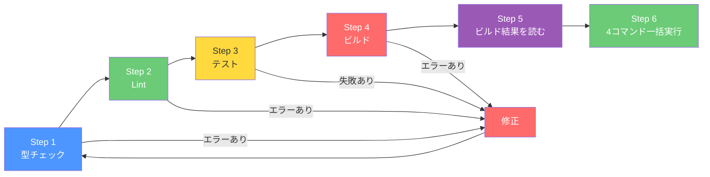

# Day 29: リリース前の総点検をしよう

## 🎯 今日のゴール

**4 つのコマンド**（型チェック → Lint → テスト → ビルド）を
すべてグリーンにして、「このアプリは出荷できる」と
自信を持って言える状態を作ります。

## 🤔 なぜこれを作るのか？

コードを書くだけでは「完成」ではありません。
型エラーやリントエラーが残っていたら、
チームメンバーが混乱し、ユーザーにバグが届きます。
出荷前の最終検品をしましょう。

> 💡 **例え話**: 料理を作った後、盛り付けと
> 味見をしないでお客さんに出す人はいません。
> 今日やるのは「味見と盛り付けの最終チェック」です。

### 📐 全体像



### やること / やらないこと

| やること | やらないこと |
|---------|-------------|
| 型チェックを通す | 新機能の追加 |
| Lint エラーを修正する | テストフレームワークの変更 |
| テストを通す | CI/CD パイプラインの構築 |
| プロダクションビルドを成功させる | デプロイ（Day 30 でやる） |

### 🆕 新しく学ぶ概念

| 概念 | 読み方 | 一言でいうと |
|------|--------|------------|
| `tsc --noEmit` | ティーエスシー ノーエミット | ファイル出力なしで型チェックだけ実行 |
| Biome | バイオーム | Rust 製の高速 Lint + フォーマッター |
| First Load JS | ファーストロードジェーエス | ページ初回表示時の JS サイズ |

## 📊 実装ステップ一覧

| # | やること | 所要時間 |
|---|---------|---------|
| 1 | 型チェック（`npm run type-check`） | 5分 |
| 2 | Lint（`npm run lint`） | 5分 |
| 3 | テスト（`npm test`） | 5分 |
| 4 | ビルド（`npm run build`） | 5分 |
| 5 | ビルド結果を読む | 5分 |
| 6 | 4 コマンド一括実行で最終確認 | 3分 |
| 7 | 品質ゲートの振り返り | 3分 |

**合計**: 約 31 分

---

## Step 1: 型チェック — `npm run type-check`（5分）

🎯 **ゴール**: TypeScript の型エラーが
**ゼロ** であることを確認します。

### 1-1. 実行

```bash
# filepath: ターミナル
npm run type-check
```

このコマンドは内部で `tsc --noEmit` を実行します。
ファイルは出力せず、**型チェックだけ** を行います。

### 1-2. 成功の場合

何も表示されずに終了します。
「何も出ない = エラーゼロ」です。

```text
（何も出力されない）
```

### 1-3. エラーが出た場合

```text
src/app/task/page.tsx:42:5 - error TS2532:
  Object is possibly 'undefined'.
```

| エラー | 原因 | 修正方法 |
|--------|------|---------|
| `Object is possibly 'undefined'` | null チェック不足 | `?.`（Optional Chaining）を追加 |
| `Type 'X' is not assignable to 'Y'` | 型の不一致 | 正しい型に修正 |
| `Property 'x' does not exist` | プロパティ名の間違い | スペルを確認 |

> 💡 エラーメッセージの `src/app/task/page.tsx:42:5`
> は「ファイル名:行番号:列番号」です。
> VS Code でそのファイルを開き、42 行目を確認しましょう。

> 📸 ターミナルで `npm run type-check` を実行し、何も出力されない（エラーゼロ）状態を確認しましょう。

### 1-4. 修正例

```typescript
// filepath: 修正例
// 修正前: Object is possibly 'undefined'
const name = task.assignee.name;

// 修正後: Optional Chaining + デフォルト値
const name = task.assignee?.name ?? '未割当';
```

| 演算子 | 意味 | 例 |
|--------|------|-----|
| `?.` | null/undefined なら短絡して `undefined` を返す | `obj?.prop` |
| `??` | 左が null/undefined の時だけ右の値を返す | `value ?? 'default'` |

> 💡 `??` は `||` と似ていますが、
> `0` や `''`（空文字）を有効な値として扱います。
> `|| 'default'` だと `0` もデフォルトに置き換わるので
> 数値を扱う場面では `??` を使いましょう。

✅ **確認ポイント**:
- `npm run type-check` がエラーなしで完了した

---

## Step 2: Lint — `npm run lint`（5分）

🎯 **ゴール**: Biome のコード品質チェックを
通して、**0 issues** を確認します。

### 2-1. 実行

```bash
# filepath: ターミナル
npm run lint
```

このコマンドは内部で `biome check .` を実行します。

### 2-2. 成功の場合

```text
Checked 121 files in XXXms. No fixes applied.
```

### 2-3. エラーが出た場合

```text
src/app/task/page.tsx:15:7 lint/style/useConst
  This variable is never re-assigned.
  Use 'const' instead of 'let'.
```

### 2-4. 自動修正を試す

多くのエラーは自動修正できます。

```bash
# filepath: ターミナル
npm run lint:fix
```

| コマンド | やること |
|---------|---------|
| `npm run lint` | チェックのみ（ファイル変更なし） |
| `npm run lint:fix` | チェック + 自動修正 |
| `npm run format` | フォーマットのみ自動修正 |

### 2-5. Biome の主要ルール

| ルール | 意味 | 自動修正 |
|--------|------|:------:|
| `useConst` | 再代入がなければ `const` にする | ✅ |
| `noUnusedVariables` | 使っていない変数を削除する | ✅ |
| `noExplicitAny` | `any` 型を使わない | ❌（手動修正） |
| `noConsole` | `console.log` を残さない | ❌（手動削除） |

> 💡 `npm run lint:fix` で自動修正できないエラーは
> 手動で修正が必要です。エラーメッセージの
> ファイル名と行番号を見て、VS Code で開きましょう。

✅ **確認ポイント**:
- `npm run lint` が **No fixes applied**（= 0 エラー）で完了した

---

## Step 3: テスト — `npm test`（5分）

🎯 **ゴール**: 全テストが**パス**（✓）する
ことを確認します。

### 3-1. 実行

```bash
# filepath: ターミナル
npm test
```

このコマンドは内部で `vitest run` を実行します。

### 3-2. 成功の場合

```text
 ✓ src/lib/utils/__test/type-guards.test.ts
 ✓ src/server/api/routers/__test/auth.test.ts
 ✓ src/server/api/routers/__test/task.test.ts
   ...

 Tests  XX passed
 Time   X.XXs
```

### 3-3. 失敗した場合

```text
 × src/server/api/routers/__test/task.test.ts
   FAIL タスクを作成できる
   Error: connect ECONNREFUSED 127.0.0.1:5433
```

> 📸 ターミナルで `npm test` を実行し、全テストに ✓ が付いている状態を確認しましょう。

| エラー | 原因 | 解決方法 |
|--------|------|---------|
| `ECONNREFUSED :5433` | PostgreSQL が起動していない | `docker compose up -d` で起動 |
| `ReferenceError: xx is not defined` | import 忘れ | テストファイルの import を確認 |
| `Expected X but received Y` | 値の不一致 | テストか実装のどちらかが間違い |

> ⚠️ DB 接続が必要なテスト（ルーターテスト）は
> PostgreSQL が起動していないと失敗します。
> Docker を起動してから再実行してください。
>
> DB 不要なテスト（`type-guards.test.ts` や
> Day 28 で作った `math.test.ts`）は
> DB なしでも実行できます。

### 3-4. 特定のテストだけ実行

```bash
# filepath: ターミナル
# ファイル名で絞り込み
npm test -- src/lib/utils/__test/math.test.ts

# キーワードで絞り込み
npm test -- -t "add 関数"
```

✅ **確認ポイント**:
- `npm test` で ✓ マークが表示された

---

## Step 4: ビルド — `npm run build`（5分）

🎯 **ゴール**: プロダクションビルドが
エラーなく完了することを確認します。

### 4-1. 実行

```bash
# filepath: ターミナル
npm run build
```

このコマンドは内部で以下を実行します:

| 処理順 | コマンド | やること |
|:------:|---------|---------|
| 1 | `prisma generate` | DB クライアントを生成 |
| 2 | `next build` | 本番用バンドルを作成 |

### 4-2. 成功の場合

```text
 ✓ Compiled successfully
 ✓ Collecting page data
 ✓ Generating static pages
 ✓ Finalizing page optimization

Route (app)              Size  First Load JS
+ /                     1.2 kB      90.5 kB
+ /dashboard            3.5 kB      95.8 kB
+ /login                2.1 kB      92.4 kB
+ /task                 3.2 kB      95.5 kB
...
```

### 4-3. よくあるビルドエラー

| エラー | 原因 | 解決方法 |
|--------|------|---------|
| `Type error: ...` | 型エラー | Step 1 に戻って `npm run type-check` |
| `Module not found` | import パスの間違い | パスを `@/component/...` 形式に修正 |
| `Prisma Client not generated` | `prisma generate` 未実行 | `npm run db:generate` を実行 |

> 💡 `npm run build` は型チェック → バンドル →
> 最適化を一気に実行します。
> Step 1-3 をパスしていれば、ビルドもほぼ通ります。
> ビルドだけで落ちる場合は、import パスの問題が
> 多いです。

✅ **確認ポイント**:
- `npm run build` が `Compiled successfully` で完了した

---

## Step 5: ビルド結果を読む（5分）

🎯 **ゴール**: ビルド出力の **First Load JS** を
読んで、アプリのサイズ感を把握します。

### 5-1. ビルド出力の見方

```text
Route (app)              Size  First Load JS
+ /                     1.2 kB      90.5 kB
+ /dashboard            3.5 kB      95.8 kB
+ /login                2.1 kB      92.4 kB
+ /report               4.1 kB      96.4 kB
```

| 列 | 意味 |
|----|------|
| Route | ページのパス |
| Size | そのページ固有の JS サイズ |
| First Load JS | 共通 JS + ページ固有 JS の合計 |

### 5-2. サイズの目安

| First Load JS | 評価 | 対応 |
|:------:|------|------|
| 〜100 kB | 良好 | そのままで OK |
| 100〜150 kB | 許容範囲 | 余裕があれば最適化 |
| 150 kB〜 | 要注意 | dynamic import を検討 |

> 💡 First Load JS は「ユーザーがそのページを
> 最初に開いた時にダウンロードする JS の量」です。
> 小さいほどページの表示が速くなります。

### 5-3. サイズが大きい場合の対策

```typescript
// filepath: 対策例
// Recharts のような大きいライブラリは
// dynamic import で遅延読み込みにする
import dynamic from 'next/dynamic';

const Chart = dynamic(
  () => import('@/component/report/chart'),
  { ssr: false }
);
```

| 対策 | 効果 | 適用場面 |
|------|------|---------|
| `dynamic import` | バンドルからライブラリを分離 | グラフ・エディタ・モーダルといった大きいコンポーネント |
| 画像最適化 | 転送量削減 | `next.config.mjs` で設定済み |
| `removeConsole` | console.log を本番から除去 | `next.config.mjs` で設定済み |

> 💡 このアプリの `next.config.mjs` には
> `removeConsole: process.env.NODE_ENV === 'production'`
> が設定されています。本番ビルドでは
> `console.log` が自動的に削除されます。

✅ **確認ポイント**:
- 各ページの First Load JS サイズを確認した
- 150 kB を超えるページがないことを確認した

---

## Step 6: 4 コマンド一括実行で最終確認（3分）

🎯 **ゴール**: 4 つのコマンドを **一気に実行** して、
全部グリーンで通ることを最終確認します。

### 6-1. 一括実行

```bash
# filepath: ターミナル
npm run type-check && npm run lint && npm test && npm run build
```

> 💡 `&&` は「前のコマンドが成功したら次を実行」
> という意味です。途中でエラーが出たら
> そこで止まるので、最後まで通れば全部 OK です。

### 6-2. 結果の確認

| # | コマンド | 期待する結果 |
|---|---------|------------|
| 1 | `npm run type-check` | エラーなし（何も出力されない） |
| 2 | `npm run lint` | `No fixes applied` |
| 3 | `npm test` | `Tests XX passed` |
| 4 | `npm run build` | `Compiled successfully` |

### 6-3. 4 コマンド全グリーン！

4 つ全て通ったら、**リリース準備完了** です！


> 💡 この 4 コマンドはプロの現場でも
> 毎回実行するものです。CI/CD（自動化パイプライン）
> では、PR を出すたびにこの 4 つが自動で走ります。
> 手動で全部通せるようになったあなたは、
> もう「出荷できるコードを書ける人」です。

> 📸 ターミナルで 4 コマンドが全て成功し、最後に `Compiled successfully` と表示されている画面を確認しましょう。

✅ **確認ポイント**:
- 4 コマンドが全てエラーなしで完了した

---

## Step 7: 品質ゲートの振り返り（3分）

🎯 **ゴール**: 4 つのコマンドが何を守っているかを
振り返り、品質ゲートの全体像を理解します。

### 7-1. 4 コマンドの守備範囲

| # | コマンド | 守っているもの | 防ぐバグ |
|---|---------|--------------|---------|
| 1 | `type-check` | 型の整合性 | null エラー、引数ミス |
| 2 | `lint` | コード品質 | `any` 型、未使用変数、`console.log` 残り |
| 3 | `test` | ビジネスロジック | 認証失敗、計算ミス |
| 4 | `build` | デプロイ可能性 | import 漏れ、サーバー/クライアント混在 |

### 7-2. プロの現場では

この 4 コマンドは、実際のプロジェクトでは
**CI/CD パイプライン** で自動実行されます。
PR を出すたびに自動でチェックが走り、
1 つでも失敗するとマージできません。

> 💡 今日手動で実行した 4 コマンドを
> 全部グリーンにできたあなたは、
> CI/CD が自動で走る現場にも対応できます。

✅ **確認ポイント**:
- 4 コマンドそれぞれが何を守っているか説明できる
- CI/CD の仕組みをイメージできた

---

## 📋 今日のまとめ

### 学んだこと

| やったこと | 結果 |
|-----------|------|
| `npm run type-check` | 型エラーゼロを確認 |
| `npm run lint` | Biome で品質チェック、自動修正も学んだ |
| `npm test` | テスト全パス、特定テスト実行も学んだ |
| `npm run build` | プロダクションビルド成功 |
| ビルド結果を読んだ | First Load JS のサイズ感を把握 |
| 4 コマンド一括実行 | `&&` でチェーン実行 |
| 品質ゲートを振り返った | 各コマンドの守備範囲を理解 |

### チェックリスト

- [ ] `npm run type-check` がエラーなしで完了した
- [ ] `npm run lint` が 0 issues で完了した
- [ ] `npm test` で全テストがパスした
- [ ] `npm run build` が `Compiled successfully` で完了した
- [ ] First Load JS のサイズを確認した
- [ ] 4 コマンド一括実行が全てグリーンだった

## ⚠️ つまずきポイント

| 問題 | 原因 | 解決方法 |
|------|------|---------|
| `npm run build` だけ失敗する | import パスが `../` になっている | `@/component/...` 形式に変更 |
| テストだけ失敗する | DB が起動していない | `docker compose up -d` を実行 |
| `lint:fix` で直らないエラーがある | 手動修正が必要なルール | エラーメッセージを読んで手動で修正 |
| 4 コマンドの途中で止まる | `&&` の前のコマンドが失敗 | 失敗したコマンドを単独で実行して原因を特定 |

## 🔜 次回予告

Day 30 では、完成したアプリを **Vercel にデプロイ**
して公開します。30 日間の集大成を
インターネットに公開して、卒業です！
