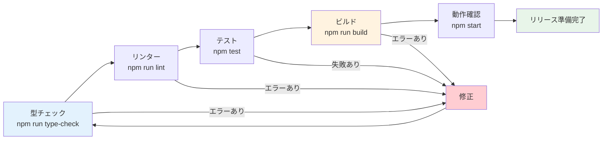

# Day 29: 最終調整・動作確認をしよう

## 🎯 今日のゴール

アプリ全体の型チェック、リンター、ビルドを通し
本番リリースの準備を整えます。パフォーマンス
改善やエラーハンドリングも仕上げます。

【スクリーンショット: npm run build 成功画面】

## 🤔 なぜこれをやるのか？

リリース前の最終チェックは品質を保証する
最後の砦です。

> 💡 **例え話**: 最終調整は「料理の盛り付け」
> です。美味しい料理も盛り付けが雑だと台無しで、
> エラーを放置したまま公開すると不具合が届きます。
> 出荷前検品をしましょう。

### 📐 ビルド検証フロー



### やること / やらないこと

| やること | やらないこと |
|---------|-------------|
| 型チェックのエラー修正 | 機能追加 |
| Biome によるリンター修正 | テストフレームワーク変更 |
| プロダクションビルド | デプロイ（Day 30） |
| エラーバウンダリ実装 | デザインの大幅変更 |

### 🆕 新しく学ぶ概念

| 概念 | 読み方 | 役割 | 例え |
|------|--------|------|------|
| type-check | タイプチェック | 型の整合性検証 | 書類の形式チェック |
| Biome | バイオーム | リンター兼フォーマッター | 文法チェッカー |
| error.tsx | エラーティーエスエックス | エラー表示 UI | 障害案内板 |
| dynamic import | ダイナミックインポート | 遅延読み込み | 必要時に取り寄せ |
| React.memo | リアクトメモ | 再レンダリング防止 | 計算結果のキャッシュ |

## 📊 実装ステップ一覧

| ステップ | 作業内容 | 所要時間 |
|---------|---------|---------|
| Step 1 | 全機能チェックリスト | 10分 |
| Step 2 | 型チェック（type-check） | 5分 |
| Step 3 | リンター（Biome） | 5分 |
| Step 4 | プロダクションビルド | 5分 |
| Step 5 | パフォーマンス改善 | 8分 |
| Step 6 | ローディング・空状態 | 8分 |
| Step 7 | エラーバウンダリ | 8分 |
| Step 8 | ビルド最終確認 | 3分 |
| Step 9 | 振り返り確認 | 3分 |

**合計時間**: 約55分

---

### Step 1: 全機能チェックリスト（10分）

🎯 **ゴール**: アプリの全ページ・全機能を
手動で確認します。

#### ページ一覧と確認項目

| ページ | ルート | 確認する操作 |
|--------|--------|-------------|
| ログイン | /login | メール・パスワードで認証 |
| ユーザー登録 | /register | 新規アカウント作成 |
| ダッシュボード | /dashboard | 統計カード・概要表示 |
| プロジェクト一覧 | /project | 作成・編集・削除 |
| タスク一覧 | /task | 作成・編集・削除・ステータス変更 |
| マイタスク | /my-task | 自分のタスク一覧 |
| レポート | /report | 統計カード・円グラフ |
| 週次レポート | /report/weekly | 週次データ表示 |
| 検索 | /search | キーワード検索 |
| ユーザー管理 | /user | 一覧・ロール変更（管理者） |
| プロフィール | /profile | 情報編集 |
| パスワード変更 | /profile/change-password | パスワード更新 |

#### 操作フローの確認

1. `/register` で新規ユーザー登録
2. `/login` でログイン
3. `/project` でプロジェクト作成
4. `/task` でタスク作成・ステータス変更
5. `/my-task` でマイタスク確認
6. `/report` で統計とグラフ確認
7. `/search` でキーワード検索
8. `/profile` でプロフィール編集
9. ログアウト
10. 再ログインできることを確認

✅ **確認ポイント**:
- 全ページにアクセスできる
- 全操作が正常に動作する

【スクリーンショット: 全ページのアクセス確認】

---

### Step 2: 型チェック（5分）

🎯 **ゴール**: TypeScript の型エラーを
すべて解消します。

💻 **実行**:

```bash
# filepath: ターミナル
npm run type-check
```

#### よくある型エラーと修正方法

| エラー | 原因 | 修正 |
|--------|------|------|
| `Type 'X' is not assignable to 'Y'` | 型の不一致 | 正しい型に修正 |
| `Property 'x' does not exist` | 存在しないプロパティ | プロパティ名を確認 |
| `Object is possibly 'undefined'` | null チェック不足 | `?.` か `if` で分岐 |

> 💡 `npm run type-check` は `tsc --noEmit` を
> 実行します。ファイルは出力せず、
> 型チェックだけを行います。

```typescript
// filepath: src/component/task/task-card.tsx
// 修正例: オプショナルチェーン
// 修正前
const name = task.assignee.name;

// 修正後
const name = task.assignee?.name ?? '未割当';
```

> 💡 `??`（Nullish coalescing）は
> `null` または `undefined` の場合のみ
> デフォルト値を返します。
> `||` と違い、`0` や `''` は通します。

✅ **確認ポイント**:
- `npm run type-check` がエラーなしで完了

---

### Step 3: リンター Biome（5分）

🎯 **ゴール**: Biome でコード品質を
チェックし、問題を修正します。

💻 **実行**:

```bash
# filepath: ターミナル
# チェックのみ
npm run lint

# 自動修正
npm run lint:fix
```

#### Biome の主要ルール

| ルール | 設定 | 意味 |
|--------|------|------|
| noUnusedVariables | error | 未使用変数は禁止 |
| useConst | error | 再代入なしなら const |
| noExplicitAny | warn | any 型は警告 |
| noConsoleLog | warn | console.log は警告 |

> 💡 このプロジェクトでは ESLint / Prettier
> ではなく Biome を使っています。
> `biome.json` にルールが定義されています。

```bash
# filepath: ターミナル
# フォーマットの統一
npm run format
```

> 💡 `lint:fix` で自動修正できるものは
> 自動修正されます。手動修正が必要な
> エラーは出力メッセージを読んで対応します。

✅ **確認ポイント**:
- `npm run lint` がエラーなしで完了

【スクリーンショット: Biome lint 成功画面】

---

### Step 4: プロダクションビルド（5分）

🎯 **ゴール**: 本番用ビルドが
正常に完了することを確認します。

💻 **実行**:

```bash
# filepath: ターミナル
npm run build
```

#### ビルドの処理内容

| 処理 | コマンド | 目的 |
|------|---------|------|
| Prisma 生成 | prisma generate | DB クライアント生成 |
| DB 同期 | prisma db push | スキーマ反映 |
| Next.js ビルド | next build | 本番バンドル作成 |

```bash
# filepath: ターミナル（ビルド成功時の出力例）
# Route (app)             Size  First Load JS
# + /                    1.2 kB      90.5 kB
# + /dashboard           3.5 kB      95.8 kB
# + /login               2.1 kB      92.4 kB
# + /project             2.8 kB      93.1 kB
# + /task                3.2 kB      95.5 kB
# + /report              4.1 kB      96.4 kB
```

> 💡 First Load JS が大きすぎるページは
> パフォーマンス改善の候補です。
> 100kB を超えるページは Step 5 で対策します。

✅ **確認ポイント**:
- `npm run build` がエラーなしで完了

---

### Step 5: パフォーマンス改善（8分）

🎯 **ゴール**: React.memo と dynamic import で
パフォーマンスを改善します。

💻 **React.memo の適用**:

```typescript
// filepath: src/component/task/task-card.tsx
import { memo } from 'react';
import { Card } from '@/component/ui/card';

interface TaskCardProps {
  id: string;
  title: string;
  status: string;
  priority: string;
  onClick: (id: string) => void;
}

export const TaskCard = memo(
  function TaskCard(props: TaskCardProps) {
    return (
      <Card>
        <p>{props.title}</p>
      </Card>
    );
  }
);
```

> 💡 `React.memo` は props が変わらない限り
> 再レンダリングをスキップします。
> リスト内のカードなど、頻繁に親が
> 再レンダリングされるコンポーネントに有効です。

💻 **dynamic import の適用**:

```typescript
// filepath: src/app/report/page.tsx
import dynamic from 'next/dynamic';
import { Loader2 } from 'lucide-react';

const RechartsSection = dynamic(
  () => import(
    '@/component/report/recharts-section'
  ).then((mod) => mod.RechartsSection),
  {
    loading: () => (
      <Loader2
        className="h-8 w-8 animate-spin" />
    ),
  }
);
```

> 💡 `dynamic` は Next.js のコード分割機能です。
> Recharts のような大きなライブラリは
> 必要になった時点で読み込むことで、
> 初回表示を高速化できます。

#### パフォーマンス対策一覧

| 手法 | 効果 | 適用箇所 |
|------|------|---------|
| React.memo | 不要な再レンダリング防止 | カード・リスト項目 |
| dynamic import | バンドルサイズ削減 | グラフ・大型コンポーネント |
| 画像最適化 | 転送量削減 | next.config.mjs で設定済み |

✅ **確認ポイント**:
- ページの初回表示が速くなった

---

### Step 6: ローディング・空状態（8分）

🎯 **ゴール**: データ取得中と
データがない場合の UI を整えます。

💻 **ローディング表示**:

```typescript
// filepath: src/app/task/page.tsx
import { Loader2 } from 'lucide-react';

export default function TaskPage() {
  const { data, isLoading }
    = api.task.getAll.useQuery();

  if (isLoading) {
    return (
      <div className="flex flex-col
        items-center justify-center
        min-h-[50vh] gap-4">
        <Loader2
          className="h-12 w-12
          animate-spin text-primary" />
```

ローディング UI を閉じた後、データが取得できた場合のレンダリング部分です。

```typescript
// filepath: src/app/task/page.tsx（続き）
        <p className="text-muted-foreground">
          タスクを読み込み中...
        </p>
      </div>
    );
  }

  return <div>{/* タスク一覧 */}</div>;
}
```

💻 **空状態の表示**:

```typescript
// filepath: src/app/task/page.tsx
if (!data || data.length === 0) {
  return (
    <div className="text-center py-16">
      <p className="text-lg
        text-muted-foreground mb-4">
        タスクがまだありません
      </p>
      <p className="text-sm
        text-muted-foreground">
        プロジェクトからタスクを
        作成してみましょう
      </p>
    </div>
  );
}
```

#### 状態別 UI パターン

| 状態 | 表示内容 |
|------|---------|
| 読み込み中 | スピナー + メッセージ |
| データなし | 案内メッセージ + 行動提案 |
| エラー発生 | エラーメッセージ + 再試行ボタン |
| データあり | 通常のコンテンツ表示 |

> 💡 すべてのデータ取得箇所で
> ローディング・空状態・エラーの3状態を
> 処理することが大切です。
> ユーザーに「何が起きているか」を伝えます。

✅ **確認ポイント**:
- ローディング中にスピナーが表示される
- データがない場合にメッセージが表示される

【スクリーンショット: ローディングと空状態の表示】

---

### Step 7: エラーバウンダリ（8分）

🎯 **ゴール**: Next.js の `error.tsx` で
予期しないエラーをキャッチします。

💻 **エラーバウンダリの実装**:

```typescript
// filepath: src/app/error.tsx
'use client';

import { useEffect } from 'react';
import { Button } from '@/component/ui/button';
import {
  Alert, AlertDescription, AlertTitle,
} from '@/component/ui/alert';
import { AlertCircle } from 'lucide-react';

export default function Error({
  error,
  reset,
}: {
  error: Error;
  reset: () => void;
}) {
  useEffect(() => {
    console.error('エラー発生:', error);
  }, [error]);
```

コンポーネントの return 部分では、エラーメッセージと再試行ボタンを表示します。

```typescript
// filepath: src/app/error.tsx（続き）
  return (
    <div className="flex items-center
      justify-center min-h-[50vh] p-6">
      <div className="max-w-md w-full">
        <Alert variant="destructive">
          <AlertCircle className="h-4 w-4" />
          <AlertTitle>
            エラーが発生しました
          </AlertTitle>
          <AlertDescription>
            {error.message}
          </AlertDescription>
        </Alert>
        <Button
          onClick={reset}
          className="mt-4 w-full">
          再試行
        </Button>
      </div>
    </div>
  );
}
```

> 💡 `error.tsx` は Next.js App Router の
> エラーバウンダリです。子コンポーネントで
> 発生した未処理のエラーをキャッチし、
> フォールバック UI を表示します。

> 💡 `reset` 関数を呼ぶと、エラーが発生した
> コンポーネントの再レンダリングを試みます。
> 一時的なネットワークエラーなら
> 再試行で復旧できることがあります。

#### error.tsx の配置と範囲

| 配置場所 | 影響範囲 |
|---------|---------|
| src/app/error.tsx | アプリ全体 |
| src/app/task/error.tsx | /task 以下のみ |
| src/app/project/error.tsx | /project 以下のみ |

✅ **確認ポイント**:
- エラー発生時にフォールバック UI が表示
- 再試行ボタンが機能する

【スクリーンショット: エラーバウンダリの表示】

---

### Step 8: ビルド最終確認（3分）

🎯 **ゴール**: すべてのチェックを通して
リリース準備完了を確認します。

💻 **最終確認コマンド**:

```bash
# filepath: ターミナル
# 1. 型チェック
npm run type-check

# 2. リンター
npm run lint

# 3. テスト
npm test -- --run

# 4. ビルド
npm run build
```

#### リリース前チェックリスト

| チェック項目 | コマンド | 期待結果 |
|-------------|---------|---------|
| 型エラーなし | npm run type-check | 0 errors |
| リンターエラーなし | npm run lint | No errors |
| テスト全パス | npm test -- --run | All passed |
| ビルド成功 | npm run build | Compiled successfully |
| 全ページアクセス可 | npm start | 正常表示 |

> 💡 この4つのコマンドがすべてエラーなしで
> 完了すれば、リリース準備は完了です。
> Day 30 でデプロイに進みましょう。

✅ **確認ポイント**:
- 4つのコマンドがすべて成功した

---

### Step 9: 振り返り確認（3分）

🎯 **ゴール**: 今日の作業を振り返ります。

1. 全ページの動作を手動確認した
2. 型チェックをパスした
3. Biome リンターをパスした
4. プロダクションビルドが成功した
5. パフォーマンス改善を適用した
6. ローディング・空状態の UI を整えた
7. エラーバウンダリを実装した

✅ **確認ポイント**:
- 7項目すべてが完了している

---

## 📋 今日のまとめ

- [ ] 全ページの動作を確認した
- [ ] `npm run type-check` がパスした
- [ ] `npm run lint` がパスした
- [ ] `npm run build` が成功した
- [ ] React.memo / dynamic import を適用した
- [ ] ローディング・空状態の UI を整えた
- [ ] error.tsx を実装した

## ⚠️ つまずきポイント

| エラー / 問題 | 原因 | 解決方法 |
|--------------|------|---------|
| ビルドで型エラー | dev では出ないエラー | `npm run type-check` で事前確認 |
| Biome で大量エラー | フォーマット未統一 | `npm run lint:fix` で自動修正 |
| dynamic import で SSR エラー | クライアント専用コンポーネント | `ssr: false` オプションを追加 |
| error.tsx が動かない | `'use client'` 忘れ | ファイル先頭に追加 |

## 📝 今日学んだ用語

| 用語 | 意味 |
|------|------|
| type-check | TypeScript の型検証コマンド |
| Biome | Rust 製の高速リンター・フォーマッター |
| error.tsx | Next.js のエラーバウンダリファイル |
| React.memo | props 不変時の再レンダリングスキップ |
| dynamic import | コンポーネントの遅延読み込み |
| First Load JS | ページ初回表示時の JS サイズ |

## 🔗 次回予告

Day 30 では、完成したアプリを Vercel に
デプロイして公開します。30日間の集大成を
インターネットに公開して、卒業です。
