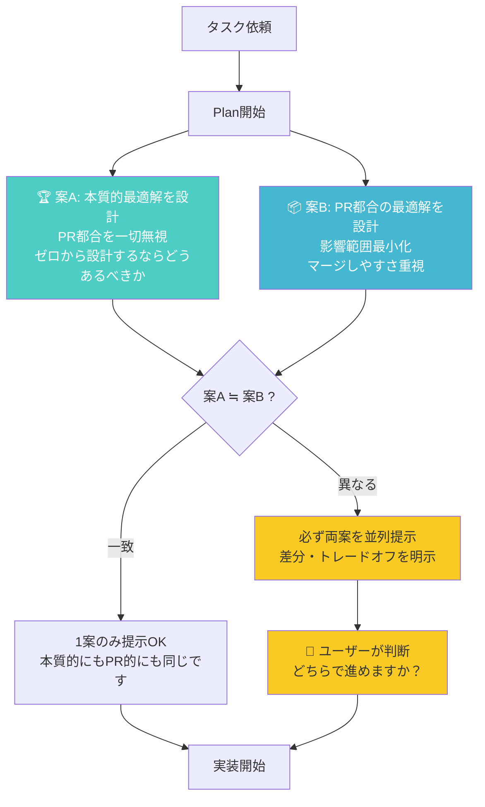
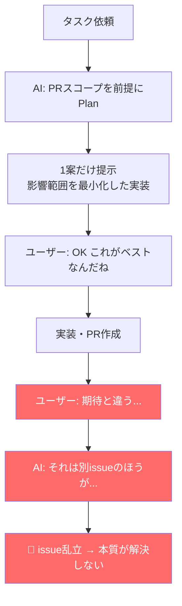

# プランニング時の二軸提案（必須）

## フロー図



### ❌ 現状の問題パターン



---

## 原則

**Plan・設計フェーズで実装方針を提示する際、以下の2つの軸で必ず検討し、ユーザーに判断を仰ぐこと。**

AIが暗黙にPRスコープや影響範囲の最小化を前提として案を1つだけ出すことは**禁止**。

---

## 2つの軸

### 軸A: 本質的最適解（Ideal Solution）

**「PR・影響範囲・レビュー負荷・マージ容易性を一切考慮せず、ゼロから設計するとしたらどうあるべきか？」**

- 技術的に最も正しいアーキテクチャ
- 将来のメンテナンス性を最大化
- 根本原因を完全に解決
- 「別issueで対応」が一切不要な設計

### 軸B: PR都合の最適解（Pragmatic Solution）

**「現実のPR運用（スコープ、レビュー負荷、マージ容易性、既存構造との整合性）を考慮した最善策は何か？」**

- 影響範囲を最小化
- 既存構造をできるだけ維持
- 小さなPRでマージしやすい
- ただし「残りは別issueで」が発生しうる

---

## 提示フォーマット

```
## プラン提案

### 🏆 案A: 本質的最適解
- 方針: （具体的な設計・実装方法）
- 影響範囲: （ファイル数、変更規模）
- メリット: （根本解決、将来の保守性等）
- デメリット: （PR巨大、レビュー負荷等）

### 📦 案B: PR都合の最適解
- 方針: （具体的な設計・実装方法）
- 影響範囲: （ファイル数、変更規模）
- メリット: （小さいPR、すぐマージ可能等）
- デメリット: （残課題、別issue必要等）

### ⚖️ トレードオフ
- 案Aと案Bの差分の本質: （何を犠牲にして何を得るか）
- 案Aを選ぶ場合のPR分割案: （大きければ分割戦略を提示）

→ **どちらで進めますか？**
```

---

## ルール

1. **AIが勝手に案Bを選ばない** — 「PRが大きくなるから」「影響範囲が広いから」という理由でAIが暗黙に案Bだけを提示することは禁止
2. **案A = 案B の場合は1案でOK** — 本質的最適解とPR都合の最適解が一致する場合、「本質的にもPR的にも同じ実装が最適です」と明示して1案のみ提示してよい
3. **「別issueで」は案Bの代償** — 案Bを選んだ結果として「残りは別issueで」が発生する場合、Plan段階でそれを明示すること。実装後に初めて「別issueのほうが」と言い出すのは禁止
4. **案Aが選ばれたらPR分割を提案** — 案Aの影響範囲が大きい場合、PR分割戦略もセットで提案する。「案Aは大きすぎるから案B」ではなく「案AをN個のPRに分割」が正解
5. **ユーザーの判断を必ず仰ぐ** — 案を提示したら、実装に着手する前に必ずユーザーの選択を待つ。勝手に進めない

---

## 禁止パターン

- ❌ 「PRのスコープを考慮して、以下の実装方針で進めます」（案B前提で勝手に進める）
- ❌ 「この部分は別issueで対応したほうがいいです」（Plan段階で言わず、実装後に言い出す）
- ❌ 「影響範囲が大きいので最小限の修正にとどめます」（本質的最適解を検討すらしない）
- ❌ 1案だけ提示してユーザーに判断の余地を与えない

## 推奨パターン

- ✅ 「本質的にはAですが、PR都合を考えるとBもあります。どちらで進めますか？」
- ✅ 「案Aと案Bは同じ実装になります。PRスコープ内で本質解決できます」
- ✅ 「案Aを選ぶ場合、3つのPRに分割できます：①型定義 ②ミドルウェア ③エンドポイント移行」
